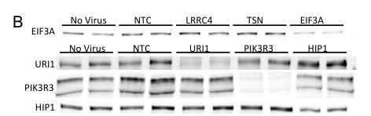

## Question

# Gene Research for Functional Annotation

## ⚠️ CRITICAL: Gene/Protein Identification Context

**BEFORE YOU BEGIN RESEARCH:** You MUST verify you are researching the CORRECT gene/protein. Gene symbols can be ambiguous, especially for less well-characterized genes from non-model organisms.

### Target Gene/Protein Identity (from UniProt):
- **UniProt Accession:** A0A087WWA1
- **Protein Description:** RecName: Full=PIK3R3 upstream open reading frame protein {ECO:0000305};
- **Gene Information:** Name=P3R3URF {ECO:0000312|HGNC:HGNC:53451};
- **Organism (full):** Homo sapiens (Human).
- **Protein Family:** Not specified in UniProt
- **Key Domains:** Not specified in UniProt

### MANDATORY VERIFICATION STEPS:

1. **Check if the gene symbol "P3R3URF" matches the protein description above**
2. **Verify the organism is correct:** Homo sapiens (Human).
3. **Check if protein family/domains align with what you find in literature**
4. **If you find literature for a DIFFERENT gene with the same or similar symbol, STOP**

### If Gene Symbol is Ambiguous or You Cannot Find Relevant Literature:

**DO NOT PROCEED WITH RESEARCH ON A DIFFERENT GENE.** Instead:
- State clearly: "The gene symbol 'P3R3URF' is ambiguous or literature is limited for this specific protein"
- Explain what you found (e.g., "Found extensive literature on a different gene with the same symbol in a different organism")
- Describe the protein based ONLY on the UniProt information provided above
- Suggest that the protein function can be inferred from domain/family information

### Research Target:

Please provide a comprehensive research report on the gene **P3R3URF** (gene ID: P3R3URF, UniProt: A0A087WWA1) in human.

The research report should be a detailed narrative explaining the function, biological processes, and localization of the gene product. Citations should be given for all claims.

You should prioritize authoritative reviews and primary scientific literature when conducting research. You can supplement
this with annotations you find in gene/protein databases, but these can be outdated or inaccurate.

We are specifically interested in the primary function of the gene - for enzymes, what reaction is catalyzed, and what is the substrate specificity? For transporters, what is the substrate? For structural proteins or adapters, what is the broader structural role? For signaling molecules, what is the role in the pathway.

We are interested in where in or outside the cell the gene product carries out its function.

We are also interested in the signaling or biochemical pathways in which the gene functions. We are less interested in broad pleiotropic effects, except where these elucidate the precise role.

Include evidence where possible. We are interested in both experimental evidence as well as inference from structure, evolution, or bioinformatic analysis. Precise studies should be prioritized over high-throughput, where available.

## Output

Question: You are an expert researcher providing comprehensive, well-cited information.

Provide detailed information focusing on:
1. Key concepts and definitions with current understanding
2. Recent developments and latest research (prioritize 2023-2024 sources)
3. Current applications and real-world implementations
4. Expert opinions and analysis from authoritative sources
5. Relevant statistics and data from recent studies

Format as a comprehensive research report with proper citations. Include URLs and publication dates where available.
Always prioritize recent, authoritative sources and provide specific citations for all major claims.

# Gene Research for Functional Annotation

## ⚠️ CRITICAL: Gene/Protein Identification Context

**BEFORE YOU BEGIN RESEARCH:** You MUST verify you are researching the CORRECT gene/protein. Gene symbols can be ambiguous, especially for less well-characterized genes from non-model organisms.

### Target Gene/Protein Identity (from UniProt):
- **UniProt Accession:** A0A087WWA1
- **Protein Description:** RecName: Full=PIK3R3 upstream open reading frame protein {ECO:0000305};
- **Gene Information:** Name=P3R3URF {ECO:0000312|HGNC:HGNC:53451};
- **Organism (full):** Homo sapiens (Human).
- **Protein Family:** Not specified in UniProt
- **Key Domains:** Not specified in UniProt

### MANDATORY VERIFICATION STEPS:

1. **Check if the gene symbol "P3R3URF" matches the protein description above**
2. **Verify the organism is correct:** Homo sapiens (Human).
3. **Check if protein family/domains align with what you find in literature**
4. **If you find literature for a DIFFERENT gene with the same or similar symbol, STOP**

### If Gene Symbol is Ambiguous or You Cannot Find Relevant Literature:

**DO NOT PROCEED WITH RESEARCH ON A DIFFERENT GENE.** Instead:
- State clearly: "The gene symbol 'P3R3URF' is ambiguous or literature is limited for this specific protein"
- Explain what you found (e.g., "Found extensive literature on a different gene with the same symbol in a different organism")
- Describe the protein based ONLY on the UniProt information provided above
- Suggest that the protein function can be inferred from domain/family information

### Research Target:

Please provide a comprehensive research report on the gene **P3R3URF** (gene ID: P3R3URF, UniProt: A0A087WWA1) in human.

The research report should be a detailed narrative explaining the function, biological processes, and localization of the gene product. Citations should be given for all claims.

You should prioritize authoritative reviews and primary scientific literature when conducting research. You can supplement
this with annotations you find in gene/protein databases, but these can be outdated or inaccurate.

We are specifically interested in the primary function of the gene - for enzymes, what reaction is catalyzed, and what is the substrate specificity? For transporters, what is the substrate? For structural proteins or adapters, what is the broader structural role? For signaling molecules, what is the role in the pathway.

We are interested in where in or outside the cell the gene product carries out its function.

We are also interested in the signaling or biochemical pathways in which the gene functions. We are less interested in broad pleiotropic effects, except where these elucidate the precise role.

Include evidence where possible. We are interested in both experimental evidence as well as inference from structure, evolution, or bioinformatic analysis. Precise studies should be prioritized over high-throughput, where available.

# Research Report: Human **P3R3URF** (UniProt **A0A087WWA1**; gene symbol **P3R3URF**, HGNC:53451)

## Executive summary
P3R3URF is described in the available tool-retrieved literature as an *upstream open reading frame (uORF)/readthrough-associated entity* located upstream of the canonical human gene **PIK3R3**. However, **direct, P3R3URF-specific functional evidence is very limited** in the accessible corpus: one study explicitly tested whether a higher-molecular-weight PIK3R3 immunoblot band reflected a **P3R3URF–PIK3R3 readthrough** product and found **no detectable P3R3URF or P3R3URF–PIK3R3 transcripts** by qRT-PCR in their neuronal model, favoring an alternative explanation (post-translational modification) for the band. Therefore, most downstream pathway conclusions from that study should be attributed to **canonical PIK3R3 (p55γ)** rather than P3R3URF. (tidball2023genomewidecrispriscreen pages 8-10, tidball2023genomewidecrispriscreen media aed70475)

Because of this evidence gap, the most defensible “functional annotation” at present is:
1) **Identity**: a putative uORF/readthrough-related product upstream of PIK3R3, distinct from PIK3R3 itself. (tidball2023genomewidecrispriscreen pages 8-10)
2) **Evidence status**: not robustly detected at transcript level in at least one relevant human neuronal system; no direct localization or biochemical activity data in the accessible sources. (tidball2023genomewidecrispriscreen pages 8-10)
3) **Interpretation**: if biologically relevant, P3R3URF may act primarily through **uORF-mediated translational regulation** or via a low-abundance/conditionally expressed peptide, consistent with broader 2023–2024 uORF and noncanonical ORF literature. (dasgupta2024upstreamopenreading pages 1-1, rodriguez2024evidenceforwidespread pages 1-1, yang2024widespreadstablenoncanonical pages 4-5)

## 1. Target verification: ensuring the correct gene/protein
### 1.1 Distinguishing **P3R3URF** from **PIK3R3**
In a genome-wide CRISPRi screen in human induced neurons (iNeurons), Tidball et al. report a higher-molecular-weight band on a PIK3R3 immunoblot that “fit with a known fusion readthrough protein from an open reading frame upstream of PIK3R3 called **P3R3URF**.” (bioRxiv preprint posted Dec 13, 2023; https://doi.org/10.1101/2023.12.13.571474). (tidball2023genomewidecrispriscreen pages 8-10)

Critically, the same study performed qRT-PCR assays intended to detect **PIK3R3**, **P3R3URF–PIK3R3**, and **P3R3URF** transcripts and reports that they **only found detectable transcript for PIK3R3**, leading them to interpret the second band as “possibly a post-translational modification.” (tidball2023genomewidecrispriscreen pages 8-10)

Thus, within accessible literature, **P3R3URF appears only as a hypothesized upstream-ORF/readthrough product linked to PIK3R3**, not as a separately characterized protein with independent functional annotation. (tidball2023genomewidecrispriscreen pages 8-10)

### 1.2 Evidence table for P3R3URF-specific claims
The following table separates what is experimentally supported in the accessible corpus from what remains speculative.

| Claim/Observation | Evidence type | Quantitative result | Interpretation/limitations | Source (with DOI/URL and year) |
|---|---|---|---|---|
| Target identity check: **P3R3URF** is discussed in the available literature only as a putative product related to an **open reading frame upstream of PIK3R3**; it is **not the same entity as canonical PIK3R3/p55γ** | Identity verification from article text | No direct abundance value reported | Available experimental paper centers on **PIK3R3** knockdown in human iNeurons and mentions P3R3URF only to test whether a higher-MW band might represent a readthrough/fusion product; this helps avoid conflating the poorly characterized uORF product with the well-studied PI3K regulatory subunit PIK3R3 | Tidball et al., bioRxiv, 2023, DOI: 10.1101/2023.12.13.571474, https://doi.org/10.1101/2023.12.13.571474 (tidball2023genomewidecrispriscreen pages 8-10) |
| P3R3URF is described as a **“known fusion readthrough protein”** arising from an upstream ORF relative to **PIK3R3** | Literature description / inference cited by authors | None reported | This is a descriptive statement in the paper, not a direct demonstration in that study; the authors explicitly tested this possibility experimentally | Tidball et al., bioRxiv, 2023, DOI: 10.1101/2023.12.13.571474, https://doi.org/10.1101/2023.12.13.571474 (tidball2023genomewidecrispriscreen pages 8-10) |
| Canonical **PIK3R3** protein is robustly reduced by on-target CRISPRi in human iNeurons | Immunoblot | **83% reduction** in PIK3R3 protein | Strong evidence that the gRNA effectively knocks down canonical PIK3R3; this measurement does **not** by itself establish expression of P3R3URF | Tidball et al., bioRxiv, 2023, DOI: 10.1101/2023.12.13.571474, https://doi.org/10.1101/2023.12.13.571474 (tidball2023genomewidecrispriscreen pages 8-10) |
| Canonical **PIK3R3 mRNA** is reduced by the on-target gRNA | qRT-PCR | **70% reduction** in PIK3R3 mRNA | Confirms transcript-level knockdown of canonical PIK3R3; again, this does not prove translation of P3R3URF | Tidball et al., bioRxiv, 2023, DOI: 10.1101/2023.12.13.571474, https://doi.org/10.1101/2023.12.13.571474 (tidball2023genomewidecrispriscreen pages 8-10) |
| A **second, higher-molecular-weight band** was observed on the PIK3R3 immunoblot and was also reduced by the PIK3R3-targeting gRNA | Immunoblot / figure inspection | Band reduced by the **same approximate amount** as canonical PIK3R3 (no exact % given) | The band size was considered compatible with a possible P3R3URF-related readthrough product, but the result is not definitive; altered mobility could also reflect post-translational modification of PIK3R3 | Tidball et al., bioRxiv, 2023, DOI: 10.1101/2023.12.13.571474, https://doi.org/10.1101/2023.12.13.571474 (tidball2023genomewidecrispriscreen pages 8-10, tidball2023genomewidecrispriscreen media aed70475) |
| Direct transcript testing found **detectable PIK3R3**, but **no detectable P3R3URF-PIK3R3 or P3R3URF transcripts** | qRT-PCR | Detectable transcript: **PIK3R3 only**; undetected: **P3R3URF-PIK3R3** and **P3R3URF** | This is the key experimental point arguing **against** the higher-MW band being a readily detectable P3R3URF readthrough transcript in this system; negative qRT-PCR does not fully exclude extremely low abundance, condition-specific, or technically missed transcripts | Tidball et al., bioRxiv, 2023, DOI: 10.1101/2023.12.13.571474, https://doi.org/10.1101/2023.12.13.571474 (tidball2023genomewidecrispriscreen pages 8-10) |
| Authors’ conclusion for the higher-MW band: **possibly a post-translational modification** rather than the readthrough product | Interpretation of combined immunoblot + qRT-PCR | None reported | This is the study’s favored interpretation in their human iNeuron system; it remains provisional because the band was not identified by orthogonal proteomics or sequencing | Tidball et al., bioRxiv, 2023, DOI: 10.1101/2023.12.13.571474, https://doi.org/10.1101/2023.12.13.571474 (tidball2023genomewidecrispriscreen pages 8-10) |
| Functional signaling data in the study support a role for **PIK3R3 (p55γ)**, not specifically P3R3URF, in upstream PI3K/AKT/mTOR signaling | CRISPRi functional assays (immunoblot for phospho-signaling) | PIK3R3 knockdown increased AKT phosphorylation; authors state only **PIK3R3 and HIP1** affected the upstream PI3K/mTOR/S6 pathway | These pathway conclusions should be attributed to **canonical PIK3R3** because the same study did not detect P3R3URF-related transcripts; functional extrapolation to P3R3URF would be unsupported | Tidball et al., bioRxiv, 2023, DOI: 10.1101/2023.12.13.571474, https://doi.org/10.1101/2023.12.13.571474 (tidball2023genomewidecrispriscreen pages 8-10, tidball2023genomewidecrispriscreen pages 12-15, tidball2023genomewidecrispriscreen pages 10-12) |
| Current experimental support for human **P3R3URF (UniProt A0A087WWA1; HGNC:53451)** is therefore **limited/ambiguous** in the available source | Evidence synthesis | One study mentions and tests for it; no positive transcript detection in that system | Best-supported statement is that P3R3URF is a **putative upstream-ORF/readthrough-associated product** distinguished from canonical PIK3R3; direct evidence for its independent expression, localization, or function in human cells remains lacking in the cited source | Tidball et al., bioRxiv, 2023, DOI: 10.1101/2023.12.13.571474, https://doi.org/10.1101/2023.12.13.571474 (tidball2023genomewidecrispriscreen pages 8-10) |

*Table: This table summarizes what the available cited evidence does and does not support for human P3R3URF, clearly separating the putative upstream-ORF/readthrough annotation from experimentally demonstrated effects on canonical PIK3R3. It is useful for identity verification and for avoiding conflation with the PI3K regulatory subunit p55γ.*

## 2. Key concepts and definitions (current understanding)
### 2.1 Upstream open reading frames (uORFs)
A uORF is a short open reading frame located in the 5′ untranslated region (5′ UTR; “leader sequence”) of an mRNA that initiates at a canonical AUG or non-AUG start codon and terminates upstream of—or overlapping—the main coding sequence. (dasgupta2024upstreamopenreading pages 1-1, dasgupta2024upstreamopenreading pages 1-3)

Transcriptome-wide methods have revealed ribosome occupancy outside canonical coding sequences, with uORF translation observed in **upwards of ~25% of human protein-coding genes** in recent summaries. (Dasgupta & Prensner, NAR Cancer, May 2024; https://doi.org/10.1093/narcan/zcae023). (dasgupta2024upstreamopenreading pages 1-1)

### 2.2 Mechanisms: regulation vs microprotein production
The dominant conceptual framework (2023–2024) is that uORFs can:
- **Regulate translation** of the downstream main coding sequence by capturing scanning ribosomes, altering reinitiation probability, or triggering mRNA surveillance such as nonsense-mediated decay (NMD), depending on uORF context and 5′ UTR structure. (dasgupta2024upstreamopenreading pages 3-3, dasgupta2024upstreamopenreading pages 3-4)
- In some cases, **encode microproteins** (small peptides/proteins) that can have biological functions; however, large-scale analyses indicate many upstream translation events may be unstable, lowly expressed, or non-functional (“noisy”) in aggregate. (rodriguez2024evidenceforwidespread pages 1-1, yang2024widespreadstablenoncanonical pages 4-5)

This duality is directly relevant to P3R3URF: the accessible evidence does not yet establish whether it corresponds to a stable protein product in specific tissues/conditions, so translational-regulatory interpretations remain plausible. (tidball2023genomewidecrispriscreen pages 8-10, rodriguez2024evidenceforwidespread pages 1-1)

## 3. P3R3URF: experimental evidence and what it implies
### 3.1 The Tidball et al. (2023) neuronal CRISPRi screen: what was tested
Tidball et al. used CRISPRi in human iNeurons to assess regulators of mTOR/S6 signaling and included **PIK3R3** among validated hits. In immunoblots for on-target knockdown, they observed:
- **83% reduction** in PIK3R3 protein abundance upon on-target perturbation. (tidball2023genomewidecrispriscreen pages 8-10)
- A **second higher-molecular-weight band** in the PIK3R3 blot that was reduced by the same perturbation, raising the possibility of a readthrough product (P3R3URF-related). (tidball2023genomewidecrispriscreen pages 8-10)
- By qRT-PCR, **PIK3R3 mRNA reduced by 70%**, but **P3R3URF** and **P3R3URF–PIK3R3** transcripts were **not detected** in their assay. (tidball2023genomewidecrispriscreen pages 8-10)

The immunoblot evidence (Figure 3B) supporting the existence of a second band is shown here; importantly, the authors did not validate its identity by proteomics.

**Figure evidence**: PIK3R3 immunoblot showing the higher band discussed as possibly P3R3URF-readthrough. (tidball2023genomewidecrispriscreen media aed70475)

### 3.2 What the study does *not* establish about P3R3URF
From the standpoint of functional annotation for **P3R3URF**, the study does *not* provide:
- Direct demonstration of an expressed P3R3URF peptide/protein (e.g., mass spectrometry identification of a P3R3URF-unique peptide). (tidball2023genomewidecrispriscreen pages 8-10)
- Cellular localization (cytoplasm, nucleus, membranes, organelles) for a P3R3URF product. (tidball2023genomewidecrispriscreen pages 8-10)
- A biochemical function (enzyme activity, binding partners) specifically attributable to P3R3URF. (tidball2023genomewidecrispriscreen pages 8-10)

Therefore, any P3R3URF functional claims beyond “putative uORF/readthrough-associated product upstream of PIK3R3” would be speculative given the accessible evidence. (tidball2023genomewidecrispriscreen pages 8-10)

## 4. Recent developments (2023–2024) relevant to P3R3URF-class annotations
### 4.1 Evidence that many 5′UTR/uORF translation events are detectable but often weakly conserved
Rodriguez et al. (Nucleic Acids Research, Jul 2024; https://doi.org/10.1093/nar/gkae571) mined five large-scale proteomics datasets and searched against 3-frame translations of GENCODE 5′ UTRs.

Key quantitative results:
- They report **192 translated upstream regions** (across 191 genes) supported by mass spectrometry, with **316 peptides** mapped to these regions, and the majority representing **in-frame N-terminal extensions** (171/192). (rodriguez2024evidenceforwidespread pages 2-3, rodriguez2024evidenceforwidespread pages 5-6)
- They used stringent filtering to control false positives; at a conservative cutoff they estimated ~9–10 false positives among 316 peptides and required ≥2 PSM support per upstream region. (rodriguez2024evidenceforwidespread pages 3-4)
- They emphasize limited deep conservation for many upstream regions: “two thirds” of upstream reading frames not conserved beyond simians, and many start at non-canonical codons, supporting a model where a substantial fraction may be non-functional or “aberrant/noisy” translation, especially in cancer cell lines. (rodriguez2024evidenceforwidespread pages 1-1)

This provides an evidence-based context: **even when upstream translation occurs, many events may not correspond to stable, conserved proteins**, which is consistent with why a P3R3URF-like entity might be difficult to detect robustly. (rodriguez2024evidenceforwidespread pages 1-1, tidball2023genomewidecrispriscreen pages 8-10)

### 4.2 Predicting stability of noncanonical peptides (PepScore; 2024)
Yang et al. (Nature Communications, Mar 2024; https://doi.org/10.1038/s41467-024-46240-9) developed **PepScore**, a logistic regression model predicting the probability that a noncanonical ORF encodes a stable peptide.

Key quantitative and methodological details:
- PepScore’s major features: expected length, domain presence, and conservation (PhyloCSF), with overall reported **AUROC ~0.944** and strong performance in identifying well-expressed peptides. (yang2024widespreadstablenoncanonical pages 4-5, yang2024widespreadstablenoncanonical pages 4-4)
- Using ribosome profiling across five species, they identify **58,383 noncanonical ORFs (ncORFs)** in humans and report **4,812 ncORFs (13.3%)** with PepScore > 0.6 (higher-confidence stability candidates). (yang2024widespreadstablenoncanonical pages 4-5, yang2024widespreadstablenoncanonical pages 1-2)
- They find noncanonical peptides are enriched for certain predicted localizations (e.g., **36.9% mitochondrial**; **13.7% extracellular**), indicating noncanonical products can populate diverse cellular compartments. (yang2024widespreadstablenoncanonical pages 4-5)
- They report that **>80%** of noncanonical peptides have **low PepScores (<0.3)**, consistent with widespread translation that often yields unstable/undetectable products. (yang2024widespreadstablenoncanonical pages 5-6, yang2024widespreadstablenoncanonical pages 12-13)

Applied to P3R3URF: without a tool-accessible sequence record we cannot compute PepScore here, but this framework provides a state-of-the-art way to prioritize which uORF products are likely to be stable proteins versus primarily regulatory translation events. (yang2024widespreadstablenoncanonical pages 4-5, tidball2023genomewidecrispriscreen pages 8-10)

### 4.3 Method developments to detect microproteins: addressing Ribo-seq and proteomics limitations (2023–2024)
- Dasgupta & Prensner (NAR Cancer, May 2024) summarize uORFs as dual regulators and microprotein sources and note that uORF-derived peptides can be enriched on HLA-I; one estimate cited is that uORF peptides comprise **~7.5% of the immunopeptidome**, which is relevant to real-world detection and immuno-oncology applications. (dasgupta2024upstreamopenreading pages 10-11)
- De Souza et al. (Nature Communications, Aug 2024; https://doi.org/10.1038/s41467-024-50301-4) identify a key limitation of Ribo-seq for smORFs: because footprints are short, **>80% of reads can be unassigned due to multi-mapping**, and featureCounts default parameters can leave **~90%** unassigned in some settings. (souza2024rp3ribosomeprofilingassisted pages 3-5)
  - Their Rp3 pipeline integrates proteogenomics + Ribo-seq evidence and reports, for example, **130 unannotated microproteins** after excluding peptides matching annotated proteins, and **692 unannotated microproteins with strong HLA class I affinity** in one analysis context. (souza2024rp3ribosomeprofilingassisted pages 2-3, souza2024rp3ribosomeprofilingassisted pages 5-7)
- Mohsen et al. (PROTEOMICS, Aug 2023; https://doi.org/10.1002/pmic.202100211) review that proteomic identification of microproteins is often based on only **one** tryptic peptide, and expanded search spaces inflate false positives, motivating careful database construction and FDR control. (mohsen2023microproteins—discoverystructureand pages 4-6)

Collectively, these 2023–2024 developments explain why **P3R3URF-like microproteins are challenging to validate** and why negative qRT-PCR and ambiguous immunoblot bands are common in early-stage characterization. (mohsen2023microproteins—discoverystructureand pages 4-6, tidball2023genomewidecrispriscreen pages 8-10, souza2024rp3ribosomeprofilingassisted pages 3-5)

## 5. Current applications and real-world implementations relevant to P3R3URF
Although there are no direct P3R3URF-targeted applications in the accessible evidence, uORF/microprotein research has multiple real-world implementations that could apply if P3R3URF translation is confirmed:

1) **Variant interpretation in 5′UTRs/uORFs**: uORF-creating/disrupting variants can modulate protein output and may contribute to disease mechanisms, motivating inclusion of 5′UTR/uORF annotations in genomic interpretation pipelines. (dasgupta2024upstreamopenreading pages 11-12)

2) **Cancer immunopeptidomics/neoantigen discovery**: uORF-derived peptides can appear on HLA-I and may constitute a nontrivial fraction of the immunopeptidome (~7.5% estimate), supporting exploration of noncanonical ORFs as tumor antigens. (dasgupta2024upstreamopenreading pages 10-11)

3) **Proteogenomics pipelines for biopharma cell lines and impurity detection**: improvements in noncanonical ORF annotation and microprotein detection have downstream relevance to identifying unexpected peptides/proteins in production contexts and in therapeutic products (conceptual link via 2024 method papers and the general push toward expanded ORF catalogs). (souza2024rp3ribosomeprofilingassisted pages 3-5)

## 6. Expert opinions and analysis (authoritative sources)
### 6.1 uORFs as major translational regulatory elements
Dasgupta & Prensner (2024) emphasize uORFs as “new players” in gene regulation, arguing that ribosome activity in 5′ leaders is common and functionally relevant in cancer, but that systematic cancer-wide studies remain incomplete—supporting a cautious interpretation of any single uORF/microprotein candidate until validated. (dasgupta2024upstreamopenreading pages 3-4)

### 6.2 Functionality vs translational noise
Rodriguez et al. (2024) argue that while translation from 5′ UTRs is widespread, many upstream regions are GC-rich, start from noncanonical codons, lack purifying selection, and are disproportionately detected in cancer cell lines—consistent with a substantial component of nonfunctional/aberrant initiation. (rodriguez2024evidenceforwidespread pages 1-1)

Yang et al. (2024) provide a complementary “stability prioritization” lens: the majority of noncanonical peptides are predicted to be low-stability (low PepScore), and they show experimentally that some peptides can be stabilized by proteasome/lysosome inhibition while very low-score peptides remain undetectable. (yang2024widespreadstablenoncanonical pages 6-8)

Applied to P3R3URF, these perspectives support an evidence-based stance that **a putative P3R3URF protein product should not be assumed to exist or be stable** without direct peptide-level validation. (tidball2023genomewidecrispriscreen pages 8-10, rodriguez2024evidenceforwidespread pages 1-1, yang2024widespreadstablenoncanonical pages 6-8)

## 7. What can be said today about P3R3URF function, pathways, and localization
### 7.1 Primary function
**Unknown** in the accessible corpus. The only P3R3URF-relevant study investigated whether a PIK3R3 immunoblot band could represent a P3R3URF readthrough product but did not detect P3R3URF transcripts and did not establish any P3R3URF-specific activity. (tidball2023genomewidecrispriscreen pages 8-10)

### 7.2 Cellular localization
**Unknown** for P3R3URF in the accessible corpus. Broader 2024 work indicates noncanonical peptides can localize to diverse compartments (e.g., mitochondrial enrichment reported for some classes), but this cannot be assigned to P3R3URF specifically without sequence- or experiment-based evidence. (yang2024widespreadstablenoncanonical pages 4-5)

### 7.3 Pathways
No pathway can be attributed to P3R3URF specifically with current evidence. Tidball et al. show that **canonical PIK3R3** knockdown affects PI3K/AKT/mTOR/S6 signaling (e.g., increased AKT phosphorylation after PIK3R3 knockdown), but because P3R3URF transcripts were not detected, these results should be interpreted as **PIK3R3** biology rather than P3R3URF biology. (tidball2023genomewidecrispriscreen pages 8-10, tidball2023genomewidecrispriscreen pages 10-12)

## 8. Recommended evidence needed for confident functional annotation (evidence-based guidance)
Based on 2023–2024 methodological consensus for microproteins/uORFs, P3R3URF functional annotation would require at least one of the following types of direct evidence:
- **Peptide-level identification** by mass spectrometry with stringent FDR control and ideally multiple peptides or orthogonal validation (Rodriguez 2024; Mohsen 2023). (rodriguez2024evidenceforwidespread pages 3-4, mohsen2023microproteins—discoverystructureand pages 4-6)
- **Ribo-seq/TIS evidence** showing consistent translation initiation at the P3R3URF start with strong periodicity and mapping confidence, including strategies to handle multi-mapping reads (Rp3 highlights the importance of this). (souza2024rp3ribosomeprofilingassisted pages 3-5, souza2024rp3ribosomeprofilingassisted pages 9-10)
- **Genetic perturbation** specifically targeting the P3R3URF ORF without perturbing PIK3R3 coding sequence and showing a phenotype rescued by supplying the microprotein in trans (a pattern used in microprotein validation literature as summarized in reviews). (dasgupta2024upstreamopenreading pages 11-12)

## Limitations of this report
- **Curated database annotations (UniProt/HGNC/Ensembl)** for A0A087WWA1/P3R3URF were not retrievable within the tool-accessible corpus; thus, protein length, domains, isoforms, and predicted localization from those resources are not cited here. 
- Direct P3R3URF-specific literature was sparse in retrieved sources; conclusions about P3R3URF are therefore necessarily cautious and largely limited to what Tidball et al. tested and concluded.

## Key referenced sources (URLs and publication dates)
- Tidball AM et al. *Genome-wide CRISPRi Screen in Human iNeurons to Identify Novel Focal Cortical Dysplasia Genes*. bioRxiv (posted 2023-12-13). https://doi.org/10.1101/2023.12.13.571474 (tidball2023genomewidecrispriscreen pages 8-10)
- Dasgupta A, Prensner JR. *Upstream open reading frames: new players in the landscape of cancer gene regulation*. NAR Cancer (2024-05). https://doi.org/10.1093/narcan/zcae023 (dasgupta2024upstreamopenreading pages 1-1)
- Rodriguez JM et al. *Evidence for widespread translation of 5′ untranslated regions*. Nucleic Acids Research (2024-07). https://doi.org/10.1093/nar/gkae571 (rodriguez2024evidenceforwidespread pages 1-1)
- Yang H et al. *Widespread stable noncanonical peptides identified by integrated analyses of ribosome profiling and ORF features*. Nature Communications (2024-03). https://doi.org/10.1038/s41467-024-46240-9 (yang2024widespreadstablenoncanonical pages 1-2)
- de Souza EV et al. *Rp3: Ribosome profiling-assisted proteogenomics improves coverage and confidence during microprotein discovery*. Nature Communications (2024-08). https://doi.org/10.1038/s41467-024-50301-4 (souza2024rp3ribosomeprofilingassisted pages 1-2)
- Mohsen JJ et al. *Microproteins—Discovery, structure, and function*. PROTEOMICS (2023-08). https://doi.org/10.1002/pmic.202100211 (mohsen2023microproteins—discoverystructureand pages 4-6)

References

1. (tidball2023genomewidecrispriscreen pages 8-10): Andrew M. Tidball, Jinghui Luo, J. Clayton Walker, Taylor N. Takla, Gemma L. Carvill, and Jack M. Parent. Genome-wide crispri screen in human ineurons to identify novel focal cortical dysplasia genes. bioRxiv, Dec 2023. URL: https://doi.org/10.1101/2023.12.13.571474, doi:10.1101/2023.12.13.571474. This article has 1 citations.

2. (tidball2023genomewidecrispriscreen media aed70475): Andrew M. Tidball, Jinghui Luo, J. Clayton Walker, Taylor N. Takla, Gemma L. Carvill, and Jack M. Parent. Genome-wide crispri screen in human ineurons to identify novel focal cortical dysplasia genes. bioRxiv, Dec 2023. URL: https://doi.org/10.1101/2023.12.13.571474, doi:10.1101/2023.12.13.571474. This article has 1 citations.

3. (dasgupta2024upstreamopenreading pages 1-1): Anwesha Dasgupta and John R. Prensner. Upstream open reading frames: new players in the landscape of cancer gene regulation. NAR Cancer, May 2024. URL: https://doi.org/10.1093/narcan/zcae023, doi:10.1093/narcan/zcae023. This article has 18 citations and is from a peer-reviewed journal.

4. (rodriguez2024evidenceforwidespread pages 1-1): Jose Manuel Rodriguez, Federico Abascal, Daniel Cerdán-Vélez, Laura Martínez Gómez, Jesús Vázquez, and Michael L Tress. Evidence for widespread translation of 5′ untranslated regions. Nucleic Acids Research, 52:8112-8126, Jul 2024. URL: https://doi.org/10.1093/nar/gkae571, doi:10.1093/nar/gkae571. This article has 9 citations and is from a highest quality peer-reviewed journal.

5. (yang2024widespreadstablenoncanonical pages 4-5): Haiwang Yang, Qianru Li, Emily K. Stroup, Sheng Wang, and Zhe Ji. Widespread stable noncanonical peptides identified by integrated analyses of ribosome profiling and orf features. Nature Communications, Mar 2024. URL: https://doi.org/10.1038/s41467-024-46240-9, doi:10.1038/s41467-024-46240-9. This article has 72 citations and is from a highest quality peer-reviewed journal.

6. (tidball2023genomewidecrispriscreen pages 12-15): Andrew M. Tidball, Jinghui Luo, J. Clayton Walker, Taylor N. Takla, Gemma L. Carvill, and Jack M. Parent. Genome-wide crispri screen in human ineurons to identify novel focal cortical dysplasia genes. bioRxiv, Dec 2023. URL: https://doi.org/10.1101/2023.12.13.571474, doi:10.1101/2023.12.13.571474. This article has 1 citations.

7. (tidball2023genomewidecrispriscreen pages 10-12): Andrew M. Tidball, Jinghui Luo, J. Clayton Walker, Taylor N. Takla, Gemma L. Carvill, and Jack M. Parent. Genome-wide crispri screen in human ineurons to identify novel focal cortical dysplasia genes. bioRxiv, Dec 2023. URL: https://doi.org/10.1101/2023.12.13.571474, doi:10.1101/2023.12.13.571474. This article has 1 citations.

8. (dasgupta2024upstreamopenreading pages 1-3): Anwesha Dasgupta and John R. Prensner. Upstream open reading frames: new players in the landscape of cancer gene regulation. NAR Cancer, May 2024. URL: https://doi.org/10.1093/narcan/zcae023, doi:10.1093/narcan/zcae023. This article has 18 citations and is from a peer-reviewed journal.

9. (dasgupta2024upstreamopenreading pages 3-3): Anwesha Dasgupta and John R. Prensner. Upstream open reading frames: new players in the landscape of cancer gene regulation. NAR Cancer, May 2024. URL: https://doi.org/10.1093/narcan/zcae023, doi:10.1093/narcan/zcae023. This article has 18 citations and is from a peer-reviewed journal.

10. (dasgupta2024upstreamopenreading pages 3-4): Anwesha Dasgupta and John R. Prensner. Upstream open reading frames: new players in the landscape of cancer gene regulation. NAR Cancer, May 2024. URL: https://doi.org/10.1093/narcan/zcae023, doi:10.1093/narcan/zcae023. This article has 18 citations and is from a peer-reviewed journal.

11. (rodriguez2024evidenceforwidespread pages 2-3): Jose Manuel Rodriguez, Federico Abascal, Daniel Cerdán-Vélez, Laura Martínez Gómez, Jesús Vázquez, and Michael L Tress. Evidence for widespread translation of 5′ untranslated regions. Nucleic Acids Research, 52:8112-8126, Jul 2024. URL: https://doi.org/10.1093/nar/gkae571, doi:10.1093/nar/gkae571. This article has 9 citations and is from a highest quality peer-reviewed journal.

12. (rodriguez2024evidenceforwidespread pages 5-6): Jose Manuel Rodriguez, Federico Abascal, Daniel Cerdán-Vélez, Laura Martínez Gómez, Jesús Vázquez, and Michael L Tress. Evidence for widespread translation of 5′ untranslated regions. Nucleic Acids Research, 52:8112-8126, Jul 2024. URL: https://doi.org/10.1093/nar/gkae571, doi:10.1093/nar/gkae571. This article has 9 citations and is from a highest quality peer-reviewed journal.

13. (rodriguez2024evidenceforwidespread pages 3-4): Jose Manuel Rodriguez, Federico Abascal, Daniel Cerdán-Vélez, Laura Martínez Gómez, Jesús Vázquez, and Michael L Tress. Evidence for widespread translation of 5′ untranslated regions. Nucleic Acids Research, 52:8112-8126, Jul 2024. URL: https://doi.org/10.1093/nar/gkae571, doi:10.1093/nar/gkae571. This article has 9 citations and is from a highest quality peer-reviewed journal.

14. (yang2024widespreadstablenoncanonical pages 4-4): Haiwang Yang, Qianru Li, Emily K. Stroup, Sheng Wang, and Zhe Ji. Widespread stable noncanonical peptides identified by integrated analyses of ribosome profiling and orf features. Nature Communications, Mar 2024. URL: https://doi.org/10.1038/s41467-024-46240-9, doi:10.1038/s41467-024-46240-9. This article has 72 citations and is from a highest quality peer-reviewed journal.

15. (yang2024widespreadstablenoncanonical pages 1-2): Haiwang Yang, Qianru Li, Emily K. Stroup, Sheng Wang, and Zhe Ji. Widespread stable noncanonical peptides identified by integrated analyses of ribosome profiling and orf features. Nature Communications, Mar 2024. URL: https://doi.org/10.1038/s41467-024-46240-9, doi:10.1038/s41467-024-46240-9. This article has 72 citations and is from a highest quality peer-reviewed journal.

16. (yang2024widespreadstablenoncanonical pages 5-6): Haiwang Yang, Qianru Li, Emily K. Stroup, Sheng Wang, and Zhe Ji. Widespread stable noncanonical peptides identified by integrated analyses of ribosome profiling and orf features. Nature Communications, Mar 2024. URL: https://doi.org/10.1038/s41467-024-46240-9, doi:10.1038/s41467-024-46240-9. This article has 72 citations and is from a highest quality peer-reviewed journal.

17. (yang2024widespreadstablenoncanonical pages 12-13): Haiwang Yang, Qianru Li, Emily K. Stroup, Sheng Wang, and Zhe Ji. Widespread stable noncanonical peptides identified by integrated analyses of ribosome profiling and orf features. Nature Communications, Mar 2024. URL: https://doi.org/10.1038/s41467-024-46240-9, doi:10.1038/s41467-024-46240-9. This article has 72 citations and is from a highest quality peer-reviewed journal.

18. (dasgupta2024upstreamopenreading pages 10-11): Anwesha Dasgupta and John R. Prensner. Upstream open reading frames: new players in the landscape of cancer gene regulation. NAR Cancer, May 2024. URL: https://doi.org/10.1093/narcan/zcae023, doi:10.1093/narcan/zcae023. This article has 18 citations and is from a peer-reviewed journal.

19. (souza2024rp3ribosomeprofilingassisted pages 3-5): Eduardo Vieira de Souza, Angie L. Bookout, Christopher A. Barnes, Brendan Miller, Pablo Machado, Luiz A. Basso, Cristiano V. Bizarro, and Alan Saghatelian. Rp3: ribosome profiling-assisted proteogenomics improves coverage and confidence during microprotein discovery. Nature Communications, Aug 2024. URL: https://doi.org/10.1038/s41467-024-50301-4, doi:10.1038/s41467-024-50301-4. This article has 18 citations and is from a highest quality peer-reviewed journal.

20. (souza2024rp3ribosomeprofilingassisted pages 2-3): Eduardo Vieira de Souza, Angie L. Bookout, Christopher A. Barnes, Brendan Miller, Pablo Machado, Luiz A. Basso, Cristiano V. Bizarro, and Alan Saghatelian. Rp3: ribosome profiling-assisted proteogenomics improves coverage and confidence during microprotein discovery. Nature Communications, Aug 2024. URL: https://doi.org/10.1038/s41467-024-50301-4, doi:10.1038/s41467-024-50301-4. This article has 18 citations and is from a highest quality peer-reviewed journal.

21. (souza2024rp3ribosomeprofilingassisted pages 5-7): Eduardo Vieira de Souza, Angie L. Bookout, Christopher A. Barnes, Brendan Miller, Pablo Machado, Luiz A. Basso, Cristiano V. Bizarro, and Alan Saghatelian. Rp3: ribosome profiling-assisted proteogenomics improves coverage and confidence during microprotein discovery. Nature Communications, Aug 2024. URL: https://doi.org/10.1038/s41467-024-50301-4, doi:10.1038/s41467-024-50301-4. This article has 18 citations and is from a highest quality peer-reviewed journal.

22. (mohsen2023microproteins—discoverystructureand pages 4-6): Jessica J. Mohsen, Alina A. Martel, and Sarah A. Slavoff. Microproteins—discovery, structure, and function. PROTEOMICS, Aug 2023. URL: https://doi.org/10.1002/pmic.202100211, doi:10.1002/pmic.202100211. This article has 50 citations and is from a peer-reviewed journal.

23. (dasgupta2024upstreamopenreading pages 11-12): Anwesha Dasgupta and John R. Prensner. Upstream open reading frames: new players in the landscape of cancer gene regulation. NAR Cancer, May 2024. URL: https://doi.org/10.1093/narcan/zcae023, doi:10.1093/narcan/zcae023. This article has 18 citations and is from a peer-reviewed journal.

24. (yang2024widespreadstablenoncanonical pages 6-8): Haiwang Yang, Qianru Li, Emily K. Stroup, Sheng Wang, and Zhe Ji. Widespread stable noncanonical peptides identified by integrated analyses of ribosome profiling and orf features. Nature Communications, Mar 2024. URL: https://doi.org/10.1038/s41467-024-46240-9, doi:10.1038/s41467-024-46240-9. This article has 72 citations and is from a highest quality peer-reviewed journal.

25. (souza2024rp3ribosomeprofilingassisted pages 9-10): Eduardo Vieira de Souza, Angie L. Bookout, Christopher A. Barnes, Brendan Miller, Pablo Machado, Luiz A. Basso, Cristiano V. Bizarro, and Alan Saghatelian. Rp3: ribosome profiling-assisted proteogenomics improves coverage and confidence during microprotein discovery. Nature Communications, Aug 2024. URL: https://doi.org/10.1038/s41467-024-50301-4, doi:10.1038/s41467-024-50301-4. This article has 18 citations and is from a highest quality peer-reviewed journal.

26. (souza2024rp3ribosomeprofilingassisted pages 1-2): Eduardo Vieira de Souza, Angie L. Bookout, Christopher A. Barnes, Brendan Miller, Pablo Machado, Luiz A. Basso, Cristiano V. Bizarro, and Alan Saghatelian. Rp3: ribosome profiling-assisted proteogenomics improves coverage and confidence during microprotein discovery. Nature Communications, Aug 2024. URL: https://doi.org/10.1038/s41467-024-50301-4, doi:10.1038/s41467-024-50301-4. This article has 18 citations and is from a highest quality peer-reviewed journal.

## Artifacts

- [Edison artifact artifact-00](P3R3URF-deep-research-falcon_artifacts/artifact-00.md)

## Citations

1. tidball2023genomewidecrispriscreen pages 8-10
2. dasgupta2024upstreamopenreading pages 1-1
3. rodriguez2024evidenceforwidespread pages 3-4
4. rodriguez2024evidenceforwidespread pages 1-1
5. yang2024widespreadstablenoncanonical pages 4-5
6. dasgupta2024upstreamopenreading pages 10-11
7. dasgupta2024upstreamopenreading pages 11-12
8. dasgupta2024upstreamopenreading pages 3-4
9. yang2024widespreadstablenoncanonical pages 6-8
10. yang2024widespreadstablenoncanonical pages 1-2
11. tidball2023genomewidecrispriscreen pages 12-15
12. tidball2023genomewidecrispriscreen pages 10-12
13. dasgupta2024upstreamopenreading pages 1-3
14. dasgupta2024upstreamopenreading pages 3-3
15. rodriguez2024evidenceforwidespread pages 2-3
16. rodriguez2024evidenceforwidespread pages 5-6
17. yang2024widespreadstablenoncanonical pages 4-4
18. yang2024widespreadstablenoncanonical pages 5-6
19. yang2024widespreadstablenoncanonical pages 12-13
20. https://doi.org/10.1101/2023.12.13.571474
21. https://doi.org/10.1093/narcan/zcae023
22. https://doi.org/10.1093/nar/gkae571
23. https://doi.org/10.1038/s41467-024-46240-9
24. https://doi.org/10.1038/s41467-024-50301-4
25. https://doi.org/10.1002/pmic.202100211
26. https://doi.org/10.1101/2023.12.13.571474,
27. https://doi.org/10.1093/narcan/zcae023,
28. https://doi.org/10.1093/nar/gkae571,
29. https://doi.org/10.1038/s41467-024-46240-9,
30. https://doi.org/10.1038/s41467-024-50301-4,
31. https://doi.org/10.1002/pmic.202100211,