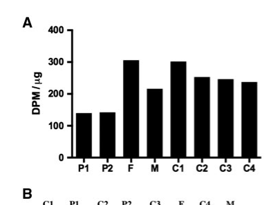

## Question

# Gene Research for Functional Annotation

## ⚠️ CRITICAL: Gene/Protein Identification Context

**BEFORE YOU BEGIN RESEARCH:** You MUST verify you are researching the CORRECT gene/protein. Gene symbols can be ambiguous, especially for less well-characterized genes from non-model organisms.

### Target Gene/Protein Identity (from UniProt):
- **UniProt Accession:** P13674
- **Protein Description:** RecName: Full=Prolyl 4-hydroxylase subunit alpha-1; Short=4-PH alpha-1; EC=1.14.11.2 {ECO:0000269|PubMed:9211872}; AltName: Full=Procollagen-proline,2-oxoglutarate-4-dioxygenase subunit alpha-1; Flags: Precursor;
- **Gene Information:** Name=P4HA1; Synonyms=P4HA;
- **Organism (full):** Homo sapiens (Human).
- **Protein Family:** Belongs to the P4HA family. .
- **Key Domains:** Oxoglu/Fe-dep_dioxygenase_dom. (IPR005123); P4H_N. (IPR013547); P4HA-like. (IPR045054); Pro_4_hyd_alph. (IPR006620); Pro_4_hyd_alph_FE2OG_OXY. (IPR044862)

### MANDATORY VERIFICATION STEPS:

1. **Check if the gene symbol "P4HA1" matches the protein description above**
2. **Verify the organism is correct:** Homo sapiens (Human).
3. **Check if protein family/domains align with what you find in literature**
4. **If you find literature for a DIFFERENT gene with the same or similar symbol, STOP**

### If Gene Symbol is Ambiguous or You Cannot Find Relevant Literature:

**DO NOT PROCEED WITH RESEARCH ON A DIFFERENT GENE.** Instead:
- State clearly: "The gene symbol 'P4HA1' is ambiguous or literature is limited for this specific protein"
- Explain what you found (e.g., "Found extensive literature on a different gene with the same symbol in a different organism")
- Describe the protein based ONLY on the UniProt information provided above
- Suggest that the protein function can be inferred from domain/family information

### Research Target:

Please provide a comprehensive research report on the gene **P4HA1** (gene ID: P4HA1, UniProt: P13674) in human.

The research report should be a detailed narrative explaining the function, biological processes, and localization of the gene product. Citations should be given for all claims.

You should prioritize authoritative reviews and primary scientific literature when conducting research. You can supplement
this with annotations you find in gene/protein databases, but these can be outdated or inaccurate.

We are specifically interested in the primary function of the gene - for enzymes, what reaction is catalyzed, and what is the substrate specificity? For transporters, what is the substrate? For structural proteins or adapters, what is the broader structural role? For signaling molecules, what is the role in the pathway.

We are interested in where in or outside the cell the gene product carries out its function.

We are also interested in the signaling or biochemical pathways in which the gene functions. We are less interested in broad pleiotropic effects, except where these elucidate the precise role.

Include evidence where possible. We are interested in both experimental evidence as well as inference from structure, evolution, or bioinformatic analysis. Precise studies should be prioritized over high-throughput, where available.

## Output

Question: You are an expert researcher providing comprehensive, well-cited information.

Provide detailed information focusing on:
1. Key concepts and definitions with current understanding
2. Recent developments and latest research (prioritize 2023-2024 sources)
3. Current applications and real-world implementations
4. Expert opinions and analysis from authoritative sources
5. Relevant statistics and data from recent studies

Format as a comprehensive research report with proper citations. Include URLs and publication dates where available.
Always prioritize recent, authoritative sources and provide specific citations for all major claims.

# Gene Research for Functional Annotation

## ⚠️ CRITICAL: Gene/Protein Identification Context

**BEFORE YOU BEGIN RESEARCH:** You MUST verify you are researching the CORRECT gene/protein. Gene symbols can be ambiguous, especially for less well-characterized genes from non-model organisms.

### Target Gene/Protein Identity (from UniProt):
- **UniProt Accession:** P13674
- **Protein Description:** RecName: Full=Prolyl 4-hydroxylase subunit alpha-1; Short=4-PH alpha-1; EC=1.14.11.2 {ECO:0000269|PubMed:9211872}; AltName: Full=Procollagen-proline,2-oxoglutarate-4-dioxygenase subunit alpha-1; Flags: Precursor;
- **Gene Information:** Name=P4HA1; Synonyms=P4HA;
- **Organism (full):** Homo sapiens (Human).
- **Protein Family:** Belongs to the P4HA family. .
- **Key Domains:** Oxoglu/Fe-dep_dioxygenase_dom. (IPR005123); P4H_N. (IPR013547); P4HA-like. (IPR045054); Pro_4_hyd_alph. (IPR006620); Pro_4_hyd_alph_FE2OG_OXY. (IPR044862)

### MANDATORY VERIFICATION STEPS:

1. **Check if the gene symbol "P4HA1" matches the protein description above**
2. **Verify the organism is correct:** Homo sapiens (Human).
3. **Check if protein family/domains align with what you find in literature**
4. **If you find literature for a DIFFERENT gene with the same or similar symbol, STOP**

### If Gene Symbol is Ambiguous or You Cannot Find Relevant Literature:

**DO NOT PROCEED WITH RESEARCH ON A DIFFERENT GENE.** Instead:
- State clearly: "The gene symbol 'P4HA1' is ambiguous or literature is limited for this specific protein"
- Explain what you found (e.g., "Found extensive literature on a different gene with the same symbol in a different organism")
- Describe the protein based ONLY on the UniProt information provided above
- Suggest that the protein function can be inferred from domain/family information

### Research Target:

Please provide a comprehensive research report on the gene **P4HA1** (gene ID: P4HA1, UniProt: P13674) in human.

The research report should be a detailed narrative explaining the function, biological processes, and localization of the gene product. Citations should be given for all claims.

You should prioritize authoritative reviews and primary scientific literature when conducting research. You can supplement
this with annotations you find in gene/protein databases, but these can be outdated or inaccurate.

We are specifically interested in the primary function of the gene - for enzymes, what reaction is catalyzed, and what is the substrate specificity? For transporters, what is the substrate? For structural proteins or adapters, what is the broader structural role? For signaling molecules, what is the role in the pathway.

We are interested in where in or outside the cell the gene product carries out its function.

We are also interested in the signaling or biochemical pathways in which the gene functions. We are less interested in broad pleiotropic effects, except where these elucidate the precise role.

Include evidence where possible. We are interested in both experimental evidence as well as inference from structure, evolution, or bioinformatic analysis. Precise studies should be prioritized over high-throughput, where available.

## Research report: Functional annotation of human **P4HA1** (UniProt **P13674**)

### Executive summary
**P4HA1** encodes **prolyl 4-hydroxylase subunit alpha-1**, the predominant catalytic α subunit of **collagen prolyl 4-hydroxylase (C‑P4H)**, an **ER-lumen** 2‑oxoglutarate/Fe(II)-dependent dioxygenase that hydroxylates specific **peptidyl prolines** (especially within collagen **Gly‑X‑Y / X‑Pro‑Gly** contexts) to yield **4‑hydroxyproline (4Hyp)**, a modification required for stable collagen triple-helix formation and efficient secretion. The active enzyme is an **α2β2 heterotetramer**; β subunits are **P4HB/protein disulfide isomerase (PDI)**, which also contributes to ER retention and folding functions. Recent (2023–2024) work strengthens the view that P4HA1 links **metabolism (α‑KG availability), hypoxia/HIF programs, and extracellular matrix (ECM) remodeling** in cancer and fibro-inflammatory remodeling, making it a biomarker and emerging therapeutic target, while also implying **off-target liabilities** for clinically used **HIF‑PHD inhibitors** that may inhibit collagen P4H activity. (duatti2023lactateinducedcol1a1ddr1axis pages 32-35, mezentsev2024acomprehensivereview pages 15-16, mezentsev2024acomprehensivereview pages 16-18, zou2017p4ha1mutationscause pages 1-2, ippolito2024lactatesupportscellautonomous pages 1-2, bhute2020mannosebindinglectin pages 1-5, yang2024p4ha1animportant pages 4-5)

| Annotation category | Summary for human P4HA1 (UniProt P13674) | Supporting citations |
|---|---|---|
| Gene/protein identity | **P4HA1** encodes **prolyl 4-hydroxylase subunit alpha-1**, the predominant catalytic α(I) subunit of the main collagen prolyl 4-hydroxylase isoenzyme (**C-P4H-I**) in most tissues; it belongs to the collagen/prolyl 4-hydroxylase family. | (zou2017p4ha1mutationscause pages 1-2, zou2017p4ha1mutationscause pages 2-4) |
| Enzyme class & reaction | A **2-oxoglutarate/Fe(II)-dependent dioxygenase** that catalyzes **4-hydroxylation of peptidyl proline** to form **4-hydroxyproline**, especially in collagen/procollagen, a modification required for collagen triple-helix formation and stability. | (duatti2023lactateinducedcol1a1ddr1axis pages 32-35, zou2017p4ha1mutationscause pages 1-2, bhute2020mannosebindinglectin pages 1-5) |
| Required cofactors/co-substrates & products | Catalysis requires **Fe2+**, **molecular oxygen**, **2-oxoglutarate/α-ketoglutarate**, and **ascorbate** to maintain the reduced iron state; the reaction yields hydroxylated substrate plus **succinate** and **CO2**. | (duatti2023lactateinducedcol1a1ddr1axis pages 32-35, mezentsev2024acomprehensivereview pages 16-18, ippolito2024lactatesupportscellautonomous pages 1-2, bhute2020mannosebindinglectin pages 1-5) |
| Substrate specificity | Canonical substrates are proline residues in collagen **Gly-X-Y / X-Pro-Gly** contexts, especially motifs undergoing prolyl 4-hydroxylation during procollagen maturation. Reported non-collagen/collagen-like examples include **mannose-binding lectin (MBL)** and additional **X-Pro-Gly-containing proteins** such as elastins, prion protein, conotoxins, and **AGO2**. | (mezentsev2024acomprehensivereview pages 15-16, mezentsev2024acomprehensivereview pages 16-18, zou2017p4ha1mutationscause pages 8-9, bhute2020mannosebindinglectin pages 1-5) |
| Complex composition | Active collagen prolyl 4-hydroxylase is an **α2β2 tetramer**. P4HA1 provides the catalytic α subunit, whereas the β subunit is **P4HB/protein disulfide isomerase (PDI)**, which contributes disulfide-isomerase activity, supports complex assembly, and helps retain the enzyme in the ER. | (duatti2023lactateinducedcol1a1ddr1axis pages 32-35, mezentsev2024acomprehensivereview pages 15-16, zou2017p4ha1mutationscause pages 1-2) |
| Subcellular localization | The active enzyme functions in the **lumen of the endoplasmic reticulum (ER)** as part of the early secretory pathway for collagen biosynthesis and maturation. | (duatti2023lactateinducedcol1a1ddr1axis pages 32-35, mezentsev2024acomprehensivereview pages 15-16, zou2017p4ha1mutationscause pages 1-2) |
| Key phenotypes from human genetics | **Biallelic P4HA1 mutations** cause a **congenital connective-tissue disorder** affecting tendon, bone, muscle, and eye; patient fibroblasts show **reduced C-P4H activity**, **reduced proline hydroxylation**, and **decreased collagen thermal stability**. Mouse loss of P4ha1 is embryonic lethal with impaired collagen IV assembly, supporting essential function. | (zou2017p4ha1mutationscause pages 1-2, zou2017p4ha1mutationscause pages 8-9, zou2017p4ha1mutationscause pages 2-4, zou2017p4ha1mutationscause media a5748d20) |
| 2023-2024 mechanistic findings | Recent studies/reviews link P4HA1 to **hypoxia/HIF signaling**, tumor ECM remodeling, and metastasis. Reported mechanisms include **HIF-associated upregulation**, **lactate-fueled α-KG supply** that increases P4HA1-dependent collagen hydroxylation in prostate cancer, roles in **EMT/invasion**, links to **chemoresistance/stemness** in some cancers, and a **fibro-inflammatory IL-10/JAK2/STAT3/HIF1α/TMEM45A/P4HA1 axis** in pleural remodeling. | (ippolito2024lactatesupportscellautonomous pages 1-2, yang2024p4ha1animportant pages 4-5, yang2024p4ha1animportant pages 2-4, xu2024collagenprolyl4hydroxylase pages 1-2, yang2024p4ha1animportant pages 11-11) |
| Translational applications | P4HA1 is being explored as a **biomarker** of aggressive/hypoxic tumors and fibrosis-related remodeling. Preclinical targeting strategies include **P4HA1 siRNA delivery** and small-molecule inhibition (e.g., **PythiDC/diethyl-pythiDC** in cited literature). Clinically, selective targeting matters because some **HIF-PHD inhibitors** can inhibit collagen prolyl 4-hydroxylation as an **off-target effect**, exemplified by reduced MBL hydroxylation/secretion with **roxadustat** and **vadadustat**. | (mezentsev2024acomprehensivereview pages 16-18, bhute2020mannosebindinglectin pages 1-5, yang2024p4ha1animportant pages 4-5, yang2024p4ha1animportant pages 11-11, yang2024p4ha1animportant pages 1-2) |

*Table: This table summarizes core functional annotation for human P4HA1, including its catalytic role, substrates, cofactors, localization, disease genetics, recent mechanistic findings, and translational relevance. It is useful as a compact evidence-linked reference for narrative reporting.*

---

## 1) Key concepts and definitions (current understanding)

### 1.1. What P4HA1 is (identity; avoiding symbol ambiguity)
Human **P4HA1 (UniProt P13674)** is the **catalytic α(I) subunit** of the “main” collagen prolyl 4-hydroxylase isoenzyme (**C‑P4H-I**) and is generally described as the predominant α isoform in most tissues. (zou2017p4ha1mutationscause pages 1-2, zou2017p4ha1mutationscause pages 2-4)

### 1.2. Core biochemical function: collagen prolyl 4-hydroxylation
**Collagen prolyl 4-hydroxylase (C‑P4H)** catalyzes the formation of **4-hydroxyproline** by hydroxylating selected **proline residues** in collagen and collagen-like proteins. Hydroxyproline is essential for **collagen triple-helix formation and thermal stability**, and thus for normal ECM assembly. (duatti2023lactateinducedcol1a1ddr1axis pages 32-35, zou2017p4ha1mutationscause pages 1-2)

**Reaction chemistry and cofactors.** C‑P4H is a **2‑oxoglutarate (α‑ketoglutarate; α‑KG)/Fe(II)-dependent dioxygenase**. It uses **O2** and **α‑KG**, and requires **Fe2+** at the active site; **ascorbate (vitamin C)** maintains the iron in the reduced state. During catalysis, α‑KG is oxidatively decarboxylated, generating **succinate and CO2** alongside hydroxylated substrate. (duatti2023lactateinducedcol1a1ddr1axis pages 32-35, mezentsev2024acomprehensivereview pages 16-18, bhute2020mannosebindinglectin pages 1-5)

### 1.3. Substrate specificity
**Canonical motif context.** P4HA1-dependent hydroxylation occurs at prolines in collagen repeat contexts (classically described within **Gly‑X‑Y** triplets and often in **X‑Pro‑Gly**-type motifs in collagen/collagen-like domains). (duatti2023lactateinducedcol1a1ddr1axis pages 32-35, zou2017p4ha1mutationscause pages 1-2)

**Beyond fibrillar collagen.** Collagen-like domains in other proteins can be substrates. For example, **mannose-binding lectin (MBL)** contains a collagen-like domain and was shown to require **P4HA1** for proline hydroxylation supporting secretion of high-molecular-weight MBL oligomers. (bhute2020mannosebindinglectin pages 1-5)

**Non-collagen substrates (reported).** Literature summarized in a 2024 biomarker review describes P4HA1 acting on other proteins containing an **X‑Pro‑Gly** motif, including **AGO2** (reported hydroxylation at Pro700 affecting AGO2 stability/RISC function), as well as elastins, prion protein, and conotoxins. These claims are based on cited experimental reports within the review. (mezentsev2024acomprehensivereview pages 16-18)

### 1.4. Protein complex, cellular compartment, and trafficking constraints
**Quaternary structure.** The active enzyme is an **α2β2 heterotetramer** with two catalytic α subunits and two β subunits. (duatti2023lactateinducedcol1a1ddr1axis pages 32-35, mezentsev2024acomprehensivereview pages 15-16, zou2017p4ha1mutationscause pages 1-2)

**β subunit identity and roles.** The β subunit is **P4HB/PDI**, which has protein disulfide isomerase activity and contributes to complex assembly and ER retention. (mezentsev2024acomprehensivereview pages 15-16, zou2017p4ha1mutationscause pages 1-2)

**Subcellular localization.** C‑P4H resides in the **lumen of the endoplasmic reticulum**, consistent with its role in modifying procollagen during early secretory pathway maturation. (duatti2023lactateinducedcol1a1ddr1axis pages 32-35, mezentsev2024acomprehensivereview pages 15-16, zou2017p4ha1mutationscause pages 1-2)

---

## 2) Evidence from genetics and experimental studies (functional annotation)

### 2.1. Human genetics and loss-of-function phenotypes
A 2017 Human Molecular Genetics study reported that **biallelic P4HA1 mutations** cause a congenital disorder of connective tissue (tendon, bone, muscle, and eye involvement), linking P4HA1 to ECM integrity in humans. (Publication date: Jun 2017; URL: https://doi.org/10.1093/hmg/ddx110) (zou2017p4ha1mutationscause pages 1-2)

### 2.2. Direct enzymatic and collagen-phenotype evidence (patient fibroblasts)
Patient-derived fibroblasts exhibited **reduced total C‑P4H activity** measured by formation of **4‑hydroxy[14C]proline** from a procollagen substrate, and showed **reduced collagen proline 4-hydroxylation** and **decreased collagen thermal stability** (DSC thermograms with lower melting temperature), supporting the mechanistic link between P4HA1 activity → collagen hydroxylation → collagen stability. (zou2017p4ha1mutationscause pages 8-9, zou2017p4ha1mutationscause media a5748d20)

### 2.3. Developmental essentiality in animal models (supportive evidence)
The same study notes that **P4ha1 knockout mice are embryonic lethal** with impaired collagen IV assembly at basement membranes, consistent with a non-redundant role for P4HA1 in collagen maturation during development. (zou2017p4ha1mutationscause pages 1-2, zou2017p4ha1mutationscause pages 2-4)

---

## 3) Recent developments and latest research (prioritizing 2023–2024)

### 3.1. Metabolic control of P4HA1 activity in cancer (α‑KG as a functional lever)
A 2024 EMBO Reports study (Jun 2024; URL: https://doi.org/10.1038/s44319-024-00180-z) identified a mechanism in prostate cancer whereby **CAF-secreted lactate** increases intracellular **α‑KG**, thereby activating the **α‑KG-dependent enzyme P4HA1** to increase collagen hydroxylation (read out by hydroxyproline content) and promote a signaling axis in which newly produced collagen activates **DDR1**, supporting invasive/stem-like features and metastatic colonization; inhibiting lactate-induced collagen hydroxylation reduced metastatic colonization in their models. (ippolito2024lactatesupportscellautonomous pages 1-2)

### 3.2. Hypoxia/HIF programs and ECM remodeling
Multiple 2023–2024 sources converge on the concept that hypoxia programs (HIF-driven transcriptional states) promote ECM remodeling partly by inducing collagen-modifying enzymes (including **P4HA1**). A 2024 lung cancer biomarker review explicitly notes that **HIF-1 induces P4HA1** (with P4HA2 and PLOD2) to promote ECM remodeling under hypoxia. (Aug 2024; URL: https://doi.org/10.3390/curroncol31090360) (mezentsev2024acomprehensivereview pages 16-18, mezentsev2024acomprehensivereview pages 33-34)

A 2024 head-and-neck cancer study also summarizes that C‑P4HAs are overexpressed in cancers and have been reported to adjust the stability of hypoxia-inducible factor (HIF) and influence metabolic/epigenetic pathways; in their TCGA-based analyses, higher expression patterns of C‑P4HAs were associated with prognostic differences. (Oct 2024; URL: https://doi.org/10.3724/abbs.2024140) (xu2024collagenprolyl4hydroxylase pages 1-2)

A 2024 Frontiers in Pharmacology review focusing on P4HA1 as a target in fibrosis/cancer compiles studies linking P4HA1 to hypoxia-associated invasion, metastasis, and therapy resistance across tumor types, including claims of HIF1α stabilization and metabolic rewiring; as a review, it is best interpreted as a map of reported mechanisms rather than primary evidence itself. (Nov 2024; URL: https://doi.org/10.3389/fphar.2024.1493420) (yang2024p4ha1animportant pages 4-5, yang2024p4ha1animportant pages 11-11)

### 3.3. Fibro-inflammatory remodeling: IL‑10 → JAK/STAT → HIF1α → TMEM45A/P4HA1
A 2024 Cell Communication and Signaling study (Nov 2024; URL: https://doi.org/10.1186/s12964-024-01911-4) reported that **IL‑10** promotes pleural remodeling in systemic lupus erythematosus (SLE) and identified an **IL‑10/JAK2/STAT3/HIF1α/TMEM45A/P4HA1 signaling axis** in pleural mesothelial cells. The authors show (i) IL‑10 treatment conditions (100 ng/mL, 24 h) induce TMEM45A and P4HA1; (ii) TMEM45A and P4HA1 physically interact (Co-IP); and (iii) P4HA1 knockdown blocks IL‑10-induced increases in ECM markers (collagen-I, fibronectin, α‑SMA), placing P4HA1 as an effector supporting collagen/ECM remodeling in this inflammatory context. (niu2024il10mediatespleural pages 5-8, niu2024il10mediatespleural pages 8-11)

---

## 4) Current applications and real-world implementations

### 4.1. P4HA1 as a clinical biomarker/prognostic factor (example: ESCC)
A 2023 clinical pathology study in esophageal squamous cell carcinoma (ESCC) reported **high P4HA1 protein expression by IHC in ~68.7–68.8% (163/237) of cases**, while adjacent tissues were negative. High P4HA1 expression associated with adverse clinicopathologic features (e.g., lymph node metastasis) and was an independent prognostic factor in multivariate models: **OS HR 2.234 (95% CI 1.310–3.810; P=.001)** and **PFS HR 2.342 (95% CI 1.378–3.980; P=.002)**. (Dec 2023; URL: https://doi.org/10.1097/md.0000000000036800) (gou2023p4ha1expressionand pages 4-6, gou2023p4ha1expressionand pages 2-4, gou2023p4ha1expressionand pages 7-8)

### 4.2. Therapeutic targeting strategies (preclinical)
**Small-molecule inhibition.** A 2024 lung-cancer biomarker review summarizes preclinical use of a P4H inhibitor (reported as “diethyl pythiDC”) reducing malignant phenotypes in cultured lung cancer cells, and highlights P4HA1’s potential as a therapeutic node linking collagen maturation to invasion programs; however, inhibitor selectivity and on-target confirmation require careful validation in each setting. (mezentsev2024acomprehensivereview pages 16-18)

**RNAi/siRNA approaches.** The 2024 Frontiers in Pharmacology review compiles reports of P4HA1 knockdown (including siRNA delivery strategies in tumor models) that reduce proliferation, metastasis, and EMT-related markers, consistent with the idea that P4HA1-driven collagen maturation contributes to invasive tumor behavior. (yang2024p4ha1animportant pages 2-4, yang2024p4ha1animportant pages 11-11)

### 4.3. Off-target considerations relevant to approved drug classes (HIF‑PHD inhibitors)
A 2020 Kidney360 study demonstrated that proline hydroxylation in the collagen-like domain of **MBL** depends on **P4HA1**, and that some clinically used **HIF‑prolyl hydroxylase (PHD) inhibitors** (notably **roxadustat** and **vadadustat**) can suppress MBL hydroxylation and secretion—an example of potential **off-target inhibition of collagen prolyl 4-hydroxylase** activity by drugs designed to inhibit PHD enzymes. This provides a clinically relevant caution: hydroxylase inhibitor selectivity can have immune/ECM-related consequences. (Jun 2020; URL: https://doi.org/10.34067/kid.0000092020) (bhute2020mannosebindinglectin pages 1-5)

**Clinical trials context.** A registry search retrieves trials related to hypoxia biology and/or HIF‑PHD inhibitors (e.g., hypoxia/exosome studies in lung cancer, and multiple CKD anemia trials of PHD inhibitors). These trials generally target **PHD enzymes (EGLN/PHDs)** rather than collagen P4HA1, but are relevant when considering off-target interactions between inhibitor classes. (bhute2020mannosebindinglectin pages 1-5)

---

## 5) Relevant statistics and data points from recent studies

### 5.1. Cancer biomarker statistics (ESCC, 2023)
- IHC high P4HA1 expression: **163/237 (68.7–68.8%)** ESCC cases. (gou2023p4ha1expressionand pages 4-6, gou2023p4ha1expressionand pages 2-4)
- Prognostic association (multivariate Cox): **OS HR 2.234 (95% CI 1.310–3.810)** and **PFS HR 2.342 (95% CI 1.378–3.980)** for high vs low P4HA1 expression. (gou2023p4ha1expressionand pages 2-4, gou2023p4ha1expressionand pages 7-8)

### 5.2. Inflammatory remodeling statistics (SLE pleural thickening; 2024)
- Serum IL‑10 threshold predicting pleural thickening: **> 6.32 pg/mL**, with **specificity 93.5%** and **sensitivity 34.6%**; IL‑10 associated with pleural thickening with **OR 1.318** (as reported in excerpt). These are upstream of P4HA1 in the pathway but provide clinically anchored quantitation supporting the IL‑10 → P4HA1 remodeling axis. (niu2024il10mediatespleural pages 11-12, niu2024il10mediatespleural pages 8-11)

### 5.3. Experimental conditions supporting pathway assignment (2024)
- IL‑10 stimulation in PMCs: **100 ng/mL for 24 h**; hypoxia: **1% O2**; inhibitor pre-treatments include artesunate **10 μM** (STAT3 inhibitor) and BAY87-2243 **100 nM** (HIF1α inhibitor), which reportedly blocked IL‑10-induced P4HA1 upregulation. (niu2024il10mediatespleural pages 8-11)

---

## 6) Expert synthesis and analysis (authoritative interpretation)

### 6.1. What is well-established
The most defensible functional annotation for human P4HA1 is as the catalytic α subunit of ER-lumen collagen prolyl 4-hydroxylase, executing a canonical 2‑oxoglutarate/Fe(II) dioxygenase reaction to generate hydroxyproline in procollagen and collagen-like substrates—an essential modification for collagen stability, as supported by human genetics and patient-fibroblast biochemical phenotypes. (duatti2023lactateinducedcol1a1ddr1axis pages 32-35, zou2017p4ha1mutationscause pages 1-2, zou2017p4ha1mutationscause pages 8-9, zou2017p4ha1mutationscause media a5748d20)

### 6.2. What appears to be emerging (2023–2024 emphasis)
The most coherent emerging picture is that P4HA1 is frequently deployed as a **downstream effector** of hypoxia and metabolic rewiring: hypoxia-associated transcriptional programs increase expression of collagen-modifying enzymes, while metabolite availability (notably α‑KG) can tune enzymatic output. The 2024 EMBO Reports study offers particularly direct mechanistic evidence that **metabolic supply of α‑KG** can increase P4HA1 functional output (hydroxyproline formation/collagen hydroxylation), enabling a collagen → DDR1 signaling loop that supports metastasis. (ippolito2024lactatesupportscellautonomous pages 1-2)

The 2024 pleural remodeling study provides a complementary non-cancer example in which cytokine (IL‑10) signaling converges on a hypoxia-associated transcriptional node (HIF1α) to elevate TMEM45A/P4HA1 and ECM markers, suggesting P4HA1 participates broadly in **fibro-inflammatory ECM remodeling** beyond classic fibrosis paradigms. (niu2024il10mediatespleural pages 5-8, niu2024il10mediatespleural pages 11-12)

### 6.3. Translational outlook and risk/benefit considerations
While multiple 2023–2024 reports and reviews position P4HA1 as a target in fibrosis and cancer, the enzyme’s central role in collagen maturation implies potential safety liabilities (connective tissue homeostasis). Additionally, the demonstrated ability of some PHD inhibitors to inhibit collagen P4H-dependent hydroxylation of collagen-like proteins highlights the importance of **isoenzyme selectivity** (PHD vs C‑P4H) in drug development and clinical use. (bhute2020mannosebindinglectin pages 1-5, yang2024p4ha1animportant pages 4-5)

---

## Key source list (URLs and publication dates as available)
- Zou et al., **Human Molecular Genetics**, **Jun 2017**. “P4HA1 mutations cause a unique congenital disorder…” https://doi.org/10.1093/hmg/ddx110 (zou2017p4ha1mutationscause pages 1-2)
- Bhute et al., **Kidney360**, **Jun 2020**. “Mannose Binding Lectin Is Hydroxylated…” https://doi.org/10.34067/kid.0000092020 (bhute2020mannosebindinglectin pages 1-5)
- Gou et al., **Medicine**, **Dec 2023**. “P4HA1 expression and function in ESCC” https://doi.org/10.1097/md.0000000000036800 (gou2023p4ha1expressionand pages 2-4)
- Ippolito et al., **EMBO Reports**, **Jun 2024**. “Lactate supports cell-autonomous ECM production…” https://doi.org/10.1038/s44319-024-00180-z (ippolito2024lactatesupportscellautonomous pages 1-2)
- Mezentsev et al., **Current Oncology**, **Aug 2024**. “A Comprehensive Review of Protein Biomarkers for Invasive Lung Cancer” https://doi.org/10.3390/curroncol31090360 (mezentsev2024acomprehensivereview pages 16-18)
- Xu et al., **Acta Biochim Biophys Sin**, **Oct 2024**. “C‑P4HA member-induced HNSC aggressiveness…” https://doi.org/10.3724/abbs.2024140 (xu2024collagenprolyl4hydroxylase pages 1-2)
- Niu et al., **Cell Communication and Signaling**, **Nov 2024**. “IL‑10 mediates pleural remodeling…” https://doi.org/10.1186/s12964-024-01911-4 (niu2024il10mediatespleural pages 11-12)
- Yang et al., **Frontiers in Pharmacology**, **Nov 2024**. “P4HA1: an important target for treating fibrosis related diseases and cancer” https://doi.org/10.3389/fphar.2024.1493420 (yang2024p4ha1animportant pages 1-2)

References

1. (duatti2023lactateinducedcol1a1ddr1axis pages 32-35): Assia Duatti. Lactate-induced col1a1/ddr1 axis promotes prostate cancer aggressiveness and enhances metastatic colonization. Unknown, Jan 2023. URL: https://doi.org/10.25434/duatti-assia\_phd2023, doi:10.25434/duatti-assia\_phd2023. This article has 4 citations.

2. (mezentsev2024acomprehensivereview pages 15-16): Alexandre Mezentsev, Mikhail Durymanov, and Vladimir A. Makarov. A comprehensive review of protein biomarkers for invasive lung cancer. Current Oncology, 31:4818-4854, Aug 2024. URL: https://doi.org/10.3390/curroncol31090360, doi:10.3390/curroncol31090360. This article has 8 citations.

3. (mezentsev2024acomprehensivereview pages 16-18): Alexandre Mezentsev, Mikhail Durymanov, and Vladimir A. Makarov. A comprehensive review of protein biomarkers for invasive lung cancer. Current Oncology, 31:4818-4854, Aug 2024. URL: https://doi.org/10.3390/curroncol31090360, doi:10.3390/curroncol31090360. This article has 8 citations.

4. (zou2017p4ha1mutationscause pages 1-2): Y. Zou, S. Donkervoort, Antti M. Salo, A. R. Foley, Aileen M Barnes, Ying Hu, E. Makareeva, M. Leach, P. Mohassel, J. Dastgir, M. Deardorff, Ronald D. Cohn, Wendy O. DiNonno, F. Malfait, M. Lek, S. Leikin, Joan C. Marini, J. Myllyharju, and Carsten G. Bönnemann. P4ha1 mutations cause a unique congenital disorder of connective tissue involving tendon, bone, muscle and the eye. Human Molecular Genetics, 26:2207–2217, Jun 2017. URL: https://doi.org/10.1093/hmg/ddx110, doi:10.1093/hmg/ddx110. This article has 64 citations and is from a domain leading peer-reviewed journal.

5. (ippolito2024lactatesupportscellautonomous pages 1-2): Luigi Ippolito, Assia Duatti, Marta Iozzo, Giuseppina Comito, Elisa Pardella, Nicla Lorito, Marina Bacci, Erica Pranzini, Alice Santi, Giada Sandrini, Carlo V Catapano, Sergio Serni, Pietro Spatafora, Andrea Morandi, Elisa Giannoni, and Paola Chiarugi. Lactate supports cell-autonomous ecm production to sustain metastatic behavior in prostate cancer. EMBO Reports, 25:3506-3531, Jun 2024. URL: https://doi.org/10.1038/s44319-024-00180-z, doi:10.1038/s44319-024-00180-z. This article has 41 citations and is from a highest quality peer-reviewed journal.

6. (bhute2020mannosebindinglectin pages 1-5): Vijesh J. Bhute, James Harte, Jack W. Houghton, and Patrick H. Maxwell. Mannose binding lectin is hydroxylated by collagen prolyl-4-hydroxylase and inhibited by some phd inhibitors. Kidney360, 1:447-457, Jun 2020. URL: https://doi.org/10.34067/kid.0000092020, doi:10.34067/kid.0000092020. This article has 10 citations and is from a peer-reviewed journal.

7. (yang2024p4ha1animportant pages 4-5): Xuewen Yang, Dong Zhang, Mengmeng Li, Yingchun Shao, Xiyang Zhang, and Yongzhi Xue. P4ha1: an important target for treating fibrosis related diseases and cancer. Frontiers in Pharmacology, Nov 2024. URL: https://doi.org/10.3389/fphar.2024.1493420, doi:10.3389/fphar.2024.1493420. This article has 5 citations.

8. (zou2017p4ha1mutationscause pages 2-4): Y. Zou, S. Donkervoort, Antti M. Salo, A. R. Foley, Aileen M Barnes, Ying Hu, E. Makareeva, M. Leach, P. Mohassel, J. Dastgir, M. Deardorff, Ronald D. Cohn, Wendy O. DiNonno, F. Malfait, M. Lek, S. Leikin, Joan C. Marini, J. Myllyharju, and Carsten G. Bönnemann. P4ha1 mutations cause a unique congenital disorder of connective tissue involving tendon, bone, muscle and the eye. Human Molecular Genetics, 26:2207–2217, Jun 2017. URL: https://doi.org/10.1093/hmg/ddx110, doi:10.1093/hmg/ddx110. This article has 64 citations and is from a domain leading peer-reviewed journal.

9. (zou2017p4ha1mutationscause pages 8-9): Y. Zou, S. Donkervoort, Antti M. Salo, A. R. Foley, Aileen M Barnes, Ying Hu, E. Makareeva, M. Leach, P. Mohassel, J. Dastgir, M. Deardorff, Ronald D. Cohn, Wendy O. DiNonno, F. Malfait, M. Lek, S. Leikin, Joan C. Marini, J. Myllyharju, and Carsten G. Bönnemann. P4ha1 mutations cause a unique congenital disorder of connective tissue involving tendon, bone, muscle and the eye. Human Molecular Genetics, 26:2207–2217, Jun 2017. URL: https://doi.org/10.1093/hmg/ddx110, doi:10.1093/hmg/ddx110. This article has 64 citations and is from a domain leading peer-reviewed journal.

10. (zou2017p4ha1mutationscause media a5748d20): Y. Zou, S. Donkervoort, Antti M. Salo, A. R. Foley, Aileen M Barnes, Ying Hu, E. Makareeva, M. Leach, P. Mohassel, J. Dastgir, M. Deardorff, Ronald D. Cohn, Wendy O. DiNonno, F. Malfait, M. Lek, S. Leikin, Joan C. Marini, J. Myllyharju, and Carsten G. Bönnemann. P4ha1 mutations cause a unique congenital disorder of connective tissue involving tendon, bone, muscle and the eye. Human Molecular Genetics, 26:2207–2217, Jun 2017. URL: https://doi.org/10.1093/hmg/ddx110, doi:10.1093/hmg/ddx110. This article has 64 citations and is from a domain leading peer-reviewed journal.

11. (yang2024p4ha1animportant pages 2-4): Xuewen Yang, Dong Zhang, Mengmeng Li, Yingchun Shao, Xiyang Zhang, and Yongzhi Xue. P4ha1: an important target for treating fibrosis related diseases and cancer. Frontiers in Pharmacology, Nov 2024. URL: https://doi.org/10.3389/fphar.2024.1493420, doi:10.3389/fphar.2024.1493420. This article has 5 citations.

12. (xu2024collagenprolyl4hydroxylase pages 1-2): Miao Xu, Run Shi, Jie Yang, Heng Chen, Shihua Liu, Shupei Yu, Sasa Li, Wenqiang He, Man-Sun Sy, Mingjian Lu, Huixia Zhang, and Chaoyang Li. Collagen prolyl 4-hydroxylase subunit &amp;alpha; member-induced head and neck squamous cell carcinoma aggressiveness is antagonized by llgl2 via reduced expression of occludin. Acta Biochimica et Biophysica Sinica, 56:1833-1847, Oct 2024. URL: https://doi.org/10.3724/abbs.2024140, doi:10.3724/abbs.2024140. This article has 2 citations and is from a peer-reviewed journal.

13. (yang2024p4ha1animportant pages 11-11): Xuewen Yang, Dong Zhang, Mengmeng Li, Yingchun Shao, Xiyang Zhang, and Yongzhi Xue. P4ha1: an important target for treating fibrosis related diseases and cancer. Frontiers in Pharmacology, Nov 2024. URL: https://doi.org/10.3389/fphar.2024.1493420, doi:10.3389/fphar.2024.1493420. This article has 5 citations.

14. (yang2024p4ha1animportant pages 1-2): Xuewen Yang, Dong Zhang, Mengmeng Li, Yingchun Shao, Xiyang Zhang, and Yongzhi Xue. P4ha1: an important target for treating fibrosis related diseases and cancer. Frontiers in Pharmacology, Nov 2024. URL: https://doi.org/10.3389/fphar.2024.1493420, doi:10.3389/fphar.2024.1493420. This article has 5 citations.

15. (mezentsev2024acomprehensivereview pages 33-34): Alexandre Mezentsev, Mikhail Durymanov, and Vladimir A. Makarov. A comprehensive review of protein biomarkers for invasive lung cancer. Current Oncology, 31:4818-4854, Aug 2024. URL: https://doi.org/10.3390/curroncol31090360, doi:10.3390/curroncol31090360. This article has 8 citations.

16. (niu2024il10mediatespleural pages 5-8): Qian Niu, Li-Mei Liang, Shu-Yi Ye, Chen-Yue Lian, Qian Li, Xiao Feng, Shuai-Jun Chen, Meng Wang, Yuan-Yi Zheng, Xiao-Lin Cui, Li-Qin Zhao, Zi-Heng Jia, Shi-He Hu, Pei-Pei Cheng, Peng-Cheng Cai, Hong Ye, and Wan-Li Ma. Il-10 mediates pleural remodeling in systemic lupus erythematosus. Cell Communication and Signaling : CCS, Nov 2024. URL: https://doi.org/10.1186/s12964-024-01911-4, doi:10.1186/s12964-024-01911-4. This article has 4 citations.

17. (niu2024il10mediatespleural pages 8-11): Qian Niu, Li-Mei Liang, Shu-Yi Ye, Chen-Yue Lian, Qian Li, Xiao Feng, Shuai-Jun Chen, Meng Wang, Yuan-Yi Zheng, Xiao-Lin Cui, Li-Qin Zhao, Zi-Heng Jia, Shi-He Hu, Pei-Pei Cheng, Peng-Cheng Cai, Hong Ye, and Wan-Li Ma. Il-10 mediates pleural remodeling in systemic lupus erythematosus. Cell Communication and Signaling : CCS, Nov 2024. URL: https://doi.org/10.1186/s12964-024-01911-4, doi:10.1186/s12964-024-01911-4. This article has 4 citations.

18. (gou2023p4ha1expressionand pages 4-6): Wenbin Gou, Beiwen Song, and Yongqiang Yang. P4ha1 expression and function in esophageal squamous cell carcinoma. Medicine, 102:e36800, Dec 2023. URL: https://doi.org/10.1097/md.0000000000036800, doi:10.1097/md.0000000000036800. This article has 4 citations and is from a peer-reviewed journal.

19. (gou2023p4ha1expressionand pages 2-4): Wenbin Gou, Beiwen Song, and Yongqiang Yang. P4ha1 expression and function in esophageal squamous cell carcinoma. Medicine, 102:e36800, Dec 2023. URL: https://doi.org/10.1097/md.0000000000036800, doi:10.1097/md.0000000000036800. This article has 4 citations and is from a peer-reviewed journal.

20. (gou2023p4ha1expressionand pages 7-8): Wenbin Gou, Beiwen Song, and Yongqiang Yang. P4ha1 expression and function in esophageal squamous cell carcinoma. Medicine, 102:e36800, Dec 2023. URL: https://doi.org/10.1097/md.0000000000036800, doi:10.1097/md.0000000000036800. This article has 4 citations and is from a peer-reviewed journal.

21. (niu2024il10mediatespleural pages 11-12): Qian Niu, Li-Mei Liang, Shu-Yi Ye, Chen-Yue Lian, Qian Li, Xiao Feng, Shuai-Jun Chen, Meng Wang, Yuan-Yi Zheng, Xiao-Lin Cui, Li-Qin Zhao, Zi-Heng Jia, Shi-He Hu, Pei-Pei Cheng, Peng-Cheng Cai, Hong Ye, and Wan-Li Ma. Il-10 mediates pleural remodeling in systemic lupus erythematosus. Cell Communication and Signaling : CCS, Nov 2024. URL: https://doi.org/10.1186/s12964-024-01911-4, doi:10.1186/s12964-024-01911-4. This article has 4 citations.

## Artifacts

- [Edison artifact artifact-00](P4HA1-deep-research-falcon_artifacts/artifact-00.md)

## Citations

1. bhute2020mannosebindinglectin pages 1-5
2. mezentsev2024acomprehensivereview pages 16-18
3. ippolito2024lactatesupportscellautonomous pages 1-2
4. mezentsev2024acomprehensivereview pages 15-16
5. mezentsev2024acomprehensivereview pages 33-34
6. 14C
7. https://doi.org/10.1093/hmg/ddx110
8. https://doi.org/10.1038/s44319-024-00180-z
9. https://doi.org/10.3390/curroncol31090360
10. https://doi.org/10.3724/abbs.2024140
11. https://doi.org/10.3389/fphar.2024.1493420
12. https://doi.org/10.1186/s12964-024-01911-4
13. https://doi.org/10.1097/md.0000000000036800
14. https://doi.org/10.34067/kid.0000092020
15. https://doi.org/10.25434/duatti-assia\_phd2023,
16. https://doi.org/10.3390/curroncol31090360,
17. https://doi.org/10.1093/hmg/ddx110,
18. https://doi.org/10.1038/s44319-024-00180-z,
19. https://doi.org/10.34067/kid.0000092020,
20. https://doi.org/10.3389/fphar.2024.1493420,
21. https://doi.org/10.3724/abbs.2024140,
22. https://doi.org/10.1186/s12964-024-01911-4,
23. https://doi.org/10.1097/md.0000000000036800,