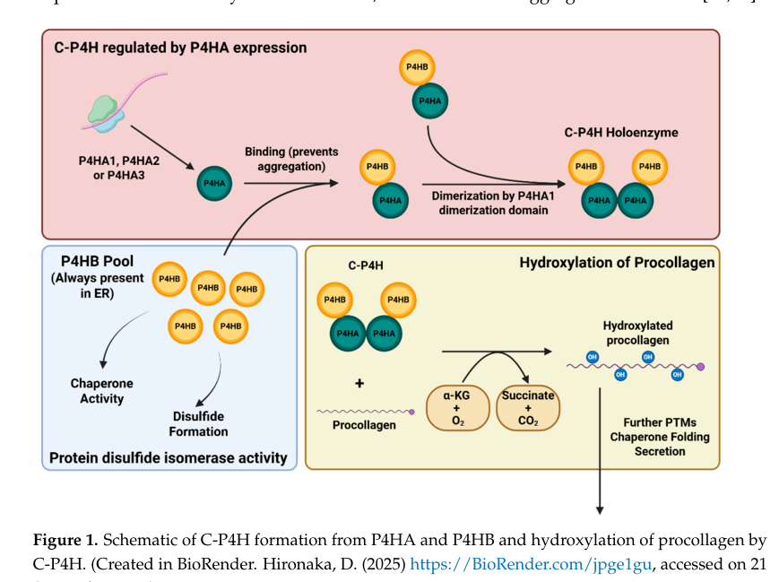

## Question

# Gene Research for Functional Annotation

## ⚠️ CRITICAL: Gene/Protein Identification Context

**BEFORE YOU BEGIN RESEARCH:** You MUST verify you are researching the CORRECT gene/protein. Gene symbols can be ambiguous, especially for less well-characterized genes from non-model organisms.

### Target Gene/Protein Identity (from UniProt):
- **UniProt Accession:** O15460
- **Protein Description:** RecName: Full=Prolyl 4-hydroxylase subunit alpha-2; Short=4-PH alpha-2; EC=1.14.11.2 {ECO:0000269|PubMed:9211872}; AltName: Full=Procollagen-proline,2-oxoglutarate-4-dioxygenase subunit alpha-2; Flags: Precursor;
- **Gene Information:** Name=P4HA2; ORFNames=UNQ290/PRO330;
- **Organism (full):** Homo sapiens (Human).
- **Protein Family:** Belongs to the P4HA family. .
- **Key Domains:** Oxoglu/Fe-dep_dioxygenase_dom. (IPR005123); P4H_N. (IPR013547); P4HA-like. (IPR045054); Pro_4_hyd_alph. (IPR006620); Pro_4_hyd_alph_FE2OG_OXY. (IPR044862)

### MANDATORY VERIFICATION STEPS:

1. **Check if the gene symbol "P4HA2" matches the protein description above**
2. **Verify the organism is correct:** Homo sapiens (Human).
3. **Check if protein family/domains align with what you find in literature**
4. **If you find literature for a DIFFERENT gene with the same or similar symbol, STOP**

### If Gene Symbol is Ambiguous or You Cannot Find Relevant Literature:

**DO NOT PROCEED WITH RESEARCH ON A DIFFERENT GENE.** Instead:
- State clearly: "The gene symbol 'P4HA2' is ambiguous or literature is limited for this specific protein"
- Explain what you found (e.g., "Found extensive literature on a different gene with the same symbol in a different organism")
- Describe the protein based ONLY on the UniProt information provided above
- Suggest that the protein function can be inferred from domain/family information

### Research Target:

Please provide a comprehensive research report on the gene **P4HA2** (gene ID: P4HA2, UniProt: O15460) in human.

The research report should be a detailed narrative explaining the function, biological processes, and localization of the gene product. Citations should be given for all claims.

You should prioritize authoritative reviews and primary scientific literature when conducting research. You can supplement
this with annotations you find in gene/protein databases, but these can be outdated or inaccurate.

We are specifically interested in the primary function of the gene - for enzymes, what reaction is catalyzed, and what is the substrate specificity? For transporters, what is the substrate? For structural proteins or adapters, what is the broader structural role? For signaling molecules, what is the role in the pathway.

We are interested in where in or outside the cell the gene product carries out its function.

We are also interested in the signaling or biochemical pathways in which the gene functions. We are less interested in broad pleiotropic effects, except where these elucidate the precise role.

Include evidence where possible. We are interested in both experimental evidence as well as inference from structure, evolution, or bioinformatic analysis. Precise studies should be prioritized over high-throughput, where available.

## Output

Question: You are an expert researcher providing comprehensive, well-cited information.

Provide detailed information focusing on:
1. Key concepts and definitions with current understanding
2. Recent developments and latest research (prioritize 2023-2024 sources)
3. Current applications and real-world implementations
4. Expert opinions and analysis from authoritative sources
5. Relevant statistics and data from recent studies

Format as a comprehensive research report with proper citations. Include URLs and publication dates where available.
Always prioritize recent, authoritative sources and provide specific citations for all major claims.

# Gene Research for Functional Annotation

## ⚠️ CRITICAL: Gene/Protein Identification Context

**BEFORE YOU BEGIN RESEARCH:** You MUST verify you are researching the CORRECT gene/protein. Gene symbols can be ambiguous, especially for less well-characterized genes from non-model organisms.

### Target Gene/Protein Identity (from UniProt):
- **UniProt Accession:** O15460
- **Protein Description:** RecName: Full=Prolyl 4-hydroxylase subunit alpha-2; Short=4-PH alpha-2; EC=1.14.11.2 {ECO:0000269|PubMed:9211872}; AltName: Full=Procollagen-proline,2-oxoglutarate-4-dioxygenase subunit alpha-2; Flags: Precursor;
- **Gene Information:** Name=P4HA2; ORFNames=UNQ290/PRO330;
- **Organism (full):** Homo sapiens (Human).
- **Protein Family:** Belongs to the P4HA family. .
- **Key Domains:** Oxoglu/Fe-dep_dioxygenase_dom. (IPR005123); P4H_N. (IPR013547); P4HA-like. (IPR045054); Pro_4_hyd_alph. (IPR006620); Pro_4_hyd_alph_FE2OG_OXY. (IPR044862)

### MANDATORY VERIFICATION STEPS:

1. **Check if the gene symbol "P4HA2" matches the protein description above**
2. **Verify the organism is correct:** Homo sapiens (Human).
3. **Check if protein family/domains align with what you find in literature**
4. **If you find literature for a DIFFERENT gene with the same or similar symbol, STOP**

### If Gene Symbol is Ambiguous or You Cannot Find Relevant Literature:

**DO NOT PROCEED WITH RESEARCH ON A DIFFERENT GENE.** Instead:
- State clearly: "The gene symbol 'P4HA2' is ambiguous or literature is limited for this specific protein"
- Explain what you found (e.g., "Found extensive literature on a different gene with the same symbol in a different organism")
- Describe the protein based ONLY on the UniProt information provided above
- Suggest that the protein function can be inferred from domain/family information

### Research Target:

Please provide a comprehensive research report on the gene **P4HA2** (gene ID: P4HA2, UniProt: O15460) in human.

The research report should be a detailed narrative explaining the function, biological processes, and localization of the gene product. Citations should be given for all claims.

You should prioritize authoritative reviews and primary scientific literature when conducting research. You can supplement
this with annotations you find in gene/protein databases, but these can be outdated or inaccurate.

We are specifically interested in the primary function of the gene - for enzymes, what reaction is catalyzed, and what is the substrate specificity? For transporters, what is the substrate? For structural proteins or adapters, what is the broader structural role? For signaling molecules, what is the role in the pathway.

We are interested in where in or outside the cell the gene product carries out its function.

We are also interested in the signaling or biochemical pathways in which the gene functions. We are less interested in broad pleiotropic effects, except where these elucidate the precise role.

Include evidence where possible. We are interested in both experimental evidence as well as inference from structure, evolution, or bioinformatic analysis. Precise studies should be prioritized over high-throughput, where available.

# Research Report: Human **P4HA2** (UniProt O15460) — Functional Annotation, Biology, and Translational Relevance

## Executive summary
**P4HA2** (UniProt **O15460**; gene **P4HA2**, *Homo sapiens*) encodes the **catalytic α-subunit** of **collagen prolyl 4-hydroxylase** (C‑P4H), an **endoplasmic reticulum (ER)–resident α2β2 heterotetramer** (β subunit = **P4HB/protein disulfide isomerase**) that catalyzes **4‑hydroxylation of specific proline residues** in procollagen **-X‑Y‑Gly-** repeats, a modification essential for collagen triple-helix stability and secretion. The enzyme is a **Fe2+/2‑oxoglutarate/O2-dependent dioxygenase** with **ascorbate** required to maintain catalytic Fe2+. (hironaka2025enhancedcollagenprolyl pages 1-3, hironaka2025enhancedcollagenprolyl pages 3-4, zhou2024comprehensiveanalysisrevealed pages 1-2, hironaka2025enhancedcollagenprolyl media 2f88da14)

Beyond its canonical collagen role, **2024 mechanistic studies** provide strong evidence that P4HA2 can hydroxylate **non-collagen substrates** that modulate signaling pathways, including **mTOR (Pro2341)** (lung adenocarcinoma) and **SUFU** (Hedgehog signaling; B‑cell lymphoma), expanding the functional landscape of P4HA2 biology. (jin2024p4ha2activatesmtor pages 1-2, li2024p4ha2hydroxylatessufu pages 1-2)

---

## 1) Key concepts and definitions (current understanding)

### 1.1 Collagen prolyl 4-hydroxylase (C‑P4H)
C‑P4H catalyzes conversion of **proline to 4‑hydroxyproline (4Hyp)** primarily at the **Y position** of collagen **-X‑Y‑Gly-** repeats; this post-translational modification increases collagen triple-helix stability and supports collagen secretion and extracellular deposition. (hironaka2025enhancedcollagenprolyl pages 1-3, hironaka2025enhancedcollagenprolyl pages 3-4)

**Enzyme class & cofactor chemistry.** C‑P4H is a **Fe2+ and 2‑oxoglutarate (α‑KG) dependent dioxygenase**. The reaction consumes **O2** and α‑KG and produces **succinate** and **CO2**; **ascorbate** is required to regenerate Fe2+ at the active site. (hironaka2025enhancedcollagenprolyl pages 3-4, hironaka2025enhancedcollagenprolyl media 2f88da14)

**Complex composition and localization.** C‑P4H is an **α2β2 tetramer**. The **α subunit** (P4HA1/2/3 isoforms) contains the catalytic machinery and substrate-binding features, while the **β subunit is P4HB/protein disulfide isomerase (PDI)**; P4HB contains a **KDEL** ER-retention signal, retaining the holoenzyme in the **ER lumen**. (hironaka2025enhancedcollagenprolyl pages 1-3, zhou2024comprehensiveanalysisrevealed pages 1-2, hironaka2025enhancedcollagenprolyl media 2f88da14)

**Catalytic residues.** A mechanistic review summarizes residues corresponding to P4HA2 active-site coordination/catalysis as **His430, Asp432, His501**. (hironaka2025enhancedcollagenprolyl pages 3-4)

A schematic summarizing ER localization, α2β2 assembly, and the α‑KG/O2-driven hydroxylation mechanism is provided in Figure 1 of the cited review. (hironaka2025enhancedcollagenprolyl media 2f88da14)

### 1.2 Substrate specificity (collagen motifs)
C‑P4H recognizes collagen motifs containing proline residues in **-X‑Y‑Gly-** repeats; high-affinity features include **PxGP**-type motifs. Isoforms show **sequence preference** across **X‑Pro‑Gly** triplets, consistent with isoenzyme-biased substrate selection rather than strict collagen-type specificity. (hironaka2025enhancedcollagenprolyl pages 14-15, hironaka2025enhancedcollagenprolyl pages 15-17, hironaka2025enhancedcollagenprolyl pages 3-4)

---

## 2) Recent developments and latest research (prioritizing 2023–2024)

### 2.1 Non-canonical hydroxylation targets and signaling control (2024)

**mTOR activation via Pro2341 hydroxylation (Oncogene, Apr 2024).** Jin et al. demonstrated that P4HA2 **binds directly to mTOR** and hydroxylates a **highly conserved Pro2341** within the mTOR kinase domain, which **activates mTOR kinase**, increases phosphorylation of downstream effectors **S6K (T389)** and **AKT (S473)**, and increases **mTOR stability** and substrate recognition. A non-hydroxylatable mutant (**mTOR P2341A**) reduced growth of A549 lung adenocarcinoma cells relative to mTORWT in their assays. (jin2024p4ha2activatesmtor pages 1-2)

**Ciliary relocalization and SUFU hydroxylation in Hedgehog signaling (Leukemia, Jun 2024).** Li et al. reported that upon Hedgehog activation, P4HA2 forms a complex with **KIF7**, **relocates to the primary cilium tip**, and hydroxylates **SUFU**, inhibiting SUFU function and thereby **amplifying Hedgehog signaling**. Genetic/functional loss of P4HA2 impeded B‑cell lymphoma progression, attributed (in part) to reduced stromal growth-factor support driven by Hedgehog signaling. (li2024p4ha2hydroxylatessufu pages 1-2)

### 2.2 Cancer-associated regulation of P4HA2 expression (2024)

**SP1 transcriptional regulation in colorectal cancer (Cancer Biology & Therapy, Jun 2024).** Dang et al. showed P4HA2 is overexpressed in CRC and promotes proliferation, migration, and EMT; importantly, they provided promoter-level evidence that **SP1 binds the P4HA2 promoter** (ChIP) and activates transcription (luciferase assays). (dang2024p4ha2promotestumor pages 1-3)

### 2.3 Tumor phenotypes linked to PI3K/AKT signaling (2024)
Multiple 2024 studies connect P4HA2 to **PI3K/AKT** pathway activity and EMT-like programs:

* **Head and neck squamous cell carcinoma (Medical Oncology, May 2024):** P4HA2 overexpression enhanced proliferation, migration, invasion and EMT in CAL‑27 cells and increased PI3K/AKT phosphorylation; **LY294002** counteracted these effects. (wu2024p4ha2contributesto pages 1-2)
* **Oral squamous cell carcinoma (Scientific Reports, Jul 2024):** P4HA2 overexpression associated with decreased survival (no hazard ratio extracted in provided excerpt), and P4HA2 knockdown reduced invasion/migration/proliferation and reduced PI3K/AKT phosphorylation. (chi2024p4ha2promotesproliferation pages 1-2)

### 2.4 Hypoxia/ECM programs (2024)
A 2024 review of HIF control of extracellular matrix remodeling explicitly discusses P4HA2 (with P4HA1) as part of hypoxia-regulated collagen hydroxylation machinery, placing P4HA2 in the broader **HIF–ECM remodeling** axis that is frequently activated in tumors and fibrotic contexts. (hironaka2025enhancedcollagenprolyl pages 15-17)

A compact summary of these 2023–2024 developments and what was shown experimentally is provided in the table below.

| Publication date | System/disease context | Main finding about P4HA2 | Methods/evidence type | Quantitative details available | URL/DOI | PaperQA citation ID |
|---|---|---|---|---|---|---|
| Jun 2024 | Colorectal cancer (CRC) | P4HA2 is overexpressed in CRC, promotes proliferation, migration, and EMT, and is transcriptionally activated by SP1 binding to the P4HA2 promoter (dang2024p4ha2promotestumor pages 1-3) | TCGA expression analysis; western blot on paired tumors; tissue microarray; ChIP; luciferase assays; in vitro and in vivo functional assays (dang2024p4ha2promotestumor pages 1-3) | 18 paired tumor/normal specimens by western blot; tissue microarray of 349 CRC cases; no HR reported in gathered evidence (dang2024p4ha2promotestumor pages 1-3) | https://doi.org/10.1080/15384047.2024.2361594 | (dang2024p4ha2promotestumor pages 1-3) |
| Apr 2024 | Lung adenocarcinoma | P4HA2 directly binds mTOR and hydroxylates conserved mTOR Pro2341, increasing mTOR stability, substrate recognition, and kinase signaling to S6K and AKT; targeting the P4HA2-mTOR axis suppresses growth (jin2024p4ha2activatesmtor pages 1-2) | Mechanistic biochemistry; proteomic IP; GST pull-down; mutant analysis; cell growth assays; combination pharmacology (jin2024p4ha2activatesmtor pages 1-2) | mTOR residue P2341 identified as hydroxylation site; P4HA2 found among 634 potential mTOR-interacting proteins; mTORP2341A reduced A549 growth; no clinical HR in gathered evidence (jin2024p4ha2activatesmtor pages 1-2) | https://doi.org/10.1038/s41388-024-03032-1 | (jin2024p4ha2activatesmtor pages 1-2) |
| Jun 2024 | B-cell lymphoma / stromal Hedgehog signaling | P4HA2 forms a complex with KIF7, relocalizes to the primary cilium tip after Hedgehog activation, hydroxylates SUFU, inhibits SUFU function, and amplifies paracrine Hedgehog signaling to promote lymphoma progression (li2024p4ha2hydroxylatessufu pages 1-2) | Cell biology and signaling study in lymphoma/stromal context; mechanistic hydroxylation evidence (li2024p4ha2hydroxylatessufu pages 1-2) | Key substrate identified as SUFU; localization shift to ciliary tip noted; no sample size or HR reported in gathered evidence (li2024p4ha2hydroxylatessufu pages 1-2) | https://doi.org/10.1038/s41375-024-02313-8 | (li2024p4ha2hydroxylatessufu pages 1-2) |
| May 2024 | Head and neck squamous cell carcinoma (HNSCC) | P4HA2 is upregulated in HNSCC, enhances proliferation, migration, invasion, and EMT, reduces apoptosis, and acts through PI3K/AKT signaling; LY294002 reverses these effects (wu2024p4ha2contributesto pages 1-2) | Integrated bioinformatics; patient tissues; CAL-27 cell functional assays; western blot; pathway inhibition (wu2024p4ha2contributesto pages 1-2) | 36 HNSCC tissues collected 2019-2021; CAL-27, FaDu, HN4, and HOK cells used; no HR reported in gathered evidence (wu2024p4ha2contributesto pages 1-2) | https://doi.org/10.1007/s12032-024-02358-w | (wu2024p4ha2contributesto pages 1-2) |
| Jul 2024 | Oral squamous cell carcinoma (OSCC) | P4HA2 is overexpressed in OSCC, inversely correlates with survival, and promotes invasion, migration, proliferation, and metastasis through PI3K/AKT pathway activation (chi2024p4ha2promotesproliferation pages 1-2) | Multi-database expression/prognosis analysis; knockdown/overexpression models; in vitro and in vivo assays (chi2024p4ha2promotesproliferation pages 1-2) | Prognosis assessed using TCGA/TIMER/UALCAN/GEPIA/KM-plotter; no numerical HR or sample size reported in gathered evidence (chi2024p4ha2promotesproliferation pages 1-2) | https://doi.org/10.1038/s41598-024-64264-5 | (chi2024p4ha2promotesproliferation pages 1-2) |
| May 2024 | Head and neck cancer biomarker analysis | Family-level analysis found P4HA2 (with P4HA1) associated with tumor stage, prognosis, and immune infiltration in HNSC; supports P4HA2 as biomarker candidate (zhou2024comprehensiveanalysisrevealed pages 1-2) | Multi-database transcriptomic and survival/immunology analysis; biomarker study (zhou2024comprehensiveanalysisrevealed pages 1-2) | Reports significant overexpression of P4H1-3 in HNSC but no HR or cohort size captured in gathered evidence (zhou2024comprehensiveanalysisrevealed pages 1-2) | https://doi.org/10.1038/s41598-024-62678-9 | (zhou2024comprehensiveanalysisrevealed pages 1-2) |
| Mar 2024 | Osteosarcoma biomarker analysis | P4HA2 is elevated in osteosarcoma, associated with poorer overall survival, retained independent prognostic value, and linked by GSEA to MAPK, NK-cell cytotoxicity, and T-cell receptor pathways (chen2024genomicnursingscience pages 1-2) | GEO-based transcriptomics; PCR validation; prognostic modeling; Cox regression; GSEA; HPA interrogation (chen2024genomicnursingscience pages 1-2) | GEO datasets GSE16088 and GSE73166 used; independent prognostic value reported but no HR captured in gathered evidence (chen2024genomicnursingscience pages 1-2) | https://doi.org/10.1016/j.heliyon.2024.e27191 | (chen2024genomicnursingscience pages 1-2) |
| Jan 2024 | Hypoxia-ECM review | Review places P4HA2 in hypoxia-regulated ECM remodeling, noting P4HA1 and P4HA2 as genes encoding prolyl 4-hydroxylase alpha subunits involved in collagen hydroxylation under hypoxic control (hironaka2025enhancedcollagenprolyl pages 15-17) | Narrative review of HIF-dependent extracellular-matrix regulation (hironaka2025enhancedcollagenprolyl pages 15-17) | No original cohort size; provides pathway-level context rather than new quantitative P4HA2 statistics (hironaka2025enhancedcollagenprolyl pages 15-17) | https://doi.org/10.32604/biocell.2024.048873 | (hironaka2025enhancedcollagenprolyl pages 15-17) |

*Table: This table summarizes key 2023-2024 developments for human P4HA2, emphasizing mechanistic discoveries, cancer-related functions, and biomarker evidence. It is useful for quickly comparing where P4HA2 acts, what was shown experimentally, and what quantitative details are currently available.*

---

## 3) Current applications and real-world implementations

### 3.1 Biomarker use (primarily translational research)
Recent studies support P4HA2 as a **candidate biomarker** for tumor aggressiveness and prognosis:

* **CRC:** Elevated P4HA2 protein in a tissue microarray of **349 cases** and elevated expression in tumors vs adjacent tissues; associated with worse prognosis in the study narrative. (dang2024p4ha2promotestumor pages 1-3)
* **HNSCC:** Clinical tissue cohort of **36 samples** plus in vitro manipulation supporting association with aggressiveness and prognosis. (wu2024p4ha2contributesto pages 1-2)
* **Head and neck cancer computational biomarker analysis (Scientific Reports, May 2024):** P4HA2 associated with stage/prognosis/immune infiltration in multi-database analyses. (zhou2024comprehensiveanalysisrevealed pages 1-2)
* **Osteosarcoma biomarker modeling (Heliyon, Mar 2024):** P4HA2 elevated and reported as an independent prognostic factor in Cox regression models (numerical HR not extracted in the provided excerpt). (chen2024genomicnursingscience pages 1-2)

### 3.2 Clinical-trial implementation: P4HA2 as a *measured* hypoxia marker
A completed randomized phase II cervical cancer trial (**NCT04275713**, “METOXY‑LACC”) includes **P4HA2** in a **6‑gene RNA‑seq hypoxia signature** endpoint used to measure metformin-dependent changes in tumor hypoxia-related gene expression. This is an example of P4HA2 being implemented as part of a translational **hypoxia readout**, not a direct therapeutic target. (NCT04275713 chunk 1)

### 3.3 Therapeutic concept: targeting P4HA2-dependent signaling axes
Jin et al. provide a concrete therapeutic concept in lung adenocarcinoma: targeting the **P4HA2–mTOR** axis suppressed tumor cell growth in their models, and they observed synergy between **P4HA2 knockdown** and the **mTOR kinase inhibitor AZD‑8055** in growth assays. (jin2024p4ha2activatesmtor pages 1-2)

---

## 4) Expert opinions and analysis from authoritative sources

### 4.1 Collagen hydroxylases as drug targets (state of the field)
A highly cited 2021 review of collagen prolyl/lysyl hydroxylases notes that while many competitive inhibitors of collagen P4Hs have been described, **“No collagen hydroxylase inhibitor is in clinical use”**; by contrast, **HIF prolyl hydroxylase (PHD) inhibitors** (a distinct enzyme family) are in clinical trials/clinical use contexts (e.g., anemia). This underscores a key translational gap for direct C‑P4H/P4HA2 inhibitors. (salo2021prolylandlysyl pages 4-7)

### 4.2 Mechanistic consensus on localization and enzymology
Family-level mechanistic summaries emphasize that C‑P4H is an **ER-resident α2β2 enzyme** using **Fe2+/α‑KG/O2** chemistry coupled to proline hydroxylation, with P4HB/PDI serving as the β subunit and contributing ER retention via KDEL. This consensus supports interpreting many P4HA2 disease phenotypes through altered collagen maturation and secretion. (hironaka2025enhancedcollagenprolyl pages 1-3, hironaka2025enhancedcollagenprolyl pages 3-4, zhou2024comprehensiveanalysisrevealed pages 1-2, hironaka2025enhancedcollagenprolyl media 2f88da14)

### 4.3 Interpreting new non-canonical substrate reports
The 2024 studies identifying **mTOR** and **SUFU** as hydroxylation targets imply that P4HA2 can influence cancer phenotypes by mechanisms not reducible to collagen deposition alone (i.e., direct control of signaling protein stability/activity). These findings broaden the working definition of P4HA2 biology from an ER collagen enzyme to a context-dependent prolyl hydroxylase that can also modulate signaling pathways. (jin2024p4ha2activatesmtor pages 1-2, li2024p4ha2hydroxylatessufu pages 1-2)

---

## 5) Relevant statistics and data (from the retrieved evidence)

* **CRC clinical/proteomics scale:** CRC study included **18 paired tumor/normal** specimens (western blot) and a **349-case tissue microarray** showing higher tumor P4HA2 staining/expression. (dang2024p4ha2promotestumor pages 1-3)
* **HNSCC cohort size:** **36** patient tumor tissues were collected in the HNSCC study (2019–2021). (wu2024p4ha2contributesto pages 1-2)
* **mTOR interaction screen size and hydroxylation site:** P4HA2 identified among **634 candidate mTOR interactors**; hydroxylation mapped to **mTOR Pro2341**; growth reduction reported for **mTORP2341A** vs mTORWT in A549 assays. (jin2024p4ha2activatesmtor pages 1-2)

Limitations: Several 2024 biomarker papers in the retrieved excerpts describe survival associations without providing the numerical hazard ratios/CI in the extracted text; therefore HR values are not reported here. (chen2024genomicnursingscience pages 1-2, zhou2024comprehensiveanalysisrevealed pages 1-2, wu2024p4ha2contributesto pages 1-2, chi2024p4ha2promotesproliferation pages 1-2)

---

## Functional annotation summary table
The following table consolidates the evidence-backed functional annotation of P4HA2, including canonical enzymology, localization/complex assembly, and validated non-collagen substrates.

| Feature | Evidence/notes | Key citations (title, year, DOI URL) | PaperQA citation IDs |
|---|---|---|---|
| Verified target identity | Human **P4HA2** corresponds to UniProt **O15460**, encoding the **prolyl 4-hydroxylase subunit alpha-2** alpha isoform of collagen prolyl 4-hydroxylase; belongs to the α-ketoglutarate-dependent dioxygenase family. Family-level reviews explicitly describe P4HA2 as one of the three mammalian catalytic α subunits of C-P4H. | *Enhanced Collagen Prolyl 4-Hydroxylase Activity and Expression Promote Cancer Progression via Both Canonical and Non-Canonical Mechanisms* (2025), https://doi.org/10.3390/ijms26199371; *Comprehensive analysis revealed P4Hs as new biomarkers for prognosis and immunotherapy in head and neck cancer* (2024), https://doi.org/10.1038/s41598-024-62678-9 | (hironaka2025enhancedcollagenprolyl pages 1-3, zhou2024comprehensiveanalysisrevealed pages 1-2) |
| Enzyme class | Collagen prolyl 4-hydroxylase (C-P4H) is a **Fe2+/2-oxoglutarate-dependent dioxygenase** that performs prolyl 4-hydroxylation during collagen biosynthesis. | *Enhanced Collagen Prolyl 4-Hydroxylase Activity and Expression Promote Cancer Progression via Both Canonical and Non-Canonical Mechanisms* (2025), https://doi.org/10.3390/ijms26199371 | (hironaka2025enhancedcollagenprolyl pages 3-4) |
| Canonical reaction catalyzed | C-P4H hydroxylates proline to **4-hydroxyproline** at the Y position of collagen **-X-Y-Gly-** repeats; this modification is required for collagen triple-helix stability and efficient secretion. | *Enhanced Collagen Prolyl 4-Hydroxylase Activity and Expression Promote Cancer Progression via Both Canonical and Non-Canonical Mechanisms* (2025), https://doi.org/10.3390/ijms26199371; *Prolyl-4-hydroxylase α subunit 2 promotes breast cancer progression and metastasis by regulating collagen deposition* (2014), https://doi.org/10.1186/1471-2407-14-1 | (hironaka2025enhancedcollagenprolyl pages 1-3, hironaka2025enhancedcollagenprolyl pages 3-4) |
| Canonical substrates/motif specificity | Primary substrates are procollagen/collagen sequences containing **-X-Pro-Gly- / -X-Y-Gly-** motifs; high-affinity substrate recognition is linked to **PxGP**-type motifs. Family-level evidence indicates P4HA1 and P4HA2 differ in sequence preference across X-Pro-Gly triplets, supporting isoform-specific substrate bias rather than absolute collagen-type specificity. | *Enhanced Collagen Prolyl 4-Hydroxylase Activity and Expression Promote Cancer Progression via Both Canonical and Non-Canonical Mechanisms* (2025), https://doi.org/10.3390/ijms26199371; *Comprehensive analysis of the effects of P4ha1 and P4ha2 deletion on post-translational modifications of fibrillar collagens in mouse skin* (2025), https://doi.org/10.3389/fcell.2025.1527839 | (hironaka2025enhancedcollagenprolyl pages 14-15, hironaka2025enhancedcollagenprolyl pages 15-17) |
| Required cofactors/cosubstrates | Requires **Fe2+**, **2-oxoglutarate (α-KG)**, and **O2**; **ascorbate** regenerates catalytic Fe2+. | *Enhanced Collagen Prolyl 4-Hydroxylase Activity and Expression Promote Cancer Progression via Both Canonical and Non-Canonical Mechanisms* (2025), https://doi.org/10.3390/ijms26199371 | (hironaka2025enhancedcollagenprolyl pages 3-4, hironaka2025enhancedcollagenprolyl media 2f88da14) |
| Reaction products | Hydroxylation of proline is coupled to conversion of α-KG and O2 into **succinate** and **CO2**. | *Enhanced Collagen Prolyl 4-Hydroxylase Activity and Expression Promote Cancer Progression via Both Canonical and Non-Canonical Mechanisms* (2025), https://doi.org/10.3390/ijms26199371 | (hironaka2025enhancedcollagenprolyl pages 3-4, hironaka2025enhancedcollagenprolyl media 2f88da14) |
| Key catalytic residues | Family-level structural evidence identifies catalytic metal/cofactor-binding residues corresponding to P4HA2 as **His430, Asp432, His501**. | *Enhanced Collagen Prolyl 4-Hydroxylase Activity and Expression Promote Cancer Progression via Both Canonical and Non-Canonical Mechanisms* (2025), https://doi.org/10.3390/ijms26199371 | (hironaka2025enhancedcollagenprolyl pages 3-4) |
| Cellular localization | P4HA2 functions in the **endoplasmic reticulum lumen**; the C-P4H holoenzyme is ER-localized and retained there via the P4HB/PDI **KDEL** sequence. | *Enhanced Collagen Prolyl 4-Hydroxylase Activity and Expression Promote Cancer Progression via Both Canonical and Non-Canonical Mechanisms* (2025), https://doi.org/10.3390/ijms26199371; *Comprehensive analysis revealed P4Hs as new biomarkers for prognosis and immunotherapy in head and neck cancer* (2024), https://doi.org/10.1038/s41598-024-62678-9 | (hironaka2025enhancedcollagenprolyl pages 1-3, zhou2024comprehensiveanalysisrevealed pages 1-2, hironaka2025enhancedcollagenprolyl media 2f88da14) |
| Complex composition | Active collagen prolyl 4-hydroxylase is an **α2β2 heterotetramer**; P4HA2 provides the catalytic α subunit and **P4HB/PDI** provides the β subunit. Evidence cited in reviews indicates isoforms assemble as specific α2β2 complexes rather than mixed P4HA1/P4HA2 tetramers. | *Enhanced Collagen Prolyl 4-Hydroxylase Activity and Expression Promote Cancer Progression via Both Canonical and Non-Canonical Mechanisms* (2025), https://doi.org/10.3390/ijms26199371; *Comprehensive analysis revealed P4Hs as new biomarkers for prognosis and immunotherapy in head and neck cancer* (2024), https://doi.org/10.1038/s41598-024-62678-9 | (hironaka2025enhancedcollagenprolyl pages 14-15, hironaka2025enhancedcollagenprolyl pages 15-17, hironaka2025enhancedcollagenprolyl pages 1-3, zhou2024comprehensiveanalysisrevealed pages 1-2, hironaka2025enhancedcollagenprolyl media 2f88da14) |
| Structural/functional role in collagen biosynthesis | Hydroxylation by P4HA2 stabilizes newly synthesized collagen, enabling proper triple-helix formation, secretion, and extracellular collagen deposition; loss or inhibition reduces collagen deposition in tumor models. | *Prolyl-4-hydroxylase α subunit 2 promotes breast cancer progression and metastasis by regulating collagen deposition* (2014), https://doi.org/10.1186/1471-2407-14-1; *Enhanced Collagen Prolyl 4-Hydroxylase Activity and Expression Promote Cancer Progression via Both Canonical and Non-Canonical Mechanisms* (2025), https://doi.org/10.3390/ijms26199371 | (hironaka2025enhancedcollagenprolyl pages 1-3, hironaka2025enhancedcollagenprolyl pages 3-4) |
| Non-canonical substrate: mTOR | A 2024 mechanistic study showed P4HA2 directly binds **mTOR** and hydroxylates **Pro2341**, increasing mTOR stability, substrate recognition, and downstream signaling (S6K, AKT). This supports a non-collagen signaling role for P4HA2. | *P4HA2 activates mTOR via hydroxylation and targeting P4HA2-mTOR inhibits lung adenocarcinoma cell growth* (2024), https://doi.org/10.1038/s41388-024-03032-1 | (jin2024p4ha2activatesmtor pages 1-2) |
| Non-canonical substrate: SUFU | A 2024 study in B-cell lymphoma reported that P4HA2 relocates with **KIF7** to the ciliary tip after Hedgehog activation and hydroxylates **SUFU**, inhibiting SUFU and amplifying paracrine Hedgehog signaling. | *P4HA2 hydroxylates SUFU to regulate the paracrine Hedgehog signaling and promote B-cell lymphoma progression* (2024), https://doi.org/10.1038/s41375-024-02313-8 | (li2024p4ha2hydroxylatessufu pages 1-2) |
| Regulation by hypoxia/HIF | Reviews and recent analyses place P4HA2 within hypoxia-responsive ECM remodeling programs; hypoxia/HIF signaling upregulates collagen hydroxylation machinery, and P4HA2 is repeatedly linked to hypoxic tumor phenotypes. | *HIFs in hypoxic regulation of the extracellular matrix: focus on little-known player HIF-3* (2024), https://doi.org/10.32604/biocell.2024.048873; *Enhanced Collagen Prolyl 4-Hydroxylase Activity and Expression Promote Cancer Progression via Both Canonical and Non-Canonical Mechanisms* (2025), https://doi.org/10.3390/ijms26199371 | (hironaka2025enhancedcollagenprolyl pages 15-17, hironaka2025enhancedcollagenprolyl pages 14-15) |
| Regulation by SP1 | In colorectal cancer, **SP1** binds the P4HA2 promoter and transcriptionally activates P4HA2, providing direct promoter-level regulatory evidence. | *P4ha2 promotes tumor progression and is transcriptionally regulated by SP1 in colorectal cancer* (2024), https://doi.org/10.1080/15384047.2024.2361594 | (dang2024p4ha2promotestumor pages 1-3) |
| Disease/implementation note: biomarker and target | Recent studies consistently report P4HA2 overexpression in multiple cancers and association with worse prognosis, EMT, PI3K/AKT or mTOR pathway activation, and collagen-rich tumor microenvironments; experimental inhibition or knockdown suppresses tumor phenotypes. | *P4ha2 promotes tumor progression and is transcriptionally regulated by SP1 in colorectal cancer* (2024), https://doi.org/10.1080/15384047.2024.2361594; *P4HA2 promotes proliferation, invasion, and metastasis through regulation of the PI3K/AKT signaling pathway in oral squamous cell carcinoma* (2024), https://doi.org/10.1038/s41598-024-64264-5; *P4ha2 contributes to head and neck squamous cell carcinoma progression and EMT through PI3K/AKT signaling pathway* (2024), https://doi.org/10.1007/s12032-024-02358-w; *P4HA2 activates mTOR via hydroxylation and targeting P4HA2-mTOR inhibits lung adenocarcinoma cell growth* (2024), https://doi.org/10.1038/s41388-024-03032-1 | (dang2024p4ha2promotestumor pages 1-3, wu2024p4ha2contributesto pages 1-2, chi2024p4ha2promotesproliferation pages 1-2, jin2024p4ha2activatesmtor pages 1-2) |

*Table: This table summarizes evidence-supported functional annotation for human P4HA2 (UniProt O15460), including its canonical collagen-prolyl hydroxylase role, cofactors, localization, complex assembly, catalytic features, and newer non-canonical substrates. It is useful as a compact reference linking each annotation item to specific literature and PaperQA citation IDs.*

---

## Disease associations from curated genetics/target–disease evidence
Open Targets lists disease–target association evidence connecting P4HA2 (ENSG00000072682) with multiple traits/diseases, including **myopia** (and autosomal dominant myopia 25), **asthma**, **dengue disease**, and **inflammatory bowel disease**, with supporting PubMed identifiers included in that resource’s evidence list. (OpenTargets Search: -P4HA2)

---

## Concluding perspective
The strongest, best-supported **primary molecular function** of human P4HA2 (O15460) is as the catalytic α-subunit of the ER-localized C‑P4H complex that hydroxylates procollagen prolines using Fe2+/α‑KG/O2 chemistry, thereby enabling collagen maturation and secretion. (hironaka2025enhancedcollagenprolyl pages 1-3, hironaka2025enhancedcollagenprolyl pages 3-4, zhou2024comprehensiveanalysisrevealed pages 1-2, hironaka2025enhancedcollagenprolyl media 2f88da14)

The most consequential **2024 shift in the research landscape** is the appearance of high-confidence mechanistic studies showing **direct hydroxylation of signaling proteins** (mTOR, SUFU), suggesting P4HA2 can couple oxygen/α‑KG-dependent chemistry to oncogenic signaling beyond collagen biology. This creates new opportunities—and challenges—for therapeutic targeting, particularly given authoritative assessments that **collagen hydroxylase inhibitors are not yet in clinical use**. (jin2024p4ha2activatesmtor pages 1-2, li2024p4ha2hydroxylatessufu pages 1-2, salo2021prolylandlysyl pages 4-7)

References

1. (hironaka2025enhancedcollagenprolyl pages 1-3): Dalton Hironaka and Gaofeng Xiong. Enhanced collagen prolyl 4-hydroxylase activity and expression promote cancer progression via both canonical and non-canonical mechanisms. International Journal of Molecular Sciences, 26:9371, Sep 2025. URL: https://doi.org/10.3390/ijms26199371, doi:10.3390/ijms26199371. This article has 2 citations.

2. (hironaka2025enhancedcollagenprolyl pages 3-4): Dalton Hironaka and Gaofeng Xiong. Enhanced collagen prolyl 4-hydroxylase activity and expression promote cancer progression via both canonical and non-canonical mechanisms. International Journal of Molecular Sciences, 26:9371, Sep 2025. URL: https://doi.org/10.3390/ijms26199371, doi:10.3390/ijms26199371. This article has 2 citations.

3. (zhou2024comprehensiveanalysisrevealed pages 1-2): Huan Zhou, Yulin Lei, Jing Luo, Jianmei Wang, Lin Peng, Kelin Mou, Li Xiang, and Yuhao Luo. Comprehensive analysis revealed p4hs as new biomarkers for prognosis and immunotherapy in head and neck cancer. Scientific Reports, May 2024. URL: https://doi.org/10.1038/s41598-024-62678-9, doi:10.1038/s41598-024-62678-9. This article has 4 citations and is from a peer-reviewed journal.

4. (hironaka2025enhancedcollagenprolyl media 2f88da14): Dalton Hironaka and Gaofeng Xiong. Enhanced collagen prolyl 4-hydroxylase activity and expression promote cancer progression via both canonical and non-canonical mechanisms. International Journal of Molecular Sciences, 26:9371, Sep 2025. URL: https://doi.org/10.3390/ijms26199371, doi:10.3390/ijms26199371. This article has 2 citations.

5. (jin2024p4ha2activatesmtor pages 1-2): Ersuo Jin, Shengjie Wang, Donglai Chen, Jia-Ping Wang, Yuanyuan Zeng, Runfeng Sun, and Hong-Tao Zhang. P4ha2 activates mtor via hydroxylation and targeting p4ha2-mtor inhibits lung adenocarcinoma cell growth. Oncogene, 43:1813-1823, Apr 2024. URL: https://doi.org/10.1038/s41388-024-03032-1, doi:10.1038/s41388-024-03032-1. This article has 16 citations and is from a domain leading peer-reviewed journal.

6. (li2024p4ha2hydroxylatessufu pages 1-2): Quanfu Li, Yiyang Liu, Jingxian Wu, Zewen Zhu, Jianjun Fan, Linhui Zhai, Ziruoyu Wang, Guiping Du, Ling Zhang, Junchi Hu, Dengke K. Ma, Jun O. Liu, Hai Huang, Minjia Tan, Yongjun Dang, and Wei Jiang. P4ha2 hydroxylates sufu to regulate the paracrine hedgehog signaling and promote b-cell lymphoma progression. Leukemia, 38:1751-1763, Jun 2024. URL: https://doi.org/10.1038/s41375-024-02313-8, doi:10.1038/s41375-024-02313-8. This article has 12 citations and is from a highest quality peer-reviewed journal.

7. (hironaka2025enhancedcollagenprolyl pages 14-15): Dalton Hironaka and Gaofeng Xiong. Enhanced collagen prolyl 4-hydroxylase activity and expression promote cancer progression via both canonical and non-canonical mechanisms. International Journal of Molecular Sciences, 26:9371, Sep 2025. URL: https://doi.org/10.3390/ijms26199371, doi:10.3390/ijms26199371. This article has 2 citations.

8. (hironaka2025enhancedcollagenprolyl pages 15-17): Dalton Hironaka and Gaofeng Xiong. Enhanced collagen prolyl 4-hydroxylase activity and expression promote cancer progression via both canonical and non-canonical mechanisms. International Journal of Molecular Sciences, 26:9371, Sep 2025. URL: https://doi.org/10.3390/ijms26199371, doi:10.3390/ijms26199371. This article has 2 citations.

9. (dang2024p4ha2promotestumor pages 1-3): Xuening Dang, Xiaojian Chen, Zhonglin Liang, Zhujiang Dai, Wenjun Ding, Jinglue Song, and Jihong Fu. P4ha2 promotes tumor progression and is transcriptionally regulated by sp1 in colorectal cancer. Cancer Biology & Therapy, Jun 2024. URL: https://doi.org/10.1080/15384047.2024.2361594, doi:10.1080/15384047.2024.2361594. This article has 13 citations and is from a peer-reviewed journal.

10. (wu2024p4ha2contributesto pages 1-2): Yan-Ling Wu, Wan Liu, Tingting Zhao, and Jing Jin. P4ha2 contributes to head and neck squamous cell carcinoma progression and emt through pi3k/akt signaling pathway. Medical Oncology (Northwood, London, England), May 2024. URL: https://doi.org/10.1007/s12032-024-02358-w, doi:10.1007/s12032-024-02358-w. This article has 4 citations.

11. (chi2024p4ha2promotesproliferation pages 1-2): Zengpeng Chi, Qimin Wang, Xin Wang, Dagang Li, Lei Tong, Yu Shi, Fang Yang, Qingyuan Guo, Jiawei Zheng, and Zheng-gang Chen. P4ha2 promotes proliferation, invasion, and metastasis through regulation of the pi3k/akt signaling pathway in oral squamous cell carcinoma. Scientific Reports, Jul 2024. URL: https://doi.org/10.1038/s41598-024-64264-5, doi:10.1038/s41598-024-64264-5. This article has 14 citations and is from a peer-reviewed journal.

12. (chen2024genomicnursingscience pages 1-2): Hua-ping Chen, Xiao Han, Hui-ping Sun, Tao Xie, and Xiao-liang Fan. Genomic nursing science revealed the prolyl 4-hydroxylase subunit alpha 2 as a significant biomarker involved in osteosarcoma. Heliyon, 10:e27191, Mar 2024. URL: https://doi.org/10.1016/j.heliyon.2024.e27191, doi:10.1016/j.heliyon.2024.e27191. This article has 3 citations.

13. (NCT04275713 chunk 1): Kjersti Bruheim. Altered Tumor Oxygenation by Metformin, a Potential Step in Overcoming Radiotherapy Resistance in LACC. Oslo University Hospital. 2020. ClinicalTrials.gov Identifier: NCT04275713

14. (salo2021prolylandlysyl pages 4-7): Antti M. Salo and Johanna Myllyharju. Prolyl and lysyl hydroxylases in collagen synthesis. Experimental Dermatology, 30:38-49, Oct 2021. URL: https://doi.org/10.1111/exd.14197, doi:10.1111/exd.14197. This article has 146 citations and is from a domain leading peer-reviewed journal.

15. (OpenTargets Search: -P4HA2): Open Targets Query (-P4HA2, 12 results). Buniello, A. et al. (2025). Open Targets Platform: facilitating therapeutic hypotheses building in drug discovery. Nucleic Acids Research.

## Artifacts

- [Edison artifact artifact-00](P4HA2-deep-research-falcon_artifacts/artifact-00.md)
- [Edison artifact artifact-01](P4HA2-deep-research-falcon_artifacts/artifact-01.md)

## Citations

1. hironaka2025enhancedcollagenprolyl pages 3-4
2. hironaka2025enhancedcollagenprolyl pages 15-17
3. zhou2024comprehensiveanalysisrevealed pages 1-2
4. chen2024genomicnursingscience pages 1-2
5. salo2021prolylandlysyl pages 4-7
6. hironaka2025enhancedcollagenprolyl pages 1-3
7. hironaka2025enhancedcollagenprolyl pages 14-15
8. https://doi.org/10.1080/15384047.2024.2361594
9. https://doi.org/10.1038/s41388-024-03032-1
10. https://doi.org/10.1038/s41375-024-02313-8
11. https://doi.org/10.1007/s12032-024-02358-w
12. https://doi.org/10.1038/s41598-024-64264-5
13. https://doi.org/10.1038/s41598-024-62678-9
14. https://doi.org/10.1016/j.heliyon.2024.e27191
15. https://doi.org/10.32604/biocell.2024.048873
16. https://doi.org/10.3390/ijms26199371;
17. https://doi.org/10.3390/ijms26199371
18. https://doi.org/10.1186/1471-2407-14-1
19. https://doi.org/10.3389/fcell.2025.1527839
20. https://doi.org/10.1186/1471-2407-14-1;
21. https://doi.org/10.32604/biocell.2024.048873;
22. https://doi.org/10.1080/15384047.2024.2361594;
23. https://doi.org/10.1038/s41598-024-64264-5;
24. https://doi.org/10.1007/s12032-024-02358-w;
25. https://doi.org/10.3390/ijms26199371,
26. https://doi.org/10.1038/s41598-024-62678-9,
27. https://doi.org/10.1038/s41388-024-03032-1,
28. https://doi.org/10.1038/s41375-024-02313-8,
29. https://doi.org/10.1080/15384047.2024.2361594,
30. https://doi.org/10.1007/s12032-024-02358-w,
31. https://doi.org/10.1038/s41598-024-64264-5,
32. https://doi.org/10.1016/j.heliyon.2024.e27191,
33. https://doi.org/10.1111/exd.14197,