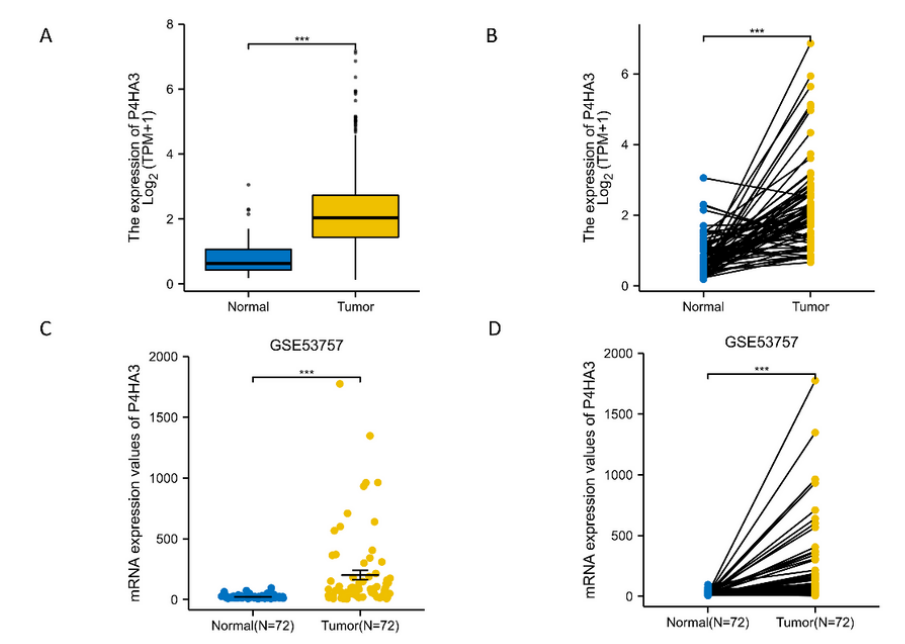

## Question

# Gene Research for Functional Annotation

## ⚠️ CRITICAL: Gene/Protein Identification Context

**BEFORE YOU BEGIN RESEARCH:** You MUST verify you are researching the CORRECT gene/protein. Gene symbols can be ambiguous, especially for less well-characterized genes from non-model organisms.

### Target Gene/Protein Identity (from UniProt):
- **UniProt Accession:** Q7Z4N8
- **Protein Description:** RecName: Full=Prolyl 4-hydroxylase subunit alpha-3; Short=4-PH alpha-3; EC=1.14.11.2 {ECO:0000269|PubMed:14500733}; AltName: Full=Procollagen-proline,2-oxoglutarate-4-dioxygenase subunit alpha-3; Flags: Precursor;
- **Gene Information:** Name=P4HA3; ORFNames=UNQ711/PRO1374;
- **Organism (full):** Homo sapiens (Human).
- **Protein Family:** Belongs to the P4HA family. .
- **Key Domains:** Oxoglu/Fe-dep_dioxygenase_dom. (IPR005123); P4H_N. (IPR013547); P4HA-like. (IPR045054); Pro_4_hyd_alph. (IPR006620); Pro_4_hyd_alph_FE2OG_OXY. (IPR044862)

### MANDATORY VERIFICATION STEPS:

1. **Check if the gene symbol "P4HA3" matches the protein description above**
2. **Verify the organism is correct:** Homo sapiens (Human).
3. **Check if protein family/domains align with what you find in literature**
4. **If you find literature for a DIFFERENT gene with the same or similar symbol, STOP**

### If Gene Symbol is Ambiguous or You Cannot Find Relevant Literature:

**DO NOT PROCEED WITH RESEARCH ON A DIFFERENT GENE.** Instead:
- State clearly: "The gene symbol 'P4HA3' is ambiguous or literature is limited for this specific protein"
- Explain what you found (e.g., "Found extensive literature on a different gene with the same symbol in a different organism")
- Describe the protein based ONLY on the UniProt information provided above
- Suggest that the protein function can be inferred from domain/family information

### Research Target:

Please provide a comprehensive research report on the gene **P4HA3** (gene ID: P4HA3, UniProt: Q7Z4N8) in human.

The research report should be a detailed narrative explaining the function, biological processes, and localization of the gene product. Citations should be given for all claims.

You should prioritize authoritative reviews and primary scientific literature when conducting research. You can supplement
this with annotations you find in gene/protein databases, but these can be outdated or inaccurate.

We are specifically interested in the primary function of the gene - for enzymes, what reaction is catalyzed, and what is the substrate specificity? For transporters, what is the substrate? For structural proteins or adapters, what is the broader structural role? For signaling molecules, what is the role in the pathway.

We are interested in where in or outside the cell the gene product carries out its function.

We are also interested in the signaling or biochemical pathways in which the gene functions. We are less interested in broad pleiotropic effects, except where these elucidate the precise role.

Include evidence where possible. We are interested in both experimental evidence as well as inference from structure, evolution, or bioinformatic analysis. Precise studies should be prioritized over high-throughput, where available.

## Output

Question: You are an expert researcher providing comprehensive, well-cited information.

Provide detailed information focusing on:
1. Key concepts and definitions with current understanding
2. Recent developments and latest research (prioritize 2023-2024 sources)
3. Current applications and real-world implementations
4. Expert opinions and analysis from authoritative sources
5. Relevant statistics and data from recent studies

Format as a comprehensive research report with proper citations. Include URLs and publication dates where available.
Always prioritize recent, authoritative sources and provide specific citations for all major claims.

# Gene Research for Functional Annotation

## ⚠️ CRITICAL: Gene/Protein Identification Context

**BEFORE YOU BEGIN RESEARCH:** You MUST verify you are researching the CORRECT gene/protein. Gene symbols can be ambiguous, especially for less well-characterized genes from non-model organisms.

### Target Gene/Protein Identity (from UniProt):
- **UniProt Accession:** Q7Z4N8
- **Protein Description:** RecName: Full=Prolyl 4-hydroxylase subunit alpha-3; Short=4-PH alpha-3; EC=1.14.11.2 {ECO:0000269|PubMed:14500733}; AltName: Full=Procollagen-proline,2-oxoglutarate-4-dioxygenase subunit alpha-3; Flags: Precursor;
- **Gene Information:** Name=P4HA3; ORFNames=UNQ711/PRO1374;
- **Organism (full):** Homo sapiens (Human).
- **Protein Family:** Belongs to the P4HA family. .
- **Key Domains:** Oxoglu/Fe-dep_dioxygenase_dom. (IPR005123); P4H_N. (IPR013547); P4HA-like. (IPR045054); Pro_4_hyd_alph. (IPR006620); Pro_4_hyd_alph_FE2OG_OXY. (IPR044862)

### MANDATORY VERIFICATION STEPS:

1. **Check if the gene symbol "P4HA3" matches the protein description above**
2. **Verify the organism is correct:** Homo sapiens (Human).
3. **Check if protein family/domains align with what you find in literature**
4. **If you find literature for a DIFFERENT gene with the same or similar symbol, STOP**

### If Gene Symbol is Ambiguous or You Cannot Find Relevant Literature:

**DO NOT PROCEED WITH RESEARCH ON A DIFFERENT GENE.** Instead:
- State clearly: "The gene symbol 'P4HA3' is ambiguous or literature is limited for this specific protein"
- Explain what you found (e.g., "Found extensive literature on a different gene with the same symbol in a different organism")
- Describe the protein based ONLY on the UniProt information provided above
- Suggest that the protein function can be inferred from domain/family information

### Research Target:

Please provide a comprehensive research report on the gene **P4HA3** (gene ID: P4HA3, UniProt: Q7Z4N8) in human.

The research report should be a detailed narrative explaining the function, biological processes, and localization of the gene product. Citations should be given for all claims.

You should prioritize authoritative reviews and primary scientific literature when conducting research. You can supplement
this with annotations you find in gene/protein databases, but these can be outdated or inaccurate.

We are specifically interested in the primary function of the gene - for enzymes, what reaction is catalyzed, and what is the substrate specificity? For transporters, what is the substrate? For structural proteins or adapters, what is the broader structural role? For signaling molecules, what is the role in the pathway.

We are interested in where in or outside the cell the gene product carries out its function.

We are also interested in the signaling or biochemical pathways in which the gene functions. We are less interested in broad pleiotropic effects, except where these elucidate the precise role.

Include evidence where possible. We are interested in both experimental evidence as well as inference from structure, evolution, or bioinformatic analysis. Precise studies should be prioritized over high-throughput, where available.

## Research Report: Human **P4HA3** (UniProt Q7Z4N8) — Functional Annotation and Translational Context

### 1) Target verification (critical identity checks)
The queried target **P4HA3** corresponds to **human prolyl 4-hydroxylase subunit alpha-3** (UniProt **Q7Z4N8**), i.e., the **α(III)** catalytic subunit of **collagen prolyl 4-hydroxylase (C-P4H) isoenzyme III**. Across authoritative reviews and mechanistic descriptions, P4HA3 is consistently described as encoding one of three vertebrate catalytic α subunits (α(I)/α(II)/α(III) encoded by P4HA1/P4HA2/P4HA3) that assemble into isoenzyme-specific collagen P4H tetramers, matching the UniProt-provided description (EC **1.14.11.2**) and human organism context. (pasanen2011prolyl3hydroxylasesand pages 28-31, gjaltema2017molecularinsightsinto pages 3-4, salo2021prolylandlysyl pages 4-7)

### 2) Key concepts and definitions (current understanding)

#### 2.1 What P4HA3 is (molecular identity)
**Collagen prolyl 4-hydroxylase (C-P4H)** is the central intracellular enzyme system responsible for **proline 4-hydroxylation** during procollagen biosynthesis. C-P4H exists as an **α2β2 tetramer**, in which the **α subunit is catalytic** and the **β subunit is P4HB/protein disulfide isomerase (PDI)**, providing chaperone/assembly functions and ER retention. P4HA3 provides the catalytic α(III) chain for **C-P4H isoenzyme III**, expected to form the homotetramer **[α(III)]2β2** rather than mixed-α tetramers. (pasanen2011prolyl3hydroxylasesand pages 28-31, gjaltema2017molecularinsightsinto pages 3-4, salo2021prolylandlysyl pages 4-7)

#### 2.2 Enzymatic reaction and substrate specificity
C-P4Hs catalyze **hydroxylation of proline to 4-hydroxyproline (4Hyp)** in nascent collagen chains. The minimum sequence requirement is typically described as **-X–Pro–Gly-**, and hydroxylation occurs at the Y-position of **Gly–X–Y** collagen triplets. Importantly, C-P4H acts on **unfolded procollagen α-chains**; once the triple helix forms, proline residues are no longer substrates for C-P4H. (gjaltema2017molecularinsightsinto pages 3-4, pasanen2011prolyl3hydroxylasesand pages 31-34, gjaltema2017molecularinsightsinto pages 4-5)

While the family-level motif dependence is well established, **P4HA3-specific substrate preferences and kinetics remain less well defined** than for the more abundant isoforms in many cell types, and multiple reviews explicitly emphasize that **isoform-specific collagen/peptide affinities remain unclear**. (gjaltema2017molecularinsightsinto pages 3-4, gjaltema2017molecularinsightsinto pages 4-5)

#### 2.3 Cofactors, cosubstrates, and byproducts
C-P4Hs are **2-oxoglutarate (2-OG/α-KG)-dependent dioxygenases**. The hydroxylation reaction requires **Fe2+**, **2-oxoglutarate**, **molecular oxygen (O2)**, and **ascorbate**. During catalysis, 2-OG is oxidatively decarboxylated to **succinate + CO2**, with one oxygen atom incorporated into succinate and one into the hydroxylated proline product. (pasanen2011prolyl3hydroxylasesand pages 31-34, salo2021prolylandlysyl pages 4-7)

#### 2.4 Subcellular localization and complex context
Collagen P4Hs are localized to the **lumen of the rough endoplasmic reticulum (ER)**, consistent with their role in modifying secreted collagens before secretion. ER localization/retention is enforced in part by the β subunit **P4HB/PDI**, which contains an ER retention signal (KDEL) and also prevents aggregation/misfolding of α subunits during assembly. This is the expected compartment for P4HA3-containing C-P4H isoenzyme III activity. (pasanen2011prolyl3hydroxylasesand pages 28-31, gjaltema2017molecularinsightsinto pages 3-4, salo2021prolylandlysyl pages 4-7)

### 3) Biological roles and pathway placement

#### 3.1 Core biological function: enabling collagen maturation and ECM assembly
Prolyl 4-hydroxylation is a key determinant of **collagen triple-helix stability** and supports downstream secretion and extracellular matrix (ECM) deposition. Consequently, P4HA3 function is positioned upstream of numerous ECM-dependent processes (tissue architecture, mechanical properties, matrix–cell interactions). (gjaltema2017molecularinsightsinto pages 3-4, salo2021prolylandlysyl pages 4-7)

#### 3.2 Tissue/isoform context
Reviews summarize that P4HA1 is broadly expressed, P4HA2 is enriched in specific cell types (e.g., cartilage-associated), and **P4HA3 mRNA is detectable in many tissues but often at relatively low levels**. This matters for functional annotation: while the catalytic chemistry is conserved, the dominant isoenzyme contributing to collagen hydroxylation may vary by tissue state, development, or disease contexts. (pasanen2011prolyl3hydroxylasesand pages 31-34, gjaltema2017molecularinsightsinto pages 4-5)

### 4) Recent developments (2023–2024 emphasis)

#### 4.1 Clear cell renal cell carcinoma (ccRCC) — clinical association + functional perturbation
A 2023 study in ccRCC reported that P4HA3 is significantly upregulated in tumors compared to normal tissue in TCGA KIRC (reported **539 tumors** and **72 adjacent non-tumor samples**) and that high P4HA3 expression is associated with poorer overall survival; the Kaplan–Meier analysis reports **HR = 1.52, P = 0.007**. Functional assays showed that P4HA3 knockdown inhibited ccRCC cell proliferation (EdU), migration (wound healing), and migration/invasion (transwell), and the authors implicated EMT and **PI3K/AKT/GSK3β** pathway involvement by enrichment analysis and western blot readouts. (zhang2023p4ha3promotesclear pages 1-4, zhang2023p4ha3promotesclear media fce01a34)

Visual evidence from the same study supports these conclusions, including tumor-vs-normal expression plots, the Kaplan–Meier survival curve, and representative functional assay panels following P4HA3 knockdown. (zhang2023p4ha3promotesclear media fce01a34, zhang2023p4ha3promotesclear media 1ff07208, zhang2023p4ha3promotesclear media 99b774fd, zhang2023p4ha3promotesclear media 3f2ba07a, zhang2023p4ha3promotesclear media 9205fff5)

#### 4.2 Gastric cancer (GC/STAD) — biomarker + immunotherapy-response associations
A 2024 Scientific Reports study evaluated P4HA3 as a diagnostic/prognostic marker in gastric cancer and reported strong diagnostic performance with **ROC AUC = 0.923 (95% CI 0.885–0.962)**. The study reports significant overexpression in tumor vs normal tissue (including paired comparisons) and links P4HA3 to immune microenvironment features, including associations with immune infiltration patterns, stromal/immune scores, and negative relationships with TMB/MSI and immunophenoscore in the studied cohorts (details vary by analysis module). (yu2024comprehensiveanalysisreveals pages 2-4, yu2024comprehensiveanalysisreveals pages 6-8, yu2024comprehensiveanalysisreveals pages 8-12)

While this study presents extensive immune and pathway analyses, not all effect sizes (e.g., hazard ratios or correlation coefficients) were available in the extracted text chunks; major conclusions remain supported at the level of statistical significance and directionality. (yu2024comprehensiveanalysisreveals pages 6-8, yu2024comprehensiveanalysisreveals pages 8-12, yu2024comprehensiveanalysisreveals pages 12-14)

#### 4.3 Head and neck squamous cell carcinoma (HNSCC) — C-P4HA contribution to invasion/migration
A 2024 study in head and neck squamous cell carcinoma reported higher P4HA3 expression in tumor vs normal tissues and showed that knockdown of collagen P4HA subunits suppresses migration and invasion, with multi-subunit knockdown producing stronger inhibition. This work reinforces the concept that collagen P4H activity can contribute to aggressive tumor phenotypes through ECM remodeling and potentially additional pathways. (xu2024collagenprolyl4hydroxylase pages 1-2)

#### 4.4 Pan-cancer and immunotherapy: P4HA3 and tumor microenvironment (TME)
A 2024 PLOS Computational Biology study performed a pan-cancer analysis and integrated experimental perturbations. It reported that P4HA3 expression is broadly dysregulated across cancers and associated with proliferation and EMT marker programs. Experimentally, P4HA3 loss inhibited proliferation/migration/invasion across multiple cancer cell lines, and in vivo experiments (including **PDX models, n=5 per group**) tested responses to PD-1/PD-L1 inhibition (BMS-1 dosing schedule described in the paper section). This supports a model in which P4HA3 may influence tumor progression and modulate response to immune checkpoint blockade, though mechanistic details likely include both ECM-dependent and non-canonical effects. (huang2024acomputationalanalysis pages 11-13, huang2024acomputationalanalysis pages 13-14, huang2024acomputationalanalysis pages 4-6)

### 5) Current applications and real-world implementations

#### 5.1 Biomarker use cases (current state)
Across recent studies, P4HA3 is being evaluated primarily as:
- a **diagnostic biomarker** (e.g., ROC/AUC frameworks in gastric cancer) (yu2024comprehensiveanalysisreveals pages 2-4)
- a **prognostic biomarker** associated with survival outcomes (e.g., ccRCC hazard ratio; multiple cancers with significant KM p-values in pan-cancer analyses) (zhang2023p4ha3promotesclear media fce01a34, huang2024acomputationalanalysis pages 4-6)
- a candidate **immune-related biomarker** potentially predictive of immune checkpoint inhibitor efficacy, based on correlations with immune infiltration, checkpoints, and immunotherapy cohorts (yu2024comprehensiveanalysisreveals pages 6-8, yu2024comprehensiveanalysisreveals pages 8-12)

These implementations are currently research-stage and frequently rely on retrospective genomics datasets; some studies include in vivo validation, but broad clinical deployment requires prospective validation. (yu2024comprehensiveanalysisreveals pages 12-14, huang2024acomputationalanalysis pages 11-13)

#### 5.2 Therapeutic targeting considerations
Because P4HA3 encodes a catalytic α subunit of C-P4H, it sits at a tractable enzymatic node in collagen maturation. However, an important limitation for precision targeting is that **P4HA3-specific substrate preferences are not well characterized**, and collagen hydroxylation is essential for normal tissue homeostasis—raising potential safety concerns for systemic inhibition. Thus, current translational direction is often framed around biomarker use and pathway stratification rather than immediate direct targeting of P4HA3 alone. (gjaltema2017molecularinsightsinto pages 3-4, gjaltema2017molecularinsightsinto pages 4-5)

### 6) Expert synthesis and interpretation (authoritative perspectives)
Authoritative reviews emphasize that collagen hydroxylation is an early, essential step for collagen folding/thermostability and secretion, carried out in the ER by α2β2 C-P4H complexes, and that dysregulation of this system can influence disease states through altered ECM structure and signaling. (gjaltema2017molecularinsightsinto pages 3-4, salo2021prolylandlysyl pages 4-7)

The 2023–2024 cancer literature consistently positions high P4HA3 expression as part of an ECM remodeling / EMT / invasion-associated program and as a feature of the tumor microenvironment that co-varies with immune infiltration metrics. A key interpretive point is that many pan-cancer and single-cancer analyses remain correlative, and where mechanism is proposed (e.g., PI3K/AKT/GSK3β in ccRCC), it is often supported by pathway enrichment plus limited molecular validation rather than definitive biochemical mapping of direct substrates. (zhang2023p4ha3promotesclear pages 1-4, yu2024comprehensiveanalysisreveals pages 12-14)

### 7) Key quantitative statistics (recent studies)
- **ccRCC survival association:** High P4HA3 expression associated with worse OS, **HR = 1.52, P = 0.007** (Kaplan–Meier), with TCGA KIRC cohort size reported as **539 tumors** and **72 adjacent non-tumor** samples. (zhang2023p4ha3promotesclear media fce01a34, zhang2023p4ha3promotesclear pages 1-4)
- **Gastric cancer diagnostic performance:** **ROC AUC = 0.923 (95% CI 0.885–0.962)** for distinguishing tumor vs normal in STAD. (yu2024comprehensiveanalysisreveals pages 2-4)
- **In vivo immunotherapy-relevant experiments (2024):** P4HA3 depletion tested in models including PDX settings with **n = 5 per group**, with PD-1/PD-L1 inhibitor experimental regimens described. (huang2024acomputationalanalysis pages 11-13)

### 8) Evidence map (summary table)
The following table consolidates core functional annotation and the highest-signal 2023–2024 translational findings with URLs and dates.

| Category | Key points | Evidence type (review/primary/bioinformatics) | Year | Source (first author, journal) | URL |
|---|---|---|---|---|---|
| Target identity | Human **P4HA3** matches UniProt **Q7Z4N8** and encodes **prolyl 4-hydroxylase subunit alpha-3**, the catalytic α(III) subunit of collagen prolyl 4-hydroxylase isoenzyme III; belongs to the P4HA family and is distinct from P4HA1/P4HA2 (pasanen2011prolyl3hydroxylasesand pages 28-31, gjaltema2017molecularinsightsinto pages 3-4, salo2021prolylandlysyl pages 4-7) | Review | 2017, 2021 | Gjaltema, *Crit Rev Biochem Mol Biol*; Salo, *Exp Dermatol* | https://doi.org/10.1080/10409238.2016.1269716 ; https://doi.org/10.1111/exd.14197 |
| Primary molecular function / reaction | Collagen prolyl 4-hydroxylases catalyze **4-hydroxylation of proline** to form **4-hydroxyproline (4Hyp)** in newly synthesized procollagen, a modification essential for triple-helix stability and efficient collagen secretion (gjaltema2017molecularinsightsinto pages 3-4, salo2021prolylandlysyl pages 4-7) | Review | 2017, 2021 | Gjaltema, *Crit Rev Biochem Mol Biol*; Salo, *Exp Dermatol* | https://doi.org/10.1080/10409238.2016.1269716 ; https://doi.org/10.1111/exd.14197 |
| Substrate specificity / motif | Minimum peptide requirement is **-X-Pro-Gly-**; hydroxylation occurs at the **Y-position of Gly-X-Y motifs** in collagen chains, and only on **unfolded procollagen α-chains** before triple-helix folding. For α(III)/P4HA3 specifically, substrate affinities remain less well defined than for P4HA1/2 (gjaltema2017molecularinsightsinto pages 3-4, pasanen2011prolyl3hydroxylasesand pages 31-34, gjaltema2017molecularinsightsinto pages 4-5) | Review | 2011, 2017 | Pasanen, thesis/review; Gjaltema, *Crit Rev Biochem Mol Biol* | https://doi.org/10.1080/10409238.2016.1269716 |
| Cofactors and byproducts | The reaction requires **Fe2+**, **2-oxoglutarate (2-OG/α-KG)**, **O2**, and **ascorbate**; 2-OG is oxidatively decarboxylated to **succinate + CO2**, with one oxygen atom incorporated into succinate and one into hydroxyproline (pasanen2011prolyl3hydroxylasesand pages 31-34, salo2021prolylandlysyl pages 4-7) | Review | 2011, 2021 | Pasanen, thesis/review; Salo, *Exp Dermatol* | https://doi.org/10.1111/exd.14197 |
| Complex composition | Active collagen prolyl 4-hydroxylase is an **α2β2 tetramer**. P4HA3 supplies the catalytic **α(III)** subunit; the β-subunit is **P4HB/protein disulfide isomerase (PDI)**, required for α-subunit solubility, assembly, and chaperone function (pasanen2011prolyl3hydroxylasesand pages 28-31, gjaltema2017molecularinsightsinto pages 3-4, salo2021prolylandlysyl pages 4-7) | Review | 2011, 2017, 2021 | Pasanen; Gjaltema, *Crit Rev Biochem Mol Biol*; Salo, *Exp Dermatol* | https://doi.org/10.1080/10409238.2016.1269716 ; https://doi.org/10.1111/exd.14197 |
| Subcellular localization | Collagen P4Hs are localized in the **lumen of the rough endoplasmic reticulum (ER)**; ER retention is mediated by the **KDEL** signal on P4HB/PDI. This is the expected localization for P4HA3-containing isoenzyme III (pasanen2011prolyl3hydroxylasesand pages 28-31, gjaltema2017molecularinsightsinto pages 3-4, salo2021prolylandlysyl pages 4-7) | Review | 2011, 2017, 2021 | Pasanen; Gjaltema, *Crit Rev Biochem Mol Biol*; Salo, *Exp Dermatol* | https://doi.org/10.1080/10409238.2016.1269716 ; https://doi.org/10.1111/exd.14197 |
| Isoenzyme notes | Vertebrates express three α-subunit isoforms: **P4HA1/P4HA2/P4HA3 = α(I)/α(II)/α(III)**, forming isoenzymes I/II/III. Available evidence indicates α-subunits form **homomeric** tetramers rather than mixed α(I)/α(II)/α(III) complexes. **P4HA3 mRNA is generally lower-abundance** than P4HA1 and lacks reported alternative splicing in the cited sources (pasanen2011prolyl3hydroxylasesand pages 28-31, pasanen2011prolyl3hydroxylasesand pages 31-34, salo2021prolylandlysyl pages 17-21, hironaka2025enhancedcollagenprolyl pages 1-3) | Review | 2011, 2021, 2025 | Pasanen; Salo, *Exp Dermatol*; Hironaka, *Int J Mol Sci* | https://doi.org/10.1111/exd.14197 ; https://doi.org/10.3390/ijms26199371 |
| Biological role / pathway context | By enabling proline hydroxylation during collagen biosynthesis, P4HA3 contributes to **ECM assembly, collagen stability, and matrix remodeling**. In tumors, higher P4HA3 is repeatedly linked to **ECM stiffening/remodeling, EMT, invasion, metastasis, and tumor microenvironment changes** (yu2024comprehensiveanalysisreveals pages 1-2, shi2021collagenprolyl4hydroxylases pages 2-3, huang2024acomputationalanalysis pages 1-2, zhang2023p4ha3promotesclear pages 1-4) | Review + primary/bioinformatics | 2021, 2023, 2024 | Shi, *Acta Biochim Biophys Sin*; Zhang, *Med Oncol*; Yu, *Sci Rep*; Huang, *PLoS Comput Biol* | https://doi.org/10.1093/abbs/gmab065 ; https://doi.org/10.1007/s12032-022-01926-2 ; https://doi.org/10.1038/s41598-024-73784-z ; https://doi.org/10.1371/journal.pcbi.1012284 |
| 2023 ccRCC finding | In **clear cell renal cell carcinoma**, P4HA3 was highly expressed in **TCGA KIRC (539 tumors)** and normal-adjacent comparison datasets; high expression associated with worse overall survival. Figure-based statistics reported **HR = 1.52, P = 0.007**; P4HA3 knockdown reduced proliferation, migration, and invasion in OSRC2 and 769-P cells, and GSEA implicated **EMT** and **PI3K/AKT/GSK3β** signaling (zhang2023p4ha3promotesclear pages 1-4, zhang2023p4ha3promotesclear media fce01a34) | Primary + bioinformatics | 2023 | Zhang, *Medical Oncology* | https://doi.org/10.1007/s12032-022-01926-2 |
| 2024 gastric cancer finding | In **gastric cancer**, elevated P4HA3 expression was reported as significantly associated with poorer prognosis and correlated with **immune infiltrating cells, immune markers, TMB, MSI, stromal/immune scores, and immune checkpoints**, supporting use as a candidate biomarker for prognosis and immunotherapy response; numeric effect sizes were not provided in the cited excerpt (yu2024comprehensiveanalysisreveals pages 1-2) | Primary + bioinformatics | 2024 | Yu, *Scientific Reports* | https://doi.org/10.1038/s41598-024-73784-z |
| 2024 pan-cancer / immunotherapy finding | A 2024 pan-cancer analysis across **33 tumor types** found P4HA3 expression associated with tumor-microenvironment infiltration, proliferation markers, and EMT markers; experimental depletion inhibited proliferation/migration/invasion and improved **PD-1/PD-L1 inhibitor** response in model systems, supporting P4HA3 as a possible immunotherapy-response biomarker (huang2024acomputationalanalysis pages 1-2) | Primary + bioinformatics | 2024 | Huang, *PLoS Comput Biol* | https://doi.org/10.1371/journal.pcbi.1012284 |
| 2024 head and neck cancer finding | In **head and neck squamous cell carcinoma**, P4HA1 and **P4HA3** were reported significantly higher in tumors than normal tissues; knockdown of collagen P4HA subunits reduced migration and invasion, and the study positioned LLGL2 as an antagonist of C-P4HA-driven aggressiveness. The paper also notes C-P4HA overexpression is prognostically adverse overall, though no P4HA3-specific hazard ratio was given in the cited excerpt (xu2024collagenprolyl4hydroxylase pages 1-2) | Primary | 2024 | Xu, *Acta Biochim Biophys Sin* | https://doi.org/10.3724/abbs.2024140 |
| 2024 fibrosis-related evidence | P4HA3 is increasingly implicated in **fibrotic ECM programs**: spatial transcriptomic work in a fibrosis model highlighted dysregulated collagen prolyl hydroxylase activity including **P4HA3**, and TGFβ-driven human fibroblast transcriptomics identified **P4HA3** among collagen-synthesis/fibrosis-enriched genes. These support a role in profibrotic matrix remodeling, but quantitative P4HA3-specific effect sizes were not provided in the cited excerpts (OpenTargets Search: -P4HA3) | Database/association + primary transcriptomics | 2024 | Open Targets; Bell, *Cell Reports Medicine*; Pasvanis, *bioRxiv* | https://platform.opentargets.org ; https://doi.org/10.1016/j.xcrm.2024.101695 ; https://doi.org/10.1101/2024.03.09.583791 |
| Current limitations | Despite strong family-level biochemistry, **P4HA3-specific substrate preferences, kinetics, and non-collagen substrates remain incompletely characterized** relative to P4HA1/2. Several recent disease studies are largely correlative or bioinformatic, so mechanistic claims for P4HA3 should be interpreted cautiously unless supported by perturbation experiments (gjaltema2017molecularinsightsinto pages 3-4, gjaltema2017molecularinsightsinto pages 4-5, huang2024acomputationalanalysis pages 1-2, zhang2023p4ha3promotesclear pages 1-4) | Review + primary/bioinformatics | 2017, 2023, 2024 | Gjaltema, *Crit Rev Biochem Mol Biol*; Zhang, *Med Oncol*; Huang, *PLoS Comput Biol* | https://doi.org/10.1080/10409238.2016.1269716 ; https://doi.org/10.1007/s12032-022-01926-2 ; https://doi.org/10.1371/journal.pcbi.1012284 |

*Table: This table summarizes validated functional annotation facts for human P4HA3, including core collagen prolyl 4-hydroxylase biochemistry, localization, complex composition, and recent 2023-2024 disease-related findings. It is useful as a compact evidence map linking molecular function to current translational literature.*

### 9) Limitations and open questions
1. **Isoform-specific enzymology:** Despite clear family-level chemistry, **P4HA3-specific substrate preference and kinetics remain incompletely resolved**, limiting confident isoform-specific mechanistic claims. (gjaltema2017molecularinsightsinto pages 3-4, gjaltema2017molecularinsightsinto pages 4-5)
2. **Causality vs correlation in human disease:** Many 2024 datasets linking P4HA3 to prognosis/immunity are retrospective; while some studies include knockdown/in vivo validation, large-scale prospective clinical validation is still needed for biomarker deployment. (yu2024comprehensiveanalysisreveals pages 12-14, huang2024acomputationalanalysis pages 11-13)
3. **Non-collagen substrates:** Some cancer papers discuss possible collagen-independent effects of collagen P4H activity; however, **direct biochemical identification of non-collagen P4HA3 substrates** was not established in the retrieved excerpts and should be treated as a research frontier rather than settled annotation. (shi2021collagenprolyl4hydroxylases pages 2-3, xu2024collagenprolyl4hydroxylase pages 1-2)

### Key cited sources (publication date, URL)
- Zhang et al., *Medical Oncology* (Jan 2023): https://doi.org/10.1007/s12032-022-01926-2 (zhang2023p4ha3promotesclear pages 1-4)
- Yu et al., *Scientific Reports* (Oct 2024): https://doi.org/10.1038/s41598-024-73784-z (yu2024comprehensiveanalysisreveals pages 1-2, yu2024comprehensiveanalysisreveals pages 2-4)
- Huang et al., *PLOS Computational Biology* (Nov 2024): https://doi.org/10.1371/journal.pcbi.1012284 (huang2024acomputationalanalysis pages 1-2, huang2024acomputationalanalysis pages 11-13)
- Xu et al., *Acta Biochim Biophys Sin* (Oct 2024): https://doi.org/10.3724/abbs.2024140 (xu2024collagenprolyl4hydroxylase pages 1-2)
- Salo & Myllyharju, *Experimental Dermatology* (Oct 2021): https://doi.org/10.1111/exd.14197 (salo2021prolylandlysyl pages 4-7)
- Gjaltema & Bank, *Critical Reviews in Biochemistry and Molecular Biology* (Jan 2017): https://doi.org/10.1080/10409238.2016.1269716 (gjaltema2017molecularinsightsinto pages 3-4)
- Open Targets Platform (accessed via tool; disease-target associations): https://platform.opentargets.org (OpenTargets Search: -P4HA3)

References

1. (pasanen2011prolyl3hydroxylasesand pages 28-31): A Pasanen. Prolyl 3-hydroxylases and hypoxia-inducible factor 3: their roles in collagen synthesis and hypoxia response, respectively. Unknown journal, 2011.

2. (gjaltema2017molecularinsightsinto pages 3-4): Rutger A. F. Gjaltema and Ruud A. Bank. Molecular insights into prolyl and lysyl hydroxylation of fibrillar collagens in health and disease. Critical Reviews in Biochemistry and Molecular Biology, 52:74-95, Jan 2017. URL: https://doi.org/10.1080/10409238.2016.1269716, doi:10.1080/10409238.2016.1269716. This article has 208 citations and is from a peer-reviewed journal.

3. (salo2021prolylandlysyl pages 4-7): Antti M. Salo and Johanna Myllyharju. Prolyl and lysyl hydroxylases in collagen synthesis. Experimental Dermatology, 30:38-49, Oct 2021. URL: https://doi.org/10.1111/exd.14197, doi:10.1111/exd.14197. This article has 146 citations and is from a domain leading peer-reviewed journal.

4. (pasanen2011prolyl3hydroxylasesand pages 31-34): A Pasanen. Prolyl 3-hydroxylases and hypoxia-inducible factor 3: their roles in collagen synthesis and hypoxia response, respectively. Unknown journal, 2011.

5. (gjaltema2017molecularinsightsinto pages 4-5): Rutger A. F. Gjaltema and Ruud A. Bank. Molecular insights into prolyl and lysyl hydroxylation of fibrillar collagens in health and disease. Critical Reviews in Biochemistry and Molecular Biology, 52:74-95, Jan 2017. URL: https://doi.org/10.1080/10409238.2016.1269716, doi:10.1080/10409238.2016.1269716. This article has 208 citations and is from a peer-reviewed journal.

6. (zhang2023p4ha3promotesclear pages 1-4): Zhechuan Zhang, Yuanfeng Zhang, and Ronggui Zhang. P4ha3 promotes clear cell renal cell carcinoma progression via the pi3k/akt/gsk3β pathway. Medical Oncology, 40:1-12, Jan 2023. URL: https://doi.org/10.1007/s12032-022-01926-2, doi:10.1007/s12032-022-01926-2. This article has 17 citations and is from a peer-reviewed journal.

7. (zhang2023p4ha3promotesclear media fce01a34): Zhechuan Zhang, Yuanfeng Zhang, and Ronggui Zhang. P4ha3 promotes clear cell renal cell carcinoma progression via the pi3k/akt/gsk3β pathway. Medical Oncology, 40:1-12, Jan 2023. URL: https://doi.org/10.1007/s12032-022-01926-2, doi:10.1007/s12032-022-01926-2. This article has 17 citations and is from a peer-reviewed journal.

8. (zhang2023p4ha3promotesclear media 1ff07208): Zhechuan Zhang, Yuanfeng Zhang, and Ronggui Zhang. P4ha3 promotes clear cell renal cell carcinoma progression via the pi3k/akt/gsk3β pathway. Medical Oncology, 40:1-12, Jan 2023. URL: https://doi.org/10.1007/s12032-022-01926-2, doi:10.1007/s12032-022-01926-2. This article has 17 citations and is from a peer-reviewed journal.

9. (zhang2023p4ha3promotesclear media 99b774fd): Zhechuan Zhang, Yuanfeng Zhang, and Ronggui Zhang. P4ha3 promotes clear cell renal cell carcinoma progression via the pi3k/akt/gsk3β pathway. Medical Oncology, 40:1-12, Jan 2023. URL: https://doi.org/10.1007/s12032-022-01926-2, doi:10.1007/s12032-022-01926-2. This article has 17 citations and is from a peer-reviewed journal.

10. (zhang2023p4ha3promotesclear media 3f2ba07a): Zhechuan Zhang, Yuanfeng Zhang, and Ronggui Zhang. P4ha3 promotes clear cell renal cell carcinoma progression via the pi3k/akt/gsk3β pathway. Medical Oncology, 40:1-12, Jan 2023. URL: https://doi.org/10.1007/s12032-022-01926-2, doi:10.1007/s12032-022-01926-2. This article has 17 citations and is from a peer-reviewed journal.

11. (zhang2023p4ha3promotesclear media 9205fff5): Zhechuan Zhang, Yuanfeng Zhang, and Ronggui Zhang. P4ha3 promotes clear cell renal cell carcinoma progression via the pi3k/akt/gsk3β pathway. Medical Oncology, 40:1-12, Jan 2023. URL: https://doi.org/10.1007/s12032-022-01926-2, doi:10.1007/s12032-022-01926-2. This article has 17 citations and is from a peer-reviewed journal.

12. (yu2024comprehensiveanalysisreveals pages 2-4): Yuanhang Yu, Kexin Luo, Meihan Liu, Long Chen, Xi Gao, Lijuan Zhang, Xianfu Li, and Hongpan Zhang. Comprehensive analysis reveals that p4ha3 is a prognostic and diagnostic gastric cancer biomarker that can predict immunotherapy efficacy. Scientific Reports, Oct 2024. URL: https://doi.org/10.1038/s41598-024-73784-z, doi:10.1038/s41598-024-73784-z. This article has 6 citations and is from a peer-reviewed journal.

13. (yu2024comprehensiveanalysisreveals pages 6-8): Yuanhang Yu, Kexin Luo, Meihan Liu, Long Chen, Xi Gao, Lijuan Zhang, Xianfu Li, and Hongpan Zhang. Comprehensive analysis reveals that p4ha3 is a prognostic and diagnostic gastric cancer biomarker that can predict immunotherapy efficacy. Scientific Reports, Oct 2024. URL: https://doi.org/10.1038/s41598-024-73784-z, doi:10.1038/s41598-024-73784-z. This article has 6 citations and is from a peer-reviewed journal.

14. (yu2024comprehensiveanalysisreveals pages 8-12): Yuanhang Yu, Kexin Luo, Meihan Liu, Long Chen, Xi Gao, Lijuan Zhang, Xianfu Li, and Hongpan Zhang. Comprehensive analysis reveals that p4ha3 is a prognostic and diagnostic gastric cancer biomarker that can predict immunotherapy efficacy. Scientific Reports, Oct 2024. URL: https://doi.org/10.1038/s41598-024-73784-z, doi:10.1038/s41598-024-73784-z. This article has 6 citations and is from a peer-reviewed journal.

15. (yu2024comprehensiveanalysisreveals pages 12-14): Yuanhang Yu, Kexin Luo, Meihan Liu, Long Chen, Xi Gao, Lijuan Zhang, Xianfu Li, and Hongpan Zhang. Comprehensive analysis reveals that p4ha3 is a prognostic and diagnostic gastric cancer biomarker that can predict immunotherapy efficacy. Scientific Reports, Oct 2024. URL: https://doi.org/10.1038/s41598-024-73784-z, doi:10.1038/s41598-024-73784-z. This article has 6 citations and is from a peer-reviewed journal.

16. (xu2024collagenprolyl4hydroxylase pages 1-2): Miao Xu, Run Shi, Jie Yang, Heng Chen, Shihua Liu, Shupei Yu, Sasa Li, Wenqiang He, Man-Sun Sy, Mingjian Lu, Huixia Zhang, and Chaoyang Li. Collagen prolyl 4-hydroxylase subunit &amp;alpha; member-induced head and neck squamous cell carcinoma aggressiveness is antagonized by llgl2 via reduced expression of occludin. Acta Biochimica et Biophysica Sinica, 56:1833-1847, Oct 2024. URL: https://doi.org/10.3724/abbs.2024140, doi:10.3724/abbs.2024140. This article has 2 citations and is from a peer-reviewed journal.

17. (huang2024acomputationalanalysis pages 11-13): Hong Yan Huang, Fu Wei Zhang, Jie Yu, Yan Hong Xiao, Di Zhu, XiaoLin Yi, XiaoHua Lin, Ming Jin, Hai Yun Jin, Yong Sheng Huang, and Shu Wei Ren. A computational analysis of the oncogenic and anti-tumor immunity role of p4ha3 in human cancers. Nov 2024. URL: https://doi.org/10.1371/journal.pcbi.1012284, doi:10.1371/journal.pcbi.1012284. This article has 5 citations and is from a highest quality peer-reviewed journal.

18. (huang2024acomputationalanalysis pages 13-14): Hong Yan Huang, Fu Wei Zhang, Jie Yu, Yan Hong Xiao, Di Zhu, XiaoLin Yi, XiaoHua Lin, Ming Jin, Hai Yun Jin, Yong Sheng Huang, and Shu Wei Ren. A computational analysis of the oncogenic and anti-tumor immunity role of p4ha3 in human cancers. Nov 2024. URL: https://doi.org/10.1371/journal.pcbi.1012284, doi:10.1371/journal.pcbi.1012284. This article has 5 citations and is from a highest quality peer-reviewed journal.

19. (huang2024acomputationalanalysis pages 4-6): Hong Yan Huang, Fu Wei Zhang, Jie Yu, Yan Hong Xiao, Di Zhu, XiaoLin Yi, XiaoHua Lin, Ming Jin, Hai Yun Jin, Yong Sheng Huang, and Shu Wei Ren. A computational analysis of the oncogenic and anti-tumor immunity role of p4ha3 in human cancers. Nov 2024. URL: https://doi.org/10.1371/journal.pcbi.1012284, doi:10.1371/journal.pcbi.1012284. This article has 5 citations and is from a highest quality peer-reviewed journal.

20. (salo2021prolylandlysyl pages 17-21): Antti M. Salo and Johanna Myllyharju. Prolyl and lysyl hydroxylases in collagen synthesis. Experimental Dermatology, 30:38-49, Oct 2021. URL: https://doi.org/10.1111/exd.14197, doi:10.1111/exd.14197. This article has 146 citations and is from a domain leading peer-reviewed journal.

21. (hironaka2025enhancedcollagenprolyl pages 1-3): Dalton Hironaka and Gaofeng Xiong. Enhanced collagen prolyl 4-hydroxylase activity and expression promote cancer progression via both canonical and non-canonical mechanisms. International Journal of Molecular Sciences, 26:9371, Sep 2025. URL: https://doi.org/10.3390/ijms26199371, doi:10.3390/ijms26199371. This article has 2 citations.

22. (yu2024comprehensiveanalysisreveals pages 1-2): Yuanhang Yu, Kexin Luo, Meihan Liu, Long Chen, Xi Gao, Lijuan Zhang, Xianfu Li, and Hongpan Zhang. Comprehensive analysis reveals that p4ha3 is a prognostic and diagnostic gastric cancer biomarker that can predict immunotherapy efficacy. Scientific Reports, Oct 2024. URL: https://doi.org/10.1038/s41598-024-73784-z, doi:10.1038/s41598-024-73784-z. This article has 6 citations and is from a peer-reviewed journal.

23. (shi2021collagenprolyl4hydroxylases pages 2-3): Run Shi, Shanshan Gao, Jie Zhang, Jiang Xu, Linda M Graham, Xiaowen Yang, and Chaoyang Li. Collagen prolyl 4-hydroxylases modify tumor progression. Acta Biochimica et Biophysica Sinica, 53:805-814, May 2021. URL: https://doi.org/10.1093/abbs/gmab065, doi:10.1093/abbs/gmab065. This article has 70 citations and is from a peer-reviewed journal.

24. (huang2024acomputationalanalysis pages 1-2): Hong Yan Huang, Fu Wei Zhang, Jie Yu, Yan Hong Xiao, Di Zhu, XiaoLin Yi, XiaoHua Lin, Ming Jin, Hai Yun Jin, Yong Sheng Huang, and Shu Wei Ren. A computational analysis of the oncogenic and anti-tumor immunity role of p4ha3 in human cancers. Nov 2024. URL: https://doi.org/10.1371/journal.pcbi.1012284, doi:10.1371/journal.pcbi.1012284. This article has 5 citations and is from a highest quality peer-reviewed journal.

25. (OpenTargets Search: -P4HA3): Open Targets Query (-P4HA3, 5 results). Buniello, A. et al. (2025). Open Targets Platform: facilitating therapeutic hypotheses building in drug discovery. Nucleic Acids Research.

## Artifacts

- [Edison artifact artifact-00](P4HA3-deep-research-falcon_artifacts/artifact-00.md)

## Citations

1. yu2024comprehensiveanalysisreveals pages 2-4
2. huang2024acomputationalanalysis pages 11-13
3. yu2024comprehensiveanalysisreveals pages 1-2
4. huang2024acomputationalanalysis pages 1-2
5. salo2021prolylandlysyl pages 4-7
6. gjaltema2017molecularinsightsinto pages 3-4
7. gjaltema2017molecularinsightsinto pages 4-5
8. yu2024comprehensiveanalysisreveals pages 6-8
9. yu2024comprehensiveanalysisreveals pages 8-12
10. yu2024comprehensiveanalysisreveals pages 12-14
11. huang2024acomputationalanalysis pages 13-14
12. huang2024acomputationalanalysis pages 4-6
13. salo2021prolylandlysyl pages 17-21
14. hironaka2025enhancedcollagenprolyl pages 1-3
15. α(III)
16. https://doi.org/10.1080/10409238.2016.1269716
17. https://doi.org/10.1111/exd.14197
18. https://doi.org/10.3390/ijms26199371
19. https://doi.org/10.1093/abbs/gmab065
20. https://doi.org/10.1007/s12032-022-01926-2
21. https://doi.org/10.1038/s41598-024-73784-z
22. https://doi.org/10.1371/journal.pcbi.1012284
23. https://doi.org/10.3724/abbs.2024140
24. https://platform.opentargets.org
25. https://doi.org/10.1016/j.xcrm.2024.101695
26. https://doi.org/10.1101/2024.03.09.583791
27. https://doi.org/10.1080/10409238.2016.1269716,
28. https://doi.org/10.1111/exd.14197,
29. https://doi.org/10.1007/s12032-022-01926-2,
30. https://doi.org/10.1038/s41598-024-73784-z,
31. https://doi.org/10.3724/abbs.2024140,
32. https://doi.org/10.1371/journal.pcbi.1012284,
33. https://doi.org/10.3390/ijms26199371,
34. https://doi.org/10.1093/abbs/gmab065,