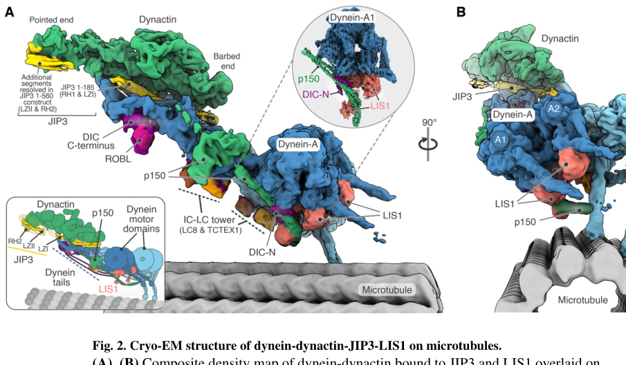

## Question

# Gene Research for Functional Annotation

## ⚠️ CRITICAL: Gene/Protein Identification Context

**BEFORE YOU BEGIN RESEARCH:** You MUST verify you are researching the CORRECT gene/protein. Gene symbols can be ambiguous, especially for less well-characterized genes from non-model organisms.

### Target Gene/Protein Identity (from UniProt):
- **UniProt Accession:** P43034
- **Protein Description:** RecName: Full=Platelet-activating factor acetylhydrolase IB subunit beta {ECO:0000255|HAMAP-Rule:MF_03141, ECO:0000305}; AltName: Full=Lissencephaly-1 protein {ECO:0000255|HAMAP-Rule:MF_03141}; Short=LIS-1 {ECO:0000255|HAMAP-Rule:MF_03141}; AltName: Full=PAF acetylhydrolase 45 kDa subunit {ECO:0000255|HAMAP-Rule:MF_03141}; Short=PAF-AH 45 kDa subunit {ECO:0000255|HAMAP-Rule:MF_03141}; AltName: Full=PAF-AH alpha {ECO:0000255|HAMAP-Rule:MF_03141}; Short=PAFAH alpha {ECO:0000255|HAMAP-Rule:MF_03141};
- **Gene Information:** Name=PAFAH1B1 {ECO:0000255|HAMAP-Rule:MF_03141, ECO:0000312|HGNC:HGNC:8574}; Synonyms=LIS1 {ECO:0000255|HAMAP-Rule:MF_03141}, MDCR, MDS, PAFAHA;
- **Organism (full):** Homo sapiens (Human).
- **Protein Family:** Belongs to the WD repeat LIS1/nudF family.
- **Key Domains:** Dynein_regulator_LIS1. (IPR017252); LIS1_N. (IPR037190); LisH. (IPR006594); PAC1-like_LisH-like_dom. (IPR056795); WD40/YVTN_repeat-like_dom_sf. (IPR015943)

### MANDATORY VERIFICATION STEPS:

1. **Check if the gene symbol "PAFAH1B1" matches the protein description above**
2. **Verify the organism is correct:** Homo sapiens (Human).
3. **Check if protein family/domains align with what you find in literature**
4. **If you find literature for a DIFFERENT gene with the same or similar symbol, STOP**

### If Gene Symbol is Ambiguous or You Cannot Find Relevant Literature:

**DO NOT PROCEED WITH RESEARCH ON A DIFFERENT GENE.** Instead:
- State clearly: "The gene symbol 'PAFAH1B1' is ambiguous or literature is limited for this specific protein"
- Explain what you found (e.g., "Found extensive literature on a different gene with the same symbol in a different organism")
- Describe the protein based ONLY on the UniProt information provided above
- Suggest that the protein function can be inferred from domain/family information

### Research Target:

Please provide a comprehensive research report on the gene **PAFAH1B1** (gene ID: PAFAH1B1, UniProt: P43034) in human.

The research report should be a detailed narrative explaining the function, biological processes, and localization of the gene product. Citations should be given for all claims.

You should prioritize authoritative reviews and primary scientific literature when conducting research. You can supplement
this with annotations you find in gene/protein databases, but these can be outdated or inaccurate.

We are specifically interested in the primary function of the gene - for enzymes, what reaction is catalyzed, and what is the substrate specificity? For transporters, what is the substrate? For structural proteins or adapters, what is the broader structural role? For signaling molecules, what is the role in the pathway.

We are interested in where in or outside the cell the gene product carries out its function.

We are also interested in the signaling or biochemical pathways in which the gene functions. We are less interested in broad pleiotropic effects, except where these elucidate the precise role.

Include evidence where possible. We are interested in both experimental evidence as well as inference from structure, evolution, or bioinformatic analysis. Precise studies should be prioritized over high-throughput, where available.

## Output

Question: You are an expert researcher providing comprehensive, well-cited information.

Provide detailed information focusing on:
1. Key concepts and definitions with current understanding
2. Recent developments and latest research (prioritize 2023-2024 sources)
3. Current applications and real-world implementations
4. Expert opinions and analysis from authoritative sources
5. Relevant statistics and data from recent studies

Format as a comprehensive research report with proper citations. Include URLs and publication dates where available.
Always prioritize recent, authoritative sources and provide specific citations for all major claims.

# Gene Research for Functional Annotation

## ⚠️ CRITICAL: Gene/Protein Identification Context

**BEFORE YOU BEGIN RESEARCH:** You MUST verify you are researching the CORRECT gene/protein. Gene symbols can be ambiguous, especially for less well-characterized genes from non-model organisms.

### Target Gene/Protein Identity (from UniProt):
- **UniProt Accession:** P43034
- **Protein Description:** RecName: Full=Platelet-activating factor acetylhydrolase IB subunit beta {ECO:0000255|HAMAP-Rule:MF_03141, ECO:0000305}; AltName: Full=Lissencephaly-1 protein {ECO:0000255|HAMAP-Rule:MF_03141}; Short=LIS-1 {ECO:0000255|HAMAP-Rule:MF_03141}; AltName: Full=PAF acetylhydrolase 45 kDa subunit {ECO:0000255|HAMAP-Rule:MF_03141}; Short=PAF-AH 45 kDa subunit {ECO:0000255|HAMAP-Rule:MF_03141}; AltName: Full=PAF-AH alpha {ECO:0000255|HAMAP-Rule:MF_03141}; Short=PAFAH alpha {ECO:0000255|HAMAP-Rule:MF_03141};
- **Gene Information:** Name=PAFAH1B1 {ECO:0000255|HAMAP-Rule:MF_03141, ECO:0000312|HGNC:HGNC:8574}; Synonyms=LIS1 {ECO:0000255|HAMAP-Rule:MF_03141}, MDCR, MDS, PAFAHA;
- **Organism (full):** Homo sapiens (Human).
- **Protein Family:** Belongs to the WD repeat LIS1/nudF family.
- **Key Domains:** Dynein_regulator_LIS1. (IPR017252); LIS1_N. (IPR037190); LisH. (IPR006594); PAC1-like_LisH-like_dom. (IPR056795); WD40/YVTN_repeat-like_dom_sf. (IPR015943)

### MANDATORY VERIFICATION STEPS:

1. **Check if the gene symbol "PAFAH1B1" matches the protein description above**
2. **Verify the organism is correct:** Homo sapiens (Human).
3. **Check if protein family/domains align with what you find in literature**
4. **If you find literature for a DIFFERENT gene with the same or similar symbol, STOP**

### If Gene Symbol is Ambiguous or You Cannot Find Relevant Literature:

**DO NOT PROCEED WITH RESEARCH ON A DIFFERENT GENE.** Instead:
- State clearly: "The gene symbol 'PAFAH1B1' is ambiguous or literature is limited for this specific protein"
- Explain what you found (e.g., "Found extensive literature on a different gene with the same symbol in a different organism")
- Describe the protein based ONLY on the UniProt information provided above
- Suggest that the protein function can be inferred from domain/family information

### Research Target:

Please provide a comprehensive research report on the gene **PAFAH1B1** (gene ID: PAFAH1B1, UniProt: P43034) in human.

The research report should be a detailed narrative explaining the function, biological processes, and localization of the gene product. Citations should be given for all claims.

You should prioritize authoritative reviews and primary scientific literature when conducting research. You can supplement
this with annotations you find in gene/protein databases, but these can be outdated or inaccurate.

We are specifically interested in the primary function of the gene - for enzymes, what reaction is catalyzed, and what is the substrate specificity? For transporters, what is the substrate? For structural proteins or adapters, what is the broader structural role? For signaling molecules, what is the role in the pathway.

We are interested in where in or outside the cell the gene product carries out its function.

We are also interested in the signaling or biochemical pathways in which the gene functions. We are less interested in broad pleiotropic effects, except where these elucidate the precise role.

Include evidence where possible. We are interested in both experimental evidence as well as inference from structure, evolution, or bioinformatic analysis. Precise studies should be prioritized over high-throughput, where available.

# PAFAH1B1/LIS1 (UniProt P43034): Functional Annotation Research Report

## Executive conclusion

The requested target is unambiguous: human **PAFAH1B1** encodes the approximately 45-kDa protein **LIS1** (UniProt **P43034**), also historically called the β/45-kDa regulatory subunit of intracellular platelet-activating-factor acetylhydrolase Ib. Its N-terminal LisH/coiled-coil region and C-terminal WD40 β-propeller place it in the conserved LIS1/NudF family and match the domains specified in the query. Human structural studies explicitly used P43034 as the LIS1 model. This is not PAFAH1B2 or PAFAH1B3, the related catalytic PAF-acetylhydrolase subunits. (reimer2023structuresofhuman pages 7-9, singh2024molecularmechanismof pages 6-8, reimer2022structuresofhuman pages 10-10, hattori2015intracellularpafacetylhydrolasetype pages 1-4)

The best-supported primary function of LIS1 is **nonenzymatic regulation and assembly of cytoplasmic dynein-1**, particularly formation of active dynein–dynactin–cargo-adaptor complexes and force production during high-load processes such as nuclear movement. LIS1 itself does **not** hydrolyze platelet-activating factor (PAF); its acetylhydrolase-related name reflects its presence as a regulatory subunit in a historical enzyme complex. (singh2024molecularmechanismof pages 6-8, moon2013cytoskeletoninaction pages 4-5, clark2015plateletactivatingfactoracetylhydrolase pages 1-4, hattori2015intracellularpafacetylhydrolasetype pages 4-7)

| Topic | Current conclusion | Strongest evidence | Key quantitative detail | Source/date/DOI URL |
|---|---|---|---|---|
| Identity/domain architecture | Human **PAFAH1B1** encodes **LIS1** (UniProt **P43034**), a dimeric interaction scaffold in the WD-repeat LIS1/NudF family. Each protomer has an N-terminal **LisH/coiled-coil dimerization region** and a C-terminal seven-bladed **WD40 β-propeller** that engages dynein; this is not a catalytic-lipase fold. | Human dynein–LIS1 cryo-EM structures used P43034 and resolved one or two LIS1 β-propellers; structural analysis confirms the LisH/WD40 organization and LIS1–LIS1 dimer interface. (reimer2023structuresofhuman pages 7-9, singh2024molecularmechanismof pages 6-8, reimer2022structuresofhuman pages 10-10) | Dynein–LIS1 maps: **4.0 and 4.1 Å**; human LIS1 dimer interface about **301 Ų**, versus **590 Ų** for yeast Pac1. | Reimer et al., **January 2023**, *eLife*. [https://doi.org/10.7554/eLife.84302](https://doi.org/10.7554/eLife.84302) |
| Noncatalytic PAF-AH role | LIS1 is the **noncatalytic regulatory β subunit** of intracellular PAF-acetylhydrolase Ib. **PAFAH1B2/α2** and **PAFAH1B3/α1**, not LIS1, hydrolyze the sn-2 acetyl ester of platelet-activating factor to produce lyso-PAF and acetate; catalytic-dimer composition changes preference among short-chain acetyl phospholipids. Its historical enzyme-complex name should not be interpreted as evidence that LIS1 itself catalyzes PAF hydrolysis. | Biochemical and structural reviews identify a catalytic α1/α2 dimer associated with LIS1 and explicitly classify LIS1 as noncatalytic. Disruption of both catalytic subunits did not reproduce the characteristic LIS1 brain phenotype, supporting distinction between PAF hydrolysis and LIS1’s developmental function. (clark2015plateletactivatingfactoracetylhydrolase pages 1-4, hattori2015intracellularpafacetylhydrolasetype pages 1-4, arai2002plateletactivatingfactoracetylhydrolase pages 1-2, hattori2015intracellularpafacetylhydrolasetype pages 4-7, karasawa2015overviewofpafdegrading pages 3-7) | Native complex historically estimated at approximately **100 kDa**; subunits are LIS1 **45 kDa**, PAFAH1B2 **30 kDa**, and PAFAH1B3 **29 kDa**. | Hattori & Arai, **2015**, *The Enzymes*. [https://doi.org/10.1016/bs.enz.2015.09.007](https://doi.org/10.1016/bs.enz.2015.09.007); Clark, **2015**. [https://doi.org/10.1016/bs.enz.2015.09.009](https://doi.org/10.1016/bs.enz.2015.09.009) |
| Dynein activation and assembly | LIS1 is principally a **nonenzymatic cytoplasmic-dynein-1 assembly/activation factor**. Its WD40 propellers bind dynein at ring and stalk sites, favor release from the autoinhibited Φ state, stabilize a bent-linker pre-powerstroke motor, and promote assembly with dynactin and a cargo adaptor. The 2024 model adds a direct LIS1–dynactin-p150 contact that constrains and primes dynein–dynactin for adaptor binding; LIS1 is then released as processive movement begins. | Reimer et al. directly resolved human dynein with one or two LIS1 propellers. Singh et al. resolved microtubule-bound dynein–dynactin–JIP3–LIS1 and showed that LIS1 must bridge p150 and the dynein-A motor efficiently to stimulate active-complex formation. The inspected structural figure shows two dyneins, p150/dynactin, JIP3, LIS1 and microtubule in the proposed assembly intermediate. (reimer2023structuresofhuman pages 1-2, singh2024molecularmechanismof pages 6-8, reimer2022structuresofhuman pages 2-3, singh2024molecularmechanismof pages 37-40, singh2024molecularmechanismof media fa1344c2) | Singh motility analyses included **1,592** events with LIS1 versus **74** in the blank condition; other mechanistic conditions analyzed **116–675** events. Activated dynein–dynactin–adaptor is approximately **4 MDa**. | Reimer et al., **January 2023**, *eLife*. [https://doi.org/10.7554/eLife.84302](https://doi.org/10.7554/eLife.84302); Singh et al., **March 2024**, *Science*. [https://doi.org/10.1126/science.adk8544](https://doi.org/10.1126/science.adk8544) |
| Neuronal nucleokinesis/NDEL1 evidence | The LIS1–NDEL1–dynein module couples centrosome movement to nuclear translocation during neuronal migration. A pathogenic NDEL1 p.Arg105Pro substitution disrupts NDEL1–LIS1 binding, increases nucleus–centrosome separation and blocks cortical migration, independently validating the functional importance of recruiting LIS1 to dynein during high-load nuclear transport. | Two people with mosaic NDEL1 p.Arg105Pro had pachygyria with or without subcortical-band heterotopia. Mouse in-utero electroporation, centrosome imaging and co-immunoprecipitation showed migration arrest, defective nucleus–centrosome coupling and dramatically reduced LIS1 binding. (tsai2024novellissencephalyassociatedndel1 pages 1-2, tsai2024novellissencephalyassociatedndel1 pages 7-9, tsai2024novellissencephalyassociatedndel1 pages 15-16) | Variant-expressing neurons reaching cortical plate: **2.1%**, versus **83.6%** with vector; leading process **151.9 ± 6.1 μm** versus **38.8 ± 1.6 μm**; nucleus–centrosome distance **6.6 ± 0.7 μm** versus **2.0 ± 0.2 μm**. | Tsai et al., **January 2024**, *Acta Neuropathologica*. [https://doi.org/10.1007/s00401-023-02665-y](https://doi.org/10.1007/s00401-023-02665-y) |
| Cytokinesis/actomyosin | Beyond cargo transport, LIS1-dependent microtubule/dynein organization coordinates **RhoA–Anillin–actomyosin contractility**, cleavage-furrow placement and daughter-cell separation. Reduced LIS1 causes displaced furrows, dispersed contractile-ring components, polar blebbing, hypercontractility and binucleation. | Dose-controlled mouse neocortical progenitors and mutant fibroblasts showed mislocalized RhoA, Anillin, F-actin, myosin-II and cortical p150. RhoA activation phenocopied, whereas RhoA inhibition reduced, mutant cytokinesis defects. (moon2020lis1determinescleavage pages 14-17, moon2020lis1determinescleavage pages 2-4, moon2020lis1determinescleavage pages 17-19) | Vertical progenitor divisions fell from **84% to 42%**; unequal aPKCζ inheritance increased from **30.7% to 68.8%**. Wild-type fibroblasts completed daughter-cell separation in **85.4 ± 6.1%** of events. | Moon et al., **March 2020**, *eLife*. [https://doi.org/10.7554/eLife.51512](https://doi.org/10.7554/eLife.51512) |
| Human disease/clinical relevance | Heterozygous PAFAH1B1 loss-of-function causes a dosage-sensitive spectrum including classic/type-1 lissencephaly and subcortical-band heterotopia; larger 17p13.3 deletions involving PAFAH1B1 and neighboring genes cause Miller–Dieker syndrome. Most pathogenic alleles are deletions or truncating variants producing haploinsufficiency; some missense variants destabilize the WD40 propeller or perturb dynein/LIS1 interfaces. Current implementation is primarily **MRI plus molecular diagnosis, genetic counseling and supportive multidisciplinary care**, not LIS1-targeted therapy. | Disease variants map onto the human dynein–LIS1 structure, while curated human genetics independently links PAFAH1B1 to classic lissencephaly, LIS1-related lissencephaly-spectrum disorders, subcortical-band heterotopia and intellectual disability. (OpenTargets Search: -PAFAH1B1, reimer2023structuresofhuman pages 7-9, reimer2022structuresofhuman pages 4-5) | Open Targets association scores in the retrieved analysis: lissencephaly spectrum **0.854**, classic lissencephaly **0.850**, LIS1-related lissencephaly **0.836**, and subcortical-band heterotopia **0.751**; these are evidence-integration scores, not prevalence estimates. | Open Targets, accessed **2026-09-27**. [https://platform.opentargets.org/target/ENSG00000007168](https://platform.opentargets.org/target/ENSG00000007168); Reimer et al., **2023**. [https://doi.org/10.7554/eLife.84302](https://doi.org/10.7554/eLife.84302) |

*Table: Concise evidence matrix distinguishing LIS1’s noncatalytic historical role in PAF-AH Ib from its primary function in cytoplasmic-dynein regulation, with recent structural, cellular and disease evidence.*

## 1. Identity, nomenclature, and architecture

**Verified identifiers**

- Gene: **PAFAH1B1**, also **LIS1**, MDCR, MDS, PAFAHA.
- Organism: **Homo sapiens**.
- Protein: LIS1/platelet-activating-factor acetylhydrolase Ib regulatory subunit, UniProt **P43034**.
- Family: WD-repeat **LIS1/NudF** family.

LIS1 is a dimeric protein-interaction scaffold. Each protomer contains an N-terminal **LisH/coiled-coil dimerization region** and a C-terminal seven-bladed **WD40 β-propeller**, the principal dynein-interaction module. The β-propeller architecture is consistent with a binding scaffold, not a hydrolase catalytic fold. Human cryo-EM structures resolved dynein bound to one or two LIS1 propellers at approximately 4.0–4.1 Å; the human LIS1–LIS1 interface buried about 301 Ų, compared with 590 Ų for yeast Pac1. (reimer2023structuresofhuman pages 7-9, singh2024molecularmechanismof pages 6-8, reimer2022structuresofhuman pages 2-3, derewenda1998thestructureand pages 5-8)

This identity also resolves a nomenclature trap. Older literature sometimes called the 45-, 30-, and 29-kDa PAF-AH Ib components α, β, and γ, whereas modern terminology designates LIS1/PAFAH1B1 as the noncatalytic β subunit and PAFAH1B2/α2 and PAFAH1B3/α1 as catalytic subunits. (hattori2015intracellularpafacetylhydrolasetype pages 1-4, hattori2015intracellularpafacetylhydrolasetype pages 4-7)

## 2. Primary molecular function: dynein activation and complex assembly

Cytoplasmic dynein-1 is a minus-end-directed microtubule motor. Efficient processive movement generally requires dynein to assemble with dynactin and a cargo-specific activating adaptor. LIS1 acts upstream and during this assembly process rather than functioning as a permanent cargo adaptor.

Human cryo-EM studies show that LIS1 WD40 propellers bind two sites on the dynein motor: one on the AAA+ ring and another near the stalk. LIS1 favors release of dynein from its autoinhibited “Phi” configuration and stabilizes an assembly-competent motor state. Disease-associated variants can destabilize the WD40 propeller or perturb these interaction surfaces. (reimer2023structuresofhuman pages 1-2, reimer2022structuresofhuman pages 2-3, reimer2022structuresofhuman pages 4-5)

A major 2024 advance refined this model. Singh and colleagues resolved a dynein–dynactin–JIP3–LIS1 assembly intermediate on microtubules. Two LIS1 dimers engaged one dynein motor through the ring and stalk sites, while LIS1 also contacted dynactin’s p150 arm. LIS1 stabilized a bent-linker, pre-powerstroke, low-microtubule-affinity state and helped position dynein beneath p150, thereby priming productive adaptor binding and recruitment of a second dynein. LIS1 is subsequently expected to disengage so both motors can support processive transport. (singh2024molecularmechanismof pages 6-8, singh2024molecularmechanismof pages 37-40)

The inspected structural figure directly shows two dyneins, dynactin/p150, the JIP3 adaptor, LIS1, and the microtubule in this proposed intermediate. (singh2024molecularmechanismof media fa1344c2, singh2024molecularmechanismof media f324cfab)

Functional assays support the structural interpretation. Singh et al. analyzed 1,592 processive movements in a LIS1 condition, compared with 74 in the blank condition, with additional engineered conditions ranging from 116 to 675 events. These event counts support reproducible LIS1-dependent activation, although they should not be interpreted alone as fold changes in velocity or transport probability. (singh2024molecularmechanismof pages 37-40)

## 3. Is PAFAH1B1 an enzyme?

**No—LIS1 itself is noncatalytic.** Intracellular PAF-AH Ib contains LIS1 plus catalytic PAFAH1B2 and PAFAH1B3 subunits. The catalytic reaction is hydrolysis of the sn-2 acetyl ester of platelet-activating factor:

**PAF + H₂O → lyso-PAF + acetate.**

PAFAH1B2 and PAFAH1B3 contain catalytic serine-based active sites; LIS1 regulates or scaffolds the complex but is unnecessary for the chemical hydrolysis step. Catalytic-dimer composition affects lipid preference: PAFAH1B2 homodimers preferentially act on PAF and related alkyl-acetyl phosphatidylethanolamine, whereas PAFAH1B3-containing dimers more efficiently process alkyl-acetyl phosphatidic acid. (arai2002plateletactivatingfactoracetylhydrolase pages 1-2, hattori2015intracellularpafacetylhydrolasetype pages 4-7, karasawa2015overviewofpafdegrading pages 3-7)

The physiological importance of the PAF-hydrolase association remains less clear than the dynein function. In particular, disrupting both catalytic subunits did not reproduce the characteristic LIS1 brain phenotype, arguing that cortical malformation is not simply caused by failure to degrade PAF. Expert reviews therefore distinguish LIS1’s historical enzyme-complex annotation from its principal developmental function as a cytoskeletal motor regulator. (clark2015plateletactivatingfactoracetylhydrolase pages 1-4, arai2002plateletactivatingfactoracetylhydrolase pages 2-3)

## 4. Cellular localization and sites of action

LIS1 is an **intracellular, predominantly cytoplasmic and cytoskeleton-associated protein**. It is not a secreted factor or integral membrane transporter. Its localization is dynamic because it accompanies dynein assembly and high-force deployment rather than constituting a fixed organelle component.

Functionally important sites include:

- **Dynein motor domains and dynactin-containing transport assemblies** in the cytoplasm.
- **Microtubules and centrosomal regions**, where LIS1 participates in microtubule organization and centrosome-directed force generation.
- **The centrosome–nucleus axis and perinuclear microtubule cage** during nucleokinesis.
- **Mitotic spindle/astral-microtubule and cell-cortex systems**, where dynein-dependent forces influence spindle orientation and cleavage-plane placement.
- **The equatorial and polar cortex during cytokinesis**, indirectly coordinating dynactin with RhoA, Anillin, F-actin and nonmuscle myosin II. (moon2020lis1determinescleavage pages 14-17, moon2020lis1determinescleavage pages 1-2, moon2013cytoskeletoninaction pages 4-5, tsai2024novellissencephalyassociatedndel1 pages 1-2)

Thus, “where LIS1 functions” is best described spatially as wherever regulated dynein must be assembled or generate force—especially at microtubule-based transport complexes, centrosome/nuclear coupling machinery, mitotic structures, and the cortex—rather than as one stable subcellular compartment.

## 5. Biological pathways and processes

### 5.1 Dynein–dynactin cargo transport

LIS1 helps convert dynein from an autoinhibited soluble motor into an adaptor-engaged dynein–dynactin complex. This affects minus-end-directed organelle and macromolecular transport, intracellular organization, and mitotic functions. LIS1 should therefore be annotated as a **dynein assembly/activation factor**, not as cargo, a microtubule motor, or an ATPase itself. (reimer2023structuresofhuman pages 1-2, singh2024molecularmechanismof pages 6-8, singh2024molecularmechanismof pages 37-40)

### 5.2 Nucleokinesis and neuronal migration

During cortical neuronal migration, the centrosome advances into the leading process and dynein then pulls the nucleus toward it along microtubules. LIS1 cooperates with NDE1/NDEL1 to organize this high-load process. Impaired centrosome–nucleus coupling disrupts nucleokinesis, preventing neurons from reaching the developing cortical plate. (moon2013cytoskeletoninaction pages 4-5, tsai2024novellissencephalyassociatedndel1 pages 1-2)

Recent independent evidence comes from a 2024 NDEL1 study. Two individuals with pachygyria, with or without subcortical-band heterotopia, carried the same mosaic p.Arg105Pro NDEL1 variant. The substitution disrupted NDEL1–LIS1 binding. In embryonic mouse cortex, only 2.1 ± 0.7% of variant-expressing cells reached the cortical plate, versus 83.6 ± 6.4% with vector. Leading processes lengthened from 38.8 ± 1.6 to 151.9 ± 6.1 μm, and nucleus–centrosome distance increased from 2.0 ± 0.2 to 6.6 ± 0.7 μm. These results strongly support a LIS1–NDEL1–dynein module coupling the nucleus to the centrosome. (tsai2024novellissencephalyassociatedndel1 pages 1-2, tsai2024novellissencephalyassociatedndel1 pages 7-9, tsai2024novellissencephalyassociatedndel1 pages 15-16)

### 5.3 Mitosis, cleavage-plane control, and cytokinesis

LIS1 dosage also affects spindle orientation, chromosome behavior, and late cytokinesis. In Pafah1b1-deficient neural progenitors and fibroblasts, RhoA and Anillin were displaced, equatorial F-actin/myosin-II organization became diffuse, polar blebbing and hypercontractility increased, and cleavage furrows were asymmetrically positioned. RhoA activation reproduced these defects in wild-type cells, whereas RhoA inhibition reduced defects in mutant cells, supporting a causal connection between LIS1-dependent microtubule/dynein organization and actomyosin contractility. (moon2020lis1determinescleavage pages 14-17, moon2020lis1determinescleavage pages 2-4, moon2020lis1determinescleavage pages 17-19)

Quantitatively, vertical neural-progenitor divisions fell from 84% to 42%, while unequal inheritance of the apical determinant aPKCζ increased from 30.7% to 68.8%. These defects can alter progenitor maintenance and neuronal output in addition to directly impairing migration. (moon2020lis1determinescleavage pages 4-5)

### 5.4 Relationship to Reelin signaling

Older genetic and biochemical work places the PAF-AH Ib complex near Reelin signaling: LIS1 can associate with phosphorylated Dab1, while catalytic PAFAH subunits interact with VLDLR. This may connect extracellular cortical-positioning cues to cytoskeletal machinery. However, the direct dynein mechanism is substantially better established than a single linear “Reelin→LIS1” signaling pathway, and LIS1 should not be annotated simply as a canonical Reelin-pathway component. (moon2013cytoskeletoninaction pages 4-5, arai2002plateletactivatingfactoracetylhydrolase pages 1-2)

## 6. Human disease relevance

Heterozygous loss-of-function of PAFAH1B1 causes a dosage-sensitive malformation-of-cortical-development spectrum, particularly **classic/type-1 lissencephaly** and **subcortical-band heterotopia**. Larger chromosome 17p13.3 deletions containing PAFAH1B1 and neighboring genes cause **Miller–Dieker syndrome**, which is generally more severe and should not be attributed solely to PAFAH1B1. Most PAFAH1B1 disease alleles are deletions or truncating variants producing haploinsufficiency; some missense alleles likely destabilize the WD40 propeller or perturb LIS1–dynein/LIS1–LIS1 interfaces. (reimer2023structuresofhuman pages 7-9, reimer2022structuresofhuman pages 4-5)

Curated human-genetics evidence strongly associates PAFAH1B1 with lissencephaly-spectrum disorders, classic lissencephaly, LIS1-related lissencephaly, subcortical-band heterotopia, and intellectual disability. Open Targets evidence-integration scores in the retrieved analysis were 0.854 for lissencephaly-spectrum disorders, 0.850 for classic lissencephaly, 0.836 for LIS1-related lissencephaly, and 0.751 for subcortical-band heterotopia. These are database association scores—not prevalence, penetrance, or diagnostic sensitivity. (OpenTargets Search: -PAFAH1B1)

## 7. Current applications and clinical implementation

Current real-world use of PAFAH1B1 knowledge is mainly:

1. **Molecular diagnosis:** sequencing and deletion/duplication analysis for patients with an appropriate MRI pattern or developmental phenotype.
2. **Variant interpretation:** mapping missense substitutions onto the WD40 fold and human dynein–LIS1 interfaces.
3. **Prenatal and family counseling:** determining whether a variant is de novo, inherited, or mosaic and distinguishing an intragenic PAFAH1B1 disorder from a larger 17p13.3 deletion.
4. **Disease modeling:** patient-derived cells, neural progenitors, cerebral models, and animal systems are used to investigate dynein dosage, neuronal migration, and potential rescue strategies.
5. **Supportive clinical management:** seizure management, nutrition, respiratory care, developmental therapies, tone/orthopedic management, and surveillance appropriate to disease severity.

No established treatment directly restores LIS1 dosage or corrects the LIS1–dynein interface. The retrieved trial landscape included a genetics-focused lissencephaly study combining exome and transcriptome data, but not a PAFAH1B1-directed therapeutic trial. Consequently, structural rescue, gene replacement, RNA-based dosage correction, or pharmacologic dynein modulation remain research directions rather than current clinical therapies.

## 8. Recent developments, 2023–2024

- **Reimer et al., January 2023, eLife:** first detailed human dynein–LIS1 cryo-EM structures, defining human-specific ring, stalk, and LIS1-dimer contacts and permitting disease variants to be interpreted in structural context. DOI: [10.7554/eLife.84302](https://doi.org/10.7554/eLife.84302). (reimer2023structuresofhuman pages 7-9, reimer2023structuresofhuman pages 1-2, reimer2022structuresofhuman pages 2-3)
- **Ton et al., June 2023, Nature Structural & Molecular Biology:** proposed that microtubule binding triggers dynein allostery and LIS1 dissociation before sustained cargo transport, reinforcing the view that LIS1 is chiefly an assembly/initiation factor rather than a stoichiometric passenger throughout every run. DOI: [10.1038/s41594-023-01010-x](https://doi.org/10.1038/s41594-023-01010-x). The full quantitative results were not available in the retrieved text, so no numerical effect is asserted here.
- **Singh et al., March 2024, Science:** discovered a direct functional LIS1–dynactin-p150 interaction and visualized LIS1 constraining dynein–dynactin into an adaptor-receptive assembly intermediate. DOI: [10.1126/science.adk8544](https://doi.org/10.1126/science.adk8544). (singh2024molecularmechanismof pages 6-8, singh2024molecularmechanismof pages 37-40, singh2024molecularmechanismof media fa1344c2)
- **Tsai et al., January 2024, Acta Neuropathologica:** showed that a human NDEL1 lissencephaly variant disrupts LIS1 binding, nucleus–centrosome coupling, and neuronal migration, providing a human-genetic validation of the LIS1 dynein/nucleokinesis mechanism. DOI: [10.1007/s00401-023-02665-y](https://doi.org/10.1007/s00401-023-02665-y). (tsai2024novellissencephalyassociatedndel1 pages 1-2, tsai2024novellissencephalyassociatedndel1 pages 7-9, tsai2024novellissencephalyassociatedndel1 pages 15-16)

## 9. Expert interpretation and remaining uncertainties

The emerging consensus is that LIS1 is best understood as a **transient mechanochemical organizer of dynein activation**. Earlier models emphasized a “clutch” that increases dynein’s microtubule attachment under load; newer human structures emphasize relief of autoinhibition, stabilization of assembly intermediates, recruitment/orientation of p150, and release around movement initiation. These models need not be mutually exclusive: LIS1’s effect depends on motor nucleotide state, dynein assembly state, adaptor identity, microtubule engagement, and mechanical load. (singh2024molecularmechanismof pages 6-8, reimer2023structuresofhuman pages 12-13, tsai2024novellissencephalyassociatedndel1 pages 15-16)

Key unresolved questions are the precise timing and regulation of LIS1 release in cells, whether different cargo adaptors use quantitatively different LIS1-dependent assembly routes, how LIS1 dosage affects human radial-glial versus post-mitotic neuronal programs, and whether the PAF-AH Ib association has a physiologically important lipid-regulatory role independent of dynein. Therapeutic modulation is especially challenging because both insufficient and mistimed dynein activity could be harmful, and the principal developmental defect occurs prenatally.

## Functional annotation summary

**Recommended primary annotation:** *Noncatalytic dimeric WD40 regulator of cytoplasmic dynein-1 that promotes assembly and activation of dynein–dynactin–cargo-adaptor complexes and supports high-load microtubule-dependent force production.*

**Principal biological contexts:** intracellular retrograde transport, centrosome–nucleus coupling and nucleokinesis, cortical neuronal migration, mitotic-spindle/cleavage-plane regulation, and cytokinesis.

**Principal cellular locations:** cytoplasmic dynein/dynactin assemblies, microtubule- and centrosome-associated structures, the perinuclear nucleokinesis machinery, mitotic apparatus, and cell cortex.

**Enzyme annotation:** LIS1 is **not catalytic**. In intracellular PAF-AH Ib it is a regulatory subunit; PAFAH1B2 and PAFAH1B3 hydrolyze the sn-2 acetyl group of PAF and related short-chain phospholipids. (clark2015plateletactivatingfactoracetylhydrolase pages 1-4, hattori2015intracellularpafacetylhydrolasetype pages 1-4, hattori2015intracellularpafacetylhydrolasetype pages 4-7, karasawa2015overviewofpafdegrading pages 3-7)

References

1. (reimer2023structuresofhuman pages 7-9): Janice M Reimer, Morgan E DeSantis, Samara L Reck-Peterson, and Andres E Leschziner. Structures of human dynein in complex with the lissencephaly 1 protein, lis1. eLife, Jan 2023. URL: https://doi.org/10.7554/elife.84302, doi:10.7554/elife.84302. This article has 24 citations and is from a domain leading peer-reviewed journal.

2. (singh2024molecularmechanismof pages 6-8): Kashish Singh, Clinton K. Lau, Giulia Manigrasso, José B. Gama, Reto Gassmann, and Andrew P. Carter. Molecular mechanism of dynein-dynactin complex assembly by lis1. Mar 2024. URL: https://doi.org/10.1126/science.adk8544, doi:10.1126/science.adk8544. This article has 93 citations and is from a highest quality peer-reviewed journal.

3. (reimer2022structuresofhuman pages 10-10): Janice M. Reimer, Morgan E. DeSantis, Samara L. Reck-Peterson, and Andres E. Leschziner. Structures of human cytoplasmic dynein in complex with the lissencephaly 1 protein, lis1. bioRxiv, Oct 2022. URL: https://doi.org/10.1101/2022.10.08.511426, doi:10.1101/2022.10.08.511426. This article has 3 citations.

4. (hattori2015intracellularpafacetylhydrolasetype pages 1-4): Mitsuharu Hattori and Hiroyuki Arai. Intracellular paf-acetylhydrolase type i. The Enzymes, 38:23-36, Jan 2015. URL: https://doi.org/10.1016/bs.enz.2015.09.007, doi:10.1016/bs.enz.2015.09.007. This article has 13 citations.

5. (moon2013cytoskeletoninaction pages 4-5): Hyang Mi Moon and Anthony Wynshaw‐Boris. Cytoskeleton in action: lissencephaly, a neuronal migration disorder. Wiley Interdisciplinary Reviews: Developmental Biology, 2:229-245, Mar 2013. URL: https://doi.org/10.1002/wdev.67, doi:10.1002/wdev.67. This article has 149 citations.

6. (clark2015plateletactivatingfactoracetylhydrolase pages 1-4): Gary D. Clark. Platelet-activating factor acetylhydrolase and brain development. The Enzymes, 38:37-42, Jan 2015. URL: https://doi.org/10.1016/bs.enz.2015.09.009, doi:10.1016/bs.enz.2015.09.009. This article has 10 citations.

7. (hattori2015intracellularpafacetylhydrolasetype pages 4-7): Mitsuharu Hattori and Hiroyuki Arai. Intracellular paf-acetylhydrolase type i. The Enzymes, 38:23-36, Jan 2015. URL: https://doi.org/10.1016/bs.enz.2015.09.007, doi:10.1016/bs.enz.2015.09.007. This article has 13 citations.

8. (arai2002plateletactivatingfactoracetylhydrolase pages 1-2): H. Arai, Hiroyuki Koizumi, J. Aoki, and Keizō Inoue. Platelet-activating factor acetylhydrolase (paf-ah). Journal of biochemistry, 131 5:635-40, May 2002. URL: https://doi.org/10.1093/oxfordjournals.jbchem.a003145, doi:10.1093/oxfordjournals.jbchem.a003145. This article has 159 citations and is from a peer-reviewed journal.

9. (karasawa2015overviewofpafdegrading pages 3-7): Ken Karasawa and Keizo Inoue. Overview of paf-degrading enzymes. The Enzymes, 38:1-22, Jan 2015. URL: https://doi.org/10.1016/bs.enz.2015.09.006, doi:10.1016/bs.enz.2015.09.006. This article has 26 citations.

10. (reimer2023structuresofhuman pages 1-2): Janice M Reimer, Morgan E DeSantis, Samara L Reck-Peterson, and Andres E Leschziner. Structures of human dynein in complex with the lissencephaly 1 protein, lis1. eLife, Jan 2023. URL: https://doi.org/10.7554/elife.84302, doi:10.7554/elife.84302. This article has 24 citations and is from a domain leading peer-reviewed journal.

11. (reimer2022structuresofhuman pages 2-3): Janice M. Reimer, Morgan E. DeSantis, Samara L. Reck-Peterson, and Andres E. Leschziner. Structures of human cytoplasmic dynein in complex with the lissencephaly 1 protein, lis1. bioRxiv, Oct 2022. URL: https://doi.org/10.1101/2022.10.08.511426, doi:10.1101/2022.10.08.511426. This article has 3 citations.

12. (singh2024molecularmechanismof pages 37-40): Kashish Singh, Clinton K. Lau, Giulia Manigrasso, José B. Gama, Reto Gassmann, and Andrew P. Carter. Molecular mechanism of dynein-dynactin complex assembly by lis1. Mar 2024. URL: https://doi.org/10.1126/science.adk8544, doi:10.1126/science.adk8544. This article has 93 citations and is from a highest quality peer-reviewed journal.

13. (singh2024molecularmechanismof media fa1344c2): Kashish Singh, Clinton K. Lau, Giulia Manigrasso, José B. Gama, Reto Gassmann, and Andrew P. Carter. Molecular mechanism of dynein-dynactin complex assembly by lis1. Mar 2024. URL: https://doi.org/10.1126/science.adk8544, doi:10.1126/science.adk8544. This article has 93 citations and is from a highest quality peer-reviewed journal.

14. (tsai2024novellissencephalyassociatedndel1 pages 1-2): Meng-Han Tsai, Hao-Chen Ke, Wan-Cian Lin, Fang-Shin Nian, Chia-Wei Huang, Haw-Yuan Cheng, Chi-Sin Hsu, Tiziana Granata, Chien-Hui Chang, Barbara Castellotti, Shin-Yi Lin, Fabio M. Doniselli, Cheng-Ju Lu, Silvana Franceschetti, Francesca Ragona, Pei-Shan Hou, Laura Canafoglia, Chien-Yi Tung, Mei-Hsuan Lee, Won-Jing Wang, and Jin-Wu Tsai. Novel lissencephaly-associated ndel1 variant reveals distinct roles of nde1 and ndel1 in nucleokinesis and human cortical malformations. Acta Neuropathologica, Jan 2024. URL: https://doi.org/10.1007/s00401-023-02665-y, doi:10.1007/s00401-023-02665-y. This article has 12 citations and is from a highest quality peer-reviewed journal.

15. (tsai2024novellissencephalyassociatedndel1 pages 7-9): Meng-Han Tsai, Hao-Chen Ke, Wan-Cian Lin, Fang-Shin Nian, Chia-Wei Huang, Haw-Yuan Cheng, Chi-Sin Hsu, Tiziana Granata, Chien-Hui Chang, Barbara Castellotti, Shin-Yi Lin, Fabio M. Doniselli, Cheng-Ju Lu, Silvana Franceschetti, Francesca Ragona, Pei-Shan Hou, Laura Canafoglia, Chien-Yi Tung, Mei-Hsuan Lee, Won-Jing Wang, and Jin-Wu Tsai. Novel lissencephaly-associated ndel1 variant reveals distinct roles of nde1 and ndel1 in nucleokinesis and human cortical malformations. Acta Neuropathologica, Jan 2024. URL: https://doi.org/10.1007/s00401-023-02665-y, doi:10.1007/s00401-023-02665-y. This article has 12 citations and is from a highest quality peer-reviewed journal.

16. (tsai2024novellissencephalyassociatedndel1 pages 15-16): Meng-Han Tsai, Hao-Chen Ke, Wan-Cian Lin, Fang-Shin Nian, Chia-Wei Huang, Haw-Yuan Cheng, Chi-Sin Hsu, Tiziana Granata, Chien-Hui Chang, Barbara Castellotti, Shin-Yi Lin, Fabio M. Doniselli, Cheng-Ju Lu, Silvana Franceschetti, Francesca Ragona, Pei-Shan Hou, Laura Canafoglia, Chien-Yi Tung, Mei-Hsuan Lee, Won-Jing Wang, and Jin-Wu Tsai. Novel lissencephaly-associated ndel1 variant reveals distinct roles of nde1 and ndel1 in nucleokinesis and human cortical malformations. Acta Neuropathologica, Jan 2024. URL: https://doi.org/10.1007/s00401-023-02665-y, doi:10.1007/s00401-023-02665-y. This article has 12 citations and is from a highest quality peer-reviewed journal.

17. (moon2020lis1determinescleavage pages 14-17): Hyang Mi Moon, Simon Hippenmeyer, Liqun Luo, and Anthony Wynshaw-Boris. Lis1 determines cleavage plane positioning by regulating actomyosin-mediated cell membrane contractility. eLife, Mar 2020. URL: https://doi.org/10.7554/elife.51512, doi:10.7554/elife.51512. This article has 18 citations and is from a domain leading peer-reviewed journal.

18. (moon2020lis1determinescleavage pages 2-4): Hyang Mi Moon, Simon Hippenmeyer, Liqun Luo, and Anthony Wynshaw-Boris. Lis1 determines cleavage plane positioning by regulating actomyosin-mediated cell membrane contractility. eLife, Mar 2020. URL: https://doi.org/10.7554/elife.51512, doi:10.7554/elife.51512. This article has 18 citations and is from a domain leading peer-reviewed journal.

19. (moon2020lis1determinescleavage pages 17-19): Hyang Mi Moon, Simon Hippenmeyer, Liqun Luo, and Anthony Wynshaw-Boris. Lis1 determines cleavage plane positioning by regulating actomyosin-mediated cell membrane contractility. eLife, Mar 2020. URL: https://doi.org/10.7554/elife.51512, doi:10.7554/elife.51512. This article has 18 citations and is from a domain leading peer-reviewed journal.

20. (OpenTargets Search: -PAFAH1B1): Open Targets Query (-PAFAH1B1, 5 results). Buniello, A. et al. (2025). Open Targets Platform: facilitating therapeutic hypotheses building in drug discovery. Nucleic Acids Research.

21. (reimer2022structuresofhuman pages 4-5): Janice M. Reimer, Morgan E. DeSantis, Samara L. Reck-Peterson, and Andres E. Leschziner. Structures of human cytoplasmic dynein in complex with the lissencephaly 1 protein, lis1. bioRxiv, Oct 2022. URL: https://doi.org/10.1101/2022.10.08.511426, doi:10.1101/2022.10.08.511426. This article has 3 citations.

22. (derewenda1998thestructureand pages 5-8): Z. S. Derewenda and U. Derewenda. The structure and function of platelet-activating factor acetylhydrolases. Cellular and Molecular Life Sciences CMLS, 54:446-455, Apr 1998. URL: https://doi.org/10.1007/s000180050172, doi:10.1007/s000180050172. This article has 47 citations.

23. (singh2024molecularmechanismof media f324cfab): Kashish Singh, Clinton K. Lau, Giulia Manigrasso, José B. Gama, Reto Gassmann, and Andrew P. Carter. Molecular mechanism of dynein-dynactin complex assembly by lis1. Mar 2024. URL: https://doi.org/10.1126/science.adk8544, doi:10.1126/science.adk8544. This article has 93 citations and is from a highest quality peer-reviewed journal.

24. (arai2002plateletactivatingfactoracetylhydrolase pages 2-3): H. Arai, Hiroyuki Koizumi, J. Aoki, and Keizō Inoue. Platelet-activating factor acetylhydrolase (paf-ah). Journal of biochemistry, 131 5:635-40, May 2002. URL: https://doi.org/10.1093/oxfordjournals.jbchem.a003145, doi:10.1093/oxfordjournals.jbchem.a003145. This article has 159 citations and is from a peer-reviewed journal.

25. (moon2020lis1determinescleavage pages 1-2): Hyang Mi Moon, Simon Hippenmeyer, Liqun Luo, and Anthony Wynshaw-Boris. Lis1 determines cleavage plane positioning by regulating actomyosin-mediated cell membrane contractility. eLife, Mar 2020. URL: https://doi.org/10.7554/elife.51512, doi:10.7554/elife.51512. This article has 18 citations and is from a domain leading peer-reviewed journal.

26. (moon2020lis1determinescleavage pages 4-5): Hyang Mi Moon, Simon Hippenmeyer, Liqun Luo, and Anthony Wynshaw-Boris. Lis1 determines cleavage plane positioning by regulating actomyosin-mediated cell membrane contractility. eLife, Mar 2020. URL: https://doi.org/10.7554/elife.51512, doi:10.7554/elife.51512. This article has 18 citations and is from a domain leading peer-reviewed journal.

27. (reimer2023structuresofhuman pages 12-13): Janice M Reimer, Morgan E DeSantis, Samara L Reck-Peterson, and Andres E Leschziner. Structures of human dynein in complex with the lissencephaly 1 protein, lis1. eLife, Jan 2023. URL: https://doi.org/10.7554/elife.84302, doi:10.7554/elife.84302. This article has 24 citations and is from a domain leading peer-reviewed journal.

## Artifacts

- [Edison artifact artifact-00](PAFAH1B1-deep-research-falcon_artifacts/artifact-00.md)

## Citations

1. singh2024molecularmechanismof pages 37-40
2. reimer2023structuresofhuman pages 7-9
3. singh2024molecularmechanismof pages 6-8
4. reimer2022structuresofhuman pages 10-10
5. hattori2015intracellularpafacetylhydrolasetype pages 1-4
6. moon2013cytoskeletoninaction pages 4-5
7. clark2015plateletactivatingfactoracetylhydrolase pages 1-4
8. hattori2015intracellularpafacetylhydrolasetype pages 4-7
9. arai2002plateletactivatingfactoracetylhydrolase pages 1-2
10. karasawa2015overviewofpafdegrading pages 3-7
11. reimer2023structuresofhuman pages 1-2
12. reimer2022structuresofhuman pages 2-3
13. reimer2022structuresofhuman pages 4-5
14. derewenda1998thestructureand pages 5-8
15. arai2002plateletactivatingfactoracetylhydrolase pages 2-3
16. reimer2023structuresofhuman pages 12-13
17. https://doi.org/10.7554/eLife.84302
18. https://doi.org/10.1016/bs.enz.2015.09.007
19. https://doi.org/10.1016/bs.enz.2015.09.009
20. https://doi.org/10.1126/science.adk8544
21. https://doi.org/10.1007/s00401-023-02665-y
22. https://doi.org/10.7554/eLife.51512
23. https://platform.opentargets.org/target/ENSG00000007168
24. 10.7554/eLife.84302
25. 10.1038/s41594-023-01010-x
26. 10.1126/science.adk8544
27. 10.1007/s00401-023-02665-y
28. https://doi.org/10.7554/eLife.84302](https://doi.org/10.7554/eLife.84302
29. https://doi.org/10.1016/bs.enz.2015.09.007](https://doi.org/10.1016/bs.enz.2015.09.007
30. https://doi.org/10.1016/bs.enz.2015.09.009](https://doi.org/10.1016/bs.enz.2015.09.009
31. https://doi.org/10.1126/science.adk8544](https://doi.org/10.1126/science.adk8544
32. https://doi.org/10.1007/s00401-023-02665-y](https://doi.org/10.1007/s00401-023-02665-y
33. https://doi.org/10.7554/eLife.51512](https://doi.org/10.7554/eLife.51512
34. https://platform.opentargets.org/target/ENSG00000007168](https://platform.opentargets.org/target/ENSG00000007168
35. https://doi.org/10.1038/s41594-023-01010-x
36. https://doi.org/10.7554/elife.84302,
37. https://doi.org/10.1126/science.adk8544,
38. https://doi.org/10.1101/2022.10.08.511426,
39. https://doi.org/10.1016/bs.enz.2015.09.007,
40. https://doi.org/10.1002/wdev.67,
41. https://doi.org/10.1016/bs.enz.2015.09.009,
42. https://doi.org/10.1093/oxfordjournals.jbchem.a003145,
43. https://doi.org/10.1016/bs.enz.2015.09.006,
44. https://doi.org/10.1007/s00401-023-02665-y,
45. https://doi.org/10.7554/elife.51512,
46. https://doi.org/10.1007/s000180050172,