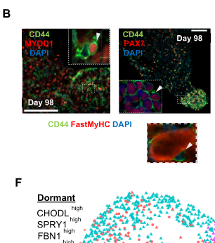

## Question

# Gene Research for Functional Annotation

## ⚠️ CRITICAL: Gene/Protein Identification Context

**BEFORE YOU BEGIN RESEARCH:** You MUST verify you are researching the CORRECT gene/protein. Gene symbols can be ambiguous, especially for less well-characterized genes from non-model organisms.

### Target Gene/Protein Identity (from UniProt):
- **UniProt Accession:** P23759
- **Protein Description:** RecName: Full=Paired box protein Pax-7; AltName: Full=HuP1;
- **Gene Information:** Name=PAX7; Synonyms=HUP1;
- **Organism (full):** Homo sapiens (Human).
- **Protein Family:** Belongs to the paired homeobox family. .
- **Key Domains:** HD. (IPR001356); Homeobox_CS. (IPR017970); Homeodomain-like_sf. (IPR009057); OAR_dom. (IPR003654); PAIRED_DNA-bd_site. (IPR043182)

### MANDATORY VERIFICATION STEPS:

1. **Check if the gene symbol "PAX7" matches the protein description above**
2. **Verify the organism is correct:** Homo sapiens (Human).
3. **Check if protein family/domains align with what you find in literature**
4. **If you find literature for a DIFFERENT gene with the same or similar symbol, STOP**

### If Gene Symbol is Ambiguous or You Cannot Find Relevant Literature:

**DO NOT PROCEED WITH RESEARCH ON A DIFFERENT GENE.** Instead:
- State clearly: "The gene symbol 'PAX7' is ambiguous or literature is limited for this specific protein"
- Explain what you found (e.g., "Found extensive literature on a different gene with the same symbol in a different organism")
- Describe the protein based ONLY on the UniProt information provided above
- Suggest that the protein function can be inferred from domain/family information

### Research Target:

Please provide a comprehensive research report on the gene **PAX7** (gene ID: PAX7, UniProt: P23759) in human.

The research report should be a detailed narrative explaining the function, biological processes, and localization of the gene product. Citations should be given for all claims.

You should prioritize authoritative reviews and primary scientific literature when conducting research. You can supplement
this with annotations you find in gene/protein databases, but these can be outdated or inaccurate.

We are specifically interested in the primary function of the gene - for enzymes, what reaction is catalyzed, and what is the substrate specificity? For transporters, what is the substrate? For structural proteins or adapters, what is the broader structural role? For signaling molecules, what is the role in the pathway.

We are interested in where in or outside the cell the gene product carries out its function.

We are also interested in the signaling or biochemical pathways in which the gene functions. We are less interested in broad pleiotropic effects, except where these elucidate the precise role.

Include evidence where possible. We are interested in both experimental evidence as well as inference from structure, evolution, or bioinformatic analysis. Precise studies should be prioritized over high-throughput, where available.

## Output

Question: You are an expert researcher providing comprehensive, well-cited information.

Provide detailed information focusing on:
1. Key concepts and definitions with current understanding
2. Recent developments and latest research (prioritize 2023-2024 sources)
3. Current applications and real-world implementations
4. Expert opinions and analysis from authoritative sources
5. Relevant statistics and data from recent studies

Format as a comprehensive research report with proper citations. Include URLs and publication dates where available.
Always prioritize recent, authoritative sources and provide specific citations for all major claims.

# Gene Research for Functional Annotation

## ⚠️ CRITICAL: Gene/Protein Identification Context

**BEFORE YOU BEGIN RESEARCH:** You MUST verify you are researching the CORRECT gene/protein. Gene symbols can be ambiguous, especially for less well-characterized genes from non-model organisms.

### Target Gene/Protein Identity (from UniProt):
- **UniProt Accession:** P23759
- **Protein Description:** RecName: Full=Paired box protein Pax-7; AltName: Full=HuP1;
- **Gene Information:** Name=PAX7; Synonyms=HUP1;
- **Organism (full):** Homo sapiens (Human).
- **Protein Family:** Belongs to the paired homeobox family. .
- **Key Domains:** HD. (IPR001356); Homeobox_CS. (IPR017970); Homeodomain-like_sf. (IPR009057); OAR_dom. (IPR003654); PAIRED_DNA-bd_site. (IPR043182)

### MANDATORY VERIFICATION STEPS:

1. **Check if the gene symbol "PAX7" matches the protein description above**
2. **Verify the organism is correct:** Homo sapiens (Human).
3. **Check if protein family/domains align with what you find in literature**
4. **If you find literature for a DIFFERENT gene with the same or similar symbol, STOP**

### If Gene Symbol is Ambiguous or You Cannot Find Relevant Literature:

**DO NOT PROCEED WITH RESEARCH ON A DIFFERENT GENE.** Instead:
- State clearly: "The gene symbol 'PAX7' is ambiguous or literature is limited for this specific protein"
- Explain what you found (e.g., "Found extensive literature on a different gene with the same symbol in a different organism")
- Describe the protein based ONLY on the UniProt information provided above
- Suggest that the protein function can be inferred from domain/family information

### Research Target:

Please provide a comprehensive research report on the gene **PAX7** (gene ID: PAX7, UniProt: P23759) in human.

The research report should be a detailed narrative explaining the function, biological processes, and localization of the gene product. Citations should be given for all claims.

You should prioritize authoritative reviews and primary scientific literature when conducting research. You can supplement
this with annotations you find in gene/protein databases, but these can be outdated or inaccurate.

We are specifically interested in the primary function of the gene - for enzymes, what reaction is catalyzed, and what is the substrate specificity? For transporters, what is the substrate? For structural proteins or adapters, what is the broader structural role? For signaling molecules, what is the role in the pathway.

We are interested in where in or outside the cell the gene product carries out its function.

We are also interested in the signaling or biochemical pathways in which the gene functions. We are less interested in broad pleiotropic effects, except where these elucidate the precise role.

Include evidence where possible. We are interested in both experimental evidence as well as inference from structure, evolution, or bioinformatic analysis. Precise studies should be prioritized over high-throughput, where available.

# Human PAX7: functional annotation and research report

**Identity and scope.** The target specified here is human **PAX7** (synonym **HUP1**), encoding paired-box protein Pax-7, **UniProt [P23759](https://www.uniprot.org/uniprotkb/P23759/entry)**. The literature agrees with its paired-box/homeodomain transcription-factor identity. PAX7 is distinct from the related gene **PAX3** and from **PAX7::FOXO1**, an oncogenic fusion protein with a different regulatory program. The UniProt accession and HUP1 synonym are supplied target identifiers; the cited experimental papers do not independently verify the accession. (relaix2025regulationandfunction pages 2-3, sankhe2025fusiononcogenesin pages 4-6, kalita2024paxfusionproteins pages 8-10)

## Primary molecular function and location

**PAX7 is a sequence-specific, chromatin-associated transcription factor—not an enzyme, transporter, or structural component of muscle fibres.** Its paired DNA-binding domain and homeodomain recognize regulatory DNA; biochemical experiments found particularly strong binding to composite sites containing motifs for both domains. Mutating either domain impairs the tested pioneer activity. The C-terminal OAR/paired-homeodomain-tail annotation requires an isoform qualification: in a human isoform study, this region was present in **isoform 3**, but not isoforms 1 and 2. Thus the supplied domain list should not be read as asserting that every human PAX7 isoform contains OAR. (pelletier2021pax7pioneerfactor pages 1-5, proskorovskiohayon2017pax7mutationin pages 28-33)

PAX7 performs this function **inside the nucleus**, at gene promoters and enhancers. Tagged human isoforms 1 and 3 localized to nuclei in transfected human cells; ChIP experiments establish association with target chromatin. In skeletal muscle, the *PAX7-expressing cell* occupies the satellite-cell niche **between the myofibre sarcolemma and basal lamina**. That extracellular anatomical description locates the cell, **not** the site where its PAX7 protein acts. Human muscle-biopsy work also cautions against treating PAX7 staining as a perfect census of satellite cells: approximately 95% were PAX7-positive in the cited comparisons. (proskorovskiohayon2017pax7mutationin pages 28-33, lilja2017pax7remodelsthe pages 3-6, lindstrom2010satellitecellheterogeneity pages 1-2)

## Myogenic mechanism and biological processes

In postnatal muscle, PAX7 maintains the identity and regenerative potential of myogenic satellite cells and helps govern their progression between quiescence, proliferation, self-renewal and commitment. After injury, these cells can produce myoblasts that differentiate and repair fibres, while some replenish the stem-cell pool. PAX7 is therefore best annotated as a **regulator of a cell-state transition**, rather than as a protein that directly executes contraction or fibre fusion. Direct mouse genetic evidence supports its importance: postnatal Pax7 inactivation depleted extraocular muscle stem cells in a **2024** study, more strongly there than in limb muscle. Human PAX7-associated stem-cell states and the consequences of rare inherited variants support clinical relevance, although many detailed causal mechanisms still come from mouse or cell models. (buckingham2014generegulatorynetworks pages 3-4, kuriki2024interplaybetweenpitx2 pages 1-2, bouche2023invitrogeneratedhuman pages 1-2, proskorovskiohayon2017pax7mutationin pages 1-5)

A particularly well-resolved pathway links PAX7 to **MYF5 transcription**, an early step in myogenic commitment. In mouse satellite-cell/myoblast experiments, PAX7 engages *Myf5* regulatory DNA; **CARM1 methylates PAX7**, enabling interaction with MLL1/2-containing, WDR5–ASH2L–RBBP5 histone-methyltransferase machinery. Recruitment promotes activating histone H3K4 methylation and *Myf5* expression after asymmetric stem-cell division. PAX7 supplies DNA targeting and cofactor recruitment; **CARM1 and the MLL complex supply enzymatic activities**, not PAX7 itself. A subsequent mouse knockout study refined the biochemical MLL1/2 model: **Mll1** deletion impaired Pax7/*Myf5* expression and satellite-cell self-renewal, whereas **Mll2** deletion had no discernible effect in the primary-myoblast system tested. These findings should not be generalized as proof that either enzyme is universally required in human cells. (kawabe2012carm1regulatespax7 pages 1-2, kawabe2012carm1regulatespax7 pages 5-6, addicks2019mll1isrequired pages 1-2)

PAX7 also directly activates **ID3** in quiescent satellite cells: promoter-reporter assays, endogenous PAX7 ChIP and PAX7 knockdown support that assignment. ID3 encodes an inhibitor of myogenic basic helix–loop–helix activity, providing a plausible means to restrain premature differentiation. Chromatin profiling of induced Pax7 muscle precursors identified **2,455** bound regions, frequently distal regulatory elements, and showed PAX7-dependent local enhancer accessibility that can precede MYOD1 and myogenin binding. Notably, binding in that muscle model favoured existing euchromatin and avoided H3K27me3-rich regions. It establishes enhancer remodeling in muscle, **not** that PAX7 necessarily opens every initially closed muscle locus. (kumar2009id3isa pages 1-2, lilja2017pax7remodelsthe pages 3-6, lilja2017pax7remodelsthe pages 1-2)

**Signalling context is not equivalent to a direct PAX7 target.** Notch signalling was experimentally required to generate quiescent PAX7-positive **human muscle reserve cells** in vitro. Their PAX7-high fraction rose from **35% after 48 hours** to **61% after 96 hours** in differentiation medium; PAX7-high cells were less primed for differentiation and had a more dormant, fatty-acid-oxidation-associated profile than PAX7-low cells. These are findings about Notch-dependent cells and **PAX7 expression as a state marker**; they do not establish that PAX7 directly mediates every metabolic difference. The study was published **September 2023**, *Stem Cell Research & Therapy*, DOI: [10.1186/s13287-023-03483-5](https://doi.org/10.1186/s13287-023-03483-5). (bouche2023invitrogeneratedhuman pages 1-2)

## A second, context-specific function: pituitary cell fate

Mouse pituitary studies establish a more stringent **pioneer-factor** action. PAX7 deploys melanotrope-associated enhancers and permits cooperation with the non-pioneer factor **TPIT**, distinguishing melanotrope from related corticotrope fate. A **January 2024** mechanistic study found an initial stage involving relief of H1-associated restriction, LSD1/KDM1A-associated removal of H3K9me2, and MLL-associated deposition of H3K4me1; subsequent cell-cycle passage and nuclear-lamina release precede SWI–SNF/p300 recruitment and enhancer opening. This mechanism is directly informative about PAX7’s capabilities but was established in a **pituitary-derived experimental context**, not shown to operate identically in human muscle satellite cells. Primary papers: [Mayran *et al.*, *Nature Genetics* (2018)](https://doi.org/10.1038/s41588-017-0035-2) and [Gouhier *et al.*, *Nature Structural & Molecular Biology* (2024)](https://doi.org/10.1038/s41594-023-01152-y). (mayran2018pioneerfactorpax7 pages 1-2, gouhier2024pioneerfactorpax7 pages 1-2, bascunana2023chromatinopeningability pages 1-4)

## Recent human evidence and applications, 2023–2024

**Disease modelling.** Human iPSC-derived skeletal-muscle organoids described in **November 2023** retained uncommitted PAX7-positive progenitors resembling fetal developmental states. Single-cell comparisons distinguished dormant **PAX7-high/FBN1-high/SPRY1-high** cells from activated **CD44-high/CD98-positive/MYOD1-positive** progenitors. PAX7 immunostaining was visible in organoid progenitor nuclei. This is a practical model for studying development and muscle disorders, although its fetal-like cell states are not interchangeable with mature adult satellite cells. [Mavrommatis *et al.*, *eLife* (2023), DOI: 10.7554/eLife.87081](https://doi.org/10.7554/elife.87081). (mavrommatis2023humanskeletalmuscle pages 1-2, mavrommatis2023humanskeletalmuscle media 7aef8f7c)

**Niche engineering and transplantation.** In a **November 2023** human-cell-to-mouse engraftment study, regenerating human **ACTC1-positive myofibres** supported donor PAX7-positive progenitors. Experimentally eliminating those fibres reduced ACTC1-positive fibres by **90%** and donor PAX7-positive cells by **100-fold** relative to controls. This is unusually strong causal evidence for the **niche’s support of PAX7-positive cells**; it is not an experiment deleting human PAX7 itself. [Hicks *et al.*, *Nature Cell Biology* (2023), DOI: 10.1038/s41556-023-01271-0](https://doi.org/10.1038/s41556-023-01271-0). (hicks2023regeneratinghumanskeletal pages 1-2)

**Assays and interventions.** PAX7 immunostaining is used to identify and quantify muscle stem/progenitor cells in human biopsies, commonly interpreted alongside their anatomical position and additional markers. A **November 2024** high-content screen of human myogenic progenitors identified nicotinamide and pyridoxine as candidate stem-cell-stimulating nutrients; mouse experiments implicated β-catenin/AKT-related signalling in improved regeneration. Nutrient measures were associated with muscle mass and walking speed in **186 older people**, but that human association is **not a clinical demonstration of PAX7-targeted efficacy**. [Ancel *et al.*, *Journal of Clinical Investigation* (2024), DOI: 10.1172/JCI163648](https://doi.org/10.1172/JCI163648). A [March 2024 preclinical-translation review](https://doi.org/10.3390/cells13070596) reported no trials of iPSC-derived cells for muscular disease at that time and emphasized delivery, maturation and safety barriers. (lindstrom2010satellitecellheterogeneity pages 1-2, ancel2024nicotinamideandpyridoxine pages 1-2, sun2024challengesandconsiderations pages 1-2)

## Human disease and the fusion-protein boundary

Rare human germline findings support the physiological importance of native PAX7. A **2017** recessive splice-site variant affecting an OAR-containing PAX7 isoform segregated with hypotonia, failure to thrive and severe neurodevelopmental disease; functional splicing assays supported disruption of isoform 3, but could not completely establish its in-vivo molecular outcome. A **2019 conference abstract** reported a child with biallelic PAX7 deficiency and congenital myopathy, including rigid spine and respiratory involvement; its single-case, abstract-level evidence should be weighted accordingly. Separately, a **2022** report identified rare candidate PAX7 variants in **9 of 583** individuals with congenital scoliosis, but this association alone does not prove those variants cause scoliosis. [Proskorovski-Ohayon *et al.*, *Human Mutation* (2017)](https://doi.org/10.1002/humu.23310); [Amthor *et al.*, *Neuromuscular Disorders* abstract (2019)](https://doi.org/10.1016/j.nmd.2019.06.299); [Wang *et al.*, *Cell Regeneration* (2022)](https://doi.org/10.1186/s13619-022-00116-9). (proskorovskiohayon2017pax7mutationin pages 17-20, amthor2019o.19pax7deficiencycauses pages 1-1, wang2022theidentificationof pages 1-2)

In rhabdomyosarcoma, **PAX7::FOXO1 is a tumour-acquired fusion transcription factor, not the normal P23759 protein**. Fusion status is relevant to tumour classification and risk assessment, but mechanistic effects of the fusion must not be assigned to wild-type PAX7. In a **2024 preprint** comparing human progenitor models, native PAX7 and PAX7::FOXO1 shared **3,376** genomic binding sites, while **31,523** and **16,923** sites, respectively, were unique to each—illustrating substantial regulatory divergence; these figures remain preprint evidence. [Danielli *et al.*, *Nature Communications* (July 2024)](https://doi.org/10.1038/s41467-024-50527-2); [Kalita *et al.*, bioRxiv (August 2024)](https://doi.org/10.1101/2024.07.31.606039). (danielli2024singlecelltranscriptomic pages 1-2, kalita2024paxfusionproteins pages 8-10)

**Bottom line.** The most defensible primary annotation for human PAX7 is **nuclear, sequence-specific transcriptional and enhancer regulation that maintains myogenic stem/progenitor identity and controls commitment during muscle regeneration**. Direct target/cofactor mechanisms are particularly strong in mouse models; recent human work establishes informative PAX7-associated states, experimental niches and applications, while not proving that every PAX7-correlated phenotype is caused directly by this transcription factor. (kawabe2012carm1regulatespax7 pages 1-2, kumar2009id3isa pages 1-2, hicks2023regeneratinghumanskeletal pages 1-2, bouche2023invitrogeneratedhuman pages 1-2)

References

1. (relaix2025regulationandfunction pages 2-3): Frederic Relaix, Virginia Zoglio, Sarah Chebouti, Joana Esteves de Lima, and Peggy Lafuste. Regulation and function of pax3 in muscle stem cell heterogeneity and stress response. Journal of muscle research and cell motility, Jul 2025. URL: https://doi.org/10.1007/s10974-025-09701-2, doi:10.1007/s10974-025-09701-2. This article has 3 citations and is from a peer-reviewed journal.

2. (sankhe2025fusiononcogenesin pages 4-6): Chinmay S. Sankhe, Lisa Hall, and Genevieve C. Kendall. Fusion oncogenes in rhabdomyosarcoma: model systems, mechanisms of tumorigenesis, and therapeutic implications. Frontiers in Oncology, Jun 2025. URL: https://doi.org/10.3389/fonc.2025.1570070, doi:10.3389/fonc.2025.1570070. This article has 9 citations.

3. (kalita2024paxfusionproteins pages 8-10): Bhargab Kalita, Gerard Martinez-Cebrian, Justina McEvoy, Melody Allensworth, Michelle Knight, Alessandro Magli, Rita C R Perlingeiro, Michael A. Dyer, Elizabeth Stewart, and Brian David Dynlacht. Pax fusion proteins deregulate gene networks controlling mitochondrial translation in pediatric rhabdomyosarcoma. bioRxiv, Aug 2024. URL: https://doi.org/10.1101/2024.07.31.606039, doi:10.1101/2024.07.31.606039. This article has 0 citations.

4. (pelletier2021pax7pioneerfactor pages 1-5): Audrey Pelletier, Alexandre Mayran, Arthur Gouhier, James G Omichinski, Aurelio Balsalobre, and Jacques Drouin. Pax7 pioneer factor action requires both paired and homeo dna binding domains. BioRxiv, 49:7424-7436, Oct 2021. URL: https://doi.org/10.1101/2020.10.09.332015, doi:10.1101/2020.10.09.332015. This article has 35 citations.

5. (proskorovskiohayon2017pax7mutationin pages 28-33): Regina Proskorovski-Ohayon, Rotem Kadir, Analia Michalowski, Hagit Flusser, Yonatan Perez, Eli Hershkovitz, Sara Sivan, and Ohad S. Birk. Pax7 mutation in a syndrome of failure to thrive, hypotonia, and global neurodevelopmental delay. Human Mutation, 38:1671-1683, Dec 2017. URL: https://doi.org/10.1002/humu.23310, doi:10.1002/humu.23310. This article has 24 citations and is from a domain leading peer-reviewed journal.

6. (lilja2017pax7remodelsthe pages 3-6): Karin C. Lilja, Nan Zhang, Alessandro Magli, Volkan Gunduz, Christopher J. Bowman, Robert W. Arpke, Radbod Darabi, Michael Kyba, Rita Perlingeiro, and Brian D. Dynlacht. Pax7 remodels the chromatin landscape in skeletal muscle stem cells. PLoS ONE, 12:e0176190, Apr 2017. URL: https://doi.org/10.1371/journal.pone.0176190, doi:10.1371/journal.pone.0176190. This article has 70 citations and is from a peer-reviewed journal.

7. (lindstrom2010satellitecellheterogeneity pages 1-2): Mona Lindström, Fatima Pedrosa-Domellöf, and Lars-Eric Thornell. Satellite cell heterogeneity with respect to expression of myod, myogenin, dlk1 and c-met in human skeletal muscle: application to a cohort of power lifters and sedentary men. Histochemistry and Cell Biology, 134:371-385, Sep 2010. URL: https://doi.org/10.1007/s00418-010-0743-5, doi:10.1007/s00418-010-0743-5. This article has 80 citations and is from a peer-reviewed journal.

8. (buckingham2014generegulatorynetworks pages 3-4): Margaret Buckingham and Peter W.J. Rigby. Gene regulatory networks and transcriptional mechanisms that control myogenesis. Developmental cell, 28 3:225-38, Feb 2014. URL: https://doi.org/10.1016/j.devcel.2013.12.020, doi:10.1016/j.devcel.2013.12.020. This article has 803 citations and is from a highest quality peer-reviewed journal.

9. (kuriki2024interplaybetweenpitx2 pages 1-2): Mao Kuriki, Amaury Korb, Glenda Comai, and Shahragim Tajbakhsh. Interplay between pitx2 and pax7 temporally governs specification of extraocular muscle stem cells. PLOS Genetics, 20:e1010935, Jun 2024. URL: https://doi.org/10.1371/journal.pgen.1010935, doi:10.1371/journal.pgen.1010935. This article has 9 citations and is from a domain leading peer-reviewed journal.

10. (bouche2023invitrogeneratedhuman pages 1-2): Axelle Bouche, Benoit Borner, Chloé Richard, Ysaline Grand, Didier Hannouche, and Thomas Laumonier. In vitro-generated human muscle reserve cells are heterogeneous for pax7 with distinct molecular states and metabolic profiles. Stem Cell Research & Therapy, Sep 2023. URL: https://doi.org/10.1186/s13287-023-03483-5, doi:10.1186/s13287-023-03483-5. This article has 13 citations and is from a peer-reviewed journal.

11. (proskorovskiohayon2017pax7mutationin pages 1-5): Regina Proskorovski-Ohayon, Rotem Kadir, Analia Michalowski, Hagit Flusser, Yonatan Perez, Eli Hershkovitz, Sara Sivan, and Ohad S. Birk. Pax7 mutation in a syndrome of failure to thrive, hypotonia, and global neurodevelopmental delay. Human Mutation, 38:1671-1683, Dec 2017. URL: https://doi.org/10.1002/humu.23310, doi:10.1002/humu.23310. This article has 24 citations and is from a domain leading peer-reviewed journal.

12. (kawabe2012carm1regulatespax7 pages 1-2): Yoh-ichi Kawabe, Yu Xin Wang, Iain W. McKinnell, Mark T. Bedford, and Michael A. Rudnicki. Carm1 regulates pax7 transcriptional activity through mll1/2 recruitment during asymmetric satellite stem cell divisions. Cell stem cell, 11 3:333-45, Sep 2012. URL: https://doi.org/10.1016/j.stem.2012.07.001, doi:10.1016/j.stem.2012.07.001. This article has 274 citations and is from a highest quality peer-reviewed journal.

13. (kawabe2012carm1regulatespax7 pages 5-6): Yoh-ichi Kawabe, Yu Xin Wang, Iain W. McKinnell, Mark T. Bedford, and Michael A. Rudnicki. Carm1 regulates pax7 transcriptional activity through mll1/2 recruitment during asymmetric satellite stem cell divisions. Cell stem cell, 11 3:333-45, Sep 2012. URL: https://doi.org/10.1016/j.stem.2012.07.001, doi:10.1016/j.stem.2012.07.001. This article has 274 citations and is from a highest quality peer-reviewed journal.

14. (addicks2019mll1isrequired pages 1-2): Gregory C Addicks, Gregory C Addicks, Caroline E. Brun, Caroline E. Brun, Marie-Claude Sincennes, Marie-Claude Sincennes, J. Saber, J. Saber, C. J. Porter, A. F. Stewart, P. Ernst, Michael A. Rudnicki, and Michael A. Rudnicki. Mll1 is required for pax7 expression and satellite cell self-renewal in mice. Nature Communications, Sep 2019. URL: https://doi.org/10.1038/s41467-019-12086-9, doi:10.1038/s41467-019-12086-9. This article has 63 citations and is from a highest quality peer-reviewed journal.

15. (kumar2009id3isa pages 1-2): Deepak Kumar, Jennifer L. Shadrach, Amy J. Wagers, and Andrew B. Lassar. Id3 is a direct transcriptional target of pax7 in quiescent satellite cells. Molecular biology of the cell, 20 14:3170-7, Jul 2009. URL: https://doi.org/10.1091/mbc.e08-12-1185, doi:10.1091/mbc.e08-12-1185. This article has 126 citations and is from a domain leading peer-reviewed journal.

16. (lilja2017pax7remodelsthe pages 1-2): Karin C. Lilja, Nan Zhang, Alessandro Magli, Volkan Gunduz, Christopher J. Bowman, Robert W. Arpke, Radbod Darabi, Michael Kyba, Rita Perlingeiro, and Brian D. Dynlacht. Pax7 remodels the chromatin landscape in skeletal muscle stem cells. PLoS ONE, 12:e0176190, Apr 2017. URL: https://doi.org/10.1371/journal.pone.0176190, doi:10.1371/journal.pone.0176190. This article has 70 citations and is from a peer-reviewed journal.

17. (mayran2018pioneerfactorpax7 pages 1-2): Alexandre Mayran, Konstantin Khetchoumian, Fadi Hariri, Tomi Pastinen, Yves Gauthier, Aurelio Balsalobre, and Jacques Drouin. Pioneer factor pax7 deploys a stable enhancer repertoire for specification of cell fate. Nature Genetics, 50:259-269, Jan 2018. URL: https://doi.org/10.1038/s41588-017-0035-2, doi:10.1038/s41588-017-0035-2. This article has 209 citations and is from a highest quality peer-reviewed journal.

18. (gouhier2024pioneerfactorpax7 pages 1-2): Arthur Gouhier, Justine Dumoulin-Gagnon, Vincent Lapointe-Roberge, Juliette Harris, Aurelio Balsalobre, and Jacques Drouin. Pioneer factor pax7 initiates two-step cell-cycle-dependent chromatin opening. Nature Structural &amp; Molecular Biology, 31:92-101, Jan 2024. URL: https://doi.org/10.1038/s41594-023-01152-y, doi:10.1038/s41594-023-01152-y. This article has 31 citations and is from a highest quality peer-reviewed journal.

19. (bascunana2023chromatinopeningability pages 1-4): Virginie Bascunana, Audrey Pelletier, Arthur Gouhier, Amandine Bemmo, Aurelio Balsalobre, and Jacques Drouin. Chromatin opening ability of pioneer factor pax7 depends on unique isoform and c-terminal domain. BioRxiv, 51:7254-7268, Mar 2023. URL: https://doi.org/10.1101/2023.03.01.530660, doi:10.1101/2023.03.01.530660. This article has 10 citations.

20. (mavrommatis2023humanskeletalmuscle pages 1-2): Lampros Mavrommatis, Hyun-Woo Jeong, Urs Kindler, Gemma Gomez-Giro, Marie-Cecile Kienitz, Martin Stehling, Olympia E Psathaki, Dagmar Zeuschner, M Gabriele Bixel, Dong Han, Gabriela Morosan-Puopolo, Daniela Gerovska, Ji Hun Yang, Jeong Beom Kim, Marcos J Arauzo-Bravo, Jens C Schwamborn, Stephan A Hahn, Ralf H Adams, Hans R Schöler, Matthias Vorgerd, Beate Brand-Saberi, and Holm Zaehres. Human skeletal muscle organoids model fetal myogenesis and sustain uncommitted pax7 myogenic progenitors. eLife, Nov 2023. URL: https://doi.org/10.7554/elife.87081, doi:10.7554/elife.87081. This article has 67 citations and is from a domain leading peer-reviewed journal.

21. (mavrommatis2023humanskeletalmuscle media 7aef8f7c): Lampros Mavrommatis, Hyun-Woo Jeong, Urs Kindler, Gemma Gomez-Giro, Marie-Cecile Kienitz, Martin Stehling, Olympia E Psathaki, Dagmar Zeuschner, M Gabriele Bixel, Dong Han, Gabriela Morosan-Puopolo, Daniela Gerovska, Ji Hun Yang, Jeong Beom Kim, Marcos J Arauzo-Bravo, Jens C Schwamborn, Stephan A Hahn, Ralf H Adams, Hans R Schöler, Matthias Vorgerd, Beate Brand-Saberi, and Holm Zaehres. Human skeletal muscle organoids model fetal myogenesis and sustain uncommitted pax7 myogenic progenitors. eLife, Nov 2023. URL: https://doi.org/10.7554/elife.87081, doi:10.7554/elife.87081. This article has 67 citations and is from a domain leading peer-reviewed journal.

22. (hicks2023regeneratinghumanskeletal pages 1-2): Michael R. Hicks, Kholoud K. Saleh, Ben Clock, Devin E. Gibbs, Mandee Yang, Shahab Younesi, Lily Gane, Victor Gutierrez-Garcia, Haibin Xi, and April D. Pyle. Regenerating human skeletal muscle forms an emerging niche in vivo to support pax7 cells. Nature Cell Biology, 25:1758-1773, Nov 2023. URL: https://doi.org/10.1038/s41556-023-01271-0, doi:10.1038/s41556-023-01271-0. This article has 46 citations and is from a highest quality peer-reviewed journal.

23. (ancel2024nicotinamideandpyridoxine pages 1-2): Sara Ancel, Joris Michaud, Eugenia Migliavacca, Charline Jomard, Aurélie Fessard, Pauline Garcia, Sonia Karaz, Sruthi Raja, Guillaume E. Jacot, Thibaut Desgeorges, José L. Sánchez-García, Loic Tauzin, Yann Ratinaud, Benjamin Brinon, Sylviane Métairon, Lucas Pinero, Denis Barron, Stephanie Blum, Leonidas G. Karagounis, Ramin Heshmat, Afshin Ostovar, Farshad Farzadfar, Isabella Scionti, Rémi Mounier, Julien Gondin, Pascal Stuelsatz, and Jerome N. Feige. Nicotinamide and pyridoxine stimulate muscle stem cell expansion and enhance regenerative capacity during aging. The Journal of Clinical Investigation, Nov 2024. URL: https://doi.org/10.1172/jci163648, doi:10.1172/jci163648. This article has 30 citations.

24. (sun2024challengesandconsiderations pages 1-2): Congshan Sun, Carlo Serra, Brianna Harley Kalicharan, Jeffrey Harding, and Mahendra Rao. Challenges and considerations of preclinical development for ipsc-based myogenic cell therapy. Cells, 13:596, Mar 2024. URL: https://doi.org/10.3390/cells13070596, doi:10.3390/cells13070596. This article has 14 citations.

25. (proskorovskiohayon2017pax7mutationin pages 17-20): Regina Proskorovski-Ohayon, Rotem Kadir, Analia Michalowski, Hagit Flusser, Yonatan Perez, Eli Hershkovitz, Sara Sivan, and Ohad S. Birk. Pax7 mutation in a syndrome of failure to thrive, hypotonia, and global neurodevelopmental delay. Human Mutation, 38:1671-1683, Dec 2017. URL: https://doi.org/10.1002/humu.23310, doi:10.1002/humu.23310. This article has 24 citations and is from a domain leading peer-reviewed journal.

26. (amthor2019o.19pax7deficiencycauses pages 1-1): H. Amthor, A. Marg, H. Escobar, S. Grunwald, E. Metzler, J. Kieshauer, E. Malfatti, D. Mompoint, S. Quijano-Roy, R. Carlier, and S. Spuler. O.19pax7 deficiency causes mild congenital myopathy with rigid spine and respiratory insufficiency. Neuromuscular Disorders, 29:S120, Oct 2019. URL: https://doi.org/10.1016/j.nmd.2019.06.299, doi:10.1016/j.nmd.2019.06.299. This article has 0 citations and is from a peer-reviewed journal.

27. (wang2022theidentificationof pages 1-2): Muchuan Wang, Ziquan Li, Sen Zhao, Zhifa Zheng, Yipeng Wang, Guixing Qiu, Zhihong Wu, Nan Wu, Terry Jianguo Zhang, and Siyi Cai. The identification of pax7 variants and a potential role of muscle development dysfunction in congenital scoliosis. Cell Regeneration, May 2022. URL: https://doi.org/10.1186/s13619-022-00116-9, doi:10.1186/s13619-022-00116-9. This article has 4 citations.

28. (danielli2024singlecelltranscriptomic pages 1-2): Sara G. Danielli, Yun Wei, Michael A. Dyer, Elizabeth Stewart, Heather Sheppard, Marco Wachtel, Beat W. Schäfer, Anand G. Patel, and David M. Langenau. Single cell transcriptomic profiling identifies tumor-acquired and therapy-resistant cell states in pediatric rhabdomyosarcoma. Nature Communications, Jul 2024. URL: https://doi.org/10.1038/s41467-024-50527-2, doi:10.1038/s41467-024-50527-2. This article has 62 citations and is from a highest quality peer-reviewed journal.

## Artifacts

## Citations

1. bouche2023invitrogeneratedhuman pages 1-2
2. hicks2023regeneratinghumanskeletal pages 1-2
3. relaix2025regulationandfunction pages 2-3
4. sankhe2025fusiononcogenesin pages 4-6
5. kalita2024paxfusionproteins pages 8-10
6. lindstrom2010satellitecellheterogeneity pages 1-2
7. buckingham2014generegulatorynetworks pages 3-4
8. bascunana2023chromatinopeningability pages 1-4
9. mavrommatis2023humanskeletalmuscle pages 1-2
10. ancel2024nicotinamideandpyridoxine pages 1-2
11. sun2024challengesandconsiderations pages 1-2
12. wang2022theidentificationof pages 1-2
13. danielli2024singlecelltranscriptomic pages 1-2
14. P23759
15. 10.1186/s13287-023-03483-5
16. Mayran *et al.*, *Nature Genetics* (2018)
17. Gouhier *et al.*, *Nature Structural & Molecular Biology* (2024)
18. Mavrommatis *et al.*, *eLife* (2023), DOI: 10.7554/eLife.87081
19. Hicks *et al.*, *Nature Cell Biology* (2023), DOI: 10.1038/s41556-023-01271-0
20. Ancel *et al.*, *Journal of Clinical Investigation* (2024), DOI: 10.1172/JCI163648
21. March 2024 preclinical-translation review
22. Proskorovski-Ohayon *et al.*, *Human Mutation* (2017)
23. Amthor *et al.*, *Neuromuscular Disorders* abstract (2019)
24. Wang *et al.*, *Cell Regeneration* (2022)
25. Danielli *et al.*, *Nature Communications* (July 2024)
26. Kalita *et al.*, bioRxiv (August 2024)
27. https://www.uniprot.org/uniprotkb/P23759/entry
28. https://doi.org/10.1186/s13287-023-03483-5
29. https://doi.org/10.1038/s41588-017-0035-2
30. https://doi.org/10.1038/s41594-023-01152-y
31. https://doi.org/10.7554/elife.87081
32. https://doi.org/10.1038/s41556-023-01271-0
33. https://doi.org/10.1172/JCI163648
34. https://doi.org/10.3390/cells13070596
35. https://doi.org/10.1002/humu.23310
36. https://doi.org/10.1016/j.nmd.2019.06.299
37. https://doi.org/10.1186/s13619-022-00116-9
38. https://doi.org/10.1038/s41467-024-50527-2
39. https://doi.org/10.1101/2024.07.31.606039
40. https://doi.org/10.1007/s10974-025-09701-2,
41. https://doi.org/10.3389/fonc.2025.1570070,
42. https://doi.org/10.1101/2024.07.31.606039,
43. https://doi.org/10.1101/2020.10.09.332015,
44. https://doi.org/10.1002/humu.23310,
45. https://doi.org/10.1371/journal.pone.0176190,
46. https://doi.org/10.1007/s00418-010-0743-5,
47. https://doi.org/10.1016/j.devcel.2013.12.020,
48. https://doi.org/10.1371/journal.pgen.1010935,
49. https://doi.org/10.1186/s13287-023-03483-5,
50. https://doi.org/10.1016/j.stem.2012.07.001,
51. https://doi.org/10.1038/s41467-019-12086-9,
52. https://doi.org/10.1091/mbc.e08-12-1185,
53. https://doi.org/10.1038/s41588-017-0035-2,
54. https://doi.org/10.1038/s41594-023-01152-y,
55. https://doi.org/10.1101/2023.03.01.530660,
56. https://doi.org/10.7554/elife.87081,
57. https://doi.org/10.1038/s41556-023-01271-0,
58. https://doi.org/10.1172/jci163648,
59. https://doi.org/10.3390/cells13070596,
60. https://doi.org/10.1016/j.nmd.2019.06.299,
61. https://doi.org/10.1186/s13619-022-00116-9,
62. https://doi.org/10.1038/s41467-024-50527-2,