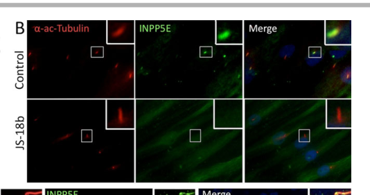

## Question

# Gene Research for Functional Annotation

## ⚠️ CRITICAL: Gene/Protein Identification Context

**BEFORE YOU BEGIN RESEARCH:** You MUST verify you are researching the CORRECT gene/protein. Gene symbols can be ambiguous, especially for less well-characterized genes from non-model organisms.

### Target Gene/Protein Identity (from UniProt):
- **UniProt Accession:** O43924
- **Protein Description:** RecName: Full=Retinal rod rhodopsin-sensitive cGMP 3',5'-cyclic phosphodiesterase subunit delta; Short=GMP-PDE delta; AltName: Full=Protein p17;
- **Gene Information:** Name=PDE6D; Synonyms=PDED;
- **Organism (full):** Homo sapiens (Human).
- **Protein Family:** Belongs to the PDE6D/unc-119 family. .
- **Key Domains:** Ig_E-set. (IPR014756); PDED_dom. (IPR008015); PDED_dom_sf. (IPR037036); Rhodop-sen_GMP-Pdiesterase_dsu. (IPR017287); GMP_PDE_delta (PF05351)

### MANDATORY VERIFICATION STEPS:

1. **Check if the gene symbol "PDE6D" matches the protein description above**
2. **Verify the organism is correct:** Homo sapiens (Human).
3. **Check if protein family/domains align with what you find in literature**
4. **If you find literature for a DIFFERENT gene with the same or similar symbol, STOP**

### If Gene Symbol is Ambiguous or You Cannot Find Relevant Literature:

**DO NOT PROCEED WITH RESEARCH ON A DIFFERENT GENE.** Instead:
- State clearly: "The gene symbol 'PDE6D' is ambiguous or literature is limited for this specific protein"
- Explain what you found (e.g., "Found extensive literature on a different gene with the same symbol in a different organism")
- Describe the protein based ONLY on the UniProt information provided above
- Suggest that the protein function can be inferred from domain/family information

### Research Target:

Please provide a comprehensive research report on the gene **PDE6D** (gene ID: PDE6D, UniProt: O43924) in human.

The research report should be a detailed narrative explaining the function, biological processes, and localization of the gene product. Citations should be given for all claims.

You should prioritize authoritative reviews and primary scientific literature when conducting research. You can supplement
this with annotations you find in gene/protein databases, but these can be outdated or inaccurate.

We are specifically interested in the primary function of the gene - for enzymes, what reaction is catalyzed, and what is the substrate specificity? For transporters, what is the substrate? For structural proteins or adapters, what is the broader structural role? For signaling molecules, what is the role in the pathway.

We are interested in where in or outside the cell the gene product carries out its function.

We are also interested in the signaling or biochemical pathways in which the gene functions. We are less interested in broad pleiotropic effects, except where these elucidate the precise role.

Include evidence where possible. We are interested in both experimental evidence as well as inference from structure, evolution, or bioinformatic analysis. Precise studies should be prioritized over high-throughput, where available.

## Output

Question: You are an expert researcher providing comprehensive, well-cited information.

Provide detailed information focusing on:
1. Key concepts and definitions with current understanding
2. Recent developments and latest research (prioritize 2023-2024 sources)
3. Current applications and real-world implementations
4. Expert opinions and analysis from authoritative sources
5. Relevant statistics and data from recent studies

Format as a comprehensive research report with proper citations. Include URLs and publication dates where available.
Always prioritize recent, authoritative sources and provide specific citations for all major claims.

# Gene Research for Functional Annotation

## ⚠️ CRITICAL: Gene/Protein Identification Context

**BEFORE YOU BEGIN RESEARCH:** You MUST verify you are researching the CORRECT gene/protein. Gene symbols can be ambiguous, especially for less well-characterized genes from non-model organisms.

### Target Gene/Protein Identity (from UniProt):
- **UniProt Accession:** O43924
- **Protein Description:** RecName: Full=Retinal rod rhodopsin-sensitive cGMP 3',5'-cyclic phosphodiesterase subunit delta; Short=GMP-PDE delta; AltName: Full=Protein p17;
- **Gene Information:** Name=PDE6D; Synonyms=PDED;
- **Organism (full):** Homo sapiens (Human).
- **Protein Family:** Belongs to the PDE6D/unc-119 family. .
- **Key Domains:** Ig_E-set. (IPR014756); PDED_dom. (IPR008015); PDED_dom_sf. (IPR037036); Rhodop-sen_GMP-Pdiesterase_dsu. (IPR017287); GMP_PDE_delta (PF05351)

### MANDATORY VERIFICATION STEPS:

1. **Check if the gene symbol "PDE6D" matches the protein description above**
2. **Verify the organism is correct:** Homo sapiens (Human).
3. **Check if protein family/domains align with what you find in literature**
4. **If you find literature for a DIFFERENT gene with the same or similar symbol, STOP**

### If Gene Symbol is Ambiguous or You Cannot Find Relevant Literature:

**DO NOT PROCEED WITH RESEARCH ON A DIFFERENT GENE.** Instead:
- State clearly: "The gene symbol 'PDE6D' is ambiguous or literature is limited for this specific protein"
- Explain what you found (e.g., "Found extensive literature on a different gene with the same symbol in a different organism")
- Describe the protein based ONLY on the UniProt information provided above
- Suggest that the protein function can be inferred from domain/family information

### Research Target:

Please provide a comprehensive research report on the gene **PDE6D** (gene ID: PDE6D, UniProt: O43924) in human.

The research report should be a detailed narrative explaining the function, biological processes, and localization of the gene product. Citations should be given for all claims.

You should prioritize authoritative reviews and primary scientific literature when conducting research. You can supplement
this with annotations you find in gene/protein databases, but these can be outdated or inaccurate.

We are specifically interested in the primary function of the gene - for enzymes, what reaction is catalyzed, and what is the substrate specificity? For transporters, what is the substrate? For structural proteins or adapters, what is the broader structural role? For signaling molecules, what is the role in the pathway.

We are interested in where in or outside the cell the gene product carries out its function.

We are also interested in the signaling or biochemical pathways in which the gene functions. We are less interested in broad pleiotropic effects, except where these elucidate the precise role.

Include evidence where possible. We are interested in both experimental evidence as well as inference from structure, evolution, or bioinformatic analysis. Precise studies should be prioritized over high-throughput, where available.

# Human PDE6D: functional annotation and research report

## Identity and primary molecular function

**Identity verified.** The specified human protein, UniProt **O43924**, corresponds to **PDE6D**, also called **PDEδ**, **PrBPδ** or **p17**. Its historical name reflects its association with retinal phosphodiesterase 6, but its primary established function is **nonenzymatic transport of prenylated proteins**, not hydrolysis of cyclic GMP. The cGMP-hydrolyzing activity of rod PDE6 belongs to its catalytic PDE6A/PDE6B subunits. The O43924 accession and detailed InterPro/Pfam identifiers are supplied in the question; the retrieved papers independently support the human PDEδ identity and its immunoglobulin-like β-sandwich/prenyl-binding architecture, rather than independently documenting that accession. This distinction prevents confusion with catalytic PDE6 subunits. (baehr2014membraneproteintransport pages 5-7, baehr2014membraneproteintransport pages 4-5, baehr2014membraneproteintransport pages 7-8, ashok2024updatesonproteinprenylation pages 6-7)

**Substrate and mechanism.** PDE6D is a soluble *prenyl-binding carrier*: a hydrophobic cavity within its β-sandwich shields a cargo protein’s C-terminal **C15 farnesyl** or **C20 geranylgeranyl** group from the aqueous cytosol. Structural analysis of a PDEδ–farnesylated RHEB complex places the lipid chain inside that cavity; binding and membrane-extraction assays independently support this mechanism. Myristoyl chains are not equivalent PDE6D cargo. Recognition is not dictated by the lipid alone: surrounding cargo residues and protein context alter binding and targeting. The domain assignments supplied—Ig_E-set, PDED/PDED superfamily and GMP_PDE_delta—are consistent with this β-sandwich carrier, **not evidence of a catalytic phosphodiesterase domain**. There is consequently **no established PDE6D-catalyzed reaction, catalytic substrate or cGMP-hydrolysis specificity** to report. (baehr2014membraneproteintransport pages 5-7, baehr2014membraneproteintransport pages 7-8, fisher2020arffamilygtpases pages 11-15)

## Where PDE6D acts and how delivery is controlled

PDE6D functions chiefly **inside cells**, cycling between a soluble cytosolic cargo-bound state and membrane-associated sites of cargo capture or release. Its experimentally supported destinations include the **primary-cilium membrane/region around the basal body**, and, in photoreceptors, the route from **inner-segment biosynthetic membranes to outer-segment membranes**. It should not be annotated simply as a permanent ciliary-membrane component or extracellular transporter: its defining activity is moving lipid-anchored proteins through cytosol between intracellular membrane compartments. Patient fibroblasts retain truncated PDE6D at ciliary structures even though cargo targeting fails, illustrating why protein localization alone does not establish transport competence. (baehr2014membraneproteintransport pages 8-10, faber2023pde6dmediatestrafficking pages 1-2, thomas2014ahomozygouspde6d pages 5-8)

A well-supported working cycle is **prenylated cargo binding and membrane extraction → soluble PDE6D–cargo movement → GTPase-assisted cargo release at an appropriate membrane → carrier recycling**. Both GTP-bound ARL2 and ARL3 bind PDE6D; ARL3-GTP can directly release bound INPP5E in biochemical experiments, and RP2 is an ARL3 GTPase-activating protein. ARL13B promotes ARL3 activation in proposed compartmentalized trafficking cycles and also binds INPP5E directly. **Important qualification:** in the human-cell experiments testing INPP5E, depletion of ARL2, ARL3 or RP2 did *not* abolish INPP5E ciliary localization despite the ARL3 biochemical release result. Thus, ARL3-dependent discharge is a compelling mechanism but is not an experimentally established universal requirement for every PDE6D cargo in every cell. ARL13B–INPP5E interaction, rather than a detectable direct ARL13B–PDE6D interaction, was demonstrated in the earlier study. (fisher2020arffamilygtpases pages 11-15, hankegogokhia2016arflikeprotein3 pages 12-12, thomas2014ahomozygouspde6d pages 5-8, humbert2012arl13bpde6dand pages 2-3)

The principal cargo–destination evidence is summarized below; **FAM219A and proposed UBL3 vesicle sorting remain less established than INPP5E delivery**. (humbert2012arl13bpde6dand pages 3-4, faber2023pde6dmediatestrafficking pages 17-18, faber2023pde6dmediatestrafficking pages 12-15, thomas2014ahomozygouspde6d pages 5-8)

| Physiological setting | PDE6D prenylated cargo and membrane destination | Direct experimental support | Qualification |
|---|---|---|---|
| Primary cilium | Farnesylated **INPP5E** → ciliary membrane | PDE6D depletion reduced ciliary INPP5E without substantially impairing ciliogenesis. In PDE6D-mutant human fibroblasts, INPP5E marked **>90%** of control cilia but **<1%** of patient cilia (100 cells per group in three experiments); interaction required the INPP5E CaaX motif. (humbert2012arl13bpde6dand pages 3-4, thomas2014ahomozygouspde6d pages 5-8) | Strong human-cell and patient evidence for cargo targeting. ARL3 releases INPP5E in vitro, but ARL3 depletion did not eliminate its ciliary localization, so the cellular release mechanism is not fully resolved. (thomas2014ahomozygouspde6d pages 5-8, humbert2012arl13bpde6dand pages 2-3) |
| Photoreceptor outer segment | Prenylated **GRK1** and rod/cone **PDE6 catalytic subunits** → outer-segment membranes | In *Pde6d*-null mice, GRK1 was nearly absent from rod and cone outer segments, cone PDE6 was undetectable there, and rod PDE6 showed partial inner-segment mislocalization. (baehr2014membraneproteintransport pages 7-8) | Cargo dependence is unequal, implying alternative routes or differing affinities. PDE6D is the nonenzymatic carrier; cGMP hydrolysis is performed by PDE6A/PDE6B or cone PDE6 catalytic subunits. (baehr2014membraneproteintransport pages 5-7, baehr2014membraneproteintransport pages 4-5) |
| Primary/photoreceptor cilia | Geranylgeranylated constitutive **RPGR** isoform → cilium/transition-zone region | Prenylation-site mutation or PDE6D ablation blocked RPGR ciliary targeting; human-cell mapping localized PDE6D binding to RPGR’s C-terminal prenylated region. (dutta2016rpgraprenylated pages 3-4, rao2016prenylatedretinalciliopathy pages 3-4, rao2016prenylatedretinalciliopathy pages 4-5) | Evidence supports RPGR as PDE6D cargo, but earlier models proposed RPGR as a docking scaffold; isoform and experimental-system differences should be retained rather than treating either model as universal. |
| Primary cilium and photoreceptor outer segment | Prenylated **NIM1K** and **UBL3** → ciliary compartment; UBL3 → photoreceptor outer segment | Wild-type proteins extended through primary cilia, whereas C-to-A prenylation mutants accumulated at the ciliary base/centrosomes. Wild-type UBL3 predominated in mouse outer segments, while its mutant remained mainly in inner segments and the outer nuclear layer. (faber2023pde6dmediatestrafficking pages 15-17, faber2023pde6dmediatestrafficking pages 12-15) | Ciliary entry and UBL3 outer-segment targeting are experimentally supported. UBL3 localization near vesicle-like structures and its sEV-associated interactome suggest—but do not demonstrate—a vesicle-sorting function. (faber2023pde6dmediatestrafficking pages 17-18, faber2023pde6dmediatestrafficking pages 12-15) |
| Candidate ciliary pathway | Prenylated **FAM219A** → destination unresolved | Wild-type FAM219A interacted with PDE6D, whereas its non-prenylated C-to-A mutant did not; the mutant accumulated at the ciliary base/centrosomes. (faber2023pde6dmediatestrafficking pages 9-12, faber2023pde6dmediatestrafficking pages 12-15) | Candidate cargo only: wild-type FAM219A was **not observed inside the cilium**, so ciliary delivery or function has not been established. (faber2023pde6dmediatestrafficking pages 17-18, faber2023pde6dmediatestrafficking pages 12-15) |
| KRAS-dependent cancer signaling | Farnesylated **KRAS** → plasma-membrane trafficking/signaling pool | The 2024 inhibitor Deltaflexin3 disrupted PDE6D–KRAS engagement, showed a cellular EC50 of **6 ± 1 μM** in MIA PaCa-2 cells, and combined with sildenafil to reduce Ras-pathway phosphorylation and chick-CAM microtumor growth. (kaya2024animprovedpde6d pages 5-8, kaya2024animprovedpde6d pages 8-9) | Preclinical application with overall modest effects; mouse-xenograft reduction was not significant, affinities were assay-dependent, and broad PDE6D cargo/off-target liabilities remain. Sildenafil acts separately through PDE5–cGMP–PKG2 signaling. (kaya2024animprovedpde6d pages 8-9, kaya2024animprovedpde6d pages 1-2, kaya2024animprovedpde6d pages 4-5) |

*Table: Direct evidence for major PDE6D cargo-destination relationships, with explicit qualifications separating established trafficking functions from candidates and preclinical applications.*

## Biological pathways and experimental validation

**Ciliary phosphoinositide signaling.** Farnesylated **INPP5E** is the most compelling human-disease-linked cargo. Silencing PDE6D in human hTERT-RPE1 cells reduced ciliary INPP5E without substantially preventing cilium formation. Binding requires the INPP5E C-terminal prenylation motif; other INPP5E sequence elements and ARL13B interaction also contribute to targeting, so a CaaX motif alone is not a sufficient general ciliary address. In fibroblasts from a person with pathogenic PDE6D deficiency, INPP5E stained **>90% of control cilia but <1% of patient cilia** across analyses of 100 cells per group in three experiments. Patient cilia were present, and INPP5E protein was detectable, supporting a **cargo-localization defect**, rather than simple absence of cilia or INPP5E expression. Figure 5B of the primary report directly illustrates the control-versus-patient immunofluorescence result. (humbert2012arl13bpde6dand pages 3-4, thomas2014ahomozygouspde6d pages 5-8, humbert2012arl13bpde6dand pages 2-3, thomas2014ahomozygouspde6d media cdedd3e6)

INPP5E itself is a ciliary **phosphoinositide 5-phosphatase**; its compartmentalization is pertinent to ciliary membrane lipid composition and developmental signaling. Those catalytic activities belong to **INPP5E, not PDE6D**. It is biologically reasonable to infer that defective PDE6D-mediated INPP5E delivery perturbs downstream phosphoinositide-dependent signaling, potentially including Hedgehog-pathway organization, but the cited PDE6D patient study directly demonstrates **INPP5E mislocalization**, not a quantitative PDE6D-dependent change in Hedgehog output. Cell- and tissue-specific alternative INPP5E targeting routes should not be ruled out. (humbert2012arl13bpde6dand pages 3-4, thomas2014ahomozygouspde6d pages 5-8, ashok2024updatesonproteinprenylation pages 7-8, hakeem2025regulationofinpp5e pages 5-6)

**Visual phototransduction and retinal maintenance.** PDE6D binds prenylated PDE6 catalytic subunits and can release PDE6 from photoreceptor-disc membranes *without changing PDE6 catalytic activity*. In *Pde6d*-null mice, **GRK1 is nearly absent** from rod and cone outer segments, **cone PDE6 is undetectable** there, while a portion of **rod PDE6 still arrives** but another portion accumulates in inner segments. This cargo-dependent gradient is important: PDE6D facilitates localization of phototransduction components, whereas PDE6A/PDE6B catalyze light-response cGMP breakdown and GRK1 phosphorylates activated photoreceptor receptors. A 2024 specialist review accordingly treats PDE6D as a broad retinal prenyl-cargo carrier, including GRK1, PDE6 and Rab28, rather than as a carrier exclusively for PDE6. (baehr2014membraneproteintransport pages 5-7, baehr2014membraneproteintransport pages 7-8, baehr2014membraneproteintransport pages 8-10, ashok2024updatesonproteinprenylation pages 7-8)

The prenylated **constitutive RPGR isoform** provides another ciliary example: changing its prenylation-site cysteine prevented PDE6D binding and ciliary localization; loss of PDE6D blocked RPGR ciliary targeting in cultured cells. RPGR had also been proposed as a docking/scaffold factor for PDE6D, so the later demonstration that it can itself be cargo refines—but does not universally eliminate—possible scaffold roles. These conclusions apply to the **tested RPGR isoform and systems**, not automatically to every retinal RPGR variant. (dutta2016rpgraprenylated pages 3-4, rao2016prenylatedretinalciliopathy pages 3-4, rao2016prenylatedretinalciliopathy pages 4-5)

## Human genetics, recent research and applications

**Disease validation.** Thomas and colleagues reported a homozygous **PDE6D c.140-1G>A** splice-site variant segregating with Joubert syndrome in **three affected siblings**; the resulting in-frame deletion of exon 3 removes residues important to the prenyl-binding pocket and ARL interaction. No further PDE6D variants were found on screening **940 additional ciliopathy cases**, suggesting that this particular genetic cause is rare—not establishing population prevalence. Patient cells showed defective INPP5E delivery, while zebrafish *pde6d* depletion caused eye and renal developmental defects that were rescued more effectively by wild-type human PDE6D RNA than by the mutant. Human manifestations included brain malformation and ocular, limb and kidney abnormalities. These convergent genetics, biochemical and rescue experiments support a causal ciliopathy role, although they do not prove that loss of INPP5E delivery accounts for every clinical feature. (thomas2014ahomozygouspde6d pages 4-5, thomas2014ahomozygouspde6d pages 1-2, thomas2014ahomozygouspde6d pages 5-8)

**2023 cargo discovery.** Faber and colleagues’ affinity-proteomics study found **42 distinct PDE6D-associated proteins** across its two cell systems; **21/42 were prenylated**, including **14 geranylgeranylated and seven farnesylated** proteins. Prenylation-dependent interactions and ciliary localization identified **NIM1K and UBL3** as newly supported cargos. Wild-type UBL3 was enriched in mouse photoreceptor outer segments, whereas a prenylation-defective mutant accumulated mainly in inner segments and the outer nuclear layer. The results also caution against an absolute single-residue targeting rule: after substituting lysine for a proposed favorable serine near the prenylation site, NIM1K remained ciliary in **14/25 assessed cilia (56%)**, and tested UBL3 similarly retained ciliary entry. FAM219A interacted with PDE6D, but its wild-type protein was **not detected inside cilia**. UBL3’s vesicle-like localization and extracellular-vesicle-associated interactors make a sorting function an interesting **hypothesis, not a demonstrated physiological activity**. (faber2023pde6dmediatestrafficking pages 17-18, faber2023pde6dmediatestrafficking pages 9-12, faber2023pde6dmediatestrafficking pages 15-17, faber2023pde6dmediatestrafficking pages 12-15, faber2023pde6dmediatestrafficking pages 7-9)

**2024 drug-development study.** PDE6D’s farnesyl-binding pocket has been investigated as an indirect way to disrupt **KRAS** trafficking. Kaya and colleagues reported the relatively soluble inhibitor **Deltaflexin3**: measured PDE6D binding was **Kᴅ = 0.63 μM with a farnesyl-RHEB displacement probe**, compared with **7.17 μM** for its predecessor Deltaflexin2; other assay probes gave different apparent affinities. Its cellular antiproliferative **EC₅₀ was 6 ± 1 μM** in KRAS-mutant MIA PaCa-2 cells. Combining it with **sildenafil** suppressed measured Ras-pathway phosphorylation and chick-embryo microtumor growth more than either agent under the reported conditions, but the authors judged effects on Ras trafficking, signaling and proliferation **overall modest**, and a reported mouse-xenograft growth reduction was **not significant**. Sildenafil’s role here is indirect, through the **PDE5–cGMP–PKG2** axis and KRAS phosphorylation; it does **not** turn PDE6D into a cGMP-hydrolyzing enzyme. Broad cargo binding, assay-dependent affinity, off-target effects and uncertain clinical benefit constrain this **preclinical**, not established therapeutic, application. (kaya2024animprovedpde6d pages 8-9, kaya2024animprovedpde6d pages 9-10, kaya2024animprovedpde6d pages 1-2, kaya2024animprovedpde6d pages 5-8)

**Overall assessment.** The strongest functional annotation is **intracellular, prenyl-dependent cargo solubilization and spatial delivery**, especially of INPP5E to primary cilia and selected phototransduction proteins to photoreceptor outer segments. Cargo binding and patient-cell phenotypes are direct evidence; precisely how every cargo is released, which alternate trafficking routes compensate, and whether candidate cargos such as FAM219A have a ciliary function remain unresolved. (baehr2014membraneproteintransport pages 5-7, humbert2012arl13bpde6dand pages 3-4, faber2023pde6dmediatestrafficking pages 17-18, thomas2014ahomozygouspde6d pages 5-8, ashok2024updatesonproteinprenylation pages 7-8)

### Principal sources and publication dates

- Humbert *et al.*, **November 2012**, *PNAS*, “ARL13B, PDE6D, and CEP164 form a functional network for INPP5E ciliary targeting.” https://doi.org/10.1073/pnas.1210916109. (humbert2012arl13bpde6dand pages 3-4, humbert2012arl13bpde6dand pages 2-3)
- Thomas *et al.*, **January 2014**, *Human Mutation*, “A Homozygous PDE6D Mutation in Joubert Syndrome Impairs Targeting of Farnesylated INPP5E Protein to the Primary Cilium.” https://doi.org/10.1002/humu.22470. (thomas2014ahomozygouspde6d pages 4-5, thomas2014ahomozygouspde6d pages 5-8)
- Baehr, **December 2014**, *Investigative Ophthalmology & Visual Science*, review of PDEδ-dependent photoreceptor transport. https://doi.org/10.1167/iovs.14-16066. (baehr2014membraneproteintransport pages 5-7, baehr2014membraneproteintransport pages 8-10)
- Dutta and Seo, **August 2016**, *Biology Open*, PDE6D-dependent RPGR ciliary targeting. https://doi.org/10.1242/bio.020461. (dutta2016rpgraprenylated pages 3-4)
- Faber *et al.*, **January 2023**, *Cells*, “PDE6D Mediates Trafficking of Prenylated Proteins NIM1K and UBL3 to Primary Cilia.” https://doi.org/10.3390/cells12020312. (faber2023pde6dmediatestrafficking pages 9-12, faber2023pde6dmediatestrafficking pages 12-15)
- Ashok and Rao, **July 2024**, *Frontiers in Ophthalmology*, review of protein prenylation and inherited retinopathies. https://doi.org/10.3389/fopht.2024.1410874. (ashok2024updatesonproteinprenylation pages 7-8)
- Kaya *et al.*, **May 2024**, *Journal of Medicinal Chemistry*, “An Improved PDE6D Inhibitor Combines with Sildenafil To Inhibit KRAS Mutant Cancer Cell Growth.” https://doi.org/10.1021/acs.jmedchem.3c02129. (kaya2024animprovedpde6d pages 9-10, kaya2024animprovedpde6d pages 5-8)

References

1. (baehr2014membraneproteintransport pages 5-7): W. Baehr. Membrane protein transport in photoreceptors: the function of pde. Investigative Ophthalmology &amp; Visual Science, 55:8653-8666, Dec 2014. URL: https://doi.org/10.1167/iovs.14-16066, doi:10.1167/iovs.14-16066. This article has 64 citations and is from a domain leading peer-reviewed journal.

2. (baehr2014membraneproteintransport pages 4-5): W. Baehr. Membrane protein transport in photoreceptors: the function of pde. Investigative Ophthalmology &amp; Visual Science, 55:8653-8666, Dec 2014. URL: https://doi.org/10.1167/iovs.14-16066, doi:10.1167/iovs.14-16066. This article has 64 citations and is from a domain leading peer-reviewed journal.

3. (baehr2014membraneproteintransport pages 7-8): W. Baehr. Membrane protein transport in photoreceptors: the function of pde. Investigative Ophthalmology &amp; Visual Science, 55:8653-8666, Dec 2014. URL: https://doi.org/10.1167/iovs.14-16066, doi:10.1167/iovs.14-16066. This article has 64 citations and is from a domain leading peer-reviewed journal.

4. (ashok2024updatesonproteinprenylation pages 6-7): Sudhat Ashok and Sriganesh Ramachandra Rao. Updates on protein-prenylation and associated inherited retinopathies. Frontiers in Ophthalmology, Jul 2024. URL: https://doi.org/10.3389/fopht.2024.1410874, doi:10.3389/fopht.2024.1410874. This article has 7 citations.

5. (fisher2020arffamilygtpases pages 11-15): Skylar Fisher, Damian Kuna, Tamara Caspary, Richard A. Kahn, and Elizabeth Sztul. Arf family gtpases with links to cilia. American Journal of Physiology-Cell Physiology, 319:C404-C418, Aug 2020. URL: https://doi.org/10.1152/ajpcell.00188.2020, doi:10.1152/ajpcell.00188.2020. This article has 46 citations.

6. (baehr2014membraneproteintransport pages 8-10): W. Baehr. Membrane protein transport in photoreceptors: the function of pde. Investigative Ophthalmology &amp; Visual Science, 55:8653-8666, Dec 2014. URL: https://doi.org/10.1167/iovs.14-16066, doi:10.1167/iovs.14-16066. This article has 64 citations and is from a domain leading peer-reviewed journal.

7. (faber2023pde6dmediatestrafficking pages 1-2): Siebren Faber, Stef J. F. Letteboer, Katrin Junger, Rossano Butcher, Trinadh V. Satish Tammana, Sylvia E. C. van Beersum, Marius Ueffing, Rob W. J. Collin, Qin Liu, Karsten Boldt, and Ronald Roepman. Pde6d mediates trafficking of prenylated proteins nim1k and ubl3 to primary cilia. Cells, 12:312, Jan 2023. URL: https://doi.org/10.3390/cells12020312, doi:10.3390/cells12020312. This article has 14 citations.

8. (thomas2014ahomozygouspde6d pages 5-8): Sophie Thomas, Kevin J. Wright, Stéphanie Le Corre, Alessia Micalizzi, Marta Romani, Avinash Abhyankar, Julien Saada, Isabelle Perrault, Jeanne Amiel, Julie Litzler, Emilie Filhol, Nadia Elkhartoufi, Mandy Kwong, Jean-Laurent Casanova, Nathalie Boddaert, Wolfgang Baehr, Stanislas Lyonnet, Arnold Munnich, Lydie Burglen, Nicolas Chassaing, Ferechté Encha-Ravazi, Michel Vekemans, Joseph G. Gleeson, Enza Maria Valente, Peter K. Jackson, Iain A. Drummond, Sophie Saunier, and Tania Attié-Bitach. A homozygous pde6d mutation in joubert syndrome impairs targeting of farnesylated inpp5e protein to the primary cilium. Human Mutation, 35:137-146, Jan 2014. URL: https://doi.org/10.1002/humu.22470, doi:10.1002/humu.22470. This article has 155 citations and is from a domain leading peer-reviewed journal.

9. (hankegogokhia2016arflikeprotein3 pages 12-12): Christin Hanke-Gogokhia, Zhijian Wu, Cecilia D. Gerstner, Jeanne M. Frederick, Houbin Zhang, and Wolfgang Baehr. Arf-like protein 3 (arl3) regulates protein trafficking and ciliogenesis in mouse photoreceptors. Mar 2016. URL: https://doi.org/10.1074/jbc.m115.710954, doi:10.1074/jbc.m115.710954. This article has 118 citations and is from a domain leading peer-reviewed journal.

10. (humbert2012arl13bpde6dand pages 2-3): Melissa C. Humbert, Katie Weihbrecht, Charles C. Searby, Yalan Li, Robert M. Pope, Val C. Sheffield, and Seongjin Seo. Arl13b, pde6d, and cep164 form a functional network for inpp5e ciliary targeting. Proceedings of the National Academy of Sciences, 109:19691-19696, Nov 2012. URL: https://doi.org/10.1073/pnas.1210916109, doi:10.1073/pnas.1210916109. This article has 294 citations and is from a highest quality peer-reviewed journal.

11. (humbert2012arl13bpde6dand pages 3-4): Melissa C. Humbert, Katie Weihbrecht, Charles C. Searby, Yalan Li, Robert M. Pope, Val C. Sheffield, and Seongjin Seo. Arl13b, pde6d, and cep164 form a functional network for inpp5e ciliary targeting. Proceedings of the National Academy of Sciences, 109:19691-19696, Nov 2012. URL: https://doi.org/10.1073/pnas.1210916109, doi:10.1073/pnas.1210916109. This article has 294 citations and is from a highest quality peer-reviewed journal.

12. (faber2023pde6dmediatestrafficking pages 17-18): Siebren Faber, Stef J. F. Letteboer, Katrin Junger, Rossano Butcher, Trinadh V. Satish Tammana, Sylvia E. C. van Beersum, Marius Ueffing, Rob W. J. Collin, Qin Liu, Karsten Boldt, and Ronald Roepman. Pde6d mediates trafficking of prenylated proteins nim1k and ubl3 to primary cilia. Cells, 12:312, Jan 2023. URL: https://doi.org/10.3390/cells12020312, doi:10.3390/cells12020312. This article has 14 citations.

13. (faber2023pde6dmediatestrafficking pages 12-15): Siebren Faber, Stef J. F. Letteboer, Katrin Junger, Rossano Butcher, Trinadh V. Satish Tammana, Sylvia E. C. van Beersum, Marius Ueffing, Rob W. J. Collin, Qin Liu, Karsten Boldt, and Ronald Roepman. Pde6d mediates trafficking of prenylated proteins nim1k and ubl3 to primary cilia. Cells, 12:312, Jan 2023. URL: https://doi.org/10.3390/cells12020312, doi:10.3390/cells12020312. This article has 14 citations.

14. (dutta2016rpgraprenylated pages 3-4): Nirmal Dutta and Seongjin Seo. Rpgr, a prenylated retinal ciliopathy protein, is targeted to cilia in a prenylation- and pde6d-dependent manner. Biology Open, 5:1283-1289, Aug 2016. URL: https://doi.org/10.1242/bio.020461, doi:10.1242/bio.020461. This article has 22 citations and is from a peer-reviewed journal.

15. (rao2016prenylatedretinalciliopathy pages 3-4): Kollu N. Rao, Wei Zhang, Linjing Li, Manisha Anand, and Hemant Khanna. Prenylated retinal ciliopathy protein rpgr interacts with pde6δ and regulates ciliary localization of joubert syndrome-associated protein inpp5e. Human molecular genetics, 25 20:4533-4545, Oct 2016. URL: https://doi.org/10.1093/hmg/ddw281, doi:10.1093/hmg/ddw281. This article has 48 citations and is from a domain leading peer-reviewed journal.

16. (rao2016prenylatedretinalciliopathy pages 4-5): Kollu N. Rao, Wei Zhang, Linjing Li, Manisha Anand, and Hemant Khanna. Prenylated retinal ciliopathy protein rpgr interacts with pde6δ and regulates ciliary localization of joubert syndrome-associated protein inpp5e. Human molecular genetics, 25 20:4533-4545, Oct 2016. URL: https://doi.org/10.1093/hmg/ddw281, doi:10.1093/hmg/ddw281. This article has 48 citations and is from a domain leading peer-reviewed journal.

17. (faber2023pde6dmediatestrafficking pages 15-17): Siebren Faber, Stef J. F. Letteboer, Katrin Junger, Rossano Butcher, Trinadh V. Satish Tammana, Sylvia E. C. van Beersum, Marius Ueffing, Rob W. J. Collin, Qin Liu, Karsten Boldt, and Ronald Roepman. Pde6d mediates trafficking of prenylated proteins nim1k and ubl3 to primary cilia. Cells, 12:312, Jan 2023. URL: https://doi.org/10.3390/cells12020312, doi:10.3390/cells12020312. This article has 14 citations.

18. (faber2023pde6dmediatestrafficking pages 9-12): Siebren Faber, Stef J. F. Letteboer, Katrin Junger, Rossano Butcher, Trinadh V. Satish Tammana, Sylvia E. C. van Beersum, Marius Ueffing, Rob W. J. Collin, Qin Liu, Karsten Boldt, and Ronald Roepman. Pde6d mediates trafficking of prenylated proteins nim1k and ubl3 to primary cilia. Cells, 12:312, Jan 2023. URL: https://doi.org/10.3390/cells12020312, doi:10.3390/cells12020312. This article has 14 citations.

19. (kaya2024animprovedpde6d pages 5-8): Pelin Kaya, Elisabeth Schaffner-Reckinger, Ganesh babu Manoharan, Vladimir Vukic, Alexandros Kiriazis, Mirko Ledda, Maria Burgos Renedo, Karolina Pavic, Anthoula Gaigneaux, Enrico Glaab, and Daniel Kwaku Abankwa. An improved pde6d inhibitor combines with sildenafil to inhibit kras mutant cancer cell growth. Journal of Medicinal Chemistry, 67:8569-8584, May 2024. URL: https://doi.org/10.1021/acs.jmedchem.3c02129, doi:10.1021/acs.jmedchem.3c02129. This article has 25 citations and is from a highest quality peer-reviewed journal.

20. (kaya2024animprovedpde6d pages 8-9): Pelin Kaya, Elisabeth Schaffner-Reckinger, Ganesh babu Manoharan, Vladimir Vukic, Alexandros Kiriazis, Mirko Ledda, Maria Burgos Renedo, Karolina Pavic, Anthoula Gaigneaux, Enrico Glaab, and Daniel Kwaku Abankwa. An improved pde6d inhibitor combines with sildenafil to inhibit kras mutant cancer cell growth. Journal of Medicinal Chemistry, 67:8569-8584, May 2024. URL: https://doi.org/10.1021/acs.jmedchem.3c02129, doi:10.1021/acs.jmedchem.3c02129. This article has 25 citations and is from a highest quality peer-reviewed journal.

21. (kaya2024animprovedpde6d pages 1-2): Pelin Kaya, Elisabeth Schaffner-Reckinger, Ganesh babu Manoharan, Vladimir Vukic, Alexandros Kiriazis, Mirko Ledda, Maria Burgos Renedo, Karolina Pavic, Anthoula Gaigneaux, Enrico Glaab, and Daniel Kwaku Abankwa. An improved pde6d inhibitor combines with sildenafil to inhibit kras mutant cancer cell growth. Journal of Medicinal Chemistry, 67:8569-8584, May 2024. URL: https://doi.org/10.1021/acs.jmedchem.3c02129, doi:10.1021/acs.jmedchem.3c02129. This article has 25 citations and is from a highest quality peer-reviewed journal.

22. (kaya2024animprovedpde6d pages 4-5): Pelin Kaya, Elisabeth Schaffner-Reckinger, Ganesh babu Manoharan, Vladimir Vukic, Alexandros Kiriazis, Mirko Ledda, Maria Burgos Renedo, Karolina Pavic, Anthoula Gaigneaux, Enrico Glaab, and Daniel Kwaku Abankwa. An improved pde6d inhibitor combines with sildenafil to inhibit kras mutant cancer cell growth. Journal of Medicinal Chemistry, 67:8569-8584, May 2024. URL: https://doi.org/10.1021/acs.jmedchem.3c02129, doi:10.1021/acs.jmedchem.3c02129. This article has 25 citations and is from a highest quality peer-reviewed journal.

23. (thomas2014ahomozygouspde6d media cdedd3e6): Sophie Thomas, Kevin J. Wright, Stéphanie Le Corre, Alessia Micalizzi, Marta Romani, Avinash Abhyankar, Julien Saada, Isabelle Perrault, Jeanne Amiel, Julie Litzler, Emilie Filhol, Nadia Elkhartoufi, Mandy Kwong, Jean-Laurent Casanova, Nathalie Boddaert, Wolfgang Baehr, Stanislas Lyonnet, Arnold Munnich, Lydie Burglen, Nicolas Chassaing, Ferechté Encha-Ravazi, Michel Vekemans, Joseph G. Gleeson, Enza Maria Valente, Peter K. Jackson, Iain A. Drummond, Sophie Saunier, and Tania Attié-Bitach. A homozygous pde6d mutation in joubert syndrome impairs targeting of farnesylated inpp5e protein to the primary cilium. Human Mutation, 35:137-146, Jan 2014. URL: https://doi.org/10.1002/humu.22470, doi:10.1002/humu.22470. This article has 155 citations and is from a domain leading peer-reviewed journal.

24. (ashok2024updatesonproteinprenylation pages 7-8): Sudhat Ashok and Sriganesh Ramachandra Rao. Updates on protein-prenylation and associated inherited retinopathies. Frontiers in Ophthalmology, Jul 2024. URL: https://doi.org/10.3389/fopht.2024.1410874, doi:10.3389/fopht.2024.1410874. This article has 7 citations.

25. (hakeem2025regulationofinpp5e pages 5-6): Abdulaziz Hakeem and Shuying Yang. Regulation of inpp5e in ciliogenesis, development, and disease. International Journal of Biological Sciences, 21:579-594, Jan 2025. URL: https://doi.org/10.7150/ijbs.99010, doi:10.7150/ijbs.99010. This article has 6 citations and is from a peer-reviewed journal.

26. (thomas2014ahomozygouspde6d pages 4-5): Sophie Thomas, Kevin J. Wright, Stéphanie Le Corre, Alessia Micalizzi, Marta Romani, Avinash Abhyankar, Julien Saada, Isabelle Perrault, Jeanne Amiel, Julie Litzler, Emilie Filhol, Nadia Elkhartoufi, Mandy Kwong, Jean-Laurent Casanova, Nathalie Boddaert, Wolfgang Baehr, Stanislas Lyonnet, Arnold Munnich, Lydie Burglen, Nicolas Chassaing, Ferechté Encha-Ravazi, Michel Vekemans, Joseph G. Gleeson, Enza Maria Valente, Peter K. Jackson, Iain A. Drummond, Sophie Saunier, and Tania Attié-Bitach. A homozygous pde6d mutation in joubert syndrome impairs targeting of farnesylated inpp5e protein to the primary cilium. Human Mutation, 35:137-146, Jan 2014. URL: https://doi.org/10.1002/humu.22470, doi:10.1002/humu.22470. This article has 155 citations and is from a domain leading peer-reviewed journal.

27. (thomas2014ahomozygouspde6d pages 1-2): Sophie Thomas, Kevin J. Wright, Stéphanie Le Corre, Alessia Micalizzi, Marta Romani, Avinash Abhyankar, Julien Saada, Isabelle Perrault, Jeanne Amiel, Julie Litzler, Emilie Filhol, Nadia Elkhartoufi, Mandy Kwong, Jean-Laurent Casanova, Nathalie Boddaert, Wolfgang Baehr, Stanislas Lyonnet, Arnold Munnich, Lydie Burglen, Nicolas Chassaing, Ferechté Encha-Ravazi, Michel Vekemans, Joseph G. Gleeson, Enza Maria Valente, Peter K. Jackson, Iain A. Drummond, Sophie Saunier, and Tania Attié-Bitach. A homozygous pde6d mutation in joubert syndrome impairs targeting of farnesylated inpp5e protein to the primary cilium. Human Mutation, 35:137-146, Jan 2014. URL: https://doi.org/10.1002/humu.22470, doi:10.1002/humu.22470. This article has 155 citations and is from a domain leading peer-reviewed journal.

28. (faber2023pde6dmediatestrafficking pages 7-9): Siebren Faber, Stef J. F. Letteboer, Katrin Junger, Rossano Butcher, Trinadh V. Satish Tammana, Sylvia E. C. van Beersum, Marius Ueffing, Rob W. J. Collin, Qin Liu, Karsten Boldt, and Ronald Roepman. Pde6d mediates trafficking of prenylated proteins nim1k and ubl3 to primary cilia. Cells, 12:312, Jan 2023. URL: https://doi.org/10.3390/cells12020312, doi:10.3390/cells12020312. This article has 14 citations.

29. (kaya2024animprovedpde6d pages 9-10): Pelin Kaya, Elisabeth Schaffner-Reckinger, Ganesh babu Manoharan, Vladimir Vukic, Alexandros Kiriazis, Mirko Ledda, Maria Burgos Renedo, Karolina Pavic, Anthoula Gaigneaux, Enrico Glaab, and Daniel Kwaku Abankwa. An improved pde6d inhibitor combines with sildenafil to inhibit kras mutant cancer cell growth. Journal of Medicinal Chemistry, 67:8569-8584, May 2024. URL: https://doi.org/10.1021/acs.jmedchem.3c02129, doi:10.1021/acs.jmedchem.3c02129. This article has 25 citations and is from a highest quality peer-reviewed journal.

## Artifacts

- [Edison artifact artifact-00](PDE6D-deep-research-falcon_artifacts/artifact-00.md)

## Citations

1. baehr2014membraneproteintransport pages 7-8
2. dutta2016rpgraprenylated pages 3-4
3. ashok2024updatesonproteinprenylation pages 7-8
4. baehr2014membraneproteintransport pages 5-7
5. baehr2014membraneproteintransport pages 4-5
6. ashok2024updatesonproteinprenylation pages 6-7
7. fisher2020arffamilygtpases pages 11-15
8. baehr2014membraneproteintransport pages 8-10
9. rao2016prenylatedretinalciliopathy pages 3-4
10. rao2016prenylatedretinalciliopathy pages 4-5
11. https://doi.org/10.1073/pnas.1210916109.
12. https://doi.org/10.1002/humu.22470.
13. https://doi.org/10.1167/iovs.14-16066.
14. https://doi.org/10.1242/bio.020461.
15. https://doi.org/10.3390/cells12020312.
16. https://doi.org/10.3389/fopht.2024.1410874.
17. https://doi.org/10.1021/acs.jmedchem.3c02129.
18. https://doi.org/10.1167/iovs.14-16066,
19. https://doi.org/10.3389/fopht.2024.1410874,
20. https://doi.org/10.1152/ajpcell.00188.2020,
21. https://doi.org/10.3390/cells12020312,
22. https://doi.org/10.1002/humu.22470,
23. https://doi.org/10.1074/jbc.m115.710954,
24. https://doi.org/10.1073/pnas.1210916109,
25. https://doi.org/10.1242/bio.020461,
26. https://doi.org/10.1093/hmg/ddw281,
27. https://doi.org/10.1021/acs.jmedchem.3c02129,
28. https://doi.org/10.7150/ijbs.99010,