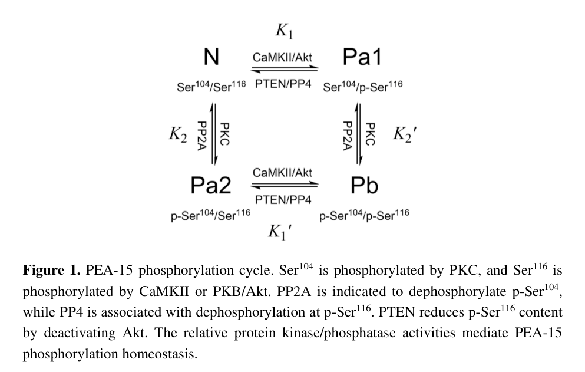

## Question

# Gene Research for Functional Annotation

## ⚠️ CRITICAL: Gene/Protein Identification Context

**BEFORE YOU BEGIN RESEARCH:** You MUST verify you are researching the CORRECT gene/protein. Gene symbols can be ambiguous, especially for less well-characterized genes from non-model organisms.

### Target Gene/Protein Identity (from UniProt):
- **UniProt Accession:** Q15121
- **Protein Description:** RecName: Full=Astrocytic phosphoprotein PEA-15; AltName: Full=15 kDa phosphoprotein enriched in astrocytes; AltName: Full=Phosphoprotein enriched in diabetes; Short=PED;
- **Gene Information:** Name=PEA15;
- **Organism (full):** Homo sapiens (Human).
- **Protein Family:** Not specified in UniProt
- **Key Domains:** DEATH-like_dom_sf. (IPR011029); DED_dom. (IPR001875); PEA15_DED. (IPR029546); DED (PF01335)

### MANDATORY VERIFICATION STEPS:

1. **Check if the gene symbol "PEA15" matches the protein description above**
2. **Verify the organism is correct:** Homo sapiens (Human).
3. **Check if protein family/domains align with what you find in literature**
4. **If you find literature for a DIFFERENT gene with the same or similar symbol, STOP**

### If Gene Symbol is Ambiguous or You Cannot Find Relevant Literature:

**DO NOT PROCEED WITH RESEARCH ON A DIFFERENT GENE.** Instead:
- State clearly: "The gene symbol 'PEA15' is ambiguous or literature is limited for this specific protein"
- Explain what you found (e.g., "Found extensive literature on a different gene with the same symbol in a different organism")
- Describe the protein based ONLY on the UniProt information provided above
- Suggest that the protein function can be inferred from domain/family information

### Research Target:

Please provide a comprehensive research report on the gene **PEA15** (gene ID: PEA15, UniProt: Q15121) in human.

The research report should be a detailed narrative explaining the function, biological processes, and localization of the gene product. Citations should be given for all claims.

You should prioritize authoritative reviews and primary scientific literature when conducting research. You can supplement
this with annotations you find in gene/protein databases, but these can be outdated or inaccurate.

We are specifically interested in the primary function of the gene - for enzymes, what reaction is catalyzed, and what is the substrate specificity? For transporters, what is the substrate? For structural proteins or adapters, what is the broader structural role? For signaling molecules, what is the role in the pathway.

We are interested in where in or outside the cell the gene product carries out its function.

We are also interested in the signaling or biochemical pathways in which the gene functions. We are less interested in broad pleiotropic effects, except where these elucidate the precise role.

Include evidence where possible. We are interested in both experimental evidence as well as inference from structure, evolution, or bioinformatic analysis. Precise studies should be prioritized over high-throughput, where available.

## Output

Question: You are an expert researcher providing comprehensive, well-cited information.

Provide detailed information focusing on:
1. Key concepts and definitions with current understanding
2. Recent developments and latest research (prioritize 2023-2024 sources)
3. Current applications and real-world implementations
4. Expert opinions and analysis from authoritative sources
5. Relevant statistics and data from recent studies

Format as a comprehensive research report with proper citations. Include URLs and publication dates where available.
Always prioritize recent, authoritative sources and provide specific citations for all major claims.

# Gene Research for Functional Annotation

## ⚠️ CRITICAL: Gene/Protein Identification Context

**BEFORE YOU BEGIN RESEARCH:** You MUST verify you are researching the CORRECT gene/protein. Gene symbols can be ambiguous, especially for less well-characterized genes from non-model organisms.

### Target Gene/Protein Identity (from UniProt):
- **UniProt Accession:** Q15121
- **Protein Description:** RecName: Full=Astrocytic phosphoprotein PEA-15; AltName: Full=15 kDa phosphoprotein enriched in astrocytes; AltName: Full=Phosphoprotein enriched in diabetes; Short=PED;
- **Gene Information:** Name=PEA15;
- **Organism (full):** Homo sapiens (Human).
- **Protein Family:** Not specified in UniProt
- **Key Domains:** DEATH-like_dom_sf. (IPR011029); DED_dom. (IPR001875); PEA15_DED. (IPR029546); DED (PF01335)

### MANDATORY VERIFICATION STEPS:

1. **Check if the gene symbol "PEA15" matches the protein description above**
2. **Verify the organism is correct:** Homo sapiens (Human).
3. **Check if protein family/domains align with what you find in literature**
4. **If you find literature for a DIFFERENT gene with the same or similar symbol, STOP**

### If Gene Symbol is Ambiguous or You Cannot Find Relevant Literature:

**DO NOT PROCEED WITH RESEARCH ON A DIFFERENT GENE.** Instead:
- State clearly: "The gene symbol 'PEA15' is ambiguous or literature is limited for this specific protein"
- Explain what you found (e.g., "Found extensive literature on a different gene with the same symbol in a different organism")
- Describe the protein based ONLY on the UniProt information provided above
- Suggest that the protein function can be inferred from domain/family information

### Research Target:

Please provide a comprehensive research report on the gene **PEA15** (gene ID: PEA15, UniProt: Q15121) in human.

The research report should be a detailed narrative explaining the function, biological processes, and localization of the gene product. Citations should be given for all claims.

You should prioritize authoritative reviews and primary scientific literature when conducting research. You can supplement
this with annotations you find in gene/protein databases, but these can be outdated or inaccurate.

We are specifically interested in the primary function of the gene - for enzymes, what reaction is catalyzed, and what is the substrate specificity? For transporters, what is the substrate? For structural proteins or adapters, what is the broader structural role? For signaling molecules, what is the role in the pathway.

We are interested in where in or outside the cell the gene product carries out its function.

We are also interested in the signaling or biochemical pathways in which the gene functions. We are less interested in broad pleiotropic effects, except where these elucidate the precise role.

Include evidence where possible. We are interested in both experimental evidence as well as inference from structure, evolution, or bioinformatic analysis. Precise studies should be prioritized over high-throughput, where available.

# Functional annotation report: human **PEA15 / PEA-15** (UniProt Q15121)

## Executive conclusion

The requested target is correctly identified. **PEA15** encodes human astrocytic phosphoprotein PEA-15—also called the 15-kDa phosphoprotein enriched in astrocytes and PED/phosphoprotein enriched in diabetes—not a similarly named protein from another organism. Its approximately 15-kDa size, N-terminal death-effector domain (DED), and flexible phosphorylatable C-terminal tail agree with the supplied UniProt Q15121 and InterPro/Pfam death-like/DED annotations. No conflicting same-symbol literature was used. PEA-15 is **not an enzyme, transporter, receptor, or structural filament protein**. It is an intracellular, phosphorylation-regulated **signaling adaptor/scaffold** whose best-established primary function is to bind ERK1/2 and control their spatial access to nuclear substrates; alternative interactions with FADD and phospholipase D1 connect it to death-receptor and metabolic signaling. (wei2015onthequest pages 1-3, wei2015onthequest pages 8-10)

| Feature | Precise annotation/mechanism | Strongest evidence | Functional consequence |
|---|---|---|---|
| Identity and architecture | Human PEA15/Q15121 is a ~15-kDa, 130-residue phosphoprotein comprising an N-terminal death-effector domain (DED; residues 1–90) and flexible C-terminal tail (91–130); the DED includes a D19–R72–D74 charge network. | Structural and sequence synthesis in Wei, published July 31, 2015 (wei2015onthequest pages 1-3, wei2015onthequest media ca8c2b27) | Confirms alignment with the supplied Pfam/InterPro DED and death-like-domain annotations and supports interaction-mediated—not catalytic—function. |
| Primary molecular function | Non-enzymatic signaling adaptor/scaffold with no known catalytic reaction or substrate; function arises through regulated protein–protein interactions. | Biochemical and structural review of ERK, FADD, PLD, and RSK2 interactions (wei2015onthequest pages 1-3, wei2015onthequest pages 8-10) | Integrates MAPK signaling, death-receptor apoptosis, and lipid/glucose signaling. |
| ERK1/2 interaction | Forms a 1:1 complex with ERK1/2 at sub-micromolar affinity. Binding involves the DED and C-terminal sequence 121–129 (`IKLAPPPKK`); D74A abolishes binding. | Structural and binding evidence summarized in Wei 2015 (wei2015onthequest pages 8-10) | Retains ERK—including activated ERK—in the cytoplasm, limiting nuclear ERK/Elk-1 transcription, proliferation, and invasion. |
| Phosphorylation switch | PKC phosphorylates Ser104; CaMKII and Akt can phosphorylate Ser116. Ser104 phosphorylation disrupts ERK association, whereas Ser116 phosphorylation favors FADD binding; phosphorylation itself does not simply determine PEA-15 nuclear/cytoplasmic distribution. | Partner-switch experiments in Renganathan et al., September 2005, plus phosphorylation-cycle synthesis (renganathan2005phosphorylationofpea15 pages 5-6, renganathan2005phosphorylationofpea15 pages 6-7, wei2015onthequest media ca8c2b27) | Changes PEA-15 from an ERK-regulating state toward a death-receptor/FADD-regulating state, coupling proliferation and survival pathways. |
| FADD and DISC | The PEA-15 DED engages FADD; Ser116 phosphorylation promotes FADD association and recruitment to the death-inducing signaling complex (DISC), where PEA-15 can interfere with procaspase-8 recruitment or activation. | Biochemical switching experiments and structural electrostatics of the PEA-15/FADD DED surfaces (renganathan2005phosphorylationofpea15 pages 5-6, wei2015onthequest media ca8c2b27) | Usually suppresses Fas/TNF-family death-receptor apoptosis, although net effects are cell- and phosphorylation-state-dependent. |
| PLD1 and glucose signaling | PEA-15 residues 1–24 bind PLD1 residues 762–801; ERK2 and PLD1 binding modes are mutually exclusive. PEA-15–PLD signaling raises diacylglycerol and PKCα activity and perturbs PKCζ/GLUT4 signaling. | Interaction mapping and signaling synthesis in Wei 2015 (wei2015onthequest pages 1-3, wei2015onthequest pages 8-10) | Can reduce GLUT4 plasma-membrane recruitment and glucose transport, linking elevated PED/PEA-15 to insulin resistance; disrupting PEA-15–PLD1 remains experimental. |
| Subcellular localization | PEA-15 is intracellular and dynamically distributed between cytoplasm and nucleus; it contains an N-terminal nuclear-export sequence at residues 7–17. Its best-established spatial role is cytoplasmic ERK sequestration/export rather than residence in an extracellular or membrane compartment. | Domain/localization synthesis and phosphorylation experiments (wei2015onthequest pages 1-3, renganathan2005phosphorylationofpea15 pages 5-6) | Spatially separates ERK from nuclear transcriptional substrates without necessarily preventing ERK phosphorylation. |
| Cancer evidence and therapeutic status | In 320 human breast cancers, low PEA-15 correlated with high nuclear grade (`P < 0.0001`) and hormone-receptor negativity (`P = 0.0004`). In MDA-MB-468 xenografts, six weekly intratumoral Ad.PEA-15 injections, with seven mice per group, suppressed tumor growth and reduced Ki-67 by ~50%. | Bartholomeusz et al., March 2010 (bartholomeusz2010pea15inhibitstumorigenesis pages 7-8, bartholomeusz2010pea15inhibitstumorigenesis pages 1-1) | Supports context-dependent tumor-suppressive activity through cytoplasmic pERK retention and caspase-8-dependent apoptosis, but only at the preclinical level. |
| Current evidence boundary | No clinical-trial evidence was retrieved, and the strongest direct mechanistic literature is largely foundational rather than from 2023–2024; recent database associations are low-scoring and do not establish causality or therapeutic validity. | Literature search and Open Targets evidence summary (OpenTargets Search: -PEA15) | PEA15 should currently be treated as a mechanistically credible research target or biomarker, not a clinically validated drug target or approved therapy. |

*Table: Compact functional-annotation table for human PEA15/Q15121, covering structure, interaction mechanisms, localization, signaling consequences, and quantitative preclinical evidence. It also highlights the lack of strong direct mechanistic studies from 2023–2024 and the absence of validated clinical applications.*

## 1. Identity, structure, and molecular class

PEA-15 is a small, broadly expressed mammalian phosphoprotein of approximately 15 kDa and 130 amino acids. Its folded N-terminal DED occupies approximately residues 1–90, followed by a flexible C-terminal tail spanning residues 91–130. The N terminus also contains a proposed nuclear-export sequence at residues 7–17, while the DED contains a structurally important D19–R72–D74 charge network. These features align with the user-supplied **DED_dom, PEA15_DED, and death-like-domain-superfamily** annotations. (wei2015onthequest pages 1-3)

The DED is a protein-interaction module rather than a catalytic domain. Accordingly, there is **no reaction, catalytic substrate, transported solute, or enzymatic substrate specificity to annotate**. PEA-15’s functional specificity is instead defined by mutually regulated interactions with ERK1/2, FADD, PLD1/2, and other signaling proteins. Structural visualization of the PEA-15 DED shows an asymmetric electrostatic surface compatible with DED-mediated interactions; comparison with the FADD DED provides a plausible electrostatic basis for their association, although such modeling should not be mistaken for a complete atomic complex structure. (wei2015onthequest pages 8-10, wei2015onthequest media 62fd75cc)

## 2. Primary function: spatial regulation of ERK/MAPK signaling

The most precise and reproducible molecular role is **binding ERK1 and ERK2 and retaining them in the cytoplasm**. PEA-15 forms a 1:1 complex with ERK1/2 with sub-micromolar affinity. ERK2 recognition involves both the DED and the C-terminal segment `121-IKLAPPPKK-129`; mutation D74A disrupts the DED interaction network and abolishes binding. (wei2015onthequest pages 8-10)

This interaction does not simply function as an ERK catalytic inhibitor. Rather, PEA-15 controls **compartmentalization**: it limits activated ERK accumulation in the nucleus and therefore reduces access to transcriptional substrates such as Elk-1. The expected downstream effects are reduced ERK-dependent transcription, cell-cycle progression, proliferation, and—in some settings—invasion. PEA-15 can therefore retain phosphorylated ERK in the cytoplasm even when upstream RAS–RAF–MEK signaling remains active. (bartholomeusz2010pea15inhibitstumorigenesis pages 7-8, renganathan2005phosphorylationofpea15 pages 5-6)

This distinction resolves an important interpretive issue: elevated phospho-ERK does not necessarily mean elevated nuclear ERK output when PEA-15 is abundant. In a breast-cancer xenograft study, PEA-15 increased tumor phospho-ERK while suppressing tumor growth, consistent with activated ERK being trapped away from nuclear proliferative targets. (bartholomeusz2010pea15inhibitstumorigenesis pages 7-8, bartholomeusz2010pea15inhibitstumorigenesis pages 1-1)

## 3. Phosphorylation-dependent partner switching

PEA-15 contains two principal regulatory phosphosites in its C-terminal tail:

- **Ser104** is phosphorylated principally by protein kinase C.
- **Ser116** can be phosphorylated by CaMKII and Akt/PKB.
- PP2A has been implicated in Ser104 dephosphorylation, PP4 in Ser116 dephosphorylation, and PTEN can lower Ser116 phosphorylation indirectly by restraining Akt. (wei2015onthequest media ca8c2b27)

Direct partner-switch experiments showed that Ser104 phosphorylation following PMA treatment impairs PEA-15–ERK association, permitting ERK nuclear translocation. Ser116 phosphorylation favors association with FADD and recruitment into death-receptor signaling complexes. Thus, PEA-15 behaves as a phosphorylation-controlled molecular switch linking proliferative MAPK signaling to death-receptor signaling. Phosphorylation did not itself substantially alter PEA-15’s nuclear-versus-cytoplasmic distribution in those experiments; it primarily altered interaction specificity. (renganathan2005phosphorylationofpea15 pages 5-6, renganathan2005phosphorylationofpea15 pages 6-7)

Some structural and biochemical reports differ over exactly how individual phosphosites alter ERK affinity under different assay conditions. The strongest defensible model is therefore not a binary universal switch, but a **context-dependent redistribution among interaction states**, influenced by cell type, kinase activity, phosphatases, and partner abundance. (wei2015onthequest pages 8-10, renganathan2005phosphorylationofpea15 pages 6-7)

## 4. Death-receptor signaling and apoptosis

Through DED-mediated interaction with **FADD**, PEA-15 can enter the Fas/TNF-family death-receptor pathway. In its commonly described anti-apoptotic mode, PEA-15 interferes with recruitment or activation of procaspase-8 at the death-inducing signaling complex, thereby limiting downstream caspase activation. Ser116 phosphorylation promotes FADD association. PEA-15-deficient astrocytes were reported to undergo apoptosis within 24 hours of TNFα treatment, supporting a survival function in that cellular context. (wei2015onthequest pages 1-3, renganathan2005phosphorylationofpea15 pages 5-6)

The outcome is not uniformly anti-apoptotic. PEA-15 overexpression induced caspase-8-dependent apoptosis in certain breast-cancer models, and phosphostate, PTEN/Akt signaling, receptor context, and competing ERK interactions can change the outcome. Consequently, “PEA-15 is anti-apoptotic” is an incomplete annotation; more accurately, it is a **modulator of DISC assembly and caspase-8 signaling whose net effect is conditional**. (bartholomeusz2010pea15inhibitstumorigenesis pages 7-8, wei2015onthequest pages 10-12)

## 5. PLD signaling and glucose metabolism

PEA-15 also binds phospholipase D, particularly **PLD1**. Interaction mapping places the PEA-15 interface within residues 1–24 and the PLD1 interface within residues 762–801. ERK2 and PLD1 binding modes are reported to be mutually exclusive, reinforcing the concept that PEA-15 partitions among distinct signaling complexes. (wei2015onthequest pages 8-10)

The PEA-15–PLD axis can increase lipid-signaling output, including diacylglycerol and PKCα activity, and perturb PKCζ-dependent recruitment of the glucose transporter GLUT4 to the plasma membrane. Elevated PED/PEA-15 has therefore been connected experimentally to impaired insulin-stimulated glucose transport and insulin resistance. This is an indirect signaling effect: PEA-15 neither transports glucose nor catalyzes lipid hydrolysis itself. Disrupting PEA-15–PLD1 interaction has been proposed as a way to improve insulin sensitivity, but remains experimental. (wei2015onthequest pages 1-3, wei2015onthequest pages 8-10)

## 6. Cellular location

PEA-15 is an **intracellular soluble protein**, found principally in cytoplasmic signaling complexes but capable of nucleocytoplasmic trafficking. Its key site-of-action annotation is functional rather than organelle-specific: in the cytoplasm it binds ERK and prevents or reverses ERK nuclear accumulation. It can also associate with cytoplasmic death-receptor/DISC machinery and PLD-containing signaling complexes. There is no evidence in the retrieved literature that PEA-15 is secreted, an integral membrane protein, or an extracellular matrix component. (wei2015onthequest pages 1-3, renganathan2005phosphorylationofpea15 pages 5-6)

## 7. Cancer biology and quantitative evidence

PEA-15 can be tumor suppressive when unphosphorylated or ERK-bound, because cytoplasmic ERK sequestration suppresses nuclear proliferation and invasion programs. Conversely, phosphorylated PEA-15 can promote survival through FADD/caspase-8 regulation, and in active-RAS settings its PLD1 interaction can enhance ERK pathway output and transformation. It is therefore inappropriate to label PEA15 as universally oncogenic or universally tumor suppressive; **phosphorylation state, oncogenic background, localization, and interacting partner determine the phenotype**. (renganathan2005phosphorylationofpea15 pages 5-6, wei2015onthequest pages 8-10, wei2015onthequest pages 10-12)

The strongest quantitative translational evidence retrieved comes from a 2010 breast-cancer study:

- PEA-15 abundance was measured in **320 human breast cancers**.
- Low expression correlated with high nuclear grade (**P < 0.0001**) and hormone-receptor negativity (**P = 0.0004**).
- In MDA-MB-468 triple-negative breast-cancer xenografts, six weekly intratumoral injections of adenoviral PEA-15 significantly suppressed tumor growth; groups contained seven mice.
- Treatment reduced Ki-67 staining by approximately **50%**, increased tumor phospho-ERK, and induced caspase-8/PARP cleavage. Depending on the reported comparison, tumor-volume significance was **P < 0.001 to P < 0.0001**. (bartholomeusz2010pea15inhibitstumorigenesis pages 7-8, bartholomeusz2010pea15inhibitstumorigenesis pages 1-1)

These results support a preclinical gene/protein-delivery concept, not a clinically established therapy. Open Targets currently links PEA15 to ovarian cancer/carcinoma, hepatocellular carcinoma, polycystic ovary syndrome, and integument abnormalities, but the returned association scores were low—approximately **0.09–0.18**—and should be treated as evidence aggregation rather than proof of causal disease involvement. (OpenTargets Search: -PEA15)

## 8. Current applications and recent-research assessment

Proposed applications include PEA-15 expression or phosphostate as a tumor biomarker, PEA-15 gene/protein delivery to sequester oncogenic ERK, disruption of PEA-15–PLD1 in insulin resistance, and pharmacological manipulation of the kinases, phosphatases, or interfaces governing its partner selection. Phosphomimetic studies have also suggested that PEA-15 state may modify responses to paclitaxel, erlotinib, and the MEK inhibitor selumetinib. These remain research or preclinical strategies. (bartholomeusz2010pea15inhibitstumorigenesis pages 7-8, wei2015onthequest pages 10-12)

A targeted search prioritizing **2023–2024** did not retrieve strong new primary studies that revise the core mechanistic annotation, nor did it identify a validated PEA15-directed clinical trial or approved therapy. The recent hits were largely tangential, high-throughput, or disease-specific references without decisive new PEA-15 biochemistry. Accordingly, the current functional consensus still rests mainly on foundational biochemical, structural, and cellular studies from 2005–2015. This evidence boundary is important: PEA15 is a credible mechanistic target, but not yet a clinically validated drug target. (OpenTargets Search: -PEA15)

## 9. Expert interpretation and recommended annotation

The most defensible concise annotation is:

> **PEA-15 is a 15-kDa intracellular DED-containing adaptor that integrates MAPK, death-receptor, and PLD-dependent metabolic signaling. Its primary molecular action is phosphorylation-regulated binding and spatial sequestration of ERK1/2; phosphorylation shifts interaction preference toward FADD/DISC and other complexes, thereby coordinating proliferation, apoptosis, and glucose-signaling outputs.**

This formulation is preferable to broad labels such as “apoptosis protein” or “diabetes protein.” It specifies the molecular action, location, and pathway mechanism while acknowledging the context-dependent phenotypes emphasized by authoritative reviews. (wei2015onthequest pages 1-3, renganathan2005phosphorylationofpea15 pages 5-6, wei2015onthequest pages 8-10)

## Key sources

1. Wei Y. **On the Quest of Cellular Functions of PEA-15 and the Therapeutic Opportunities.** *Pharmaceuticals.* Published **31 July 2015**;8:455–473. DOI/URL: https://doi.org/10.3390/ph8030455. (wei2015onthequest pages 1-3, wei2015onthequest pages 8-10)
2. Renganathan H, Vaidyanathan H, Knapinska A, Ramos JW. **Phosphorylation of PEA-15 switches its binding specificity from ERK/MAPK to FADD.** *Biochemical Journal.* Published **September 2005**;390(Pt 3):729–735. DOI/URL: https://doi.org/10.1042/BJ20050378. (renganathan2005phosphorylationofpea15 pages 5-6, renganathan2005phosphorylationofpea15 pages 6-7)
3. Bartholomeusz C, et al. **PEA-15 inhibits tumorigenesis in an MDA-MB-468 triple-negative breast cancer xenograft model through increased cytoplasmic localization of activated ERK.** *Clinical Cancer Research.* Published **March 2010**;16(6):1802–1811. DOI/URL: https://doi.org/10.1158/1078-0432.CCR-09-1456. (bartholomeusz2010pea15inhibitstumorigenesis pages 7-8, bartholomeusz2010pea15inhibitstumorigenesis pages 1-1)

Overall confidence is **high** for identity, DED architecture, non-catalytic adaptor function, ERK binding/sequestration, and Ser104/Ser116 regulation; **moderate** for universal directionality of apoptosis and metabolic phenotypes; and **low-to-moderate** for disease-specific clinical utility because available evidence remains predominantly preclinical.

References

1. (wei2015onthequest pages 1-3): Yufeng Wei. On the quest of cellular functions of pea-15 and the therapeutic opportunities. Pharmaceuticals, 8:455-473, Jul 2015. URL: https://doi.org/10.3390/ph8030455, doi:10.3390/ph8030455. This article has 15 citations.

2. (wei2015onthequest pages 8-10): Yufeng Wei. On the quest of cellular functions of pea-15 and the therapeutic opportunities. Pharmaceuticals, 8:455-473, Jul 2015. URL: https://doi.org/10.3390/ph8030455, doi:10.3390/ph8030455. This article has 15 citations.

3. (wei2015onthequest media ca8c2b27): Yufeng Wei. On the quest of cellular functions of pea-15 and the therapeutic opportunities. Pharmaceuticals, 8:455-473, Jul 2015. URL: https://doi.org/10.3390/ph8030455, doi:10.3390/ph8030455. This article has 15 citations.

4. (renganathan2005phosphorylationofpea15 pages 5-6): Hemamalini Renganathan, Hema Vaidyanathan, Anna Knapinska, and Joe W. Ramos. Phosphorylation of pea-15 switches its binding specificity from erk/mapk to fadd. The Biochemical journal, 390 Pt 3:729-35, Sep 2005. URL: https://doi.org/10.1042/bj20050378, doi:10.1042/bj20050378. This article has 136 citations.

5. (renganathan2005phosphorylationofpea15 pages 6-7): Hemamalini Renganathan, Hema Vaidyanathan, Anna Knapinska, and Joe W. Ramos. Phosphorylation of pea-15 switches its binding specificity from erk/mapk to fadd. The Biochemical journal, 390 Pt 3:729-35, Sep 2005. URL: https://doi.org/10.1042/bj20050378, doi:10.1042/bj20050378. This article has 136 citations.

6. (bartholomeusz2010pea15inhibitstumorigenesis pages 7-8): Chandra Bartholomeusz, Ana M. Gonzalez-Angulo, Anna Kazansky, Savitri Krishnamurthy, Ping Liu, Linda X. H. Yuan, Fumiyuki Yamasaki, Shuying Liu, Naoki Hayashi, Dongwei Zhang, Francisco J. Esteva, Gabriel N. Hortobagyi, and Naoto T. Ueno. Pea-15 inhibits tumorigenesis in an mda-mb-468 triple-negative breast cancer xenograft model through increased cytoplasmic localization of activated extracellular signal-regulated kinase. Clinical Cancer Research, 16(6):1802-1811, Mar 2010. URL: https://doi.org/10.1158/1078-0432.ccr-09-1456, doi:10.1158/1078-0432.ccr-09-1456. This article has 51 citations and is from a highest quality peer-reviewed journal.

7. (bartholomeusz2010pea15inhibitstumorigenesis pages 1-1): Chandra Bartholomeusz, Ana M. Gonzalez-Angulo, Anna Kazansky, Savitri Krishnamurthy, Ping Liu, Linda X. H. Yuan, Fumiyuki Yamasaki, Shuying Liu, Naoki Hayashi, Dongwei Zhang, Francisco J. Esteva, Gabriel N. Hortobagyi, and Naoto T. Ueno. Pea-15 inhibits tumorigenesis in an mda-mb-468 triple-negative breast cancer xenograft model through increased cytoplasmic localization of activated extracellular signal-regulated kinase. Clinical Cancer Research, 16(6):1802-1811, Mar 2010. URL: https://doi.org/10.1158/1078-0432.ccr-09-1456, doi:10.1158/1078-0432.ccr-09-1456. This article has 51 citations and is from a highest quality peer-reviewed journal.

8. (OpenTargets Search: -PEA15): Open Targets Query (-PEA15, 5 results). Buniello, A. et al. (2025). Open Targets Platform: facilitating therapeutic hypotheses building in drug discovery. Nucleic Acids Research.

9. (wei2015onthequest media 62fd75cc): Yufeng Wei. On the quest of cellular functions of pea-15 and the therapeutic opportunities. Pharmaceuticals, 8:455-473, Jul 2015. URL: https://doi.org/10.3390/ph8030455, doi:10.3390/ph8030455. This article has 15 citations.

10. (wei2015onthequest pages 10-12): Yufeng Wei. On the quest of cellular functions of pea-15 and the therapeutic opportunities. Pharmaceuticals, 8:455-473, Jul 2015. URL: https://doi.org/10.3390/ph8030455, doi:10.3390/ph8030455. This article has 15 citations.

## Artifacts

- [Edison artifact artifact-00](PEA15-deep-research-falcon_artifacts/artifact-00.md)

## Citations

1. wei2015onthequest pages 8-10
2. wei2015onthequest pages 1-3
3. wei2015onthequest pages 10-12
4. https://doi.org/10.3390/ph8030455.
5. https://doi.org/10.1042/BJ20050378.
6. https://doi.org/10.1158/1078-0432.CCR-09-1456.
7. https://doi.org/10.3390/ph8030455,
8. https://doi.org/10.1042/bj20050378,
9. https://doi.org/10.1158/1078-0432.ccr-09-1456,