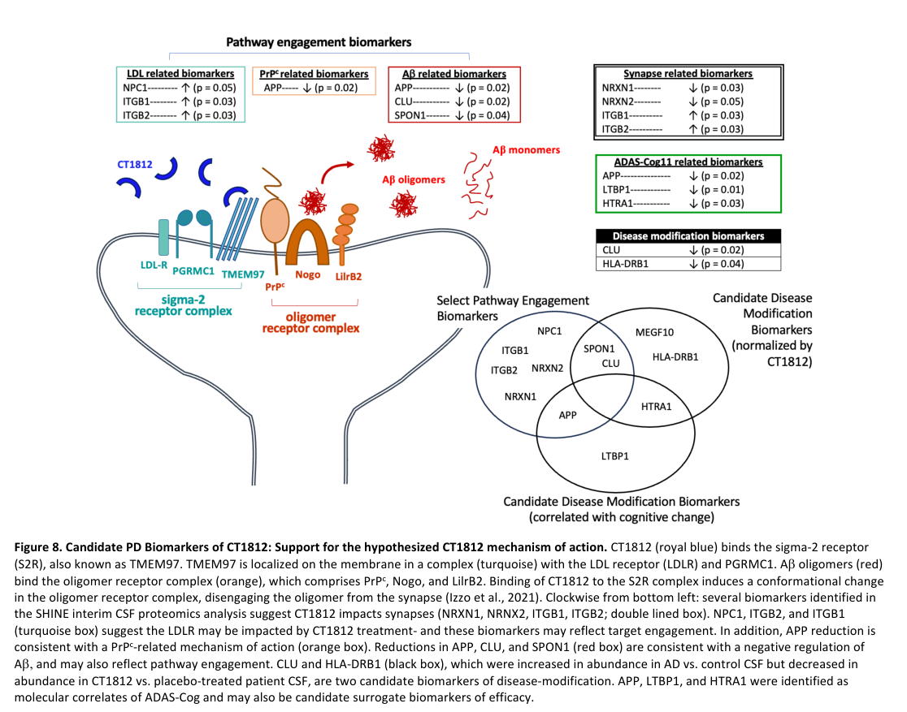

## Question

# Gene Research for Functional Annotation

## ⚠️ CRITICAL: Gene/Protein Identification Context

**BEFORE YOU BEGIN RESEARCH:** You MUST verify you are researching the CORRECT gene/protein. Gene symbols can be ambiguous, especially for less well-characterized genes from non-model organisms.

### Target Gene/Protein Identity (from UniProt):
- **UniProt Accession:** O00264
- **Protein Description:** RecName: Full=Membrane-associated progesterone receptor component 1; Short=mPR; AltName: Full=Dap1 {ECO:0000303|PubMed:28396637}; AltName: Full=IZA {ECO:0000303|PubMed:28396637};
- **Gene Information:** Name=PGRMC1 {ECO:0000312|HGNC:HGNC:16090}; Synonyms=HPR6.6 {ECO:0000303|PubMed:9705155}, PGRMC;
- **Organism (full):** Homo sapiens (Human).
- **Protein Family:** Belongs to the cytochrome b5 family. MAPR subfamily.
- **Key Domains:** Cyt_B5-like_heme/steroid-bd. (IPR001199); Cyt_B5-like_heme/steroid_sf. (IPR036400); MAPR/NEUFC/NENF-like. (IPR050577); Cyt-b5 (PF00173)

### MANDATORY VERIFICATION STEPS:

1. **Check if the gene symbol "PGRMC1" matches the protein description above**
2. **Verify the organism is correct:** Homo sapiens (Human).
3. **Check if protein family/domains align with what you find in literature**
4. **If you find literature for a DIFFERENT gene with the same or similar symbol, STOP**

### If Gene Symbol is Ambiguous or You Cannot Find Relevant Literature:

**DO NOT PROCEED WITH RESEARCH ON A DIFFERENT GENE.** Instead:
- State clearly: "The gene symbol 'PGRMC1' is ambiguous or literature is limited for this specific protein"
- Explain what you found (e.g., "Found extensive literature on a different gene with the same symbol in a different organism")
- Describe the protein based ONLY on the UniProt information provided above
- Suggest that the protein function can be inferred from domain/family information

### Research Target:

Please provide a comprehensive research report on the gene **PGRMC1** (gene ID: PGRMC1, UniProt: O00264) in human.

The research report should be a detailed narrative explaining the function, biological processes, and localization of the gene product. Citations should be given for all claims.

You should prioritize authoritative reviews and primary scientific literature when conducting research. You can supplement
this with annotations you find in gene/protein databases, but these can be outdated or inaccurate.

We are specifically interested in the primary function of the gene - for enzymes, what reaction is catalyzed, and what is the substrate specificity? For transporters, what is the substrate? For structural proteins or adapters, what is the broader structural role? For signaling molecules, what is the role in the pathway.

We are interested in where in or outside the cell the gene product carries out its function.

We are also interested in the signaling or biochemical pathways in which the gene functions. We are less interested in broad pleiotropic effects, except where these elucidate the precise role.

Include evidence where possible. We are interested in both experimental evidence as well as inference from structure, evolution, or bioinformatic analysis. Precise studies should be prioritized over high-throughput, where available.

## Output

Question: You are an expert researcher providing comprehensive, well-cited information.

Provide detailed information focusing on:
1. Key concepts and definitions with current understanding
2. Recent developments and latest research (prioritize 2023-2024 sources)
3. Current applications and real-world implementations
4. Expert opinions and analysis from authoritative sources
5. Relevant statistics and data from recent studies

Format as a comprehensive research report with proper citations. Include URLs and publication dates where available.
Always prioritize recent, authoritative sources and provide specific citations for all major claims.

# Gene Research for Functional Annotation

## ⚠️ CRITICAL: Gene/Protein Identification Context

**BEFORE YOU BEGIN RESEARCH:** You MUST verify you are researching the CORRECT gene/protein. Gene symbols can be ambiguous, especially for less well-characterized genes from non-model organisms.

### Target Gene/Protein Identity (from UniProt):
- **UniProt Accession:** O00264
- **Protein Description:** RecName: Full=Membrane-associated progesterone receptor component 1; Short=mPR; AltName: Full=Dap1 {ECO:0000303|PubMed:28396637}; AltName: Full=IZA {ECO:0000303|PubMed:28396637};
- **Gene Information:** Name=PGRMC1 {ECO:0000312|HGNC:HGNC:16090}; Synonyms=HPR6.6 {ECO:0000303|PubMed:9705155}, PGRMC;
- **Organism (full):** Homo sapiens (Human).
- **Protein Family:** Belongs to the cytochrome b5 family. MAPR subfamily.
- **Key Domains:** Cyt_B5-like_heme/steroid-bd. (IPR001199); Cyt_B5-like_heme/steroid_sf. (IPR036400); MAPR/NEUFC/NENF-like. (IPR050577); Cyt-b5 (PF00173)

### MANDATORY VERIFICATION STEPS:

1. **Check if the gene symbol "PGRMC1" matches the protein description above**
2. **Verify the organism is correct:** Homo sapiens (Human).
3. **Check if protein family/domains align with what you find in literature**
4. **If you find literature for a DIFFERENT gene with the same or similar symbol, STOP**

### If Gene Symbol is Ambiguous or You Cannot Find Relevant Literature:

**DO NOT PROCEED WITH RESEARCH ON A DIFFERENT GENE.** Instead:
- State clearly: "The gene symbol 'PGRMC1' is ambiguous or literature is limited for this specific protein"
- Explain what you found (e.g., "Found extensive literature on a different gene with the same symbol in a different organism")
- Describe the protein based ONLY on the UniProt information provided above
- Suggest that the protein function can be inferred from domain/family information

### Research Target:

Please provide a comprehensive research report on the gene **PGRMC1** (gene ID: PGRMC1, UniProt: O00264) in human.

The research report should be a detailed narrative explaining the function, biological processes, and localization of the gene product. Citations should be given for all claims.

You should prioritize authoritative reviews and primary scientific literature when conducting research. You can supplement
this with annotations you find in gene/protein databases, but these can be outdated or inaccurate.

We are specifically interested in the primary function of the gene - for enzymes, what reaction is catalyzed, and what is the substrate specificity? For transporters, what is the substrate? For structural proteins or adapters, what is the broader structural role? For signaling molecules, what is the role in the pathway.

We are interested in where in or outside the cell the gene product carries out its function.

We are also interested in the signaling or biochemical pathways in which the gene functions. We are less interested in broad pleiotropic effects, except where these elucidate the precise role.

Include evidence where possible. We are interested in both experimental evidence as well as inference from structure, evolution, or bioinformatic analysis. Precise studies should be prioritized over high-throughput, where available.

## Research report: Human PGRMC1 (UniProt O00264) — functional annotation

### 1) Target verification (critical identity check)
The target in this report is **human PGRMC1** (Progesterone Receptor Membrane Component 1), **UniProt accession O00264**, a ~195-aa **membrane-associated progesterone receptor component** and member of the **MAPR (membrane-associated progesterone receptor) subfamily** with a **cytochrome b5-like heme/steroid-binding domain**. Recent literature explicitly anchors discussion to **UniProt O00264** and uses constructs matching the O00264 cytosolic domain (residues 44–195), supporting correct gene/protein identity and avoiding symbol ambiguity. (barata2024pleiotropyofprogesterone pages 7-9, badve2024definingrequirementsfor pages 1-6)

### 2) Key concepts and definitions (current understanding)

#### 2.1 MAPR/cytochrome b5-like heme-binding protein (not a classical nuclear progesterone receptor)
PGRMC1 is widely described as a **non-classical membrane progesterone receptor component** with pleiotropic functions including progesterone-related signaling and modulation of drug-metabolizing systems. Its key structural hallmark is a **cytochrome b5-like heme-binding fold** (MAPR family), which provides a mechanistic basis for heme-dependent interactions and potential heme trafficking/buffering functions. (barata2024pleiotropyofprogesterone pages 7-9, barata2024pleiotropyofprogesterone pages 5-7)

#### 2.2 Heme binding: residues, coordination, and “holo” vs “apo” PGRMC1
Multiple lines of evidence support that **PGRMC1 binds heme** at a **surface-exposed site**. A canonical structural model shows **Tyr113** coordinating the heme iron in a five-coordinate geometry, but more recent mechanistic work and cited prior literature indicate Tyr113 may not be strictly required for heme binding in all contexts and may be particularly important for specific functional interactions (e.g., with ferrochelatase). Residues and regions repeatedly implicated in heme binding and/or functional effects include **Tyr113, Tyr107, Lys163, Tyr164, Asp99–Lys102, and Asp120**. (barata2024pleiotropyofprogesterone pages 7-9, badve2024definingrequirementsfor pages 1-6, badve2024definingrequirementsfor pages 29-33)

#### 2.3 Dimerization/oligomerization as a regulatory mechanism
A recurring concept is that PGRMC1 forms **dimers/oligomers**, historically proposed to be driven by **heme–heme stacking** and linked to binding partners such as CYP enzymes and EGFR. A 2024 biochemical dissection supports a refined view: PGRMC1 can dimerize via **two non-mutually-exclusive mechanisms**—(i) **intermolecular disulfide bonding** centered on **Cys129** and (ii) **heme-mediated stacking** interactions—yielding mixtures of monomers, dimers, and larger oligomers depending on heme and redox state. (badve2024definingrequirementsfor pages 29-33)

### 3) Molecular functions and pathways (what PGRMC1 “does”)

#### 3.1 Primary biochemical role: heme-binding adaptor/chaperone-like behavior and protein–protein interactions
The most consistently supported molecular function across recent synthesis is that PGRMC1 is a **heme-binding membrane protein** whose **protein–protein interactions** (and potentially trafficking of heme) connect it to multiple pathways—particularly **cytochrome P450 (CYP) biology**, membrane receptor signaling (e.g., **EGFR**), and membrane microdomain complexes (e.g., **TMEM97/LDLR/PGRMC1**). (barata2024pleiotropyofprogesterone pages 13-14, barata2024pleiotropyofprogesterone pages 9-10, barata2024pleiotropyofprogesterone pages 23-24)

#### 3.2 Cytochrome P450 modulation (xenobiotic and endogenous metabolism)
A 2024 focused review emphasizes that PGRMC1 is one of few proteins described as a **direct modulator of human CYP activity**, with reported physical interactions with multiple CYPs (e.g., **CYP7A1, CYP21A2, CYP51A1, CYP3A4, CYP2C8, CYP2C2**) and **cytochrome P450 reductase (CPR)**. Effects are **isoform-dependent** and may include altered enzymatic parameters. Reported outcomes include:
- **CYP21A2** activity changes upon co-expression and mutation: wild-type PGRMC1 increased CYP21A2 activity (~**2-fold**), while specific PGRMC1 variants had different quantitative effects (e.g., **Tyr107Phe/Tyr113Phe ~+60%**; a region around **Asp99–Lys102 ~−75%**). (barata2024pleiotropyofprogesterone pages 9-10)
- For drug-metabolizing CYPs, higher PGRMC1 levels were reported to **reduce CYP3A4 and CYP2C9 activities**, with directionality including **increased Km and decreased kcat** for CYP3A4 and **decreased kcat** for CYP2C9 in cited studies. (barata2024pleiotropyofprogesterone pages 9-10)

**Interpretive consensus (expert synthesis):** Current expert reviews frame PGRMC1 less as a simple on/off “progesterone receptor” and more as a **membrane-associated heme-binding regulator** whose variable oligomeric state, PTMs, and cell-context-dependent localization can tune CYP complex function and thereby affect drug metabolism and endogenous steroid/lipid pathways. (barata2024pleiotropyofprogesterone pages 13-14, barata2024pleiotropyofprogesterone pages 9-10)

#### 3.3 Progesterone-linked anti-apoptotic signaling and receptor pathway crosstalk
PGRMC1 is also discussed as a mediator of **progesterone anti-apoptotic signaling**, including interaction with **PAIRBP1/SERBP1**, and as a modulator of oncogenic signaling through association with **EGFR**, with reported pathway crosstalk involving **Wnt/β-catenin** and **NF-κB** and links to **erlotinib resistance** in cancer models. (barata2024pleiotropyofprogesterone pages 11-13)

#### 3.4 Heme synthesis/trafficking links (ferrochelatase and heme transfer hypotheses)
PGRMC1 has been proposed to interact with heme biosynthesis machinery, including as a **partner/regulator of ferrochelatase (FECH)**, and as a factor that may **buffer or transfer heme** to other proteins. Recent reviews note the model remains plausible but incompletely resolved in vivo; nonetheless, it provides a coherent mechanistic explanation for why a cytochrome b5-like fold is conserved in MAPR proteins and why PGRMC1 may influence CYP stability/function. (barata2024pleiotropyofprogesterone pages 13-14, badve2024definingrequirementsfor pages 1-6)

### 4) Subcellular localization (where PGRMC1 acts)
PGRMC1 localization is repeatedly reported as **context-dependent**, with strong recurring evidence for association with the **endoplasmic reticulum (ER)/endomembranes**, and additional reported localization to the **plasma membrane**, **nucleus/nuclear membrane**, **Golgi**, **endosomes**, **cytoplasm**, and **mitochondria** depending on cell type and condition. (jo2024progesteronereceptormembrane pages 1-2, jo2023hepaticprogesteronereceptor pages 1-5, barata2024pleiotropyofprogesterone pages 5-7)

This distribution is biologically consistent with its proposed roles in (i) ER-embedded CYP systems and (ii) membrane receptor complexes and organelle crosstalk relevant to stress responses and metabolism. (barata2024pleiotropyofprogesterone pages 13-14, barata2024pleiotropyofprogesterone pages 5-7)

### 5) Recent developments (prioritizing 2023–2024)

#### 5.1 2024: refined mechanistic model of heme binding and dimerization determinants
Badve & Meier (Biochemistry, **Mar 2024**, https://doi.org/10.1021/acs.biochem.3c00718) used spectroscopy and mutational analysis (notably **Y113F** and **C129S**) to separate contributions of iron coordination and disulfide formation, supporting a **two-mechanism** model for PGRMC1 dimerization/oligomerization and emphasizing that conclusions from truncated cytosolic constructs must be reconciled with behavior of full-length membrane-bound PGRMC1. (badve2024definingrequirementsfor pages 29-33)

#### 5.2 2024: updated synthesis of PGRMC1 as a CYP modulator impacting drug metabolism
Barata et al. (Journal of Xenobiotics, **May 2024**, https://doi.org/10.3390/jox14020034) provides a 2024 synthesis spanning PGRMC1 structure, localization, heme binding, and **isoform-dependent CYP modulation**, highlighting experimental reports of altered catalytic parameters and the potential implications for xenobiotic metabolism and chemotherapy responses. (barata2024pleiotropyofprogesterone pages 9-10)

#### 5.3 2023–2024: stress/inflammation and tissue physiology links in vivo
- **Ethanol-associated liver injury (2023):** In a chronic-plus-binge ethanol feeding model, whole-body **Pgrmc1 knockout** mice showed increased liver injury indicators (including elevated ALT), higher acetaldehyde, ER stress, and apoptosis versus wild-type, supporting a protective role in hepatic stress responses and alcohol metabolism-related toxicity. (Jo et al., **Jun 2023**, https://doi.org/10.1152/ajpgi.00206.2022) (jo2023hepaticprogesteronereceptor pages 1-5)
- **Chronic neuroinflammation (2024):** In an LPS-induced chronic neuroinflammation model, Pgrmc1 knockout was associated with higher inflammatory cytokines, increased NF-κB signaling, ER stress markers, and apoptosis, consistent with PGRMC1 contributing to inflammatory/stress regulation in neural contexts. (Jo & Hong, **Feb 2024**, https://doi.org/10.3390/antiox13020230) (jo2024progesteronereceptormembrane pages 1-2)

#### 5.4 2024: reproductive biology—decidualization requires a timed PGRMC1 program
Liu et al. (Reproductive Biology and Endocrinology, **Feb 2024**, https://doi.org/10.1186/s12958-024-01188-9) reports that PGRMC1 follows a **progestin-induced “rise-to-decline” expression program** during in vitro decidualization; knockdown before induction prevents decidualization, and progestin induces interactions between PGRMC1 and **prohibitins (PHB1/PHB2)**, indicating a mechanistic partnership in early decidualization. (liu2024progesteroneinducedprogesteronereceptor pages 1-2)

### 6) Current applications and real-world implementations

#### 6.1 Drug metabolism and chemotherapy interactions (clinical relevance of CYP modulation)
Because CYP enzymes determine metabolism of many drugs, PGRMC1’s reported ability to modulate CYP expression/stability and catalytic parameters has translational implications for **variable drug clearance**, **drug–drug interactions**, and **chemotherapy response**. Contemporary reviews highlight this as a major reason PGRMC1 has drawn attention in cancer and pharmacology. (barata2024pleiotropyofprogesterone pages 13-14, barata2024pleiotropyofprogesterone pages 9-10)

#### 6.2 Sigma-2 (TMEM97) axis and the TMEM97–LDLR–PGRMC1 complex (Alzheimer’s disease therapeutic program)
A prominent translational “implementation” is that PGRMC1 is depicted as part of a **TMEM97 (sigma-2 receptor)–LDLR–PGRMC1** membrane complex relevant to cholesterol/synaptic biology. A CT1812 mechanism schematic proposes that CT1812 binding to sigma-2/TMEM97 induces conformational/complex changes that **displace Aβ oligomers from synapses**, a hypothesized therapeutic mechanism in AD. (lizama2024aninterimexploratory media a48f331c)

This sigma-2-centered approach does not necessarily require direct PGRMC1 targeting, but it makes PGRMC1 biologically relevant to a clinically active program via complex membership. (lizama2024aninterimexploratory media a48f331c)

### 7) Expert opinions and analysis (authoritative synthesis)
Recent expert syntheses converge on several interpretive points:
1. **PGRMC1 is best understood as a heme-binding MAPR protein with extensive protein–protein interactions**, rather than as a classical ligand-activated progesterone receptor. (barata2024pleiotropyofprogesterone pages 7-9, barata2024pleiotropyofprogesterone pages 9-10)
2. Mechanistic models that attribute all downstream biology to **heme-mediated dimers** are being **refined**; 2024 biochemical work supports a mixed mechanism (disulfide- and heme-mediated) and emphasizes the need to map these states to full-length membrane biology and physiological partners. (badve2024definingrequirementsfor pages 29-33)
3. The **most actionable near-term translational space** appears to be through (i) CYP modulation affecting pharmacology/toxicology and (ii) sigma-2/TMEM97 complex biology in oncology and neurodegeneration, rather than a single “enzymatic reaction” catalyzed by PGRMC1 (it is not itself a CYP enzyme). (barata2024pleiotropyofprogesterone pages 9-10, lizama2024aninterimexploratory media a48f331c)

### 8) Relevant statistics and data (recent studies)
Quantitative details available from the retrieved full text were more abundant for **CYP functional modulation** than for clinical associations:
- **CYP21A2 activity modulation** in cited cellular assays included ~**2-fold** increase with wild-type PGRMC1 and mutant-dependent effects (e.g., **~+60%** for Tyr107Phe/Tyr113Phe; **~−75%** for Asp99–Lys102 region). (barata2024pleiotropyofprogesterone pages 9-10)

For the 2023–2024 in vivo stress/injury studies retrieved here, the provided pages did not include detailed numerical datasets (n, p-values) in the extracted evidence snippets, though the qualitative direction of effects (KO worse than WT) is clear. (jo2024progesteronereceptormembrane pages 1-2, jo2023hepaticprogesteronereceptor pages 1-5)

### 9) Disease associations from knowledgebases (supporting but not definitive)
OpenTargets lists disease associations for PGRMC1 (e.g., neurodegenerative disease, premature ovarian failure, cataract-related phenotypes) based on multiple evidence types (literature and study links). These associations are hypothesis-supporting and should be interpreted in light of underlying evidence type and causality limits. (OpenTargets Search: -PGRMC1)

### 10) Summary: functional annotation (most defensible primary function)
**Most defensible primary functional description (integrating 2023–2024 evidence):** Human **PGRMC1 (O00264)** is a **single-pass membrane MAPR protein** with a **cytochrome b5-like heme-binding domain** that supports **heme-dependent and redox-sensitive oligomerization** and enables **regulatory interactions** with (at least) the **cytochrome P450 system** (CYPs and CPR) and membrane signaling complexes. Its predominant cellular context is **ER/endomembranes**, with additional localization to plasma membrane, nucleus, and mitochondria depending on cell type/condition. Through these biochemical and organizational roles, PGRMC1 influences **drug/xenobiotic metabolism**, **progesterone-linked survival signaling**, and **cell stress/inflammation phenotypes**, and it is implicated as a complex member in the **TMEM97–LDLR–PGRMC1** axis relevant to sigma-2–directed therapeutic development in Alzheimer’s disease. (barata2024pleiotropyofprogesterone pages 13-14, badve2024definingrequirementsfor pages 29-33, barata2024pleiotropyofprogesterone pages 9-10, jo2024progesteronereceptormembrane pages 1-2, jo2023hepaticprogesteronereceptor pages 1-5, liu2024progesteroneinducedprogesteronereceptor pages 1-2, lizama2024aninterimexploratory media a48f331c)

---

### Evidence map (compact)
| Topic | Key findings | Evidence type (review/primary, in vitro/in vivo) | Year | Citation (DOI URL where available) | Context ID |
|---|---|---|---|---|---|
| Molecular function | Human PGRMC1 (UniProt O00264) is a MAPR-family, cytochrome b5-like heme-binding protein with a surface-exposed heme site; recent work confirms heme binding stabilizes the cytosolic domain and supports interaction models relevant to downstream partners. | Primary biochemical/structural; in vitro | 2024 | Badve & Meier, *Biochemistry* (2024), https://doi.org/10.1021/acs.biochem.3c00718 | (badve2024definingrequirementsfor pages 1-6) |
| Key residues | Tyr113 is the canonical heme-coordinating residue in the crystal model; Tyr107, Lys163, Tyr164, Asp99-Lys102, and Asp120 also influence heme binding or partner effects. Y113F abolishes direct Fe coordination, while Cys129 is central to disulfide-linked dimerization. | Review synthesizing primary mutagenesis/structural studies; in vitro | 2024 | Barata et al., *Journal of Xenobiotics* (2024), https://doi.org/10.3390/jox14020034; Badve & Meier, *Biochemistry* (2024), https://doi.org/10.1021/acs.biochem.3c00718 | (barata2024pleiotropyofprogesterone pages 7-9, badve2024definingrequirementsfor pages 29-33) |
| Dimerization | PGRMC1 can form dimers/oligomers through two nonexclusive mechanisms: intermolecular disulfide formation centered on Cys129 and heme–heme stacking; earlier heme-dependent dimer models are being refined rather than simply accepted. | Primary spectroscopy/mutagenesis; in vitro | 2024 | Badve & Meier, *Biochemistry* (2024), https://doi.org/10.1021/acs.biochem.3c00718 | (badve2024definingrequirementsfor pages 29-33, badve2024definingrequirementsfor pages 33-35) |
| CYP modulation | PGRMC1 interacts with multiple CYPs and can modulate activity in an isoform-dependent manner. Reported partners include CYP7A1, CYP21A2, CYP51A1, CYP3A4, CYP2C8, CYP2C2, and CPR; effects include altered Km/kcat and either stimulation or inhibition depending on CYP and expression level. | Review of primary biochemical/cellular studies; in vitro and in vivo | 2024 | Barata et al., *Journal of Xenobiotics* (2024), https://doi.org/10.3390/jox14020034 | (barata2024pleiotropyofprogesterone pages 13-14, barata2024pleiotropyofprogesterone pages 9-10, barata2024pleiotropyofprogesterone pages 23-24) |
| Heme trafficking / ferrochelatase | PGRMC1 has been proposed as a heme-transfer or heme-buffering factor and a partner/regulator of ferrochelatase (FECH). Recent reviews emphasize that this remains plausible but incompletely resolved in vivo. | Review of primary studies; biochemical/cellular | 2024 | Barata et al., *Journal of Xenobiotics* (2024), https://doi.org/10.3390/jox14020034; Dunaway et al., *JBC* (2024), https://doi.org/10.1016/j.jbc.2024.107132 | (barata2024pleiotropyofprogesterone pages 13-14, badve2024definingrequirementsfor pages 1-6) |
| EGFR / progesterone signaling | PGRMC1 has been implicated in progesterone anti-apoptotic signaling via SERBP1/PAIRBP1 and in EGFR-associated oncogenic signaling, including links to Wnt/β-catenin and NF-κB pathways and erlotinib resistance. | Review of primary cell biology/cancer studies; mostly in vitro/in vivo models | 2024 | Barata et al., *Journal of Xenobiotics* (2024), https://doi.org/10.3390/jox14020034 | (barata2024pleiotropyofprogesterone pages 11-13) |
| TMEM97 / sigma-2 complex | Recent literature places PGRMC1 in a TMEM97 (sigma-2 receptor)-LDLR-PGRMC1 membrane complex relevant to cholesterol biology and Alzheimer’s disease drug development. A graphical mechanism for CT1812 proposes that binding to this complex indirectly displaces synaptotoxic Aβ oligomers. | Review/clinical translational reports; human clinical biomarker study and mechanistic model | 2024 | Lizama et al., *Alzheimer’s & Dementia* (2024), https://doi.org/10.1002/alz.14152; Lizama et al., *bioRxiv* (2024), https://doi.org/10.1101/2024.02.16.578765 | (lizama2024aninterimexploratory media a48f331c) |
| Localization | PGRMC1 localizes across multiple compartments depending on cell type: ER/endomembranes are most consistent, with additional reports at plasma membrane, nucleus/nuclear membrane, Golgi, endosomes, and mitochondria. | Review and primary studies; microscopy/fractionation; in vitro and in vivo | 2023-2024 | Barata et al., *Journal of Xenobiotics* (2024), https://doi.org/10.3390/jox14020034; Jo et al., *AJP Gastrointest Liver Physiol* (2023), https://doi.org/10.1152/ajpgi.00206.2022; Jo & Hong, *Antioxidants* (2024), https://doi.org/10.3390/antiox13020230 | (jo2024progesteronereceptormembrane pages 1-2, jo2023hepaticprogesteronereceptor pages 1-5, barata2024pleiotropyofprogesterone pages 5-7) |
| Mitochondrial function / liver injury | In a 2023 ethanol liver-injury study, loss of Pgrmc1 increased acetaldehyde, ALT, ER stress, and apoptosis in mice, supporting a protective hepatic role linked to alcohol metabolism and oxidative stress. | Primary mouse study; in vivo | 2023 | Jo et al., *AJP Gastrointest Liver Physiol* (2023), https://doi.org/10.1152/ajpgi.00206.2022 | (jo2023hepaticprogesteronereceptor pages 1-5) |
| Stress / inflammation | In chronic neuroinflammation models, Pgrmc1 knockout increased inflammatory cytokines, NF-κB signaling, ER-stress markers, and apoptosis, consistent with a protective role in cellular stress and inflammatory control. | Primary mouse/cell study; in vivo and in vitro | 2024 | Jo & Hong, *Antioxidants* (2024), https://doi.org/10.3390/antiox13020230 | (jo2024progesteronereceptormembrane pages 1-2) |
| Reproductive physiology | In human endometrial stromal cell decidualization models, PGRMC1 shows a progesterone-induced rise-to-decline program; knockdown before induction blocks decidualization, and PHB1/PHB2 emerge as inducible partners. | Primary human cell study; in vitro | 2024 | Liu et al., *Reproductive Biology and Endocrinology* (2024), https://doi.org/10.1186/s12958-024-01188-9 | (liu2024progesteroneinducedprogesteronereceptor pages 1-2) |
| Disease / application | PGRMC1 remains a candidate biomarker or functional node in cancer, neurodegeneration, liver injury, and reproductive disease, but direct clinical targeting is less mature than targeting the associated sigma-2/TMEM97 axis (e.g., CT1812 in AD; sigma-2 ligands in cancer). | Review + translational/clinical studies | 2024 | Takchi et al., *Cell Death & Disease* (2024), https://doi.org/10.1038/s41419-024-06693-8; Hagi et al., *Scientific Reports* (2024), https://doi.org/10.1038/s41598-024-56928-z; Lizama et al., *Alzheimer’s & Dementia* (2024), https://doi.org/10.1002/alz.14152 | (lizama2024aninterimexploratory media a48f331c, OpenTargets Search: -PGRMC1) |

*Table: This table summarizes experimentally supported functions, partners, localization, and recent 2023-2024 developments for human PGRMC1 (UniProt O00264). It is useful as a compact evidence map linking molecular mechanism to physiological and translational relevance.*

References

1. (barata2024pleiotropyofprogesterone pages 7-9): Isabel S. Barata, José Rueff, Michel Kranendonk, and Francisco Esteves. Pleiotropy of progesterone receptor membrane component 1 in modulation of cytochrome p450 activity. Journal of Xenobiotics, 14:575-603, May 2024. URL: https://doi.org/10.3390/jox14020034, doi:10.3390/jox14020034. This article has 5 citations.

2. (badve2024definingrequirementsfor pages 1-6): Prajakta Badve and Katlyn K. Meier. Defining requirements for heme binding in pgrmc1 and identifying key elements that influence protein dimerization. Biochemistry, 63:926-938, Mar 2024. URL: https://doi.org/10.1021/acs.biochem.3c00718, doi:10.1021/acs.biochem.3c00718. This article has 2 citations and is from a peer-reviewed journal.

3. (barata2024pleiotropyofprogesterone pages 5-7): Isabel S. Barata, José Rueff, Michel Kranendonk, and Francisco Esteves. Pleiotropy of progesterone receptor membrane component 1 in modulation of cytochrome p450 activity. Journal of Xenobiotics, 14:575-603, May 2024. URL: https://doi.org/10.3390/jox14020034, doi:10.3390/jox14020034. This article has 5 citations.

4. (badve2024definingrequirementsfor pages 29-33): Prajakta Badve and Katlyn K. Meier. Defining requirements for heme binding in pgrmc1 and identifying key elements that influence protein dimerization. Biochemistry, 63:926-938, Mar 2024. URL: https://doi.org/10.1021/acs.biochem.3c00718, doi:10.1021/acs.biochem.3c00718. This article has 2 citations and is from a peer-reviewed journal.

5. (barata2024pleiotropyofprogesterone pages 13-14): Isabel S. Barata, José Rueff, Michel Kranendonk, and Francisco Esteves. Pleiotropy of progesterone receptor membrane component 1 in modulation of cytochrome p450 activity. Journal of Xenobiotics, 14:575-603, May 2024. URL: https://doi.org/10.3390/jox14020034, doi:10.3390/jox14020034. This article has 5 citations.

6. (barata2024pleiotropyofprogesterone pages 9-10): Isabel S. Barata, José Rueff, Michel Kranendonk, and Francisco Esteves. Pleiotropy of progesterone receptor membrane component 1 in modulation of cytochrome p450 activity. Journal of Xenobiotics, 14:575-603, May 2024. URL: https://doi.org/10.3390/jox14020034, doi:10.3390/jox14020034. This article has 5 citations.

7. (barata2024pleiotropyofprogesterone pages 23-24): Isabel S. Barata, José Rueff, Michel Kranendonk, and Francisco Esteves. Pleiotropy of progesterone receptor membrane component 1 in modulation of cytochrome p450 activity. Journal of Xenobiotics, 14:575-603, May 2024. URL: https://doi.org/10.3390/jox14020034, doi:10.3390/jox14020034. This article has 5 citations.

8. (barata2024pleiotropyofprogesterone pages 11-13): Isabel S. Barata, José Rueff, Michel Kranendonk, and Francisco Esteves. Pleiotropy of progesterone receptor membrane component 1 in modulation of cytochrome p450 activity. Journal of Xenobiotics, 14:575-603, May 2024. URL: https://doi.org/10.3390/jox14020034, doi:10.3390/jox14020034. This article has 5 citations.

9. (jo2024progesteronereceptormembrane pages 1-2): Seong-Lae Jo and Eui-Ju Hong. Progesterone receptor membrane component 1 regulates cellular stress responses and inflammatory pathways in chronic neuroinflammatory conditions. Antioxidants, 13:230, Feb 2024. URL: https://doi.org/10.3390/antiox13020230, doi:10.3390/antiox13020230. This article has 6 citations.

10. (jo2023hepaticprogesteronereceptor pages 1-5): Seong-Lae Jo, In-Jeoung Baek, Je-Won Ko, Hyo-Jung Kwun, Hyun-Jin Shin, and Eui-Ju Hong. Hepatic progesterone receptor membrane component 1 attenuates ethanol-induced liver injury by reducing acetaldehyde production and oxidative stress. Jun 2023. URL: https://doi.org/10.1152/ajpgi.00206.2022, doi:10.1152/ajpgi.00206.2022. This article has 11 citations.

11. (liu2024progesteroneinducedprogesteronereceptor pages 1-2): Hailun Liu, André Franken, Alexandra P. Bielfeld, Tanja Fehm, Dieter Niederacher, Zhongping Cheng, Hans Neubauer, and Nadia Stamm. Progesterone-induced progesterone receptor membrane component 1 rise-to-decline changes are essential for decidualization. Reproductive Biology and Endocrinology : RB&E, Feb 2024. URL: https://doi.org/10.1186/s12958-024-01188-9, doi:10.1186/s12958-024-01188-9. This article has 12 citations.

12. (lizama2024aninterimexploratory media a48f331c): B. Lizama, H. North, K. Pandey, C. Williams, D. Duong, E. Cho, V. Di Caro, L. Ping, K. Blennow, H. Zetterberg, J. Lah, A. Levey, M. Grundman, A. Caggiano, N. Seyfried, and M. Hamby. An interim exploratory biomarker analysis of a phase 2 clinical trial to assess the impact of ct1812 in alzheimer’s disease. bioRxiv, Feb 2024. URL: https://doi.org/10.1101/2024.02.16.578765, doi:10.1101/2024.02.16.578765. This article has 3 citations.

13. (OpenTargets Search: -PGRMC1): Open Targets Query (-PGRMC1, 5 results). Buniello, A. et al. (2025). Open Targets Platform: facilitating therapeutic hypotheses building in drug discovery. Nucleic Acids Research.

14. (badve2024definingrequirementsfor pages 33-35): Prajakta Badve and Katlyn K. Meier. Defining requirements for heme binding in pgrmc1 and identifying key elements that influence protein dimerization. Biochemistry, 63:926-938, Mar 2024. URL: https://doi.org/10.1021/acs.biochem.3c00718, doi:10.1021/acs.biochem.3c00718. This article has 2 citations and is from a peer-reviewed journal.

## Artifacts

- [Edison artifact artifact-00](PGRMC1-deep-research-falcon_artifacts/artifact-00.md)

## Citations

1. badve2024definingrequirementsfor pages 29-33
2. barata2024pleiotropyofprogesterone pages 9-10
3. barata2024pleiotropyofprogesterone pages 11-13
4. jo2023hepaticprogesteronereceptor pages 1-5
5. jo2024progesteronereceptormembrane pages 1-2
6. liu2024progesteroneinducedprogesteronereceptor pages 1-2
7. badve2024definingrequirementsfor pages 1-6
8. barata2024pleiotropyofprogesterone pages 7-9
9. barata2024pleiotropyofprogesterone pages 5-7
10. barata2024pleiotropyofprogesterone pages 13-14
11. barata2024pleiotropyofprogesterone pages 23-24
12. badve2024definingrequirementsfor pages 33-35
13. https://doi.org/10.1021/acs.biochem.3c00718
14. https://doi.org/10.3390/jox14020034
15. https://doi.org/10.1152/ajpgi.00206.2022
16. https://doi.org/10.3390/antiox13020230
17. https://doi.org/10.1186/s12958-024-01188-9
18. https://doi.org/10.3390/jox14020034;
19. https://doi.org/10.1016/j.jbc.2024.107132
20. https://doi.org/10.1002/alz.14152;
21. https://doi.org/10.1101/2024.02.16.578765
22. https://doi.org/10.1152/ajpgi.00206.2022;
23. https://doi.org/10.1038/s41419-024-06693-8;
24. https://doi.org/10.1038/s41598-024-56928-z;
25. https://doi.org/10.1002/alz.14152
26. https://doi.org/10.3390/jox14020034,
27. https://doi.org/10.1021/acs.biochem.3c00718,
28. https://doi.org/10.3390/antiox13020230,
29. https://doi.org/10.1152/ajpgi.00206.2022,
30. https://doi.org/10.1186/s12958-024-01188-9,
31. https://doi.org/10.1101/2024.02.16.578765,