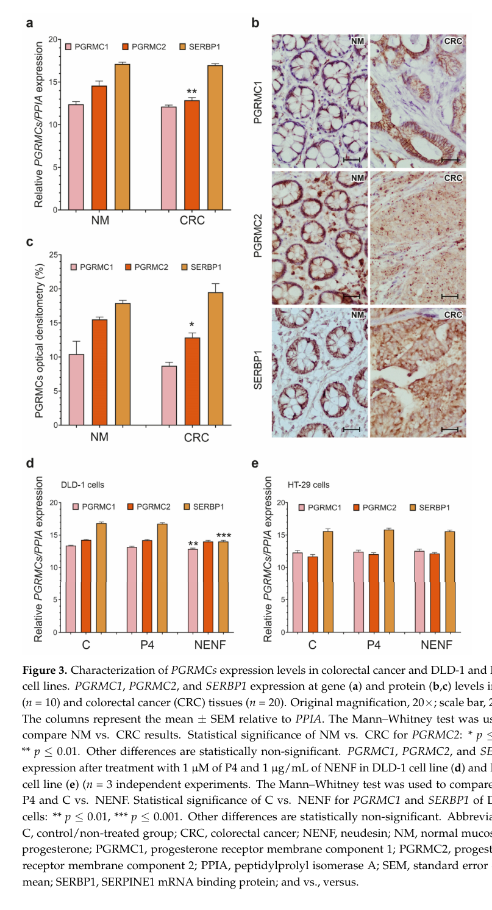

## Question

# Gene Research for Functional Annotation

## ⚠️ CRITICAL: Gene/Protein Identification Context

**BEFORE YOU BEGIN RESEARCH:** You MUST verify you are researching the CORRECT gene/protein. Gene symbols can be ambiguous, especially for less well-characterized genes from non-model organisms.

### Target Gene/Protein Identity (from UniProt):
- **UniProt Accession:** O15173
- **Protein Description:** RecName: Full=Membrane-associated progesterone receptor component 2 {ECO:0000305}; AltName: Full=Progesterone membrane-binding protein; AltName: Full=Steroid receptor protein DG6;
- **Gene Information:** Name=PGRMC2 {ECO:0000312|HGNC:HGNC:16089}; Synonyms=DG6 {ECO:0000303|PubMed:9705155}, PMBP;
- **Organism (full):** Homo sapiens (Human).
- **Protein Family:** Belongs to the cytochrome b5 family. MAPR subfamily.
- **Key Domains:** Cyt_B5-like_heme/steroid-bd. (IPR001199); Cyt_B5-like_heme/steroid_sf. (IPR036400); MAPR/NEUFC/NENF-like. (IPR050577); Cyt-b5 (PF00173)

### MANDATORY VERIFICATION STEPS:

1. **Check if the gene symbol "PGRMC2" matches the protein description above**
2. **Verify the organism is correct:** Homo sapiens (Human).
3. **Check if protein family/domains align with what you find in literature**
4. **If you find literature for a DIFFERENT gene with the same or similar symbol, STOP**

### If Gene Symbol is Ambiguous or You Cannot Find Relevant Literature:

**DO NOT PROCEED WITH RESEARCH ON A DIFFERENT GENE.** Instead:
- State clearly: "The gene symbol 'PGRMC2' is ambiguous or literature is limited for this specific protein"
- Explain what you found (e.g., "Found extensive literature on a different gene with the same symbol in a different organism")
- Describe the protein based ONLY on the UniProt information provided above
- Suggest that the protein function can be inferred from domain/family information

### Research Target:

Please provide a comprehensive research report on the gene **PGRMC2** (gene ID: PGRMC2, UniProt: O15173) in human.

The research report should be a detailed narrative explaining the function, biological processes, and localization of the gene product. Citations should be given for all claims.

You should prioritize authoritative reviews and primary scientific literature when conducting research. You can supplement
this with annotations you find in gene/protein databases, but these can be outdated or inaccurate.

We are specifically interested in the primary function of the gene - for enzymes, what reaction is catalyzed, and what is the substrate specificity? For transporters, what is the substrate? For structural proteins or adapters, what is the broader structural role? For signaling molecules, what is the role in the pathway.

We are interested in where in or outside the cell the gene product carries out its function.

We are also interested in the signaling or biochemical pathways in which the gene functions. We are less interested in broad pleiotropic effects, except where these elucidate the precise role.

Include evidence where possible. We are interested in both experimental evidence as well as inference from structure, evolution, or bioinformatic analysis. Precise studies should be prioritized over high-throughput, where available.

## Output

Question: You are an expert researcher providing comprehensive, well-cited information.

Provide detailed information focusing on:
1. Key concepts and definitions with current understanding
2. Recent developments and latest research (prioritize 2023-2024 sources)
3. Current applications and real-world implementations
4. Expert opinions and analysis from authoritative sources
5. Relevant statistics and data from recent studies

Format as a comprehensive research report with proper citations. Include URLs and publication dates where available.
Always prioritize recent, authoritative sources and provide specific citations for all major claims.

# Gene Research for Functional Annotation

## ⚠️ CRITICAL: Gene/Protein Identification Context

**BEFORE YOU BEGIN RESEARCH:** You MUST verify you are researching the CORRECT gene/protein. Gene symbols can be ambiguous, especially for less well-characterized genes from non-model organisms.

### Target Gene/Protein Identity (from UniProt):
- **UniProt Accession:** O15173
- **Protein Description:** RecName: Full=Membrane-associated progesterone receptor component 2 {ECO:0000305}; AltName: Full=Progesterone membrane-binding protein; AltName: Full=Steroid receptor protein DG6;
- **Gene Information:** Name=PGRMC2 {ECO:0000312|HGNC:HGNC:16089}; Synonyms=DG6 {ECO:0000303|PubMed:9705155}, PMBP;
- **Organism (full):** Homo sapiens (Human).
- **Protein Family:** Belongs to the cytochrome b5 family. MAPR subfamily.
- **Key Domains:** Cyt_B5-like_heme/steroid-bd. (IPR001199); Cyt_B5-like_heme/steroid_sf. (IPR036400); MAPR/NEUFC/NENF-like. (IPR050577); Cyt-b5 (PF00173)

### MANDATORY VERIFICATION STEPS:

1. **Check if the gene symbol "PGRMC2" matches the protein description above**
2. **Verify the organism is correct:** Homo sapiens (Human).
3. **Check if protein family/domains align with what you find in literature**
4. **If you find literature for a DIFFERENT gene with the same or similar symbol, STOP**

### If Gene Symbol is Ambiguous or You Cannot Find Relevant Literature:

**DO NOT PROCEED WITH RESEARCH ON A DIFFERENT GENE.** Instead:
- State clearly: "The gene symbol 'PGRMC2' is ambiguous or literature is limited for this specific protein"
- Explain what you found (e.g., "Found extensive literature on a different gene with the same symbol in a different organism")
- Describe the protein based ONLY on the UniProt information provided above
- Suggest that the protein function can be inferred from domain/family information

### Research Target:

Please provide a comprehensive research report on the gene **PGRMC2** (gene ID: PGRMC2, UniProt: O15173) in human.

The research report should be a detailed narrative explaining the function, biological processes, and localization of the gene product. Citations should be given for all claims.

You should prioritize authoritative reviews and primary scientific literature when conducting research. You can supplement
this with annotations you find in gene/protein databases, but these can be outdated or inaccurate.

We are specifically interested in the primary function of the gene - for enzymes, what reaction is catalyzed, and what is the substrate specificity? For transporters, what is the substrate? For structural proteins or adapters, what is the broader structural role? For signaling molecules, what is the role in the pathway.

We are interested in where in or outside the cell the gene product carries out its function.

We are also interested in the signaling or biochemical pathways in which the gene functions. We are less interested in broad pleiotropic effects, except where these elucidate the precise role.

Include evidence where possible. We are interested in both experimental evidence as well as inference from structure, evolution, or bioinformatic analysis. Precise studies should be prioritized over high-throughput, where available.

## Comprehensive research report: Human **PGRMC2** (UniProt **O15173**) functional annotation

### 0) Target verification and disambiguation (critical)
The requested gene/protein is **human PGRMC2** (progesterone receptor membrane component 2), a member of the **MAPR (membrane-associated progesterone receptor) family** that is **structurally related to cytochrome b5** and contains a **cytochrome b5-like heme/steroid-binding domain**; it is a **small single-pass membrane protein** (reported ~247 aa) rather than a 7-transmembrane GPCR-like progesterone receptor. (ryu2017membraneassociatedprogesterone pages 2-3, mauvaisjarvis2022membraneinitiatedestrogenandrogen pages 13-14)

This distinction matters because the term “membrane progesterone receptor” is sometimes used for **PAQR/mPR** receptors (7TM proteins that couple to G proteins). Reviews explicitly separate **MAPR/PGRMC proteins** (cyt b5-like heme/steroid domain; heme/CYP interactions) from **PAQR/mPR** receptors (7TM; canonical G-protein coupling). (mauvaisjarvis2022membraneinitiatedestrogenandrogen pages 13-14, kociszewska2017newinsightinto pages 4-5)

### 1) Key concepts and definitions (current understanding)

#### 1.1 MAPR/PGRMC family and domain concepts
MAPR proteins (PGRMC1, **PGRMC2**, NENF/neudesin, and CYB5D2/neuferricin) share a **non-covalent heme-binding domain related to cytochrome b5**, and are described as **distant homologs of cytochrome b5**. (ryu2017membraneassociatedprogesterone pages 1-2)

Within this framework, PGRMC2 is described as having a **CYB5-like heme/steroid-binding domain** structurally similar to PGRMC1, but with differences in the **N-terminal transmembrane region**; human PGRMC2 is reported as **247 aa**. (ryu2017membraneassociatedprogesterone pages 2-3)

#### 1.2 What is known (and not known) about ligand binding and molecular function
MAPR proteins are often discussed as “non-classical” membrane progesterone receptors. However, mechanistic certainty varies by paralog. Reviews note that **spectroscopic progesterone binding is established for PGRMC1**, while **progesterone binding “is still not proven for other MAPRs”**—a caution that applies to PGRMC2. (ryu2017membraneassociatedprogesterone pages 1-2)

At the conceptual level, MAPR proteins are proposed to influence:
- **Heme handling/trafficking and iron homeostasis**, and
- **Cytochrome P450 (CYP) function** via direct or indirect mechanisms, with implications for **cholesterol/sterol and steroid pathways**. (ryu2017membraneassociatedprogesterone pages 2-3, mauvaisjarvis2022membraneinitiatedestrogenandrogen pages 13-14)

#### 1.3 Subcellular localization concepts
Direct localization evidence for PGRMC2 is less extensive than for PGRMC1, but the MAPR context and ER/CYP interaction models place these proteins in **membrane-associated intracellular compartments**; PGRMC2 expression is described as **ubiquitous** with similar intracellular localization to PGRMC1 in review literature. (ryu2017membraneassociatedprogesterone pages 2-3)

### 2) Recent developments and latest research (prioritizing 2023–2024)

#### 2.1 Maternal–fetal interface immune homeostasis (2024)
A 2024 primary study used a **microfluidic “chorio-decidual interface-on-chip”** with primary decidual cells, innate immune cells, and immortalized chorion trophoblast cells (CTCs) engineered as **wild-type vs CRISPR/Cas9 PGRMC2 knockout**. The study concludes that **PGRMC2 is vital for immune homeostasis** at this interface and acts upstream of **HLA-G**. (lintao2024pgrmc2andhlag pages 1-3, lintao2024pgrmc2andhlag pages 11-12)

Functionally, **PGRMC2 knockout** CTCs showed **increased inflammatory cytokines** (including IL-6, IL-8, TNF-α, GM-CSF) under inflammatory challenge, and transcriptomic signatures consistent with altered **cell adhesion/adherens junction** pathways and epithelial–mesenchymal balance. (lintao2024pgrmc2andhlag pages 10-11)

This work is significant because fetal membranes are reported to lack nuclear progesterone receptors, implying **non-classical progesterone signaling components** such as PGRMC2 may contribute to maintaining barrier function and inflammation restraint. (lintao2024pgrmc2andhlag pages 1-3)

**Citation:** Lintao et al., *Communications Biology*, Aug 2024, https://doi.org/10.1038/s42003-024-06740-2. (lintao2024pgrmc2andhlag pages 1-3)

#### 2.2 Postmenopausal osteoporosis: biomarker performance + Mendelian randomization (2024)
A 2024 study integrated bulk expression, single-cell data, and **experimental validation**, proposing **PGRMC2** as a gene linked to postmenopausal osteoporosis mechanisms (via “disulfidptosis” in monocytes/macrophages). (wang2024pgrmc2influencesthe pages 1-2, wang2024pgrmc2influencesthe pages 2-4)

Key quantitative results reported in the excerpt:
- **ROC AUC = 0.665** for discriminating patients vs controls based on PGRMC2. (wang2024pgrmc2influencesthe pages 1-2)
- **Two-sample Mendelian randomization**: **OR = 0.6836**, **p = 0.0048**, interpreted as a potentially protective association with osteoporosis risk. (wang2024pgrmc2influencesthe pages 1-2)
- **Experimental validation**: decreased PGRMC2 expression in ovariectomized mice by Western blot and immunohistochemistry. (wang2024pgrmc2influencesthe pages 1-2)

**Citation:** Wang et al., *Heliyon*, Sep 2024, https://doi.org/10.1016/j.heliyon.2024.e36570. (wang2024pgrmc2influencesthe pages 1-2)

#### 2.3 Ciliogenesis and cell-cycle/proliferation control (2024)
A 2024 study in cilia biology reported that **PGRMC2 knockdown** caused a **significant reduction in cilia number and cilia length**, and a **hyperproliferative phenotype** relative to controls, supporting a role in **ciliogenesis and proliferation regulation**. (alanazi2024identifyingtheroles pages 1-3)

**Citation:** Alanazi et al., *Frontiers in Cell and Developmental Biology*, Aug 2024, https://doi.org/10.3389/fcell.2024.1397931. (alanazi2024identifyingtheroles pages 1-3)

#### 2.4 Heme allocation to ER drug-metabolizing CYPs: a negative/limiting result (2024)
A 2024 **Journal of Biological Chemistry** study tested whether PGRMC2 is required for heme allocation to ER-localized CYP enzymes (CYP3A4, CYP2D6). In HEK293T cells, **PGRMC2 siRNA reduced PGRMC2 expression by ~80–85%**, but there was **no detectable decrease** in CYP protein expression and **no reduction** in incorporation of mitochondrially generated **14C-heme** into CYP3A4 or CYP2D6. The authors conclude PGRMC2 is **unlikely required** for mitochondrial heme allocation to these CYPs in that system. (islam2024functionalmaturationof pages 4-6)

**Citation:** Islam et al., *Journal of Biological Chemistry*, Feb 2024, https://doi.org/10.1016/j.jbc.2024.105633. (islam2024functionalmaturationof pages 4-6)

#### 2.5 Colorectal cancer: PGRMC2 downregulation in tumor tissues (2023)
A 2023 primary tissue study comparing **normal mucosa (NM, n=10)** to **colorectal cancer (CRC, n=20)** reported:
- **PGRMC2 mRNA significantly down-regulated** in CRC vs NM, with significance annotation **p ≤ 0.01**. (kaminska2023newinsightson pages 7-11, kaminska2023newinsightson media 1aca05ca)
- **PGRMC2 protein significantly decreased** in CRC vs NM by optical-density quantification with **p ≤ 0.05**. (kaminska2023newinsightson pages 5-7, kaminska2023newinsightson media 1aca05ca)
- **Immunohistochemistry localized PGRMC2 to the cytoplasm** in both NM and CRC tissues, but at lower abundance in CRC. (kaminska2023newinsightson pages 5-7, kaminska2023newinsightson media 1aca05ca)

**Citation:** Kamińska et al., *Cancers*, Oct 2023, https://doi.org/10.3390/cancers15205074. (kaminska2023newinsightson pages 5-7)

### 3) Current applications and real-world implementations

#### 3.1 Biomarker development (emerging)
The osteoporosis-focused study explicitly frames PGRMC2 as a candidate marker with **AUC 0.665**, and supports the association with MR (OR 0.6836; p 0.0048), which is commonly used as a triage step for causal plausibility in biomarker/target pipelines. (wang2024pgrmc2influencesthe pages 1-2)

In CRC, PGRMC2 downregulation at both mRNA and protein levels supports exploration as part of a multi-marker tissue signature, although the provided excerpt does not establish clinical performance metrics or prospective validation. (kaminska2023newinsightson pages 5-7, kaminska2023newinsightson pages 7-11)

#### 3.2 Microphysiological models (“organ-on-chip”) for mechanistic and translational immunology
The **CDi-on-chip** platform for maternal–fetal interface biology provides a modern translational workflow to test gene perturbations (PGRMC2 KO) under defined inflammatory insults and measure barrier/immune outcomes, supporting PGRMC2 as a mechanistic node in immune homeostasis rather than solely a descriptive marker. (lintao2024pgrmc2andhlag pages 1-3)

#### 3.3 Therapeutic targeting (preclinical, indirect)
A 2025 mouse study (outside the requested 2023–2024 window but directly translational) reports that **uterine Pgrmc2 deficiency attenuates endometrial hyperplasia and cancer** in a PTEN loss-of-function model and proposes PGRMC2 as a potential target “to be inhibited” in certain endometrial disease contexts. It also reports epidemiologic context: **67,880 U.S. endometrial cancer diagnoses and 13,250 deaths (2024 estimates)**, and that **PTEN is mutated in 83% of type I endometrial carcinomas**. (kelp2025uterinepgrmc2deficiency pages 1-2)

### 4) Expert opinions and analysis (authoritative synthesis)

#### 4.1 Conceptual consensus: MAPR proteins bridge steroid signaling, heme biology, and CYP/sterol metabolism
An Endocrine Reviews synthesis describes PGRMC proteins (including PGRMC2) as binding progesterone and also interacting with other steroids, cholesterol, and heme, and links PGRMC/CYP interactions to sterol metabolism and steroid biosynthesis paradigms, while distinguishing them from PAQR/mPR G-protein coupled receptors. (mauvaisjarvis2022membraneinitiatedestrogenandrogen pages 13-14)

#### 4.2 Key uncertainty emphasized in reviews
Reviews highlight that **PGRMC2 is less well characterized** than PGRMC1 (tissue specificity, interaction network, subcellular locations). Additionally, progesterone binding evidence is weaker for non-PGRMC1 MAPRs. (ryu2017membraneassociatedprogesterone pages 2-3, ryu2017membraneassociatedprogesterone pages 1-2, barata2024pleiotropyofprogesterone pages 5-7)

#### 4.3 Interpreting conflicting/negative mechanistic evidence
The 2024 JBC study showing no effect of strong PGRMC2 knockdown on heme insertion into CYP3A4/2D6 suggests either:
- PGRMC2 is not required for this heme allocation pathway, or
- Its role is context-specific (cell type, client hemeprotein class, or redundancy with other heme chaperones). (islam2024functionalmaturationof pages 4-6)

This kind of “negative result” is practically important for functional annotation: it constrains hypotheses that broadly assign PGRMC2 as a universal heme delivery factor for ER CYPs.

### 5) Relevant statistics and data (recent studies)
- Postmenopausal osteoporosis study: **AUC 0.665** for PGRMC2; **MR OR 0.6836**, **p=0.0048**. (wang2024pgrmc2influencesthe pages 1-2)
- CYP/heme allocation study: **80–85% PGRMC2 knockdown** with **no detectable change** in 14C-heme incorporation into CYP3A4/CYP2D6. (islam2024functionalmaturationof pages 4-6)
- CRC tissue study: **PGRMC2 mRNA down in CRC (p ≤ 0.01)** and **protein down (p ≤ 0.05)**; NM n=10, CRC n=20. (kaminska2023newinsightson pages 7-11, kaminska2023newinsightson media 1aca05ca)

### 6) Evidence summary table
| Theme/Process | Proposed molecular role | Key experimental evidence (study type) | Quantitative/statistical highlights | Subcellular location/context | Key citations with year and URL |
|---|---|---|---|---|---|
| MAPR family identity, heme/CYP biology | Human PGRMC2 is a MAPR-family, single-pass membrane protein with a cytochrome b5-like heme/steroid-binding domain; proposed to participate in heme handling and modulation of cytochrome P450-dependent sterol/steroid pathways, while remaining distinct from PAQR/mPR 7TM membrane progesterone receptors | Expert reviews synthesizing structural, evolutionary, and biochemical literature; family/domain comparisons and CYP/heme interaction models | PGRMC2 reported as about 247 aa; function and localization are less well characterized than for PGRMC1; mechanistic claims remain partly inferential for PGRMC2 specifically | Membrane-associated; broadly intracellular and ER-related context; sperm expression also noted in review literature | Ryu 2017 Front Pharmacol. https://doi.org/10.3389/fphar.2017.00159; Mauvais-Jarvis et al. 2022 Endocr Rev. https://doi.org/10.1210/endrev/bnab041; Barata et al. 2024 J Xenobiot. https://doi.org/10.3390/jox14020034 (ryu2017membraneassociatedprogesterone pages 2-3, mauvaisjarvis2022membraneinitiatedestrogenandrogen pages 13-14, barata2024pleiotropyofprogesterone pages 5-7) |
| Maternal-fetal interface immune homeostasis | Upstream regulator of HLA-G, inflammatory restraint, and mesenchymal-epithelial balance in chorion trophoblasts; supports barrier integrity at the chorio-decidual interface | CRISPR/Cas9 PGRMC2 knockout in immortalized human chorion trophoblast cells integrated into a two-chamber microfluidic CDi-on-chip with primary decidual cells and innate immune cells; cytokine assays, transcriptomics, phenotype markers | PGRMC2 KO increased inflammatory mediators including IL-6, IL-8, TNF-alpha, and GM-CSF after LPS challenge; transcriptomics showed suppression of adherens junction and cell adhesion pathways; some cytokine changes were described as 15-fold or greater in related KO contexts | Chorion trophoblast cells at the maternal-fetal membrane interface; epithelial-mesenchymal state and immune-cell interaction context | Lintao et al. 2024 Commun Biol. https://doi.org/10.1038/s42003-024-06740-2 (lintao2024pgrmc2andhlag pages 9-10, lintao2024pgrmc2andhlag pages 10-11, lintao2024pgrmc2andhlag pages 1-3) |
| Postmenopausal osteoporosis and biomarker-causal inference | Candidate protective factor linked to monocyte-macrophage biology and disulfidptosis-related osteoporosis mechanisms; potential biomarker and therapeutic target | Integrated bioinformatics, single-cell and bulk transcriptomic analyses, experimental validation in ovariectomized mice using Western blot and immunohistochemistry, plus two-sample Mendelian randomization | AUC = 0.665 for discrimination; MR OR = 0.6836, p = 0.0048; decreased PGRMC2 expression validated in OVX mice | Bone tissue immune and stromal context; enriched in macrophages versus monocytes; also present in BM-MSCs, osteoblasts, and adipocytes | Wang et al. 2024 Heliyon. https://doi.org/10.1016/j.heliyon.2024.e36570 (wang2024pgrmc2influencesthe pages 1-2, wang2024pgrmc2influencesthe pages 2-4) |
| Ciliogenesis and proliferation control | Supports primary cilia formation and restrains hyperproliferative behavior; implicated in cilia-linked cell-cycle regulation | Knockdown experiments with imaging and ISH-based localization framework in a ciliary biology study | Knockdown caused significant reduction in cilia number and cilia length and produced a hyperproliferative phenotype; no exact percentages were reported in the extracted text | Primary cilium and cell body or cell-cycle context | Alanazi et al. 2024 Front Cell Dev Biol. https://doi.org/10.3389/fcell.2024.1397931 (alanazi2024identifyingtheroles pages 1-3) |
| Colorectal cancer expression change | Downregulated in CRC, suggesting loss of a normal epithelial-associated function and possible biomarker relevance rather than established oncogenic driver activity | Human tissue study comparing CRC versus normal mucosa using RT-PCR, immunohistochemistry, and optical-density quantification | mRNA significantly downregulated in CRC with p less than or equal to 0.01; protein significantly decreased in CRC with p less than or equal to 0.05; cohorts reported as NM n = 10 and CRC n = 20 | Cytoplasmic staining in both normal mucosa and CRC, but lower abundance in CRC | Kaminska et al. 2023 Cancers. https://doi.org/10.3390/cancers15205074 (kaminska2023newinsightson pages 5-7, kaminska2023newinsightson pages 7-11, kaminska2023newinsightson media 1aca05ca) |
| Heme allocation to CYP3A4 and CYP2D6 negative result | Tested hypothesis that PGRMC2 mediates mitochondrial heme allocation to ER drug-metabolizing CYPs; study argues against a required role in this system | HEK293T siRNA knockdown of PGRMC2 followed by tagged CYP3A4 and CYP2D6 expression and 14C-heme incorporation assays | PGRMC2 reduced by about 80 to 85 percent, yet no detectable change in CYP protein abundance or mitochondrial 14C-heme incorporation into CYP3A4 or CYP2D6 | ER-localized CYP maturation context in human cells | Islam et al. 2024 J Biol Chem. https://doi.org/10.1016/j.jbc.2024.105633 (islam2024functionalmaturationof pages 4-6) |
| Disease-association landscape and translational signals | Human genetic and disease-platform evidence suggests broader links to ovarian neoplasm, neurodegenerative disease, neuroendocrine neoplasm, and type 2 diabetes, but evidence is heterogeneous and not yet target-validating clinically | Open Targets integration of literature and genetic-screen evidence; no interventional clinical trials were found in the retrieved search | Example Open Targets association scores: neurodegenerative disease 0.489, ovarian neoplasm 0.324, type 2 diabetes 0.325; retrieved clinical-trial search found no PGRMC2-directed trials | Cross-disease association layer rather than direct mechanistic localization | Open Targets platform query for PGRMC2 (current retrieval) (OpenTargets Search: -PGRMC2) |

*Table: This table summarizes the main experimentally supported and review-based functional themes for human PGRMC2, emphasizing recent 2023-2024 studies plus core conceptual reviews. It highlights where evidence is strong, where results are negative or preliminary, and where translational relevance is emerging.*

### 7) Visual evidence highlight (figure)
Figure 3 from Kamińska et al. (2023) visually demonstrates reduced PGRMC2 mRNA and protein expression in colorectal cancer compared to normal mucosa, with cytoplasmic IHC localization and significance annotations. (kaminska2023newinsightson media 1aca05ca)

### 8) Practical functional annotation (recommended phrasing)
Based on the integrated evidence, an evidence-aligned functional annotation for **human PGRMC2 (O15173)** is:

- **Molecular function (most defensible):** A **MAPR-family, cytochrome b5-like heme/steroid-binding membrane protein** implicated in **non-classical progesterone-associated signaling** and **heme/steroid/sterol regulatory networks**, with emerging evidence for roles in immune homeostasis (maternal–fetal interface) and cilia/proliferation regulation. (ryu2017membraneassociatedprogesterone pages 2-3, mauvaisjarvis2022membraneinitiatedestrogenandrogen pages 13-14, lintao2024pgrmc2andhlag pages 1-3, alanazi2024identifyingtheroles pages 1-3)
- **Cellular component:** Membrane-associated intracellular compartments; functional data strongly support roles in chorion trophoblast cell state and immune regulation in a maternal–fetal interface model; cytoplasmic IHC localization is reported in colorectal tissues. (lintao2024pgrmc2andhlag pages 10-11, kaminska2023newinsightson pages 5-7)
- **Pathways/biological processes (supported by perturbation evidence):** regulation of inflammatory mediator production and HLA-G axis at maternal–fetal interface; maintenance of epithelial–mesenchymal balance; ciliogenesis/proliferation; osteoporosis-related monocyte/macrophage biology. (lintao2024pgrmc2andhlag pages 10-11, wang2024pgrmc2influencesthe pages 1-2, alanazi2024identifyingtheroles pages 1-3)

### 9) URLs and publication dates (key sources)
- Ryu et al., *Frontiers in Pharmacology*, Mar 2017. https://doi.org/10.3389/fphar.2017.00159 (ryu2017membraneassociatedprogesterone pages 2-3)
- Mauvais-Jarvis et al., *Endocrine Reviews*, Nov 2022. https://doi.org/10.1210/endrev/bnab041 (mauvaisjarvis2022membraneinitiatedestrogenandrogen pages 13-14)
- Kamińska et al., *Cancers*, Oct 2023. https://doi.org/10.3390/cancers15205074 (kaminska2023newinsightson pages 5-7)
- Islam et al., *Journal of Biological Chemistry*, Feb 2024. https://doi.org/10.1016/j.jbc.2024.105633 (islam2024functionalmaturationof pages 4-6)
- Alanazi et al., *Frontiers in Cell and Developmental Biology*, Aug 2024. https://doi.org/10.3389/fcell.2024.1397931 (alanazi2024identifyingtheroles pages 1-3)
- Lintao et al., *Communications Biology*, Aug 2024. https://doi.org/10.1038/s42003-024-06740-2 (lintao2024pgrmc2andhlag pages 1-3)
- Wang et al., *Heliyon*, Sep 2024. https://doi.org/10.1016/j.heliyon.2024.e36570 (wang2024pgrmc2influencesthe pages 1-2)

### 10) Notes on limitations
1. Several mechanistic concepts for PGRMC2 (heme-binding chemistry, specific CYP client regulation, direct steroid binding) are inferred by homology to PGRMC1 and MAPR family biology, and reviews explicitly caution that direct evidence is weaker for non-PGRMC1 MAPRs. (ryu2017membraneassociatedprogesterone pages 1-2, barata2024pleiotropyofprogesterone pages 5-7)
2. Some high-impact PGRMC2 papers (e.g., specific trophoblast invasion studies) were not obtainable in the retrieved corpus; conclusions here are therefore limited to accessible full texts and extracted evidence. (lintao2024pgrmc2andhlag pages 1-3)
3. Open Targets associations provide a useful disease landscape but should be treated as hypothesis-generating unless supported by direct mechanistic/clinical validation. (OpenTargets Search: -PGRMC2)

References

1. (ryu2017membraneassociatedprogesterone pages 2-3): Chang S. Ryu, Kathrin Klein, and Ulrich M. Zanger. Membrane associated progesterone receptors: promiscuous proteins with pleiotropic functions – focus on interactions with cytochromes p450. Frontiers in Pharmacology, Mar 2017. URL: https://doi.org/10.3389/fphar.2017.00159, doi:10.3389/fphar.2017.00159. This article has 134 citations.

2. (mauvaisjarvis2022membraneinitiatedestrogenandrogen pages 13-14): Franck Mauvais-Jarvis, Carol A Lange, and Ellis R Levin. Membrane-initiated estrogen, androgen, and progesterone receptor signaling in health and disease. Endocrine Reviews, 43:720-742, Nov 2022. URL: https://doi.org/10.1210/endrev/bnab041, doi:10.1210/endrev/bnab041. This article has 105 citations and is from a domain leading peer-reviewed journal.

3. (kociszewska2017newinsightinto pages 4-5): Karolina Kociszewska and Piotr Czekaj. New insight into progesterone-dependent signalization. ArXiv, 4:11-22, Feb 2017. URL: https://doi.org/10.2174/1874844901704010011, doi:10.2174/1874844901704010011. This article has 2 citations.

4. (ryu2017membraneassociatedprogesterone pages 1-2): Chang S. Ryu, Kathrin Klein, and Ulrich M. Zanger. Membrane associated progesterone receptors: promiscuous proteins with pleiotropic functions – focus on interactions with cytochromes p450. Frontiers in Pharmacology, Mar 2017. URL: https://doi.org/10.3389/fphar.2017.00159, doi:10.3389/fphar.2017.00159. This article has 134 citations.

5. (lintao2024pgrmc2andhlag pages 1-3): Ryan C. V. Lintao, Lauren S. Richardson, Ananth Kumar Kammala, Jenieve Chapa, Dianne Aster Yunque-Yap, Kamil Khanipov, George Golovko, Leslie Michelle M. Dalmacio, and Ramkumar Menon. Pgrmc2 and hla-g regulate immune homeostasis in a microphysiological model of human maternal-fetal membrane interface. Communications Biology, Aug 2024. URL: https://doi.org/10.1038/s42003-024-06740-2, doi:10.1038/s42003-024-06740-2. This article has 17 citations and is from a peer-reviewed journal.

6. (lintao2024pgrmc2andhlag pages 11-12): Ryan C. V. Lintao, Lauren S. Richardson, Ananth Kumar Kammala, Jenieve Chapa, Dianne Aster Yunque-Yap, Kamil Khanipov, George Golovko, Leslie Michelle M. Dalmacio, and Ramkumar Menon. Pgrmc2 and hla-g regulate immune homeostasis in a microphysiological model of human maternal-fetal membrane interface. Communications Biology, Aug 2024. URL: https://doi.org/10.1038/s42003-024-06740-2, doi:10.1038/s42003-024-06740-2. This article has 17 citations and is from a peer-reviewed journal.

7. (lintao2024pgrmc2andhlag pages 10-11): Ryan C. V. Lintao, Lauren S. Richardson, Ananth Kumar Kammala, Jenieve Chapa, Dianne Aster Yunque-Yap, Kamil Khanipov, George Golovko, Leslie Michelle M. Dalmacio, and Ramkumar Menon. Pgrmc2 and hla-g regulate immune homeostasis in a microphysiological model of human maternal-fetal membrane interface. Communications Biology, Aug 2024. URL: https://doi.org/10.1038/s42003-024-06740-2, doi:10.1038/s42003-024-06740-2. This article has 17 citations and is from a peer-reviewed journal.

8. (wang2024pgrmc2influencesthe pages 1-2): Yao-sheng Wang, Hefang Xiao, Yi Chen, Xiaoyun Sheng, Zhi-wei Feng, Bo Peng, Zhongcheng Liu, Hongwei Zhan, Dejian Xiang, Chengjun Zhang, Yayi Xia, and Bin Geng. Pgrmc2 influences the onset of postmenopausal osteoporosis through disulfidptosis in monocytes: evidence from experimental validation and mendelian randomization. Sep 2024. URL: https://doi.org/10.1016/j.heliyon.2024.e36570, doi:10.1016/j.heliyon.2024.e36570. This article has 5 citations.

9. (wang2024pgrmc2influencesthe pages 2-4): Yao-sheng Wang, Hefang Xiao, Yi Chen, Xiaoyun Sheng, Zhi-wei Feng, Bo Peng, Zhongcheng Liu, Hongwei Zhan, Dejian Xiang, Chengjun Zhang, Yayi Xia, and Bin Geng. Pgrmc2 influences the onset of postmenopausal osteoporosis through disulfidptosis in monocytes: evidence from experimental validation and mendelian randomization. Sep 2024. URL: https://doi.org/10.1016/j.heliyon.2024.e36570, doi:10.1016/j.heliyon.2024.e36570. This article has 5 citations.

10. (alanazi2024identifyingtheroles pages 1-3): Ashwaq Alanazi, Ayan K. Barui, Ashraf M. Mohieldin, Ankan Gupta, Ramani Ramchandran, and Surya M. Nauli. Identifying the roles of mir-17 in ciliogenesis and cell cycle. Frontiers in Cell and Developmental Biology, Aug 2024. URL: https://doi.org/10.3389/fcell.2024.1397931, doi:10.3389/fcell.2024.1397931. This article has 6 citations.

11. (islam2024functionalmaturationof pages 4-6): Sidra Islam, Dhanya Thamaraparambil Jayaram, Pranjal Biswas, and Dennis J. Stuehr. Functional maturation of cytochromes p450 3a4 and 2d6 relies on gapdh- and hsp90-dependent heme allocation. Journal of Biological Chemistry, 300:105633, Feb 2024. URL: https://doi.org/10.1016/j.jbc.2024.105633, doi:10.1016/j.jbc.2024.105633. This article has 14 citations and is from a domain leading peer-reviewed journal.

12. (kaminska2023newinsightson pages 7-11): Joanna Kamińska, Olga Martyna Koper-Lenkiewicz, Donata Ponikwicka-Tyszko, Weronika Lebiedzińska, Ewelina Palak, Maria Sztachelska, Piotr Bernaczyk, Justyna Dorf, Katarzyna Guzińska-Ustymowicz, Konrad Zaręba, Sławomir Wołczyński, Nafis Ahmed Rahman, and Violetta Dymicka-Piekarska. New insights on the progesterone (p4) and pgrmc1/nenf complex interactions in colorectal cancer progression. Cancers, 15:5074, Oct 2023. URL: https://doi.org/10.3390/cancers15205074, doi:10.3390/cancers15205074. This article has 10 citations.

13. (kaminska2023newinsightson media 1aca05ca): Joanna Kamińska, Olga Martyna Koper-Lenkiewicz, Donata Ponikwicka-Tyszko, Weronika Lebiedzińska, Ewelina Palak, Maria Sztachelska, Piotr Bernaczyk, Justyna Dorf, Katarzyna Guzińska-Ustymowicz, Konrad Zaręba, Sławomir Wołczyński, Nafis Ahmed Rahman, and Violetta Dymicka-Piekarska. New insights on the progesterone (p4) and pgrmc1/nenf complex interactions in colorectal cancer progression. Cancers, 15:5074, Oct 2023. URL: https://doi.org/10.3390/cancers15205074, doi:10.3390/cancers15205074. This article has 10 citations.

14. (kaminska2023newinsightson pages 5-7): Joanna Kamińska, Olga Martyna Koper-Lenkiewicz, Donata Ponikwicka-Tyszko, Weronika Lebiedzińska, Ewelina Palak, Maria Sztachelska, Piotr Bernaczyk, Justyna Dorf, Katarzyna Guzińska-Ustymowicz, Konrad Zaręba, Sławomir Wołczyński, Nafis Ahmed Rahman, and Violetta Dymicka-Piekarska. New insights on the progesterone (p4) and pgrmc1/nenf complex interactions in colorectal cancer progression. Cancers, 15:5074, Oct 2023. URL: https://doi.org/10.3390/cancers15205074, doi:10.3390/cancers15205074. This article has 10 citations.

15. (kelp2025uterinepgrmc2deficiency pages 1-2): Nicole C. Kelp, Cindy A. Pru, Sandeep Paudel, John P. Lydon, J. Julie Kim, John J. Peluso, and James K. Pru. Uterine pgrmc2 deficiency attenuates endometrial hyperplasia and cancer and prolongs lifespan in a pten loss-of-function-induced cancer model. Cancers, 17:1178, Mar 2025. URL: https://doi.org/10.3390/cancers17071178, doi:10.3390/cancers17071178. This article has 1 citations.

16. (barata2024pleiotropyofprogesterone pages 5-7): Isabel S. Barata, José Rueff, Michel Kranendonk, and Francisco Esteves. Pleiotropy of progesterone receptor membrane component 1 in modulation of cytochrome p450 activity. Journal of Xenobiotics, 14:575-603, May 2024. URL: https://doi.org/10.3390/jox14020034, doi:10.3390/jox14020034. This article has 5 citations.

17. (lintao2024pgrmc2andhlag pages 9-10): Ryan C. V. Lintao, Lauren S. Richardson, Ananth Kumar Kammala, Jenieve Chapa, Dianne Aster Yunque-Yap, Kamil Khanipov, George Golovko, Leslie Michelle M. Dalmacio, and Ramkumar Menon. Pgrmc2 and hla-g regulate immune homeostasis in a microphysiological model of human maternal-fetal membrane interface. Communications Biology, Aug 2024. URL: https://doi.org/10.1038/s42003-024-06740-2, doi:10.1038/s42003-024-06740-2. This article has 17 citations and is from a peer-reviewed journal.

18. (OpenTargets Search: -PGRMC2): Open Targets Query (-PGRMC2, 5 results). Buniello, A. et al. (2025). Open Targets Platform: facilitating therapeutic hypotheses building in drug discovery. Nucleic Acids Research.

## Artifacts

- [Edison artifact artifact-00](PGRMC2-deep-research-falcon_artifacts/artifact-00.md)

## Citations

1. ryu2017membraneassociatedprogesterone pages 1-2
2. ryu2017membraneassociatedprogesterone pages 2-3
3. alanazi2024identifyingtheroles pages 1-3
4. islam2024functionalmaturationof pages 4-6
5. kaminska2023newinsightson pages 5-7
6. mauvaisjarvis2022membraneinitiatedestrogenandrogen pages 13-14
7. kociszewska2017newinsightinto pages 4-5
8. kaminska2023newinsightson pages 7-11
9. barata2024pleiotropyofprogesterone pages 5-7
10. https://doi.org/10.1038/s42003-024-06740-2.
11. https://doi.org/10.1016/j.heliyon.2024.e36570.
12. https://doi.org/10.3389/fcell.2024.1397931.
13. https://doi.org/10.1016/j.jbc.2024.105633.
14. https://doi.org/10.3390/cancers15205074.
15. https://doi.org/10.3389/fphar.2017.00159;
16. https://doi.org/10.1210/endrev/bnab041;
17. https://doi.org/10.3390/jox14020034
18. https://doi.org/10.1038/s42003-024-06740-2
19. https://doi.org/10.1016/j.heliyon.2024.e36570
20. https://doi.org/10.3389/fcell.2024.1397931
21. https://doi.org/10.3390/cancers15205074
22. https://doi.org/10.1016/j.jbc.2024.105633
23. https://doi.org/10.3389/fphar.2017.00159
24. https://doi.org/10.1210/endrev/bnab041
25. https://doi.org/10.3389/fphar.2017.00159,
26. https://doi.org/10.1210/endrev/bnab041,
27. https://doi.org/10.2174/1874844901704010011,
28. https://doi.org/10.1038/s42003-024-06740-2,
29. https://doi.org/10.1016/j.heliyon.2024.e36570,
30. https://doi.org/10.3389/fcell.2024.1397931,
31. https://doi.org/10.1016/j.jbc.2024.105633,
32. https://doi.org/10.3390/cancers15205074,
33. https://doi.org/10.3390/cancers17071178,
34. https://doi.org/10.3390/jox14020034,