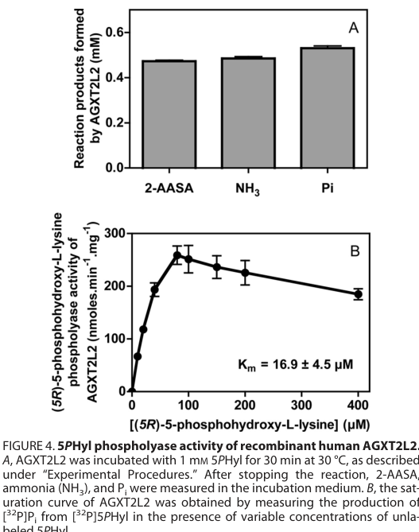

## Question

# Gene Research for Functional Annotation

## ⚠️ CRITICAL: Gene/Protein Identification Context

**BEFORE YOU BEGIN RESEARCH:** You MUST verify you are researching the CORRECT gene/protein. Gene symbols can be ambiguous, especially for less well-characterized genes from non-model organisms.

### Target Gene/Protein Identity (from UniProt):
- **UniProt Accession:** Q8IUZ5
- **Protein Description:** RecName: Full=5-phosphohydroxy-L-lysine phospho-lyase; EC=4.2.3.134 {ECO:0000269|PubMed:22241472}; AltName: Full=Alanine--glyoxylate aminotransferase 2-like 2;
- **Gene Information:** Name=PHYKPL; Synonyms=AGXT2L2 {ECO:0000303|PubMed:22241472}; ORFNames=PP9286;
- **Organism (full):** Homo sapiens (Human).
- **Protein Family:** Belongs to the class-III pyridoxal-phosphate-dependent
- **Key Domains:** Aminotrans_3. (IPR005814); Aminotrans_3_PPA_site. (IPR049704); PyrdxlP-dep_Trfase. (IPR015424); PyrdxlP-dep_Trfase_major. (IPR015421); PyrdxlP-dep_Trfase_small. (IPR015422)

### MANDATORY VERIFICATION STEPS:

1. **Check if the gene symbol "PHYKPL" matches the protein description above**
2. **Verify the organism is correct:** Homo sapiens (Human).
3. **Check if protein family/domains align with what you find in literature**
4. **If you find literature for a DIFFERENT gene with the same or similar symbol, STOP**

### If Gene Symbol is Ambiguous or You Cannot Find Relevant Literature:

**DO NOT PROCEED WITH RESEARCH ON A DIFFERENT GENE.** Instead:
- State clearly: "The gene symbol 'PHYKPL' is ambiguous or literature is limited for this specific protein"
- Explain what you found (e.g., "Found extensive literature on a different gene with the same symbol in a different organism")
- Describe the protein based ONLY on the UniProt information provided above
- Suggest that the protein function can be inferred from domain/family information

### Research Target:

Please provide a comprehensive research report on the gene **PHYKPL** (gene ID: PHYKPL, UniProt: Q8IUZ5) in human.

The research report should be a detailed narrative explaining the function, biological processes, and localization of the gene product. Citations should be given for all claims.

You should prioritize authoritative reviews and primary scientific literature when conducting research. You can supplement
this with annotations you find in gene/protein databases, but these can be outdated or inaccurate.

We are specifically interested in the primary function of the gene - for enzymes, what reaction is catalyzed, and what is the substrate specificity? For transporters, what is the substrate? For structural proteins or adapters, what is the broader structural role? For signaling molecules, what is the role in the pathway.

We are interested in where in or outside the cell the gene product carries out its function.

We are also interested in the signaling or biochemical pathways in which the gene functions. We are less interested in broad pleiotropic effects, except where these elucidate the precise role.

Include evidence where possible. We are interested in both experimental evidence as well as inference from structure, evolution, or bioinformatic analysis. Precise studies should be prioritized over high-throughput, where available.

## Output

Question: You are an expert researcher providing comprehensive, well-cited information.

Provide detailed information focusing on:
1. Key concepts and definitions with current understanding
2. Recent developments and latest research (prioritize 2023-2024 sources)
3. Current applications and real-world implementations
4. Expert opinions and analysis from authoritative sources
5. Relevant statistics and data from recent studies

Format as a comprehensive research report with proper citations. Include URLs and publication dates where available.
Always prioritize recent, authoritative sources and provide specific citations for all major claims.

# Gene Research for Functional Annotation

## ⚠️ CRITICAL: Gene/Protein Identification Context

**BEFORE YOU BEGIN RESEARCH:** You MUST verify you are researching the CORRECT gene/protein. Gene symbols can be ambiguous, especially for less well-characterized genes from non-model organisms.

### Target Gene/Protein Identity (from UniProt):
- **UniProt Accession:** Q8IUZ5
- **Protein Description:** RecName: Full=5-phosphohydroxy-L-lysine phospho-lyase; EC=4.2.3.134 {ECO:0000269|PubMed:22241472}; AltName: Full=Alanine--glyoxylate aminotransferase 2-like 2;
- **Gene Information:** Name=PHYKPL; Synonyms=AGXT2L2 {ECO:0000303|PubMed:22241472}; ORFNames=PP9286;
- **Organism (full):** Homo sapiens (Human).
- **Protein Family:** Belongs to the class-III pyridoxal-phosphate-dependent
- **Key Domains:** Aminotrans_3. (IPR005814); Aminotrans_3_PPA_site. (IPR049704); PyrdxlP-dep_Trfase. (IPR015424); PyrdxlP-dep_Trfase_major. (IPR015421); PyrdxlP-dep_Trfase_small. (IPR015422)

### MANDATORY VERIFICATION STEPS:

1. **Check if the gene symbol "PHYKPL" matches the protein description above**
2. **Verify the organism is correct:** Homo sapiens (Human).
3. **Check if protein family/domains align with what you find in literature**
4. **If you find literature for a DIFFERENT gene with the same or similar symbol, STOP**

### If Gene Symbol is Ambiguous or You Cannot Find Relevant Literature:

**DO NOT PROCEED WITH RESEARCH ON A DIFFERENT GENE.** Instead:
- State clearly: "The gene symbol 'PHYKPL' is ambiguous or literature is limited for this specific protein"
- Explain what you found (e.g., "Found extensive literature on a different gene with the same symbol in a different organism")
- Describe the protein based ONLY on the UniProt information provided above
- Suggest that the protein function can be inferred from domain/family information

### Research Target:

Please provide a comprehensive research report on the gene **PHYKPL** (gene ID: PHYKPL, UniProt: Q8IUZ5) in human.

The research report should be a detailed narrative explaining the function, biological processes, and localization of the gene product. Citations should be given for all claims.

You should prioritize authoritative reviews and primary scientific literature when conducting research. You can supplement
this with annotations you find in gene/protein databases, but these can be outdated or inaccurate.

We are specifically interested in the primary function of the gene - for enzymes, what reaction is catalyzed, and what is the substrate specificity? For transporters, what is the substrate? For structural proteins or adapters, what is the broader structural role? For signaling molecules, what is the role in the pathway.

We are interested in where in or outside the cell the gene product carries out its function.

We are also interested in the signaling or biochemical pathways in which the gene functions. We are less interested in broad pleiotropic effects, except where these elucidate the precise role.

Include evidence where possible. We are interested in both experimental evidence as well as inference from structure, evolution, or bioinformatic analysis. Precise studies should be prioritized over high-throughput, where available.

## Research report: Human **PHYKPL** (AGXT2L2; UniProt Q8IUZ5)

### Executive summary
PHYKPL (synonym **AGXT2L2**) encodes a **pyridoxal-5′-phosphate (PLP)-dependent ammoniophospholyase** whose primary, experimentally demonstrated function is to catalyze elimination of **5-phosphohydroxy-L-lysine (5PHyl)** to yield **2-aminoadipate semialdehyde (2-AASA)**, **inorganic phosphate (Pi)**, and **ammonia (NH3)**. This reaction places PHYKPL in a defined pathway for **hydroxylysine catabolism** downstream of a 5-hydroxylysine kinase (AGPHD1/HYKK). The best-supported Mendelian phenotype link is **phosphohydroxylysinuria**, consistent with expectation that loss of PHYKPL activity increases urinary 5PHyl. Recent (2023–2024) literature retrieved here contains only indirect mentions (e.g., homology-based discussion in PLP enzyme/heme metabolism contexts), while disease-association resources (Open Targets) continue to track a strong association to phosphohydroxylysinuria and weaker GWAS-derived associations to several complex diseases. (veigadacunha2012molecularidentificationof pages 6-7, veigadacunha2012molecularidentificationof pages 1-2, OpenTargets Search: -PHYKPL,AGXT2L2, key2024clppnulleukaryoteswitha pages 2-4)

### 1) Key concepts and definitions (current understanding)

#### 1.1 Gene/protein identity and nomenclature
The UniProt entry **Q8IUZ5** corresponds to human **PHYKPL**, also known as **AGXT2L2**, annotated as **5-phosphohydroxy-L-lysine phospho-lyase** (EC 4.2.3.134). Primary biochemistry establishing this identity comes from recombinant expression and activity assays showing specific cleavage of 5PHyl to Pi, NH3 and 2-AASA. (veigadacunha2012molecularidentificationof pages 1-2, veigadacunha2012molecularidentificationof pages 3-4)

#### 1.2 Enzyme class: PLP-dependent “ammoniophospholyase”
Although PHYKPL/AGXT2L2 is homologous to class-III PLP-dependent aminotransferases, the experimentally supported activity is a **PLP-dependent elimination** (phospho-lyase) rather than transamination. In the defining biochemical study, AGXT2L2 was purified as a **yellow PLP-binding protein**, consistent with PLP cofactor association, and aminotransferase activity was not detected in the authors’ assays for the AGXT2L1/2 paralogs. (veigadacunha2012molecularidentificationof pages 3-4, veigadacunha2012molecularidentificationof pages 7-8)

#### 1.3 Reaction and pathway placement: hydroxylysine catabolism
PHYKPL catalyzes:

**5-phosphohydroxy-L-lysine (5PHyl) → 2-aminoadipate semialdehyde (2-AASA) + Pi + NH3**

This reaction functions downstream of a kinase (AGPHD1) that phosphorylates 5-hydroxy-L-lysine to create the 5PHyl substrate, establishing a two-step metabolic route for hydroxylysine degradation. (veigadacunha2012molecularidentificationof pages 1-2, veigadacunha2012molecularidentificationof pages 5-6)

### 2) Functional biochemistry: substrate specificity and kinetics

#### 2.1 Experimental evidence for substrate specificity
The key functional assignment is supported by **direct in vitro assays using recombinant human AGXT2L2**, where production of Pi, NH3, and the aldehyde product 2-AASA (measured as a derivatized product by RP-HPLC) was observed after incubation with 5PHyl. (veigadacunha2012molecularidentificationof pages 3-4)

The defining study also reports that, under their conditions, the AGXT2L1/2 paralogs did not show detectable aminotransferase activity in the specific assays performed, reinforcing that the physiologically relevant activity for AGXT2L2 is the phospho-lyase reaction. (veigadacunha2012molecularidentificationof pages 7-8)

#### 2.2 Quantitative kinetics and inhibition
Kinetic parameters reported for recombinant human AGXT2L2 acting on 5PHyl include:
- **Km(5PHyl) = 16.9 ± 4.5 μM**
- **Vmax = 256 ± 15 nmol·min⁻¹·mg⁻¹ protein**

The saturation behavior shows **substrate inhibition** at higher 5PHyl concentrations (notably above ~100 μM in the saturation curve) and **inhibition by inorganic phosphate**, with the highest tested Pi reducing activity by ~50% in the reported ammonia-production readout. (veigadacunha2012molecularidentificationof pages 6-7, veigadacunha2012molecularidentificationof media 1ef79764)

### 3) Cellular/subcellular localization and expression

#### 3.1 Subcellular localization
AGXT2L2 (PHYKPL) is described as a **cytosolic enzyme**, consistent with **TargetP** and **Psort II** predictions cited in the biochemical characterization paper. (veigadacunha2012molecularidentificationof pages 6-7)

#### 3.2 Tissue expression and physiological context
Direct quantitative tissue expression profiling for PHYKPL/AGXT2L2 was not available in the retrieved full-text excerpts. However:
- The AGXT2L2 coding sequence was cloned from **human kidney cDNA**, consistent with kidney expression. (veigadacunha2012molecularidentificationof pages 2-3)
- The same study notes that 5PHyl is a **normal constituent of adult brain**, which motivates concern that loss of AGXT2L2 could cause brain accumulation of 5PHyl with neurological effects (see disease section). (veigadacunha2012molecularidentificationof pages 6-7)

### 4) Disease associations, applications, and real-world implementations

#### 4.1 Mendelian/metabolic disease: phosphohydroxylysinuria
The defining 2012 biochemical study predicts that **mutations in AGXT2L2** should result in **increased urinary 5PHyl excretion**, and notes that only **two unrelated patients** with phosphohydroxylysinuria and neurological abnormalities had been reported in earlier literature at that time. (veigadacunha2012molecularidentificationof pages 6-7)

From an implementation perspective, this implies a clinically actionable diagnostic logic: **urinary 5PHyl elevation** is a plausible biochemical marker indicating deficiency in the AGPHD1→AGXT2L2 hydroxylysine-catabolic pathway, and the molecular identification of AGXT2L2 enables confirmatory genetic diagnosis. (veigadacunha2012molecularidentificationof pages 6-7, veigadacunha2012molecularidentificationof pages 1-2)

#### 4.2 Complex disease genetics (database-level evidence)
Open Targets reports PHYKPL associations including:
- **Phosphohydroxylysinuria** (highest score among listed diseases; composite score ~0.569)
- GWAS-derived genetic associations to **ulcerative colitis**, **dental caries**, **glomerulonephritis**, and **primary thrombocytopenia** (scores roughly ~0.27–0.32 in the displayed output)

These complex-disease links are primarily **genetic association** signals rather than established mechanistic disease roles for the enzyme. (OpenTargets Search: -PHYKPL,AGXT2L2)

#### 4.3 Clinical trials and therapeutics
A clinical-trials search for “PHYKPL OR AGXT2L2” did not yield relevant interventional trials targeting this gene/protein in the retrieved results. (OpenTargets Search: -PHYKPL,AGXT2L2)

### 5) Recent developments and latest research (prioritizing 2023–2024)

#### 5.1 2024: broader PLP-enzyme/mitochondrial metabolism discussion
A 2024 study focused on CLPP/CLPX biology and metabolomics mentions PHYKPL as one of several **PLP-dependent proteins with sequence homology** to bacterial HemL (glutamate-1-semialdehyde aminomutase), in the context of hypothesized alternative δ-aminolevulinic acid (δALA) production routes. This is not new experimental evidence about PHYKPL’s physiological function, but illustrates how PHYKPL appears in comparative discussions of PLP-enzyme repertoires. (key2024clppnulleukaryoteswitha pages 2-4)

#### 5.2 2023–2024 gaps in the retrievable corpus
Within the documents retrievable here, there were no 2023–2024 primary studies that provided new direct biochemical characterization, localization by microscopy/proteomics, or targeted functional genetics for human PHYKPL beyond the established 2012 biochemistry and database association updates. Therefore, current best practice for functional annotation remains anchored in the 2012 enzymology while monitoring genetic databases and emerging omics studies for new physiology or disease insights. (key2024clppnulleukaryoteswitha pages 2-4, OpenTargets Search: -PHYKPL,AGXT2L2)

### 6) Expert interpretation and analysis (authoritative sources)

The most authoritative mechanistic evidence is the enzymology work establishing that vertebrate genomes encode AGXT2L1/AGXT2L2 as enzymes acting on **phosphorylated terminal amines**, and that **AGXT2L2 specifically is the 5PHyl phospho-lyase**. The authors explicitly connect this to explain rare neurometabolic phenotypes, and they propose AGPHD1 and AGXT2L2 as likely mutated enzymes in 5-hydroxylysinuria and phosphohydroxylysinuria. (veigadacunha2012molecularidentificationof pages 1-2)

A key interpretive nuance is that phylogenetic homology to aminotransferases led earlier studies to test AGXT2L2 as a transaminase; e.g., a 2009 recombinant expression study screened AGXT2L2 for glyoxylate transamination but did not find glycine production under their conditions, and noted that reaction preferences were still unclear at that time. The subsequent 2012 work resolved the principal activity as a phospho-lyase, illustrating how **enzyme superfamily membership can mislead functional inference without substrate-guided biochemistry**. (donini2009recombinantproductionof pages 10-12, veigadacunha2012molecularidentificationof pages 1-2)

### 7) Key statistics and data points from studies
- **Enzyme kinetics (recombinant human PHYKPL/AGXT2L2):** Km(5PHyl) 16.9 ± 4.5 μM; Vmax 256 ± 15 nmol·min⁻¹·mg⁻¹; substrate inhibition above ~100 μM 5PHyl. (veigadacunha2012molecularidentificationof media 1ef79764, veigadacunha2012molecularidentificationof pages 6-7)
- **Disease case count noted in foundational report:** phosphohydroxylysinuria had been reported in **two unrelated patients** with neurological abnormalities (as summarized in the 2012 study). (veigadacunha2012molecularidentificationof pages 6-7)
- **Database-level disease association scores (Open Targets):** phosphohydroxylysinuria score ~0.569; ulcerative colitis ~0.319; dental caries ~0.310; glomerulonephritis ~0.296; primary thrombocytopenia ~0.269 (as displayed). (OpenTargets Search: -PHYKPL,AGXT2L2)

### Evidence map (summary table)
| Aspect | Finding | Key evidence/source (paper and year) | Notes/limitations |
|---|---|---|---|
| Gene/protein identity | Human **PHYKPL / AGXT2L2** encodes **5-phosphohydroxy-L-lysine phospho-lyase**; a PLP-dependent enzyme matching UniProt Q8IUZ5 | Veiga-da-Cunha et al., *J Biol Chem* (2012) (veigadacunha2012molecularidentificationof pages 1-2, veigadacunha2012molecularidentificationof pages 3-4) | Identity is well matched to the UniProt entry; older literature often used the synonym **AGXT2L2** rather than **PHYKPL** |
| Enzymatic reaction | Catalyzes breakdown of **5-phosphohydroxy-L-lysine (5PHyl)** to **2-aminoadipate semialdehyde (2-AASA) + NH3 + Pi** | Veiga-da-Cunha et al. (2012) (veigadacunha2012molecularidentificationof pages 6-7, veigadacunha2012molecularidentificationof pages 1-2, veigadacunha2012molecularidentificationof pages 3-4) | Experimentally demonstrated with recombinant human enzyme; this is the primary functional annotation |
| Cofactor / enzyme class | **Pyridoxal phosphate (PLP)-dependent** ammoniophospholyase within the class-III aminotransferase-fold family | Veiga-da-Cunha et al. (2012) (veigadacunha2012molecularidentificationof pages 1-2, veigadacunha2012molecularidentificationof pages 3-4) | Despite homology to aminotransferases, no aminotransferase activity was detected in the reported assays |
| Key kinetics | **Km = 16.9 ± 4.5 µM** for 5PHyl; **Vmax = 256 ± 15 nmol·min⁻¹·mg⁻¹** protein | Veiga-da-Cunha et al. (2012), Figure 4/text (veigadacunha2012molecularidentificationof pages 6-7, veigadacunha2012molecularidentificationof media 1ef79764) | Saturation curve showed **substrate inhibition** above ~100 µM 5PHyl |
| Product / inhibitor behavior | Reaction yields stoichiometric **phosphate, ammonia, and 2-AASA**; **inorganic phosphate** inhibits activity, with ~50% reduction at the highest tested Pi (2–10 mM range tested) | Veiga-da-Cunha et al. (2012) (veigadacunha2012molecularidentificationof pages 6-7) | Supports assignment as a phospho-lyase; inhibition data are biochemical, not in vivo physiology |
| Evidence type | Function established by **recombinant human protein expression, purification, and in vitro enzyme assays** measuring Pi, NH3, and 2-AASA formation | Veiga-da-Cunha et al. (2012) (veigadacunha2012molecularidentificationof pages 3-4) | Strong primary-biochemistry evidence; human cellular knockout/knockdown studies remain limited in retrieved sources |
| Pathway context | Functions in **hydroxylysine catabolism** downstream of **AGPHD1/HYKK (5-hydroxy-L-lysine kinase)**, converting phosphorylated hydroxylysine to 2-AASA | Veiga-da-Cunha et al. (2012); Van Schaftingen et al. (2015) (veigadacunha2012molecularidentificationof pages 5-6, veigadacunha2012molecularidentificationof pages 1-2) | Pathway placement is well supported biochemically, but broader physiological flux regulation in humans is still sparsely characterized |
| Localization | Reported/predicted as **cytosolic** based on bioinformatic localization analyses | Veiga-da-Cunha et al. (2012) (veigadacunha2012molecularidentificationof pages 6-7, veigadacunha2012molecularidentificationof pages 5-6) | Retrieved evidence indicates prediction rather than extensive direct microscopy/proteomics confirmation |
| Disease / Mendelian link | Proposed disease gene for **phosphohydroxylysinuria**; authors expected AGXT2L2 defects to elevate urinary 5PHyl | Veiga-da-Cunha et al. (2012); Open Targets summary (veigadacunha2012molecularidentificationof pages 6-7, OpenTargets Search: -PHYKPL,AGXT2L2) | A 2013 JIMD mutation paper was identified in search results but not retrievable here; therefore this row relies on the 2012 primary paper plus database-level association evidence |
| Other disease associations | Open Targets lists additional associations with **ulcerative colitis, dental caries, glomerulonephritis,** and **primary thrombocytopenia** besides phosphohydroxylysinuria | Open Targets Platform query (accessed via tool context) (OpenTargets Search: -PHYKPL,AGXT2L2) | These are mostly genetic-association/database links, not direct mechanistic validation specific to PHYKPL biology |
| Recent 2023–2024 mentions | 2024 literature mentions PHYKPL mainly as a **PLP-enzyme homolog** in comparative/heme-metabolism discussion rather than providing new direct functional data | Key et al., *Biomolecules* (2024) (key2024clppnulleukaryoteswitha pages 2-4) | No major 2023–2024 primary studies with new biochemical or localization data for human PHYKPL were retrieved |
| Current annotation confidence | **High confidence** for core enzymatic function; **moderate-to-low confidence** for localization detail, tissue physiology, and broader disease relevance | Synthesis of primary biochemistry and database evidence (veigadacunha2012molecularidentificationof pages 6-7, veigadacunha2012molecularidentificationof pages 1-2, OpenTargets Search: -PHYKPL,AGXT2L2, veigadacunha2012molecularidentificationof media 1ef79764) | Literature on this specific human protein remains limited compared with better-studied metabolic enzymes |

*Table: This table summarizes the core functional annotation of human PHYKPL/AGXT2L2, including its experimentally demonstrated phospho-lyase reaction, kinetic parameters, pathway placement, localization, and disease links. It is useful as a compact evidence map separating strong biochemical findings from more tentative disease-association data.*

### URLs and publication dates (key sources)
- Veiga-da-Cunha M. et al. **“Molecular Identification of Hydroxylysine Kinase and of Ammoniophospholyases Acting on 5-Phosphohydroxy-L-lysine and Phosphoethanolamine.”** *Journal of Biological Chemistry* (Mar **2012**). https://doi.org/10.1074/jbc.M111.323485 (veigadacunha2012molecularidentificationof pages 1-2, veigadacunha2012molecularidentificationof media 1ef79764)
- Key J. et al. **“CLPP-Null Eukaryotes with Excess Heme Biosynthesis Show Reduced L-arginine Levels, Probably via CLPX-Mediated OAT Activation.”** *Biomolecules* (Feb **2024**). https://doi.org/10.3390/biom14020241 (key2024clppnulleukaryoteswitha pages 2-4)
- Open Targets Platform disease-target associations for **PHYKPL** (queried via tool; platform described in *Nucleic Acids Research*, **2025**). https://platform.opentargets.org/ (OpenTargets Search: -PHYKPL,AGXT2L2)

### Limitations of this review
A key limitation is that an apparently central Mendelian genetics paper (“Mutations in the AGXT2L2 gene cause phosphohydroxylysinuria,” J Inherit Metab Dis, 2013) was identified by the search system but could not be retrieved in full text in this run, limiting direct quotation of variant types, patient counts, and clinical phenotypes beyond what is summarized in the 2012 biochemical report and Open Targets. (veigadacunha2012molecularidentificationof pages 6-7, OpenTargets Search: -PHYKPL,AGXT2L2)

References

1. (veigadacunha2012molecularidentificationof pages 6-7): Maria Veiga-da-Cunha, Farah Hadi, Thomas Balligand, Vincent Stroobant, and Emile Van Schaftingen. Molecular identification of hydroxylysine kinase and of ammoniophospholyases acting on 5-phosphohydroxy-l-lysine and phosphoethanolamine. Journal of Biological Chemistry, 287:7246-7255, Mar 2012. URL: https://doi.org/10.1074/jbc.m111.323485, doi:10.1074/jbc.m111.323485. This article has 71 citations and is from a domain leading peer-reviewed journal.

2. (veigadacunha2012molecularidentificationof pages 1-2): Maria Veiga-da-Cunha, Farah Hadi, Thomas Balligand, Vincent Stroobant, and Emile Van Schaftingen. Molecular identification of hydroxylysine kinase and of ammoniophospholyases acting on 5-phosphohydroxy-l-lysine and phosphoethanolamine. Journal of Biological Chemistry, 287:7246-7255, Mar 2012. URL: https://doi.org/10.1074/jbc.m111.323485, doi:10.1074/jbc.m111.323485. This article has 71 citations and is from a domain leading peer-reviewed journal.

3. (OpenTargets Search: -PHYKPL,AGXT2L2): Open Targets Query (-PHYKPL,AGXT2L2, 5 results). Buniello, A. et al. (2025). Open Targets Platform: facilitating therapeutic hypotheses building in drug discovery. Nucleic Acids Research.

4. (key2024clppnulleukaryoteswitha pages 2-4): Jana Key, Suzana Gispert, Arvind Reddy Kandi, Daniela Heinz, Andrea Hamann, Heinz D. Osiewacz, David Meierhofer, and Georg Auburger. Clpp-null eukaryotes with excess heme biosynthesis show reduced l-arginine levels, probably via clpx-mediated oat activation. Biomolecules, 14:241, Feb 2024. URL: https://doi.org/10.3390/biom14020241, doi:10.3390/biom14020241. This article has 2 citations.

5. (veigadacunha2012molecularidentificationof pages 3-4): Maria Veiga-da-Cunha, Farah Hadi, Thomas Balligand, Vincent Stroobant, and Emile Van Schaftingen. Molecular identification of hydroxylysine kinase and of ammoniophospholyases acting on 5-phosphohydroxy-l-lysine and phosphoethanolamine. Journal of Biological Chemistry, 287:7246-7255, Mar 2012. URL: https://doi.org/10.1074/jbc.m111.323485, doi:10.1074/jbc.m111.323485. This article has 71 citations and is from a domain leading peer-reviewed journal.

6. (veigadacunha2012molecularidentificationof pages 7-8): Maria Veiga-da-Cunha, Farah Hadi, Thomas Balligand, Vincent Stroobant, and Emile Van Schaftingen. Molecular identification of hydroxylysine kinase and of ammoniophospholyases acting on 5-phosphohydroxy-l-lysine and phosphoethanolamine. Journal of Biological Chemistry, 287:7246-7255, Mar 2012. URL: https://doi.org/10.1074/jbc.m111.323485, doi:10.1074/jbc.m111.323485. This article has 71 citations and is from a domain leading peer-reviewed journal.

7. (veigadacunha2012molecularidentificationof pages 5-6): Maria Veiga-da-Cunha, Farah Hadi, Thomas Balligand, Vincent Stroobant, and Emile Van Schaftingen. Molecular identification of hydroxylysine kinase and of ammoniophospholyases acting on 5-phosphohydroxy-l-lysine and phosphoethanolamine. Journal of Biological Chemistry, 287:7246-7255, Mar 2012. URL: https://doi.org/10.1074/jbc.m111.323485, doi:10.1074/jbc.m111.323485. This article has 71 citations and is from a domain leading peer-reviewed journal.

8. (veigadacunha2012molecularidentificationof media 1ef79764): Maria Veiga-da-Cunha, Farah Hadi, Thomas Balligand, Vincent Stroobant, and Emile Van Schaftingen. Molecular identification of hydroxylysine kinase and of ammoniophospholyases acting on 5-phosphohydroxy-l-lysine and phosphoethanolamine. Journal of Biological Chemistry, 287:7246-7255, Mar 2012. URL: https://doi.org/10.1074/jbc.m111.323485, doi:10.1074/jbc.m111.323485. This article has 71 citations and is from a domain leading peer-reviewed journal.

9. (veigadacunha2012molecularidentificationof pages 2-3): Maria Veiga-da-Cunha, Farah Hadi, Thomas Balligand, Vincent Stroobant, and Emile Van Schaftingen. Molecular identification of hydroxylysine kinase and of ammoniophospholyases acting on 5-phosphohydroxy-l-lysine and phosphoethanolamine. Journal of Biological Chemistry, 287:7246-7255, Mar 2012. URL: https://doi.org/10.1074/jbc.m111.323485, doi:10.1074/jbc.m111.323485. This article has 71 citations and is from a domain leading peer-reviewed journal.

10. (donini2009recombinantproductionof pages 10-12): Stefano Donini, Manuela Ferrari, Chiara Fedeli, Marco Faini, Ilaria Lamberto, Ada Serena Marletta, Lara Mellini, Michela Panini, Riccardo Percudani, Loredano Pollegioni, Laura Caldinelli, Stefania Petrucco, and Alessio Peracchi. Recombinant production of eight human cytosolic aminotransferases and assessment of their potential involvement in glyoxylate metabolism. The Biochemical journal, 422 2:265-72, Sep 2009. URL: https://doi.org/10.1042/bj20090748, doi:10.1042/bj20090748. This article has 38 citations.

## Artifacts

- [Edison artifact artifact-00](PHYKPL-deep-research-falcon_artifacts/artifact-00.md)

## Citations

1. veigadacunha2012molecularidentificationof pages 3-4
2. veigadacunha2012molecularidentificationof pages 7-8
3. veigadacunha2012molecularidentificationof pages 6-7
4. veigadacunha2012molecularidentificationof pages 2-3
5. key2024clppnulleukaryoteswitha pages 2-4
6. veigadacunha2012molecularidentificationof pages 1-2
7. veigadacunha2012molecularidentificationof pages 5-6
8. donini2009recombinantproductionof pages 10-12
9. https://doi.org/10.1074/jbc.M111.323485
10. https://doi.org/10.3390/biom14020241
11. https://platform.opentargets.org/
12. https://doi.org/10.1074/jbc.m111.323485,
13. https://doi.org/10.3390/biom14020241,
14. https://doi.org/10.1042/bj20090748,