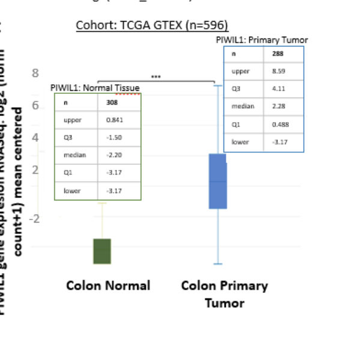

## Question

# Gene Research for Functional Annotation

## ⚠️ CRITICAL: Gene/Protein Identification Context

**BEFORE YOU BEGIN RESEARCH:** You MUST verify you are researching the CORRECT gene/protein. Gene symbols can be ambiguous, especially for less well-characterized genes from non-model organisms.

### Target Gene/Protein Identity (from UniProt):
- **UniProt Accession:** Q96J94
- **Protein Description:** RecName: Full=Piwi-like protein 1; EC=3.1.26.- {ECO:0000250|UniProtKB:Q9JMB7};
- **Gene Information:** Name=PIWIL1; Synonyms=HIWI {ECO:0000303|PubMed:11154219, ECO:0000303|PubMed:28552346};
- **Organism (full):** Homo sapiens (Human).
- **Protein Family:** Belongs to the argonaute family. Piwi subfamily.
- **Key Domains:** ArgoL1. (IPR014811); GAGE. (IPR031320); PAZ_dom. (IPR003100); PAZ_dom_sf. (IPR036085); Piwi. (IPR003165)

### MANDATORY VERIFICATION STEPS:

1. **Check if the gene symbol "PIWIL1" matches the protein description above**
2. **Verify the organism is correct:** Homo sapiens (Human).
3. **Check if protein family/domains align with what you find in literature**
4. **If you find literature for a DIFFERENT gene with the same or similar symbol, STOP**

### If Gene Symbol is Ambiguous or You Cannot Find Relevant Literature:

**DO NOT PROCEED WITH RESEARCH ON A DIFFERENT GENE.** Instead:
- State clearly: "The gene symbol 'PIWIL1' is ambiguous or literature is limited for this specific protein"
- Explain what you found (e.g., "Found extensive literature on a different gene with the same symbol in a different organism")
- Describe the protein based ONLY on the UniProt information provided above
- Suggest that the protein function can be inferred from domain/family information

### Research Target:

Please provide a comprehensive research report on the gene **PIWIL1** (gene ID: PIWIL1, UniProt: Q96J94) in human.

The research report should be a detailed narrative explaining the function, biological processes, and localization of the gene product. Citations should be given for all claims.

You should prioritize authoritative reviews and primary scientific literature when conducting research. You can supplement
this with annotations you find in gene/protein databases, but these can be outdated or inaccurate.

We are specifically interested in the primary function of the gene - for enzymes, what reaction is catalyzed, and what is the substrate specificity? For transporters, what is the substrate? For structural proteins or adapters, what is the broader structural role? For signaling molecules, what is the role in the pathway.

We are interested in where in or outside the cell the gene product carries out its function.

We are also interested in the signaling or biochemical pathways in which the gene functions. We are less interested in broad pleiotropic effects, except where these elucidate the precise role.

Include evidence where possible. We are interested in both experimental evidence as well as inference from structure, evolution, or bioinformatic analysis. Precise studies should be prioritized over high-throughput, where available.

## Output

Question: You are an expert researcher providing comprehensive, well-cited information.

Provide detailed information focusing on:
1. Key concepts and definitions with current understanding
2. Recent developments and latest research (prioritize 2023-2024 sources)
3. Current applications and real-world implementations
4. Expert opinions and analysis from authoritative sources
5. Relevant statistics and data from recent studies

Format as a comprehensive research report with proper citations. Include URLs and publication dates where available.
Always prioritize recent, authoritative sources and provide specific citations for all major claims.

# Gene Research for Functional Annotation

## ⚠️ CRITICAL: Gene/Protein Identification Context

**BEFORE YOU BEGIN RESEARCH:** You MUST verify you are researching the CORRECT gene/protein. Gene symbols can be ambiguous, especially for less well-characterized genes from non-model organisms.

### Target Gene/Protein Identity (from UniProt):
- **UniProt Accession:** Q96J94
- **Protein Description:** RecName: Full=Piwi-like protein 1; EC=3.1.26.- {ECO:0000250|UniProtKB:Q9JMB7};
- **Gene Information:** Name=PIWIL1; Synonyms=HIWI {ECO:0000303|PubMed:11154219, ECO:0000303|PubMed:28552346};
- **Organism (full):** Homo sapiens (Human).
- **Protein Family:** Belongs to the argonaute family. Piwi subfamily.
- **Key Domains:** ArgoL1. (IPR014811); GAGE. (IPR031320); PAZ_dom. (IPR003100); PAZ_dom_sf. (IPR036085); Piwi. (IPR003165)

### MANDATORY VERIFICATION STEPS:

1. **Check if the gene symbol "PIWIL1" matches the protein description above**
2. **Verify the organism is correct:** Homo sapiens (Human).
3. **Check if protein family/domains align with what you find in literature**
4. **If you find literature for a DIFFERENT gene with the same or similar symbol, STOP**

### If Gene Symbol is Ambiguous or You Cannot Find Relevant Literature:

**DO NOT PROCEED WITH RESEARCH ON A DIFFERENT GENE.** Instead:
- State clearly: "The gene symbol 'PIWIL1' is ambiguous or literature is limited for this specific protein"
- Explain what you found (e.g., "Found extensive literature on a different gene with the same symbol in a different organism")
- Describe the protein based ONLY on the UniProt information provided above
- Suggest that the protein function can be inferred from domain/family information

### Research Target:

Please provide a comprehensive research report on the gene **PIWIL1** (gene ID: PIWIL1, UniProt: Q96J94) in human.

The research report should be a detailed narrative explaining the function, biological processes, and localization of the gene product. Citations should be given for all claims.

You should prioritize authoritative reviews and primary scientific literature when conducting research. You can supplement
this with annotations you find in gene/protein databases, but these can be outdated or inaccurate.

We are specifically interested in the primary function of the gene - for enzymes, what reaction is catalyzed, and what is the substrate specificity? For transporters, what is the substrate? For structural proteins or adapters, what is the broader structural role? For signaling molecules, what is the role in the pathway.

We are interested in where in or outside the cell the gene product carries out its function.

We are also interested in the signaling or biochemical pathways in which the gene functions. We are less interested in broad pleiotropic effects, except where these elucidate the precise role.

Include evidence where possible. We are interested in both experimental evidence as well as inference from structure, evolution, or bioinformatic analysis. Precise studies should be prioritized over high-throughput, where available.

## Research Report: Human PIWIL1 (HIWI) Functional Annotation (UniProt Q96J94)

### 1) Target verification (gene/protein identity)
The target described by UniProt accession **Q96J94** corresponds to **human PIWIL1** (gene symbol **PIWIL1**, synonym **HIWI**), a **PIWI-subfamily Argonaute** protein that binds PIWI-interacting RNAs (piRNAs) and functions in small-RNA-guided gene silencing pathways. Recent authoritative reviews consistently describe PIWIL1 as a PAZ–MID–PIWI domain protein with **RNase H-like “slicer” endonuclease** activity in the PIWI domain, indicating that PIWIL1’s primary biochemical activity is **piRNA-guided cleavage of RNA targets**, not classical metabolism. (Zhang et al., 2023-03, *Molecular Cancer*, https://doi.org/10.1186/s12943-023-01749-3) (zhang2023theepigeneticregulatory pages 1-2)

### 2) Key concepts and current understanding

#### 2.1 Definitions: PIWI proteins and piRNAs
piRNAs are a class of small noncoding RNAs (commonly ~24–32 nt) that bind PIWI proteins to form effector ribonucleoprotein complexes (often termed **piRISC**) that suppress transposable elements and regulate gene expression, particularly in the germline. The **PAZ and MID domains** anchor the piRNA 3′ and 5′ ends, while the **PIWI domain** is responsible for endonucleolytic cleavage of complementary RNA targets. (Patel et al., 2024-12, *Frontiers in Cell and Developmental Biology*, https://doi.org/10.3389/fcell.2024.1495035) (patel2024somaticpirnaand pages 1-2)

#### 2.2 Modular view of piRNA-guided silencing (how PIWIL1 fits)
A 2023 synthesis proposes a **modular architecture** for piRNA systems: (i) **primary piRNA biogenesis/loading** (mitochondria-associated cleavage of long precursors to generate 5′-monophosphorylated fragments that load into PIWI proteins), (ii) **slicer-mediated post-transcriptional silencing** (cytoplasmic cleavage and decay of target RNAs), (iii) **secondary amplification (“ping–pong”)** in some systems, and (iv) **nuclear transcriptional silencing** via recruitment of chromatin/DNA modifiers. (Loubalova et al., 2023-09, *Mobile DNA*, https://doi.org/10.1186/s13100-023-00298-2) (loubalova2023themesandvariations pages 9-10, loubalova2023themesandvariations pages 2-4)

Within this framework, PIWIL1 (mouse ortholog MIWI) is described as being **primarily loaded with primary piRNAs** and acting mainly in the **cytoplasm** to degrade target transcripts, with relatively limited evidence for robust participation in ping–pong amplification compared with other PIWI paralogs (e.g., PIWIL2/MILI). (Loubalova et al., 2023-09, *Mobile DNA*, https://doi.org/10.1186/s13100-023-00298-2) (loubalova2023themesandvariations pages 4-6, loubalova2023themesandvariations pages 6-7)

#### 2.3 Catalytic activity and substrate specificity (functional reaction)
PIWIL1’s catalytic mechanism is **small-RNA-guided endonucleolytic cleavage of RNA** (a “slicer” reaction), where the **substrate is RNA** that base-pairs with the bound piRNA guide. Reviews emphasize the PIWI domain’s **RNase H-like** cleavage function, enabling PIWIL1–piRNA complexes to cut target RNAs (including transposon-derived transcripts and potentially other RNAs depending on context). (Zhang et al., 2023-03, *Molecular Cancer*, https://doi.org/10.1186/s12943-023-01749-3) (zhang2023theepigeneticregulatory pages 1-2)

### 3) Pathways, processes, and subcellular localization

#### 3.1 Germline: spermatogenesis and transposon control
A large human testis biopsy study (222 biopsies) directly supports PIWIL1 as a **germ-cell-enriched** factor and places it in the context of LINE-1 (L1) transposon regulation. The authors observed **coexpression and co-localization** of PIWIL1 with the piRNA 3′-end methyltransferase **HENMT1** in **pachytene spermatocytes and spermatids**, consistent with PIWIL1 acting during the pachytene/spermatid stages of spermatogenesis. (Hempfling et al., 2017-10, *Reproduction*, https://doi.org/10.1530/rep-16-0586) (hempfling2017expressionpatternsof pages 1-2, hempfling2017expressionpatternsof pages 3-4)

Subcellularly in human germ cells, PIWIL1 protein first appears in the **cytoplasm of late pachytene spermatocytes**, persists into spermatids, and is reported to concentrate in structures consistent with **mitochondrial cement/nuage** in pachytene cells and the **chromatoid body** in spermatids—compartments long associated with small-RNA processing and post-transcriptional regulation. (Hempfling et al., 2017-10, *Reproduction*, https://doi.org/10.1530/rep-16-0586) (hempfling2017expressionpatternsof pages 3-4)

#### 3.2 Human evidence linking PIWIL1/piRNA pathway disruption to infertility
Recent human-genetics work establishes that inherited disruption of piRNA biogenesis is a clinically relevant cause of spermatogenic failure: **39 infertile men** were reported to carry biallelic variants across **14 piRNA pathway genes including PIWIL1**, and affected tissue showed **reduced pachytene piRNAs** and **LINE1 expression in spermatogonia** consistent with transposon de-repression, supporting the piRNA pathway (including PIWIL1) as a major axis of human male infertility biology. (Stallmeyer et al., 2024-08, *Nature Communications*, https://doi.org/10.1038/s41467-024-50930-9) (hempfling2017expressionpatternsof pages 1-2)

#### 3.3 Key pathway components and interaction landscape (inferred/assembled from reviews + human data)
PIWIL1 function depends on piRNAs and the broader piRNA-processing machinery. Mechanistic reviews emphasize mitochondrial primary processing by **PLD6/ZUC/MitoPLD**, 3′ end maturation (including trimming by factors such as **PNLDC1/Trimmer**) and stabilization by **HENMT1/Hen1**-mediated methylation; helicases such as **DDX4/Vasa** and **Tudor-domain proteins** are described as assembly/transfer factors in piRNA pathways. (Loubalova et al., 2023-09, *Mobile DNA*, https://doi.org/10.1186/s13100-023-00298-2) (loubalova2023themesandvariations pages 2-4, loubalova2023themesandvariations pages 1-2) (Patel et al., 2024-12, *Frontiers in Cell and Developmental Biology*, https://doi.org/10.3389/fcell.2024.1495035) (patel2024somaticpirnaand pages 2-4)

### 4) Recent developments (2023–2024 emphasis)

#### 4.1 Cancer epigenetics and PIWI/piRNA reactivation
A high-impact 2023 review synthesizes evidence that PIWI/piRNA components, typically germline-restricted, are aberrantly expressed in cancers and can influence gene regulation through RNA cleavage and epigenetic mechanisms (e.g., recruitment of DNA/RNA methylation and other chromatin-associated regulators). This work frames PIWIL1 and related PIWI proteins as potential targets for cancer biomarkers and therapeutic exploration, while also emphasizing that cancer contexts may exploit PIWI biology differently from germline contexts. (Zhang et al., 2023-03, *Molecular Cancer*, https://doi.org/10.1186/s12943-023-01749-3) (zhang2023theepigeneticregulatory pages 1-2)

A 2024 “critical appraisal” review further highlights methodological and interpretive caveats (e.g., distinguishing bona fide piRNAs from other small-RNA fragments and the need for rigorous antibody validation) when assessing somatic PIWI/piRNA claims, while still recognizing recurring associations of PIWI pathway components with tumor biology and cancer stemness. (Garcia-Borja et al., 2024-02, *Biomarker Research*, https://doi.org/10.1186/s40364-024-00563-3) (garciaborja2024criticalappraisalof pages 24-24)

#### 4.2 Somatic and stem-cell contexts: post-transcriptional gene regulation
A 2024 review focusing on **somatic** piRNA/PIWI activity summarizes evidence for PIWI-mediated regulation of mRNA stability/translation and transposon silencing in non-germline settings (e.g., stem cells and disease). While not all somatic contexts show canonical germline-like piRNA signatures, the review consolidates emerging models where PIWI proteins can participate in post-transcriptional regulation outside the germline. (Patel et al., 2024-12, *Frontiers in Cell and Developmental Biology*, https://doi.org/10.3389/fcell.2024.1495035) (patel2024somaticpirnaand pages 1-2)

#### 4.3 A notable 2024 mechanistic proposal: PIWIL1 in mitosis/centrosomes (colorectal cancer)
A 2024 preprint reports a **cell-cycle-dependent relocalization** of PIWIL1 in colorectal cancer (CRC) models: PIWIL1 is **nuclear during interphase** and becomes **recruited to centrosomes/MTOC during mitosis**, co-localizing with **γ-tubulin**, and PIWIL1 knockdown induces **G2/M arrest** and mitotic abnormalities. (Garcia-Silva et al., 2024-07, preprint, https://doi.org/10.21203/rs.3.rs-4618560/v1) (garciasilva2024piwil1isrecruited pages 4-7, garciasilva2024piwil1isrecruited pages 1-4)

The preprint also reports PIWIL1 overexpression in CRC tissue datasets (TCGA vs GTEx) and links PIWIL1 expression to undifferentiated/stem-like states (present at crypt base, lost with differentiation). (Garcia-Silva et al., 2024-07, preprint, https://doi.org/10.21203/rs.3.rs-4618560/v1) (garciasilva2024piwil1isrecruited pages 12-18)

### 5) Quantitative evidence and recent statistics

#### 5.1 Human testis: expression patterns and association with LINE-1
In 222 human testis biopsies, PIWIL1 detection frequency depended strongly on germ-cell content: PIWIL1 was reported in **all** normal spermatogenesis and hypospermatogenesis samples, in **96%** of arrest samples, but only **5%** of Sertoli-cell-only samples; it was detected in approximately **70%** of tumor tissues in that cohort. (Hempfling et al., 2017-10, *Reproduction*, https://doi.org/10.1530/rep-16-0586) (hempfling2017expressionpatternsof pages 6-8)

The same study reported strong positive correlations between PIWI gene expression and LINE-1 (L1) expression in germ-cell-containing groups, including **Spearman r = 0.94** for **PIWIL1 vs L1** in normal spermatogenesis/hypospermatogenesis samples. (Hempfling et al., 2017-10, *Reproduction*, https://doi.org/10.1530/rep-16-0586) (hempfling2017expressionpatternsof pages 6-8)

#### 5.2 Hepatocellular carcinoma (HCC): PIWIL1 as a candidate circulating/tissue biomarker (2024)
A 2024 RT-qPCR biomarker study reported increased PIWIL1 transcript levels in HCC tissue and serum versus controls (study size **50 HCC patients** and **25 controls**). (Hammad et al., 2024-02, *Cancer Biomarkers*, https://doi.org/10.3233/cbm-230134) (hammad2024elevatedexpressionpatterns pages 4-6, hammad2024elevatedexpressionpatterns pages 10-11)

In the extracted quantitative reporting, serum PIWIL1 achieved an ROC **AUC = 1.0** (95% CI 1.0–1.0) with **100% sensitivity** and **100% specificity** at a stated cut-off (<1.6), with **p < 0.001**; tissue PIWIL1 achieved **AUC = 0.80** (95% CI 0.71–0.89), **80% sensitivity**, **72% specificity**, **p < 0.001**. The same excerpt reports an odds ratio for serum PIWIL1 of **3.87** (95% CI 1.23–8.36; **p < 0.001**). (Hammad et al., 2024-02, *Cancer Biomarkers*, https://doi.org/10.3233/cbm-230134) (hammad2024elevatedexpressionpatterns pages 8-10)

#### 5.3 Colorectal cancer (CRC): tumor-vs-normal expression and functional knockdown phenotype (2024 preprint)
In a TCGA/GTEx comparison reported in the 2024 CRC preprint, PIWIL1 was upregulated in CRC vs normal colon with **N = 650** and **p ≤ 0.0001**. (Garcia-Silva et al., 2024-07, preprint, https://doi.org/10.21203/rs.3.rs-4618560/v1) (garciasilva2024piwil1isrecruited pages 12-18)

Experimentally, PIWIL1 knockdown reduced PIWIL1 mRNA/protein by approximately **~70% at 72 h** and increased mitotic defects with an associated **G2/M arrest** phenotype (flow cytometry), supporting a proposed role in mitotic progression in these CRC models. (Garcia-Silva et al., 2024-07, preprint, https://doi.org/10.21203/rs.3.rs-4618560/v1) (garciasilva2024piwil1isrecruited pages 4-7, garciasilva2024piwil1isrecruited pages 12-18)

### 6) Current applications and real-world implementations

1. **Reproductive genetics / infertility diagnostics:** Human-genetics data showing biallelic pathogenic variants across piRNA pathway genes (including PIWIL1) associated with spermatogenic failure supports clinical use of piRNA-pathway genes in male-infertility genetic evaluations and variant interpretation frameworks (e.g., linking variants to pachytene-piRNA reduction and LINE1 de-repression). (Stallmeyer et al., 2024-08, *Nature Communications*, https://doi.org/10.1038/s41467-024-50930-9) (hempfling2017expressionpatternsof pages 1-2)

2. **Cancer biomarker development:** Studies propose PIWIL1 (and broader PIWI/piRNA signatures) as biomarkers in specific cancers. For example, the 2024 HCC study reports highly discriminatory performance for serum PIWIL1 in its cohort, supporting translational investigation of PIWIL1 mRNA as a candidate liquid-biopsy marker (while requiring external validation). (Hammad et al., 2024-02, *Cancer Biomarkers*, https://doi.org/10.3233/cbm-230134) (hammad2024elevatedexpressionpatterns pages 8-10)

3. **Therapeutic targeting hypotheses:** The 2024 CRC preprint proposes that inhibiting PIWIL1 could induce mitotic failure (“mitotic catastrophe”) in PIWIL1-positive CRC cells, suggesting a potential therapeutic angle; however, this is currently preclinical and preprint-stage. (Garcia-Silva et al., 2024-07, preprint, https://doi.org/10.21203/rs.3.rs-4618560/v1) (garciasilva2024piwil1isrecruited pages 9-12)

### 7) Expert opinion and analysis (consensus + caveats)

**Consensus:** Across authoritative 2023–2024 reviews, PIWIL1 is most confidently annotated as a **piRNA-binding, RNA-slicing Argonaute** whose best-established biological role is **germline genome integrity via transposon silencing**, with roles extending to broader gene regulation in germ cells. (Loubalova et al., 2023-09, https://doi.org/10.1186/s13100-023-00298-2) (loubalova2023themesandvariations pages 9-10) (Patel et al., 2024-12, https://doi.org/10.3389/fcell.2024.1495035) (patel2024somaticpirnaand pages 1-2)

**Caveats in somatic/cancer interpretation:** Reviews stress that somatic PIWI/piRNA studies can be confounded by (i) misannotation of small-RNA fragments as piRNAs and (ii) antibody specificity issues; thus, somatic PIWIL1 mechanisms may be heterogeneous and not always canonical piRNA biology. (Garcia-Borja et al., 2024-02, https://doi.org/10.1186/s40364-024-00563-3) (garciaborja2024criticalappraisalof pages 24-24)

### 8) Visual evidence from recent work (2024)
The CRC preprint provides figure-level evidence for (i) PIWIL1 upregulation in CRC vs normal colon (TCGA vs GTEx), (ii) PIWIL1 recruitment to centrosomes during mitosis with γ-tubulin co-localization, and (iii) increased G2/M arrest following PIWIL1 silencing in flow cytometry assays. (Garcia-Silva et al., 2024-07, preprint, https://doi.org/10.21203/rs.3.rs-4618560/v1) (garciasilva2024piwil1isrecruited media 49f520fd, garciasilva2024piwil1isrecruited media 9dd8f367)

### 9) Consolidated functional annotation summary
| Category | Summary |
|---|---|
| Identity/domains | • Verified target: human **PIWIL1/HIWI**, UniProt **Q96J94**, a **PIWI-subfamily Argonaute** protein, matching the user-supplied identifier and literature usage for HIWI/PIWIL1. • Domain architecture reported as **PAZ, MID, PIWI**; PIWIL1 is described as an ~**852 aa** protein with RNase H-like PIWI domain catalytic potential. • Core biochemical role is **small-RNA-guided endonuclease (“slicer”)** activity rather than classical metabolism; the PIWI domain cleaves complementary RNA targets guided by bound piRNAs. (zhang2023theepigeneticregulatory pages 1-2, patel2024somaticpirnaand pages 1-2, limanowka2024mechanismsbehindthe pages 1-2) |
| Molecular function | • Binds **piRNAs** (typically ~24–32/31 nt, 3′ 2′-O-methylated) to form PIWI–piRNA ribonucleoprotein complexes/piRISC. • Main established function is **germline genome defense**, especially **transposon silencing** and maintenance of spermatogenesis/fertility. • Can mediate **post-transcriptional silencing** by slicing target RNAs and, in broader PIWI/piRNA models, contribute to **epigenetic regulation** by recruiting chromatin/DNA methylation machinery. (zhang2023theepigeneticregulatory pages 1-2, hempfling2017expressionpatternsof pages 1-2, patel2024somaticpirnaand pages 1-2, loubalova2023themesandvariations pages 9-10) |
| Pathway modules | • **Primary biogenesis/loading:** long piRNA-cluster precursors are cleaved by **PLD6/ZUC/MitoPLD** on mitochondria, loaded into PIWI proteins, then trimmed (e.g., **PNLDC1/Trimmer**) and methylated by **HENMT1/Hen1**. • **Effector/slicer module:** mature PIWIL1–piRNA complexes cleave complementary RNAs in the cytoplasm. • **Secondary amplification/ping-pong:** mechanistically central to piRNA biology, but evidence indicates **PIWIL1/MIWI is mainly primary-piRNA-loaded** in mammalian pachytene cells, with ping-pong more strongly attributed to PIWIL2/MILI. • **Nuclear silencing module:** PIWI/piRNA complexes can also support transcriptional silencing via chromatin modifiers in general pathway models. (loubalova2023themesandvariations pages 4-6, loubalova2023themesandvariations pages 9-10, loubalova2023themesandvariations pages 2-4, loubalova2023themesandvariations pages 1-2, loubalova2023themesandvariations pages 6-7, patel2024somaticpirnaand pages 2-4, loubalova2023themesandvariations pages 10-11) |
| Localization | • In human testis, PIWIL1 protein is detected in the **cytoplasm of late pachytene spermatocytes and spermatids**, disappearing in elongated spermatids. • Signal concentrates in structures consistent with **mitochondrial cement/nuage** in pachytene cells and the **chromatoid body** in spermatids. • In CRC cell models, PIWIL1 is **nuclear during interphase** and relocalizes to **centrosomes/MTOC during mitosis**, co-localizing with **γ-tubulin**; tumor tissues show mainly **cytoplasmic** staining. (hempfling2017expressionpatternsof pages 3-4, hempfling2017expressionpatternsof pages 9-10, garciasilva2024piwil1isrecruited pages 4-7, garciasilva2024piwil1isrecruited pages 1-4, garciasilva2024piwil1isrecruited media 49f520fd) |
| Key interactors | • Direct molecular partner class: **piRNAs**. • Biogenesis/processing factors linked in pathway models include **PLD6/ZUC**, **MOV10L1**, **PNLDC1**, **HENMT1**, and the helicase **DDX4/Vasa**. • PIWI family proteins interact with **Tudor-domain proteins (TDRDs)** in arginine-methylation-dependent assemblies; human/oocyte literature also places PIWI proteins in complexes with mitochondrial/piRNA biogenesis machinery. • In CRC mitosis work, PIWIL1 associates spatially with **γ-tubulin/centrosomal machinery**. (limanowka2024mechanismsbehindthe pages 1-2, loubalova2023themesandvariations pages 9-10, loubalova2023themesandvariations pages 2-4, patel2024somaticpirnaand pages 2-4, garciasilva2024piwil1isrecruited pages 4-7) |
| Human germline evidence | • Human testis study of **222 biopsies** found PIWIL1 and HENMT1 coexpressed in pachytene spermatocytes/spermatids; PIWIL1 expression tracked germ-cell content and was nearly absent from Sertoli-cell-only tissue. • PIWIL1 was expressed in all normal spermatogenesis samples, all hypospermatogenesis samples, **96%** of arrest samples, but only **5%** of Sertoli-cell-only samples. • Low/absent piRNA-pathway components were associated with higher **LINE-1** expression, supporting a role in transposon repression in human testis. • A 2024 human genetics study identified **39 infertile men** carrying biallelic variants in **14 piRNA-pathway genes including PIWIL1**, with reduced pachytene piRNAs and LINE1 de-silencing, establishing piRNA-pathway disruption as a major cause of spermatogenic failure. (hempfling2017expressionpatternsof pages 1-2, hempfling2017expressionpatternsof pages 6-8, hempfling2017expressionpatternsof pages 8-9) |
| Somatic/cancer evidence | • Reviews from 2023–2024 consistently note that PIWIL1 is normally germline-restricted but is aberrantly expressed in multiple tumors, motivating biomarker interest. • In HCC, PIWIL1 mRNA was reported as elevated in tumor tissue and serum versus controls. • In CRC models, PIWIL1 is overexpressed and appears linked to a **piRNA-independent** role in mitotic fidelity/cell-cycle progression, especially centrosome-associated behavior during mitosis. • Somatic PIWI/piRNA literature remains mechanistically heterogeneous, with stronger evidence for association than for universal canonical piRNA function in all tumors. (zhang2023theepigeneticregulatory pages 1-2, limanowka2024mechanismsbehindthe pages 1-2, hammad2024elevatedexpressionpatterns pages 8-10, garciasilva2024piwil1isrecruited pages 7-9, garciasilva2024piwil1isrecruited pages 12-18) |
| Quantitative findings 2017-2024 | • Human testis cohort: **222 biopsies** analyzed; PIWIL1 detected in **all** normal spermatogenesis and hypospermatogenesis samples, **96%** of arrest samples, **~70%** of tumors, **5%** of Sertoli-cell-only samples. • Correlation with LINE-1 in germ-cell-containing samples was strong (**Spearman r = 0.94** for PIWIL1 vs L1 in Nsp/Hyp groups). • HCC study: **50 HCC patients** and **25 controls**; serum PIWIL1 ROC **AUC 1.0**, sensitivity **100%**, specificity **100%**, p<0.001; tissue PIWIL1 ROC **AUC 0.80**, sensitivity **80%**, specificity **72%**, p<0.001; serum PIWIL1 OR **3.87** (95% CI **1.23–8.36**), p<0.001. • CRC preprint: TCGA/GTEx comparison showed PIWIL1 upregulation in CRC with **N=650**, **p≤0.0001**; PIWIL1 knockdown reduced mRNA/protein by **~70%** at 72 h and increased G2/M arrest/mitotic defects. (hempfling2017expressionpatternsof pages 6-8, hammad2024elevatedexpressionpatterns pages 8-10, hammad2024elevatedexpressionpatterns pages 7-8, hammad2024elevatedexpressionpatterns pages 4-6, garciasilva2024piwil1isrecruited pages 12-18, garciasilva2024piwil1isrecruited pages 4-7, garciasilva2024piwil1isrecruited media 49f520fd) |
| Notes/caveats | • The **gene identity is not ambiguous here**: the literature aligns with human **PIWIL1/HIWI** and the supplied UniProt record. • However, much mechanistic detail comes from **cross-species PIWI/piRNA biology** and is often inferred to human PIWIL1. • Some cancer studies may detect **non-canonical piRNA-like fragments** rather than bona fide piRNAs; several reviews explicitly caution about annotation and antibody-validation issues. • The CRC centrosome study is a **2024 preprint**, so its mitotic localization/function findings should be treated as provisional until peer-reviewed. (garciaborja2024criticalappraisalof pages 24-24, zhang2023theepigeneticregulatory pages 1-2, loubalova2023themesandvariations pages 4-6, garciasilva2024piwil1isrecruited pages 7-9) |

*Table: This table summarizes the strongest evidence for human PIWIL1/HIWI identity, mechanism, localization, interacting pathway components, and quantitative findings from 2017–2024. It is designed as a compact functional-annotation reference with direct context-ID citations for each row.*

### References (URLs and publication dates)
Key recent sources emphasized in this report include:
- Zhang Q. et al. **(2023-03)**. *Molecular Cancer*. “The epigenetic regulatory mechanism of PIWI/piRNAs in human cancers.” https://doi.org/10.1186/s12943-023-01749-3 (zhang2023theepigeneticregulatory pages 1-2)
- Loubalova Z. et al. **(2023-09)**. *Mobile DNA*. “Themes and variations on piRNA-guided transposon control.” https://doi.org/10.1186/s13100-023-00298-2 (loubalova2023themesandvariations pages 9-10)
- Garcia-Borja E. et al. **(2024-02)**. *Biomarker Research*. “Critical appraisal of the piRNA-PIWI axis in cancer and cancer stem cells.” https://doi.org/10.1186/s40364-024-00563-3 (garciaborja2024criticalappraisalof pages 24-24)
- Patel M.Z. et al. **(2024-12)**. *Frontiers in Cell and Developmental Biology*. “Somatic piRNA and PIWI-mediated post-transcriptional gene regulation in stem cells and disease.” https://doi.org/10.3389/fcell.2024.1495035 (patel2024somaticpirnaand pages 1-2)
- Hammad G. et al. **(2024-02)**. *Cancer Biomarkers*. “Elevated expression patterns of PIWI transcripts are potential candidate markers for hepatocellular carcinoma.” https://doi.org/10.3233/cbm-230134 (hammad2024elevatedexpressionpatterns pages 8-10)
- Garcia-Silva M.R. et al. **(2024-07)**. Preprint. “PIWIL1 is recruited to Centrosomes during Mitosis in Colorectal Cancer Cells…” https://doi.org/10.21203/rs.3.rs-4618560/v1 (garciasilva2024piwil1isrecruited pages 12-18)
- Stallmeyer B. et al. **(2024-08)**. *Nature Communications*. “Inherited defects of piRNA biogenesis cause transposon de-repression, impaired spermatogenesis, and human male infertility.” https://doi.org/10.1038/s41467-024-50930-9 (hempfling2017expressionpatternsof pages 1-2)
- Hempfling A. et al. **(2017-10)**. *Reproduction*. “Expression patterns of HENMT1 and PIWIL1 in human testis: implications for transposon expression.” https://doi.org/10.1530/rep-16-0586 (hempfling2017expressionpatternsof pages 1-2)

References

1. (zhang2023theepigeneticregulatory pages 1-2): Qun Zhang, Yazhi Zhu, Xinyu Cao, Wenhui Tan, Jianglong Yu, Yaqiong Lu, Ran Kang, Xiaolan Wang, and Ermao Li. The epigenetic regulatory mechanism of piwi/pirnas in human cancers. Molecular Cancer, Mar 2023. URL: https://doi.org/10.1186/s12943-023-01749-3, doi:10.1186/s12943-023-01749-3. This article has 84 citations and is from a highest quality peer-reviewed journal.

2. (patel2024somaticpirnaand pages 1-2): Mahammed Zaid Patel, Yuguan Jiang, and Pavan Kumar Kakumani. Somatic pirna and piwi-mediated post-transcriptional gene regulation in stem cells and disease. Frontiers in Cell and Developmental Biology, Dec 2024. URL: https://doi.org/10.3389/fcell.2024.1495035, doi:10.3389/fcell.2024.1495035. This article has 11 citations.

3. (loubalova2023themesandvariations pages 9-10): Zuzana Loubalova, Parthena Konstantinidou, and Astrid D. Haase. Themes and variations on pirna-guided transposon control. Mobile DNA, Sep 2023. URL: https://doi.org/10.1186/s13100-023-00298-2, doi:10.1186/s13100-023-00298-2. This article has 38 citations and is from a peer-reviewed journal.

4. (loubalova2023themesandvariations pages 2-4): Zuzana Loubalova, Parthena Konstantinidou, and Astrid D. Haase. Themes and variations on pirna-guided transposon control. Mobile DNA, Sep 2023. URL: https://doi.org/10.1186/s13100-023-00298-2, doi:10.1186/s13100-023-00298-2. This article has 38 citations and is from a peer-reviewed journal.

5. (loubalova2023themesandvariations pages 4-6): Zuzana Loubalova, Parthena Konstantinidou, and Astrid D. Haase. Themes and variations on pirna-guided transposon control. Mobile DNA, Sep 2023. URL: https://doi.org/10.1186/s13100-023-00298-2, doi:10.1186/s13100-023-00298-2. This article has 38 citations and is from a peer-reviewed journal.

6. (loubalova2023themesandvariations pages 6-7): Zuzana Loubalova, Parthena Konstantinidou, and Astrid D. Haase. Themes and variations on pirna-guided transposon control. Mobile DNA, Sep 2023. URL: https://doi.org/10.1186/s13100-023-00298-2, doi:10.1186/s13100-023-00298-2. This article has 38 citations and is from a peer-reviewed journal.

7. (hempfling2017expressionpatternsof pages 1-2): A. Hempfling, A. Hempfling, S. Lim, D. Adelson, Jemma Evans, A. O’Connor, Z. Qu, S. Kliesch, W. Weidner, Moira K. O’Bryan, and M. Bergmann. Expression patterns of henmt1 and piwil1 in human testis: implications for transposon expression. Reproduction, 154 4:363-374, Oct 2017. URL: https://doi.org/10.1530/rep-16-0586, doi:10.1530/rep-16-0586. This article has 50 citations and is from a peer-reviewed journal.

8. (hempfling2017expressionpatternsof pages 3-4): A. Hempfling, A. Hempfling, S. Lim, D. Adelson, Jemma Evans, A. O’Connor, Z. Qu, S. Kliesch, W. Weidner, Moira K. O’Bryan, and M. Bergmann. Expression patterns of henmt1 and piwil1 in human testis: implications for transposon expression. Reproduction, 154 4:363-374, Oct 2017. URL: https://doi.org/10.1530/rep-16-0586, doi:10.1530/rep-16-0586. This article has 50 citations and is from a peer-reviewed journal.

9. (loubalova2023themesandvariations pages 1-2): Zuzana Loubalova, Parthena Konstantinidou, and Astrid D. Haase. Themes and variations on pirna-guided transposon control. Mobile DNA, Sep 2023. URL: https://doi.org/10.1186/s13100-023-00298-2, doi:10.1186/s13100-023-00298-2. This article has 38 citations and is from a peer-reviewed journal.

10. (patel2024somaticpirnaand pages 2-4): Mahammed Zaid Patel, Yuguan Jiang, and Pavan Kumar Kakumani. Somatic pirna and piwi-mediated post-transcriptional gene regulation in stem cells and disease. Frontiers in Cell and Developmental Biology, Dec 2024. URL: https://doi.org/10.3389/fcell.2024.1495035, doi:10.3389/fcell.2024.1495035. This article has 11 citations.

11. (garciaborja2024criticalappraisalof pages 24-24): Elena Garcia-Borja, Frantisek Siegl, Rosana Mateu, Ondrej Slaby, Aleksi Sedo, Petr Busek, and Jiri Sana. Critical appraisal of the pirna-piwi axis in cancer and cancer stem cells. Biomarker Research, Feb 2024. URL: https://doi.org/10.1186/s40364-024-00563-3, doi:10.1186/s40364-024-00563-3. This article has 36 citations and is from a peer-reviewed journal.

12. (garciasilva2024piwil1isrecruited pages 4-7): Maria Rosa Garcia-Silva, Sofía Montenegro, Sofía Dacosta, Juan Pablo Tosar, and Alfonso Cayota. Piwil1 is recruited to centrosomes during mitosis in colorectal cancer cells and is linked to cell cycle progression. ArXiv, Jul 2024. URL: https://doi.org/10.21203/rs.3.rs-4618560/v1, doi:10.21203/rs.3.rs-4618560/v1. This article has 1 citations.

13. (garciasilva2024piwil1isrecruited pages 1-4): Maria Rosa Garcia-Silva, Sofía Montenegro, Sofía Dacosta, Juan Pablo Tosar, and Alfonso Cayota. Piwil1 is recruited to centrosomes during mitosis in colorectal cancer cells and is linked to cell cycle progression. ArXiv, Jul 2024. URL: https://doi.org/10.21203/rs.3.rs-4618560/v1, doi:10.21203/rs.3.rs-4618560/v1. This article has 1 citations.

14. (garciasilva2024piwil1isrecruited pages 12-18): Maria Rosa Garcia-Silva, Sofía Montenegro, Sofía Dacosta, Juan Pablo Tosar, and Alfonso Cayota. Piwil1 is recruited to centrosomes during mitosis in colorectal cancer cells and is linked to cell cycle progression. ArXiv, Jul 2024. URL: https://doi.org/10.21203/rs.3.rs-4618560/v1, doi:10.21203/rs.3.rs-4618560/v1. This article has 1 citations.

15. (hempfling2017expressionpatternsof pages 6-8): A. Hempfling, A. Hempfling, S. Lim, D. Adelson, Jemma Evans, A. O’Connor, Z. Qu, S. Kliesch, W. Weidner, Moira K. O’Bryan, and M. Bergmann. Expression patterns of henmt1 and piwil1 in human testis: implications for transposon expression. Reproduction, 154 4:363-374, Oct 2017. URL: https://doi.org/10.1530/rep-16-0586, doi:10.1530/rep-16-0586. This article has 50 citations and is from a peer-reviewed journal.

16. (hammad2024elevatedexpressionpatterns pages 4-6): Gehan Hammad, Samah Mamdouh, Dina Mohamed Seoudi, Mohamed Ismail Seleem, Gehan Safwat, and Rania Hassan Mohamed. Elevated expression patterns of p-element induced wimpy testis (piwi) transcripts are potential candidate markers for hepatocellular carcinoma. Cancer Biomarkers, 39:95-111, Feb 2024. URL: https://doi.org/10.3233/cbm-230134, doi:10.3233/cbm-230134. This article has 10 citations and is from a peer-reviewed journal.

17. (hammad2024elevatedexpressionpatterns pages 10-11): Gehan Hammad, Samah Mamdouh, Dina Mohamed Seoudi, Mohamed Ismail Seleem, Gehan Safwat, and Rania Hassan Mohamed. Elevated expression patterns of p-element induced wimpy testis (piwi) transcripts are potential candidate markers for hepatocellular carcinoma. Cancer Biomarkers, 39:95-111, Feb 2024. URL: https://doi.org/10.3233/cbm-230134, doi:10.3233/cbm-230134. This article has 10 citations and is from a peer-reviewed journal.

18. (hammad2024elevatedexpressionpatterns pages 8-10): Gehan Hammad, Samah Mamdouh, Dina Mohamed Seoudi, Mohamed Ismail Seleem, Gehan Safwat, and Rania Hassan Mohamed. Elevated expression patterns of p-element induced wimpy testis (piwi) transcripts are potential candidate markers for hepatocellular carcinoma. Cancer Biomarkers, 39:95-111, Feb 2024. URL: https://doi.org/10.3233/cbm-230134, doi:10.3233/cbm-230134. This article has 10 citations and is from a peer-reviewed journal.

19. (garciasilva2024piwil1isrecruited pages 9-12): Maria Rosa Garcia-Silva, Sofía Montenegro, Sofía Dacosta, Juan Pablo Tosar, and Alfonso Cayota. Piwil1 is recruited to centrosomes during mitosis in colorectal cancer cells and is linked to cell cycle progression. ArXiv, Jul 2024. URL: https://doi.org/10.21203/rs.3.rs-4618560/v1, doi:10.21203/rs.3.rs-4618560/v1. This article has 1 citations.

20. (garciasilva2024piwil1isrecruited media 49f520fd): Maria Rosa Garcia-Silva, Sofía Montenegro, Sofía Dacosta, Juan Pablo Tosar, and Alfonso Cayota. Piwil1 is recruited to centrosomes during mitosis in colorectal cancer cells and is linked to cell cycle progression. ArXiv, Jul 2024. URL: https://doi.org/10.21203/rs.3.rs-4618560/v1, doi:10.21203/rs.3.rs-4618560/v1. This article has 1 citations.

21. (garciasilva2024piwil1isrecruited media 9dd8f367): Maria Rosa Garcia-Silva, Sofía Montenegro, Sofía Dacosta, Juan Pablo Tosar, and Alfonso Cayota. Piwil1 is recruited to centrosomes during mitosis in colorectal cancer cells and is linked to cell cycle progression. ArXiv, Jul 2024. URL: https://doi.org/10.21203/rs.3.rs-4618560/v1, doi:10.21203/rs.3.rs-4618560/v1. This article has 1 citations.

22. (limanowka2024mechanismsbehindthe pages 1-2): Piotr Limanówka, Błażej Ochman, and Elżbieta Świętochowska. Mechanisms behind the impact of piwi proteins on cancer cells: literature review. International Journal of Molecular Sciences, 25:12217, Nov 2024. URL: https://doi.org/10.3390/ijms252212217, doi:10.3390/ijms252212217. This article has 4 citations.

23. (loubalova2023themesandvariations pages 10-11): Zuzana Loubalova, Parthena Konstantinidou, and Astrid D. Haase. Themes and variations on pirna-guided transposon control. Mobile DNA, Sep 2023. URL: https://doi.org/10.1186/s13100-023-00298-2, doi:10.1186/s13100-023-00298-2. This article has 38 citations and is from a peer-reviewed journal.

24. (hempfling2017expressionpatternsof pages 9-10): A. Hempfling, A. Hempfling, S. Lim, D. Adelson, Jemma Evans, A. O’Connor, Z. Qu, S. Kliesch, W. Weidner, Moira K. O’Bryan, and M. Bergmann. Expression patterns of henmt1 and piwil1 in human testis: implications for transposon expression. Reproduction, 154 4:363-374, Oct 2017. URL: https://doi.org/10.1530/rep-16-0586, doi:10.1530/rep-16-0586. This article has 50 citations and is from a peer-reviewed journal.

25. (hempfling2017expressionpatternsof pages 8-9): A. Hempfling, A. Hempfling, S. Lim, D. Adelson, Jemma Evans, A. O’Connor, Z. Qu, S. Kliesch, W. Weidner, Moira K. O’Bryan, and M. Bergmann. Expression patterns of henmt1 and piwil1 in human testis: implications for transposon expression. Reproduction, 154 4:363-374, Oct 2017. URL: https://doi.org/10.1530/rep-16-0586, doi:10.1530/rep-16-0586. This article has 50 citations and is from a peer-reviewed journal.

26. (garciasilva2024piwil1isrecruited pages 7-9): Maria Rosa Garcia-Silva, Sofía Montenegro, Sofía Dacosta, Juan Pablo Tosar, and Alfonso Cayota. Piwil1 is recruited to centrosomes during mitosis in colorectal cancer cells and is linked to cell cycle progression. ArXiv, Jul 2024. URL: https://doi.org/10.21203/rs.3.rs-4618560/v1, doi:10.21203/rs.3.rs-4618560/v1. This article has 1 citations.

27. (hammad2024elevatedexpressionpatterns pages 7-8): Gehan Hammad, Samah Mamdouh, Dina Mohamed Seoudi, Mohamed Ismail Seleem, Gehan Safwat, and Rania Hassan Mohamed. Elevated expression patterns of p-element induced wimpy testis (piwi) transcripts are potential candidate markers for hepatocellular carcinoma. Cancer Biomarkers, 39:95-111, Feb 2024. URL: https://doi.org/10.3233/cbm-230134, doi:10.3233/cbm-230134. This article has 10 citations and is from a peer-reviewed journal.

## Artifacts

- [Edison artifact artifact-00](PIWIL1-deep-research-falcon_artifacts/artifact-00.md)

## Citations

1. zhang2023theepigeneticregulatory pages 1-2
2. patel2024somaticpirnaand pages 1-2
3. hempfling2017expressionpatternsof pages 3-4
4. hempfling2017expressionpatternsof pages 1-2
5. patel2024somaticpirnaand pages 2-4
6. garciaborja2024criticalappraisalof pages 24-24
7. hempfling2017expressionpatternsof pages 6-8
8. hammad2024elevatedexpressionpatterns pages 8-10
9. loubalova2023themesandvariations pages 9-10
10. loubalova2023themesandvariations pages 2-4
11. loubalova2023themesandvariations pages 4-6
12. loubalova2023themesandvariations pages 6-7
13. loubalova2023themesandvariations pages 1-2
14. hammad2024elevatedexpressionpatterns pages 4-6
15. hammad2024elevatedexpressionpatterns pages 10-11
16. limanowka2024mechanismsbehindthe pages 1-2
17. loubalova2023themesandvariations pages 10-11
18. hempfling2017expressionpatternsof pages 9-10
19. hempfling2017expressionpatternsof pages 8-9
20. hammad2024elevatedexpressionpatterns pages 7-8
21. https://doi.org/10.1186/s12943-023-01749-3
22. https://doi.org/10.3389/fcell.2024.1495035
23. https://doi.org/10.1186/s13100-023-00298-2
24. https://doi.org/10.1530/rep-16-0586
25. https://doi.org/10.1038/s41467-024-50930-9
26. https://doi.org/10.1186/s40364-024-00563-3
27. https://doi.org/10.21203/rs.3.rs-4618560/v1
28. https://doi.org/10.3233/cbm-230134
29. https://doi.org/10.1186/s12943-023-01749-3,
30. https://doi.org/10.3389/fcell.2024.1495035,
31. https://doi.org/10.1186/s13100-023-00298-2,
32. https://doi.org/10.1530/rep-16-0586,
33. https://doi.org/10.1186/s40364-024-00563-3,
34. https://doi.org/10.21203/rs.3.rs-4618560/v1,
35. https://doi.org/10.3233/cbm-230134,
36. https://doi.org/10.3390/ijms252212217,