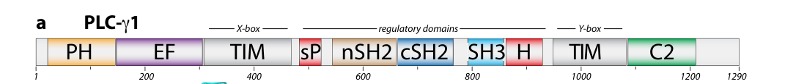

## Question

# Gene Research for Functional Annotation

## ⚠️ CRITICAL: Gene/Protein Identification Context

**BEFORE YOU BEGIN RESEARCH:** You MUST verify you are researching the CORRECT gene/protein. Gene symbols can be ambiguous, especially for less well-characterized genes from non-model organisms.

### Target Gene/Protein Identity (from UniProt):
- **UniProt Accession:** P19174
- **Protein Description:** RecName: Full=1-phosphatidylinositol 4,5-bisphosphate phosphodiesterase gamma-1 {ECO:0000305}; EC=3.1.4.11 {ECO:0000250|UniProtKB:P10686}; AltName: Full=PLC-148; AltName: Full=Phosphoinositide phospholipase C-gamma-1; AltName: Full=Phospholipase C-II; Short=PLC-II; AltName: Full=Phospholipase C-gamma-1; Short=PLC-gamma-1;
- **Gene Information:** Name=PLCG1 {ECO:0000312|HGNC:HGNC:9065}; Synonyms=PLC1;
- **Organism (full):** Homo sapiens (Human).
- **Protein Family:** Not specified in UniProt
- **Key Domains:** C2_dom. (IPR000008); C2_domain_sf. (IPR035892); EF-hand-dom_pair. (IPR011992); EF-hand_PLCG1. (IPR056586); EF_Hand_1_Ca_BS. (IPR018247)

### MANDATORY VERIFICATION STEPS:

1. **Check if the gene symbol "PLCG1" matches the protein description above**
2. **Verify the organism is correct:** Homo sapiens (Human).
3. **Check if protein family/domains align with what you find in literature**
4. **If you find literature for a DIFFERENT gene with the same or similar symbol, STOP**

### If Gene Symbol is Ambiguous or You Cannot Find Relevant Literature:

**DO NOT PROCEED WITH RESEARCH ON A DIFFERENT GENE.** Instead:
- State clearly: "The gene symbol 'PLCG1' is ambiguous or literature is limited for this specific protein"
- Explain what you found (e.g., "Found extensive literature on a different gene with the same symbol in a different organism")
- Describe the protein based ONLY on the UniProt information provided above
- Suggest that the protein function can be inferred from domain/family information

### Research Target:

Please provide a comprehensive research report on the gene **PLCG1** (gene ID: PLCG1, UniProt: P19174) in human.

The research report should be a detailed narrative explaining the function, biological processes, and localization of the gene product. Citations should be given for all claims.

You should prioritize authoritative reviews and primary scientific literature when conducting research. You can supplement
this with annotations you find in gene/protein databases, but these can be outdated or inaccurate.

We are specifically interested in the primary function of the gene - for enzymes, what reaction is catalyzed, and what is the substrate specificity? For transporters, what is the substrate? For structural proteins or adapters, what is the broader structural role? For signaling molecules, what is the role in the pathway.

We are interested in where in or outside the cell the gene product carries out its function.

We are also interested in the signaling or biochemical pathways in which the gene functions. We are less interested in broad pleiotropic effects, except where these elucidate the precise role.

Include evidence where possible. We are interested in both experimental evidence as well as inference from structure, evolution, or bioinformatic analysis. Precise studies should be prioritized over high-throughput, where available.

## Output

Question: You are an expert researcher providing comprehensive, well-cited information.

Provide detailed information focusing on:
1. Key concepts and definitions with current understanding
2. Recent developments and latest research (prioritize 2023-2024 sources)
3. Current applications and real-world implementations
4. Expert opinions and analysis from authoritative sources
5. Relevant statistics and data from recent studies

Format as a comprehensive research report with proper citations. Include URLs and publication dates where available.
Always prioritize recent, authoritative sources and provide specific citations for all major claims.

# Gene Research for Functional Annotation

## ⚠️ CRITICAL: Gene/Protein Identification Context

**BEFORE YOU BEGIN RESEARCH:** You MUST verify you are researching the CORRECT gene/protein. Gene symbols can be ambiguous, especially for less well-characterized genes from non-model organisms.

### Target Gene/Protein Identity (from UniProt):
- **UniProt Accession:** P19174
- **Protein Description:** RecName: Full=1-phosphatidylinositol 4,5-bisphosphate phosphodiesterase gamma-1 {ECO:0000305}; EC=3.1.4.11 {ECO:0000250|UniProtKB:P10686}; AltName: Full=PLC-148; AltName: Full=Phosphoinositide phospholipase C-gamma-1; AltName: Full=Phospholipase C-II; Short=PLC-II; AltName: Full=Phospholipase C-gamma-1; Short=PLC-gamma-1;
- **Gene Information:** Name=PLCG1 {ECO:0000312|HGNC:HGNC:9065}; Synonyms=PLC1;
- **Organism (full):** Homo sapiens (Human).
- **Protein Family:** Not specified in UniProt
- **Key Domains:** C2_dom. (IPR000008); C2_domain_sf. (IPR035892); EF-hand-dom_pair. (IPR011992); EF-hand_PLCG1. (IPR056586); EF_Hand_1_Ca_BS. (IPR018247)

### MANDATORY VERIFICATION STEPS:

1. **Check if the gene symbol "PLCG1" matches the protein description above**
2. **Verify the organism is correct:** Homo sapiens (Human).
3. **Check if protein family/domains align with what you find in literature**
4. **If you find literature for a DIFFERENT gene with the same or similar symbol, STOP**

### If Gene Symbol is Ambiguous or You Cannot Find Relevant Literature:

**DO NOT PROCEED WITH RESEARCH ON A DIFFERENT GENE.** Instead:
- State clearly: "The gene symbol 'PLCG1' is ambiguous or literature is limited for this specific protein"
- Explain what you found (e.g., "Found extensive literature on a different gene with the same symbol in a different organism")
- Describe the protein based ONLY on the UniProt information provided above
- Suggest that the protein function can be inferred from domain/family information

### Research Target:

Please provide a comprehensive research report on the gene **PLCG1** (gene ID: PLCG1, UniProt: P19174) in human.

The research report should be a detailed narrative explaining the function, biological processes, and localization of the gene product. Citations should be given for all claims.

You should prioritize authoritative reviews and primary scientific literature when conducting research. You can supplement
this with annotations you find in gene/protein databases, but these can be outdated or inaccurate.

We are specifically interested in the primary function of the gene - for enzymes, what reaction is catalyzed, and what is the substrate specificity? For transporters, what is the substrate? For structural proteins or adapters, what is the broader structural role? For signaling molecules, what is the role in the pathway.

We are interested in where in or outside the cell the gene product carries out its function.

We are also interested in the signaling or biochemical pathways in which the gene functions. We are less interested in broad pleiotropic effects, except where these elucidate the precise role.

Include evidence where possible. We are interested in both experimental evidence as well as inference from structure, evolution, or bioinformatic analysis. Precise studies should be prioritized over high-throughput, where available.

# Comprehensive Research Report: PLCG1 (Phospholipase C-gamma-1)

## Gene Identity Verification

The gene PLCG1 (UniProt P19174) encodes phospholipase C-gamma-1 (PLCγ1), a 1290-amino-acid phosphoinositide-specific phospholipase that serves as a critical signal transducer in mammalian cells. This report confirms that the target protein matches the UniProt annotation for 1-phosphatidylinositol 4,5-bisphosphate phosphodiesterase gamma-1 (EC 3.1.4.11) in *Homo sapiens* (hajicek2019structuralbasisfor pages 1-2).

## Primary Enzymatic Function and Substrate Specificity

### Catalyzed Reaction

PLCγ1 catalyzes the hydrolysis of the membrane phospholipid **phosphatidylinositol 4,5-bisphosphate (PIP2)** to generate two critical second messengers: **inositol 1,4,5-trisphosphate (IP3)** and **diacylglycerol (DAG)** (duarte2023multiplerolesof pages 22-26, hajicek2019structuralbasisfor pages 1-2, kanemaru2023activationmechanismsand pages 2-4). This phosphodiesterase reaction cleaves the phosphoester bond between the inositol headgroup and the diacylglycerol backbone of PIP2, with the substrate specifically being the 4,5-bisphosphate form of phosphatidylinositol (hajicek2019structuralbasisfor pages 1-2, hajicek2019structuralbasisfor pages 5-6).

### Substrate Localization and Mechanism

The substrate PIP2 is embedded in cellular membranes, primarily the plasma membrane. For productive catalysis, PLCγ1 must insert its catalytic TIM-barrel hydrophobic ridge into the lipid bilayer to access the membrane-resident substrate (duarte2023multiplerolesof pages 26-30, hajicek2019structuralbasisfor pages 5-6). The reaction requires calcium as a cofactor and proceeds through the enzyme's active site located within the TIM barrel catalytic domain (hajicek2019structuralbasisfor pages 1-2, hajicek2019structuralbasisfor pages 12-13).

### Second Messenger Products and Their Functions

The two products of PIP2 hydrolysis have distinct cellular fates and functions:

- **IP3 (inositol 1,4,5-trisphosphate)**: This soluble messenger diffuses through the cytosol and binds to IP3 receptors on the endoplasmic reticulum, triggering the release of stored Ca²⁺ into the cytoplasm (duarte2023multiplerolesof pages 22-26, hajicek2019structuralbasisfor pages 1-2, chen2021emergingrolesof pages 1-3).

- **DAG (diacylglycerol)**: This lipophilic messenger remains associated with the plasma membrane, where it recruits and activates protein kinase C (PKC) isoforms and other C1-domain-containing proteins (duarte2023multiplerolesof pages 22-26, hajicek2019structuralbasisfor pages 1-2, kanemaru2023activationmechanismsand pages 2-4).

## Domain Structure and Regulatory Architecture

PLCγ1 possesses a unique multidomain architecture that integrates enzymatic activity with sophisticated regulatory control. A detailed breakdown of domain organization is presented below (hajicek2019structuralbasisfor pages 6-7, hajicek2019structuralbasisfor pages 3-5, hajicek2019structuralbasisfor media 3971c106, hajicek2019structuralbasisfor media de6c7e57, hajicek2019structuralbasisfor media 0de8fa16, hajicek2019structuralbasisfor media 08d5d936).

| Domain name | Location in human PLCγ1 (approx.) | Structure/fold | Primary function | Key features |
|---|---:|---|---|---|
| N-terminal pleckstrin-homology (PH) domain | aa 18–142 | PH-domain β-sandwich capped by a C-terminal α-helix | Supports phosphoinositide-dependent membrane targeting and orientation of the catalytic core | Part of the conserved PLC core; membrane recruitment can also be enhanced by binding PI3K-generated PIP3. Boundaries are approximate and may differ among annotation resources. (hajicek2019structuralbasisfor pages 3-5, chen2021emergingrolesof pages 9-11) |
| EF-hand region | aa 147–302; four EF-hand-like motifs arranged as two pairs | Paired helix–loop–helix EF-hand folds | Stabilizes the catalytic core and contributes to Ca²⁺-sensitive regulation and membrane engagement | Corresponds to the EF-hand and EF-hand-pair annotations reported for P19174. These motifs are integral to the conserved PLC architecture, although not every PLCγ1 EF hand necessarily functions as an independently occupied high-affinity Ca²⁺ site. (hajicek2019structuralbasisfor pages 3-5, nanna2026understandingtheactivation pages 13-19) |
| Catalytic X-box | aa 342–465 | N-terminal portion of the split triosephosphate-isomerase-like catalytic TIM barrel | Combines with the Y-box to form the phosphodiesterase active site that hydrolyzes membrane PI(4,5)P2 | The X and Y regions are separated by the large γ-specific regulatory insertion. Productive catalysis requires the catalytic surface and hydrophobic ridge to approach the lipid bilayer. (hajicek2019structuralbasisfor pages 5-6, hajicek2019structuralbasisfor pages 3-5) |
| Split PH domain, N-terminal segment (sPH-N) | aa 484–537 | First portion of a PH-like fold interrupted by the SH2–SH2–SH3 module | Regulatory membrane- and protein-interaction module; forms part of the autoinhibitory interface | In basal PLCγ1, the reconstituted sPH domain covers the TIM-barrel hydrophobic membrane-binding ridge, sterically preventing productive access to membrane PI(4,5)P2. (hajicek2019structuralbasisfor pages 3-5, hajicek2019structuralbasisfor pages 5-6) |
| N-terminal Src-homology-2 domain (nSH2) | aa 545–659 | Canonical phosphotyrosine-binding SH2 fold | Recruits PLCγ1 to phosphorylated receptor or adaptor proteins at signaling membranes | Its phosphotyrosine-binding pocket remains solvent-accessible in autoinhibited PLCγ1. It recognizes activated RTKs, including FGFR1 pTyr766; receptor engagement positions PLCγ1 for phosphorylation and activation. In T cells it also contributes to binding phosphorylated LAT. (hajicek2019structuralbasisfor pages 6-7, hajicek2019structuralbasisfor pages 12-13, zeng2020plcγ1promotesphase pages 15-22) |
| C-terminal Src-homology-2 domain (cSH2) | aa 667–767 | Canonical SH2 fold with phosphotyrosine-recognition loops | Acts as the principal phosphorylation-sensitive autoinhibitory latch and also participates in phosphoprotein docking | In the resting enzyme, cSH2 contacts the C2/catalytic core and its ligand-binding surface is partly buried. Phosphorylated PLCγ1 Tyr783 binds cSH2 intramolecularly, displacing the inhibitory interface and initiating a large conformational rearrangement. It can also contribute to binding VEGFR2 pTyr1175 and phosphorylated LAT. (hajicek2019structuralbasisfor pages 6-7, hajicek2019structuralbasisfor pages 5-6, hajicek2019structuralbasisfor pages 12-13, chen2021emergingrolesof pages 4-6, zeng2020plcγ1promotesphase pages 15-22) |
| Src-homology-3 domain (SH3) | aa 790–851 | SH3 β-barrel recognizing proline-rich motifs | Provides catalytic-independent scaffolding and adaptor functions | Binds proline-rich partners and helps assemble signaling complexes. Its C-terminal extension acts as a structural brace or “keystone” linking the sPH and cSH2 autoinhibitory contacts; SH3 interactions also contribute to LAT clustering, motility, and associations with proteins such as dynamin and SOS. (hajicek2019structuralbasisfor pages 3-5, hajicek2019structuralbasisfor pages 5-6, duarte2023multiplerolesof pages 26-30, zeng2020plcγ1promotesphase pages 15-22) |
| Split PH domain, C-terminal segment (sPH-C) | aa 852–932 | Completes the PH-like fold initiated by sPH-N | Cooperates with sPH-N in regulation, protein interactions, and occlusion of the membrane-binding catalytic surface | The two separated sPH segments flank the tandem SH2–SH3 cassette and fold together within the γ-specific array. Release or repositioning of this array is necessary for membrane engagement and PI(4,5)P2 hydrolysis; the sPH region can also participate in TRPC3-associated signaling. (hajicek2019structuralbasisfor pages 3-5, hajicek2019structuralbasisfor pages 12-13, chen2021emergingrolesof pages 1-3) |
| Catalytic Y-box | aa 933–1030 | C-terminal portion of the split TIM-barrel phosphodiesterase fold | Completes the active site with the X-box and confers phosphoinositide phosphodiesterase activity | Catalyzes Ca²⁺-dependent hydrolysis of membrane PI(4,5)P2 to soluble IP3 and membrane-retained DAG after autoinhibition is relieved. The catalytic core must insert its hydrophobic ridge into the bilayer to access substrate. (hajicek2019structuralbasisfor pages 1-2, kanemaru2023activationmechanismsand pages 2-4, hajicek2019structuralbasisfor pages 5-6) |
| C2 domain | aa 1038–1190 | Eight-stranded C2-domain β-sandwich | Supports membrane association, catalytic-core organization, and regulation by the γ-specific array | Forms an important basal inhibitory interface with cSH2. Tyr783 phosphorylation and intramolecular pTyr783–cSH2 binding release this cSH2–C2 latch, allowing the catalytic core to approach the membrane. The P19174 InterPro annotations specifically include a C2 domain and C2-domain superfamily assignment. (hajicek2019structuralbasisfor pages 5-6, hajicek2019structuralbasisfor pages 12-13) |
| C-terminal tail | aa 1191–1290 | Predominantly non-globular regulatory extension adjoining the C2 domain | Provides additional regulatory and phosphorylation sites and helps coordinate signaling interactions | Includes reported regulatory tyrosines toward the C terminus, but it is not the primary phospholipase active site. Its functions are less structurally resolved than those of the catalytic core and γ-specific array. (nanna2026understandingtheactivation pages 22-25, duarte2023multiplerolesof pages 26-30) |

*Table: Domain-by-domain map of human PLCγ1 (UniProt P19174), connecting its conserved catalytic core and γ-specific regulatory array to membrane recruitment, autoinhibition, receptor docking, and PI(4,5)P2 hydrolysis. Amino-acid boundaries are approximate because domain definitions vary slightly among structural and annotation resources.*

### Key Structural Features

The enzyme consists of a conserved catalytic core and a PLCγ-specific regulatory array (γSA). The catalytic core includes an N-terminal pleckstrin homology (PH) domain, four EF-hand motifs, a split TIM-barrel catalytic domain (X-box and Y-box), and a C2 domain (hajicek2019structuralbasisfor pages 3-5, nanna2026understandingtheactivation pages 13-19). The γSA is uniquely inserted between the X and Y boxes of the TIM barrel and comprises a split PH domain (sPH), two Src homology 2 (SH2) domains (nSH2 and cSH2), and an SH3 domain (hajicek2019structuralbasisfor pages 6-7, duarte2023multiplerolesof pages 26-30, nanna2026understandingtheactivation pages 19-22).

## Autoinhibition and Activation Mechanism

### Basal Autoinhibition

In its unstimulated state, PLCγ1 exists in an autoinhibited conformation where the γ-specific regulatory array is positioned over the catalytic core, preventing productive membrane engagement (hajicek2019structuralbasisfor pages 3-5, hajicek2019structuralbasisfor pages 2-3, hajicek2019structuralbasisfor pages 5-6). High-resolution crystal structures reveal two principal autoinhibitory interfaces:

1. The **sPH domain occludes the TIM-barrel hydrophobic ridge**, which normally must insert into the membrane for substrate access (hajicek2019structuralbasisfor pages 3-5, hajicek2019structuralbasisfor pages 5-6).

2. The **cSH2 domain interacts with the C2 domain**, with its phosphotyrosine-binding pocket buried against the catalytic core (hajicek2019structuralbasisfor pages 6-7, hajicek2019structuralbasisfor pages 2-3, hajicek2019structuralbasisfor pages 5-6).

The SH3 domain's C-terminal extension acts as a structural "brace" or "keystone" that reinforces these inhibitory contacts (hajicek2019structuralbasisfor pages 3-5, hajicek2019structuralbasisfor pages 5-6).

### Phosphorylation-Dependent Activation

Activation proceeds through a sequential mechanism involving receptor recruitment, priming, and phosphorylation-triggered conformational rearrangement (hajicek2019structuralbasisfor pages 12-13, hajicek2019structuralbasisfor pages 11-12, hajicek2019structuralbasisfor pages 2-3):

1. **Receptor Recruitment**: The nSH2 domain, which remains solvent-accessible in the autoinhibited enzyme, binds phosphotyrosine sites on activated receptor tyrosine kinases (RTKs), recruiting PLCγ1 to the plasma membrane (hajicek2019structuralbasisfor pages 6-7, nanna2026understandingtheactivation pages 22-25).

2. **Priming**: The bound RTK kinase domain acts as a mechanical lever to destabilize the cSH2-C2 autoinhibitory interface, priming the enzyme for activation (hajicek2019structuralbasisfor pages 12-13, hajicek2019structuralbasisfor pages 11-12).

3. **Phosphorylation**: The RTK phosphorylates **PLCγ1 at Tyr783**, the critical activating site located in the linker between the cSH2 and SH3 domains (nanna2026understandingtheactivation pages 22-25, hajicek2019structuralbasisfor pages 12-13, duarte2023multiplerolesof pages 26-30, hajicek2019structuralbasisfor pages 1-2, hajicek2019structuralbasisfor pages 5-6). Additional phosphorylation sites include Tyr771 (between X and Y boxes), Tyr775, and Tyr1253 (C-terminal region) (nanna2026understandingtheactivation pages 22-25, duarte2023multiplerolesof pages 26-30).

4. **Conformational Release**: Phosphorylated Tyr783 (pTyr783) binds intramolecularly to the cSH2 domain, competing for the same binding surface that contacts the C2 domain (hajicek2019structuralbasisfor pages 12-13, hajicek2019structuralbasisfor pages 2-3, hajicek2019structuralbasisfor pages 5-6). This disrupts the cSH2-C2 latch and triggers a large-scale rearrangement of the regulatory array relative to the catalytic core (hajicek2019structuralbasisfor pages 2-3, hajicek2019structuralbasisfor pages 12-13, hajicek2019structuralbasisfor pages 11-12).

5. **Membrane Engagement and Catalysis**: The conformational rearrangement exposes the catalytic core, allowing the TIM-barrel hydrophobic ridge to insert into the membrane and enabling PIP2 hydrolysis (hajicek2019structuralbasisfor pages 5-6, hajicek2019structuralbasisfor pages 12-13, duarte2023multiplerolesof pages 26-30).

## Subcellular Localization and Trafficking

### Basal Localization

In unstimulated cells, PLCγ1 is primarily **cytosolic** and autoinhibited, with its catalytic activity suppressed by the folded γ-specific array (duarte2023multiplerolesof pages 26-30).

### Stimulus-Induced Translocation

Upon activation of receptor tyrosine kinases (RTKs) or other upstream signals, PLCγ1 undergoes dynamic relocalization:

- **Plasma Membrane**: Following RTK activation (e.g., EGFR, VEGFR, PDGFR, FGFR), PLCγ1 translocates from the cytosol to the plasma membrane through SH2-domain-mediated binding to phosphorylated receptor tails (duarte2023multiplerolesof pages 26-30, duarte2023multiplerolesof pages 30-33, nanna2026understandingtheactivation pages 22-25). The PH domain can also contribute to membrane recruitment by binding PI3K-generated PIP3 (chen2021emergingrolesof pages 9-11, kanemaru2023activationmechanismsand pages 10-11).

- **Focal Adhesions**: In response to integrin-mediated cell adhesion, PLCγ1 localizes to focal adhesion complexes, where it associates with GIT1, β-Pix, and focal adhesion kinase (FAK) (chen2021emergingrolesof pages 9-11).

- **Leading Edge**: During cell migration, PLCγ1 accumulates at the leading edge through PI3K-dependent mechanisms, contributing to cytoskeletal remodeling and directional motility (duarte2023multiplerolesof pages 30-33).

- **Nucleus**: A 120-kDa PLCγ1 fragment has been detected in the nucleus, where it can participate in nuclear EGFR signaling and potentially regulate gene transcription (kanemaru2023activationmechanismsand pages 10-11).

After receptor dissociation and dephosphorylation, PLCγ1 returns to its autoinhibited cytosolic state (duarte2023multiplerolesof pages 26-30).

## Signaling Pathways and Biochemical Functions

PLCγ1 functions as a central hub integrating multiple receptor systems with downstream signaling cascades. A comprehensive overview of its signaling roles is provided below.

| Pathway | Upstream activators (receptors/kinases) | PLCγ1 role | Downstream effectors | Biological outcomes |
|---|---|---|---|---|
| VEGFR2 signaling | VEGF-A–activated VEGFR2; PLCγ1 docks principally at human VEGFR2 pTyr1175 (mouse Tyr1173) and is tyrosine-phosphorylated | Direct VEGFR2 effector that couples receptor activation to PI(4,5)P2 hydrolysis; especially important for the noncanonical, weakly Ras-dependent route from VEGFR2 to ERK | IP3, Ca²⁺, DAG, PKCα/PKCβ, Raf1–MEK–ERK, calcineurin–NFAT | Endothelial proliferation and migration, tip/stalk-cell signaling, angiogenic sprouting, vascular development, and permeability (chen2021emergingrolesof pages 4-6, chen2021emergingrolesof pages 9-11) |
| FGFR signaling | FGF-activated FGFR1; PLCγ1 nSH2 recognizes FGFR1 pTyr766, followed by phosphorylation of PLCγ1 Tyr783 | Provides a PLC branch parallel and additive to the principal FRS2α–GRB2–SOS–Ras pathway; receptor engagement primes release of PLCγ1 autoinhibition | DAG–PKC, Ras, MEK–ERK/MAPK; context-dependent Ca²⁺ signaling | Mitogenesis, cell-cycle progression, migration, vascular development, and angiogenesis (hajicek2019structuralbasisfor pages 12-13, nanna2026understandingtheactivation pages 25-29, chen2021emergingrolesof pages 8-9, nanna2026understandingtheactivation pages 22-25) |
| EGFR signaling | EGF-family ligands acting through EGFR; EGFR pTyr992 is a reported PLCγ1 docking site | Recruited to activated EGFR and activated through Tyr783 phosphorylation; acts both as a PI(4,5)P2 lipase and as an SH2/SH3-containing scaffold. It can also facilitate dynamin-dependent EGFR endocytosis | IP3–Ca²⁺, DAG–PKC, ERK/MAPK, AKT, SOS–Ras, dynamin-1, Rac1 | Proliferation, receptor feedback and trafficking, membrane ruffling, cytoskeletal remodeling, migration, and invasion (duarte2023multiplerolesof pages 30-33, duarte2023multiplerolesof pages 26-30, duarte2023multiplerolesof pages 55-59, nanna2026understandingtheactivation pages 22-25) |
| PDGFR signaling | PDGF-activated PDGFR; PDGFR pTyr1021 is a reported PLCγ1 docking site | SH2-dependent recruitment to the phosphorylated receptor enables Tyr783 phosphorylation, membrane engagement, and phosphoinositide hydrolysis | IP3–Ca²⁺, DAG–PKC, Ras/MAPK, and cell-cycle regulators | DNA synthesis, growth-factor-induced cell-cycle progression, proliferation, migration, and cytoskeletal responses (nanna2026understandingtheactivation pages 22-25, duarte2023multiplerolesof pages 26-30) |
| T-cell receptor signaling | TCR-associated Src and Tec-family kinases, including Lck and ITK; phosphorylated LAT and SLP-76 signaling complexes | PLCγ1 is recruited and phosphorylated within LAT signalosomes, hydrolyzes PI(4,5)P2, and also crosslinks LAT through its SH2 domains. This multivalent scaffolding promotes LAT microclusters and protects LAT phosphotyrosines from CD45-mediated dephosphorylation | IP3–Ca²⁺–calmodulin–calcineurin–NFAT; DAG–PKCθ–NF-κB; RasGRP–Ras–ERK/AP-1 | Thymocyte maturation, sustained Ca²⁺ signaling, T-cell proliferation, cytokine production, effector activation, and regulatory-T-cell development and function (chen2021emergingrolesof pages 4-6, zeng2020plcγ1promotesphase pages 15-22, duarte2023multiplerolesof pages 26-30, hajicek2019structuralbasisfor pages 21-22) |
| Integrin and focal-adhesion signaling | Integrin ligation to extracellular matrix/fibronectin; focal-adhesion kinase (FAK), GIT1, β-Pix, and PI3K-dependent inputs | Localizes to focal adhesions and signaling complexes; combines lipase activity with SH-domain scaffolding to regulate adhesion-linked GTPases and cytoskeletal machinery | Ca²⁺, PKC, FAK, β-Pix, Cdc42, Rac1, AKT, myosin, and profilin | Cell adhesion, spreading, polarity, focal-adhesion turnover, membrane ruffling, migration, and invasion (chen2021emergingrolesof pages 9-11, duarte2023multiplerolesof pages 30-33) |
| IP3–Ca²⁺–calcineurin–NFAT arm | Activated PLCγ1 downstream of RTKs, TCR, or adhesion-associated signaling | Hydrolyzes plasma-membrane PI(4,5)P2 to produce soluble IP3; IP3 binds endoplasmic-reticulum IP3 receptors and mobilizes stored Ca²⁺, with possible amplification by Ca²⁺ influx | IP3 receptor, cytosolic Ca²⁺, calmodulin, calcineurin, NFAT; CaM–MLCK for actomyosin control | Ca²⁺-dependent transcription, immune activation, endothelial proliferation and sprouting, motility, actomyosin remodeling, and permeability (duarte2023multiplerolesof pages 22-26, nanna2026understandingtheactivation pages 25-29, chen2021emergingrolesof pages 9-11, chen2021emergingrolesof pages 1-3) |
| DAG–PKC–MAPK arm | The same receptor-driven activation of PLCγ1 that generates IP3 | Produces membrane-retained DAG; DAG, often together with Ca²⁺, recruits and activates conventional or novel PKC isoforms | DAG, PKCα/PKCβ or context-specific PKCs, Raf1, MEK, ERK; EGFR Thr654 phosphorylation can provide negative feedback | Proliferation, differentiation, endothelial migration and angiogenesis, permeability, cytoskeletal regulation, and receptor-feedback control (duarte2023multiplerolesof pages 22-26, nanna2026understandingtheactivation pages 25-29, chen2021emergingrolesof pages 9-11, chen2021emergingrolesof pages 8-9) |

*Table: Major receptor-proximal pathways and second-messenger branches mediated by human PLCγ1. The table distinguishes its catalytic PI(4,5)P2-lipase activity from its SH2/SH3-dependent scaffolding functions.*

### Receptor Tyrosine Kinase (RTK) Signaling

PLCγ1 serves as a direct effector of multiple growth factor receptors:

- **VEGFR2 (VEGF Receptor 2)**: PLCγ1 docks at phosphorylated **Tyr1175** (human) or **Tyr1173** (mouse) on VEGFR2 and represents a major, potentially primary, route from VEGFR2 to MAPK/ERK activation in endothelial cells (chen2021emergingrolesof pages 4-6, chen2021emergingrolesof pages 8-9). This pathway supports endothelial proliferation, migration, angiogenic sprouting, and vascular development (chen2021emergingrolesof pages 9-11, chen2021emergingrolesof pages 1-3).

- **FGFR1 (Fibroblast Growth Factor Receptor 1)**: PLCγ1 nSH2 recognizes FGFR1 **pTyr766**, operating in parallel to the canonical FRS2α-GRB2-SOS-Ras pathway (hajicek2019structuralbasisfor pages 12-13, nanna2026understandingtheactivation pages 22-25, chen2021emergingrolesof pages 8-9). The PLCγ1 branch contributes additively to ERK activation and angiogenic signaling (chen2021emergingrolesof pages 8-9).

- **EGFR (Epidermal Growth Factor Receptor)**: PLCγ1 binds EGFR **pTyr992** and functions as both a lipase and a scaffolding protein (nanna2026understandingtheactivation pages 22-25, hajicek2019structuralbasisfor pages 12-13). PLCγ1 can also act as a guanine nucleotide exchange factor for dynamin-1, facilitating EGFR endocytosis and receptor trafficking (chen2021emergingrolesof pages 1-3, duarte2023multiplerolesof pages 55-59).

- **PDGFR (Platelet-Derived Growth Factor Receptor)**: PLCγ1 associates with PDGFR **pTyr1021**, promoting proliferation, DNA synthesis, and cell-cycle progression (duarte2023multiplerolesof pages 26-30, nanna2026understandingtheactivation pages 22-25).

### T-Cell Receptor (TCR) Signaling

In T lymphocytes, PLCγ1 plays essential roles in immune activation (chen2021emergingrolesof pages 4-6, duarte2023multiplerolesof pages 26-30, chen2021emergingrolesof pages 13-14):

- **LAT Microcluster Formation**: PLCγ1 uses its tandem SH2 domains to crosslink phosphorylated LAT (linker for activation of T cells) at Tyr132 and Tyr171, promoting phase separation and formation of LAT-containing signaling microclusters (zeng2020plcγ1promotesphase pages 15-22).

- **Signaling Protection**: PLCγ1 protects phosphorylated LAT from dephosphorylation by the phosphatase CD45, thereby sustaining TCR signaling (zeng2020plcγ1promotesphase pages 15-22).

- **Downstream Effectors**: PLCγ1-generated IP3 and Ca²⁺ activate calcineurin-NFAT pathways, while DAG activates PKCθ and NF-κB, driving T-cell proliferation, cytokine production, and regulatory T-cell development (nanna2026understandingtheactivation pages 25-29, chen2021emergingrolesof pages 9-11, duarte2023multiplerolesof pages 26-30, hajicek2019structuralbasisfor pages 23-24, hajicek2019structuralbasisfor pages 21-22).

### Integrin and Focal Adhesion Signaling

PLCγ1 integrates adhesion-dependent signals with motility and cytoskeletal dynamics (duarte2023multiplerolesof pages 26-30, duarte2023multiplerolesof pages 30-33, chen2021emergingrolesof pages 9-11):

- Associates with GIT1, β-Pix, and FAK in focal adhesions
- Activates Cdc42 and Rac1 GTPases, promoting cell spreading and migration
- Generates Ca²⁺ and PKC signals that regulate myosin, focal adhesions, and cytoskeletal proteins like FAK and profilin

### Downstream Second Messenger Pathways

The two products of PLCγ1 activity drive parallel signaling cascades:

**IP3-Ca²⁺-Calcineurin-NFAT Pathway**:
IP3 releases Ca²⁺ from ER stores, which activates calmodulin (CaM), calcineurin (CaN), and myosin light-chain kinase (MLCK) (nanna2026understandingtheactivation pages 25-29, chen2021emergingrolesof pages 9-11). Activated calcineurin dephosphorylates NFAT transcription factors, enabling their nuclear translocation and gene transcription (nanna2026understandingtheactivation pages 25-29, chen2021emergingrolesof pages 1-3, chen2021emergingrolesof pages 4-6).

**DAG-PKC-MAPK Pathway**:
DAG, together with Ca²⁺, recruits and activates conventional PKC isoforms (particularly PKCα and PKCβ in endothelial cells) (chen2021emergingrolesof pages 9-11). PKC activation can lead to Raf1-MEK-ERK/MAPK cascade activation, supporting proliferation, migration, and angiogenesis (duarte2023multiplerolesof pages 26-30, nanna2026understandingtheactivation pages 25-29, chen2021emergingrolesof pages 9-11). PKC can also phosphorylate EGFR at Thr654, providing negative feedback regulation (nanna2026understandingtheactivation pages 25-29).

## Biological Functions and Cellular Processes

### Proliferation and Cell-Cycle Regulation

PLCγ1 promotes cell proliferation through multiple mechanisms (duarte2023multiplerolesof pages 30-33, nanna2026understandingtheactivation pages 25-29, duarte2023multiplerolesof pages 26-30):
- Induces expression of cell-cycle regulators including Cdk4, cyclin D1, and cyclin A/B1
- Promotes nuclear export of the Cdk inhibitor p27
- Activates Ras-mediated DNA synthesis
- Supports growth factor-induced cell-cycle progression

### Migration, Invasion, and Cytoskeletal Remodeling

PLCγ1 is a master regulator of cell motility (duarte2023multiplerolesof pages 30-33, nanna2026understandingtheactivation pages 25-29, duarte2023multiplerolesof pages 26-30):
- Controls EGFR- and integrin-dependent migration
- Regulates membrane ruffling, lamellipodia formation, and focal adhesion dynamics
- Activates Rac1 through SH3-domain interactions
- Generates Ca²⁺ signals that activate myosin and cytoskeletal regulators
- PKC-mediated phosphorylation of FAK and profilin modulates cytoskeletal organization

### Angiogenesis and Vascular Development

PLCγ1 is essential for blood vessel formation and endothelial function (nanna2026understandingtheactivation pages 25-29, duarte2023multiplerolesof pages 26-30, chen2021emergingrolesof pages 9-11, chen2021emergingrolesof pages 13-14):
- Required for VEGF-A-induced endothelial proliferation and migration
- Controls tip/stalk cell selection through Ca²⁺ oscillations and DLL4/Notch signaling
- Supports angiogenic sprouting and artery formation
- Genetic loss of *Plcg1* disrupts vasculogenesis in mouse development

### Immune Function

PLCγ1 is critical for T-cell development and activation (duarte2023multiplerolesof pages 26-30, chen2021emergingrolesof pages 13-14, duarte2023multiplerolesof pages 55-59):
- Essential for thymocyte maturation
- Required for TCR-induced T-cell proliferation and cytokine production
- Supports regulatory T-cell (Treg) development and function
- Loss of PLCγ1 in T cells causes T-cell lymphopenia

## Non-Catalytic Scaffolding Functions

Beyond its phospholipase activity, PLCγ1's SH2 and SH3 domains mediate important protein-interaction functions (duarte2023multiplerolesof pages 26-30, chen2021emergingrolesof pages 1-3, duarte2023multiplerolesof pages 55-59):

- **SH2 Domains**: Interact with phosphorylated receptors (VEGFR2, FGFR1, EGFR, PDGFR), LAT, GRB2, JAK2, and FAK
- **SH3 Domain**: Binds proline-rich partners including AKT, SOS, dynamin-1, Rac1, and SLP-76
- These interactions support signal amplification, receptor trafficking, cytoskeletal regulation, and assembly of signaling complexes

## Recent Developments (2023-2024 Sources)

### Structural and Mechanistic Insights

Recent high-resolution structural studies have elucidated the autoinhibition mechanism in unprecedented detail. Hajicek et al. (2019, 107 citations) determined the first full-length crystal structure of autoinhibited PLCγ1 at 2.5 Å resolution, revealing how the regulatory domains occlude the catalytic site and how phosphorylation at Tyr783 triggers activation (hajicek2019structuralbasisfor pages 6-7, hajicek2019structuralbasisfor pages 3-5, hajicek2019structuralbasisfor pages 1-2). These structures explain how cancer-associated mutations disrupt autoinhibition and cause constitutive activity.

### Phase Separation and Signal Organization

Zeng et al. (2020) discovered that PLCγ1 promotes phase separation of LAT-containing signaling microclusters in T cells through multivalent SH2-domain interactions, representing a novel mechanism for organizing receptor-proximal signaling (zeng2020plcγ1promotesphase pages 15-22). This finding extends beyond classical enzyme catalysis to demonstrate scaffolding and signal-amplification roles.

### Pathway-Specific Roles in Disease

Recent reviews (Kanemaru & Nakamura 2023, Chen & Simons 2021) have synthesized current understanding of PLCγ1 in endothelial biology and vascular diseases, highlighting its unique role as a non-Ras-dependent route from VEGFR2 to ERK activation (chen2021emergingrolesof pages 9-11, chen2021emergingrolesof pages 1-3). These insights inform therapeutic strategies targeting angiogenesis in cancer and vascular disorders.

## Summary

PLCG1 encodes a 1290-amino-acid phosphoinositide-specific phospholipase that hydrolyzes plasma membrane PIP2 to generate the second messengers IP3 and DAG. The enzyme comprises a conserved catalytic core and a unique γ-specific regulatory array containing tandem SH2 domains, an SH3 domain, and a split PH domain. In its basal state, PLCγ1 is autoinhibited by intramolecular interactions that prevent membrane engagement. Activation occurs through receptor tyrosine kinase-mediated recruitment and phosphorylation at Tyr783, which triggers a conformational rearrangement that exposes the catalytic site.

PLCγ1 functions primarily at the plasma membrane, focal adhesions, and the leading edge of migrating cells, with additional nuclear localization. It serves as a direct effector of multiple RTKs (VEGFR2, FGFR1, EGFR, PDGFR), the T-cell receptor, and integrin signaling pathways. The IP3 and DAG products drive parallel Ca²⁺-calcineurin-NFAT and PKC-MAPK cascades that control proliferation, migration, angiogenesis, and immune activation. Beyond its catalytic activity, PLCγ1's SH2 and SH3 domains mediate scaffolding functions that organize signaling complexes, protect phosphorylated adaptors, and regulate GTPases and receptor trafficking.

PLCγ1 is essential for mammalian development, particularly vasculogenesis, erythropoiesis, and T-cell maturation, and its dysregulation contributes to cancer, vascular disorders, and immune diseases.

References

1. (hajicek2019structuralbasisfor pages 1-2): Nicole Hajicek, Nicholas C Keith, Edhriz Siraliev-Perez, Brenda RS Temple, Weigang Huang, Qisheng Zhang, T Kendall Harden, and John Sondek. Structural basis for the activation of plc-γ isozymes by phosphorylation and cancer-associated mutations. eLife, Dec 2019. URL: https://doi.org/10.7554/elife.51700, doi:10.7554/elife.51700. This article has 107 citations and is from a domain leading peer-reviewed journal.

2. (duarte2023multiplerolesof pages 22-26): RSC Duarte. Multiple roles of plcγ1 in mediating target therapy resistance across different tumor types. Unknown journal, 2023.

3. (kanemaru2023activationmechanismsand pages 2-4): Kaori Kanemaru and Yoshikazu Nakamura. Activation mechanisms and diverse functions of mammalian phospholipase c. Biomolecules, 13:915, May 2023. URL: https://doi.org/10.3390/biom13060915, doi:10.3390/biom13060915. This article has 56 citations.

4. (hajicek2019structuralbasisfor pages 5-6): Nicole Hajicek, Nicholas C Keith, Edhriz Siraliev-Perez, Brenda RS Temple, Weigang Huang, Qisheng Zhang, T Kendall Harden, and John Sondek. Structural basis for the activation of plc-γ isozymes by phosphorylation and cancer-associated mutations. eLife, Dec 2019. URL: https://doi.org/10.7554/elife.51700, doi:10.7554/elife.51700. This article has 107 citations and is from a domain leading peer-reviewed journal.

5. (duarte2023multiplerolesof pages 26-30): RSC Duarte. Multiple roles of plcγ1 in mediating target therapy resistance across different tumor types. Unknown journal, 2023.

6. (hajicek2019structuralbasisfor pages 12-13): Nicole Hajicek, Nicholas C Keith, Edhriz Siraliev-Perez, Brenda RS Temple, Weigang Huang, Qisheng Zhang, T Kendall Harden, and John Sondek. Structural basis for the activation of plc-γ isozymes by phosphorylation and cancer-associated mutations. eLife, Dec 2019. URL: https://doi.org/10.7554/elife.51700, doi:10.7554/elife.51700. This article has 107 citations and is from a domain leading peer-reviewed journal.

7. (chen2021emergingrolesof pages 1-3): Dongying Chen and Michael Simons. Emerging roles of plcγ1 in endothelial biology. Science Signaling, Aug 2021. URL: https://doi.org/10.1126/scisignal.abc6612, doi:10.1126/scisignal.abc6612. This article has 51 citations and is from a domain leading peer-reviewed journal.

8. (hajicek2019structuralbasisfor pages 6-7): Nicole Hajicek, Nicholas C Keith, Edhriz Siraliev-Perez, Brenda RS Temple, Weigang Huang, Qisheng Zhang, T Kendall Harden, and John Sondek. Structural basis for the activation of plc-γ isozymes by phosphorylation and cancer-associated mutations. eLife, Dec 2019. URL: https://doi.org/10.7554/elife.51700, doi:10.7554/elife.51700. This article has 107 citations and is from a domain leading peer-reviewed journal.

9. (hajicek2019structuralbasisfor pages 3-5): Nicole Hajicek, Nicholas C Keith, Edhriz Siraliev-Perez, Brenda RS Temple, Weigang Huang, Qisheng Zhang, T Kendall Harden, and John Sondek. Structural basis for the activation of plc-γ isozymes by phosphorylation and cancer-associated mutations. eLife, Dec 2019. URL: https://doi.org/10.7554/elife.51700, doi:10.7554/elife.51700. This article has 107 citations and is from a domain leading peer-reviewed journal.

10. (hajicek2019structuralbasisfor media 3971c106): Nicole Hajicek, Nicholas C Keith, Edhriz Siraliev-Perez, Brenda RS Temple, Weigang Huang, Qisheng Zhang, T Kendall Harden, and John Sondek. Structural basis for the activation of plc-γ isozymes by phosphorylation and cancer-associated mutations. eLife, Dec 2019. URL: https://doi.org/10.7554/elife.51700, doi:10.7554/elife.51700. This article has 107 citations and is from a domain leading peer-reviewed journal.

11. (hajicek2019structuralbasisfor media de6c7e57): Nicole Hajicek, Nicholas C Keith, Edhriz Siraliev-Perez, Brenda RS Temple, Weigang Huang, Qisheng Zhang, T Kendall Harden, and John Sondek. Structural basis for the activation of plc-γ isozymes by phosphorylation and cancer-associated mutations. eLife, Dec 2019. URL: https://doi.org/10.7554/elife.51700, doi:10.7554/elife.51700. This article has 107 citations and is from a domain leading peer-reviewed journal.

12. (hajicek2019structuralbasisfor media 0de8fa16): Nicole Hajicek, Nicholas C Keith, Edhriz Siraliev-Perez, Brenda RS Temple, Weigang Huang, Qisheng Zhang, T Kendall Harden, and John Sondek. Structural basis for the activation of plc-γ isozymes by phosphorylation and cancer-associated mutations. eLife, Dec 2019. URL: https://doi.org/10.7554/elife.51700, doi:10.7554/elife.51700. This article has 107 citations and is from a domain leading peer-reviewed journal.

13. (hajicek2019structuralbasisfor media 08d5d936): Nicole Hajicek, Nicholas C Keith, Edhriz Siraliev-Perez, Brenda RS Temple, Weigang Huang, Qisheng Zhang, T Kendall Harden, and John Sondek. Structural basis for the activation of plc-γ isozymes by phosphorylation and cancer-associated mutations. eLife, Dec 2019. URL: https://doi.org/10.7554/elife.51700, doi:10.7554/elife.51700. This article has 107 citations and is from a domain leading peer-reviewed journal.

14. (chen2021emergingrolesof pages 9-11): Dongying Chen and Michael Simons. Emerging roles of plcγ1 in endothelial biology. Science Signaling, Aug 2021. URL: https://doi.org/10.1126/scisignal.abc6612, doi:10.1126/scisignal.abc6612. This article has 51 citations and is from a domain leading peer-reviewed journal.

15. (nanna2026understandingtheactivation pages 13-19): V Nanna. Understanding the activation of plcγ1 by k15 in healthy cells and in kaposi's sarcoma herpesvirus infections. Unknown journal, 2026.

16. (zeng2020plcγ1promotesphase pages 15-22): Longhui Zeng, Ivan Palaia, Anđela Šarić, and Xiaolei Su. Plcγ1 promotes phase separation of the t cell signaling clusters. bioRxiv, Jul 2020. URL: https://doi.org/10.1101/2020.06.30.179630, doi:10.1101/2020.06.30.179630. This article has 2 citations.

17. (chen2021emergingrolesof pages 4-6): Dongying Chen and Michael Simons. Emerging roles of plcγ1 in endothelial biology. Science Signaling, Aug 2021. URL: https://doi.org/10.1126/scisignal.abc6612, doi:10.1126/scisignal.abc6612. This article has 51 citations and is from a domain leading peer-reviewed journal.

18. (nanna2026understandingtheactivation pages 22-25): V Nanna. Understanding the activation of plcγ1 by k15 in healthy cells and in kaposi's sarcoma herpesvirus infections. Unknown journal, 2026.

19. (nanna2026understandingtheactivation pages 19-22): V Nanna. Understanding the activation of plcγ1 by k15 in healthy cells and in kaposi's sarcoma herpesvirus infections. Unknown journal, 2026.

20. (hajicek2019structuralbasisfor pages 2-3): Nicole Hajicek, Nicholas C Keith, Edhriz Siraliev-Perez, Brenda RS Temple, Weigang Huang, Qisheng Zhang, T Kendall Harden, and John Sondek. Structural basis for the activation of plc-γ isozymes by phosphorylation and cancer-associated mutations. eLife, Dec 2019. URL: https://doi.org/10.7554/elife.51700, doi:10.7554/elife.51700. This article has 107 citations and is from a domain leading peer-reviewed journal.

21. (hajicek2019structuralbasisfor pages 11-12): Nicole Hajicek, Nicholas C Keith, Edhriz Siraliev-Perez, Brenda RS Temple, Weigang Huang, Qisheng Zhang, T Kendall Harden, and John Sondek. Structural basis for the activation of plc-γ isozymes by phosphorylation and cancer-associated mutations. eLife, Dec 2019. URL: https://doi.org/10.7554/elife.51700, doi:10.7554/elife.51700. This article has 107 citations and is from a domain leading peer-reviewed journal.

22. (duarte2023multiplerolesof pages 30-33): RSC Duarte. Multiple roles of plcγ1 in mediating target therapy resistance across different tumor types. Unknown journal, 2023.

23. (kanemaru2023activationmechanismsand pages 10-11): Kaori Kanemaru and Yoshikazu Nakamura. Activation mechanisms and diverse functions of mammalian phospholipase c. Biomolecules, 13:915, May 2023. URL: https://doi.org/10.3390/biom13060915, doi:10.3390/biom13060915. This article has 56 citations.

24. (nanna2026understandingtheactivation pages 25-29): V Nanna. Understanding the activation of plcγ1 by k15 in healthy cells and in kaposi's sarcoma herpesvirus infections. Unknown journal, 2026.

25. (chen2021emergingrolesof pages 8-9): Dongying Chen and Michael Simons. Emerging roles of plcγ1 in endothelial biology. Science Signaling, Aug 2021. URL: https://doi.org/10.1126/scisignal.abc6612, doi:10.1126/scisignal.abc6612. This article has 51 citations and is from a domain leading peer-reviewed journal.

26. (duarte2023multiplerolesof pages 55-59): RSC Duarte. Multiple roles of plcγ1 in mediating target therapy resistance across different tumor types. Unknown journal, 2023.

27. (hajicek2019structuralbasisfor pages 21-22): Nicole Hajicek, Nicholas C Keith, Edhriz Siraliev-Perez, Brenda RS Temple, Weigang Huang, Qisheng Zhang, T Kendall Harden, and John Sondek. Structural basis for the activation of plc-γ isozymes by phosphorylation and cancer-associated mutations. eLife, Dec 2019. URL: https://doi.org/10.7554/elife.51700, doi:10.7554/elife.51700. This article has 107 citations and is from a domain leading peer-reviewed journal.

28. (chen2021emergingrolesof pages 13-14): Dongying Chen and Michael Simons. Emerging roles of plcγ1 in endothelial biology. Science Signaling, Aug 2021. URL: https://doi.org/10.1126/scisignal.abc6612, doi:10.1126/scisignal.abc6612. This article has 51 citations and is from a domain leading peer-reviewed journal.

29. (hajicek2019structuralbasisfor pages 23-24): Nicole Hajicek, Nicholas C Keith, Edhriz Siraliev-Perez, Brenda RS Temple, Weigang Huang, Qisheng Zhang, T Kendall Harden, and John Sondek. Structural basis for the activation of plc-γ isozymes by phosphorylation and cancer-associated mutations. eLife, Dec 2019. URL: https://doi.org/10.7554/elife.51700, doi:10.7554/elife.51700. This article has 107 citations and is from a domain leading peer-reviewed journal.

## Artifacts

- [Edison artifact artifact-00](PLCG1-deep-research-falcon-2_artifacts/artifact-00.md)
- [Edison artifact artifact-01](PLCG1-deep-research-falcon-2_artifacts/artifact-01.md)

## Citations

1. hajicek2019structuralbasisfor pages 1-2
2. duarte2023multiplerolesof pages 26-30
3. chen2021emergingrolesof pages 9-11
4. duarte2023multiplerolesof pages 30-33
5. kanemaru2023activationmechanismsand pages 10-11
6. chen2021emergingrolesof pages 8-9
7. nanna2026understandingtheactivation pages 25-29
8. duarte2023multiplerolesof pages 22-26
9. kanemaru2023activationmechanismsand pages 2-4
10. hajicek2019structuralbasisfor pages 5-6
11. hajicek2019structuralbasisfor pages 12-13
12. chen2021emergingrolesof pages 1-3
13. hajicek2019structuralbasisfor pages 6-7
14. hajicek2019structuralbasisfor pages 3-5
15. nanna2026understandingtheactivation pages 13-19
16. chen2021emergingrolesof pages 4-6
17. nanna2026understandingtheactivation pages 22-25
18. nanna2026understandingtheactivation pages 19-22
19. hajicek2019structuralbasisfor pages 2-3
20. hajicek2019structuralbasisfor pages 11-12
21. duarte2023multiplerolesof pages 55-59
22. hajicek2019structuralbasisfor pages 21-22
23. chen2021emergingrolesof pages 13-14
24. hajicek2019structuralbasisfor pages 23-24
25. https://doi.org/10.7554/elife.51700,
26. https://doi.org/10.3390/biom13060915,
27. https://doi.org/10.1126/scisignal.abc6612,
28. https://doi.org/10.1101/2020.06.30.179630,