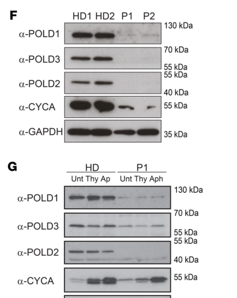

## Question

# Gene Research for Functional Annotation

## ⚠️ CRITICAL: Gene/Protein Identification Context

**BEFORE YOU BEGIN RESEARCH:** You MUST verify you are researching the CORRECT gene/protein. Gene symbols can be ambiguous, especially for less well-characterized genes from non-model organisms.

### Target Gene/Protein Identity (from UniProt):
- **UniProt Accession:** P49005
- **Protein Description:** RecName: Full=DNA polymerase delta subunit 2; AltName: Full=DNA polymerase delta subunit p50;
- **Gene Information:** Name=POLD2;
- **Organism (full):** Homo sapiens (Human).
- **Protein Family:** Belongs to the DNA polymerase delta/II small subunit
- **Key Domains:** DNA_pol_a/d/e_bsu. (IPR007185); DNA_pol_D_N. (IPR040663); DNA_pol_delta/II_ssu. (IPR024826); PolD2_C. (IPR041863); DNA_pol_D_N (PF18018)

### MANDATORY VERIFICATION STEPS:

1. **Check if the gene symbol "POLD2" matches the protein description above**
2. **Verify the organism is correct:** Homo sapiens (Human).
3. **Check if protein family/domains align with what you find in literature**
4. **If you find literature for a DIFFERENT gene with the same or similar symbol, STOP**

### If Gene Symbol is Ambiguous or You Cannot Find Relevant Literature:

**DO NOT PROCEED WITH RESEARCH ON A DIFFERENT GENE.** Instead:
- State clearly: "The gene symbol 'POLD2' is ambiguous or literature is limited for this specific protein"
- Explain what you found (e.g., "Found extensive literature on a different gene with the same symbol in a different organism")
- Describe the protein based ONLY on the UniProt information provided above
- Suggest that the protein function can be inferred from domain/family information

### Research Target:

Please provide a comprehensive research report on the gene **POLD2** (gene ID: POLD2, UniProt: P49005) in human.

The research report should be a detailed narrative explaining the function, biological processes, and localization of the gene product. Citations should be given for all claims.

You should prioritize authoritative reviews and primary scientific literature when conducting research. You can supplement
this with annotations you find in gene/protein databases, but these can be outdated or inaccurate.

We are specifically interested in the primary function of the gene - for enzymes, what reaction is catalyzed, and what is the substrate specificity? For transporters, what is the substrate? For structural proteins or adapters, what is the broader structural role? For signaling molecules, what is the role in the pathway.

We are interested in where in or outside the cell the gene product carries out its function.

We are also interested in the signaling or biochemical pathways in which the gene functions. We are less interested in broad pleiotropic effects, except where these elucidate the precise role.

Include evidence where possible. We are interested in both experimental evidence as well as inference from structure, evolution, or bioinformatic analysis. Precise studies should be prioritized over high-throughput, where available.

## Output

Question: You are an expert researcher providing comprehensive, well-cited information.

Provide detailed information focusing on:
1. Key concepts and definitions with current understanding
2. Recent developments and latest research (prioritize 2023-2024 sources)
3. Current applications and real-world implementations
4. Expert opinions and analysis from authoritative sources
5. Relevant statistics and data from recent studies

Format as a comprehensive research report with proper citations. Include URLs and publication dates where available.
Always prioritize recent, authoritative sources and provide specific citations for all major claims.

# Gene Research for Functional Annotation

## ⚠️ CRITICAL: Gene/Protein Identification Context

**BEFORE YOU BEGIN RESEARCH:** You MUST verify you are researching the CORRECT gene/protein. Gene symbols can be ambiguous, especially for less well-characterized genes from non-model organisms.

### Target Gene/Protein Identity (from UniProt):
- **UniProt Accession:** P49005
- **Protein Description:** RecName: Full=DNA polymerase delta subunit 2; AltName: Full=DNA polymerase delta subunit p50;
- **Gene Information:** Name=POLD2;
- **Organism (full):** Homo sapiens (Human).
- **Protein Family:** Belongs to the DNA polymerase delta/II small subunit
- **Key Domains:** DNA_pol_a/d/e_bsu. (IPR007185); DNA_pol_D_N. (IPR040663); DNA_pol_delta/II_ssu. (IPR024826); PolD2_C. (IPR041863); DNA_pol_D_N (PF18018)

### MANDATORY VERIFICATION STEPS:

1. **Check if the gene symbol "POLD2" matches the protein description above**
2. **Verify the organism is correct:** Homo sapiens (Human).
3. **Check if protein family/domains align with what you find in literature**
4. **If you find literature for a DIFFERENT gene with the same or similar symbol, STOP**

### If Gene Symbol is Ambiguous or You Cannot Find Relevant Literature:

**DO NOT PROCEED WITH RESEARCH ON A DIFFERENT GENE.** Instead:
- State clearly: "The gene symbol 'POLD2' is ambiguous or literature is limited for this specific protein"
- Explain what you found (e.g., "Found extensive literature on a different gene with the same symbol in a different organism")
- Describe the protein based ONLY on the UniProt information provided above
- Suggest that the protein function can be inferred from domain/family information

### Research Target:

Please provide a comprehensive research report on the gene **POLD2** (gene ID: POLD2, UniProt: P49005) in human.

The research report should be a detailed narrative explaining the function, biological processes, and localization of the gene product. Citations should be given for all claims.

You should prioritize authoritative reviews and primary scientific literature when conducting research. You can supplement
this with annotations you find in gene/protein databases, but these can be outdated or inaccurate.

We are specifically interested in the primary function of the gene - for enzymes, what reaction is catalyzed, and what is the substrate specificity? For transporters, what is the substrate? For structural proteins or adapters, what is the broader structural role? For signaling molecules, what is the role in the pathway.

We are interested in where in or outside the cell the gene product carries out its function.

We are also interested in the signaling or biochemical pathways in which the gene functions. We are less interested in broad pleiotropic effects, except where these elucidate the precise role.

Include evidence where possible. We are interested in both experimental evidence as well as inference from structure, evolution, or bioinformatic analysis. Precise studies should be prioritized over high-throughput, where available.

# Research Report: Human **POLD2** (DNA polymerase delta subunit 2; p50) — Functional Annotation

## 0) Target identity verification (mandatory)
The target gene **POLD2** (UniProt **P49005**) corresponds to **DNA polymerase delta subunit 2**, also known as **Polδ p50** in **Homo sapiens**. In the literature retrieved here, “POLD2/p50” is consistently described as an **accessory/structural subunit** of the **DNA polymerase δ (Polδ)** holoenzyme together with POLD1 (catalytic), POLD3, and POLD4, matching the UniProt description and expected family membership for the Polδ small subunit. (conde2019polymeraseδdeficiency pages 1-2, gola2023prospectsofpold1 pages 2-4, alli2024pold3ascontroller pages 2-5)

## 1) Key concepts and definitions (current understanding)

### 1.1 DNA polymerase δ (Polδ) and subunit composition
**Polδ** is a major **B-family** nuclear replicative polymerase involved in genome duplication and repair-associated DNA synthesis. Human Polδ is widely described as a **heterotetramer** composed of **POLD1 (p125)** plus accessory subunits **POLD2 (p50)**, **POLD3 (p66/p68)**, and **POLD4 (p12)**. (conde2019polymeraseδdeficiency pages 1-2, gola2023prospectsofpold1 pages 2-4)

### 1.2 What POLD2 is (and is not)
POLD2 is not the catalytic polymerase/exonuclease subunit; rather, it is a **core structural/accessory component** of Polδ that helps organize the holoenzyme. In a clinical/mechanistic study of polymerase δ deficiency, POLD2 is specifically described as having a **central structural role** mediating interactions with other Polδ subunits (notably POLD1 and POLD3), and its functions had historically been “poorly explored” because Polδ is essential. (conde2019polymeraseδdeficiency pages 1-2)

### 1.3 Pathway context: replication stress, DNA repair synthesis, and polymerase switching
In addition to canonical replication, Polδ (and shared components including POLD2) participate in DNA repair-associated synthesis pathways. A key modern example is **mitotic DNA synthesis (MiDAS)**, a replication-stress response process that completes under-replicated regions when cells enter mitosis. In this context, POLD2 is relevant because it is part of Polδ and is also shared with **Polζ4** (a translesion polymerase complex), supporting polymerase switching and stress-tolerant DNA synthesis. (wu2023mitoticdnasynthesis pages 1-2)

## 2) Molecular function and mechanism-focused annotation

### 2.1 Primary functional role
**Primary function (gene-product level):** POLD2 functions as an **essential non-catalytic subunit** of the Polδ holoenzyme, supporting assembly, stability, and productive interactions among subunits required for high-fidelity DNA synthesis in nuclear DNA replication and repair-associated synthesis. Evidence for this “stability/assembly” role comes from patient-derived cells with a POLD2 missense variant that show reduced POLD2 protein and reduced levels of other Polδ subunits, alongside replication stress and DNA-damage phenotypes that can be rescued by wild-type POLD2 expression. (conde2019polymeraseδdeficiency pages 2-4, conde2019polymeraseδdeficiency pages 9-10)

### 2.2 Interaction interfaces and complex integrity
A 2024 review synthesizing structural knowledge highlights that POLD2 forms an **essential interaction interface with POLD3**, required for normal Polδ function, and notes POLD2 features (CysA/CysB motifs) that are proposed to modulate catalytic function via subunit interfaces. (alli2024pold3ascontroller pages 2-5)

### 2.3 Polymerase switching and damage tolerance interactions
A mechanistic study of translesion synthesis regulation showed that the **FF483–484 motif of human DNA polymerase η (Polη)** is necessary for Polη interaction with **POLD2**, in vitro and in vivo, and that disrupting this interaction impairs lesion bypass and UV survival. This supports a model in which POLD2 participates in protein networks mediating polymerase switching at damaged templates. (baldeck2015ff483–484motifof pages 1-2)

## 3) Subcellular localization and where POLD2 acts
The evidence set retrieved here supports POLD2 functioning in **nuclear DNA replication/repair transactions**, based on its role in Polδ/Polζ4 DNA synthesis under replication stress and on nuclear genome stability phenotypes observed in patient fibroblasts and PBMCs. (wu2023mitoticdnasynthesis pages 1-2, conde2019polymeraseδdeficiency pages 9-10, conde2019polymeraseδdeficiency pages 1-2)

A dedicated localization assay (e.g., immunofluorescence localization of POLD2 itself to replication factories) was not captured in the retrieved excerpts; therefore localization is best considered **nuclear by functional inference** from its established polymerase-complex roles. (conde2019polymeraseδdeficiency pages 9-10)

## 4) Recent developments and latest research (prioritizing 2023–2024)

### 4.1 2023: Replication stress and MiDAS polymerase usage
A 2023 *Nature Communications* study defined how human cells use both **Polζ and Polδ** sequentially in **MiDAS** and emphasized that **POLD2 and POLD3** are shared subunits relevant to these stress-tolerant synthesis pathways. This places POLD2 within a modern mechanistic framework of replication stress responses in human cells. 
- Publication: **2023-02**; URL: https://doi.org/10.1038/s41467-023-35992-5 (wu2023mitoticdnasynthesis pages 1-2)

### 4.2 2023: Cancer/clinical biomarker signal for POLD2 expression in multiple myeloma
A 2023 *Haematologica* study evaluated base excision repair (BER) pathway gene expression and outcomes in multiple myeloma (MM), reporting that BER genes are **highly upregulated across MM development** (450 clinical samples; 6 disease stages) and that **high POLD2 expression** is associated with **worse overall survival (OS)** in MM patients receiving **autologous stem cell transplant (ASCT)**.
- Training set: **GSE2658, n=559 (ASCT)**: high POLD2 HR **1.47** (95% CI 0.99–2.17; P=0.06; median split) for worse OS. 
- Validation: **MMRF, n=356 (ASCT)**: high POLD2 HR **1.67** (95% CI ~1.03–2.71; P~0.04) for worse OS.
- Non-transplant MM (MMRF, n=319): no significant association (HR **1.06**, 95% CI 0.75–1.48; P=0.75), suggesting **treatment-context dependence**.
- Publication: **2023-03**; URL: https://doi.org/10.3324/haematol.2022.282399 (thomas2023parp1andpold2 pages 3-6, thomas2023parp1andpold2 pages 2-3, thomas2023parp1andpold2 pages 1-2)

### 4.3 2024: Updated structural-functional synthesis for Polδ subunits (including POLD2)
A 2024 review focusing on Polδ/repair synthesis controllers highlights POLD2 as p50, discusses its placement in experimentally determined human Polδ structures, and emphasizes the functional importance of the **POLD2–POLD3 interface** for normal Polδ function. 
- Publication: **2024-11**; URL: https://doi.org/10.3390/ijms252212417 (alli2024pold3ascontroller pages 2-5)

## 5) Human genetics and disease relevance (authoritative mechanistic evidence)

### 5.1 Polymerase δ deficiency syndrome due to biallelic POLD2 variant
A 2019 *Journal of Clinical Investigation* study identified a **homozygous POLD2 missense variant p.Asp293Asn (D293N)** in a patient with an autosomal-recessive syndrome combining **replicative stress, neurodevelopmental abnormalities, and immunodeficiency**. The variant lies in a POLD2 domain region implicated in subunit interfaces; modeling predicted disruption at the **POLD2–POLD3 interface**. (conde2019polymeraseδdeficiency pages 2-4)

Mechanistic cellular findings included:
- **Markedly reduced POLD2 protein** in patient PBMCs and fibroblasts, accompanied by reduced POLD1/POLD3 protein despite comparable mRNA, consistent with impaired complex stability/assembly. (conde2019polymeraseδdeficiency pages 2-4)
- A **rescue experiment**: stable overexpression of **wild-type POLD2** in patient fibroblasts stabilized POLD1/POLD3 and reduced replication stress-associated nuclear bodies (53BP1 markers), supporting a direct causal role for POLD2 in Polδ integrity. (conde2019polymeraseδdeficiency pages 9-10)

Quantitative DNA damage/replication stress statistic reported in the excerpts:
- Fraction of cells with **>2 53BP1 foci**: patient P1 **42.5% (S phase)** and **28.2% (G1)** vs healthy donor **18.3% (S phase)** and **10.6% (G1)**. (conde2019polymeraseδdeficiency pages 9-10)

**Visual evidence from the same study** includes western blots showing reduced POLD2 in patient cells and structural/biochemical assessments of the D293N variant and rescue; see the extracted figure crops. (conde2019polymeraseδdeficiency media 4aa2b12d)

### 5.2 2023 review synthesis of replicative polymerase gene–disease links
A 2023 review on replicative polymerase gene mutations reiterates that Polδ is a four-subunit complex and highlights that **biallelic POLD2 mutations (e.g., D293N)** have been linked to an autosomal recessive syndrome involving replicative stress and immunodeficiency, consistent with the JCI mechanistic findings. 
- Publication: **2023-04**; URL: https://doi.org/10.3390/ijms24098078 (yamaguchi2023associationofmutations pages 4-5)

## 6) Current applications and real-world implementations

### 6.1 Clinical genetics / immunology diagnostics
The polymerase δ deficiency syndrome provides a clear real-world implementation: **POLD2** is included in **diagnostic evaluation** for inborn errors featuring combined immunodeficiency with replication stress/neurodevelopmental phenotypes, with mechanistic validation supporting pathogenicity in at least one biallelic missense context (D293N) and functional rescue by WT POLD2. (conde2019polymeraseδdeficiency pages 2-4, conde2019polymeraseδdeficiency pages 9-10)

### 6.2 Oncology biomarker research (expression-based)
In multiple myeloma treated with ASCT, POLD2 expression has been proposed as part of a BER-pathway biomarker signal predictive of worse OS. The key real-world utility is **risk stratification** and potential **therapy tailoring** (e.g., informing trials/strategies involving DNA damage response modulation), noting the effect’s **treatment dependence** in the analyzed cohorts. (thomas2023parp1andpold2 pages 3-6, thomas2023parp1andpold2 pages 2-3)

### 6.3 Replication-stress targeted strategies (mechanism-informed)
Mechanistic work on MiDAS and polymerase switching provides a rationale for exploring dependencies in replication-stress–high cancers: Polδ and shared subunits (including POLD2) are part of the machinery that completes DNA synthesis under stress, suggesting that perturbation of this axis could sensitize cells with high replication stress. (wu2023mitoticdnasynthesis pages 1-2)

## 7) Expert opinions and analysis (authoritative synthesis)
Authoritative reviews and high-impact primary studies converge on a consistent mechanistic interpretation:
- **POLD2’s central biology is structural/organizational**, supporting Polδ complex integrity and enabling DNA synthesis in replication and repair contexts, rather than catalysis per se. This is supported by mechanistic patient-variant work (showing destabilization and rescue) and structural-functional synthesis emphasizing the essential POLD2–POLD3 interface. (conde2019polymeraseδdeficiency pages 9-10, alli2024pold3ascontroller pages 2-5)
- **POLD2 participates in polymerase switching networks** that support DNA damage tolerance (e.g., via Polη interaction), providing an interaction-based mechanism for how an accessory replicative subunit can influence lesion bypass and survival. (baldeck2015ff483–484motifof pages 1-2)

## 8) Relevant statistics and data (recent studies)

### 8.1 Multiple myeloma survival statistics (2023)
In ASCT-treated MM cohorts, high POLD2 expression associates with worse OS:
- **n=559 (GSE2658 ASCT)**: HR 1.47 (95% CI 0.99–2.17; P=0.06). (thomas2023parp1andpold2 pages 2-3)
- **n=356 (MMRF ASCT)**: HR 1.67 (95% CI ~1.03–2.71; P~0.04). (thomas2023parp1andpold2 pages 3-6)
- **n=319 (MMRF non-transplant)**: HR 1.06 (95% CI 0.75–1.48; P=0.75; not significant). (thomas2023parp1andpold2 pages 3-6)

### 8.2 Replication stress / DNA damage marker differences in POLD2 deficiency (2019)
A biallelic POLD2 variant context shows increased replication-associated DNA lesions, quantified by 53BP1 foci differences between patient and healthy cells (values above). (conde2019polymeraseδdeficiency pages 9-10)

## Summary table
The table below consolidates evidence-supported functional annotation points, emphasizing mechanistic evidence and quantitative findings.

| Topic | Key points | Best supporting source(s) with DOI/URL and publication date | Evidence notes/quantitative data |
|---|---|---|---|
| Complex role | Human POLD2 (p50; UniProt P49005) is an accessory subunit of the heterotetrameric DNA polymerase δ (Polδ) complex with POLD1, POLD3, and POLD4. It has a central structural role, mediating interactions within the complex, especially with POLD3, rather than providing catalytic polymerase or exonuclease activity. (conde2019polymeraseδdeficiency pages 1-2, gola2023prospectsofpold1 pages 2-4, alli2024pold3ascontroller pages 2-5) | Conde et al., *J Clin Invest* (2019), doi:10.1172/JCI128903, https://doi.org/10.1172/jci128903, Aug 2019; Gola et al., *Cancers* (2023), doi:10.3390/cancers15061905, https://doi.org/10.3390/cancers15061905, Mar 2023; Alli et al., *Int J Mol Sci* (2024), doi:10.3390/ijms252212417, https://doi.org/10.3390/ijms252212417, Nov 2024 | Conde et al. describe POLD2 as central to POLD1/POLD3 interactions; Alli et al. note the POLD2–POLD3 interaction is essential for normal Polδ function. (conde2019polymeraseδdeficiency pages 1-2, alli2024pold3ascontroller pages 2-5) |
| Interactions | POLD2 directly participates in protein-interaction networks relevant to replication and damage tolerance. It interacts functionally with POLD3 in Polδ, is shared with Polζ4, and can bind translesion polymerase η (Polη), supporting polymerase switching at damaged DNA. (baldeck2015ff483–484motifof pages 1-2, wu2023mitoticdnasynthesis pages 1-2, alli2024pold3ascontroller pages 2-5) | Baldeck et al., *Nucleic Acids Res* (2015), doi:10.1093/nar/gkv076, https://doi.org/10.1093/nar/gkv076, Feb 2015; Wu et al., *Nat Commun* (2023), doi:10.1038/s41467-023-35992-5, https://doi.org/10.1038/s41467-023-35992-5, Feb 2023; Alli et al., *Int J Mol Sci* (2024), doi:10.3390/ijms252212417, https://doi.org/10.3390/ijms252212417, Nov 2024 | Baldeck et al. showed the FF483–484 motif of human Polη is required for Polη–POLD2 interaction in vitro and in vivo, and that disrupting this interaction impairs lesion bypass and UV survival. Wu et al. note POLD2 and POLD3 are shared subunits of Polδ and Polζ4 in replication-stress responses. (baldeck2015ff483–484motifof pages 1-2, wu2023mitoticdnasynthesis pages 1-2) |
| Domains/structure | POLD2 contains a phosphodiesterase-like (PDE) domain and structurally important CysA/CysB motifs; the CysB iron–sulfur cluster has been proposed to influence POLD1 catalytic function through the subunit interface. The disease-associated Asp293 residue lies in the PDE domain at the POLD2–POLD3 interface. (conde2019polymeraseδdeficiency pages 2-4, alli2024pold3ascontroller pages 2-5) | Conde et al., *J Clin Invest* (2019), doi:10.1172/JCI128903, https://doi.org/10.1172/jci128903, Aug 2019; Alli et al., *Int J Mol Sci* (2024), doi:10.3390/ijms252212417, https://doi.org/10.3390/ijms252212417, Nov 2024 | Structural modeling predicted POLD2 Asp293Asn disrupts local electrostatic interactions, including loss of a contact with Arg240, weakening the POLD2–POLD3 interface. Alli et al. highlight CysA/CysB motifs and propose Fe–S-dependent regulation within Polδ. (conde2019polymeraseδdeficiency pages 2-4, alli2024pold3ascontroller pages 2-5) |
| Pathways | POLD2 functions in core genome duplication as part of Polδ and also contributes to DNA repair-associated DNA synthesis. Recent work links Polδ subunits to mitotic DNA synthesis (MiDAS) after replication stress, and POLD2/POLD3 are also incorporated into Polζ4, connecting POLD2 to translesion synthesis and repair pathway switching. (wu2023mitoticdnasynthesis pages 1-2, conde2019polymeraseδdeficiency pages 1-2, baldeck2015ff483–484motifof pages 1-2) | Wu et al., *Nat Commun* (2023), doi:10.1038/s41467-023-35992-5, https://doi.org/10.1038/s41467-023-35992-5, Feb 2023; Conde et al., *J Clin Invest* (2019), doi:10.1172/JCI128903, https://doi.org/10.1172/jci128903, Aug 2019; Baldeck et al., *Nucleic Acids Res* (2015), doi:10.1093/nar/gkv076, https://doi.org/10.1093/nar/gkv076, Feb 2015 | Wu et al. report MiDAS requires sequential action of Polζ and Polδ and that POLD2/POLD3 are essential for this synthesis. Conde et al. connect POLD2 loss to replication-associated DNA lesions and impaired cell-cycle progression reversible by Polδ overexpression. (wu2023mitoticdnasynthesis pages 1-2, conde2019polymeraseδdeficiency pages 1-2) |
| Localization | The available gathered evidence supports POLD2 action in nuclear DNA replication/repair complexes rather than a non-nuclear role, based on its participation in Polδ/Polζ and its association with replication-stress and DNA-damage phenotypes in patient cells. A specific dedicated subcellular-localization experiment for POLD2 was not captured in the gathered evidence set. (conde2019polymeraseδdeficiency pages 1-2, conde2019polymeraseδdeficiency pages 9-10) | Conde et al., *J Clin Invest* (2019), doi:10.1172/JCI128903, https://doi.org/10.1172/jci128903, Aug 2019 | Evidence is inferential from nuclear genome maintenance phenotypes (replication stress, 53BP1 nuclear bodies, DNA-damage-associated rescue by WT POLD2) rather than from direct microscopy/localization mapping in the gathered excerpts. (conde2019polymeraseδdeficiency pages 9-10) |
| Disease variants | A homozygous human POLD2 missense variant, p.Asp293Asn, causes an autosomal-recessive polymerase δ deficiency syndrome with replicative stress, neurodevelopmental abnormalities, and immunodeficiency. Mechanistically, the variant reduces POLD2 stability and weakens interaction with POLD1/POLD3, destabilizing the whole Polδ complex. (conde2019polymeraseδdeficiency pages 2-4, conde2019polymeraseδdeficiency pages 9-10, yamaguchi2023associationofmutations pages 4-5) | Conde et al., *J Clin Invest* (2019), doi:10.1172/JCI128903, https://doi.org/10.1172/jci128903, Aug 2019; Yamaguchi & Cotterill, *Int J Mol Sci* (2023), doi:10.3390/ijms24098078, https://doi.org/10.3390/ijms24098078, Apr 2023 | In the JCI study, 2 patients from 2 pedigrees had biallelic Polδ deficiency involving POLD1 or POLD2. POLD2 p.Asp293Asn had CADD 28.1, was absent from ExAC/1000 Genomes, reduced POLD2/POLD1/POLD3 protein despite similar mRNA, and WT POLD2 rescue reduced elevated G1/S-G2 53BP1 nuclear bodies; cells with >2 53BP1 foci were 42.5% (S phase) and 28.2% (G1) in P1 versus 18.3% and 10.6% in healthy donor cells. (conde2019polymeraseδdeficiency pages 2-4, conde2019polymeraseδdeficiency pages 9-10) |
| Clinical/prognostic associations | POLD2 has emerging biomarker relevance in cancer, especially multiple myeloma treated with autologous stem cell transplant (ASCT), where higher expression is associated with worse overall survival. The effect appears treatment-context dependent, as it was not significant in non-transplant myeloma cohorts. (thomas2023parp1andpold2 pages 2-3, thomas2023parp1andpold2 pages 1-2, thomas2023parp1andpold2 pages 3-6) | Thomas et al., *Haematologica* (2023), doi:10.3324/haematol.2022.282399, https://doi.org/10.3324/haematol.2022.282399, Mar 2023 | BER-pathway expression was assessed across 450 clinical samples and 6 disease stages and was broadly upregulated during MM development; POLD2 was among genes significantly upregulated in MM versus MGUS. In ASCT-treated MM, high POLD2 expression associated with worse OS in GSE2658 (n=559; HR 1.47, 95% CI 0.99–2.17, P=0.06) and was significant in an independent ASCT validation cohort (n=356; HR 1.67, 95% CI 1.03/1.04–2.71/2.68, P=0.04/0.03 as reported across excerpts). In non-transplant MM (n=319), POLD2 was not associated with OS (HR 1.06, 95% CI 0.75–1.48, P=0.75). (thomas2023parp1andpold2 pages 2-3, thomas2023parp1andpold2 pages 1-2, thomas2023parp1andpold2 pages 3-6) |

*Table: This table summarizes evidence-supported facts about human POLD2, including its role in the Polδ complex, structural features, pathway involvement, disease variants, and emerging clinical associations. It is designed as a compact reference for functional annotation with direct source and quantitative evidence.*

## References (URLs and publication dates)
- Conde CD *et al.* “Polymerase δ deficiency causes syndromic immunodeficiency with replicative stress.” *J Clin Invest.* **2019-08**. https://doi.org/10.1172/jci128903 (conde2019polymeraseδdeficiency pages 2-4, conde2019polymeraseδdeficiency pages 9-10, conde2019polymeraseδdeficiency pages 1-2, conde2019polymeraseδdeficiency media 4aa2b12d)
- Wu W *et al.* “Mitotic DNA synthesis … requires sequential action of DNA polymerases zeta and delta in human cells.” *Nat Commun.* **2023-02**. https://doi.org/10.1038/s41467-023-35992-5 (wu2023mitoticdnasynthesis pages 1-2)
- Thomas M *et al.* “PARP1 and POLD2 as prognostic biomarkers for multiple myeloma in autologous stem cell transplant.” *Haematologica.* **2023-03**. https://doi.org/10.3324/haematol.2022.282399 (thomas2023parp1andpold2 pages 2-3, thomas2023parp1andpold2 pages 1-2, thomas2023parp1andpold2 pages 3-6)
- Yamaguchi M, Cotterill S. “Association of Mutations in Replicative DNA Polymerase Genes with Human Disease …” *Int J Mol Sci.* **2023-04**. https://doi.org/10.3390/ijms24098078 (yamaguchi2023associationofmutations pages 4-5)
- Gola M *et al.* “Prospects of POLD1 in Human Cancers: A Review.” *Cancers (Basel).* **2023-03**. https://doi.org/10.3390/cancers15061905 (context on Polδ composition and function) (gola2023prospectsofpold1 pages 2-4)
- Alli N *et al.* “POLD3 as Controller of Replicative DNA Repair.” *Int J Mol Sci.* **2024-11**. https://doi.org/10.3390/ijms252212417 (structural interface synthesis relevant to POLD2) (alli2024pold3ascontroller pages 2-5)
- Baldeck N *et al.* “FF483–484 motif of human Polη mediates its interaction with the POLD2 subunit of Polδ …” *Nucleic Acids Res.* **2015-02**. https://doi.org/10.1093/nar/gkv076 (baldeck2015ff483–484motifof pages 1-2)

References

1. (conde2019polymeraseδdeficiency pages 1-2): Cecilia Domínguez Conde, Özlem Yüce Petronczki, Safa Baris, Katharina L. Willmann, Enrico Girardi, Elisabeth Salzer, Stefan Weitzer, Rico Chandra Ardy, Ana Krolo, Hanna Ijspeert, Ayca Kiykim, Elif Karakoc-Aydiner, Elisabeth Förster-Waldl, Leo Kager, Winfried F. Pickl, Giulio Superti-Furga, Javier Martínez, Joanna I. Loizou, Ahmet Ozen, Mirjam van der Burg, and Kaan Boztug. Polymerase δ deficiency causes syndromic immunodeficiency with replicative stress. The Journal of clinical investigation, 129:4194-4206, Aug 2019. URL: https://doi.org/10.1172/jci128903, doi:10.1172/jci128903. This article has 63 citations.

2. (gola2023prospectsofpold1 pages 2-4): Michał Gola, Przemysław Stefaniak, Janusz Godlewski, Barbara Jereczek-Fossa, and Anna Starzyńska. Prospects of pold1 in human cancers: a review. Cancers, 15:1905, Mar 2023. URL: https://doi.org/10.3390/cancers15061905, doi:10.3390/cancers15061905. This article has 23 citations.

3. (alli2024pold3ascontroller pages 2-5): Nabilah Alli, Anna Lou-Hing, Edward L. Bolt, and Liu He. Pold3 as controller of replicative dna repair. International Journal of Molecular Sciences, 25:12417, Nov 2024. URL: https://doi.org/10.3390/ijms252212417, doi:10.3390/ijms252212417. This article has 5 citations.

4. (wu2023mitoticdnasynthesis pages 1-2): Wei Wu, Szymon A. Barwacz, Rahul Bhowmick, Katrine Lundgaard, Marisa M. Gonçalves Dinis, Malgorzata Clausen, Masato T. Kanemaki, and Ying Liu. Mitotic dna synthesis in response to replication stress requires the sequential action of dna polymerases zeta and delta in human cells. Nature Communications, Feb 2023. URL: https://doi.org/10.1038/s41467-023-35992-5, doi:10.1038/s41467-023-35992-5. This article has 48 citations and is from a highest quality peer-reviewed journal.

5. (conde2019polymeraseδdeficiency pages 2-4): Cecilia Domínguez Conde, Özlem Yüce Petronczki, Safa Baris, Katharina L. Willmann, Enrico Girardi, Elisabeth Salzer, Stefan Weitzer, Rico Chandra Ardy, Ana Krolo, Hanna Ijspeert, Ayca Kiykim, Elif Karakoc-Aydiner, Elisabeth Förster-Waldl, Leo Kager, Winfried F. Pickl, Giulio Superti-Furga, Javier Martínez, Joanna I. Loizou, Ahmet Ozen, Mirjam van der Burg, and Kaan Boztug. Polymerase δ deficiency causes syndromic immunodeficiency with replicative stress. The Journal of clinical investigation, 129:4194-4206, Aug 2019. URL: https://doi.org/10.1172/jci128903, doi:10.1172/jci128903. This article has 63 citations.

6. (conde2019polymeraseδdeficiency pages 9-10): Cecilia Domínguez Conde, Özlem Yüce Petronczki, Safa Baris, Katharina L. Willmann, Enrico Girardi, Elisabeth Salzer, Stefan Weitzer, Rico Chandra Ardy, Ana Krolo, Hanna Ijspeert, Ayca Kiykim, Elif Karakoc-Aydiner, Elisabeth Förster-Waldl, Leo Kager, Winfried F. Pickl, Giulio Superti-Furga, Javier Martínez, Joanna I. Loizou, Ahmet Ozen, Mirjam van der Burg, and Kaan Boztug. Polymerase δ deficiency causes syndromic immunodeficiency with replicative stress. The Journal of clinical investigation, 129:4194-4206, Aug 2019. URL: https://doi.org/10.1172/jci128903, doi:10.1172/jci128903. This article has 63 citations.

7. (baldeck2015ff483–484motifof pages 1-2): Nadège Baldeck, Régine Janel-Bintz, Jérome Wagner, Agnès Tissier, Robert P. Fuchs, Peter Burkovics, Lajos Haracska, Emmanuelle Despras, Marc Bichara, Bruno Chatton, and Agnès M. Cordonnier. Ff483–484 motif of human polη mediates its interaction with the pold2 subunit of polδ and contributes to dna damage tolerance. Nucleic Acids Research, 43:2116-2125, Feb 2015. URL: https://doi.org/10.1093/nar/gkv076, doi:10.1093/nar/gkv076. This article has 38 citations and is from a highest quality peer-reviewed journal.

8. (thomas2023parp1andpold2 pages 3-6): Melissa Thomas, Junan Li, Kevan King, Avinash K Persaud, Ernest Duah, Zachary Vangundy, Craig C. Hofmeister, Jatinder K. Lamba, Aik Choon Tan, Brooke L. Fridley, Ming J. Poi, and Nathan D. Seligson. Parp1 and pold2 as prognostic biomarkers for multiple myeloma in autologous stem cell transplant. Haematologica, 108:2155-2166, Mar 2023. URL: https://doi.org/10.3324/haematol.2022.282399, doi:10.3324/haematol.2022.282399. This article has 20 citations.

9. (thomas2023parp1andpold2 pages 2-3): Melissa Thomas, Junan Li, Kevan King, Avinash K Persaud, Ernest Duah, Zachary Vangundy, Craig C. Hofmeister, Jatinder K. Lamba, Aik Choon Tan, Brooke L. Fridley, Ming J. Poi, and Nathan D. Seligson. Parp1 and pold2 as prognostic biomarkers for multiple myeloma in autologous stem cell transplant. Haematologica, 108:2155-2166, Mar 2023. URL: https://doi.org/10.3324/haematol.2022.282399, doi:10.3324/haematol.2022.282399. This article has 20 citations.

10. (thomas2023parp1andpold2 pages 1-2): Melissa Thomas, Junan Li, Kevan King, Avinash K Persaud, Ernest Duah, Zachary Vangundy, Craig C. Hofmeister, Jatinder K. Lamba, Aik Choon Tan, Brooke L. Fridley, Ming J. Poi, and Nathan D. Seligson. Parp1 and pold2 as prognostic biomarkers for multiple myeloma in autologous stem cell transplant. Haematologica, 108:2155-2166, Mar 2023. URL: https://doi.org/10.3324/haematol.2022.282399, doi:10.3324/haematol.2022.282399. This article has 20 citations.

11. (conde2019polymeraseδdeficiency media 4aa2b12d): Cecilia Domínguez Conde, Özlem Yüce Petronczki, Safa Baris, Katharina L. Willmann, Enrico Girardi, Elisabeth Salzer, Stefan Weitzer, Rico Chandra Ardy, Ana Krolo, Hanna Ijspeert, Ayca Kiykim, Elif Karakoc-Aydiner, Elisabeth Förster-Waldl, Leo Kager, Winfried F. Pickl, Giulio Superti-Furga, Javier Martínez, Joanna I. Loizou, Ahmet Ozen, Mirjam van der Burg, and Kaan Boztug. Polymerase δ deficiency causes syndromic immunodeficiency with replicative stress. The Journal of clinical investigation, 129:4194-4206, Aug 2019. URL: https://doi.org/10.1172/jci128903, doi:10.1172/jci128903. This article has 63 citations.

12. (yamaguchi2023associationofmutations pages 4-5): Masamitsu Yamaguchi and Sue Cotterill. Association of mutations in replicative dna polymerase genes with human disease: possible application of drosophila models for studies. International Journal of Molecular Sciences, 24:8078, Apr 2023. URL: https://doi.org/10.3390/ijms24098078, doi:10.3390/ijms24098078. This article has 3 citations.

## Artifacts

- [Edison artifact artifact-00](POLD2-deep-research-falcon_artifacts/artifact-00.md)

## Citations

1. wu2023mitoticdnasynthesis pages 1-2
2. yamaguchi2023associationofmutations pages 4-5
3. https://doi.org/10.1038/s41467-023-35992-5
4. https://doi.org/10.3324/haematol.2022.282399
5. https://doi.org/10.3390/ijms252212417
6. https://doi.org/10.3390/ijms24098078
7. https://doi.org/10.1172/jci128903,
8. https://doi.org/10.3390/cancers15061905,
9. https://doi.org/10.3390/ijms252212417,
10. https://doi.org/10.1093/nar/gkv076,
11. https://doi.org/10.1038/s41467-023-35992-5,
12. https://doi.org/10.3390/ijms24098078,
13. https://doi.org/10.3324/haematol.2022.282399,
14. https://doi.org/10.1172/jci128903
15. https://doi.org/10.3390/cancers15061905
16. https://doi.org/10.1093/nar/gkv076