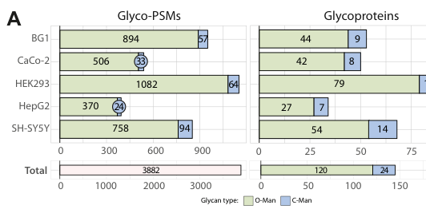

## Question

# Gene Research for Functional Annotation

## ⚠️ CRITICAL: Gene/Protein Identification Context

**BEFORE YOU BEGIN RESEARCH:** You MUST verify you are researching the CORRECT gene/protein. Gene symbols can be ambiguous, especially for less well-characterized genes from non-model organisms.

### Target Gene/Protein Identity (from UniProt):
- **UniProt Accession:** Q9Y6A1
- **Protein Description:** RecName: Full=Protein O-mannosyl-transferase 1; EC=2.4.1.109 {ECO:0000269|PubMed:14699049, ECO:0000269|PubMed:28512129}; AltName: Full=Dolichyl-phosphate-mannose--protein mannosyltransferase 1;
- **Gene Information:** Name=POMT1;
- **Organism (full):** Homo sapiens (Human).
- **Protein Family:** Belongs to the glycosyltransferase 39 family.
- **Key Domains:** GlyclTrfase_39-like. (IPR027005); Glyco_trans_39/83. (IPR003342); MIR_dom_sf. (IPR036300); MIR_motif. (IPR016093); PMT_4TMC. (IPR032421)

### MANDATORY VERIFICATION STEPS:

1. **Check if the gene symbol "POMT1" matches the protein description above**
2. **Verify the organism is correct:** Homo sapiens (Human).
3. **Check if protein family/domains align with what you find in literature**
4. **If you find literature for a DIFFERENT gene with the same or similar symbol, STOP**

### If Gene Symbol is Ambiguous or You Cannot Find Relevant Literature:

**DO NOT PROCEED WITH RESEARCH ON A DIFFERENT GENE.** Instead:
- State clearly: "The gene symbol 'POMT1' is ambiguous or literature is limited for this specific protein"
- Explain what you found (e.g., "Found extensive literature on a different gene with the same symbol in a different organism")
- Describe the protein based ONLY on the UniProt information provided above
- Suggest that the protein function can be inferred from domain/family information

### Research Target:

Please provide a comprehensive research report on the gene **POMT1** (gene ID: POMT1, UniProt: Q9Y6A1) in human.

The research report should be a detailed narrative explaining the function, biological processes, and localization of the gene product. Citations should be given for all claims.

You should prioritize authoritative reviews and primary scientific literature when conducting research. You can supplement
this with annotations you find in gene/protein databases, but these can be outdated or inaccurate.

We are specifically interested in the primary function of the gene - for enzymes, what reaction is catalyzed, and what is the substrate specificity? For transporters, what is the substrate? For structural proteins or adapters, what is the broader structural role? For signaling molecules, what is the role in the pathway.

We are interested in where in or outside the cell the gene product carries out its function.

We are also interested in the signaling or biochemical pathways in which the gene functions. We are less interested in broad pleiotropic effects, except where these elucidate the precise role.

Include evidence where possible. We are interested in both experimental evidence as well as inference from structure, evolution, or bioinformatic analysis. Precise studies should be prioritized over high-throughput, where available.

## Output

Question: You are an expert researcher providing comprehensive, well-cited information.

Provide detailed information focusing on:
1. Key concepts and definitions with current understanding
2. Recent developments and latest research (prioritize 2023-2024 sources)
3. Current applications and real-world implementations
4. Expert opinions and analysis from authoritative sources
5. Relevant statistics and data from recent studies

Format as a comprehensive research report with proper citations. Include URLs and publication dates where available.
Always prioritize recent, authoritative sources and provide specific citations for all major claims.

# Gene Research for Functional Annotation

## ⚠️ CRITICAL: Gene/Protein Identification Context

**BEFORE YOU BEGIN RESEARCH:** You MUST verify you are researching the CORRECT gene/protein. Gene symbols can be ambiguous, especially for less well-characterized genes from non-model organisms.

### Target Gene/Protein Identity (from UniProt):
- **UniProt Accession:** Q9Y6A1
- **Protein Description:** RecName: Full=Protein O-mannosyl-transferase 1; EC=2.4.1.109 {ECO:0000269|PubMed:14699049, ECO:0000269|PubMed:28512129}; AltName: Full=Dolichyl-phosphate-mannose--protein mannosyltransferase 1;
- **Gene Information:** Name=POMT1;
- **Organism (full):** Homo sapiens (Human).
- **Protein Family:** Belongs to the glycosyltransferase 39 family.
- **Key Domains:** GlyclTrfase_39-like. (IPR027005); Glyco_trans_39/83. (IPR003342); MIR_dom_sf. (IPR036300); MIR_motif. (IPR016093); PMT_4TMC. (IPR032421)

### MANDATORY VERIFICATION STEPS:

1. **Check if the gene symbol "POMT1" matches the protein description above**
2. **Verify the organism is correct:** Homo sapiens (Human).
3. **Check if protein family/domains align with what you find in literature**
4. **If you find literature for a DIFFERENT gene with the same or similar symbol, STOP**

### If Gene Symbol is Ambiguous or You Cannot Find Relevant Literature:

**DO NOT PROCEED WITH RESEARCH ON A DIFFERENT GENE.** Instead:
- State clearly: "The gene symbol 'POMT1' is ambiguous or literature is limited for this specific protein"
- Explain what you found (e.g., "Found extensive literature on a different gene with the same symbol in a different organism")
- Describe the protein based ONLY on the UniProt information provided above
- Suggest that the protein function can be inferred from domain/family information

### Research Target:

Please provide a comprehensive research report on the gene **POMT1** (gene ID: POMT1, UniProt: Q9Y6A1) in human.

The research report should be a detailed narrative explaining the function, biological processes, and localization of the gene product. Citations should be given for all claims.

You should prioritize authoritative reviews and primary scientific literature when conducting research. You can supplement
this with annotations you find in gene/protein databases, but these can be outdated or inaccurate.

We are specifically interested in the primary function of the gene - for enzymes, what reaction is catalyzed, and what is the substrate specificity? For transporters, what is the substrate? For structural proteins or adapters, what is the broader structural role? For signaling molecules, what is the role in the pathway.

We are interested in where in or outside the cell the gene product carries out its function.

We are also interested in the signaling or biochemical pathways in which the gene functions. We are less interested in broad pleiotropic effects, except where these elucidate the precise role.

Include evidence where possible. We are interested in both experimental evidence as well as inference from structure, evolution, or bioinformatic analysis. Precise studies should be prioritized over high-throughput, where available.

## Research report: Human **POMT1** (UniProt **Q9Y6A1**) — functional annotation

### 0) Target verification (critical identity checks)
The literature retrieved here is consistent with the UniProt target identity: **human POMT1 (Q9Y6A1)** is a multi-pass ER membrane glycosyltransferase that functions with **POMT2** as the canonical **protein O-mannosyltransferase** initiating O-mannosylation on selected substrates, most notably **α-dystroglycan (α-DG)** (manya2004demonstrationofmammalian pages 2-3, sheikh2017recentadvancementsin pages 1-5, koff2023proteinomannosylationone pages 1-2). POMT/Pmt enzymes are classified as **GT-C fold enzymes in CAZy GT39** and contain a conserved luminal **DD/DE acidic motif** essential for activity (larsen2017discoveryofan pages 4-5). This matches the UniProt description provided.

### 1) Key concepts and current understanding

#### 1.1 Definition: protein O-mannosylation initiation by POMT1/POMT2
In mammals, the best-established “POMT pathway” is initiated in the **endoplasmic reticulum (ER)** by an obligate **POMT1–POMT2 complex** that transfers **mannose** from **dolichyl-phosphate-mannose (Dol-P-Man; DPM)** to the hydroxyl oxygen of **serine or threonine** residues on protein substrates, yielding the core **M0** O-mannose (sheikh2017recentadvancementsin pages 1-5, sheikh2017recentadvancementsin pages 37-41). This is the first committed step for a subset of mammalian O-mannose glycans that can be extended in the secretory pathway toward functional structures such as **matriglycan** on α-DG (sheikh2017recentadvancementsin pages 1-5).

#### 1.2 Enzyme class, motifs, and architecture (functional inference)
POMT enzymes are **GT-C fold** glycosyltransferases (membrane-embedded enzymes that use a lipid-linked sugar donor), assigned to **CAZy GT39** (larsen2017discoveryofan pages 4-5). A conserved acidic **DD/DE** motif in the first luminal loop is described as essential for activity (larsen2017discoveryofan pages 4-5), consistent with ER luminal catalysis while the donor is a lipid-linked mannose. Reviews emphasize that POMT1/POMT2 are **integral multi-pass membrane proteins** and that catalytically important aspartates occur in a luminal loop (koff2023proteinomannosylationone pages 1-2). Structural work on the yeast homologous complex (Pmt1–Pmt2) supports a conserved overall architecture with **multiple transmembrane helices (11 in yeast)** and a luminal **MIR β-trefoil domain** (bai2019structureofthe pages 1-13). Although this structure is in yeast, it provides strong mechanistic and architectural support for the conserved POMT family used to interpret human POMT1 variants and domain functions (bai2019structureofthe pages 1-13).

#### 1.3 Subcellular localization
Multiple sources explicitly place POMT1 function in the **ER** (sheikh2017recentadvancementsin pages 1-5, sheikh2017recentadvancementsin pages 37-41, lommel2010correlationofenzyme pages 1-3). Experimentally, POMT1 and POMT2 are detected in microsomal membrane fractions used for in vitro activity assays (manya2004demonstrationofmammalian pages 2-3, manya2004demonstrationofmammalian pages 3-4).

### 2) Primary biochemical function: reaction, donor/acceptor, and complex requirement

#### 2.1 Reaction catalyzed and donor specificity
Manya et al. (PNAS, **Jan 2004**, https://doi.org/10.1073/pnas.0307228101) demonstrated mammalian POMT activity in vitro using microsomes from HEK293T cells, showing:
- Robust POMT activity required **coexpression of human POMT1 and POMT2** (manya2004demonstrationofmammalian pages 2-3, manya2004demonstrationofmammalian pages 3-4).
- The donor was **Dol-P-Man**; **GDP-mannose was not used** as a donor (manya2004demonstrationofmammalian pages 3-4, manya2004demonstrationofmammalian pages 4-5).
- Mannose transferred to the acceptor was sensitive to **α-mannosidase** cleavage consistent with **Man-α-Ser/Thr** linkages (manya2004demonstrationofmammalian pages 4-5).

These experiments provide direct evidence that human POMT1’s primary function is **Dol-P-Man:protein O-mannosyltransferase activity** within a POMT1/POMT2 complex (manya2004demonstrationofmammalian pages 4-5).

#### 2.2 Substrates and substrate specificity (what is known)
A canonical physiological acceptor is **α-dystroglycan (α-DG)**, a heavily glycosylated extracellular/lumenal-domain protein whose functional glycan supports extracellular matrix binding (manya2004demonstrationofmammalian pages 1-2, lommel2010correlationofenzyme pages 1-3). In the PNAS 2004 biochemical assay, the acceptor was a **GST–α-DG fusion** and it was efficiently mannosylated (manya2004demonstrationofmammalian pages 2-3, manya2004demonstrationofmammalian pages 4-5).

Substrate specificity is not captured by a simple short consensus motif. In Manya et al., **short synthetic α-DG peptides failed as acceptors**, implying that substrate recognition depends on broader sequence context and/or higher-order conformation (manya2004demonstrationofmammalian pages 4-5). This aligns with later reviews emphasizing incomplete understanding of substrate recognition rules for mammalian POMT enzymes (koff2023proteinomannosylationone pages 1-2).

### 3) Biological role and pathway context (α-dystroglycan glycosylation and ECM binding)

#### 3.1 POMT1 as the gateway to functional dystroglycan glycans
POMT1/POMT2 initiate O-mannosylation that can be elaborated through multiple downstream steps to produce mature **matriglycan** on α-DG, a glycan polymer that serves as a high-affinity receptor for laminin and other LG-domain extracellular matrix (ECM) proteins (sheikh2017recentadvancementsin pages 1-5). Thus, POMT1 activity is mechanistically upstream of cell–ECM anchoring mediated by dystroglycan (sheikh2017recentadvancementsin pages 1-5).

#### 3.2 Real-world functional consequence: cardiac membrane integrity (2024)
A 2024 mechanistic study in PNAS (Hord et al., **May 2024**, https://doi.org/10.1073/pnas.2402890121) links dystroglycan O-glycosylation (which requires the upstream POMT1/POMT2 initiation step) to **cardiac t-tubule integrity** under stress. The authors report that defective DG O-glycosylation/matriglycan compromises the ability of cardiac muscle to maintain t-tubule structure during stress, contributing to cardiac dysfunction (hord2024matriglycanmaintainsttubule pages 1-2). This illustrates a tissue-specific, physiologically relevant implementation of the pathway.

### 4) Disease relevance and applications (diagnostics and genotype–phenotype)

#### 4.1 Dystroglycanopathies caused by POMT1 deficiency
Defects in POMT1-mediated O-mannosylation cause **α-dystroglycan hypoglycosylation** and a spectrum of **dystroglycanopathies** from severe Walker–Warburg syndrome to milder limb-girdle muscular dystrophy presentations (lommel2010correlationofenzyme pages 1-3, bello2012cardiomyopathyinpatients pages 1-2). Mechanistically, loss of proper α-DG glycosylation disrupts ECM binding and cell–ECM interactions (sheikh2017recentadvancementsin pages 1-5).

A key quantitative finding is the relationship between residual enzymatic activity and clinical severity: Lommel et al. (Neurology, **Jan 2010**, https://doi.org/10.1212/WNL.0b013e3181c919d6) report residual POMT activities of ~**40%** in a milder LGMD2K patient versus ~**6–10%** in severe WWS cases, with an inverse correlation between residual activity and severity (lommel2010correlationofenzyme pages 6-8).

#### 4.2 Cohort-level statistics demonstrating clinical impact
Bello et al. (EJHG, **May 2012**, https://doi.org/10.1038/ejhg.2012.71) screened **247** archived muscle biopsies; **107** had reduced immunolabeling of a glycosylated α-DG epitope and **9** had **POMT1 mutations**, spanning LGMD, CMD with cognitive involvement, and WWS (bello2012cardiomyopathyinpatients pages 1-2). This cohort also highlights that **cardiomyopathy** can occur within the POMT1 disease spectrum; among detailed cases, cardiomyopathy onset ages ranged from **12 to 34 years** (bello2012cardiomyopathyinpatients pages 2-3, bello2012cardiomyopathyinpatients pages 1-2).

#### 4.3 Recent diagnostic implementation (2024)
Safwat et al. (Neurogenetics, **Feb 2024**, https://doi.org/10.1007/s10048-024-00745-z) report whole-exome sequencing (WES) in an Egyptian CMD cohort (11 families), achieving an **86% diagnostic yield (6/7)** for suspected dystroglycanopathies and identifying causative variants across multiple genes including **POMT1** (safwat2024geneticblueprintof pages 1-2). This supports WES (including splicing and CNV-aware analysis) as a current real-world diagnostic route for POMT1-related disease (safwat2024geneticblueprintof pages 1-2).

### 5) Recent developments and latest research (prioritizing 2023–2024)

#### 5.1 Pathway-resolved substrate mapping by glycoproteomics (2024)
Povolo et al. (Molecular & Cellular Proteomics, **Jul 2024**, https://doi.org/10.1016/j.mcpro.2024.100796) performed membrane glycoproteomics across engineered human cell lines to deconvolute O-mannosylation initiation pathways. They identified **180 O-mannosylated glycoproteins** overall and separated the contributions of **POMT1/POMT2**, **TMTC1–4**, and **TMEM260** pathways (povolo2024globalviewof pages 1-3, povolo2024globalviewof media 8d384bad). Quantitatively, they report **9,026 glyco-PSMs**, including **7,410 O-Man** and **1,614 C-Man** PSMs, and O-Man on EC domains of **54** cadherin superfamily members (povolo2024globalviewof pages 8-10, povolo2024globalviewof media 8d384bad). The study supports that mammalian POMT1/2 have a relatively **narrow substrate specificity**, with examples including α-DG and additional targets such as **KIAA1549** and **SUCO** (povolo2024globalviewof pages 10-11, povolo2024globalviewof pages 1-3).

#### 5.2 Updated conceptual synthesis of mammalian O-mannosylation (2023)
Koff et al. (Glycobiology, **Aug 2023**, https://doi.org/10.1093/glycob/cwad067) emphasize that protein O-mannosylation involves multiple initiation pathways and that POMT1/POMT2 are ER-localized enzymes using Dol-P-Man, while also highlighting knowledge gaps such as incomplete rules for substrate recognition and limited known POMT-specific substrates (koff2023proteinomannosylationone pages 1-2).

#### 5.3 Improved in vivo disease modeling enabling screening (2024)
Karas et al. (Human Molecular Genetics, **Jan 2024**, https://doi.org/10.1093/hmg/ddae006) introduced a zebrafish pomt1 loss-of-function model that recapitulates dystroglycanopathy-relevant phenotypes and shows that maternal pomt1 mRNA supports early dystroglycan glycosylation (karas2024removalofpomt1 pages 1-2). The authors explicitly note suitability of zebrafish for motor-phenotype drug screens, positioning the model as a translational platform (karas2024removalofpomt1 pages 1-2).

#### 5.4 Variant interpretation: pathway-adjacent deep mutational scanning (2024)
Although not executed on POMT1 itself, Ma et al. (Cell, **Nov 2024**, https://doi.org/10.1016/j.cell.2024.08.047) introduced **SMuRF**, a saturation mutagenesis functional scoring framework applied to dystroglycanopathy enzymes **FKRP** and **LARGE1** using α-DG glycosylation readouts. Quantitative results include strongly deleterious start-loss scores (median ≈ −3.2) and correlation of combined allelic functional scores with age of onset (rho ≈ 0.72) (ma2024saturationmutagenesisreinforcedfunctional pages 7-8). This provides an authoritative template for future POMT1 variant functionalization and clinical reclassification in the α-DG glycosylation pathway.

### 6) Current applications and real-world implementations

1. **Clinical molecular diagnosis**: WES-based pipelines (including splicing/CNV consideration) are being applied in CMD/dystroglycanopathy cohorts and can identify POMT1 among causal genes with high diagnostic yields in defined cohorts (safwat2024geneticblueprintof pages 1-2).
2. **Biochemical/functional assays**: Microsome-based Dol-P-Man transfer assays and α-DG glycosylation readouts remain key approaches to confirm functional impairment (manya2004demonstrationofmammalian pages 4-5, lommel2010correlationofenzyme pages 6-8).
3. **Proteomics for functional annotation**: Pathway-resolved glycoproteomics can now empirically classify substrates as POMT1/2-dependent vs other O-Man initiation pathways (povolo2024globalviewof pages 1-3).
4. **Preclinical modeling**: Stable zebrafish pomt1 knockouts provide scalable in vivo platforms for mechanism and screening, overcoming embryonic lethality limitations of mammalian knockout models discussed in the literature (karas2024removalofpomt1 pages 1-2).

### 7) Expert opinions and authoritative analysis (what experts emphasize)

- Reviews emphasize that POMT1/POMT2 are **obligate partners** and that mammalian substrate specificity is far narrower than yeast, leaving key mechanistic questions open (koff2023proteinomannosylationone pages 1-2).
- The pathway is increasingly viewed as **multi-initiation**, with POMT1/2 representing one of several ER O-mannosylation initiation systems; this re-frames “O-mannosylation” as several biologically specialized programs rather than a single generalized modification (koff2023proteinomannosylationone pages 1-2, povolo2024globalviewof pages 1-3).
- Quantitative genotype–function relationships (residual activity vs severity) support that partial restoration of pathway function could be clinically meaningful, motivating functional assays and variant stratification (lommel2010correlationofenzyme pages 6-8).

### 8) Evidence-backed summary tables

| Aspect | Summary |
|---|---|
| Target identity | Human **POMT1** corresponds to UniProt **Q9Y6A1**, an ER-associated protein O-mannosyltransferase studied together with **POMT2**; the literature consistently matches the supplied protein description and function. (koff2023proteinomannosylationone pages 1-2, sheikh2017recentadvancementsin pages 37-41) |
| Enzyme reaction | POMT1 participates in the **initiation of protein O-mannosylation**, transferring **α-mannose to Ser/Thr residues** on protein substrates in the ER; this creates the initial O-Man (core M0) precursor for downstream glycan elaboration. (sheikh2017recentadvancementsin pages 1-5, manya2004demonstrationofmammalian pages 4-5, sheikh2017recentadvancementsin pages 37-41) |
| Sugar donor | The activated donor is **dolichyl-phosphate-mannose** (**Dol-P-Man / DPM**), whereas **GDP-mannose is not used** in the mammalian POMT assay. (manya2004demonstrationofmammalian pages 3-4, sheikh2017recentadvancementsin pages 1-5, manya2004demonstrationofmammalian pages 4-5) |
| Acceptors / substrate scope | A key physiological substrate is **α-dystroglycan (α-DG)**; newer proteomics also support POMT1/2-dependent O-mannosylation of **KIAA1549** and **SUCO**, while mammalian POMT1/2 appears to have a **narrower substrate spectrum** than yeast PMTs. (manya2004demonstrationofmammalian pages 4-5, povolo2024globalviewof pages 10-11, povolo2024globalviewof pages 1-3, koff2023proteinomannosylationone pages 1-2) |
| Substrate specificity | POMT activity prefers **proteinaceous/structured acceptors**: short synthetic α-DG peptides failed as substrates, implying recognition depends on sequence context and/or higher-order conformation rather than a short linear motif alone. (manya2004demonstrationofmammalian pages 4-5, koff2023proteinomannosylationone pages 1-2) |
| Complex requirement | **POMT1 alone is insufficient** for robust activity; **coexpression with POMT2** is required for mammalian protein O-mannosyltransferase activity, consistent with an obligatory heteromeric complex. (manya2004demonstrationofmammalian pages 2-3, manya2004demonstrationofmammalian pages 3-4, manya2004demonstrationofmammalian pages 4-5) |
| Localization / topology | POMT1 functions in the **endoplasmic reticulum** and is detected in **microsomal membrane fractions**; family members are **integral multi-pass membrane proteins** with luminal catalytic features. (manya2004demonstrationofmammalian pages 2-3, sheikh2017recentadvancementsin pages 37-41, lommel2010correlationofenzyme pages 1-3) |
| Protein family classification | POMT/Pmt enzymes belong to the **GT-C fold** group and are placed in **CAZy GT39**; they are conserved eukaryotic protein O-mannosyltransferases. (larsen2017discoveryofan pages 4-5, koff2023proteinomannosylationone pages 1-2) |
| Key domains / motifs | Structural and sequence analyses support a **multi-pass transmembrane architecture**, a luminal **MIR domain**, and a conserved **acidic DD/DE motif** in the first luminal loop that is essential for activity; yeast Pmt1–Pmt2 structures support a conserved **11-TMH + MIR** organization relevant to human POMT1. (bai2019structureofthe pages 1-13, larsen2017discoveryofan pages 4-5, bello2012cardiomyopathyinpatients pages 3-4) |
| Pathway role | POMT1/POMT2 act at the **first committed ER step** of the α-DG O-mannose pathway; downstream enzymes extend these glycans toward **matriglycan**, which is required for binding extracellular matrix ligands such as laminin. (sheikh2017recentadvancementsin pages 1-5, hord2024matriglycanmaintainsttubule pages 1-2) |
| Disease link | Biallelic **POMT1 mutations** cause **dystroglycanopathies** spanning **Walker-Warburg syndrome (WWS)** to **limb-girdle muscular dystrophy (LGMD2K/LGMDR11)** via α-DG hypoglycosylation; cardiomyopathy can be part of the spectrum. (lommel2010correlationofenzyme pages 1-3, bello2012cardiomyopathyinpatients pages 1-2, bello2012cardiomyopathyinpatients pages 3-4) |
| Quantitative genotype-function data | Residual POMT activity correlates with phenotype severity: about **40%** residual activity was reported in an LGMD2K patient versus about **6–10%** in severe WWS cases; lymphoblast activity could be **non-detectable to 0.004 pmol/h/mg**. (lommel2010correlationofenzyme pages 6-8) |
| Clinical cohort statistics | In one biopsy-driven screen, **247** patients were evaluated, **107** showed reduced α-DG glyco-epitope labeling, and **9** had **POMT1 mutations**; a 2024 Egyptian CMD cohort reported **86% (6/7)** diagnostic yield for dystroglycanopathy cases using WES and identified **POMT1** among causal genes. (bello2012cardiomyopathyinpatients pages 1-2, safwat2024geneticblueprintof pages 1-2) |
| Recent 2023–2024 advances | A 2024 glycoproteomics study identified **180 O-Man glycoproteins** overall and separated **POMT1/2** from TMTC/TMEM260 initiation pathways; a 2024 zebrafish **pomt1** knockout modeled dystroglycanopathy; a 2024 cardiac study linked the downstream matriglycan pathway to **t-tubule integrity** under stress. (povolo2024globalviewof pages 1-3, karas2024removalofpomt1 pages 1-2, hord2024matriglycanmaintainsttubule pages 1-2, povolo2024globalviewof media 8d384bad) |
| Recent quantitative pathway mapping | In the 2024 glycoproteomics dataset, investigators reported **9,026 glyco-PSMs** total, including **7,410 O-Man** and **1,614 C-Man** PSMs, and detected cadherin EC-domain O-Man on **54** unique members; these data underscore that POMT1/2 is one part of a broader but pathway-partitioned O-mannosylation landscape. (povolo2024globalviewof pages 8-10, povolo2024globalviewof media 8d384bad) |

*Table: This table compiles the core functional annotation for human POMT1 (UniProt Q9Y6A1), including biochemical activity, localization, pathway placement, disease relevance, and recent 2023–2024 advances. It is useful as a compact evidence-backed summary for downstream gene/protein annotation work.*

| Year | Citation (first author) | Title (short) | Study type | Key contribution for POMT1 annotation | URL/DOI |
|---|---|---|---|---|---|
| 2023 | Koff et al. (koff2023proteinomannosylationone pages 1-2) | *Protein O-mannosylation: one sugar, several pathways, many functions* | Review | Defines POMT1/POMT2 as an obligate ER-localized O-mannosyltransferase complex using Dol-P-Man; highlights narrow known substrate scope and major open questions in substrate recognition and pathway biology. (koff2023proteinomannosylationone pages 1-2) | https://doi.org/10.1093/glycob/cwad067 (Aug 2023) (koff2023proteinomannosylationone pages 1-2) |
| 2024 | Povolo et al. (povolo2024globalviewof pages 1-3, povolo2024globalviewof pages 8-10) | *Global view of domain-specific O-linked mannose glycosylation in glycoengineered cells* | Proteomics / primary | Provides pathway-resolved human glycoproteomics distinguishing POMT1/2 from TMTC/TMEM260 pathways; identifies 180 O-Man glycoproteins overall and supports narrow but definable POMT1/2 substrate specificity, including α-DG, KIAA1549, and SUCO. (povolo2024globalviewof pages 1-3, povolo2024globalviewof pages 8-10) | https://doi.org/10.1016/j.mcpro.2024.100796 (Jul 2024) (povolo2024globalviewof pages 1-3) |
| 2024 | Karas et al. (karas2024removalofpomt1 pages 1-2, karas2024removalofpomt1 pages 1-1) | *Removal of pomt1 in zebrafish leads to loss of α-DG glycosylation* | Model / primary | Establishes a stable zebrafish pomt1 loss-of-function model showing loss of α-dystroglycan glycosylation and dystroglycanopathy phenotypes; clarifies maternal pomt1 contribution and supports conserved in vivo POMT1 function in muscle, eye, and brain. (karas2024removalofpomt1 pages 1-2, karas2024removalofpomt1 pages 1-1) | https://doi.org/10.1093/hmg/ddae006 (Jan 2024) (karas2024removalofpomt1 pages 1-2) |
| 2024 | Hord et al. (hord2024matriglycanmaintainsttubule pages 1-2) | *Matriglycan maintains t-tubule structural integrity in cardiac muscle* | Primary / mechanistic model | Links the downstream consequence of POMT1/2-dependent α-DG O-mannosylation to cardiac physiology, showing matriglycan is required to preserve cardiac t-tubule integrity under stress. (hord2024matriglycanmaintainsttubule pages 1-2) | https://doi.org/10.1073/pnas.2402890121 (May 2024) (hord2024matriglycanmaintainsttubule pages 1-2) |
| 2024 | Safwat et al. (safwat2024geneticblueprintof pages 1-2) | *Genetic blueprint of CMD with brain malformations in Egypt* | Clinical genetics | Demonstrates real-world diagnostic relevance of POMT1 in CMD/dystroglycanopathy workup; WES achieved 86% diagnostic yield in dystroglycanopathy cases and identified POMT1 among causal genes in the cohort. (safwat2024geneticblueprintof pages 1-2) | https://doi.org/10.1007/s10048-024-00745-z (Feb 2024) (safwat2024geneticblueprintof pages 1-2) |
| 2024 | Ma et al. (ma2024saturationmutagenesisreinforcedfunctional pages 7-8, ma2024saturationmutagenesisreinforcedfunctional pages 3-5) | *Saturation mutagenesis-reinforced functional assays* | Functional genomics / pathway-adjacent | Although applied to FKRP and LARGE1 rather than POMT1 directly, SMuRF is highly relevant to the POMT1 pathway because it provides a scalable framework for functional scoring of α-DG glycosylation-gene variants and future interpretation of POMT1 missense variants. (ma2024saturationmutagenesisreinforcedfunctional pages 7-8, ma2024saturationmutagenesisreinforcedfunctional pages 3-5) | https://doi.org/10.1016/j.cell.2024.08.047 (Nov 2024) (ma2024saturationmutagenesisreinforcedfunctional pages 7-8) |

*Table: This table summarizes the most relevant 2023-2024 papers for annotating human POMT1, covering core biology, pathway-resolved proteomics, animal models, clinical genetics, and variant-interpretation methods. It is useful for quickly locating the strongest recent sources by study type and contribution.*

### 9) Key quantitative figure/table evidence from 2024 proteomics (visual extract)
Povolo et al. provide figure-based counts that support the scale and composition of detected O-mannosylation (e.g., glyco-PSM totals and O-Man vs C-Man breakdown) (povolo2024globalviewof media 8d384bad, povolo2024globalviewof media 899e5ab1).

### 10) References (URLs and publication dates)
The URLs and months/years listed below are those provided in the retrieved sources.
- Manya H. et al. *PNAS* (Jan 2004). Demonstration of mammalian protein O-mannosyltransferase activity. https://doi.org/10.1073/pnas.0307228101 (manya2004demonstrationofmammalian pages 2-3)
- Sheikh M.O. et al. *Glycobiology* (Sep 2017). Recent advancements in understanding mammalian O-mannosylation. https://doi.org/10.1093/glycob/cwx062 (sheikh2017recentadvancementsin pages 1-5)
- Koff M. et al. *Glycobiology* (Aug 2023). Protein O-mannosylation: one sugar, several pathways, many functions. https://doi.org/10.1093/glycob/cwad067 (koff2023proteinomannosylationone pages 1-2)
- Povolo L. et al. *Molecular & Cellular Proteomics* (Jul 2024). Global view of domain-specific O-linked mannose glycosylation. https://doi.org/10.1016/j.mcpro.2024.100796 (povolo2024globalviewof pages 1-3)
- Karas B.F. et al. *Human Molecular Genetics* (Jan 2024). Removal of pomt1 in zebrafish. https://doi.org/10.1093/hmg/ddae006 (karas2024removalofpomt1 pages 1-2)
- Hord J.M. et al. *PNAS* (May 2024). Matriglycan maintains t-tubule structural integrity. https://doi.org/10.1073/pnas.2402890121 (hord2024matriglycanmaintainsttubule pages 1-2)
- Safwat S. et al. *Neurogenetics* (Feb 2024). Genetic blueprint of CMD with brain malformations in Egypt. https://doi.org/10.1007/s10048-024-00745-z (safwat2024geneticblueprintof pages 1-2)
- Lommel M. et al. *Neurology* (Jan 2010). Correlation of enzyme activity and clinical phenotype. https://doi.org/10.1212/WNL.0b013e3181c919d6 (lommel2010correlationofenzyme pages 6-8)
- Bello L. et al. *European Journal of Human Genetics* (May 2012). Cardiomyopathy in patients with POMT1-related muscular dystrophy. https://doi.org/10.1038/ejhg.2012.71 (bello2012cardiomyopathyinpatients pages 1-2)
- Ma K. et al. *Cell* (Nov 2024). Saturation mutagenesis-reinforced functional assays. https://doi.org/10.1016/j.cell.2024.08.047 (ma2024saturationmutagenesisreinforcedfunctional pages 7-8)

References

1. (manya2004demonstrationofmammalian pages 2-3): Hiroshi Manya, Atsuro Chiba, Aruto Yoshida, Xiaohui Wang, Yasunori Chiba, Yoshifumi Jigami, Richard U. Margolis, and Tamao Endo. Demonstration of mammalian protein o-mannosyltransferase activity: coexpression of pomt1 and pomt2 required for enzymatic activity. Proceedings of the National Academy of Sciences of the United States of America, 101 2:500-5, Jan 2004. URL: https://doi.org/10.1073/pnas.0307228101, doi:10.1073/pnas.0307228101. This article has 447 citations and is from a highest quality peer-reviewed journal.

2. (sheikh2017recentadvancementsin pages 1-5): M Osman Sheikh, Stephanie M Halmo, and Lance Wells. Recent advancements in understanding mammalian o-mannosylation. Glycobiology, 27 9:806-819, Sep 2017. URL: https://doi.org/10.1093/glycob/cwx062, doi:10.1093/glycob/cwx062. This article has 126 citations and is from a peer-reviewed journal.

3. (koff2023proteinomannosylationone pages 1-2): Melissa Koff, Pedro Monagas-Valentin, Boris Novikov, Ishita Chandel, and Vladislav Panin. Protein o-mannosylation: one sugar, several pathways, many functions. Glycobiology, 33:911-926, Aug 2023. URL: https://doi.org/10.1093/glycob/cwad067, doi:10.1093/glycob/cwad067. This article has 20 citations and is from a peer-reviewed journal.

4. (larsen2017discoveryofan pages 4-5): Ida Signe Bohse Larsen, Yoshiki Narimatsu, Hiren Jitendra Joshi, Lina Siukstaite, Oliver J. Harrison, Julia Brasch, Kerry M. Goodman, Lars Hansen, Lawrence Shapiro, Barry Honig, Sergey Y. Vakhrushev, Henrik Clausen, and Adnan Halim. Discovery of an o-mannosylation pathway selectively serving cadherins and protocadherins. Proceedings of the National Academy of Sciences, 114:11163-11168, Oct 2017. URL: https://doi.org/10.1073/pnas.1708319114, doi:10.1073/pnas.1708319114. This article has 134 citations and is from a highest quality peer-reviewed journal.

5. (sheikh2017recentadvancementsin pages 37-41): M Osman Sheikh, Stephanie M Halmo, and Lance Wells. Recent advancements in understanding mammalian o-mannosylation. Glycobiology, 27 9:806-819, Sep 2017. URL: https://doi.org/10.1093/glycob/cwx062, doi:10.1093/glycob/cwx062. This article has 126 citations and is from a peer-reviewed journal.

6. (bai2019structureofthe pages 1-13): Lin Bai, Amanda Kovach, Qinglong You, Alanna Kenny, and Huilin Li. Structure of the eukaryotic protein o-mannosyltransferase pmt1−pmt2 complex. Nature Structural &amp; Molecular Biology, 26:704-711, Jul 2019. URL: https://doi.org/10.1038/s41594-019-0262-6, doi:10.1038/s41594-019-0262-6. This article has 68 citations and is from a highest quality peer-reviewed journal.

7. (lommel2010correlationofenzyme pages 1-3): M. Lommel, S. Cirak, T. Willer, R. Hermann, G. Uyanik, H. van Bokhoven, C. Körner, T. Voit, I. Barić, U. Hehr, and S. Strahl. Correlation of enzyme activity and clinical phenotype in pomt1-associated dystroglycanopathies. Neurology, 74:157-164, Jan 2010. URL: https://doi.org/10.1212/wnl.0b013e3181c919d6, doi:10.1212/wnl.0b013e3181c919d6. This article has 52 citations and is from a highest quality peer-reviewed journal.

8. (manya2004demonstrationofmammalian pages 3-4): Hiroshi Manya, Atsuro Chiba, Aruto Yoshida, Xiaohui Wang, Yasunori Chiba, Yoshifumi Jigami, Richard U. Margolis, and Tamao Endo. Demonstration of mammalian protein o-mannosyltransferase activity: coexpression of pomt1 and pomt2 required for enzymatic activity. Proceedings of the National Academy of Sciences of the United States of America, 101 2:500-5, Jan 2004. URL: https://doi.org/10.1073/pnas.0307228101, doi:10.1073/pnas.0307228101. This article has 447 citations and is from a highest quality peer-reviewed journal.

9. (manya2004demonstrationofmammalian pages 4-5): Hiroshi Manya, Atsuro Chiba, Aruto Yoshida, Xiaohui Wang, Yasunori Chiba, Yoshifumi Jigami, Richard U. Margolis, and Tamao Endo. Demonstration of mammalian protein o-mannosyltransferase activity: coexpression of pomt1 and pomt2 required for enzymatic activity. Proceedings of the National Academy of Sciences of the United States of America, 101 2:500-5, Jan 2004. URL: https://doi.org/10.1073/pnas.0307228101, doi:10.1073/pnas.0307228101. This article has 447 citations and is from a highest quality peer-reviewed journal.

10. (manya2004demonstrationofmammalian pages 1-2): Hiroshi Manya, Atsuro Chiba, Aruto Yoshida, Xiaohui Wang, Yasunori Chiba, Yoshifumi Jigami, Richard U. Margolis, and Tamao Endo. Demonstration of mammalian protein o-mannosyltransferase activity: coexpression of pomt1 and pomt2 required for enzymatic activity. Proceedings of the National Academy of Sciences of the United States of America, 101 2:500-5, Jan 2004. URL: https://doi.org/10.1073/pnas.0307228101, doi:10.1073/pnas.0307228101. This article has 447 citations and is from a highest quality peer-reviewed journal.

11. (hord2024matriglycanmaintainsttubule pages 1-2): Jeffrey M. Hord, Mary E. Anderson, Sally J. Prouty, Shelly Melton, Zeita Gastel, Kathy Zimmerman, Robert M. Weiss, and Kevin P. Campbell. Matriglycan maintains t-tubule structural integrity in cardiac muscle. Proceedings of the National Academy of Sciences of the United States of America, May 2024. URL: https://doi.org/10.1073/pnas.2402890121, doi:10.1073/pnas.2402890121. This article has 9 citations and is from a highest quality peer-reviewed journal.

12. (bello2012cardiomyopathyinpatients pages 1-2): Luca Bello, Paola Melacini, Raffaele Pezzani, Adele D'Amico, Luisa Piva, Emanuela Leonardi, Annalaura Torella, Gianni Soraru, Arianna Palmieri, Gessica Smaniotto, Bruno F Gavassini, Andrea Vianello, Vincenzo Nigro, Enrico Bertini, Corrado Angelini, Silvio C E Tosatto, and Elena Pegoraro. Cardiomyopathy in patients with pomt1-related congenital and limb-girdle muscular dystrophy. European Journal of Human Genetics, 20:1234-1239, May 2012. URL: https://doi.org/10.1038/ejhg.2012.71, doi:10.1038/ejhg.2012.71. This article has 41 citations and is from a domain leading peer-reviewed journal.

13. (lommel2010correlationofenzyme pages 6-8): M. Lommel, S. Cirak, T. Willer, R. Hermann, G. Uyanik, H. van Bokhoven, C. Körner, T. Voit, I. Barić, U. Hehr, and S. Strahl. Correlation of enzyme activity and clinical phenotype in pomt1-associated dystroglycanopathies. Neurology, 74:157-164, Jan 2010. URL: https://doi.org/10.1212/wnl.0b013e3181c919d6, doi:10.1212/wnl.0b013e3181c919d6. This article has 52 citations and is from a highest quality peer-reviewed journal.

14. (bello2012cardiomyopathyinpatients pages 2-3): Luca Bello, Paola Melacini, Raffaele Pezzani, Adele D'Amico, Luisa Piva, Emanuela Leonardi, Annalaura Torella, Gianni Soraru, Arianna Palmieri, Gessica Smaniotto, Bruno F Gavassini, Andrea Vianello, Vincenzo Nigro, Enrico Bertini, Corrado Angelini, Silvio C E Tosatto, and Elena Pegoraro. Cardiomyopathy in patients with pomt1-related congenital and limb-girdle muscular dystrophy. European Journal of Human Genetics, 20:1234-1239, May 2012. URL: https://doi.org/10.1038/ejhg.2012.71, doi:10.1038/ejhg.2012.71. This article has 41 citations and is from a domain leading peer-reviewed journal.

15. (safwat2024geneticblueprintof pages 1-2): Sylvia Safwat, Kyle P. Flannery, Ahmed A. El Beheiry, Mohamed M. Mokhtar, Ebtesam Abdalla, and M. Chiara Manzini. Genetic blueprint of congenital muscular dystrophies with brain malformations in egypt: a report of 11 families. Neurogenetics, 25:93-102, Feb 2024. URL: https://doi.org/10.1007/s10048-024-00745-z, doi:10.1007/s10048-024-00745-z. This article has 8 citations and is from a peer-reviewed journal.

16. (povolo2024globalviewof pages 1-3): Lorenzo Povolo, Weihua Tian, Sergey Y. Vakhrushev, and Adnan Halim. Global view of domain-specific o-linked mannose glycosylation in glycoengineered cells. Molecular &amp; Cellular Proteomics, 23:100796, Jul 2024. URL: https://doi.org/10.1016/j.mcpro.2024.100796, doi:10.1016/j.mcpro.2024.100796. This article has 17 citations and is from a domain leading peer-reviewed journal.

17. (povolo2024globalviewof media 8d384bad): Lorenzo Povolo, Weihua Tian, Sergey Y. Vakhrushev, and Adnan Halim. Global view of domain-specific o-linked mannose glycosylation in glycoengineered cells. Molecular &amp; Cellular Proteomics, 23:100796, Jul 2024. URL: https://doi.org/10.1016/j.mcpro.2024.100796, doi:10.1016/j.mcpro.2024.100796. This article has 17 citations and is from a domain leading peer-reviewed journal.

18. (povolo2024globalviewof pages 8-10): Lorenzo Povolo, Weihua Tian, Sergey Y. Vakhrushev, and Adnan Halim. Global view of domain-specific o-linked mannose glycosylation in glycoengineered cells. Molecular &amp; Cellular Proteomics, 23:100796, Jul 2024. URL: https://doi.org/10.1016/j.mcpro.2024.100796, doi:10.1016/j.mcpro.2024.100796. This article has 17 citations and is from a domain leading peer-reviewed journal.

19. (povolo2024globalviewof pages 10-11): Lorenzo Povolo, Weihua Tian, Sergey Y. Vakhrushev, and Adnan Halim. Global view of domain-specific o-linked mannose glycosylation in glycoengineered cells. Molecular &amp; Cellular Proteomics, 23:100796, Jul 2024. URL: https://doi.org/10.1016/j.mcpro.2024.100796, doi:10.1016/j.mcpro.2024.100796. This article has 17 citations and is from a domain leading peer-reviewed journal.

20. (karas2024removalofpomt1 pages 1-2): Brittany F Karas, Kristin R Terez, Shorbon Mowla, Namarata Battula, Kyle P Flannery, Brian M Gural, Grace Aboussleman, Numa Mubin, and M Chiara Manzini. Removal of <i>pomt1</i> in zebrafish leads to loss of α-dystroglycan glycosylation and dystroglycanopathy phenotypes. Human Molecular Genetics, 33:709-723, Jan 2024. URL: https://doi.org/10.1093/hmg/ddae006, doi:10.1093/hmg/ddae006. This article has 8 citations and is from a domain leading peer-reviewed journal.

21. (ma2024saturationmutagenesisreinforcedfunctional pages 7-8): Kaiyue Ma, Shushu Huang, Kenneth K. Ng, Nicole J. Lake, Soumya Joseph, Jenny Xu, Angela Lek, Lin Ge, Keryn G. Woodman, Katherine E. Koczwara, Justin Cohen, Vincent Ho, Christine L. O’Connor, Melinda A. Brindley, Kevin P. Campbell, and Monkol Lek. Saturation mutagenesis-reinforced functional assays for disease-related genes. Cell, 187:6707-6724.e22, Nov 2024. URL: https://doi.org/10.1016/j.cell.2024.08.047, doi:10.1016/j.cell.2024.08.047. This article has 19 citations and is from a highest quality peer-reviewed journal.

22. (bello2012cardiomyopathyinpatients pages 3-4): Luca Bello, Paola Melacini, Raffaele Pezzani, Adele D'Amico, Luisa Piva, Emanuela Leonardi, Annalaura Torella, Gianni Soraru, Arianna Palmieri, Gessica Smaniotto, Bruno F Gavassini, Andrea Vianello, Vincenzo Nigro, Enrico Bertini, Corrado Angelini, Silvio C E Tosatto, and Elena Pegoraro. Cardiomyopathy in patients with pomt1-related congenital and limb-girdle muscular dystrophy. European Journal of Human Genetics, 20:1234-1239, May 2012. URL: https://doi.org/10.1038/ejhg.2012.71, doi:10.1038/ejhg.2012.71. This article has 41 citations and is from a domain leading peer-reviewed journal.

23. (karas2024removalofpomt1 pages 1-1): Brittany F Karas, Kristin R Terez, Shorbon Mowla, Namarata Battula, Kyle P Flannery, Brian M Gural, Grace Aboussleman, Numa Mubin, and M Chiara Manzini. Removal of <i>pomt1</i> in zebrafish leads to loss of α-dystroglycan glycosylation and dystroglycanopathy phenotypes. Human Molecular Genetics, 33:709-723, Jan 2024. URL: https://doi.org/10.1093/hmg/ddae006, doi:10.1093/hmg/ddae006. This article has 8 citations and is from a domain leading peer-reviewed journal.

24. (ma2024saturationmutagenesisreinforcedfunctional pages 3-5): Kaiyue Ma, Shushu Huang, Kenneth K. Ng, Nicole J. Lake, Soumya Joseph, Jenny Xu, Angela Lek, Lin Ge, Keryn G. Woodman, Katherine E. Koczwara, Justin Cohen, Vincent Ho, Christine L. O’Connor, Melinda A. Brindley, Kevin P. Campbell, and Monkol Lek. Saturation mutagenesis-reinforced functional assays for disease-related genes. Cell, 187:6707-6724.e22, Nov 2024. URL: https://doi.org/10.1016/j.cell.2024.08.047, doi:10.1016/j.cell.2024.08.047. This article has 19 citations and is from a highest quality peer-reviewed journal.

25. (povolo2024globalviewof media 899e5ab1): Lorenzo Povolo, Weihua Tian, Sergey Y. Vakhrushev, and Adnan Halim. Global view of domain-specific o-linked mannose glycosylation in glycoengineered cells. Molecular &amp; Cellular Proteomics, 23:100796, Jul 2024. URL: https://doi.org/10.1016/j.mcpro.2024.100796, doi:10.1016/j.mcpro.2024.100796. This article has 17 citations and is from a domain leading peer-reviewed journal.

## Artifacts

- [Edison artifact artifact-00](POMT1-deep-research-falcon_artifacts/artifact-00.md)
- [Edison artifact artifact-01](POMT1-deep-research-falcon_artifacts/artifact-01.md)

## Citations

1. larsen2017discoveryofan pages 4-5
2. sheikh2017recentadvancementsin pages 1-5
3. koff2023proteinomannosylationone pages 1-2
4. bai2019structureofthe pages 1-13
5. manya2004demonstrationofmammalian pages 4-5
6. hord2024matriglycanmaintainsttubule pages 1-2
7. lommel2010correlationofenzyme pages 6-8
8. bello2012cardiomyopathyinpatients pages 1-2
9. safwat2024geneticblueprintof pages 1-2
10. ma2024saturationmutagenesisreinforcedfunctional pages 7-8
11. povolo2024globalviewof pages 1-3
12. manya2004demonstrationofmammalian pages 2-3
13. sheikh2017recentadvancementsin pages 37-41
14. lommel2010correlationofenzyme pages 1-3
15. manya2004demonstrationofmammalian pages 3-4
16. manya2004demonstrationofmammalian pages 1-2
17. bello2012cardiomyopathyinpatients pages 2-3
18. povolo2024globalviewof pages 8-10
19. povolo2024globalviewof pages 10-11
20. bello2012cardiomyopathyinpatients pages 3-4
21. ma2024saturationmutagenesisreinforcedfunctional pages 3-5
22. https://doi.org/10.1073/pnas.0307228101
23. https://doi.org/10.1073/pnas.2402890121
24. https://doi.org/10.1212/WNL.0b013e3181c919d6
25. https://doi.org/10.1038/ejhg.2012.71
26. https://doi.org/10.1007/s10048-024-00745-z
27. https://doi.org/10.1016/j.mcpro.2024.100796
28. https://doi.org/10.1093/glycob/cwad067
29. https://doi.org/10.1093/hmg/ddae006
30. https://doi.org/10.1016/j.cell.2024.08.047
31. https://doi.org/10.1093/glycob/cwx062
32. https://doi.org/10.1073/pnas.0307228101,
33. https://doi.org/10.1093/glycob/cwx062,
34. https://doi.org/10.1093/glycob/cwad067,
35. https://doi.org/10.1073/pnas.1708319114,
36. https://doi.org/10.1038/s41594-019-0262-6,
37. https://doi.org/10.1212/wnl.0b013e3181c919d6,
38. https://doi.org/10.1073/pnas.2402890121,
39. https://doi.org/10.1038/ejhg.2012.71,
40. https://doi.org/10.1007/s10048-024-00745-z,
41. https://doi.org/10.1016/j.mcpro.2024.100796,
42. https://doi.org/10.1093/hmg/ddae006,
43. https://doi.org/10.1016/j.cell.2024.08.047,