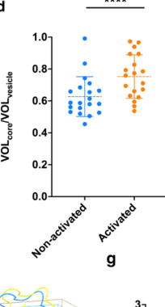

## Question

# Gene Research for Functional Annotation

## ⚠️ CRITICAL: Gene/Protein Identification Context

**BEFORE YOU BEGIN RESEARCH:** You MUST verify you are researching the CORRECT gene/protein. Gene symbols can be ambiguous, especially for less well-characterized genes from non-model organisms.

### Target Gene/Protein Identity (from UniProt):
- **UniProt Accession:** P13727
- **Protein Description:** RecName: Full=Bone marrow proteoglycan; Short=BMPG; AltName: Full=Proteoglycan 2; Contains: RecName: Full=Eosinophil granule major basic protein; Short=EMBP; Short=MBP; AltName: Full=Pregnancy-associated major basic protein; Flags: Precursor;
- **Gene Information:** Name=PRG2; Synonyms=MBP;
- **Organism (full):** Homo sapiens (Human).
- **Protein Family:** Not specified in UniProt
- **Key Domains:** C-type_lectin-like. (IPR001304); C-type_lectin-like/link_sf. (IPR016186); C-type_lectin/snaclec_domain. (IPR050111); C-type_lectin_CS. (IPR018378); CTDL_fold. (IPR016187)

### MANDATORY VERIFICATION STEPS:

1. **Check if the gene symbol "PRG2" matches the protein description above**
2. **Verify the organism is correct:** Homo sapiens (Human).
3. **Check if protein family/domains align with what you find in literature**
4. **If you find literature for a DIFFERENT gene with the same or similar symbol, STOP**

### If Gene Symbol is Ambiguous or You Cannot Find Relevant Literature:

**DO NOT PROCEED WITH RESEARCH ON A DIFFERENT GENE.** Instead:
- State clearly: "The gene symbol 'PRG2' is ambiguous or literature is limited for this specific protein"
- Explain what you found (e.g., "Found extensive literature on a different gene with the same symbol in a different organism")
- Describe the protein based ONLY on the UniProt information provided above
- Suggest that the protein function can be inferred from domain/family information

### Research Target:

Please provide a comprehensive research report on the gene **PRG2** (gene ID: PRG2, UniProt: P13727) in human.

The research report should be a detailed narrative explaining the function, biological processes, and localization of the gene product. Citations should be given for all claims.

You should prioritize authoritative reviews and primary scientific literature when conducting research. You can supplement
this with annotations you find in gene/protein databases, but these can be outdated or inaccurate.

We are specifically interested in the primary function of the gene - for enzymes, what reaction is catalyzed, and what is the substrate specificity? For transporters, what is the substrate? For structural proteins or adapters, what is the broader structural role? For signaling molecules, what is the role in the pathway.

We are interested in where in or outside the cell the gene product carries out its function.

We are also interested in the signaling or biochemical pathways in which the gene functions. We are less interested in broad pleiotropic effects, except where these elucidate the precise role.

Include evidence where possible. We are interested in both experimental evidence as well as inference from structure, evolution, or bioinformatic analysis. Precise studies should be prioritized over high-throughput, where available.

## Output

Question: You are an expert researcher providing comprehensive, well-cited information.

Provide detailed information focusing on:
1. Key concepts and definitions with current understanding
2. Recent developments and latest research (prioritize 2023-2024 sources)
3. Current applications and real-world implementations
4. Expert opinions and analysis from authoritative sources
5. Relevant statistics and data from recent studies

Format as a comprehensive research report with proper citations. Include URLs and publication dates where available.
Always prioritize recent, authoritative sources and provide specific citations for all major claims.

# Gene Research for Functional Annotation

## ⚠️ CRITICAL: Gene/Protein Identification Context

**BEFORE YOU BEGIN RESEARCH:** You MUST verify you are researching the CORRECT gene/protein. Gene symbols can be ambiguous, especially for less well-characterized genes from non-model organisms.

### Target Gene/Protein Identity (from UniProt):
- **UniProt Accession:** P13727
- **Protein Description:** RecName: Full=Bone marrow proteoglycan; Short=BMPG; AltName: Full=Proteoglycan 2; Contains: RecName: Full=Eosinophil granule major basic protein; Short=EMBP; Short=MBP; AltName: Full=Pregnancy-associated major basic protein; Flags: Precursor;
- **Gene Information:** Name=PRG2; Synonyms=MBP;
- **Organism (full):** Homo sapiens (Human).
- **Protein Family:** Not specified in UniProt
- **Key Domains:** C-type_lectin-like. (IPR001304); C-type_lectin-like/link_sf. (IPR016186); C-type_lectin/snaclec_domain. (IPR050111); C-type_lectin_CS. (IPR018378); CTDL_fold. (IPR016187)

### MANDATORY VERIFICATION STEPS:

1. **Check if the gene symbol "PRG2" matches the protein description above**
2. **Verify the organism is correct:** Homo sapiens (Human).
3. **Check if protein family/domains align with what you find in literature**
4. **If you find literature for a DIFFERENT gene with the same or similar symbol, STOP**

### If Gene Symbol is Ambiguous or You Cannot Find Relevant Literature:

**DO NOT PROCEED WITH RESEARCH ON A DIFFERENT GENE.** Instead:
- State clearly: "The gene symbol 'PRG2' is ambiguous or literature is limited for this specific protein"
- Explain what you found (e.g., "Found extensive literature on a different gene with the same symbol in a different organism")
- Describe the protein based ONLY on the UniProt information provided above
- Suggest that the protein function can be inferred from domain/family information

### Research Target:

Please provide a comprehensive research report on the gene **PRG2** (gene ID: PRG2, UniProt: P13727) in human.

The research report should be a detailed narrative explaining the function, biological processes, and localization of the gene product. Citations should be given for all claims.

You should prioritize authoritative reviews and primary scientific literature when conducting research. You can supplement
this with annotations you find in gene/protein databases, but these can be outdated or inaccurate.

We are specifically interested in the primary function of the gene - for enzymes, what reaction is catalyzed, and what is the substrate specificity? For transporters, what is the substrate? For structural proteins or adapters, what is the broader structural role? For signaling molecules, what is the role in the pathway.

We are interested in where in or outside the cell the gene product carries out its function.

We are also interested in the signaling or biochemical pathways in which the gene functions. We are less interested in broad pleiotropic effects, except where these elucidate the precise role.

Include evidence where possible. We are interested in both experimental evidence as well as inference from structure, evolution, or bioinformatic analysis. Precise studies should be prioritized over high-throughput, where available.

# Research Report: Human PRG2 (UniProt P13727) Functional Annotation (Major Basic Protein-1 / Bone Marrow Proteoglycan)

## Executive summary
PRG2 encodes eosinophil granule **major basic protein-1 (MBP-1)**, produced as a 222-aa precursor (**proMBP-1**, also described as bone marrow proteoglycan-2) and processed by removal of an acidic N-terminal propiece to yield a 117-aa, highly cationic mature toxin (pI ~11.4; net charge ~+15 at pH 7). (yang2024insitucrystalline pages 1-5, yang2024insitucrystalline pages 14-18). A key contemporary insight is that eosinophils store MBP-1 as **nanocrystals within secretory granules**, which appear to neutralize toxicity intracellularly and undergo activation-dependent structural remodeling and extrusion upon stimulation (including IL-33). (yang2024insitucrystalline pages 1-5, yang2024insitucrystalline pages 11-14, yang2024insitucrystalline media fbcec939). In disease contexts, MBP deposition is implicated in airway epithelial injury and remodeling in asthma, and PRG2 genetic variation can influence eosinophil morphology and even eosinophil counts in humans. (steffan2024eosinophilepithelialcellinteractions pages 11-12, marongiu2023gwasofgenetic pages 4-5).

## 1. Key concepts and definitions (current understanding)

### 1.1 Correct gene/protein identity verification
The gene symbol **PRG2** in humans corresponds to **proteoglycan 2** and the eosinophil granule toxin **major basic protein-1 (MBP-1; EMBP)**, matching the UniProt P13727 description provided in the prompt. This identity is explicitly used in recent structural and genetic literature. (yang2024insitucrystalline pages 1-5, marongiu2023gwasofgenetic pages 4-5).

### 1.2 Precursor, processing, and biochemical properties
PRG2 is synthesized as **proMBP-1 (222 residues)** containing an **acidic N-terminal propiece** and a highly basic C-terminal CTL-like domain that becomes the mature MBP-1 after propiece cleavage. Mature MBP-1 is reported as **117 residues**, **pI ~11.4**, with **net charge ~+15 at pH 7**. (yang2024insitucrystalline pages 1-5, yang2024insitucrystalline pages 14-18). Functionally, this precursor strategy is consistent with intracellular neutralization of a potent cationic cytotoxin until it is packaged for controlled release. (yang2024insitucrystalline pages 1-5).

### 1.3 Domain architecture and structure
MBP-1 adopts an **unusual C-type lectin-like (CTL) fold**. The in situ granular structure (PDB **9DKZ**) comprises two main α-helices, seven β-strands, six loops, and disulfide bonds stabilizing the CTL topology. (yang2024insitucrystalline pages 44-49, yang2024insitucrystalline media 34e1adf2). A key mechanistic feature is a loop pocket (including a cis-Pro190 stabilized by proline–aromatic interactions) that contributes to crystal packing and differs from prior purified/in vitro forms. (yang2024insitucrystalline pages 14-18, yang2024insitucrystalline pages 11-14).

### 1.4 Subcellular localization and storage form
MBP-1 forms the **dense nanocrystalline core** of **eosinophil secretory granules (SGr)** and is stored as **nanocrystals** in resting cells. (yang2024insitucrystalline pages 1-5, yang2024insitucrystalline pages 11-14). Activated eosinophils can show **free, membrane-less crystalline cores**, consistent with crystal extrusion during degranulation. (yang2024insitucrystalline pages 5-8).

## 2. Recent developments (prioritizing 2023–2024)

### 2.1 2024: In situ MBP-1 nanocrystal structure and activation-dependent remodeling
A major advance is the **in situ crystalline structure** of human MBP-1 directly inside secretory granules using correlative cryo-electron tomography and MicroED, resolving how MBP-1 packs and stabilizes into nanocrystals and how activation leads to remodeling and extrusion. (yang2024insitucrystalline pages 1-5, yang2024insitucrystalline pages 44-49, yang2024insitucrystalline pages 5-8).

Quantitatively, IL-33 activation is associated with an increased **nanocrystal volume fraction** within granules: **VOLcore/VOLvesicle = 0.62 ± 0.12** (non-activated) vs **0.75 ± 0.13** (activated). (yang2024insitucrystalline media fbcec939). These data support a model where crystal expansion/disassembly is coupled to degranulation and release. (yang2024insitucrystalline pages 11-14, yang2024insitucrystalline media fbcec939).

### 2.2 2023: Human genetics linking PRG2 sequence variation to eosinophil morphology
A 2023 GWAS in Sardinians identified PRG2 (MBP-1) as the locus for a strong signal affecting eosinophil morphology. A Sardinian-specific nonsynonymous variant **PRG2 p.Ser148Pro** was associated with altered eosinophil granularity/morphology; homozygotes for **rs769591668-C** were reported to have absent or very low eosinophil counts. Mechanistic modeling suggested altered protein dynamics and contact networks (e.g., disrupted Tyr109 contact and altered solvent exposure of Asp176). (marongiu2023gwasofgenetic pages 4-5, marongiu2023gwasofgenetic pages 7-7).

### 2.3 2024: Linking MBP-1 expression to eosinophil-like differentiation programs
In a 2024 study of eosinophil differentiation regulation by the lncRNA **ITGB2-AS1**, stable knockdown in HL-60c15 cells differentiated toward eosinophil-like cells caused loss of specific granules and reduced staining for granule proteins including **MBP-1 (PRG2)**. (fettrelet2024evidencefora pages 2-4, fettrelet2024evidencefora pages 13-15). This supports the use of PRG2/MBP-1 as a functional differentiation marker tied to granule biogenesis rather than only a bystander product. (fettrelet2024evidencefora pages 13-15).

## 3. Molecular functions, mechanisms, and pathways

### 3.1 Cytotoxic effector function and why crystallization matters
Soluble MBP-1 is described as **cytotoxic** and **membrane-disruptive**, whereas **proMBP-1** and **isolated nanocrystalline cores** of MBP-1 are reported as **nontoxic**, indicating that precursor neutralization plus crystallization are key protective strategies inside the eosinophil. (yang2024insitucrystalline pages 1-5, yang2024insitucrystalline pages 14-18).

### 3.2 Granule biology pathway: IL-33 → structural remodeling → degranulation
IL-33 activation is linked to directional lattice expansion and nanocrystal disassembly, accompanying release of granule contents via piecemeal degranulation and/or compound exocytosis. (yang2024insitucrystalline pages 11-14). The measured increase in crystal-to-granule volume fraction provides quantitative support that crystal physical state changes during activation. (yang2024insitucrystalline media fbcec939).

### 3.3 Tissue-level mechanism: MBP-driven epithelial injury and remodeling in asthma
A 2024 asthma-focused review describes MBP (PRG2) as a mediator of airway epithelial injury: classical experiments showed MBP-induced ciliostasis, ciliary exfoliation, epithelial disruption/detachment, and similarities to epithelial damage observed in asthma. MBP deposition has been reported on damaged bronchial epithelium including fatal asthma cases, supporting clinical relevance. (steffan2024eosinophilepithelialcellinteractions pages 11-12). Beyond direct toxicity, at sub-cytotoxic concentrations MBP can increase epithelial remodeling mediators (e.g., ET-1 and PDGF-related signals) and remodeling-associated genes/proteins (including MMP9), consistent with a role in airway remodeling and hyperreactivity. (steffan2024eosinophilepithelialcellinteractions pages 11-12).

## 4. Current applications and real-world implementations

### 4.1 Structural biology implementation: in situ MicroED/cryo-ET for PRG2 nanocrystals
The 2024 in situ study provides a real-world workflow for functional annotation: cryo-FIB milling, MicroED diffraction, and montage cryo-ET to connect subcellular context with near-atomic structure of PRG2/MBP-1 in its native storage form. (yang2024insitucrystalline pages 5-8, yang2024insitucrystalline media 34e1adf2).

### 4.2 Proteomics and biomarker-style measurement in human cohorts
- **Neonatal hypoxic–ischemic encephalopathy (HIE) plasma proteomics (2023):** PRG2 (P13727; bone marrow proteoglycan) was the **only significantly down-regulated protein** when comparing therapeutic-hypothermia-treated moderate–severe HIE newborns with favorable vs unfavorable outcomes (**log2FC −0.72; p = 3.80×10−2; 2 peptides identified**). (yip2023newbornswithfavourable pages 12-14). This shows PRG2 can be quantitated by LC–MS/MS workflows and may reflect systemic inflammatory/immune state differences.
- **Twin-to-twin transfusion syndrome (TTTS) amniotic fluid proteomics (2020):** PRG2 (P13727) was identified as differentially expressed in discovery proteomics, reported with **STN −2.2; p = 0.004**, with negative STN indicating higher abundance in donor AF in that analysis framework. (kim2020theamnioticfluid pages 6-7). While not a PRG2-focused study, it provides evidence that PRG2 is detectable and variable in clinical biofluids.

### 4.3 Experimental assay implementation for functional studies
The 2024 HL-60 differentiation study reports practical PRG2 measurement via confocal immunofluorescence using monoclonal anti-PRG2 and quantification of per-cell mean fluorescence intensity, illustrating a tractable assay for PRG2 protein in differentiation studies. (fettrelet2024evidencefora pages 7-9).

## 5. Expert opinions and analysis (authoritative synthesis)

### 5.1 Structure–function perspective
The 2024 in situ structural analysis supports a modern view that PRG2 biology is inseparable from its **physical state** (soluble vs crystalline) and **subcellular packaging** (granule nanocrystal), with activation-dependent changes in crystal packing and volume consistent with a regulated release mechanism. (yang2024insitucrystalline pages 1-5, yang2024insitucrystalline media fbcec939).

### 5.2 Disease-mechanism perspective
The 2024 asthma review provides an expert synthesis linking MBP (PRG2) to airway epithelial injury and remodeling programs, implying PRG2 products are not just eosinophil markers but plausible causal mediators in type-2 airway pathology. (steffan2024eosinophilepithelialcellinteractions pages 11-12).

## 6. Key statistics and quantitative data (recent and representative)
- Mature MBP-1 biochemical properties: **117 aa; pI ~11.4; net +15 (pH 7)**. (yang2024insitucrystalline pages 1-5).
- Activation-associated crystal remodeling: granule nanocrystal volume fraction **0.62 ± 0.12 (resting) vs 0.75 ± 0.13 (IL-33 activated)**. (yang2024insitucrystalline media fbcec939).
- Human genetics: PRG2 **p.Ser148Pro** variant linked to eosinophil morphology; **rs769591668-C homozygotes** associated with absent/very low eosinophil counts. (marongiu2023gwasofgenetic pages 4-5).
- Clinical proteomics association: HIE favorable vs unfavorable outcome comparison shows PRG2 **log2FC −0.72; p=3.80×10−2**. (yip2023newbornswithfavourable pages 12-14).

## Summary table
The table below consolidates identity, structure, localization, mechanism, and 2023–2024 highlights.

| Aspect | Key points | Evidence |
|---|---|---|
| Verified identity | Human **PRG2** corresponds to **proteoglycan 2 / eosinophil granule major basic protein-1 (MBP-1)**; literature also refers to the precursor as **proMBP-1** and **bone marrow proteoglycan-2**. Marongiu 2023 explicitly identifies PRG2 as eosinophil granule major basic protein (MBP-1). | (yang2024insitucrystalline pages 1-5, marongiu2023gwasofgenetic pages 4-5) |
| Precursor processing | PRG2 is produced as a **222-residue precursor (proMBP-1)** that matures by **cleavage of an acidic N-terminal propiece**, yielding the **117-residue mature MBP-1**, which is highly cationic (**pI ~11.4; net charge about +15 at pH 7**). The propiece hinders intermolecular interactions needed for crystal packing. | (yang2024insitucrystalline pages 1-5, yang2024insitucrystalline pages 14-18, yang2024insitucrystalline pages 49-52) |
| Domain architecture / fold | Mature MBP-1 adopts an **unusual C-type lectin-like (CTL) fold**. The in situ structure contains **2 main α-helices, 7 β-strands, 6 loops**, and **2 disulfide bonds (Cys125-Cys220 and Cys197-Cys212)**. | (yang2024insitucrystalline pages 1-5, yang2024insitucrystalline pages 44-49) |
| Carbohydrate-binding region | MBP-1 retains a **CTL-like carbohydrate-binding region**, but the in situ granule form lacks the canonical acidic residues for **Ca2+-dependent carbohydrate binding**, explaining loss of canonical lectin behavior. By contrast, purified/recrystallized MBP-1 can bind **sulfated sugars such as heparin**. | (yang2024insitucrystalline pages 14-18, yang2024insitucrystalline pages 11-14, yang2024insitucrystalline pages 5-8) |
| Key structural determinants | A distinctive **L4/L3 loop pocket** stabilizes **cis-Pro190** through **proline-aromatic interactions** involving residues such as **Trp185** and **Trp191**; these features contribute to **crystal packing**. Local conformational differences distinguish the in situ granule form from prior in vitro crystal structures. | (yang2024insitucrystalline pages 44-49, yang2024insitucrystalline pages 14-18, yang2024insitucrystalline pages 11-14, yang2024insitucrystalline pages 49-52) |
| Subcellular localization | MBP-1 is localized to **eosinophil secretory granules (SGr)**, where it forms the **electron-dense crystalline core** of the granule. Expression data cited in Marongiu 2023 place PRG2 in **granulocytes/eosinophils**. | (yang2024insitucrystalline pages 1-5, marongiu2023gwasofgenetic pages 4-5, yang2024insitucrystalline pages 11-14) |
| Storage form | In resting eosinophils, MBP-1 is stored as **dense nanocrystals**; activated cells can show **membrane-less/free crystalline cores**. The crystal occupies a large fraction of the granule volume, increasing from **0.62 ± 0.12** in non-activated granules to **0.75 ± 0.13** in activated granules. | (yang2024insitucrystalline pages 1-5, yang2024insitucrystalline pages 11-14, yang2024insitucrystalline pages 5-8, yang2024insitucrystalline media fbcec939) |
| Functional rationale for crystallization | **Soluble MBP-1 is cytotoxic and membrane-disruptive**, whereas **proMBP-1** and the **isolated nanocrystalline cores** are reported as **nontoxic**. This supports the idea that intracellular crystallization protects eosinophils from the protein's non-selective toxicity until release. | (yang2024insitucrystalline pages 1-5, yang2024insitucrystalline pages 14-18) |
| Release / degranulation mechanism | IL33 activation is associated with **directional lattice expansion**, **nanocrystal disassembly**, and **extrusion/release** of MBP-1 crystals during eosinophil degranulation, including **piecemeal degranulation** and **compound exocytosis**. Free crystals in activated cells diffract to about **3 Å**. | (yang2024insitucrystalline pages 11-14, yang2024insitucrystalline pages 5-8, yang2024insitucrystalline media fbcec939) |
| Additional molecular interactions | **proMBP-1** can form a complex with **PAPP-A** through interactions involving **proline-rich motifs** in PAPP-A; this is structurally distinct from the granule crystal-packing interactions of mature MBP-1. | (yang2024insitucrystalline pages 14-18, yang2024insitucrystalline pages 49-52) |
| 2024 structural advance | Yang 2024 reported the **first in situ structure of crystalline human gMBP-1 within secretory granules**, using **cryo-ET, cryo-FIB, and MicroED**. The granule structure was solved at about **3.2 Å merged-map resolution** and deposited as **PDB 9DKZ**. | (yang2024insitucrystalline pages 44-49, yang2024insitucrystalline pages 5-8, yang2024insitucrystalline media 1e43939b, yang2024insitucrystalline media 34e1adf2) |
| 2023 human genetics advance | Marongiu 2023 identified a Sardinian **PRG2 p.Ser148Pro** variant associated with altered **eosinophil morphology/reduced granularity** and reported that **homozygotes for rs769591668-C** had **absent or very low eosinophil counts**. Modeling suggested altered atomic fluctuations, disrupted Tyr109 contact, and increased Asp176 solvent exposure. | (marongiu2023gwasofgenetic pages 4-5, marongiu2023gwasofgenetic pages 7-7) |
| Overall current understanding | PRG2 encodes a **granule-packaged eosinophil effector protein** whose biology depends on **precursor neutralization**, **crystalline intragranular storage**, and **activation-triggered crystal remodeling/release**. Recent structural and human-variant studies link its **molecular architecture** directly to **granule packing, eosinophil morphology, and degranulation behavior**. | (yang2024insitucrystalline pages 1-5, marongiu2023gwasofgenetic pages 4-5, yang2024insitucrystalline pages 11-14, yang2024insitucrystalline media 34e1adf2) |

*Table: This table compiles the key verified facts for human PRG2/MBP-1 from the provided 2023-2024 evidence only. It is useful as a compact reference for identity, structure, localization, mechanism, and recent developments directly tied to the cited sources.*

## Source URLs (with publication dates)
- Yang JE et al. **In situ crystalline structure of the human eosinophil major basic protein-1.** bioRxiv (posted Oct 2024). https://doi.org/10.1101/2024.10.09.617336 (yang2024insitucrystalline pages 1-5).
- Marongiu M et al. **GWAS… influence of chromosome 11 innate immunity gene cluster on eosinophil morphology.** Human Molecular Genetics (Sep 2023). https://doi.org/10.1093/hmg/ddac238 (marongiu2023gwasofgenetic pages 4-5).
- Steffan BN et al. **Eosinophil-Epithelial Cell Interactions in Asthma.** Int Arch Allergy Immunol (Jun 2024). https://doi.org/10.1159/000539309 (steffan2024eosinophilepithelialcellinteractions pages 11-12).
- Fettrelet T et al. **Evidence for a Role of the Long Non-Coding RNA ITGB2-AS1 in Eosinophil Differentiation and Functions.** Cells (Nov 2024). https://doi.org/10.3390/cells13231936 (fettrelet2024evidencefora pages 2-4).
- Yip PK et al. **Newborns with favourable outcomes after perinatal asphyxia…** Biomolecules (Sep 2023). https://doi.org/10.3390/biom13101471 (yip2023newbornswithfavourable pages 12-14).
- Kim SM et al. **The Amniotic Fluid Proteome Differs… TTTS.** J Korean Med Sci (Feb 2020). https://doi.org/10.3346/jkms.2020.35.e73 (kim2020theamnioticfluid pages 6-7).

References

1. (yang2024insitucrystalline pages 1-5): Jie E. Yang, Joshua M. Mitchell, Craig A. Bingman, Deane F. Mosher, and Elizabeth R. Wright. In situ crystalline structure of the human eosinophil major basic protein-1. bioRxiv, Oct 2024. URL: https://doi.org/10.1101/2024.10.09.617336, doi:10.1101/2024.10.09.617336. This article has 4 citations.

2. (yang2024insitucrystalline pages 14-18): Jie E. Yang, Joshua M. Mitchell, Craig A. Bingman, Deane F. Mosher, and Elizabeth R. Wright. In situ crystalline structure of the human eosinophil major basic protein-1. bioRxiv, Oct 2024. URL: https://doi.org/10.1101/2024.10.09.617336, doi:10.1101/2024.10.09.617336. This article has 4 citations.

3. (yang2024insitucrystalline pages 11-14): Jie E. Yang, Joshua M. Mitchell, Craig A. Bingman, Deane F. Mosher, and Elizabeth R. Wright. In situ crystalline structure of the human eosinophil major basic protein-1. bioRxiv, Oct 2024. URL: https://doi.org/10.1101/2024.10.09.617336, doi:10.1101/2024.10.09.617336. This article has 4 citations.

4. (yang2024insitucrystalline media fbcec939): Jie E. Yang, Joshua M. Mitchell, Craig A. Bingman, Deane F. Mosher, and Elizabeth R. Wright. In situ crystalline structure of the human eosinophil major basic protein-1. bioRxiv, Oct 2024. URL: https://doi.org/10.1101/2024.10.09.617336, doi:10.1101/2024.10.09.617336. This article has 4 citations.

5. (steffan2024eosinophilepithelialcellinteractions pages 11-12): Breanne N. Steffan, Elizabeth A. Townsend, Loren C. Denlinger, and Mats W. Johansson. Eosinophil-epithelial cell interactions in asthma. International Archives of Allergy and Immunology, 185:1033-1047, Jun 2024. URL: https://doi.org/10.1159/000539309, doi:10.1159/000539309. This article has 14 citations and is from a peer-reviewed journal.

6. (marongiu2023gwasofgenetic pages 4-5): Michele Marongiu, Gonzalo Pérez-Mejías, Valeria Orrù, Maristella Steri, Carlo Sidore, Antonio Díaz-Quintana, Antonella Mulas, Fabio Busonero, Andrea Maschio, Klaudia Walter, Manuel Tardaguila, Parsa Akbari, Nicole Soranzo, Edoardo Fiorillo, Myriam Gorospe, David Schlessinger, Irene Díaz-Moreno, Francesco Cucca, and Magdalena Zoledziewska. Gwas of genetic factors affecting white blood cell morphological parameters in sardinians uncovers influence of chromosome 11 innate immunity gene cluster on eosinophil morphology. Sep 2023. URL: https://doi.org/10.1093/hmg/ddac238, doi:10.1093/hmg/ddac238. This article has 5 citations and is from a domain leading peer-reviewed journal.

7. (yang2024insitucrystalline pages 44-49): Jie E. Yang, Joshua M. Mitchell, Craig A. Bingman, Deane F. Mosher, and Elizabeth R. Wright. In situ crystalline structure of the human eosinophil major basic protein-1. bioRxiv, Oct 2024. URL: https://doi.org/10.1101/2024.10.09.617336, doi:10.1101/2024.10.09.617336. This article has 4 citations.

8. (yang2024insitucrystalline media 34e1adf2): Jie E. Yang, Joshua M. Mitchell, Craig A. Bingman, Deane F. Mosher, and Elizabeth R. Wright. In situ crystalline structure of the human eosinophil major basic protein-1. bioRxiv, Oct 2024. URL: https://doi.org/10.1101/2024.10.09.617336, doi:10.1101/2024.10.09.617336. This article has 4 citations.

9. (yang2024insitucrystalline pages 5-8): Jie E. Yang, Joshua M. Mitchell, Craig A. Bingman, Deane F. Mosher, and Elizabeth R. Wright. In situ crystalline structure of the human eosinophil major basic protein-1. bioRxiv, Oct 2024. URL: https://doi.org/10.1101/2024.10.09.617336, doi:10.1101/2024.10.09.617336. This article has 4 citations.

10. (marongiu2023gwasofgenetic pages 7-7): Michele Marongiu, Gonzalo Pérez-Mejías, Valeria Orrù, Maristella Steri, Carlo Sidore, Antonio Díaz-Quintana, Antonella Mulas, Fabio Busonero, Andrea Maschio, Klaudia Walter, Manuel Tardaguila, Parsa Akbari, Nicole Soranzo, Edoardo Fiorillo, Myriam Gorospe, David Schlessinger, Irene Díaz-Moreno, Francesco Cucca, and Magdalena Zoledziewska. Gwas of genetic factors affecting white blood cell morphological parameters in sardinians uncovers influence of chromosome 11 innate immunity gene cluster on eosinophil morphology. Sep 2023. URL: https://doi.org/10.1093/hmg/ddac238, doi:10.1093/hmg/ddac238. This article has 5 citations and is from a domain leading peer-reviewed journal.

11. (fettrelet2024evidencefora pages 2-4): Timothée Fettrelet, Aref Hosseini, Jacqueline Wyss, Joanna Boros-Majewska, Darko Stojkov, Shida Yousefi, and Hans-Uwe Simon. Evidence for a role of the long non-coding rna itgb2-as1 in eosinophil differentiation and functions. Cells, Nov 2024. URL: https://doi.org/10.3390/cells13231936, doi:10.3390/cells13231936. This article has 2 citations.

12. (fettrelet2024evidencefora pages 13-15): Timothée Fettrelet, Aref Hosseini, Jacqueline Wyss, Joanna Boros-Majewska, Darko Stojkov, Shida Yousefi, and Hans-Uwe Simon. Evidence for a role of the long non-coding rna itgb2-as1 in eosinophil differentiation and functions. Cells, Nov 2024. URL: https://doi.org/10.3390/cells13231936, doi:10.3390/cells13231936. This article has 2 citations.

13. (yip2023newbornswithfavourable pages 12-14): Ping K. Yip, Michael Bremang, Ian Pike, Vennila Ponnusamy, Adina T. Michael-Titus, and Divyen K. Shah. Newborns with favourable outcomes after perinatal asphyxia have upregulated glucose metabolism-related proteins in plasma. Biomolecules, 13:1471, Sep 2023. URL: https://doi.org/10.3390/biom13101471, doi:10.3390/biom13101471. This article has 4 citations.

14. (kim2020theamnioticfluid pages 6-7): Sun Min Kim, Byoung-Kyu Cho, Byoung Jae Kim, Ha Yun Lee, Errol R. Norwitz, Min Jueng Kang, Seung Mi Lee, Chan-Wook Park, Jong Kwan Jun, Eugene C. Yi, and Joong Shin Park. The amniotic fluid proteome differs significantly between donor and recipient fetuses in pregnancies complicated by twin-to-twin transfusion syndrome. Journal of Korean Medical Science, Feb 2020. URL: https://doi.org/10.3346/jkms.2020.35.e73, doi:10.3346/jkms.2020.35.e73. This article has 6 citations and is from a peer-reviewed journal.

15. (fettrelet2024evidencefora pages 7-9): Timothée Fettrelet, Aref Hosseini, Jacqueline Wyss, Joanna Boros-Majewska, Darko Stojkov, Shida Yousefi, and Hans-Uwe Simon. Evidence for a role of the long non-coding rna itgb2-as1 in eosinophil differentiation and functions. Cells, Nov 2024. URL: https://doi.org/10.3390/cells13231936, doi:10.3390/cells13231936. This article has 2 citations.

16. (yang2024insitucrystalline pages 49-52): Jie E. Yang, Joshua M. Mitchell, Craig A. Bingman, Deane F. Mosher, and Elizabeth R. Wright. In situ crystalline structure of the human eosinophil major basic protein-1. bioRxiv, Oct 2024. URL: https://doi.org/10.1101/2024.10.09.617336, doi:10.1101/2024.10.09.617336. This article has 4 citations.

17. (yang2024insitucrystalline media 1e43939b): Jie E. Yang, Joshua M. Mitchell, Craig A. Bingman, Deane F. Mosher, and Elizabeth R. Wright. In situ crystalline structure of the human eosinophil major basic protein-1. bioRxiv, Oct 2024. URL: https://doi.org/10.1101/2024.10.09.617336, doi:10.1101/2024.10.09.617336. This article has 4 citations.

## Artifacts

- [Edison artifact artifact-00](PRG2-deep-research-falcon_artifacts/artifact-00.md)

## Citations

1. yang2024insitucrystalline pages 1-5
2. yang2024insitucrystalline pages 5-8
3. fettrelet2024evidencefora pages 13-15
4. yang2024insitucrystalline pages 11-14
5. steffan2024eosinophilepithelialcellinteractions pages 11-12
6. yip2023newbornswithfavourable pages 12-14
7. kim2020theamnioticfluid pages 6-7
8. fettrelet2024evidencefora pages 7-9
9. marongiu2023gwasofgenetic pages 4-5
10. fettrelet2024evidencefora pages 2-4
11. yang2024insitucrystalline pages 14-18
12. yang2024insitucrystalline pages 44-49
13. marongiu2023gwasofgenetic pages 7-7
14. yang2024insitucrystalline pages 49-52
15. https://doi.org/10.1101/2024.10.09.617336
16. https://doi.org/10.1093/hmg/ddac238
17. https://doi.org/10.1159/000539309
18. https://doi.org/10.3390/cells13231936
19. https://doi.org/10.3390/biom13101471
20. https://doi.org/10.3346/jkms.2020.35.e73
21. https://doi.org/10.1101/2024.10.09.617336,
22. https://doi.org/10.1159/000539309,
23. https://doi.org/10.1093/hmg/ddac238,
24. https://doi.org/10.3390/cells13231936,
25. https://doi.org/10.3390/biom13101471,
26. https://doi.org/10.3346/jkms.2020.35.e73,