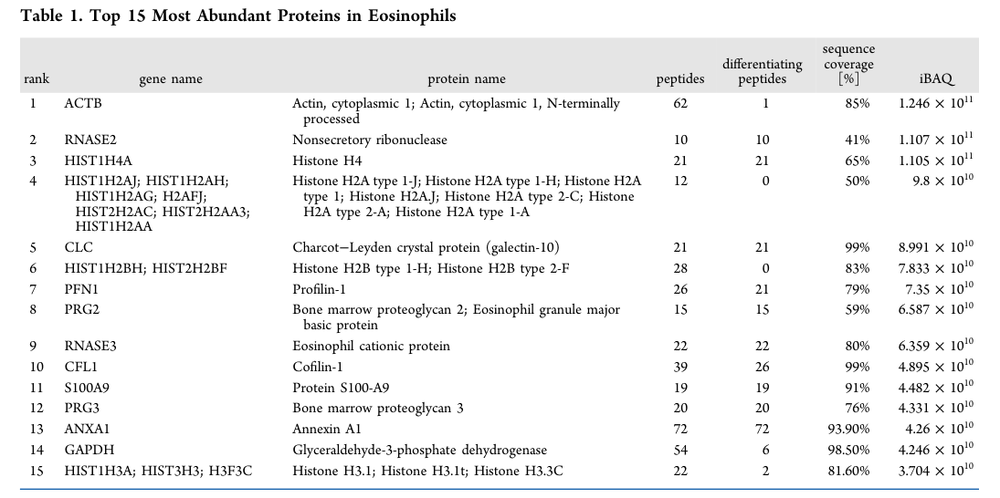

## Question

# Gene Research for Functional Annotation

## ⚠️ CRITICAL: Gene/Protein Identification Context

**BEFORE YOU BEGIN RESEARCH:** You MUST verify you are researching the CORRECT gene/protein. Gene symbols can be ambiguous, especially for less well-characterized genes from non-model organisms.

### Target Gene/Protein Identity (from UniProt):
- **UniProt Accession:** Q9Y2Y8
- **Protein Description:** RecName: Full=Proteoglycan 3; AltName: Full=Eosinophil major basic protein homolog; AltName: Full=Prepro-major basic protein homolog; Short=Prepro-MBPH; Flags: Precursor;
- **Gene Information:** Name=PRG3 {ECO:0000312|HGNC:HGNC:9363}; Synonyms=MBPH {ECO:0000303|PubMed:10318872, ECO:0000303|PubMed:11170744}; ORFNames=UNQ486/PRO1002;
- **Organism (full):** Homo sapiens (Human).
- **Protein Family:** Not specified in UniProt
- **Key Domains:** C-type_lectin-like. (IPR001304); C-type_lectin-like/link_sf. (IPR016186); C-type_lectin/snaclec_domain. (IPR050111); C-type_lectin_CS. (IPR018378); CTDL_fold. (IPR016187)

### MANDATORY VERIFICATION STEPS:

1. **Check if the gene symbol "PRG3" matches the protein description above**
2. **Verify the organism is correct:** Homo sapiens (Human).
3. **Check if protein family/domains align with what you find in literature**
4. **If you find literature for a DIFFERENT gene with the same or similar symbol, STOP**

### If Gene Symbol is Ambiguous or You Cannot Find Relevant Literature:

**DO NOT PROCEED WITH RESEARCH ON A DIFFERENT GENE.** Instead:
- State clearly: "The gene symbol 'PRG3' is ambiguous or literature is limited for this specific protein"
- Explain what you found (e.g., "Found extensive literature on a different gene with the same symbol in a different organism")
- Describe the protein based ONLY on the UniProt information provided above
- Suggest that the protein function can be inferred from domain/family information

### Research Target:

Please provide a comprehensive research report on the gene **PRG3** (gene ID: PRG3, UniProt: Q9Y2Y8) in human.

The research report should be a detailed narrative explaining the function, biological processes, and localization of the gene product. Citations should be given for all claims.

You should prioritize authoritative reviews and primary scientific literature when conducting research. You can supplement
this with annotations you find in gene/protein databases, but these can be outdated or inaccurate.

We are specifically interested in the primary function of the gene - for enzymes, what reaction is catalyzed, and what is the substrate specificity? For transporters, what is the substrate? For structural proteins or adapters, what is the broader structural role? For signaling molecules, what is the role in the pathway.

We are interested in where in or outside the cell the gene product carries out its function.

We are also interested in the signaling or biochemical pathways in which the gene functions. We are less interested in broad pleiotropic effects, except where these elucidate the precise role.

Include evidence where possible. We are interested in both experimental evidence as well as inference from structure, evolution, or bioinformatic analysis. Precise studies should be prioritized over high-throughput, where available.

## Output

Question: You are an expert researcher providing comprehensive, well-cited information.

Provide detailed information focusing on:
1. Key concepts and definitions with current understanding
2. Recent developments and latest research (prioritize 2023-2024 sources)
3. Current applications and real-world implementations
4. Expert opinions and analysis from authoritative sources
5. Relevant statistics and data from recent studies

Format as a comprehensive research report with proper citations. Include URLs and publication dates where available.
Always prioritize recent, authoritative sources and provide specific citations for all major claims.

# Gene Research for Functional Annotation

## ⚠️ CRITICAL: Gene/Protein Identification Context

**BEFORE YOU BEGIN RESEARCH:** You MUST verify you are researching the CORRECT gene/protein. Gene symbols can be ambiguous, especially for less well-characterized genes from non-model organisms.

### Target Gene/Protein Identity (from UniProt):
- **UniProt Accession:** Q9Y2Y8
- **Protein Description:** RecName: Full=Proteoglycan 3; AltName: Full=Eosinophil major basic protein homolog; AltName: Full=Prepro-major basic protein homolog; Short=Prepro-MBPH; Flags: Precursor;
- **Gene Information:** Name=PRG3 {ECO:0000312|HGNC:HGNC:9363}; Synonyms=MBPH {ECO:0000303|PubMed:10318872, ECO:0000303|PubMed:11170744}; ORFNames=UNQ486/PRO1002;
- **Organism (full):** Homo sapiens (Human).
- **Protein Family:** Not specified in UniProt
- **Key Domains:** C-type_lectin-like. (IPR001304); C-type_lectin-like/link_sf. (IPR016186); C-type_lectin/snaclec_domain. (IPR050111); C-type_lectin_CS. (IPR018378); CTDL_fold. (IPR016187)

### MANDATORY VERIFICATION STEPS:

1. **Check if the gene symbol "PRG3" matches the protein description above**
2. **Verify the organism is correct:** Homo sapiens (Human).
3. **Check if protein family/domains align with what you find in literature**
4. **If you find literature for a DIFFERENT gene with the same or similar symbol, STOP**

### If Gene Symbol is Ambiguous or You Cannot Find Relevant Literature:

**DO NOT PROCEED WITH RESEARCH ON A DIFFERENT GENE.** Instead:
- State clearly: "The gene symbol 'PRG3' is ambiguous or literature is limited for this specific protein"
- Explain what you found (e.g., "Found extensive literature on a different gene with the same symbol in a different organism")
- Describe the protein based ONLY on the UniProt information provided above
- Suggest that the protein function can be inferred from domain/family information

### Research Target:

Please provide a comprehensive research report on the gene **PRG3** (gene ID: PRG3, UniProt: Q9Y2Y8) in human.

The research report should be a detailed narrative explaining the function, biological processes, and localization of the gene product. Citations should be given for all claims.

You should prioritize authoritative reviews and primary scientific literature when conducting research. You can supplement
this with annotations you find in gene/protein databases, but these can be outdated or inaccurate.

We are specifically interested in the primary function of the gene - for enzymes, what reaction is catalyzed, and what is the substrate specificity? For transporters, what is the substrate? For structural proteins or adapters, what is the broader structural role? For signaling molecules, what is the role in the pathway.

We are interested in where in or outside the cell the gene product carries out its function.

We are also interested in the signaling or biochemical pathways in which the gene functions. We are less interested in broad pleiotropic effects, except where these elucidate the precise role.

Include evidence where possible. We are interested in both experimental evidence as well as inference from structure, evolution, or bioinformatic analysis. Precise studies should be prioritized over high-throughput, where available.

## Research Report: Human PRG3 (Proteoglycan 3 / MBP2 / MBPH) — Functional Annotation

### Scope, identity verification, and nomenclature
The target protein is **human PRG3**, UniProt **Q9Y2Y8**, described as **proteoglycan 3** and also known as **eosinophil major basic protein homolog** (MBPH) / **major basic protein 2 (MBP2)**, synthesized as a **precursor (prepro-protein)**. In the foundational synthesis describing discovery/characterization of the human MBP homolog, the authors map the gene encoding “**hMBP2**” to the **chromosome 11q12 region** and explicitly connect it to **PRG3**, distinguishing it from **PRG2**, which encodes the canonical eosinophil major basic protein (**MBP1**). (plager2001anovelhuman pages 1-2, plager2001anovelhuman pages 2-4)

PRG3/MBP2 is a **distinct paralog** of PRG2/MBP1 with notable physicochemical differences: MBP2 has a substantially lower calculated **isoelectric point (~8.7)** than MBP1 (~11.4), implying reduced cationicity and generally reduced potency in several in vitro activities relative to MBP1. (plager2001anovelhuman pages 1-2, weyer2011placentalregulationof pages 2-3)

### 1) Key concepts and definitions (current understanding)

#### What kind of protein is PRG3?
PRG3 encodes **major basic protein 2 (MBP2)**, a member of the MBP family of eosinophil granule proteins that adopt a **C-type lectin-like fold** (lectin-like structural homology rather than canonical Ca2+-dependent lectin activity). The MBP family is best understood as **cationic secretory/granule effector proteins** that can damage membranes and stimulate immune and stromal cells; no enzymatic reaction has been assigned to MBP family proteins (including MBP1 and MBP2). (plager2001anovelhuman pages 8-10)

#### Prepro-protein processing and why it matters
MBP family members are produced as **precursors** and undergo **proteolytic processing**; a **pro-peptide** is proposed to protect the producer cell by masking the mature basic domain during trafficking (e.g., preventing premature binding to glycosylated targets). (jenvey2021bioinformaticanalysisof pages 4-5, gazendam2016impairedkillingof pages 8-9)

#### Relationship to PRG2/MBP1
PRG3/MBP2 and PRG2/MBP1 share key structural features (disulfide bonds, conserved cystines) consistent with a shared fold, but differ in transcriptional regulation, abundance, charge, and tissue-expression patterns. (plager2001anovelhuman pages 4-5, plager2001anovelhuman pages 1-2)

### 2) Subcellular localization and expression

#### Granule localization in eosinophils
PRG3/MBP2 is localized to the **eosinophil secondary (specific) granule**, supported by biochemical identification in granule lysates and immunologic localization assays discussed in the foundational characterization/review. (plager2001anovelhuman pages 4-5, plager2001anovelhuman pages 5-7)

Proteomic profiling of purified **human peripheral blood eosinophils** further supports that PRG3 is a prominent eosinophil constituent: PRG3 (“bone marrow proteoglycan 3”) is among the **six major eosinophil granule proteins** and appears among the **top 15 most abundant eosinophil proteins**. (wilkerson2016theperipheralblood pages 4-5)

A key visual summary (Table 1) from this eosinophil proteome work lists PRG3 among the **top 15 most abundant proteins** detected in eosinophils. (wilkerson2016theperipheralblood media e50abd7c)

#### Cell-type specificity
In the foundational synthesis, PRG3/MBP2 expression is described as more **restricted** than PRG2/MBP1 (which is detected in eosinophils, basophils, and placenta). PRG3/MBP2 mRNA was reported as detectable mainly in bone marrow/eosinophil-lineage contexts and not established as a placental pregnancy-serum protein. (plager2001anovelhuman pages 1-2, weyer2011placentalregulationof pages 2-3)

### 3) Molecular function: experimental evidence and mechanistic interpretation

#### Cytotoxic and cytostimulatory activity
The most direct functional evidence for PRG3/MBP2 presented in the foundational synthesis is that **MBP2 is cytotoxic to human K562 cells**, with **reduced potency** compared with MBP1; MBP2 is also described as **cytostimulatory**, activating multiple cell types similarly to MBP1 but often at lower potency. (plager2001anovelhuman pages 7-8)

#### Antimicrobial and membrane-disruptive activity (direct vs inferred)
MBP family proteins are classically associated with **membrane disruption** and antimicrobial/anti-parasite activities. In a granulocyte/phagosome proteomics study, MBPH/PRG3 is grouped with MBP family proteins described as capable of **membrane disintegration** and **antimicrobial activity**, and changes in phagosomal granule content (including MBPH/PRG3 and MBP) are linked to impaired **Candida albicans** yeast killing in mobilized granulocytes. (gazendam2016impairedkillingof pages 8-9)

However, the foundational MBP2 synthesis highlights that while MBP1 has demonstrated in vitro antimicrobial activities, MBP2’s antimicrobial activity was described as less established/“unknown” at that time, emphasizing that some functional claims for PRG3 remain partly **inferred by homology** rather than comprehensively validated by direct microbicidal assays. (plager2001anovelhuman pages 7-8)

#### Glycosaminoglycan binding and cell-surface interactions
MBP family proteins interact with **heparin/heparan sulfate glycosaminoglycans (GAGs)** and may bind cell surfaces via heparan sulfate proteoglycans; these properties are described for MBP/proMBP and used to explain cytotoxic/cytostimulatory mechanisms and receptor engagement. PRG3/MBP2 is described as having **similar biological activities** to MBP but with diminished potency, and thus is plausibly expected to share aspects of these interactions, but direct PRG3-specific binding constants/partners were not available in the retrieved excerpts. (weyer2011placentalregulationof pages 2-3)

#### Enzymatic activity
No enzymatic activity has been assigned to MBP1 or MBP2, supporting classification as a **non-enzymatic effector protein**. (plager2001anovelhuman pages 8-10)

### 4) Biological processes and pathways

PRG3 is best placed within the pathway context of **eosinophil differentiation, granule biogenesis, and degranulation-associated tissue inflammation**, acting as a stored granule effector released during eosinophil activation.

Regulatory context: promoter differences between PRG3 and PRG2 (e.g., missing C/EBP site in PRG3) have been proposed to contribute to **eosinophil-restricted and reduced PRG3 expression**. (weyer2011placentalregulationof pages 2-3)

Mechanistic pathway links for MBP family proteins include cell activation and inflammatory amplification (e.g., basophil activation pathways discussed for MBP1), but PRG3-specific signaling partners were not directly established in the retrieved texts and are therefore best treated as **family-level inferences**. (plager2001anovelhuman pages 7-8)

### 5) Recent developments (prioritizing 2023–2024)

#### 2023: Tissue proteomics in eosinophilic esophagitis (EoE) and treatment response
A 2023 clinical proteomics preprint analyzed **esophageal biopsies** from adults with eosinophilic esophagitis (EoE) before and after **8-week proton-pump inhibitor (PPI)** therapy and identified PRG3 among eosinophil granule-derived proteins differentially accumulated with successful treatment response. PRG3 was highlighted alongside other eosinophil granule proteins (**RNASE3, EPX, RNASE2**) as part of the inflammatory proteomic signature. (molinajimenez2023protonpumpinhibitor pages 10-13)

This study is notable because it reports that some eosinophil-granule proteins (including PRG3) were detectable by **proteomics** but were “undetectable at mRNA level” in prior transcriptomic analysis, supporting the practical utility of protein-level assays for eosinophilic inflammation biomarkers. (molinajimenez2023protonpumpinhibitor pages 10-13)

#### Database-integrated associations (context for newer multi-omics)
Open Targets (a target–disease evidence integration platform) lists PRG3 associations across multiple disease categories (e.g., hypertrophic cardiomyopathy; neoplasm; osteosarcoma; glioma; alcohol drinking), with literature PMIDs surfaced in evidence objects (e.g., 27058420, 22350417, 34594039). These should be interpreted as **integrated evidence signals** rather than definitive causal validation. (OpenTargets Search: -PRG3)

### 6) Current applications and real-world implementations

1. **Biomarker of eosinophil presence/degranulation (proteomics):** PRG3’s high abundance in eosinophils supports its use as a marker in proteomic panels assessing eosinophil content or prior degranulation; PRG3 appears among the top-abundance eosinophil proteins in deep proteomics. (wilkerson2016theperipheralblood pages 4-5, wilkerson2016theperipheralblood media e50abd7c)

2. **Clinical tissue proteomics for EoE treatment monitoring:** In EoE, PRG3 was among eosinophil granule proteins that tracked with therapeutic response to PPI, suggesting feasibility as part of a **response-associated proteomic signature**. (molinajimenez2023protonpumpinhibitor pages 10-13)

3. **Genetic association context:** PRG3 has appeared as a biologically plausible candidate gene in a Crohn’s disease susceptibility locus at 11q12.1, reflecting potential immune-cell biology contributions at that locus (though this is association-level and not a functional mechanism). (kenny2012agenomewidescan pages 1-2)

### 7) Relevant statistics and data (recent and foundational)

#### Abundance in eosinophils (proteomics)
In purified human peripheral blood eosinophils, PRG3 is listed among the **top 15 most abundant proteins**, ranked **#12** in the table image retrieved from Wilkerson et al. (2016). (wilkerson2016theperipheralblood media e50abd7c)

#### 2023 EoE proteomics: cohort size and treatment effect
In the 2023 EoE study, the cohort included **25 EoE patients** and **10 healthy controls**. Eight weeks of PPI therapy in responders reduced mean peak eosinophil count from **53.64 to 2.28 eosinophils/hpf** (**p<0.001**) and was associated with **166 differentially accumulated proteins** in responder post- vs pre-treatment comparisons (100 up, 66 down). PRG3 was among eosinophil granule-derived proteins meeting the study’s DAP thresholds (fold change >1.5; adjusted p ≤ 0.05), though PRG3-specific fold-change values were not present in the retrieved excerpt. (molinajimenez2023protonpumpinhibitor pages 10-13)

#### Crohn’s disease GWAS locus context (older but quantitative)
In an Ashkenazi Jewish Crohn’s disease GWAS, the 11q12.1 signal (candidate region including PRG3) included rs11229030 with a combined **OR ~1.15**, with discovery stage **907 cases / 2,345 controls** and replication **971 cases / 2,124 controls**; the authors report that replicated/new loci plus NOD2 coding variants explained **11.2%** of genetic variance in that cohort. (kenny2012agenomewidescan pages 1-2)

#### MBP2 vs MBP1 physicochemical/biological differences
Foundational synthesis reports MBP2 has lower predicted pI (**~8.7**) than MBP1 (**~11.4**) and is generally less potent in biological activities, consistent with reduced cationicity as a determinant of effector strength. (plager2001anovelhuman pages 1-2, weyer2011placentalregulationof pages 2-3)

### 8) Expert opinions and analysis (authoritative synthesis)

The most authoritative mechanistic framing in the retrieved corpus is the Immunological Reviews synthesis (2001), which treats MBP2/PRG3 as a bona fide eosinophil granule protein paralog whose in vivo roles likely overlap with, but are not identical to, MBP1. It emphasizes uncertainties that remain critical for functional annotation—especially the relative abundance of MBP2 in tissues/fluids, its specific antimicrobial potency, and whether its lower cationicity translates to different diffusion and tissue distribution during degranulation. (plager2001anovelhuman pages 5-7, plager2001anovelhuman pages 7-8)

The Biology of Reproduction review (2011) provides an expert synthesis differentiating PRG3/proMBP-2 from PRG2/proMBP in terms of expression context and placental/pregnancy-serum biology, reinforcing that PRG3 is primarily an eosinophil-lineage granule effector rather than a dominant placental circulating regulator. (weyer2011placentalregulationof pages 2-3)

### 9) Limitations of this evidence base and recommended next steps

* **Database retrieval limitation:** UniProt/InterPro/HGNC pages were not directly ingested via tools in this session; interpretations of domain architecture and “precursor” status are supported indirectly by peer-reviewed synthesis and the user-provided UniProt identity plus evidence about MBP family precursor processing. (jenvey2021bioinformaticanalysisof pages 4-5, plager2001anovelhuman pages 1-2)

* **PRG3-specific molecular partners remain under-defined in retrieved texts:** Many mechanistic partners and receptor-level effects are demonstrated for MBP1/proMBP1, while PRG3/MBP2 is often described as “similar but less potent,” leaving gaps in PRG3-specific interactomics and structure–function mapping. (weyer2011placentalregulationof pages 2-3, plager2001anovelhuman pages 7-8)

* **2023–2024 PRG3-specific literature is relatively sparse in this retrieval:** The strongest recent PRG3-explicit evidence obtained is clinical tissue proteomics in EoE; further work should examine newer peer-reviewed versions (e.g., 2024 journal publication of the EoE proteomics) and targeted functional studies of purified MBP2. (molinajimenez2023protonpumpinhibitor pages 10-13)

---

### Evidence summary table

| Year | Source type | System/tissue | Key PRG3-related findings (function/localization/disease/biomarker) | Quantitative data/statistics (if present) | URL/DOI |
|---|---|---|---|---|---|
| 2001 | Review / foundational primary synthesis | Human eosinophils, bone marrow; chromosome 11q12 locus | Confirmed that human **PRG3** encodes **hMBP2/MBPH (major basic protein homolog 2)**, a distinct paralog of **PRG2/MBP1**. PRG3 product localizes to **eosinophil secondary granules**, is less cationic than MBP1, and shows **cytotoxic/cytostimulatory activity** with generally reduced potency relative to MBP1; expression is more restricted than PRG2 and not established as a placental pregnancy-serum protein. (plager2001anovelhuman pages 4-5, plager2001anovelhuman pages 1-2, plager2001anovelhuman pages 2-4, plager2001anovelhuman pages 7-8, plager2001anovelhuman pages 8-10) | hMBP2 mature mass ~**13,437 Da**; gene has **6 exons**; mRNA abundance in bone marrow library about **1.1%** vs **8.1%** for PRG2/hMBP1; pI about **8.7** vs **11.4** for MBP1; transcription reported ~**7-fold lower** than hMBP1 in IL-5–stimulated cells. (plager2001anovelhuman pages 1-2, plager2001anovelhuman pages 4-5) | https://doi.org/10.1034/j.1600-065x.2001.790119.x |
| 2011 | Review | Placenta, pregnancy serum, bone marrow/eosinophil lineage | Review of **proMBP/proMBP-2 biology** distinguished **PRG3/proMBP-2 (MBP-2)** from **PRG2/proMBP**. PRG3 shares homology and proximal promoter features with PRG2 but lacks the placental/pregnancy-serum role typical of proMBP1; MBP-2 shows similar biological activities to MBP with **lower potency**, supporting a role as a related eosinophil granule cationic effector rather than a major placental regulator. (weyer2011placentalregulationof pages 2-3) | PRG3/MBP-2 pI **8.7** vs MBP/proMBP pI **11.4**; promoter differs by missing **C/EBP** site; PRG3 protein reportedly does **not** rise in pregnancy serum. (weyer2011placentalregulationof pages 2-3) | https://doi.org/10.1095/biolreprod.110.090209 |
| 2016 | Omics / primary proteomics | Purified **human peripheral blood eosinophils** | Deep proteomics placed **PRG3 (bone marrow proteoglycan 3 / MBP2)** among the **major eosinophil granule proteins** and among the **top 15 most abundant eosinophil proteins**, supporting its status as a prominent eosinophil granule constituent and useful marker of eosinophil content/degranulation. (wilkerson2016theperipheralblood pages 4-5, wilkerson2016theperipheralblood media e50abd7c) | **PRG3 ranked #12** among the **top 15 most abundant proteins** detected in eosinophils. (wilkerson2016theperipheralblood media e50abd7c) | https://doi.org/10.1021/acs.jproteome.6b00006 |
| 2016 | Primary mechanistic study | Human granulocytes/neutrophil phagosomes and granules; Candida killing assay | Study identified **MBPH/PRG3** in granulocyte granule/phagosome proteomes and grouped it with major basic protein family members having **membrane-disruptive antimicrobial activity**. MBPH and MBP were markedly depleted from phagosomes of G-CSF/dexamethasone–mobilized granulocytes, linking altered granule content to impaired **Candida albicans** killing. (gazendam2016impairedkillingof pages 8-9) | In mobilized granulocytes, MBPH and MBP were described as **virtually absent** from phagosomes; overall study reported a selective defect in **Candida yeast killing** despite preserved ROS production/phagocytosis. Exact PRG3-specific abundance not given in excerpt. (gazendam2016impairedkillingof pages 8-9) | https://doi.org/10.3324/haematol.2015.136630 |
| 2012 | Primary GWAS | Ashkenazi Jewish Crohn’s disease cohorts | GWAS implicated the **11q12.1 locus** containing **PRG3** as a biologically plausible Crohn’s disease susceptibility region, together with nearby eosinophil granule genes such as **PRG2**. This is association evidence rather than direct functional proof for PRG3. (kenny2012agenomewidescan pages 1-2) | Discovery **907 cases / 2,345 controls**; replication **971 cases / 2,124 controls**. Signal at **11q12.1 rs11229030**, combined **OR 1.15**; replicated/new loci plus 3 NOD2 variants explained **11.2%** of AJ CD genetic variance. (kenny2012agenomewidescan pages 1-2) | https://doi.org/10.1371/journal.pgen.1002559 |
| 2023 | Omics / clinical proteomics | Human **esophageal biopsies** in eosinophilic esophagitis (EoE), before/after PPI | PRG3 was one of four **eosinophil granule-derived proteins** (**PRG3, RNASE3, EPX, RNASE2**) differentially accumulated with response to proton-pump inhibitor therapy, highlighting PRG3 as a **tissue proteomic biomarker** of eosinophilic inflammation and treatment response. The study also noted PRG3 was detectable by proteomics but not prior transcriptomics. (molinajimenez2023protonpumpinhibitor pages 10-13) | Cohort: **25 EoE** patients and **10 controls**. Responders had **166 DAP** post- vs pre-PPI (**100 up**, **66 down**); baseline responder vs non-responder comparison had **28 DAP** using **fold change >1.5** and **adjusted p ≤0.05**. Mean peak eosinophils fell **53.64 → 2.28**, **p<0.001** after 8 weeks PPI. PRG3-specific fold change not given in excerpt. (molinajimenez2023protonpumpinhibitor pages 10-13) | https://doi.org/10.1101/2023.11.21.23298292 |
| 2023-2024 aggregation | Database / target-disease evidence integration | Open Targets PRG3 disease associations | Open Targets lists PRG3 disease associations including **hypertrophic cardiomyopathy, neoplasm, osteosarcoma, alcohol drinking, and glioma**. These are integrated evidence scores from literature, expression, and genetics rather than direct causal validation; for this target, PMIDs surfaced in the evidence include **27058420**, **22350417**, and **34594039**. (OpenTargets Search: -PRG3) | Example integrated scores: **hypertrophic cardiomyopathy 0.1791**, **neoplasm 0.0968**, **osteosarcoma 0.0454**, **alcohol drinking 0.0878**, **glioma 0.0819**; evidence count shown as **4** for PRG3 across listed diseases. (OpenTargets Search: -PRG3) | https://platform.opentargets.org/target/ENSG00000156575 |

*Table: This table compiles the most relevant curated and primary sources for human PRG3/MBP2/MBPH, spanning foundational identity/function papers, proteomics, disease genetics, and database-integrated disease associations. It is useful for quickly separating experimentally supported biology from association-level or biomarker-level evidence.*

### Key URLs (from retrieved sources)
- Plager et al., *Immunological Reviews* (2001-02): https://doi.org/10.1034/j.1600-065x.2001.790119.x (plager2001anovelhuman pages 1-2)
- Weyer & Glerup, *Biology of Reproduction* (2011-06): https://doi.org/10.1095/biolreprod.110.090209 (weyer2011placentalregulationof pages 2-3)
- Wilkerson et al., *Journal of Proteome Research* (2016-04): https://doi.org/10.1021/acs.jproteome.6b00006 (wilkerson2016theperipheralblood pages 4-5)
- Gazendam et al., *Haematologica* (2016-05): https://doi.org/10.3324/haematol.2015.136630 (gazendam2016impairedkillingof pages 8-9)
- Molina-Jiménez et al., *medRxiv* preprint (2023-11): https://doi.org/10.1101/2023.11.21.23298292 (molinajimenez2023protonpumpinhibitor pages 10-13)
- Open Targets PRG3 (accessed via tool state; target ENSG00000156575): https://platform.opentargets.org/target/ENSG00000156575 (OpenTargets Search: -PRG3)

References

1. (plager2001anovelhuman pages 1-2): Douglas A. Plager, Cheryl R. Adolphson, and Gerald J. Gleich. A novel human homolog of eosinophil major basic protein. Immunological Reviews, 179:192-202, Feb 2001. URL: https://doi.org/10.1034/j.1600-065x.2001.790119.x, doi:10.1034/j.1600-065x.2001.790119.x. This article has 30 citations and is from a domain leading peer-reviewed journal.

2. (plager2001anovelhuman pages 2-4): Douglas A. Plager, Cheryl R. Adolphson, and Gerald J. Gleich. A novel human homolog of eosinophil major basic protein. Immunological Reviews, 179:192-202, Feb 2001. URL: https://doi.org/10.1034/j.1600-065x.2001.790119.x, doi:10.1034/j.1600-065x.2001.790119.x. This article has 30 citations and is from a domain leading peer-reviewed journal.

3. (weyer2011placentalregulationof pages 2-3): Kathrin Weyer and Simon Glerup. Placental regulation of peptide hormone and growth factor activity by prombp1. Biology of Reproduction, 84:1077-1086, Jun 2011. URL: https://doi.org/10.1095/biolreprod.110.090209, doi:10.1095/biolreprod.110.090209. This article has 38 citations and is from a peer-reviewed journal.

4. (plager2001anovelhuman pages 8-10): Douglas A. Plager, Cheryl R. Adolphson, and Gerald J. Gleich. A novel human homolog of eosinophil major basic protein. Immunological Reviews, 179:192-202, Feb 2001. URL: https://doi.org/10.1034/j.1600-065x.2001.790119.x, doi:10.1034/j.1600-065x.2001.790119.x. This article has 30 citations and is from a domain leading peer-reviewed journal.

5. (jenvey2021bioinformaticanalysisof pages 4-5): Caitlin Jenvey, Dalal Sader H Alenizi, Fazel Almasi, Callum Cairns, A Holmes, Sarah Sloan, and Michael Stear. Bioinformatic analysis of eosinophil activity and its implications for model and target species. Text, Jan 2021. URL: https://doi.org/10.26181/6000c7f9a68db, doi:10.26181/6000c7f9a68db. This article has 16 citations and is from a peer-reviewed journal.

6. (gazendam2016impairedkillingof pages 8-9): R. P. Gazendam, A. van de Geer, J. L. van Hamme, A. T. J. Tool, D. J. van Rees, C. E. M. Aarts, M. van den Biggelaar, F. van Alphen, P. Verkuijlen, A. B. Meijer, H. Janssen, D. Roos, T. K. van den Berg, and T. W. Kuijpers. Impaired killing of candida albicans by granulocytes mobilized for transfusion purposes: a role for granule components. Haematologica, 101:587-596, May 2016. URL: https://doi.org/10.3324/haematol.2015.136630, doi:10.3324/haematol.2015.136630. This article has 48 citations.

7. (plager2001anovelhuman pages 4-5): Douglas A. Plager, Cheryl R. Adolphson, and Gerald J. Gleich. A novel human homolog of eosinophil major basic protein. Immunological Reviews, 179:192-202, Feb 2001. URL: https://doi.org/10.1034/j.1600-065x.2001.790119.x, doi:10.1034/j.1600-065x.2001.790119.x. This article has 30 citations and is from a domain leading peer-reviewed journal.

8. (plager2001anovelhuman pages 5-7): Douglas A. Plager, Cheryl R. Adolphson, and Gerald J. Gleich. A novel human homolog of eosinophil major basic protein. Immunological Reviews, 179:192-202, Feb 2001. URL: https://doi.org/10.1034/j.1600-065x.2001.790119.x, doi:10.1034/j.1600-065x.2001.790119.x. This article has 30 citations and is from a domain leading peer-reviewed journal.

9. (wilkerson2016theperipheralblood pages 4-5): Emily M. Wilkerson, Mats W. Johansson, Alexander S. Hebert, Michael S. Westphall, Sameer K. Mathur, Nizar N. Jarjour, Elizabeth A. Schwantes, Deane F. Mosher, and Joshua J. Coon. The peripheral blood eosinophil proteome. Journal of proteome research, 15 5:1524-33, Apr 2016. URL: https://doi.org/10.1021/acs.jproteome.6b00006, doi:10.1021/acs.jproteome.6b00006. This article has 102 citations and is from a peer-reviewed journal.

10. (wilkerson2016theperipheralblood media e50abd7c): Emily M. Wilkerson, Mats W. Johansson, Alexander S. Hebert, Michael S. Westphall, Sameer K. Mathur, Nizar N. Jarjour, Elizabeth A. Schwantes, Deane F. Mosher, and Joshua J. Coon. The peripheral blood eosinophil proteome. Journal of proteome research, 15 5:1524-33, Apr 2016. URL: https://doi.org/10.1021/acs.jproteome.6b00006, doi:10.1021/acs.jproteome.6b00006. This article has 102 citations and is from a peer-reviewed journal.

11. (plager2001anovelhuman pages 7-8): Douglas A. Plager, Cheryl R. Adolphson, and Gerald J. Gleich. A novel human homolog of eosinophil major basic protein. Immunological Reviews, 179:192-202, Feb 2001. URL: https://doi.org/10.1034/j.1600-065x.2001.790119.x, doi:10.1034/j.1600-065x.2001.790119.x. This article has 30 citations and is from a domain leading peer-reviewed journal.

12. (molinajimenez2023protonpumpinhibitor pages 10-13): Francisca Molina-Jiménez, Lola Ugalde-Triviño, Laura Arias-González, Carlos Relaño-Rupérez, Sergio Casabona, José Andrés Moreno-Monteagudo, María Teresa Pérez-Fernández, Verónica Martín-Domínguez, Jennifer Fernández-Pacheco, Emilio José Laserna-Mendieta, Patricia Muñoz-Hernández, Jorge García-Martínez, Javier Muñoz, Alfredo J Lucendo, Cecilio Santander, and Pedro Majano. Proton pump inhibitor effect on esophageal protein signature of eosinophilic esophagitis, prediction and evaluation of treatment response. MedRxiv, Nov 2023. URL: https://doi.org/10.1101/2023.11.21.23298292, doi:10.1101/2023.11.21.23298292. This article has 3 citations.

13. (OpenTargets Search: -PRG3): Open Targets Query (-PRG3, 11 results). Buniello, A. et al. (2025). Open Targets Platform: facilitating therapeutic hypotheses building in drug discovery. Nucleic Acids Research.

14. (kenny2012agenomewidescan pages 1-2): Eimear E. Kenny, Itsik Pe'er, Amir Karban, Laurie Ozelius, Adele A. Mitchell, Sok Meng Ng, Monica Erazo, Harry Ostrer, Clara Abraham, Maria T. Abreu, Gil Atzmon, Nir Barzilai, Steven R. Brant, Susan Bressman, Edward R. Burns, Yehuda Chowers, Lorraine N. Clark, Ariel Darvasi, Dana Doheny, Richard H. Duerr, Rami Eliakim, Nir Giladi, Peter K. Gregersen, Hakon Hakonarson, Michelle R. Jones, Karen Marder, Dermot P. B. McGovern, Jennifer Mulle, Avi Orr-Urtreger, Deborah D. Proctor, Ann Pulver, Jerome I. Rotter, Mark S. Silverberg, Thomas Ullman, Stephen T. Warren, Matti Waterman, Wei Zhang, Aviv Bergman, Lloyd Mayer, Seymour Katz, Robert J. Desnick, Judy H. Cho, and Inga Peter. A genome-wide scan of ashkenazi jewish crohn's disease suggests novel susceptibility loci. PLoS Genetics, 8:e1002559, Mar 2012. URL: https://doi.org/10.1371/journal.pgen.1002559, doi:10.1371/journal.pgen.1002559. This article has 213 citations and is from a domain leading peer-reviewed journal.

## Artifacts

- [Edison artifact artifact-00](PRG3-deep-research-falcon_artifacts/artifact-00.md)

## Citations

1. plager2001anovelhuman pages 8-10
2. wilkerson2016theperipheralblood pages 4-5
3. plager2001anovelhuman pages 7-8
4. gazendam2016impairedkillingof pages 8-9
5. weyer2011placentalregulationof pages 2-3
6. molinajimenez2023protonpumpinhibitor pages 10-13
7. kenny2012agenomewidescan pages 1-2
8. plager2001anovelhuman pages 1-2
9. plager2001anovelhuman pages 2-4
10. jenvey2021bioinformaticanalysisof pages 4-5
11. plager2001anovelhuman pages 4-5
12. plager2001anovelhuman pages 5-7
13. https://doi.org/10.1034/j.1600-065x.2001.790119.x
14. https://doi.org/10.1095/biolreprod.110.090209
15. https://doi.org/10.1021/acs.jproteome.6b00006
16. https://doi.org/10.3324/haematol.2015.136630
17. https://doi.org/10.1371/journal.pgen.1002559
18. https://doi.org/10.1101/2023.11.21.23298292
19. https://platform.opentargets.org/target/ENSG00000156575
20. https://doi.org/10.1034/j.1600-065x.2001.790119.x,
21. https://doi.org/10.1095/biolreprod.110.090209,
22. https://doi.org/10.26181/6000c7f9a68db,
23. https://doi.org/10.3324/haematol.2015.136630,
24. https://doi.org/10.1021/acs.jproteome.6b00006,
25. https://doi.org/10.1101/2023.11.21.23298292,
26. https://doi.org/10.1371/journal.pgen.1002559,