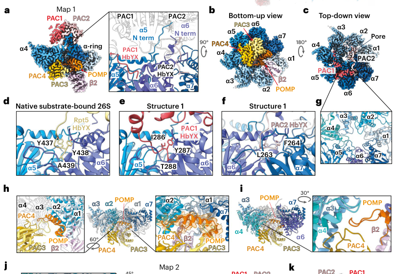

## Question

# Gene Research for Functional Annotation

## ⚠️ CRITICAL: Gene/Protein Identification Context

**BEFORE YOU BEGIN RESEARCH:** You MUST verify you are researching the CORRECT gene/protein. Gene symbols can be ambiguous, especially for less well-characterized genes from non-model organisms.

### Target Gene/Protein Identity (from UniProt):
- **UniProt Accession:** P25786
- **Protein Description:** RecName: Full=Proteasome subunit alpha type-1 {ECO:0000305}; AltName: Full=30 kDa prosomal protein; Short=PROS-30; AltName: Full=Macropain subunit C2; AltName: Full=Multicatalytic endopeptidase complex subunit C2; AltName: Full=Proteasome component C2; AltName: Full=Proteasome nu chain; AltName: Full=Proteasome subunit alpha-6 {ECO:0000303|PubMed:23495936}; Short=alpha-6 {ECO:0000303|PubMed:23495936};
- **Gene Information:** Name=PSMA1 {ECO:0000312|HGNC:HGNC:9530}; Synonyms=HC2, NU, PROS30, PSC2;
- **Organism (full):** Homo sapiens (Human).
- **Protein Family:** Belongs to the peptidase T1A family. {ECO:0000255|PROSITE-
- **Key Domains:** Ntn_hydrolases_N. (IPR029055); Proteasome_alpha. (IPR050115); Proteasome_alpha-type. (IPR023332); Proteasome_alpha1. (IPR035144); Proteasome_asu_N. (IPR000426)

### MANDATORY VERIFICATION STEPS:

1. **Check if the gene symbol "PSMA1" matches the protein description above**
2. **Verify the organism is correct:** Homo sapiens (Human).
3. **Check if protein family/domains align with what you find in literature**
4. **If you find literature for a DIFFERENT gene with the same or similar symbol, STOP**

### If Gene Symbol is Ambiguous or You Cannot Find Relevant Literature:

**DO NOT PROCEED WITH RESEARCH ON A DIFFERENT GENE.** Instead:
- State clearly: "The gene symbol 'PSMA1' is ambiguous or literature is limited for this specific protein"
- Explain what you found (e.g., "Found extensive literature on a different gene with the same symbol in a different organism")
- Describe the protein based ONLY on the UniProt information provided above
- Suggest that the protein function can be inferred from domain/family information

### Research Target:

Please provide a comprehensive research report on the gene **PSMA1** (gene ID: PSMA1, UniProt: P25786) in human.

The research report should be a detailed narrative explaining the function, biological processes, and localization of the gene product. Citations should be given for all claims.

You should prioritize authoritative reviews and primary scientific literature when conducting research. You can supplement
this with annotations you find in gene/protein databases, but these can be outdated or inaccurate.

We are specifically interested in the primary function of the gene - for enzymes, what reaction is catalyzed, and what is the substrate specificity? For transporters, what is the substrate? For structural proteins or adapters, what is the broader structural role? For signaling molecules, what is the role in the pathway.

We are interested in where in or outside the cell the gene product carries out its function.

We are also interested in the signaling or biochemical pathways in which the gene functions. We are less interested in broad pleiotropic effects, except where these elucidate the precise role.

Include evidence where possible. We are interested in both experimental evidence as well as inference from structure, evolution, or bioinformatic analysis. Precise studies should be prioritized over high-throughput, where available.

## Output

Question: You are an expert researcher providing comprehensive, well-cited information.

Provide detailed information focusing on:
1. Key concepts and definitions with current understanding
2. Recent developments and latest research (prioritize 2023-2024 sources)
3. Current applications and real-world implementations
4. Expert opinions and analysis from authoritative sources
5. Relevant statistics and data from recent studies

Format as a comprehensive research report with proper citations. Include URLs and publication dates where available.
Always prioritize recent, authoritative sources and provide specific citations for all major claims.

# Gene Research for Functional Annotation

## ⚠️ CRITICAL: Gene/Protein Identification Context

**BEFORE YOU BEGIN RESEARCH:** You MUST verify you are researching the CORRECT gene/protein. Gene symbols can be ambiguous, especially for less well-characterized genes from non-model organisms.

### Target Gene/Protein Identity (from UniProt):
- **UniProt Accession:** P25786
- **Protein Description:** RecName: Full=Proteasome subunit alpha type-1 {ECO:0000305}; AltName: Full=30 kDa prosomal protein; Short=PROS-30; AltName: Full=Macropain subunit C2; AltName: Full=Multicatalytic endopeptidase complex subunit C2; AltName: Full=Proteasome component C2; AltName: Full=Proteasome nu chain; AltName: Full=Proteasome subunit alpha-6 {ECO:0000303|PubMed:23495936}; Short=alpha-6 {ECO:0000303|PubMed:23495936};
- **Gene Information:** Name=PSMA1 {ECO:0000312|HGNC:HGNC:9530}; Synonyms=HC2, NU, PROS30, PSC2;
- **Organism (full):** Homo sapiens (Human).
- **Protein Family:** Belongs to the peptidase T1A family. {ECO:0000255|PROSITE-
- **Key Domains:** Ntn_hydrolases_N. (IPR029055); Proteasome_alpha. (IPR050115); Proteasome_alpha-type. (IPR023332); Proteasome_alpha1. (IPR035144); Proteasome_asu_N. (IPR000426)

### MANDATORY VERIFICATION STEPS:

1. **Check if the gene symbol "PSMA1" matches the protein description above**
2. **Verify the organism is correct:** Homo sapiens (Human).
3. **Check if protein family/domains align with what you find in literature**
4. **If you find literature for a DIFFERENT gene with the same or similar symbol, STOP**

### If Gene Symbol is Ambiguous or You Cannot Find Relevant Literature:

**DO NOT PROCEED WITH RESEARCH ON A DIFFERENT GENE.** Instead:
- State clearly: "The gene symbol 'PSMA1' is ambiguous or literature is limited for this specific protein"
- Explain what you found (e.g., "Found extensive literature on a different gene with the same symbol in a different organism")
- Describe the protein based ONLY on the UniProt information provided above
- Suggest that the protein function can be inferred from domain/family information

### Research Target:

Please provide a comprehensive research report on the gene **PSMA1** (gene ID: PSMA1, UniProt: P25786) in human.

The research report should be a detailed narrative explaining the function, biological processes, and localization of the gene product. Citations should be given for all claims.

You should prioritize authoritative reviews and primary scientific literature when conducting research. You can supplement
this with annotations you find in gene/protein databases, but these can be outdated or inaccurate.

We are specifically interested in the primary function of the gene - for enzymes, what reaction is catalyzed, and what is the substrate specificity? For transporters, what is the substrate? For structural proteins or adapters, what is the broader structural role? For signaling molecules, what is the role in the pathway.

We are interested in where in or outside the cell the gene product carries out its function.

We are also interested in the signaling or biochemical pathways in which the gene functions. We are less interested in broad pleiotropic effects, except where these elucidate the precise role.

Include evidence where possible. We are interested in both experimental evidence as well as inference from structure, evolution, or bioinformatic analysis. Precise studies should be prioritized over high-throughput, where available.

## Research report: Human **PSMA1** (UniProt **P25786**) – functional annotation

### 1) Target verification (critical disambiguation)
**PSMA1 (proteasome 20S subunit alpha 1; UniProt P25786)** is a *proteasome* α-ring subunit and should not be confused with the acronym **PSMA** used in oncology for *prostate-specific membrane antigen* (gene **FOLH1**). The sources synthesized here explicitly use PSMA1 in the context of the **20S/26S proteasome α-ring (PSMA1–PSMA7)**, consistent with UniProt P25786. (xiong2024thecoherencebetween pages 6-7, larsson2022pancanceranalysisof pages 1-2, steinberger2023methodofmonitoring pages 1-2)

### 2) Key concepts and definitions (current understanding)

#### 2.1 The proteasome and where PSMA1 fits
The eukaryotic proteasome comprises a **20S core particle (CP)** that performs proteolysis and regulatory particles (e.g., **19S**) that recognize substrates and control entry. The 20S CP is a barrel made of **four stacked heteroheptameric rings** arranged **α1–7 β1–7 β1–7 α1–7**; the **two outer α rings** act as a **gate** that restricts access to the proteolytic chamber. PSMA1 is one of the **non-catalytic α subunits** contributing to this gate architecture. (larsson2022pancanceranalysisof pages 1-2, steinberger2023methodofmonitoring pages 1-2)

Importantly, **PSMA1 is not a catalytic peptidase active site**; proteolysis occurs at catalytic **β subunits**. Structural/functional descriptions emphasize that active sites are sequestered inside the CP and are only accessible through the **α-ring pore**. (adolf2024visualizingchaperonemediatedmultistep pages 1-2, larsson2022pancanceranalysisof pages 1-2)

#### 2.2 “Gate opening” and PSMA1’s structural role
Gate opening is a regulated conformational transition in which the α-ring pore becomes permissive for substrate entry. Multiple sources describe a key mechanism: **C-terminal HbYX motifs of proteasome regulators** (e.g., the 19S RP) insert into **pockets between adjacent α subunits** to promote **CP gate opening**. As an α subunit, PSMA1 contributes to forming these α-ring interfaces and pockets that receive regulatory tails. (adolf2024visualizingchaperonemediatedmultistep pages 1-2, xiong2024thecoherencebetween pages 6-7)

A 2023 cell-biological study reiterates that **PSMA1–PSMA7 N-terminal regions form the gate controlling access to the proteolytic chamber**, situating PSMA1’s primary molecular function as **structural regulation of substrate access** rather than catalysis. (steinberger2023methodofmonitoring pages 1-2)

### 3) Molecular function, substrate specificity, and pathways

#### 3.1 Primary function: structural component of the proteasome α ring
PSMA1’s primary function is to serve as an essential **structural subunit of the 20S α ring**, contributing to:
1) **formation of the gated entry pore** (N-termini-based barrier), and
2) **binding interfaces** for regulators that activate or cap the core particle. (xiong2024thecoherencebetween pages 6-7, steinberger2023methodofmonitoring pages 1-2)

Because PSMA1 is non-catalytic, “substrate specificity” is not attributable to PSMA1 as an enzyme active site. Instead, substrate routing and selectivity emerge from (i) which regulatory caps engage the α ring (e.g., 19S, PA28, PA200), and (ii) properties of substrates, including ubiquitin dependence and structural disorder. (xiong2024thecoherencebetween pages 6-7)

#### 3.2 Canonical UPS pathway (26S proteasome)
In canonical ubiquitin-proteasome system (UPS) degradation, substrates are polyubiquitylated and recognized by the **19S**; the 19S base includes **six AAA ATPases (PSMC1–PSMC6)** that unfold substrates and translocate them into the 20S core, with α-ring gating serving as the entry control point. PSMA1 is thus part of the **execution machinery** for UPS-mediated proteolysis by enabling regulated access to catalytic sites. (xiong2024thecoherencebetween pages 6-7)

#### 3.3 Non-canonical ubiquitin-independent degradation by free 20S
A major recent development is the systematic characterization of **ubiquitin-independent degradation by free 20S** particles. Pepelnjak et al. (2024) emphasize that **~half of cellular proteasomes** can exist as **free 20S complexes**, enabling ubiquitin-independent turnover of certain substrates—especially proteins with **intrinsically disordered regions (IDRs)** and enrichment among **nuclear and stress granule proteins**. This provides a pathway-level context in which PSMA1-containing 20S cores contribute to proteostasis beyond classical ubiquitin-dependent 26S degradation. (monika2024systematicidentificationof pages 1-1, monika2024systematicidentificationof pages 1-2)

Pepelnjak et al. developed a proteomics workflow (PiP-MS) and reported **280 candidate 20S substrates** supported by **2,180 peptides** marking proteasome-cleaved regions, and also used cellular perturbations consistent with ubiquitin-independent turnover for selected proteins. (monika2024systematicidentificationof pages 5-6)

### 4) Subcellular localization: where PSMA1-containing complexes act

#### 4.1 Basal localization and stress-induced nuclear proteasome granules
Proteasomes exist in both the **cytoplasm and nucleus**. In a 2023 imaging and tagging study, osmotic/salt stress induced rapid formation of **nuclear proteasome granules** containing 26S proteasomes (positive for both a 20S marker and a 19S marker), consistent with regulated nuclear proteasome compartmentalization. (steinberger2023methodofmonitoring pages 1-2, steinberger2023methodofmonitoring pages 6-8)

#### 4.2 Compartment-specific behavior of free 20S vs 19S material
The same 2023 study provided direct evidence for **subcellular segregation** when 26S integrity is disrupted. Under PSMD1 knockdown (reducing intact 26S), the authors observed that “‘free’ 20S CPs remained nuclear, whereas the 19S RP accumulated in the cytoplasm,” indicating compartment-specific dynamics of PSMA1-containing cores versus 19S components. (steinberger2023methodofmonitoring pages 2-4, steinberger2023methodofmonitoring pages 8-11)

### 5) Recent developments and latest research (prioritizing 2023–2024)

#### 5.1 2024: Human 20S proteasome assembly pathway visualized by cryo-EM
Adolf et al. (Apr 2024, *Nature Structural & Molecular Biology*) presented cryo-EM reconstructions of multiple human 20S assembly intermediates and summarized key quantitative and mechanistic features of 20S biogenesis:
- 20S CP is a **~700 kDa** barrel, with active sites sequestered inside and accessed via the **α-ring gated pore**. (adolf2024visualizingchaperonemediatedmultistep pages 1-2)
- Assembly begins with formation of a complete **α ring** assisted by **PAC1/2 and PAC3/4**, followed by sequential β incorporation to form **half-CPs** that fuse; activation requires cleavage of β propeptides. (adolf2024visualizingchaperonemediatedmultistep pages 1-2)
- Quantitatively, they estimated **~3,000 CPs/min** are produced in proliferating HeLa cells and a CP copy number of **~4×10^6** per cell. (adolf2024visualizingchaperonemediatedmultistep pages 1-2)

These results strengthen mechanistic understanding of how PSMA1-containing α rings form early and set the stage for catalytic maturation of the CP. (adolf2024visualizingchaperonemediatedmultistep pages 1-2)

A cropped figure from Adolf et al. explicitly labels the **α1–α7** subunits forming the α ring and shows the gate/pore, providing structural context for PSMA1 as **α1**. (adolf2024visualizingchaperonemediatedmultistep media 190794a0, adolf2024visualizingchaperonemediatedmultistep media 67df21f7)

#### 5.2 2024: Systematic identification of free-20S substrates
Pepelnjak et al. (Jan 2024, *Molecular Systems Biology*) broadened the substrate landscape for PSMA1-containing 20S cores by mapping ubiquitin-independent substrates enriched for nuclear/stress-granule and IDR-containing proteins and identifying **280** candidates. (monika2024systematicidentificationof pages 5-6, monika2024systematicidentificationof pages 1-2)

#### 5.3 2024: Alzheimer’s disease bioinformatics linking α-ring module (PSMA1–7) with PSMC6
Xiong et al. (Jan 2024, *Frontiers in Molecular Neuroscience*) analyzed transcriptomic datasets using α-ring genes **PSMA1–PSMA7** as a module together with PSMC6, reporting computational associations between coordinated downregulation of these subunits and Alzheimer’s disease progression/risk; the authors explicitly caution that these results require experimental validation. (xiong2024thecoherencebetween pages 1-2)

### 6) Current applications and real-world implementations

#### 6.1 PSMA1 as a prognostic biomarker candidate in cancer
A lung squamous cell carcinoma (LUSC) study (Liu et al., Feb 2023, *Disease Markers*) reported that PSMA1 is **overexpressed** in tumors relative to normal tissue in TCGA (Normal **n=52** vs Primary tumor **n=503**) and is associated with worse survival:
- Overall survival: **HR 1.33 (95% CI 1.05–1.69), log-rank P=0.017**. (liu2023psma1apoor pages 5-7)
- First progression: **HR 1.6 (95% CI 0.93–2.74), P=0.087**. (liu2023psma1apoor pages 5-7)

In a clinical tissue cohort (30 patients; 15 low vs 15 high PSMA1), high PSMA1 expression associated with **TNM stage (P=0.02)** and **pathological grading (P=0.046)**. (liu2023psma1apoor pages 7-9)

The same study provided in vitro functional evidence that PSMA1 knockdown reduces viability and clonogenicity and increases apoptosis, while overexpression shows the opposite trends, supporting PSMA1 as a potential tumor-promoting factor in LUSC (though mechanistic pathways remain unresolved). (liu2023psma1apoor pages 1-2, liu2023psma1apoor pages 11-12)

#### 6.2 Proteasome inhibitors: clinical relevance but not PSMA1-specific targeting
Pan-cancer analysis emphasizes that proteasome genes (including PSMA1) are often upregulated and prognostically informative, but also highlights that clinically used proteasome inhibitors (e.g., bortezomib) act on **catalytic β subunits** (especially β5), rather than α subunits like PSMA1. This frames PSMA1 more as a biomarker/proteasome-state indicator than a direct pharmacologic target. (larsson2022pancanceranalysisof pages 1-2)

#### 6.3 Evidence platform linkages
Open Targets lists PSMA1 associations spanning neoplasm and hematologic malignancies (e.g., multiple myeloma), reflecting the broader clinical relevance of proteasome biology and inhibition; these entries should be interpreted cautiously as pathway/target-family evidence rather than proof PSMA1 is the direct drug target. (OpenTargets Search: -PSMA1)

### 7) Expert analysis and synthesis

1) **Functional core concept**: PSMA1’s most defensible “primary function” is structural—forming part of the α ring gate and regulator-binding interfaces. Multiple sources converge on the α-subunit N-termini as gate-forming elements and regulator tail insertion (HbYX) as a conserved activation mechanism. (steinberger2023methodofmonitoring pages 1-2, adolf2024visualizingchaperonemediatedmultistep pages 1-2)

2) **Emerging view (2023–2024)**: The proteasome system should be conceptualized as a dynamic set of proteolytic states, including abundant **free 20S** particles executing ubiquitin-independent degradation, particularly of nuclear/IDR proteins and stress-granule biology—areas where PSMA1 is mechanistically implicated by virtue of being a constitutive α-ring subunit. (monika2024systematicidentificationof pages 1-1, monika2024systematicidentificationof pages 5-6)

3) **Compartmentalization as regulation**: Nuclear granule formation and the observation that free 20S cores can remain nuclear while 19S material accumulates cytoplasmically upon 26S destabilization suggests compartmental regulation of proteasome forms that could influence which substrates are accessible, especially under stress. (steinberger2023methodofmonitoring pages 8-11, steinberger2023methodofmonitoring pages 2-4)

4) **Translational angle**: Cancer studies support PSMA1 expression as prognostic in specific contexts (e.g., LUSC with HR~1.33 for OS), and pan-cancer analyses suggest broad prognostic relevance across cancer types. However, because PSMA1 is non-catalytic, direct therapeutic targeting is less straightforward than targeting β active sites; PSMA1 likely reflects **proteasome abundance/assembly state** and tumor proteostasis dependence. (liu2023psma1apoor pages 5-7, larsson2022pancanceranalysisof pages 1-2)

### 8) Evidence summary table
The following table consolidates key findings, statistics, dates, and URLs across the main sources.

| Topic | Key findings (1-2 sentences) | Quantitative/statistical details | Source (author year journal) | Publication date (month year) | URL | Evidence context id(s) |
|---|---|---|---|---|---|---|
| Identity / complex role | PSMA1 (UniProt P25786) is the human proteasome 20S subunit alpha 1, a **non-catalytic α-ring subunit** of the 20S core particle; the catalytic protease active sites reside in β subunits, not PSMA1. In the 20S/26S architecture, PSMA1 is one of PSMA1-7 forming the outer α rings that regulate access to the proteolytic chamber. | 20S core is arranged as α1-7 β1-7 β1-7 α1-7; the PSM family comprises 49 genes including 19 20S α/β ring subunits. | Larsson et al. 2022 *BMC Cancer* | Sep 2022 | https://doi.org/10.1186/s12885-022-10079-4 | (larsson2022pancanceranalysisof pages 1-2) |
| Gate / structure | PSMA1 belongs to the α ring that forms the gated pore of the 20S core; α-subunit N termini create the gate controlling substrate entry, whereas proteolysis is executed by β catalytic subunits. Activator docking and gate opening occur through interactions at α-ring pockets, linking PSMA1 structurally to proteasome regulation rather than catalysis. | α-ring surface binds regulators such as PA700/19S, PA28, and PA200; gate opening is mediated by C-terminal HbYX motifs from regulators inserting between adjacent α subunits. | Xiong et al. 2024 *Frontiers in Molecular Neuroscience*; Steinberger et al. 2023 *Biomolecules* | Jan 2024; Jun 2023 | https://doi.org/10.3389/fnmol.2023.1330853; https://doi.org/10.3390/biom13060992 | (xiong2024thecoherencebetween pages 6-7, steinberger2023methodofmonitoring pages 1-2) |
| Assembly / biogenesis | Human 20S biogenesis begins with formation of a complete α ring assisted by PAC1/2 and PAC3/4, followed by ordered β-subunit addition, half-core formation, half-core fusion, and β-propeptide cleavage. These structural studies are directly relevant to PSMA1 because it is one of the α-ring building blocks assembled before catalytic maturation of β sites. | ~3,000 core particles/min are produced in proliferating HeLa cells; total CP copy number is ~4 × 10^6. Five immature intermediates were resolved by cryo-EM at 2.67-2.95 Å; mature CP superimposed with r.m.s.d. 0.703 Å. | Adolf et al. 2024 *Nature Structural & Molecular Biology* | Apr 2024 | https://doi.org/10.1038/s41594-024-01268-9 | (adolf2024visualizingchaperonemediatedmultistep pages 1-2, adolf2024visualizingchaperonemediatedmultistep media 190794a0) |
| Localization | Proteasomes are present in both cytoplasm and nucleus, and stress can drive formation of nuclear proteasome granules containing 26S complexes. When 26S integrity is perturbed, free 20S-containing complexes remain predominantly nuclear while liberated 19S material accumulates in the cytoplasm, supporting compartment-specific behavior of PSMA1-containing cores. | Under osmotic/salt stress, nuclear 26S granules appear within minutes and peak at ~4-12 min. PSMD1 knockdown causes marked loss of intact 26S and increase in 20S signal; PSMD1-depleted cells die after 4-5 days of doxycycline treatment. | Steinberger et al. 2023 *Biomolecules* | Jun 2023 | https://doi.org/10.3390/biom13060992 | (steinberger2023methodofmonitoring pages 8-11, steinberger2023methodofmonitoring pages 1-2, steinberger2023methodofmonitoring pages 6-8, steinberger2023methodofmonitoring pages 2-4) |
| Free 20S substrates / pathway context | PSMA1-containing free 20S particles represent a major proteasome pool and can degrade proteins independently of ubiquitin/26S. Identified substrates are enriched for intrinsically disordered RNA- and DNA-binding proteins, especially nuclear and stress-granule proteins, highlighting a pathway context in stress responses and non-canonical proteostasis. | Approximately half of cellular proteasomes are free 20S; PiP-MS identified 280 candidate 20S substrates from 2,180 cleavage-informative peptides. About 20% of proteins in the proteomic analysis had at least three peptides indicative of 20S cleavage. | Pepelnjak et al. 2024 *Molecular Systems Biology* | Jan 2024 | https://doi.org/10.1038/s44320-024-00015-y | (monika2024systematicidentificationof pages 1-1, monika2024systematicidentificationof pages 5-6, monika2024systematicidentificationof pages 1-2, monika2024systematicidentificationof pages 12-13) |
| Disease / cancer association | Across TCGA pan-cancer data, PSMA1 expression is frequently elevated in tumors and is associated with worse prognosis in many cancer types, suggesting biomarker value rather than direct catalytic druggability. This aligns with proteasome dependence in cancer, although approved proteasome inhibitors primarily target catalytic β subunits (especially PSMB5), not PSMA1. | ~11,000 TCGA samples across 33 cancer types were analyzed; PSMA1 and PSMD11 were linked to unfavorable OS and PFI in ≥30% of cancer types. | Larsson et al. 2022 *BMC Cancer* | Sep 2022 | https://doi.org/10.1186/s12885-022-10079-4 | (larsson2022pancanceranalysisof pages 1-2) |
| Disease / cancer association | In lung squamous cell carcinoma (LUSC), PSMA1 is overexpressed in tumors and behaves as a poor prognostic factor; functional perturbation shows PSMA1 promotes proliferation and suppresses apoptosis in vitro. The study supports PSMA1 as a candidate prognostic biomarker, while noting mechanism remains unresolved. | TCGA comparison used normal n = 52 vs primary tumor n = 503. Survival: OS HR = 1.33 (95% CI 1.05-1.69), log-rank P = 0.017; first progression HR = 1.6 (95% CI 0.93-2.74), P = 0.087. Clinical cohort: 30 patients split into 15 low vs 15 high PSMA1; high expression associated with TNM stage (P = 0.02) and pathological grading (P = 0.046). | Liu et al. 2023 *Disease Markers* | Feb 2023 | https://doi.org/10.1155/2023/5386635 | (liu2023psma1apoor pages 1-2, liu2023psma1apoor pages 5-7, liu2023psma1apoor pages 7-9) |
| AD bioinformatics | In Alzheimer disease transcriptomic analyses, PSMA1 was analyzed as part of the α-ring module (PSMA1-7) together with the ATPase subunit PSMC6. The study suggests coordinated downregulation of α-ring genes and PSMC6 tracks AD progression, but these are computational associations requiring biological validation. | PCA/SVM analyses used GSE1297 and GSE5281; no PSMA1-specific effect size or AUC was provided in the extracted evidence. The authors report decreased total proteasome numbers with progression but inferred compensatory coordination/activity in remaining complexes. | Xiong et al. 2024 *Frontiers in Molecular Neuroscience* | Jan 2024 | https://doi.org/10.3389/fnmol.2023.1330853 | (xiong2024thecoherencebetween pages 6-7, xiong2024thecoherencebetween pages 1-2) |
| Clinical / evidence-platform associations | Open Targets lists PSMA1 disease associations largely reflecting the broader therapeutic relevance of proteasome inhibition in oncology and related disorders; these associations should be interpreted as pathway-level/target-family evidence, not proof that PSMA1 itself is the direct pharmacologic target. | Reported disease associations include neoplasm (score 0.6318), multiple myeloma (0.5999), mantle cell lymphoma (0.5023), HIV infection (0.4771), and amyloidosis (0.3992); evidence rows include approval/Phase 4 records. | Open Targets Platform | Accessed in current session | https://platform.opentargets.org/target/ENSG00000129084 | (OpenTargets Search: -PSMA1) |

*Table: This table summarizes key evidence for human PSMA1/P25786 across structural biology, localization, free-20S proteostasis, and disease-association studies. It is useful for distinguishing PSMA1’s structural non-catalytic role in the proteasome from the catalytic functions of proteasomal beta subunits and for highlighting recent 2023-2024 findings.*

### 9) Key figure (proteasome architecture / α-ring placement)
Cropped images from Adolf et al. 2024 provide a labeled view of the α ring (α1–α7) and a stepwise assembly schematic, supporting the mapping of PSMA1 to the α1 position and its gate-related role. (adolf2024visualizingchaperonemediatedmultistep media 190794a0, adolf2024visualizingchaperonemediatedmultistep media 67df21f7)

### References (URLs and publication dates)
- Adolf F. et al. “Visualizing chaperone-mediated multistep assembly of the human 20S proteasome.” *Nat Struct Mol Biol* (Apr 2024). https://doi.org/10.1038/s41594-024-01268-9 (adolf2024visualizingchaperonemediatedmultistep pages 1-2)
- Pepelnjak M. et al. “Systematic identification of 20S proteasome substrates.” *Mol Syst Biol* (Jan 2024). https://doi.org/10.1038/s44320-024-00015-y (monika2024systematicidentificationof pages 5-6)
- Xiong J. et al. “The coherence between PSMC6 and α-ring in the 26S proteasome is associated with Alzheimer’s disease.” *Front Mol Neurosci* (Jan 2024). https://doi.org/10.3389/fnmol.2023.1330853 (xiong2024thecoherencebetween pages 1-2)
- Steinberger S. et al. “Method of Monitoring 26S Proteasome in Cells Revealed the Crucial Role of PSMA3 C-Terminus in 26S Integrity.” *Biomolecules* (Jun 2023). https://doi.org/10.3390/biom13060992 (steinberger2023methodofmonitoring pages 1-2)
- Liu Z. et al. “PSMA1, a Poor Prognostic Factor, Promotes Tumor Growth in Lung Squamous Cell Carcinoma.” *Disease Markers* (Feb 2023). https://doi.org/10.1155/2023/5386635 (liu2023psma1apoor pages 5-7)
- Larsson P. et al. “Pan-cancer analysis of genomic and transcriptomic data reveals the prognostic relevance of human proteasome genes in different cancer types.” *BMC Cancer* (Sep 2022). https://doi.org/10.1186/s12885-022-10079-4 (larsson2022pancanceranalysisof pages 1-2)
- Open Targets Platform: PSMA1 (ENSG00000129084). Accessed in-session. https://platform.opentargets.org/target/ENSG00000129084 (OpenTargets Search: -PSMA1)

References

1. (xiong2024thecoherencebetween pages 6-7): Jing Xiong, Xinping Pang, Xianghu Song, Lin Yang, and Chaoyang Pang. The coherence between psmc6 and α-ring in the 26s proteasome is associated with alzheimer’s disease. Frontiers in Molecular Neuroscience, Jan 2024. URL: https://doi.org/10.3389/fnmol.2023.1330853, doi:10.3389/fnmol.2023.1330853. This article has 8 citations.

2. (larsson2022pancanceranalysisof pages 1-2): Peter Larsson, Daniella Pettersson, Hanna Engqvist, Elisabeth Werner Rönnerman, Eva Forssell-Aronsson, Anikó Kovács, Per Karlsson, Khalil Helou, and Toshima Z. Parris. Pan-cancer analysis of genomic and transcriptomic data reveals the prognostic relevance of human proteasome genes in different cancer types. BMC Cancer, Sep 2022. URL: https://doi.org/10.1186/s12885-022-10079-4, doi:10.1186/s12885-022-10079-4. This article has 15 citations and is from a peer-reviewed journal.

3. (steinberger2023methodofmonitoring pages 1-2): Shirel Steinberger, Julia Adler, and Yosef Shaul. Method of monitoring 26s proteasome in cells revealed the crucial role of psma3 c-terminus in 26s integrity. Biomolecules, 13:992, Jun 2023. URL: https://doi.org/10.3390/biom13060992, doi:10.3390/biom13060992. This article has 1 citations.

4. (adolf2024visualizingchaperonemediatedmultistep pages 1-2): Frank Adolf, Jiale Du, Ellen A. Goodall, Richard M. Walsh, Shaun Rawson, Susanne von Gronau, J. Wade Harper, John Hanna, and Brenda A. Schulman. Visualizing chaperone-mediated multistep assembly of the human 20s proteasome. Nature Structural &amp; Molecular Biology, 31:1176-1188, Apr 2024. URL: https://doi.org/10.1038/s41594-024-01268-9, doi:10.1038/s41594-024-01268-9. This article has 35 citations and is from a highest quality peer-reviewed journal.

5. (monika2024systematicidentificationof pages 1-1): Monika Pepelnjak, Rivkah Rogawski, Galina Arkind, Yegor Leushkin, Irit Fainer, Gili Ben-Nissan, Paola Picotti, and Michal Sharon. Systematic identification of 20s proteasome substrates. Molecular Systems Biology, 20:403-427, Jan 2024. URL: https://doi.org/10.1038/s44320-024-00015-y, doi:10.1038/s44320-024-00015-y. This article has 35 citations and is from a highest quality peer-reviewed journal.

6. (monika2024systematicidentificationof pages 1-2): Monika Pepelnjak, Rivkah Rogawski, Galina Arkind, Yegor Leushkin, Irit Fainer, Gili Ben-Nissan, Paola Picotti, and Michal Sharon. Systematic identification of 20s proteasome substrates. Molecular Systems Biology, 20:403-427, Jan 2024. URL: https://doi.org/10.1038/s44320-024-00015-y, doi:10.1038/s44320-024-00015-y. This article has 35 citations and is from a highest quality peer-reviewed journal.

7. (monika2024systematicidentificationof pages 5-6): Monika Pepelnjak, Rivkah Rogawski, Galina Arkind, Yegor Leushkin, Irit Fainer, Gili Ben-Nissan, Paola Picotti, and Michal Sharon. Systematic identification of 20s proteasome substrates. Molecular Systems Biology, 20:403-427, Jan 2024. URL: https://doi.org/10.1038/s44320-024-00015-y, doi:10.1038/s44320-024-00015-y. This article has 35 citations and is from a highest quality peer-reviewed journal.

8. (steinberger2023methodofmonitoring pages 6-8): Shirel Steinberger, Julia Adler, and Yosef Shaul. Method of monitoring 26s proteasome in cells revealed the crucial role of psma3 c-terminus in 26s integrity. Biomolecules, 13:992, Jun 2023. URL: https://doi.org/10.3390/biom13060992, doi:10.3390/biom13060992. This article has 1 citations.

9. (steinberger2023methodofmonitoring pages 2-4): Shirel Steinberger, Julia Adler, and Yosef Shaul. Method of monitoring 26s proteasome in cells revealed the crucial role of psma3 c-terminus in 26s integrity. Biomolecules, 13:992, Jun 2023. URL: https://doi.org/10.3390/biom13060992, doi:10.3390/biom13060992. This article has 1 citations.

10. (steinberger2023methodofmonitoring pages 8-11): Shirel Steinberger, Julia Adler, and Yosef Shaul. Method of monitoring 26s proteasome in cells revealed the crucial role of psma3 c-terminus in 26s integrity. Biomolecules, 13:992, Jun 2023. URL: https://doi.org/10.3390/biom13060992, doi:10.3390/biom13060992. This article has 1 citations.

11. (adolf2024visualizingchaperonemediatedmultistep media 190794a0): Frank Adolf, Jiale Du, Ellen A. Goodall, Richard M. Walsh, Shaun Rawson, Susanne von Gronau, J. Wade Harper, John Hanna, and Brenda A. Schulman. Visualizing chaperone-mediated multistep assembly of the human 20s proteasome. Nature Structural &amp; Molecular Biology, 31:1176-1188, Apr 2024. URL: https://doi.org/10.1038/s41594-024-01268-9, doi:10.1038/s41594-024-01268-9. This article has 35 citations and is from a highest quality peer-reviewed journal.

12. (adolf2024visualizingchaperonemediatedmultistep media 67df21f7): Frank Adolf, Jiale Du, Ellen A. Goodall, Richard M. Walsh, Shaun Rawson, Susanne von Gronau, J. Wade Harper, John Hanna, and Brenda A. Schulman. Visualizing chaperone-mediated multistep assembly of the human 20s proteasome. Nature Structural &amp; Molecular Biology, 31:1176-1188, Apr 2024. URL: https://doi.org/10.1038/s41594-024-01268-9, doi:10.1038/s41594-024-01268-9. This article has 35 citations and is from a highest quality peer-reviewed journal.

13. (xiong2024thecoherencebetween pages 1-2): Jing Xiong, Xinping Pang, Xianghu Song, Lin Yang, and Chaoyang Pang. The coherence between psmc6 and α-ring in the 26s proteasome is associated with alzheimer’s disease. Frontiers in Molecular Neuroscience, Jan 2024. URL: https://doi.org/10.3389/fnmol.2023.1330853, doi:10.3389/fnmol.2023.1330853. This article has 8 citations.

14. (liu2023psma1apoor pages 5-7): Zhao Liu, Wuping Wang, Yan-Wu Zhou, Linfeng Li, and Wolong Zhou. Psma1, a poor prognostic factor, promotes tumor growth in lung squamous cell carcinoma. Disease Markers, 2023:1-12, Feb 2023. URL: https://doi.org/10.1155/2023/5386635, doi:10.1155/2023/5386635. This article has 10 citations.

15. (liu2023psma1apoor pages 7-9): Zhao Liu, Wuping Wang, Yan-Wu Zhou, Linfeng Li, and Wolong Zhou. Psma1, a poor prognostic factor, promotes tumor growth in lung squamous cell carcinoma. Disease Markers, 2023:1-12, Feb 2023. URL: https://doi.org/10.1155/2023/5386635, doi:10.1155/2023/5386635. This article has 10 citations.

16. (liu2023psma1apoor pages 1-2): Zhao Liu, Wuping Wang, Yan-Wu Zhou, Linfeng Li, and Wolong Zhou. Psma1, a poor prognostic factor, promotes tumor growth in lung squamous cell carcinoma. Disease Markers, 2023:1-12, Feb 2023. URL: https://doi.org/10.1155/2023/5386635, doi:10.1155/2023/5386635. This article has 10 citations.

17. (liu2023psma1apoor pages 11-12): Zhao Liu, Wuping Wang, Yan-Wu Zhou, Linfeng Li, and Wolong Zhou. Psma1, a poor prognostic factor, promotes tumor growth in lung squamous cell carcinoma. Disease Markers, 2023:1-12, Feb 2023. URL: https://doi.org/10.1155/2023/5386635, doi:10.1155/2023/5386635. This article has 10 citations.

18. (OpenTargets Search: -PSMA1): Open Targets Query (-PSMA1, 5 results). Buniello, A. et al. (2025). Open Targets Platform: facilitating therapeutic hypotheses building in drug discovery. Nucleic Acids Research.

19. (monika2024systematicidentificationof pages 12-13): Monika Pepelnjak, Rivkah Rogawski, Galina Arkind, Yegor Leushkin, Irit Fainer, Gili Ben-Nissan, Paola Picotti, and Michal Sharon. Systematic identification of 20s proteasome substrates. Molecular Systems Biology, 20:403-427, Jan 2024. URL: https://doi.org/10.1038/s44320-024-00015-y, doi:10.1038/s44320-024-00015-y. This article has 35 citations and is from a highest quality peer-reviewed journal.

## Artifacts

- [Edison artifact artifact-00](PSMA1-deep-research-falcon_artifacts/artifact-00.md)

## Citations

1. steinberger2023methodofmonitoring pages 1-2
2. xiong2024thecoherencebetween pages 6-7
3. monika2024systematicidentificationof pages 5-6
4. adolf2024visualizingchaperonemediatedmultistep pages 1-2
5. xiong2024thecoherencebetween pages 1-2
6. larsson2022pancanceranalysisof pages 1-2
7. monika2024systematicidentificationof pages 1-1
8. monika2024systematicidentificationof pages 1-2
9. steinberger2023methodofmonitoring pages 6-8
10. steinberger2023methodofmonitoring pages 2-4
11. steinberger2023methodofmonitoring pages 8-11
12. monika2024systematicidentificationof pages 12-13
13. https://doi.org/10.1186/s12885-022-10079-4
14. https://doi.org/10.3389/fnmol.2023.1330853;
15. https://doi.org/10.3390/biom13060992
16. https://doi.org/10.1038/s41594-024-01268-9
17. https://doi.org/10.1038/s44320-024-00015-y
18. https://doi.org/10.1155/2023/5386635
19. https://doi.org/10.3389/fnmol.2023.1330853
20. https://platform.opentargets.org/target/ENSG00000129084
21. https://doi.org/10.3389/fnmol.2023.1330853,
22. https://doi.org/10.1186/s12885-022-10079-4,
23. https://doi.org/10.3390/biom13060992,
24. https://doi.org/10.1038/s41594-024-01268-9,
25. https://doi.org/10.1038/s44320-024-00015-y,
26. https://doi.org/10.1155/2023/5386635,