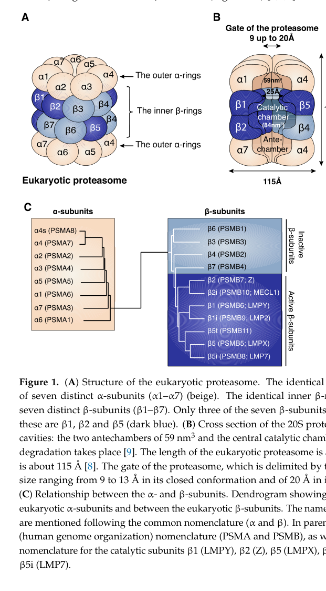

## Question

# Gene Research for Functional Annotation

## ⚠️ CRITICAL: Gene/Protein Identification Context

**BEFORE YOU BEGIN RESEARCH:** You MUST verify you are researching the CORRECT gene/protein. Gene symbols can be ambiguous, especially for less well-characterized genes from non-model organisms.

### Target Gene/Protein Identity (from UniProt):
- **UniProt Accession:** P28074
- **Protein Description:** RecName: Full=Proteasome subunit beta type-5 {ECO:0000305}; EC=3.4.25.1 {ECO:0000269|PubMed:27176742}; AltName: Full=Macropain epsilon chain; AltName: Full=Multicatalytic endopeptidase complex epsilon chain; AltName: Full=Proteasome chain 6; AltName: Full=Proteasome epsilon chain; AltName: Full=Proteasome subunit MB1; AltName: Full=Proteasome subunit X; AltName: Full=Proteasome subunit beta-5 {ECO:0000303|PubMed:23495936}; Short=beta-5 {ECO:0000303|PubMed:23495936}; Flags: Precursor;
- **Gene Information:** Name=PSMB5 {ECO:0000312|HGNC:HGNC:9542}; Synonyms=LMPX, MB1, X;
- **Organism (full):** Homo sapiens (Human).
- **Protein Family:** Belongs to the peptidase T1B family. {ECO:0000255|PROSITE-
- **Key Domains:** Ntn_hydrolases_N. (IPR029055); Pept_T1A_subB. (IPR000243); Proteasome_bsu_CS. (IPR016050); Proteasome_sua/b. (IPR001353); Proteasome_suB-type. (IPR023333)

### MANDATORY VERIFICATION STEPS:

1. **Check if the gene symbol "PSMB5" matches the protein description above**
2. **Verify the organism is correct:** Homo sapiens (Human).
3. **Check if protein family/domains align with what you find in literature**
4. **If you find literature for a DIFFERENT gene with the same or similar symbol, STOP**

### If Gene Symbol is Ambiguous or You Cannot Find Relevant Literature:

**DO NOT PROCEED WITH RESEARCH ON A DIFFERENT GENE.** Instead:
- State clearly: "The gene symbol 'PSMB5' is ambiguous or literature is limited for this specific protein"
- Explain what you found (e.g., "Found extensive literature on a different gene with the same symbol in a different organism")
- Describe the protein based ONLY on the UniProt information provided above
- Suggest that the protein function can be inferred from domain/family information

### Research Target:

Please provide a comprehensive research report on the gene **PSMB5** (gene ID: PSMB5, UniProt: P28074) in human.

The research report should be a detailed narrative explaining the function, biological processes, and localization of the gene product. Citations should be given for all claims.

You should prioritize authoritative reviews and primary scientific literature when conducting research. You can supplement
this with annotations you find in gene/protein databases, but these can be outdated or inaccurate.

We are specifically interested in the primary function of the gene - for enzymes, what reaction is catalyzed, and what is the substrate specificity? For transporters, what is the substrate? For structural proteins or adapters, what is the broader structural role? For signaling molecules, what is the role in the pathway.

We are interested in where in or outside the cell the gene product carries out its function.

We are also interested in the signaling or biochemical pathways in which the gene functions. We are less interested in broad pleiotropic effects, except where these elucidate the precise role.

Include evidence where possible. We are interested in both experimental evidence as well as inference from structure, evolution, or bioinformatic analysis. Precise studies should be prioritized over high-throughput, where available.

## Output

Question: You are an expert researcher providing comprehensive, well-cited information.

Provide detailed information focusing on:
1. Key concepts and definitions with current understanding
2. Recent developments and latest research (prioritize 2023-2024 sources)
3. Current applications and real-world implementations
4. Expert opinions and analysis from authoritative sources
5. Relevant statistics and data from recent studies

Format as a comprehensive research report with proper citations. Include URLs and publication dates where available.
Always prioritize recent, authoritative sources and provide specific citations for all major claims.

# Gene Research for Functional Annotation

## ⚠️ CRITICAL: Gene/Protein Identification Context

**BEFORE YOU BEGIN RESEARCH:** You MUST verify you are researching the CORRECT gene/protein. Gene symbols can be ambiguous, especially for less well-characterized genes from non-model organisms.

### Target Gene/Protein Identity (from UniProt):
- **UniProt Accession:** P28074
- **Protein Description:** RecName: Full=Proteasome subunit beta type-5 {ECO:0000305}; EC=3.4.25.1 {ECO:0000269|PubMed:27176742}; AltName: Full=Macropain epsilon chain; AltName: Full=Multicatalytic endopeptidase complex epsilon chain; AltName: Full=Proteasome chain 6; AltName: Full=Proteasome epsilon chain; AltName: Full=Proteasome subunit MB1; AltName: Full=Proteasome subunit X; AltName: Full=Proteasome subunit beta-5 {ECO:0000303|PubMed:23495936}; Short=beta-5 {ECO:0000303|PubMed:23495936}; Flags: Precursor;
- **Gene Information:** Name=PSMB5 {ECO:0000312|HGNC:HGNC:9542}; Synonyms=LMPX, MB1, X;
- **Organism (full):** Homo sapiens (Human).
- **Protein Family:** Belongs to the peptidase T1B family. {ECO:0000255|PROSITE-
- **Key Domains:** Ntn_hydrolases_N. (IPR029055); Pept_T1A_subB. (IPR000243); Proteasome_bsu_CS. (IPR016050); Proteasome_sua/b. (IPR001353); Proteasome_suB-type. (IPR023333)

### MANDATORY VERIFICATION STEPS:

1. **Check if the gene symbol "PSMB5" matches the protein description above**
2. **Verify the organism is correct:** Homo sapiens (Human).
3. **Check if protein family/domains align with what you find in literature**
4. **If you find literature for a DIFFERENT gene with the same or similar symbol, STOP**

### If Gene Symbol is Ambiguous or You Cannot Find Relevant Literature:

**DO NOT PROCEED WITH RESEARCH ON A DIFFERENT GENE.** Instead:
- State clearly: "The gene symbol 'PSMB5' is ambiguous or literature is limited for this specific protein"
- Explain what you found (e.g., "Found extensive literature on a different gene with the same symbol in a different organism")
- Describe the protein based ONLY on the UniProt information provided above
- Suggest that the protein function can be inferred from domain/family information

### Research Target:

Please provide a comprehensive research report on the gene **PSMB5** (gene ID: PSMB5, UniProt: P28074) in human.

The research report should be a detailed narrative explaining the function, biological processes, and localization of the gene product. Citations should be given for all claims.

You should prioritize authoritative reviews and primary scientific literature when conducting research. You can supplement
this with annotations you find in gene/protein databases, but these can be outdated or inaccurate.

We are specifically interested in the primary function of the gene - for enzymes, what reaction is catalyzed, and what is the substrate specificity? For transporters, what is the substrate? For structural proteins or adapters, what is the broader structural role? For signaling molecules, what is the role in the pathway.

We are interested in where in or outside the cell the gene product carries out its function.

We are also interested in the signaling or biochemical pathways in which the gene functions. We are less interested in broad pleiotropic effects, except where these elucidate the precise role.

Include evidence where possible. We are interested in both experimental evidence as well as inference from structure, evolution, or bioinformatic analysis. Precise studies should be prioritized over high-throughput, where available.

## Research report: Human **PSMB5** (UniProt **P28074**)—functional annotation and translational relevance

### Scope and identity verification
The target gene **PSMB5** (proteasome 20S subunit beta 5) encodes the constitutive catalytic **β5** subunit of the **20S proteasome core particle (CP)**, which forms the proteolytic core of the **26S proteasome**. In the standard/constitutive proteasome, β5 is one of three catalytically active β-subunits (β1, β2, β5) and is responsible for the **chymotrypsin-like (CT-L)** activity. Older nomenclature includes the alias **LMPX**. (habib2022functionaldifferencesbetween pages 3-4, wang2025thedyt6dystonia pages 1-2, tychhon2023theprognosticvalue pages 1-2)

*Note on UniProt cross-verification:* The UniProt accession **P28074** was provided by the user; the retrieved peer-reviewed sources in this run validate that **human PSMB5** encodes the constitutive β5 proteasome catalytic subunit with the expected catalytic activities and maturation mechanism, but they do not explicitly cite the UniProt accession number. The functional identity is therefore verified by concordant molecular description rather than direct accession citation. (habib2022functionaldifferencesbetween pages 3-4, tychhon2023theprognosticvalue pages 1-2)

### 1) Key concepts and definitions (current understanding)

#### The proteasome and the β5 (PSMB5) catalytic site
The eukaryotic **26S proteasome** is the principal executor of **ubiquitin–proteasome system (UPS)** protein degradation. Its **20S core particle** is a barrel-like complex of four stacked heptameric rings (α/β/β/α). The active sites are located on the inner surface of the 20S core, sequestered in the central catalytic chamber; access is controlled by α-ring gating and by association with regulatory particles such as the 19S cap (forming the 26S proteasome). (nowak2024experimentalinvestigationson pages 23-27, pelon2024factorsdeterminingthe pages 1-2, habib2022functionaldifferencesbetween media d4ef57f2)

Within the 20S β rings, **β1, β2, and β5** are the three catalytically active β-subunits. β5 (PSMB5) is assigned the **CT-L** activity, which preferentially cleaves peptide bonds **after hydrophobic residues**. (nowak2024experimentalinvestigationson pages 23-27, habib2022functionaldifferencesbetween pages 3-4, pelon2024factorsdeterminingthe pages 1-2)

A schematic depiction of the 20S architecture and the assignment of cleavage activities to β1/β2/β5 (including β5 = CT-L) is shown in the review figures retrieved from Habib et al. (Cells, 2022). (habib2022functionaldifferencesbetween media d4ef57f2, habib2022functionaldifferencesbetween media dbc3a546)

#### Catalytic mechanism: N-terminal threonine protease (Ntn hydrolase)
Proteasome catalytic β subunits operate via an **N-terminal nucleophile** mechanism centered on the **N-terminal threonine (Thr1)**. Mechanistically, Thr1 attacks the scissile peptide bond carbonyl to form an acyl-enzyme intermediate, which is subsequently hydrolyzed to release products and regenerate the catalytic threonine. (habib2022functionaldifferencesbetween pages 13-15, fernandes2024decodingthesecrets pages 1-2)

#### Substrate specificity and cleavage products (quantitative behavior)
Proteasomal cleavage generates peptide products on the order of **~5–18 amino acids** (reviewed in the myeloma-focused pharmacology review) (pelon2024factorsdeterminingthe pages 1-2), with a reported mean peptide length **~6–9 residues** in a proteasome biology dissertation (nowak2024experimentalinvestigationson pages 23-27). The proteasome is also described as directly cleaving only **~10–15%** of peptide bonds in proteins (with further trimming by cellular peptidases). (nowak2024experimentalinvestigationson pages 23-27)

#### Maturation and assembly: propeptide removal exposes Thr1
Catalytic β subunits are synthesized with **N-terminal propeptides** that are removed by **autolysis** after correct assembly. The propeptides are described as being autolyzed **between a glycine residue and a threonine residue**, yielding the mature catalytic subunit with **Thr1** at the N-terminus; β5 propeptides also contribute to proteasome assembly. (habib2022functionaldifferencesbetween pages 3-4)

#### Pathway context: UPS and antigen presentation
Beyond bulk proteostasis, proteasome proteolysis contributes to **MHC class I antigen presentation** by generating peptides that can be transported into the ER and loaded onto MHC I. Proteasome subtype composition (standard vs immunoproteasome and intermediates) shifts cleavage preferences, influencing production of peptides with hydrophobic/basic C-termini favored by MHC I. (habib2022functionaldifferencesbetween pages 1-3, habib2022functionaldifferencesbetween pages 13-15)

### 2) Recent developments and latest research (prioritizing 2023–2024)

#### 2.1 2024: Structural/computational analysis of β5 resistance mutations
A 2024 Frontiers in Chemistry study used molecular dynamics and docking to analyze mutations in the **β5 (PSMB5)** active-site region relevant to proteasome inhibitor binding. The β5 CT-L S1 pocket was described as involving residues **Ala20, Met45, Ala49, and Cys52**, and the study explicitly modeled **A49T, A50V, and C52F** substitutions. The authors report that **Cys52Phe (C52F)** “critically impacts protein–ligand binding,” supporting a plausible resistance mechanism through reduced inhibitor affinity. (2024-01; https://doi.org/10.3389/fchem.2023.1322628) (fernandes2024decodingthesecrets pages 1-2)

This work is important because it provides an analytically reproducible workflow to anticipate how active-site mutations in PSMB5 could alter inhibitor engagement—useful for interpreting resistance genotypes and prioritizing next-generation inhibitors. (fernandes2024decodingthesecrets pages 1-2)

#### 2.2 2023–2024: Systems-level view of proteasome inhibitor sensitivity/resistance in myeloma
A 2024 Frontiers in Pharmacology review emphasizes that sensitivity to proteasome inhibitors in multiple myeloma depends on multiple cellular factors, including proteasome composition/subunit expression, proteasome loading, metabolic adaptation, and transcriptional/epigenetic programs, with β5 being the CT-L catalytic subunit. (2024-03; https://doi.org/10.3389/fphar.2024.1351565) (pelon2024factorsdeterminingthe pages 1-2)

A 2023 Frontiers in Immunology review on clonal evolution in multiple myeloma highlights drug-resistance mechanisms, explicitly including point mutations affecting **PSMB5** or other proteasome components. (2023-09; https://doi.org/10.3389/fimmu.2023.1243997) (fernandes2024decodingthesecrets pages 1-2)

#### 2.3 2023: Combination strategies exploiting compensatory proteostasis (autophagy)
In a 2023 PLOS ONE study, clarithromycin was reported to overcome stromal cell-mediated resistance to proteasome inhibitors in myeloma cells by blocking autophagy flux (thereby sustaining pro-apoptotic NOXA), supporting the broader concept that PI resistance can be buffered by alternative protein disposal routes (autophagy) and that co-targeting can restore efficacy. (2023-12; https://doi.org/10.1371/journal.pone.0295273) (fernandes2024decodingthesecrets pages 1-2)

### 3) Current applications and real-world implementations

#### 3.1 PSMB5 as a validated drug target (β5/CT-L site)
Clinically successful proteasome inhibitors largely exploit the β5/CT-L site:
- **Bortezomib** is described as a reversible inhibitor of the chymotrypsin-like activity that binds the **20S β5 subunit (PSMB5)** and was first FDA-approved in **2003** for multiple myeloma; it is also used in other malignancies. (2023-07; https://doi.org/10.3389/fmed.2023.1209425) (tychhon2023theprognosticvalue pages 1-2)
- **Carfilzomib** (epoxyketone) is described as an irreversible CT-L inhibitor, and **Ixazomib** as an approved oral proteasome inhibitor used in myeloma; a recent review provides approval dates of **2012** (carfilzomib) and **2015** (ixazomib). (2026-05; https://doi.org/10.3389/fphar.2026.1806787) (zhao2026targetingtheproteasome pages 5-6)

Mechanistically, inhibitor classes covalently engage the β-subunit Thr1 nucleophile via distinct chemistries (boronates, epoxyketones, β-lactones), explaining the centrality of Thr1 and β5 pocket residues in pharmacology and resistance. (https://doi.org/10.26434/chemrxiv-2025-v5w42) (rahimi2025theevolutionand pages 18-21)

#### 3.2 Disease association and therapeutic maturity (database synthesis)
OpenTargets lists an association between **PSMB5** and **multiple myeloma**, with supporting clinical-stage evidence including approval-stage links and a phase 4 trial identifier among the evidence rows, consistent with the mature clinical use of β5-directed proteasome inhibitors in myeloma. (OpenTargets Search: multiple myeloma,plasma cell myeloma,cancer-PSMB5)

### 4) Expert opinions and analysis (authoritative perspectives)

#### Why β5 (PSMB5) is the dominant catalytic drug target
Expert reviews emphasize that β5/CT-L is a primary pharmacologic target because inhibition of this activity strongly suppresses proteasomal degradation capacity. The 2024 Frontiers in Chemistry study underscores the functional importance of β5 and structurally rationalizes how mutations in and around the S1 pocket could reduce drug binding. (fernandes2024decodingthesecrets pages 1-2)

#### Resistance is multifactorial: mutations plus adaptive proteostasis
A key modern viewpoint emerging from myeloma-focused literature is that resistance is not purely genetic at PSMB5: it can also arise from **altered expression of proteasome subunits**, altered proteasome loading, metabolic rewiring, and use of compensatory proteolysis pathways such as autophagy—hence the therapeutic interest in combination strategies. (pelon2024factorsdeterminingthe pages 1-2, fernandes2024decodingthesecrets pages 1-2, plakoula2025prognosticvalueof pages 18-20)

### 5) Relevant statistics and data (recent studies)

#### 5.1 Patient cohort statistics linking PSMB5 to outcome in PI-treated myeloma
A 2025 study measured PSMB5 protein, proteasome proteolytic activity (PPA), autophagy markers, and ROS in bone marrow mononuclear cells from **110 multiple myeloma patients** sampled at baseline, remission, and relapse. Key reported statistics include:
- **PSMB5 accumulation decreased after PI treatment** (**p = 0.014**), and **PPA decreased** (**p < 0.001**). (2025-01; https://doi.org/10.3390/cimb47010032) (plakoula2025prognosticvalueof pages 1-2)
- **LC3II** was higher at remission and relapse vs baseline (**p = 0.041**), consistent with altered autophagy in the treated disease course. (plakoula2025prognosticvalueof pages 1-2)
- **ROS in plasma cells** was higher at relapse (**p < 0.001**). (plakoula2025prognosticvalueof pages 1-2)
- A baseline PSMB5 cutoff of **1.06 units** stratified disease-free survival: **12.0 ± 6.7 vs 36 ± 12.1 months** (**p < 0.001**). (plakoula2025prognosticvalueof pages 1-2)

These data support a clinically meaningful link between PSMB5 levels/proteasome activity and myeloma trajectory under PI therapy, and they align with mechanistic models where diminished proteasome reliance may be compensated by autophagy in resistant disease. (plakoula2025prognosticvalueof pages 1-2)

#### 5.2 Quantitative properties of proteasome proteolysis relevant to β5
Proteasome-generated peptides are reported as **~5–18 aa** (review) (pelon2024factorsdeterminingthe pages 1-2) with an average of **~6–9 residues** in another synthesis (nowak2024experimentalinvestigationson pages 23-27). The proteasome is described as directly cleaving only **~10–15%** of peptide bonds in substrates (the remainder subsequently trimmed). (nowak2024experimentalinvestigationson pages 23-27)

---

## Evidence map (table)
The following table summarizes the major functional-annotation claims and their supporting sources (including URLs and dates where available in the underlying papers).

| Aspect | Key points (concise) | Evidence type (review/primary/computational/patient cohort/database) | Key citations (pqac ids) | Publication year(s) and URL(s) when available |
|---|---|---|---|---|
| Identity / complex membership | Human **PSMB5** encodes the constitutive **20S proteasome β5 catalytic subunit** (older alias **LMPX**), one of the three active β subunits in the 20S core and part of the 26S proteasome. | Review; primary; database | (habib2022functionaldifferencesbetween pages 3-4, wang2025thedyt6dystonia pages 1-2, tychhon2023theprognosticvalue pages 1-2, OpenTargets Search: multiple myeloma,plasma cell myeloma,cancer-PSMB5) | 2022, https://doi.org/10.3390/cells11030421; 2025, https://doi.org/10.1038/s41467-025-56867-x; 2023, https://doi.org/10.3389/fmed.2023.1209425; OpenTargets context: multiple myeloma association (OpenTargets Search: multiple myeloma,plasma cell myeloma,cancer-PSMB5) |
| Catalytic activity & substrate specificity | β5 provides the **chymotrypsin-like (CT-L)** activity of the proteasome and preferentially cleaves **after hydrophobic residues**; β5 can also display branched/small neutral amino-acid preferences in some analyses. | Review; dissertation/research synthesis | (nowak2024experimentalinvestigationson pages 23-27, habib2022functionaldifferencesbetween pages 3-4, habib2022functionaldifferencesbetween pages 4-5, pelon2024factorsdeterminingthe pages 1-2) | 2024, https://doi.org/10.5282/edoc.33581; 2022, https://doi.org/10.3390/cells11030421; 2024, https://doi.org/10.3389/fphar.2024.1351565 |
| Catalytic mechanism (Thr1) | Proteolysis uses the **N-terminal Thr1** nucleophile; Thr1 hydroxyl attacks the peptide carbonyl to form an acyl-enzyme intermediate, later hydrolyzed to release products. | Review; computationally framed structural study | (habib2022functionaldifferencesbetween pages 13-15, fernandes2024decodingthesecrets pages 1-2) | 2022, https://doi.org/10.3390/cells11030421; 2024, https://doi.org/10.3389/fchem.2023.1322628 |
| Maturation / propeptide processing | Catalytic β subunits are synthesized with propeptides that are **autolyzed between Gly and Thr**, exposing active **Thr1**; β5 propeptide also contributes to **20S assembly**. | Review | (habib2022functionaldifferencesbetween pages 3-4) | 2022, https://doi.org/10.3390/cells11030421 |
| Localization & proteasome architecture | β5 active sites are buried inside the **central chamber** of the barrel-shaped 20S core (αββα arrangement); 26S proteasome degrades **ubiquitin-tagged cytosolic proteins** and access is controlled by regulatory caps/gates. | Review; dissertation/research synthesis | (nowak2024experimentalinvestigationson pages 23-27, pelon2024factorsdeterminingthe pages 1-2, habib2022functionaldifferencesbetween media d4ef57f2) | 2024, https://doi.org/10.5282/edoc.33581; 2024, https://doi.org/10.3389/fphar.2024.1351565; figure context from 2022 review: https://doi.org/10.3390/cells11030421 |
| Role in antigen presentation | Proteasome cleavage products feed **MHC class I antigen presentation**; proteasome subtype composition changes cleavage preferences and peptide repertoire, with β5/β5i activity shaping hydrophobic C-termini favored for MHC-I loading. | Review | (habib2022functionaldifferencesbetween pages 1-3, habib2022functionaldifferencesbetween pages 13-15) | 2022, https://doi.org/10.3390/cells11030421 |
| Proteasome inhibitor targeting (bortezomib/carfilzomib/ixazomib) & approval years | Approved proteasome inhibitors clinically exploit β5/CT-L activity: **bortezomib** binds/inhibits β5 and was first FDA-approved in **2003**; **carfilzomib** irreversibly targets CT-L/β5 and was approved in **2012**; **ixazomib** is the first oral PI, approved in **2015**. Bortezomib forms covalent interactions via **Thr1**; carfilzomib is an epoxyketone CT-L inhibitor. | Review; clinical/translational review | (tychhon2023theprognosticvalue pages 1-2, rahimi2025theevolutionand pages 23-25, zhao2026targetingtheproteasome pages 5-6, rahimi2025theevolutionand pages 18-21) | 2023, https://doi.org/10.3389/fmed.2023.1209425; 2025, https://doi.org/10.26434/chemrxiv-2025-v5w42; 2026, https://doi.org/10.3389/fphar.2026.1806787 |
| Resistance mutations (A49T/A50V/C52F) & effects | Active-site pocket mutations **A49T, A50V, C52F** in β5/PSMB5 are linked to PI resistance models; 2024 MD/docking analysis predicted **C52F** most strongly disrupts ligand binding. A49T is also shown structurally in β5-bound BTZ models. | Computational structural study; review | (fernandes2024decodingthesecrets pages 1-2, zhao2026targetingtheproteasome pages 5-6) | 2024, https://doi.org/10.3389/fchem.2023.1322628; 2026, https://doi.org/10.3389/fphar.2026.1806787 |
| Non-mutational resistance (upregulation, autophagy shift) | PI resistance can also arise through **PSMB5 upregulation/subunit replacement** and compensatory **autophagy**. In MM, post-treatment PSMB5 reduction with increased LC3II supports a shift from proteasomal to autophagic degradation; reviews also cite PSMB5 overexpression as a resistance mechanism. | Patient cohort; review; translational review | (plakoula2025prognosticvalueof pages 18-20, zhao2026targetingtheproteasome pages 3-5, plakoula2025prognosticvalueof pages 1-2) | 2025, https://doi.org/10.3390/cimb47010032; 2026, https://doi.org/10.3389/fphar.2026.1806787 |
| Quantitative statistics | Reported proteasome product lengths: **~5–18 aa** or mean **~6–9 aa**; proteasome directly cleaves **~10–15%** of peptide bonds. In a **110-patient** MM cohort, post-PI PSMB5 decreased (**p=0.014**), proteasome activity decreased (**p<0.001**), LC3II increased (**p=0.041**), relapse ROS increased (**p<0.001**), and baseline PSMB5 cutoff 1.06 associated with disease-free survival **12.0 ± 6.7 vs 36 ± 12.1 months (p<0.001)**. | Review; dissertation/research synthesis; patient cohort | (nowak2024experimentalinvestigationson pages 23-27, pelon2024factorsdeterminingthe pages 1-2, plakoula2025prognosticvalueof pages 1-2) | 2024, https://doi.org/10.5282/edoc.33581; 2024, https://doi.org/10.3389/fphar.2024.1351565; 2025, https://doi.org/10.3390/cimb47010032 |
| Disease associations (OpenTargets multiple myeloma) | OpenTargets lists **PSMB5–multiple myeloma** association with clinical-stage evidence, including **approval-stage** and **phase 4** links; this aligns with real-world therapeutic targeting of the β5 site in myeloma. | Database | (OpenTargets Search: multiple myeloma,plasma cell myeloma,cancer-PSMB5) | OpenTargets context retrieved in this session (multiple myeloma association for PSMB5) |

*Table: This table condenses the main functional annotation findings for human PSMB5, including core enzymology, proteasome context, therapeutic targeting, resistance mechanisms, and quantitative clinical data. It is useful as a quick-reference evidence map linking each annotation point to specific cited contexts.*

---

## Summary of primary functional annotation for PSMB5 (human)
PSMB5 encodes the constitutive **β5 catalytic subunit** of the 20S proteasome core, providing the **chymotrypsin-like** proteolytic activity that preferentially cleaves after **hydrophobic residues**. Catalysis is mediated by an **N-terminal Thr1** nucleophile exposed by propeptide autolysis during proteasome assembly. β5 resides within the interior catalytic chamber of the 20S/26S proteasome, functioning centrally in the UPS and influencing peptide repertoires for antigen presentation. Its pharmacologic importance is underscored by multiple FDA-approved proteasome inhibitors that act primarily via β5/CT-L inhibition and by resistance mechanisms that include β5 active-site mutations (A49T/A50V/C52F) and adaptive non-mutational proteostasis rewiring. (nowak2024experimentalinvestigationson pages 23-27, habib2022functionaldifferencesbetween pages 3-4, pelon2024factorsdeterminingthe pages 1-2, habib2022functionaldifferencesbetween pages 13-15, fernandes2024decodingthesecrets pages 1-2, tychhon2023theprognosticvalue pages 1-2, zhao2026targetingtheproteasome pages 5-6)

References

1. (habib2022functionaldifferencesbetween pages 3-4): Joanna Abi Habib, Julie Lesenfants, Nathalie Vigneron, and Benoit J. Van den Eynde. Functional differences between proteasome subtypes. Cells, 11:421, Jan 2022. URL: https://doi.org/10.3390/cells11030421, doi:10.3390/cells11030421. This article has 104 citations.

2. (wang2025thedyt6dystonia pages 1-2): Yan Wang, Yi Wang, Tomohiro Iriki, Eiichi Hashimoto, Maki Inami, Sota Hashimoto, Ayako Watanabe, Hiroshi Takano, Ryo Motosugi, Shoshiro Hirayama, Hiroki Sugishita, Yukiko Gotoh, Ryoji Yao, Jun Hamazaki, and Shigeo Murata. The dyt6 dystonia causative protein thap1 is responsible for proteasome activity via psmb5 transcriptional regulation. Nature Communications, Feb 2025. URL: https://doi.org/10.1038/s41467-025-56867-x, doi:10.1038/s41467-025-56867-x. This article has 7 citations and is from a highest quality peer-reviewed journal.

3. (tychhon2023theprognosticvalue pages 1-2): Boranai Tychhon, Jesse C. Allen, Mayra A. Gonzalez, Idaly M. Olivas, Jonathan P. Solecki, Mehrshad Keivan, Vanessa V. Velazquez, Emily B. McCall, Desiree N. Tapia, Andres J. Rubio, Connor Jordan, David Elliott, and Anna M. Eiring. The prognostic value of 19s atpase proteasome subunits in acute myeloid leukemia and other forms of cancer. Frontiers in Medicine, Jul 2023. URL: https://doi.org/10.3389/fmed.2023.1209425, doi:10.3389/fmed.2023.1209425. This article has 9 citations.

4. (nowak2024experimentalinvestigationson pages 23-27): Johannes Nowak. Experimental investigations on the role of the immunoproteasome in lung fibrogenesis. Dissertation, Jan 2024. URL: https://doi.org/10.5282/edoc.33581, doi:10.5282/edoc.33581. This article has 0 citations.

5. (pelon2024factorsdeterminingthe pages 1-2): Marta Pelon, Patryk Krzeminski, Zuzanna Tracz-Gaszewska, and Irena Misiewicz-Krzeminska. Factors determining the sensitivity to proteasome inhibitors of multiple myeloma cells. Frontiers in Pharmacology, Mar 2024. URL: https://doi.org/10.3389/fphar.2024.1351565, doi:10.3389/fphar.2024.1351565. This article has 12 citations.

6. (habib2022functionaldifferencesbetween media d4ef57f2): Joanna Abi Habib, Julie Lesenfants, Nathalie Vigneron, and Benoit J. Van den Eynde. Functional differences between proteasome subtypes. Cells, 11:421, Jan 2022. URL: https://doi.org/10.3390/cells11030421, doi:10.3390/cells11030421. This article has 104 citations.

7. (habib2022functionaldifferencesbetween media dbc3a546): Joanna Abi Habib, Julie Lesenfants, Nathalie Vigneron, and Benoit J. Van den Eynde. Functional differences between proteasome subtypes. Cells, 11:421, Jan 2022. URL: https://doi.org/10.3390/cells11030421, doi:10.3390/cells11030421. This article has 104 citations.

8. (habib2022functionaldifferencesbetween pages 13-15): Joanna Abi Habib, Julie Lesenfants, Nathalie Vigneron, and Benoit J. Van den Eynde. Functional differences between proteasome subtypes. Cells, 11:421, Jan 2022. URL: https://doi.org/10.3390/cells11030421, doi:10.3390/cells11030421. This article has 104 citations.

9. (fernandes2024decodingthesecrets pages 1-2): Pedro M. P. Fernandes, Romina A. Guedes, Bruno L. Victor, Jorge A. R. Salvador, and Rita C. Guedes. Decoding the secrets: how conformational and structural regulators inhibit the human 20s proteasome. Frontiers in Chemistry, Jan 2024. URL: https://doi.org/10.3389/fchem.2023.1322628, doi:10.3389/fchem.2023.1322628. This article has 4 citations.

10. (habib2022functionaldifferencesbetween pages 1-3): Joanna Abi Habib, Julie Lesenfants, Nathalie Vigneron, and Benoit J. Van den Eynde. Functional differences between proteasome subtypes. Cells, 11:421, Jan 2022. URL: https://doi.org/10.3390/cells11030421, doi:10.3390/cells11030421. This article has 104 citations.

11. (zhao2026targetingtheproteasome pages 5-6): Xiu‐Li Zhao, Shanshan Liu, Xinrui Zeng, Yu-Rou Liao, Mao Zhang, Qiang Wang, Dan Zhang, Qifeng Chen, Miao Xian, and Yong Qin. Targeting the proteasome in cancer therapy: development and future opportunities in natural products. Frontiers in Pharmacology, May 2026. URL: https://doi.org/10.3389/fphar.2026.1806787, doi:10.3389/fphar.2026.1806787. This article has 0 citations.

12. (rahimi2025theevolutionand pages 18-21): Najmeh Rahimi. The evolution and diversification of proteasome inhibitors in cancer and beyond. ChemRxiv, Jun 2025. URL: https://doi.org/10.26434/chemrxiv-2025-v5w42, doi:10.26434/chemrxiv-2025-v5w42. This article has 2 citations.

13. (OpenTargets Search: multiple myeloma,plasma cell myeloma,cancer-PSMB5): Open Targets Query (multiple myeloma,plasma cell myeloma,cancer-PSMB5, 2 results). Buniello, A. et al. (2025). Open Targets Platform: facilitating therapeutic hypotheses building in drug discovery. Nucleic Acids Research.

14. (plakoula2025prognosticvalueof pages 18-20): Eva Plakoula, Georgios Kalampounias, Spyridon Alexis, Evgenia Verigou, Alexandra Kourakli, Kalliopi Zafeiropoulou, and Argiris Symeonidis. Prognostic value of psmb5 and correlations with lc3ii and reactive oxygen species levels in the bone marrow mononuclear cells of bortezomib-resistant multiple myeloma patients. Current Issues in Molecular Biology, 47:32, Jan 2025. URL: https://doi.org/10.3390/cimb47010032, doi:10.3390/cimb47010032. This article has 3 citations.

15. (plakoula2025prognosticvalueof pages 1-2): Eva Plakoula, Georgios Kalampounias, Spyridon Alexis, Evgenia Verigou, Alexandra Kourakli, Kalliopi Zafeiropoulou, and Argiris Symeonidis. Prognostic value of psmb5 and correlations with lc3ii and reactive oxygen species levels in the bone marrow mononuclear cells of bortezomib-resistant multiple myeloma patients. Current Issues in Molecular Biology, 47:32, Jan 2025. URL: https://doi.org/10.3390/cimb47010032, doi:10.3390/cimb47010032. This article has 3 citations.

16. (habib2022functionaldifferencesbetween pages 4-5): Joanna Abi Habib, Julie Lesenfants, Nathalie Vigneron, and Benoit J. Van den Eynde. Functional differences between proteasome subtypes. Cells, 11:421, Jan 2022. URL: https://doi.org/10.3390/cells11030421, doi:10.3390/cells11030421. This article has 104 citations.

17. (rahimi2025theevolutionand pages 23-25): Najmeh Rahimi. The evolution and diversification of proteasome inhibitors in cancer and beyond. ChemRxiv, Jun 2025. URL: https://doi.org/10.26434/chemrxiv-2025-v5w42, doi:10.26434/chemrxiv-2025-v5w42. This article has 2 citations.

18. (zhao2026targetingtheproteasome pages 3-5): Xiu‐Li Zhao, Shanshan Liu, Xinrui Zeng, Yu-Rou Liao, Mao Zhang, Qiang Wang, Dan Zhang, Qifeng Chen, Miao Xian, and Yong Qin. Targeting the proteasome in cancer therapy: development and future opportunities in natural products. Frontiers in Pharmacology, May 2026. URL: https://doi.org/10.3389/fphar.2026.1806787, doi:10.3389/fphar.2026.1806787. This article has 0 citations.

## Artifacts

- [Edison artifact artifact-00](PSMB5-deep-research-falcon_artifacts/artifact-00.md)

## Citations

1. pelon2024factorsdeterminingthe pages 1-2
2. nowak2024experimentalinvestigationson pages 23-27
3. habib2022functionaldifferencesbetween pages 3-4
4. fernandes2024decodingthesecrets pages 1-2
5. tychhon2023theprognosticvalue pages 1-2
6. zhao2026targetingtheproteasome pages 5-6
7. rahimi2025theevolutionand pages 18-21
8. plakoula2025prognosticvalueof pages 1-2
9. habib2022functionaldifferencesbetween pages 13-15
10. habib2022functionaldifferencesbetween pages 1-3
11. plakoula2025prognosticvalueof pages 18-20
12. habib2022functionaldifferencesbetween pages 4-5
13. rahimi2025theevolutionand pages 23-25
14. zhao2026targetingtheproteasome pages 3-5
15. https://doi.org/10.3389/fchem.2023.1322628
16. https://doi.org/10.3389/fphar.2024.1351565
17. https://doi.org/10.3389/fimmu.2023.1243997
18. https://doi.org/10.1371/journal.pone.0295273
19. https://doi.org/10.3389/fmed.2023.1209425
20. https://doi.org/10.3389/fphar.2026.1806787
21. https://doi.org/10.26434/chemrxiv-2025-v5w42
22. https://doi.org/10.3390/cimb47010032
23. https://doi.org/10.3390/cells11030421;
24. https://doi.org/10.1038/s41467-025-56867-x;
25. https://doi.org/10.3389/fmed.2023.1209425;
26. https://doi.org/10.5282/edoc.33581;
27. https://doi.org/10.3390/cells11030421
28. https://doi.org/10.3389/fphar.2024.1351565;
29. https://doi.org/10.26434/chemrxiv-2025-v5w42;
30. https://doi.org/10.3389/fchem.2023.1322628;
31. https://doi.org/10.3390/cimb47010032;
32. https://doi.org/10.3390/cells11030421,
33. https://doi.org/10.1038/s41467-025-56867-x,
34. https://doi.org/10.3389/fmed.2023.1209425,
35. https://doi.org/10.5282/edoc.33581,
36. https://doi.org/10.3389/fphar.2024.1351565,
37. https://doi.org/10.3389/fchem.2023.1322628,
38. https://doi.org/10.3389/fphar.2026.1806787,
39. https://doi.org/10.26434/chemrxiv-2025-v5w42,
40. https://doi.org/10.3390/cimb47010032,