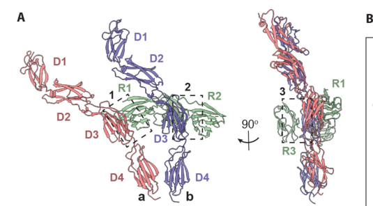

## Question

# Gene Research for Functional Annotation

## ⚠️ CRITICAL: Gene/Protein Identification Context

**BEFORE YOU BEGIN RESEARCH:** You MUST verify you are researching the CORRECT gene/protein. Gene symbols can be ambiguous, especially for less well-characterized genes from non-model organisms.

### Target Gene/Protein Identity (from UniProt):
- **UniProt Accession:** P08575
- **Protein Description:** RecName: Full=Receptor-type tyrosine-protein phosphatase C {ECO:0000305}; EC=3.1.3.48; AltName: Full=Leukocyte common antigen; Short=L-CA; AltName: Full=T200; AltName: CD_antigen=CD45; Flags: Precursor;
- **Gene Information:** Name=PTPRC {ECO:0000312|HGNC:HGNC:9666}; Synonyms=CD45;
- **Organism (full):** Homo sapiens (Human).
- **Protein Family:** Belongs to the protein-tyrosine phosphatase family.
- **Key Domains:** FN3_dom. (IPR003961); FN3_sf. (IPR036116); Ig-like_fold. (IPR013783); Prot-tyrosine_phosphatase-like. (IPR029021); Protein-Tyr_Phosphatase. (IPR050348)

### MANDATORY VERIFICATION STEPS:

1. **Check if the gene symbol "PTPRC" matches the protein description above**
2. **Verify the organism is correct:** Homo sapiens (Human).
3. **Check if protein family/domains align with what you find in literature**
4. **If you find literature for a DIFFERENT gene with the same or similar symbol, STOP**

### If Gene Symbol is Ambiguous or You Cannot Find Relevant Literature:

**DO NOT PROCEED WITH RESEARCH ON A DIFFERENT GENE.** Instead:
- State clearly: "The gene symbol 'PTPRC' is ambiguous or literature is limited for this specific protein"
- Explain what you found (e.g., "Found extensive literature on a different gene with the same symbol in a different organism")
- Describe the protein based ONLY on the UniProt information provided above
- Suggest that the protein function can be inferred from domain/family information

### Research Target:

Please provide a comprehensive research report on the gene **PTPRC** (gene ID: PTPRC, UniProt: P08575) in human.

The research report should be a detailed narrative explaining the function, biological processes, and localization of the gene product. Citations should be given for all claims.

You should prioritize authoritative reviews and primary scientific literature when conducting research. You can supplement
this with annotations you find in gene/protein databases, but these can be outdated or inaccurate.

We are specifically interested in the primary function of the gene - for enzymes, what reaction is catalyzed, and what is the substrate specificity? For transporters, what is the substrate? For structural proteins or adapters, what is the broader structural role? For signaling molecules, what is the role in the pathway.

We are interested in where in or outside the cell the gene product carries out its function.

We are also interested in the signaling or biochemical pathways in which the gene functions. We are less interested in broad pleiotropic effects, except where these elucidate the precise role.

Include evidence where possible. We are interested in both experimental evidence as well as inference from structure, evolution, or bioinformatic analysis. Precise studies should be prioritized over high-throughput, where available.

## Output

Question: You are an expert researcher providing comprehensive, well-cited information.

Provide detailed information focusing on:
1. Key concepts and definitions with current understanding
2. Recent developments and latest research (prioritize 2023-2024 sources)
3. Current applications and real-world implementations
4. Expert opinions and analysis from authoritative sources
5. Relevant statistics and data from recent studies

Format as a comprehensive research report with proper citations. Include URLs and publication dates where available.
Always prioritize recent, authoritative sources and provide specific citations for all major claims.

# Gene Research for Functional Annotation

## ⚠️ CRITICAL: Gene/Protein Identification Context

**BEFORE YOU BEGIN RESEARCH:** You MUST verify you are researching the CORRECT gene/protein. Gene symbols can be ambiguous, especially for less well-characterized genes from non-model organisms.

### Target Gene/Protein Identity (from UniProt):
- **UniProt Accession:** P08575
- **Protein Description:** RecName: Full=Receptor-type tyrosine-protein phosphatase C {ECO:0000305}; EC=3.1.3.48; AltName: Full=Leukocyte common antigen; Short=L-CA; AltName: Full=T200; AltName: CD_antigen=CD45; Flags: Precursor;
- **Gene Information:** Name=PTPRC {ECO:0000312|HGNC:HGNC:9666}; Synonyms=CD45;
- **Organism (full):** Homo sapiens (Human).
- **Protein Family:** Belongs to the protein-tyrosine phosphatase family.
- **Key Domains:** FN3_dom. (IPR003961); FN3_sf. (IPR036116); Ig-like_fold. (IPR013783); Prot-tyrosine_phosphatase-like. (IPR029021); Protein-Tyr_Phosphatase. (IPR050348)

### MANDATORY VERIFICATION STEPS:

1. **Check if the gene symbol "PTPRC" matches the protein description above**
2. **Verify the organism is correct:** Homo sapiens (Human).
3. **Check if protein family/domains align with what you find in literature**
4. **If you find literature for a DIFFERENT gene with the same or similar symbol, STOP**

### If Gene Symbol is Ambiguous or You Cannot Find Relevant Literature:

**DO NOT PROCEED WITH RESEARCH ON A DIFFERENT GENE.** Instead:
- State clearly: "The gene symbol 'PTPRC' is ambiguous or literature is limited for this specific protein"
- Explain what you found (e.g., "Found extensive literature on a different gene with the same symbol in a different organism")
- Describe the protein based ONLY on the UniProt information provided above
- Suggest that the protein function can be inferred from domain/family information

### Research Target:

Please provide a comprehensive research report on the gene **PTPRC** (gene ID: PTPRC, UniProt: P08575) in human.

The research report should be a detailed narrative explaining the function, biological processes, and localization of the gene product. Citations should be given for all claims.

You should prioritize authoritative reviews and primary scientific literature when conducting research. You can supplement
this with annotations you find in gene/protein databases, but these can be outdated or inaccurate.

We are specifically interested in the primary function of the gene - for enzymes, what reaction is catalyzed, and what is the substrate specificity? For transporters, what is the substrate? For structural proteins or adapters, what is the broader structural role? For signaling molecules, what is the role in the pathway.

We are interested in where in or outside the cell the gene product carries out its function.

We are also interested in the signaling or biochemical pathways in which the gene functions. We are less interested in broad pleiotropic effects, except where these elucidate the precise role.

Include evidence where possible. We are interested in both experimental evidence as well as inference from structure, evolution, or bioinformatic analysis. Precise studies should be prioritized over high-throughput, where available.

# Human PTPRC (CD45): functional annotation research report

**Identity verified.** Human **PTPRC**, UniProt **[P08575](https://www.uniprot.org/uniprotkb/P08575/entry)**, encodes **CD45**, also called leukocyte common antigen or receptor-type protein-tyrosine phosphatase C. This is the hematopoietic, single-pass membrane phosphatase—not the similarly named PTPRG or PTPN22. Its extracellular fibronectin type III–like region and tandem intracellular protein-tyrosine-phosphatase domains agree with the supplied family and domain annotations. (conklin2026receptorproteintyrosine pages 5-7, barashdi2021proteintyrosinephosphatase pages 1-2)

## Primary molecular function and location

CD45 catalyzes **hydrolysis of phosphate from protein phosphotyrosine**: protein–Tyr–O–PO₃²⁻ + H₂O → protein–Tyr–OH + inorganic phosphate. Its membrane-proximal **cytoplasmic D1 domain** is catalytically active; the distal cytoplasmic **D2 domain** is a catalytically inactive phosphatase-like domain that contributes to effective enzyme function, although its precise physiological regulatory mechanism remains unsettled. CD45 is therefore neither a tyrosine kinase nor primarily an extracellular phosphatase: its extracellular portion can govern interactions and spatial positioning, while its catalytic site acts on proteins at the **cytoplasmic face of the leukocyte plasma membrane**. (barashdi2021proteintyrosinephosphatase pages 1-2, hermiston2009cd45cd148and pages 2-4)

CD45 is abundant on most nucleated hematopoietic cells, notably T and B lymphocytes and myeloid cells; mature erythrocytes lack it. A 2021 clinical-pathology review describes a heavily glycosylated, approximately **180–220-kDa** protein with an extracellular variable region, cysteine-rich region and three fibronectin type III–like repeats, followed by a transmembrane segment and cytoplasmic phosphatase domains. Alternative splicing of extracellular exons A, B and C produces isoforms including **CD45RA**, associated with naïve T cells, and **CD45RO**, enriched on activated and memory T cells. These extracellular differences can change antibody recognition and access to closely apposed cell–cell contacts without changing the identity of the intracellular catalytic D1 domain. (barashdi2021proteintyrosinephosphatase pages 1-1, barashdi2021proteintyrosinephosphatase pages 1-2, barashdi2021proteintyrosinephosphatase pages 3-3)

## Substrates and signaling mechanism

**The most firmly established physiological role is setting Src-family-kinase signaling thresholds.** In T cells, CD45 opposes Csk-mediated phosphorylation of the inhibitory **LCK Tyr505** site. Removing that phosphate makes LCK more capable of phosphorylating T-cell-receptor (TCR)/CD3 immunoreceptor tyrosine-based activation motifs (ITAMs), initiating ZAP70 recruitment and downstream signaling. CD45 also regulates **FYN** and, in B-cell signaling, **LYN**. It can dephosphorylate the activating LCK **Tyr394** site as well, potentially *reducing* kinase output. Thus substrate specificity is best described as phosphotyrosines on accessible immune-signaling proteins—particularly regulatory sites on Src-family kinases—not as a unique affinity for one peptide sequence or an invariably activating effect. Site phosphorylation in cells can additionally reflect indirect kinase feedback; it does not, by itself, prove direct enzyme–substrate contact. (hermiston2009cd45cd148and pages 5-7, hermiston2009cd45cd148and pages 4-5, liu2024ikzf1andubr4 pages 1-2, cordoba2013thelargeectodomains pages 1-2)

CD45 has a second, locally inhibitory role near the engaged TCR: CD3ζ/ITAM phosphotyrosines are candidate substrates, supported by biochemical observations and intact-cell perturbation experiments. In a 2019 study combining genetic manipulation of CD45 with acute Csk inhibition, CD45 maintained a regulatable pool of active LCK while restraining ζ-chain phosphorylation and weak or antigen-independent responses; strong-antigen responses remained possible. CD45 therefore functions as a **signaling gatekeeper**, not simply an on/off switch. Its effect varies with enzyme abundance, antigen affinity, kinase activity and access to different substrate pools. (courtney2019cd45functionsas pages 1-2, courtney2019cd45functionsas pages 3-4, hermiston2009cd45cd148and pages 5-7)

Access is spatially regulated. At a tight T-cell–antigen-presenting-cell contact, the bulky CD45 ectodomain is relatively excluded from ligated TCR microclusters, favoring local ITAM phosphorylation even though CD45 elsewhere on the same membrane helps prime LCK. Experimentally shortening the CD45 ectodomain increased its colocalization with engaged TCR and inhibited triggering, supporting—but not establishing as the sole possible mechanism—the **kinetic-segregation** model. In B cells, CD45-dependent Src-family-kinase regulation likewise contributes to B-cell-receptor signaling; the balance of activating and inhibitory effects and compensation by other phosphatases differ across lineages. (cordoba2013thelargeectodomains pages 1-2, hermiston2009cd45cd148and pages 7-8, hermiston2009cd45cd148and pages 4-5)

**Additional proposed substrates require a narrower interpretation.** JAK-family kinases have been reported as CD45 substrates in cytokine-receptor/JAK–STAT regulation, and TCRζ, PAG/CBP, DAP12 and SKAP proteins have also been proposed. An authoritative phosphatase review cautions that the physiological importance of these assignments is less secure than Src-family-kinase regulation, because perturbing CD45 also changes downstream phosphorylation indirectly. Its best-supported annotation is consequently *cell-surface control of proximal leukocyte tyrosine-kinase signaling*, with cytokine- and other pathway effects dependent on context. (hermiston2009cd45cd148and pages 4-5, barashdi2021proteintyrosinephosphatase pages 2-3, barashdi2021proteintyrosinephosphatase pages 1-2)

## Human genetic and recent mechanistic evidence

Human loss-of-function observations establish the biological necessity of CD45 without requiring every downstream effect to be a direct substrate interaction. A **2001** report identified a homozygous PTPRC deletion removing two residues from the first extracellular fibronectin type III module; surface CD45 was lost in an infant with severe combined immunodeficiency (SCID). A **2012** report described another CD45-deficient infant with markedly reduced, nonfunctional T cells and preserved B- and NK-cell numbers: maternal chromosome-1 uniparental disomy made a PTPRC nonsense allele homozygous. These cases strongly implicate CD45 in normal human T-cell development and antigen-receptor function. (tchilian2001adeletionin pages 1-2, roberts2012cd45deficientseverecombined pages 1-2)

A notable **2024** advance showed that an adenovirus protein can regulate CD45 **from outside the cell**. Borowska and colleagues measured approximately **0.3 nM** binding of viral E3/49K to a human CD45 ectodomain and obtained a **3.8-Å** cryo-EM map of a complex containing **two CD45 molecules per E3/49K molecule**. E3/49K bridges the **extracellular D3 region**, imposing a dimer geometry associated with reduced intracellular phosphatase activity and suppressed T-cell signaling; engineered binders altered T-cell activation according to dimer orientation and spacing. The extracellular structural designation **D3 is not the intracellular catalytic D1**. Effects in primary blood cells were weaker than in Jurkat cells, and the engineered approach remains experimental. The cropped structural panel, Figure 2A, illustrates the viral protein bridging two CD45 ectodomains. (borowska2024orientationdependentcd45 pages 1-3, borowska2024orientationdependentcd45 pages 3-4, borowska2024orientationdependentcd45 pages 6-8, borowska2024orientationdependentcd45 media 5fa70fc6)

Two further **2024** studies illuminate context rather than redefine CD45’s primary reaction. In a family with IgG4-related disease, a UBR4 variant impeded CD45 degradation while an IKZF1 variant raised FYN expression; increased CD45 and FYN together lowered the T-cell activation threshold. This is a mechanistically informative **three-affected-member family**, not evidence that PTPRC itself was mutated in those patients or that the mechanism generalizes to all IgG4-related disease. Separately, investigators reported that some circulating tumor cells acquire **extracellular-vesicle-derived CD45**: CD45-mediated interactions with T cells impeded its normal exclusion from the TCR synapse and weakened T-cell signaling. Tumor-surface CD45 in that setting should not automatically be interpreted as tumor-cell PTPRC expression; the mechanistic and prognostic findings require validation across cancer types. (liu2024ikzf1andubr4 pages 1-2, yang2024circulatingtumorcells pages 1-2)

The following table separates the best-supported biochemical roles from emerging applications and their evidentiary limits. (hermiston2009cd45cd148and pages 4-5, borowska2024orientationdependentcd45 pages 3-4, wellhausen2023epitopebaseediting pages 8-9, orozco2024targetedradiationdelivery pages 1-3)

| Process or application | Direct molecular role or site | Strongest evidence | Evidence rank | Caveat |
|---|---|---|---|---|
| Catalytic architecture | Cytoplasmic, membrane-proximal **D1** is the active protein-tyrosine-phosphatase domain; distal **D2** is catalytically inactive but supports folding, substrate recruitment, and regulation. Reaction: phosphoprotein–Tyr–P + H₂O → phosphoprotein–Tyr–OH + Pi. | [Al Barashdi et al., 2021](https://doi.org/10.1136/jclinpath-2020-206927), published May 2021 (barashdi2021proteintyrosinephosphatase pages 1-2, hermiston2009cd45cd148and pages 2-4) | **High** | D2 is a pseudophosphatase, but its precise physiological regulatory mechanism remains incompletely resolved. |
| TCR signaling and spatial segregation | CD45 activates LCK by dephosphorylating inhibitory **Y505**, but can also reduce kinase activity by dephosphorylating activation-loop **Y394** and TCR/CD3ζ ITAMs. Size-based exclusion from close TCR–pMHC contacts shifts the local balance toward phosphorylation. | [Courtney et al., 2019](https://doi.org/10.1126/scisignal.aaw8151), published October 22, 2019; [Cordoba et al., 2013](https://doi.org/10.1182/blood-2012-07-442251), published May 23, 2013 (hermiston2009cd45cd148and pages 5-7, courtney2019cd45functionsas pages 1-2, cordoba2013thelargeectodomains pages 1-2, courtney2019cd45functionsas pages 3-4) | **High** | Net output depends on CD45 abundance, substrate access, developmental state, antigen affinity, and other phosphatases; bulk phosphorylation measurements may combine distinct molecular pools. |
| B-cell antigen-receptor signaling | CD45 regulates Src-family kinases, especially **LYN**; removal of inhibitory C-terminal phosphorylation generally facilitates BCR signaling. **FYN** can likewise be activated by CD45-dependent dephosphorylation. | [Hermiston et al., 2009](https://doi.org/10.1111/j.1600-065x.2008.00752.x), published March 2009; [Liu et al., 2024](https://doi.org/10.1172/JCI178692), published June 17, 2024 (barashdi2021proteintyrosinephosphatase pages 2-3, liu2024ikzf1andubr4 pages 1-2, hermiston2009cd45cd148and pages 7-8) | **Moderate–high** | Altered LYN or FYN phosphorylation may partly be indirect or distributed across different kinase pools; effects vary by cellular context. |
| Cytokine–JAK/STAT signaling | CD45 has been reported to dephosphorylate JAK-family kinases and negatively regulate cytokine-receptor signaling. | [Irie-Sasaki et al., 2001](https://doi.org/10.1038/35053086), published January 2001; review synthesis in [Al Barashdi et al., 2021](https://doi.org/10.1136/jclinpath-2020-206927) (hermiston2009cd45cd148and pages 4-5, hermiston2009cd45cd148and pages 23-25, barashdi2021proteintyrosinephosphatase pages 1-2) | **Moderate** | This is less securely established as CD45’s primary physiological function than Src-family-kinase regulation; relevance varies by cytokine, lineage, and state. |
| Viral extracellular dimer inhibition | Adenoviral E3/49K binds the **extracellular D3 region** and bridges two CD45 molecules into an asymmetric 2:1 complex, suppressing intracellular phosphatase activity and T-cell signaling. Affinity was **0.3 nM** and the cryo-EM map **3.8 Å**. | [Borowska et al., 2024](https://doi.org/10.1126/sciimmunol.adp0707), published October 25, 2024 (borowska2024orientationdependentcd45 pages 1-3, borowska2024orientationdependentcd45 pages 3-4, borowska2024orientationdependentcd45 pages 6-8, borowska2024orientationdependentcd45 media 5fa70fc6) | **High** | Extracellular **D3** is distinct from cytoplasmic catalytic **D1**. Inhibition is orientation- and proximity-dependent; effects were weaker in primary PBMCs than in Jurkat cells and need in-vivo validation. |
| Function-preserving CD45 epitope editing | CRISPR adenine base editing introduced extracellular **Y232C**, preventing CAR recognition while retaining CD45 expression. Edited HSCs engrafted and generated myeloid, B-, and T-cell progeny; knockout HSCs declined, formed fewer colonies, and failed to generate T cells. | [Wellhausen et al., 2023](https://doi.org/10.1126/scitranslmed.adi1145), published September 2023 (wellhausen2023epitopebaseediting pages 6-8, wellhausen2023epitopebaseediting pages 3-4, wellhausen2023epitopebaseediting pages 8-9, wellhausen2023epitopebaseediting pages 22-25) | **High, preclinical** | Demonstrated in ex-vivo human cells and xenografts, not patients; editing safety, off-target changes, and durable immune competence require clinical evaluation. |
| Anti-CD45 radioimmunotherapy before HCT | CD45 served as a high-copy **surface address** for iodine-131–BC8 delivery, not as an enzymatic inhibitor. Twenty-five patients received **12–26 Gy** to the dose-limiting organ; all achieved day-28 morphologic remission. One-year OS and PFS were **40%** and **32%**; two-year OS and PFS were both **24%**; one-year relapse and non-relapse mortality were **56%** and **12%**. | Phase 1/2 study: [Orozco et al., 2024](https://doi.org/10.1158/1078-0432.CCR-23-1200), published in 2024 (orozco2024targetedradiationdelivery pages 1-3) | **Clinical, early phase** | Small, heterogeneous, nonrandomized cohort receiving additional conditioning and transplantation; outcomes cannot be attributed solely to anti-CD45 radiation. |

*Table: Evidence-ranked summary of CD45 molecular functions and translational applications, emphasizing direct sites, recent quantitative findings, and key interpretive limitations.*

## Applications and evidence limits

**Established laboratory use versus investigational therapy.** CD45 and its splice isoforms are widely used as hematopoietic-cell markers, including immunophenotyping by flow cytometry; this application relies on accessible extracellular epitopes, not pharmacological inhibition of D1. As a therapeutic *surface address*, CD45 can guide payloads to blood and marrow, but its broad normal-leukocyte expression creates predictable on-target hematopoietic toxicity. CD45-targeting antibodies, cell therapies and transplantation-conditioning strategies must therefore be distinguished from drugs designed to inhibit its phosphatase activity. (barashdi2021proteintyrosinephosphatase pages 1-1, barashdi2021proteintyrosinephosphatase pages 3-4, stepanova2024targetingcd45by pages 1-3, orozco2024targetedradiationdelivery pages 1-3)

In **2023**, Wellhausen and colleagues used adenine base editing to introduce the extracellular **CD45 Y232C** epitope alteration. It prevented recognition by a CD45-directed CAR while retaining CD45 expression. In human-cell and mouse-xenograft experiments, edited stem cells persisted and generated myeloid, B-cell and T-cell descendants, whereas complete CD45 knockout impaired colony formation and T-cell generation; edited anti-CD45 CAR T cells controlled experimental leukemias. These are powerful preclinical comparisons, **not clinical efficacy results**, and functional preservation is supported by cellular assays rather than a complete accounting of all potential CD45 substrates. A separate **2024** preclinical study generated CD45-knockout anti-CD45 CAR T cells to prevent fratricide; it observed **greater than 85%** loss of surface CD45 after editing and antitumor activity, but longer-term consequences of knockout cannot be assumed equivalent to epitope-preserving editing. (wellhausen2023epitopebaseediting pages 6-8, wellhausen2023epitopebaseediting pages 3-4, wellhausen2023epitopebaseediting pages 8-9, stepanova2024targetingcd45by pages 3-5)

For a clinical-scale example of CD45 as an antigen rather than an enzyme target, a **2024** report of a **phase 1/2**, nonrandomized transplantation-conditioning study administered iodine-131–labeled anti-CD45 BC8 followed by additional conditioning and haploidentical transplantation to **25 patients** with high-risk leukemia or myelodysplastic syndrome. All 25 were in morphologic remission at day 28; estimated overall survival was **40% at one year** and **24% at two years**. One-year relapse was **56%**. The combined regimen and small heterogeneous cohort prevent attribution of these outcomes to CD45 targeting alone and provide no evidence that BC8 inhibited CD45 catalysis. (orozco2024targetedradiationdelivery pages 1-3)

**Bottom line.** The strongest functional annotation for human PTPRC/P08575 is an abundant **leukocyte plasma-membrane protein-tyrosine phosphatase** whose intracellular D1 domain regulates proximal immune signaling, principally by controlling inhibitory and activating phosphotyrosines on Src-family kinases. Its extracellular glycosylated, alternatively spliced architecture determines where the enzyme can act and how it can be recognized or modulated; whether CD45 increases or decreases a particular immune response depends on the local substrate, signaling state and membrane geometry. (barashdi2021proteintyrosinephosphatase pages 1-2, hermiston2009cd45cd148and pages 5-7, hermiston2009cd45cd148and pages 4-5, cordoba2013thelargeectodomains pages 1-2, borowska2024orientationdependentcd45 pages 3-4)

References

1. (conklin2026receptorproteintyrosine pages 5-7): Abigail E. Conklin, Colin L. Welsh, and Lalima K. Madan. Receptor protein tyrosine phosphatases (rptps): structure and biological roles in cancer. Kinases and Phosphatases, 4:7, Mar 2026. URL: https://doi.org/10.3390/kinasesphosphatases4010007, doi:10.3390/kinasesphosphatases4010007. This article has 1 citations.

2. (barashdi2021proteintyrosinephosphatase pages 1-2): Maryam Ahmed Al Barashdi, Ahlam Ali, Mary Frances McMullin, and Ken Mills. Protein tyrosine phosphatase receptor type c (ptprc or cd45). Journal of Clinical Pathology, 74:548-552, May 2021. URL: https://doi.org/10.1136/jclinpath-2020-206927, doi:10.1136/jclinpath-2020-206927. This article has 325 citations and is from a peer-reviewed journal.

3. (hermiston2009cd45cd148and pages 2-4): Michelle L. Hermiston, Julie Zikherman, and Jing W. Zhu. Cd45, cd148, and lyp/pep: critical phosphatases regulating src family kinase signaling networks in immune cells. Immunological Reviews, 228:288-311, Mar 2009. URL: https://doi.org/10.1111/j.1600-065x.2008.00752.x, doi:10.1111/j.1600-065x.2008.00752.x. This article has 238 citations and is from a domain leading peer-reviewed journal.

4. (barashdi2021proteintyrosinephosphatase pages 1-1): Maryam Ahmed Al Barashdi, Ahlam Ali, Mary Frances McMullin, and Ken Mills. Protein tyrosine phosphatase receptor type c (ptprc or cd45). Journal of Clinical Pathology, 74:548-552, May 2021. URL: https://doi.org/10.1136/jclinpath-2020-206927, doi:10.1136/jclinpath-2020-206927. This article has 325 citations and is from a peer-reviewed journal.

5. (barashdi2021proteintyrosinephosphatase pages 3-3): Maryam Ahmed Al Barashdi, Ahlam Ali, Mary Frances McMullin, and Ken Mills. Protein tyrosine phosphatase receptor type c (ptprc or cd45). Journal of Clinical Pathology, 74:548-552, May 2021. URL: https://doi.org/10.1136/jclinpath-2020-206927, doi:10.1136/jclinpath-2020-206927. This article has 325 citations and is from a peer-reviewed journal.

6. (hermiston2009cd45cd148and pages 5-7): Michelle L. Hermiston, Julie Zikherman, and Jing W. Zhu. Cd45, cd148, and lyp/pep: critical phosphatases regulating src family kinase signaling networks in immune cells. Immunological Reviews, 228:288-311, Mar 2009. URL: https://doi.org/10.1111/j.1600-065x.2008.00752.x, doi:10.1111/j.1600-065x.2008.00752.x. This article has 238 citations and is from a domain leading peer-reviewed journal.

7. (hermiston2009cd45cd148and pages 4-5): Michelle L. Hermiston, Julie Zikherman, and Jing W. Zhu. Cd45, cd148, and lyp/pep: critical phosphatases regulating src family kinase signaling networks in immune cells. Immunological Reviews, 228:288-311, Mar 2009. URL: https://doi.org/10.1111/j.1600-065x.2008.00752.x, doi:10.1111/j.1600-065x.2008.00752.x. This article has 238 citations and is from a domain leading peer-reviewed journal.

8. (liu2024ikzf1andubr4 pages 1-2): Qingxiang Liu, Yanyan Zheng, Ines Sturmlechner, Abhinav Jain, Maryam Own, Qiankun Yang, Huimin Zhang, Filippo Pinto e Vairo, Karen Cerosaletti, Jane H. Buckner, Kenneth J. Warrington, Matthew J. Koster, Cornelia M. Weyand, and Jörg J. Goronzy. Ikzf1 and ubr4 gene variants drive autoimmunity and th2 polarization in igg4-related disease. The Journal of Clinical Investigation, Jun 2024. URL: https://doi.org/10.1172/jci178692, doi:10.1172/jci178692. This article has 21 citations.

9. (cordoba2013thelargeectodomains pages 1-2): Shaun-Paul Cordoba, Kaushik Choudhuri, Hao Zhang, Marcus Bridge, Alp Bugra Basat, Michael L. Dustin, and P. Anton van der Merwe. The large ectodomains of cd45 and cd148 regulate their segregation from and inhibition of ligated t-cell receptor. Blood, 121 21:4295-302, May 2013. URL: https://doi.org/10.1182/blood-2012-07-442251, doi:10.1182/blood-2012-07-442251. This article has 169 citations and is from a highest quality peer-reviewed journal.

10. (courtney2019cd45functionsas pages 1-2): Adam H. Courtney, Alexey A. Shvets, Wen Lu, Gloria Griffante, Marianne Mollenauer, Veronika Horkova, Wan-Lin Lo, Steven Yu, Ondrej Stepanek, Arup K. Chakraborty, and Arthur Weiss. Cd45 functions as a signaling gatekeeper in t cells. Science Signaling, Oct 2019. URL: https://doi.org/10.1126/scisignal.aaw8151, doi:10.1126/scisignal.aaw8151. This article has 232 citations and is from a domain leading peer-reviewed journal.

11. (courtney2019cd45functionsas pages 3-4): Adam H. Courtney, Alexey A. Shvets, Wen Lu, Gloria Griffante, Marianne Mollenauer, Veronika Horkova, Wan-Lin Lo, Steven Yu, Ondrej Stepanek, Arup K. Chakraborty, and Arthur Weiss. Cd45 functions as a signaling gatekeeper in t cells. Science Signaling, Oct 2019. URL: https://doi.org/10.1126/scisignal.aaw8151, doi:10.1126/scisignal.aaw8151. This article has 232 citations and is from a domain leading peer-reviewed journal.

12. (hermiston2009cd45cd148and pages 7-8): Michelle L. Hermiston, Julie Zikherman, and Jing W. Zhu. Cd45, cd148, and lyp/pep: critical phosphatases regulating src family kinase signaling networks in immune cells. Immunological Reviews, 228:288-311, Mar 2009. URL: https://doi.org/10.1111/j.1600-065x.2008.00752.x, doi:10.1111/j.1600-065x.2008.00752.x. This article has 238 citations and is from a domain leading peer-reviewed journal.

13. (barashdi2021proteintyrosinephosphatase pages 2-3): Maryam Ahmed Al Barashdi, Ahlam Ali, Mary Frances McMullin, and Ken Mills. Protein tyrosine phosphatase receptor type c (ptprc or cd45). Journal of Clinical Pathology, 74:548-552, May 2021. URL: https://doi.org/10.1136/jclinpath-2020-206927, doi:10.1136/jclinpath-2020-206927. This article has 325 citations and is from a peer-reviewed journal.

14. (tchilian2001adeletionin pages 1-2): Elma Z. Tchilian, Diana L. Wallace, R. Spencer Wells, Darren R. Flower, Gareth Morgan, and Peter C. L. Beverley. A deletion in the gene encoding the cd45 antigen in a patient with scid. The Journal of Immunology, 166:1308-1313, Jan 2001. URL: https://doi.org/10.4049/jimmunol.166.2.1308, doi:10.4049/jimmunol.166.2.1308. This article has 236 citations.

15. (roberts2012cd45deficientseverecombined pages 1-2): Joseph L. Roberts, Rebecca H. Buckley, Biao Luo, Jianming Pei, Alla Lapidus, Suraj Peri, Qiong Wei, Jinwook Shin, Roberta E. Parrott, Roland L. Dunbrack, Joseph R. Testa, Xiao-Ping Zhong, and David L. Wiest. Cd45-deficient severe combined immunodeficiency caused by uniparental disomy. Proceedings of the National Academy of Sciences, 109:10456-10461, Jun 2012. URL: https://doi.org/10.1073/pnas.1202249109, doi:10.1073/pnas.1202249109. This article has 67 citations and is from a highest quality peer-reviewed journal.

16. (borowska2024orientationdependentcd45 pages 1-3): Marta T. Borowska, Liu D. Liu, Nathanael A. Caveney, Kevin M. Jude, Won-Ju Kim, Takeya Masubuchi, Enfu Hui, Robbie G. Majzner, and K. Christopher Garcia. Orientation dependent cd45 inhibition with viral and engineered ligands. Science immunology, 9:eadp0707-eadp0707, Oct 2024. URL: https://doi.org/10.1126/sciimmunol.adp0707, doi:10.1126/sciimmunol.adp0707. This article has 6 citations and is from a highest quality peer-reviewed journal.

17. (borowska2024orientationdependentcd45 pages 3-4): Marta T. Borowska, Liu D. Liu, Nathanael A. Caveney, Kevin M. Jude, Won-Ju Kim, Takeya Masubuchi, Enfu Hui, Robbie G. Majzner, and K. Christopher Garcia. Orientation dependent cd45 inhibition with viral and engineered ligands. Science immunology, 9:eadp0707-eadp0707, Oct 2024. URL: https://doi.org/10.1126/sciimmunol.adp0707, doi:10.1126/sciimmunol.adp0707. This article has 6 citations and is from a highest quality peer-reviewed journal.

18. (borowska2024orientationdependentcd45 pages 6-8): Marta T. Borowska, Liu D. Liu, Nathanael A. Caveney, Kevin M. Jude, Won-Ju Kim, Takeya Masubuchi, Enfu Hui, Robbie G. Majzner, and K. Christopher Garcia. Orientation dependent cd45 inhibition with viral and engineered ligands. Science immunology, 9:eadp0707-eadp0707, Oct 2024. URL: https://doi.org/10.1126/sciimmunol.adp0707, doi:10.1126/sciimmunol.adp0707. This article has 6 citations and is from a highest quality peer-reviewed journal.

19. (borowska2024orientationdependentcd45 media 5fa70fc6): Marta T. Borowska, Liu D. Liu, Nathanael A. Caveney, Kevin M. Jude, Won-Ju Kim, Takeya Masubuchi, Enfu Hui, Robbie G. Majzner, and K. Christopher Garcia. Orientation dependent cd45 inhibition with viral and engineered ligands. Science immunology, 9:eadp0707-eadp0707, Oct 2024. URL: https://doi.org/10.1126/sciimmunol.adp0707, doi:10.1126/sciimmunol.adp0707. This article has 6 citations and is from a highest quality peer-reviewed journal.

20. (yang2024circulatingtumorcells pages 1-2): Chuan Yang, Xueping Wang, Kenneth K. W. To, Cai-Mei Cui, M. Luo, Shaocong Wu, Lamei Huang, Kai Fu, Can Pan, Zeyu Liu, Teng Fan, Cai-Bo Yang, Fang Wang, and Liwu Fu. Circulating tumor cells shielded with extracellular vesicle-derived cd45 evade t cell attack to enable metastasis. Signal Transduction and Targeted Therapy, Apr 2024. URL: https://doi.org/10.1038/s41392-024-01789-1, doi:10.1038/s41392-024-01789-1. This article has 64 citations and is from a peer-reviewed journal.

21. (wellhausen2023epitopebaseediting pages 8-9): Nils Wellhausen, Ryan P. O’Connell, Stefanie Lesch, Nils W. Engel, Austin K. Rennels, Donna Gonzales, Friederike Herbst, Regina M. Young, K. Christopher Garcia, David Weiner, Carl H. June, and Saar I. Gill. Epitope base editing cd45 in hematopoietic cells enables universal blood cancer immune therapy. Science Translational Medicine, Sep 2023. URL: https://doi.org/10.1126/scitranslmed.adi1145, doi:10.1126/scitranslmed.adi1145. This article has 154 citations and is from a highest quality peer-reviewed journal.

22. (orozco2024targetedradiationdelivery pages 1-3): Johnnie J. Orozco, Phuong T. Vo, Ted A. Gooley, Robyn L. Haaf, Sally J. Lundberg, Donald K. Hamlin, D. Scott Wilbur, Manuela C. Matesan, Darrell R. Fisher, Ajay K. Gopal, Damian J. Green, John M. Pagel, and Brenda M. Sandmaier. Targeted radiation delivery before haploidentical hct for high-risk leukemia or mds patients yields long-term survivors. Clinical cancer research : an official journal of the American Association for Cancer Research, 30:274-282, Nov 2024. URL: https://doi.org/10.1158/1078-0432.ccr-23-1200, doi:10.1158/1078-0432.ccr-23-1200. This article has 3 citations.

23. (hermiston2009cd45cd148and pages 23-25): Michelle L. Hermiston, Julie Zikherman, and Jing W. Zhu. Cd45, cd148, and lyp/pep: critical phosphatases regulating src family kinase signaling networks in immune cells. Immunological Reviews, 228:288-311, Mar 2009. URL: https://doi.org/10.1111/j.1600-065x.2008.00752.x, doi:10.1111/j.1600-065x.2008.00752.x. This article has 238 citations and is from a domain leading peer-reviewed journal.

24. (wellhausen2023epitopebaseediting pages 6-8): Nils Wellhausen, Ryan P. O’Connell, Stefanie Lesch, Nils W. Engel, Austin K. Rennels, Donna Gonzales, Friederike Herbst, Regina M. Young, K. Christopher Garcia, David Weiner, Carl H. June, and Saar I. Gill. Epitope base editing cd45 in hematopoietic cells enables universal blood cancer immune therapy. Science Translational Medicine, Sep 2023. URL: https://doi.org/10.1126/scitranslmed.adi1145, doi:10.1126/scitranslmed.adi1145. This article has 154 citations and is from a highest quality peer-reviewed journal.

25. (wellhausen2023epitopebaseediting pages 3-4): Nils Wellhausen, Ryan P. O’Connell, Stefanie Lesch, Nils W. Engel, Austin K. Rennels, Donna Gonzales, Friederike Herbst, Regina M. Young, K. Christopher Garcia, David Weiner, Carl H. June, and Saar I. Gill. Epitope base editing cd45 in hematopoietic cells enables universal blood cancer immune therapy. Science Translational Medicine, Sep 2023. URL: https://doi.org/10.1126/scitranslmed.adi1145, doi:10.1126/scitranslmed.adi1145. This article has 154 citations and is from a highest quality peer-reviewed journal.

26. (wellhausen2023epitopebaseediting pages 22-25): Nils Wellhausen, Ryan P. O’Connell, Stefanie Lesch, Nils W. Engel, Austin K. Rennels, Donna Gonzales, Friederike Herbst, Regina M. Young, K. Christopher Garcia, David Weiner, Carl H. June, and Saar I. Gill. Epitope base editing cd45 in hematopoietic cells enables universal blood cancer immune therapy. Science Translational Medicine, Sep 2023. URL: https://doi.org/10.1126/scitranslmed.adi1145, doi:10.1126/scitranslmed.adi1145. This article has 154 citations and is from a highest quality peer-reviewed journal.

27. (barashdi2021proteintyrosinephosphatase pages 3-4): Maryam Ahmed Al Barashdi, Ahlam Ali, Mary Frances McMullin, and Ken Mills. Protein tyrosine phosphatase receptor type c (ptprc or cd45). Journal of Clinical Pathology, 74:548-552, May 2021. URL: https://doi.org/10.1136/jclinpath-2020-206927, doi:10.1136/jclinpath-2020-206927. This article has 325 citations and is from a peer-reviewed journal.

28. (stepanova2024targetingcd45by pages 1-3): Valeria M. Stepanova, Dmitry V. Volkov, Daria S. Osipova, Wenjian Wang, Yingqin Hou, Dmitry E. Pershin, Mariia S. Fadeeva, Ekaterina A. Malakhova, Elena A. Kulakovskaya, Lui Cuicui, Zhao Mingfeng, Hongkai Zhang, Jia Xie, Ding Zhang, Ilgar Z. Mamedov, Alexandr S. Chernov, Georgij B. Telegin, Yuri P. Rubtsov, Alexander G. Gabibov, Peng Wu, Michael A. Maschan, and Alexey V. Stepanov. Targeting cd45 by gene-edited car t cells for leukemia eradication and hematopoietic stem cell transplantation preconditioning. Sep 2024. URL: https://doi.org/10.1016/j.omton.2024.200843, doi:10.1016/j.omton.2024.200843. This article has 15 citations.

29. (stepanova2024targetingcd45by pages 3-5): Valeria M. Stepanova, Dmitry V. Volkov, Daria S. Osipova, Wenjian Wang, Yingqin Hou, Dmitry E. Pershin, Mariia S. Fadeeva, Ekaterina A. Malakhova, Elena A. Kulakovskaya, Lui Cuicui, Zhao Mingfeng, Hongkai Zhang, Jia Xie, Ding Zhang, Ilgar Z. Mamedov, Alexandr S. Chernov, Georgij B. Telegin, Yuri P. Rubtsov, Alexander G. Gabibov, Peng Wu, Michael A. Maschan, and Alexey V. Stepanov. Targeting cd45 by gene-edited car t cells for leukemia eradication and hematopoietic stem cell transplantation preconditioning. Sep 2024. URL: https://doi.org/10.1016/j.omton.2024.200843, doi:10.1016/j.omton.2024.200843. This article has 15 citations.

## Artifacts

- [Edison artifact artifact-00](PTPRC-deep-research-falcon_artifacts/artifact-00.md)

## Citations

1. orozco2024targetedradiationdelivery pages 1-3
2. conklin2026receptorproteintyrosine pages 5-7
3. barashdi2021proteintyrosinephosphatase pages 1-2
4. barashdi2021proteintyrosinephosphatase pages 1-1
5. barashdi2021proteintyrosinephosphatase pages 3-3
6. cordoba2013thelargeectodomains pages 1-2
7. barashdi2021proteintyrosinephosphatase pages 2-3
8. tchilian2001adeletionin pages 1-2
9. yang2024circulatingtumorcells pages 1-2
10. wellhausen2023epitopebaseediting pages 8-9
11. wellhausen2023epitopebaseediting pages 6-8
12. wellhausen2023epitopebaseediting pages 3-4
13. wellhausen2023epitopebaseediting pages 22-25
14. barashdi2021proteintyrosinephosphatase pages 3-4
15. P08575
16. Al Barashdi et al., 2021
17. Courtney et al., 2019
18. Cordoba et al., 2013
19. Hermiston et al., 2009
20. Liu et al., 2024
21. Irie-Sasaki et al., 2001
22. Borowska et al., 2024
23. Wellhausen et al., 2023
24. Orozco et al., 2024
25. https://www.uniprot.org/uniprotkb/P08575/entry
26. https://doi.org/10.1136/jclinpath-2020-206927
27. https://doi.org/10.1126/scisignal.aaw8151
28. https://doi.org/10.1182/blood-2012-07-442251
29. https://doi.org/10.1111/j.1600-065x.2008.00752.x
30. https://doi.org/10.1172/JCI178692
31. https://doi.org/10.1038/35053086
32. https://doi.org/10.1126/sciimmunol.adp0707
33. https://doi.org/10.1126/scitranslmed.adi1145
34. https://doi.org/10.1158/1078-0432.CCR-23-1200
35. https://doi.org/10.3390/kinasesphosphatases4010007,
36. https://doi.org/10.1136/jclinpath-2020-206927,
37. https://doi.org/10.1111/j.1600-065x.2008.00752.x,
38. https://doi.org/10.1172/jci178692,
39. https://doi.org/10.1182/blood-2012-07-442251,
40. https://doi.org/10.1126/scisignal.aaw8151,
41. https://doi.org/10.4049/jimmunol.166.2.1308,
42. https://doi.org/10.1073/pnas.1202249109,
43. https://doi.org/10.1126/sciimmunol.adp0707,
44. https://doi.org/10.1038/s41392-024-01789-1,
45. https://doi.org/10.1126/scitranslmed.adi1145,
46. https://doi.org/10.1158/1078-0432.ccr-23-1200,
47. https://doi.org/10.1016/j.omton.2024.200843,