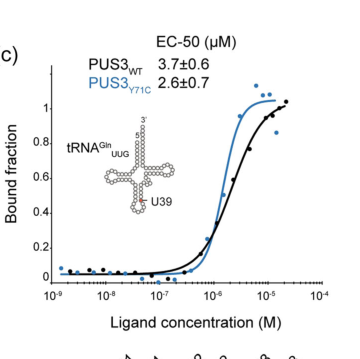

## Question

# Gene Research for Functional Annotation

## ⚠️ CRITICAL: Gene/Protein Identification Context

**BEFORE YOU BEGIN RESEARCH:** You MUST verify you are researching the CORRECT gene/protein. Gene symbols can be ambiguous, especially for less well-characterized genes from non-model organisms.

### Target Gene/Protein Identity (from UniProt):
- **UniProt Accession:** Q9BZE2
- **Protein Description:** RecName: Full=tRNA pseudouridine(38/39) synthase; EC=5.4.99.45 {ECO:0000269|PubMed:27055666}; AltName: Full=tRNA pseudouridine synthase 3; AltName: Full=tRNA pseudouridylate synthase 3; AltName: Full=tRNA-uridine isomerase 3;
- **Gene Information:** Name=PUS3; ORFNames=FKSG32;
- **Organism (full):** Homo sapiens (Human).
- **Protein Family:** Belongs to the tRNA pseudouridine synthase TruA family.
- **Key Domains:** PsdUridine_synth_cat_dom_sf. (IPR020103); PsdUridine_synth_TruA. (IPR001406); PsdUridine_synth_TruA_a/b_dom. (IPR020097); PsdUridine_synth_TruA_C. (IPR020095); Pus3-like. (IPR041707)

### MANDATORY VERIFICATION STEPS:

1. **Check if the gene symbol "PUS3" matches the protein description above**
2. **Verify the organism is correct:** Homo sapiens (Human).
3. **Check if protein family/domains align with what you find in literature**
4. **If you find literature for a DIFFERENT gene with the same or similar symbol, STOP**

### If Gene Symbol is Ambiguous or You Cannot Find Relevant Literature:

**DO NOT PROCEED WITH RESEARCH ON A DIFFERENT GENE.** Instead:
- State clearly: "The gene symbol 'PUS3' is ambiguous or literature is limited for this specific protein"
- Explain what you found (e.g., "Found extensive literature on a different gene with the same symbol in a different organism")
- Describe the protein based ONLY on the UniProt information provided above
- Suggest that the protein function can be inferred from domain/family information

### Research Target:

Please provide a comprehensive research report on the gene **PUS3** (gene ID: PUS3, UniProt: Q9BZE2) in human.

The research report should be a detailed narrative explaining the function, biological processes, and localization of the gene product. Citations should be given for all claims.

You should prioritize authoritative reviews and primary scientific literature when conducting research. You can supplement
this with annotations you find in gene/protein databases, but these can be outdated or inaccurate.

We are specifically interested in the primary function of the gene - for enzymes, what reaction is catalyzed, and what is the substrate specificity? For transporters, what is the substrate? For structural proteins or adapters, what is the broader structural role? For signaling molecules, what is the role in the pathway.

We are interested in where in or outside the cell the gene product carries out its function.

We are also interested in the signaling or biochemical pathways in which the gene functions. We are less interested in broad pleiotropic effects, except where these elucidate the precise role.

Include evidence where possible. We are interested in both experimental evidence as well as inference from structure, evolution, or bioinformatic analysis. Precise studies should be prioritized over high-throughput, where available.

## Output

Question: You are an expert researcher providing comprehensive, well-cited information.

Provide detailed information focusing on:
1. Key concepts and definitions with current understanding
2. Recent developments and latest research (prioritize 2023-2024 sources)
3. Current applications and real-world implementations
4. Expert opinions and analysis from authoritative sources
5. Relevant statistics and data from recent studies

Format as a comprehensive research report with proper citations. Include URLs and publication dates where available.
Always prioritize recent, authoritative sources and provide specific citations for all major claims.

# Gene Research for Functional Annotation

## ⚠️ CRITICAL: Gene/Protein Identification Context

**BEFORE YOU BEGIN RESEARCH:** You MUST verify you are researching the CORRECT gene/protein. Gene symbols can be ambiguous, especially for less well-characterized genes from non-model organisms.

### Target Gene/Protein Identity (from UniProt):
- **UniProt Accession:** Q9BZE2
- **Protein Description:** RecName: Full=tRNA pseudouridine(38/39) synthase; EC=5.4.99.45 {ECO:0000269|PubMed:27055666}; AltName: Full=tRNA pseudouridine synthase 3; AltName: Full=tRNA pseudouridylate synthase 3; AltName: Full=tRNA-uridine isomerase 3;
- **Gene Information:** Name=PUS3; ORFNames=FKSG32;
- **Organism (full):** Homo sapiens (Human).
- **Protein Family:** Belongs to the tRNA pseudouridine synthase TruA family.
- **Key Domains:** PsdUridine_synth_cat_dom_sf. (IPR020103); PsdUridine_synth_TruA. (IPR001406); PsdUridine_synth_TruA_a/b_dom. (IPR020097); PsdUridine_synth_TruA_C. (IPR020095); Pus3-like. (IPR041707)

### MANDATORY VERIFICATION STEPS:

1. **Check if the gene symbol "PUS3" matches the protein description above**
2. **Verify the organism is correct:** Homo sapiens (Human).
3. **Check if protein family/domains align with what you find in literature**
4. **If you find literature for a DIFFERENT gene with the same or similar symbol, STOP**

### If Gene Symbol is Ambiguous or You Cannot Find Relevant Literature:

**DO NOT PROCEED WITH RESEARCH ON A DIFFERENT GENE.** Instead:
- State clearly: "The gene symbol 'PUS3' is ambiguous or literature is limited for this specific protein"
- Explain what you found (e.g., "Found extensive literature on a different gene with the same symbol in a different organism")
- Describe the protein based ONLY on the UniProt information provided above
- Suggest that the protein function can be inferred from domain/family information

### Research Target:

Please provide a comprehensive research report on the gene **PUS3** (gene ID: PUS3, UniProt: Q9BZE2) in human.

The research report should be a detailed narrative explaining the function, biological processes, and localization of the gene product. Citations should be given for all claims.

You should prioritize authoritative reviews and primary scientific literature when conducting research. You can supplement
this with annotations you find in gene/protein databases, but these can be outdated or inaccurate.

We are specifically interested in the primary function of the gene - for enzymes, what reaction is catalyzed, and what is the substrate specificity? For transporters, what is the substrate? For structural proteins or adapters, what is the broader structural role? For signaling molecules, what is the role in the pathway.

We are interested in where in or outside the cell the gene product carries out its function.

We are also interested in the signaling or biochemical pathways in which the gene functions. We are less interested in broad pleiotropic effects, except where these elucidate the precise role.

Include evidence where possible. We are interested in both experimental evidence as well as inference from structure, evolution, or bioinformatic analysis. Precise studies should be prioritized over high-throughput, where available.

## Research report: Human **PUS3** (UniProt **Q9BZE2**) — functional annotation, mechanism, localization, and disease relevance

### 1) Key concepts, definitions, and current understanding

**Gene/protein identity and enzymatic class.** Human **PUS3** (UniProt Q9BZE2) encodes a **stand-alone pseudouridine synthase** in the **TruA family** (tRNA pseudouridine synthases). Its primary biochemical role is to catalyze **isomerization of uridine (U) to pseudouridine (Ψ)** in RNA (EC 5.4.99.45), a covalent rearrangement that changes the glycosidic linkage from N–C to C–C and introduces an N1-H capable of additional hydrogen bonding, typically increasing RNA structural stability. This role and family assignment are consistent across biochemical and review sources focused on human PUS3. (lin2022destabilizationofmutated pages 2-2, guillenangel2024exploringpseudouridylationdysregulation pages 1-3)

**Primary functional annotation (reaction and site).** The highest-confidence, PUS3-specific reaction is installation of **Ψ in the tRNA anticodon stem–loop**, particularly **positions 38/39** (often discussed as **Ψ38/Ψ39**). A primary biochemical study using recombinant human PUS3 shows direct catalysis of **tRNA Ψ39** formation in vitro using CMC-based primer extension assays. (lin2022destabilizationofmutated pages 13-13, lin2022destabilizationofmutated pages 10-10)

**Substrate specificity.** Mechanistic synthesis of recent work indicates that human PUS3 has **strict selectivity for intact, tRNA-shaped substrates** (recognizing global tRNA architecture) and **does not bind isolated anticodon stem-loop fragments** efficiently. In transcriptome-wide analyses summarized in a mechanistic review, **Pseudo-seq in PUS3-depleted human cells found no PUS3-dependent pseudouridylation sites in mRNAs**, supporting that PUS3’s primary substrates are tRNAs rather than mRNAs. (lin2025mechanisticinsightinto pages 4-5)

**Important nuance (mRNA targets).** Some reviews and summary tables list PUS3 among enzymes that can target **tRNA and mRNA**, but this is not consistently supported by the mechanistic evidence available in the retrieved corpus; accordingly, direct human mRNA targeting by PUS3 should be treated as **lower-confidence** than the tRNA anticodon-loop activity. (guillenangel2024exploringpseudouridylationdysregulation pages 1-3, lin2025mechanisticinsightinto pages 4-5)

### 2) Recent developments and latest research (prioritizing 2023–2024)

**2024 disease-focused pseudouridylation synthesis.** A 2024 review on pseudouridylation dysregulation and therapeutic potential explicitly lists **PUS3** among human pseudouridine synthases whose **mutations are associated with neurodevelopmental disease**, and notes reported RNA substrates as **tRNA and mRNA** at the level of review compilation. It further highlights overlapping clinical phenotypes across PUS3/PUS7-related disorders (developmental delay, microcephaly, intellectual disability, speech delay, facial dysmorphism). (Guillen-Angel & Roignant, *Curr Opin Genet Dev*, Aug 2024; https://doi.org/10.1016/j.gde.2024.102210) (guillenangel2024exploringpseudouridylationdysregulation pages 1-3)

**2024 translation-to-disease framing.** A 2024 clinical genetics synthesis of PUS3-associated neurodevelopmental disorder (from earlier literature) is complemented by mechanistic work (below) that emphasizes how loss of PUS3-dependent Ψ39 can plausibly perturb translation programs; in yeast, absence of Ψ38/Ψ39 in tRNA is linked to altered stop-codon readthrough and frameshifting. While yeast results cannot be directly assumed for humans, they strengthen the conceptual link between anticodon-loop Ψ and decoding behavior. (rintaladempsey2017eukaryoticstandalonepseudouridine pages 8-11)

**Key mechanistic advance (not 2023–2024 but foundational for current understanding).** A pivotal mechanistic study (2022) established that certain disease-associated PUS3 missense variants can cause disease **not by abolishing catalytic activity in vitro**, but by **destabilizing/aggregating the enzyme**, thereby reducing cellular protein levels and lowering PUS3-dependent tRNA Ψ levels in patient cells. This “protein stability/abundance” disease mechanism is now a central interpretation in the field. (Lin et al., *Human Mutation*, Oct 2022; https://doi.org/10.1002/humu.24471) (lin2022destabilizationofmutated pages 1-2, lin2022destabilizationofmutated pages 13-13)

### 3) Current applications and real-world implementations

**Clinical genetics/diagnostics.** The principal real-world application of PUS3 knowledge is **variant interpretation in neurodevelopmental disorders**. A major cohort study compiled **21 individuals from 15 families** with biallelic PUS3 variants and delineated the phenotypic spectrum, enabling gene-panel inclusion for developmental delay, epilepsy, and microcephaly evaluations. (Nøstvik et al., *Clinical Genetics*, Aug 2021; https://doi.org/10.1111/cge.14051) (nøstvik2021clinicalandmolecular pages 2-3)

**Functional validation workflows.** Lin et al. (2022) provides a concrete translational pipeline used in practice for rare-disease mechanism: recombinant enzyme biochemistry (binding and Ψ installation assays), plus patient fibroblast assays demonstrating reduced PUS3 protein and reduced PUS3-dependent Ψ39. Such assays can support ACMG/AMP functional evidence frameworks, although clinical labs may rely on curated knowledge and phenotypic concordance rather than custom enzyme assays. (lin2022destabilizationofmutated pages 10-10, lin2022destabilizationofmutated pages 1-2)

**Therapeutic implications (emerging, not yet PUS3-specific).** The 2024 review frames pseudouridylation as therapeutically interesting (e.g., because Ψ can influence RNA stability/translation), but **no PUS3-targeted therapy** or clinical trials were identified in the retrieved evidence. Thus, “implementation” remains primarily diagnostic and mechanistic rather than interventional. (guillenangel2024exploringpseudouridylationdysregulation pages 1-3)

### 4) Expert opinions and authoritative analyses

**Consensus view: PUS enzymes are broader regulators, but PUS3 is primarily a tRNA writer.** A widely cited review of stand-alone pseudouridine synthases argues that these enzymes may influence gene expression more broadly than previously appreciated, including via regulated pseudouridylation patterns. For Pus3 family enzymes, the review emphasizes the functional consequences of anticodon-loop Ψ38/Ψ39 on translation recoding in yeast and discusses potential for additional targets, reflecting the field’s historical expansion from “tRNA-only” to “multi-RNA” thinking. (Rintala-Dempsey & Kothe, *RNA Biology*, 2017; https://doi.org/10.1080/15476286.2016.1276150) (rintaladempsey2017eukaryoticstandalonepseudouridine pages 8-11)

**Updated mechanistic perspective: stringent substrate architecture requirement and limited mRNA evidence.** A mechanistic synthesis of pseudouridylation emphasizes PUS3’s dimeric architecture and its requirement for intact tRNA structure, and reports that PUS3 depletion did not reveal detectable PUS3-dependent Ψ sites in mRNAs by Pseudo-seq, tempering earlier broad “mRNA target” expectations for PUS3 specifically. (Lin et al., *RNA Biology*, 2025; https://doi.org/10.1080/15476286.2025.2541421) (lin2025mechanisticinsightinto pages 4-5)

### 5) Key statistics and quantitative data

#### 5.1 Biochemical/biophysical measurements (human PUS3)

**tRNA binding affinity (MST EC50).** Recombinant PUS3 binds tRNA with micromolar affinity; reported EC50 values are **3.7 ± 0.6 μM (WT)** and **2.6 ± 0.7 μM (Y71C)**, consistent with the interpretation that Y71C does not strongly impair tRNA binding in vitro. (Lin et al., 2022) (lin2022destabilizationofmutated media 50e21fba)

**Protein thermal stability (Tm).** PUS3 Y71C substantially reduces protein stability, with **Tm 40.1 ± 0.1 °C**, compared with **WT 51.4 ± 0.1 °C** (and catalytic-dead D118A 52.8 ± 0.1 °C), supporting a destabilization mechanism. (Lin et al., 2022) (lin2022destabilizationofmutated media 50e21fba)

**Cellular Ψ39 dependence and patient-cell reduction.** Patient-derived fibroblasts with disease-associated variants show **reduced PUS3 protein levels** and **reduced PUS3-dependent Ψ39 signal** by CMC-based primer extension assay, linking genotype → lower enzyme abundance → lower tRNA Ψ39. (Lin et al., 2022) (lin2022destabilizationofmutated pages 1-2, lin2022destabilizationofmutated media 01f1d012)

#### 5.2 Clinical cohort statistics (PUS3-associated neurodevelopmental disorder)

From a 21-individual cohort: **epilepsy 13/18 (72%)**, **brain MRI abnormalities 11/15 (73%)**, **microcephaly/anencephaly 13/18 (72%)**, **facial dysmorphism 17/18 (94%)**, with short stature frequently observed (≤3rd percentile in multiple individuals), and **17 distinct variants** across variant classes (missense and truncating among others). (Nøstvik et al., 2021) (nøstvik2021clinicalandmolecular pages 2-3)

#### 5.3 Population genetics and database-level statistics

**Population frequency example.** A recurrent variant **p.Tyr71Cys** is reported with a population allele frequency of **0.0001 in Europeans** (gnomAD exome, as cited in the study). (lin2022destabilizationofmutated pages 13-13)

**Open Targets association metrics.** Open Targets reports evidence-supported associations of PUS3 with **intellectual disability** and **microcephaly** with **evidence size = 5** for each and association scores around **0.37** in the retrieved output, consistent with published clinical genetics evidence. (OpenTargets Search: -PUS3)

---

## Evidence synthesis table

| Aspect | Key findings (1–2 sentences) | Key quantitative/statistical data | Key sources (with DOI URL; publication date) | Evidence type |
|---|---|---|---|---|
| Reaction/site | Human PUS3 is the correct UniProt Q9BZE2 gene product and is a TruA-family stand-alone pseudouridine synthase that catalyzes uridine-to-pseudouridine formation in the tRNA anticodon stem-loop, primarily at positions 38/39; recombinant human PUS3 directly catalyzes Ψ39 formation in vitro. This matches the UniProt annotation for “tRNA pseudouridine(38/39) synthase.” (lin2022destabilizationofmutated pages 2-2, lin2022destabilizationofmutated pages 13-13, lin2022destabilizationofmutated pages 10-10) | In vitro tRNA-binding EC50 for WT PUS3: 3.7 ± 0.6 μM; Y71C: 2.6 ± 0.7 μM. Thermal stability Tm: WT 51.4 ± 0.1 °C; catalytic-dead D118A 52.8 ± 0.1 °C; Y71C 40.1 ± 0.1 °C. (lin2022destabilizationofmutated media 50e21fba) | Lin 2022, *Human Mutation*, Oct 2022, https://doi.org/10.1002/humu.24471; Lin 2025, *RNA Biology*, 2025, https://doi.org/10.1080/15476286.2025.2541421 | Biochemical; mechanistic review |
| Substrates/specificity | Human PUS3 shows strict preference for intact tRNA-shaped substrates rather than isolated anticodon stem-loops; both mature and precursor tRNAs can bind. A 2025 mechanistic review reports that Pseudo-seq in PUS3-depleted human cells detected no PUS3-dependent mRNA sites, supporting primarily tRNA-specific activity, whereas older reviews listed tRNA and mRNA more broadly. (lin2025mechanisticinsightinto pages 4-5, guillenangel2024exploringpseudouridylationdysregulation pages 1-3) | Qualitative rather than kinetic in the cited review: no detectable PUS3-dependent mRNA Ψ sites by Pseudo-seq in human cells; substrate recognition requires intact tRNA architecture. (lin2025mechanisticinsightinto pages 4-5) | Lin 2025, *RNA Biology*, 2025, https://doi.org/10.1080/15476286.2025.2541421; Guillen-Angel 2024, *Current Opinion in Genetics & Development*, Aug 2024, https://doi.org/10.1016/j.gde.2024.102210 | Mechanistic review; review |
| Mechanism/structure | Human PUS3 forms a homodimer and uses a dimeric scaffold to bind tRNAs; the 2025 review describes an anti-parallel coiled-coil C-terminal helix and interaction with the tRNA elbow plus anticodon stem-loop, explaining why full tRNA architecture is needed for catalysis. Disease variants can impair protein stability without abolishing catalytic chemistry per se. (lin2025mechanisticinsightinto pages 4-5, lin2022destabilizationofmutated pages 1-2, lin2022destabilizationofmutated pages 13-13) | I299T formed soluble aggregates, preventing standard biophysical characterization; Y71C preserved binding/activity in vitro but lowered Tm by ~11.3 °C versus WT. (lin2022destabilizationofmutated media 50e21fba, lin2022destabilizationofmutated pages 1-2) | Lin 2022, *Human Mutation*, Oct 2022, https://doi.org/10.1002/humu.24471; Lin 2025, *RNA Biology*, 2025, https://doi.org/10.1080/15476286.2025.2541421 | Biochemical; structural/mechanistic review |
| Localization | Available cited sources most consistently place PUS3 in the nucleus and cytoplasm, in line with action on nuclear pre-tRNA/maturing tRNA and cytoplasmic tRNA pools; no evidence in the retrieved sources supports mitochondrial localization. Localization evidence in the retrieved corpus is stronger in reviews than in the 2022 primary biochemical paper. (yang2025pseudouridinesynthase7 pages 2-4) | Qualitative only: nucleus + cytoplasm; no mitochondrial localization stated in the cited sources. (yang2025pseudouridinesynthase7 pages 2-4) | Yang 2025, *Cells*, Sep 2025, https://doi.org/10.3390/cells14171380 | Review |
| Cellular roles/pathways | PUS3 functions in the tRNA modification/biogenesis pathway and, by modifying U38/U39 in anticodon loops, influences translation-related outputs. Yeast evidence summarized in review shows reduced stop-codon readthrough and reduced frameshift efficiency when PUS3-dependent Ψ38/39 is absent, implicating anticodon-loop pseudouridylation in decoding behavior and translation fidelity; genetic interaction with La/PUS4 suggests a role in tRNA maturation robustness. (rintaladempsey2017eukaryoticstandalonepseudouridine pages 8-11) | Yeast functional effects summarized qualitatively: loss of Ψ38/39 reduced stop-codon readthrough; Ψ39 was required for +1 frameshifts at slippery sequences. (rintaladempsey2017eukaryoticstandalonepseudouridine pages 8-11) | Rintala-Dempsey 2017, *RNA Biology*, Feb 2017, https://doi.org/10.1080/15476286.2016.1276150 | Review synthesizing yeast genetics/translation phenotypes |
| Human disease | Biallelic PUS3 variants cause a rare neurodevelopmental disorder characterized mainly by intellectual disability/developmental delay, epilepsy, hypotonia, microcephaly, and nonspecific dysmorphism. Lin 2022 provides a molecular explanation: patient variants lower cellular PUS3 abundance and reduce PUS3-dependent Ψ39 in fibroblasts; Y71C mainly destabilizes protein, whereas I299T promotes aggregation. (nøstvik2021clinicalandmolecular pages 2-3, lin2022destabilizationofmutated pages 1-2, lin2022destabilizationofmutated pages 13-13) | Cohort of 21 affected individuals from 15 families; epilepsy 13/18 (72%), brain MRI abnormalities 11/15 (73%), microcephaly/anencephaly 13/18 (72%), facial dysmorphism 17/18 (94%), short stature ≤3rd percentile in 8 individuals; 17 distinct variants identified. p.Tyr71Cys gnomAD exome frequency reported as 0.0001 in Europeans. (nøstvik2021clinicalandmolecular pages 2-3, lin2022destabilizationofmutated pages 13-13) | Nøstvik 2021, *Clinical Genetics*, Aug 2021, https://doi.org/10.1111/cge.14051; Lin 2022, *Human Mutation*, Oct 2022, https://doi.org/10.1002/humu.24471 | Clinical genetics; patient-cell functional follow-up |
| Disease/therapeutic context | Recent review literature places PUS3 among human pseudouridine synthases whose dysregulation is relevant to disease biology, listing reported substrates as tRNA and mRNA and linking PUS3 mutations to neurodevelopmental disease. The review emphasizes broader therapeutic interest in RNA pseudouridylation pathways, though direct PUS3-targeted therapies are not established. (guillenangel2024exploringpseudouridylationdysregulation pages 1-3) | Qualitative only in cited review; no PUS3-specific therapeutic trial data identified. (guillenangel2024exploringpseudouridylationdysregulation pages 1-3) | Guillen-Angel 2024, *Current Opinion in Genetics & Development*, Aug 2024, https://doi.org/10.1016/j.gde.2024.102210 | Review |
| Database disease association | Open Targets independently supports human disease linkage, showing curated/literature-backed associations between PUS3 and intellectual disability and microcephaly. This database-level convergence is consistent with OMIM/clinical-genetics literature but should be treated as supporting rather than mechanistic evidence. (OpenTargets Search: -PUS3) | Open Targets evidence size: 5 for intellectual disability and 5 for microcephaly; association scores ~0.373 and ~0.371, respectively. Literature cited in evidence includes PMIDs 27055666, 30308082, 30697592. (OpenTargets Search: -PUS3) | Open Targets Platform search result for PUS3, accessed via tool context; context includes linked literature evidence. (OpenTargets Search: -PUS3) | Database |
| Evidence synthesis / annotation confidence | The strongest evidence supports a primary annotation of human PUS3 as a nucleus/cytoplasm-associated TruA-family tRNA pseudouridine synthase for anticodon-loop U38/U39, with disease caused by loss of stable functional enzyme and reduction of cellular Ψ39. Claims for broad human mRNA targeting are less secure than older reviews suggested, because the more recent mechanistic synthesis reports no PUS3-dependent mRNA sites by Pseudo-seq in depleted human cells. (lin2022destabilizationofmutated pages 2-2, lin2025mechanisticinsightinto pages 4-5, guillenangel2024exploringpseudouridylationdysregulation pages 1-3) | Confidence is highest for tRNA Ψ38/39 catalysis and neurodevelopmental disease association; lower for direct human mRNA targeting due to conflicting review-era vs newer Pseudo-seq evidence. (lin2025mechanisticinsightinto pages 4-5, guillenangel2024exploringpseudouridylationdysregulation pages 1-3) | Lin 2025, *RNA Biology*, 2025, https://doi.org/10.1080/15476286.2025.2541421; Guillen-Angel 2024, *Current Opinion in Genetics & Development*, Aug 2024, https://doi.org/10.1016/j.gde.2024.102210; Lin 2022, *Human Mutation*, Oct 2022, https://doi.org/10.1002/humu.24471 | Integrated assessment from primary + review + database evidence |

*Table: This table summarizes the strongest functional annotation evidence for human PUS3/Q9BZE2 across biochemistry, mechanism, localization, pathway context, and human disease. It is useful for quickly separating high-confidence claims (tRNA Ψ38/39 catalysis, neurodevelopmental disorder association) from less-settled points such as direct human mRNA targeting.*

---

## Integrated functional annotation (narrative)

### Enzymatic function and substrate specificity
Human PUS3 is best annotated as a **tRNA anticodon-loop pseudouridine synthase** producing **Ψ38/Ψ39**, with primary biochemical evidence for **Ψ39** installation on multiple tRNAs in vitro. (lin2022destabilizationofmutated pages 13-13, lin2022destabilizationofmutated pages 10-10) Mechanistically, available synthesis indicates that PUS3 recognizes **overall tRNA architecture**—consistent with a dimeric binding mode—and does not efficiently act on isolated ASL fragments, suggesting that specificity is dominated by **shape/tertiary-structure recognition** plus local anticodon-stem positioning of the target uridine. (lin2025mechanisticinsightinto pages 4-5)

### Subcellular localization
Within the retrieved evidence set, PUS3 is reported as present in **nucleus and cytoplasm**, consistent with roles spanning nuclear pre-tRNA processing/maturation and cytoplasmic function of modified tRNAs. No retrieved evidence supported mitochondrial localization for human PUS3. (yang2025pseudouridinesynthase7 pages 2-4)

### Pathway context and biological roles
PUS3 functions in **tRNA modification and biogenesis**. Anticodon-loop pseudouridylation has translation-recoding implications in yeast (stop-codon readthrough and +1 frameshifts), providing a plausible mechanistic bridge to human neurodevelopmental phenotypes when tRNA modification is impaired—though direct demonstration of altered readthrough/frameshifting in human PUS3 deficiency remains to be established in the retrieved corpus. (rintaladempsey2017eukaryoticstandalonepseudouridine pages 8-11)

### Human disease mechanism
Biallelic PUS3 variants cause a **neurodevelopmental disorder** whose core features include **intellectual disability/developmental delay**, frequent **epilepsy**, **microcephaly**, **hypotonia**, and variable MRI abnormalities. (nøstvik2021clinicalandmolecular pages 2-3) A key mechanistic insight is that at least some missense variants act via **protein destabilization/aggregation**, leading to decreased PUS3 protein abundance in patient cells and reduced PUS3-dependent **tRNA Ψ39**, rather than by eliminating catalytic competence in purified in vitro assays. (lin2022destabilizationofmutated pages 1-2, lin2022destabilizationofmutated media 50e21fba, lin2022destabilizationofmutated media 01f1d012)

---

## Key sources (with URLs and publication dates)

1. Lin T-Y et al. **“Destabilization of mutated human PUS3 protein causes intellectual disability.”** *Human Mutation* (Oct 2022). https://doi.org/10.1002/humu.24471 (lin2022destabilizationofmutated pages 1-2, lin2022destabilizationofmutated media 50e21fba, lin2022destabilizationofmutated media 01f1d012)
2. Nøstvik M et al. **“Clinical and molecular delineation of PUS3-associated neurodevelopmental disorders.”** *Clinical Genetics* (Aug 2021). https://doi.org/10.1111/cge.14051 (nøstvik2021clinicalandmolecular pages 2-3)
3. Guillen-Angel M, Roignant J-Y. **“Exploring pseudouridylation: dysregulation in disease and therapeutic potential.”** *Current Opinion in Genetics & Development* (Aug 2024). https://doi.org/10.1016/j.gde.2024.102210 (guillenangel2024exploringpseudouridylationdysregulation pages 1-3)
4. Rintala-Dempsey AC, Kothe U. **“Eukaryotic stand-alone pseudouridine synthases – RNA modifying enzymes and emerging regulators of gene expression?”** *RNA Biology* (Feb 2017). https://doi.org/10.1080/15476286.2016.1276150 (rintaladempsey2017eukaryoticstandalonepseudouridine pages 8-11)
5. Lin T-Y et al. **“Mechanistic insight into the pseudouridylation of RNA.”** *RNA Biology* (2025). https://doi.org/10.1080/15476286.2025.2541421 (lin2025mechanisticinsightinto pages 4-5)
6. Open Targets Platform: **PUS3 disease associations** (tool-retrieved evidence; includes linked PMIDs). (OpenTargets Search: -PUS3)

---

## Figures supporting key quantitative claims (primary evidence)

Panels extracted from Lin et al. (2022) include quantitative EC50 values for tRNA binding and Tm for WT vs mutant PUS3, and patient-fibroblast assays demonstrating reduced PUS3-dependent Ψ39. (lin2022destabilizationofmutated media 50e21fba, lin2022destabilizationofmutated media 01f1d012, lin2022destabilizationofmutated media 98202f2d)

References

1. (lin2022destabilizationofmutated pages 2-2): Ting‐Yu Lin, Robert Smigiel, Bozena Kuzniewska, Joanna J. Chmielewska, Joanna Kosińska, Mateusz Biela, Anna Biela, Anna Kościelniak, Dominika Dobosz, Izabela Laczmanska, Andrzej Chramiec‐Głąbik, Jakub Jeżowski, Jakub Nowak, Monika Gos, Sylwia Rzonca‐Niewczas, Magdalena Dziembowska, Rafał Ploski, and Sebastian Glatt. Destabilization of mutated human pus3 protein causes intellectual disability. Human Mutation, 43:2063-2078, Oct 2022. URL: https://doi.org/10.1002/humu.24471, doi:10.1002/humu.24471. This article has 26 citations and is from a domain leading peer-reviewed journal.

2. (guillenangel2024exploringpseudouridylationdysregulation pages 1-3): Maria Guillen-Angel and Jean-Yves Roignant. Exploring pseudouridylation: dysregulation in disease and therapeutic potential. Aug 2024. URL: https://doi.org/10.1016/j.gde.2024.102210, doi:10.1016/j.gde.2024.102210. This article has 18 citations and is from a peer-reviewed journal.

3. (lin2022destabilizationofmutated pages 13-13): Ting‐Yu Lin, Robert Smigiel, Bozena Kuzniewska, Joanna J. Chmielewska, Joanna Kosińska, Mateusz Biela, Anna Biela, Anna Kościelniak, Dominika Dobosz, Izabela Laczmanska, Andrzej Chramiec‐Głąbik, Jakub Jeżowski, Jakub Nowak, Monika Gos, Sylwia Rzonca‐Niewczas, Magdalena Dziembowska, Rafał Ploski, and Sebastian Glatt. Destabilization of mutated human pus3 protein causes intellectual disability. Human Mutation, 43:2063-2078, Oct 2022. URL: https://doi.org/10.1002/humu.24471, doi:10.1002/humu.24471. This article has 26 citations and is from a domain leading peer-reviewed journal.

4. (lin2022destabilizationofmutated pages 10-10): Ting‐Yu Lin, Robert Smigiel, Bozena Kuzniewska, Joanna J. Chmielewska, Joanna Kosińska, Mateusz Biela, Anna Biela, Anna Kościelniak, Dominika Dobosz, Izabela Laczmanska, Andrzej Chramiec‐Głąbik, Jakub Jeżowski, Jakub Nowak, Monika Gos, Sylwia Rzonca‐Niewczas, Magdalena Dziembowska, Rafał Ploski, and Sebastian Glatt. Destabilization of mutated human pus3 protein causes intellectual disability. Human Mutation, 43:2063-2078, Oct 2022. URL: https://doi.org/10.1002/humu.24471, doi:10.1002/humu.24471. This article has 26 citations and is from a domain leading peer-reviewed journal.

5. (lin2025mechanisticinsightinto pages 4-5): Ting-Yu Lin, Yasmin Stone, and Sebastian Glatt. Mechanistic insight into the pseudouridylation of rna. RNA biology, 22 1:1-25, 2025. URL: https://doi.org/10.1080/15476286.2025.2541421, doi:10.1080/15476286.2025.2541421. This article has 5 citations and is from a peer-reviewed journal.

6. (rintaladempsey2017eukaryoticstandalonepseudouridine pages 8-11): Anne C. Rintala-Dempsey and Ute Kothe. Eukaryotic stand-alone pseudouridine synthases – rna modifying enzymes and emerging regulators of gene expression? RNA Biology, 14:1185-1196, Feb 2017. URL: https://doi.org/10.1080/15476286.2016.1276150, doi:10.1080/15476286.2016.1276150. This article has 214 citations and is from a peer-reviewed journal.

7. (lin2022destabilizationofmutated pages 1-2): Ting‐Yu Lin, Robert Smigiel, Bozena Kuzniewska, Joanna J. Chmielewska, Joanna Kosińska, Mateusz Biela, Anna Biela, Anna Kościelniak, Dominika Dobosz, Izabela Laczmanska, Andrzej Chramiec‐Głąbik, Jakub Jeżowski, Jakub Nowak, Monika Gos, Sylwia Rzonca‐Niewczas, Magdalena Dziembowska, Rafał Ploski, and Sebastian Glatt. Destabilization of mutated human pus3 protein causes intellectual disability. Human Mutation, 43:2063-2078, Oct 2022. URL: https://doi.org/10.1002/humu.24471, doi:10.1002/humu.24471. This article has 26 citations and is from a domain leading peer-reviewed journal.

8. (nøstvik2021clinicalandmolecular pages 2-3): Miriam Nøstvik, Sarah M. Kateta, Bitten Schönewolf‐Greulich, Alexandra Afenjar, Magalie Barth, Felix Boschann, Diane Doummar, Tobias B. Haack, Boris Keren, Ludmila A. Livshits, Davide Mei, Joohyun Park, Tiziana Pisano, Clement Prouteau, Muhammad Umair, Ahmed Waqas, Alban Ziegler, Renzo Guerrini, Rikke S. Møller, and Zeynep Tümer. Clinical and molecular delineation of <scp><i>pus3</i></scp>‐associated neurodevelopmental disorders. Clinical Genetics, 100:628-633, Aug 2021. URL: https://doi.org/10.1111/cge.14051, doi:10.1111/cge.14051. This article has 37 citations and is from a peer-reviewed journal.

9. (lin2022destabilizationofmutated media 50e21fba): Ting‐Yu Lin, Robert Smigiel, Bozena Kuzniewska, Joanna J. Chmielewska, Joanna Kosińska, Mateusz Biela, Anna Biela, Anna Kościelniak, Dominika Dobosz, Izabela Laczmanska, Andrzej Chramiec‐Głąbik, Jakub Jeżowski, Jakub Nowak, Monika Gos, Sylwia Rzonca‐Niewczas, Magdalena Dziembowska, Rafał Ploski, and Sebastian Glatt. Destabilization of mutated human pus3 protein causes intellectual disability. Human Mutation, 43:2063-2078, Oct 2022. URL: https://doi.org/10.1002/humu.24471, doi:10.1002/humu.24471. This article has 26 citations and is from a domain leading peer-reviewed journal.

10. (lin2022destabilizationofmutated media 01f1d012): Ting‐Yu Lin, Robert Smigiel, Bozena Kuzniewska, Joanna J. Chmielewska, Joanna Kosińska, Mateusz Biela, Anna Biela, Anna Kościelniak, Dominika Dobosz, Izabela Laczmanska, Andrzej Chramiec‐Głąbik, Jakub Jeżowski, Jakub Nowak, Monika Gos, Sylwia Rzonca‐Niewczas, Magdalena Dziembowska, Rafał Ploski, and Sebastian Glatt. Destabilization of mutated human pus3 protein causes intellectual disability. Human Mutation, 43:2063-2078, Oct 2022. URL: https://doi.org/10.1002/humu.24471, doi:10.1002/humu.24471. This article has 26 citations and is from a domain leading peer-reviewed journal.

11. (OpenTargets Search: -PUS3): Open Targets Query (-PUS3, 5 results). Buniello, A. et al. (2025). Open Targets Platform: facilitating therapeutic hypotheses building in drug discovery. Nucleic Acids Research.

12. (yang2025pseudouridinesynthase7 pages 2-4): Qiwei Yang, Thomas G. Boyer, and Ayman Al-Hendy. Pseudouridine synthase 7 in cancer: functions, mechanisms, and therapeutic potential. Cells, 14:1380, Sep 2025. URL: https://doi.org/10.3390/cells14171380, doi:10.3390/cells14171380. This article has 7 citations.

13. (lin2022destabilizationofmutated media 98202f2d): Ting‐Yu Lin, Robert Smigiel, Bozena Kuzniewska, Joanna J. Chmielewska, Joanna Kosińska, Mateusz Biela, Anna Biela, Anna Kościelniak, Dominika Dobosz, Izabela Laczmanska, Andrzej Chramiec‐Głąbik, Jakub Jeżowski, Jakub Nowak, Monika Gos, Sylwia Rzonca‐Niewczas, Magdalena Dziembowska, Rafał Ploski, and Sebastian Glatt. Destabilization of mutated human pus3 protein causes intellectual disability. Human Mutation, 43:2063-2078, Oct 2022. URL: https://doi.org/10.1002/humu.24471, doi:10.1002/humu.24471. This article has 26 citations and is from a domain leading peer-reviewed journal.

## Artifacts

- [Edison artifact artifact-00](PUS3-deep-research-falcon_artifacts/artifact-00.md)

## Citations

1. lin2025mechanisticinsightinto pages 4-5
2. guillenangel2024exploringpseudouridylationdysregulation pages 1-3
3. rintaladempsey2017eukaryoticstandalonepseudouridine pages 8-11
4. lin2022destabilizationofmutated pages 13-13
5. lin2022destabilizationofmutated pages 2-2
6. lin2022destabilizationofmutated pages 10-10
7. lin2022destabilizationofmutated pages 1-2
8. https://doi.org/10.1016/j.gde.2024.102210
9. https://doi.org/10.1002/humu.24471
10. https://doi.org/10.1111/cge.14051
11. https://doi.org/10.1080/15476286.2016.1276150
12. https://doi.org/10.1080/15476286.2025.2541421
13. https://doi.org/10.1002/humu.24471;
14. https://doi.org/10.1080/15476286.2025.2541421;
15. https://doi.org/10.3390/cells14171380
16. https://doi.org/10.1111/cge.14051;
17. https://doi.org/10.1016/j.gde.2024.102210;
18. https://doi.org/10.1002/humu.24471,
19. https://doi.org/10.1016/j.gde.2024.102210,
20. https://doi.org/10.1080/15476286.2025.2541421,
21. https://doi.org/10.1080/15476286.2016.1276150,
22. https://doi.org/10.1111/cge.14051,
23. https://doi.org/10.3390/cells14171380,