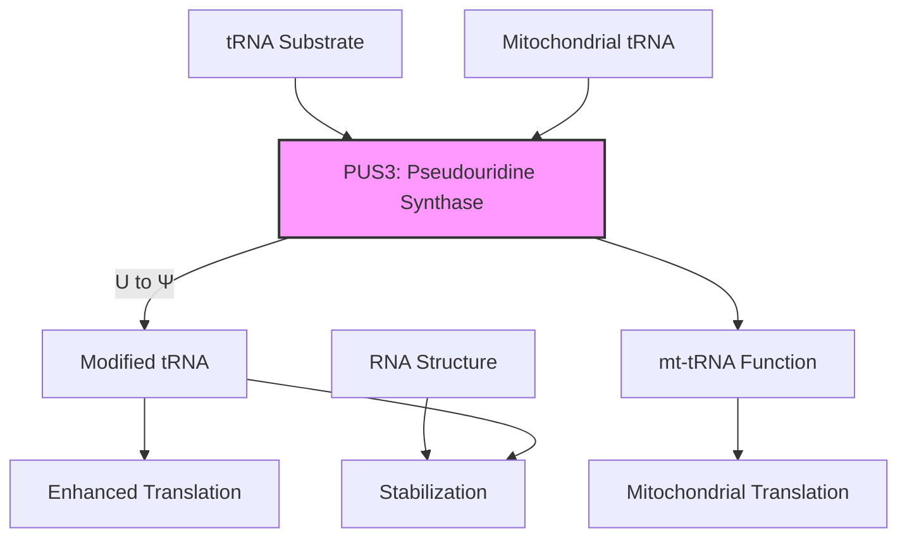

# Pathway Summary for PUS3

## Overview
PUS3 (Pseudouridine Synthase 3) is an RNA-modifying enzyme that catalyzes the isomerization of uridine to pseudouridine (Ψ) in tRNAs and other RNAs. This post-transcriptional modification is critical for RNA stability, structure, and function, particularly in tRNA-mediated translation.

## Core Pathways

### tRNA Modification Pathway
PUS3 modifies specific uridine residues in tRNAs:
- Position 38/39 in tRNA anticodon loop
- Enhances tRNA stability and function
- Improves codon-anticodon interactions
- Optimizes translation efficiency

### Mitochondrial RNA Processing
PUS3 has dual localization and modifies:
- Mitochondrial tRNAs
- Potentially mitochondrial rRNAs
- Supports mitochondrial translation
- Maintains mitochondrial function

## Pathway Diagram

## Clinical Significance
- **Intellectual disability**: PUS3 mutations cause syndromic ID
- **Mitochondrial dysfunction**: Impaired mt-tRNA modification
- **Translation defects**: Reduced protein synthesis efficiency
