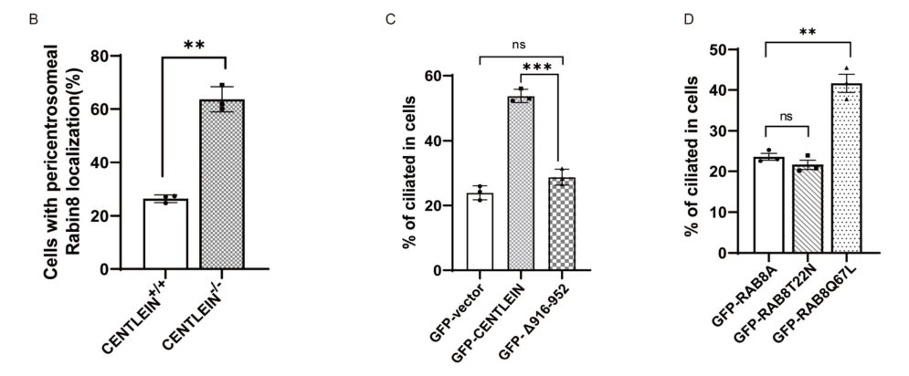

## Question

# Gene Research for Functional Annotation

## ⚠️ CRITICAL: Gene/Protein Identification Context

**BEFORE YOU BEGIN RESEARCH:** You MUST verify you are researching the CORRECT gene/protein. Gene symbols can be ambiguous, especially for less well-characterized genes from non-model organisms.

### Target Gene/Protein Identity (from UniProt):
- **UniProt Accession:** Q96QF0
- **Protein Description:** RecName: Full=Rab-3A-interacting protein; Short=Rab3A-interacting protein; AltName: Full=Rabin-3; AltName: Full=Rabin8 {ECO:0000303|PubMed:31204173}; AltName: Full=SSX2-interacting protein;
- **Gene Information:** Name=RAB3IP {ECO:0000312|EMBL:CAC59836.1}; Synonyms=RABIN8;
- **Organism (full):** Homo sapiens (Human).
- **Protein Family:** Belongs to the SEC2 family. .
- **Key Domains:** RAB3IL/RAB3IP/Sec2. (IPR040351); Sec2_N. (IPR009449); RAB3A-like_C (PF25555); Sec2p (PF06428)

### MANDATORY VERIFICATION STEPS:

1. **Check if the gene symbol "RAB3IP" matches the protein description above**
2. **Verify the organism is correct:** Homo sapiens (Human).
3. **Check if protein family/domains align with what you find in literature**
4. **If you find literature for a DIFFERENT gene with the same or similar symbol, STOP**

### If Gene Symbol is Ambiguous or You Cannot Find Relevant Literature:

**DO NOT PROCEED WITH RESEARCH ON A DIFFERENT GENE.** Instead:
- State clearly: "The gene symbol 'RAB3IP' is ambiguous or literature is limited for this specific protein"
- Explain what you found (e.g., "Found extensive literature on a different gene with the same symbol in a different organism")
- Describe the protein based ONLY on the UniProt information provided above
- Suggest that the protein function can be inferred from domain/family information

### Research Target:

Please provide a comprehensive research report on the gene **RAB3IP** (gene ID: RAB3IP, UniProt: Q96QF0) in human.

The research report should be a detailed narrative explaining the function, biological processes, and localization of the gene product. Citations should be given for all claims.

You should prioritize authoritative reviews and primary scientific literature when conducting research. You can supplement
this with annotations you find in gene/protein databases, but these can be outdated or inaccurate.

We are specifically interested in the primary function of the gene - for enzymes, what reaction is catalyzed, and what is the substrate specificity? For transporters, what is the substrate? For structural proteins or adapters, what is the broader structural role? For signaling molecules, what is the role in the pathway.

We are interested in where in or outside the cell the gene product carries out its function.

We are also interested in the signaling or biochemical pathways in which the gene functions. We are less interested in broad pleiotropic effects, except where these elucidate the precise role.

Include evidence where possible. We are interested in both experimental evidence as well as inference from structure, evolution, or bioinformatic analysis. Precise studies should be prioritized over high-throughput, where available.

## Output

Question: You are an expert researcher providing comprehensive, well-cited information.

Provide detailed information focusing on:
1. Key concepts and definitions with current understanding
2. Recent developments and latest research (prioritize 2023-2024 sources)
3. Current applications and real-world implementations
4. Expert opinions and analysis from authoritative sources
5. Relevant statistics and data from recent studies

Format as a comprehensive research report with proper citations. Include URLs and publication dates where available.
Always prioritize recent, authoritative sources and provide specific citations for all major claims.

# Gene Research for Functional Annotation

## ⚠️ CRITICAL: Gene/Protein Identification Context

**BEFORE YOU BEGIN RESEARCH:** You MUST verify you are researching the CORRECT gene/protein. Gene symbols can be ambiguous, especially for less well-characterized genes from non-model organisms.

### Target Gene/Protein Identity (from UniProt):
- **UniProt Accession:** Q96QF0
- **Protein Description:** RecName: Full=Rab-3A-interacting protein; Short=Rab3A-interacting protein; AltName: Full=Rabin-3; AltName: Full=Rabin8 {ECO:0000303|PubMed:31204173}; AltName: Full=SSX2-interacting protein;
- **Gene Information:** Name=RAB3IP {ECO:0000312|EMBL:CAC59836.1}; Synonyms=RABIN8;
- **Organism (full):** Homo sapiens (Human).
- **Protein Family:** Belongs to the SEC2 family. .
- **Key Domains:** RAB3IL/RAB3IP/Sec2. (IPR040351); Sec2_N. (IPR009449); RAB3A-like_C (PF25555); Sec2p (PF06428)

### MANDATORY VERIFICATION STEPS:

1. **Check if the gene symbol "RAB3IP" matches the protein description above**
2. **Verify the organism is correct:** Homo sapiens (Human).
3. **Check if protein family/domains align with what you find in literature**
4. **If you find literature for a DIFFERENT gene with the same or similar symbol, STOP**

### If Gene Symbol is Ambiguous or You Cannot Find Relevant Literature:

**DO NOT PROCEED WITH RESEARCH ON A DIFFERENT GENE.** Instead:
- State clearly: "The gene symbol 'RAB3IP' is ambiguous or literature is limited for this specific protein"
- Explain what you found (e.g., "Found extensive literature on a different gene with the same symbol in a different organism")
- Describe the protein based ONLY on the UniProt information provided above
- Suggest that the protein function can be inferred from domain/family information

### Research Target:

Please provide a comprehensive research report on the gene **RAB3IP** (gene ID: RAB3IP, UniProt: Q96QF0) in human.

The research report should be a detailed narrative explaining the function, biological processes, and localization of the gene product. Citations should be given for all claims.

You should prioritize authoritative reviews and primary scientific literature when conducting research. You can supplement
this with annotations you find in gene/protein databases, but these can be outdated or inaccurate.

We are specifically interested in the primary function of the gene - for enzymes, what reaction is catalyzed, and what is the substrate specificity? For transporters, what is the substrate? For structural proteins or adapters, what is the broader structural role? For signaling molecules, what is the role in the pathway.

We are interested in where in or outside the cell the gene product carries out its function.

We are also interested in the signaling or biochemical pathways in which the gene functions. We are less interested in broad pleiotropic effects, except where these elucidate the precise role.

Include evidence where possible. We are interested in both experimental evidence as well as inference from structure, evolution, or bioinformatic analysis. Precise studies should be prioritized over high-throughput, where available.

# Human RAB3IP (Rabin8; UniProt Q96QF0): functional annotation

**Identity and principal function.** The specified human gene **RAB3IP** encodes **Rabin8**, a SEC2-family guanine-nucleotide exchange factor (GEF). Rabin8 promotes release of GDP from a Rab GTPase so that GTP can bind; its best-established substrate is **Rab8**, particularly Rab8A. This is a protein-activation reaction, not transport of a molecular substrate across a membrane. The name *Rab-3A-interacting protein* records a historical interaction, **not** established GEF activity toward Rab3A. Nor should RAB3IP be confused with the related Rab8 GEF **GRAB**, encoded by **RAB3IL1**. The Q96QF0 accession and the additional names Rabin-3 and SSX2-interacting protein are supplied by the specified UniProt identity; the functional assignments below concern RAB3IP/Rabin8, not GRAB. (ishida2016multipletypesof pages 8-9, tong2021guaninenucleotideexchange pages 1-3, homma2016rabin8regulatesneurite pages 9-13)

## Biochemical activity and specificity

Rabin8’s conserved **Sec2/GEF coiled-coil region** mediates nucleotide exchange. Biochemical experiments place a Rab8 exchange-active region around residues **144–245**; the adjacent region around **262–331** contributes to binding its upstream regulator, active Rab11. Rab11-GTP binds Rabin8 and increases Rabin8-catalyzed GDP release from Rab8, establishing a **Rab11 → Rabin8 → Rab8** activation cascade. The Rab11-binding function is distinct from Rabin8’s action *on* Rab8: Rab11 is an upstream recruiting and regulatory GTPase, whereas Rab8 is the exchange substrate. (knodler2010coordinationofrab8 pages 2-3, knodler2010coordinationofrab8 pages 1-2)

**Substrate specificity needs a qualification.** Earlier purified-protein assays supported exchange on **Rab8A and Rab8B**, but not Rab3A or Rab10. A subsequent mammalian-cell study detected Rabin8-dependent GTP loading of **Rab8A and Rab10**; Rab10 activation persisted after Rab8 depletion, and a naturally occurring Rabin8 isoform missing 32 residues of its Sec2 region failed to activate either protein. Thus Rab8 is the strongest-established substrate, Rab10 is supported in a cellular context, and the difference between in-vitro and cellular Rab10 results is unresolved. Rab3A binding should not be interpreted as proof that Rab3A is an exchange substrate. (homma2016rabin8regulatesneurite pages 9-13, homma2016rabin8regulatesneurite pages 5-9)

Structural and binding studies further show how Rabin8 can act as a **Rab11 effector as well as a GEF**: its C-terminal portion contacts a noncanonical Rab11 surface adjacent to the site used by the Rab11 effector FIP3, permitting a Rab11–FIP3–Rabin8 assembly. Isolated Rabin8 binds GTP-analogue-loaded Rab11 relatively weakly, with a reported dissociation constant of approximately **40 μM**; FIP3 association strengthens Rabin8 binding approximately **four- to fivefold**. These observations support coordinated recruitment, rather than identifying FIP3 as an exchange substrate. (vetter2015noveltopographyof pages 5-9, vetter2015noveltopographyof pages 9-12)

The following evidence map separates Rabin8’s direct biochemical activity from context-dependent cellular functions:

| Functional context | Direct mechanistic finding | Experimental system/evidence | Primary publication DOI/year |
|---|---|---|---|
| Protein identity and substrate specificity | Human **RAB3IP/Rabin8** is a SEC2-family GEF distinct from **GRAB/RAB3IL1**. Purified-protein assays supported exchange activity toward Rab8A/B, but not Rab3A or Rab10. Mammalian-cell assays found activation of Rab8A and Rab10; deleting 32 residues from the SEC2/GEF domain abolished both activities. Rab10 specificity is therefore context-dependent, while Rab3A is a historical binding partner rather than an established exchange substrate. (homma2016rabin8regulatesneurite pages 9-13, homma2016rabin8regulatesneurite pages 5-9) | In-vitro nucleotide-exchange assays; GTP-bound Rab pull-downs, Rab8 depletion, and SEC2-domain deletion in PC12 cells. | [10.1091/mbc.e16-02-0091](https://doi.org/10.1091/mbc.e16-02-0091), 2016 |
| Rab11-dependent ciliogenesis | GTP-bound Rab11 binds Rabin8 and stimulates Rabin8-catalyzed GDP release from Rab8. Rab5A and Rab3A controls did not stimulate the reaction. Rab11 inhibition or depletion impaired ciliogenesis, supporting a **Rab11→Rabin8→Rab8** cascade. Rabin8 residues 262–331 mediate Rab11 binding; its GEF region lies at approximately residues 144–245. (knodler2010coordinationofrab8 pages 2-3, knodler2010coordinationofrab8 pages 1-2) | Recombinant binding and GDP-release assays; active and inactive Rab11 mutants; RNA interference and dominant-negative perturbation in cultured cells. | [10.1073/pnas.1002401107](https://doi.org/10.1073/pnas.1002401107), 2010 |
| CENTLEIN interaction and Rabin8 timing | CENTLEIN directly binds Rabin8 through Rabin8 residues 200–230. CENTLEIN knockout reduced RPE1 ciliation from **67.46% to 20.49%**, an absolute decrease of **46.97 percentage points**. At 12 hours after serum withdrawal, pericentrosomal GFP-Rabin8 increased from **26.42% in wild-type cells to 63.66% in knockout cells**. Full-length CENTLEIN, but not a Rabin8-binding-deficient mutant, rescued ciliation; Rab8A-Q67L partially rescued it to 41.63%. No cilia-density difference occurred in E10.5 ventral neural tube, indicating context dependence. (li2023adirectinteraction pages 1-2, li2023adirectinteraction pages 3-5, li2023adirectinteraction pages 5-9) | GST pull-down and reciprocal co-immunoprecipitation; CRISPR knockout and rescue in hTERT-RPE1 cells; serum-starvation time course; mouse embryonic fibroblasts and embryonic neural tube. | [10.3724/abbs.2023064](https://doi.org/10.3724/abbs.2023064), 2023 |
| GDP-Rab8 proteostasis | Rabin8 depletion increases the GDP-bound fraction of wild-type Rab8A, its association with UBQLN4 and RNF126, and its polyubiquitination. BAG6 recognizes inactive Rab8-family proteins, RNF126 promotes ubiquitination, and UBQLN4 supports proteasomal delivery. This pathway limits inactive Rab8/Rab10 accumulation and supports ciliogenesis. (takahashi2023proteinqualitycontrol pages 5-8, takahashi2023proteinqualitycontrol pages 8-10, takahashi2023proteinqualitycontrol pages 10-12) | Rabin8 and quality-control-factor depletion; GDP-locked Rab8A-T22N and GTP-locked Rab8A-Q67L comparisons; co-precipitation, ubiquitination, degradation, and RPE1 ciliation assays. | [10.1016/j.isci.2023.106652](https://doi.org/10.1016/j.isci.2023.106652), 2023 |
| EGF–ERK regulation | EGF-activated ERK1/2 directly phosphorylates Rabin8 at **S16, S19, S247, and S250**, relieving C-terminal autoinhibition and increasing Rab8-directed GEF activity. Phosphorylation weakens Rab11 binding and is required for efficient transferrin recycling to the plasma membrane. (wang2015activationofrab8 pages 4-5, wang2015activationofrab8 pages 1-2, wang2015activationofrab8 pages 3-3) | Recombinant ERK2 kinase assays, phosphopeptide mapping, intramolecular BRET, GEF assays, phosphomutants, and transferrin-recycling experiments. | [10.1073/pnas.1412089112](https://doi.org/10.1073/pnas.1412089112), 2015 |
| Macrophage TLR4/LPS pathway | LPS induces Rabin8–Rab8A binding and colocalization at surface ruffles and macropinosomes. Rabin8 and the separate GEF GRAB/RAB3IL1 both contribute to Rab8A GTP loading but are partly redundant: either can support Rab8A–PI3Kγ-dependent Akt/mTOR signaling. Deletion affects nucleotide activation rather than Rab8A membrane recruitment or macropinosome formation. (tong2021guaninenucleotideexchange pages 1-3, tong2021guaninenucleotideexchange pages 14-16) | LPS-stimulated macrophages; co-immunoprecipitation, fluorescence microscopy, Rab8A activation assays, CRISPR single- and double-knockout lines, and live-cell Akt-probe imaging. | [10.1080/21541248.2019.1587278](https://doi.org/10.1080/21541248.2019.1587278), online 2019; issue 2021 |
| Evidence boundary | These findings establish biochemical and cellular functions but do **not** provide clinical validation, an approved therapeutic application, or proof of a human RAB3IP disorder. The 2024 exocyst–Gli study did not directly test Rabin8 and cannot establish RAB3IP involvement. (niedziołka2024theexocystcomplex pages 1-2, niedziołka2024theexocystcomplex pages 9-10) | Evidence derives mainly from purified proteins, immortalized cell lines, macrophages, PC12 cells, and selected mouse tissues; no clinical studies are represented. | [10.1038/s42003-024-05817-2](https://doi.org/10.1038/s42003-024-05817-2), 2024 |

*Table: Concise evidence map for human RAB3IP/Rabin8, distinguishing it from GRAB/RAB3IL1 and separating direct biochemical findings from context-dependent cellular results. No clinical validation is implied.*

## Where Rabin8 functions

Rabin8 is an **intracellular, dynamically recruited trafficking regulator**, not an extracellular protein. Its principal functional locations are **Rab11-positive recycling-endosome and post-Golgi trafficking compartments**, vesicles approaching the **centrosome/mother centriole**, and the **pericentrosomal or ciliary-base region** during primary-cilium assembly. Rab11 binding helps determine this distribution: Rab11-binding-deficient Rabin8 mutants dispersed into the cytoplasm rather than localizing to Rab11-positive recycling endosomes in a neuronal-cell model. Rabin8 can also associate with Arf6/Rab8-positive recycling endosomes after nerve-growth-factor stimulation. These are condition- and cell-type-dependent localizations, not evidence that all Rabin8 is constitutively resident inside mature cilia. (ishida2016multipletypesof pages 8-9, li2023adirectinteraction pages 1-2, homma2016rabin8regulatesneurite pages 9-13)

In **hTERT-RPE1 cells**, serum withdrawal brings GFP-tagged Rabin8 to the centrosomal vicinity early in ciliogenesis; its pericentrosomal accumulation normally subsides as ciliation proceeds. In **LPS-stimulated macrophages**, Rabin8 instead appears with Rab8A at **surface ruffles and early macropinosomes**, where the relevant activity is Rab8A nucleotide loading during inflammatory signaling. These experimentally observed compartments explain why a single static localization label would be incomplete. (tong2021guaninenucleotideexchange pages 1-3, li2023adirectinteraction pages 3-5)

## Biological processes and pathway placement

**Primary-cilium membrane assembly.** The strongest-established physiological placement is the early trafficking cascade in which Rab11-associated vesicles bring Rabin8 toward the mother centriole, Rabin8 activates Rab8, and Rab8 supports growth and delivery of the ciliary membrane. Rabin8 also associates with the BBSome component **BBS1**; activated Rab11 increases the Rabin8–BBS1 association in binding experiments. Work on ciliary receptor trafficking positions Rabin8 alongside **FIP3 and ASAP1** in a Rab11-linked targeting complex, while a photoreceptor study found interaction of Rabin8 with the **SNARE domain of VAMP7** on the rhodopsin-delivery route. These interactions help position an exchange factor within carrier-targeting and membrane-fusion machinery; they do not establish Rabin8 itself as a SNARE or a structural component of the ciliary axoneme. (knodler2010coordinationofrab8 pages 4-4, knodler2010coordinationofrab8 pages 4-5, wang2015thearfand pages 1-4, kandachar2018aninteractionnetwork pages 1-4)

**Regulated recycling to the cell surface.** Rabin8 connects extracellular EGF signaling to trafficking: ERK1/2 directly phosphorylates Rabin8 at **S16, S19, S247 and S250**. Biochemical and conformational assays support relief of Rabin8 autoinhibition and increased Rab8-directed GEF activity; blocking this phosphorylation impairs **transferrin recycling to the plasma membrane**. A distinct serum **LPA–LPAR1–PI3K/Akt** mechanism limits ciliogenesis: Akt promotes Rab11 binding to the competing effector **WDR44**, opposing Rab11–FIP3–Rabin8 preciliary trafficking, while Akt-dependent Rabin8 phosphorylation near its exchange domain affects Rab8-directed activity. These are context-specific regulatory inputs, not interchangeable universal activation mechanisms. (walia2019aktregulatesa pages 1-3, wang2015activationofrab8 pages 4-5, wang2015activationofrab8 pages 1-2, walia2019aktregulatesa pages 10-12)

**Other experimentally investigated settings.** In NGF-stimulated PC12 cells, Rabin8 supports neurite outgrowth through Rab11-dependent trafficking involving Rab8 and Rab10. A GEF-deficient Rabin8 isoform still promoted some outgrowth, indicating an additional function that cannot simply be equated with Rab8 exchange. In macrophages, single- and double-gene knockout experiments show that Rabin8 and **GRAB/RAB3IL1** contribute, partly redundantly, to LPS/TLR4-induced **Rab8A-GTP loading**. This supports Rab8A-dependent recruitment of PI3Kγ and **Akt/mTOR signaling at macropinosomes**; loss of the GEFs affected activation rather than Rab8A membrane recruitment or macropinosome formation. These are experimentally demonstrated cellular roles, not established therapeutic applications. (tong2021guaninenucleotideexchange pages 1-3, tong2021guaninenucleotideexchange pages 14-16, homma2016rabin8regulatesneurite pages 9-13)

## Recent evidence and quantitative results, 2023–2024

**CENTLEIN controls the timing of Rabin8 recruitment (2023).** Li and colleagues mapped a CENTLEIN-interacting segment to Rabin8 residues **200–230**, within its GEF region. In serum-starved RPE1 cultures, **67.46% ± 1.32%** of control cells versus **20.49% ± 0.91%** of CENTLEIN-knockout cells carried cilia: a **46.97-percentage-point** difference, not a 47% relative decrease. At 12 hours, cells retaining pericentrosomal GFP-Rabin8 rose from **26.42% ± 0.83%** in controls to **63.66% ± 2.70%** after CENTLEIN loss. Re-expression of full-length CENTLEIN rescued ciliation more effectively than a mutant missing its Rabin8-binding region; active **Rab8A-Q67L** gave a partial rescue (**41.63% ± 2.22%**, versus **23.65% ± 0.84%** with wild-type Rab8A in the compared CENTLEIN-null groups). Each quantified cell-culture condition in the reported figure used three experiments with more than 200 cells per experiment. The cropped Figure 5 panels corroborate the localization and rescue measurements. Importantly, **E10.5 mouse ventral neural tubes showed no detectable cilia-density difference** between Centlein-null and control embryos, so the culture phenotype should not be generalized to every tissue. [Li et al., *Acta Biochimica et Biophysica Sinica*, online **20 July 2023**; https://doi.org/10.3724/abbs.2023064.] (li2023adirectinteraction pages 1-2, li2023adirectinteraction pages 3-5, li2023adirectinteraction pages 5-9, li2023adirectinteraction media d70786be)

**Inactive Rab8 quality control complements exchange (2023).** Takahashi and colleagues found that Rabin8 depletion increased association and ubiquitination of a GDP-bound fraction of Rab8A. Their experiments implicate **BAG6**, **RNF126** and **UBQLN4** in recognizing, ubiquitinating and disposing of inactive Rab8-family proteins. In a serum-starved RPE1 assay, ciliation was observed in **255/1,082 control cells (23.6%)**, versus **21/344 BAG6-depleted cells (6.1%)** and **37/522 UBQLN4-depleted cells (7.1%)**; RNF126 depletion shortened mean measured cilium length from **2.3 to 1.6 μm** in the reported comparison. These are effects of *quality-control-factor* perturbations, **not** ciliation percentages measured after RAB3IP knockout. The study adds a proteostasis consequence to the Rabin8–Rab8 activation model without showing that Rabin8 itself ubiquitinates Rab8. [Takahashi et al., *iScience*, **19 May 2023**; https://doi.org/10.1016/j.isci.2023.106652.] (takahashi2023proteinqualitycontrol pages 5-8, takahashi2023proteinqualitycontrol pages 8-10, takahashi2023proteinqualitycontrol pages 10-12)

**Boundary of a relevant 2024 development.** A 2024 study demonstrated exocyst- and vesicle-associated delivery of soluble proteins including Gli2/Gli3 to cilia and investigated other trafficking GTPases. Its reported experiments **do not directly establish RAB3IP/Rabin8 involvement** in that soluble-cargo pathway. It should therefore not be cited as direct evidence that Rabin8 transports Gli or activates Hedgehog signaling. [Niedziółka et al., *Communications Biology*, **2024**; https://doi.org/10.1038/s42003-024-05817-2.] (niedziołka2024theexocystcomplex pages 1-2, niedziołka2024theexocystcomplex pages 9-10)

## Interpretation and practical relevance

**Best-supported annotation:** RAB3IP/Rabin8 is a **Sec2-family Rab8 GEF and Rab11 effector** that spatially couples upstream Rab11-positive trafficking to activation of Rab8 on polarized membrane-delivery routes, prominently at the developing primary cilium; Rab10 activation and Rab11-dependent non-GEF activity have also been observed in particular cellular settings. Its established uses in the cited research are as a mechanistic target in **ciliogenesis, polarized recycling, neuronal-cell trafficking and macrophage signaling assays**. Ciliary defects are relevant to ciliopathy biology, but the studies reviewed here do **not** establish a specific pathogenic human RAB3IP allele, a RAB3IP-directed clinical treatment, or clinical efficacy of targeting this GEF. Differences between purified-protein and cellular substrate assays, and between cultured-cell and embryonic-tissue ciliation outcomes, remain important limits on extrapolation. (homma2016rabin8regulatesneurite pages 9-13, tong2021guaninenucleotideexchange pages 1-3, li2023adirectinteraction pages 5-9, blacque2018rabgtpasesin pages 3-4)

**Principal mechanistic sources:** Knödler et al., *PNAS* (**2010**), https://doi.org/10.1073/pnas.1002401107; Wang et al., *PNAS* (**2015**), https://doi.org/10.1073/pnas.1412089112; Homma and Fukuda, *Molecular Biology of the Cell* (**2016**), https://doi.org/10.1091/mbc.e16-02-0091; Walia et al., *Developmental Cell* (**2019**), https://doi.org/10.1016/j.devcel.2019.05.022; and Tong et al., *Small GTPases* (**online 2019; journal issue 2021**), https://doi.org/10.1080/21541248.2019.1587278. (knodler2010coordinationofrab8 pages 1-2, tong2021guaninenucleotideexchange pages 1-3, walia2019aktregulatesa pages 1-3, wang2015activationofrab8 pages 1-2, homma2016rabin8regulatesneurite pages 9-13)

References

1. (ishida2016multipletypesof pages 8-9): Morié Ishida, Mai E. Oguchi, and Mitsunori Fukuda. Multiple types of guanine nucleotide exchange factors (gefs) for rab small gtpases. Cell structure and function, 41 2:61-79, May 2016. URL: https://doi.org/10.1247/csf.16008, doi:10.1247/csf.16008. This article has 84 citations and is from a peer-reviewed journal.

2. (tong2021guaninenucleotideexchange pages 1-3): Samuel J. Tong, Adam A. Wall, Yu Hung, Lin Luo, and Jennifer L. Stow. Guanine nucleotide exchange factors activate rab8a for toll-like receptor signalling. Small GTPases, 12:27-43, Mar 2021. URL: https://doi.org/10.1080/21541248.2019.1587278, doi:10.1080/21541248.2019.1587278. This article has 25 citations and is from a peer-reviewed journal.

3. (homma2016rabin8regulatesneurite pages 9-13): Yuta Homma and Mitsunori Fukuda. Rabin8 regulates neurite outgrowth in both gef activity–dependent and –independent manners. Molecular Biology of the Cell, 27:2107-2118, Jul 2016. URL: https://doi.org/10.1091/mbc.e16-02-0091, doi:10.1091/mbc.e16-02-0091. This article has 91 citations and is from a domain leading peer-reviewed journal.

4. (knodler2010coordinationofrab8 pages 2-3): Andreas Knödler, Shanshan Feng, Jian Zhang, Xiaoyu Zhang, Amlan Das, Johan Peränen, and Wei Guo. Coordination of rab8 and rab11 in primary ciliogenesis. Proceedings of the National Academy of Sciences, 107:6346-6351, Mar 2010. URL: https://doi.org/10.1073/pnas.1002401107, doi:10.1073/pnas.1002401107. This article has 589 citations and is from a highest quality peer-reviewed journal.

5. (knodler2010coordinationofrab8 pages 1-2): Andreas Knödler, Shanshan Feng, Jian Zhang, Xiaoyu Zhang, Amlan Das, Johan Peränen, and Wei Guo. Coordination of rab8 and rab11 in primary ciliogenesis. Proceedings of the National Academy of Sciences, 107:6346-6351, Mar 2010. URL: https://doi.org/10.1073/pnas.1002401107, doi:10.1073/pnas.1002401107. This article has 589 citations and is from a highest quality peer-reviewed journal.

6. (homma2016rabin8regulatesneurite pages 5-9): Yuta Homma and Mitsunori Fukuda. Rabin8 regulates neurite outgrowth in both gef activity–dependent and –independent manners. Molecular Biology of the Cell, 27:2107-2118, Jul 2016. URL: https://doi.org/10.1091/mbc.e16-02-0091, doi:10.1091/mbc.e16-02-0091. This article has 91 citations and is from a domain leading peer-reviewed journal.

7. (vetter2015noveltopographyof pages 5-9): Melanie Vetter, Jing Wang, Esben Lorentzen, and Dusanka Deretic. Novel topography of the rab11-effector interaction network within a ciliary membrane targeting complex. Small GTPases, 6:165-173, Oct 2015. URL: https://doi.org/10.1080/21541248.2015.1091539, doi:10.1080/21541248.2015.1091539. This article has 19 citations and is from a peer-reviewed journal.

8. (vetter2015noveltopographyof pages 9-12): Melanie Vetter, Jing Wang, Esben Lorentzen, and Dusanka Deretic. Novel topography of the rab11-effector interaction network within a ciliary membrane targeting complex. Small GTPases, 6:165-173, Oct 2015. URL: https://doi.org/10.1080/21541248.2015.1091539, doi:10.1080/21541248.2015.1091539. This article has 19 citations and is from a peer-reviewed journal.

9. (li2023adirectinteraction pages 1-2): Liansheng Li, Junlin Li, and Li Yuan. A direct interaction between centlein and rabin8 is required for primary cilium formation. Acta Biochimica et Biophysica Sinica, 55:1434-1444, Jul 2023. URL: https://doi.org/10.3724/abbs.2023064, doi:10.3724/abbs.2023064. This article has 2 citations and is from a peer-reviewed journal.

10. (li2023adirectinteraction pages 3-5): Liansheng Li, Junlin Li, and Li Yuan. A direct interaction between centlein and rabin8 is required for primary cilium formation. Acta Biochimica et Biophysica Sinica, 55:1434-1444, Jul 2023. URL: https://doi.org/10.3724/abbs.2023064, doi:10.3724/abbs.2023064. This article has 2 citations and is from a peer-reviewed journal.

11. (li2023adirectinteraction pages 5-9): Liansheng Li, Junlin Li, and Li Yuan. A direct interaction between centlein and rabin8 is required for primary cilium formation. Acta Biochimica et Biophysica Sinica, 55:1434-1444, Jul 2023. URL: https://doi.org/10.3724/abbs.2023064, doi:10.3724/abbs.2023064. This article has 2 citations and is from a peer-reviewed journal.

12. (takahashi2023proteinqualitycontrol pages 5-8): Toshiki Takahashi, Jun Shirai, Miyo Matsuda, Sae Nakanaga, Shin Matsushita, Kei Wakita, Mizuki Hayashishita, Rigel Suzuki, Aya Noguchi, Naoto Yokota, and Hiroyuki Kawahara. Protein quality control machinery supports primary ciliogenesis by eliminating gdp-bound rab8-family gtpases. May 2023. URL: https://doi.org/10.1016/j.isci.2023.106652, doi:10.1016/j.isci.2023.106652. This article has 11 citations and is from a peer-reviewed journal.

13. (takahashi2023proteinqualitycontrol pages 8-10): Toshiki Takahashi, Jun Shirai, Miyo Matsuda, Sae Nakanaga, Shin Matsushita, Kei Wakita, Mizuki Hayashishita, Rigel Suzuki, Aya Noguchi, Naoto Yokota, and Hiroyuki Kawahara. Protein quality control machinery supports primary ciliogenesis by eliminating gdp-bound rab8-family gtpases. May 2023. URL: https://doi.org/10.1016/j.isci.2023.106652, doi:10.1016/j.isci.2023.106652. This article has 11 citations and is from a peer-reviewed journal.

14. (takahashi2023proteinqualitycontrol pages 10-12): Toshiki Takahashi, Jun Shirai, Miyo Matsuda, Sae Nakanaga, Shin Matsushita, Kei Wakita, Mizuki Hayashishita, Rigel Suzuki, Aya Noguchi, Naoto Yokota, and Hiroyuki Kawahara. Protein quality control machinery supports primary ciliogenesis by eliminating gdp-bound rab8-family gtpases. May 2023. URL: https://doi.org/10.1016/j.isci.2023.106652, doi:10.1016/j.isci.2023.106652. This article has 11 citations and is from a peer-reviewed journal.

15. (wang2015activationofrab8 pages 4-5): Juanfei Wang, Jinqi Ren, Bin Wu, Shanshan Feng, Guoping Cai, Florin Tuluc, Johan Peränen, and Wei Guo. Activation of rab8 guanine nucleotide exchange factor rabin8 by erk1/2 in response to egf signaling. Proceedings of the National Academy of Sciences, 112:148-153, Dec 2015. URL: https://doi.org/10.1073/pnas.1412089112, doi:10.1073/pnas.1412089112. This article has 68 citations and is from a highest quality peer-reviewed journal.

16. (wang2015activationofrab8 pages 1-2): Juanfei Wang, Jinqi Ren, Bin Wu, Shanshan Feng, Guoping Cai, Florin Tuluc, Johan Peränen, and Wei Guo. Activation of rab8 guanine nucleotide exchange factor rabin8 by erk1/2 in response to egf signaling. Proceedings of the National Academy of Sciences, 112:148-153, Dec 2015. URL: https://doi.org/10.1073/pnas.1412089112, doi:10.1073/pnas.1412089112. This article has 68 citations and is from a highest quality peer-reviewed journal.

17. (wang2015activationofrab8 pages 3-3): Juanfei Wang, Jinqi Ren, Bin Wu, Shanshan Feng, Guoping Cai, Florin Tuluc, Johan Peränen, and Wei Guo. Activation of rab8 guanine nucleotide exchange factor rabin8 by erk1/2 in response to egf signaling. Proceedings of the National Academy of Sciences, 112:148-153, Dec 2015. URL: https://doi.org/10.1073/pnas.1412089112, doi:10.1073/pnas.1412089112. This article has 68 citations and is from a highest quality peer-reviewed journal.

18. (tong2021guaninenucleotideexchange pages 14-16): Samuel J. Tong, Adam A. Wall, Yu Hung, Lin Luo, and Jennifer L. Stow. Guanine nucleotide exchange factors activate rab8a for toll-like receptor signalling. Small GTPases, 12:27-43, Mar 2021. URL: https://doi.org/10.1080/21541248.2019.1587278, doi:10.1080/21541248.2019.1587278. This article has 25 citations and is from a peer-reviewed journal.

19. (niedziołka2024theexocystcomplex pages 1-2): SM Niedziółka, S. Datta, T. Uśpieński, B. Baran, W. Skarżyńska, Ew Humke, R. Rohatgi, and P. Niewiadomski. The exocyst complex and intracellular vesicles mediate soluble protein trafficking to the primary cilium. Communications Biology, Sep 2024. URL: https://doi.org/10.1038/s42003-024-05817-2, doi:10.1038/s42003-024-05817-2. This article has 14 citations and is from a peer-reviewed journal.

20. (niedziołka2024theexocystcomplex pages 9-10): SM Niedziółka, S. Datta, T. Uśpieński, B. Baran, W. Skarżyńska, Ew Humke, R. Rohatgi, and P. Niewiadomski. The exocyst complex and intracellular vesicles mediate soluble protein trafficking to the primary cilium. Communications Biology, Sep 2024. URL: https://doi.org/10.1038/s42003-024-05817-2, doi:10.1038/s42003-024-05817-2. This article has 14 citations and is from a peer-reviewed journal.

21. (knodler2010coordinationofrab8 pages 4-4): Andreas Knödler, Shanshan Feng, Jian Zhang, Xiaoyu Zhang, Amlan Das, Johan Peränen, and Wei Guo. Coordination of rab8 and rab11 in primary ciliogenesis. Proceedings of the National Academy of Sciences, 107:6346-6351, Mar 2010. URL: https://doi.org/10.1073/pnas.1002401107, doi:10.1073/pnas.1002401107. This article has 589 citations and is from a highest quality peer-reviewed journal.

22. (knodler2010coordinationofrab8 pages 4-5): Andreas Knödler, Shanshan Feng, Jian Zhang, Xiaoyu Zhang, Amlan Das, Johan Peränen, and Wei Guo. Coordination of rab8 and rab11 in primary ciliogenesis. Proceedings of the National Academy of Sciences, 107:6346-6351, Mar 2010. URL: https://doi.org/10.1073/pnas.1002401107, doi:10.1073/pnas.1002401107. This article has 589 citations and is from a highest quality peer-reviewed journal.

23. (wang2015thearfand pages 1-4): Jing Wang and Dusanka Deretic. The arf and rab11 effector fip3 acts synergistically with asap1 to direct rabin8 in ciliary receptor targeting. Journal of Cell Science, 128:1375-1385, Apr 2015. URL: https://doi.org/10.1242/jcs.162925, doi:10.1242/jcs.162925. This article has 58 citations and is from a domain leading peer-reviewed journal.

24. (kandachar2018aninteractionnetwork pages 1-4): Vasundhara Kandachar, Beatrice M. Tam, Orson L. Moritz, and Dusanka Deretic. An interaction network between the snare vamp7 and rab gtpases within a ciliary membrane-targeting complex. Journal of Cell Science, Dec 2018. URL: https://doi.org/10.1242/jcs.222034, doi:10.1242/jcs.222034. This article has 32 citations and is from a domain leading peer-reviewed journal.

25. (walia2019aktregulatesa pages 1-3): Vijay Walia, Adrian Cuenca, Melanie Vetter, Christine Insinna, Sumeth Perera, Quanlong Lu, Daniel A. Ritt, Elizabeth Semler, Suzanne Specht, Jimmy Stauffer, Deborah K. Morrison, Esben Lorentzen, and Christopher J. Westlake. Akt regulates a rab11-effector switch required for ciliogenesis. Developmental cell, 50:229-246.e7, Jul 2019. URL: https://doi.org/10.1016/j.devcel.2019.05.022, doi:10.1016/j.devcel.2019.05.022. This article has 91 citations and is from a highest quality peer-reviewed journal.

26. (walia2019aktregulatesa pages 10-12): Vijay Walia, Adrian Cuenca, Melanie Vetter, Christine Insinna, Sumeth Perera, Quanlong Lu, Daniel A. Ritt, Elizabeth Semler, Suzanne Specht, Jimmy Stauffer, Deborah K. Morrison, Esben Lorentzen, and Christopher J. Westlake. Akt regulates a rab11-effector switch required for ciliogenesis. Developmental cell, 50:229-246.e7, Jul 2019. URL: https://doi.org/10.1016/j.devcel.2019.05.022, doi:10.1016/j.devcel.2019.05.022. This article has 91 citations and is from a highest quality peer-reviewed journal.

27. (li2023adirectinteraction media d70786be): Liansheng Li, Junlin Li, and Li Yuan. A direct interaction between centlein and rabin8 is required for primary cilium formation. Acta Biochimica et Biophysica Sinica, 55:1434-1444, Jul 2023. URL: https://doi.org/10.3724/abbs.2023064, doi:10.3724/abbs.2023064. This article has 2 citations and is from a peer-reviewed journal.

28. (blacque2018rabgtpasesin pages 3-4): Oliver E. Blacque, Noemie Scheidel, and Stefanie Kuhns. Rab gtpases in cilium formation and function. Small GTPases, 9:76-94, Oct 2018. URL: https://doi.org/10.1080/21541248.2017.1353847, doi:10.1080/21541248.2017.1353847. This article has 103 citations and is from a peer-reviewed journal.

## Artifacts

- [Edison artifact artifact-00](RAB3IP-deep-research-falcon_artifacts/artifact-00.md)

## Citations

1. ishida2016multipletypesof pages 8-9
2. tong2021guaninenucleotideexchange pages 1-3
3. vetter2015noveltopographyof pages 5-9
4. vetter2015noveltopographyof pages 9-12
5. li2023adirectinteraction pages 1-2
6. li2023adirectinteraction pages 3-5
7. li2023adirectinteraction pages 5-9
8. takahashi2023proteinqualitycontrol pages 5-8
9. takahashi2023proteinqualitycontrol pages 8-10
10. takahashi2023proteinqualitycontrol pages 10-12
11. tong2021guaninenucleotideexchange pages 14-16
12. wang2015thearfand pages 1-4
13. kandachar2018aninteractionnetwork pages 1-4
14. walia2019aktregulatesa pages 1-3
15. walia2019aktregulatesa pages 10-12
16. blacque2018rabgtpasesin pages 3-4
17. 10.1091/mbc.e16-02-0091
18. 10.1073/pnas.1002401107
19. 10.3724/abbs.2023064
20. 10.1016/j.isci.2023.106652
21. 10.1073/pnas.1412089112
22. 10.1080/21541248.2019.1587278
23. 10.1038/s42003-024-05817-2
24. Li et al., *Acta Biochimica et Biophysica Sinica*, online **20 July 2023**; https://doi.org/10.3724/abbs.2023064.
25. Takahashi et al., *iScience*, **19 May 2023**; https://doi.org/10.1016/j.isci.2023.106652.
26. Niedziółka et al., *Communications Biology*, **2024**; https://doi.org/10.1038/s42003-024-05817-2.
27. https://doi.org/10.1091/mbc.e16-02-0091
28. https://doi.org/10.1073/pnas.1002401107
29. https://doi.org/10.3724/abbs.2023064
30. https://doi.org/10.1016/j.isci.2023.106652
31. https://doi.org/10.1073/pnas.1412089112
32. https://doi.org/10.1080/21541248.2019.1587278
33. https://doi.org/10.1038/s42003-024-05817-2
34. https://doi.org/10.3724/abbs.2023064.]
35. https://doi.org/10.1016/j.isci.2023.106652.]
36. https://doi.org/10.1038/s42003-024-05817-2.]
37. https://doi.org/10.1073/pnas.1002401107;
38. https://doi.org/10.1073/pnas.1412089112;
39. https://doi.org/10.1091/mbc.e16-02-0091;
40. https://doi.org/10.1016/j.devcel.2019.05.022;
41. https://doi.org/10.1080/21541248.2019.1587278.
42. https://doi.org/10.1247/csf.16008,
43. https://doi.org/10.1080/21541248.2019.1587278,
44. https://doi.org/10.1091/mbc.e16-02-0091,
45. https://doi.org/10.1073/pnas.1002401107,
46. https://doi.org/10.1080/21541248.2015.1091539,
47. https://doi.org/10.3724/abbs.2023064,
48. https://doi.org/10.1016/j.isci.2023.106652,
49. https://doi.org/10.1073/pnas.1412089112,
50. https://doi.org/10.1038/s42003-024-05817-2,
51. https://doi.org/10.1242/jcs.162925,
52. https://doi.org/10.1242/jcs.222034,
53. https://doi.org/10.1016/j.devcel.2019.05.022,
54. https://doi.org/10.1080/21541248.2017.1353847,