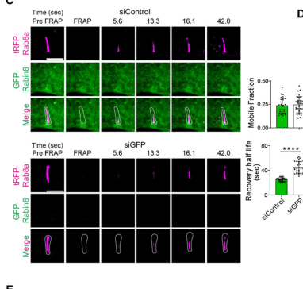

## Question

# Gene Research for Functional Annotation

## ⚠️ CRITICAL: Gene/Protein Identification Context

**BEFORE YOU BEGIN RESEARCH:** You MUST verify you are researching the CORRECT gene/protein. Gene symbols can be ambiguous, especially for less well-characterized genes from non-model organisms.

### Target Gene/Protein Identity (from UniProt):
- **UniProt Accession:** P61006
- **Protein Description:** RecName: Full=Ras-related protein Rab-8A; EC=3.6.5.2 {ECO:0000305|PubMed:19864458}; AltName: Full=Oncogene c-mel; Flags: Precursor;
- **Gene Information:** Name=RAB8A {ECO:0000312|HGNC:HGNC:7007}; Synonyms=MEL, RAB8;
- **Organism (full):** Homo sapiens (Human).
- **Protein Family:** Belongs to the small GTPase superfamily. Rab family.
- **Key Domains:** P-loop_NTPase. (IPR027417); Small_GTP-bd. (IPR005225); Small_GTPase. (IPR001806); Small_GTPase_Rab. (IPR050305); Ras (PF00071)

### MANDATORY VERIFICATION STEPS:

1. **Check if the gene symbol "RAB8A" matches the protein description above**
2. **Verify the organism is correct:** Homo sapiens (Human).
3. **Check if protein family/domains align with what you find in literature**
4. **If you find literature for a DIFFERENT gene with the same or similar symbol, STOP**

### If Gene Symbol is Ambiguous or You Cannot Find Relevant Literature:

**DO NOT PROCEED WITH RESEARCH ON A DIFFERENT GENE.** Instead:
- State clearly: "The gene symbol 'RAB8A' is ambiguous or literature is limited for this specific protein"
- Explain what you found (e.g., "Found extensive literature on a different gene with the same symbol in a different organism")
- Describe the protein based ONLY on the UniProt information provided above
- Suggest that the protein function can be inferred from domain/family information

### Research Target:

Please provide a comprehensive research report on the gene **RAB8A** (gene ID: RAB8A, UniProt: P61006) in human.

The research report should be a detailed narrative explaining the function, biological processes, and localization of the gene product. Citations should be given for all claims.

You should prioritize authoritative reviews and primary scientific literature when conducting research. You can supplement
this with annotations you find in gene/protein databases, but these can be outdated or inaccurate.

We are specifically interested in the primary function of the gene - for enzymes, what reaction is catalyzed, and what is the substrate specificity? For transporters, what is the substrate? For structural proteins or adapters, what is the broader structural role? For signaling molecules, what is the role in the pathway.

We are interested in where in or outside the cell the gene product carries out its function.

We are also interested in the signaling or biochemical pathways in which the gene functions. We are less interested in broad pleiotropic effects, except where these elucidate the precise role.

Include evidence where possible. We are interested in both experimental evidence as well as inference from structure, evolution, or bioinformatic analysis. Precise studies should be prioritized over high-throughput, where available.

## Output

Question: You are an expert researcher providing comprehensive, well-cited information.

Provide detailed information focusing on:
1. Key concepts and definitions with current understanding
2. Recent developments and latest research (prioritize 2023-2024 sources)
3. Current applications and real-world implementations
4. Expert opinions and analysis from authoritative sources
5. Relevant statistics and data from recent studies

Format as a comprehensive research report with proper citations. Include URLs and publication dates where available.
Always prioritize recent, authoritative sources and provide specific citations for all major claims.

# Gene Research for Functional Annotation

## ⚠️ CRITICAL: Gene/Protein Identification Context

**BEFORE YOU BEGIN RESEARCH:** You MUST verify you are researching the CORRECT gene/protein. Gene symbols can be ambiguous, especially for less well-characterized genes from non-model organisms.

### Target Gene/Protein Identity (from UniProt):
- **UniProt Accession:** P61006
- **Protein Description:** RecName: Full=Ras-related protein Rab-8A; EC=3.6.5.2 {ECO:0000305|PubMed:19864458}; AltName: Full=Oncogene c-mel; Flags: Precursor;
- **Gene Information:** Name=RAB8A {ECO:0000312|HGNC:HGNC:7007}; Synonyms=MEL, RAB8;
- **Organism (full):** Homo sapiens (Human).
- **Protein Family:** Belongs to the small GTPase superfamily. Rab family.
- **Key Domains:** P-loop_NTPase. (IPR027417); Small_GTP-bd. (IPR005225); Small_GTPase. (IPR001806); Small_GTPase_Rab. (IPR050305); Ras (PF00071)

### MANDATORY VERIFICATION STEPS:

1. **Check if the gene symbol "RAB8A" matches the protein description above**
2. **Verify the organism is correct:** Homo sapiens (Human).
3. **Check if protein family/domains align with what you find in literature**
4. **If you find literature for a DIFFERENT gene with the same or similar symbol, STOP**

### If Gene Symbol is Ambiguous or You Cannot Find Relevant Literature:

**DO NOT PROCEED WITH RESEARCH ON A DIFFERENT GENE.** Instead:
- State clearly: "The gene symbol 'RAB8A' is ambiguous or literature is limited for this specific protein"
- Explain what you found (e.g., "Found extensive literature on a different gene with the same symbol in a different organism")
- Describe the protein based ONLY on the UniProt information provided above
- Suggest that the protein function can be inferred from domain/family information

### Research Target:

Please provide a comprehensive research report on the gene **RAB8A** (gene ID: RAB8A, UniProt: P61006) in human.

The research report should be a detailed narrative explaining the function, biological processes, and localization of the gene product. Citations should be given for all claims.

You should prioritize authoritative reviews and primary scientific literature when conducting research. You can supplement
this with annotations you find in gene/protein databases, but these can be outdated or inaccurate.

We are specifically interested in the primary function of the gene - for enzymes, what reaction is catalyzed, and what is the substrate specificity? For transporters, what is the substrate? For structural proteins or adapters, what is the broader structural role? For signaling molecules, what is the role in the pathway.

We are interested in where in or outside the cell the gene product carries out its function.

We are also interested in the signaling or biochemical pathways in which the gene functions. We are less interested in broad pleiotropic effects, except where these elucidate the precise role.

Include evidence where possible. We are interested in both experimental evidence as well as inference from structure, evolution, or bioinformatic analysis. Precise studies should be prioritized over high-throughput, where available.

# Human RAB8A (UniProt P61006): functional annotation research report

**Identity verified.** Human **RAB8A** encodes Ras-related protein Rab-8A, a small Rab-family, P-loop GTPase. The accession **P61006** maps to Rab8A, whereas the related, separately encoded human **RAB8B** maps to **Q92930**. RAB8A is also distinct from RAB10 and RAB11; findings concerning an unspecified “Rab8” should not automatically be assigned exclusively to RAB8A. The supplied P-loop and small-GTPase domain annotations agree with its experimentally observed nucleotide-dependent behavior. (gomezlazaroUnknownyear1.generalfunction pages 1-3, peranen2011rab8gtpaseas pages 1-2)

## Primary molecular function and biochemical reaction

RAB8A is a **membrane-trafficking molecular switch**, not a transporter of glucose or an enzyme that modifies vesicle cargo. Its nucleotide substrate is **GTP**: the active, GTP-bound protein recruits trafficking effectors; hydrolysis, **GTP + H₂O → GDP + inorganic phosphate**, returns it toward the inactive GDP-bound state. Rabin8, also called **RAB3IP**, catalyzes GDP release and GTP loading, whereas GTPase-activating proteins (GAPs) accelerate the hydrolysis step. Purified-protein experiments show that active RAB11A binds Rabin8 and stimulates its exchange activity toward Rab8A; 2023 biochemical and genetic experiments identify the C9orf72–SMCR8 complex as a RAB8A GAP, with C9orf72 contributing RAB8A binding and SMCR8 the GAP machinery. This is regulatory nucleotide hydrolysis—not hydrolysis of a transported substrate. (knodler2010coordinationofrab8 pages 1-2, knodler2010coordinationofrab8 pages 2-3, tang2023alslinkedc9orf72–smcr8complex pages 1-2, tang2023alslinkedc9orf72–smcr8complex pages 3-5)

RAB8A’s C-terminal **CVLL** motif is consistent with geranylgeranyl modification and membrane association; GDP-dissociation inhibitors participate in returning inactive Rab proteins to the cytosol. Its GTPase-fold switch regions determine nucleotide-sensitive partner interactions. Neither its GTP hydrolysis nor its trafficking role establishes a unique membrane *cargo*: cargo selection depends on the cellular route and associated proteins. (gomezlazaroUnknownyear1.generalfunction pages 3-5, gomezlazaroUnknownyear1.generalfunction pages 1-3, alessi2024leucinerichrepeatkinases pages 8-9)

## Cellular location and core trafficking pathways

**Post-Golgi secretion.** RAB8A acts on Golgi-derived secretory carriers and at their plasma-membrane destination. In human HeLa cells, endogenous RAB8A occupied RAB6-positive, secretion-marker-positive vesicles soon after Golgi exit. RAB6 depletion prevented its recruitment. Conversely, RAB8A depletion or expression of GDP-biased RAB8A-T22N caused vesicles to accumulate at the cell periphery, prolonged the pause before fusion and delayed secretion, without appreciably preventing vesicle emergence or movement. RAB8A binds **MICAL3**, which can connect this pathway to **ELKS-positive cortical docking sites**; a direct RAB8A–ELKS interaction was *not* convincingly demonstrated. Thus, its best-resolved role here is coordinating terminal **docking and fusion**, not transporting cargo through a membrane or catalyzing membrane fusion itself. The same study distinguished RAB8A-positive, RAB6-negative endosomal tubules and observed ciliary enrichment in human RPE cells. Grigoriev and colleagues, *Current Biology*, **7 June 2011**, https://doi.org/10.1016/j.cub.2011.04.030. (grigoriev2011rab6rab8and pages 1-3, grigoriev2011rab6rab8and pages 3-4)

**Recycling and cell-surface polarity.** RAB8A also associates with recycling-endosome-derived tubules and vesicles, alongside components of clathrin-independent recycling such as EHD proteins and actin-based motors. The evidence supports trafficking *from intracellular compartments back to the cell surface*, but should not be collapsed into a universal requirement for recycling every internalized cargo. In polarized enterocyte-like cells, **MYO5B binding to RAB8A** was required to establish normal apical microvilli; the MYO5B–RAB11A interaction had a distinguishable role in microvillus-inclusion formation. These experiments help explain apical brush-border localization of transporters and enzymes. Crucially, the patient disease investigated was due to **MYO5B variants**, not a demonstrated pathogenic RAB8A variant. Knowles and colleagues, *Journal of Clinical Investigation*, **July 2014**, https://doi.org/10.1172/JCI71651; see the updated epithelial-trafficking assessment by Kaji and colleagues, *Journal of Cell Biology*, **2024**, https://doi.org/10.1083/jcb.202310118. (peranen2011rab8gtpaseas pages 1-2, knowles2014myosinvbuncoupling pages 1-2, kaji2024modelingthecell pages 2-4)

**Ciliary membrane delivery.** A particularly well-defined sequence is **RAB11A/B-GTP → Rabin8-mediated activation of RAB8A → ciliary membrane trafficking**. RAB11-associated recycling membranes bring Rabin8 toward the mother centriole/basal body, and activated RAB8A associates with the developing and mature primary-cilium membrane. The exocyst component **SEC15** participates downstream of the Rabin8–Rab8 pathway in ciliary vesicle targeting and cilium assembly; older SEC15 experiments often refer to “Rab8” collectively rather than isolating RAB8A from RAB8B. Knödler and colleagues, *PNAS*, **2010**, https://doi.org/10.1073/pnas.1002401107; Feng and colleagues, *Journal of Biological Chemistry*, **May 2012**, https://doi.org/10.1074/jbc.M111.333245. (knodler2010coordinationofrab8 pages 1-2, feng2012arab8guanine pages 1-2)

A **2024 human-cell imaging study** strengthened this model by tracking the order of protein association on membranes. In human RPE cells, Rabin8 expression shortened fluorescent RAB8A’s ciliary fluorescence-recovery half-time to **25.0 ± 2.9 seconds**, compared with **44.8 ± 9.6 seconds** after depletion of tagged Rabin8; the analogous comparison for RAB11A was **29.3 ± 3.8 versus 48.2 ± 10.4 seconds**. Rabin8 exchange-deficient variants impaired RAB8A localization to cilia and long membrane tubules. Super-resolution imaging showed RAB11A and Rabin8 leaving newly RAB8A-enriched tubules, consistent with **conversion of a RAB11-positive membrane into a RAB8A-positive membrane**. These are kinetics of *fluorescent-protein recovery*, not rates of GTP hydrolysis; the experiments relied on tagged proteins expressed above endogenous concentrations and did not observe every conversion step on one individual membrane. Saha, Insinna and Westlake, *Cell Reports*, **26 November 2024**, https://doi.org/10.1016/j.celrep.2024.114955. Cropped experimental FRAP panels provide visual support for the recovery comparison. (saha2024rab11rab8cascadedynamics pages 5-6, saha2024rab11rab8cascadedynamics pages 3-5, saha2024rab11rab8cascadedynamics pages 1-3, saha2024rab11rab8cascadedynamics pages 6-8, saha2024rab11rab8cascadedynamics pages 8-10, saha2024rab11rab8cascadedynamics media b5d9fa29)

## Regulation and downstream signaling

**A direct negative regulator: C9orf72–SMCR8.** In human HEK293T and ARPE-19 cells, knockout of either complex component increased effector-captured, GTP-bound RAB8A by approximately **50%**; the knockout increased RAB8A localization at cilia, ciliation and cilium length. The catalytically impaired **SMCR8-R147A** variant failed to restore normal suppression. In the investigated Hedgehog-responsive cells, loss of the complex enhanced Sonic-hedgehog-induced **GLI1** and **PTCH1** expression. This links controlled RAB8A inactivation at the *ciliary membrane* to a signaling outcome; RAB8A is a trafficking regulator enabling that signaling context, not itself a Hedgehog ligand or receptor. The complex also acts on other small GTPases, so its phenotypes cannot all be attributed to RAB8A in every tissue. Tang and colleagues, *PNAS*, **8 December 2023**, https://doi.org/10.1073/pnas.2220496120. (tang2023alslinkedc9orf72–smcr8complex pages 5-7, tang2023alslinkedc9orf72–smcr8complex pages 1-2, tang2023alslinkedc9orf72–smcr8complex pages 3-5, tang2023alslinkedc9orf72–smcr8complex pages 2-3)

**LRRK2 phosphorylation changes effector choice.** Parkinson’s-associated kinase **LRRK2 phosphorylates RAB8A at Thr72 in its switch-II region**. This decreases interaction with its normal Rabin8 GEF, GDP-dissociation inhibitors and many conventional effectors, but permits association with phosphorylation-selective partners including **RILPL2**. A crystal structure resolves recognition of RAB8A phospho-Thr72 by RILPL2. The authoritative 2024 analysis by Alessi and Pfeffer estimates that, even with activated LRRK2, **no more than about 1%** of a given Rab pool is phosphorylated at switch II at steady state; consequential relocalization or altered effector binding therefore need not imply wholesale RAB8A inactivation. Importantly, some well-established LRRK2-dependent ciliation defects are mediated specifically through **phospho-RAB10–RILPL1**, and should not be reassigned to RAB8A. Waschbüsch and colleagues, *Structure*, **7 April 2020**, https://doi.org/10.1016/j.str.2020.01.005; Alessi and Pfeffer, *Annual Review of Biochemistry*, **2024**, https://doi.org/10.1146/annurev-biochem-030122-051144. (waschbusch2020structuralbasisfor pages 1-3, alessi2024leucinerichrepeatkinases pages 8-9)

**Insulin-dependent trafficking is another context-specific application.** In cultured muscle cells, insulin-dependent PI3K–Akt signaling inhibits the Rab GAP **TBC1D4/AS160**, favoring RAB8A activation. GTP-state-preferring binding of RAB8A to **myosin Va** helps mobilize vesicles containing **GLUT4** from perinuclear stores toward the cell surface. **GLUT4 transports glucose; RAB8A regulates GLUT4-vesicle delivery.** These assays were largely in rat L6 muscle cells and engineered CHO cells, rather than direct measurements of endogenous human muscle physiology; RAB10 is especially relevant to GLUT4 trafficking in adipocytes. Sun and colleagues, *Molecular Biology of the Cell*, **1 April 2014**, https://doi.org/10.1091/mbc.E13-08-0493. (sun2014myosinvamediates pages 1-2)

## Recent functional evidence and interpretation

In **2024**, CRISPR deletion of **RAB8A** in human induced-pluripotent-stem-cell-derived neurons yielded approximately **60% fewer LysoTracker-positive lysosomal structures**, more acidic lysosomes and increased LAMP1 association with the Golgi. By comparison, RAB10 deletion also reduced lysosomal numbers but shifted lysosomal pH in the *opposite* direction. Insoluble α-synuclein increased specifically in the RAB8A-null neurons in this study. These observations place RAB8A in neuronal Golgi–endolysosomal homeostasis and distinguish it experimentally from RAB10; they do **not** establish that RAB8A is a lysosomal acid pump, that the lysosome is its sole normal operating location, or that complete gene knockout reproduces low-stoichiometry LRRK2 phosphorylation. Mamais and colleagues, *Stem Cell Reports*, **February 2024**, https://doi.org/10.1016/j.stemcr.2024.01.001. The accessible full-text extract carries an earlier 2023 preprint header; the publication citation refers to the subsequent peer-reviewed article. (mamais2024thelrrk2kinase pages 4-6, mamais2024thelrrk2kinase pages 1-4, alessi2024leucinerichrepeatkinases pages 8-9)

**Important limitation: context and paralog compensation.** Rab8 inhibition can strongly impair cilium formation in cultured human cells, yet Rab8a/Rab8b double-knockout mice did not show a generalized ciliogenesis defect in the tissues examined; additional Rab10 depletion reduced ciliation in knockout-derived fibroblasts. Accordingly, RAB8A is a *well-supported ciliary-trafficking regulator*, but not demonstrably an irreplaceable ciliogenesis factor in every tissue. Reviews that group RAB8A and RAB8B, experiments in nonhuman organisms, and perturbations of shared partners must be distinguished from isoform-specific evidence. Blacque, Scheidel and Kuhns, *Small GTPases*, **2018**, https://doi.org/10.1080/21541248.2017.1353847. (blacque2018rabgtpasesin pages 3-4, peranen2011rab8gtpaseas pages 1-2)

The following table summarizes the principal **compartments, direct evidence and interpretation limits** for functional annotation. (grigoriev2011rab6rab8and pages 1-3, saha2024rab11rab8cascadedynamics pages 1-3, tang2023alslinkedc9orf72–smcr8complex pages 1-2, mamais2024thelrrk2kinase pages 4-6)

| Molecular/process compartment | Direct mechanism and evidence | Strength or scope/caveat | Key cited papers and URLs (publication date) |
|---|---|---|---|
| **Rab11A/B–RAB3IP/Rabin8–RAB8A activation** — recycling endosomes, preciliary vesicles, basal body and ciliary membrane | GTP-bound Rab11 binds Rabin8 and stimulates its GEF activity, promoting GDP release and GTP loading on RAB8A. In human RPE cells, Rabin8 accelerated ciliary RAB8A FRAP recovery: **25.0 ± 2.9 s** with Rabin8 versus **44.8 ± 9.6 s** after tagged Rabin8 depletion; Rab11A similarly accelerated recovery. Rabin8 GEF-defective mutants impaired RAB8A ciliary and tubular-membrane localization. (knodler2010coordinationofrab8 pages 1-2, saha2024rab11rab8cascadedynamics pages 5-6, saha2024rab11rab8cascadedynamics pages 1-3, saha2024rab11rab8cascadedynamics pages 6-8) | **Strong mechanistic evidence.** Purified-protein nucleotide-exchange assays and live human-cell imaging support a Rab11→Rabin8→RAB8A cascade. The 2024 imaging used overexpressed fluorescent proteins, so kinetics may differ from endogenous RAB8A. | Knödler et al., *PNAS*, [2010-03-04](https://doi.org/10.1073/pnas.1002401107); Saha et al., *Cell Reports*, [2024-11-26](https://doi.org/10.1016/j.celrep.2024.114955) |
| **Rab6–RAB8A–MICAL3/ELKS constitutive secretion** — Golgi-derived carriers and plasma-membrane cortex | Endogenous RAB8A joined Rab6-positive secretory carriers during or soon after Golgi exit and remained until fusion. RAB8A depletion or GDP-biased RAB8A-T22N prolonged the terminal pause and delayed secretion without blocking carrier formation or movement. MICAL3 bound RAB8A and linked carriers to cortical ELKS-associated docking/fusion sites. (grigoriev2011rab6rab8and pages 1-3, grigoriev2011rab6rab8and pages 3-4) | **Strong, isoform-specific cellular evidence** from HeLa and hTERT-RPE1 imaging, RNAi/rescue and secretion assays. It establishes RAB8A as a docking/fusion regulator—not a cargo transporter or fusion enzyme. | Grigoriev et al., *Current Biology*, [2011-06-07](https://doi.org/10.1016/j.cub.2011.04.030) |
| **C9orf72–SMCR8 control of RAB8A** — cytosol and primary cilium in HEK293T and ARPE-19 cells | C9orf72–SMCR8 acts as a RAB8A GAP: C9orf72 supplies RAB8A binding, whereas SMCR8 supplies the catalytic GAP module. C9orf72 or SMCR8 knockout raised effector-captured GTP-RAB8A by approximately **50%**, increased ciliary RAB8A, ciliation and cilium length, and enhanced Sonic-Hedgehog-induced *GLI1/PTCH1* expression; GAP-defective SMCR8-R147A did not rescue suppression. (tang2023alslinkedc9orf72–smcr8complex pages 5-7, tang2023alslinkedc9orf72–smcr8complex pages 1-2, tang2023alslinkedc9orf72–smcr8complex pages 3-5, tang2023alslinkedc9orf72–smcr8complex pages 2-3) | **Strong direct biochemical and genetic evidence.** The complex also has GAP activity toward other small GTPases, so it is not RAB8A-exclusive. Findings define regulated RAB8A inactivation and ciliary signaling rather than RAB8A’s entire physiological role. | Tang et al., *PNAS*, [2023-12-08](https://doi.org/10.1073/pnas.2220496120) |
| **MYO5B–RAB8A apical trafficking** — subapical recycling system and intestinal brush border | MYO5B’s tail binds RAB8A; selective disruption of this interaction prevented normal microvillus establishment in polarized CaCo2-BBE enterocyte-like cells. MYO5B also couples to RAB11A, with the two Rab interactions supporting distinct aspects of apical polarity and recycling. (knowles2014myosinvbuncoupling pages 1-2, kaji2024modelingthecell pages 2-4) | **Strong pathway evidence, but disease attribution requires care.** Microvillus inclusion disease in this study was caused by **MYO5B** mutation or depletion, not by a demonstrated human **RAB8A** mutation. RAB8B and other Rabs may provide context-dependent compensation. | Knowles et al., *Journal of Clinical Investigation*, [2014-07-01](https://doi.org/10.1172/JCI71651); Kaji et al., *Journal of Cell Biology*, [2024-04-22](https://doi.org/10.1083/jcb.202310118) |
| **Insulin–PI3K–Akt–TBC1D4–RAB8A–MYO5A pathway** — perinuclear GLUT4 vesicles and muscle-cell surface | Insulin/PI3K/Akt inhibits the Rab GAP TBC1D4/AS160, permitting RAB8A GTP loading. GTP-biased RAB8A preferentially bound the actin motor MYO5A; MYO5A silencing or its dominant-negative cargo-binding tail reduced insulin-stimulated surface delivery of GLUT4. (sun2014myosinvamediates pages 1-2) | **Good mechanistic evidence in rat L6 muscle cells and receptor-expressing CHO cells.** RAB8A regulates vesicle mobilization; **GLUT4**, not RAB8A, transports glucose. Tissue specificity matters because RAB10 is prominent in adipocyte GLUT4 trafficking. | Sun et al., *Molecular Biology of the Cell*, [2014-04-01](https://doi.org/10.1091/mbc.E13-08-0493) |
| **LRRK2–pThr72-RAB8A signaling and neuronal endolysosomal phenotypes** — membrane surfaces, centrosome/cilium, Golgi and lysosomal system | LRRK2 phosphorylates RAB8A at **Thr72 in switch II**, weakening normal interactions with Rabin8, GDI and many effectors while creating binding to phospho-Rab effectors such as RILPL2; the pRAB8A–RILPL2 crystal structure shows direct recognition of pThr72. Separately, CRISPR RAB8A-null human iPSC-derived neurons had approximately **60% fewer LysoTracker-positive lysosomal puncta**, more acidic lysosomes, clustered Golgi and increased Golgi-associated LAMP1. (mamais2024thelrrk2kinase pages 4-6, mamais2024thelrrk2kinase pages 1-4, alessi2024leucinerichrepeatkinases pages 8-9, waschbusch2020structuralbasisfor pages 1-3) | **Strong structural evidence for phosphorylation; moderate functional interpretation.** Even activated LRRK2 phosphorylates an estimated **≤1%** of a Rab pool at steady state. RAB8A knockout is not equivalent to low-stoichiometry phosphorylation, and neuronal lysosomal phenotypes are downstream consequences rather than the protein’s core biochemical function. | Waschbüsch et al., *Structure*, [2020-04-07](https://doi.org/10.1016/j.str.2020.01.005); Mamais et al., *Stem Cell Reports*, [2024-02-13](https://doi.org/10.1016/j.stemcr.2024.01.001); Alessi & Pfeffer, *Annual Review of Biochemistry*, [2024-08-01](https://doi.org/10.1146/annurev-biochem-030122-051144) |

*Table: Evidence-graded annotation of human RAB8A (UniProt P61006), emphasizing direct molecular mechanisms, cellular compartments, quantitative findings and important scope limitations.*

**Functional-annotation conclusion.** The most defensible primary annotation for human RAB8A/P61006 is **a prenylated, GTP-dependent regulator of polarized post-Golgi exocytosis and recycling-membrane delivery, including ciliary and epithelial-apical routes**. Its immediate biochemical substrate is GTP; its biological specificity comes from compartmentalized activation, inactivation and interaction with tethering complexes, cytoskeletal motors and other effectors—not from transporting a particular solute. (gomezlazaroUnknownyear1.generalfunction pages 1-3, knodler2010coordinationofrab8 pages 1-2, grigoriev2011rab6rab8and pages 3-4, saha2024rab11rab8cascadedynamics pages 1-3, knowles2014myosinvbuncoupling pages 1-2)

References

1. (gomezlazaroUnknownyear1.generalfunction pages 1-3): M Gomez-Lazaro, M Aroso, and M Schrader. 1. general function. Unknown journal, Unknown year.

2. (peranen2011rab8gtpaseas pages 1-2): Johan Peränen. Rab8 gtpase as a regulator of cell shape. Cytoskeleton, 68:527-539, Oct 2011. URL: https://doi.org/10.1002/cm.20529, doi:10.1002/cm.20529. This article has 135 citations and is from a peer-reviewed journal.

3. (knodler2010coordinationofrab8 pages 1-2): Andreas Knödler, Shanshan Feng, Jian Zhang, Xiaoyu Zhang, Amlan Das, Johan Peränen, and Wei Guo. Coordination of rab8 and rab11 in primary ciliogenesis. Proceedings of the National Academy of Sciences, 107(14):6346-6351, Mar 2010. URL: https://doi.org/10.1073/pnas.1002401107, doi:10.1073/pnas.1002401107. This article has 493 citations and is from a highest quality peer-reviewed journal.

4. (knodler2010coordinationofrab8 pages 2-3): Andreas Knödler, Shanshan Feng, Jian Zhang, Xiaoyu Zhang, Amlan Das, Johan Peränen, and Wei Guo. Coordination of rab8 and rab11 in primary ciliogenesis. Proceedings of the National Academy of Sciences, 107(14):6346-6351, Mar 2010. URL: https://doi.org/10.1073/pnas.1002401107, doi:10.1073/pnas.1002401107. This article has 493 citations and is from a highest quality peer-reviewed journal.

5. (tang2023alslinkedc9orf72–smcr8complex pages 1-2): Dan Tang, Kaixuan Zheng, Jiangli Zhu, Xi Jin, Hui Bao, Lan Jiang, Huihui Li, Yichang Wang, Ying Lu, Jiaming Liu, Hang Liu, Chengbing Tang, Shijian Feng, Xiuju Dong, Liangting Xu, Yike Yin, Shangyu Dang, Xiawei Wei, Haiyan Ren, Biao Dong, Lunzhi Dai, Wei Cheng, Meihua Wan, Zhonghan Li, Jing Chen, Hong Li, Eryan Kong, Kunjie Wang, Kefeng Lu, and Shiqian Qi. Als-linked c9orf72–smcr8 complex is a negative regulator of primary ciliogenesis. Proceedings of the National Academy of Sciences of the United States of America, Dec 2023. URL: https://doi.org/10.1073/pnas.2220496120, doi:10.1073/pnas.2220496120. This article has 15 citations and is from a highest quality peer-reviewed journal.

6. (tang2023alslinkedc9orf72–smcr8complex pages 3-5): Dan Tang, Kaixuan Zheng, Jiangli Zhu, Xi Jin, Hui Bao, Lan Jiang, Huihui Li, Yichang Wang, Ying Lu, Jiaming Liu, Hang Liu, Chengbing Tang, Shijian Feng, Xiuju Dong, Liangting Xu, Yike Yin, Shangyu Dang, Xiawei Wei, Haiyan Ren, Biao Dong, Lunzhi Dai, Wei Cheng, Meihua Wan, Zhonghan Li, Jing Chen, Hong Li, Eryan Kong, Kunjie Wang, Kefeng Lu, and Shiqian Qi. Als-linked c9orf72–smcr8 complex is a negative regulator of primary ciliogenesis. Proceedings of the National Academy of Sciences of the United States of America, Dec 2023. URL: https://doi.org/10.1073/pnas.2220496120, doi:10.1073/pnas.2220496120. This article has 15 citations and is from a highest quality peer-reviewed journal.

7. (gomezlazaroUnknownyear1.generalfunction pages 3-5): M Gomez-Lazaro, M Aroso, and M Schrader. 1. general function. Unknown journal, Unknown year.

8. (alessi2024leucinerichrepeatkinases pages 8-9): Dario R. Alessi and Suzanne R. Pfeffer. Leucine-rich repeat kinases. Aug 2024. URL: https://doi.org/10.1146/annurev-biochem-030122-051144, doi:10.1146/annurev-biochem-030122-051144. This article has 83 citations and is from a domain leading peer-reviewed journal.

9. (grigoriev2011rab6rab8and pages 1-3): Ilya Grigoriev, Ka Lou Yu, Emma Martinez-Sanchez, Andrea Serra-Marques, Ihor Smal, Erik Meijering, Jeroen Demmers, Johan Peränen, R. Jeroen Pasterkamp, Peter van der Sluijs, Casper C. Hoogenraad, and Anna Akhmanova. Rab6, rab8, and mical3 cooperate in controlling docking and fusion of exocytotic carriers. Current Biology, 21:967-974, Jun 2011. URL: https://doi.org/10.1016/j.cub.2011.04.030, doi:10.1016/j.cub.2011.04.030. This article has 250 citations and is from a highest quality peer-reviewed journal.

10. (grigoriev2011rab6rab8and pages 3-4): Ilya Grigoriev, Ka Lou Yu, Emma Martinez-Sanchez, Andrea Serra-Marques, Ihor Smal, Erik Meijering, Jeroen Demmers, Johan Peränen, R. Jeroen Pasterkamp, Peter van der Sluijs, Casper C. Hoogenraad, and Anna Akhmanova. Rab6, rab8, and mical3 cooperate in controlling docking and fusion of exocytotic carriers. Current Biology, 21:967-974, Jun 2011. URL: https://doi.org/10.1016/j.cub.2011.04.030, doi:10.1016/j.cub.2011.04.030. This article has 250 citations and is from a highest quality peer-reviewed journal.

11. (knowles2014myosinvbuncoupling pages 1-2): Byron C. Knowles, Joseph T. Roland, Moorthy Krishnan, Matthew J. Tyska, Lynne A. Lapierre, Paul S. Dickman, James R. Goldenring, and Mitchell D. Shub. Myosin vb uncoupling from rab8a and rab11a elicits microvillus inclusion disease. The Journal of clinical investigation, 124 7:2947-62, Jul 2014. URL: https://doi.org/10.1172/jci71651, doi:10.1172/jci71651. This article has 134 citations.

12. (kaji2024modelingthecell pages 2-4): Izumi Kaji, Jay R. Thiagarajah, and James R. Goldenring. Modeling the cell biology of monogenetic intestinal epithelial disorders. The Journal of cell biology, Apr 2024. URL: https://doi.org/10.1083/jcb.202310118, doi:10.1083/jcb.202310118. This article has 9 citations.

13. (feng2012arab8guanine pages 1-2): Shanshan Feng, Andreas Knödler, Jinqi Ren, Jian Zhang, Xiaoyu Zhang, Yujuan Hong, Shaohui Huang, Johan Peränen, and Wei Guo. A rab8 guanine nucleotide exchange factor-effector interaction network regulates primary ciliogenesis. Journal of Biological Chemistry, 287:15602-15609, May 2012. URL: https://doi.org/10.1074/jbc.m111.333245, doi:10.1074/jbc.m111.333245. This article has 155 citations and is from a domain leading peer-reviewed journal.

14. (saha2024rab11rab8cascadedynamics pages 5-6): Ipsita Saha, Christine Insinna, and Christopher J. Westlake. Rab11-rab8 cascade dynamics in primary cilia and membrane tubules. Cell reports, 43:114955-114955, Nov 2024. URL: https://doi.org/10.1016/j.celrep.2024.114955, doi:10.1016/j.celrep.2024.114955. This article has 10 citations and is from a highest quality peer-reviewed journal.

15. (saha2024rab11rab8cascadedynamics pages 3-5): Ipsita Saha, Christine Insinna, and Christopher J. Westlake. Rab11-rab8 cascade dynamics in primary cilia and membrane tubules. Cell reports, 43:114955-114955, Nov 2024. URL: https://doi.org/10.1016/j.celrep.2024.114955, doi:10.1016/j.celrep.2024.114955. This article has 10 citations and is from a highest quality peer-reviewed journal.

16. (saha2024rab11rab8cascadedynamics pages 1-3): Ipsita Saha, Christine Insinna, and Christopher J. Westlake. Rab11-rab8 cascade dynamics in primary cilia and membrane tubules. Cell reports, 43:114955-114955, Nov 2024. URL: https://doi.org/10.1016/j.celrep.2024.114955, doi:10.1016/j.celrep.2024.114955. This article has 10 citations and is from a highest quality peer-reviewed journal.

17. (saha2024rab11rab8cascadedynamics pages 6-8): Ipsita Saha, Christine Insinna, and Christopher J. Westlake. Rab11-rab8 cascade dynamics in primary cilia and membrane tubules. Cell reports, 43:114955-114955, Nov 2024. URL: https://doi.org/10.1016/j.celrep.2024.114955, doi:10.1016/j.celrep.2024.114955. This article has 10 citations and is from a highest quality peer-reviewed journal.

18. (saha2024rab11rab8cascadedynamics pages 8-10): Ipsita Saha, Christine Insinna, and Christopher J. Westlake. Rab11-rab8 cascade dynamics in primary cilia and membrane tubules. Cell reports, 43:114955-114955, Nov 2024. URL: https://doi.org/10.1016/j.celrep.2024.114955, doi:10.1016/j.celrep.2024.114955. This article has 10 citations and is from a highest quality peer-reviewed journal.

19. (saha2024rab11rab8cascadedynamics media b5d9fa29): Ipsita Saha, Christine Insinna, and Christopher J. Westlake. Rab11-rab8 cascade dynamics in primary cilia and membrane tubules. Cell reports, 43:114955-114955, Nov 2024. URL: https://doi.org/10.1016/j.celrep.2024.114955, doi:10.1016/j.celrep.2024.114955. This article has 10 citations and is from a highest quality peer-reviewed journal.

20. (tang2023alslinkedc9orf72–smcr8complex pages 5-7): Dan Tang, Kaixuan Zheng, Jiangli Zhu, Xi Jin, Hui Bao, Lan Jiang, Huihui Li, Yichang Wang, Ying Lu, Jiaming Liu, Hang Liu, Chengbing Tang, Shijian Feng, Xiuju Dong, Liangting Xu, Yike Yin, Shangyu Dang, Xiawei Wei, Haiyan Ren, Biao Dong, Lunzhi Dai, Wei Cheng, Meihua Wan, Zhonghan Li, Jing Chen, Hong Li, Eryan Kong, Kunjie Wang, Kefeng Lu, and Shiqian Qi. Als-linked c9orf72–smcr8 complex is a negative regulator of primary ciliogenesis. Proceedings of the National Academy of Sciences of the United States of America, Dec 2023. URL: https://doi.org/10.1073/pnas.2220496120, doi:10.1073/pnas.2220496120. This article has 15 citations and is from a highest quality peer-reviewed journal.

21. (tang2023alslinkedc9orf72–smcr8complex pages 2-3): Dan Tang, Kaixuan Zheng, Jiangli Zhu, Xi Jin, Hui Bao, Lan Jiang, Huihui Li, Yichang Wang, Ying Lu, Jiaming Liu, Hang Liu, Chengbing Tang, Shijian Feng, Xiuju Dong, Liangting Xu, Yike Yin, Shangyu Dang, Xiawei Wei, Haiyan Ren, Biao Dong, Lunzhi Dai, Wei Cheng, Meihua Wan, Zhonghan Li, Jing Chen, Hong Li, Eryan Kong, Kunjie Wang, Kefeng Lu, and Shiqian Qi. Als-linked c9orf72–smcr8 complex is a negative regulator of primary ciliogenesis. Proceedings of the National Academy of Sciences of the United States of America, Dec 2023. URL: https://doi.org/10.1073/pnas.2220496120, doi:10.1073/pnas.2220496120. This article has 15 citations and is from a highest quality peer-reviewed journal.

22. (waschbusch2020structuralbasisfor pages 1-3): Dieter Waschbüsch, Elena Purlyte, Prosenjit Pal, Emma McGrath, Dario R. Alessi, and Amir R. Khan. Structural basis for rab8a recruitment of rilpl2 via lrrk2 phosphorylation of switch 2. Structure, 28:406-417.e6, Apr 2020. URL: https://doi.org/10.1016/j.str.2020.01.005, doi:10.1016/j.str.2020.01.005. This article has 85 citations and is from a domain leading peer-reviewed journal.

23. (sun2014myosinvamediates pages 1-2): Yi Sun, Tim T. Chiu, Kevin P. Foley, Philip J. Bilan, and Amira Klip. Myosin va mediates rab8a-regulated glut4 vesicle exocytosis in insulin-stimulated muscle cells. Molecular Biology of the Cell, 25:1159-1170, Apr 2014. URL: https://doi.org/10.1091/mbc.e13-08-0493, doi:10.1091/mbc.e13-08-0493. This article has 114 citations and is from a domain leading peer-reviewed journal.

24. (mamais2024thelrrk2kinase pages 4-6): Adamantios Mamais, Anwesha Sanyal, Austin Fajfer, Catherine G. Zykoski, Michael Guldin, Alexis Riley-DiPaolo, Nitya Subrahmanian, Whitney Gibbs, Steven Lin, and Matthew J. LaVoie. The lrrk2 kinase substrates rab8a and rab10 contribute complementary but distinct disease-relevant phenotypes in human neurons. Feb 2024. URL: https://doi.org/10.1016/j.stemcr.2024.01.001, doi:10.1016/j.stemcr.2024.01.001. This article has 19 citations and is from a domain leading peer-reviewed journal.

25. (mamais2024thelrrk2kinase pages 1-4): Adamantios Mamais, Anwesha Sanyal, Austin Fajfer, Catherine G. Zykoski, Michael Guldin, Alexis Riley-DiPaolo, Nitya Subrahmanian, Whitney Gibbs, Steven Lin, and Matthew J. LaVoie. The lrrk2 kinase substrates rab8a and rab10 contribute complementary but distinct disease-relevant phenotypes in human neurons. Feb 2024. URL: https://doi.org/10.1016/j.stemcr.2024.01.001, doi:10.1016/j.stemcr.2024.01.001. This article has 19 citations and is from a domain leading peer-reviewed journal.

26. (blacque2018rabgtpasesin pages 3-4): Oliver E. Blacque, Noemie Scheidel, and Stefanie Kuhns. Rab gtpases in cilium formation and function. Small GTPases, 9:76-94, Oct 2018. URL: https://doi.org/10.1080/21541248.2017.1353847, doi:10.1080/21541248.2017.1353847. This article has 103 citations and is from a peer-reviewed journal.

## Artifacts

- [Edison artifact artifact-00](RAB8A-deep-research-falcon_artifacts/artifact-00.md)

## Citations

1. sun2014myosinvamediates pages 1-2
2. alessi2024leucinerichrepeatkinases pages 8-9
3. knowles2014myosinvbuncoupling pages 1-2
4. kaji2024modelingthecell pages 2-4
5. waschbusch2020structuralbasisfor pages 1-3
6. blacque2018rabgtpasesin pages 3-4
7. 2010-03-04
8. 2024-11-26
9. 2011-06-07
10. 2023-12-08
11. 2014-07-01
12. 2024-04-22
13. 2014-04-01
14. 2020-04-07
15. 2024-02-13
16. 2024-08-01
17. https://doi.org/10.1016/j.cub.2011.04.030.
18. https://doi.org/10.1172/JCI71651;
19. https://doi.org/10.1083/jcb.202310118.
20. https://doi.org/10.1073/pnas.1002401107;
21. https://doi.org/10.1074/jbc.M111.333245.
22. https://doi.org/10.1016/j.celrep.2024.114955.
23. https://doi.org/10.1073/pnas.2220496120.
24. https://doi.org/10.1016/j.str.2020.01.005;
25. https://doi.org/10.1146/annurev-biochem-030122-051144.
26. https://doi.org/10.1091/mbc.E13-08-0493.
27. https://doi.org/10.1016/j.stemcr.2024.01.001.
28. https://doi.org/10.1080/21541248.2017.1353847.
29. https://doi.org/10.1073/pnas.1002401107
30. https://doi.org/10.1016/j.celrep.2024.114955
31. https://doi.org/10.1016/j.cub.2011.04.030
32. https://doi.org/10.1073/pnas.2220496120
33. https://doi.org/10.1172/JCI71651
34. https://doi.org/10.1083/jcb.202310118
35. https://doi.org/10.1091/mbc.E13-08-0493
36. https://doi.org/10.1016/j.str.2020.01.005
37. https://doi.org/10.1016/j.stemcr.2024.01.001
38. https://doi.org/10.1146/annurev-biochem-030122-051144
39. https://doi.org/10.1002/cm.20529,
40. https://doi.org/10.1073/pnas.1002401107,
41. https://doi.org/10.1073/pnas.2220496120,
42. https://doi.org/10.1146/annurev-biochem-030122-051144,
43. https://doi.org/10.1016/j.cub.2011.04.030,
44. https://doi.org/10.1172/jci71651,
45. https://doi.org/10.1083/jcb.202310118,
46. https://doi.org/10.1074/jbc.m111.333245,
47. https://doi.org/10.1016/j.celrep.2024.114955,
48. https://doi.org/10.1016/j.str.2020.01.005,
49. https://doi.org/10.1091/mbc.e13-08-0493,
50. https://doi.org/10.1016/j.stemcr.2024.01.001,
51. https://doi.org/10.1080/21541248.2017.1353847,