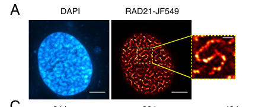

## Question

# Gene Research for Functional Annotation

## ⚠️ CRITICAL: Gene/Protein Identification Context

**BEFORE YOU BEGIN RESEARCH:** You MUST verify you are researching the CORRECT gene/protein. Gene symbols can be ambiguous, especially for less well-characterized genes from non-model organisms.

### Target Gene/Protein Identity (from UniProt):
- **UniProt Accession:** O60216
- **Protein Description:** RecName: Full=Double-strand-break repair protein rad21 homolog; Short=hHR21 {ECO:0000303|PubMed:8812457}; AltName: Full=Nuclear matrix protein 1 {ECO:0000303|PubMed:10623634}; Short=NXP-1 {ECO:0000303|PubMed:10623634}; AltName: Full=SCC1 homolog; Contains: RecName: Full=64-kDa C-terminal product {ECO:0000303|PubMed:12417729}; AltName: Full=64-kDa carboxy-terminal product {ECO:0000303|PubMed:12417729}; AltName: Full=65-kDa carboxy-terminal product {ECO:0000303|PubMed:11875078};
- **Gene Information:** Name=RAD21; Synonyms=HR21 {ECO:0000303|PubMed:11483345}, KIAA0078, NXP1, SCC1 {ECO:0000303|PubMed:11509732};
- **Organism (full):** Homo sapiens (Human).
- **Protein Family:** Belongs to the rad21 family. .
- **Key Domains:** NXP1_M-like. (IPR049589); Rad21/Rec8-like. (IPR039781); Rad21/Rec8_C_eu. (IPR006909); Rad21_Rec8_N. (IPR006910); ScpA-like_C. (IPR023093)

### MANDATORY VERIFICATION STEPS:

1. **Check if the gene symbol "RAD21" matches the protein description above**
2. **Verify the organism is correct:** Homo sapiens (Human).
3. **Check if protein family/domains align with what you find in literature**
4. **If you find literature for a DIFFERENT gene with the same or similar symbol, STOP**

### If Gene Symbol is Ambiguous or You Cannot Find Relevant Literature:

**DO NOT PROCEED WITH RESEARCH ON A DIFFERENT GENE.** Instead:
- State clearly: "The gene symbol 'RAD21' is ambiguous or literature is limited for this specific protein"
- Explain what you found (e.g., "Found extensive literature on a different gene with the same symbol in a different organism")
- Describe the protein based ONLY on the UniProt information provided above
- Suggest that the protein function can be inferred from domain/family information

### Research Target:

Please provide a comprehensive research report on the gene **RAD21** (gene ID: RAD21, UniProt: O60216) in human.

The research report should be a detailed narrative explaining the function, biological processes, and localization of the gene product. Citations should be given for all claims.

You should prioritize authoritative reviews and primary scientific literature when conducting research. You can supplement
this with annotations you find in gene/protein databases, but these can be outdated or inaccurate.

We are specifically interested in the primary function of the gene - for enzymes, what reaction is catalyzed, and what is the substrate specificity? For transporters, what is the substrate? For structural proteins or adapters, what is the broader structural role? For signaling molecules, what is the role in the pathway.

We are interested in where in or outside the cell the gene product carries out its function.

We are also interested in the signaling or biochemical pathways in which the gene functions. We are less interested in broad pleiotropic effects, except where these elucidate the precise role.

Include evidence where possible. We are interested in both experimental evidence as well as inference from structure, evolution, or bioinformatic analysis. Precise studies should be prioritized over high-throughput, where available.

## Output

Question: You are an expert researcher providing comprehensive, well-cited information.

Provide detailed information focusing on:
1. Key concepts and definitions with current understanding
2. Recent developments and latest research (prioritize 2023-2024 sources)
3. Current applications and real-world implementations
4. Expert opinions and analysis from authoritative sources
5. Relevant statistics and data from recent studies

Format as a comprehensive research report with proper citations. Include URLs and publication dates where available.
Always prioritize recent, authoritative sources and provide specific citations for all major claims.

# Gene Research for Functional Annotation

## ⚠️ CRITICAL: Gene/Protein Identification Context

**BEFORE YOU BEGIN RESEARCH:** You MUST verify you are researching the CORRECT gene/protein. Gene symbols can be ambiguous, especially for less well-characterized genes from non-model organisms.

### Target Gene/Protein Identity (from UniProt):
- **UniProt Accession:** O60216
- **Protein Description:** RecName: Full=Double-strand-break repair protein rad21 homolog; Short=hHR21 {ECO:0000303|PubMed:8812457}; AltName: Full=Nuclear matrix protein 1 {ECO:0000303|PubMed:10623634}; Short=NXP-1 {ECO:0000303|PubMed:10623634}; AltName: Full=SCC1 homolog; Contains: RecName: Full=64-kDa C-terminal product {ECO:0000303|PubMed:12417729}; AltName: Full=64-kDa carboxy-terminal product {ECO:0000303|PubMed:12417729}; AltName: Full=65-kDa carboxy-terminal product {ECO:0000303|PubMed:11875078};
- **Gene Information:** Name=RAD21; Synonyms=HR21 {ECO:0000303|PubMed:11483345}, KIAA0078, NXP1, SCC1 {ECO:0000303|PubMed:11509732};
- **Organism (full):** Homo sapiens (Human).
- **Protein Family:** Belongs to the rad21 family. .
- **Key Domains:** NXP1_M-like. (IPR049589); Rad21/Rec8-like. (IPR039781); Rad21/Rec8_C_eu. (IPR006909); Rad21_Rec8_N. (IPR006910); ScpA-like_C. (IPR023093)

### MANDATORY VERIFICATION STEPS:

1. **Check if the gene symbol "RAD21" matches the protein description above**
2. **Verify the organism is correct:** Homo sapiens (Human).
3. **Check if protein family/domains align with what you find in literature**
4. **If you find literature for a DIFFERENT gene with the same or similar symbol, STOP**

### If Gene Symbol is Ambiguous or You Cannot Find Relevant Literature:

**DO NOT PROCEED WITH RESEARCH ON A DIFFERENT GENE.** Instead:
- State clearly: "The gene symbol 'RAD21' is ambiguous or literature is limited for this specific protein"
- Explain what you found (e.g., "Found extensive literature on a different gene with the same symbol in a different organism")
- Describe the protein based ONLY on the UniProt information provided above
- Suggest that the protein function can be inferred from domain/family information

### Research Target:

Please provide a comprehensive research report on the gene **RAD21** (gene ID: RAD21, UniProt: O60216) in human.

The research report should be a detailed narrative explaining the function, biological processes, and localization of the gene product. Citations should be given for all claims.

You should prioritize authoritative reviews and primary scientific literature when conducting research. You can supplement
this with annotations you find in gene/protein databases, but these can be outdated or inaccurate.

We are specifically interested in the primary function of the gene - for enzymes, what reaction is catalyzed, and what is the substrate specificity? For transporters, what is the substrate? For structural proteins or adapters, what is the broader structural role? For signaling molecules, what is the role in the pathway.

We are interested in where in or outside the cell the gene product carries out its function.

We are also interested in the signaling or biochemical pathways in which the gene functions. We are less interested in broad pleiotropic effects, except where these elucidate the precise role.

Include evidence where possible. We are interested in both experimental evidence as well as inference from structure, evolution, or bioinformatic analysis. Precise studies should be prioritized over high-throughput, where available.

# Human RAD21 (UniProt O60216): Functional Annotation Report

## Executive summary

The requested target is unambiguously **human RAD21**, UniProt **O60216**, also known as **SCC1, HR21, KIAA0078, NXP1/hHR21**. It is a 631-amino-acid nuclear chromosome protein encoded at **8q24.11**. This identity matches the literature’s human RAD21/SCC1 and should not be confused with **RAD21L**, a distinct, meiosis-enriched paralog. The conserved N- and C-terminal Rad21/Rec8-like regions bind SMC3 and SMC1, respectively, while the central portion interacts with STAG proteins; this architecture agrees with the supplied Rad21/Rec8, Rad21_Rec8_N, Rad21/Rec8_C and ScpA-like_C domain annotations. (dorsett2007rolesofthe pages 1-2, mehta2013cohesinfunctionsbeyond pages 2-2, yue2024clinicalcharacteristicsgenetic pages 1-2)

RAD21 is **not an enzyme** and has no substrate or independently catalysed reaction. It is the **kleisin closure and regulatory subunit of cohesin**. By bridging the ATPase heads of SMC1A and SMC3 and recruiting STAG1 or STAG2, RAD21 closes a DNA-embracing cohesin ring. ATP binding and hydrolysis are performed by SMC1A/SMC3, whereas RAD21 provides structural closure, regulated gates and interaction surfaces. Its primary functions are: (1) sister-chromatid cohesion and faithful chromosome segregation; (2) interphase DNA-loop extrusion and three-dimensional genome organization; and (3) replication-associated genome maintenance and double-strand-break repair. (dorsett2007rolesofthe pages 1-2, sun2023rad21isthe pages 1-3, mehta2013cohesinfunctionsbeyond pages 2-2)

## 1. Identity and domain verification

The human gene lies at 8q24.11, contains 13 coding exons and produces a 631-residue protein. Its N terminus and C terminus are especially conserved and contact SMC3 and SMC1, respectively; a conserved central region binds STAG. RAD21 thereby joins the V-shaped SMC1A–SMC3 heterodimer and STAG1/2 to form the four-subunit cohesin core. These observations independently validate the supplied UniProt identity and rad21-family/domain assignment. (dorsett2007rolesofthe pages 1-2, mehta2013cohesinfunctionsbeyond pages 2-2, yue2024clinicalcharacteristicsgenetic pages 1-2)

The domain annotations are best interpreted as structural interaction modules rather than catalytic domains:

- **Rad21_Rec8_N / NXP1_M-like region:** contributes to kleisin attachment to the SMC3 head.
- **Rad21/Rec8_C_eu and ScpA-like_C:** contribute to attachment to the SMC1 head and closure of the ring.
- **Central RAD21 region:** binds STAG1/2 and regulatory proteins; this region is comparatively flexible and helps coordinate cohesin loading, retention and release. (sun2023rad21isthe pages 14-17, dorsett2007rolesofthe pages 1-2, yue2024clinicalcharacteristicsgenetic pages 1-2)

## 2. Molecular and structural function

### 2.1 Cohesin-ring closure

The cohesin core comprises SMC1A, SMC3, RAD21 and either STAG1 or STAG2. SMC1A and SMC3 form long coiled-coil arms joined at a hinge, with ATPase heads at the opposite end. RAD21 bridges those heads, closing the tripartite ring around DNA; STAG binds RAD21 and supplies additional regulatory and DNA-interaction surfaces. Thus, the most precise description of RAD21 is a **structural kleisin, regulated molecular gate and interaction scaffold**. (dorsett2007rolesofthe pages 1-2, mehta2013cohesinfunctionsbeyond pages 2-2, sun2023rad21isthe pages 1-3)

### 2.2 Cohesin loading and release

NIPBL–MAU2 loads cohesin onto chromatin before DNA replication. WAPL promotes its release, while PDS5 proteins modulate loading, residence and extrusion. A 2023 mechanistic study found that increasing RAD21 enhanced RAD21–loader and cohesin–loader complex formation and chromatin loading without simply increasing total assembled cohesin. Loader-binding-defective RAD21 did not produce the characteristic high-loading phenotype, arguing that RAD21 is an active regulatory interface in loading rather than merely a passive ring component. (sun2023rad21isthe pages 14-17, sun2023rad21isthe pages 1-3)

Super-resolution imaging showed that RAD21 up-regulation produces nuclear RAD21 clusters and a “beads-on-a-string” or vermicelli-like chromatin distribution. The accompanying model proposes that excess RAD21 increases encounters with NIPBL–MAU2, shifts cohesin into a loader-bound pool and drives unusually processive loop extrusion. (sun2023rad21isthe media d93dcf8c, sun2023rad21isthe media 88b5d1f2)

## 3. Cellular localization

RAD21 carries out its principal functions **inside the nucleus, on chromosomes and chromatin**. During interphase, cohesin occupies chromosome arms, enhancer–promoter neighborhoods, CTCF-associated loop anchors and topologically associating domain boundaries. It is also enriched at centromeric regions where persistent cohesion is needed for accurate bi-orientation and segregation. Nuclear localization is directly visible in the 2023 super-resolution experiments, including RAD21-positive beads and vermicelli structures following RAD21 elevation. (dorsett2007rolesofthe pages 1-2, sun2023rad21isthe pages 1-3, sun2023rad21isthe media d93dcf8c)

Localization is cell-cycle dependent. Cohesin loads before replication; a stable cohesive population is generated during S phase and persists through G2. Much chromosome-arm cohesin is released by the WAPL-dependent prophase pathway, whereas protected centromeric cohesin persists until anaphase. RAD21 is then cleaved to open the ring and permit sister-chromatid separation. Cohesin also remains relevant in non-dividing nuclei, consistent with a separate interphase role in gene regulation and chromosome architecture. (mehta2013cohesinfunctionsbeyond pages 2-2, peters2012sisterchromatidcohesion. pages 15-16, peters2012sisterchromatidcohesion. pages 8-9)

## 4. Principal biological processes and pathways

### 4.1 Replication-coupled sister-chromatid cohesion

Cohesin can associate with DNA before or after replication, but stable cohesion is normally established during S phase. Replication-fork-associated factors and cohesin acetylation convert loaded complexes into a state capable of holding newly replicated sister DNAs together. This linkage resists spindle forces, supports chromosome bi-orientation and ensures equal genome inheritance. (peters2012sisterchromatidcohesion. pages 8-9)

At anaphase onset, separase proteolytically cleaves RAD21/SCC1, opening cohesin and allowing sister chromosomes to move to opposite spindle poles. The UniProt-described **64/65-kDa C-terminal product** is therefore a proteolytic RAD21 fragment, not a separately encoded enzyme or independent functional isoform. RAD21’s regulated cleavage makes it the decisive mechanical gate for irreversible cohesin opening. Foundational reviews identify SCC1/RAD21 cleavage as a prerequisite for normal cohesin release and chromosome segregation. (peters2012sisterchromatidcohesion. pages 15-16)

### 4.2 Loop extrusion, TAD organization and transcription

Interphase cohesin extrudes chromatin loops until extrusion is halted or stabilized, frequently by convergently oriented CTCF sites. This mechanism creates loop domains, contributes to TAD architecture, and controls which enhancers can contact which promoters. Acute cohesin degradation rapidly removes loop domains, demonstrating that this architecture requires ongoing cohesin activity. RAD21 is therefore a genome-organization factor, not a sequence-specific transcription factor. (peters2012sisterchromatidcohesion. pages 8-9, sun2023rad21isthe pages 1-3)

The June 2023 *Genome Biology* study used super-resolution imaging, Hi-C and transcriptomics to define a RAD21-specific loading phenotype. RAD21 elevation increased short-range and TAD-corner contacts, increased inter-TAD interactions, reduced long-range interactions and weakened A/B-compartment segregation. Unlike WAPL depletion, it did not simply enlarge and merge TADs, suggesting that RAD21 abundance alters loading and extrusion while retaining substantial boundary insulation. (sun2023rad21isthe pages 14-17, sun2023rad21isthe pages 3-4)

RAD21 elevation altered **787 genes—649 upregulated and 138 downregulated**—and compartment switching correlated with expression changes. Cancer-associated TP53-, KRAS- and EGFR-related gene sets were enriched. These findings support a causal path from RAD21 dosage to cohesin loading, three-dimensional contacts and transcription, while also showing that transcriptional consequences are context- and locus-dependent. (sun2023rad21isthe pages 12-14)

### 4.3 DNA replication and double-strand-break repair

RAD21/cohesin contributes to genome maintenance in two connected ways. First, replication-coupled cohesion keeps an intact sister template near damaged DNA, favoring accurate repair in S/G2. Second, cohesin architecture organizes the chromatin surrounding breaks, influences damage signalling and can constrain inappropriate contacts that would generate deletions or translocations. Reduced cohesin function is associated with impaired post-replicative DSB repair and increased rearrangements. RAD21 itself does not catalyse end resection, ligation or RAD51-mediated strand exchange. (viushkov2025theinfluenceof pages 1-2, viushkov2025theinfluenceof pages 15-17, peters2012sisterchromatidcohesion. pages 8-9)

Recent live-cell work provides quantitative support for cohesin’s physical constraint on chromatin. Acute RAD21 depletion increased the median diffusion coefficient of an imaged genomic locus by approximately **1.5-fold** and raised its anomalous exponent from about **0.2 to 0.3**; the effect occurred in replicated and unreplicated chromatin but was stronger after replication. RAD21 depletion did not measurably alter the local mobility of 53BP1-labelled repair foci in that assay, illustrating that cohesin constrains ordinary chromatin motion but that its effect on assembled repair compartments is more complex. (viushkov2025theinfluenceof pages 15-17)

## 5. Human disease and clinical relevance

### 5.1 RAD21-related Cornelia de Lange syndrome type 4

Heterozygous pathogenic RAD21 variants cause **Cornelia de Lange syndrome type 4 (CdLS4; OMIM 614701)**. The best current mechanistic interpretation is altered cohesin dosage, loading and chromatin organization, producing developmental transcriptional dysregulation rather than a simple global failure of mitosis. Molecular diagnosis uses germline sequencing, typically multigene panels, exome sequencing or genome sequencing, followed by segregation and variant interpretation. (mehta2013cohesinfunctionsbeyond pages 8-8, yue2024clinicalcharacteristicsgenetic pages 1-2)

A 2024 review found **36 individuals with confirmed RAD21 variants** reported worldwide from May 2012 through March 2024. Frameshift variants were most common, representing **36% (13/36)**, followed by missense variants at 19% and nonsense variants at 17%. Among cases with adequate records, intellectual disability and verbal developmental delay were each reported in **94%**; long philtrum in 90%, thick eyebrows in 85%, long eyelashes and short fifth finger in 83%, thin upper vermilion in 81%, hearing loss in 33%, and short stature in 50%. Of 28 patients with known inheritance, 16 variants were de novo and 12 germline. (yue2024clinicalcharacteristicsgenetic pages 4-6, yue2024clinicalcharacteristicsgenetic pages 1-2)

That report also described a pathogenic **c.1143G>A, p.Trp381*** variant in a 13.3-year-old boy with marked short stature and typical craniofacial findings. The association is clinically established, but treatment remains supportive and phenotype-directed; there is no approved RAD21 replacement or gene-editing therapy. (yue2024clinicalcharacteristicsgenetic pages 4-6, yue2024clinicalcharacteristicsgenetic pages 1-2)

### 5.2 Cancer biology

RAD21 abnormalities can influence cancer through several non-exclusive mechanisms: chromosome-segregation defects, impaired DNA repair, altered enhancer–promoter contacts, changed lineage-specific transcription and disturbed stem/progenitor differentiation. Importantly, cancer effects are context-dependent—loss or reduced dosage can impair genome maintenance, whereas overexpression can increase cohesin loading and support oncogenic chromatin configurations. Thus, RAD21 should not be classified simply as a universal oncogene or tumour suppressor. (sun2023rad21isthe pages 12-14, manola2024cohesinrad21gene pages 1-2)

In breast-cancer datasets, RAD21 expression was elevated across four reported subtypes and higher expression was associated with poorer survival. High-RAD21 breast-cancer cells exhibited aggregated nuclear RAD21 and vermicelli-like structures, while experimental up-regulation altered compartments, TAD contacts and cancer-associated transcription. This is mechanistically compelling but remains an **emerging prognostic association**, not a validated stand-alone diagnostic test or approved drug target. (sun2023rad21isthe pages 12-14, sun2023rad21isthe pages 1-3)

A 2024 AML study, published **16 October 2024**, detected RAD21 promoter methylation in **24% of AML patients and 0% of healthy controls** (*p*=0.023). It occurred in **42.9% (9/21)** of patients with trisomy 8 (*p*=0.021), in **0/11** patients with chromosome-11 abnormalities (*p*=0.048), and at 7.7% and 15.4% in monosomal and complex karyotypes, respectively. ASXL1 status was not associated with methylation. The authors proposed RAD21 methylation as a possible epigenetic biomarker, but the cohort was limited and the observation requires independent replication, correlation with RAD21 expression and prospective evaluation before clinical use. (manola2024cohesinrad21gene pages 1-2)

## 6. Current applications and experimental implementation

1. **Clinical genetic diagnosis:** RAD21 is included in testing for CdLS and related cohesinopathies. Pathogenic variants inform diagnosis, recurrence-risk assessment and family counselling. Clinical interpretation must consider de novo and inherited variants and variable expressivity. (yue2024clinicalcharacteristicsgenetic pages 4-6, yue2024clinicalcharacteristicsgenetic pages 1-2)
2. **Chromosome-architecture research:** Auxin-inducible RAD21 degradation, fluorescent RAD21 tagging, ChIP-seq, Hi-C and super-resolution microscopy are widely used to dissect cohesin-dependent loops, TADs and chromatin dynamics. (sun2023rad21isthe pages 3-4, sun2023rad21isthe pages 1-3, sun2023rad21isthe media d93dcf8c)
3. **DNA-repair studies:** Acute RAD21 depletion separates cohesin-dependent cohesion and architecture from downstream repair outcomes and is used to test S/G2 repair, break mobility and genome-stability models. (viushkov2025theinfluenceof pages 15-17)
4. **Oncology biomarker research:** RAD21 expression, mutation and promoter methylation are being evaluated for prognosis or molecular subclassification. None currently constitutes an independently validated, routine RAD21-specific companion diagnostic. (sun2023rad21isthe pages 12-14, manola2024cohesinrad21gene pages 1-2)
5. **Therapeutic research:** Rather than directly inhibiting RAD21—which would risk catastrophic chromosome-segregation defects—current concepts emphasize synthetic vulnerabilities created by altered cohesin dosage, DNA-repair dependence or lineage-specific transcription. These remain research strategies rather than approved RAD21-targeted therapies.

## 7. Evidence synthesis

The following table distinguishes established molecular functions from preliminary translational findings.

| Dimension | Mechanistic annotation | Key evidence / quantitative result | Interpretation / clinical status |
|---|---|---|---|
| Identity and domain architecture | Human **RAD21** (UniProt **O60216**; SCC1/HR21/NXP1) is a 631-aa member of the Rad21/Rec8 kleisin family. Its conserved N- and C-terminal regions bind SMC3 and SMC1, respectively, while its central region engages STAG proteins. This agrees with the supplied Rad21/Rec8-like, terminal Rad21/Rec8 and ScpA-like annotations. | Human literature places **RAD21 at 8q24.11**, reports 631 residues and describes its terminal SMC contacts and central STAG interaction (2024; [DOI](https://doi.org/10.1002/mgg3.70009)) (yue2024clinicalcharacteristicsgenetic pages 1-2) | **Identity verified.** This is human RAD21/SCC1, not the distinct meiotic paralog RAD21L. |
| Cohesin structural role | RAD21 is the **kleisin closure subunit** of cohesin: it bridges the ATPase-head ends of the V-shaped SMC1A–SMC3 heterodimer, while STAG1 or STAG2 associates with RAD21. | Structural and review evidence assigns ATPase heads to SMC1/3 and the bridging role to RAD21; vertebrate cohesin comprises SMC1A, SMC3, RAD21 and SA1/2 (2007, [DOI](https://doi.org/10.1007/s00412-006-0072-6); 2013, [DOI](https://doi.org/10.1016/j.febslet.2013.06.035)) (dorsett2007rolesofthe pages 1-2, mehta2013cohesinfunctionsbeyond pages 2-2) | **Established core function.** RAD21 is a structural and regulatory protein, not a catalytic enzyme; cohesin ATP hydrolysis is performed by SMC1A/SMC3. |
| Nuclear localization and chromatin loading | RAD21 acts in the **nucleus on chromatin**. NIPBL–MAU2 loads cohesin, RAD21–loader contacts facilitate loading, and WAPL promotes release. | Super-resolution imaging showed nuclear RAD21 foci and beads-on-a-string or vermicelli chromatin after RAD21 up-regulation. Loader-binding-defective RAD21 failed to produce this phenotype (2023; [DOI](https://doi.org/10.1186/s13059-023-02982-1)) (sun2023rad21isthe pages 14-17, sun2023rad21isthe pages 1-3, sun2023rad21isthe media d93dcf8c) | **Established localization; strongly supported loading model.** RAD21 functions principally on nuclear chromosomes. |
| Sister-chromatid cohesion and anaphase release | Cohesin links replicated sister chromatids from S phase until mitosis. RAD21 provides a cleavable gate: separase cleavage at the metaphase–anaphase transition opens cohesin and permits sister separation. WAPL removes much arm cohesin earlier in prophase, while centromeric cohesin is protected until anaphase. | Cohesion is normally established during DNA replication, and human WAPL promotes sister-chromatid resolution in prophase. Reviews identify RAD21/SCC1 cleavage as necessary for cohesin release at anaphase (2012; [DOI](https://doi.org/10.1101/cshperspect.a011130)) (peters2012sisterchromatidcohesion. pages 15-16, peters2012sisterchromatidcohesion. pages 8-9) | **Canonical, established cell-cycle function.** The UniProt-described 64/65-kDa C-terminal species is a proteolytic RAD21 product, not a separately acting enzyme. |
| Loop extrusion, TADs and transcription | Interphase cohesin extrudes DNA loops; convergent CTCF sites can stall it to define loop-domain and TAD boundaries. RAD21 therefore supports enhancer–promoter communication and transcriptional insulation. | RAD21 up-regulation increased short-range, TAD-corner and inter-TAD contacts, weakened A/B compartment segregation and changed **787 genes**: 649 upregulated and 138 downregulated (2023; [DOI](https://doi.org/10.1186/s13059-023-02982-1)) (sun2023rad21isthe pages 14-17, sun2023rad21isthe pages 12-14) | **Established architectural function.** Expression effects are locus- and context-dependent; RAD21 is not a sequence-specific transcription factor. |
| DNA replication and DSB repair | Cohesion establishment is coupled to replication forks. At double-strand breaks, cohesin supports genome stability by holding sister templates nearby, organizing damaged chromatin and facilitating post-replicative repair, including homologous recombination. | Cohesin binds DNA before and after replication but normally establishes cohesion during S phase; reduced cohesin function impairs S/G2 DSB repair and increases rearrangements (2012, [DOI](https://doi.org/10.1101/cshperspect.a011130); 2025, [DOI](https://doi.org/10.3390/ijms26188837)) (viushkov2025theinfluenceof pages 1-2, viushkov2025theinfluenceof pages 15-17, peters2012sisterchromatidcohesion. pages 8-9) | **Established complex-level role**, although some repair mechanisms remain under study. RAD21 does not catalyze ligation, nuclease processing or strand exchange. |
| Cornelia de Lange syndrome type 4 | Heterozygous pathogenic RAD21 variants cause **CdLS type 4**, principally through cohesin dosage, genome architecture and transcriptional dysregulation. | A 2024 review identified **36 individuals** reported through March 2024. Frameshift variants represented 36% (13/36); intellectual disorder and verbal delay each occurred in 94% of evaluable patients, thick eyebrows in 85%, short fifth finger in 83%, hearing loss in 33% and short stature in 50% (2024; [DOI](https://doi.org/10.1002/mgg3.70009)) (yue2024clinicalcharacteristicsgenetic pages 4-6, yue2024clinicalcharacteristicsgenetic pages 1-2) | **Clinically established disease association.** Germline sequencing supports diagnosis and counseling, but management remains phenotype-directed and no approved RAD21-corrective therapy exists. |
| Breast cancer | Excess RAD21 may increase cohesin loading and reconfigure compartments, TAD contacts and cancer-associated transcriptional programs. | RAD21 was elevated across four breast-cancer subtypes and associated with poorer survival; high-expressing cells displayed nuclear RAD21 aggregates. RAD21 elevation in HeLa cells changed 787 genes and enriched mutant-TP53-, KRAS- and EGFR-associated signatures (2023; [DOI](https://doi.org/10.1186/s13059-023-02982-1)) (sun2023rad21isthe pages 12-14, sun2023rad21isthe pages 1-3) | **Emerging prognostic and mechanistic observation**, not a validated stand-alone biomarker or approved therapeutic target. Effects are context-dependent. |
| AML promoter methylation | RAD21 promoter methylation could reduce cohesin expression and perturb hematopoietic differentiation, chromatin accessibility and transcription-factor programs. | Methylation occurred in **24% of AML patients versus 0% of controls** (*p*=0.023); frequency was **42.9% (9/21)** with trisomy 8 (*p*=0.021), **0/11** with chromosome-11 abnormalities (*p*=0.048), 7.7% in monosomal and 15.4% in complex karyotypes (published 16 October 2024; [DOI](https://doi.org/10.3390/life14101311)) (manola2024cohesinrad21gene pages 1-2) | **Preliminary biomarker finding.** This limited-cohort observation requires independent validation, expression correlation and prospective clinical-utility studies. |

*Table: Evidence-based summary of verified human RAD21 identity, molecular functions, localization, disease associations and emerging cancer biomarkers. Established cohesin biology is distinguished from preliminary clinical observations.*

## 8. Current expert interpretation and unresolved questions

The strongest consensus is that RAD21 is the central **mechanical and regulatory kleisin** integrating cohesin-ring closure, loading, chromatin residence and irreversible anaphase opening. The 2023 data refine this view by identifying RAD21 abundance and loader interaction as determinants of cohesin loading and genome architecture, rather than treating all core subunits as equivalent. (sun2023rad21isthe pages 14-17)

Three issues remain unresolved. First, cohesin’s ATP-powered loop-extrusion cycle is a property of the whole complex, and the exact sequence of DNA-gate opening and closing remains under investigation; catalytic activity should not be assigned to RAD21 alone. Second, RAD21-dependent transcription is indirect and topology-dependent, so expression phenotypes vary by cell type and cannot be inferred solely from bulk RAD21 abundance. Third, oncology associations can reflect either loss of genome-maintenance function or gain of aberrant loading/architecture; therapeutic interpretation therefore requires genotype, dosage and cellular context. (sun2023rad21isthe pages 14-17, sun2023rad21isthe pages 12-14, dorsett2007rolesofthe pages 1-2)

## Key recent and authoritative sources

- **Sun et al., “RAD21 is the core subunit of the cohesin complex involved in directing genome organization.”** *Genome Biology*, published June 2023. https://doi.org/10.1186/s13059-023-02982-1. Mechanistic imaging, Hi-C and transcriptomic evidence for RAD21-loader interactions and altered loop extrusion. (sun2023rad21isthe pages 1-3)
- **Yue et al., “Clinical Characteristics, Genetic Analysis, and Literature Review of Cornelia de Lange Syndrome Type 4 Associated With a RAD21 Variant.”** *Molecular Genetics & Genomic Medicine*, accepted 27 August 2024 and published in 2024. https://doi.org/10.1002/mgg3.70009. Quantitative synthesis of 36 RAD21-CdLS4 cases. (yue2024clinicalcharacteristicsgenetic pages 4-6, yue2024clinicalcharacteristicsgenetic pages 1-2)
- **Manola et al., “Cohesin RAD21 Gene Promoter Methylation in Patients with Acute Myeloid Leukemia.”** *Life*, published 16 October 2024. https://doi.org/10.3390/life14101311. Exploratory AML methylation biomarker study. (manola2024cohesinrad21gene pages 1-2)
- **Peters and Nishiyama, “Sister Chromatid Cohesion.”** *Cold Spring Harbor Perspectives in Biology*, published November 2012. https://doi.org/10.1101/cshperspect.a011130. Authoritative framework for replication-coupled cohesion, WAPL-dependent release and anaphase separation. (peters2012sisterchromatidcohesion. pages 15-16, peters2012sisterchromatidcohesion. pages 8-9)
- **Dorsett, “Roles of the sister chromatid cohesion apparatus in gene expression, development, and human syndromes.”** *Chromosoma*, published January 2007. https://doi.org/10.1007/s00412-006-0072-6. Foundational description of kleisin architecture and developmental gene regulation. (dorsett2007rolesofthe pages 1-2)

References

1. (dorsett2007rolesofthe pages 1-2): Dale Dorsett. Roles of the sister chromatid cohesion apparatus in gene expression, development, and human syndromes. Chromosoma, 116:1-13, Jan 2007. URL: https://doi.org/10.1007/s00412-006-0072-6, doi:10.1007/s00412-006-0072-6. This article has 194 citations and is from a peer-reviewed journal.

2. (mehta2013cohesinfunctionsbeyond pages 2-2): Gunjan D. Mehta, Ravinder Kumar, Sanjeeva Srivastava, and Santanu Kumar Ghosh. Cohesin: functions beyond sister chromatid cohesion. FEBS Letters, 587:2299-2312, Aug 2013. URL: https://doi.org/10.1016/j.febslet.2013.06.035, doi:10.1016/j.febslet.2013.06.035. This article has 177 citations and is from a peer-reviewed journal.

3. (yue2024clinicalcharacteristicsgenetic pages 1-2): Xinyu Yue, Meiping Chen, Xiaoan Ke, Hongbo Yang, Fengying Gong, Linjie Wang, Lian Duan, Hui Pan, and Huijuan Zhu. Clinical characteristics, genetic analysis, and literature review of cornelia de lange syndrome type 4 associated with a rad21 variant. Molecular Genetics & Genomic Medicine, Sep 2024. URL: https://doi.org/10.1002/mgg3.70009, doi:10.1002/mgg3.70009. This article has 2 citations and is from a peer-reviewed journal.

4. (sun2023rad21isthe pages 1-3): Yuao Sun, Xin Xu, Wenxue Zhao, Yu Zhang, Keyang Chen, Yongzheng Li, Xiaotian Wang, Mengling Zhang, Boxin Xue, Wanting Yu, Yingping Hou, Chaobin Wang, Wei Xie, Cheng Li, Daochun Kong, Shu Wang, and Yujie Sun. Rad21 is the core subunit of the cohesin complex involved in directing genome organization. Genome Biology, Jun 2023. URL: https://doi.org/10.1186/s13059-023-02982-1, doi:10.1186/s13059-023-02982-1. This article has 47 citations and is from a highest quality peer-reviewed journal.

5. (sun2023rad21isthe pages 14-17): Yuao Sun, Xin Xu, Wenxue Zhao, Yu Zhang, Keyang Chen, Yongzheng Li, Xiaotian Wang, Mengling Zhang, Boxin Xue, Wanting Yu, Yingping Hou, Chaobin Wang, Wei Xie, Cheng Li, Daochun Kong, Shu Wang, and Yujie Sun. Rad21 is the core subunit of the cohesin complex involved in directing genome organization. Genome Biology, Jun 2023. URL: https://doi.org/10.1186/s13059-023-02982-1, doi:10.1186/s13059-023-02982-1. This article has 47 citations and is from a highest quality peer-reviewed journal.

6. (sun2023rad21isthe media d93dcf8c): Yuao Sun, Xin Xu, Wenxue Zhao, Yu Zhang, Keyang Chen, Yongzheng Li, Xiaotian Wang, Mengling Zhang, Boxin Xue, Wanting Yu, Yingping Hou, Chaobin Wang, Wei Xie, Cheng Li, Daochun Kong, Shu Wang, and Yujie Sun. Rad21 is the core subunit of the cohesin complex involved in directing genome organization. Genome Biology, Jun 2023. URL: https://doi.org/10.1186/s13059-023-02982-1, doi:10.1186/s13059-023-02982-1. This article has 47 citations and is from a highest quality peer-reviewed journal.

7. (sun2023rad21isthe media 88b5d1f2): Yuao Sun, Xin Xu, Wenxue Zhao, Yu Zhang, Keyang Chen, Yongzheng Li, Xiaotian Wang, Mengling Zhang, Boxin Xue, Wanting Yu, Yingping Hou, Chaobin Wang, Wei Xie, Cheng Li, Daochun Kong, Shu Wang, and Yujie Sun. Rad21 is the core subunit of the cohesin complex involved in directing genome organization. Genome Biology, Jun 2023. URL: https://doi.org/10.1186/s13059-023-02982-1, doi:10.1186/s13059-023-02982-1. This article has 47 citations and is from a highest quality peer-reviewed journal.

8. (peters2012sisterchromatidcohesion. pages 15-16): J. Peters and Tomoko Nishiyama. Sister chromatid cohesion. Cold Spring Harbor perspectives in biology, 4 11:a011130-a011130, Nov 2012. URL: https://doi.org/10.1101/cshperspect.a011130, doi:10.1101/cshperspect.a011130. This article has 288 citations and is from a peer-reviewed journal.

9. (peters2012sisterchromatidcohesion. pages 8-9): J. Peters and Tomoko Nishiyama. Sister chromatid cohesion. Cold Spring Harbor perspectives in biology, 4 11:a011130-a011130, Nov 2012. URL: https://doi.org/10.1101/cshperspect.a011130, doi:10.1101/cshperspect.a011130. This article has 288 citations and is from a peer-reviewed journal.

10. (sun2023rad21isthe pages 3-4): Yuao Sun, Xin Xu, Wenxue Zhao, Yu Zhang, Keyang Chen, Yongzheng Li, Xiaotian Wang, Mengling Zhang, Boxin Xue, Wanting Yu, Yingping Hou, Chaobin Wang, Wei Xie, Cheng Li, Daochun Kong, Shu Wang, and Yujie Sun. Rad21 is the core subunit of the cohesin complex involved in directing genome organization. Genome Biology, Jun 2023. URL: https://doi.org/10.1186/s13059-023-02982-1, doi:10.1186/s13059-023-02982-1. This article has 47 citations and is from a highest quality peer-reviewed journal.

11. (sun2023rad21isthe pages 12-14): Yuao Sun, Xin Xu, Wenxue Zhao, Yu Zhang, Keyang Chen, Yongzheng Li, Xiaotian Wang, Mengling Zhang, Boxin Xue, Wanting Yu, Yingping Hou, Chaobin Wang, Wei Xie, Cheng Li, Daochun Kong, Shu Wang, and Yujie Sun. Rad21 is the core subunit of the cohesin complex involved in directing genome organization. Genome Biology, Jun 2023. URL: https://doi.org/10.1186/s13059-023-02982-1, doi:10.1186/s13059-023-02982-1. This article has 47 citations and is from a highest quality peer-reviewed journal.

12. (viushkov2025theinfluenceof pages 1-2): Vladimir S. Viushkov, Nikolai A. Lomov, Polina O. Kalitina, Daria M. Potashnikova, Anastasia S. Shtompel, Sergey V. Ulianov, Sergey V. Razin, and Mikhail A. Rubtsov. The influence of cohesin on the short-scale dynamics of intact and damaged chromatin in different phases of the cell cycle. International Journal of Molecular Sciences, 26:8837, Sep 2025. URL: https://doi.org/10.3390/ijms26188837, doi:10.3390/ijms26188837. This article has 1 citations.

13. (viushkov2025theinfluenceof pages 15-17): Vladimir S. Viushkov, Nikolai A. Lomov, Polina O. Kalitina, Daria M. Potashnikova, Anastasia S. Shtompel, Sergey V. Ulianov, Sergey V. Razin, and Mikhail A. Rubtsov. The influence of cohesin on the short-scale dynamics of intact and damaged chromatin in different phases of the cell cycle. International Journal of Molecular Sciences, 26:8837, Sep 2025. URL: https://doi.org/10.3390/ijms26188837, doi:10.3390/ijms26188837. This article has 1 citations.

14. (mehta2013cohesinfunctionsbeyond pages 8-8): Gunjan D. Mehta, Ravinder Kumar, Sanjeeva Srivastava, and Santanu Kumar Ghosh. Cohesin: functions beyond sister chromatid cohesion. FEBS Letters, 587:2299-2312, Aug 2013. URL: https://doi.org/10.1016/j.febslet.2013.06.035, doi:10.1016/j.febslet.2013.06.035. This article has 177 citations and is from a peer-reviewed journal.

15. (yue2024clinicalcharacteristicsgenetic pages 4-6): Xinyu Yue, Meiping Chen, Xiaoan Ke, Hongbo Yang, Fengying Gong, Linjie Wang, Lian Duan, Hui Pan, and Huijuan Zhu. Clinical characteristics, genetic analysis, and literature review of cornelia de lange syndrome type 4 associated with a rad21 variant. Molecular Genetics & Genomic Medicine, Sep 2024. URL: https://doi.org/10.1002/mgg3.70009, doi:10.1002/mgg3.70009. This article has 2 citations and is from a peer-reviewed journal.

16. (manola2024cohesinrad21gene pages 1-2): Kalliopi N. Manola, Sophia Zachaki, Katerina Kakosaiou, Agapi Ioannidou, Marina Kalomoiraki, and Theodoros Rampias. Cohesin rad21 gene promoter methylation in patients with acute myeloid leukemia. Life, 14:1311, Oct 2024. URL: https://doi.org/10.3390/life14101311, doi:10.3390/life14101311. This article has 2 citations.

## Artifacts

- [Edison artifact artifact-00](RAD21-deep-research-falcon_artifacts/artifact-00.md)

## Citations

1. viushkov2025theinfluenceof pages 15-17
2. yue2024clinicalcharacteristicsgenetic pages 1-2
3. dorsett2007rolesofthe pages 1-2
4. mehta2013cohesinfunctionsbeyond pages 2-2
5. viushkov2025theinfluenceof pages 1-2
6. mehta2013cohesinfunctionsbeyond pages 8-8
7. yue2024clinicalcharacteristicsgenetic pages 4-6
8. DOI
9. https://doi.org/10.1002/mgg3.70009
10. https://doi.org/10.1007/s00412-006-0072-6
11. https://doi.org/10.1016/j.febslet.2013.06.035
12. https://doi.org/10.1186/s13059-023-02982-1
13. https://doi.org/10.1101/cshperspect.a011130
14. https://doi.org/10.3390/ijms26188837
15. https://doi.org/10.3390/life14101311
16. https://doi.org/10.1186/s13059-023-02982-1.
17. https://doi.org/10.1002/mgg3.70009.
18. https://doi.org/10.3390/life14101311.
19. https://doi.org/10.1101/cshperspect.a011130.
20. https://doi.org/10.1007/s00412-006-0072-6.
21. https://doi.org/10.1007/s00412-006-0072-6,
22. https://doi.org/10.1016/j.febslet.2013.06.035,
23. https://doi.org/10.1002/mgg3.70009,
24. https://doi.org/10.1186/s13059-023-02982-1,
25. https://doi.org/10.1101/cshperspect.a011130,
26. https://doi.org/10.3390/ijms26188837,
27. https://doi.org/10.3390/life14101311,