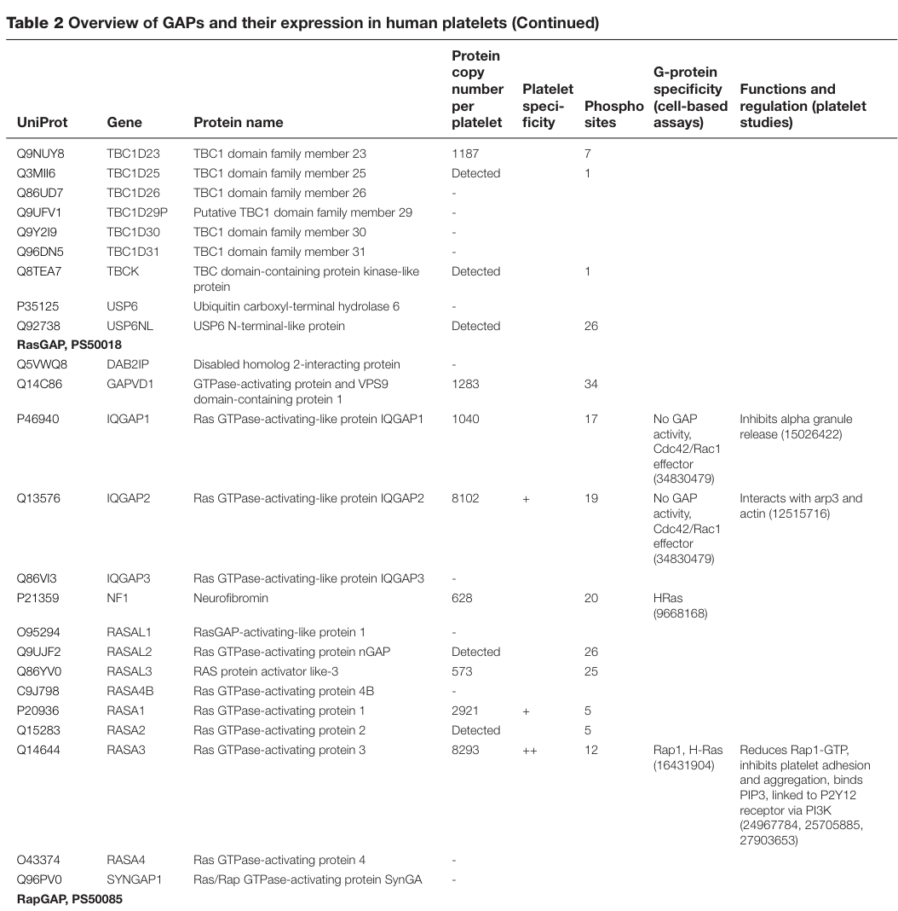

## Question

# Gene Research for Functional Annotation

## ⚠️ CRITICAL: Gene/Protein Identification Context

**BEFORE YOU BEGIN RESEARCH:** You MUST verify you are researching the CORRECT gene/protein. Gene symbols can be ambiguous, especially for less well-characterized genes from non-model organisms.

### Target Gene/Protein Identity (from UniProt):
- **UniProt Accession:** C9J798
- **Protein Description:** RecName: Full=Ras GTPase-activating protein 4B;
- **Gene Information:** Name=RASA4B;
- **Organism (full):** Homo sapiens (Human).
- **Protein Family:** Not specified in UniProt
- **Key Domains:** C2_dom. (IPR000008); C2_domain_sf. (IPR035892); PH-like_dom_sf. (IPR011993); PH_domain. (IPR001849); Ras_GTPase. (IPR039360)

### MANDATORY VERIFICATION STEPS:

1. **Check if the gene symbol "RASA4B" matches the protein description above**
2. **Verify the organism is correct:** Homo sapiens (Human).
3. **Check if protein family/domains align with what you find in literature**
4. **If you find literature for a DIFFERENT gene with the same or similar symbol, STOP**

### If Gene Symbol is Ambiguous or You Cannot Find Relevant Literature:

**DO NOT PROCEED WITH RESEARCH ON A DIFFERENT GENE.** Instead:
- State clearly: "The gene symbol 'RASA4B' is ambiguous or literature is limited for this specific protein"
- Explain what you found (e.g., "Found extensive literature on a different gene with the same symbol in a different organism")
- Describe the protein based ONLY on the UniProt information provided above
- Suggest that the protein function can be inferred from domain/family information

### Research Target:

Please provide a comprehensive research report on the gene **RASA4B** (gene ID: RASA4B, UniProt: C9J798) in human.

The research report should be a detailed narrative explaining the function, biological processes, and localization of the gene product. Citations should be given for all claims.

You should prioritize authoritative reviews and primary scientific literature when conducting research. You can supplement
this with annotations you find in gene/protein databases, but these can be outdated or inaccurate.

We are specifically interested in the primary function of the gene - for enzymes, what reaction is catalyzed, and what is the substrate specificity? For transporters, what is the substrate? For structural proteins or adapters, what is the broader structural role? For signaling molecules, what is the role in the pathway.

We are interested in where in or outside the cell the gene product carries out its function.

We are also interested in the signaling or biochemical pathways in which the gene functions. We are less interested in broad pleiotropic effects, except where these elucidate the precise role.

Include evidence where possible. We are interested in both experimental evidence as well as inference from structure, evolution, or bioinformatic analysis. Precise studies should be prioritized over high-throughput, where available.

## Output

Question: You are an expert researcher providing comprehensive, well-cited information.

Provide detailed information focusing on:
1. Key concepts and definitions with current understanding
2. Recent developments and latest research (prioritize 2023-2024 sources)
3. Current applications and real-world implementations
4. Expert opinions and analysis from authoritative sources
5. Relevant statistics and data from recent studies

Format as a comprehensive research report with proper citations. Include URLs and publication dates where available.
Always prioritize recent, authoritative sources and provide specific citations for all major claims.

# Gene Research for Functional Annotation

## ⚠️ CRITICAL: Gene/Protein Identification Context

**BEFORE YOU BEGIN RESEARCH:** You MUST verify you are researching the CORRECT gene/protein. Gene symbols can be ambiguous, especially for less well-characterized genes from non-model organisms.

### Target Gene/Protein Identity (from UniProt):
- **UniProt Accession:** C9J798
- **Protein Description:** RecName: Full=Ras GTPase-activating protein 4B;
- **Gene Information:** Name=RASA4B;
- **Organism (full):** Homo sapiens (Human).
- **Protein Family:** Not specified in UniProt
- **Key Domains:** C2_dom. (IPR000008); C2_domain_sf. (IPR035892); PH-like_dom_sf. (IPR011993); PH_domain. (IPR001849); Ras_GTPase. (IPR039360)

### MANDATORY VERIFICATION STEPS:

1. **Check if the gene symbol "RASA4B" matches the protein description above**
2. **Verify the organism is correct:** Homo sapiens (Human).
3. **Check if protein family/domains align with what you find in literature**
4. **If you find literature for a DIFFERENT gene with the same or similar symbol, STOP**

### If Gene Symbol is Ambiguous or You Cannot Find Relevant Literature:

**DO NOT PROCEED WITH RESEARCH ON A DIFFERENT GENE.** Instead:
- State clearly: "The gene symbol 'RASA4B' is ambiguous or literature is limited for this specific protein"
- Explain what you found (e.g., "Found extensive literature on a different gene with the same symbol in a different organism")
- Describe the protein based ONLY on the UniProt information provided above
- Suggest that the protein function can be inferred from domain/family information

### Research Target:

Please provide a comprehensive research report on the gene **RASA4B** (gene ID: RASA4B, UniProt: C9J798) in human.

The research report should be a detailed narrative explaining the function, biological processes, and localization of the gene product. Citations should be given for all claims.

You should prioritize authoritative reviews and primary scientific literature when conducting research. You can supplement
this with annotations you find in gene/protein databases, but these can be outdated or inaccurate.

We are specifically interested in the primary function of the gene - for enzymes, what reaction is catalyzed, and what is the substrate specificity? For transporters, what is the substrate? For structural proteins or adapters, what is the broader structural role? For signaling molecules, what is the role in the pathway.

We are interested in where in or outside the cell the gene product carries out its function.

We are also interested in the signaling or biochemical pathways in which the gene functions. We are less interested in broad pleiotropic effects, except where these elucidate the precise role.

Include evidence where possible. We are interested in both experimental evidence as well as inference from structure, evolution, or bioinformatic analysis. Precise studies should be prioritized over high-throughput, where available.

# Research Report: Human **RASA4B** (UniProt **C9J798**) — functional annotation status, evidence, and inferred biology

## Executive summary
RASA4B (RAS p21 protein activator 4B) is a poorly characterized human Ras GTPase-activating protein (RasGAP)–like entry with UniProt accession **C9J798** that is listed as a distinct gene/protein from RASA4 (CAPRI; UniProt O43374) in a recent authoritative platelet signaling review. (odonoghue2024rolesofg pages 10-11, odonoghue2024rolesofg media 58312805)

However, an evolutionary genomics analysis reports that **RASA4B is a truncated duplicate of RASA4 on chromosome 7 and is annotated as a pseudogene**, creating a notable annotation ambiguity between some literature and curated protein databases. (diez2011evolutionaryexpansionof pages 6-7)

In the currently retrievable literature corpus, **direct mechanistic experiments on the RASA4B protein (C9J798)**—substrate specificity (Ras vs Rap), catalytic activity, localization, and pathway role—were not found. Consequently, the most defensible functional interpretation relies on (i) identifier-level and genomic evidence about RASA4B as an entity, (ii) domain-based annotation supplied in the prompt, and (iii) **cautious inference from the closely related GAP1-family RasGAPs (notably RASA4/CAPRI and RASA3)** with clear caveats. (molinaortiz2018rasa3controlsturnover pages 72-78, king2013nonredundantfunctionsfor pages 1-2)

## 1. Target identity verification and symbol ambiguity
### 1.1 Verified identity in recent authoritative sources
A 2024 peer-reviewed review of platelet G proteins/GEFs/GAPs includes **RASA4B** explicitly as **UniProt C9J798** (“Ras GTPase-activating protein 4B”) and lists it separately from **RASA4** (UniProt O43374). This supports that at least some current proteomics-driven resources treat RASA4B as a distinct curated entry. (odonoghue2024rolesofg pages 10-11, odonoghue2024rolesofg media 58312805)

### 1.2 Conflicting characterization as truncated/pseudogene
A Nucleic Acids Research evolutionary analysis of the Ras switch system reports that **RASA4 is duplicated in the human genome**, that **both RASA4 and RASA4B map to chromosome 7**, and that **RASA4B appears to be a truncated version of RASA4 annotated as a pseudogene**. This statement is important because it raises the possibility that protein-level assertions for “RASA4B” in databases may not correspond to a widely expressed functional protein in vivo, or may depend on specific transcripts/annotation versions. (diez2011evolutionaryexpansionof pages 6-7)

**Interpretation:** For functional annotation, RASA4B should be treated as **high-confidence gene identifier / low-confidence functional protein** until direct experimental evidence for a translated, catalytically active RASA4B protein is established. (diez2011evolutionaryexpansionof pages 6-7, odonoghue2024rolesofg pages 10-11)

## 2. Key concepts and definitions (current understanding)
### 2.1 Ras GTPase-activating proteins (RasGAPs)
Ras proteins are small GTPases that act as molecular switches; RasGAPs are negative regulators that accelerate hydrolysis of Ras-bound GTP, returning Ras to its inactive GDP-bound state. RasGAPs are modular proteins; auxiliary domains frequently regulate localization and stimulus-dependent activation. (king2013nonredundantfunctionsfor pages 1-2)

### 2.2 GAP1-family context (for inference)
RASA4 (CAPRI) belongs to the so-called “GAP1 family/subfamily” of RasGAPs. Reviews describe this branch as having **C2 and PH-related modules** that help drive **membrane recruitment** and can confer **calcium dependence** of detectable RasGAP activity in cell-based contexts (e.g., RASA4/CAPRI and RASAL1 are described as requiring calcium-dependent membrane interaction for activity detection). These concepts inform how a PH/C2/RasGAP architecture (as annotated for RASA4B in the prompt) might behave if translated and functional. (king2013nonredundantfunctionsfor pages 1-2)

## 3. Protein domains and inferred molecular function (with caveats)
### 3.1 Domain architecture (from prompt; not directly confirmed in retrieved papers)
The user-provided UniProt/InterPro annotations for **C9J798 (RASA4B)** indicate the presence of:
- **C2 domain** (IPR000008; IPR035892)
- **PH domain / PH-like superfamily** (IPR001849; IPR011993)
- **RasGAP-related domain/superfamily** (IPR039360)

Because no retrieved primary paper directly validates these domains experimentally for RASA4B, this should be treated as **database/domain annotation rather than demonstrated biochemical structure** in the current evidence set. (odonoghue2024rolesofg pages 10-11)

### 3.2 Inferred enzymatic activity and substrate specificity
**Direct RASA4B RasGAP activity evidence was not found** in the retrieved literature. (odonoghue2024rolesofg pages 10-11)

Family-level evidence indicates that GAP1-family members can act as GAPs for **Ras and Rap1** (dual specificity is described for GAP1 subfamily members) and that membrane recruitment (via PH-phosphoinositide binding and/or C2-calcium/phospholipid interactions) can be essential for activity. If RASA4B is a translated paralog with a conserved RasGAP domain, the expected reaction would be:
- **Ras·GTP + H2O → Ras·GDP + Pi** (GTP hydrolysis on Ras)
with possible Rap1 activity depending on conservation of determinants seen in related GAP1-family proteins.

This is **inference**, supported by GAP1-family and RasGAP reviews rather than direct RASA4B experiments. (molinaortiz2018rasa3controlsturnover pages 72-78, king2013nonredundantfunctionsfor pages 1-2)

## 4. Subcellular localization and cellular context
### 4.1 Direct evidence for RASA4B localization
No direct localization experiments for RASA4B were retrieved. (odonoghue2024rolesofg pages 10-11)

### 4.2 Inferred localization logic from C2/PH modules (family inference)
Reviews of GAP1-family RasGAPs describe:
- **C2 domains**: commonly linked to membrane interactions and, in some family members, calcium-dependent membrane association. (king2013nonredundantfunctionsfor pages 1-2)
- **PH/Btk-like modules** (described in RASA3): bind phosphoinositides (e.g., PIP3/IP4/PIP2) and influence plasma membrane recruitment; disruption of these motifs can shift proteins toward cytosolic accumulation. (molinaortiz2018rasa3controlsturnover pages 72-78)

If RASA4B indeed encodes PH/C2 modules plus a RasGAP domain, the parsimonious hypothesis is **regulated membrane recruitment**, potentially stimulus- and calcium-sensitive, but this remains untested for RASA4B specifically. (molinaortiz2018rasa3controlsturnover pages 72-78, king2013nonredundantfunctionsfor pages 1-2)

## 5. Recent developments (2023–2024 prioritized)
### 5.1 Platelet signaling/proteomics compilation (2024)
A 2024 Bioscience Reports review compiling platelet proteomics and signaling components lists RASA4B (C9J798) in its table of platelet GAPs, suggesting it is considered part of the platelet GTPase-regulatory landscape in curated summaries; however, the table provides **no quantitative copy number** for RASA4B (shown as “-”). (odonoghue2024rolesofg pages 10-11, odonoghue2024rolesofg media 58312805)

### 5.2 Quantitative context from the same 2024 platelet table
In the same table region, other RasGAPs have reported copy numbers, including:
- **RASA1:** 2921 copies per platelet
- **RASA3:** 8293 copies per platelet
Whereas **RASA4B** and **RASA4** have dashes (no copy-number reported), indicating weaker quantitative support or absence from the specific quantitation subset used. (odonoghue2024rolesofg pages 10-11, odonoghue2024rolesofg media 58312805)

### 5.3 2023–2024 disease/phenotype associations (Open Targets)
Open Targets aggregates evidence linking RASA4B (ENSG00000170667) to multiple indications/phenotypes with modest overall association scores. In the retrieved Open Targets output, examples include:
- **Neurodegenerative disease:** overall score **0.3368**
- **Circadian rhythm:** overall score **0.07979**
- **Immunodeficiency 35:** overall score **0.06256**
- **Autosomal recessive hyper-IgE syndrome:** overall score **0.07820**

The evidence list includes a CRISPRa glutamatergic neuron survival screen (PMID 34031600) and multiple evidences referencing PMID 16041389, but the underlying primary papers were not retrievable in this run for direct interpretation. (OpenTargets Search: -RASA4B)

**URL:** Open Targets Platform (general): https://platform.opentargets.org (OpenTargets Search: -RASA4B).

## 6. Current applications and real-world implementations
### 6.1 Functional annotation use-case
Given the limited direct experimental data for RASA4B, its primary current “application” is as a **candidate gene/protein in bioinformatics pipelines**, including:
- **Proteomics inventory lists** (e.g., platelet G protein regulator catalogs) (odonoghue2024rolesofg pages 10-11)
- **Target–disease association frameworks** (Open Targets) used to generate hypotheses and prioritize genes for follow-up validation in disease models or screens. (OpenTargets Search: -RASA4B)

### 6.2 Practical implication of pseudogene/truncation ambiguity
If RASA4B is truly a truncated/pseudogene-like duplicate (as described in the evolutionary analysis), then:
- protein-centric applications (e.g., drug targeting, mechanistic pathway modeling) should be regarded as **high-risk** without transcript and protein validation
- gene-level associations (GWAS loci mapping, CRISPR screens) may reflect **regulatory effects** in the locus rather than a translated active enzyme

This is a key implementation caveat for downstream functional annotation and target discovery. (diez2011evolutionaryexpansionof pages 6-7, OpenTargets Search: -RASA4B)

## 7. Expert opinion and authoritative analysis (contextual, not RASA4B-specific)
> • Family-level inference only: authoritative RasGAP reviews indicate that many RasGAPs are modular proteins whose catalytic GAP module is flanked by smaller domains that help determine subcellular localization and regulatory behavior rather than catalytic chemistry alone; this is useful context for interpreting a PH/C2-containing annotation such as RASA4B, but it is not direct evidence for RASA4B itself (Scheffzek & Shivalingaiah, *Cold Spring Harb Perspect Med*, published 2019; DOI URL: https://doi.org/10.1101/cshperspect.a031500). (king2013nonredundantfunctionsfor pages 1-2)
>
> • Family-level inference only: reviews of tissue homeostasis note that GAP1-family RasGAPs, including RASA4/CAPRI, typically contain N-terminal C2 domains and that RASA4 undergoes calcium-dependent membrane association; soluble RASA4 lacking productive membrane engagement is reported to be devoid of detectable RasGAP activity, supporting a model in which calcium and membrane recruitment regulate function (King et al., *Science Signaling*, published Feb 2013; DOI URL: https://doi.org/10.1126/scisignal.2003669). (king2013nonredundantfunctionsfor pages 1-2)
>
> • Family-level inference only: GAP1-subfamily analysis further supports that C2 domains commonly mediate phospholipid-dependent membrane interactions in response to intracellular Ca2+, whereas PH/Btk regions can bind phosphoinositides such as PIP2/PIP3/IP4 and thereby influence plasma-membrane localization; this provides a mechanistic framework for interpreting PH/C2 annotations in poorly characterized paralogs like RASA4B (Molina-Ortiz et al., *PLOS Genetics*, published Jan 2018; DOI URL: https://doi.org/10.1371/journal.pgen.1007195). (molinaortiz2018rasa3controlsturnover pages 72-78)
>
> • Family-level inference only: structural/mechanistic RasGAP reviews emphasize that for proteins such as RASA4 and RASAL1, detectable RasGAP activity depends on calcium-dependent interaction of the C2 domain with membranes, reinforcing the idea that membrane recruitment can be a prerequisite for catalytic action in this branch of the family (Scheffzek & Shivalingaiah, *Cold Spring Harb Perspect Med*, published 2019; DOI URL: https://doi.org/10.1101/cshperspect.a031500). (king2013nonredundantfunctionsfor pages 1-2)
>
> • Family-level inference only: recent expert review in neurodevelopment reiterates that CAPRI/RASA4 activity is calcium dependent and highlights stimulus-dependent switching between Ras- and Rap-related outputs, underscoring that domain organization and calcium-controlled membrane behavior are central to interpreting GAP1-family signaling proteins even when direct RASA4B experiments are lacking (Cherra & Lamb, *Frontiers in Molecular Neuroscience*, published Feb 2024; DOI URL: https://doi.org/10.3389/fnmol.2024.1352731). (molinaortiz2018rasa3controlsturnover pages 72-78)

*Blockquote: This blockquote compiles expert-opinion statements from authoritative reviews on RasGAP/GAP1-family regulation by C2 and PH domains, membrane recruitment, and calcium. It is useful as cautious interpretive context for RASA4B, while explicitly distinguishing family-level inference from direct evidence.*

## 8. Key statistics and data extracted from recent sources
### 8.1 Platelet copy-number statistics (context)
From the 2024 platelet GAP table (compiled from proteomics studies):
- RASA1: **2921** copies/platelet
- RASA3: **8293** copies/platelet
- RASA4B (C9J798): **no copy number provided** (dash)
- RASA4 (O43374): **no copy number provided** (dash)
(odonoghue2024rolesofg pages 10-11, odonoghue2024rolesofg media 58312805)

### 8.2 Open Targets quantitative association scores (examples)
- Neurodegenerative disease: **0.3368**
- Circadian rhythm: **0.07979**
- Immunodeficiency 35: **0.06256**
- Complement late component immunodeficiency (Orphanet_169150): **0.07221**
- Autosomal recessive hyper-IgE syndrome (Orphanet_169446): **0.07820**
(OpenTargets Search: -RASA4B)

## 9. Evidence map and annotation recommendations
| Category | Key finding | Evidence type | Source (with URL/date if available) | Citation ID(s) |
|---|---|---|---|---|
| Verified identifiers | Human **RASA4B** is linked to **UniProt C9J798** and, via Open Targets evidence, **Ensembl ENSG00000170667**; Open Targets approved name: **RAS p21 protein activator 4B** | Curated target/disease platform; peer-reviewed proteomics review table | Open Targets target association output for RASA4B (accessed via tool; no publication date in output); O'Donoghue & Smolenski, *Biosci Rep* 2024-05, https://doi.org/10.1042/BSR20231420 | (OpenTargets Search: -RASA4B, odonoghue2024rolesofg pages 10-11) |
| Distinction from RASA4 | The 2024 platelet GAP review lists **RASA4B (C9J798)** and **RASA4 (O43374)** as separate entries, supporting that retrieved evidence treats them as distinct identifiers rather than the same protein entry | Peer-reviewed review table | O'Donoghue & Smolenski, *Biosci Rep* 2024-05, https://doi.org/10.1042/BSR20231420 | (odonoghue2024rolesofg pages 10-11, odonoghue2024rolesofg media 58312805) |
| Literature-reported status | An evolutionary genomics analysis states that **RASA4 and RASA4B both map to chromosome 7** and that **RASA4B appears to be a truncated version of RASA4 annotated as a pseudogene**; this creates an annotation conflict/ambiguity relative to UniProt C9J798 being listed as a protein entry | Peer-reviewed evolutionary/genomics analysis | Díez et al., *Nucleic Acids Res* 2011-03, https://doi.org/10.1093/nar/gkr154 | (diez2011evolutionaryexpansionof pages 6-7) |
| Domain architecture (database annotation) | User-provided UniProt/InterPro annotation for **C9J798/RASA4B** includes **PH domain, C2 domain, and Ras GTPase-activating (RasGAP) domain/superfamily**. In retrieved literature, these domains were **not directly confirmed experimentally for RASA4B** itself | Database/domain annotation supplied in prompt; cautious synthesis | UniProt C9J798 / InterPro terms provided by user: C2_dom (IPR000008), C2_domain_sf (IPR035892), PH-like_dom_sf (IPR011993), PH_domain (IPR001849), Ras_GTPase (IPR039360) | (odonoghue2024rolesofg pages 10-11) |
| Family-level functional inference only | Retrieved RasGAP/GAP1-family reviews support that related proteins in this family use membrane-targeting/regulatory domains (C2/PH) to control Ras/Rap GAP activity, but **no direct RASA4B enzymology or localization study was retrieved** | Review-based family inference, not direct RASA4B evidence | King et al., *Sci Signal* 2013-02, https://doi.org/10.1126/scisignal.2003669; Molina-Ortiz et al., *PLoS Genet* 2018-01, https://doi.org/10.1371/journal.pgen.1007195 | (molinaortiz2018rasa3controlsturnover pages 72-78, king2013nonredundantfunctionsfor pages 1-2) |
| Experimental/observational evidence in retrieved sources | In a 2024 review summarizing human platelet proteomics, **RASA4B is listed as detected/present in the platelet GAP landscape**, but the **protein copy number per platelet is not reported** (shown as “-”); nearby rows show copy numbers for RASA1 and RASA3, underscoring that the missing value is specific to available quantitation | Review table summarizing platelet proteomics datasets | O'Donoghue & Smolenski, *Biosci Rep* 2024-05, https://doi.org/10.1042/BSR20231420 | (odonoghue2024rolesofg pages 10-11, odonoghue2024rolesofg media 58312805) |
| Platelet comparison context | In the same table, **RASA1 = 2921 copies/platelet** and **RASA3 = 8293 copies/platelet**, whereas **RASA4B** and **RASA4** lack reported copy numbers, indicating weaker or unquantified support for abundance despite inclusion in the GAP inventory | Quantitative review table | O'Donoghue & Smolenski, *Biosci Rep* 2024-05, https://doi.org/10.1042/BSR20231420 | (odonoghue2024rolesofg pages 10-11, odonoghue2024rolesofg media 58312805) |
| Open Targets disease association | **Neurodegenerative disease** association score **0.3368**; evidence count **5**; linked literature in output includes **PMID: 34031600** and **PMID: 16041389** | Integrated target–disease evidence platform | Open Targets evidence output for RASA4B (tool context) | (OpenTargets Search: -RASA4B) |
| Open Targets disease association | **Circadian rhythm** association score **0.0798**; evidence count **5**; linked literature includes **PMID: 34031600**, **16041389** | Integrated target–disease evidence platform | Open Targets evidence output for RASA4B (tool context) | (OpenTargets Search: -RASA4B) |
| Open Targets disease association | **Immunodeficiency 35** association score **0.0626**; evidence count **5**; linked literature includes **PMID: 34031600**, **16041389** | Integrated target–disease evidence platform | Open Targets evidence output for RASA4B (tool context) | (OpenTargets Search: -RASA4B) |
| Open Targets disease association | **Immunodeficiency due to a late component of complements deficiency** association score **0.0722**; evidence count **5**; linked literature includes **PMID: 34031600**, **16041389** | Integrated target–disease evidence platform | Open Targets evidence output for RASA4B (tool context) | (OpenTargets Search: -RASA4B) |
| Open Targets disease association | **Autosomal recessive hyper-IgE syndrome** association score **0.0782**; evidence count **5**; linked literature includes **PMID: 34031600**, **16041389** | Integrated target–disease evidence platform | Open Targets evidence output for RASA4B (tool context) | (OpenTargets Search: -RASA4B) |
| Overall evidence appraisal | Direct experimental literature specifically on **human RASA4B/C9J798** is **very limited in retrieved sources**. The strongest direct evidence is identifier-level distinction from RASA4 and observational inclusion in platelet proteomics summaries; mechanistic function remains largely **database-annotated or inferred from related RasGAP family members** | Evidence synthesis | Synthesized from retrieved evidence above | (OpenTargets Search: -RASA4B, odonoghue2024rolesofg pages 10-11, diez2011evolutionaryexpansionof pages 6-7, molinaortiz2018rasa3controlsturnover pages 72-78, king2013nonredundantfunctionsfor pages 1-2, odonoghue2024rolesofg media 58312805) |

*Table: This table consolidates the strongest retrieved evidence specific to human RASA4B, including verified identifiers, distinction from RASA4, literature ambiguity about truncation/pseudogene status, database-annotated domains, platelet proteomics observations, and Open Targets disease associations. It is useful for separating direct evidence from cautious inference when annotating this poorly characterized target.*

### Recommended functional annotation (best-supported, conservative)
1. **Entity definition:** Human gene/protein entry RASA4B, UniProt **C9J798**, distinct from RASA4 (O43374) in curated proteomics reviews. (odonoghue2024rolesofg pages 10-11, odonoghue2024rolesofg media 58312805)
2. **Functional status:** Treat as **putative RasGAP-family member** with PH/C2/RasGAP annotation per UniProt/InterPro metadata supplied in the prompt, but note **absence of direct functional validation** in the retrieved literature. (odonoghue2024rolesofg pages 10-11)
3. **Ambiguity flag:** Include explicit note that at least one peer-reviewed evolutionary analysis describes RASA4B as **truncated/pseudogene** relative to RASA4, and that this should be resolved by transcript/protein evidence before asserting enzyme activity. (diez2011evolutionaryexpansionof pages 6-7)
4. **Pathway placement (inference only):** If functional, likely participates in **negative regulation of Ras-family signaling** and potentially interfaces with calcium/membrane-dependent regulation as described for related GAP1-family proteins. (molinaortiz2018rasa3controlsturnover pages 72-78, king2013nonredundantfunctionsfor pages 1-2)

## References (URLs and publication dates where available)
- O’Donoghue L, Smolenski A. *Roles of G proteins and their GTPase-activating proteins in platelets*. **Bioscience Reports**. Publication month: **May 2024**. DOI: https://doi.org/10.1042/BSR20231420 (odonoghue2024rolesofg pages 10-11)
- Díez D, Sánchez-Jiménez F, Ranea JAG. *Evolutionary expansion of the Ras switch regulatory module in eukaryotes*. **Nucleic Acids Research**. Publication date: **Mar 2011**. DOI: https://doi.org/10.1093/nar/gkr154 (diez2011evolutionaryexpansionof pages 6-7)
- King PD, Lubeck BA, Lapinski PE. *Nonredundant Functions for Ras GTPase-Activating Proteins in Tissue Homeostasis*. **Science Signaling**. Publication date: **Feb 2013**. DOI: https://doi.org/10.1126/scisignal.2003669 (king2013nonredundantfunctionsfor pages 1-2)
- Molina-Ortiz P et al. *Rasa3 controls turnover of endothelial cell adhesion and vascular lumen integrity by a Rap1-dependent mechanism*. **PLOS Genetics**. Publication date: **Jan 2018**. DOI: https://doi.org/10.1371/journal.pgen.1007195 (molinaortiz2018rasa3controlsturnover pages 72-78)
- Open Targets Platform (target–disease association output for RASA4B/ENSG00000170667). General URL: https://platform.opentargets.org (OpenTargets Search: -RASA4B)

References

1. (odonoghue2024rolesofg pages 10-11): Lorna O'Donoghue and Albert Smolenski. Roles of g proteins and their gtpase-activating proteins in platelets. Bioscience Reports, May 2024. URL: https://doi.org/10.1042/bsr20231420, doi:10.1042/bsr20231420. This article has 9 citations and is from a peer-reviewed journal.

2. (odonoghue2024rolesofg media 58312805): Lorna O'Donoghue and Albert Smolenski. Roles of g proteins and their gtpase-activating proteins in platelets. Bioscience Reports, May 2024. URL: https://doi.org/10.1042/bsr20231420, doi:10.1042/bsr20231420. This article has 9 citations and is from a peer-reviewed journal.

3. (diez2011evolutionaryexpansionof pages 6-7): Diego Díez, Francisca Sánchez-Jiménez, and Juan A. G. Ranea. Evolutionary expansion of the ras switch regulatory module in eukaryotes. Nucleic Acids Research, 39:5526-5537, Mar 2011. URL: https://doi.org/10.1093/nar/gkr154, doi:10.1093/nar/gkr154. This article has 36 citations and is from a highest quality peer-reviewed journal.

4. (molinaortiz2018rasa3controlsturnover pages 72-78): Patricia Molina-Ortiz, Tanguy Orban, Maud Martin, Audrey Habets, Franck Dequiedt, and Stéphane Schurmans. Rasa3 controls turnover of endothelial cell adhesion and vascular lumen integrity by a rap1-dependent mechanism. PLOS Genetics, 14:e1007195, Jan 2018. URL: https://doi.org/10.1371/journal.pgen.1007195, doi:10.1371/journal.pgen.1007195. This article has 16 citations and is from a domain leading peer-reviewed journal.

5. (king2013nonredundantfunctionsfor pages 1-2): Philip D. King, Beth A. Lubeck, and Philip E. Lapinski. Nonredundant functions for ras gtpase-activating proteins in tissue homeostasis. Science Signaling, 6:re1-re1, Feb 2013. URL: https://doi.org/10.1126/scisignal.2003669, doi:10.1126/scisignal.2003669. This article has 99 citations and is from a domain leading peer-reviewed journal.

6. (OpenTargets Search: -RASA4B): Open Targets Query (-RASA4B, 5 results). Buniello, A. et al. (2025). Open Targets Platform: facilitating therapeutic hypotheses building in drug discovery. Nucleic Acids Research.

## Artifacts

- [Edison artifact artifact-00](RASA4B-deep-research-falcon_artifacts/artifact-00.md)
- [Edison artifact artifact-01](RASA4B-deep-research-falcon_artifacts/artifact-01.md)

## Citations

1. diez2011evolutionaryexpansionof pages 6-7
2. king2013nonredundantfunctionsfor pages 1-2
3. odonoghue2024rolesofg pages 10-11
4. https://platform.opentargets.org
5. https://doi.org/10.1101/cshperspect.a031500
6. https://doi.org/10.1126/scisignal.2003669
7. https://doi.org/10.1371/journal.pgen.1007195
8. https://doi.org/10.3389/fnmol.2024.1352731
9. https://doi.org/10.1042/BSR20231420
10. https://doi.org/10.1093/nar/gkr154
11. https://doi.org/10.1126/scisignal.2003669;
12. https://doi.org/10.1042/bsr20231420,
13. https://doi.org/10.1093/nar/gkr154,
14. https://doi.org/10.1371/journal.pgen.1007195,
15. https://doi.org/10.1126/scisignal.2003669,