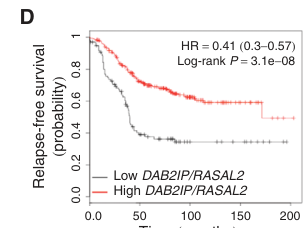

## Question

# Gene Research for Functional Annotation

## ⚠️ CRITICAL: Gene/Protein Identification Context

**BEFORE YOU BEGIN RESEARCH:** You MUST verify you are researching the CORRECT gene/protein. Gene symbols can be ambiguous, especially for less well-characterized genes from non-model organisms.

### Target Gene/Protein Identity (from UniProt):
- **UniProt Accession:** Q9UJF2
- **Protein Description:** RecName: Full=Ras GTPase-activating protein nGAP; AltName: Full=RAS protein activator-like 2;
- **Gene Information:** Name=RASAL2; Synonyms=NGAP;
- **Organism (full):** Homo sapiens (Human).
- **Protein Family:** Not specified in UniProt
- **Key Domains:** C2_dom. (IPR000008); C2_domain_sf. (IPR035892); DAB2P_C. (IPR021887); PH_domain. (IPR001849); Ras_GTPase. (IPR039360)

### MANDATORY VERIFICATION STEPS:

1. **Check if the gene symbol "RASAL2" matches the protein description above**
2. **Verify the organism is correct:** Homo sapiens (Human).
3. **Check if protein family/domains align with what you find in literature**
4. **If you find literature for a DIFFERENT gene with the same or similar symbol, STOP**

### If Gene Symbol is Ambiguous or You Cannot Find Relevant Literature:

**DO NOT PROCEED WITH RESEARCH ON A DIFFERENT GENE.** Instead:
- State clearly: "The gene symbol 'RASAL2' is ambiguous or literature is limited for this specific protein"
- Explain what you found (e.g., "Found extensive literature on a different gene with the same symbol in a different organism")
- Describe the protein based ONLY on the UniProt information provided above
- Suggest that the protein function can be inferred from domain/family information

### Research Target:

Please provide a comprehensive research report on the gene **RASAL2** (gene ID: RASAL2, UniProt: Q9UJF2) in human.

The research report should be a detailed narrative explaining the function, biological processes, and localization of the gene product. Citations should be given for all claims.

You should prioritize authoritative reviews and primary scientific literature when conducting research. You can supplement
this with annotations you find in gene/protein databases, but these can be outdated or inaccurate.

We are specifically interested in the primary function of the gene - for enzymes, what reaction is catalyzed, and what is the substrate specificity? For transporters, what is the substrate? For structural proteins or adapters, what is the broader structural role? For signaling molecules, what is the role in the pathway.

We are interested in where in or outside the cell the gene product carries out its function.

We are also interested in the signaling or biochemical pathways in which the gene functions. We are less interested in broad pleiotropic effects, except where these elucidate the precise role.

Include evidence where possible. We are interested in both experimental evidence as well as inference from structure, evolution, or bioinformatic analysis. Precise studies should be prioritized over high-throughput, where available.

## Output

Question: You are an expert researcher providing comprehensive, well-cited information.

Provide detailed information focusing on:
1. Key concepts and definitions with current understanding
2. Recent developments and latest research (prioritize 2023-2024 sources)
3. Current applications and real-world implementations
4. Expert opinions and analysis from authoritative sources
5. Relevant statistics and data from recent studies

Format as a comprehensive research report with proper citations. Include URLs and publication dates where available.
Always prioritize recent, authoritative sources and provide specific citations for all major claims.

# Gene Research for Functional Annotation

## ⚠️ CRITICAL: Gene/Protein Identification Context

**BEFORE YOU BEGIN RESEARCH:** You MUST verify you are researching the CORRECT gene/protein. Gene symbols can be ambiguous, especially for less well-characterized genes from non-model organisms.

### Target Gene/Protein Identity (from UniProt):
- **UniProt Accession:** Q9UJF2
- **Protein Description:** RecName: Full=Ras GTPase-activating protein nGAP; AltName: Full=RAS protein activator-like 2;
- **Gene Information:** Name=RASAL2; Synonyms=NGAP;
- **Organism (full):** Homo sapiens (Human).
- **Protein Family:** Not specified in UniProt
- **Key Domains:** C2_dom. (IPR000008); C2_domain_sf. (IPR035892); DAB2P_C. (IPR021887); PH_domain. (IPR001849); Ras_GTPase. (IPR039360)

### MANDATORY VERIFICATION STEPS:

1. **Check if the gene symbol "RASAL2" matches the protein description above**
2. **Verify the organism is correct:** Homo sapiens (Human).
3. **Check if protein family/domains align with what you find in literature**
4. **If you find literature for a DIFFERENT gene with the same or similar symbol, STOP**

### If Gene Symbol is Ambiguous or You Cannot Find Relevant Literature:

**DO NOT PROCEED WITH RESEARCH ON A DIFFERENT GENE.** Instead:
- State clearly: "The gene symbol 'RASAL2' is ambiguous or literature is limited for this specific protein"
- Explain what you found (e.g., "Found extensive literature on a different gene with the same symbol in a different organism")
- Describe the protein based ONLY on the UniProt information provided above
- Suggest that the protein function can be inferred from domain/family information

### Research Target:

Please provide a comprehensive research report on the gene **RASAL2** (gene ID: RASAL2, UniProt: Q9UJF2) in human.

The research report should be a detailed narrative explaining the function, biological processes, and localization of the gene product. Citations should be given for all claims.

You should prioritize authoritative reviews and primary scientific literature when conducting research. You can supplement
this with annotations you find in gene/protein databases, but these can be outdated or inaccurate.

We are specifically interested in the primary function of the gene - for enzymes, what reaction is catalyzed, and what is the substrate specificity? For transporters, what is the substrate? For structural proteins or adapters, what is the broader structural role? For signaling molecules, what is the role in the pathway.

We are interested in where in or outside the cell the gene product carries out its function.

We are also interested in the signaling or biochemical pathways in which the gene functions. We are less interested in broad pleiotropic effects, except where these elucidate the precise role.

Include evidence where possible. We are interested in both experimental evidence as well as inference from structure, evolution, or bioinformatic analysis. Precise studies should be prioritized over high-throughput, where available.

## Research Report: Human **RASAL2** (UniProt Q9UJF2; RAS protein activator-like 2; nGAP)

### 0) Target verification (identity check)
The target in scope is **human RASAL2** (RAS protein activator-like 2; also called **nGAP**) corresponding to UniProt **Q9UJF2**. Independent RasGAP-focused reviews describe **RASAL2** as a **PH–C2–RasGAP** domain protein of ~**1139 aa**, consistent with the UniProt description and with RasGAP-family architecture. (stewart2020pumpingthebrakes pages 2-3)

---

### 1) Key concepts, definitions, and current understanding

#### 1.1 Ras GTPase-activating proteins (RasGAPs) and the RAS “off reaction”
**RAS proteins** are small GTPases that toggle between an “on” (GTP-bound) and “off” (GDP-bound) state. **RasGAPs** accelerate the intrinsic GTP hydrolysis rate of RAS, thereby promoting the conversion of **RAS-GTP → RAS-GDP** (functional inactivation of RAS signaling). Reviews of Ras negative regulation highlight that the **GTPase-stimulating activity** resides in the **C-terminal GAP domain** and that loss of RasGAP function leads to accumulation of **GTP-bound RAS** with increased downstream signaling. (stewart2020pumpingthebrakes pages 2-3)

**Primary molecular function (RASAL2):** by definition and domain composition, RASAL2’s canonical biochemical role is to act as a RasGAP that down-regulates RAS signaling by accelerating GTP hydrolysis on RAS. (stewart2020pumpingthebrakes pages 2-3)

#### 1.2 Domain architecture and how domains relate to function
A RasGAP review that explicitly lists RASAL2 describes it as a **PH domain + C2 domain + C-terminal RasGAP domain** protein. (stewart2020pumpingthebrakes pages 2-3)

**Functional interpretation (current model):** Ras is membrane-associated; therefore, **noncatalytic domains** (PH/C2) are widely discussed as contributing to **membrane targeting** and/or protein–protein interactions that position the GAP domain to engage membrane-localized RAS. (stewart2020pumpingthebrakes pages 2-3)

#### 1.3 RASAL2 as a context-dependent signaling regulator in cancer
A RasGAP-centered cancer review synthesizes a major theme for RASAL2: it is frequently described as a **tumor suppressor** in multiple cancers (low expression associated with Ras–ERK activation and worse prognosis), yet it can also behave in some contexts as an **oncogenic driver** of EMT/metastasis, with reported links to **YAP**, **Wnt/β-catenin**, **PI3K/AKT**, and **Rac1** pathway wiring. This is presented as a context-dependent phenomenon and a key interpretive issue in the RASAL2 literature. (bellazzo2020cuttingthebrakes pages 3-5)

---

### 2) Molecular function, pathways, and mechanistic roles

#### 2.1 Pathway position: RAS–ERK/MAPK and PI3K/AKT
By its RasGAP catalytic function, RASAL2 is placed upstream of major RAS effector pathways (e.g., ERK/MAPK, PI3K/AKT) as a **negative regulator**. The “Ras brakes” reviews emphasize that RasGAP loss increases signaling through RAS-regulated pathways. (stewart2020pumpingthebrakes pages 2-3)

In luminal breast cancer models, combined perturbation of RasGAP tumor suppressors (RASAL2 with DAB2IP) is described as producing strong activation of **ERK and AKT** outputs, supporting the view that RasGAP co-loss can amplify multiple RAS-pathway branches. (olsen2017lossofrasgap pages 11-11)

#### 2.2 Cooperation with DAB2IP: coupling RAS output and inflammatory/NF-κB signaling in ER+ breast cancer
A key mechanistic concept from the luminal breast cancer literature is **cooperative tumor suppression** by two RasGAPs, **RASAL2** and **DAB2IP**. The Cancer Discovery study reports that combined loss promotes invasiveness and EMT, and that reconstitution of both genes suppresses metastasis in vivo. (olsen2017lossofrasgap pages 5-6, olsen2017lossofrasgap pages 7-8)

A later 2024 review focused on DAB2IP frames this cooperation as **nonredundant** and notes that concomitant loss of both RasGAPs “dramatically increased invasion and metastasis” in ER+ breast cancer models, reinforcing the concept that RasGAP network integrity is important for metastasis control. (fania2024anupdateon pages 1-2)

A 2024 JCI Insight paper also highlights that DAB2IP loss often occurs together with loss of RASAL2 and links this to poor outcome in luminal breast cancer contexts, placing RASAL2 within a clinically relevant RasGAP-loss state. (mukherjee2024dab2iplossin pages 1-2)

---

### 3) Subcellular localization (where RASAL2 acts)
RAS is anchored to membranes; accordingly, RasGAP modular domains are interpreted as contributing to localization. A Ras-regulator review explicitly lists RASAL2’s **PH and C2** domains and discusses such domains as mediating membrane targeting and interactions enabling Ras engagement at membranes. (stewart2020pumpingthebrakes pages 2-3)

A RasGAP cancer review specifically notes phosphorylation within the PH domain and underscores that **membrane localization is important for RasGAP function/activity**. (bellazzo2020cuttingthebrakes pages 3-5)

**Evidence limitation:** The retrieved corpus contains general RasGAP-domain architecture and membrane-targeting interpretations (PH/C2), but limited direct, RASAL2-specific cell biology (e.g., imaging/localization maps) beyond these review statements; this should be considered when interpreting localization claims as inference from domain architecture rather than a definitive localization atlas. (stewart2020pumpingthebrakes pages 2-3, bellazzo2020cuttingthebrakes pages 3-5)

---

### 4) Regulation and post-translational modifications (PTMs)

#### 4.1 AMPK-dependent phosphorylation and autophagy “switch” mechanism
A mechanistic Autophagy study (Feb 2021) reports a detailed regulatory model connecting RASAL2 to nutrient stress and autophagy:

* Under basal conditions, RASAL2 recruits **PPM1B (pp2cβ)**, attenuating **AMPK/PRKAA phosphorylation** and suppressing basal autophagy. (bao2021prkaaampkαphosphorylationswitches pages 1-3, bao2021prkaaampkαphosphorylationswitches pages 3-4)
* Under **glucose starvation**, PPM1B dissociates and **AMPK phosphorylates RASAL2 at S351**, after which phosphorylated RASAL2 binds the **PIK3C3/VPS34–ATG14–BECN1 (Beclin1)** complex to increase PIK3C3 activity and autophagy. (bao2021prkaaampkαphosphorylationswitches pages 1-3, bao2021prkaaampkαphosphorylationswitches pages 3-4)

This work explicitly states that **RASAL2 S351 phosphorylation** functions as a molecular switch that can convert RASAL2 from an autophagy suppressor into an autophagy activator, and links this to breast tumor growth and poor outcomes (qualitatively described in the excerpt). (bao2021prkaaampkαphosphorylationswitches pages 1-3)

#### 4.2 LKB1–AMPK-related kinase network and phosphorylation candidates
A phosphoproteomics-driven study of LKB1 signaling identifies RASAL2 as an LKB1-dependent phosphoprotein (>2-fold in both attached and detached datasets) and proposes candidate AMPK-related phosphorylation sites: **S56, S89, S736, S864, S899**. LKB1-dependent phosphorylation increases are reported at **S89, S736, and S864**, with genetic data implicating **MARK kinases** and **SIK family members (notably SIK1+SIK3)** in detachment-associated phosphorylation patterns; AMPK contributes partially in some assays. (kamireddy2020aquantitativephosphoproteomicsa pages 50-55, kamireddy2020aquantitativephosphoproteomicsa pages 55-59)

#### 4.3 Additional reported phosphorylation in PH domain
A RasGAP cancer review notes that **RASAL2 can be phosphorylated on Ser237 within the PH domain** (review statement), consistent with the broader theme that regulatory phosphorylation can tune RasGAP localization or function. (bellazzo2020cuttingthebrakes pages 3-5)

---

### 5) Recent developments (prioritizing 2023–2024)

#### 5.1 2023: RASAL2 as a tumor suppressor in cervical cancer
A 2023 study in cervical cancer (BIOCELL; Jan 2023) reports:

* RASAL2 is downregulated in cervical cancer tissues/cell lines; low expression correlates with **advanced stage and metastasis**. (chen2023rasal2actsas pages 1-2)
* In a cohort of **54 cervical cancer tissues** (and 33 adjacent tissues), splitting patients into low (n=29) and high (n=25) RASAL2 groups, high RASAL2 expression is associated with reduced advanced clinical stage and metastasis (stage **p=0.024**, lymph node metastasis **p=0.039**, distant metastasis **p=0.025**) and improved survival (reported **p<0.05**). (chen2023rasal2actsas pages 3-7)

This study uses overexpression/knockdown in HeLa/SiHa cells to show functional suppression of proliferation/migration/invasion and induction of apoptosis with RASAL2 restoration. (chen2023rasal2actsas pages 3-7)

#### 5.2 2024: Expert synthesis emphasizing cooperative RasGAP loss and therapeutic implications (via DAB2IP)
A 2024 review (Cell Death & Differentiation; Jun 2024) highlights that DAB2IP is a RasGAP and adaptor modulating multiple oncogenic pathways (NF-κB, Wnt/β-catenin, PI3K/AKT, MAPK) and explicitly notes functional cooperation with RASAL2 in limiting metastasis in ER+ breast cancer; the review frames restoration/upregulation of DAB2IP as a potential strategy that concurrently dampens multiple oncogenic pathways. (fania2024anupdateon pages 1-2, fania2024anupdateon pages 2-3)

A 2024 JCI Insight paper (Dec 2024) further contextualizes RasGAP loss as clinically meaningful in ER+ breast cancer, noting that DAB2IP loss often co-occurs with RASAL2 loss and that such RasGAP-loss states are associated with poorer outcomes, with an explicit statement that co-loss promotes poorer outcome in ~**50%** of Luminal B breast cancer. (mukherjee2024dab2iplossin pages 1-2)

---

### 6) Current applications and real-world implementations

#### 6.1 Prognostic stratification / biomarker-style use (ER+ luminal breast cancer)
The strongest “real-world” implementation supported by the retrieved evidence is **risk stratification** based on RasGAP expression patterns.

In luminal B breast cancer, Olsen et al. (Cancer Discovery; Feb 2017) report tumor subsets with low RASAL2 and/or DAB2IP, including **16% low RASAL2**, **24% low DAB2IP**, and **22% low both**. The combined low-expression state stratifies relapse-free survival with a highly significant log-rank **P = 3.1×10⁻⁸**. (olsen2017lossofrasgap pages 5-6, olsen2017lossofrasgap media 3a556391)

These quantitative patterns are visually supported by the paper’s figures: the low-expression distribution (pie chart) and Kaplan–Meier plot are available as extracted figure crops. (olsen2017lossofrasgap media 3a556391, olsen2017lossofrasgap media 8e13ab1a)

#### 6.2 Preclinical mechanistic implementation: metastasis suppression circuitry
The same study provides preclinical “implementation” in the sense of actionable mechanistic circuitry: reconstitution of both RASAL2 and DAB2IP markedly reduced metastasis versus single-gene reconstitution controls in luminal breast cancer models (reported P values include **P=0.043 vs RASAL2 alone**, **P=0.002 vs DAB2IP alone**, and bioluminescence total flux **P=0.004**). (olsen2017lossofrasgap pages 7-8)

The authors also report clinical associations with stage: tumors lacking both genes were enriched for **stage II–IV** disease and differed from tumors expressing both genes (P<0.05), consistent with a metastasis/aggressiveness linkage. (olsen2017lossofrasgap pages 6-7)

#### 6.3 Therapeutic targeting status
Using the clinical-trial search tool with “RASAL2” did not yield RASAL2-targeted interventional trials; the retrieved trial appears unrelated to RASAL2 biology, suggesting the term does not map cleanly to trial metadata in this interface. Therefore, current “applications” are better supported as **biomarker/prognostic** or **mechanistic pathway** uses rather than direct RASAL2-targeted therapeutics in clinical trials (based on available evidence). (mukherjee2024dab2iplossin pages 1-2)

---

### 7) Statistics and data highlights (recent and foundational)

* **Luminal B breast cancer cohort (RASAL2/DAB2IP):** 16% low RASAL2, 24% low DAB2IP, 22% low both; relapse-free survival separation log-rank **P=3.1×10⁻⁸**. (olsen2017lossofrasgap pages 5-6, olsen2017lossofrasgap media 3a556391)
* **Luminal B stage association:** tumors lacking both genes: **90% stage II–IV vs 10% stage I**; tumors expressing both genes: **45% stage I** (P<0.05). (olsen2017lossofrasgap pages 6-7)
* **Metastasis suppression in vivo (reconstitution):** dual RASAL2 + DAB2IP reconstitution reduces metastasis compared with single-gene reconstitution (P values reported above). (olsen2017lossofrasgap pages 7-8)
* **Cervical cancer cohort (2023):** n=54; high vs low RASAL2 correlates with clinical stage (**p=0.024**), lymph node metastasis (**p=0.039**), distant metastasis (**p=0.025**), and improved survival (**p<0.05**). (chen2023rasal2actsas pages 3-7)
* **PTM candidates under LKB1 signaling:** candidate phosphosites **S56, S89, S736, S864, S899**, with evidence for LKB1-dependent phosphorylation at **S89/S736/S864** and involvement of **MARK** and **SIK1+SIK3** in detachment-associated regulation. (kamireddy2020aquantitativephosphoproteomicsa pages 50-55, kamireddy2020aquantitativephosphoproteomicsa pages 55-59)

---

### 8) Expert opinions and analysis (authoritative synthesis)
A consistent expert synthesis across RasGAP-focused reviews is that **Ras pathway hyperactivation can arise not only from RAS mutations but also from defects in RAS regulators**, including RasGAP loss/inactivation; RasGAPs are modular proteins whose noncatalytic domains contribute to localization and regulatory interactions, meaning “RasGAP loss” can rewire signaling beyond simply increasing Ras-GTP. (stewart2020pumpingthebrakes pages 2-3, bellazzo2020cuttingthebrakes pages 3-5)

The 2024 DAB2IP review explicitly uses the RASAL2/DAB2IP cooperation as an example of **nonredundant tumor-suppressive RasGAP circuitry** in ER+ breast cancer metastasis and frames this as relevant to therapeutic thinking—particularly strategies that restore RasGAP function to dampen multiple oncogenic pathways simultaneously (in that review, emphasized for DAB2IP). (fania2024anupdateon pages 1-2)

---

### 9) Visual evidence from primary literature
Extracted figure regions from Olsen et al. (Cancer Discovery 2017) provide visual documentation of (i) the distribution of low RASAL2/DAB2IP expression states in luminal B tumors and (ii) the relapse-free survival stratification by combined RasGAP status, plus a schematic model for cooperative regulation of RAS and NF-κB signaling in metastasis. (olsen2017lossofrasgap media 3a556391, olsen2017lossofrasgap media 2deeb97b)

---

### Summary table of key findings
| Claim/Topic | Key finding | Evidence type | Source | Publication date | URL/DOI |
|---|---|---|---|---|---|
| Target identity / core function | Human **RASAL2** corresponds to **RAS protein activator like 2 / nGAP**, a RasGAP-family protein of **1,139 aa**; RasGAPs accelerate conversion of **RAS-GTP to RAS-GDP**, thereby suppressing RAS signaling (stewart2020pumpingthebrakes pages 2-3) | Review / domain summary | Stewart, *Journal of Cell Science* | Feb 2020 | https://doi.org/10.1242/jcs.238865 |
| Domains | RASAL2 is described as containing **PH, C2, and C-terminal RasGAP domains**; noncatalytic domains are implicated in membrane targeting/interactions needed to position RasGAPs near membrane-associated RAS (stewart2020pumpingthebrakes pages 2-3) | Review | Stewart, *Journal of Cell Science* | Feb 2020 | https://doi.org/10.1242/jcs.238865 |
| Family / current understanding | Review classifies RASAL2 among cytoplasmic RasGAPs and notes that loss of RasGAPs can elevate Ras pathway output; RASAL2 has context-dependent tumor-suppressive or oncogenic roles across cancers (bellazzo2020cuttingthebrakes pages 3-5, stewart2020pumpingthebrakes pages 2-3) | Review | Bellazzo, *Cancers*; Stewart, *Journal of Cell Science* | Oct 2020; Feb 2020 | https://doi.org/10.3390/cancers12103066 ; https://doi.org/10.1242/jcs.238865 |
| Localization | Review evidence indicates **PH and C2 domains promote constitutive plasma membrane association**, and **RASAL2 associates with membranes at the leading edge**; however, detailed RASAL2-specific mechanistic localization data remain limited in gathered evidence (olsen2017lossofrasgap pages 5-6) (olsen2017lossofrasgap pages 5-6) | Review / inferred from family biology | King, *Science Signaling* | Feb 2013 | https://doi.org/10.1126/scisignal.2003669 |
| Regulation / PTM | Review notes **RASAL2 can be phosphorylated on Ser237 within the PH domain** and that membrane localization is important for RasGAP activity (bellazzo2020cuttingthebrakes pages 3-5) | Review | Bellazzo, *Cancers* | Oct 2020 | https://doi.org/10.3390/cancers12103066 |
| Regulation / PTM | **AMPK (PRKAA)** phosphorylates **RASAL2 at S351** under glucose starvation; this promotes dissociation from **PPM1B** and enables phosphorylated RASAL2 to bind the **PIK3C3/VPS34-ATG14-BECN1 complex**, increasing PIK3C3 activity and autophagy (bao2021prkaaampkαphosphorylationswitches pages 1-3, bao2021prkaaampkαphosphorylationswitches pages 3-4) | Primary; cell biology / autophagy assays | Bao, *Autophagy* | Feb 2021 | https://doi.org/10.1080/15548627.2021.1886767 |
| Binding partners / mechanism | Under basal conditions RASAL2 recruits **PPM1B/pp2cβ** to attenuate AMPK phosphorylation; glucose starvation causes **PPM1B dissociation** and converts RASAL2 into an autophagy activator via the VPS34 complex (bao2021prkaaampkαphosphorylationswitches pages 1-3, bao2021prkaaampkαphosphorylationswitches pages 3-4) | Primary; interaction and functional assays | Bao, *Autophagy* | Feb 2021 | https://doi.org/10.1080/15548627.2021.1886767 |
| Functional nuance | RASAL2’s inhibition of basal autophagy is reported to be **independent of RasGAP catalytic activity**, although the **GAP domain is required** for this inhibitory role (bao2021prkaaampkαphosphorylationswitches pages 3-4) | Primary; KO/rescue functional assays | Bao, *Autophagy* | Feb 2021 | https://doi.org/10.1080/15548627.2021.1886767 |
| Regulation / phosphoproteomics | LKB1-dependent phosphoproteomics identified candidate AMPK-related phosphorylation sites on RASAL2: **S56, S89, S736, S864, S899**; phosphoenriched data showed LKB1-dependent increases at **S89, S736, S864** (kamireddy2020aquantitativephosphoproteomicsa pages 50-55, kamireddy2020aquantitativephosphoproteomics pages 50-55) | Primary; phosphoproteomics | Kamireddy, phosphoproteomics study | 2020 | URL not available in gathered evidence |
| Upstream kinases | In detachment settings, **SIK1 + SIK3** knockout/knockdown abolished the LKB1-dependent AMPK-motif phospho-signal on RASAL2; **AMPK** contributed partially; **MARKs** were also implicated for some sites (kamireddy2020aquantitativephosphoproteomics pages 50-55, kamireddy2020aquantitativephosphoproteomicsa pages 55-59, kamireddy2020aquantitativephosphoproteomics pages 55-59) | Primary; phosphoproteomics / IP / kinase KO | Kamireddy, phosphoproteomics study | 2020 | URL not available in gathered evidence |
| Pathways | In cancer literature, RASAL2 loss is linked to enhanced **Ras–ERK/MAPK** signaling; context-dependent reports also connect RASAL2 to **YAP, Wnt/β-catenin, PI3K/AKT, and Rac1** signaling (bellazzo2020cuttingthebrakes pages 3-5, bao2021prkaaampkαphosphorylationswitches pages 1-3) | Review + primary mechanistic context | Bellazzo, *Cancers*; Bao, *Autophagy* | Oct 2020; Feb 2021 | https://doi.org/10.3390/cancers12103066 ; https://doi.org/10.1080/15548627.2021.1886767 |
| Disease / breast cancer cohort | In luminal B breast tumors, **16%** showed low **RASAL2**, **24%** low **DAB2IP**, and **22%** low expression of **both**; combined low expression strongly stratified relapse-free survival (**log-rank P = 3.1e-08**) (olsen2017lossofrasgap pages 5-6, olsen2017lossofrasgap media 3a556391) | Primary; patient cohort / Kaplan–Meier | Olsen, *Cancer Discovery* | Feb 2017 | https://doi.org/10.1158/2159-8290.CD-16-0520 |
| Disease / metastasis mechanism | In luminal breast cancer models, **RASAL2 and DAB2IP cooperate** to suppress metastasis; reconstitution of both genes reduced metastasis versus single-gene reconstitution or control (**P = 0.043 vs RASAL2 alone; P = 0.002 vs DAB2IP alone; total flux P = 0.004**) (olsen2017lossofrasgap pages 7-8) | Primary; xenograft / intracardiac metastasis assays | Olsen, *Cancer Discovery* | Feb 2017 | https://doi.org/10.1158/2159-8290.CD-16-0520 |
| Disease / metastatic phenotypes | In McNeu luminal mouse cancer cells, shRNA codepletion of **Rasal2 + Dab2ip** significantly increased metastatic lung lesions after tail-vein injection (**P = 0.0019**) (olsen2017lossofrasgap pages 7-8) | Primary; mouse metastasis assay | Olsen, *Cancer Discovery* | Feb 2017 | https://doi.org/10.1158/2159-8290.CD-16-0520 |
| Disease / tumor growth | In CAMA1 xenografts, RASAL2 or DAB2IP suppression significantly affected tumor formation/growth (reported P values for individual perturbations include **0.0043, 0.0087** for DAB2IP guides and **0.0016, 0.0022** for RASAL2 shRNAs); combined suppression also reported with **P = 0.008**, though legend notes no statistically significant increase in tumor volume upon combined suppression (olsen2017lossofrasgap pages 5-6) | Primary; xenograft / CRISPR-shRNA | Olsen, *Cancer Discovery* | Feb 2017 | https://doi.org/10.1158/2159-8290.CD-16-0520 |
| Clinical relevance / expert view | Reviews emphasize that RASAL2 behaves as a **context-dependent RasGAP regulator**: often tumor suppressive when expression is lost and Ras signaling rises, but in some settings capable of promoting EMT/metastatic programs through noncanonical pathway wiring (bellazzo2020cuttingthebrakes pages 3-5, bao2021prkaaampkαphosphorylationswitches pages 1-3) | Review / expert synthesis | Bellazzo, *Cancers*; Bao, *Autophagy* | Oct 2020; Feb 2021 | https://doi.org/10.3390/cancers12103066 ; https://doi.org/10.1080/15548627.2021.1886767 |

*Table: This table compiles the key evidence gathered for human RASAL2, covering molecular function, domains, localization, regulation, pathways, and disease relevance. It highlights residue-level PTMs, pathway interactions, and clinically relevant statistics from breast cancer studies.*

---

### 10) Key gaps and recommended next steps (evidence-based limitations)
1. **Direct localization evidence for RASAL2** (live-cell imaging showing plasma membrane/leading edge localization and dependence on PH/C2 domains) was not strongly represented in the retrieved full-text evidence; several statements are review-level or inferred from domain architecture and family behavior. Future targeted retrieval should prioritize RASAL2 imaging papers and domain-mutation localization assays. (stewart2020pumpingthebrakes pages 2-3, bellazzo2020cuttingthebrakes pages 3-5)
2. Several **2024 mechanistic studies** flagged by search results (e.g., RASAL2 degradation in metastasis; renal fibrosis roles) were listed as unobtainable by the tool, limiting completeness for 2023–2024 mechanistic breadth. (mukherjee2024dab2iplossin pages 1-2)

References

1. (stewart2020pumpingthebrakes pages 2-3): Desmond R. Harrell Stewart and Geoffrey J. Clark. Pumping the brakes on ras – negative regulators and death effectors of ras. Journal of Cell Science, Feb 2020. URL: https://doi.org/10.1242/jcs.238865, doi:10.1242/jcs.238865. This article has 35 citations and is from a domain leading peer-reviewed journal.

2. (bellazzo2020cuttingthebrakes pages 3-5): Arianna Bellazzo and Licio Collavin. Cutting the brakes on ras—cytoplasmic gaps as targets of inactivation in cancer. Cancers, 12:3066, Oct 2020. URL: https://doi.org/10.3390/cancers12103066, doi:10.3390/cancers12103066. This article has 21 citations.

3. (olsen2017lossofrasgap pages 11-11): Sarah Naomi Olsen, Ania Wronski, Zafira Castaño, Benjamin Dake, Clare Malone, Thomas De Raedt, Miriam Enos, Yoko S. DeRose, Wenhui Zhou, Stephanie Guerra, Massimo Loda, Alana Welm, Ann H. Partridge, Sandra S. McAllister, Charlotte Kuperwasser, and Karen Cichowski. Loss of rasgap tumor suppressors underlies the aggressive nature of luminal b breast cancers. Cancer Discovery, 7(2):202-217, Feb 2017. URL: https://doi.org/10.1158/2159-8290.cd-16-0520, doi:10.1158/2159-8290.cd-16-0520. This article has 72 citations and is from a highest quality peer-reviewed journal.

4. (olsen2017lossofrasgap pages 5-6): Sarah Naomi Olsen, Ania Wronski, Zafira Castaño, Benjamin Dake, Clare Malone, Thomas De Raedt, Miriam Enos, Yoko S. DeRose, Wenhui Zhou, Stephanie Guerra, Massimo Loda, Alana Welm, Ann H. Partridge, Sandra S. McAllister, Charlotte Kuperwasser, and Karen Cichowski. Loss of rasgap tumor suppressors underlies the aggressive nature of luminal b breast cancers. Cancer Discovery, 7(2):202-217, Feb 2017. URL: https://doi.org/10.1158/2159-8290.cd-16-0520, doi:10.1158/2159-8290.cd-16-0520. This article has 72 citations and is from a highest quality peer-reviewed journal.

5. (olsen2017lossofrasgap pages 7-8): Sarah Naomi Olsen, Ania Wronski, Zafira Castaño, Benjamin Dake, Clare Malone, Thomas De Raedt, Miriam Enos, Yoko S. DeRose, Wenhui Zhou, Stephanie Guerra, Massimo Loda, Alana Welm, Ann H. Partridge, Sandra S. McAllister, Charlotte Kuperwasser, and Karen Cichowski. Loss of rasgap tumor suppressors underlies the aggressive nature of luminal b breast cancers. Cancer Discovery, 7(2):202-217, Feb 2017. URL: https://doi.org/10.1158/2159-8290.cd-16-0520, doi:10.1158/2159-8290.cd-16-0520. This article has 72 citations and is from a highest quality peer-reviewed journal.

6. (fania2024anupdateon pages 1-2): Rossella De Florian Fania, Arianna Bellazzo, and Licio Collavin. An update on the tumor-suppressive functions of the rasgap protein dab2ip with focus on therapeutic implications. Cell Death and Differentiation, 31:844-854, Jun 2024. URL: https://doi.org/10.1038/s41418-024-01332-3, doi:10.1038/s41418-024-01332-3. This article has 8 citations and is from a domain leading peer-reviewed journal.

7. (mukherjee2024dab2iplossin pages 1-2): Angana Mukherjee, Rasha T. Kakati, Sarah Van Alsten, Tyler Laws, Aaron L. Ebbs, Daniel P. Hollern, Philip M. Spanheimer, Katherine A. Hoadley, Melissa A. Troester, Jeremy M. Simon, and Albert S. Baldwin. Dab2ip loss in luminal a breast cancer leads to nf-κb–associated aggressive oncogenic phenotypes. Dec 2024. URL: https://doi.org/10.1172/jci.insight.171705, doi:10.1172/jci.insight.171705. This article has 4 citations and is from a domain leading peer-reviewed journal.

8. (bao2021prkaaampkαphosphorylationswitches pages 1-3): Yong Bao, Christopher Qian, Meng-Yue Liu, Fei Jiang, Xiaoxiao Jiang, Huijuan Liu, Zhuqing Zhang, Fanghui Sun, Ningwei Fu, Zhaoyuan Hou, Ya Ke, Yan Li, and Zhong-Ming Qian. Prkaa/ampkα phosphorylation switches the role of rasal2 from a suppressor to an activator of autophagy. Feb 2021. URL: https://doi.org/10.1080/15548627.2021.1886767, doi:10.1080/15548627.2021.1886767. This article has 22 citations and is from a domain leading peer-reviewed journal.

9. (bao2021prkaaampkαphosphorylationswitches pages 3-4): Yong Bao, Christopher Qian, Meng-Yue Liu, Fei Jiang, Xiaoxiao Jiang, Huijuan Liu, Zhuqing Zhang, Fanghui Sun, Ningwei Fu, Zhaoyuan Hou, Ya Ke, Yan Li, and Zhong-Ming Qian. Prkaa/ampkα phosphorylation switches the role of rasal2 from a suppressor to an activator of autophagy. Feb 2021. URL: https://doi.org/10.1080/15548627.2021.1886767, doi:10.1080/15548627.2021.1886767. This article has 22 citations and is from a domain leading peer-reviewed journal.

10. (kamireddy2020aquantitativephosphoproteomicsa pages 50-55): A Kamireddy. A quantitative phosphoproteomics screen to identify critical targets of the lkb1 tumor suppressor reveals gap proteins for ras superfamily gtpases as novel …. Unknown journal, 2020.

11. (kamireddy2020aquantitativephosphoproteomicsa pages 55-59): A Kamireddy. A quantitative phosphoproteomics screen to identify critical targets of the lkb1 tumor suppressor reveals gap proteins for ras superfamily gtpases as novel …. Unknown journal, 2020.

12. (chen2023rasal2actsas pages 1-2): LI CHEN, FANGFANG LI, SHOUYAN CAO, XIA LI, CHAO ZHOU, SAI HAN, and YOUZHONG ZHANG. Rasal2 acts as a tumor suppressor in cervical cancer cells. BIOCELL, 47:1549-1560, Jan 2023. URL: https://doi.org/10.32604/biocell.2023.027308, doi:10.32604/biocell.2023.027308. This article has 0 citations and is from a peer-reviewed journal.

13. (chen2023rasal2actsas pages 3-7): LI CHEN, FANGFANG LI, SHOUYAN CAO, XIA LI, CHAO ZHOU, SAI HAN, and YOUZHONG ZHANG. Rasal2 acts as a tumor suppressor in cervical cancer cells. BIOCELL, 47:1549-1560, Jan 2023. URL: https://doi.org/10.32604/biocell.2023.027308, doi:10.32604/biocell.2023.027308. This article has 0 citations and is from a peer-reviewed journal.

14. (fania2024anupdateon pages 2-3): Rossella De Florian Fania, Arianna Bellazzo, and Licio Collavin. An update on the tumor-suppressive functions of the rasgap protein dab2ip with focus on therapeutic implications. Cell Death and Differentiation, 31:844-854, Jun 2024. URL: https://doi.org/10.1038/s41418-024-01332-3, doi:10.1038/s41418-024-01332-3. This article has 8 citations and is from a domain leading peer-reviewed journal.

15. (olsen2017lossofrasgap media 3a556391): Sarah Naomi Olsen, Ania Wronski, Zafira Castaño, Benjamin Dake, Clare Malone, Thomas De Raedt, Miriam Enos, Yoko S. DeRose, Wenhui Zhou, Stephanie Guerra, Massimo Loda, Alana Welm, Ann H. Partridge, Sandra S. McAllister, Charlotte Kuperwasser, and Karen Cichowski. Loss of rasgap tumor suppressors underlies the aggressive nature of luminal b breast cancers. Cancer Discovery, 7(2):202-217, Feb 2017. URL: https://doi.org/10.1158/2159-8290.cd-16-0520, doi:10.1158/2159-8290.cd-16-0520. This article has 72 citations and is from a highest quality peer-reviewed journal.

16. (olsen2017lossofrasgap media 8e13ab1a): Sarah Naomi Olsen, Ania Wronski, Zafira Castaño, Benjamin Dake, Clare Malone, Thomas De Raedt, Miriam Enos, Yoko S. DeRose, Wenhui Zhou, Stephanie Guerra, Massimo Loda, Alana Welm, Ann H. Partridge, Sandra S. McAllister, Charlotte Kuperwasser, and Karen Cichowski. Loss of rasgap tumor suppressors underlies the aggressive nature of luminal b breast cancers. Cancer Discovery, 7(2):202-217, Feb 2017. URL: https://doi.org/10.1158/2159-8290.cd-16-0520, doi:10.1158/2159-8290.cd-16-0520. This article has 72 citations and is from a highest quality peer-reviewed journal.

17. (olsen2017lossofrasgap pages 6-7): Sarah Naomi Olsen, Ania Wronski, Zafira Castaño, Benjamin Dake, Clare Malone, Thomas De Raedt, Miriam Enos, Yoko S. DeRose, Wenhui Zhou, Stephanie Guerra, Massimo Loda, Alana Welm, Ann H. Partridge, Sandra S. McAllister, Charlotte Kuperwasser, and Karen Cichowski. Loss of rasgap tumor suppressors underlies the aggressive nature of luminal b breast cancers. Cancer Discovery, 7(2):202-217, Feb 2017. URL: https://doi.org/10.1158/2159-8290.cd-16-0520, doi:10.1158/2159-8290.cd-16-0520. This article has 72 citations and is from a highest quality peer-reviewed journal.

18. (olsen2017lossofrasgap media 2deeb97b): Sarah Naomi Olsen, Ania Wronski, Zafira Castaño, Benjamin Dake, Clare Malone, Thomas De Raedt, Miriam Enos, Yoko S. DeRose, Wenhui Zhou, Stephanie Guerra, Massimo Loda, Alana Welm, Ann H. Partridge, Sandra S. McAllister, Charlotte Kuperwasser, and Karen Cichowski. Loss of rasgap tumor suppressors underlies the aggressive nature of luminal b breast cancers. Cancer Discovery, 7(2):202-217, Feb 2017. URL: https://doi.org/10.1158/2159-8290.cd-16-0520, doi:10.1158/2159-8290.cd-16-0520. This article has 72 citations and is from a highest quality peer-reviewed journal.

19. (kamireddy2020aquantitativephosphoproteomics pages 50-55): A Kamireddy. A quantitative phosphoproteomics screen to identify critical targets of the lkb1 tumor suppressor reveals gap proteins for ras superfamily gtpases as novel …. Unknown journal, 2020.

20. (kamireddy2020aquantitativephosphoproteomics pages 55-59): A Kamireddy. A quantitative phosphoproteomics screen to identify critical targets of the lkb1 tumor suppressor reveals gap proteins for ras superfamily gtpases as novel …. Unknown journal, 2020.

## Artifacts

- [Edison artifact artifact-00](RASAL2-deep-research-falcon_artifacts/artifact-00.md)

## Citations

1. stewart2020pumpingthebrakes pages 2-3
2. bellazzo2020cuttingthebrakes pages 3-5
3. olsen2017lossofrasgap pages 11-11
4. fania2024anupdateon pages 1-2
5. olsen2017lossofrasgap pages 7-8
6. olsen2017lossofrasgap pages 6-7
7. olsen2017lossofrasgap pages 5-6
8. kamireddy2020aquantitativephosphoproteomicsa pages 50-55
9. kamireddy2020aquantitativephosphoproteomicsa pages 55-59
10. fania2024anupdateon pages 2-3
11. kamireddy2020aquantitativephosphoproteomics pages 50-55
12. kamireddy2020aquantitativephosphoproteomics pages 55-59
13. https://doi.org/10.1242/jcs.238865
14. https://doi.org/10.3390/cancers12103066
15. https://doi.org/10.1126/scisignal.2003669
16. https://doi.org/10.1080/15548627.2021.1886767
17. https://doi.org/10.1158/2159-8290.CD-16-0520
18. https://doi.org/10.1242/jcs.238865,
19. https://doi.org/10.3390/cancers12103066,
20. https://doi.org/10.1158/2159-8290.cd-16-0520,
21. https://doi.org/10.1038/s41418-024-01332-3,
22. https://doi.org/10.1172/jci.insight.171705,
23. https://doi.org/10.1080/15548627.2021.1886767,
24. https://doi.org/10.32604/biocell.2023.027308,