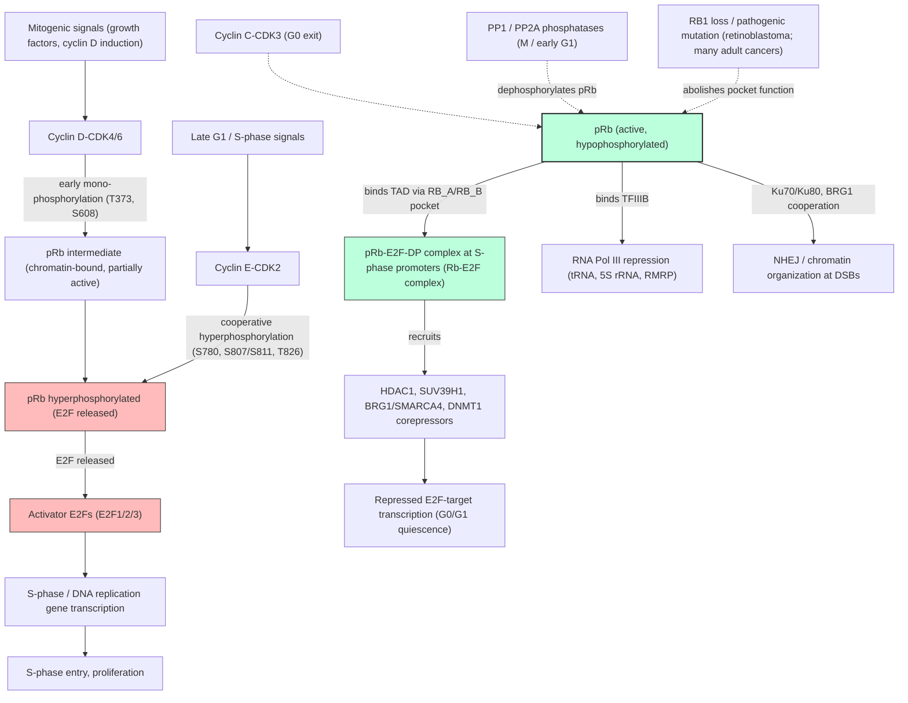

# Pathway Summary for RB1

## Overview
RB1 encodes the retinoblastoma-associated protein (pRb / p105-Rb / p110-RB1), the founding member of the pocket-protein family and a nuclear, chromatin-bound tumor suppressor. Its core evolved activity is to enforce the G1 restriction point by binding activator E2F transcription factors (E2F1/2/3) through the RB_A/RB_B pocket and recruiting chromatin-modifying corepressors (HDAC1, SUV39H1, BRG1/SMARCA4, DNA methyltransferases) to E2F-target promoters that drive S-phase entry [PMID:7923370, PMID:1531329, PMID:12502741, PMID:12598654]. Activity is gated by sequential cyclin-CDK phosphorylation: Cyclin D-CDK4/6 and Cyclin E-CDK2 progressively phosphorylate ~16 Ser/Thr sites, with an early reversible intermediate phase at T373/S608 followed by cooperative C-terminal hyperphosphorylation (S780, S807/S811, T826) that releases E2F and licenses replication-gene transcription [PMID:16360038, file:human/RB1/RB1-deep-research-falcon.md]. RB1 is the mutated locus in hereditary retinoblastoma and is recurrently lost in many adult tumors; its functional state is a clinically actionable biomarker for CDK4/6-inhibitor response.

## Core Pathways

### Cyclin-CDK / RB / E2F G1 Restriction Point
Active hypophosphorylated pRb binds the transactivation domain of activator E2Fs (E2F1/2/3) via the RB_A/RB_B pocket, masking their TAD and converting promoter-bound E2F-DP heterodimers into transcriptional repressors at S-phase gene promoters [PMID:1531329, PMID:12502741, PMID:12598654, Reactome:R-HSA-69231]. Cyclin D-CDK4/6 makes the first, mono-phosphorylating commitment in mid/late G1; Cyclin E-CDK2 (and in some contexts Cyclin C-CDK3 driving G0 exit) then drives cooperative hyperphosphorylation that destabilizes the pocket-E2F interface and releases E2F to activate replication-gene transcription [PMID:15084261, PMID:16360038, file:human/RB1/RB1-deep-research-falcon.md]. Recent work resolves an additional reversible intermediate state in which early phosphorylation at T373/S608 partially weakens E2F repression while pRb remains chromatin-bound; only cooperative late-phase phosphorylation at S780/S807/S811/T826 commits cells past the restriction point [file:human/RB1/RB1-deep-research-falcon.md]. The cycle is reset in mitosis/early G1 by PP1- and PP2A-mediated dephosphorylation of pRb [PMID:12434308].

### Recruitment of Chromatin Corepressors at E2F-Target Promoters
Beyond passive TAD masking, pRb actively recruits chromatin-modifying corepressors to durably silence E2F-target loci: SWI/SNF remodelers (BRG1/SMARCA4, BRM) [PMID:7923370, PMID:12065415], histone deacetylases (HDAC1), the H3K9 methyltransferase SUV39H1, DNA methyltransferases (DNMT1), and arginine methyltransferases (e.g. PRMT2) [PMID:16616919, file:human/RB1/RB1-deep-research-falcon.md]. The combined repressor complex assembled on E2F-bound promoters establishes both nucleosome-level and DNA-level marks of repression, which underlie the durability of the G0/G1 transcriptional state.

### Chromatin Occupancy Beyond E2F Promoters
Genome-wide ChIP studies place pRb at thousands of loci across promoters, enhancers, and CTCF-bound sites, with promoter binding relatively conserved across cell types and enhancer occupancy more context-specific [file:human/RB1/RB1-deep-research-falcon.md]. Phosphorylation state appears to redirect rather than simply abolish chromatin binding: hyperphosphorylated pRb can be detected at active enhancers in cycling cells, while hypophosphorylated pRb is enriched at promoters, supporting a multi-state model in which pRb is repurposed across the cell cycle rather than removed from chromatin entirely [file:human/RB1/RB1-deep-research-falcon.md].

### RNA Polymerase III Repression via TFIIIB
pRb additionally binds and inhibits TFIIIB, the Pol III general transcription factor required for tRNA, 5S rRNA and other small-noncoding-RNA gene transcription; this provides a route for pRb to constrain protein-synthesis capacity in parallel with restriction-point control [file:human/RB1/RB1-deep-research-falcon.md].

### Genome Maintenance via NHEJ and HR-Coupled Programs
pRb contributes to genome integrity by interacting with the canonical NHEJ Ku70/Ku80 (XRCC6/XRCC5) heterodimer at double-strand breaks and by cooperating with BRG1-containing chromatin remodelers in HR-coupled repair contexts [PMID:7923370, file:human/RB1/RB1-deep-research-falcon.md]. The same pocket-domain scaffolding activity that underlies E2F repression is repurposed at break sites to support repair-factor recruitment and chromatin organization.

## Pathway Diagram

## Molecular Architecture
- **N-terminal domain (NTD, residues ~1-379)** — independently folded domain that contributes to pRb-pRb interactions and chromatin context; harbors the early-phase T373 phosphosite that defines the intermediate state [file:human/RB1/RB1-deep-research-falcon.md]
- **Pocket domain (RB_A + RB_B, residues ~379-792)** — the conserved A/B pocket that binds the LxCxE motif of partner proteins (e.g. BRG1, viral oncoproteins) and the E2F transactivation domain; the structural basis of E2F TAD recognition is defined by AB-pocket contacts [PMID:12502741, PMID:12598654]
- **C-terminal domain (CTD / RB_C, residues ~792-928)** — required for stable E2F binding through C-terminal contacts with E2F1-DP1 marked-box and coiled-coil regions; phosphorylation of S780/S807/S811/T826 in the CTD directly destabilizes the C-terminal E2F interaction and is the immediate trigger for E2F release [PMID:16360038]
- **Bipartite NLS (C-terminal)** — supports nuclear import; pRb is predominantly nuclear and chromatin-bound across the cell cycle [file:human/RB1/RB1-deep-research-falcon.md]

## Upstream Inputs
- **Cyclin D-CDK4/6** — primary upstream kinase that initiates pRb mono-phosphorylation in mid/late G1 in response to mitogenic signals; clinically targeted by palbociclib/ribociclib/abemaciclib [file:human/RB1/RB1-deep-research-falcon.md]
- **Cyclin E-CDK2** — drives cooperative hyperphosphorylation that commits cells past the restriction point [PMID:16360038, file:human/RB1/RB1-deep-research-falcon.md]
- **Cyclin C-CDK3** — context-specific G0-to-G1 re-entry kinase [PMID:15084261]
- **PP1 / PP2A serine-threonine phosphatases** — reset pRb to its hypophosphorylated active state in M / early G1 [PMID:12434308]
- **Viral oncoproteins (HPV E7, Ad E1A, SV40 LT)** — pathological "upstream" inputs that bind the RB_A/RB_B pocket via an LxCxE motif and displace E2Fs, mimicking constitutive hyperphosphorylation [PMID:1331501, PMID:16249186]

## Downstream Effects
- **G1/S transcriptional program** — repression released upon hyperphosphorylation drives S-phase, DNA-replication, and mitotic gene expression via activator E2Fs [Reactome:R-HSA-69231, file:human/RB1/RB1-deep-research-falcon.md]
- **Chromatin organization and senescence-associated heterochromatin foci (SAHF)** — pRb cooperation with HP1/SUV39H1 supports SAHF assembly during cellular senescence [file:human/RB1/RB1-deep-research-falcon.md]
- **RNA Pol III output** — release of TFIIIB inhibition increases tRNA and 5S rRNA biogenesis, expanding translational capacity in cycling cells [file:human/RB1/RB1-deep-research-falcon.md]
- **Genome-stability programs** — Ku70/Ku80- and BRG1-dependent contributions to NHEJ and HR-coupled repair [PMID:7923370, file:human/RB1/RB1-deep-research-falcon.md]

## Non-Core Contexts
- **Lineage-specific transcriptional cooperation** — pRb cooperates with non-E2F transcription factors (RUNX2 in osteoblasts, AR in androgen-responsive epithelia, CEBPD in hepatocytes, PU.1 in myeloid cells) to support differentiation and lineage fidelity; these are correctly demoted to `KEEP_AS_NON_CORE` in the merged review because they layer on top of the pocket-protein scaffolding role rather than replacing it [PMID:14645241, PMID:15107404, PMID:15541338, file:human/RB1/RB1-deep-research-falcon.md]
- **Tissue-specific phenotypes from mouse Rb1 ortholog projection** — aortic valve morphogenesis, negative regulation of inflammatory response, cold-induced thermogenesis, ECM organization, collagen-fibril organization, myofibroblast differentiation, and hepatocyte/general apoptotic regulation are real consequences of Rb1 loss in mouse models but are downstream of E2F-program dysregulation in tissue-specific contexts; the merged review marks these `KEEP_AS_NON_CORE` rather than promoting them to gene-level core function [PMID:19417128, PMID:24027266, file:human/RB1/RB1-deep-research-falcon.md]
- **Hereditary retinoblastoma and second-primary cancer risk** — biallelic RB1 loss is the molecular cause of hereditary retinoblastoma and predisposes survivors to a marked excess of secondary sarcomas and selected epithelial cancers; this is the disease consequence of the same molecular switch the merged review captures as core function, not an additional native role [file:human/RB1/RB1-deep-research-falcon.md]
- **Clinical biomarker of CDK4/6-inhibitor response** — RB1 functional state predicts benefit from CDK4/6 inhibitors in HR+/HER2− breast cancer and is being explored as a biomarker in other contexts (e.g. p-RB1 S780 in locally advanced rectal cancer); these are translational extensions of the pRb / Cyclin-CDK / E2F axis [file:human/RB1/RB1-deep-research-falcon.md]

## Functional Integration
pRb sits at the chromatin interface of the G1 restriction point and integrates three orthogonal regulatory layers:
1. **Phosphorylation state** — sequential mono-, intermediate-, and hyper-phosphorylation by Cyclin D-CDK4/6 and Cyclin E-CDK2, opposed by PP1/PP2A, encodes a graded "dose" of pRb activity rather than a binary on/off switch [PMID:12434308, PMID:16360038, file:human/RB1/RB1-deep-research-falcon.md]
2. **Partner selection** — the same RB_A/RB_B pocket binds activator E2Fs, LxCxE-motif chromatin remodelers (BRG1/BRM), histone-modifying corepressors (HDAC1, SUV39H1), and viral oncoproteins; relative occupancy is set by cell state and competition between partners [PMID:7923370, PMID:12502741, PMID:12598654, PMID:1331501]
3. **Chromatin context** — promoter-, enhancer-, and CTCF-site occupancy redistributes with phosphorylation state, allowing pRb to deliver different regulatory outputs (E2F-target repression, enhancer modulation, Pol III control, NHEJ scaffolding) from a single conserved pocket-protein architecture [file:human/RB1/RB1-deep-research-falcon.md]

The convergence of these three layers explains why both germline RB1 inactivation (eliminating the switch entirely) and oncogenic Cyclin D / CDK4/6 hyperactivation (locking the switch in the released state) drive the same downstream consequence — uncontrolled E2F-driven proliferation — and why pharmacologic strategies targeting any of the three layers (CDK4/6 inhibitors restoring pRb activity, viral-mimetic peptides displacing E2Fs, or chromatin-modifier inhibitors disrupting recruited corepressors) all converge on the same pRb / E2F / S-phase axis.
