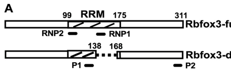

## Question

# Gene Research for Functional Annotation

## ⚠️ CRITICAL: Gene/Protein Identification Context

**BEFORE YOU BEGIN RESEARCH:** You MUST verify you are researching the CORRECT gene/protein. Gene symbols can be ambiguous, especially for less well-characterized genes from non-model organisms.

### Target Gene/Protein Identity (from UniProt):
- **UniProt Accession:** A6NFN3
- **Protein Description:** RecName: Full=RNA binding protein fox-1 homolog 3; AltName: Full=Fox-1 homolog C; AltName: Full=Neuronal nuclei antigen; Short=NeuN antigen;
- **Gene Information:** Name=RBFOX3;
- **Organism (full):** Homo sapiens (Human).
- **Protein Family:** Not specified in UniProt
- **Key Domains:** Fox-1_C_dom. (IPR025670); FOX1_RRM. (IPR034237); Nucleotide-bd_a/b_plait_sf. (IPR012677); RBD_domain_sf. (IPR035979); RBFOX1-3. (IPR017325)

### MANDATORY VERIFICATION STEPS:

1. **Check if the gene symbol "RBFOX3" matches the protein description above**
2. **Verify the organism is correct:** Homo sapiens (Human).
3. **Check if protein family/domains align with what you find in literature**
4. **If you find literature for a DIFFERENT gene with the same or similar symbol, STOP**

### If Gene Symbol is Ambiguous or You Cannot Find Relevant Literature:

**DO NOT PROCEED WITH RESEARCH ON A DIFFERENT GENE.** Instead:
- State clearly: "The gene symbol 'RBFOX3' is ambiguous or literature is limited for this specific protein"
- Explain what you found (e.g., "Found extensive literature on a different gene with the same symbol in a different organism")
- Describe the protein based ONLY on the UniProt information provided above
- Suggest that the protein function can be inferred from domain/family information

### Research Target:

Please provide a comprehensive research report on the gene **RBFOX3** (gene ID: RBFOX3, UniProt: A6NFN3) in human.

The research report should be a detailed narrative explaining the function, biological processes, and localization of the gene product. Citations should be given for all claims.

You should prioritize authoritative reviews and primary scientific literature when conducting research. You can supplement
this with annotations you find in gene/protein databases, but these can be outdated or inaccurate.

We are specifically interested in the primary function of the gene - for enzymes, what reaction is catalyzed, and what is the substrate specificity? For transporters, what is the substrate? For structural proteins or adapters, what is the broader structural role? For signaling molecules, what is the role in the pathway.

We are interested in where in or outside the cell the gene product carries out its function.

We are also interested in the signaling or biochemical pathways in which the gene functions. We are less interested in broad pleiotropic effects, except where these elucidate the precise role.

Include evidence where possible. We are interested in both experimental evidence as well as inference from structure, evolution, or bioinformatic analysis. Precise studies should be prioritized over high-throughput, where available.

## Output

Question: You are an expert researcher providing comprehensive, well-cited information.

Provide detailed information focusing on:
1. Key concepts and definitions with current understanding
2. Recent developments and latest research (prioritize 2023-2024 sources)
3. Current applications and real-world implementations
4. Expert opinions and analysis from authoritative sources
5. Relevant statistics and data from recent studies

Format as a comprehensive research report with proper citations. Include URLs and publication dates where available.
Always prioritize recent, authoritative sources and provide specific citations for all major claims.

# Gene Research for Functional Annotation

## ⚠️ CRITICAL: Gene/Protein Identification Context

**BEFORE YOU BEGIN RESEARCH:** You MUST verify you are researching the CORRECT gene/protein. Gene symbols can be ambiguous, especially for less well-characterized genes from non-model organisms.

### Target Gene/Protein Identity (from UniProt):
- **UniProt Accession:** A6NFN3
- **Protein Description:** RecName: Full=RNA binding protein fox-1 homolog 3; AltName: Full=Fox-1 homolog C; AltName: Full=Neuronal nuclei antigen; Short=NeuN antigen;
- **Gene Information:** Name=RBFOX3;
- **Organism (full):** Homo sapiens (Human).
- **Protein Family:** Not specified in UniProt
- **Key Domains:** Fox-1_C_dom. (IPR025670); FOX1_RRM. (IPR034237); Nucleotide-bd_a/b_plait_sf. (IPR012677); RBD_domain_sf. (IPR035979); RBFOX1-3. (IPR017325)

### MANDATORY VERIFICATION STEPS:

1. **Check if the gene symbol "RBFOX3" matches the protein description above**
2. **Verify the organism is correct:** Homo sapiens (Human).
3. **Check if protein family/domains align with what you find in literature**
4. **If you find literature for a DIFFERENT gene with the same or similar symbol, STOP**

### If Gene Symbol is Ambiguous or You Cannot Find Relevant Literature:

**DO NOT PROCEED WITH RESEARCH ON A DIFFERENT GENE.** Instead:
- State clearly: "The gene symbol 'RBFOX3' is ambiguous or literature is limited for this specific protein"
- Explain what you found (e.g., "Found extensive literature on a different gene with the same symbol in a different organism")
- Describe the protein based ONLY on the UniProt information provided above
- Suggest that the protein function can be inferred from domain/family information

### Research Target:

Please provide a comprehensive research report on the gene **RBFOX3** (gene ID: RBFOX3, UniProt: A6NFN3) in human.

The research report should be a detailed narrative explaining the function, biological processes, and localization of the gene product. Citations should be given for all claims.

You should prioritize authoritative reviews and primary scientific literature when conducting research. You can supplement
this with annotations you find in gene/protein databases, but these can be outdated or inaccurate.

We are specifically interested in the primary function of the gene - for enzymes, what reaction is catalyzed, and what is the substrate specificity? For transporters, what is the substrate? For structural proteins or adapters, what is the broader structural role? For signaling molecules, what is the role in the pathway.

We are interested in where in or outside the cell the gene product carries out its function.

We are also interested in the signaling or biochemical pathways in which the gene functions. We are less interested in broad pleiotropic effects, except where these elucidate the precise role.

Include evidence where possible. We are interested in both experimental evidence as well as inference from structure, evolution, or bioinformatic analysis. Precise studies should be prioritized over high-throughput, where available.

# Research report: Human **RBFOX3 (NeuN)** functional annotation (UniProt **A6NFN3**)

## Executive summary
RBFOX3 encodes an RNA-binding protein best known as the **NeuN antigen**, a widely used marker of post‑mitotic neurons. Multiple independent biochemical studies identified NeuN as RBFOX3 and mapped the NeuN epitope to the RBFOX3 N‑terminus. RBFOX3 is a member of the RBFOX family of splicing regulators that share a single central **RNA-recognition motif (RRM)** and preferentially bind the cis-element **(U)GCAUG**, using a **position-dependent** mechanism to activate or repress alternative exons. Beyond splicing, RBFOX3 can regulate the **biogenesis of a subset of microRNAs** by binding primary miRNA transcripts and modulating Drosha microprocessor recruitment. In real-world neuroscience and human-brain multi-omics, RBFOX3/NeuN remains foundational for **nuclei sorting** and **cell-type enrichment**, but NeuN immunoreactivity is not universal across neuron types and can be transiently lost after injury or toxic exposures, making multi-marker validation essential. (dredge2011neunrbfox3nuclearand pages 1-2, dredge2011neunrbfox3nuclearand pages 2-4, kim2013rbfox3regulatedalternativesplicing pages 1-2, kim2014rbfox3controlsthe pages 1-5, duan2016novelinsightsinto pages 7-9)

## 1. Identity verification (critical disambiguation)
### 1.1 Correct target gene/protein
The research target here is **human RBFOX3**, UniProt **A6NFN3**, described as “RNA binding protein fox-1 homolog 3,” also known as **Fox‑1 homolog C** and **NeuN antigen**. This identity is strongly supported by primary biochemical evidence showing that the **NeuN antigen corresponds to RBFOX3**: anti‑NeuN immunoprecipitation followed by mass spectrometry produced peptides mapping to RBFOX3, including **unique RBFOX3 peptides** that allow unambiguous assignment. (dredge2011neunrbfox3nuclearand pages 2-4)

### 1.2 Relationship to paralogs RBFOX1/2
RBFOX3 belongs to the RBFOX family (RBFOX1/2/3), all characterized by a single RRM and similar motif preferences, but with distinct tissue distributions: RBFOX3 is largely neuron-restricted, whereas RBFOX1 is expressed in neurons as well as muscle/heart and RBFOX2 has broader expression across tissues/cell types. (dredge2011neunrbfox3nuclearand pages 1-2, kim2013rbfox3regulatedalternativesplicing pages 1-2, mukherjee2024torna‐bindingand pages 3-3)

## 2. Key concepts and definitions (current understanding)
### 2.1 RBFOX3 is an RNA-binding splicing regulator with a single RRM
RBFOX3/NeuN is an RNA-binding protein that contains a **single central RRM/RBD** typical of RBFOX proteins, supporting its primary role as a sequence-specific regulator of RNA processing. (duan2016novelinsightsinto pages 3-5)

**Visual evidence (domain/isoform schematic):** Kim et al. (2013) depict RBFOX3 isoforms and highlight the RRM region and conserved RNP elements. (kim2013rbfox3regulatedalternativesplicing media bb037b32)

### 2.2 Sequence motif recognition: (U)GCAUG
RBFOX family proteins (including RBFOX3) preferentially bind the canonical RNA element **(U)GCAUG**. This element is repeatedly implicated as the key cis determinant for RBFOX-dependent splicing regulation and appears in validated targets. (duan2016novelinsightsinto pages 3-5, kim2013rbfox3regulatedalternativesplicing pages 1-2, conboy2017developmentalregulationof pages 1-3)

### 2.3 Position-dependent splicing regulation
A central mechanistic concept for RBFOX proteins is **position-dependent splicing control**: binding downstream of an alternative exon tends to enhance exon inclusion, whereas binding upstream tends to repress inclusion. This rule is supported for RBFOX3 in direct target analyses. (kim2013rbfox3regulatedalternativesplicing pages 1-2)

## 3. Molecular functions of RBFOX3
### 3.1 Primary function: regulation of alternative splicing in neurons
RBFOX3 regulates alternative splicing programs characteristic of neuronal differentiation and mature neuronal identity. The best-characterized mechanism is binding to intronic (U)GCAUG elements to modulate splice-site choice. (duan2016novelinsightsinto pages 3-5, kim2013rbfox3regulatedalternativesplicing pages 1-2)

#### 3.1.1 Validated target: **Numb** alternative splicing (developmental neuronal differentiation)
A mechanistically detailed example is **Numb** pre-mRNA: RBFOX3 binds a **conserved upstream intronic UGCAUG element** near an alternative exon and represses its inclusion. In vivo and in-development loss-of-function experiments support that RBFOX3-dependent Numb splicing promotes neuronal differentiation. (kim2013rbfox3regulatedalternativesplicing pages 1-2)

**Visual evidence (cis-elements and splicing assay panels):** Kim et al. (2013) show the UGCAUG motif placement and mutation effects in the Numb upstream intronic silencer region and corresponding isoform shifts. (kim2013rbfox3regulatedalternativesplicing media 12bb47c3)

#### 3.1.2 Cross-regulation of RBFOX2 via splicing-coupled expression control (AS-NMD)
RBFOX3 can cross-regulate RBFOX2 expression by driving RBFOX2 transcript isoforms that are unproductive.

* **Exon 6 regulation / dominant-negative output:** RBFOX3 promotes skipping of a RBFOX2 exon encoding RRM sequence, producing a dominant-negative RBFOX2 isoform. (dredge2011neunrbfox3nuclearand pages 1-2)
* **Cryptic exons and NMD:** nuclear RBFOX3 isoforms promote inclusion of cryptic RBFOX2 exons that introduce premature termination codons and target RBFOX2 transcripts for nonsense-mediated decay (NMD). (dredge2011neunrbfox3nuclearand pages 8-10)

**Quantitative splicing effect:** In 293T assays, RBFOX3 isoforms reduced exon-6-containing RBFOX2 mRNA from **92%** to **47%**, **48%**, and **39%** for RBFOX3 v1, v2, and v3, respectively. (dredge2011neunrbfox3nuclearand pages 5-6)

### 3.2 Non-splicing function: regulation of miRNA biogenesis via Drosha microprocessor
A major expansion beyond the “NeuN marker” concept is RBFOX3’s role in microRNA maturation.

* Transcriptome-wide binding data (PAR-CLIP) identified RBFOX3 binding to pri-miRNAs (including binding clusters overlapping pri-miRNA stem-loop regions). (kim2014rbfox3controlsthe pages 1-5)
* Functional assays showed RBFOX3 can act as a **positive or negative regulator** at the pri‑miRNA to pre‑miRNA processing step by modulating microprocessor recruitment, i.e., RBFOX3 can control the biogenesis of a **subset** of miRNAs. (conboy2017developmentalregulationof pages 6-8)

## 4. Subcellular localization and isoforms
### 4.1 Nuclear/cytoplasmic isoforms and localization determinants
RBFOX3 exists as multiple isoforms produced by alternative splicing, and isoforms differ in steady-state localization.

* Alternative splicing can generate isoforms with nuclear versus cytoplasmic distribution; one mechanism is inclusion/exclusion of a C-terminal extension contributing to a **bipartite hPY-NLS** affecting nuclear localization. (dredge2011neunrbfox3nuclearand pages 1-2)
* In cell-based assays, RBFOX3v2 is mainly nuclear and RBFOX3v3 is mainly cytoplasmic; the cytoplasmic isoform may still access the nucleus (potential shuttling), allowing it to regulate splicing. (dredge2011neunrbfox3nuclearand pages 6-8)
* RBFOX3 nuclear export was reported as not dependent on Crm1/exportin1. (dredge2011neunrbfox3nuclearand pages 8-10)

## 5. Biological processes and pathways
### 5.1 Neurogenesis and neuronal differentiation
RBFOX3 is implicated in neurogenesis and post-mitotic neuronal differentiation by controlling splicing choices in key developmental regulators, exemplified by its direct control of Numb isoform output and differentiation phenotypes upon RBFOX3 perturbation. (kim2013rbfox3regulatedalternativesplicing pages 1-2)

### 5.2 Splicing-regulatory networks and RBP cross-regulation
RBFOX3 participates in splicing-regulatory networks that include autoregulation and cross-regulation among RBFOX paralogs, including AS-NMD-based control of RBFOX2, helping tune splicing factor dosage in neurons. (dredge2011neunrbfox3nuclearand pages 1-2, dredge2011neunrbfox3nuclearand pages 8-10)

## 6. Recent developments (prioritizing 2023–2024)
### 6.1 2024 synthesis: RBFOX proteins and neuron-restricted RBFOX3
A 2024 neuronal-development review reiterates that **RBFOX3 (NeuN)** is predominantly expressed in post‑mitotic neurons and summarizes the position-dependent mechanism and network-level operation of RBFOX proteins (including LASR association and noncanonical recruitment). (nazim2024posttranscriptionalregulationof pages 4-5)

### 6.2 2024–2025: RBFOX3/NeuN as an enabling technology for single-nucleus and epigenomics
Although many mechanistic RBFOX3 discoveries are earlier, 2023–2024 work highlights RBFOX3’s *practical* centrality in state-of-the-art neuronal genomics.

* A 2024 mouse neuron epigenomics study purified NeuN+ neuronal nuclei using FANS with **>97% purity**, enabling neuron-resolved chromatin profiling across aging. (signal2024ageingrelatedchangesto pages 2-4)
* A 2024 Nature study describes NeuN antibody use in methanol-fixed nuclei sorting workflows and provides standardized protocol parameters for neuronal nuclei gating and pooling. (chung2024celltyperesolvedmosaicismreveals pages 4-4)

## 7. Current applications and real-world implementations
### 7.1 Histology and neuropathology (NeuN immunostaining)
NeuN immunostaining is widely used to label neuronal nuclei in tissue sections and quantify neuronal populations. However, NeuN is not universally expressed across all mature neuron types and can be altered by physiological state or injury. (duan2016novelinsightsinto pages 5-6)

### 7.2 Nuclei sorting (FANS/FACS) for transcriptomics/epigenomics
NeuN labeling is widely used for neuronal-nuclei enrichment from frozen tissue.

* **Purity metric:** NeuN+ nuclei were validated at **>97% purity** in one 2024 FANS pipeline for mouse neurons. (signal2024ageingrelatedchangesto pages 2-4)
* **Human cortex yields (protocol-level):** In a human cortical FANS workflow, neurons represented **34.5% ± 13.5** of sorted events, with routine recovery per cell type of ~50,000 nuclei for DNA methylation, ~300,000 for nuclear RNA, and ~100,000 each for ATAC-seq and histone profiling from ~300 mg tissue input. (chioza2025optimisedfluorescenceactivatednuclei pages 9-12)

These implementations illustrate why NeuN remains a standard “neuronal gate” for modern multi-omic profiling.

## 8. Expert opinions and authoritative analysis (limitations and interpretation)
### 8.1 NeuN negativity does not necessarily imply neuron loss
Because NeuN is an epitope on RBFOX3 that can show **loss of immunoreactivity** without corresponding neuron death, caution is required in interpreting NeuN loss in disease/injury.

* After peripheral axotomy, NeuN immunoreactivity in certain neurons was reported as **completely lost at 3 days**, began returning within **7 days**, and returned by **28 days**, consistent with reversible changes in antigenicity/localization rather than cell death. (duan2016novelinsightsinto pages 7-9)
* In soman exposure models, approximately **49%** of rat hippocampal neurons were damaged, yet NeuN loss was described as reflecting loss of immunogenicity rather than a direct readout of protein abundance, highlighting potential false negatives if NeuN alone is used for survival counts. (duan2016novelinsightsinto pages 7-9)

### 8.2 NeuN is not universal across neuron subtypes
Certain neuron classes can be NeuN-negative even when mature/viable (e.g., Purkinje and mitral cells noted in reviews), which can bias both histological quantification and nuclei sorting if NeuN is used as a sole neuronal identifier. (duan2016novelinsightsinto pages 5-6)

## 9. Evidence-backed statistics and quantitative findings (selected)
* RBFOX3 isoforms modulate RBFOX2 exon-6-containing mRNA from **92%** to **47%/48%/39%** (v1/v2/v3) in splicing assays. (dredge2011neunrbfox3nuclearand pages 5-6)
* NeuN+ neuronal nuclei sorting purity reported as **>97%** in a 2024 study. (signal2024ageingrelatedchangesto pages 2-4)
* Human cortical FANS: neurons were **34.5% ± 13.5** of sorted events; typical recoveries include **~300,000** neuronal nuclei for nuclear RNA from **~300 mg** tissue. (chioza2025optimisedfluorescenceactivatednuclei pages 9-12)
* Injury-related NeuN dynamics: complete loss at **3 days**, recovery by **28 days** after peripheral nerve injury in cited studies. (duan2016novelinsightsinto pages 7-9)

## 10. Practical takeaways for functional annotation of human RBFOX3 (A6NFN3)
1. **Primary molecular function:** sequence-specific RNA-binding regulator of alternative splicing in neurons via a single RRM and (U)GCAUG recognition, using position-dependent logic. (duan2016novelinsightsinto pages 3-5, kim2013rbfox3regulatedalternativesplicing pages 1-2)
2. **Validated targets/pathways:** neuronal differentiation via Numb isoform control; network regulation via RBFOX2 AS-NMD cross-regulation. (kim2013rbfox3regulatedalternativesplicing pages 1-2, dredge2011neunrbfox3nuclearand pages 8-10)
3. **Noncanonical function:** direct regulation of pri-miRNA processing via Drosha microprocessor recruitment/antagonism for selected miRNAs. (kim2014rbfox3controlsthe pages 1-5, conboy2017developmentalregulationof pages 6-8)
4. **Localization:** primarily nuclear in neurons but with functionally relevant isoform-dependent nuclear/cytoplasmic partitioning. (dredge2011neunrbfox3nuclearand pages 6-8)
5. **Applications:** foundational neuronal marker for histology and nuclei sorting, enabling single-nucleus multi-omics; must be paired with additional markers to address NeuN-negative neuron classes and context-dependent loss of immunoreactivity. (signal2024ageingrelatedchangesto pages 2-4, duan2016novelinsightsinto pages 7-9, chioza2025optimisedfluorescenceactivatednuclei pages 9-12)

## Included URLs and publication dates (selected key sources)
* Dredge et al. **2011-06** (PLoS ONE): https://doi.org/10.1371/journal.pone.0021585 (dredge2011neunrbfox3nuclearand pages 1-2, dredge2011neunrbfox3nuclearand pages 2-4)
* Kim et al. **2013-02** (J Cell Biol): https://doi.org/10.1083/jcb.201206146 (kim2013rbfox3regulatedalternativesplicing pages 1-2)
* Kim et al. **2014-09** (Nat Struct Mol Biol): https://doi.org/10.1038/nsmb.2892 (kim2014rbfox3controlsthe pages 1-5)
* Duan et al. **2016-04** (Mol Neurobiol): https://doi.org/10.1007/s12035-015-9122-5 (duan2016novelinsightsinto pages 3-5)
* Conboy **2017-03** (WIREs RNA): https://doi.org/10.1002/wrna.1398 (conboy2017developmentalregulationof pages 1-3)
* Nazim **2024-12** (Frontiers Mol Neurosci): https://doi.org/10.3389/fnmol.2024.1483901 (nazim2024posttranscriptionalregulationof pages 4-5)
* Signal et al. **2024-08** (Cells): https://doi.org/10.3390/cells13161393 (signal2024ageingrelatedchangesto pages 2-4)
* Chung et al. **2024-04** (Nature): https://doi.org/10.1038/s41586-024-07292-5 (chung2024celltyperesolvedmosaicismreveals pages 4-4)

## Evidence visualization (figures)
* RBFOX3 isoform/domain (RRM) schematic: (kim2013rbfox3regulatedalternativesplicing media bb037b32)
* Numb UGCAUG cis-element and splicing regulation panels: (kim2013rbfox3regulatedalternativesplicing media 12bb47c3)

---

| Aspect | Key points | Evidence type (primary/review/protocol) | Representative sources (with year) | Notes/limitations |
|---|---|---|---|---|
| Identity / synonyms | Human RBFOX3 (UniProt A6NFN3) corresponds to the NeuN antigen; common aliases include Fox-3, HRNBP3, NeuN, and RNA binding protein fox-1 homolog 3. Anti-NeuN epitope maps to the N-terminus of RBFOX3. Neuron-restricted expression distinguishes it from RBFOX1/2. (dredge2011neunrbfox3nuclearand pages 1-2, duan2016novelinsightsinto pages 3-5, kim2013rbfox3regulatedalternativesplicing pages 1-2, dredge2011neunrbfox3nuclearand pages 2-4, mukherjee2024torna‐bindingand pages 3-3) | Primary + review | Dredge et al., 2011; Kim et al., 2013; Duan et al., 2016; Mukherjee & Nongthomba, 2024 | Direct NeuN identification was established experimentally mainly in mouse brain and extrapolated to human ortholog/family annotation. |
| Domains / family architecture | RBFOX3 is a member of the RBFOX family and contains a single central RNA recognition motif (RRM/RBD). RBFOX3 RRM is highly similar, but not identical, to RBFOX1/2; exon skipping can delete part of the RRM. (duan2016novelinsightsinto pages 3-5, dredge2011neunrbfox3nuclearand pages 2-4, dredge2011neunrbfox3nuclearand pages 5-6, kim2013rbfox3regulatedalternativesplicing media bb037b32) | Primary + review | Dredge et al., 2011; Duan et al., 2016; Kim et al., 2013 | Domain-level evidence is strong, but most mechanistic structural details are family-level rather than human RBFOX3-only. |
| RNA motif specificity | RBFOX3 binds the canonical (U)GCAUG motif with high affinity, consistent with RBFOX family specificity. UGCAUG sites are central to target recognition in introns and some noncoding RNAs. (duan2016novelinsightsinto pages 3-5, kim2013rbfox3regulatedalternativesplicing pages 1-2, conboy2017developmentalregulationof pages 1-3) | Primary + review | Kim et al., 2013; Duan et al., 2016; Conboy, 2017 | Motif specificity is best established across the RBFOX family; direct RBFOX3 examples exist but transcriptome-wide motif maps are limited versus RBFOX1/2. |
| Position-dependent splicing mechanism | As for other RBFOX proteins, RBFOX3 generally promotes exon inclusion when bound downstream of an alternative exon and promotes exon skipping/repression when bound upstream. This rule explains target-specific effects on neuronal exons. (duan2016novelinsightsinto pages 3-5, kim2013rbfox3regulatedalternativesplicing pages 1-2, conboy2017developmentalregulationof pages 1-3) | Primary + review | Kim et al., 2013; Duan et al., 2016; Conboy, 2017 | Position-dependence is well supported, but quantitative predictive rules for individual human RBFOX3 targets remain incomplete. |
| Validated target: Numb exon 12 | RBFOX3 directly regulates Numb alternative splicing by binding a conserved upstream UGCAUG-containing intronic silencer near exon 12, repressing exon inclusion. Loss- and gain-of-function assays linked this event to neuronal differentiation during development. (duan2016novelinsightsinto pages 3-5, kim2013rbfox3regulatedalternativesplicing pages 1-2, kim2013rbfox3regulatedalternativesplicing media bb037b32) | Primary + review | Kim et al., 2013; Duan et al., 2016 | Strong mechanistic target; much of the functional differentiation evidence is from chick/mouse developmental systems rather than human neurons. |
| Validated target: RBFOX2 exon 6 / cryptic exons / NMD | RBFOX3 cross-regulates RBFOX2 by promoting skipping of RBFOX2 exon 6 and enhancing inclusion of cryptic exons (e.g., 5*/6*) that introduce premature stop codons and trigger nonsense-mediated decay, reducing productive RBFOX2 output. In 293T assays, RBFOX3 isoforms reduced exon-6-containing RBFOX2 mRNA from 92% to 47%, 48%, and 39% for v1, v2, and v3, respectively. (dredge2011neunrbfox3nuclearand pages 1-2, dredge2011neunrbfox3nuclearand pages 5-6, dredge2011neunrbfox3nuclearand pages 8-10) | Primary | Dredge et al., 2011 | Robust cross-regulation evidence, but largely from heterologous cell assays plus mouse-derived constructs; human in vivo extent remains less defined. |
| miRNA biogenesis / Drosha microprocessor | Beyond pre-mRNA splicing, RBFOX3 binds pri-miRNAs and modulates their processing by the Drosha microprocessor. PAR-CLIP identified RBFOX3 binding clusters on pri-miRNAs; functional assays showed positive or negative effects on specific pri-miRNA-to-pre-miRNA processing. Drosha-knockdown qRT-PCR analyses used n=3 biological replicates with significant changes reported at P<0.001 for tested cases. (kim2014rbfox3controlsthe pages 1-5, conboy2017developmentalregulationof pages 6-8, weissbach2025exploringtranscriptomicregulationa pages 30-35, weissbach2025exploringtranscriptomicregulationb pages 30-35) | Primary + review | Kim et al., 2014; Conboy, 2017 | This is a bona fide non-splicing function, but many affected miRNAs and physiological consequences remain incompletely mapped. |
| Subcellular localization / isoforms | RBFOX3 exists as alternatively spliced isoforms with distinct localization. Nuclear isoforms retain a complete C-terminal hPY-NLS, whereas at least one isoform (v3) is predominantly cytoplasmic because of altered C-terminus/NLS composition. Nuclear export was reported as not Crm1/exportin1-dependent. (dredge2011neunrbfox3nuclearand pages 8-10, dredge2011neunrbfox3nuclearand pages 6-8, dredge2011neunrbfox3nuclearand pages 5-6, kim2013rbfox3regulatedalternativesplicing media bb037b32) | Primary + review | Dredge et al., 2011; Kim et al., 2013 | Cytoplasmic isoforms may still shuttle and affect nuclear splicing; exact localization dynamics in human neurons remain incompletely resolved. |
| Neuronal specificity / localization in tissue | RBFOX3 is observed predominantly or exclusively in post-mitotic neurons and is widely used as a mature neuronal nuclear marker. Compared with RBFOX1 (neurons, heart, skeletal muscle) and RBFOX2 (broader expression), RBFOX3 is the neuron-restricted paralog. (dredge2011neunrbfox3nuclearand pages 1-2, duan2016novelinsightsinto pages 3-5, kim2013rbfox3regulatedalternativesplicing pages 1-2, mukherjee2024torna‐bindingand pages 3-3, nazim2024posttranscriptionalregulationof pages 4-5) | Primary + review | Dredge et al., 2011; Kim et al., 2013; Duan et al., 2016; Mukherjee & Nongthomba, 2024; Nazim, 2024 | “Neuron-specific” is broadly true in tissue, but marker behavior can vary with developmental stage, injury, fixation, and disease context. |
| Disease / phenotype links | Reviews and recent summaries connect RBFOX3 dysregulation with neurological phenotypes; an epilepsy association/knockout-related link is mentioned in recent summaries, and older reviews cite RBFOX1/RBFOX3 variants in rolandic epilepsy. NeuN immunoreactivity can decrease or relocalize after injury/disease, so loss of staining does not necessarily equal neuron loss. (weissbach2025exploringtranscriptomicregulationa pages 26-30, weissbach2025exploringtranscriptomicregulation pages 26-30, weissbach2025exploringtranscriptomicregulationb pages 26-30, duan2016novelinsightsinto pages 11-12, duan2016novelinsightsinto pages 9-10) | Review / secondary synthesis | Weissbach, 2025 summary; Duan et al., 2016 | Disease evidence specific to human RBFOX3 is comparatively limited and often indirect, family-level, or cited through reviews rather than direct 2023–2024 human genetics papers. |
| Practical applications: NeuN marker in FANS / snRNA-seq / histology | RBFOX3/NeuN is widely used to identify neuronal nuclei in histology and nuclei sorting workflows. Recent protocols report >97% purity for NeuN+ sorted neuronal nuclei in mouse FANS, ~34.5% ± 13.5 of sorted events as neurons in one human cortical FANS workflow, routine recovery of ~300,000 neuronal nuclei for nuclear RNA from ~300 mg human cortex, and use of 31,669 NEUN+ nuclei in a human midbrain snRNA-seq study. (signal2024ageingrelatedchangesto pages 2-4, chioza2025optimisedfluorescenceactivatednuclei pages 9-12, alsema2025schizophreniaassociatedchangesin pages 1-2, chung2024celltyperesolvedmosaicismreveals pages 4-4, chioza2025optimisedfluorescenceactivatednuclei pages 4-7) | Protocol + primary application studies | Signal et al., 2024; Chioza et al., 2025; Alsema et al., 2025; Chung et al., 2024 | Excellent real-world utility, but NeuN-negative neurons exist in some regions/states; protocols differ by tissue, fixation, antibody, and gating strategy. |

*Table: This table summarizes the evidence-backed functional annotation of human RBFOX3/NeuN, including identity, molecular mechanism, validated targets, localization, disease relevance, and practical applications. It is useful as a compact reference for distinguishing core RBFOX3 biology from broader RBFOX family findings and marker-based applications.*

References

1. (dredge2011neunrbfox3nuclearand pages 1-2): B. Dredge, K. Jensen, Juan Valcarcel, Centre De, Regulació Genò, and Spain. Neun/rbfox3 nuclear and cytoplasmic isoforms differentially regulate alternative splicing and nonsense-mediated decay of rbfox2. PLoS ONE, 6:e21585, Jun 2011. URL: https://doi.org/10.1371/journal.pone.0021585, doi:10.1371/journal.pone.0021585. This article has 126 citations and is from a peer-reviewed journal.

2. (dredge2011neunrbfox3nuclearand pages 2-4): B. Dredge, K. Jensen, Juan Valcarcel, Centre De, Regulació Genò, and Spain. Neun/rbfox3 nuclear and cytoplasmic isoforms differentially regulate alternative splicing and nonsense-mediated decay of rbfox2. PLoS ONE, 6:e21585, Jun 2011. URL: https://doi.org/10.1371/journal.pone.0021585, doi:10.1371/journal.pone.0021585. This article has 126 citations and is from a peer-reviewed journal.

3. (kim2013rbfox3regulatedalternativesplicing pages 1-2): Kee K. Kim, Joseph Nam, Yoh-suke Mukouyama, and Sachiyo Kawamoto. Rbfox3-regulated alternative splicing of numb promotes neuronal differentiation during development. The Journal of Cell Biology, 200:443-458, Feb 2013. URL: https://doi.org/10.1083/jcb.201206146, doi:10.1083/jcb.201206146. This article has 163 citations.

4. (kim2014rbfox3controlsthe pages 1-5): Kee K Kim, Yanqin Yang, Jun Zhu, Robert S Adelstein, and Sachiyo Kawamoto. Rbfox3 controls the biogenesis of a subset of micrornas. Nature Structural &amp; Molecular Biology, 21:901-910, Sep 2014. URL: https://doi.org/10.1038/nsmb.2892, doi:10.1038/nsmb.2892. This article has 62 citations and is from a highest quality peer-reviewed journal.

5. (duan2016novelinsightsinto pages 7-9): W. Duan, Yu-ping Zhang, Zhi-Hui Hou, Chen Huang, He Zhu, Chun-Qing Zhang, and Qing Yin. Novel insights into neun: from neuronal marker to splicing regulator. Molecular Neurobiology, 53:1637-1647, Apr 2016. URL: https://doi.org/10.1007/s12035-015-9122-5, doi:10.1007/s12035-015-9122-5. This article has 369 citations and is from a peer-reviewed journal.

6. (mukherjee2024torna‐bindingand pages 3-3): Amartya Mukherjee and Upendra Nongthomba. To rna‐binding and beyond: emerging facets of the role of rbfox proteins in development and disease. Wiley Interdisciplinary Reviews: RNA, Sep 2024. URL: https://doi.org/10.1002/wrna.1813, doi:10.1002/wrna.1813. This article has 13 citations.

7. (duan2016novelinsightsinto pages 3-5): W. Duan, Yu-ping Zhang, Zhi-Hui Hou, Chen Huang, He Zhu, Chun-Qing Zhang, and Qing Yin. Novel insights into neun: from neuronal marker to splicing regulator. Molecular Neurobiology, 53:1637-1647, Apr 2016. URL: https://doi.org/10.1007/s12035-015-9122-5, doi:10.1007/s12035-015-9122-5. This article has 369 citations and is from a peer-reviewed journal.

8. (kim2013rbfox3regulatedalternativesplicing media bb037b32): Kee K. Kim, Joseph Nam, Yoh-suke Mukouyama, and Sachiyo Kawamoto. Rbfox3-regulated alternative splicing of numb promotes neuronal differentiation during development. The Journal of Cell Biology, 200:443-458, Feb 2013. URL: https://doi.org/10.1083/jcb.201206146, doi:10.1083/jcb.201206146. This article has 163 citations.

9. (conboy2017developmentalregulationof pages 1-3): John G. Conboy. Developmental regulation of rna processing by rbfox proteins. Wiley Interdisciplinary Reviews: RNA, Mar 2017. URL: https://doi.org/10.1002/wrna.1398, doi:10.1002/wrna.1398. This article has 173 citations.

10. (kim2013rbfox3regulatedalternativesplicing media 12bb47c3): Kee K. Kim, Joseph Nam, Yoh-suke Mukouyama, and Sachiyo Kawamoto. Rbfox3-regulated alternative splicing of numb promotes neuronal differentiation during development. The Journal of Cell Biology, 200:443-458, Feb 2013. URL: https://doi.org/10.1083/jcb.201206146, doi:10.1083/jcb.201206146. This article has 163 citations.

11. (dredge2011neunrbfox3nuclearand pages 8-10): B. Dredge, K. Jensen, Juan Valcarcel, Centre De, Regulació Genò, and Spain. Neun/rbfox3 nuclear and cytoplasmic isoforms differentially regulate alternative splicing and nonsense-mediated decay of rbfox2. PLoS ONE, 6:e21585, Jun 2011. URL: https://doi.org/10.1371/journal.pone.0021585, doi:10.1371/journal.pone.0021585. This article has 126 citations and is from a peer-reviewed journal.

12. (dredge2011neunrbfox3nuclearand pages 5-6): B. Dredge, K. Jensen, Juan Valcarcel, Centre De, Regulació Genò, and Spain. Neun/rbfox3 nuclear and cytoplasmic isoforms differentially regulate alternative splicing and nonsense-mediated decay of rbfox2. PLoS ONE, 6:e21585, Jun 2011. URL: https://doi.org/10.1371/journal.pone.0021585, doi:10.1371/journal.pone.0021585. This article has 126 citations and is from a peer-reviewed journal.

13. (conboy2017developmentalregulationof pages 6-8): John G. Conboy. Developmental regulation of rna processing by rbfox proteins. Wiley Interdisciplinary Reviews: RNA, Mar 2017. URL: https://doi.org/10.1002/wrna.1398, doi:10.1002/wrna.1398. This article has 173 citations.

14. (dredge2011neunrbfox3nuclearand pages 6-8): B. Dredge, K. Jensen, Juan Valcarcel, Centre De, Regulació Genò, and Spain. Neun/rbfox3 nuclear and cytoplasmic isoforms differentially regulate alternative splicing and nonsense-mediated decay of rbfox2. PLoS ONE, 6:e21585, Jun 2011. URL: https://doi.org/10.1371/journal.pone.0021585, doi:10.1371/journal.pone.0021585. This article has 126 citations and is from a peer-reviewed journal.

15. (nazim2024posttranscriptionalregulationof pages 4-5): Mohammad Nazim. Post-transcriptional regulation of the transcriptional apparatus in neuronal development. Frontiers in Molecular Neuroscience, Dec 2024. URL: https://doi.org/10.3389/fnmol.2024.1483901, doi:10.3389/fnmol.2024.1483901. This article has 11 citations.

16. (signal2024ageingrelatedchangesto pages 2-4): Brandon Signal, Andrew J. Phipps, Katherine A. Giles, Shannon N. Huskins, Timothy R. Mercer, Mark D. Robinson, Adele Woodhouse, and Phillippa C. Taberlay. Ageing-related changes to h3k4me3, h3k27ac, and h3k27me3 in purified mouse neurons. Cells, 13:1393, Aug 2024. URL: https://doi.org/10.3390/cells13161393, doi:10.3390/cells13161393. This article has 16 citations.

17. (chung2024celltyperesolvedmosaicismreveals pages 4-4): Changuk Chung, Xiaoxu Yang, Robert F. Hevner, Katie Kennedy, Keng Ioi Vong, Yang Liu, Arzoo Patel, Rahul Nedunuri, Scott T. Barton, Geoffroy Noel, Chelsea Barrows, Valentina Stanley, Swapnil Mittal, Martin W. Breuss, Johannes C. M. Schlachetzki, Stephen F. Kingsmore, and Joseph G. Gleeson. Cell-type-resolved mosaicism reveals clonal dynamics of the human forebrain. Nature, 629:384-392, Apr 2024. URL: https://doi.org/10.1038/s41586-024-07292-5, doi:10.1038/s41586-024-07292-5. This article has 49 citations and is from a highest quality peer-reviewed journal.

18. (duan2016novelinsightsinto pages 5-6): W. Duan, Yu-ping Zhang, Zhi-Hui Hou, Chen Huang, He Zhu, Chun-Qing Zhang, and Qing Yin. Novel insights into neun: from neuronal marker to splicing regulator. Molecular Neurobiology, 53:1637-1647, Apr 2016. URL: https://doi.org/10.1007/s12035-015-9122-5, doi:10.1007/s12035-015-9122-5. This article has 369 citations and is from a peer-reviewed journal.

19. (chioza2025optimisedfluorescenceactivatednuclei pages 9-12): Barry Chioza, Stefania Policicchio, Joe Burrage, Georgina E T Blake, Rosemary A. Bamford, Alice Franklin, Darren Soanes, Philippa M. Wells, Ann Babtie, Marina Flores Payan, Jonathan P. Davies, Anthony Klokkaris, Emma M Walker, Joy N. Ismail, Paulina Urbanaviciute, Sarah J. Marzi, Eilis Hannon, Jonathan Mill, and Emma L Dempster. Optimised fluorescence-activated nuclei sorting for epigenomic analysis of cortical cell types. bioRxiv, Dec 2025. URL: https://doi.org/10.64898/2025.12.22.695789, doi:10.64898/2025.12.22.695789. This article has 2 citations.

20. (weissbach2025exploringtranscriptomicregulationa pages 30-35): S Weißbach. Exploring transcriptomic regulation of the developing brain through integrative bioinformatics and deep learning approaches. Unknown journal, 2025.

21. (weissbach2025exploringtranscriptomicregulationb pages 30-35): S Weißbach. Exploring transcriptomic regulation of the developing brain through integrative bioinformatics and deep learning approaches. Unknown journal, 2025.

22. (weissbach2025exploringtranscriptomicregulationa pages 26-30): S Weißbach. Exploring transcriptomic regulation of the developing brain through integrative bioinformatics and deep learning approaches. Unknown journal, 2025.

23. (weissbach2025exploringtranscriptomicregulation pages 26-30): S Weißbach. Exploring transcriptomic regulation of the developing brain through integrative bioinformatics and deep learning approaches. Unknown journal, 2025.

24. (weissbach2025exploringtranscriptomicregulationb pages 26-30): S Weißbach. Exploring transcriptomic regulation of the developing brain through integrative bioinformatics and deep learning approaches. Unknown journal, 2025.

25. (duan2016novelinsightsinto pages 11-12): W. Duan, Yu-ping Zhang, Zhi-Hui Hou, Chen Huang, He Zhu, Chun-Qing Zhang, and Qing Yin. Novel insights into neun: from neuronal marker to splicing regulator. Molecular Neurobiology, 53:1637-1647, Apr 2016. URL: https://doi.org/10.1007/s12035-015-9122-5, doi:10.1007/s12035-015-9122-5. This article has 369 citations and is from a peer-reviewed journal.

26. (duan2016novelinsightsinto pages 9-10): W. Duan, Yu-ping Zhang, Zhi-Hui Hou, Chen Huang, He Zhu, Chun-Qing Zhang, and Qing Yin. Novel insights into neun: from neuronal marker to splicing regulator. Molecular Neurobiology, 53:1637-1647, Apr 2016. URL: https://doi.org/10.1007/s12035-015-9122-5, doi:10.1007/s12035-015-9122-5. This article has 369 citations and is from a peer-reviewed journal.

27. (alsema2025schizophreniaassociatedchangesin pages 1-2): Astrid M Alsema, Sophie Puvogel, Laura Kracht, Marree J Webster, Cynthia Shannon Weickert, Bart J L Eggen, and Iris E C Sommer. Schizophrenia-associated changes in neuronal subpopulations in the human midbrain. Brain, 148:1374-1388, Oct 2025. URL: https://doi.org/10.1093/brain/awae321, doi:10.1093/brain/awae321. This article has 6 citations and is from a highest quality peer-reviewed journal.

28. (chioza2025optimisedfluorescenceactivatednuclei pages 4-7): Barry Chioza, Stefania Policicchio, Joe Burrage, Georgina E T Blake, Rosemary A. Bamford, Alice Franklin, Darren Soanes, Philippa M. Wells, Ann Babtie, Marina Flores Payan, Jonathan P. Davies, Anthony Klokkaris, Emma M Walker, Joy N. Ismail, Paulina Urbanaviciute, Sarah J. Marzi, Eilis Hannon, Jonathan Mill, and Emma L Dempster. Optimised fluorescence-activated nuclei sorting for epigenomic analysis of cortical cell types. bioRxiv, Dec 2025. URL: https://doi.org/10.64898/2025.12.22.695789, doi:10.64898/2025.12.22.695789. This article has 2 citations.

## Artifacts

- [Edison artifact artifact-00](RBFOX3-deep-research-falcon_artifacts/artifact-00.md)

## Citations

1. duan2016novelinsightsinto pages 3-5
2. conboy2017developmentalregulationof pages 6-8
3. nazim2024posttranscriptionalregulationof pages 4-5
4. signal2024ageingrelatedchangesto pages 2-4
5. chung2024celltyperesolvedmosaicismreveals pages 4-4
6. duan2016novelinsightsinto pages 5-6
7. chioza2025optimisedfluorescenceactivatednuclei pages 9-12
8. duan2016novelinsightsinto pages 7-9
9. conboy2017developmentalregulationof pages 1-3
10. weissbach2025exploringtranscriptomicregulationa pages 30-35
11. weissbach2025exploringtranscriptomicregulationb pages 30-35
12. weissbach2025exploringtranscriptomicregulationa pages 26-30
13. weissbach2025exploringtranscriptomicregulation pages 26-30
14. weissbach2025exploringtranscriptomicregulationb pages 26-30
15. duan2016novelinsightsinto pages 11-12
16. duan2016novelinsightsinto pages 9-10
17. alsema2025schizophreniaassociatedchangesin pages 1-2
18. chioza2025optimisedfluorescenceactivatednuclei pages 4-7
19. https://doi.org/10.1371/journal.pone.0021585
20. https://doi.org/10.1083/jcb.201206146
21. https://doi.org/10.1038/nsmb.2892
22. https://doi.org/10.1007/s12035-015-9122-5
23. https://doi.org/10.1002/wrna.1398
24. https://doi.org/10.3389/fnmol.2024.1483901
25. https://doi.org/10.3390/cells13161393
26. https://doi.org/10.1038/s41586-024-07292-5
27. https://doi.org/10.1371/journal.pone.0021585,
28. https://doi.org/10.1083/jcb.201206146,
29. https://doi.org/10.1038/nsmb.2892,
30. https://doi.org/10.1007/s12035-015-9122-5,
31. https://doi.org/10.1002/wrna.1813,
32. https://doi.org/10.1002/wrna.1398,
33. https://doi.org/10.3389/fnmol.2024.1483901,
34. https://doi.org/10.3390/cells13161393,
35. https://doi.org/10.1038/s41586-024-07292-5,
36. https://doi.org/10.64898/2025.12.22.695789,
37. https://doi.org/10.1093/brain/awae321,