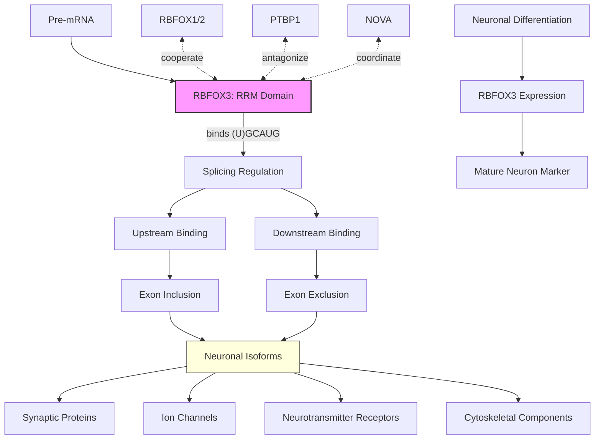

# Pathway Summary for RBFOX3

## Overview
RBFOX3 (RNA Binding Protein Fox-1 Homolog 3), also known as NeuN, is a neuronal-specific RNA-binding protein that regulates alternative splicing in the central nervous system. It serves as the most widely used pan-neuronal marker while functioning as a critical splicing regulator that shapes the neuronal transcriptome through recognition of (U)GCAUG motifs in pre-mRNA.

## Core Pathways

### Alternative Splicing Regulation
RBFOX3 regulates alternative splicing through:
- Recognition of (U)GCAUG hexanucleotide motifs
- Position-dependent effects: upstream motifs promote exon inclusion, downstream promote exclusion
- Coordination with other splicing factors (RBFOX1/2, PTBP1, NOVA)
- Regulation of neuronal-specific isoforms

### Neuronal Identity Maintenance
RBFOX3 maintains mature neuronal identity by:
- Regulating splicing of synaptic proteins
- Controlling neurotransmitter receptor isoforms
- Modulating cytoskeletal protein variants
- Influencing neuronal-specific gene expression programs

## Pathway Diagram

## Target Transcripts
- **Synaptic vesicle proteins**: SYT1, SNAP25 variants
- **Calcium channels**: CACNA1C, CACNA2D isoforms
- **NMDA receptors**: GRIN1 splice variants
- **Cell adhesion molecules**: NCAM, NRXN isoforms
- **Cytoskeletal proteins**: MAP2, TAU variants

## Molecular Functions
- **RNA binding**: RRM domain recognizes (U)GCAUG
- **Splicing regulation**: Enhancer or silencer depending on position
- **Nuclear localization**: Concentrated in neuronal nuclei
- **Protein interactions**: Forms complexes with splicing machinery

## Clinical Significance

### Neurological Disorders
- **Autism spectrum disorder**: Altered RBFOX3 splicing targets
- **Epilepsy**: Disrupted ion channel splicing
- **Neurodegeneration**: Loss of NeuN immunoreactivity
- **Brain injury**: Marker of neuronal loss

### Diagnostic Applications
- **NeuN immunostaining**: Gold standard neuronal marker
- **Neuropathology**: Assessing neuronal density
- **Research tool**: Identifying neurons in mixed cultures

## Regulatory Mechanisms
- **Developmental regulation**: Expression onset with neuronal maturation
- **Auto-regulation**: RBFOX3 regulates its own splicing
- **Cross-regulation**: Interactions with RBFOX1/2
- **Post-translational modifications**: Phosphorylation affects activity

## Neuronal Specificity
- **Exclusive neuronal expression**: Not in glia or other cells
- **Maturation marker**: Appears with terminal differentiation
- **Pan-neuronal**: Most neuron types (some exceptions)
- **Conservation**: Preserved across mammalian species

## Integration with Neuronal Functions
- **Synaptic plasticity**: Regulates plasticity-related transcripts
- **Neurotransmission**: Controls receptor and channel isoforms
- **Neuronal homeostasis**: Maintains mature neuron transcriptome
- **Network function**: Shapes protein isoforms for circuit function
