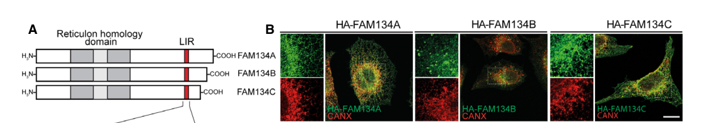

## Question

# Gene Research for Functional Annotation

## ⚠️ CRITICAL: Gene/Protein Identification Context

**BEFORE YOU BEGIN RESEARCH:** You MUST verify you are researching the CORRECT gene/protein. Gene symbols can be ambiguous, especially for less well-characterized genes from non-model organisms.

### Target Gene/Protein Identity (from UniProt):
- **UniProt Accession:** Q8NC44
- **Protein Description:** RecName: Full=Reticulophagy regulator 2 {ECO:0000312|HGNC:HGNC:28450};
- **Gene Information:** Name=RETREG2 {ECO:0000312|HGNC:HGNC:28450}; Synonyms=C2orf17, FAM134A, MAG2 {ECO:0000312|HGNC:HGNC:28450};
- **Organism (full):** Homo sapiens (Human).
- **Protein Family:** Belongs to the RETREG family. .
- **Key Domains:** ER_autophagy_membrane_reg. (IPR052114); RETR2_RHD. (IPR055257); RETREG1-3-like_RHD. (IPR057282); RHD_RETREG1-3 (PF24456)

### MANDATORY VERIFICATION STEPS:

1. **Check if the gene symbol "RETREG2" matches the protein description above**
2. **Verify the organism is correct:** Homo sapiens (Human).
3. **Check if protein family/domains align with what you find in literature**
4. **If you find literature for a DIFFERENT gene with the same or similar symbol, STOP**

### If Gene Symbol is Ambiguous or You Cannot Find Relevant Literature:

**DO NOT PROCEED WITH RESEARCH ON A DIFFERENT GENE.** Instead:
- State clearly: "The gene symbol 'RETREG2' is ambiguous or literature is limited for this specific protein"
- Explain what you found (e.g., "Found extensive literature on a different gene with the same symbol in a different organism")
- Describe the protein based ONLY on the UniProt information provided above
- Suggest that the protein function can be inferred from domain/family information

### Research Target:

Please provide a comprehensive research report on the gene **RETREG2** (gene ID: RETREG2, UniProt: Q8NC44) in human.

The research report should be a detailed narrative explaining the function, biological processes, and localization of the gene product. Citations should be given for all claims.

You should prioritize authoritative reviews and primary scientific literature when conducting research. You can supplement
this with annotations you find in gene/protein databases, but these can be outdated or inaccurate.

We are specifically interested in the primary function of the gene - for enzymes, what reaction is catalyzed, and what is the substrate specificity? For transporters, what is the substrate? For structural proteins or adapters, what is the broader structural role? For signaling molecules, what is the role in the pathway.

We are interested in where in or outside the cell the gene product carries out its function.

We are also interested in the signaling or biochemical pathways in which the gene functions. We are less interested in broad pleiotropic effects, except where these elucidate the precise role.

Include evidence where possible. We are interested in both experimental evidence as well as inference from structure, evolution, or bioinformatic analysis. Precise studies should be prioritized over high-throughput, where available.

## Output

Question: You are an expert researcher providing comprehensive, well-cited information.

Provide detailed information focusing on:
1. Key concepts and definitions with current understanding
2. Recent developments and latest research (prioritize 2023-2024 sources)
3. Current applications and real-world implementations
4. Expert opinions and analysis from authoritative sources
5. Relevant statistics and data from recent studies

Format as a comprehensive research report with proper citations. Include URLs and publication dates where available.
Always prioritize recent, authoritative sources and provide specific citations for all major claims.

# Gene Research for Functional Annotation

## ⚠️ CRITICAL: Gene/Protein Identification Context

**BEFORE YOU BEGIN RESEARCH:** You MUST verify you are researching the CORRECT gene/protein. Gene symbols can be ambiguous, especially for less well-characterized genes from non-model organisms.

### Target Gene/Protein Identity (from UniProt):
- **UniProt Accession:** Q8NC44
- **Protein Description:** RecName: Full=Reticulophagy regulator 2 {ECO:0000312|HGNC:HGNC:28450};
- **Gene Information:** Name=RETREG2 {ECO:0000312|HGNC:HGNC:28450}; Synonyms=C2orf17, FAM134A, MAG2 {ECO:0000312|HGNC:HGNC:28450};
- **Organism (full):** Homo sapiens (Human).
- **Protein Family:** Belongs to the RETREG family. .
- **Key Domains:** ER_autophagy_membrane_reg. (IPR052114); RETR2_RHD. (IPR055257); RETREG1-3-like_RHD. (IPR057282); RHD_RETREG1-3 (PF24456)

### MANDATORY VERIFICATION STEPS:

1. **Check if the gene symbol "RETREG2" matches the protein description above**
2. **Verify the organism is correct:** Homo sapiens (Human).
3. **Check if protein family/domains align with what you find in literature**
4. **If you find literature for a DIFFERENT gene with the same or similar symbol, STOP**

### If Gene Symbol is Ambiguous or You Cannot Find Relevant Literature:

**DO NOT PROCEED WITH RESEARCH ON A DIFFERENT GENE.** Instead:
- State clearly: "The gene symbol 'RETREG2' is ambiguous or literature is limited for this specific protein"
- Explain what you found (e.g., "Found extensive literature on a different gene with the same symbol in a different organism")
- Describe the protein based ONLY on the UniProt information provided above
- Suggest that the protein function can be inferred from domain/family information

### Research Target:

Please provide a comprehensive research report on the gene **RETREG2** (gene ID: RETREG2, UniProt: Q8NC44) in human.

The research report should be a detailed narrative explaining the function, biological processes, and localization of the gene product. Citations should be given for all claims.

You should prioritize authoritative reviews and primary scientific literature when conducting research. You can supplement
this with annotations you find in gene/protein databases, but these can be outdated or inaccurate.

We are specifically interested in the primary function of the gene - for enzymes, what reaction is catalyzed, and what is the substrate specificity? For transporters, what is the substrate? For structural proteins or adapters, what is the broader structural role? For signaling molecules, what is the role in the pathway.

We are interested in where in or outside the cell the gene product carries out its function.

We are also interested in the signaling or biochemical pathways in which the gene functions. We are less interested in broad pleiotropic effects, except where these elucidate the precise role.

Include evidence where possible. We are interested in both experimental evidence as well as inference from structure, evolution, or bioinformatic analysis. Precise studies should be prioritized over high-throughput, where available.

## Research report: Human **RETREG2 / FAM134A** (UniProt **Q8NC44**) — functional annotation and current evidence

### 0) Gene/protein identity verification (mandatory)
RETREG2 is the human gene encoding **Reticulophagy regulator 2**, also known in the literature as **FAM134A** (and described as part of the FAM134/RETREG family). In a primary cell-biology paper that explicitly lists UniProt accessions for the family, **FAM134A is annotated as “RETREG2; Q8NC44 (UniProtKB)”**, confirming the requested identity match (kumar2021rtn4binteractingprotein pages 2-3). The protein is discussed together with its paralogues **FAM134B/RETREG1** and **FAM134C/RETREG3**, which share reticulon-homology-like membrane-shaping features and LC3/ATG8 binding motifs characteristic of ER-phagy receptors (kumar2021rtn4binteractingprotein pages 2-3, reggio2021roleoffam134 pages 5-7).

### 1) Key concepts and definitions (current understanding)

#### 1.1 ER-phagy / reticulophagy
ER-phagy (reticulophagy) is a form of selective autophagy in which **portions of the endoplasmic reticulum are segregated from the bulk ER and delivered to lysosomes/vacuoles for degradation**. A central concept is that ER-phagy is mediated by **ER-phagy receptors**—ER-resident membrane proteins (or ER-associated factors) that contain cytosolic **LC3/Atg8-binding motifs (LIRs/AIMs)** that tether ER membranes to forming autophagosomes (reggiori2022erphagymechanismsregulation pages 1-3). ER-phagy contributes to **ER size control**, recovery from ER stress, and clearance of ER subdomains enriched in aberrant or toxic material (reggiori2022erphagymechanismsregulation pages 1-3).

#### 1.2 ER-phagy receptors and the FAM134/RETREG family
Reggiori & Molinari (Physiological Reviews, 2022; published July 2022) emphasize that many ER-phagy receptors are ER membrane proteins whose **reticulon-homology domains (RHDs)** can deform membranes before the scission/fragmentation steps that generate ER fragments destined for lysosomal clearance (reggiori2022erphagymechanismsregulation pages 19-20). They specifically discuss mammalian ER-phagy receptors including the **FAM134 protein family**, which can associate with luminal chaperones such as **calnexin (CNX)** that help segregate misfolded luminal clients into removable ER subdomains (reggiori2022erphagymechanismsregulation pages 19-20).

### 2) RETREG2/FAM134A: molecular function, mechanism, and localization

#### 2.1 Subcellular localization
In primary experimental work comparing the FAM134 paralogues, **FAM134A/RETREG2 shows broad ER distribution** and co-localizes with ER markers such as **CALNEXIN** and **REEP5** in mammalian cells (reggio2021roleoffam134 pages 1-2). This is consistent with its assignment as an **ER-resident membrane protein** acting at the ER surface to mediate ER remodeling and turnover (reggio2021roleoffam134 pages 1-2, reggio2021roleoffam134 pages 5-7).

#### 2.2 ER-phagy receptor activity and LIR-dependent ATG8 binding
Reggio et al. (EMBO Reports, Aug 2021; https://doi.org/10.15252/embr.202052289) provide direct biochemical and cell-biological evidence that **FAM134A is an ER-phagy receptor**:
- **ATG8 binding:** FAM134A binds mammalian ATG8 proteins via a canonical **LIR**; mutation of the LIR abolishes ATG8 binding in pull-down assays (reggio2021roleoffam134 pages 4-5).
- **Stress-inducible ER fragmentation and autophagic delivery:** Under nutrient starvation, wild-type FAM134A promotes formation of LC3B-positive ER fragments and is delivered to lysosomal/LAMP1-positive compartments; **ΔLIR mutants fail in these readouts**, supporting a LIR-dependent receptor function in ER-phagy (reggio2021roleoffam134 pages 4-5).
- **ER-phagy flux assays:** ER-phagy flux monitored using ER-lumen reporters (e.g., ssRFP-GFP-KDEL) is induced by FAM134A overexpression, though the activity is described as lower/basal-inactive relative to FAM134B, consistent with a stress-activated receptor (reggio2021roleoffam134 pages 5-7, reggio2021roleoffam134 pages 4-5).

These experimentally supported properties match the UniProt-provided conceptual description (reticulophagy regulator; RHD/ER-autophagy membrane regulator domain context) in the user prompt.

#### 2.3 Functional roles: ER morphology maintenance and collagen quality control
A key aspect of RETREG2 biology that emerges from Reggio et al. is that the three FAM134 paralogues jointly control **ER morphology** and **protein quality control**:
- **ER morphology:** Single knockout cells show ER morphology changes (e.g., ER swelling/dilation and expansion of ER marker-positive regions), and reconstitution experiments show that restoring FAM134 proteins can rescue ER structural defects in a manner that depends on intact receptor features (including LIR dependence in key assays) (reggio2021roleoffam134 pages 7-9, reggio2021roleoffam134 pages 5-7).
- **Collagen/procollagen quality control:** Global proteomics in Fam134 KO backgrounds reveals accumulation of collagens/collagen-processing factors and accumulation of **misfolded pro-Collagen I** in KO cells; in wild-type cells, pro-Collagen I can be found in LAMP1-positive lysosomes, consistent with lysosomal clearance pathways (reggio2021roleoffam134 pages 7-9, reggio2021roleoffam134 pages 9-12).

#### 2.4 A RETREG2-specific mechanistic nuance: LIR-independent procollagen clearance
Reggio et al. report a notable paralogue-specific behavior: in Fam134a knockout MEFs, reconstitution with a **Fam134a ΔLIR mutant** was **as effective as wild-type Fam134a** in reducing pro-Collagen I accumulation (reggio2021roleoffam134 pages 9-12). They also report weak/undetectable interaction between endogenous LC3B and FAM134A in some assays, with only slight interaction with GABARAPs, despite the presence of a functional LIR in biochemical binding assays (reggio2021roleoffam134 pages 9-12). 

Interpretation: RETREG2/FAM134A appears capable of supporting at least one arm of ER quality control for a shared substrate (procollagen) through a pathway that is **less dependent on canonical LIR–LC3B engagement** than the pathways used by FAM134B/C, while still using its LIR for canonical receptor behavior (localization to lysosomes, starvation-induced ER fragmentation) in other contexts (reggio2021roleoffam134 pages 9-12, reggio2021roleoffam134 pages 4-5).

### 3) Recent developments (prioritizing 2023–2024)

#### 3.1 2023: receptor activation by phosphorylation-dependent ubiquitination and nanoscale clustering (family mechanism)
Berkane et al. (Nature Communications, Oct 2023; https://doi.org/10.1038/s41467-023-44101-5) provide a mechanistic model for FAM134-family receptor activation—centered on **phosphorylation → ubiquitination → nanoscale clustering**—primarily for **FAM134B and FAM134C**:
- **CK2 as an upstream activator:** A kinase-inhibitor screen identifies **CK2** as essential for Torin1 (mTOR inhibitor)-induced ER-phagy mediated by FAM134B/C (berkane2023thefunctionof pages 1-2).
- **Phosphorylation enables ubiquitination:** Phosphosite mutations abolish ubiquitination of FAM134B/C and impair function, including increased collagen accumulation (berkane2023thefunctionof pages 6-7).
- **Quantitative nanoscale organization:** DNA-PAINT SMLM quantifies FAM134B cluster-size modes shifting from **66 nm (basal)** to emergence of a **104 nm population** under Torin1; CK2 inhibition blocks this shift (cluster mode ~69 nm), and phospho-mutants fail to enlarge clusters (berkane2023thefunctionof pages 7-8).
- **Quantitative effects on flux:** Ubiquitination blockade using an E1 inhibitor strongly suppresses Torin1-induced ER-phagy flux (reported as >80% in the excerpt), and CK2 inhibition suppresses Torin1-induced ER-phagy by ~60–70% (berkane2023thefunctionof pages 4-5).

Relevance to RETREG2: while this paper focuses mechanistically on FAM134B/C, it frames **FAM134A/RETREG2 as predominantly inactive at baseline**, similar to FAM134C, which implies that comparable activation logic may apply but is not directly demonstrated for RETREG2 in the provided excerpts (berkane2023thefunctionof pages 1-2).

#### 3.2 2023: ER-phagy driven by heteromeric clusters of ubiquitinated ER-shaping proteins that include FAM134A
Foronda et al. (Nature, May 2023; https://doi.org/10.1038/s41586-023-06090-9) identify an ER-phagy mechanism where ER-shaping proteins assemble into clusters required for ER membrane remodeling:
- **ARL6IP1 binds FAM134 homologues:** Tagged **FAM134A and FAM134C** co-immunoprecipitate with ARL6IP1, and BiCAP assays demonstrate ER-distributed homo- and hetero-dimers involving ARL6IP1 and FAM134-family members (foronda2023heteromericclustersof pages 2-3).
- **Disease-relevant quantitative phenotypes:** Arl6ip1 knockout mice show neurodegenerative phenotypes and ER morphology changes, with statistics including **brain weight 0.46 g (WT) vs 0.39 g (KO), P=0.016**, reduced CMAPs (**ANOVA F=18.6, P=0.0015**), and increased ER sheet area (**P=0.0006**) (foronda2023heteromericclustersof pages 2-3).

Relevance to RETREG2: this provides direct evidence that RETREG2/FAM134A participates in the **physical interaction network** of ER-phagy/ER-shaping clusters implicated in neuronal maintenance, even though disease phenotypes in this paper are driven by ARL6IP1 loss rather than RETREG2 variants (foronda2023heteromericclustersof pages 2-3).

#### 3.3 2024: in vivo specialization and redundancy of the FAM134 paralogues
Iavarone et al. (EMBO Reports, July 2024; https://doi.org/10.1038/s44319-024-00213-7) test paralogue function in vivo using mouse genetics:
- **Combined Fam134b/c deletion** drives severe peripheral neurodegeneration, while combinations including Fam134a deletion did not produce the same phenotype in this study’s framing, suggesting paralogue/tissue specialization (iavarone2024fam134candfam134b pages 1-2).
- Quantitative electrophysiology shows, for example, Fam134c knockout spinal nociceptive neurons with increased firing rate (**4.107 ± 0.599 spikes/s vs 0.40 ± 0.053 WT, P=0.0455**) and burst frequency (**34.586 ± 5.385 Hz vs 4.572 ± 0.313 WT, P<0.0001**) (iavarone2024fam134candfam134b pages 1-2).
- In sciatic nerve, Fam134a expression is low/absent in wild-type tissue and becomes upregulated in some KO backgrounds, but does not substitute effectively for the combined Fam134b/c requirement in axons (iavarone2024fam134candfam134b pages 5-7).

Implication: RETREG2/FAM134A is a bona fide ER-phagy receptor, but **its physiological “dominant” role appears tissue-context dependent**, with axonal tubular ER maintenance relying primarily on Fam134b/c in peripheral nerves (iavarone2024fam134candfam134b pages 5-7, iavarone2024fam134candfam134b pages 1-2).

### 4) Current applications and real-world implementations

#### 4.1 Human genetics: glioma susceptibility prioritization
Robinson et al. (Scientific Reports, Jan 2021; https://doi.org/10.1038/s41598-021-82169-5) identify **RETREG2/FAM134A** as one of three **novel glioma susceptibility genes** via transcriptome-wide Mendelian randomization plus colocalization integrating GWAS and eQTL data (robinson2021transcriptomewidemendelianrandomization pages 1-2). Reported datasets include:
- brain eQTL effective n ≈ **1,194**;
- whole blood eQTL n = **31,684**;
- glioma GWAS: **7,400 cases / 8,257 controls** (with GBM **3,112** cases and non-GBM **2,411** cases) (robinson2021transcriptomewidemendelianrandomization pages 1-2).

This is a translationally relevant association suggesting altered RETREG2 expression may influence glioma risk, but effect sizes for RETREG2 are not provided in the excerpt and would be needed for clinical-risk modeling (robinson2021transcriptomewidemendelianrandomization pages 1-2).

#### 4.2 Cancer bone metastasis microenvironment: exosomal miRNA regulation of FAM134A
Hashimoto et al. (PNAS, Feb 2018; https://doi.org/10.1073/pnas.1717363115) report that **tumor-secreted exosomal hsa-miR-940 targets FAM134A** and promotes osteogenic differentiation of human mesenchymal stem cells; implantation of miR-940–overexpressing cancer cells induced extensive osteoblastic lesions in vivo (hashimoto2018cancersecretedhsamir940induces pages 1-2). This provides a plausible mechanistic link between cancer-derived extracellular vesicles and regulation of host bone remodeling via downregulation of FAM134A, though the excerpted pages do not provide quantitative effect sizes.

### 5) Expert opinions and synthesis from authoritative sources

A high-authority synthesis (Physiological Reviews 2022) frames FAM134-family receptors as ER-phagy receptors that (i) recruit autophagy machinery via LIRs and (ii) use RHD-mediated membrane deformation to help fragment ER subdomains for lysosomal clearance; it highlights receptor interactions with ER chaperones (calnexin) as a route for coupling luminal proteostasis stress to selective ER removal (reggiori2022erphagymechanismsregulation pages 19-20). 

Within this framework, the primary experimental evidence for RETREG2/FAM134A supports a model in which:
1) RETREG2 is an **ER membrane resident** that can be delivered to lysosomes during induced ER-phagy; 
2) RETREG2 can bind ATG8-family proteins via LIR and promote ER fragmentation under stress; 
3) RETREG2 contributes to ER proteostasis, including collagen quality control, with a notable **LIR-independent route** for procollagen I handling in some contexts (reggio2021roleoffam134 pages 4-5, reggio2021roleoffam134 pages 9-12).

### 6) Key statistics and data highlights (recent studies emphasized)
- **ER-phagy receptor activation and clustering (2023 Nat Commun):** FAM134B cluster modes shift **66 nm → 104 nm** upon mTOR inhibition (Torin1), blocked by CK2 inhibition (~69 nm), with replicate-based statistics reported (berkane2023thefunctionof pages 7-8). E1 ubiquitin inhibition suppresses Torin1-induced ER-phagy flux by **>80%**, and CK2 inhibition suppresses Torin1-induced ER-phagy by **~60–70%** (berkane2023thefunctionof pages 4-5).
- **Neurodegenerative phenotype statistics linked to ER-phagy machinery (2023 Nature):** Arl6ip1 KO brain weight **0.46 g vs 0.39 g (P=0.016)**, ER sheet area increase **P=0.0006**, CMAP reduction **F=18.6, P=0.0015** (foronda2023heteromericclustersof pages 2-3).
- **In vivo neuronal excitability measures (2024 EMBO Reports):** Fam134c KO nociceptive firing **4.107 ± 0.599 spikes/s vs 0.40 ± 0.053 WT (P=0.0455)** and burst frequency **34.586 ± 5.385 Hz vs 4.572 ± 0.313 (P<0.0001)** (iavarone2024fam134candfam134b pages 1-2).
- **Glioma genetics study sizes (2021 Scientific Reports):** eQTL and GWAS sizes (brain n~1,194; blood n=31,684; glioma GWAS 7,400/8,257) supporting RETREG2 as a candidate susceptibility gene (robinson2021transcriptomewidemendelianrandomization pages 1-2).

### 7) Evidence map (summary table)
The following table compiles the strongest direct and indirect evidence for RETREG2/FAM134A function, emphasizing what is experimentally proven for RETREG2 versus inferred from the broader FAM134 receptor family.

| Finding/Concept | Evidence type (primary/review/genetics) | Experimental system/assay | Key quantitative/statistical detail | Implication for function | Source with DOI/year/URL |
|---|---|---|---|---|---|
| **Identity and core function of RETREG2/FAM134A (Q8NC44)**: FAM134A is an ER-resident FAM134/RETREG-family protein and a functional ER-phagy receptor | Primary | U2OS overexpression, HA-tag localization with CALNEXIN/REEP5, GST–mATG8 pull-downs, LC3B colocalization, immunogold EM, ssRFP-GFP-KDEL ER-phagy reporter, Fam134 KO/reconstitution in MEFs | FAM134A binds all six mammalian ATG8s via its LIR; starvation increases LC3B+/HA+ ER fragments; wild-type but not ΔLIR is efficiently delivered to lysosomal/LAMP1+ structures; ER-phagy flux induction is milder than FAM134B, consistent with lower basal activity (reggio2021roleoffam134 pages 4-5, reggio2021roleoffam134 media 27d840f0) | Confirms RETREG2/FAM134A as a stress-activated ER-phagy receptor linking ER membrane remodeling to lysosomal degradation | Reggio et al., **EMBO Reports** (Aug 2021), doi:10.15252/embr.202052289, https://doi.org/10.15252/embr.202052289 (reggio2021roleoffam134 pages 1-2, reggio2021roleoffam134 pages 4-5, reggio2021roleoffam134 media 27d840f0) |
| **RETREG2 helps maintain ER morphology and ER proteostasis** | Primary | Single Fam134a/b/c KO MEFs, global proteomics, immunolabeling for ER markers and Collagen I, rescue with WT or ΔLIR constructs | KO cells accumulate ER proteins and collagen-related proteins; swollen/dilated ER with expanded CLIMP63/CANX-positive regions is rescued by WT Fam134 proteins but not by LIR-defective rescue for morphology assays (reggio2021roleoffam134 pages 7-9, reggio2021roleoffam134 pages 5-7) | RETREG2 contributes to ER size/shape control and selective ER turnover, not merely cargo binding | Reggio et al., **EMBO Reports** (2021), doi:10.15252/embr.202052289, https://doi.org/10.15252/embr.202052289 (reggio2021roleoffam134 pages 7-9, reggio2021roleoffam134 pages 5-7) |
| **RETREG2 has a distinct, partly LIR-independent role in procollagen quality control** | Primary | Fam134a KO and Fam134b KO MEFs; reconstitution with WT vs ΔLIR Fam134a; lysosome localization of procollagen; LC3B/GABARAP interaction assays | ΔLIR Fam134a was as effective as WT Fam134a in reducing pro-Collagen I accumulation in Fam134a KO MEFs; endogenous LC3B interaction is weak, with slight GABARAP interaction; FAM134A can compensate for loss of FAM134B/C in procollagen clearance (reggio2021roleoffam134 pages 9-12) | Suggests RETREG2 can mediate clearance of misfolded procollagen via a parallel pathway that is less dependent on canonical LC3/LIR engagement than FAM134B/C | Reggio et al., **EMBO Reports** (2021), doi:10.15252/embr.202052289, https://doi.org/10.15252/embr.202052289 (reggio2021roleoffam134 pages 9-12) |
| **Family-level ER-phagy mechanism and receptor context** | Review | Physiological synthesis of mammalian ER-phagy pathways | FAM134-family proteins are established ER-phagy receptors; RHD-containing receptors deform ER membranes before scission; FAM134 proteins interact with calnexin to help segregate misfolded luminal clients for ER subdomain clearance (reggiori2022erphagymechanismsregulation pages 19-20) | Places RETREG2 in the current accepted framework: membrane-shaping ER-phagy receptor acting in selective ER quality control | Reggiori & Molinari, **Physiological Reviews** (Jul 2022), doi:10.1152/physrev.00038.2021, https://doi.org/10.1152/physrev.00038.2021 (reggiori2022erphagymechanismsregulation pages 19-20) |
| **2023 mechanistic advance: phosphorylation→ubiquitination→cluster activation in the FAM134 family** | Primary, family mechanism | Torin1-induced ER-phagy, kinase-inhibitor screen, CK2 inhibition, mass spectrometry, phospho-mutants, TUBE2 ubiquitin pulldown, DNA-PAINT/SMLM, ssRFP-GFP-KDEL reporter | Torin1-induced ER-phagy was ~3-fold higher in FAM134B/C-overexpressing cells than control; E1 inhibition reduced flux by >80%; CK2 inhibition reduced Torin1-induced ER-phagy by ~60–70%; FAM134B cluster mode shifted from **66 nm** basal to **104 nm** after Torin1, blocked by CK2 inhibition (**69 nm**) or phospho-mutant (**63–65 nm**) (berkane2023thefunctionof pages 4-5, berkane2023thefunctionof pages 7-8, berkane2023thefunctionof pages 1-2) | Direct data are for FAM134B/C, but they define an important current mechanistic model for activation of stress-inducible FAM134-family ER-phagy receptors; RETREG2 is likely interpreted within this family framework, though not directly proven here | Berkane et al., **Nature Communications** (Oct 2023), doi:10.1038/s41467-023-44101-5, https://doi.org/10.1038/s41467-023-44101-5 (berkane2023thefunctionof pages 1-2, berkane2023thefunctionof pages 4-5, berkane2023thefunctionof pages 7-8) |
| **2023 mechanistic advance: heteromeric ubiquitinated ER-shaping clusters; ARL6IP1 interacts with FAM134A** | Primary | Co-immunoprecipitation, BiCAP heterodimer assays, LC–MS interactomics, KO mice, patient/KO cells, EM/ER morphology analyses | Tagged FAM134A co-immunoprecipitates with ARL6IP1; interactome partitioning: **7%** ARL6IP1-unique, **52.4%** FAM134B-unique, ~**40%** shared partners; Arl6ip1 KO mice showed reduced brain weight (**0.46 g WT vs 0.39 g KO, P=0.016**), reduced CMAPs (**F=18.6, P=0.0015**), and increased ER sheet area (**P=0.0006**) (foronda2023heteromericclustersof pages 2-3) | Supports a model in which RETREG2/FAM134A participates in higher-order ER-shaping/ER-phagy assemblies rather than acting alone; links the pathway to neurodegenerative phenotypes | Foronda et al., **Nature** (May 2023), doi:10.1038/s41586-023-06090-9, https://doi.org/10.1038/s41586-023-06090-9 (foronda2023heteromericclustersof pages 2-3) |
| **2024 in vivo advance: FAM134 paralogue redundancy is tissue-specific; FAM134B/C dominate axonal ER maintenance** | Primary | Single and double knockout mice, electrophysiology, behavioral phenotyping, nerve ultrastructure, proteomics | Fam134b/c double KO caused severe early neurodegeneration and lifespan <~**25 weeks**; Fam134c KO increased nociceptive firing (**4.107 ± 0.599 spikes/s vs 0.40 ± 0.053 WT, P=0.0455**) and burst frequency (**34.586 ± 5.385 Hz vs 4.572 ± 0.313 WT, P<0.0001**); ~**75%** of axons in Fam134b/cdKO were intermediate/accumulated at 4 weeks; Fam134a was low/absent in sciatic nerve and did not substitute effectively in the double-KO phenotype (iavarone2024fam134candfam134b pages 5-7, iavarone2024fam134candfam134b pages 1-2, iavarone2024fam134candfam134b pages 2-4) | Indicates RETREG2/FAM134A is not the dominant paralogue in peripheral axons, underscoring paralogue specialization despite shared ER-phagy architecture | Iavarone et al., **EMBO Reports** (Jul 2024), doi:10.1038/s44319-024-00213-7, https://doi.org/10.1038/s44319-024-00213-7 (iavarone2024fam134candfam134b pages 9-11, iavarone2024fam134candfam134b pages 5-7, iavarone2024fam134candfam134b pages 1-2, iavarone2024fam134candfam134b pages 2-4) |
| **Human genetics relevance: RETREG2/FAM134A prioritized as a novel glioma susceptibility gene** | Genetics | Transcriptome-wide Mendelian randomization + colocalization integrating eQTL and glioma GWAS | Analysis used brain eQTL **n=1,194**, blood eQTL **n=31,684**, and glioma GWAS **7,400 cases / 8,257 controls** (GBM **3,112**; non-GBM **2,411**); RETREG2/FAM134A emerged among **3 novel** susceptibility genes (robinson2021transcriptomewidemendelianrandomization pages 1-2) | Provides population-genetic evidence that altered RETREG2 expression may influence glioma susceptibility; translationally relevant as a candidate risk gene rather than a validated biomarker | Robinson et al., **Scientific Reports** (Jan 2021), doi:10.1038/s41598-021-82169-5, https://doi.org/10.1038/s41598-021-82169-5 (robinson2021transcriptomewidemendelianrandomization pages 1-2) |
| **Tumor microenvironment relevance: exosomal miR-940 directly targets FAM134A** | Primary/translational | Exosomal miRNA profiling, human MSC osteogenic differentiation assays, in vivo bone metastasis model with miR-940–overexpressing cancer cells | hsa-miR-940 was enriched in osteoblastic phenotype–inducing prostate cancer exosomes; it directly targeted **FAM134A** and promoted osteogenic differentiation of human MSCs; miR-940–overexpressing MDA-MB-231 cells induced extensive osteoblastic lesions in vivo (quantitative values not provided in excerpt) (hashimoto2018cancersecretedhsamir940induces pages 1-2) | Shows RETREG2 can be pathophysiologically regulated by tumor-secreted miRNA signals, linking it to osteoblastic bone metastasis biology and possible biomarker/therapeutic interest | Hashimoto et al., **PNAS** (Feb 2018), doi:10.1073/pnas.1717363115, https://doi.org/10.1073/pnas.1717363115 (hashimoto2018cancersecretedhsamir940induces pages 1-2) |

*Table: This table compiles the strongest available evidence for human RETREG2/FAM134A, spanning core functional experiments, family-level mechanistic advances, in vivo paralogue studies, and translational disease links. It is useful as a compact evidence map showing what is directly demonstrated for RETREG2 versus what is inferred from the broader FAM134 family.*

### 8) Limitations and open questions
1) **RETREG2-specific regulation** (e.g., phosphorylation/ubiquitination and clustering dynamics) is less directly characterized than FAM134B/C in the 2023 mechanistic activation study, so extrapolations to RETREG2 should be treated as hypotheses until tested (berkane2023thefunctionof pages 1-2, berkane2023thefunctionof pages 7-8).
2) **Clinical translation** for RETREG2 (e.g., as a biomarker/therapeutic target) remains early: the glioma study provides causal-prioritization evidence but not clinical-grade prediction metrics for RETREG2 specifically, and the miR-940 axis provides a plausible mechanism but not clinical validation (robinson2021transcriptomewidemendelianrandomization pages 1-2, hashimoto2018cancersecretedhsamir940induces pages 1-2).

### References (URLs and dates)
- Reggio A. et al. *EMBO Reports* (Aug 2021). “Role of FAM134 paralogues in endoplasmic reticulum remodeling, ER-phagy, and Collagen quality control.” https://doi.org/10.15252/embr.202052289 (reggio2021roleoffam134 pages 1-2, reggio2021roleoffam134 pages 4-5)
- Reggiori F., Molinari M. *Physiological Reviews* (Jul 2022). “ER-phagy: mechanisms, regulation, and diseases connected to the lysosomal clearance of the endoplasmic reticulum.” https://doi.org/10.1152/physrev.00038.2021 (reggiori2022erphagymechanismsregulation pages 1-3, reggiori2022erphagymechanismsregulation pages 19-20)
- Berkane R. et al. *Nature Communications* (Oct 2023). “The function of ER-phagy receptors is regulated through phosphorylation-dependent ubiquitination pathways.” https://doi.org/10.1038/s41467-023-44101-5 (berkane2023thefunctionof pages 1-2, berkane2023thefunctionof pages 7-8)
- Foronda H. et al. *Nature* (May 2023). “Heteromeric clusters of ubiquitinated ER-shaping proteins drive ER-phagy.” https://doi.org/10.1038/s41586-023-06090-9 (foronda2023heteromericclustersof pages 2-3)
- Iavarone F. et al. *EMBO Reports* (Jul 2024). “Fam134c and Fam134b shape axonal endoplasmic reticulum architecture in vivo.” https://doi.org/10.1038/s44319-024-00213-7 (iavarone2024fam134candfam134b pages 1-2)
- Robinson J.W. et al. *Scientific Reports* (Jan 2021). “Transcriptome-wide Mendelian randomization study prioritising novel tissue-dependent genes for glioma susceptibility.” https://doi.org/10.1038/s41598-021-82169-5 (robinson2021transcriptomewidemendelianrandomization pages 1-2)
- Hashimoto K. et al. *PNAS* (Feb 2018). “Cancer-secreted hsa-miR-940 induces an osteoblastic phenotype in the bone metastatic microenvironment via targeting ARHGAP1 and FAM134A.” https://doi.org/10.1073/pnas.1717363115 (hashimoto2018cancersecretedhsamir940induces pages 1-2)

References

1. (kumar2021rtn4binteractingprotein pages 2-3): Darshan Kumar, Behnam Lak, Taina Suntio, Helena Vihinen, Ilya Belevich, Tiina Viita, Liu Xiaonan, Aki Vartiainen, Maria Vartiainen, Markku Varjosalo, and Eija Jokitalo. Rtn4b interacting protein fam134c promotes er membrane curvature and has a functional role in autophagy. Molecular Biology of the Cell, 32:1158-1170, Jun 2021. URL: https://doi.org/10.1091/mbc.e20-06-0409, doi:10.1091/mbc.e20-06-0409. This article has 34 citations and is from a domain leading peer-reviewed journal.

2. (reggio2021roleoffam134 pages 5-7): Alessio Reggio, Viviana Buonomo, Rayene Berkane, Ramachandra M Bhaskara, Mariana Tellechea, Ivana Peluso, Elena Polishchuk, Giorgia Di Lorenzo, Carmine Cirillo, Marianna Esposito, Adeela Hussain, Antje K Huebner, Christian A Hübner, Carmine Settembre, Gerhard Hummer, Paolo Grumati, and Alexandra Stolz. Role of fam134 paralogues in endoplasmic reticulum remodeling, er‐phagy, and collagen quality control. EMBO Reports, Aug 2021. URL: https://doi.org/10.15252/embr.202052289, doi:10.15252/embr.202052289. This article has 125 citations and is from a highest quality peer-reviewed journal.

3. (reggiori2022erphagymechanismsregulation pages 1-3): Fulvio Reggiori and Maurizio Molinari. Er-phagy: mechanisms, regulation, and diseases connected to the lysosomal clearance of the endoplasmic reticulum. Jul 2022. URL: https://doi.org/10.1152/physrev.00038.2021, doi:10.1152/physrev.00038.2021. This article has 229 citations and is from a highest quality peer-reviewed journal.

4. (reggiori2022erphagymechanismsregulation pages 19-20): Fulvio Reggiori and Maurizio Molinari. Er-phagy: mechanisms, regulation, and diseases connected to the lysosomal clearance of the endoplasmic reticulum. Jul 2022. URL: https://doi.org/10.1152/physrev.00038.2021, doi:10.1152/physrev.00038.2021. This article has 229 citations and is from a highest quality peer-reviewed journal.

5. (reggio2021roleoffam134 pages 1-2): Alessio Reggio, Viviana Buonomo, Rayene Berkane, Ramachandra M Bhaskara, Mariana Tellechea, Ivana Peluso, Elena Polishchuk, Giorgia Di Lorenzo, Carmine Cirillo, Marianna Esposito, Adeela Hussain, Antje K Huebner, Christian A Hübner, Carmine Settembre, Gerhard Hummer, Paolo Grumati, and Alexandra Stolz. Role of fam134 paralogues in endoplasmic reticulum remodeling, er‐phagy, and collagen quality control. EMBO Reports, Aug 2021. URL: https://doi.org/10.15252/embr.202052289, doi:10.15252/embr.202052289. This article has 125 citations and is from a highest quality peer-reviewed journal.

6. (reggio2021roleoffam134 pages 4-5): Alessio Reggio, Viviana Buonomo, Rayene Berkane, Ramachandra M Bhaskara, Mariana Tellechea, Ivana Peluso, Elena Polishchuk, Giorgia Di Lorenzo, Carmine Cirillo, Marianna Esposito, Adeela Hussain, Antje K Huebner, Christian A Hübner, Carmine Settembre, Gerhard Hummer, Paolo Grumati, and Alexandra Stolz. Role of fam134 paralogues in endoplasmic reticulum remodeling, er‐phagy, and collagen quality control. EMBO Reports, Aug 2021. URL: https://doi.org/10.15252/embr.202052289, doi:10.15252/embr.202052289. This article has 125 citations and is from a highest quality peer-reviewed journal.

7. (reggio2021roleoffam134 pages 7-9): Alessio Reggio, Viviana Buonomo, Rayene Berkane, Ramachandra M Bhaskara, Mariana Tellechea, Ivana Peluso, Elena Polishchuk, Giorgia Di Lorenzo, Carmine Cirillo, Marianna Esposito, Adeela Hussain, Antje K Huebner, Christian A Hübner, Carmine Settembre, Gerhard Hummer, Paolo Grumati, and Alexandra Stolz. Role of fam134 paralogues in endoplasmic reticulum remodeling, er‐phagy, and collagen quality control. EMBO Reports, Aug 2021. URL: https://doi.org/10.15252/embr.202052289, doi:10.15252/embr.202052289. This article has 125 citations and is from a highest quality peer-reviewed journal.

8. (reggio2021roleoffam134 pages 9-12): Alessio Reggio, Viviana Buonomo, Rayene Berkane, Ramachandra M Bhaskara, Mariana Tellechea, Ivana Peluso, Elena Polishchuk, Giorgia Di Lorenzo, Carmine Cirillo, Marianna Esposito, Adeela Hussain, Antje K Huebner, Christian A Hübner, Carmine Settembre, Gerhard Hummer, Paolo Grumati, and Alexandra Stolz. Role of fam134 paralogues in endoplasmic reticulum remodeling, er‐phagy, and collagen quality control. EMBO Reports, Aug 2021. URL: https://doi.org/10.15252/embr.202052289, doi:10.15252/embr.202052289. This article has 125 citations and is from a highest quality peer-reviewed journal.

9. (berkane2023thefunctionof pages 1-2): Rayene Berkane, Hung Ho-Xuan, Marius Glogger, Pablo Sanz-Martinez, Lorène Brunello, Tristan Glaesner, Santosh Kumar Kuncha, Katharina Holzhüter, Sara Cano-Franco, Viviana Buonomo, Paloma Cabrerizo-Poveda, Ashwin Balakrishnan, Georg Tascher, Koraljka Husnjak, Thomas Juretschke, Mohit Misra, Alexis González, Volker Dötsch, Paolo Grumati, Mike Heilemann, and Alexandra Stolz. The function of er-phagy receptors is regulated through phosphorylation-dependent ubiquitination pathways. Nature Communications, Oct 2023. URL: https://doi.org/10.1038/s41467-023-44101-5, doi:10.1038/s41467-023-44101-5. This article has 42 citations and is from a highest quality peer-reviewed journal.

10. (berkane2023thefunctionof pages 6-7): Rayene Berkane, Hung Ho-Xuan, Marius Glogger, Pablo Sanz-Martinez, Lorène Brunello, Tristan Glaesner, Santosh Kumar Kuncha, Katharina Holzhüter, Sara Cano-Franco, Viviana Buonomo, Paloma Cabrerizo-Poveda, Ashwin Balakrishnan, Georg Tascher, Koraljka Husnjak, Thomas Juretschke, Mohit Misra, Alexis González, Volker Dötsch, Paolo Grumati, Mike Heilemann, and Alexandra Stolz. The function of er-phagy receptors is regulated through phosphorylation-dependent ubiquitination pathways. Nature Communications, Oct 2023. URL: https://doi.org/10.1038/s41467-023-44101-5, doi:10.1038/s41467-023-44101-5. This article has 42 citations and is from a highest quality peer-reviewed journal.

11. (berkane2023thefunctionof pages 7-8): Rayene Berkane, Hung Ho-Xuan, Marius Glogger, Pablo Sanz-Martinez, Lorène Brunello, Tristan Glaesner, Santosh Kumar Kuncha, Katharina Holzhüter, Sara Cano-Franco, Viviana Buonomo, Paloma Cabrerizo-Poveda, Ashwin Balakrishnan, Georg Tascher, Koraljka Husnjak, Thomas Juretschke, Mohit Misra, Alexis González, Volker Dötsch, Paolo Grumati, Mike Heilemann, and Alexandra Stolz. The function of er-phagy receptors is regulated through phosphorylation-dependent ubiquitination pathways. Nature Communications, Oct 2023. URL: https://doi.org/10.1038/s41467-023-44101-5, doi:10.1038/s41467-023-44101-5. This article has 42 citations and is from a highest quality peer-reviewed journal.

12. (berkane2023thefunctionof pages 4-5): Rayene Berkane, Hung Ho-Xuan, Marius Glogger, Pablo Sanz-Martinez, Lorène Brunello, Tristan Glaesner, Santosh Kumar Kuncha, Katharina Holzhüter, Sara Cano-Franco, Viviana Buonomo, Paloma Cabrerizo-Poveda, Ashwin Balakrishnan, Georg Tascher, Koraljka Husnjak, Thomas Juretschke, Mohit Misra, Alexis González, Volker Dötsch, Paolo Grumati, Mike Heilemann, and Alexandra Stolz. The function of er-phagy receptors is regulated through phosphorylation-dependent ubiquitination pathways. Nature Communications, Oct 2023. URL: https://doi.org/10.1038/s41467-023-44101-5, doi:10.1038/s41467-023-44101-5. This article has 42 citations and is from a highest quality peer-reviewed journal.

13. (foronda2023heteromericclustersof pages 2-3): Hector Foronda, Yangxue Fu, Adriana Covarrubias-Pinto, Hartmut T. Bocker, Alexis González, Eric Seemann, Patricia Franzka, Andrea Bock, Ramachandra M. Bhaskara, Lutz Liebmann, Marina E. Hoffmann, Istvan Katona, Nicole Koch, Joachim Weis, Ingo Kurth, Joseph G. Gleeson, Fulvio Reggiori, Gerhard Hummer, Michael M. Kessels, Britta Qualmann, Muriel Mari, Ivan Dikić, and Christian A. Hübner. Heteromeric clusters of ubiquitinated er-shaping proteins drive er-phagy. Nature, 618:402-410, May 2023. URL: https://doi.org/10.1038/s41586-023-06090-9, doi:10.1038/s41586-023-06090-9. This article has 92 citations and is from a highest quality peer-reviewed journal.

14. (iavarone2024fam134candfam134b pages 1-2): Francescopaolo Iavarone, Marta Zaninello, Michela Perrone, Mariagrazia Monaco, Esther Barth, Felix Gaedke, Maria Teresa Pizzo, Giorgia Di Lorenzo, Vincenzo Desiderio, Eduardo Sommella, Fabrizio Merciai, Emanuela Salviati, Pietro Campiglia, Livio Luongo, Elvira De Leonibus, Elena Rugarli, and Carmine Settembre. Fam134c and fam134b shape axonal endoplasmic reticulum architecture in vivo. EMBO Reports, 25:3651-3677, Jul 2024. URL: https://doi.org/10.1038/s44319-024-00213-7, doi:10.1038/s44319-024-00213-7. This article has 11 citations and is from a highest quality peer-reviewed journal.

15. (iavarone2024fam134candfam134b pages 5-7): Francescopaolo Iavarone, Marta Zaninello, Michela Perrone, Mariagrazia Monaco, Esther Barth, Felix Gaedke, Maria Teresa Pizzo, Giorgia Di Lorenzo, Vincenzo Desiderio, Eduardo Sommella, Fabrizio Merciai, Emanuela Salviati, Pietro Campiglia, Livio Luongo, Elvira De Leonibus, Elena Rugarli, and Carmine Settembre. Fam134c and fam134b shape axonal endoplasmic reticulum architecture in vivo. EMBO Reports, 25:3651-3677, Jul 2024. URL: https://doi.org/10.1038/s44319-024-00213-7, doi:10.1038/s44319-024-00213-7. This article has 11 citations and is from a highest quality peer-reviewed journal.

16. (robinson2021transcriptomewidemendelianrandomization pages 1-2): Jamie W. Robinson, Richard M. Martin, Spiridon Tsavachidis, Amy E. Howell, Caroline L. Relton, Georgina N. Armstrong, Melissa Bondy, Jie Zheng, and Kathreena M. Kurian. Transcriptome-wide mendelian randomization study prioritising novel tissue-dependent genes for glioma susceptibility. Scientific Reports, Jan 2021. URL: https://doi.org/10.1038/s41598-021-82169-5, doi:10.1038/s41598-021-82169-5. This article has 24 citations and is from a peer-reviewed journal.

17. (hashimoto2018cancersecretedhsamir940induces pages 1-2): Kyoko Hashimoto, Hiroki Ochi, Satoko Sunamura, Nobuyoshi Kosaka, Yo Mabuchi, Toru Fukuda, Kenta Yao, Hiroaki Kanda, Keisuke Ae, Atsushi Okawa, Chihiro Akazawa, Takahiro Ochiya, Mitsuru Futakuchi, Shu Takeda, and Shingo Sato. Cancer-secreted hsa-mir-940 induces an osteoblastic phenotype in the bone metastatic microenvironment via targeting arhgap1 and fam134a. Proceedings of the National Academy of Sciences of the United States of America, 115:2204-2209, Feb 2018. URL: https://doi.org/10.1073/pnas.1717363115, doi:10.1073/pnas.1717363115. This article has 272 citations and is from a highest quality peer-reviewed journal.

18. (reggio2021roleoffam134 media 27d840f0): Alessio Reggio, Viviana Buonomo, Rayene Berkane, Ramachandra M Bhaskara, Mariana Tellechea, Ivana Peluso, Elena Polishchuk, Giorgia Di Lorenzo, Carmine Cirillo, Marianna Esposito, Adeela Hussain, Antje K Huebner, Christian A Hübner, Carmine Settembre, Gerhard Hummer, Paolo Grumati, and Alexandra Stolz. Role of fam134 paralogues in endoplasmic reticulum remodeling, er‐phagy, and collagen quality control. EMBO Reports, Aug 2021. URL: https://doi.org/10.15252/embr.202052289, doi:10.15252/embr.202052289. This article has 125 citations and is from a highest quality peer-reviewed journal.

19. (iavarone2024fam134candfam134b pages 2-4): Francescopaolo Iavarone, Marta Zaninello, Michela Perrone, Mariagrazia Monaco, Esther Barth, Felix Gaedke, Maria Teresa Pizzo, Giorgia Di Lorenzo, Vincenzo Desiderio, Eduardo Sommella, Fabrizio Merciai, Emanuela Salviati, Pietro Campiglia, Livio Luongo, Elvira De Leonibus, Elena Rugarli, and Carmine Settembre. Fam134c and fam134b shape axonal endoplasmic reticulum architecture in vivo. EMBO Reports, 25:3651-3677, Jul 2024. URL: https://doi.org/10.1038/s44319-024-00213-7, doi:10.1038/s44319-024-00213-7. This article has 11 citations and is from a highest quality peer-reviewed journal.

20. (iavarone2024fam134candfam134b pages 9-11): Francescopaolo Iavarone, Marta Zaninello, Michela Perrone, Mariagrazia Monaco, Esther Barth, Felix Gaedke, Maria Teresa Pizzo, Giorgia Di Lorenzo, Vincenzo Desiderio, Eduardo Sommella, Fabrizio Merciai, Emanuela Salviati, Pietro Campiglia, Livio Luongo, Elvira De Leonibus, Elena Rugarli, and Carmine Settembre. Fam134c and fam134b shape axonal endoplasmic reticulum architecture in vivo. EMBO Reports, 25:3651-3677, Jul 2024. URL: https://doi.org/10.1038/s44319-024-00213-7, doi:10.1038/s44319-024-00213-7. This article has 11 citations and is from a highest quality peer-reviewed journal.

## Artifacts

- [Edison artifact artifact-00](RETREG2-deep-research-falcon_artifacts/artifact-00.md)

## Citations

1. reggiori2022erphagymechanismsregulation pages 1-3
2. reggiori2022erphagymechanismsregulation pages 19-20
3. berkane2023thefunctionof pages 1-2
4. berkane2023thefunctionof pages 6-7
5. berkane2023thefunctionof pages 7-8
6. berkane2023thefunctionof pages 4-5
7. foronda2023heteromericclustersof pages 2-3
8. robinson2021transcriptomewidemendelianrandomization pages 1-2
9. https://doi.org/10.15252/embr.202052289
10. https://doi.org/10.1038/s41467-023-44101-5
11. https://doi.org/10.1038/s41586-023-06090-9
12. https://doi.org/10.1038/s44319-024-00213-7
13. https://doi.org/10.1038/s41598-021-82169-5
14. https://doi.org/10.1073/pnas.1717363115
15. https://doi.org/10.1152/physrev.00038.2021
16. https://doi.org/10.1091/mbc.e20-06-0409,
17. https://doi.org/10.15252/embr.202052289,
18. https://doi.org/10.1152/physrev.00038.2021,
19. https://doi.org/10.1038/s41467-023-44101-5,
20. https://doi.org/10.1038/s41586-023-06090-9,
21. https://doi.org/10.1038/s44319-024-00213-7,
22. https://doi.org/10.1038/s41598-021-82169-5,
23. https://doi.org/10.1073/pnas.1717363115,