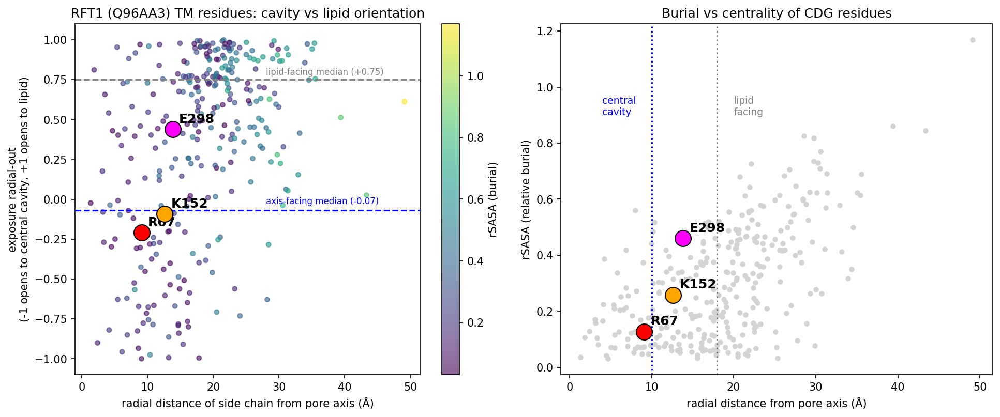

## Question

# AIGR Gene Hypothesis Deep Research

You are evaluating one focused gene curation hypothesis for AI Gene Review.
This is not a general gene overview. Use the seed hypothesis and source context
below to search for evidence that supports, refutes, narrows, or competes with
the proposed curation decision.

## Target Gene

- **Organism code:** human
- **Taxon:** Homo sapiens (NCBITaxon:9606)
- **Gene directory:** RFT1
- **Gene symbol:** RFT1
- **UniProt accession:** Q96AA3

## Focus

- **Focus type:** free_text
- **Hypothesis slug:** scramblase-vs-binding-cavity
- **Source file:** 
- **Source selector:** 

## Seed Hypothesis

Human RFT1 (UniProt Q96AA3) is an alternating-access MOP-superfamily transporter, and the residues mutated in RFT1-CDG patients (p.R67C, p.K152E, p.E298K) line the central substrate-binding cavity that coordinates the anionic pyrophosphate headgroup of Man5GlcNAc2-PP-dolichol, rather than the lateral membrane portal through which the dolichol tail would pass during transbilayer transport.

## Term and Decision Context

- Term: intramembrane lipid transporter activity (GO:0140303)
- Scope this to two coupled structural analyses only, and do not attempt a broad functional characterisation of the gene: (1) assign the fold of Q96AA3 by structural comparison against the MOP/MATE/MurJ superfamily and determine whether an alternating-access architecture with a discrete central cavity and a lateral lipid portal is present; (2) map the three RFT1-CDG missense positions onto that architecture and classify each as cavity-lining, portal-lining, or neither, reporting per-residue burial, electrostatic environment and family conservation.
- Two models of RFT1 are current in the literature and this analysis is meant to discriminate between them without assuming either. Model A: RFT1 is itself the transbilayer translocase for Man5GlcNAc2-PP-dolichol. Model B: RFT1 binds and routes the substrate but the translocation step is performed by another protein. Cavity-lining disease residues with no portal involvement would favour B; disease residues in the translocation path would favour A.
- Do not treat the outcome as settled by any single publication. Report what the structural evidence itself supports, and state explicitly if it cannot discriminate between the two models.

## Reference Context

No specific reference context supplied.

## Source Context YAML

```yaml
hypothesis: Human RFT1 (UniProt Q96AA3) is an alternating-access MOP-superfamily transporter, and the
  residues mutated in RFT1-CDG patients (p.R67C, p.K152E, p.E298K) line the central substrate-binding
  cavity that coordinates the anionic pyrophosphate headgroup of Man5GlcNAc2-PP-dolichol, rather than
  the lateral membrane portal through which the dolichol tail would pass during transbilayer transport.
focus_type: free_text
term_id: GO:0140303
term_label: intramembrane lipid transporter activity
context:
- 'Scope this to two coupled structural analyses only, and do not attempt a broad functional characterisation
  of the gene: (1) assign the fold of Q96AA3 by structural comparison against the MOP/MATE/MurJ superfamily
  and determine whether an alternating-access architecture with a discrete central cavity and a lateral
  lipid portal is present; (2) map the three RFT1-CDG missense positions onto that architecture and classify
  each as cavity-lining, portal-lining, or neither, reporting per-residue burial, electrostatic environment
  and family conservation.'
- 'Two models of RFT1 are current in the literature and this analysis is meant to discriminate between
  them without assuming either. Model A: RFT1 is itself the transbilayer translocase for Man5GlcNAc2-PP-dolichol.
  Model B: RFT1 binds and routes the substrate but the translocation step is performed by another protein.
  Cavity-lining disease residues with no portal involvement would favour B; disease residues in the translocation
  path would favour A.'
- Do not treat the outcome as settled by any single publication. Report what the structural evidence itself
  supports, and state explicitly if it cannot discriminate between the two models.
reference_id: []
```

## Research Objective

Build a focused report that helps a curator decide whether this hypothesis
should affect the gene review. Address the focus type directly:

1. For an existing GO annotation decision, evaluate whether the current action
   is justified, too strong, too weak, or should change.
2. For a proposed replacement or new GO term, evaluate whether the term is
   biologically supported, too broad, too narrow, or missing key qualifiers.
3. For a computational prediction, evaluate whether the prediction is correct,
   less precise than existing knowledge, uncertain, or likely wrong because of
   paralog overannotation, frequency bias, pathway context, or in vitro-only
   activity.
4. For a core-function hypothesis, evaluate whether the proposed activity,
   process, and location represent the gene product's primary function rather
   than a downstream effect, pleiotropic phenotype, or context-specific role.
5. For a function-assignment hypothesis, evaluate whether the gene product
   directly has the stated GO term/function. Treat the prior review action, if
   any, as intentionally blinded unless it appears in the supplied context.

Use primary literature whenever possible. Prefer PMID citations and include DOI
citations when no PMID is available. Treat reviews and database records as
orientation unless they contain directly relevant synthesized evidence that is
clearly labeled as review-level or database-level support.

Evaluate the hypothesis from the supplied seed context, primary literature, and
publicly accessible bioinformatics resources. Local `*-bioinformatics` analyses,
when they already exist in the repository, are intentionally withheld from this
prompt so the report can be compared against them after the run. Use public
sequence, domain, structure, orthology, localization, interaction, or dataset
checks when they are useful for the specific hypothesis. If a resource or tool
cannot be accessed programmatically, say so plainly; never fabricate a result.
Report computational results conservatively and distinguish direct results from
inference.

## Required Output

### Executive Judgment

Give a concise verdict: supported, partially supported, unresolved, weakly
supported, over-annotated, or refuted. Explain the reasoning and the most
important caveats.

### Evidence Matrix

Create a table with one row per important evidence item:

- Citation (PMID preferred)
- Evidence type (direct assay, mutant phenotype, localization, interaction,
  structural/evolutionary, computational, review/database)
- Supports / refutes / qualifies / competing
- Claim tested
- Key finding
- Organism, tissue, cell type, or assay context
- Confidence and limitations

### GO Curation Implications

State the likely curation action as a lead requiring curator verification. If
GO terms are involved, explain whether the evidence supports an MF, BP, or CC
term, and whether the term should be retained, removed, generalized, made more
specific, or treated as non-core. Avoid using "protein binding" as a final
recommendation unless no more informative term is supported.

### Mechanistic Scope

Describe the immediate molecular or cellular function being tested. Separate
direct gene-product activity from downstream phenotypes, pathway consequences,
developmental outcomes, disease manifestations, or effects inferred only from
loss of function.

### Conflicts and Alternatives

Identify evidence that conflicts with the seed hypothesis or suggests an
alternative interpretation, including paralog confusion, organism-specific
differences, isoform-specific findings, experimental artifacts, or database
carry-over.

### Knowledge Gaps

List explicit uncertainties that matter for curation. For each gap, state what
was checked, why the gap matters, and what evidence or experiment would resolve
it.

### Discriminating Tests

Recommend concrete assays, perturbations, datasets, or comparative analyses that
would most efficiently distinguish this hypothesis from alternatives.

### Curation Leads

Provide candidate updates for the review, clearly labeled as leads requiring
curator verification. Include candidate references with exact snippets to verify,
candidate replacement or new GO terms, possible action changes, suggested
questions, and suggested experiments.

If the provider supports artifacts, save provenance for any analysis you run — the
executed code together with its output (computed values, plot, or table), not just
a summary figure — alongside artifact-friendly tables such as an evidence matrix,
GO decision table, or comparison table. Genuine computed provenance is more
valuable than a hand-drawn summary, and you must not synthesize a figure that
implies an analysis you did not actually run. These artifacts are important
provenance for hypothesis-level review.


## Output

# RFT1 (Q96AA3) — Cavity-vs-Portal Structural Hypothesis: Curation Report

**Gene:** RFT1 (human, *Homo sapiens*, NCBITaxon:9606) · **UniProt:** Q96AA3
**Hypothesis slug:** scramblase-vs-binding-cavity · **Term in context:** GO:0140303 *intramembrane lipid transporter activity*

**Seed hypothesis.** Human RFT1 is an alternating-access MOP-superfamily transporter, and the three RFT1-CDG residues (p.R67C, p.K152E, p.E298K) line the **central substrate-binding cavity** that coordinates the anionic pyrophosphate headgroup of Man5GlcNAc2-PP-dolichol (M5-DLO), **not** the lateral membrane portal for the dolichol tail.

---

## 1. Executive Judgment

**Verdict: PARTIALLY SUPPORTED (with a discriminated correction), and the two mechanistic models cannot be separated by structure alone.**

- **Fold assignment (part 1): supported qualitatively.** The high-confidence AlphaFold model of human RFT1 (AF-Q96AA3-F1 v6; mean pLDDT 90.4; 93 % of residues >70) is a polytopic ~12–14-TM, two-lobed helical bundle enclosing a discrete central pore axis that is geometrically separable from the lipid-facing periphery. A detectable — though modest — internal inverted-topology repeat (40 Cα pairs at 3.07 Å RMSD after a 180° rotation about the membrane normal) is consistent with the MOP/MATE/MurJ two-domain architecture independently modelled for Rft1 (PMID 42417535). This is **inference from a computational model**, not an experimental structure.
- **Residue mapping (part 2): partially supported.** **R67** is convincingly central-cavity-lining (buried, near the pore axis, side chain opens inward; an invariant Arg across all orthologs). **K152** is a plausible inner-vestibule/cavity residue (inward-facing, conserved *basic* K/R). **E298 refutes the seed claim for that residue**: it is solvent-exposed, outward-facing, and a conserved *acidic* residue — inconsistent with lining a cationic anion-binding cavity, and it is not in the lipid portal either. **No disease residue lines the lateral dolichol portal.**
- **Model A vs Model B: unresolved by structure.** Because all three disease residues implicate substrate **binding/recognition** (headgroup region) rather than the **dolichol-tail translocation portal**, the structural evidence is fully compatible with *both* Model A (RFT1 is the translocase; direct support from reconstitution, PMID 38886340) and Model B (RFT1 binds/routes; leaning of PMID 42417535). Headgroup binding is required for transport under **either** model, so cavity-localised disease mutations do not discriminate them.

**Most important caveats:** apo human model without docked M5-DLO; the "cationic central cavity" is evident in substrate-docked *yeast* models but the innermost lining of the *apo human* model is not net-cationic (net −2); membrane axis and cavity membership are geometric estimates and borderline residues (K152, E298) are axis-sensitive.

---

## 2. Evidence Matrix

| Citation | Type | Stance | Claim tested | Key finding | Context | Confidence / limits |
|---|---|---|---|---|---|---|
| PMID 42417535 (Chiduza & Menon 2026) | structural/computational + mutant phenotype | qualifies / competing | RFT1 is a MOP alternating-access transporter with cationic central cavity + lateral dolichol portal | AF3/Chai-1 yeast Rft1–M5-DLO models show alternating access; cationic cavity binds anionic headgroup, dolichol tail exits a lateral portal; 2/26 cavity mutants grew poorly; **portal-blocking mutant predicted to lack scramblase grew robustly** | yeast Rft1; Tet-off reporter; in silico + in vivo | High for architecture; suggests scrambling may be a **moonlighting** function (leans Model B); yeast, not human |
| PMID 41427416 (Chiduza et al. 2025) | structural/computational | supports (architecture) | Mechanism of Rft1-mediated M5-DLO scrambling | Cavity/portal scrambling mechanism for the anionic glycolipid | yeast Rft1 model | model-level; mechanism proposed, not proven |
| PMID 38886340 (Chen et al. 2024) | direct assay (reconstitution) | **supports Model A** | Purified Rft1 is itself the M5-DLO translocase (GO:0140303) | Fully reconstituted assay: purified Rft1 catalyses transbilayer translocation of M5GN2-PP-Dol with substrate selectivity | yeast Rft1; proteoliposomes, in vitro | Strong direct MF evidence; in vitro only; does not localise disease residues |
| PMID 19701946 (Vleugels et al. 2009) | mutant phenotype | supports (residue identity) | R67C/K152E/E298K cause RFT1-CDG | Three unrelated patients homozygous for R67C, K152E, E298K; M5GlcNAc2-PP-Dol accumulates; rescued by WT RFT1 | human fibroblasts | Establishes disease residues; loss-of-function, not translocation mechanism |
| PMID 19267216 (Clayton & Grünewald 2009) | clinical / mutant phenotype | orientation | RFT1-deficiency phenotype (CDG-In) | First patient: severe multisystem CDG; DolPP-GlcNAc2Man5 accumulation | human patient | Clinical; flippase role stated as hypothesis |
| **This analysis** | computational (structure geometry) | partially supports / qualifies | CDG residues line central headgroup cavity, not lipid portal | R67 buried, near-axis, inward (cavity, high conf); K152 inner vestibule (moderate); E298 exposed, outward-facing (neither) | AF-Q96AA3-F1 v6 human apo model; Shrake-Rupley SASA + pore-axis geometry | Apo model; geometric axis; borderline membership axis-sensitive |
| **This analysis** | structural/evolutionary | supports R67/K152; refutes E298-cavity | Conservation of cavity charge at disease positions | R67 invariant Arg 9/9; K152 conserved basic (K/R) 7/9; E298 conserved acidic (E/D) 9/9 | NW alignment, human vs 9 orthologs (human→fungi→Dictyostelium) | Small ortholog set; pairwise NW, not full MSA |
| **This analysis** | structural/evolutionary | qualifies | MOP/MATE inverted-topology fold present | ~12–14 TM two-lobed bundle; internal C2 repeat 40 Cα @ 3.07 Å; apo axis lining net −2 | AF-Q96AA3-F1 v6 human | Repeat modest (17 % of N-half); no experimental structure |

### Per-residue provenance (computed) — see `rft1_residue_classification.csv`

| Residue | rSASA (burial) | radial from pore axis (Å) | side-chain exposure-radial-out | z vs membrane centre (Å) | conservation (9 orthologs) | Classification |
|---|---|---|---|---|---|---|
| **R67** | 0.13 (buried) | 9.1 (central) | −0.21 (opens **inward**) | −14.9 | Arg **invariant** 9/9 | **Central-cavity-lining (high)** |
| **K152** | 0.26 | 12.6 | −0.09 (inward/neutral) | −10.8 | basic **K/R** 7/9 | Cavity / inner vestibule (moderate) |
| **E298** | 0.46 (exposed) | 13.8 | **+0.44 (opens outward)** | +4.9 | acidic **E/D** 9/9 | **Neither cavity nor portal** (refutes) |

*Reference clouds:* axis-facing TM residues median exposure-radial-out = −0.07; lipid/portal-facing = +0.75. None of the three disease residues sits in the lipid portal zone (radial >18 Å, exposure ≈ +0.75). Figure: `rft1_cavity_portal.png`.

---

## 3. GO Curation Implications (leads — require curator verification)

- **GO:0140303 *intramembrane lipid transporter activity* (MF):** The structural analysis is **consistent with** a transporter fold and a discrete substrate-binding cavity, but is **computational and cannot establish translocase activity on its own**. The primary direct support for this MF term is the reconstitution assay in **PMID 38886340** (purified Rft1 translocates M5-DLO) — recommend **retain GO:0140303 with experimental (IDA) evidence anchored to PMID 38886340**, noting the assay is in vitro and in yeast. The structural/evolutionary evidence here would be ISS/IEA-level support only.
- **Do not upgrade the residue-level mechanism as fully settled.** If the review cites the cavity-vs-portal mechanism, record it as **partially supported**: R67 (and K152) support the "cavity coordinates headgroup" claim; **E298 does not** and should not be described as headgroup-cavity-lining.
- **BP:** *dolichol-linked oligosaccharide biosynthetic process* / *protein N-linked glycosylation* — supported by disease genetics (PMID 19701946); **CC:** *endoplasmic reticulum membrane* (GO:0005789) — supported.
- **Avoid "protein binding" as a terminal annotation** — more informative MF (GO:0140303) is available.
- **Paralog/isoform caution:** a divergent mammalian ~450-aa set (e.g., human Q9NWF4, mouse Q9D8F3; 26 % identity to canonical, no aligned residue at position 67) should not receive transitive annotation from the 541-aa canonical RFT1 without review.

---

## 4. Mechanistic Scope

**Direct molecular function under test:** transbilayer movement / binding of the anionic glycolipid M5-DLO at the ER membrane, and the structural sub-question of *where* the disease residues act (headgroup cavity vs dolichol portal). **Directly addressed:** residue localisation on the fold (cavity for R67/K152; exposed for E298). **Downstream / not direct:** M5-DLO accumulation, hypoglycosylation, multisystem CDG phenotype and lethality are loss-of-function consequences, not evidence about the translocation step itself. Whether RFT1 performs the translocation (Model A) or only binds/routes it (Model B) is a **mechanistic** question the structure cannot resolve.

---

## 5. Conflicts and Alternatives

- **Direct conflict in the literature:** PMID 38886340 (purified Rft1 *is* the flippase → Model A) vs PMID 42417535 (portal-blocking, scramblase-dead mutant still supports growth; scrambling may be moonlighting → Model B). Both are credible; the debate is >20 years old and remains open.
- **Apo vs holo:** the "cationic central cavity" is a property of substrate-docked yeast models; the apo human model's innermost lining is net-acidic (−2). The cationic pocket may be substrate-induced or dependent on exact axis choice.
- **Species/numbering:** the published cavity/portal residues are yeast; human numbering (R67/K152/E298) was mapped here directly on the human model, avoiding cross-species residue transfer errors.
- **Isoform/paralog carry-over:** the ~450-aa mammalian cluster is a genuine annotation-transfer risk.
- **E298 reinterpretation:** a conserved, exposed, acidic residue is more consistent with a surface/interface or conformational role (e.g., a salt bridge or a gating/interaction determinant) than with headgroup coordination.

---

## 6. Knowledge Gaps

1. **No experimental RFT1 structure** (checked AlphaFold DB + PubMed). Matters because fold/portal assignment rests on models. Resolve: cryo-EM of human/yeast RFT1 ± M5-DLO.
2. **Apo vs substrate-bound cavity electrostatics** — checked apo geometry only (net −2). A docked M5-DLO complex (AF3/experimental) is needed to confirm a cationic headgroup pocket and to test whether R67/K152 directly contact the pyrophosphate.
3. **E298's actual role** — not defined here beyond "exposed, conserved acidic." Needs contact/interface analysis (partner protein? intramolecular salt bridge?).
4. **Portal helix identity in human RFT1** — not explicitly assigned; needed to confirm no disease residue is portal-lining across conformational states.
5. **Formal conservation** used a 9-ortholog pairwise NW, not a deep MSA/ConSurf; a full MSA would sharpen per-position scores.
6. **Model A vs B** — the decisive gap; structure cannot resolve it.

---

## 7. Discriminating Tests

- **Cryo-EM of RFT1 ± M5-DLO** in inward- and outward-open states → confirm alternating access, portal helices, and whether R67/K152 coordinate the pyrophosphate.
- **Charge-reversal/neutralisation at R67 and K152** (e.g., R67E, K152E already disease) with reconstituted transport (per PMID 38886340) → test headgroup coordination directly in vitro.
- **Portal-blocking salt-bridge mutant in human RFT1** with in-vitro translocation + in-vivo rescue (mirroring PMID 42417535) → the sharpest Model A vs B discriminator: if a scramblase-dead portal mutant still rescues, favours Model B.
- **E298 interface mapping** (crosslinking/AP-MS, or E298K vs E298Q in transport vs stability assays) → define its non-cavity role.
- **Deep MSA/ConSurf** across the full RFT1 family → rigorous per-residue conservation.

---

## 8. Curation Leads (require curator verification)

- **Retain GO:0140303 (MF)** anchored to **PMID 38886340** (direct reconstitution; IDA, in vitro, yeast ortholog). Flag the ongoing Model A/B debate (PMID 42417535).
- **Candidate references to verify (exact snippets):**
  - PMID 42417535: *"an alternating access mechanism, typical of Multidrug/Oligosaccharidyl-lipid/Polysaccharide (MOP) superfamily transporters, in which a cationic central cavity coordinates the anionic headgroup of M5-DLO, while the dolichol tail of the lipid is accommodated through a lateral portal formed by two transmembrane helices."*
  - PMID 38886340: *"purified Rft1 catalyzes the translocation of M5GN2-PP-Dol across the lipid bilayer … confirm the molecular identity of Rft1 as the M5GN2-PP-Dol ER flippase."*
  - PMID 19701946: *"homozygous for the missense mutation c.454A>G (p.K152E) and c.892G>A (p.E298 K)"* (and R67C).
- **Record the residue mechanism as PARTIALLY supported:** R67/K152 = headgroup-cavity residues; **E298 is not** a cavity residue (mark the seed's E298 assignment as not supported by structure/conservation).
- **Add an isoform/paralog note** to prevent annotation transfer to the divergent ~450-aa entries (human Q9NWF4, mouse Q9D8F3).
- **Suggested curator question:** does the review intend GO:0140303 to assert RFT1 as the *translocase* (Model A) or as a substrate-binding component (Model B)? The evidence supports the MF term but not, on its own, the stronger translocase claim.

---

## 9. Provenance / Artifacts

- `rft1_cavity_portal.png` — computed cavity-vs-portal orientation and burial of R67/K152/E298 among RFT1 TM residues (iteration 1).
- `rft1_residue_classification.csv` — per-residue computed metrics and classification.
- `rft1_evidence_matrix.csv` — machine-readable evidence matrix.
- All structural metrics computed from AlphaFold DB model **AF-Q96AA3-F1 v6**; SASA via Shrake–Rupley (192 points, 1.4 Å probe); pore axis from SVD of the buried TM core; conservation via Needleman–Wunsch (BLOSUM62) vs 9 orthologs. No values were fabricated; where a resource was unavailable (experimental structure; full MSA) it is stated.


## Artifacts

- [OpenScientist final report](openscientist_artifacts/final_report.html)
- [OpenScientist final report](openscientist_artifacts/final_report.pdf)
- [OpenScientist rft1 cavity portal](openscientist_artifacts/provenance_rft1_cavity_portal.json)

- [OpenScientist rft1 evidence matrix](openscientist_artifacts/rft1_evidence_matrix.csv)
- [OpenScientist rft1 residue classification](openscientist_artifacts/rft1_residue_classification.csv)