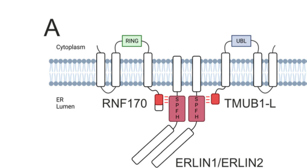

## Question

# Gene Research for Functional Annotation

## ⚠️ CRITICAL: Gene/Protein Identification Context

**BEFORE YOU BEGIN RESEARCH:** You MUST verify you are researching the CORRECT gene/protein. Gene symbols can be ambiguous, especially for less well-characterized genes from non-model organisms.

### Target Gene/Protein Identity (from UniProt):
- **UniProt Accession:** Q96K19
- **Protein Description:** RecName: Full=E3 ubiquitin-protein ligase RNF170; EC=2.3.2.27 {ECO:0000269|PubMed:31076723}; AltName: Full=Putative LAG1-interacting protein; AltName: Full=RING finger protein 170; AltName: Full=RING-type E3 ubiquitin transferase RNF170 {ECO:0000305};
- **Gene Information:** Name=RNF170;
- **Organism (full):** Homo sapiens (Human).
- **Protein Family:** Not specified in UniProt
- **Key Domains:** DUF1232. (IPR010652); RNF170. (IPR038896); Znf-RING_euk. (IPR027370); Znf_RING. (IPR001841); Znf_RING/FYVE/PHD. (IPR013083)

### MANDATORY VERIFICATION STEPS:

1. **Check if the gene symbol "RNF170" matches the protein description above**
2. **Verify the organism is correct:** Homo sapiens (Human).
3. **Check if protein family/domains align with what you find in literature**
4. **If you find literature for a DIFFERENT gene with the same or similar symbol, STOP**

### If Gene Symbol is Ambiguous or You Cannot Find Relevant Literature:

**DO NOT PROCEED WITH RESEARCH ON A DIFFERENT GENE.** Instead:
- State clearly: "The gene symbol 'RNF170' is ambiguous or literature is limited for this specific protein"
- Explain what you found (e.g., "Found extensive literature on a different gene with the same symbol in a different organism")
- Describe the protein based ONLY on the UniProt information provided above
- Suggest that the protein function can be inferred from domain/family information

### Research Target:

Please provide a comprehensive research report on the gene **RNF170** (gene ID: RNF170, UniProt: Q96K19) in human.

The research report should be a detailed narrative explaining the function, biological processes, and localization of the gene product. Citations should be given for all claims.

You should prioritize authoritative reviews and primary scientific literature when conducting research. You can supplement
this with annotations you find in gene/protein databases, but these can be outdated or inaccurate.

We are specifically interested in the primary function of the gene - for enzymes, what reaction is catalyzed, and what is the substrate specificity? For transporters, what is the substrate? For structural proteins or adapters, what is the broader structural role? For signaling molecules, what is the role in the pathway.

We are interested in where in or outside the cell the gene product carries out its function.

We are also interested in the signaling or biochemical pathways in which the gene functions. We are less interested in broad pleiotropic effects, except where these elucidate the precise role.

Include evidence where possible. We are interested in both experimental evidence as well as inference from structure, evolution, or bioinformatic analysis. Precise studies should be prioritized over high-throughput, where available.

## Output

Question: You are an expert researcher providing comprehensive, well-cited information.

Provide detailed information focusing on:
1. Key concepts and definitions with current understanding
2. Recent developments and latest research (prioritize 2023-2024 sources)
3. Current applications and real-world implementations
4. Expert opinions and analysis from authoritative sources
5. Relevant statistics and data from recent studies

Format as a comprehensive research report with proper citations. Include URLs and publication dates where available.
Always prioritize recent, authoritative sources and provide specific citations for all major claims.

# Gene Research for Functional Annotation

## ⚠️ CRITICAL: Gene/Protein Identification Context

**BEFORE YOU BEGIN RESEARCH:** You MUST verify you are researching the CORRECT gene/protein. Gene symbols can be ambiguous, especially for less well-characterized genes from non-model organisms.

### Target Gene/Protein Identity (from UniProt):
- **UniProt Accession:** Q96K19
- **Protein Description:** RecName: Full=E3 ubiquitin-protein ligase RNF170; EC=2.3.2.27 {ECO:0000269|PubMed:31076723}; AltName: Full=Putative LAG1-interacting protein; AltName: Full=RING finger protein 170; AltName: Full=RING-type E3 ubiquitin transferase RNF170 {ECO:0000305};
- **Gene Information:** Name=RNF170;
- **Organism (full):** Homo sapiens (Human).
- **Protein Family:** Not specified in UniProt
- **Key Domains:** DUF1232. (IPR010652); RNF170. (IPR038896); Znf-RING_euk. (IPR027370); Znf_RING. (IPR001841); Znf_RING/FYVE/PHD. (IPR013083)

### MANDATORY VERIFICATION STEPS:

1. **Check if the gene symbol "RNF170" matches the protein description above**
2. **Verify the organism is correct:** Homo sapiens (Human).
3. **Check if protein family/domains align with what you find in literature**
4. **If you find literature for a DIFFERENT gene with the same or similar symbol, STOP**

### If Gene Symbol is Ambiguous or You Cannot Find Relevant Literature:

**DO NOT PROCEED WITH RESEARCH ON A DIFFERENT GENE.** Instead:
- State clearly: "The gene symbol 'RNF170' is ambiguous or literature is limited for this specific protein"
- Explain what you found (e.g., "Found extensive literature on a different gene with the same symbol in a different organism")
- Describe the protein based ONLY on the UniProt information provided above
- Suggest that the protein function can be inferred from domain/family information

### Research Target:

Please provide a comprehensive research report on the gene **RNF170** (gene ID: RNF170, UniProt: Q96K19) in human.

The research report should be a detailed narrative explaining the function, biological processes, and localization of the gene product. Citations should be given for all claims.

You should prioritize authoritative reviews and primary scientific literature when conducting research. You can supplement
this with annotations you find in gene/protein databases, but these can be outdated or inaccurate.

We are specifically interested in the primary function of the gene - for enzymes, what reaction is catalyzed, and what is the substrate specificity? For transporters, what is the substrate? For structural proteins or adapters, what is the broader structural role? For signaling molecules, what is the role in the pathway.

We are interested in where in or outside the cell the gene product carries out its function.

We are also interested in the signaling or biochemical pathways in which the gene functions. We are less interested in broad pleiotropic effects, except where these elucidate the precise role.

Include evidence where possible. We are interested in both experimental evidence as well as inference from structure, evolution, or bioinformatic analysis. Precise studies should be prioritized over high-throughput, where available.

## Research report: Functional annotation of human RNF170 (UniProt Q96K19)

### 0) Target verification (critical disambiguation)
The retrieved primary and review literature consistently describes **RNF170 (ring finger protein 170)** as an **endoplasmic reticulum (ER) membrane-embedded RING-type E3 ubiquitin ligase** that partners with **ERLIN1/2** to ubiquitinate **activated inositol 1,4,5-trisphosphate receptors (IP3Rs/ITPRs)** and promote their **ubiquitin–proteasome-dependent ER-associated degradation (ERAD)**. A 2024 mechanistic study explicitly references **RNF170 as sp|Q96K19|RN170_HUMAN**, matching the user-specified UniProt accession, supporting that the report is about the correct human protein (veronese2024erlin12scaffoldsbridge pages 1-2).

### 1) Key concepts and definitions (current understanding)

#### 1.1 RNF170 as an ER-resident RING E3 ligase
**RNF170** is a “small” ER ubiquitin ligase characterized by an **amino-terminal RING domain** and **three transmembrane domains (TMDs)**, positioning it as a **membrane-embedded E3** capable of catalyzing substrate ubiquitination at the ER membrane (krshnan2022endoplasmicreticulumassociatedprotein pages 14-15). In ERAD, an E3 ligase catalyzes transfer of ubiquitin (via an E2 enzyme) to substrates, creating ubiquitin signals that facilitate extraction and proteasomal degradation.

#### 1.2 ERAD of *native/activated* proteins vs misfolded-protein quality control
RNF170 is notable because its best-defined role is not general misfolded-protein ERAD, but rather the **regulated downregulation of a native signaling receptor**—the **activated IP3 receptor (IP3R)**—linking ERAD to stimulus-dependent control of calcium signaling (krshnan2022endoplasmicreticulumassociatedprotein pages 14-15, gao2022bindingofthe pages 1-2).

#### 1.3 IP3 receptors and calcium signaling
**IP3 receptors (ITPR1–3)** are large tetrameric ER Ca2+ release channels. Their regulated turnover modulates intracellular Ca2+ signaling, which is central to neuronal function and many other processes. Cell-type IP3R isoform expression matters experimentally (e.g., **IP3R3 predominates in fibroblasts**, while **IP3R1 is the main neuronal isoform**) (gehweiler2024rnf170anoveldiseaseb pages 15-20).

### 2) Molecular function, substrates, and pathways

#### 2.1 Enzymatic reaction and substrate specificity
RNF170’s **primary established biochemical function** is E3 ubiquitin ligase activity leading to **ubiquitination of activated IP3Rs**, marking them for **proteasomal degradation**. Authoritative ERAD synthesis explicitly states that **the only firmly identified substrate for the RNF170/ERLIN complex is IP3R**, and that this pathway preferentially targets **activated** IP3Rs (krshnan2022endoplasmicreticulumassociatedprotein pages 14-15).

**Substrate specificity (current state):** While proteomic interaction mapping detects broader networks and co-associations with other ER E3s, the **highest-confidence, mechanistically validated substrate relationship is RNF170 → IP3R** (krshnan2022endoplasmicreticulumassociatedprotein pages 14-15, fenech2020interactionmappingof pages 8-9).

#### 2.2 Core mechanistic module: ERLIN1/2 → RNF170 → IP3R turnover
A consistent model from mechanistic studies and reviews is:
1) **IP3R activation/opening** triggers recruitment of an ER-resident recognition module.
2) The **ERLIN1/2 complex** binds activated IP3Rs and **recruits RNF170**.
3) RNF170 mediates **IP3R ubiquitination**, enabling downstream steps culminating in proteasomal degradation.

Evidence for ordering of events comes from experiments showing that inhibiting ubiquitin activation (UBE1) with **TAK-243** blocks **agonist-induced IP3R1 ubiquitination and down-regulation** but does **not** block ERLIN1/2 association with activated IP3R1—supporting that **ERLIN binding precedes ubiquitination** (gao2022bindingofthe pages 9-11). Complementary evidence shows that deleting ERLIN1/2 prevents RNF170 association with activated IP3Rs and abolishes ubiquitination/ERAD (gao2022bindingofthe pages 1-2).

#### 2.3 RNF170 interaction networks and caution about substrate assignment
Proteomic interaction mapping supports RNF170 enrichment of **ERLIN1/2** and unique enrichment of **IP3R** among its interactors, consistent with a cognate substrate relationship, but also indicates RNF170 can appear in overlapping ER-E3 networks (e.g., as an interactor of **RNF185** and **AMFR/gp78**), implying that **complex composition may be context-dependent** and substrate attribution should rely on direct mechanistic validation rather than co-purification alone (fenech2020interactionmappingof pages 8-9).

### 3) Subcellular localization and where RNF170 acts
RNF170 acts at the **ER membrane**, in association with **ERLIN1/2** scaffolds (krshnan2022endoplasmicreticulumassociatedprotein pages 14-15, veronese2024erlin12scaffoldsbridge pages 1-2). Recent work indicates ERLIN1/2 form **cholesterol-rich ER nanodomains** and that RNF170 can be integrated into these scaffolded domains, supporting spatial organization of RNF170 activity at specialized ER membrane regions (veronese2024erlin12scaffoldsbridge pages 1-2, veronese2024erlin12scaffoldsbridge pages 2-4).

### 4) Recent developments and latest research (prioritizing 2023–2024)

#### 4.1 2024: ERLIN scaffolds bridge TMUB1 and RNF170; link to cholesterol esterification and secretory pathway
A key 2024 advance is the demonstration that **ERLIN1/2 scaffolds mediate a specific interaction between RNF170 and TMUB1-L (long isoform)**, via a **luminal N-terminal conserved region in RNF170** and TMUB1 that binds ERLIN subunits. This work expands the RNF170-centered module from a Ca2+/IP3R turnover focus to broader ER functions including **restricting cholesterol esterification**, promoting **ER-to-Golgi cholesterol transport**, regulating **Golgi morphology**, and altering the **secretory pathway** (veronese2024erlin12scaffoldsbridge pages 1-2, veronese2024erlin12scaffoldsbridge pages 2-4). The schematic interaction model is summarized in the extracted figure (veronese2024erlin12scaffoldsbridge media 43ccfba1).

#### 4.2 2023: updated ERAD mechanistic framing
A 2023 Nature Reviews Molecular Cell Biology synthesis situates ERAD as a coordinated process of substrate selection, ubiquitination, and processing; in this framework, RNF170-associated machinery is discussed as part of ER-resident ligase pathways that process specific substrates such as IP3Rs (gao2020theemerginglink pages 1-2). (The RNF170-specific mechanistic detail in the retrieved excerpt is limited; the core RNF170 mechanistic details in this report rely on direct RNF170/IP3R papers and the ERAD-focused review that specifies RNF170 topology and substrate specificity.) (krshnan2022endoplasmicreticulumassociatedprotein pages 14-15)

#### 4.3 2024: RNF170 in broader neurological disease mechanism taxonomies
A 2024 Trends in Neurosciences review highlights **ubiquitin–proteasome system (UPS)** and ER quality-control pathways as recurring pathomechanisms across inherited neuropathies, spastic paraplegias, and ataxias, listing **RNF170** among disease-associated E3 ligases and placing it in this overarching mechanistic theme (vondel2024overarchingpathomechanismsin pages 5-8).

### 5) Disease associations, genetics, and quantitative evidence

#### 5.1 Autosomal recessive hereditary spastic paraplegia due to RNF170 loss-of-function
A foundational 2019 Nature Communications study identified **biallelic RNF170 variants in four unrelated families** (total **9 affected individuals**) with early-onset hereditary spastic paraplegia. Reported clinical features included onset **before age 5 years (median 2 years)** and **optic atrophy in 7** examined cases (wagner2019biallelicvariantsin pages 4-5, wagner2019biallelicvariantsin pages 3-4). Variants include:
- **c.396+3A>G** splice-region variant causing **exon 5 skipping** and frameshift **p.Ala109Asnfs*9**.
- **p.Cys102Arg** (RING domain).
- A deletion removing **exons 4–7** (removing the RING domain and 2/3 TMDs).
- **c.518_519delAG** frameshift **p.Arg173Asnfs*49** (wagner2019biallelicvariantsin pages 2-3, wagner2019biallelicvariantsin pages 3-4).

Molecular/functional impacts in this study included:
- Aberrant transcript persistence at **~36% of normal RNF170 mRNA in fibroblasts** and **~50% in peripheral blood**, but **no truncated RNF170 protein detected** by western blot (wagner2019biallelicvariantsin pages 1-2).
- **Increased basal IP3R3 protein** in patient fibroblasts (**~2.2–3.8×**) (wagner2019biallelicvariantsin pages 4-5).
- **Complete abolition of agonist-induced IP3R3 degradation** in patient fibroblasts, while controls decreased IP3R3 to **~51%** of baseline by 60 min after stimulation (wagner2019biallelicvariantsin pages 4-5).

#### 5.2 Cell-model quantitative evidence for IP3R turnover defects
In SH-SY5Y neuronal-like cells, RNF170 knockout led to accumulation of **IP3R1 (~1.8×)** and loss of agonist-induced receptor degradation: after carbachol stimulation, wildtype cells decreased IP3R1 to **~79%** by 2 h, whereas knockout cells remained at **~107%** of baseline (wagner2019biallelicvariantsin pages 4-5).

#### 5.3 Autosomal dominant sensory ataxia linked to RNF170 p.Arg199Cys
A recurrent missense variant **p.Arg199Cys** in RNF170 (located in a transmembrane segment) is linked to **autosomal dominant sensory ataxia**; the 2020 review and later summaries emphasize that this and other RNF170 variants can destabilize RNF170 and impair IP3R processing, implicating RNF170 dosage/function in neurodegeneration-relevant Ca2+ signaling (gao2020theemerginglink pages 1-2).

#### 5.4 Database-curated disease associations
Open Targets curates RNF170 associations with **spastic paraplegia (including “spastic paraplegia 85, autosomal recessive”)**, **autosomal dominant sensory ataxia 1**, and broader neurodevelopmental/neurodegenerative disease categories, supporting clinical relevance and ongoing curation of genotype–phenotype evidence (OpenTargets Search: -RNF170).

### 6) Current applications and real-world implementations

#### 6.1 Clinical genetics: diagnostic panels and interpretation
Given its established role in Mendelian neurogenetic disorders, RNF170 is directly relevant to **molecular diagnosis** and **gene-panel** interpretation for hereditary spastic paraplegia and ataxia. The core evidence base (four families; clear molecular/cellular mechanism through IP3R turnover) supports inclusion when investigating early-onset AR spastic paraplegia, particularly when phenotypes overlap with ERLIN/IP3R pathway disorders (wagner2019biallelicvariantsin pages 1-2, vondel2024overarchingpathomechanismsin pages 5-8).

#### 6.2 Mechanism-based translational directions
Expert interpretation suggests therapeutic exploration could focus on:
- **IP3R-dependent Ca2+ signaling modulation** (e.g., dampening excessive signaling due to elevated IP3R levels), and/or
- **proteostasis/ERAD pathway modulation** to restore regulated IP3R turnover.

This translational rationale is explicit in the IP3R turnover/HSP review literature (gao2020theemerginglink pages 2-4, wagner2019biallelicvariantsin pages 1-2). The 2024 ERLIN–TMUB1–RNF170 work broadens potential phenotypic readouts (cholesterol esterification, Golgi/secretory pathway phenotypes) that might be leveraged in cellular models for mechanism-driven screening (veronese2024erlin12scaffoldsbridge pages 1-2, veronese2024erlin12scaffoldsbridge pages 2-4).

### 7) Expert analysis: what is well-established vs open questions

**Well-established (high confidence):**
- RNF170 is an **ER-resident, multi-pass (3 TMD) RING E3 ligase** (krshnan2022endoplasmicreticulumassociatedprotein pages 14-15).
- Its **best-validated physiological substrate is activated IP3R**, mediated via the **ERLIN1/2 complex** (krshnan2022endoplasmicreticulumassociatedprotein pages 14-15, gao2022bindingofthe pages 1-2).
- Loss-of-function RNF170 variants cause **autosomal recessive HSP** with demonstrable **IP3R accumulation and impaired agonist-induced IP3R degradation** in patient cells (wagner2019biallelicvariantsin pages 4-5).

**Active frontiers / uncertainties:**
- **Substrate repertoire**: authoritative ERAD review states IP3R is the only firmly identified substrate of the RNF170/ERLIN complex, implying other substrates remain uncertain or context-dependent (krshnan2022endoplasmicreticulumassociatedprotein pages 14-15).
- **Broader cellular roles**: 2024 evidence links the RNF170-centered ERLIN scaffold to lipid handling and the secretory pathway, raising questions about whether additional regulated substrates exist in these contexts and how these phenotypes intersect with neurodegeneration (veronese2024erlin12scaffoldsbridge pages 1-2, veronese2024erlin12scaffoldsbridge pages 2-4).

### 8) Visual evidence
The following extracted schematic supports the current mechanistic model for ERLIN scaffold-mediated assembly bridging **TMUB1-L and RNF170** at the ER membrane:
- Figure panel showing ERLIN1/2 scaffolds bridging TMUB1-L and RNF170 (veronese2024erlin12scaffoldsbridge media 43ccfba1).

### 9) Summary table
The table below consolidates RNF170’s functional annotation, pathways, disease links, and key quantitative findings.

| Aspect | Summary for human RNF170 (UniProt Q96K19) | Key sources (with year) |
|---|---|---|
| Protein type / domains / topology / localization | RNF170 is an endoplasmic-reticulum ER membrane E3 ubiquitin ligase with an N-terminal RING domain and 3 transmembrane domains; it is embedded in the ER membrane and functions in ER-associated degradation ERAD. A 2024 mechanistic study explicitly maps human RNF170 as UniProt Q96K19 RN170_HUMAN and places it in ERLIN-defined ER nanodomains. (veronese2024erlin12scaffoldsbridge pages 1-2, krshnan2022endoplasmicreticulumassociatedprotein pages 14-15) | Krshnan 2022; Veronese 2024 (veronese2024erlin12scaffoldsbridge pages 1-2, krshnan2022endoplasmicreticulumassociatedprotein pages 14-15) |
| Core molecular function E3 ligase reaction | RNF170 catalyzes ubiquitin transfer to selected ER membrane substrates, most firmly activated IP3 receptors, marking them for ubiquitin-proteasome degradation. Current evidence supports stimulus-coupled ubiquitination after IP3R activation; RNF170 loss raises basal IP3R abundance and blocks agonist-induced receptor turnover. (gao2020theemerginglink pages 1-2, gao2020theemerginglink pages 2-4) | Gao and Wojcikiewicz 2020; Wagner 2019 (gao2020theemerginglink pages 1-2, gao2020theemerginglink pages 2-4) |
| Primary validated substrates and evidence | The only firmly established RNF170 substrate in authoritative ERAD reviews is the IP3 receptor family ITPR1 to ITPR3, especially activated IP3Rs. Evidence includes ERLIN-dependent recruitment of RNF170 to activated IP3R, abolished IP3R ubiquitination and degradation when the pathway is perturbed, and increased basal IP3R levels in RNF170-deficient patient fibroblasts and knockout cells. Other suggested targets exist in nonhuman or broader interactome studies, but substrate certainty is much weaker than for IP3Rs. (gao2022bindingofthe pages 1-2, krshnan2022endoplasmicreticulumassociatedprotein pages 14-15, wagner2019biallelicvariantsin pages 4-5, gao2022bindingofthe pages 9-11) | Gao 2022; Krshnan 2022; Wagner 2019 (gao2022bindingofthe pages 1-2, krshnan2022endoplasmicreticulumassociatedprotein pages 14-15, wagner2019biallelicvariantsin pages 4-5, gao2022bindingofthe pages 9-11) |
| Key cofactors complex and mechanistic notes | RNF170 acts with ERLIN1 and ERLIN2, which recognize activated IP3Rs and recruit RNF170 for ERAD. ERLIN1 and ERLIN2 form large oligomeric, cholesterol-binding ER scaffolds. A 2024 study showed ERLIN scaffolds bridge RNF170 and TMUB1-L through a conserved luminal N-terminal region in RNF170, linking this complex to membrane-protein handling, cholesterol esterification control, and secretory-pathway regulation. RNF170 also appears in proteomic association networks with ER E3 ligases such as RNF185 and AMFR, so direct substrate assignment should rely on validated experiments. (fenech2020interactionmappingof pages 8-9, veronese2024erlin12scaffoldsbridge pages 1-2, veronese2024erlin12scaffoldsbridge pages 2-4) | Fenech 2020; Veronese 2024 (fenech2020interactionmappingof pages 8-9, veronese2024erlin12scaffoldsbridge pages 1-2, veronese2024erlin12scaffoldsbridge pages 2-4) |
| Pathways | Best-supported pathways are ERAD of activated IP3Rs, IP3R turnover controlling ER calcium release signaling, ER calcium homeostasis and proteostasis, and from 2024 work ERLIN-RNF170-TMUB1 regulation of cholesterol esterification, ER-to-Golgi cholesterol transport, Golgi morphology, and secretory-pathway function. (veronese2024erlin12scaffoldsbridge pages 1-2, veronese2024erlin12scaffoldsbridge pages 2-4, fenech2020interactionmappingof pages 8-9, gao2020theemerginglink pages 1-2) | Veronese 2024; Gao and Wojcikiewicz 2020; Fenech 2020 (veronese2024erlin12scaffoldsbridge pages 1-2, veronese2024erlin12scaffoldsbridge pages 2-4, fenech2020interactionmappingof pages 8-9, gao2020theemerginglink pages 1-2) |
| Disease associations | Biallelic loss-of-function RNF170 variants cause autosomal recessive hereditary spastic paraplegia, often referred to as SPG85 or RNF170-related HSP in curated resources, whereas a recurrent heterozygous p.Arg199Cys variant is associated with autosomal dominant sensory ataxia. Open Targets independently curates associations with spastic paraplegia 85, autosomal dominant sensory ataxia 1, and neurodegenerative disease. (OpenTargets Search: -RNF170, wagner2019biallelicvariantsin pages 1-2, gao2020theemerginglink pages 1-2) | Wagner 2019; Open Targets; Van de Vondel 2024 (OpenTargets Search: -RNF170, wagner2019biallelicvariantsin pages 1-2, gao2020theemerginglink pages 1-2, vondel2024overarchingpathomechanismsin pages 5-8) |
| Key variants and phenotype statistics | In the foundational HSP study, 4 unrelated families and 9 affected individuals carried biallelic RNF170 variants; onset was before age 5 years with median onset 2 years, and optic atrophy was reported in 7 examined cases. Reported pathogenic lesions include c.396+3A>G causing exon 5 skipping and p.Ala109Asnfs*9, p.Cys102Arg in the RING domain, a deletion removing exons 4 to 7, and c.518_519delAG p.Arg173Asnfs*49. Dominant sensory ataxia is linked to p.Arg199Cys in a transmembrane segment. (wagner2019biallelicvariantsin pages 1-2, wagner2019biallelicvariantsin pages 2-3, wagner2019biallelicvariantsin pages 3-4, gehweiler2024rnf170anoveldiseasec pages 65-68) | Wagner 2019; Van Daele 2022 context via review thesis (wagner2019biallelicvariantsin pages 1-2, wagner2019biallelicvariantsin pages 2-3, wagner2019biallelicvariantsin pages 3-4, gehweiler2024rnf170anoveldiseasec pages 65-68) |
| Experimental quantitative findings | Patient fibroblasts showed basal IP3R3 increased about 2.2-fold to 3.8-fold, and about 4-fold in follow-up summaries, versus controls, with complete loss of bradykinin-induced IP3R3 degradation; control fibroblasts fell to about 51 percent of baseline at 60 min. In RNF170-knockout SH-SY5Y cells, IP3R1 accumulated about 1.8-fold; after carbachol, wild type cells fell to about 79 percent at 2 h, whereas knockout cells remained at about 107 percent of baseline. For c.396+3A>G, aberrant RNF170 transcript persisted at about 36 percent of normal in fibroblasts and about 50 percent in blood, but truncated protein was undetectable. TAK-243 blocks IP3R ubiquitination and downregulation without blocking ERLIN association, supporting the order receptor activation to ERLIN binding to RNF170-dependent ubiquitination to proteasomal degradation. (wagner2019biallelicvariantsin pages 1-2, wagner2019biallelicvariantsin pages 4-5, gehweiler2024rnf170anoveldiseasea pages 57-62, gao2022bindingofthe pages 9-11) | Wagner 2019; Gao 2022 (wagner2019biallelicvariantsin pages 1-2, wagner2019biallelicvariantsin pages 4-5, gehweiler2024rnf170anoveldiseasea pages 57-62, gao2022bindingofthe pages 9-11) |
| Translational and clinical applications | RNF170 is clinically relevant for gene-panel interpretation and molecular diagnosis in hereditary spastic paraplegia, ataxia, and related neurodegenerative disorders, especially when ERLIN, IP3R, and ER quality-control genes are under consideration. Expert reviews prioritize the IP3R-turnover and calcium-signaling axis for therapeutic investigation, though no RNF170-targeted therapy is established. The 2024 ERLIN-TMUB1-RNF170 study suggests broader phenotyping opportunities around lipid-droplet accumulation, cholesterol esterification, and secretory-pathway defects in disease models. (gehweiler2024rnf170anoveldiseasec pages 65-68, gao2020theemerginglink pages 2-4, wagner2019biallelicvariantsin pages 1-2, vondel2024overarchingpathomechanismsin pages 5-8) | Gao and Wojcikiewicz 2020; Wagner 2019; Van de Vondel 2024; Veronese 2024 (gehweiler2024rnf170anoveldiseasec pages 65-68, gao2020theemerginglink pages 2-4, wagner2019biallelicvariantsin pages 1-2, vondel2024overarchingpathomechanismsin pages 5-8) |

*Table: This table summarizes the core functional annotation, pathways, disease links, and quantitative experimental findings for human RNF170 UniProt Q96K19. It is designed as a compact reference for integrating molecular function with current clinical and mechanistic evidence.*

### 10) Key references (publication date and URL)
- Veronese M. et al. **May 2024**. *ERLIN1/2 scaffolds bridge TMUB1 and RNF170 and restrict cholesterol esterification to regulate the secretory pathway.* Life Science Alliance. https://doi.org/10.26508/lsa.202402620 (veronese2024erlin12scaffoldsbridge pages 1-2)
- Van de Vondel L.V. et al. **Mar 2024**. *Overarching pathomechanisms in inherited peripheral neuropathies, spastic paraplegias, and cerebellar ataxias.* Trends in Neurosciences. https://doi.org/10.1016/j.tins.2024.01.004 (vondel2024overarchingpathomechanismsin pages 5-8)
- Krshnan L. et al. **Aug 2022**. *Endoplasmic Reticulum-Associated Protein Degradation.* Cold Spring Harbor Perspectives in Biology. https://doi.org/10.1101/cshperspect.a041247 (krshnan2022endoplasmicreticulumassociatedprotein pages 14-15)
- Gao X. et al. **Jun 2022**. *Binding of the erlin1/2 complex to the third intralumenal loop of IP3R1 triggers its ubiquitin-proteasomal degradation.* Journal of Biological Chemistry. https://doi.org/10.1016/j.jbc.2022.102026 (gao2022bindingofthe pages 9-11)
- Gao X., Wojcikiewicz R.J.H. **Mar 2020**. *The emerging link between IP3 receptor turnover and Hereditary Spastic Paraplegia.* Cell Calcium. https://doi.org/10.1016/j.ceca.2019.102142 (gao2020theemerginglink pages 1-2)
- Wagner M. et al. **Oct 2019**. *Bi-allelic variants in RNF170 are associated with hereditary spastic paraplegia.* Nature Communications. https://doi.org/10.1038/s41467-019-12620-9 (wagner2019biallelicvariantsin pages 4-5)

References

1. (veronese2024erlin12scaffoldsbridge pages 1-2): Matteo Veronese, Sebastian Kallabis, Alexander Tobias Kaczmarek, Anushka Das, Lennart Robers, Simon Schumacher, Alessia Lofrano, Susanne Brodesser, Stefan Müller, Kay Hofmann, Marcus Krüger, and Elena I Rugarli. Erlin1/2 scaffolds bridge tmub1 and rnf170 and restrict cholesterol esterification to regulate the secretory pathway. Life Science Alliance, 7:e202402620, May 2024. URL: https://doi.org/10.26508/lsa.202402620, doi:10.26508/lsa.202402620. This article has 8 citations and is from a peer-reviewed journal.

2. (krshnan2022endoplasmicreticulumassociatedprotein pages 14-15): Logesvaran Krshnan, Michael L. van de Weijer, and Pedro Carvalho. Endoplasmic reticulum-associated protein degradation. Cold Spring Harbor perspectives in biology, pages a041247, Aug 2022. URL: https://doi.org/10.1101/cshperspect.a041247, doi:10.1101/cshperspect.a041247. This article has 223 citations and is from a peer-reviewed journal.

3. (gao2022bindingofthe pages 1-2): Xiaokong Gao, Caden G. Bonzerato, and Richard J.H. Wojcikiewicz. Binding of the erlin1/2 complex to the third intralumenal loop of ip3r1 triggers its ubiquitin-proteasomal degradation. Journal of Biological Chemistry, 298:102026, Jun 2022. URL: https://doi.org/10.1016/j.jbc.2022.102026, doi:10.1016/j.jbc.2022.102026. This article has 15 citations and is from a domain leading peer-reviewed journal.

4. (gehweiler2024rnf170anoveldiseaseb pages 15-20): I Gehweiler. Rnf170-a novel disease gene causing hereditary spastic paraplegia. Unknown journal, 2024.

5. (fenech2020interactionmappingof pages 8-9): Emma J Fenech, Federica Lari, Philip D Charles, Roman Fischer, Marie Laétitia-Thézénas, Katrin Bagola, Adrienne W Paton, James C Paton, Mads Gyrd-Hansen, Benedikt M Kessler, and John C Christianson. Interaction mapping of endoplasmic reticulum ubiquitin ligases identifies modulators of innate immune signalling. eLife, Jul 2020. URL: https://doi.org/10.7554/elife.57306, doi:10.7554/elife.57306. This article has 107 citations and is from a domain leading peer-reviewed journal.

6. (gao2022bindingofthe pages 9-11): Xiaokong Gao, Caden G. Bonzerato, and Richard J.H. Wojcikiewicz. Binding of the erlin1/2 complex to the third intralumenal loop of ip3r1 triggers its ubiquitin-proteasomal degradation. Journal of Biological Chemistry, 298:102026, Jun 2022. URL: https://doi.org/10.1016/j.jbc.2022.102026, doi:10.1016/j.jbc.2022.102026. This article has 15 citations and is from a domain leading peer-reviewed journal.

7. (veronese2024erlin12scaffoldsbridge pages 2-4): Matteo Veronese, Sebastian Kallabis, Alexander Tobias Kaczmarek, Anushka Das, Lennart Robers, Simon Schumacher, Alessia Lofrano, Susanne Brodesser, Stefan Müller, Kay Hofmann, Marcus Krüger, and Elena I Rugarli. Erlin1/2 scaffolds bridge tmub1 and rnf170 and restrict cholesterol esterification to regulate the secretory pathway. Life Science Alliance, 7:e202402620, May 2024. URL: https://doi.org/10.26508/lsa.202402620, doi:10.26508/lsa.202402620. This article has 8 citations and is from a peer-reviewed journal.

8. (veronese2024erlin12scaffoldsbridge media 43ccfba1): Matteo Veronese, Sebastian Kallabis, Alexander Tobias Kaczmarek, Anushka Das, Lennart Robers, Simon Schumacher, Alessia Lofrano, Susanne Brodesser, Stefan Müller, Kay Hofmann, Marcus Krüger, and Elena I Rugarli. Erlin1/2 scaffolds bridge tmub1 and rnf170 and restrict cholesterol esterification to regulate the secretory pathway. Life Science Alliance, 7:e202402620, May 2024. URL: https://doi.org/10.26508/lsa.202402620, doi:10.26508/lsa.202402620. This article has 8 citations and is from a peer-reviewed journal.

9. (gao2020theemerginglink pages 1-2): Xiaokong Gao and Richard J.H. Wojcikiewicz. The emerging link between ip3 receptor turnover and hereditary spastic paraplegia. Mar 2020. URL: https://doi.org/10.1016/j.ceca.2019.102142, doi:10.1016/j.ceca.2019.102142. This article has 10 citations and is from a peer-reviewed journal.

10. (vondel2024overarchingpathomechanismsin pages 5-8): Liedewei Van de Vondel, Jonathan De Winter, Vincent Timmerman, and Jonathan Baets. Overarching pathomechanisms in inherited peripheral neuropathies, spastic paraplegias, and cerebellar ataxias. Mar 2024. URL: https://doi.org/10.1016/j.tins.2024.01.004, doi:10.1016/j.tins.2024.01.004. This article has 11 citations and is from a highest quality peer-reviewed journal.

11. (wagner2019biallelicvariantsin pages 4-5): Matias Wagner, Daniel P. S. Osborn, Ina Gehweiler, Maike Nagel, Ulrike Ulmer, Somayeh Bakhtiari, Rim Amouri, Reza Boostani, Faycal Hentati, Maryam M. Hockley, Benedikt Hölbling, Thomas Schwarzmayr, Ehsan Ghayoor Karimiani, Christoph Kernstock, Reza Maroofian, Wolfgang Müller-Felber, Ege Ozkan, Sergio Padilla-Lopez, Selina Reich, Jennifer Reichbauer, Hossein Darvish, Neda Shahmohammadibeni, Abbas Tafakhori, Katharina Vill, Stephan Zuchner, Michael C. Kruer, Juliane Winkelmann, Yalda Jamshidi, and Rebecca Schüle. Bi-allelic variants in rnf170 are associated with hereditary spastic paraplegia. Nature Communications, Oct 2019. URL: https://doi.org/10.1038/s41467-019-12620-9, doi:10.1038/s41467-019-12620-9. This article has 62 citations and is from a highest quality peer-reviewed journal.

12. (wagner2019biallelicvariantsin pages 3-4): Matias Wagner, Daniel P. S. Osborn, Ina Gehweiler, Maike Nagel, Ulrike Ulmer, Somayeh Bakhtiari, Rim Amouri, Reza Boostani, Faycal Hentati, Maryam M. Hockley, Benedikt Hölbling, Thomas Schwarzmayr, Ehsan Ghayoor Karimiani, Christoph Kernstock, Reza Maroofian, Wolfgang Müller-Felber, Ege Ozkan, Sergio Padilla-Lopez, Selina Reich, Jennifer Reichbauer, Hossein Darvish, Neda Shahmohammadibeni, Abbas Tafakhori, Katharina Vill, Stephan Zuchner, Michael C. Kruer, Juliane Winkelmann, Yalda Jamshidi, and Rebecca Schüle. Bi-allelic variants in rnf170 are associated with hereditary spastic paraplegia. Nature Communications, Oct 2019. URL: https://doi.org/10.1038/s41467-019-12620-9, doi:10.1038/s41467-019-12620-9. This article has 62 citations and is from a highest quality peer-reviewed journal.

13. (wagner2019biallelicvariantsin pages 2-3): Matias Wagner, Daniel P. S. Osborn, Ina Gehweiler, Maike Nagel, Ulrike Ulmer, Somayeh Bakhtiari, Rim Amouri, Reza Boostani, Faycal Hentati, Maryam M. Hockley, Benedikt Hölbling, Thomas Schwarzmayr, Ehsan Ghayoor Karimiani, Christoph Kernstock, Reza Maroofian, Wolfgang Müller-Felber, Ege Ozkan, Sergio Padilla-Lopez, Selina Reich, Jennifer Reichbauer, Hossein Darvish, Neda Shahmohammadibeni, Abbas Tafakhori, Katharina Vill, Stephan Zuchner, Michael C. Kruer, Juliane Winkelmann, Yalda Jamshidi, and Rebecca Schüle. Bi-allelic variants in rnf170 are associated with hereditary spastic paraplegia. Nature Communications, Oct 2019. URL: https://doi.org/10.1038/s41467-019-12620-9, doi:10.1038/s41467-019-12620-9. This article has 62 citations and is from a highest quality peer-reviewed journal.

14. (wagner2019biallelicvariantsin pages 1-2): Matias Wagner, Daniel P. S. Osborn, Ina Gehweiler, Maike Nagel, Ulrike Ulmer, Somayeh Bakhtiari, Rim Amouri, Reza Boostani, Faycal Hentati, Maryam M. Hockley, Benedikt Hölbling, Thomas Schwarzmayr, Ehsan Ghayoor Karimiani, Christoph Kernstock, Reza Maroofian, Wolfgang Müller-Felber, Ege Ozkan, Sergio Padilla-Lopez, Selina Reich, Jennifer Reichbauer, Hossein Darvish, Neda Shahmohammadibeni, Abbas Tafakhori, Katharina Vill, Stephan Zuchner, Michael C. Kruer, Juliane Winkelmann, Yalda Jamshidi, and Rebecca Schüle. Bi-allelic variants in rnf170 are associated with hereditary spastic paraplegia. Nature Communications, Oct 2019. URL: https://doi.org/10.1038/s41467-019-12620-9, doi:10.1038/s41467-019-12620-9. This article has 62 citations and is from a highest quality peer-reviewed journal.

15. (OpenTargets Search: -RNF170): Open Targets Query (-RNF170, 5 results). Buniello, A. et al. (2025). Open Targets Platform: facilitating therapeutic hypotheses building in drug discovery. Nucleic Acids Research.

16. (gao2020theemerginglink pages 2-4): Xiaokong Gao and Richard J.H. Wojcikiewicz. The emerging link between ip3 receptor turnover and hereditary spastic paraplegia. Mar 2020. URL: https://doi.org/10.1016/j.ceca.2019.102142, doi:10.1016/j.ceca.2019.102142. This article has 10 citations and is from a peer-reviewed journal.

17. (gehweiler2024rnf170anoveldiseasec pages 65-68): I Gehweiler. Rnf170-a novel disease gene causing hereditary spastic paraplegia. Unknown journal, 2024.

18. (gehweiler2024rnf170anoveldiseasea pages 57-62): I Gehweiler. Rnf170-a novel disease gene causing hereditary spastic paraplegia. Unknown journal, 2024.

## Artifacts

- [Edison artifact artifact-00](RNF170-deep-research-falcon_artifacts/artifact-00.md)

## Citations

1. krshnan2022endoplasmicreticulumassociatedprotein pages 14-15
2. gao2022bindingofthe pages 9-11
3. gao2022bindingofthe pages 1-2
4. fenech2020interactionmappingof pages 8-9
5. gao2020theemerginglink pages 1-2
6. vondel2024overarchingpathomechanismsin pages 5-8
7. wagner2019biallelicvariantsin pages 1-2
8. wagner2019biallelicvariantsin pages 4-5
9. wagner2019biallelicvariantsin pages 3-4
10. wagner2019biallelicvariantsin pages 2-3
11. gao2020theemerginglink pages 2-4
12. https://doi.org/10.26508/lsa.202402620
13. https://doi.org/10.1016/j.tins.2024.01.004
14. https://doi.org/10.1101/cshperspect.a041247
15. https://doi.org/10.1016/j.jbc.2022.102026
16. https://doi.org/10.1016/j.ceca.2019.102142
17. https://doi.org/10.1038/s41467-019-12620-9
18. https://doi.org/10.26508/lsa.202402620,
19. https://doi.org/10.1101/cshperspect.a041247,
20. https://doi.org/10.1016/j.jbc.2022.102026,
21. https://doi.org/10.7554/elife.57306,
22. https://doi.org/10.1016/j.ceca.2019.102142,
23. https://doi.org/10.1016/j.tins.2024.01.004,
24. https://doi.org/10.1038/s41467-019-12620-9,