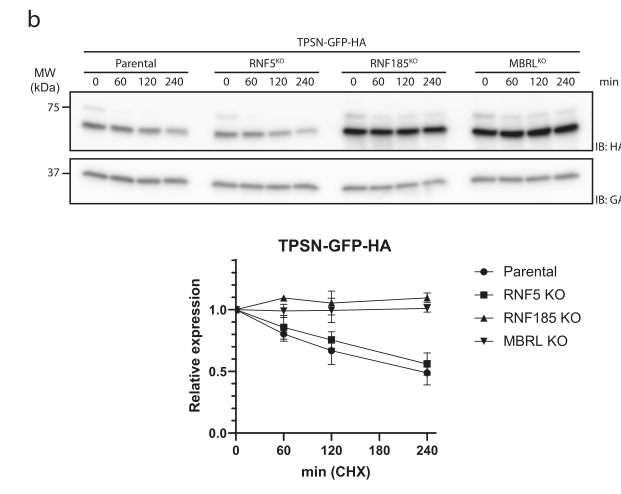

## Question

# Gene Research for Functional Annotation

## ⚠️ CRITICAL: Gene/Protein Identification Context

**BEFORE YOU BEGIN RESEARCH:** You MUST verify you are researching the CORRECT gene/protein. Gene symbols can be ambiguous, especially for less well-characterized genes from non-model organisms.

### Target Gene/Protein Identity (from UniProt):
- **UniProt Accession:** Q96GF1
- **Protein Description:** RecName: Full=E3 ubiquitin-protein ligase RNF185 {ECO:0000305}; EC=2.3.2.27 {ECO:0000269|PubMed:21931693, ECO:0000269|PubMed:27485036, ECO:0000269|PubMed:28273161}; AltName: Full=RING finger protein 185;
- **Gene Information:** Name=RNF185 {ECO:0000303|Ref.1, ECO:0000312|HGNC:HGNC:26783};
- **Organism (full):** Homo sapiens (Human).
- **Protein Family:** Not specified in UniProt
- **Key Domains:** RNF5/RNF185-like. (IPR045103); Znf_C3HC4_RING-type. (IPR018957); Znf_RING. (IPR001841); Znf_RING/FYVE/PHD. (IPR013083); Znf_RING_CS. (IPR017907)

### MANDATORY VERIFICATION STEPS:

1. **Check if the gene symbol "RNF185" matches the protein description above**
2. **Verify the organism is correct:** Homo sapiens (Human).
3. **Check if protein family/domains align with what you find in literature**
4. **If you find literature for a DIFFERENT gene with the same or similar symbol, STOP**

### If Gene Symbol is Ambiguous or You Cannot Find Relevant Literature:

**DO NOT PROCEED WITH RESEARCH ON A DIFFERENT GENE.** Instead:
- State clearly: "The gene symbol 'RNF185' is ambiguous or literature is limited for this specific protein"
- Explain what you found (e.g., "Found extensive literature on a different gene with the same symbol in a different organism")
- Describe the protein based ONLY on the UniProt information provided above
- Suggest that the protein function can be inferred from domain/family information

### Research Target:

Please provide a comprehensive research report on the gene **RNF185** (gene ID: RNF185, UniProt: Q96GF1) in human.

The research report should be a detailed narrative explaining the function, biological processes, and localization of the gene product. Citations should be given for all claims.

You should prioritize authoritative reviews and primary scientific literature when conducting research. You can supplement
this with annotations you find in gene/protein databases, but these can be outdated or inaccurate.

We are specifically interested in the primary function of the gene - for enzymes, what reaction is catalyzed, and what is the substrate specificity? For transporters, what is the substrate? For structural proteins or adapters, what is the broader structural role? For signaling molecules, what is the role in the pathway.

We are interested in where in or outside the cell the gene product carries out its function.

We are also interested in the signaling or biochemical pathways in which the gene functions. We are less interested in broad pleiotropic effects, except where these elucidate the precise role.

Include evidence where possible. We are interested in both experimental evidence as well as inference from structure, evolution, or bioinformatic analysis. Precise studies should be prioritized over high-throughput, where available.

## Output

Question: You are an expert researcher providing comprehensive, well-cited information.

Provide detailed information focusing on:
1. Key concepts and definitions with current understanding
2. Recent developments and latest research (prioritize 2023-2024 sources)
3. Current applications and real-world implementations
4. Expert opinions and analysis from authoritative sources
5. Relevant statistics and data from recent studies

Format as a comprehensive research report with proper citations. Include URLs and publication dates where available.
Always prioritize recent, authoritative sources and provide specific citations for all major claims.

# Gene Research for Functional Annotation

## ⚠️ CRITICAL: Gene/Protein Identification Context

**BEFORE YOU BEGIN RESEARCH:** You MUST verify you are researching the CORRECT gene/protein. Gene symbols can be ambiguous, especially for less well-characterized genes from non-model organisms.

### Target Gene/Protein Identity (from UniProt):
- **UniProt Accession:** Q96GF1
- **Protein Description:** RecName: Full=E3 ubiquitin-protein ligase RNF185 {ECO:0000305}; EC=2.3.2.27 {ECO:0000269|PubMed:21931693, ECO:0000269|PubMed:27485036, ECO:0000269|PubMed:28273161}; AltName: Full=RING finger protein 185;
- **Gene Information:** Name=RNF185 {ECO:0000303|Ref.1, ECO:0000312|HGNC:HGNC:26783};
- **Organism (full):** Homo sapiens (Human).
- **Protein Family:** Not specified in UniProt
- **Key Domains:** RNF5/RNF185-like. (IPR045103); Znf_C3HC4_RING-type. (IPR018957); Znf_RING. (IPR001841); Znf_RING/FYVE/PHD. (IPR013083); Znf_RING_CS. (IPR017907)

### MANDATORY VERIFICATION STEPS:

1. **Check if the gene symbol "RNF185" matches the protein description above**
2. **Verify the organism is correct:** Homo sapiens (Human).
3. **Check if protein family/domains align with what you find in literature**
4. **If you find literature for a DIFFERENT gene with the same or similar symbol, STOP**

### If Gene Symbol is Ambiguous or You Cannot Find Relevant Literature:

**DO NOT PROCEED WITH RESEARCH ON A DIFFERENT GENE.** Instead:
- State clearly: "The gene symbol 'RNF185' is ambiguous or literature is limited for this specific protein"
- Explain what you found (e.g., "Found extensive literature on a different gene with the same symbol in a different organism")
- Describe the protein based ONLY on the UniProt information provided above
- Suggest that the protein function can be inferred from domain/family information

### Research Target:

Please provide a comprehensive research report on the gene **RNF185** (gene ID: RNF185, UniProt: Q96GF1) in human.

The research report should be a detailed narrative explaining the function, biological processes, and localization of the gene product. Citations should be given for all claims.

You should prioritize authoritative reviews and primary scientific literature when conducting research. You can supplement
this with annotations you find in gene/protein databases, but these can be outdated or inaccurate.

We are specifically interested in the primary function of the gene - for enzymes, what reaction is catalyzed, and what is the substrate specificity? For transporters, what is the substrate? For structural proteins or adapters, what is the broader structural role? For signaling molecules, what is the role in the pathway.

We are interested in where in or outside the cell the gene product carries out its function.

We are also interested in the signaling or biochemical pathways in which the gene functions. We are less interested in broad pleiotropic effects, except where these elucidate the precise role.

Include evidence where possible. We are interested in both experimental evidence as well as inference from structure, evolution, or bioinformatic analysis. Precise studies should be prioritized over high-throughput, where available.

# Research Report: Human RNF185 (UniProt Q96GF1) — Functional Annotation

## 1) Target identity verification (critical disambiguation)
RNF185 in this report refers specifically to **human RNF185** encoding **E3 ubiquitin-protein ligase RNF185** (UniProt **Q96GF1**), a **RING-type E3 ligase** with **C3HC4 RING** catalytic domain and **C-terminal transmembrane helices** that anchor it to intracellular membranes. Primary literature explicitly studying “human RNF185” as a mitochondrial/ER membrane E3 ligase (e.g., Tang et al., 2011; Khouri et al., 2013) matches this identity and domain architecture, supporting that the reviewed studies map to the correct target (tang2011rnf185anovel pages 1-2, khouri2013rnf185isa pages 5-7).

## 2) Key concepts and definitions (current understanding)
### 2.1 RNF185 is a RING-type E3 ubiquitin ligase (EC 2.3.2.27)
RING E3 ligases catalyze transfer of ubiquitin from an E2~Ub conjugate to substrate lysine(s) and can build distinct ubiquitin chain linkages that encode different outcomes (e.g., proteasomal degradation vs selective autophagy cargo tagging). RNF185 has been experimentally demonstrated to require an intact RING domain for its ubiquitin ligase activity in cell and in vitro assays (khouri2013rnf185isa pages 5-7).

### 2.2 RNF185 is a membrane-embedded E3 that can function at the ER and mitochondria
RNF185 is unusual in that strong evidence supports **two biologically relevant localizations**:
- **Mitochondrial outer membrane (MOM):** RNF185 contains **two C-terminal transmembrane domains** sufficient/necessary for MOM targeting; topology mapping places its RING domain in the **cytosol**, consistent with ubiquitinating cytosolic-facing substrates on mitochondria (tang2011rnf185anovel pages 1-2, tang2011rnf185anovel pages 2-3).
- **Endoplasmic reticulum (ER):** independent biochemical work shows RNF185 is predominantly ER-localized and functions in **ER-associated degradation (ERAD)** with ERAD components and ER-resident E2s (khouri2013rnf185isa pages 5-7).

### 2.3 Non-canonical ubiquitin linkages: K27 and K63 in RNF185 biology
Multiple RNF185-dependent processes involve **non-canonical linkages**:
- **K63-linked chains**: associated with signaling and selective autophagy cargo tagging; RNF185 polyubiquitinates BNIP1 predominantly through **K63-based linkages**, enabling recruitment of autophagy receptor SQSTM1/p62 (tang2011rnf185anovel pages 1-2).
- **K27-linked chains**: increasingly recognized in immune and autophagy regulation; RNF185 catalyzes **K27-linked** ubiquitination of viral and mitochondrial substrates that are subsequently recognized by SQSTM1/p62 to engage lysosomal pathways (zhang2022rnf185regulatesproteostasis pages 1-2, chen2024senecavirusainduces pages 20-21).

## 3) Molecular function, domains, and enzymology (substrate specificity)
### 3.1 Catalytic requirements and E2 usage
Khouri et al. provide direct enzymology evidence: purified **GST-RNF185** shows strong auto-ubiquitination with **UbcH5c**, weaker with **UbcH6**, and none with **UbcH7** in vitro. RING mutations (C39/C42) or deletion of the RING domain abolish activity, demonstrating **RING-dependence** (khouri2013rnf185isa pages 5-7). In cells, RNF185 associates with ERAD machinery (Derlin-1/Erlin2) and preferentially co-precipitates ER membrane E2s **UBE2J1 (Ubc6e)** and **UBE2J2** (khouri2013rnf185isa pages 5-7).

Recent CRISPR genetic interaction data in a CFTR-F508del ERAD context suggest an additional E2 relationship: **UBE2D3** appears genetically consistent with acting as an E2 for both RNF5 and RNF185 in that pathway (riepe2024smallmoleculecorrectorsdivert pages 7-8).

### 3.2 Substrate specificity (what RNF185 ubiquitinates)
RNF185 does not appear to act as a broad, indiscriminate ERAD ligase; rather, available data support **select substrate modules** with distinct outcomes:

**A) CFTR (including ΔF508/F508del mutant) — proteasomal ERAD**
RNF185 ubiquitinates and promotes proteasome-dependent degradation of CFTR and CFTR-F508del, acting **co-translationally and post-translationally**, with functional redundancy/cooperation with RNF5 (khouri2013rnf185isa pages 1-2, khouri2013rnf185isa pages 10-11, khouri2013rnf185isa pages 11-13). Quantitatively, RNF185 overexpression reduced CFTR-F508 half-life from **44 to 29 minutes**, and RNF185 knockdown stabilized labeled CFTR by **≥2-fold** in pulse-label assays (khouri2013rnf185isa pages 10-11). Combined RNF5+RNF185 depletion produced stronger stabilization of CFTR-F508 (reported ~**4.5-fold** steady-state increase) than either alone (khouri2013rnf185isa pages 11-13).

**B) BNIP1 — mitophagy cargo tagging (K63-linked)**
Tang et al. identify the Bcl-2 family protein **BNIP1** as an RNF185 substrate at mitochondria. BNIP1 is **polyubiquitinated by RNF185 through K63-based linkages**, recruiting **SQSTM1/p62**, which bridges ubiquitin to LC3 and promotes selective mitochondrial autophagy (mitophagy) (tang2011rnf185anovel pages 1-2).

**C) Tapasin (TPSN) — ERAD “assembly surveillance” controlling MHC-I presentation**
Van de Weijer et al. (2024) show tapasin (TPSN), an essential peptide-loading complex (PLC) component, is a substrate of an ERAD complex containing **RNF185 and Membralin (MBRL/TMEM259)**. RNF185/MBRL preferentially recognizes **unassembled** tapasin, ubiquitinates it (requiring lysines in its cytosolic tail), and promotes turnover via ERAD (weijer2024tapasinassemblysurveillance pages 2-3, weijer2024tapasinassemblysurveillance pages 6-7). TPSN is normally short-lived with reported **~4 hour half-life** (weijer2024tapasinassemblysurveillance pages 2-3). Functionally, loss of RNF185/MBRL increases TPSN steady-state abundance and increases surface peptide-loaded MHC-I in professional antigen-presenting cells (weijer2024tapasinassemblysurveillance pages 8-9).

**D) Viral glycoprotein (EBOV GP1,2) — K27-linked ubiquitin and reticulophagy/ERLAD**
Zhang et al. (2022) report that RNF185 polyubiquitinates **Ebolavirus GP1,2** on **Lys673 via K27-linkage**, and this polyubiquitination drives recruitment to **SQSTM1/p62** and lysosome-directed degradation in an **ATG3/ATG5-dependent** manner, indicating crosstalk between ERAD and ER-to-lysosome pathways (reticulophagy/ERLAD) (zhang2022rnf185regulatesproteostasis pages 1-2).

**E) TUFM (mitochondrial translation elongation factor) — K27-linked ubiquitin and mitophagy**
Chen et al. (2024) demonstrate RNF185 catalyzes **K27-linked polyubiquitination** of **TUFM**, enabling SQSTM1 recognition and mitophagy during Senecavirus A infection. Linkage specificity is supported by ubiquitin mutant mapping: only **K27R** ubiquitin significantly reduced TUFM polyubiquitination. Interaction mapping places the RNF185–TUFM interface on **RNF185 TM1 (aa133–155)** with TUFM interaction regions mainly in **aa56–252** and a second site near **~344/345** (chen2024senecavirusainduces pages 20-21). RNF185 perturbation changes mitophagy markers (LC3-II, SQSTM1) and viral yield, linking this enzymatic activity to a functional phenotype (chen2024senecavirusainduces pages 19-20).

## 4) Subcellular localization and where RNF185 acts
### 4.1 Mitochondrial outer membrane RNF185
Tang et al. provide strong localization evidence using mitochondrial markers, biochemical fractionation, and proteinase K sensitivity of mitochondrial fractions, supporting RNF185 as a **MOM** protein with cytosolic-facing RING domain (tang2011rnf185anovel pages 2-3). This localization supports RNF185’s role in tagging mitochondrial proteins for mitophagy (BNIP1, TUFM-associated mitophagy) (tang2011rnf185anovel pages 1-2, chen2024senecavirusainduces pages 20-21).

### 4.2 ER membrane RNF185 in ERAD and ER proteostasis
Khouri et al. show RNF185 behaves as an ERAD E3 ligase: its ER targeting depends on its distal transmembrane segment, and it forms complexes with canonical ERAD factors (Derlin-1, Erlin2) and ER membrane E2s (UBE2J1/UBE2J2) (khouri2013rnf185isa pages 5-7). RNF185 is also transcriptionally induced under ER stress (tunicamycin) with a reported peak around 12 h, supporting a role in adaptive ER proteostasis (khouri2013rnf185isa pages 5-7).

### 4.3 RNF185/Membralin (MBRL) complex as an ERAD module
In the antigen presentation context, RNF185 operates as part of a multi-pass ERAD complex with **MBRL**, serving as an “assembly surveillance” mechanism for tapasin. Deletion of RNF185/MBRL markedly stabilizes TPSN in cycloheximide chase experiments (weijer2024tapasinassemblysurveillance pages 6-7). (weijer2024tapasinassemblysurveillance media 83ac0578, weijer2024tapasinassemblysurveillance media 08a702f3)

## 5) Pathways and biological processes
### 5.1 ER-associated degradation (ERAD) and proteostasis
RNF185 is implicated in ERAD at multiple levels:
- **CFTR quality control**: RNF185 is part of a functional module with RNF5 targeting CFTR and CFTR-F508del for proteasomal degradation, including co-translational ERAD (khouri2013rnf185isa pages 11-13, khouri2013rnf185isa pages 10-11).
- **Tapasin assembly surveillance**: RNF185/MBRL selectively limits availability of unassembled tapasin, tuning PLC formation and thereby MHC-I surface peptide presentation (weijer2024tapasinassemblysurveillance pages 1-2, weijer2024tapasinassemblysurveillance pages 8-9).
- **Virus-perturbed ER proteostasis**: RNF185 can couple ERAD-like recognition with autophagy/lysosomal routing through K27 ubiquitination and SQSTM1 recruitment (EBOV GP1,2) (zhang2022rnf185regulatesproteostasis pages 1-2).

### 5.2 Selective autophagy/mitophagy
RNF185 can mark mitochondrial or ER-associated cargo for selective autophagy:
- **Mitophagy via BNIP1** (K63 ubiquitin–p62 axis) (tang2011rnf185anovel pages 1-2).
- **Mitophagy via TUFM** (K27 ubiquitin–p62 axis) in a viral infection model (chen2024senecavirusainduces pages 20-21).
- **Reticulophagy/ERLAD** via K27 ubiquitination of EBOV GP1,2 and SQSTM1 recruitment (zhang2022rnf185regulatesproteostasis pages 1-2).

## 6) Recent developments (prioritizing 2023–2024)
### 6.1 2024: RNF185/Membralin governs tapasin turnover and MHC-I surface expression
A major 2024 advance is the identification of tapasin as an RNF185/MBRL ERAD substrate controlling MHC-I presentation. Loss of RNF185/MBRL increased TPSN steady-state levels in multiple human cell models and increased surface peptide-loaded MHC-I in iPSC-derived macrophages (including after IFNγ stimulation), suggesting RNF185 is a potentially actionable lever for modulating immune surveillance (weijer2024tapasinassemblysurveillance pages 8-9, weijer2024tapasinassemblysurveillance pages 2-3). This work also provides mechanistic determinants of recognition, including requirements for tapasin tail lysines and a conserved intramembrane lysine affecting assembly and degradation decisions (weijer2024tapasinassemblysurveillance pages 6-7).

### 6.2 2024: RNF185-driven K27 ubiquitination of TUFM initiates mitophagy in viral infection
Chen et al. (2024) define a linkage-specific mechanism: RNF185 catalyzes **K27-linked** polyubiquitination of TUFM, which is then recognized by SQSTM1 to initiate mitophagy benefiting viral replication, and maps structural interaction domains (RNF185 TM1; TUFM segments) using truncations and docking (chen2024senecavirusainduces pages 20-21, chen2024senecavirusainduces pages 19-20).

### 6.3 2024: Genome-scale screens highlight RNF185 redundancy with RNF5 in CFTR-F508del ERAD
Riepe et al. (2024) provide a systems-level view: RNF185 is **not necessarily rate-limiting alone**, but becomes apparent in **sensitized** genetic backgrounds (RNF5 KO), indicating substantial pathway redundancy. Their work supports an E2 linkage with UBE2D3 and highlights that RNF5 perturbation enhances the effect of CFTR correctors (elexacaftor/tezacaftor) on CFTR-F508del half-life and maturation (riepe2024smallmoleculecorrectorsdivert pages 8-9, riepe2024smallmoleculecorrectorsdivert pages 7-8).

### 6.4 2023 review synthesis: positioning RNF185 among mitochondrial E3 ligases and cancer relevance
A 2023 review frames RNF185 as one of a small set of mitochondria-associated E3 ligases with emerging roles in autophagy, immune signaling, and cancer, while emphasizing that many mechanistic details and substrate scopes remain incomplete (gregorio2023roleofthe pages 3-5, gregorio2023roleofthe pages 9-10).

## 7) Current applications and real-world implementations
### 7.1 Cystic fibrosis (CFTR-F508del) — targetability of ubiquitination/ERAD
RNF185 has been proposed as part of a therapeutic target module (RNF5/RNF185) to stabilize CFTR variants (khouri2013rnf185isa pages 1-2). However, 2024 CRISPR work emphasizes that CFTR-F508del ERAD is robust and redundant, implying that single-target interventions may have limited effects and that combinatorial strategies (e.g., dual E3 targeting plus correctors) may be required (riepe2024smallmoleculecorrectorsdivert pages 8-9).

### 7.2 Immuno-oncology / antigen presentation modulation (MHC-I)
The RNF185/MBRL tapasin surveillance mechanism provides a plausible intervention axis: **loss of RNF185/MBRL increases surface peptide-loaded MHC-I** in professional antigen-presenting cells, implying that pharmacologic inhibition of RNF185/MBRL could potentially augment antigen presentation (weijer2024tapasinassemblysurveillance pages 8-9). This is not yet a clinical therapy, but represents a concrete, mechanistically defined lever with clear immunophenotypic readouts.

### 7.3 Antiviral strategy concepts
RNF185-dependent ubiquitination can be hijacked by viruses to promote their replication (e.g., SVA-induced mitophagy via TUFM) (chen2024senecavirusainduces pages 19-20) or to tune viral glycoprotein abundance/fitness via ER proteostasis routing (EBOV GP1,2) (zhang2022rnf185regulatesproteostasis pages 1-2). These studies suggest that RNF185 sits at a host-pathogen interface where inhibition could be antiviral in some contexts, though directionality may differ by virus (host defense vs viral exploitation).

## 8) Expert opinions / authoritative analysis
A key expert-level consensus emerging from recent review synthesis is that RNF185 is a **multi-compartment, multi-output E3 ligase**:
- It couples membrane localization (ER/MOM) to **selective substrate modules** (CFTR, tapasin, BNIP1, TUFM, viral GP1,2) with distinct fates (proteasome vs autophagy/lysosome) (gregorio2023roleofthe pages 12-13, gregorio2023roleofthe pages 3-5).
- It is best conceptualized as a **context-dependent regulator of organelle proteostasis and immune-relevant processes**, not as a single-pathway enzyme (gregorio2023roleofthe pages 9-10).

## 9) Statistics and quantitative data highlights
- **CFTR-F508del degradation kinetics:** RNF185 overexpression reduces CFTR-F508 half-life **44 → 29 min**; RNF185 knockdown increases labeled CFTR by **≥2-fold**; combined RNF5+RNF185 depletion increases CFTR-F508 steady state by ~**4.5-fold** (Khouri 2013) (khouri2013rnf185isa pages 10-11, khouri2013rnf185isa pages 11-13).
- **Tapasin turnover:** TPSN reported **~4 h half-life** in control cells; RNF185/MBRL loss increases TPSN steady state and decreases TPSN ubiquitination (van de Weijer 2024) (weijer2024tapasinassemblysurveillance pages 2-3).
- **CRISPR pharmacogenetic interaction:** RNF5 KO increases corrector effects on CFTR-F508del half-life and maturation by **52%** and **46%**, respectively; RNF185 is uncovered as redundant in sensitized screens (Riepe 2024) (riepe2024smallmoleculecorrectorsdivert pages 8-9).
- **TUFM ubiquitin linkage specificity:** TUFM polyubiquitination is reduced specifically by **K27R ubiquitin**, indicating RNF185-catalyzed K27-linkage dependence (Chen 2024) (chen2024senecavirusainduces pages 20-21).

## Evidence map (summary table)
| Aspect | Key finding | Experimental evidence/assay | Key quantitative/statistical notes | Primary source (include first author year journal) and URL | Citation ID |
|---|---|---|---|---|---|
| Molecular function | RNF185 is a RING-dependent ERAD E3 ligase localized predominantly to the ER; it associates with ERAD factors and shows E2 preference for UbcH5c in vitro, with cell-based association to Ubc6e/UBE2J1 and UBE2J2 | Purified GST-RNF185 in vitro auto-ubiquitination with E1/E2/ubiquitin; co-immunoprecipitation with Derlin-1, Erlin2, Ubc6e/UBE2J1, UBE2J2; RING mutants and TM truncation to test catalytic and localization requirements | Robust auto-ubiquitination with UbcH5c, weaker with UbcH6, none with UbcH7; C39/C42 RING mutations or RING deletion abolished activity; distal TM truncation disrupted ER targeting; tunicamycin induced RNF185 transcripts peaking at ~12 h | Khouri 2013, *Journal of Biological Chemistry*. https://doi.org/10.1074/jbc.m113.470500 | (khouri2013rnf185isa pages 5-7) |
| Substrate / phenotype | RNF185 targets CFTR and CFTR-ΔF508 for ubiquitin-proteasome degradation, acting with RNF5 as a major ERAD module for co- and post-translational control | Pulse-labeling with [35S]Met/Cys, cycloheximide chase, proteasome inhibition (ALLN), overexpression and knockdown/silencing, anti-HA IP and quantification | RNF185 overexpression reduced CFTR-F508 half-life from 44 to 29 min and reduced 35S-labeled CFTR signal by up to ~50%; RNF185 knockdown increased labeled CFTR at least ~2-fold; RNF5 knockdown ~3-fold stabilization, RNF185 knockdown ~2-fold, combined depletion ~4.5-fold stabilization of CFTR-F508 steady-state levels | Khouri 2013, *Journal of Biological Chemistry*. https://doi.org/10.1074/jbc.m113.470500 | (khouri2013rnf185isa pages 1-2, khouri2013rnf185isa pages 10-11, khouri2013rnf185isa pages 11-13) |
| Localization / pathway | RNF185 is a mitochondrial outer membrane E3 ligase; its two C-terminal TM domains target it to mitochondria and it promotes selective mitochondrial autophagy/mitophagy via BNIP1 | Confocal colocalization with MitoTracker and DsRed2-Mito; biochemical fractionation; proteinase K protection; GFP-LC3 puncta assays; LC3-I to LC3-II immunoblotting; siRNA knockdown; in vivo ubiquitination assays | TM2 especially required for mitochondrial targeting; RNF185 overexpression increased LC3-II and GFP-LC3 puncta; RNF185 knockdown reduced basal LC3-II; BNIP1 was polyubiquitinated by RNF185 through K63-linked chains and recruited p62 | Tang 2011, *PLoS ONE*. https://doi.org/10.1371/journal.pone.0024367 | (tang2011rnf185anovel pages 1-2, tang2011rnf185anovel pages 2-3) |
| Substrate / pathway | In ebolavirus infection, ER-associated RNF185 polyubiquitinates EBOV GP1,2 on Lys673 with K27-linked chains, diverting it to SQSTM1/p62-dependent reticulophagy/ERLAD rather than proteasomal degradation | Infection-based proteostasis assays; ubiquitination mapping; dependence on SQSTM1/p62, ATG3, and ATG5; ER proteostasis framework linking calnexin cycle, ERAD, and ERLAD | K27-linked polyubiquitination on GP1,2 Lys673; degradation proceeds via lysosome/autophagosome recruitment rather than proteasome; study concludes this increases viral fitness | Zhang 2022, *Nature Communications*. https://doi.org/10.1038/s41467-022-33805-9 | (zhang2022rnf185regulatesproteostasis pages 1-2) |
| Substrate / pathway / phenotype | RNF185 forms an ERAD complex with Membralin (MBRL) that recognizes unassembled tapasin (TPSN), promotes its ubiquitination and degradation, and thereby limits MHC-I surface expression | Quantitative proteomics (TMT-LC-MS/MS); IP-MS and co-IP; cycloheximide chase; ubiquitination assays; knockout/rescue in iPSCs, HEK293, THP-1, U2OS, and iPSC-derived macrophages; W6/32 flow cytometry for MHC-I | TPSN half-life ~4 h in control cells; RNF185 or MBRL loss increased TPSN steady-state levels and reduced ubiquitinated TPSN despite higher total TPSN; TPSN tail 4K→A mutant poorly ubiquitinated; p<0.05 threshold in proteomics; n=5 parental and n=5 MBRL KO astrocyte samples in TMT experiment; IFNγ stimulation used at 100 ng/mL for 16 h; CHX quantification from n=3 experiments | van de Weijer 2024, *Nature Communications*. https://doi.org/10.1038/s41467-024-52772-x | (weijer2024tapasinassemblysurveillance pages 3-4, weijer2024tapasinassemblysurveillance pages 4-6, weijer2024tapasinassemblysurveillance pages 2-3, weijer2024tapasinassemblysurveillance pages 1-2, weijer2024tapasinassemblysurveillance pages 8-9, weijer2024tapasinassemblysurveillance pages 6-7, weijer2024tapasinassemblysurveillance pages 9-10) |
| Substrate / pathway | During Senecavirus A infection, RNF185 catalyzes K27-linked polyubiquitination of mitochondrial TUFM, enabling SQSTM1 recognition and mitophagy that promotes viral replication | Co-IP and ubiquitination assays with HA-Ub and Ub lysine mutants; deletion-mutant mapping; docking/residue mapping; siRNA knockdown and overexpression; western blot/autophagy-marker analysis; TCID50 viral titration | Only K27R ubiquitin mutant significantly reduced TUFM polyubiquitination; RNF185 interacts with TUFM via RNF185 TM1 (aa133–155); TUFM interaction regions mapped mainly to aa56–252 and around aa344/345; RNF185 knockdown increased TUFM, SQSTM1, TIMM23, TOMM20 and decreased LC3-II; experiments performed in three independent biological replicates; viral yields decreased after RNF185 knockdown and increased after RNF185 overexpression | Chen 2024, *Autophagy*. https://doi.org/10.1080/15548627.2023.2293442 | (chen2024senecavirusainduces pages 19-20, chen2024senecavirusainduces pages 20-21, chen2024senecavirusainduces pages 21-23, chen2024senecavirusainduces pages 17-19, chen2024senecavirusainduces pages 1-2) |
| Pathway / phenotype | CRISPR screens show RNF185 is a redundant ER-resident E3 for CFTR-F508del ERAD in parallel with RNF5; genetic data suggest UBE2D3 may act as an E2 for both RNF5 and RNF185 | Genome-wide CRISPR/Cas9 stability screen; sensitized sublibrary screens in RNF5KO and RNF5/UBE2D3KO backgrounds; double-knockout analysis and degradation kinetics | RNF5 was top E3 hit, but RNF5 KO only modestly reduced CFTR-F508del degradation; RNF185 emerged as a modest hit in sensitized screens; RNF185/UBE2D3KO kinetics were indistinguishable from UBE2D3KO, supporting same-pathway action; RNF5 disruption plus correctors increased mNG-F508del half-life and maturation by 52% and 46%, respectively; triple RNF185/RNF5/UBE2D3 knockout caused severe growth defect | Riepe 2024, *Molecular Biology of the Cell*. https://doi.org/10.1091/mbc.e23-08-0336 | (riepe2024smallmoleculecorrectorsdivert pages 8-9, riepe2024smallmoleculecorrectorsdivert pages 7-8, riepe2024smallmoleculecorrectorsdivert pages 1-2, riepe2024smallmoleculecorrectorsdivert pages 9-10) |
| Expert synthesis | Recent expert review places RNF185 at the intersection of mitochondrial quality control, ERAD, autophagy/mitophagy, innate immunity, and cancer biology; known targets/processes include BNIP1, CFTR, cGAS, and RNF185/Membralin-dependent ER quality control | Narrative synthesis of primary literature on mitochondrial E3 ligases and cancer/mitochondrial biology | Review emphasizes context-dependent tumor-suppressive versus oncogenic roles, epigenetic/miRNA regulation, and major knowledge gaps in substrate scope and cooperation with other E3 ligases | Di Gregorio 2023, *International Journal of Molecular Sciences*. https://doi.org/10.3390/ijms242417176 | (gregorio2023roleofthe pages 7-9, gregorio2023roleofthe pages 3-5, gregorio2023roleofthe pages 12-13, gregorio2023roleofthe pages 5-7, gregorio2023roleofthe pages 9-10) |

*Table: This table summarizes experimentally supported and review-level evidence for human RNF185 (UniProt Q96GF1), covering its molecular function, localization, substrates, pathways, and phenotypic consequences. It is useful as a compact evidence map for functional annotation and literature-backed curation.*

## Figure evidence (example)
Cycloheximide chase panels in van de Weijer et al. (2024) directly visualize that tapasin (TPSN) degradation is blocked/stabilized in RNF185 KO and MBRL KO cells relative to parental controls, with associated quantification (weijer2024tapasinassemblysurveillance media 83ac0578, weijer2024tapasinassemblysurveillance media 08a702f3).

## 10) Key gaps and recommended next steps for functional annotation
1. **Direct comparison of ER vs MOM pools of RNF185**: existing work supports both localizations, but the degree of compartmental partitioning across cell types and stimuli remains incompletely quantified (khouri2013rnf185isa pages 5-7, tang2011rnf185anovel pages 2-3).
2. **Linkage and E2 mapping across substrates**: strong linkage evidence exists for K63 (BNIP1) and K27 (EBOV GP1,2; TUFM), but systematic mapping of E2 partners and linkage types by substrate (and cell context) is still limited (tang2011rnf185anovel pages 1-2, chen2024senecavirusainduces pages 20-21, khouri2013rnf185isa pages 5-7).
3. **Therapeutic feasibility**: CFTR-focused studies indicate redundancy in ERAD E3 usage, suggesting that RNF185 inhibition alone may not yield large functional rescue; however, immune modulation via tapasin surveillance may offer a distinct application domain with more direct phenotypic leverage (riepe2024smallmoleculecorrectorsdivert pages 8-9, weijer2024tapasinassemblysurveillance pages 8-9).

References

1. (tang2011rnf185anovel pages 1-2): Fei Tang, Bin Wang, Na Li, Yanfang Wu, Junying Jia, Talin Suo, Quan Chen, Yong-Jun Liu, and Jie Tang. Rnf185, a novel mitochondrial ubiquitin e3 ligase, regulates autophagy through interaction with bnip1. PLoS ONE, 6:e24367, Sep 2011. URL: https://doi.org/10.1371/journal.pone.0024367, doi:10.1371/journal.pone.0024367. This article has 120 citations and is from a peer-reviewed journal.

2. (khouri2013rnf185isa pages 5-7): Elma El Khouri, Gwenaëlle Le Pavec, Michel B. Toledano, and Agnès Delaunay-Moisan. Rnf185 is a novel e3 ligase of endoplasmic reticulum-associated degradation (erad) that targets cystic fibrosis transmembrane conductance regulator (cftr). Journal of Biological Chemistry, 288:31177-31191, Oct 2013. URL: https://doi.org/10.1074/jbc.m113.470500, doi:10.1074/jbc.m113.470500. This article has 124 citations and is from a domain leading peer-reviewed journal.

3. (tang2011rnf185anovel pages 2-3): Fei Tang, Bin Wang, Na Li, Yanfang Wu, Junying Jia, Talin Suo, Quan Chen, Yong-Jun Liu, and Jie Tang. Rnf185, a novel mitochondrial ubiquitin e3 ligase, regulates autophagy through interaction with bnip1. PLoS ONE, 6:e24367, Sep 2011. URL: https://doi.org/10.1371/journal.pone.0024367, doi:10.1371/journal.pone.0024367. This article has 120 citations and is from a peer-reviewed journal.

4. (zhang2022rnf185regulatesproteostasis pages 1-2): Jing Zhang, Bin Wang, Xiaoxiao Gao, Cheng Peng, Chao Shan, Silas F. Johnson, Richard C. Schwartz, and Yong-Hui Zheng. Rnf185 regulates proteostasis in ebolavirus infection by crosstalk between the calnexin cycle, erad, and reticulophagy. Nature Communications, Oct 2022. URL: https://doi.org/10.1038/s41467-022-33805-9, doi:10.1038/s41467-022-33805-9. This article has 38 citations and is from a highest quality peer-reviewed journal.

5. (chen2024senecavirusainduces pages 20-21): Meirong Chen, Xin Zhang, Fanshu Kong, Peng Gao, Xinna Ge, Lei Zhou, Jun Han, Xin Guo, Yongning Zhang, and Hanchun Yang. Senecavirus a induces mitophagy to promote self-replication through direct interaction of 2c protein with k27-linked ubiquitinated tufm catalyzed by rnf185. Autophagy, 20:1286-1313, Jan 2024. URL: https://doi.org/10.1080/15548627.2023.2293442, doi:10.1080/15548627.2023.2293442. This article has 26 citations and is from a domain leading peer-reviewed journal.

6. (riepe2024smallmoleculecorrectorsdivert pages 7-8): Celeste Riepe, Magda Wąchalska, Kirandeep K. Deol, Anais K. Amaya, Matthew H. Porteus, James A. Olzmann, and Ron R. Kopito. Small-molecule correctors divert cftr-f508del from erad by stabilizing sequential folding states. Molecular Biology of the Cell, Feb 2024. URL: https://doi.org/10.1091/mbc.e23-08-0336, doi:10.1091/mbc.e23-08-0336. This article has 10 citations and is from a domain leading peer-reviewed journal.

7. (khouri2013rnf185isa pages 1-2): Elma El Khouri, Gwenaëlle Le Pavec, Michel B. Toledano, and Agnès Delaunay-Moisan. Rnf185 is a novel e3 ligase of endoplasmic reticulum-associated degradation (erad) that targets cystic fibrosis transmembrane conductance regulator (cftr). Journal of Biological Chemistry, 288:31177-31191, Oct 2013. URL: https://doi.org/10.1074/jbc.m113.470500, doi:10.1074/jbc.m113.470500. This article has 124 citations and is from a domain leading peer-reviewed journal.

8. (khouri2013rnf185isa pages 10-11): Elma El Khouri, Gwenaëlle Le Pavec, Michel B. Toledano, and Agnès Delaunay-Moisan. Rnf185 is a novel e3 ligase of endoplasmic reticulum-associated degradation (erad) that targets cystic fibrosis transmembrane conductance regulator (cftr). Journal of Biological Chemistry, 288:31177-31191, Oct 2013. URL: https://doi.org/10.1074/jbc.m113.470500, doi:10.1074/jbc.m113.470500. This article has 124 citations and is from a domain leading peer-reviewed journal.

9. (khouri2013rnf185isa pages 11-13): Elma El Khouri, Gwenaëlle Le Pavec, Michel B. Toledano, and Agnès Delaunay-Moisan. Rnf185 is a novel e3 ligase of endoplasmic reticulum-associated degradation (erad) that targets cystic fibrosis transmembrane conductance regulator (cftr). Journal of Biological Chemistry, 288:31177-31191, Oct 2013. URL: https://doi.org/10.1074/jbc.m113.470500, doi:10.1074/jbc.m113.470500. This article has 124 citations and is from a domain leading peer-reviewed journal.

10. (weijer2024tapasinassemblysurveillance pages 2-3): Michael L. van de Weijer, Krishna Samanta, Nikita Sergejevs, LuLin Jiang, Maria Emilia Dueñas, Tiaan Heunis, Timothy Y. Huang, Randal J. Kaufman, Matthias Trost, Sumana Sanyal, Sally A. Cowley, and Pedro Carvalho. Tapasin assembly surveillance by the rnf185/membralin ubiquitin ligase complex regulates mhc-i surface expression. Nature Communications, Oct 2024. URL: https://doi.org/10.1038/s41467-024-52772-x, doi:10.1038/s41467-024-52772-x. This article has 10 citations and is from a highest quality peer-reviewed journal.

11. (weijer2024tapasinassemblysurveillance pages 6-7): Michael L. van de Weijer, Krishna Samanta, Nikita Sergejevs, LuLin Jiang, Maria Emilia Dueñas, Tiaan Heunis, Timothy Y. Huang, Randal J. Kaufman, Matthias Trost, Sumana Sanyal, Sally A. Cowley, and Pedro Carvalho. Tapasin assembly surveillance by the rnf185/membralin ubiquitin ligase complex regulates mhc-i surface expression. Nature Communications, Oct 2024. URL: https://doi.org/10.1038/s41467-024-52772-x, doi:10.1038/s41467-024-52772-x. This article has 10 citations and is from a highest quality peer-reviewed journal.

12. (weijer2024tapasinassemblysurveillance pages 8-9): Michael L. van de Weijer, Krishna Samanta, Nikita Sergejevs, LuLin Jiang, Maria Emilia Dueñas, Tiaan Heunis, Timothy Y. Huang, Randal J. Kaufman, Matthias Trost, Sumana Sanyal, Sally A. Cowley, and Pedro Carvalho. Tapasin assembly surveillance by the rnf185/membralin ubiquitin ligase complex regulates mhc-i surface expression. Nature Communications, Oct 2024. URL: https://doi.org/10.1038/s41467-024-52772-x, doi:10.1038/s41467-024-52772-x. This article has 10 citations and is from a highest quality peer-reviewed journal.

13. (chen2024senecavirusainduces pages 19-20): Meirong Chen, Xin Zhang, Fanshu Kong, Peng Gao, Xinna Ge, Lei Zhou, Jun Han, Xin Guo, Yongning Zhang, and Hanchun Yang. Senecavirus a induces mitophagy to promote self-replication through direct interaction of 2c protein with k27-linked ubiquitinated tufm catalyzed by rnf185. Autophagy, 20:1286-1313, Jan 2024. URL: https://doi.org/10.1080/15548627.2023.2293442, doi:10.1080/15548627.2023.2293442. This article has 26 citations and is from a domain leading peer-reviewed journal.

14. (weijer2024tapasinassemblysurveillance media 83ac0578): Michael L. van de Weijer, Krishna Samanta, Nikita Sergejevs, LuLin Jiang, Maria Emilia Dueñas, Tiaan Heunis, Timothy Y. Huang, Randal J. Kaufman, Matthias Trost, Sumana Sanyal, Sally A. Cowley, and Pedro Carvalho. Tapasin assembly surveillance by the rnf185/membralin ubiquitin ligase complex regulates mhc-i surface expression. Nature Communications, Oct 2024. URL: https://doi.org/10.1038/s41467-024-52772-x, doi:10.1038/s41467-024-52772-x. This article has 10 citations and is from a highest quality peer-reviewed journal.

15. (weijer2024tapasinassemblysurveillance media 08a702f3): Michael L. van de Weijer, Krishna Samanta, Nikita Sergejevs, LuLin Jiang, Maria Emilia Dueñas, Tiaan Heunis, Timothy Y. Huang, Randal J. Kaufman, Matthias Trost, Sumana Sanyal, Sally A. Cowley, and Pedro Carvalho. Tapasin assembly surveillance by the rnf185/membralin ubiquitin ligase complex regulates mhc-i surface expression. Nature Communications, Oct 2024. URL: https://doi.org/10.1038/s41467-024-52772-x, doi:10.1038/s41467-024-52772-x. This article has 10 citations and is from a highest quality peer-reviewed journal.

16. (weijer2024tapasinassemblysurveillance pages 1-2): Michael L. van de Weijer, Krishna Samanta, Nikita Sergejevs, LuLin Jiang, Maria Emilia Dueñas, Tiaan Heunis, Timothy Y. Huang, Randal J. Kaufman, Matthias Trost, Sumana Sanyal, Sally A. Cowley, and Pedro Carvalho. Tapasin assembly surveillance by the rnf185/membralin ubiquitin ligase complex regulates mhc-i surface expression. Nature Communications, Oct 2024. URL: https://doi.org/10.1038/s41467-024-52772-x, doi:10.1038/s41467-024-52772-x. This article has 10 citations and is from a highest quality peer-reviewed journal.

17. (riepe2024smallmoleculecorrectorsdivert pages 8-9): Celeste Riepe, Magda Wąchalska, Kirandeep K. Deol, Anais K. Amaya, Matthew H. Porteus, James A. Olzmann, and Ron R. Kopito. Small-molecule correctors divert cftr-f508del from erad by stabilizing sequential folding states. Molecular Biology of the Cell, Feb 2024. URL: https://doi.org/10.1091/mbc.e23-08-0336, doi:10.1091/mbc.e23-08-0336. This article has 10 citations and is from a domain leading peer-reviewed journal.

18. (gregorio2023roleofthe pages 3-5): Jacopo Di Gregorio, Martina Appignani, and Vincenzo Flati. Role of the mitochondrial e3 ubiquitin ligases as possible therapeutic targets in cancer therapy. International Journal of Molecular Sciences, 24:17176, Dec 2023. URL: https://doi.org/10.3390/ijms242417176, doi:10.3390/ijms242417176. This article has 15 citations.

19. (gregorio2023roleofthe pages 9-10): Jacopo Di Gregorio, Martina Appignani, and Vincenzo Flati. Role of the mitochondrial e3 ubiquitin ligases as possible therapeutic targets in cancer therapy. International Journal of Molecular Sciences, 24:17176, Dec 2023. URL: https://doi.org/10.3390/ijms242417176, doi:10.3390/ijms242417176. This article has 15 citations.

20. (gregorio2023roleofthe pages 12-13): Jacopo Di Gregorio, Martina Appignani, and Vincenzo Flati. Role of the mitochondrial e3 ubiquitin ligases as possible therapeutic targets in cancer therapy. International Journal of Molecular Sciences, 24:17176, Dec 2023. URL: https://doi.org/10.3390/ijms242417176, doi:10.3390/ijms242417176. This article has 15 citations.

21. (weijer2024tapasinassemblysurveillance pages 3-4): Michael L. van de Weijer, Krishna Samanta, Nikita Sergejevs, LuLin Jiang, Maria Emilia Dueñas, Tiaan Heunis, Timothy Y. Huang, Randal J. Kaufman, Matthias Trost, Sumana Sanyal, Sally A. Cowley, and Pedro Carvalho. Tapasin assembly surveillance by the rnf185/membralin ubiquitin ligase complex regulates mhc-i surface expression. Nature Communications, Oct 2024. URL: https://doi.org/10.1038/s41467-024-52772-x, doi:10.1038/s41467-024-52772-x. This article has 10 citations and is from a highest quality peer-reviewed journal.

22. (weijer2024tapasinassemblysurveillance pages 4-6): Michael L. van de Weijer, Krishna Samanta, Nikita Sergejevs, LuLin Jiang, Maria Emilia Dueñas, Tiaan Heunis, Timothy Y. Huang, Randal J. Kaufman, Matthias Trost, Sumana Sanyal, Sally A. Cowley, and Pedro Carvalho. Tapasin assembly surveillance by the rnf185/membralin ubiquitin ligase complex regulates mhc-i surface expression. Nature Communications, Oct 2024. URL: https://doi.org/10.1038/s41467-024-52772-x, doi:10.1038/s41467-024-52772-x. This article has 10 citations and is from a highest quality peer-reviewed journal.

23. (weijer2024tapasinassemblysurveillance pages 9-10): Michael L. van de Weijer, Krishna Samanta, Nikita Sergejevs, LuLin Jiang, Maria Emilia Dueñas, Tiaan Heunis, Timothy Y. Huang, Randal J. Kaufman, Matthias Trost, Sumana Sanyal, Sally A. Cowley, and Pedro Carvalho. Tapasin assembly surveillance by the rnf185/membralin ubiquitin ligase complex regulates mhc-i surface expression. Nature Communications, Oct 2024. URL: https://doi.org/10.1038/s41467-024-52772-x, doi:10.1038/s41467-024-52772-x. This article has 10 citations and is from a highest quality peer-reviewed journal.

24. (chen2024senecavirusainduces pages 21-23): Meirong Chen, Xin Zhang, Fanshu Kong, Peng Gao, Xinna Ge, Lei Zhou, Jun Han, Xin Guo, Yongning Zhang, and Hanchun Yang. Senecavirus a induces mitophagy to promote self-replication through direct interaction of 2c protein with k27-linked ubiquitinated tufm catalyzed by rnf185. Autophagy, 20:1286-1313, Jan 2024. URL: https://doi.org/10.1080/15548627.2023.2293442, doi:10.1080/15548627.2023.2293442. This article has 26 citations and is from a domain leading peer-reviewed journal.

25. (chen2024senecavirusainduces pages 17-19): Meirong Chen, Xin Zhang, Fanshu Kong, Peng Gao, Xinna Ge, Lei Zhou, Jun Han, Xin Guo, Yongning Zhang, and Hanchun Yang. Senecavirus a induces mitophagy to promote self-replication through direct interaction of 2c protein with k27-linked ubiquitinated tufm catalyzed by rnf185. Autophagy, 20:1286-1313, Jan 2024. URL: https://doi.org/10.1080/15548627.2023.2293442, doi:10.1080/15548627.2023.2293442. This article has 26 citations and is from a domain leading peer-reviewed journal.

26. (chen2024senecavirusainduces pages 1-2): Meirong Chen, Xin Zhang, Fanshu Kong, Peng Gao, Xinna Ge, Lei Zhou, Jun Han, Xin Guo, Yongning Zhang, and Hanchun Yang. Senecavirus a induces mitophagy to promote self-replication through direct interaction of 2c protein with k27-linked ubiquitinated tufm catalyzed by rnf185. Autophagy, 20:1286-1313, Jan 2024. URL: https://doi.org/10.1080/15548627.2023.2293442, doi:10.1080/15548627.2023.2293442. This article has 26 citations and is from a domain leading peer-reviewed journal.

27. (riepe2024smallmoleculecorrectorsdivert pages 1-2): Celeste Riepe, Magda Wąchalska, Kirandeep K. Deol, Anais K. Amaya, Matthew H. Porteus, James A. Olzmann, and Ron R. Kopito. Small-molecule correctors divert cftr-f508del from erad by stabilizing sequential folding states. Molecular Biology of the Cell, Feb 2024. URL: https://doi.org/10.1091/mbc.e23-08-0336, doi:10.1091/mbc.e23-08-0336. This article has 10 citations and is from a domain leading peer-reviewed journal.

28. (riepe2024smallmoleculecorrectorsdivert pages 9-10): Celeste Riepe, Magda Wąchalska, Kirandeep K. Deol, Anais K. Amaya, Matthew H. Porteus, James A. Olzmann, and Ron R. Kopito. Small-molecule correctors divert cftr-f508del from erad by stabilizing sequential folding states. Molecular Biology of the Cell, Feb 2024. URL: https://doi.org/10.1091/mbc.e23-08-0336, doi:10.1091/mbc.e23-08-0336. This article has 10 citations and is from a domain leading peer-reviewed journal.

29. (gregorio2023roleofthe pages 7-9): Jacopo Di Gregorio, Martina Appignani, and Vincenzo Flati. Role of the mitochondrial e3 ubiquitin ligases as possible therapeutic targets in cancer therapy. International Journal of Molecular Sciences, 24:17176, Dec 2023. URL: https://doi.org/10.3390/ijms242417176, doi:10.3390/ijms242417176. This article has 15 citations.

30. (gregorio2023roleofthe pages 5-7): Jacopo Di Gregorio, Martina Appignani, and Vincenzo Flati. Role of the mitochondrial e3 ubiquitin ligases as possible therapeutic targets in cancer therapy. International Journal of Molecular Sciences, 24:17176, Dec 2023. URL: https://doi.org/10.3390/ijms242417176, doi:10.3390/ijms242417176. This article has 15 citations.

## Artifacts

- [Edison artifact artifact-00](RNF185-deep-research-falcon_artifacts/artifact-00.md)

## Citations

1. riepe2024smallmoleculecorrectorsdivert pages 7-8
2. weijer2024tapasinassemblysurveillance pages 2-3
3. weijer2024tapasinassemblysurveillance pages 8-9
4. chen2024senecavirusainduces pages 20-21
5. chen2024senecavirusainduces pages 19-20
6. weijer2024tapasinassemblysurveillance pages 6-7
7. riepe2024smallmoleculecorrectorsdivert pages 8-9
8. gregorio2023roleofthe pages 9-10
9. weijer2024tapasinassemblysurveillance pages 1-2
10. gregorio2023roleofthe pages 3-5
11. gregorio2023roleofthe pages 12-13
12. weijer2024tapasinassemblysurveillance pages 3-4
13. weijer2024tapasinassemblysurveillance pages 4-6
14. weijer2024tapasinassemblysurveillance pages 9-10
15. chen2024senecavirusainduces pages 21-23
16. chen2024senecavirusainduces pages 17-19
17. chen2024senecavirusainduces pages 1-2
18. riepe2024smallmoleculecorrectorsdivert pages 1-2
19. riepe2024smallmoleculecorrectorsdivert pages 9-10
20. gregorio2023roleofthe pages 7-9
21. gregorio2023roleofthe pages 5-7
22. 35S
23. https://doi.org/10.1074/jbc.m113.470500
24. https://doi.org/10.1371/journal.pone.0024367
25. https://doi.org/10.1038/s41467-022-33805-9
26. https://doi.org/10.1038/s41467-024-52772-x
27. https://doi.org/10.1080/15548627.2023.2293442
28. https://doi.org/10.1091/mbc.e23-08-0336
29. https://doi.org/10.3390/ijms242417176
30. https://doi.org/10.1371/journal.pone.0024367,
31. https://doi.org/10.1074/jbc.m113.470500,
32. https://doi.org/10.1038/s41467-022-33805-9,
33. https://doi.org/10.1080/15548627.2023.2293442,
34. https://doi.org/10.1091/mbc.e23-08-0336,
35. https://doi.org/10.1038/s41467-024-52772-x,
36. https://doi.org/10.3390/ijms242417176,