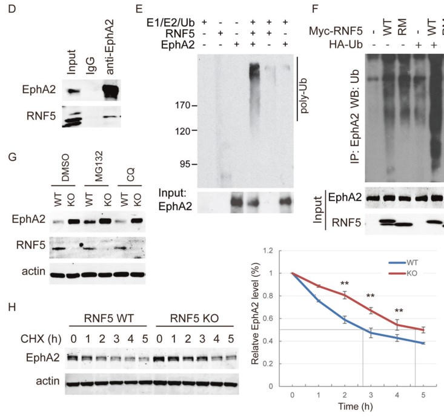

## Question

# Gene Research for Functional Annotation

## ⚠️ CRITICAL: Gene/Protein Identification Context

**BEFORE YOU BEGIN RESEARCH:** You MUST verify you are researching the CORRECT gene/protein. Gene symbols can be ambiguous, especially for less well-characterized genes from non-model organisms.

### Target Gene/Protein Identity (from UniProt):
- **UniProt Accession:** Q99942
- **Protein Description:** RecName: Full=E3 ubiquitin-protein ligase RNF5 {ECO:0000305}; EC=2.3.2.27 {ECO:0000269|PubMed:19269966, ECO:0000269|PubMed:19285439, ECO:0000269|PubMed:23093945}; AltName: Full=RING finger protein 5 {ECO:0000303|PubMed:9533025}; AltName: Full=Ram1 homolog {ECO:0000303|PubMed:16176924}; Short=HsRma1 {ECO:0000303|PubMed:16176924};
- **Gene Information:** Name=RNF5 {ECO:0000303|PubMed:9533025, ECO:0000312|HGNC:HGNC:10068}; Synonyms=G16 {ECO:0000303|Ref.3}, NG2, RMA1 {ECO:0000303|PubMed:11329381};
- **Organism (full):** Homo sapiens (Human).
- **Protein Family:** Belongs to the RNF5 family. .
- **Key Domains:** RNF5/RNF185-like. (IPR045103); Znf_RING. (IPR001841); Znf_RING/FYVE/PHD. (IPR013083); Znf_RING_CS. (IPR017907); zf-C3HC4_3 (PF13920)

### MANDATORY VERIFICATION STEPS:

1. **Check if the gene symbol "RNF5" matches the protein description above**
2. **Verify the organism is correct:** Homo sapiens (Human).
3. **Check if protein family/domains align with what you find in literature**
4. **If you find literature for a DIFFERENT gene with the same or similar symbol, STOP**

### If Gene Symbol is Ambiguous or You Cannot Find Relevant Literature:

**DO NOT PROCEED WITH RESEARCH ON A DIFFERENT GENE.** Instead:
- State clearly: "The gene symbol 'RNF5' is ambiguous or literature is limited for this specific protein"
- Explain what you found (e.g., "Found extensive literature on a different gene with the same symbol in a different organism")
- Describe the protein based ONLY on the UniProt information provided above
- Suggest that the protein function can be inferred from domain/family information

### Research Target:

Please provide a comprehensive research report on the gene **RNF5** (gene ID: RNF5, UniProt: Q99942) in human.

The research report should be a detailed narrative explaining the function, biological processes, and localization of the gene product. Citations should be given for all claims.

You should prioritize authoritative reviews and primary scientific literature when conducting research. You can supplement
this with annotations you find in gene/protein databases, but these can be outdated or inaccurate.

We are specifically interested in the primary function of the gene - for enzymes, what reaction is catalyzed, and what is the substrate specificity? For transporters, what is the substrate? For structural proteins or adapters, what is the broader structural role? For signaling molecules, what is the role in the pathway.

We are interested in where in or outside the cell the gene product carries out its function.

We are also interested in the signaling or biochemical pathways in which the gene functions. We are less interested in broad pleiotropic effects, except where these elucidate the precise role.

Include evidence where possible. We are interested in both experimental evidence as well as inference from structure, evolution, or bioinformatic analysis. Precise studies should be prioritized over high-throughput, where available.

## Output

Question: You are an expert researcher providing comprehensive, well-cited information.

Provide detailed information focusing on:
1. Key concepts and definitions with current understanding
2. Recent developments and latest research (prioritize 2023-2024 sources)
3. Current applications and real-world implementations
4. Expert opinions and analysis from authoritative sources
5. Relevant statistics and data from recent studies

Format as a comprehensive research report with proper citations. Include URLs and publication dates where available.
Always prioritize recent, authoritative sources and provide specific citations for all major claims.

# Gene Research for Functional Annotation

## ⚠️ CRITICAL: Gene/Protein Identification Context

**BEFORE YOU BEGIN RESEARCH:** You MUST verify you are researching the CORRECT gene/protein. Gene symbols can be ambiguous, especially for less well-characterized genes from non-model organisms.

### Target Gene/Protein Identity (from UniProt):
- **UniProt Accession:** Q99942
- **Protein Description:** RecName: Full=E3 ubiquitin-protein ligase RNF5 {ECO:0000305}; EC=2.3.2.27 {ECO:0000269|PubMed:19269966, ECO:0000269|PubMed:19285439, ECO:0000269|PubMed:23093945}; AltName: Full=RING finger protein 5 {ECO:0000303|PubMed:9533025}; AltName: Full=Ram1 homolog {ECO:0000303|PubMed:16176924}; Short=HsRma1 {ECO:0000303|PubMed:16176924};
- **Gene Information:** Name=RNF5 {ECO:0000303|PubMed:9533025, ECO:0000312|HGNC:HGNC:10068}; Synonyms=G16 {ECO:0000303|Ref.3}, NG2, RMA1 {ECO:0000303|PubMed:11329381};
- **Organism (full):** Homo sapiens (Human).
- **Protein Family:** Belongs to the RNF5 family. .
- **Key Domains:** RNF5/RNF185-like. (IPR045103); Znf_RING. (IPR001841); Znf_RING/FYVE/PHD. (IPR013083); Znf_RING_CS. (IPR017907); zf-C3HC4_3 (PF13920)

### MANDATORY VERIFICATION STEPS:

1. **Check if the gene symbol "RNF5" matches the protein description above**
2. **Verify the organism is correct:** Homo sapiens (Human).
3. **Check if protein family/domains align with what you find in literature**
4. **If you find literature for a DIFFERENT gene with the same or similar symbol, STOP**

### If Gene Symbol is Ambiguous or You Cannot Find Relevant Literature:

**DO NOT PROCEED WITH RESEARCH ON A DIFFERENT GENE.** Instead:
- State clearly: "The gene symbol 'RNF5' is ambiguous or literature is limited for this specific protein"
- Explain what you found (e.g., "Found extensive literature on a different gene with the same symbol in a different organism")
- Describe the protein based ONLY on the UniProt information provided above
- Suggest that the protein function can be inferred from domain/family information

### Research Target:

Please provide a comprehensive research report on the gene **RNF5** (gene ID: RNF5, UniProt: Q99942) in human.

The research report should be a detailed narrative explaining the function, biological processes, and localization of the gene product. Citations should be given for all claims.

You should prioritize authoritative reviews and primary scientific literature when conducting research. You can supplement
this with annotations you find in gene/protein databases, but these can be outdated or inaccurate.

We are specifically interested in the primary function of the gene - for enzymes, what reaction is catalyzed, and what is the substrate specificity? For transporters, what is the substrate? For structural proteins or adapters, what is the broader structural role? For signaling molecules, what is the role in the pathway.

We are interested in where in or outside the cell the gene product carries out its function.

We are also interested in the signaling or biochemical pathways in which the gene functions. We are less interested in broad pleiotropic effects, except where these elucidate the precise role.

Include evidence where possible. We are interested in both experimental evidence as well as inference from structure, evolution, or bioinformatic analysis. Precise studies should be prioritized over high-throughput, where available.

## Research report: Human **RNF5** (UniProt **Q99942**) — functional annotation, pathways, and translational relevance

### 0) Target verification (gene/protein identity)
The target is **human RNF5** (UniProt **Q99942**), also known as **RMA1**. Primary literature describes RNF5 as an **ER-anchored RING-domain E3 ubiquitin ligase** involved in ER-associated degradation (ERAD), consistent with the UniProt description provided. RNF5 is reported to be anchored to the ER membrane via a **C-terminal transmembrane segment**, positioning its RING domain in the cytosol where it engages E2~ubiquitin conjugates and substrates at the cytosolic face of the ER. (tcherpakov2009regulationofendoplasmic pages 1-1, tcherpakov2009regulationofendoplasmic pages 1-2)

### 1) Key concepts and definitions (current understanding)

#### 1.1 Ubiquitination and E3 ligases
**Ubiquitination** is a post-translational modification in which ubiquitin is covalently attached to substrate lysines through an E1–E2–E3 enzyme cascade. The **E3 ubiquitin ligase** confers substrate specificity and catalyzes ubiquitin transfer from the E2 enzyme to the substrate. Polyubiquitin chains of distinct linkages can encode different outcomes (e.g., K48-linked chains often promote proteasomal degradation, while other linkages can signal non-proteolytic functions).

RNF5 is a **RING-type E3** (Really Interesting New Gene), which typically serves as a scaffold bringing the E2~Ub and substrate together to facilitate direct ubiquitin transfer. (tcherpakov2009regulationofendoplasmic pages 1-1)

#### 1.2 ER-associated degradation (ERAD)
**ERAD** is a protein quality control pathway that targets misfolded or unassembled proteins in the endoplasmic reticulum for **retrotranslocation/dislocation** to the cytosol and degradation by the **ubiquitin–proteasome system (UPS)**. RNF5 is positioned as an ER-resident E3 that can ubiquitinate substrates during early folding/biogenesis stages and influence the assembly of ERAD machinery. (tcherpakov2009regulationofendoplasmic pages 1-2, tcherpakov2009regulationofendoplasmic pages 1-1)

#### 1.3 Innate immune adaptor control by ubiquitination
Innate immune signaling relies on adaptor proteins such as **STING** (cGAS–STING axis; DNA sensing) and **MAVS/VISA** (RIG-I-like receptor axis; RNA sensing). RNF5 can attenuate antiviral responses by promoting ubiquitination-dependent turnover of these adaptors, thereby tuning the amplitude and duration of type I interferon signaling. (ge2024rnf5inhibitingantiviral pages 2-4, yang2022e3ubiquitinligase pages 1-2)

### 2) Molecular function of RNF5 (reaction, substrate specificity)

#### 2.1 Enzymatic activity
RNF5 catalyzes the transfer of ubiquitin from an E2 enzyme to substrate proteins (EC 2.3.2.27 in UniProt; mechanistically a RING E3). Experimentally, RNF5 supports both **degradative ubiquitination** (e.g., substrates routed to proteasome) and **non-degradative “noncanonical” ubiquitination** that modulates protein interactions.

A clear example of non-degradative control is RNF5 ubiquitination of **JAMP** (JNK-associated membrane protein): RNF5-mediated ubiquitination does not destabilize JAMP but disrupts JAMP’s ability to recruit proteasomes and the AAA ATPase p97/VCP to ERAD sites, thereby reducing clearance efficiency of misfolded proteins. (tcherpakov2009regulationofendoplasmic pages 1-2, tcherpakov2009regulationofendoplasmic pages 1-1, tcherpakov2009regulationofendoplasmic pages 2-3)

#### 2.2 E2 partners and linkage logic
In the JAMP context, RNF5-mediated ubiquitination is described as **Ubc13-dependent**, consistent with noncanonical chain formation and with experimental probing of chain topology (including K63). (tcherpakov2009regulationofendoplasmic pages 1-1, tcherpakov2009regulationofendoplasmic pages 1-2)

In CFTR ERAD modules, RNF5/RMA1 functions in a network with ERAD factors and E2 enzymes (and in the broader RNF5/RNF185 module, E2s such as **Ubc6e** and **UbcH5 family members** are implicated). (khouri2013rnf185isa pages 11-13)

### 3) Subcellular localization and where RNF5 acts
RNF5 is primarily described as **ER membrane anchored** (C-terminal transmembrane segment) and acts at the ER cytosolic interface where ERAD occurs. This localization supports its roles in: 
- ERAD of nascent or misfolded secretory/membrane proteins (e.g., CFTR)
- Regulation of ER-associated scaffolds (e.g., JAMP)
- Control of innate immune signaling platforms that initiate at/near the ER (e.g., STING) (tcherpakov2009regulationofendoplasmic pages 1-1, tcherpakov2009regulationofendoplasmic pages 1-2, ge2024rnf5inhibitingantiviral pages 2-4)

### 4) Experimentally supported pathways and substrates

#### 4.1 CFTR quality control and cystic fibrosis (ERAD)
A foundational RNF5 function is targeting **CFTR** (including the major disease mutant **F508del**) for ERAD.

**Timing and checkpoints**: RNF5/RMA1 acts early, consistent with **co-translational recognition** of folding defects and early commitment of mutant CFTR to ERAD. (michael2006selectionofmisfolded pages 100-105, khouri2013rnf185isa pages 1-2)

**Cooperation and redundancy**: RNF5 and its homolog RNF185 form a functionally redundant module. In RNF185-focused work, RNF5 knockdown increased F508del CFTR steady-state levels by ~**3-fold**, RNF185 knockdown by ~**2-fold**, while **dual depletion** increased levels ~**4.5-fold** and blocked degradation during and after synthesis, highlighting redundancy and robustness in CFTR ERAD. (khouri2013rnf185isa pages 11-13, khouri2013rnf185isa pages 1-2)

**Systems-level 2024 update**: A 2024 genome-wide CRISPR screen identified **RNF5 as the top E3 hit** for CFTR-F508del ERAD, but also found that RNF5 knockout alone only modestly reduced degradation, and RNF185 emerged as a redundant ligase in sensitized screens. Importantly, clinically used correctors **tezacaftor (VX-661)** and **elexacaftor (VX-445)** stabilized sequential folding states that become **RNF5-resistant**—a mechanistic explanation for how correctors divert mutant CFTR away from RNF5-dependent ubiquitylation. (riepe2024smallmoleculecorrectorsdivert pages 1-2)

#### 4.2 ERAD regulation via JAMP
RNF5 binds and ubiquitinates JAMP in the ER membrane, producing **Ubc13-dependent noncanonical ubiquitination** that inhibits JAMP interaction with proteasome subunit Rpt5 and p97/VCP. This acts as a negative regulator of ERAD assembly at the ER, modulating proteasome recruitment rather than JAMP turnover. (tcherpakov2009regulationofendoplasmic pages 1-2, tcherpakov2009regulationofendoplasmic pages 1-1)

#### 4.3 Innate immunity: STING and MAVS (VISA)
RNF5 is described as a negative regulator of antiviral innate immunity.

**STING**: Mechanistic synthesis indicates RNF5 promotes **K48-linked polyubiquitination of STING at K150**, causing **proteasomal degradation** and limiting STING-dependent type I interferon responses. (ge2024rnf5inhibitingantiviral pages 2-4)

**MAVS/VISA**: RNF5 catalyzes **K48-linked ubiquitination of MAVS** at residues **K362 and K461**, promoting its proteasome-dependent turnover and reducing downstream signaling (TBK1/IRF3). In viral contexts, alternative linkage types and degradation routes (e.g., K27 linkage and NBR1-mediated autophagy of ubiquitinated MAVS) are also described. (ge2024rnf5inhibitingantiviral pages 2-4)

**Disease-model evidence**: In HSV-1 keratitis models, RNF5 silencing increased STING and downstream activation markers (p-TBK1, p-IRF3) and IFN-β mRNA, and reduced viral titers and inflammation in vivo, supporting RNF5 as a suppressor of protective STING/IRF3 signaling. (liu2022e3ligasernf5 pages 1-2)

#### 4.4 Viral infection biology

**SARS-CoV-2 envelope (E) protein restriction (2023)**: RNF5 ubiquitinates SARS-CoV-2 E protein at **K63 (viral lysine 63)** and promotes its degradation via the **UPS**, restricting viral replication. Proteasome inhibitor MG132 stabilized E, and a catalytically inactive RNF5 mutant (C42S) failed to promote E degradation. The study reports an RNF5 pharmacologic activator (**Analog-1**) that alleviated disease in a mouse infection model, suggesting a host-directed antiviral strategy. (li2023thee3ligase pages 1-2)

**Pseudorabies virus immune evasion (2022)**: The viral protein UL13 recruits RNF5 to STING and induces **K27/K29-linked ubiquitination** leading to STING degradation; RNF5 deficiency enhances antiviral responses and UL13-null virus is attenuated in mice, illustrating viral hijacking of RNF5. (kong2022pseudorabiesvirustegument pages 1-2)

**KSHV/primary effusion lymphoma (PEL) (2023)**: RNF5 inhibition suppressed KSHV lytic replication in PEL cells and reduced PEL xenograft growth, linking RNF5 activity to viral oncogenesis contexts. (li2023suppressionofkshv pages 1-2)

#### 4.5 Cancer signaling via Eph receptors

**EphA2 in HER2-negative breast cancer (2023)**: RNF5 directly interacts with **EphA2** (interaction depends on RNF5 membrane anchoring and EphA2 SAM domain), promotes EphA2 ubiquitination and degradation, and reduces EphA2 cell-surface distribution. RNF5 inhibition or depletion increases EphA2 levels and is associated with reduced ERK and Akt phosphorylation and increased p53 expression in HER2-negative breast cancer cells, consistent with restoring EphA2 tumor-suppressive signaling in this molecular context. (li2023downregulationofepha2 pages 2-3, li2023downregulationofepha2 pages 7-9, li2023downregulationofepha2 pages 1-2)

**In vivo and clinical association**: RNF5 depletion reduced tumor growth in MCF7 xenografts, and clinical stratification indicated that (in ER-positive, HER2-negative cases) **high EphA2** was associated with better survival, especially when **RNF5 expression was low**. (li2023downregulationofepha2 pages 7-9)

**EphA3/EphA4 in KSHV/PEL (2023)**: RNF5 ubiquitinates and degrades **EphA3/EphA4**; inhibition of RNF5 increased EphA3/A4 levels and reduced ERK/Akt activation, suppressing KSHV lytic replication and PEL xenograft growth. (li2023suppressionofkshv pages 1-2)

### 5) Recent developments (prioritizing 2023–2024)

Key 2023–2024 developments converge on RNF5 as a context-dependent regulator of (i) proteostasis, (ii) innate immunity, and (iii) receptor signaling:

1. **Host-directed SARS-CoV-2 restriction (Feb 2023)**: Identification of SARS-CoV-2 E protein as an RNF5 substrate, with ubiquitination at E(K63) and proteasomal degradation, plus in vivo benefit using an RNF5 agonist (Analog-1). (li2023thee3ligase pages 1-2)
2. **Viral oncology (Jan 2023)**: Selective RNF5 inhibition suppressing KSHV lytic replication and PEL xenograft growth via Eph receptor regulation. (li2023suppressionofkshv pages 1-2)
3. **Breast cancer mechanistic and prognostic framework (Oct 2023)**: RNF5-mediated EphA2 degradation shapes ERK/AKT signaling and correlates with improved survival when RNF5 is low and EphA2 is high in ER-positive, HER2-negative disease subsets. (li2023downregulationofepha2 pages 7-9)
4. **Focused synthesis of RNF5 in antiviral immunity (Jan 2024)**: Consolidation of linkage- and residue-level mechanisms (STING K150; MAVS K362/K461) and explicit framing of RNF5 as druggable but with conflicting roles across viruses (restriction vs facilitation) that require careful context resolution. (ge2024rnf5inhibitingantiviral pages 2-4, ge2024rnf5inhibitingantiviral pages 7-9)
5. **Systems genetics of CFTR ERAD (Feb 2024)**: CRISPR screens identifying RNF5 as top E3 for CFTR-F508del ERAD, but also demonstrating redundancy (RNF185) and showing that correctors generate folding intermediates resistant to RNF5-dependent ubiquitylation. (riepe2024smallmoleculecorrectorsdivert pages 1-2)

### 6) Current applications and real-world implementations

#### 6.1 Chemical biology tools and drug discovery (RNF5 modulators)
A major near-term application is **small-molecule modulation of RNF5** to probe ERAD and disease mechanisms.

**FX12 (RNF5 inhibitor + degrader; 2022, used as current tool)**: FX12 directly binds RNF5’s N-terminus (SPR **KD ~594 nM**) and inhibits RNF5 E3 activity in vitro; it also induces RNF5 proteasomal degradation through ERAD pathways. Quantitative cellular metrics include NHK dislocation inhibition (**IC50 ~2.7 μM**) and reduced cytotoxicity vs Stattic in HepG2 (**IC50 ~32.2 μM**). FX12 increases immature and mature ΔF508-CFTR forms and can cooperate with CFTR correctors in some systems (though it did not improve CFTR channel activity in differentiated patient-derived HBE cultures). (ruan2022asmallmoleculeinhibitor pages 3-5, ruan2022asmallmoleculeinhibitor pages 2-3, ruan2022asmallmoleculeinhibitor pages 6-7, ruan2022asmallmoleculeinhibitor pages 8-9)

**Analog-1 (RNF5 agonist; 2023)**: Reported as an RNF5 pharmacological activator that alleviates disease development in a mouse SARS-CoV-2 model, supporting the feasibility of host-directed RNF5 activation in antiviral therapy contexts. (li2023thee3ligase pages 1-2)

#### 6.2 Cystic fibrosis proteostasis targeting
While CF therapy is currently dominated by correctors/potentiators, RNF5 is a validated node in CFTR ERAD.

- Genetic evidence places RNF5/RNF185 as central and partially redundant E3s for CFTR-F508del ERAD, suggesting that combinatorial targeting of the module (or E2/E3 interfaces) may increase the pool of foldable mutant CFTR. (khouri2013rnf185isa pages 11-13, khouri2013rnf185isa pages 1-2)
- Systems screening indicates RNF5 knockout alone yields modest stabilization, reinforcing that **single-node inhibition may not be sufficient**, but could serve as an adjunct to folding correctors. (riepe2024smallmoleculecorrectorsdivert pages 1-2)

#### 6.3 Oncology: biomarker stratification and pathway targeting
RNF5 is positioned as a context-specific determinant of receptor signaling and outcomes in subsets of cancer.

- In HER2-negative breast cancer, RNF5 appears to function as a negative regulator of EphA2 tumor-suppressive signaling; clinical stratification indicates that high EphA2 with low RNF5 corresponds to better survival in ER-positive, HER2-negative cohorts. (li2023downregulationofepha2 pages 7-9)
- In KSHV-associated PEL, RNF5 inhibition reduces xenograft tumor growth and viral gene expression programs, supporting RNF5 as a target in virally driven malignancy. (li2023suppressionofkshv pages 1-2)

### 7) Expert analysis and interpretation (authoritative synthesis)

1. **RNF5 is best viewed as a compartmentalized “proteostasis–immunity switch” at the ER**: RNF5’s ER anchoring and ERAD roles place it at a central hub that connects protein quality control to innate immune signaling platforms (e.g., STING at the ER). (tcherpakov2009regulationofendoplasmic pages 1-1, ge2024rnf5inhibitingantiviral pages 2-4)
2. **Outcome depends strongly on substrate class and ubiquitin code**: RNF5 can promote canonical proteasomal degradation (e.g., STING K48-linked chains) or tune pathway assembly via noncanonical ubiquitination (JAMP), emphasizing that “RNF5 activity” is not synonymous with “substrate degradation” and must be interpreted substrate-by-substrate. (tcherpakov2009regulationofendoplasmic pages 1-2, ge2024rnf5inhibitingantiviral pages 2-4)
3. **Therapeutic direction is context-dependent**: RNF5 activation may be antiviral in SARS-CoV-2 E restriction settings, whereas RNF5 inhibition may be beneficial in KSHV/PEL and in restoring EphA2 tumor-suppressive effects in certain breast cancer contexts. The same enzyme is therefore plausibly a target for both agonism and antagonism depending on disease mechanism and dominant substrate. (li2023thee3ligase pages 1-2, li2023suppressionofkshv pages 1-2, li2023downregulationofepha2 pages 7-9)

### 8) Key statistics and quantitative findings (selected)

- **SARS-CoV-2 E**: RNF5 ubiquitinates E at **K63**, leading to UPS-dependent degradation; MG132 treatment stabilized E, and RNF5 catalytic activity is required (WT vs C42S). (li2023thee3ligase pages 1-2)
- **CFTR-F508del stabilization**: RNF5 knockdown ~**3×** increase; RNF185 knockdown ~**2×**; dual depletion ~**4.5×** increase and stronger blockade of degradation. (khouri2013rnf185isa pages 11-13)
- **FX12 binding/potency**: RNF5 binding **KD ~594 nM**; NHK dislocation inhibition **IC50 ~2.7 μM**; HepG2 growth inhibition **IC50 ~32.2 μM**. (ruan2022asmallmoleculeinhibitor pages 3-5, ruan2022asmallmoleculeinhibitor pages 2-3)
- **Mechanistic residues in innate immunity (review-synthesized)**: STING ubiquitination at **K150** (K48-linked) and MAVS at **K362/K461** (K48-linked). (ge2024rnf5inhibitingantiviral pages 2-4)

### 9) Visual evidence extracted from the literature
Figure panels from Li et al. (2023) provide visual evidence that RNF5 promotes **EphA2 ubiquitination and destabilization**, alters downstream **ERK/Akt phosphorylation**, and that EphA2/RNF5 expression stratifies **survival outcomes** in ER-positive, HER2-negative breast cancer cohorts. (li2023downregulationofepha2 media 34a12dc0, li2023downregulationofepha2 media 2176bf09, li2023downregulationofepha2 media 4503c17b, li2023downregulationofepha2 media cf4875fd)

### 10) Summary of functional annotation
RNF5 (Q99942) is an **ER-anchored RING E3 ubiquitin ligase** that:
- Executes and tunes **ERAD** (notably CFTR/F508del) and modulates ERAD scaffold function (JAMP) (khouri2013rnf185isa pages 11-13, tcherpakov2009regulationofendoplasmic pages 1-2)
- Tunes **innate antiviral signaling** by promoting ubiquitination-dependent degradation of key adaptor proteins (STING/MAVS/IRF3) with linkage- and residue-specific mechanisms (ge2024rnf5inhibitingantiviral pages 2-4, liu2022e3ligasernf5 pages 1-2)
- Intersects with **viral life cycles** (SARS-CoV-2 E restriction; PRV UL13-mediated STING degradation; KSHV lytic replication via Eph receptors) (li2023thee3ligase pages 1-2, kong2022pseudorabiesvirustegument pages 1-2, li2023suppressionofkshv pages 1-2)
- Regulates **receptor tyrosine kinase turnover** (EphA2, EphA3, EphA4) with downstream impacts on ERK/AKT and tumor phenotypes, including survival associations in specific clinical subsets (li2023downregulationofepha2 pages 7-9, li2023suppressionofkshv pages 1-2)

---

| Process/Pathway | Direct substrate(s) (human or viral) | RNF5 action (ubiquitin linkage & acceptor lysine if known) | Subcellular site | Experimental evidence type | Key source (year, journal, DOI/URL) |
|---|---|---|---|---|---|
| ER-associated degradation (ERAD) of CFTR/F508del | CFTR, CFTR-F508del (human) | RNF5/RMA1 acts early in CFTR quality control, including co-translational targeting of misfolded CFTR for proteasome-directed ERAD; cooperative/redundant with RNF185. Quantitative data: RNF5 knockdown increased F508del steady-state levels ~3-fold; RNF185 knockdown ~2-fold; dual RNF5+RNF185 depletion ~4.5-fold and blocked degradation during and after synthesis. RMA1 acts upstream of gp78/E4-like chain extension. (khouri2013rnf185isa pages 11-13, khouri2013rnf185isa pages 2-3, khouri2013rnf185isa pages 1-2, michael2006selectionofmisfolded pages 100-105, morito2008gp78cooperateswith pages 1-2) | ER membrane/cotranslational nascent-chain quality control | siRNA/knockdown, cycloheximide chase, pulse labeling, CRISPR screens, in vitro ubiquitination, interaction studies | Khouri et al. 2013, *J Biol Chem*, 10.1074/jbc.M113.470500, https://doi.org/10.1074/jbc.M113.470500; Morito et al. 2008, *Mol Biol Cell*, 10.1091/mbc.e07-06-0601, https://doi.org/10.1091/mbc.e07-06-0601; Riepe et al. 2024, *Mol Biol Cell*, 10.1091/mbc.e23-08-0336, https://doi.org/10.1091/mbc.e23-08-0336 (riepe2024smallmoleculecorrectorsdivert pages 1-2, khouri2013rnf185isa pages 11-13, morito2008gp78cooperateswith pages 1-2) |
| ERAD regulation/scaffold control | JAMP/JNK-associated membrane protein (human) | RNF5 binds JAMP via ER membrane anchoring and catalyzes Ubc13-dependent noncanonical ubiquitination; does **not** destabilize JAMP, but inhibits JAMP association with Rpt5 and p97, thereby reducing ERAD efficiency for misfolded cargos. K63-type/noncanonical chains were specifically interrogated. (tcherpakov2009regulationofendoplasmic pages 1-2, tcherpakov2009regulationofendoplasmic pages 1-1, tcherpakov2009regulationofendoplasmic pages 2-3) | ER membrane | Co-immunoprecipitation, truncation mutants, colocalization, in vitro ubiquitination, ubiquitin linkage mutant analysis | Tcherpakov et al. 2009, *J Biol Chem*, 10.1074/jbc.M808222200, https://doi.org/10.1074/jbc.M808222200 (tcherpakov2009regulationofendoplasmic pages 1-2, tcherpakov2009regulationofendoplasmic pages 1-1, tcherpakov2009regulationofendoplasmic pages 2-3) |
| Innate immunity / cGAS-STING axis | STING/TMEM173 (human) | RNF5 promotes degradative ubiquitination of STING. Best-supported mechanism: K48-linked polyubiquitination at STING K150, leading to proteasomal degradation and attenuation of type I IFN signaling; other contexts show K27/K29-linked ubiquitination when recruited by viral factors. (ge2024rnf5inhibitingantiviral pages 2-4, kong2022pseudorabiesvirustegument pages 1-2, yang2022e3ubiquitinligase pages 1-2, ge2024rnf5inhibitingantiviral pages 1-2, liu2022e3ligasernf5 pages 1-2) | ER and ER-to-Golgi innate signaling interface | Overexpression/knockdown, infection models, phospho-signaling assays, mouse disease models, review synthesis of primary studies | Yang et al. 2022, *Cell Death Dis*, 10.1038/s41419-022-05231-8, https://doi.org/10.1038/s41419-022-05231-8; Ge & Zhang 2024, *Front Immunol*, 10.3389/fimmu.2023.1324516, https://doi.org/10.3389/fimmu.2023.1324516 (ge2024rnf5inhibitingantiviral pages 2-4, yang2022e3ubiquitinligase pages 1-2) |
| Antiviral RLR signaling | MAVS/VISA (human) | RNF5 catalyzes K48-linked ubiquitination of MAVS/VISA, promoting proteasomal degradation; reported acceptor lysines K362 and K461. Consequence: reduced downstream TBK1/IRF3 activation and reduced type I IFN responses. In some viral contexts (e.g., H7N9 PB1), RNF5-dependent K27-linked ubiquitination of MAVS promotes NBR1-mediated autophagic degradation. (ge2024rnf5inhibitingantiviral pages 2-4, yang2022e3ubiquitinligase pages 1-2, ge2024rnf5inhibitingantiviral pages 1-2) | Mitochondria/mitochondria-associated membranes | Review synthesis of primary mechanistic studies; cited infection biology and ubiquitination analyses | Ge & Zhang 2024, *Front Immunol*, 10.3389/fimmu.2023.1324516, https://doi.org/10.3389/fimmu.2023.1324516; Yang et al. 2022, *Cell Death Dis*, 10.1038/s41419-022-05231-8, https://doi.org/10.1038/s41419-022-05231-8 (ge2024rnf5inhibitingantiviral pages 2-4, yang2022e3ubiquitinligase pages 1-2) |
| Antiviral transcription factor control | IRF3 (human) | RNF5 has been described as promoting degradation of IRF3, thereby suppressing antiviral innate immunity; linkage type and acceptor lysine were not specified in the available evidence here. (li2023thee3ligase pages 1-2, ge2024rnf5inhibitingantiviral pages 1-2, ge2024rnf5inhibitingantiviral pages 2-4) | Cytosolic antiviral signaling pathway downstream of STING/MAVS | Review synthesis of primary studies; signaling/infection studies | Ge & Zhang 2024, *Front Immunol*, 10.3389/fimmu.2023.1324516, https://doi.org/10.3389/fimmu.2023.1324516; Li et al. 2023, *Signal Transduct Target Ther*, 10.1038/s41392-023-01335-5, https://doi.org/10.1038/s41392-023-01335-5 (li2023thee3ligase pages 1-2, ge2024rnf5inhibitingantiviral pages 2-4) |
| SARS-CoV-2 restriction | SARS-CoV-2 envelope protein E (viral) | RNF5 directly interacts with E and ubiquitinates E at K63 (viral acceptor lysine 63), triggering ubiquitin-proteasome system degradation and restricting viral replication. Pharmacologic RNF5 activator Analog-1 alleviated disease in a mouse infection model. (li2023thee3ligase pages 1-2) | ER/ERGIC-Golgi-associated viral assembly compartments | Co-IP, ubiquitination assays, mutagenesis, infection assays, mouse model | Li et al. 2023, *Signal Transduct Target Ther*, 10.1038/s41392-023-01335-5, https://doi.org/10.1038/s41392-023-01335-5 (li2023thee3ligase pages 1-2) |
| PRV immune evasion via RNF5 | STING plus PRV UL13 cofactor (viral-host axis) | PRV UL13 binds STING and recruits RNF5 to catalyze K27- and K29-linked ubiquitination of STING, causing STING degradation and suppression of TBK1/IRF3-driven type I IFN. RNF5 deficiency enhances antiviral responses; UL13-null PRV is attenuated in mice. (kong2022pseudorabiesvirustegument pages 1-2) | STING signaling platform at ER | Viral protein interaction mapping, infection experiments, mouse virulence model | Kong et al. 2022, *PLoS Pathog*, 10.1371/journal.ppat.1010544, https://doi.org/10.1371/journal.ppat.1010544 (kong2022pseudorabiesvirustegument pages 1-2) |
| HER2-negative breast cancer signaling | EphA2 (human) | RNF5 binds EphA2 (interaction involves RNF5 membrane anchor and EphA2 SAM domain), ubiquitinates it, and promotes degradation; RNF5 loss increases total and cell-surface EphA2, decreases pERK and pAkt, shifts phosphorylation from S897 toward Y772, and increases p53 expression. Clinically, high EphA2 + low RNF5 associates with better survival in ER-positive/HER2-negative disease. (li2023downregulationofepha2 pages 7-9, li2023downregulationofepha2 pages 9-11, li2023downregulationofepha2 pages 5-7, li2023downregulationofepha2 pages 1-2, li2023downregulationofepha2 pages 2-3, li2023downregulationofepha2 pages 3-5, li2023downregulationofepha2 media 34a12dc0) | Secretory pathway / plasma membrane receptor turnover | Co-IP, in vitro ubiquitination, CHX chase, membrane fractionation, signaling assays, xenografts, Kaplan-Meier analyses | Li et al. 2023, *Cell Death Dis*, 10.1038/s41419-023-06188-y, https://doi.org/10.1038/s41419-023-06188-y (li2023downregulationofepha2 pages 7-9, li2023downregulationofepha2 pages 2-3, li2023downregulationofepha2 media 34a12dc0) |
| KSHV lytic replication / PEL tumorigenesis | EphA3, EphA4 (human) | RNF5 interacts with EphA3 and EphA4 and induces their ubiquitination and degradation; RNF5 inhibition increases EphA3/A4 abundance, reduces ERK and Akt activation, suppresses KSHV lytic replication, and decreases PEL xenograft growth. (li2023suppressionofkshv pages 1-2) | ER/secretory pathway and cell-surface receptor turnover | Pharmacologic inhibition, ubiquitination/degradation assays, signaling assays, xenografts | Li et al. 2023, *PLoS Pathog*, 10.1371/journal.ppat.1011103, https://doi.org/10.1371/journal.ppat.1011103 (li2023suppressionofkshv pages 1-2) |
| Chemical modulation / translational tool compound | RNF5 itself; downstream readouts include ΔF508-CFTR, paxillin | FX12 is a direct small-molecule RNF5 inhibitor/degrader. Quantitative stats: SPR KD ~594 nM for FX12 (FX41 ~666 nM; FX36 no detectable binding); NHK dislocation IC50 ~2.7 μM; FX12 inhibits RNF5 E3 activity, promotes proteasomal/ERAD-dependent RNF5 degradation, stabilizes ΔF508-CFTR, and cooperates with VX809/VX661 in some cell systems, though no functional rescue in differentiated HBE cultures. (ruan2022asmallmoleculeinhibitor pages 6-7, ruan2022asmallmoleculeinhibitor pages 8-9, ruan2022asmallmoleculeinhibitor pages 5-6, ruan2022asmallmoleculeinhibitor pages 3-5, ruan2022asmallmoleculeinhibitor pages 9-10, ruan2022asmallmoleculeinhibitor pages 2-3, ruan2022asmallmoleculeinhibitor pages 1-2) | RNF5 cytosolic N-terminus at ER membrane | SPR, CETSA, in vitro ubiquitination, ERAD assays, CFTR trafficking assays | Ruan et al. 2022, *Mol Biol Cell*, 10.1091/mbc.e22-06-0233, https://doi.org/10.1091/mbc.e22-06-0233 (ruan2022asmallmoleculeinhibitor pages 6-7, ruan2022asmallmoleculeinhibitor pages 5-6, ruan2022asmallmoleculeinhibitor pages 1-2) |

*Table: This table summarizes experimentally supported functions, substrates, mechanisms, and translational tools for human RNF5/Q99942 across ERAD, innate immunity, viral infection, and cancer. It also highlights quantitative details such as ubiquitinated lysines, CFTR stabilization effects, and small-molecule RNF5 modulator potency.*

References

1. (tcherpakov2009regulationofendoplasmic pages 1-1): Marianna Tcherpakov, Agnes Delaunay, Julia Toth, Takayuki Kadoya, Matthew D. Petroski, and Ze'ev A. Ronai. Regulation of endoplasmic reticulum-associated degradation by rnf5-dependent ubiquitination of jnk-associated membrane protein (jamp)*. Journal of Biological Chemistry, 284:12099-12109, May 2009. URL: https://doi.org/10.1074/jbc.m808222200, doi:10.1074/jbc.m808222200. This article has 75 citations and is from a domain leading peer-reviewed journal.

2. (tcherpakov2009regulationofendoplasmic pages 1-2): Marianna Tcherpakov, Agnes Delaunay, Julia Toth, Takayuki Kadoya, Matthew D. Petroski, and Ze'ev A. Ronai. Regulation of endoplasmic reticulum-associated degradation by rnf5-dependent ubiquitination of jnk-associated membrane protein (jamp)*. Journal of Biological Chemistry, 284:12099-12109, May 2009. URL: https://doi.org/10.1074/jbc.m808222200, doi:10.1074/jbc.m808222200. This article has 75 citations and is from a domain leading peer-reviewed journal.

3. (ge2024rnf5inhibitingantiviral pages 2-4): Junyi Ge and Leiliang Zhang. Rnf5: inhibiting antiviral immunity and shaping virus life cycle. Frontiers in Immunology, Jan 2024. URL: https://doi.org/10.3389/fimmu.2023.1324516, doi:10.3389/fimmu.2023.1324516. This article has 9 citations and is from a peer-reviewed journal.

4. (yang2022e3ubiquitinligase pages 1-2): Lu-Lu Yang, Wen-Chang Xiao, Huan Li, Zheng-Yang Hao, Gui-Zhi Liu, Dian-Hong Zhang, Lei-Ming Wu, Zheng Wang, Yan-Qing Zhang, Zhen Huang, and Yan-Zhou Zhang. E3 ubiquitin ligase rnf5 attenuates pathological cardiac hypertrophy through sting. Cell Death &amp; Disease, Oct 2022. URL: https://doi.org/10.1038/s41419-022-05231-8, doi:10.1038/s41419-022-05231-8. This article has 29 citations and is from a peer-reviewed journal.

5. (tcherpakov2009regulationofendoplasmic pages 2-3): Marianna Tcherpakov, Agnes Delaunay, Julia Toth, Takayuki Kadoya, Matthew D. Petroski, and Ze'ev A. Ronai. Regulation of endoplasmic reticulum-associated degradation by rnf5-dependent ubiquitination of jnk-associated membrane protein (jamp)*. Journal of Biological Chemistry, 284:12099-12109, May 2009. URL: https://doi.org/10.1074/jbc.m808222200, doi:10.1074/jbc.m808222200. This article has 75 citations and is from a domain leading peer-reviewed journal.

6. (khouri2013rnf185isa pages 11-13): Elma El Khouri, Gwenaëlle Le Pavec, Michel B. Toledano, and Agnès Delaunay-Moisan. Rnf185 is a novel e3 ligase of endoplasmic reticulum-associated degradation (erad) that targets cystic fibrosis transmembrane conductance regulator (cftr). Journal of Biological Chemistry, 288:31177-31191, Oct 2013. URL: https://doi.org/10.1074/jbc.m113.470500, doi:10.1074/jbc.m113.470500. This article has 124 citations and is from a domain leading peer-reviewed journal.

7. (michael2006selectionofmisfolded pages 100-105): J. Michael Younger. Selection of misfolded cftr for proteasomal degradation by sequential quality control checkpoints. Text, 2006. URL: https://doi.org/10.17615/tw77-nm22, doi:10.17615/tw77-nm22. This article has 0 citations and is from a peer-reviewed journal.

8. (khouri2013rnf185isa pages 1-2): Elma El Khouri, Gwenaëlle Le Pavec, Michel B. Toledano, and Agnès Delaunay-Moisan. Rnf185 is a novel e3 ligase of endoplasmic reticulum-associated degradation (erad) that targets cystic fibrosis transmembrane conductance regulator (cftr). Journal of Biological Chemistry, 288:31177-31191, Oct 2013. URL: https://doi.org/10.1074/jbc.m113.470500, doi:10.1074/jbc.m113.470500. This article has 124 citations and is from a domain leading peer-reviewed journal.

9. (riepe2024smallmoleculecorrectorsdivert pages 1-2): Celeste Riepe, Magda Wąchalska, Kirandeep K. Deol, Anais K. Amaya, Matthew H. Porteus, James A. Olzmann, and Ron R. Kopito. Small-molecule correctors divert cftr-f508del from erad by stabilizing sequential folding states. Molecular Biology of the Cell, Feb 2024. URL: https://doi.org/10.1091/mbc.e23-08-0336, doi:10.1091/mbc.e23-08-0336. This article has 10 citations and is from a domain leading peer-reviewed journal.

10. (liu2022e3ligasernf5 pages 1-2): Zhi Liu and Likun Xia. E3 ligase rnf5 inhibits type i interferon response in herpes simplex virus keratitis through the sting/irf3 signaling pathway. Frontiers in Microbiology, Aug 2022. URL: https://doi.org/10.3389/fmicb.2022.944101, doi:10.3389/fmicb.2022.944101. This article has 17 citations and is from a peer-reviewed journal.

11. (li2023thee3ligase pages 1-2): Zhaolong Li, Pengfei Hao, Zhilei Zhao, Wenying Gao, Chen Huan, Letian Li, Xiang Chen, Hong Wang, Ningyi Jin, Zhao-Qing Luo, Chang Li, and Wenyan Zhang. The e3 ligase rnf5 restricts sars-cov-2 replication by targeting its envelope protein for degradation. Signal Transduction and Targeted Therapy, Feb 2023. URL: https://doi.org/10.1038/s41392-023-01335-5, doi:10.1038/s41392-023-01335-5. This article has 52 citations and is from a peer-reviewed journal.

12. (kong2022pseudorabiesvirustegument pages 1-2): Zhengjie Kong, Hongyan Yin, Fan Wang, Zhen Liu, Xiaohan Luan, Lei Sun, Wenjun Liu, and Yingli Shang. Pseudorabies virus tegument protein ul13 recruits rnf5 to inhibit sting-mediated antiviral immunity. PLOS Pathogens, 18:e1010544, May 2022. URL: https://doi.org/10.1371/journal.ppat.1010544, doi:10.1371/journal.ppat.1010544. This article has 92 citations and is from a highest quality peer-reviewed journal.

13. (li2023suppressionofkshv pages 1-2): Xiaojuan Li, Fan Wang, Xiaolin Zhang, Qinqin Sun, and Ersheng Kuang. Suppression of kshv lytic replication and primary effusion lymphoma by selective rnf5 inhibition. PLOS Pathogens, 19:e1011103, Jan 2023. URL: https://doi.org/10.1371/journal.ppat.1011103, doi:10.1371/journal.ppat.1011103. This article has 16 citations and is from a highest quality peer-reviewed journal.

14. (li2023downregulationofepha2 pages 2-3): Xiaojuan Li, Fan Wang, Lu Huang, Mengtian Yang, and Ersheng Kuang. Downregulation of epha2 stability by rnf5 limits its tumor-suppressive function in her2-negative breast cancers. Cell Death &amp; Disease, Oct 2023. URL: https://doi.org/10.1038/s41419-023-06188-y, doi:10.1038/s41419-023-06188-y. This article has 8 citations and is from a peer-reviewed journal.

15. (li2023downregulationofepha2 pages 7-9): Xiaojuan Li, Fan Wang, Lu Huang, Mengtian Yang, and Ersheng Kuang. Downregulation of epha2 stability by rnf5 limits its tumor-suppressive function in her2-negative breast cancers. Cell Death &amp; Disease, Oct 2023. URL: https://doi.org/10.1038/s41419-023-06188-y, doi:10.1038/s41419-023-06188-y. This article has 8 citations and is from a peer-reviewed journal.

16. (li2023downregulationofepha2 pages 1-2): Xiaojuan Li, Fan Wang, Lu Huang, Mengtian Yang, and Ersheng Kuang. Downregulation of epha2 stability by rnf5 limits its tumor-suppressive function in her2-negative breast cancers. Cell Death &amp; Disease, Oct 2023. URL: https://doi.org/10.1038/s41419-023-06188-y, doi:10.1038/s41419-023-06188-y. This article has 8 citations and is from a peer-reviewed journal.

17. (ge2024rnf5inhibitingantiviral pages 7-9): Junyi Ge and Leiliang Zhang. Rnf5: inhibiting antiviral immunity and shaping virus life cycle. Frontiers in Immunology, Jan 2024. URL: https://doi.org/10.3389/fimmu.2023.1324516, doi:10.3389/fimmu.2023.1324516. This article has 9 citations and is from a peer-reviewed journal.

18. (ruan2022asmallmoleculeinhibitor pages 3-5): Jingjing Ruan, Dongdong Liang, Wenjing Yan, Yongwang Zhong, Daniel C. Talley, Ganesha Rai, Dingyin Tao, Christopher A. LeClair, Anton Simeonov, Yinghua Zhang, Feihu Chen, Nancy L. Quinney, Susan E. Boyles, Deborah M. Cholon, Martina Gentzsch, Mark J. Henderson, Fengtian Xue, and Shengyun Fang. A small-molecule inhibitor and degrader of the rnf5 ubiquitin ligase. Nov 2022. URL: https://doi.org/10.1091/mbc.e22-06-0233, doi:10.1091/mbc.e22-06-0233. This article has 15 citations and is from a domain leading peer-reviewed journal.

19. (ruan2022asmallmoleculeinhibitor pages 2-3): Jingjing Ruan, Dongdong Liang, Wenjing Yan, Yongwang Zhong, Daniel C. Talley, Ganesha Rai, Dingyin Tao, Christopher A. LeClair, Anton Simeonov, Yinghua Zhang, Feihu Chen, Nancy L. Quinney, Susan E. Boyles, Deborah M. Cholon, Martina Gentzsch, Mark J. Henderson, Fengtian Xue, and Shengyun Fang. A small-molecule inhibitor and degrader of the rnf5 ubiquitin ligase. Nov 2022. URL: https://doi.org/10.1091/mbc.e22-06-0233, doi:10.1091/mbc.e22-06-0233. This article has 15 citations and is from a domain leading peer-reviewed journal.

20. (ruan2022asmallmoleculeinhibitor pages 6-7): Jingjing Ruan, Dongdong Liang, Wenjing Yan, Yongwang Zhong, Daniel C. Talley, Ganesha Rai, Dingyin Tao, Christopher A. LeClair, Anton Simeonov, Yinghua Zhang, Feihu Chen, Nancy L. Quinney, Susan E. Boyles, Deborah M. Cholon, Martina Gentzsch, Mark J. Henderson, Fengtian Xue, and Shengyun Fang. A small-molecule inhibitor and degrader of the rnf5 ubiquitin ligase. Nov 2022. URL: https://doi.org/10.1091/mbc.e22-06-0233, doi:10.1091/mbc.e22-06-0233. This article has 15 citations and is from a domain leading peer-reviewed journal.

21. (ruan2022asmallmoleculeinhibitor pages 8-9): Jingjing Ruan, Dongdong Liang, Wenjing Yan, Yongwang Zhong, Daniel C. Talley, Ganesha Rai, Dingyin Tao, Christopher A. LeClair, Anton Simeonov, Yinghua Zhang, Feihu Chen, Nancy L. Quinney, Susan E. Boyles, Deborah M. Cholon, Martina Gentzsch, Mark J. Henderson, Fengtian Xue, and Shengyun Fang. A small-molecule inhibitor and degrader of the rnf5 ubiquitin ligase. Nov 2022. URL: https://doi.org/10.1091/mbc.e22-06-0233, doi:10.1091/mbc.e22-06-0233. This article has 15 citations and is from a domain leading peer-reviewed journal.

22. (li2023downregulationofepha2 media 34a12dc0): Xiaojuan Li, Fan Wang, Lu Huang, Mengtian Yang, and Ersheng Kuang. Downregulation of epha2 stability by rnf5 limits its tumor-suppressive function in her2-negative breast cancers. Cell Death &amp; Disease, Oct 2023. URL: https://doi.org/10.1038/s41419-023-06188-y, doi:10.1038/s41419-023-06188-y. This article has 8 citations and is from a peer-reviewed journal.

23. (li2023downregulationofepha2 media 2176bf09): Xiaojuan Li, Fan Wang, Lu Huang, Mengtian Yang, and Ersheng Kuang. Downregulation of epha2 stability by rnf5 limits its tumor-suppressive function in her2-negative breast cancers. Cell Death &amp; Disease, Oct 2023. URL: https://doi.org/10.1038/s41419-023-06188-y, doi:10.1038/s41419-023-06188-y. This article has 8 citations and is from a peer-reviewed journal.

24. (li2023downregulationofepha2 media 4503c17b): Xiaojuan Li, Fan Wang, Lu Huang, Mengtian Yang, and Ersheng Kuang. Downregulation of epha2 stability by rnf5 limits its tumor-suppressive function in her2-negative breast cancers. Cell Death &amp; Disease, Oct 2023. URL: https://doi.org/10.1038/s41419-023-06188-y, doi:10.1038/s41419-023-06188-y. This article has 8 citations and is from a peer-reviewed journal.

25. (li2023downregulationofepha2 media cf4875fd): Xiaojuan Li, Fan Wang, Lu Huang, Mengtian Yang, and Ersheng Kuang. Downregulation of epha2 stability by rnf5 limits its tumor-suppressive function in her2-negative breast cancers. Cell Death &amp; Disease, Oct 2023. URL: https://doi.org/10.1038/s41419-023-06188-y, doi:10.1038/s41419-023-06188-y. This article has 8 citations and is from a peer-reviewed journal.

26. (khouri2013rnf185isa pages 2-3): Elma El Khouri, Gwenaëlle Le Pavec, Michel B. Toledano, and Agnès Delaunay-Moisan. Rnf185 is a novel e3 ligase of endoplasmic reticulum-associated degradation (erad) that targets cystic fibrosis transmembrane conductance regulator (cftr). Journal of Biological Chemistry, 288:31177-31191, Oct 2013. URL: https://doi.org/10.1074/jbc.m113.470500, doi:10.1074/jbc.m113.470500. This article has 124 citations and is from a domain leading peer-reviewed journal.

27. (morito2008gp78cooperateswith pages 1-2): Daisuke Morito, Kazuyoshi Hirao, Yukako Oda, Nobuko Hosokawa, Fuminori Tokunaga, Douglas M. Cyr, Keiji Tanaka, Kazuhiro Iwai, and Kazuhiro Nagata. Gp78 cooperates with rma1 in endoplasmic reticulum-associated degradation of cftrdeltaf508. Molecular biology of the cell, 19 4:1328-36, Apr 2008. URL: https://doi.org/10.1091/mbc.e07-06-0601, doi:10.1091/mbc.e07-06-0601. This article has 278 citations and is from a domain leading peer-reviewed journal.

28. (ge2024rnf5inhibitingantiviral pages 1-2): Junyi Ge and Leiliang Zhang. Rnf5: inhibiting antiviral immunity and shaping virus life cycle. Frontiers in Immunology, Jan 2024. URL: https://doi.org/10.3389/fimmu.2023.1324516, doi:10.3389/fimmu.2023.1324516. This article has 9 citations and is from a peer-reviewed journal.

29. (li2023downregulationofepha2 pages 9-11): Xiaojuan Li, Fan Wang, Lu Huang, Mengtian Yang, and Ersheng Kuang. Downregulation of epha2 stability by rnf5 limits its tumor-suppressive function in her2-negative breast cancers. Cell Death &amp; Disease, Oct 2023. URL: https://doi.org/10.1038/s41419-023-06188-y, doi:10.1038/s41419-023-06188-y. This article has 8 citations and is from a peer-reviewed journal.

30. (li2023downregulationofepha2 pages 5-7): Xiaojuan Li, Fan Wang, Lu Huang, Mengtian Yang, and Ersheng Kuang. Downregulation of epha2 stability by rnf5 limits its tumor-suppressive function in her2-negative breast cancers. Cell Death &amp; Disease, Oct 2023. URL: https://doi.org/10.1038/s41419-023-06188-y, doi:10.1038/s41419-023-06188-y. This article has 8 citations and is from a peer-reviewed journal.

31. (li2023downregulationofepha2 pages 3-5): Xiaojuan Li, Fan Wang, Lu Huang, Mengtian Yang, and Ersheng Kuang. Downregulation of epha2 stability by rnf5 limits its tumor-suppressive function in her2-negative breast cancers. Cell Death &amp; Disease, Oct 2023. URL: https://doi.org/10.1038/s41419-023-06188-y, doi:10.1038/s41419-023-06188-y. This article has 8 citations and is from a peer-reviewed journal.

32. (ruan2022asmallmoleculeinhibitor pages 5-6): Jingjing Ruan, Dongdong Liang, Wenjing Yan, Yongwang Zhong, Daniel C. Talley, Ganesha Rai, Dingyin Tao, Christopher A. LeClair, Anton Simeonov, Yinghua Zhang, Feihu Chen, Nancy L. Quinney, Susan E. Boyles, Deborah M. Cholon, Martina Gentzsch, Mark J. Henderson, Fengtian Xue, and Shengyun Fang. A small-molecule inhibitor and degrader of the rnf5 ubiquitin ligase. Nov 2022. URL: https://doi.org/10.1091/mbc.e22-06-0233, doi:10.1091/mbc.e22-06-0233. This article has 15 citations and is from a domain leading peer-reviewed journal.

33. (ruan2022asmallmoleculeinhibitor pages 9-10): Jingjing Ruan, Dongdong Liang, Wenjing Yan, Yongwang Zhong, Daniel C. Talley, Ganesha Rai, Dingyin Tao, Christopher A. LeClair, Anton Simeonov, Yinghua Zhang, Feihu Chen, Nancy L. Quinney, Susan E. Boyles, Deborah M. Cholon, Martina Gentzsch, Mark J. Henderson, Fengtian Xue, and Shengyun Fang. A small-molecule inhibitor and degrader of the rnf5 ubiquitin ligase. Nov 2022. URL: https://doi.org/10.1091/mbc.e22-06-0233, doi:10.1091/mbc.e22-06-0233. This article has 15 citations and is from a domain leading peer-reviewed journal.

34. (ruan2022asmallmoleculeinhibitor pages 1-2): Jingjing Ruan, Dongdong Liang, Wenjing Yan, Yongwang Zhong, Daniel C. Talley, Ganesha Rai, Dingyin Tao, Christopher A. LeClair, Anton Simeonov, Yinghua Zhang, Feihu Chen, Nancy L. Quinney, Susan E. Boyles, Deborah M. Cholon, Martina Gentzsch, Mark J. Henderson, Fengtian Xue, and Shengyun Fang. A small-molecule inhibitor and degrader of the rnf5 ubiquitin ligase. Nov 2022. URL: https://doi.org/10.1091/mbc.e22-06-0233, doi:10.1091/mbc.e22-06-0233. This article has 15 citations and is from a domain leading peer-reviewed journal.

## Artifacts

- [Edison artifact artifact-00](RNF5-deep-research-falcon_artifacts/artifact-00.md)

## Citations

1. tcherpakov2009regulationofendoplasmic pages 1-1
2. riepe2024smallmoleculecorrectorsdivert pages 1-2
3. kong2022pseudorabiesvirustegument pages 1-2
4. li2023suppressionofkshv pages 1-2
5. tcherpakov2009regulationofendoplasmic pages 1-2
6. tcherpakov2009regulationofendoplasmic pages 2-3
7. michael2006selectionofmisfolded pages 100-105
8. ruan2022asmallmoleculeinhibitor pages 3-5
9. ruan2022asmallmoleculeinhibitor pages 2-3
10. ruan2022asmallmoleculeinhibitor pages 6-7
11. ruan2022asmallmoleculeinhibitor pages 8-9
12. ruan2022asmallmoleculeinhibitor pages 5-6
13. ruan2022asmallmoleculeinhibitor pages 9-10
14. ruan2022asmallmoleculeinhibitor pages 1-2
15. https://doi.org/10.1074/jbc.M113.470500;
16. https://doi.org/10.1091/mbc.e07-06-0601;
17. https://doi.org/10.1091/mbc.e23-08-0336
18. https://doi.org/10.1074/jbc.M808222200
19. https://doi.org/10.1038/s41419-022-05231-8;
20. https://doi.org/10.3389/fimmu.2023.1324516
21. https://doi.org/10.3389/fimmu.2023.1324516;
22. https://doi.org/10.1038/s41419-022-05231-8
23. https://doi.org/10.1038/s41392-023-01335-5
24. https://doi.org/10.1371/journal.ppat.1010544
25. https://doi.org/10.1038/s41419-023-06188-y
26. https://doi.org/10.1371/journal.ppat.1011103
27. https://doi.org/10.1091/mbc.e22-06-0233
28. https://doi.org/10.1074/jbc.m808222200,
29. https://doi.org/10.3389/fimmu.2023.1324516,
30. https://doi.org/10.1038/s41419-022-05231-8,
31. https://doi.org/10.1074/jbc.m113.470500,
32. https://doi.org/10.17615/tw77-nm22,
33. https://doi.org/10.1091/mbc.e23-08-0336,
34. https://doi.org/10.3389/fmicb.2022.944101,
35. https://doi.org/10.1038/s41392-023-01335-5,
36. https://doi.org/10.1371/journal.ppat.1010544,
37. https://doi.org/10.1371/journal.ppat.1011103,
38. https://doi.org/10.1038/s41419-023-06188-y,
39. https://doi.org/10.1091/mbc.e22-06-0233,
40. https://doi.org/10.1091/mbc.e07-06-0601,