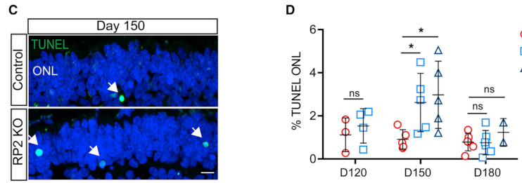

## Question

# Gene Research for Functional Annotation

## ⚠️ CRITICAL: Gene/Protein Identification Context

**BEFORE YOU BEGIN RESEARCH:** You MUST verify you are researching the CORRECT gene/protein. Gene symbols can be ambiguous, especially for less well-characterized genes from non-model organisms.

### Target Gene/Protein Identity (from UniProt):
- **UniProt Accession:** O75695
- **Protein Description:** RecName: Full=Protein XRP2;
- **Gene Information:** Name=RP2;
- **Organism (full):** Homo sapiens (Human).
- **Protein Family:** Belongs to the TBCC family. .
- **Key Domains:** C-CAP_CF_C-like. (IPR017901); CAP/MinC_C. (IPR016098); CAP_C_sf. (IPR036223); CARP_motif. (IPR006599); NDK-like_dom_sf. (IPR036850)

### MANDATORY VERIFICATION STEPS:

1. **Check if the gene symbol "RP2" matches the protein description above**
2. **Verify the organism is correct:** Homo sapiens (Human).
3. **Check if protein family/domains align with what you find in literature**
4. **If you find literature for a DIFFERENT gene with the same or similar symbol, STOP**

### If Gene Symbol is Ambiguous or You Cannot Find Relevant Literature:

**DO NOT PROCEED WITH RESEARCH ON A DIFFERENT GENE.** Instead:
- State clearly: "The gene symbol 'RP2' is ambiguous or literature is limited for this specific protein"
- Explain what you found (e.g., "Found extensive literature on a different gene with the same symbol in a different organism")
- Describe the protein based ONLY on the UniProt information provided above
- Suggest that the protein function can be inferred from domain/family information

### Research Target:

Please provide a comprehensive research report on the gene **RP2** (gene ID: RP2, UniProt: O75695) in human.

The research report should be a detailed narrative explaining the function, biological processes, and localization of the gene product. Citations should be given for all claims.

You should prioritize authoritative reviews and primary scientific literature when conducting research. You can supplement
this with annotations you find in gene/protein databases, but these can be outdated or inaccurate.

We are specifically interested in the primary function of the gene - for enzymes, what reaction is catalyzed, and what is the substrate specificity? For transporters, what is the substrate? For structural proteins or adapters, what is the broader structural role? For signaling molecules, what is the role in the pathway.

We are interested in where in or outside the cell the gene product carries out its function.

We are also interested in the signaling or biochemical pathways in which the gene functions. We are less interested in broad pleiotropic effects, except where these elucidate the precise role.

Include evidence where possible. We are interested in both experimental evidence as well as inference from structure, evolution, or bioinformatic analysis. Precise studies should be prioritized over high-throughput, where available.

## Output

Question: You are an expert researcher providing comprehensive, well-cited information.

Provide detailed information focusing on:
1. Key concepts and definitions with current understanding
2. Recent developments and latest research (prioritize 2023-2024 sources)
3. Current applications and real-world implementations
4. Expert opinions and analysis from authoritative sources
5. Relevant statistics and data from recent studies

Format as a comprehensive research report with proper citations. Include URLs and publication dates where available.
Always prioritize recent, authoritative sources and provide specific citations for all major claims.

# Gene Research for Functional Annotation

## ⚠️ CRITICAL: Gene/Protein Identification Context

**BEFORE YOU BEGIN RESEARCH:** You MUST verify you are researching the CORRECT gene/protein. Gene symbols can be ambiguous, especially for less well-characterized genes from non-model organisms.

### Target Gene/Protein Identity (from UniProt):
- **UniProt Accession:** O75695
- **Protein Description:** RecName: Full=Protein XRP2;
- **Gene Information:** Name=RP2;
- **Organism (full):** Homo sapiens (Human).
- **Protein Family:** Belongs to the TBCC family. .
- **Key Domains:** C-CAP_CF_C-like. (IPR017901); CAP/MinC_C. (IPR016098); CAP_C_sf. (IPR036223); CARP_motif. (IPR006599); NDK-like_dom_sf. (IPR036850)

### MANDATORY VERIFICATION STEPS:

1. **Check if the gene symbol "RP2" matches the protein description above**
2. **Verify the organism is correct:** Homo sapiens (Human).
3. **Check if protein family/domains align with what you find in literature**
4. **If you find literature for a DIFFERENT gene with the same or similar symbol, STOP**

### If Gene Symbol is Ambiguous or You Cannot Find Relevant Literature:

**DO NOT PROCEED WITH RESEARCH ON A DIFFERENT GENE.** Instead:
- State clearly: "The gene symbol 'RP2' is ambiguous or literature is limited for this specific protein"
- Explain what you found (e.g., "Found extensive literature on a different gene with the same symbol in a different organism")
- Describe the protein based ONLY on the UniProt information provided above
- Suggest that the protein function can be inferred from domain/family information

### Research Target:

Please provide a comprehensive research report on the gene **RP2** (gene ID: RP2, UniProt: O75695) in human.

The research report should be a detailed narrative explaining the function, biological processes, and localization of the gene product. Citations should be given for all claims.

You should prioritize authoritative reviews and primary scientific literature when conducting research. You can supplement
this with annotations you find in gene/protein databases, but these can be outdated or inaccurate.

We are specifically interested in the primary function of the gene - for enzymes, what reaction is catalyzed, and what is the substrate specificity? For transporters, what is the substrate? For structural proteins or adapters, what is the broader structural role? For signaling molecules, what is the role in the pathway.

We are interested in where in or outside the cell the gene product carries out its function.

We are also interested in the signaling or biochemical pathways in which the gene functions. We are less interested in broad pleiotropic effects, except where these elucidate the precise role.

Include evidence where possible. We are interested in both experimental evidence as well as inference from structure, evolution, or bioinformatic analysis. Precise studies should be prioritized over high-throughput, where available.

# Human RP2 (UniProt O75695): functional annotation research report

**Identity verified.** The target is human **RP2**, also called protein XRP2, a 350-amino-acid protein encoded by the X-linked *RP2* gene (ENSG00000102218). A biochemical study explicitly identifies RP2 as UniProt **O75695**; genetic and structural studies distinguish it from **RPGR**, a different X-linked retinitis pigmentosa gene. The supplied TBCC-family and CAP/CARP-related annotations are consistent with RP2’s experimentally determined N-terminal tubulin-cofactor-C-like β-helix. Its C-terminal region has a nucleoside-diphosphate-kinase-*like fold*, not established kinase activity. (bartolini2002functionaloverlapbetween pages 1-1, veltel2008specificityofarl2arl3 pages 1-2, lyraki2018characterizationofa pages 1-2, kuhnel2006crystalstructureof pages 3-5, OpenTargets Search: retinitis pigmentosa-RP2)

## Principal biochemical function

**RP2 is principally a GTPase-activating protein (GAP) for the small GTPase ARL3.** Its substrate is **GTP bound to ARL3**, and the reaction it promotes is **ARL3–GTP + H₂O → ARL3–GDP + inorganic phosphate**. RP2 is selective for ARL3 over the closely related ARL2. The N-terminal domain binds active, GTP-analogue-loaded ARL3 with a measured dissociation constant of approximately **64 nM**, about **400-fold** tighter than GDP-loaded ARL3 in the reported binding assay. Biochemical work reports acceleration of ARL3 GTP hydrolysis by up to approximately **90,000-fold** under its assay conditions; this is an *in-vitro catalytic comparison*, not a cellular reaction rate. The conserved **Arg118** is implicated as the catalytic arginine finger; disease-associated changes at or near this site impair function. These converging binding, structure, mutagenesis and enzymology results make ARL3 regulation the strongest-supported primary annotation. [Kühnel et al., February 2006, https://doi.org/10.1016/j.str.2005.11.008; Veltel et al., March 2008, https://doi.org/10.1038/nsmb.1396; Veltel et al., July 2008, https://doi.org/10.1016/j.febslet.2008.05.053.] (kuhnel2006crystalstructureof pages 5-7, veltel2008specificityofarl2arl3 pages 1-2, veltel2008specificityofarl2arl3 pages 3-5, kuhnel2006crystalstructureof pages 3-5, zhang2015mistraffickingofprenylated pages 1-2)

RP2 is **neither ARL3 itself nor a lipid-cargo transporter**. Its biochemical task is to terminate ARL3’s active GTP-bound state, thereby allowing the ARL3-dependent trafficking machinery to cycle. ARL3–GTP can associate with the carrier **UNC119/HRG4** and RP2 simultaneously: adding catalytic RP2 to an ARL3–GTP–HRG4 complex produced hydrolysis and effector release with a measured half-life of **less than 10 minutes**. The analogous stable ternary complex was *not* observed with **PDE6D**; consequently, the two carrier pathways should not be described as having identical RP2-binding intermediates. [Veltel et al., July 2008, https://doi.org/10.1016/j.febslet.2008.05.053.] (veltel2008specificityofarl2arl3 pages 3-5)

**A second, narrower biochemical activity is experimentally supported.** Owing to homology with tubulin-folding cofactor C (TBCC), RP2 stimulates **GTP hydrolysis by native tubulin in the presence of tubulin cofactor D**; cofactor E can enhance the assay but is not required. The RP2-R118H substitution abolishes this activity. Crucially, RP2 **did not replace TBCC in the tested reaction that folds tubulin subunits into native α/β heterodimers**. This is evidence of functional overlap, not proof that RP2 is a general-purpose tubulin-folding cofactor or that tubulin is its dominant physiological substrate in retina. [Bartolini et al., April 2002, https://doi.org/10.1074/jbc.M200128200.] (bartolini2002functionaloverlapbetween pages 3-4, bartolini2002functionaloverlapbetween pages 5-6, bartolini2002functionaloverlapbetween pages 1-2)

Structural analysis places the tubulin-cofactor-like region in the **N-terminal β-helix** and an NDPK-like α/β region at approximately **residues 229–350**. The latter lacks the canonical phosphohistidine—**Phe325** occupies its position—and biochemical/structural tests did not support normal nucleotide binding. RP2 therefore should **not** be assigned an NDP-kinase phosphotransferase reaction merely from fold similarity. A separate, experimentally observed RP2 interaction with **OSTF1** affects OSTF1 membrane recruitment and Myo1E-associated cell motility in cultured cells, but whether that interaction contributes materially to photoreceptor disease remains undetermined. [Kühnel et al., February 2006, https://doi.org/10.1016/j.str.2005.11.008; Lyraki et al., February 2018, https://doi.org/10.1242/jcs.211748.] (kuhnel2006crystalstructureof pages 5-7, kuhnel2006crystalstructureof pages 3-5, lyraki2018characterizationofa pages 8-10, lyraki2018characterizationofa pages 1-2)

## Where RP2 acts

RP2 is an **intracellular, membrane-associated protein**, rather than a secreted protein or a transmembrane channel. Its N-terminal **Gly2** and **Cys3** support myristoylation- and palmitoylation-dependent targeting to the cytoplasmic side of membranes. The pathogenic **ΔSer6** change disrupts normal plasma-membrane localization. In localization experiments, disrupting Gly2 prevented basal-body targeting, whereas a Cys3 mutant still reached the basal body: myristoylation is especially important for that compartment, while the two lipidation sites contribute differently to membrane distribution. [Chapple et al., August 2000, https://doi.org/10.1093/hmg/9.13.1919; Evans et al., April 2010, https://doi.org/10.1093/hmg/ddq012.] (evans2010theretinitispigmentosa pages 3-4, chapple2000mutationsinthe pages 1-2, chapple2000mutationsinthe pages 4-5)

Experimental localizations include the **plasma membrane**, **photoreceptor basal body and associated centriole**, **periciliary ridge**, and **Golgi/pericentriolar trafficking region**. This distribution places RP2 where membrane cargo moves between the photoreceptor inner segment and its specialized ciliary outer segment. An important anatomical qualification is that mouse photoreceptor immunoelectron microscopy found RP2 at the basal-body-associated region **but not within the connecting cilium itself**; human cultured-cell data likewise establish basal-body localization rather than proving that endogenous human RP2 is distributed throughout the connecting cilium. [Evans et al., April 2010, https://doi.org/10.1093/hmg/ddq012.] (evans2010theretinitispigmentosa pages 1-2, evans2010theretinitispigmentosa pages 3-4, evans2010theretinitispigmentosa pages 5-6)

## Pathway and biological consequences

The best-supported pathway is a **spatial ARL13B–ARL3–RP2 cycle for ciliary delivery of lipid-modified proteins**. Ciliary **ARL13B** promotes ARL3 activation as its guanine-nucleotide exchange factor; **ARL3–GTP** then promotes release of lipidated proteins from soluble carriers near their destination. **UNC119** binds N-myristoylated cargos, whereas **PDE6D** binds prenylated cargos. RP2 accelerates ARL3–GTP hydrolysis, resetting or spatially restricting this cargo-release system. The ciliary ARL13B-GEF versus largely membrane/ciliary-base-associated RP2-GAP arrangement is a useful mechanistic model, but precise ARL3-GTP concentrations and the full in-vivo sequence of hand-offs have not been established in human photoreceptors. [Wright et al., November 2011, https://doi.org/10.1101/gad.173443.111; Gotthardt et al., November 2015, https://doi.org/10.7554/eLife.11859; Nachury and Mick, April 2019, https://doi.org/10.1038/s41580-019-0116-4.] (wright2011anarl3unc119rp2gtpase pages 1-2, fisher2020arffamilygtpases pages 11-15)

Cargo-level evidence is selective, not universal. In a primary-cilium model, **ARL3, UNC119B and RP2** are required for efficient targeting of **myristoylated NPHP3**; ARL3–GTP promotes NPHP3 release from UNC119. NPHP3 is a cargo of **UNC119**, not a demonstrated direct substrate of RP2. In *Rp2*-null mouse photoreceptors, **PDE6** and **GRK1** were mislocalized despite relatively preserved overall abundance, consistent with impaired handling of prenylated cargo through the ARL3–PDE6D pathway. Conversely, transducin distribution and its light-dependent movement were substantially preserved in that mouse study; alternative delivery routes or compensation appear possible. Thus, loss of RP2 should **not** be said to block transport of all lipid-modified proteins. [Wright et al., November 2011, https://doi.org/10.1101/gad.173443.111; Zhang et al., March 2015, https://doi.org/10.1096/fj.14-257915.] (zhang2015mistraffickingofprenylated pages 4-6, wright2011anarl3unc119rp2gtpase pages 1-2, zhang2015mistraffickingofprenylated pages 1-2, zhang2015mistraffickingofprenylated pages 6-8)

Additional experiments connect RP2 loss to **Golgi fragmentation, reduced movement of post-Golgi vesicles and approximately twofold greater dispersion of IFT20**, consistent with a role at the Golgi-to-cilium trafficking interface. RP2/ARL3 depletion also reduces **KIF7 and KIF17 localization at ciliary tips**; the KIF7 phenotype was reproduced in RP2-mutant patient-derived cells. These findings broaden the pathway’s cellular reach, but they do not establish that RP2 physically carries IFT20 or either kinesin. [Evans et al., April 2010, https://doi.org/10.1093/hmg/ddq012; Schwarz et al., April 2017, https://doi.org/10.1093/hmg/ddx143.] (evans2010theretinitispigmentosa pages 6-7, evans2010theretinitispigmentosa pages 5-6, schwarz2017arl3andrp2 pages 5-6, schwarz2017arl3andrp2 pages 1-2)

The following evidence-tiered synthesis distinguishes biochemical functions from downstream trafficking phenotypes and preliminary therapeutic applications.

| Feature/process | Precise direct evidence and model | Inference or uncertainty | Best primary publication |
|---|---|---|---|
| **ARL3 GTPase cycle — primary function** | Human RP2 (O75695) is an ARL3-selective GAP: its N-terminal TBCC-like domain binds active ARL3 and accelerates **ARL3-GTP + H₂O → ARL3-GDP + Pᵢ** by up to ~90,000-fold. Arg118 provides the catalytic “arginine finger”; activity toward close paralogue ARL2 is minimal. RP2 can hydrolyze ARL3-GTP in an ARL3–HRG4 complex, releasing HRG4 (half-life <10 min), whereas PDE6D does not form the analogous stable ternary complex. (zhang2015mistraffickingofprenylated pages 9-10, kuhnel2006crystalstructureof pages 5-7, veltel2008specificityofarl2arl3 pages 1-2, veltel2008specificityofarl2arl3 pages 3-5) | This is the strongest-supported molecular annotation. Effectors did not further accelerate hydrolysis; ternary-complex behavior is effector-specific. | Veltel et al., 2008, *Nat Struct Mol Biol*, [10.1038/nsmb.1396](https://doi.org/10.1038/nsmb.1396); Veltel et al., 2008, *FEBS Lett*, [10.1016/j.febslet.2008.05.053](https://doi.org/10.1016/j.febslet.2008.05.053) |
| **TBCC-related tubulin activity** | With tubulin cofactor D, RP2 stimulates GTP hydrolysis by native tubulin; cofactor E enhances but is unnecessary. R118H abolishes this activity. RP2 **does not** replace TBCC/cofactor C in refolding and heterodimerization of newly synthesized α/β-tubulin. (bartolini2002functionaloverlapbetween pages 3-4, bartolini2002functionaloverlapbetween pages 2-3, bartolini2002functionaloverlapbetween pages 5-6, bartolini2002functionaloverlapbetween pages 1-2) | Demonstrates biochemical overlap with TBCC, not equivalence as a general tubulin-folding cofactor. Its physiological importance relative to ARL3 regulation remains uncertain. | Bartolini et al., 2002, *J Biol Chem*, [10.1074/jbc.M200128200](https://doi.org/10.1074/jbc.M200128200) |
| **C-terminal NDPK-like domain; OSTF1** | Residues ~229–350 form an NDPK-like ferredoxin α/β fold, but the catalytic phosphohistidine is replaced (Phe325), nucleotide binding was undetectable, and other substitutions disfavor phosphotransferase activity. A distinct surface spanning both RP2 domains binds OSTF1; RP2 recruits OSTF1 to membrane and alters OSTF1–Myo1E association and cultured-cell motility. (kuhnel2006crystalstructureof pages 5-7, kuhnel2006crystalstructureof pages 3-5, lyraki2018characterizationofa pages 8-10, lyraki2018characterizationofa pages 1-2) | Structural similarity does **not** justify annotating RP2 as a nucleoside-diphosphate kinase. OSTF1/actin remodeling has not been validated as a core photoreceptor mechanism in vivo or in retinal organoids. | Kühnel et al., 2006, *Structure*, [10.1016/j.str.2005.11.008](https://doi.org/10.1016/j.str.2005.11.008); Lyraki et al., 2018, *J Cell Sci*, [10.1242/jcs.211748](https://doi.org/10.1242/jcs.211748) |
| **Lipidation and localization** | The N-terminal Gly2/Cys3 motif supports myristoylation/palmitoylation-dependent membrane targeting; pathogenic ΔS6 disrupts targeting. RP2 is found on the cytoplasmic plasma-membrane face and at basal body/associated centriole, periciliary ridge and Golgi-related sites. Myristoylation is required for basal-body targeting, whereas C3 palmitoylation is not. Photoreceptor immuno-EM found RP2 at the basal body but **not within the connecting cilium**. (evans2010theretinitispigmentosa pages 3-4, chapple2000mutationsinthe pages 1-2, chapple2000mutationsinthe pages 4-5, evans2010theretinitispigmentosa pages 1-2) | Localization varies with cell type, construct and lipidation state. “Ciliary-base/transition-zone-associated” is safer than asserting that endogenous photoreceptor RP2 resides throughout the connecting cilium. | Chapple et al., 2000, *Hum Mol Genet*, [10.1093/hmg/9.13.1919](https://doi.org/10.1093/hmg/9.13.1919); Evans et al., 2010, *Hum Mol Genet*, [10.1093/hmg/ddq012](https://doi.org/10.1093/hmg/ddq012) |
| **UNC119–myristoylated cargo pathway** | UNC119 binds myristoylated NPHP3; ARL3-GTP releases it, and ARL3, UNC119B and RP2 are required for efficient NPHP3 ciliary targeting. This supports an ARL3–UNC119–RP2 recycling cycle. (wright2011anarl3unc119rp2gtpase pages 1-2, fisher2020arffamilygtpases pages 11-15) | NPHP3 is UNC119 cargo, **not demonstrated as a direct RP2-binding cargo**. RP2 terminates/recycles ARL3 signaling rather than carrying NPHP3 itself. | Wright et al., 2011, *Genes Dev*, [10.1101/gad.173443.111](https://doi.org/10.1101/gad.173443.111) |
| **PDE6D–prenylated cargo pathway** | In Rp2-null mouse photoreceptors, excess ARL3-GTP impairs PDE6D-mediated extraction/transport and partially mislocalizes prenylated PDE6 and GRK1 while total abundance remains near normal. Importantly, transducin localization and light-dependent movement were largely preserved, and cone-opsin findings differed among models. (zhang2015mistraffickingofprenylated pages 4-6, zhang2015mistraffickingofprenylated pages 1-2, zhang2015mistraffickingofprenylated pages 6-8) | PDE6 and GRK1 bind PDE6D, not RP2 directly. Alternative vesicular routes and model-specific compensation mean RP2 is not universally required for every lipidated photoreceptor cargo. | Zhang et al., 2015, *FASEB J*, [10.1096/fj.14-257915](https://doi.org/10.1096/fj.14-257915) |
| **Golgi/IFT20 and ciliary-tip kinesins** | RP2 depletion fragments Golgi compartments, reduces post-Golgi vesicle movement and approximately doubles dispersed IFT20. RP2 or ARL3 depletion also lowers KIF7 and KIF17 at ciliary tips; effects were reproduced in RP2-mutant fibroblasts and patient-derived optic cups. (evans2010theretinitispigmentosa pages 6-7, evans2010theretinitispigmentosa pages 5-6, schwarz2017arl3andrp2 pages 5-6, schwarz2017arl3andrp2 pages 1-2) | These data support a broader trafficking role downstream of the ARL3 cycle, but do not prove that IFT20, KIF7 or KIF17 are transported directly by RP2. | Evans et al., 2010, *Hum Mol Genet*, [10.1093/hmg/ddq012](https://doi.org/10.1093/hmg/ddq012); Schwarz et al., 2017, *Hum Mol Genet*, [10.1093/hmg/ddx143](https://doi.org/10.1093/hmg/ddx143) |
| **Gene augmentation — preclinical application** | In Rp2-KO mice, photoreceptor-directed scAAV8-RP2 preserved cone function and viability for 18 months across 5×10⁷–3×10⁸ vg/eye; 1×10⁹ vg/eye was retinally toxic. In human RP2-KO and R120X organoids, apoptosis peaked near day 150 and ONL thinning appeared by day 180. AAV2/5.CAG-RP2 at day 140 transduced 90% ± 7% of ONL cells, produced ~55-fold endogenous transcript levels and restored ONL thickness toward control. (lane2020modelingandrescue pages 5-8, mookherjee2015longtermrescueof pages 1-3, mookherjee2015longtermrescueof pages 13-15, mookherjee2015longtermrescueof pages 6-8) | Strong mouse and human-organoid proof of concept, but no demonstrated human therapeutic efficacy. Dose control is important because both excessive vector dose and RP2 overexpression may be relevant safety concerns. | Mookherjee et al., 2015, *Hum Mol Genet*, [10.1093/hmg/ddv354](https://doi.org/10.1093/hmg/ddv354); Lane et al., 2020, *Stem Cell Reports*, [10.1016/j.stemcr.2020.05.007](https://doi.org/10.1016/j.stemcr.2020.05.007) |

*Table: Evidence-tiered annotation of human RP2/O75695, separating its established ARL3-GAP activity from secondary, model-dependent trafficking functions and less-validated roles. The table also distinguishes preclinical RP2 augmentation from clinical efficacy.*

## Disease relevance, recent interpretation and applications

Pathogenic human *RP2* variants cause **X-linked retinitis pigmentosa**, with progressive photoreceptor dysfunction and loss. The strongest causal chain combines inherited variants, loss of biochemical or membrane-targeting activity, photoreceptor cargo defects, and rescue after replacing RP2. **R118H** illustrates impaired catalytic activity without simple loss of plasma-membrane targeting; **ΔSer6** illustrates the distinct consequence of failed targeting. Gene-specific diagnosis matters because **RPGR-associated trials and organoid results concern a different protein** and cannot establish RP2 treatment efficacy. [Chapple et al., August 2000, https://doi.org/10.1093/hmg/9.13.1919; Bartolini et al., April 2002, https://doi.org/10.1074/jbc.M200128200; Lane et al., July 2020, https://doi.org/10.1016/j.stemcr.2020.05.007.] (bartolini2002functionaloverlapbetween pages 1-1, bartolini2002functionaloverlapbetween pages 3-4, chapple2000mutationsinthe pages 1-2, lane2020modelingandrescue pages 1-2)

**Human disease model.** Lane and colleagues’ peer-reviewed **2020** study used both isogenic RP2-knockout and patient-derived **R120X** retinal organoids. Photoreceptor apoptosis increased around culture **day 150**, with significant outer nuclear layer thinning by **day 180** and loss of rhodopsin-positive rods; the onset of degeneration around rod maturation helps explain why the molecular defect disproportionately affects photoreceptors. AAV2/5.CAG-RP2 treatment at **day 140** yielded RP2 signal in **90% ± 7%** of outer-nuclear-layer cells and RP2 mRNA averaging **55-fold** the endogenous control level; treated organoids had substantially restored layer thickness at day 180. The relevant cropped primary-study figure panels support the temporal sequence and structural rescue. These are *organoid* measurements, not clinical response rates; high transgene expression also underscores the need to optimize dosage. [Lane et al., July 2020, https://doi.org/10.1016/j.stemcr.2020.05.007.] (lane2020modelingandrescue pages 1-2, lane2020modelingandrescue pages 8-9, lane2020modelingandrescue pages 5-8, lane2020modelingandrescue media 0d86afaf)

**Animal gene replacement and quantitative safety boundary.** In *Rp2*-knockout mice, photoreceptor-directed, self-complementary **AAV8–human RP2** preserved cone function and viability over an **18-month** observation period. Doses of **5 × 10⁷ to 3 × 10⁸ vector genomes/eye** were beneficial; **1 × 10⁹ genomes/eye** caused retinal toxicity, particularly in rods. The mouse study also observed a substantial cone-versus-rod difference at 18 months: cone ERG amplitude was approximately **33%**, while rod amplitude was approximately **78%**, of the respective comparison values. These observations should not be extrapolated directly to human dosing or imply clinical benefit. [Mookherjee et al., November 2015, https://doi.org/10.1093/hmg/ddv354.] (mookherjee2015longtermrescueof pages 1-3, mookherjee2015longtermrescueof pages 13-15, mookherjee2015longtermrescueof pages 6-8)

**What the 2023–2024 literature adds.** A **2024** review of preclinical AAV models revisited RP2 organoid augmentation and highlighted why both human organoids and animal models are needed: mouse *Rp2* phenotypes do not reliably reproduce the severity or timing of human disease, whereas organoids model human photoreceptor loss but have limits in maturation and whole-eye physiology. A second **2024** review emphasizes the importance of quality control and appropriate genetic controls for retinal iPSC models. These recent analyses strengthen interpretation of the preclinical evidence; they do **not** replace the earlier primary biochemical studies with a newly demonstrated RP2 reaction. [Alsalloum et al., October 2024, https://doi.org/10.3390/cells13201706; Seah et al., July 2024, https://doi.org/10.3389/fmed.2024.1328474; McDonald and Wijnholds, March 2024, https://doi.org/10.3390/ijms25052887.] (alsalloum2024acomparativeanalysis pages 19-20, seah2024modelinginheritedretinal pages 5-6)

**Current implementation and clinical status.** Molecular testing for an *RP2* variant is already relevant to diagnosis, counseling and enrolment in genotype-specific research; RP2-directed gene augmentation remains **preclinical** in the cited efficacy studies. The **InsightRP2 Registry**, ClinicalTrials.gov **NCT06982417**, was first posted **21 May 2025** and is listed as a recruiting **observational** worldwide RP2 patient registry, with **200 planned participants**, collecting genetic, clinical and imaging information for natural-history and future therapy research. Its planned enrolment is **not a treatment outcome**, and the registry is **not an RP2 gene-therapy trial**. [ClinicalTrials.gov, https://clinicaltrials.gov/study/NCT06982417.] (lane2020modelingandrescue pages 5-8, mookherjee2015longtermrescueof pages 1-3, NCT06982417 chunk 1)

**Bottom line.** Annotate human **RP2/O75695** primarily as a **membrane-associated, TBCC-like ARL3 GTPase-activating protein operating at the photoreceptor ciliary-base/trafficking interface**. Record cofactor-D-dependent stimulation of tubulin GTP hydrolysis as a demonstrated but physiologically less-resolved secondary activity; do not annotate RP2 as an NDP kinase, a universal tubulin-folding cofactor, or a direct carrier of photoreceptor lipid cargo. (bartolini2002functionaloverlapbetween pages 3-4, veltel2008specificityofarl2arl3 pages 1-2, kuhnel2006crystalstructureof pages 3-5, evans2010theretinitispigmentosa pages 3-4, wright2011anarl3unc119rp2gtpase pages 1-2, zhang2015mistraffickingofprenylated pages 6-8)

References

1. (bartolini2002functionaloverlapbetween pages 1-1): Francesca Bartolini, Arunashree Bhamidipati, Scott Thomas, Uwe Schwahn, Sally A. Lewis, and Nicholas J. Cowan. Functional overlap between retinitis pigmentosa 2 protein and the tubulin-specific chaperone cofactor c*. The Journal of Biological Chemistry, 277:14629-14634, Apr 2002. URL: https://doi.org/10.1074/jbc.m200128200, doi:10.1074/jbc.m200128200. This article has 142 citations.

2. (veltel2008specificityofarl2arl3 pages 1-2): Stefan Veltel, Aleksandra Kravchenko, Shehab Ismail, and Alfred Wittinghofer. Specificity of arl2/arl3 signaling is mediated by a ternary arl3‐effector‐gap complex. FEBS Letters, Jul 2008. URL: https://doi.org/10.1016/j.febslet.2008.05.053, doi:10.1016/j.febslet.2008.05.053. This article has 83 citations and is from a peer-reviewed journal.

3. (lyraki2018characterizationofa pages 1-2): Rodanthi Lyraki, Mandy Lokaj, Dinesh C. Soares, Abigail Little, Matthieu Vermeren, Joseph A. Marsh, Alfred Wittinghofer, and Toby Hurd. Characterization of a novel rp2–ostf1 interaction and its implication for actin remodelling. Journal of Cell Science, Feb 2018. URL: https://doi.org/10.1242/jcs.211748, doi:10.1242/jcs.211748. This article has 23 citations and is from a domain leading peer-reviewed journal.

4. (kuhnel2006crystalstructureof pages 3-5): Karin Kühnel, Stefan Veltel, Ilme Schlichting, and Alfred Wittinghofer. Crystal structure of the human retinitis pigmentosa 2 protein and its interaction with arl3. Structure, 14 2:367-78, Feb 2006. URL: https://doi.org/10.1016/j.str.2005.11.008, doi:10.1016/j.str.2005.11.008. This article has 95 citations and is from a domain leading peer-reviewed journal.

5. (OpenTargets Search: retinitis pigmentosa-RP2): Open Targets Query (retinitis pigmentosa-RP2, 33 results). Buniello, A. et al. (2025). Open Targets Platform: facilitating therapeutic hypotheses building in drug discovery. Nucleic Acids Research.

6. (kuhnel2006crystalstructureof pages 5-7): Karin Kühnel, Stefan Veltel, Ilme Schlichting, and Alfred Wittinghofer. Crystal structure of the human retinitis pigmentosa 2 protein and its interaction with arl3. Structure, 14 2:367-78, Feb 2006. URL: https://doi.org/10.1016/j.str.2005.11.008, doi:10.1016/j.str.2005.11.008. This article has 95 citations and is from a domain leading peer-reviewed journal.

7. (veltel2008specificityofarl2arl3 pages 3-5): Stefan Veltel, Aleksandra Kravchenko, Shehab Ismail, and Alfred Wittinghofer. Specificity of arl2/arl3 signaling is mediated by a ternary arl3‐effector‐gap complex. FEBS Letters, Jul 2008. URL: https://doi.org/10.1016/j.febslet.2008.05.053, doi:10.1016/j.febslet.2008.05.053. This article has 83 citations and is from a peer-reviewed journal.

8. (zhang2015mistraffickingofprenylated pages 1-2): Houbin Zhang, Christin Hanke‐Gogokhia, Li Jiang, Xiaobo Li, Pu Wang, Cecilia D. Gerstner, Jeanne M. Frederick, Zhenglin Yang, and Wolfgang Baehr. Mistrafficking of prenylated proteins causes retinitis pigmentosa 2. The FASEB Journal, 29:932-942, Mar 2015. URL: https://doi.org/10.1096/fj.14-257915, doi:10.1096/fj.14-257915. This article has 80 citations.

9. (bartolini2002functionaloverlapbetween pages 3-4): Francesca Bartolini, Arunashree Bhamidipati, Scott Thomas, Uwe Schwahn, Sally A. Lewis, and Nicholas J. Cowan. Functional overlap between retinitis pigmentosa 2 protein and the tubulin-specific chaperone cofactor c*. The Journal of Biological Chemistry, 277:14629-14634, Apr 2002. URL: https://doi.org/10.1074/jbc.m200128200, doi:10.1074/jbc.m200128200. This article has 142 citations.

10. (bartolini2002functionaloverlapbetween pages 5-6): Francesca Bartolini, Arunashree Bhamidipati, Scott Thomas, Uwe Schwahn, Sally A. Lewis, and Nicholas J. Cowan. Functional overlap between retinitis pigmentosa 2 protein and the tubulin-specific chaperone cofactor c*. The Journal of Biological Chemistry, 277:14629-14634, Apr 2002. URL: https://doi.org/10.1074/jbc.m200128200, doi:10.1074/jbc.m200128200. This article has 142 citations.

11. (bartolini2002functionaloverlapbetween pages 1-2): Francesca Bartolini, Arunashree Bhamidipati, Scott Thomas, Uwe Schwahn, Sally A. Lewis, and Nicholas J. Cowan. Functional overlap between retinitis pigmentosa 2 protein and the tubulin-specific chaperone cofactor c*. The Journal of Biological Chemistry, 277:14629-14634, Apr 2002. URL: https://doi.org/10.1074/jbc.m200128200, doi:10.1074/jbc.m200128200. This article has 142 citations.

12. (lyraki2018characterizationofa pages 8-10): Rodanthi Lyraki, Mandy Lokaj, Dinesh C. Soares, Abigail Little, Matthieu Vermeren, Joseph A. Marsh, Alfred Wittinghofer, and Toby Hurd. Characterization of a novel rp2–ostf1 interaction and its implication for actin remodelling. Journal of Cell Science, Feb 2018. URL: https://doi.org/10.1242/jcs.211748, doi:10.1242/jcs.211748. This article has 23 citations and is from a domain leading peer-reviewed journal.

13. (evans2010theretinitispigmentosa pages 3-4): R. Jane Evans, Nele Schwarz, Kerstin Nagel-Wolfrum, Uwe Wolfrum, Alison J. Hardcastle, and Michael E. Cheetham. The retinitis pigmentosa protein rp2 links pericentriolar vesicle transport between the golgi and the primary cilium. Human molecular genetics, 19 7:1358-67, Apr 2010. URL: https://doi.org/10.1093/hmg/ddq012, doi:10.1093/hmg/ddq012. This article has 170 citations and is from a domain leading peer-reviewed journal.

14. (chapple2000mutationsinthe pages 1-2): J. Chapple, A. Hardcastle, C. Grayson, LA Spackman, K. Willison, and M. Cheetham. Mutations in the n-terminus of the x-linked retinitis pigmentosa protein rp2 interfere with the normal targeting of the protein to the plasma membrane. Human molecular genetics, 9 13:1919-26, Aug 2000. URL: https://doi.org/10.1093/hmg/9.13.1919, doi:10.1093/hmg/9.13.1919. This article has 129 citations and is from a domain leading peer-reviewed journal.

15. (chapple2000mutationsinthe pages 4-5): J. Chapple, A. Hardcastle, C. Grayson, LA Spackman, K. Willison, and M. Cheetham. Mutations in the n-terminus of the x-linked retinitis pigmentosa protein rp2 interfere with the normal targeting of the protein to the plasma membrane. Human molecular genetics, 9 13:1919-26, Aug 2000. URL: https://doi.org/10.1093/hmg/9.13.1919, doi:10.1093/hmg/9.13.1919. This article has 129 citations and is from a domain leading peer-reviewed journal.

16. (evans2010theretinitispigmentosa pages 1-2): R. Jane Evans, Nele Schwarz, Kerstin Nagel-Wolfrum, Uwe Wolfrum, Alison J. Hardcastle, and Michael E. Cheetham. The retinitis pigmentosa protein rp2 links pericentriolar vesicle transport between the golgi and the primary cilium. Human molecular genetics, 19 7:1358-67, Apr 2010. URL: https://doi.org/10.1093/hmg/ddq012, doi:10.1093/hmg/ddq012. This article has 170 citations and is from a domain leading peer-reviewed journal.

17. (evans2010theretinitispigmentosa pages 5-6): R. Jane Evans, Nele Schwarz, Kerstin Nagel-Wolfrum, Uwe Wolfrum, Alison J. Hardcastle, and Michael E. Cheetham. The retinitis pigmentosa protein rp2 links pericentriolar vesicle transport between the golgi and the primary cilium. Human molecular genetics, 19 7:1358-67, Apr 2010. URL: https://doi.org/10.1093/hmg/ddq012, doi:10.1093/hmg/ddq012. This article has 170 citations and is from a domain leading peer-reviewed journal.

18. (wright2011anarl3unc119rp2gtpase pages 1-2): Kevin J. Wright, Lisa M. Baye, Anique Olivier-Mason, Saikat Mukhopadhyay, Liyun Sang, Mandy Kwong, Weiru Wang, Pamela R. Pretorius, Val C. Sheffield, Piali Sengupta, Diane C. Slusarski, and Peter K. Jackson. An arl3-unc119-rp2 gtpase cycle targets myristoylated nphp3 to the primary cilium. Genes & development, 25 22:2347-60, Nov 2011. URL: https://doi.org/10.1101/gad.173443.111, doi:10.1101/gad.173443.111. This article has 272 citations and is from a highest quality peer-reviewed journal.

19. (fisher2020arffamilygtpases pages 11-15): Skylar Fisher, Damian Kuna, Tamara Caspary, Richard A. Kahn, and Elizabeth Sztul. Arf family gtpases with links to cilia. American Journal of Physiology-Cell Physiology, 319:C404-C418, Aug 2020. URL: https://doi.org/10.1152/ajpcell.00188.2020, doi:10.1152/ajpcell.00188.2020. This article has 46 citations.

20. (zhang2015mistraffickingofprenylated pages 4-6): Houbin Zhang, Christin Hanke‐Gogokhia, Li Jiang, Xiaobo Li, Pu Wang, Cecilia D. Gerstner, Jeanne M. Frederick, Zhenglin Yang, and Wolfgang Baehr. Mistrafficking of prenylated proteins causes retinitis pigmentosa 2. The FASEB Journal, 29:932-942, Mar 2015. URL: https://doi.org/10.1096/fj.14-257915, doi:10.1096/fj.14-257915. This article has 80 citations.

21. (zhang2015mistraffickingofprenylated pages 6-8): Houbin Zhang, Christin Hanke‐Gogokhia, Li Jiang, Xiaobo Li, Pu Wang, Cecilia D. Gerstner, Jeanne M. Frederick, Zhenglin Yang, and Wolfgang Baehr. Mistrafficking of prenylated proteins causes retinitis pigmentosa 2. The FASEB Journal, 29:932-942, Mar 2015. URL: https://doi.org/10.1096/fj.14-257915, doi:10.1096/fj.14-257915. This article has 80 citations.

22. (evans2010theretinitispigmentosa pages 6-7): R. Jane Evans, Nele Schwarz, Kerstin Nagel-Wolfrum, Uwe Wolfrum, Alison J. Hardcastle, and Michael E. Cheetham. The retinitis pigmentosa protein rp2 links pericentriolar vesicle transport between the golgi and the primary cilium. Human molecular genetics, 19 7:1358-67, Apr 2010. URL: https://doi.org/10.1093/hmg/ddq012, doi:10.1093/hmg/ddq012. This article has 170 citations and is from a domain leading peer-reviewed journal.

23. (schwarz2017arl3andrp2 pages 5-6): Nele Schwarz, Amelia Lane, Katarina Jovanovic, David A. Parfitt, Monica Aguila, Clare L. Thompson, Lyndon da Cruz, Peter J. Coffey, J. Paul Chapple, Alison J. Hardcastle, and Michael E. Cheetham. Arl3 and rp2 regulate the trafficking of ciliary tip kinesins. Human Molecular Genetics, 26:2480-2492, Apr 2017. URL: https://doi.org/10.1093/hmg/ddx143, doi:10.1093/hmg/ddx143. This article has 99 citations and is from a domain leading peer-reviewed journal.

24. (schwarz2017arl3andrp2 pages 1-2): Nele Schwarz, Amelia Lane, Katarina Jovanovic, David A. Parfitt, Monica Aguila, Clare L. Thompson, Lyndon da Cruz, Peter J. Coffey, J. Paul Chapple, Alison J. Hardcastle, and Michael E. Cheetham. Arl3 and rp2 regulate the trafficking of ciliary tip kinesins. Human Molecular Genetics, 26:2480-2492, Apr 2017. URL: https://doi.org/10.1093/hmg/ddx143, doi:10.1093/hmg/ddx143. This article has 99 citations and is from a domain leading peer-reviewed journal.

25. (zhang2015mistraffickingofprenylated pages 9-10): Houbin Zhang, Christin Hanke‐Gogokhia, Li Jiang, Xiaobo Li, Pu Wang, Cecilia D. Gerstner, Jeanne M. Frederick, Zhenglin Yang, and Wolfgang Baehr. Mistrafficking of prenylated proteins causes retinitis pigmentosa 2. The FASEB Journal, 29:932-942, Mar 2015. URL: https://doi.org/10.1096/fj.14-257915, doi:10.1096/fj.14-257915. This article has 80 citations.

26. (bartolini2002functionaloverlapbetween pages 2-3): Francesca Bartolini, Arunashree Bhamidipati, Scott Thomas, Uwe Schwahn, Sally A. Lewis, and Nicholas J. Cowan. Functional overlap between retinitis pigmentosa 2 protein and the tubulin-specific chaperone cofactor c*. The Journal of Biological Chemistry, 277:14629-14634, Apr 2002. URL: https://doi.org/10.1074/jbc.m200128200, doi:10.1074/jbc.m200128200. This article has 142 citations.

27. (lane2020modelingandrescue pages 5-8): Amelia Lane, Katarina Jovanovic, Ciara Shortall, Daniele Ottaviani, Anna Brugulat Panes, Nele Schwarz, Rosellina Guarascio, Matthew J. Hayes, Arpad Palfi, Naomi Chadderton, G. Jane Farrar, Alison J. Hardcastle, and Michael E. Cheetham. Modeling and rescue of rp2 retinitis pigmentosa using ipsc-derived retinal organoids. Stem Cell Reports, 15:67-79, Jul 2020. URL: https://doi.org/10.1016/j.stemcr.2020.05.007, doi:10.1016/j.stemcr.2020.05.007. This article has 217 citations and is from a domain leading peer-reviewed journal.

28. (mookherjee2015longtermrescueof pages 1-3): Suddhasil Mookherjee, Suja Hiriyanna, Kayleigh Kaneshiro, Linjing Li, Yichao Li, Wei Li, Haohua Qian, Tiansen Li, Hemant Khanna, Peter Colosi, Anand Swaroop, and Zhijian Wu. Long-term rescue of cone photoreceptor degeneration in retinitis pigmentosa 2 (rp2)-knockout mice by gene replacement therapy. Human molecular genetics, 24 22:6446-58, Nov 2015. URL: https://doi.org/10.1093/hmg/ddv354, doi:10.1093/hmg/ddv354. This article has 65 citations and is from a domain leading peer-reviewed journal.

29. (mookherjee2015longtermrescueof pages 13-15): Suddhasil Mookherjee, Suja Hiriyanna, Kayleigh Kaneshiro, Linjing Li, Yichao Li, Wei Li, Haohua Qian, Tiansen Li, Hemant Khanna, Peter Colosi, Anand Swaroop, and Zhijian Wu. Long-term rescue of cone photoreceptor degeneration in retinitis pigmentosa 2 (rp2)-knockout mice by gene replacement therapy. Human molecular genetics, 24 22:6446-58, Nov 2015. URL: https://doi.org/10.1093/hmg/ddv354, doi:10.1093/hmg/ddv354. This article has 65 citations and is from a domain leading peer-reviewed journal.

30. (mookherjee2015longtermrescueof pages 6-8): Suddhasil Mookherjee, Suja Hiriyanna, Kayleigh Kaneshiro, Linjing Li, Yichao Li, Wei Li, Haohua Qian, Tiansen Li, Hemant Khanna, Peter Colosi, Anand Swaroop, and Zhijian Wu. Long-term rescue of cone photoreceptor degeneration in retinitis pigmentosa 2 (rp2)-knockout mice by gene replacement therapy. Human molecular genetics, 24 22:6446-58, Nov 2015. URL: https://doi.org/10.1093/hmg/ddv354, doi:10.1093/hmg/ddv354. This article has 65 citations and is from a domain leading peer-reviewed journal.

31. (lane2020modelingandrescue pages 1-2): Amelia Lane, Katarina Jovanovic, Ciara Shortall, Daniele Ottaviani, Anna Brugulat Panes, Nele Schwarz, Rosellina Guarascio, Matthew J. Hayes, Arpad Palfi, Naomi Chadderton, G. Jane Farrar, Alison J. Hardcastle, and Michael E. Cheetham. Modeling and rescue of rp2 retinitis pigmentosa using ipsc-derived retinal organoids. Stem Cell Reports, 15:67-79, Jul 2020. URL: https://doi.org/10.1016/j.stemcr.2020.05.007, doi:10.1016/j.stemcr.2020.05.007. This article has 217 citations and is from a domain leading peer-reviewed journal.

32. (lane2020modelingandrescue pages 8-9): Amelia Lane, Katarina Jovanovic, Ciara Shortall, Daniele Ottaviani, Anna Brugulat Panes, Nele Schwarz, Rosellina Guarascio, Matthew J. Hayes, Arpad Palfi, Naomi Chadderton, G. Jane Farrar, Alison J. Hardcastle, and Michael E. Cheetham. Modeling and rescue of rp2 retinitis pigmentosa using ipsc-derived retinal organoids. Stem Cell Reports, 15:67-79, Jul 2020. URL: https://doi.org/10.1016/j.stemcr.2020.05.007, doi:10.1016/j.stemcr.2020.05.007. This article has 217 citations and is from a domain leading peer-reviewed journal.

33. (lane2020modelingandrescue media 0d86afaf): Amelia Lane, Katarina Jovanovic, Ciara Shortall, Daniele Ottaviani, Anna Brugulat Panes, Nele Schwarz, Rosellina Guarascio, Matthew J. Hayes, Arpad Palfi, Naomi Chadderton, G. Jane Farrar, Alison J. Hardcastle, and Michael E. Cheetham. Modeling and rescue of rp2 retinitis pigmentosa using ipsc-derived retinal organoids. Stem Cell Reports, 15:67-79, Jul 2020. URL: https://doi.org/10.1016/j.stemcr.2020.05.007, doi:10.1016/j.stemcr.2020.05.007. This article has 217 citations and is from a domain leading peer-reviewed journal.

34. (alsalloum2024acomparativeanalysis pages 19-20): Almaqdad Alsalloum, Ekaterina Gornostal, Natalia Mingaleva, Roman Pavlov, Ekaterina Kuznetsova, Ekaterina Antonova, Aygun Nadzhafova, Daria Kolotova, Vitaly Kadyshev, Olga Mityaeva, and Pavel Volchkov. A comparative analysis of models for aav-mediated gene therapy for inherited retinal diseases. Oct 2024. URL: https://doi.org/10.3390/cells13201706, doi:10.3390/cells13201706. This article has 18 citations.

35. (seah2024modelinginheritedretinal pages 5-6): Ivan Seah, Debbie Goh, Animesh Banerjee, and Xinyi Su. Modeling inherited retinal diseases using human induced pluripotent stem cell derived photoreceptor cells and retinal pigment epithelial cells. Frontiers in Medicine, Jul 2024. URL: https://doi.org/10.3389/fmed.2024.1328474, doi:10.3389/fmed.2024.1328474. This article has 10 citations.

36. (NCT06982417 chunk 1): Nina Bogershausen. InsightRP2 Registry. University of Göttingen. 2025. ClinicalTrials.gov Identifier: NCT06982417

## Artifacts

- [Edison artifact artifact-00](RP2-deep-research-falcon_artifacts/artifact-00.md)

## Citations

1. bartolini2002functionaloverlapbetween pages 1-1
2. lyraki2018characterizationofa pages 1-2
3. kuhnel2006crystalstructureof pages 3-5
4. kuhnel2006crystalstructureof pages 5-7
5. zhang2015mistraffickingofprenylated pages 1-2
6. bartolini2002functionaloverlapbetween pages 3-4
7. bartolini2002functionaloverlapbetween pages 5-6
8. bartolini2002functionaloverlapbetween pages 1-2
9. lyraki2018characterizationofa pages 8-10
10. evans2010theretinitispigmentosa pages 3-4
11. chapple2000mutationsinthe pages 1-2
12. chapple2000mutationsinthe pages 4-5
13. evans2010theretinitispigmentosa pages 1-2
14. evans2010theretinitispigmentosa pages 5-6
15. fisher2020arffamilygtpases pages 11-15
16. zhang2015mistraffickingofprenylated pages 4-6
17. zhang2015mistraffickingofprenylated pages 6-8
18. evans2010theretinitispigmentosa pages 6-7
19. zhang2015mistraffickingofprenylated pages 9-10
20. bartolini2002functionaloverlapbetween pages 2-3
21. lane2020modelingandrescue pages 5-8
22. mookherjee2015longtermrescueof pages 1-3
23. mookherjee2015longtermrescueof pages 13-15
24. mookherjee2015longtermrescueof pages 6-8
25. lane2020modelingandrescue pages 1-2
26. lane2020modelingandrescue pages 8-9
27. alsalloum2024acomparativeanalysis pages 19-20
28. seah2024modelinginheritedretinal pages 5-6
29. Kühnel et al., February 2006, https://doi.org/10.1016/j.str.2005.11.008; Veltel et al., March 2008, https://doi.org/10.1038/nsmb.1396; Veltel et al., July 2008, https://doi.org/10.1016/j.febslet.2008.05.053.
30. Veltel et al., July 2008, https://doi.org/10.1016/j.febslet.2008.05.053.
31. Bartolini et al., April 2002, https://doi.org/10.1074/jbc.M200128200.
32. Kühnel et al., February 2006, https://doi.org/10.1016/j.str.2005.11.008; Lyraki et al., February 2018, https://doi.org/10.1242/jcs.211748.
33. Chapple et al., August 2000, https://doi.org/10.1093/hmg/9.13.1919; Evans et al., April 2010, https://doi.org/10.1093/hmg/ddq012.
34. Evans et al., April 2010, https://doi.org/10.1093/hmg/ddq012.
35. Wright et al., November 2011, https://doi.org/10.1101/gad.173443.111; Gotthardt et al., November 2015, https://doi.org/10.7554/eLife.11859; Nachury and Mick, April 2019, https://doi.org/10.1038/s41580-019-0116-4.
36. Wright et al., November 2011, https://doi.org/10.1101/gad.173443.111; Zhang et al., March 2015, https://doi.org/10.1096/fj.14-257915.
37. Evans et al., April 2010, https://doi.org/10.1093/hmg/ddq012; Schwarz et al., April 2017, https://doi.org/10.1093/hmg/ddx143.
38. 10.1038/nsmb.1396
39. 10.1016/j.febslet.2008.05.053
40. 10.1074/jbc.M200128200
41. 10.1016/j.str.2005.11.008
42. 10.1242/jcs.211748
43. 10.1093/hmg/9.13.1919
44. 10.1093/hmg/ddq012
45. 10.1101/gad.173443.111
46. 10.1096/fj.14-257915
47. 10.1093/hmg/ddx143
48. 10.1093/hmg/ddv354
49. 10.1016/j.stemcr.2020.05.007
50. Chapple et al., August 2000, https://doi.org/10.1093/hmg/9.13.1919; Bartolini et al., April 2002, https://doi.org/10.1074/jbc.M200128200; Lane et al., July 2020, https://doi.org/10.1016/j.stemcr.2020.05.007.
51. Lane et al., July 2020, https://doi.org/10.1016/j.stemcr.2020.05.007.
52. Mookherjee et al., November 2015, https://doi.org/10.1093/hmg/ddv354.
53. Alsalloum et al., October 2024, https://doi.org/10.3390/cells13201706; Seah et al., July 2024, https://doi.org/10.3389/fmed.2024.1328474; McDonald and Wijnholds, March 2024, https://doi.org/10.3390/ijms25052887.
54. ClinicalTrials.gov, https://clinicaltrials.gov/study/NCT06982417.
55. https://doi.org/10.1016/j.str.2005.11.008;
56. https://doi.org/10.1038/nsmb.1396;
57. https://doi.org/10.1016/j.febslet.2008.05.053.]
58. https://doi.org/10.1074/jbc.M200128200.]
59. https://doi.org/10.1242/jcs.211748.]
60. https://doi.org/10.1093/hmg/9.13.1919;
61. https://doi.org/10.1093/hmg/ddq012.]
62. https://doi.org/10.1101/gad.173443.111;
63. https://doi.org/10.7554/eLife.11859;
64. https://doi.org/10.1038/s41580-019-0116-4.]
65. https://doi.org/10.1096/fj.14-257915.]
66. https://doi.org/10.1093/hmg/ddq012;
67. https://doi.org/10.1093/hmg/ddx143.]
68. https://doi.org/10.1038/nsmb.1396
69. https://doi.org/10.1016/j.febslet.2008.05.053
70. https://doi.org/10.1074/jbc.M200128200
71. https://doi.org/10.1016/j.str.2005.11.008
72. https://doi.org/10.1242/jcs.211748
73. https://doi.org/10.1093/hmg/9.13.1919
74. https://doi.org/10.1093/hmg/ddq012
75. https://doi.org/10.1101/gad.173443.111
76. https://doi.org/10.1096/fj.14-257915
77. https://doi.org/10.1093/hmg/ddx143
78. https://doi.org/10.1093/hmg/ddv354
79. https://doi.org/10.1016/j.stemcr.2020.05.007
80. https://doi.org/10.1074/jbc.M200128200;
81. https://doi.org/10.1016/j.stemcr.2020.05.007.]
82. https://doi.org/10.1093/hmg/ddv354.]
83. https://doi.org/10.3390/cells13201706;
84. https://doi.org/10.3389/fmed.2024.1328474;
85. https://doi.org/10.3390/ijms25052887.]
86. https://clinicaltrials.gov/study/NCT06982417.]
87. https://doi.org/10.1074/jbc.m200128200,
88. https://doi.org/10.1016/j.febslet.2008.05.053,
89. https://doi.org/10.1242/jcs.211748,
90. https://doi.org/10.1016/j.str.2005.11.008,
91. https://doi.org/10.1096/fj.14-257915,
92. https://doi.org/10.1093/hmg/ddq012,
93. https://doi.org/10.1093/hmg/9.13.1919,
94. https://doi.org/10.1101/gad.173443.111,
95. https://doi.org/10.1152/ajpcell.00188.2020,
96. https://doi.org/10.1093/hmg/ddx143,
97. https://doi.org/10.1016/j.stemcr.2020.05.007,
98. https://doi.org/10.1093/hmg/ddv354,
99. https://doi.org/10.3390/cells13201706,
100. https://doi.org/10.3389/fmed.2024.1328474,