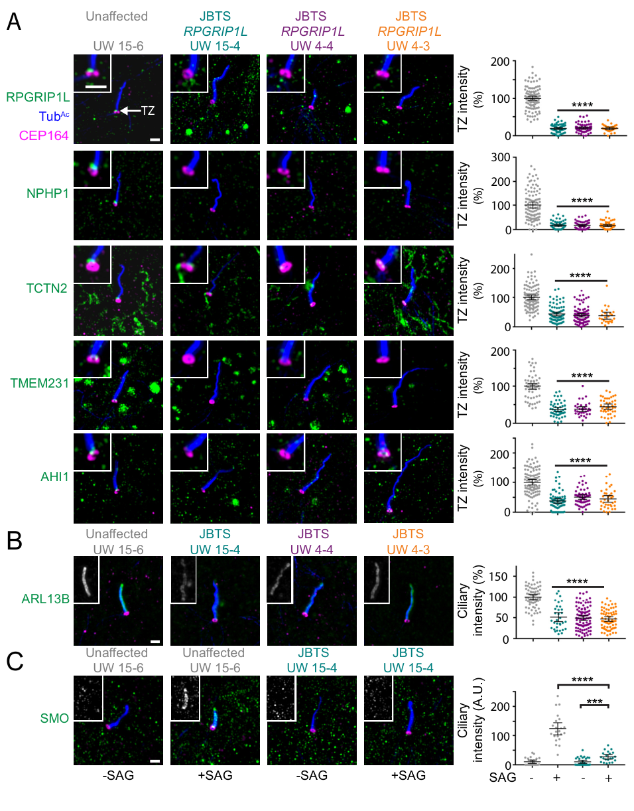

## Question

# Gene Research for Functional Annotation

## ⚠️ CRITICAL: Gene/Protein Identification Context

**BEFORE YOU BEGIN RESEARCH:** You MUST verify you are researching the CORRECT gene/protein. Gene symbols can be ambiguous, especially for less well-characterized genes from non-model organisms.

### Target Gene/Protein Identity (from UniProt):
- **UniProt Accession:** Q68CZ1
- **Protein Description:** RecName: Full=Protein fantom; AltName: Full=Nephrocystin-8; AltName: Full=RPGR-interacting protein 1-like protein; Short=RPGRIP1-like protein;
- **Gene Information:** Name=RPGRIP1L; Synonyms=FTM, KIAA1005, NPHP8;
- **Organism (full):** Homo sapiens (Human).
- **Protein Family:** Belongs to the RPGRIP1 family. .
- **Key Domains:** C2-C2_1. (IPR021656); C2_dom. (IPR000008); C2_domain_sf. (IPR035892); RPGRIP1_C. (IPR041091); RPGRIP1_fam. (IPR031139)

### MANDATORY VERIFICATION STEPS:

1. **Check if the gene symbol "RPGRIP1L" matches the protein description above**
2. **Verify the organism is correct:** Homo sapiens (Human).
3. **Check if protein family/domains align with what you find in literature**
4. **If you find literature for a DIFFERENT gene with the same or similar symbol, STOP**

### If Gene Symbol is Ambiguous or You Cannot Find Relevant Literature:

**DO NOT PROCEED WITH RESEARCH ON A DIFFERENT GENE.** Instead:
- State clearly: "The gene symbol 'RPGRIP1L' is ambiguous or literature is limited for this specific protein"
- Explain what you found (e.g., "Found extensive literature on a different gene with the same symbol in a different organism")
- Describe the protein based ONLY on the UniProt information provided above
- Suggest that the protein function can be inferred from domain/family information

### Research Target:

Please provide a comprehensive research report on the gene **RPGRIP1L** (gene ID: RPGRIP1L, UniProt: Q68CZ1) in human.

The research report should be a detailed narrative explaining the function, biological processes, and localization of the gene product. Citations should be given for all claims.

You should prioritize authoritative reviews and primary scientific literature when conducting research. You can supplement
this with annotations you find in gene/protein databases, but these can be outdated or inaccurate.

We are specifically interested in the primary function of the gene - for enzymes, what reaction is catalyzed, and what is the substrate specificity? For transporters, what is the substrate? For structural proteins or adapters, what is the broader structural role? For signaling molecules, what is the role in the pathway.

We are interested in where in or outside the cell the gene product carries out its function.

We are also interested in the signaling or biochemical pathways in which the gene functions. We are less interested in broad pleiotropic effects, except where these elucidate the precise role.

Include evidence where possible. We are interested in both experimental evidence as well as inference from structure, evolution, or bioinformatic analysis. Precise studies should be prioritized over high-throughput, where available.

## Output

Question: You are an expert researcher providing comprehensive, well-cited information.

Provide detailed information focusing on:
1. Key concepts and definitions with current understanding
2. Recent developments and latest research (prioritize 2023-2024 sources)
3. Current applications and real-world implementations
4. Expert opinions and analysis from authoritative sources
5. Relevant statistics and data from recent studies

Format as a comprehensive research report with proper citations. Include URLs and publication dates where available.
Always prioritize recent, authoritative sources and provide specific citations for all major claims.

# Gene Research for Functional Annotation

## ⚠️ CRITICAL: Gene/Protein Identification Context

**BEFORE YOU BEGIN RESEARCH:** You MUST verify you are researching the CORRECT gene/protein. Gene symbols can be ambiguous, especially for less well-characterized genes from non-model organisms.

### Target Gene/Protein Identity (from UniProt):
- **UniProt Accession:** Q68CZ1
- **Protein Description:** RecName: Full=Protein fantom; AltName: Full=Nephrocystin-8; AltName: Full=RPGR-interacting protein 1-like protein; Short=RPGRIP1-like protein;
- **Gene Information:** Name=RPGRIP1L; Synonyms=FTM, KIAA1005, NPHP8;
- **Organism (full):** Homo sapiens (Human).
- **Protein Family:** Belongs to the RPGRIP1 family. .
- **Key Domains:** C2-C2_1. (IPR021656); C2_dom. (IPR000008); C2_domain_sf. (IPR035892); RPGRIP1_C. (IPR041091); RPGRIP1_fam. (IPR031139)

### MANDATORY VERIFICATION STEPS:

1. **Check if the gene symbol "RPGRIP1L" matches the protein description above**
2. **Verify the organism is correct:** Homo sapiens (Human).
3. **Check if protein family/domains align with what you find in literature**
4. **If you find literature for a DIFFERENT gene with the same or similar symbol, STOP**

### If Gene Symbol is Ambiguous or You Cannot Find Relevant Literature:

**DO NOT PROCEED WITH RESEARCH ON A DIFFERENT GENE.** Instead:
- State clearly: "The gene symbol 'RPGRIP1L' is ambiguous or literature is limited for this specific protein"
- Explain what you found (e.g., "Found extensive literature on a different gene with the same symbol in a different organism")
- Describe the protein based ONLY on the UniProt information provided above
- Suggest that the protein function can be inferred from domain/family information

### Research Target:

Please provide a comprehensive research report on the gene **RPGRIP1L** (gene ID: RPGRIP1L, UniProt: Q68CZ1) in human.

The research report should be a detailed narrative explaining the function, biological processes, and localization of the gene product. Citations should be given for all claims.

You should prioritize authoritative reviews and primary scientific literature when conducting research. You can supplement
this with annotations you find in gene/protein databases, but these can be outdated or inaccurate.

We are specifically interested in the primary function of the gene - for enzymes, what reaction is catalyzed, and what is the substrate specificity? For transporters, what is the substrate? For structural proteins or adapters, what is the broader structural role? For signaling molecules, what is the role in the pathway.

We are interested in where in or outside the cell the gene product carries out its function.

We are also interested in the signaling or biochemical pathways in which the gene functions. We are less interested in broad pleiotropic effects, except where these elucidate the precise role.

Include evidence where possible. We are interested in both experimental evidence as well as inference from structure, evolution, or bioinformatic analysis. Precise studies should be prioritized over high-throughput, where available.

# Human RPGRIP1L: functional annotation research report

**Identity and scope.** The target is human **RPGRIP1L**, UniProt **Q68CZ1** as specified in the question, also called **FTM/Fantom** and **NPHP8 (nephrocystin-8)**. This is **not RPGRIP1**: the two are related, distinct proteins with overlapping but nonidentical functions. Published sequence analyses describe RPGRIP1L as a coiled-coil-containing protein with C2 domains and a C-terminal RPGR-interacting region, consistent with the supplied RPGRIP1-family and InterPro annotations. The C2 architecture suggests potential membrane-associated interactions, but sequence prediction alone does not demonstrate lipid binding by human RPGRIP1L. (patnaik2015theroleof pages 4-6, coene2011theciliopathyassociatedprotein pages 1-2, zhang2012noveltransglutaminaselikepeptidase pages 3-4)

## Primary function and cellular location

**RPGRIP1L is principally an organizer of the ciliary transition zone**, the short region immediately distal to the basal body where the ciliary axoneme meets the ciliary membrane. It helps assemble or position transition-zone proteins and maintain the selective barrier that gives a cilium its distinctive protein composition. It is an adaptor/assembly factor, **not an enzyme with an established catalyzed reaction or a transporter with a defined substrate**. The transition zone is a regulatory waypoint rather than a universally sealed pore: some signaling proteins must enter, whereas inappropriate cellular proteins must be excluded. This is the assessment of a 2024 *Nature Reviews Nephrology* synthesis, which calls RPGRIP1L a master assembly factor but treats specific physical “picket-fence” and lipid-barrier models as incompletely established. (jensen2015formationofthe pages 2-4, wiegering2021rpgrip1lcontrolsciliary pages 7-8, lin2018rpgrip1lhelpsto pages 1-4, moran2024transportandbarrier pages 5-6)

The strongest direct **human** anatomical evidence comes from super-resolution imaging of fibroblasts carrying Joubert-syndrome-associated RPGRIP1L variants. Transition-zone RPGRIP1L was reduced **81% ± 3%** relative to an unaffected sibling; NPHP1, TCTN2, and TMEM231 at the same site were reduced **85% ± 7%, 56% ± 5%, and 62% ± 5%**, respectively. Ciliary ARL13B fell **49% ± 6%** and agonist-stimulated ciliary SMO **78% ± 9%**. These measurements compared fibroblasts from affected individuals in two families with family controls; they quantify a cellular phenotype, **not population prevalence**. Three-dimensional imaging showed that the NPHP1 and TMEM231 transition-zone rings were lost, while residual TCTN2 could still form a ring—evidence against describing every component as absolutely dependent on RPGRIP1L. The underlying study was published by Shi and colleagues in *Nature Cell Biology* **in 2017**, DOI [10.1038/ncb3599](https://doi.org/10.1038/ncb3599); the retrieved detailed measurements and cropped **Figure 5** are from its [May 2017 preprint](https://doi.org/10.1101/142042). (shi2017superresolutionmicroscopyreveals pages 12-14, shi2017superresolutionmicroscopyreveals media 2cbf398f, munozestrada2019ahi1promotesarl13b pages 18-18)

Mechanistically, RPGRIP1L influences both nephronophthisis-associated **NPHP** proteins and Meckel-syndrome-associated **MKS** proteins at the transition zone. In *C. elegans*, MKS-5—the relevant homolog of the mammalian RPGRIP1/RPGRIP1L family—is required to recruit tested NPHP and MKS components to this region and establish transition-zone ultrastructure and a *ciliary zone of exclusion*. This supports an evolutionarily informed assembly-factor model, but nematode MKS-5 must **not** be presented as a human-RPGRIP1L-only experiment. Vertebrate experiments show an important qualification: RPGRIP1 can compensate for RPGRIP1L loss in some cell types, and combined disruption has broader effects on transition-zone modules than RPGRIP1L disruption alone. (jensen2015formationofthe pages 2-4, jensen2015formationofthe pages 7-8, wiegering2018celltype‐specificregulation pages 1-2, wiegering2018celltype‐specificregulation pages 6-9)

**A particularly well-resolved pathway is RPGRIP1L → appropriate transition-zone CEP290 abundance → ciliary protein composition.** In mouse Rpgrip1l-knockout NIH3T3 cells, expressing tagged CEP290 restored ciliary **ARL13B and SSTR3**; in human RPGRIP1L-knockout HEK293 cells, human CEP290 restored **ARL13B**. The mouse rescue quantified at least **30 cilia per clone**, and the human comparison at least **10 control or 20 knockout cilia per clone**. NPHP5 was also diminished after RPGRIP1L or CEP290 loss. Importantly, CEP290 can still reach the transition zone without RPGRIP1L, and the investigators did **not** establish direct physical RPGRIP1L–CEP290 binding: RPGRIP1L regulates CEP290’s *amount* there, not demonstrably its obligatory physical anchoring. Restoring gating did not correct every phenotype, notably abnormal ciliary length. A complementary algal RPG1 mutant accumulated **40 normally nonciliary proteins** in isolated cilia; its CCT1 chaperonin signal rose approximately **15-fold**. Those proteomic results strengthen the gate interpretation, while remaining nonhuman evidence. (wiegering2021rpgrip1lcontrolsciliary pages 3-7, wiegering2021rpgrip1lcontrolsciliary pages 7-8, lin2018rpgrip1lhelpsto pages 6-8, lin2018rpgrip1lhelpsto pages 1-4)

## Signaling and additional experimentally supported activities

The transition-zone function connects RPGRIP1L to **Hedgehog/SHH–SMO–GLI signaling**: proper ciliary trafficking and compartmentalization help determine which pathway components reach the cilium. Human patient fibroblasts showed markedly reduced agonist-induced SMO accumulation, whereas mouse embryonic studies associated Rpgrip1l deficiency with altered GLI-dependent neural patterning. Separately, mouse work found that Rpgrip1l interacts with the proteasome-associated subunit **PSMD2** and promotes **proteasomal activity near the ciliary base**, without a comparable global cellular proteasome defect; impaired **GLI3** processing provides a mechanistic link to developmental signaling. RPGRIP1L is thus a regulator of local proteolysis, **not itself a protease**. (gerhardt2015thetransitionzone pages 2-3, shi2017superresolutionmicroscopyreveals pages 12-14)

In mouse embryonic fibroblasts and embryos, Rpgrip1l loss was also associated with increased **mTORC1** activity and reduced autophagic flux. Rapamycin rescued measured autophagy and ciliary-length defects **without rescuing the ciliary-base proteasome defect**, supporting distinguishable effects on these two degradation systems; the precise molecular connection from RPGRIP1L to mTORC1 is less firmly established. An additional, demonstrably **cilia-independent** role has been observed in human HaCaT keratinocytes, which do not form primary cilia under the tested conditions: RPGRIP1L knockdown increased desmoglein internalization and weakened desmosomal cell–cell adhesion, with endocytosis inhibitors reversing desmosomal abnormalities. Its experimentally observed distribution in these cells includes centrosomal enrichment and cytoplasmic signal. These findings caution against asserting that *every* RPGRIP1L function occurs exclusively inside a cilium. (struchtrup2018theciliaryprotein pages 6-10, struchtrup2018theciliaryprotein pages 13-16, choi2019rpgrip1lisrequired pages 1-2, choi2019rpgrip1lisrequired pages 9-11, choi2019rpgrip1lisrequired pages 3-6)

## Recent research, 2023–2024

A **2024 human-versus-mouse spinal-organoid study** provides a crucial constraint on translating mouse SHH phenotypes to people. Mouse Rpgrip1l-mutant organoids had reduced SHH signaling and motor-neuron production. Human RPGRIP1L-mutant induced-pluripotent-stem-cell organoids, by contrast, produced motor neurons and retained measurable **GLI1/PTCH1 responses** to a Smoothened agonist despite altered ciliary composition. Their principal phenotype was an abnormal **anteroposterior neuronal identity**, with reduced posterior HOX markers and a shift toward cervical/hindbrain-associated identity; the authors linked this to an earlier, transient ciliation defect in axial progenitors. The retrieved full text is the [bioRxiv preprint, first posted March 2 and updated July 18, 2024](https://doi.org/10.1101/2024.02.28.582477); a 2025 *Nature Communications* record describes the follow-up. These records represent **one evolving study**, not independent replications. The result does not negate the direct SMO-transport defect seen in other human cell types: it demonstrates **developmental-stage and cell-context dependence** of downstream SHH responses. (wiegering2025adifferentialrequirement pages 1-3, wiegering2025adifferentialrequirement pages 9-12, wiegering2024adifferentialrequirementc pages 8-11, wiegering2025adifferentialrequirement pages 3-5)

A separate **October 2024** *eLife* zebrafish study localized an important disease-model requirement to foxj1a-expressing ciliated cells: their Rpgrip1l re-expression prevented scoliosis. The authors found approximately **90% adult scoliosis penetrance** in unrescued mutants and implicated ventricular cilia defects, astrogliosis and inflammation. Genetic tests argued against increased Urp1/2 as the principal driver in that model, revising an earlier interpretation. These are informative **zebrafish disease mechanisms**, not evidence that scoliosis or anti-inflammatory treatment defines human RPGRIP1L’s principal biochemical function. [Djebar and colleagues, *eLife*, October 2024](https://doi.org/10.7554/elife.96831). (djebar2024astrogliosisandneuroinflammation pages 1-2, djebar2024astrogliosisandneuroinflammation pages 3-5, djebar2024astrogliosisandneuroinflammation pages 2-3, djebar2024astrogliosisandneuroinflammation pages 17-19)

## Human disease, applications, and limits

**Biallelic RPGRIP1L variants** occur across the **Joubert–Meckel–nephronophthisis ciliopathy spectrum**. The molecular mechanism is consistent with disturbed ciliary gate architecture and signaling in developing brain, kidney and other ciliated tissues, although genotype and organ phenotype are not reducible to one uniform signaling defect. In a selected 2007 cohort of **56** people with Joubert syndrome type B negative for several other tested genes, RPGRIP1L screening identified **four variants in five families**; six living affected individuals had renal impairment, with kidney failure arising between **ages 4 and 21 years**. These are selected-cohort results, **not** a prevalence estimate for all Joubert syndrome. [Wolf and colleagues, *Kidney International*, December 2007](https://doi.org/10.1038/sj.ki.5002630). (wolf2007mutationalanalysisof pages 2-3, wolf2007mutationalanalysisof pages 1-2)

A [November 2023 *BMC Pediatrics* case report](https://doi.org/10.1186/s12887-023-04415-1) illustrates practical interpretation: an **11-year-old** boy with the MRI *molar tooth sign* and end-stage kidney disease carried **c.1334_1335insT (p.Leu447fsTer7)** and **c.2723G>T (p.Gly908Val)** in RPGRIP1L. The frameshift was classified **likely pathogenic**; the missense variant remained a **variant of uncertain significance**, and the authors did not perform functional validation. Consequently, the report supports incorporating RPGRIP1L into molecular evaluation and kidney surveillance for compatible patients, **not** automatically treating both variants as conclusively disease-causing. (li2023anovelmutation pages 1-2, li2023anovelmutation pages 2-4)

**Therapeutic development remains preclinical for this mechanism.** Eupatilin rescued selected ARL13B/SSTR3/NPHP5 abnormalities in RPGRIP1L-deficient mouse cells, but **not** their ciliary-length defect. In related CEP290-deficient cellular and mouse-retina experiments, eupatilin interfered with calmodulin–NPHP5 binding and improved selected ciliary and photoreceptor readouts. Those experiments justify studying transition-zone-partner-directed treatments; they do **not** demonstrate clinical efficacy for people with RPGRIP1L variants. [Kim and colleagues, *Journal of Clinical Investigation*, July 2018](https://doi.org/10.1172/JCI99232); [Wiegering and colleagues, *Molecular Biology of the Cell*, April 2021](https://doi.org/10.1091/mbc.e20-03-0190). (wiegering2021rpgrip1lcontrolsciliary pages 3-7, kim2018eupatilinrescuesciliary pages 4-6, kim2018eupatilinrescuesciliary pages 1-2)

**Bottom line.** For functional annotation, the highest-confidence description is **“human ciliary transition-zone assembly and gate regulator that organizes NPHP/MKS-associated architecture and maintains appropriate CEP290-dependent ciliary protein composition.”** Hedgehog/GLI signaling and local proteasome activity are mechanistically supported consequences or additional activities; mTORC1-linked autophagy and desmoglein endocytosis are supported in specified experimental contexts. Direct CEP290 binding, intrinsic C2-domain lipid-binding specificity, and a universal SHH response across human tissues should **not** be asserted as established. (wiegering2018celltype‐specificregulation pages 1-2, wiegering2021rpgrip1lcontrolsciliary pages 7-8, shi2017superresolutionmicroscopyreveals pages 12-14, moran2024transportandbarrier pages 5-6)

References

1. (patnaik2015theroleof pages 4-6): Sarita Rani Patnaik, Rakesh Kotapati Raghupathy, Xun Zhang, David Mansfield, and Xinhua Shu. The role of rpgr and its interacting proteins in ciliopathies. Journal of Ophthalmology, 2015:1-10, Jun 2015. URL: https://doi.org/10.1155/2015/414781, doi:10.1155/2015/414781. This article has 78 citations and is from a peer-reviewed journal.

2. (coene2011theciliopathyassociatedprotein pages 1-2): Karlien L.M. Coene, Dorus A. Mans, Karsten Boldt, C. Johannes Gloeckner, Jeroen van Reeuwijk, Emine Bolat, Susanne Roosing, Stef J.F. Letteboer, Theo A. Peters, Frans P.M. Cremers, Marius Ueffing, and Ronald Roepman. The ciliopathy-associated protein homologs rpgrip1 and rpgrip1l are linked to cilium integrity through interaction with nek4 serine/threonine kinase. Human molecular genetics, 20 18:3592-605, Sep 2011. URL: https://doi.org/10.1093/hmg/ddr280, doi:10.1093/hmg/ddr280. This article has 92 citations and is from a domain leading peer-reviewed journal.

3. (zhang2012noveltransglutaminaselikepeptidase pages 3-4): Dapeng Zhang and L. Aravind. Novel transglutaminase-like peptidase and c2 domains elucidate the structure, biogenesis and evolution of the ciliary compartment. Cell Cycle, 11:3861-3875, Oct 2012. URL: https://doi.org/10.4161/cc.22068, doi:10.4161/cc.22068. This article has 57 citations and is from a peer-reviewed journal.

4. (jensen2015formationofthe pages 2-4): Victor L Jensen, Chunmei Li, Rachel V Bowie, Lara Clarke, Swetha Mohan, Oliver E Blacque, and Michel R Leroux. Formation of the transition zone by mks5/rpgrip1l establishes a ciliary zone of exclusion (cize) that compartmentalises ciliary signalling proteins and controls pip2 ciliary abundance. The EMBO Journal, 34:2537-2556, Oct 2015. URL: https://doi.org/10.15252/embj.201488044, doi:10.15252/embj.201488044. This article has 174 citations.

5. (wiegering2021rpgrip1lcontrolsciliary pages 7-8): Antonia Wiegering, Renate Dildrop, Christine Vesque, Hemant Khanna, Sylvie Schneider-Maunoury, and Christoph Gerhardt. Rpgrip1l controls ciliary gating by ensuring the proper amount of cep290 at the vertebrate transition zone. Apr 2021. URL: https://doi.org/10.1091/mbc.e20-03-0190, doi:10.1091/mbc.e20-03-0190. This article has 44 citations and is from a domain leading peer-reviewed journal.

6. (lin2018rpgrip1lhelpsto pages 1-4): Huawen Lin, Suyang Guo, and Susan K. Dutcher. Rpgrip1l helps to establish the ciliary gate for entry of proteins. Journal of Cell Science, Oct 2018. URL: https://doi.org/10.1242/jcs.220905, doi:10.1242/jcs.220905. This article has 28 citations and is from a domain leading peer-reviewed journal.

7. (moran2024transportandbarrier pages 5-6): Ailis L. Moran, Laura Louzao-Martinez, Dominic P. Norris, Dorien J. M. Peters, and Oliver E. Blacque. Transport and barrier mechanisms that regulate ciliary compartmentalization and ciliopathies. Nature Reviews Nephrology, 20:83-100, Oct 2024. URL: https://doi.org/10.1038/s41581-023-00773-2, doi:10.1038/s41581-023-00773-2. This article has 48 citations and is from a domain leading peer-reviewed journal.

8. (shi2017superresolutionmicroscopyreveals pages 12-14): Xiaoyu Shi, Galo Garcia, Julie C. Van De Weghe, Ryan McGorty, Gregory J. Pazour, Dan Doherty, Bo Huang, and Jeremy F. Reiter. Super-resolution microscopy reveals that disruption of ciliary transition zone architecture is a cause of joubert syndrome. bioRxiv, May 2017. URL: https://doi.org/10.1101/142042, doi:10.1101/142042. This article has 0 citations.

9. (shi2017superresolutionmicroscopyreveals media 2cbf398f): Xiaoyu Shi, Galo Garcia, Julie C. Van De Weghe, Ryan McGorty, Gregory J. Pazour, Dan Doherty, Bo Huang, and Jeremy F. Reiter. Super-resolution microscopy reveals that disruption of ciliary transition zone architecture is a cause of joubert syndrome. bioRxiv, May 2017. URL: https://doi.org/10.1101/142042, doi:10.1101/142042. This article has 0 citations.

10. (munozestrada2019ahi1promotesarl13b pages 18-18): Jesús Muñoz-Estrada and Russell J. Ferland. Ahi1 promotes arl13b ciliary recruitment, regulates arl13b stability and is required for normal cell migration. Sep 2019. URL: https://doi.org/10.1242/jcs.230680, doi:10.1242/jcs.230680. This article has 21 citations and is from a domain leading peer-reviewed journal.

11. (jensen2015formationofthe pages 7-8): Victor L Jensen, Chunmei Li, Rachel V Bowie, Lara Clarke, Swetha Mohan, Oliver E Blacque, and Michel R Leroux. Formation of the transition zone by mks5/rpgrip1l establishes a ciliary zone of exclusion (cize) that compartmentalises ciliary signalling proteins and controls pip2 ciliary abundance. The EMBO Journal, 34:2537-2556, Oct 2015. URL: https://doi.org/10.15252/embj.201488044, doi:10.15252/embj.201488044. This article has 174 citations.

12. (wiegering2018celltype‐specificregulation pages 1-2): Antonia Wiegering, Renate Dildrop, Lisa Kalfhues, André Spychala, Stefanie Kuschel, Johanna Maria Lier, Thomas Zobel, Stefanie Dahmen, Tristan Leu, Andreas Struchtrup, Flora Legendre, Christine Vesque, Sylvie Schneider‐Maunoury, Sophie Saunier, Ulrich Rüther, and Christoph Gerhardt. Cell type‐specific regulation of ciliary transition zone assembly in vertebrates. The EMBO Journal, Apr 2018. URL: https://doi.org/10.15252/embj.201797791, doi:10.15252/embj.201797791. This article has 85 citations.

13. (wiegering2018celltype‐specificregulation pages 6-9): Antonia Wiegering, Renate Dildrop, Lisa Kalfhues, André Spychala, Stefanie Kuschel, Johanna Maria Lier, Thomas Zobel, Stefanie Dahmen, Tristan Leu, Andreas Struchtrup, Flora Legendre, Christine Vesque, Sylvie Schneider‐Maunoury, Sophie Saunier, Ulrich Rüther, and Christoph Gerhardt. Cell type‐specific regulation of ciliary transition zone assembly in vertebrates. The EMBO Journal, Apr 2018. URL: https://doi.org/10.15252/embj.201797791, doi:10.15252/embj.201797791. This article has 85 citations.

14. (wiegering2021rpgrip1lcontrolsciliary pages 3-7): Antonia Wiegering, Renate Dildrop, Christine Vesque, Hemant Khanna, Sylvie Schneider-Maunoury, and Christoph Gerhardt. Rpgrip1l controls ciliary gating by ensuring the proper amount of cep290 at the vertebrate transition zone. Apr 2021. URL: https://doi.org/10.1091/mbc.e20-03-0190, doi:10.1091/mbc.e20-03-0190. This article has 44 citations and is from a domain leading peer-reviewed journal.

15. (lin2018rpgrip1lhelpsto pages 6-8): Huawen Lin, Suyang Guo, and Susan K. Dutcher. Rpgrip1l helps to establish the ciliary gate for entry of proteins. Journal of Cell Science, Oct 2018. URL: https://doi.org/10.1242/jcs.220905, doi:10.1242/jcs.220905. This article has 28 citations and is from a domain leading peer-reviewed journal.

16. (gerhardt2015thetransitionzone pages 2-3): Christoph Gerhardt, Johanna Maria Lier, Stephan Burmühl, Andreas Struchtrup, Kathleen Deutschmann, Maik Vetter, Tristan Leu, Sandra Reeg, Tilman Grune, and Ulrich Rüther. The transition zone protein rpgrip1l regulates proteasomal activity at the primary cilium. The Journal of Cell Biology, 210:1027-1045, Jul 2015. URL: https://doi.org/10.1083/jcb.201408060, doi:10.1083/jcb.201408060. This article has 112 citations.

17. (struchtrup2018theciliaryprotein pages 6-10): Andreas Struchtrup, Antonia Wiegering, Björn Stork, Ulrich Rüther, and Christoph Gerhardt. The ciliary protein rpgrip1l governs autophagy independently of its proteasome-regulating function at the ciliary base in mouse embryonic fibroblasts. Autophagy, 14:567-583, Feb 2018. URL: https://doi.org/10.1080/15548627.2018.1429874, doi:10.1080/15548627.2018.1429874. This article has 64 citations and is from a domain leading peer-reviewed journal.

18. (struchtrup2018theciliaryprotein pages 13-16): Andreas Struchtrup, Antonia Wiegering, Björn Stork, Ulrich Rüther, and Christoph Gerhardt. The ciliary protein rpgrip1l governs autophagy independently of its proteasome-regulating function at the ciliary base in mouse embryonic fibroblasts. Autophagy, 14:567-583, Feb 2018. URL: https://doi.org/10.1080/15548627.2018.1429874, doi:10.1080/15548627.2018.1429874. This article has 64 citations and is from a domain leading peer-reviewed journal.

19. (choi2019rpgrip1lisrequired pages 1-2): Yeon Ja Choi, Christine Laclef, Ning Yang, Abraham Andreu-Cervera, Joshua Lewis, Xuming Mao, Li Li, Elizabeth R. Snedecor, Ken-Ichi Takemaru, Chuan Qin, Sylvie Schneider-Maunoury, Kenneth R. Shroyer, Yusuf A. Hannun, Peter J. Koch, Richard A. Clark, Aimee S. Payne, Andrew P. Kowalczyk, and Jiang Chen. Rpgrip1l is required for stabilizing epidermal keratinocyte adhesion through regulating desmoglein endocytosis. PLOS Genetics, 15:e1007914, Jan 2019. URL: https://doi.org/10.1371/journal.pgen.1007914, doi:10.1371/journal.pgen.1007914. This article has 14 citations and is from a domain leading peer-reviewed journal.

20. (choi2019rpgrip1lisrequired pages 9-11): Yeon Ja Choi, Christine Laclef, Ning Yang, Abraham Andreu-Cervera, Joshua Lewis, Xuming Mao, Li Li, Elizabeth R. Snedecor, Ken-Ichi Takemaru, Chuan Qin, Sylvie Schneider-Maunoury, Kenneth R. Shroyer, Yusuf A. Hannun, Peter J. Koch, Richard A. Clark, Aimee S. Payne, Andrew P. Kowalczyk, and Jiang Chen. Rpgrip1l is required for stabilizing epidermal keratinocyte adhesion through regulating desmoglein endocytosis. PLOS Genetics, 15:e1007914, Jan 2019. URL: https://doi.org/10.1371/journal.pgen.1007914, doi:10.1371/journal.pgen.1007914. This article has 14 citations and is from a domain leading peer-reviewed journal.

21. (choi2019rpgrip1lisrequired pages 3-6): Yeon Ja Choi, Christine Laclef, Ning Yang, Abraham Andreu-Cervera, Joshua Lewis, Xuming Mao, Li Li, Elizabeth R. Snedecor, Ken-Ichi Takemaru, Chuan Qin, Sylvie Schneider-Maunoury, Kenneth R. Shroyer, Yusuf A. Hannun, Peter J. Koch, Richard A. Clark, Aimee S. Payne, Andrew P. Kowalczyk, and Jiang Chen. Rpgrip1l is required for stabilizing epidermal keratinocyte adhesion through regulating desmoglein endocytosis. PLOS Genetics, 15:e1007914, Jan 2019. URL: https://doi.org/10.1371/journal.pgen.1007914, doi:10.1371/journal.pgen.1007914. This article has 14 citations and is from a domain leading peer-reviewed journal.

22. (wiegering2025adifferentialrequirement pages 1-3): Antonia Wiegering, Isabelle Anselme, Ludovica Brunetti, Laura Metayer-Derout, Damelys Calderon, Sophie Thomas, Stéphane Nedelec, Alexis Eschstruth, Valentina Serpieri, Martin Catala, Christophe Antoniewski, Sylvie Schneider-Maunoury, and Aline Stedman. A differential requirement for ciliary transition zone proteins in human and mouse neural progenitor fate specification. Nature Communications, Jan 2025. URL: https://doi.org/10.1101/2024.02.28.582477, doi:10.1101/2024.02.28.582477. This article has 9 citations and is from a highest quality peer-reviewed journal.

23. (wiegering2025adifferentialrequirement pages 9-12): Antonia Wiegering, Isabelle Anselme, Ludovica Brunetti, Laura Metayer-Derout, Damelys Calderon, Sophie Thomas, Stéphane Nedelec, Alexis Eschstruth, Valentina Serpieri, Martin Catala, Christophe Antoniewski, Sylvie Schneider-Maunoury, and Aline Stedman. A differential requirement for ciliary transition zone proteins in human and mouse neural progenitor fate specification. Nature Communications, Jan 2025. URL: https://doi.org/10.1101/2024.02.28.582477, doi:10.1101/2024.02.28.582477. This article has 9 citations and is from a highest quality peer-reviewed journal.

24. (wiegering2024adifferentialrequirementc pages 8-11): A Wiegering, I Anselme, L Brunetti, and L Metayer-Derout. A differential requirement for the ciliopathy gene rpgrip1l in human and mouse spinal progenitor fate specification. Unknown journal, 2024.

25. (wiegering2025adifferentialrequirement pages 3-5): Antonia Wiegering, Isabelle Anselme, Ludovica Brunetti, Laura Metayer-Derout, Damelys Calderon, Sophie Thomas, Stéphane Nedelec, Alexis Eschstruth, Valentina Serpieri, Martin Catala, Christophe Antoniewski, Sylvie Schneider-Maunoury, and Aline Stedman. A differential requirement for ciliary transition zone proteins in human and mouse neural progenitor fate specification. Nature Communications, Jan 2025. URL: https://doi.org/10.1101/2024.02.28.582477, doi:10.1101/2024.02.28.582477. This article has 9 citations and is from a highest quality peer-reviewed journal.

26. (djebar2024astrogliosisandneuroinflammation pages 1-2): Morgane Djebar, Isabelle Anselme, Guillaume Pezeron, Pierre-Luc Bardet, Yasmine Cantaut-Belarif, Alexis Eschstruth, Diego López-Santos, Hélène Le Ribeuz, Arnim Jenett, Hanane Khoury, Joelle Veziers, Caroline Parmentier, Aurélie Hirschler, Christine Carapito, Ruxandra Bachmann-Gagescu, Sylvie Schneider-Maunoury, and Christine Vesque. Astrogliosis and neuroinflammation underlie scoliosis upon cilia dysfunction. Oct 2024. URL: https://doi.org/10.7554/elife.96831, doi:10.7554/elife.96831. This article has 14 citations and is from a domain leading peer-reviewed journal.

27. (djebar2024astrogliosisandneuroinflammation pages 3-5): Morgane Djebar, Isabelle Anselme, Guillaume Pezeron, Pierre-Luc Bardet, Yasmine Cantaut-Belarif, Alexis Eschstruth, Diego López-Santos, Hélène Le Ribeuz, Arnim Jenett, Hanane Khoury, Joelle Veziers, Caroline Parmentier, Aurélie Hirschler, Christine Carapito, Ruxandra Bachmann-Gagescu, Sylvie Schneider-Maunoury, and Christine Vesque. Astrogliosis and neuroinflammation underlie scoliosis upon cilia dysfunction. Oct 2024. URL: https://doi.org/10.7554/elife.96831, doi:10.7554/elife.96831. This article has 14 citations and is from a domain leading peer-reviewed journal.

28. (djebar2024astrogliosisandneuroinflammation pages 2-3): Morgane Djebar, Isabelle Anselme, Guillaume Pezeron, Pierre-Luc Bardet, Yasmine Cantaut-Belarif, Alexis Eschstruth, Diego López-Santos, Hélène Le Ribeuz, Arnim Jenett, Hanane Khoury, Joelle Veziers, Caroline Parmentier, Aurélie Hirschler, Christine Carapito, Ruxandra Bachmann-Gagescu, Sylvie Schneider-Maunoury, and Christine Vesque. Astrogliosis and neuroinflammation underlie scoliosis upon cilia dysfunction. Oct 2024. URL: https://doi.org/10.7554/elife.96831, doi:10.7554/elife.96831. This article has 14 citations and is from a domain leading peer-reviewed journal.

29. (djebar2024astrogliosisandneuroinflammation pages 17-19): Morgane Djebar, Isabelle Anselme, Guillaume Pezeron, Pierre-Luc Bardet, Yasmine Cantaut-Belarif, Alexis Eschstruth, Diego López-Santos, Hélène Le Ribeuz, Arnim Jenett, Hanane Khoury, Joelle Veziers, Caroline Parmentier, Aurélie Hirschler, Christine Carapito, Ruxandra Bachmann-Gagescu, Sylvie Schneider-Maunoury, and Christine Vesque. Astrogliosis and neuroinflammation underlie scoliosis upon cilia dysfunction. Oct 2024. URL: https://doi.org/10.7554/elife.96831, doi:10.7554/elife.96831. This article has 14 citations and is from a domain leading peer-reviewed journal.

30. (wolf2007mutationalanalysisof pages 2-3): M. T. Wolf, S. Saunier, John F. O'Toole, N. Wanner, T. Groshong, M. Attanasio, R. Salomon, T. Stallmach, J. Sayer, J. Sayer, R. Waldherr, M. Griebel, Jun Oh, T. Neuhaus, U. Josefiak, C. Antignac, E. Otto, and F. Hildebrandt. Mutational analysis of the rpgrip1l gene in patients with joubert syndrome and nephronophthisis. Kidney international, 72 12:1520-6, Dec 2007. URL: https://doi.org/10.1038/sj.ki.5002630, doi:10.1038/sj.ki.5002630. This article has 130 citations and is from a highest quality peer-reviewed journal.

31. (wolf2007mutationalanalysisof pages 1-2): M. T. Wolf, S. Saunier, John F. O'Toole, N. Wanner, T. Groshong, M. Attanasio, R. Salomon, T. Stallmach, J. Sayer, J. Sayer, R. Waldherr, M. Griebel, Jun Oh, T. Neuhaus, U. Josefiak, C. Antignac, E. Otto, and F. Hildebrandt. Mutational analysis of the rpgrip1l gene in patients with joubert syndrome and nephronophthisis. Kidney international, 72 12:1520-6, Dec 2007. URL: https://doi.org/10.1038/sj.ki.5002630, doi:10.1038/sj.ki.5002630. This article has 130 citations and is from a highest quality peer-reviewed journal.

32. (li2023anovelmutation pages 1-2): Qian Li, Qianying Liu, Suwen Liu, Lichun Yu, Zhenle Yang, Cong Wang, Jing Wang, and Shuzhen Sun. A novel mutation of the rpgrip1l gene in a chinese boy with joubert syndrome with oculorenal involvement. BMC Pediatrics, Nov 2023. URL: https://doi.org/10.1186/s12887-023-04415-1, doi:10.1186/s12887-023-04415-1. This article has 1 citations and is from a peer-reviewed journal.

33. (li2023anovelmutation pages 2-4): Qian Li, Qianying Liu, Suwen Liu, Lichun Yu, Zhenle Yang, Cong Wang, Jing Wang, and Shuzhen Sun. A novel mutation of the rpgrip1l gene in a chinese boy with joubert syndrome with oculorenal involvement. BMC Pediatrics, Nov 2023. URL: https://doi.org/10.1186/s12887-023-04415-1, doi:10.1186/s12887-023-04415-1. This article has 1 citations and is from a peer-reviewed journal.

34. (kim2018eupatilinrescuesciliary pages 4-6): Yong Joon Kim, Sungsoo Kim, Yooju Jung, Eunji Jung, Ho Jeong Kwon, and Joon Kim. Eupatilin rescues ciliary transition zone defects to ameliorate ciliopathy-related phenotypes. Journal of Clinical Investigation, 128:3642-3648, Jul 2018. URL: https://doi.org/10.1172/jci99232, doi:10.1172/jci99232. This article has 57 citations and is from a highest quality peer-reviewed journal.

35. (kim2018eupatilinrescuesciliary pages 1-2): Yong Joon Kim, Sungsoo Kim, Yooju Jung, Eunji Jung, Ho Jeong Kwon, and Joon Kim. Eupatilin rescues ciliary transition zone defects to ameliorate ciliopathy-related phenotypes. Journal of Clinical Investigation, 128:3642-3648, Jul 2018. URL: https://doi.org/10.1172/jci99232, doi:10.1172/jci99232. This article has 57 citations and is from a highest quality peer-reviewed journal.

## Artifacts

## Citations

1. patnaik2015theroleof pages 4-6
2. coene2011theciliopathyassociatedprotein pages 1-2
3. zhang2012noveltransglutaminaselikepeptidase pages 3-4
4. jensen2015formationofthe pages 2-4
5. moran2024transportandbarrier pages 5-6
6. shi2017superresolutionmicroscopyreveals pages 12-14
7. jensen2015formationofthe pages 7-8
8. gerhardt2015thetransitionzone pages 2-3
9. struchtrup2018theciliaryprotein pages 6-10
10. struchtrup2018theciliaryprotein pages 13-16
11. wiegering2025adifferentialrequirement pages 1-3
12. wiegering2025adifferentialrequirement pages 9-12
13. wiegering2024adifferentialrequirementc pages 8-11
14. wiegering2025adifferentialrequirement pages 3-5
15. djebar2024astrogliosisandneuroinflammation pages 1-2
16. djebar2024astrogliosisandneuroinflammation pages 3-5
17. djebar2024astrogliosisandneuroinflammation pages 2-3
18. djebar2024astrogliosisandneuroinflammation pages 17-19
19. wolf2007mutationalanalysisof pages 2-3
20. wolf2007mutationalanalysisof pages 1-2
21. li2023anovelmutation pages 1-2
22. li2023anovelmutation pages 2-4
23. kim2018eupatilinrescuesciliary pages 4-6
24. kim2018eupatilinrescuesciliary pages 1-2
25. 10.1038/ncb3599
26. May 2017 preprint
27. bioRxiv preprint, first posted March 2 and updated July 18, 2024
28. Djebar and colleagues, *eLife*, October 2024
29. Wolf and colleagues, *Kidney International*, December 2007
30. November 2023 *BMC Pediatrics* case report
31. Kim and colleagues, *Journal of Clinical Investigation*, July 2018
32. Wiegering and colleagues, *Molecular Biology of the Cell*, April 2021
33. https://doi.org/10.1038/ncb3599
34. https://doi.org/10.1101/142042
35. https://doi.org/10.1101/2024.02.28.582477
36. https://doi.org/10.7554/elife.96831
37. https://doi.org/10.1038/sj.ki.5002630
38. https://doi.org/10.1186/s12887-023-04415-1
39. https://doi.org/10.1172/JCI99232
40. https://doi.org/10.1091/mbc.e20-03-0190
41. https://doi.org/10.1155/2015/414781,
42. https://doi.org/10.1093/hmg/ddr280,
43. https://doi.org/10.4161/cc.22068,
44. https://doi.org/10.15252/embj.201488044,
45. https://doi.org/10.1091/mbc.e20-03-0190,
46. https://doi.org/10.1242/jcs.220905,
47. https://doi.org/10.1038/s41581-023-00773-2,
48. https://doi.org/10.1101/142042,
49. https://doi.org/10.1242/jcs.230680,
50. https://doi.org/10.15252/embj.201797791,
51. https://doi.org/10.1083/jcb.201408060,
52. https://doi.org/10.1080/15548627.2018.1429874,
53. https://doi.org/10.1371/journal.pgen.1007914,
54. https://doi.org/10.1101/2024.02.28.582477,
55. https://doi.org/10.7554/elife.96831,
56. https://doi.org/10.1038/sj.ki.5002630,
57. https://doi.org/10.1186/s12887-023-04415-1,
58. https://doi.org/10.1172/jci99232,