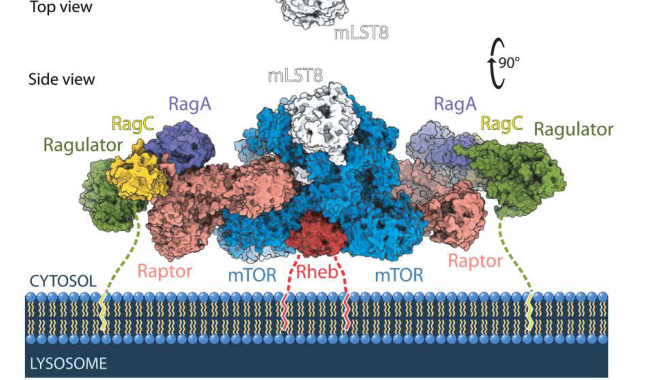

## Question

# Gene Research for Functional Annotation

## ⚠️ CRITICAL: Gene/Protein Identification Context

**BEFORE YOU BEGIN RESEARCH:** You MUST verify you are researching the CORRECT gene/protein. Gene symbols can be ambiguous, especially for less well-characterized genes from non-model organisms.

### Target Gene/Protein Identity (from UniProt):
- **UniProt Accession:** Q8N122
- **Protein Description:** RecName: Full=Regulatory-associated protein of mTOR {ECO:0000305}; Short=Raptor {ECO:0000303|PubMed:12150925, ECO:0000303|PubMed:12150926}; AltName: Full=p150 target of rapamycin (TOR)-scaffold protein {ECO:0000303|PubMed:12150926};
- **Gene Information:** Name=RPTOR {ECO:0000312|HGNC:HGNC:30287}; Synonyms=KIAA1303 {ECO:0000303|PubMed:10718198}, RAPTOR {ECO:0000303|PubMed:12150925, ECO:0000303|PubMed:12150926};
- **Organism (full):** Homo sapiens (Human).
- **Protein Family:** Belongs to the WD repeat RAPTOR family. .
- **Key Domains:** ARM-like. (IPR011989); ARM-type_fold. (IPR016024); HEAT. (IPR000357); Raptor. (IPR004083); Raptor_N. (IPR029347)

### MANDATORY VERIFICATION STEPS:

1. **Check if the gene symbol "RPTOR" matches the protein description above**
2. **Verify the organism is correct:** Homo sapiens (Human).
3. **Check if protein family/domains align with what you find in literature**
4. **If you find literature for a DIFFERENT gene with the same or similar symbol, STOP**

### If Gene Symbol is Ambiguous or You Cannot Find Relevant Literature:

**DO NOT PROCEED WITH RESEARCH ON A DIFFERENT GENE.** Instead:
- State clearly: "The gene symbol 'RPTOR' is ambiguous or literature is limited for this specific protein"
- Explain what you found (e.g., "Found extensive literature on a different gene with the same symbol in a different organism")
- Describe the protein based ONLY on the UniProt information provided above
- Suggest that the protein function can be inferred from domain/family information

### Research Target:

Please provide a comprehensive research report on the gene **RPTOR** (gene ID: RPTOR, UniProt: Q8N122) in human.

The research report should be a detailed narrative explaining the function, biological processes, and localization of the gene product. Citations should be given for all claims.

You should prioritize authoritative reviews and primary scientific literature when conducting research. You can supplement
this with annotations you find in gene/protein databases, but these can be outdated or inaccurate.

We are specifically interested in the primary function of the gene - for enzymes, what reaction is catalyzed, and what is the substrate specificity? For transporters, what is the substrate? For structural proteins or adapters, what is the broader structural role? For signaling molecules, what is the role in the pathway.

We are interested in where in or outside the cell the gene product carries out its function.

We are also interested in the signaling or biochemical pathways in which the gene functions. We are less interested in broad pleiotropic effects, except where these elucidate the precise role.

Include evidence where possible. We are interested in both experimental evidence as well as inference from structure, evolution, or bioinformatic analysis. Precise studies should be prioritized over high-throughput, where available.

## Output

Question: You are an expert researcher providing comprehensive, well-cited information.

Provide detailed information focusing on:
1. Key concepts and definitions with current understanding
2. Recent developments and latest research (prioritize 2023-2024 sources)
3. Current applications and real-world implementations
4. Expert opinions and analysis from authoritative sources
5. Relevant statistics and data from recent studies

Format as a comprehensive research report with proper citations. Include URLs and publication dates where available.
Always prioritize recent, authoritative sources and provide specific citations for all major claims.

# Gene Research for Functional Annotation

## ⚠️ CRITICAL: Gene/Protein Identification Context

**BEFORE YOU BEGIN RESEARCH:** You MUST verify you are researching the CORRECT gene/protein. Gene symbols can be ambiguous, especially for less well-characterized genes from non-model organisms.

### Target Gene/Protein Identity (from UniProt):
- **UniProt Accession:** Q8N122
- **Protein Description:** RecName: Full=Regulatory-associated protein of mTOR {ECO:0000305}; Short=Raptor {ECO:0000303|PubMed:12150925, ECO:0000303|PubMed:12150926}; AltName: Full=p150 target of rapamycin (TOR)-scaffold protein {ECO:0000303|PubMed:12150926};
- **Gene Information:** Name=RPTOR {ECO:0000312|HGNC:HGNC:30287}; Synonyms=KIAA1303 {ECO:0000303|PubMed:10718198}, RAPTOR {ECO:0000303|PubMed:12150925, ECO:0000303|PubMed:12150926};
- **Organism (full):** Homo sapiens (Human).
- **Protein Family:** Belongs to the WD repeat RAPTOR family. .
- **Key Domains:** ARM-like. (IPR011989); ARM-type_fold. (IPR016024); HEAT. (IPR000357); Raptor. (IPR004083); Raptor_N. (IPR029347)

### MANDATORY VERIFICATION STEPS:

1. **Check if the gene symbol "RPTOR" matches the protein description above**
2. **Verify the organism is correct:** Homo sapiens (Human).
3. **Check if protein family/domains align with what you find in literature**
4. **If you find literature for a DIFFERENT gene with the same or similar symbol, STOP**

### If Gene Symbol is Ambiguous or You Cannot Find Relevant Literature:

**DO NOT PROCEED WITH RESEARCH ON A DIFFERENT GENE.** Instead:
- State clearly: "The gene symbol 'RPTOR' is ambiguous or literature is limited for this specific protein"
- Explain what you found (e.g., "Found extensive literature on a different gene with the same symbol in a different organism")
- Describe the protein based ONLY on the UniProt information provided above
- Suggest that the protein function can be inferred from domain/family information

### Research Target:

Please provide a comprehensive research report on the gene **RPTOR** (gene ID: RPTOR, UniProt: Q8N122) in human.

The research report should be a detailed narrative explaining the function, biological processes, and localization of the gene product. Citations should be given for all claims.

You should prioritize authoritative reviews and primary scientific literature when conducting research. You can supplement
this with annotations you find in gene/protein databases, but these can be outdated or inaccurate.

We are specifically interested in the primary function of the gene - for enzymes, what reaction is catalyzed, and what is the substrate specificity? For transporters, what is the substrate? For structural proteins or adapters, what is the broader structural role? For signaling molecules, what is the role in the pathway.

We are interested in where in or outside the cell the gene product carries out its function.

We are also interested in the signaling or biochemical pathways in which the gene functions. We are less interested in broad pleiotropic effects, except where these elucidate the precise role.

Include evidence where possible. We are interested in both experimental evidence as well as inference from structure, evolution, or bioinformatic analysis. Precise studies should be prioritized over high-throughput, where available.

# Human RPTOR (RAPTOR; UniProt Q8N122): functional annotation and research report

**Identity verified.** Human **RPTOR** encodes regulatory-associated protein of mTOR, commonly called **RAPTOR** or **KIAA1303**. It is the approximately 150-kDa, 1,335-amino-acid canonical scaffold of **mTOR complex 1 (mTORC1)**. This is not **RICTOR**, the distinct scaffold of mTORC2. The reported N-terminal conserved RAPTOR region, HEAT/ARM-like α-solenoid and seven C-terminal WD40 repeats forming a β-propeller agree with the supplied protein-family/domain annotations and structural literature. The UniProt accession Q8N122 identifies the requested human entry; the functional conclusions below concern that protein, not a similarly named gene in another organism. (chouhan2024regulatoryassociatedproteinof pages 2-4, hara2002raptorabinding pages 2-3, rogala2019structuralbasisfor pages 1-2)

## Primary molecular function

**RAPTOR is a non-enzymatic substrate-recruiting and positioning scaffold.** It associates with the mTOR protein kinase and mLST8 in mTORC1, organizes substrates near the **mTOR catalytic site**, and couples the complex to nutrient-sensitive localization. RAPTOR itself catalyzes **no established phosphorylation reaction**: describing 4E-BP1 or S6K as “RAPTOR substrates” means that RAPTOR helps recruit them for phosphorylation **by mTOR**. In the original biochemical characterization, RAPTOR bound mTOR, 4E-BP1 and p70 S6 kinase; reducing RAPTOR impaired mTOR-catalyzed 4E-BP1 phosphorylation, and RAPTOR coexpression increased measured mTOR activity toward 4E-BP1 approximately **6.3-fold** under the reported in-vitro conditions. Thus its substrate specificity is best understood as **protein-docking specificity**, not enzyme substrate specificity. (hara2002raptorabinding pages 1-2, hara2002raptorabinding pages 2-3, chouhan2024regulatoryassociatedproteinof pages 2-4)

For canonical translational targets, RAPTOR recognizes **TOR-signalling (TOS) motifs** on proteins including **EIF4EBP1/4E-BP1** and **RPS6KB1/S6K1**. mTORC1 phosphorylation of 4E-BP1 relieves its inhibition of eIF4E-dependent translation; phosphorylation activates S6K1, another regulator of protein synthesis. The 4E-BP1 TOS motif has also been visualized at its RAPTOR binding site in structural work. These are comparatively direct molecular outputs; broader effects on cell size, lipid metabolism or proliferation are consequences of the pathway, not separate enzymatic functions of RAPTOR. (hara2002raptorabinding pages 1-2, chouhan2024regulatoryassociatedproteinof pages 2-4, cui2025structuralbasisfor pages 2-3)

**Not all mTORC1 substrates use a TOS motif.** A particularly informative exception is **TFEB**, the transcriptional regulator of lysosomal biogenesis and autophagy. A **3.1-Å** cryo-electron-microscopy study published in *Nature* in **January 2023** showed a TFEB–mTORC1 assembly containing **two Rag–Ragulator modules per RAPTOR**: one docks mTORC1 through RAPTOR, while the second presents TFEB through nucleotide-state-dependent Rag contacts; part of TFEB also winds around RAPTOR. TFEB lacks the canonical TOS motif. Mutations disrupting this alternative docking impaired TFEB **Ser211 phosphorylation** and drove TFEB into the nucleus, without equivalently disrupting canonical S6K/4E-BP1 phosphorylation or, for a tested RagC-clamp mutation, mTORC1 localization. This separates **substrate presentation** from loss of mTOR kinase activity. TFEB phosphorylation favors its cytosolic retention; when the signal is lost, nuclear TFEB can promote lysosomal and autophagy-related transcription. (cui2023structureofthe pages 1-2, cui2023structureofthe pages 2-3, cui2023structureofthe pages 3-4)

## Where RAPTOR acts and how signals reach it

RAPTOR functions **inside the cell**, predominantly in cytoplasmic mTORC1 and, when appropriately recruited, at the **cytosol-facing surface of lysosomes**; it is not a lysosomal-lumen enzyme or a secreted protein. Ragulator anchors Rag GTPases at this membrane. Under nutrient-sufficient conditions, the **RagA/B–GTP:RagC/D–GDP** heterodimer binds RAPTOR, bringing mTORC1 into proximity with **RHEB–GTP**, which activates the mTOR kinase in response to growth-factor signalling through the TSC–RHEB pathway. A **3.2-Å** cryo-EM structure showed that RAPTOR’s α-solenoid senses RagA’s nucleotide-dependent conformation and a RAPTOR “claw” engages the Rag domains to sense RagC; interface mutations impaired lysosomal mTORC1 localization and signalling. The inspected structural docking illustration depicts how RAPTOR helps orient mTORC1 at this membrane; it is a structural model, not evidence that RAPTOR is a transmembrane protein. (rogala2019structuralbasisfor pages 1-2, smiles2024newdevelopmentsin pages 2-4, rogala2019structuralbasisfor media a2dc74a6)

The importance of this nutrient-sensing architecture was reinforced by **August 2024** experiments in which cells lacking Rag GTPases or the Ragulator subunit p18 lost mTORC1 responsiveness to amino acids. Rag–Ragulator also organizes upstream GATOR regulatory complexes at lysosomes. **Recruitment and activation are distinct steps:** RAPTOR–Rag docking supplies location, whereas RHEB and the mTOR catalytic subunit supply much of the activation mechanism. (valenstein2024rag–ragulatoristhe pages 1-2, smiles2024newdevelopmentsin pages 2-4)

A major qualification to a lysosome-only annotation emerged in *Nature Cell Biology* in **October 2024**. Across imaging, lysosome immunoisolation and genetic/pharmacological perturbations, investigators detected **lysosomal and non-lysosomal pools of RAPTOR-containing mTORC1**. Blocking lysosomal function with bafilomycin A1 or removing RagA/B strongly reduced lysosome-dependent **TFEB/TFE3** phosphorylation, yet substantial mTOR-dependent **S6K and 4E-BP1** phosphorylation persisted; lysosomal immunoisolates contained phospho-TFEB but not S6K. Basal lysosomal proteolysis supplied amino acids to the lysosomal pool, whereas extracellular amino acids could support a cytoplasmic output. This does **not** mean Rag signalling is dispensable in every condition: acute amino-acid refeeding and robust reactivation can remain Rag-dependent. The complete mechanism regulating non-lysosomal mTORC1 is unresolved, so neither exclusive lysosomal localization nor complete Rag independence is justified. (fernandes2024spatialandfunctional pages 4-5, fernandes2024spatialandfunctional pages 9-10, fernandes2024spatialandfunctional pages 3-4, fernandes2024spatialandfunctional pages 14-14)

**Subsequent structural refinement, published September 2025.** Membrane reconstitution with approximately **250 nM RHEB** and **300 nM Rag–Ragulator** produced **more than 35-fold** stimulation of 4E-BP1 phosphorylation when the appropriate lipid membranes and GTP-bound RHEB were present. Cryo-EM identified direct membrane contacts involving RAPTOR WD40 residues **Phe1296/Met1297** and a separate basic loop of mTOR. The authors propose stepwise positioning to approximately **100 Å** from the membrane by Rag–Ragulator, approximately **40 Å** after RHEB engagement, and then direct RAPTOR/mTOR membrane contact for maximal catalytic activation. Disrupting RAPTOR’s contact reduced amino-acid-stimulated S6K and 4E-BP1 phosphorylation in rescue experiments. This peer-reviewed paper develops a related **November 2024 preprint**; they should not be counted as independent confirmations. Membrane contact adds a physical *orientation* function to RAPTOR’s established docking function. (cui2025structuralbasisfor pages 2-3, cui2025structuralbasisfor pages 5-5, cui2025structuralbasisfor pages 1-2, cui2024structuralbasisfor pages 7-10)

## Regulation and biological processes

RAPTOR integrates an energy-stress brake with nutrient-driven activation. **AMPK directly phosphorylates RAPTOR at Ser722 and Ser792**, promoting association with **14-3-3 proteins** and inhibiting mTORC1 during energy stress. Mutating both sites abolished the reported phospho-14-3-3-motif signal, and Ser792 phosphorylation was supported by purified-kinase and AMPK-deficient-cell tests. This mechanism contributes to energy-stress-induced cell-cycle arrest, but it is **not the sole** AMPK-to-mTORC1 route: TSC2 supplies a parallel inhibitory mechanism, as subsequent mutant-mouse work emphasizes. Recent reviews also describe glucose-sensitive RAPTOR **Thr700 O-GlcNAcylation** that promotes Rag association; that modification is a regulatory mechanism rather than RAPTOR catalysis. (gwinn2008ampkphosphorylationof pages 5-6, gwinn2008ampkphosphorylationof pages 1-2, ashraf2024finetuningampkin pages 9-11, smiles2024newdevelopmentsin pages 6-7)

Consequently, RAPTOR-dependent mTORC1 coordinates **translation and growth when nutrients and appropriate growth signals are available**, while inhibiting the initiation of autophagy in part through mTORC1-dependent phosphorylation of **ULK1**. Nutrient withdrawal or energy stress reduces these growth-promoting outputs and permits different autophagic and TFEB responses. Importantly, the 2023 TFEB structure and 2024 spatial study show that the response is **substrate- and compartment-specific**: one phosphorylation readout cannot necessarily summarize all mTORC1 activities. (smiles2024newdevelopmentsin pages 2-4, cui2023structureofthe pages 1-2, fernandes2024spatialandfunctional pages 4-5)

The following evidence map distinguishes the scaffold’s direct molecular activities from broader pathway outputs and records the dates and URLs of pivotal studies.

| Evidence area | Mechanistic role | Decisive experiment or quantitative result | Evidence level, publication date, DOI |
|---|---|---|---|
| Identity and structure | Human **RPTOR** encodes RAPTOR/KIAA1303, an approximately 150-kDa, 1,335-aa mTORC1 adapter/scaffold—not the catalytic kinase and not the mTORC2 subunit RICTOR. Its architecture comprises an N-terminal conserved domain, a HEAT/ARM-like α-solenoid and seven C-terminal WD40 repeats forming a β-propeller. (chouhan2024regulatoryassociatedproteinof pages 2-4) | The original biochemical study identified a 1,335-aa mTOR-binding protein with seven WD repeats; RAPTOR coexpression increased mTOR-dependent 4E-BP1 phosphorylation approximately **6.3-fold**. (hara2002raptorabinding pages 2-3) | Primary biochemistry, **July 2002**, [DOI: 10.1016/S0092-8674(02)00833-4](https://doi.org/10.1016/S0092-8674(02)00833-4); structural synthesis, **November 2024**, [DOI: 10.3390/targets2040020](https://doi.org/10.3390/targets2040020) |
| Canonical substrate recruitment | RAPTOR recruits TOS-motif-bearing substrates—including S6K1 and 4E-BP1—and positions them for phosphorylation by the **mTOR catalytic subunit**; RAPTOR itself is not an enzyme. | RAPTOR bound mTOR, 4E-BP1 and p70 S6K; depletion impaired mTOR-catalysed 4E-BP1 phosphorylation, while RAPTOR strongly enhanced activity toward S6K. Structural work visualized the 4E-BP1 TOS motif at the established RAPTOR site. (hara2002raptorabinding pages 1-2, cui2024structuralbasisfor pages 4-7) | Primary biochemistry, **July 2002**, [DOI: 10.1016/S0092-8674(02)00833-4](https://doi.org/10.1016/S0092-8674(02)00833-4); structural evidence updated in **September 2025**, [DOI: 10.1038/s41586-025-09545-3](https://doi.org/10.1038/s41586-025-09545-3) |
| Lysosomal nutrient recruitment | In nutrient sufficiency, RAPTOR recognizes active **RagA/B–GTP:RagC/D–GDP**, docking mTORC1 onto Rag–Ragulator at the cytosolic lysosomal surface so that mTOR can encounter RHEB–GTP. | A **3.2-Å cryo-EM** structure showed the RAPTOR α-solenoid sensing RagA and its “claw” sensing RagC; interface mutations impaired lysosomal localization and signaling. In 2024 CRISPR experiments, loss of Rag GTPases or Ragulator made mTORC1 completely insensitive to amino acids. (rogala2019structuralbasisfor pages 1-2, valenstein2024rag–ragulatoristhe pages 1-2) | Primary structural study, **October 2019**, [DOI: 10.1126/science.aay0166](https://doi.org/10.1126/science.aay0166); pathway architecture, **20 August 2024**, [DOI: 10.1073/pnas.2322755121](https://doi.org/10.1073/pnas.2322755121) |
| TFEB alternative recruitment | TFEB lacks the canonical TOS motif. Two Rag–Ragulator assemblies and RAPTOR instead form a lysosomal presentation platform that positions TFEB for phosphorylation by mTOR, including at Ser211. | A **3.1-Å cryo-EM** megacomplex contained two Rag–Ragulator modules per RAPTOR. Mutating the RagC aspartate clamp or TFEB docking interfaces impaired Ser211 phosphorylation and caused constitutive nuclear TFEB while preserving canonical S6K/4E-BP1 phosphorylation or mTORC1 localization. (cui2023structureofthe pages 3-4, cui2023structureofthe pages 1-2, cui2023structureofthe pages 2-3) | Primary structural and cellular study, **January 2023**, [DOI: 10.1038/s41586-022-05652-7](https://doi.org/10.1038/s41586-022-05652-7) |
| Energy-stress regulation | AMPK directly phosphorylates RAPTOR at **Ser722 and Ser792**, promoting 14-3-3 binding and suppressing mTORC1 as an energy-stress checkpoint; this complements AMPK regulation through TSC2. | S722A reduced and the S722A/S792A double mutant abolished the phospho-14-3-3-motif signal; purified AMPK phosphorylated RAPTOR, and Ser792 phosphorylation was absent in AMPK-deficient cells. Later double-knock-in evidence showed that RAPTOR-site mutation alone does not abolish all AMPK control because TSC2 provides a parallel route. (ashraf2024finetuningampkin pages 9-11, gwinn2008ampkphosphorylationof pages 5-6, gwinn2008ampkphosphorylationof pages 1-2) | Primary biochemistry, **April 2008**, [DOI: 10.1016/j.molcel.2008.03.003](https://doi.org/10.1016/j.molcel.2008.03.003); in-vivo synthesis, **August 2024**, [DOI: 10.1242/dmm.050798](https://doi.org/10.1242/dmm.050798) |
| Spatially distinct output | RAPTOR-containing mTORC1 is not exclusively lysosomal: lysosomal pools preferentially regulate TFEB/TFE3, whereas non-lysosomal/cytoplasmic pools can phosphorylate S6K and 4E-BP1 in response to extracellular amino acids. | Bafilomycin A1 or RagA/B loss depleted lysosomal mTORC1 and TFEB/TFE3 phosphorylation, yet substantial mTOR-dependent S6K and 4E-BP1 phosphorylation persisted. Lyso-IP detected phospho-TFEB but not S6K in lysosomal fractions; Torin1 confirmed that retained signals remained mTOR-dependent. (fernandes2024spatialandfunctional pages 9-10, fernandes2024spatialandfunctional pages 4-5, fernandes2024spatialandfunctional pages 3-4) | Primary spatial-cell-biology study, **October 2024**, [DOI: 10.1038/s41556-024-01523-7](https://doi.org/10.1038/s41556-024-01523-7) |
| 2025 membrane contact advance | RAPTOR is not merely a passive tether: its WD40 **Phe1296–Met1297 “FM finger”** contacts the membrane and helps orient mTORC1; a separate basic mTOR N-HEAT loop completes membrane engagement and catalytic activation. | Reconstitution with approximately **250 nM RHEB** and **300 nM Rag–Ragulator** increased 4E-BP1 phosphorylation by **more than 35-fold**. Rags first position mTORC1 within approximately **100 Å** of the membrane, RHEB within approximately **40 Å**, and direct RAPTOR/mTOR contacts complete activation. RAPTOR F1296E/M1297E reduced amino-acid-stimulated S6K and 4E-BP1 phosphorylation; this remains mechanistic evidence, not a clinically validated RPTOR-specific therapy. (cui2025structuralbasisfor pages 2-3, cui2024structuralbasisfor pages 4-7, cui2025structuralbasisfor pages 5-5, cui2025structuralbasisfor pages 1-2) | Peer-reviewed membrane reconstitution and cryo-EM, **September 2025**, [DOI: 10.1038/s41586-025-09545-3](https://doi.org/10.1038/s41586-025-09545-3); preceded by a **November 2024** preprint, [DOI: 10.1101/2024.11.15.623810](https://doi.org/10.1101/2024.11.15.623810) |

*Table: Compact evidence map linking human RAPTOR’s scaffold architecture to substrate recruitment, lysosomal positioning, stress control and spatially selective mTORC1 outputs. It separates RAPTOR’s non-catalytic functions from mTOR kinase activity and labels the 2025 membrane-contact result as mechanistic rather than clinical evidence.*

## Experimental applications, disease relevance and interpretation

**RPTOR perturbation is a practical way to test mTORC1-specific causality**, provided investigators distinguish it from manipulating mTOR, which also participates in mTORC2. In a **2024 mouse liver study**, acute hepatocyte-directed **Rptor deletion** decreased mTORC1 signalling and postprandial glycogen deposition. Re-expressing the phosphatase regulatory subunit **Ppp1r3b** in Rptor-deficient livers increased glycogen-synthase activity by approximately **twofold** relative to Rptor-deficient controls and improved hepatic glycogen storage. This is strong genetic evidence for a downstream **mTORC1–Ppp1r3b–glycogen** pathway, **not** evidence that RAPTOR directly phosphorylates Ppp1r3b or glycogen synthase; the phenotype was established in mice. (uehara2024mtorc1controlsmurine pages 2-4, uehara2024mtorc1controlsmurine pages 4-5)

A **2024** cortical **Pten**-loss mouse study provides a useful boundary on therapeutic inference: deleting **Rptor** to suppress mTORC1, or **Rictor** to suppress mTORC2, **individually** did not eliminate spontaneous seizures and epileptiform activity, whereas disabling both complexes normalized brain activity in that model. Thus, an mTOR-pathway disease does not automatically imply that selective RAPTOR suppression will suffice. Separately, a **2024 preclinical** study used RPTOR knockdown/overexpression in human non-small-cell lung-cancer cells and animal models and implicated an interaction involving YY1 and **SPHK2/S1P/STAT3** in brain-metastasis phenotypes. That proposed cancer mechanism is context-specific and does not replace RAPTOR’s well-established mTORC1 scaffold annotation or constitute an approved therapy. (cullen2024hyperactivityofmtorc1 pages 1-2, lin2024rptorblockadesuppresses pages 1-2, lin2024rptorblockadesuppresses pages 2-4)

**Clinical use targets the pathway, not proven direct drug binding to RAPTOR.** Rapamycin analogues such as **everolimus** are clinically used to inhibit mTOR signalling in manifestations of **tuberous sclerosis complex**, which arises from defective TSC1/TSC2-mediated restraint of mTORC1; their use must not be characterized as an approved RPTOR-targeted treatment. In a **December 2023** real-world study of **64** everolimus-treated patients, **14/45 (31%)** patients with epilepsy achieved at least a 50% seizure-frequency reduction, while **61/64 (95%)** reported an adverse effect and **36%** experienced a grade 3–4 adverse effect. These numbers characterize **everolimus-treated TSC patients**, not carriers of RPTOR variants and not the efficacy of a RAPTOR-specific drug. (cockerell2023effectivenessandsafety pages 1-2, franz2018mtorinhibitortherapy pages 1-2)

**Bottom line.** The best-supported primary annotation of human RPTOR/Q8N122 is **intracellular mTORC1 adaptor/scaffold governing substrate access and spatial recruitment**, especially recognition of TOS-bearing translational substrates and Rag-dependent lysosomal assembly. The strongest recent refinements are the **2023 alternative TFEB recruitment structure**, the **2024 demonstration of compartment-selective mTORC1 output**, and the **2025 peer-reviewed evidence for direct RAPTOR–membrane engagement**. Claims of independent RAPTOR enzymatic activity, obligatory lysosomal localization in all conditions, or clinically established direct RAPTOR-targeted therapy are not supported by this evidence. (hara2002raptorabinding pages 1-2, cui2023structureofthe pages 1-2, fernandes2024spatialandfunctional pages 4-5, cui2025structuralbasisfor pages 2-3, cockerell2023effectivenessandsafety pages 1-2)

### Selected primary sources and authoritative reviews

- Hara *et al.*, **July 2002**, *Cell*, discovery and biochemical substrate-recruitment experiments: https://doi.org/10.1016/S0092-8674(02)00833-4. (hara2002raptorabinding pages 1-2, hara2002raptorabinding pages 2-3)
- Gwinn *et al.*, **April 2008**, *Molecular Cell*, AMPK phosphorylation of RAPTOR: https://doi.org/10.1016/j.molcel.2008.03.003. (gwinn2008ampkphosphorylationof pages 5-6, gwinn2008ampkphosphorylationof pages 1-2)
- Rogala *et al.*, **October 2019**, *Science*, RAPTOR–Rag–Ragulator structure: https://doi.org/10.1126/science.aay0166. (rogala2019structuralbasisfor pages 1-2)
- Cui *et al.*, **January 2023**, *Nature*, TFEB–mTORC1–Rag–Ragulator structure: https://doi.org/10.1038/s41586-022-05652-7. (cui2023structureofthe pages 1-2, cui2023structureofthe pages 2-3)
- Goul, Peruzzo and Zoncu, **August 2023**, *Nature Reviews Molecular Cell Biology*, nutrient-sensing mechanistic synthesis: https://doi.org/10.1038/s41580-023-00641-8. (cui2023structureofthe pages 1-2)
- Valenstein *et al.*, **20 August 2024**, *PNAS*, Rag–Ragulator pathway organization: https://doi.org/10.1073/pnas.2322755121. (valenstein2024rag–ragulatoristhe pages 1-2)
- Fernandes *et al.*, **October 2024**, *Nature Cell Biology*, lysosomal versus non-lysosomal signalling: https://doi.org/10.1038/s41556-024-01523-7. (fernandes2024spatialandfunctional pages 4-5, fernandes2024spatialandfunctional pages 14-14)
- Smiles *et al.*, **November 2024**, *Essays in Biochemistry*, AMPK–mTORC1 regulatory review: https://doi.org/10.1042/EBC20240007. (smiles2024newdevelopmentsin pages 2-4, smiles2024newdevelopmentsin pages 4-6)
- Cui *et al.*, **September 2025**, *Nature*, membrane-reconstituted mTORC1 activation: https://doi.org/10.1038/s41586-025-09545-3. (cui2025structuralbasisfor pages 2-3, cui2025structuralbasisfor pages 1-2)

References

1. (chouhan2024regulatoryassociatedproteinof pages 2-4): Surbhi Chouhan, Anil Kumar, Vikrant Piprode, Aparajita Dasgupta, Sarojini Singh, and Abdul Khalique. Regulatory-associated protein of mtor-mediated signaling: a nexus between tumorigenesis and disease. Targets, 2:341-371, Nov 2024. URL: https://doi.org/10.3390/targets2040020, doi:10.3390/targets2040020. This article has 12 citations.

2. (hara2002raptorabinding pages 2-3): Kenta Hara, Yoshiko Maruki, Xiaomeng Long, Ken-ichi Yoshino, Noriko Oshiro, Sujuti Hidayat, Chiharu Tokunaga, Joseph Avruch, and Kazuyoshi Yonezawa. Raptor, a binding partner of target of rapamycin (tor), mediates tor action. Cell, 110:177-189, Jul 2002. URL: https://doi.org/10.1016/s0092-8674(02)00833-4, doi:10.1016/s0092-8674(02)00833-4. This article has 2519 citations and is from a highest quality peer-reviewed journal.

3. (rogala2019structuralbasisfor pages 1-2): Kacper B. Rogala, Xin Gu, Jibril F. Kedir, Monther Abu-Remaileh, Laura F. Bianchi, Alexia M. S. Bottino, Rikke Dueholm, Anna Niehaus, Daan Overwijn, Ange-Célia Priso Fils, Sherry X. Zhou, Daniel Leary, Nouf N. Laqtom, Edward J. Brignole, and David M. Sabatini. Structural basis for the docking of mtorc1 on the lysosomal surface. Science, 366:468-475, Oct 2019. URL: https://doi.org/10.1126/science.aay0166, doi:10.1126/science.aay0166. This article has 227 citations and is from a highest quality peer-reviewed journal.

4. (hara2002raptorabinding pages 1-2): Kenta Hara, Yoshiko Maruki, Xiaomeng Long, Ken-ichi Yoshino, Noriko Oshiro, Sujuti Hidayat, Chiharu Tokunaga, Joseph Avruch, and Kazuyoshi Yonezawa. Raptor, a binding partner of target of rapamycin (tor), mediates tor action. Cell, 110:177-189, Jul 2002. URL: https://doi.org/10.1016/s0092-8674(02)00833-4, doi:10.1016/s0092-8674(02)00833-4. This article has 2519 citations and is from a highest quality peer-reviewed journal.

5. (cui2025structuralbasisfor pages 2-3): Zhicheng Cui, Alessandra Esposito, Gennaro Napolitano, Andrea Ballabio, and James H. Hurley. Structural basis for mtorc1 activation on the lysosomal membrane. Nature, 647:536-543, Sep 2025. URL: https://doi.org/10.1038/s41586-025-09545-3, doi:10.1038/s41586-025-09545-3. This article has 48 citations and is from a highest quality peer-reviewed journal.

6. (cui2023structureofthe pages 1-2): Zhicheng Cui, Gennaro Napolitano, Mariana E. G. de Araujo, Alessandra Esposito, Jlenia Monfregola, Lukas A. Huber, Andrea Ballabio, and James H. Hurley. Structure of the lysosomal mtorc1–tfeb–rag–ragulator megacomplex. Nature, 614:572-579, Jan 2023. URL: https://doi.org/10.1038/s41586-022-05652-7, doi:10.1038/s41586-022-05652-7. This article has 222 citations and is from a highest quality peer-reviewed journal.

7. (cui2023structureofthe pages 2-3): Zhicheng Cui, Gennaro Napolitano, Mariana E. G. de Araujo, Alessandra Esposito, Jlenia Monfregola, Lukas A. Huber, Andrea Ballabio, and James H. Hurley. Structure of the lysosomal mtorc1–tfeb–rag–ragulator megacomplex. Nature, 614:572-579, Jan 2023. URL: https://doi.org/10.1038/s41586-022-05652-7, doi:10.1038/s41586-022-05652-7. This article has 222 citations and is from a highest quality peer-reviewed journal.

8. (cui2023structureofthe pages 3-4): Zhicheng Cui, Gennaro Napolitano, Mariana E. G. de Araujo, Alessandra Esposito, Jlenia Monfregola, Lukas A. Huber, Andrea Ballabio, and James H. Hurley. Structure of the lysosomal mtorc1–tfeb–rag–ragulator megacomplex. Nature, 614:572-579, Jan 2023. URL: https://doi.org/10.1038/s41586-022-05652-7, doi:10.1038/s41586-022-05652-7. This article has 222 citations and is from a highest quality peer-reviewed journal.

9. (smiles2024newdevelopmentsin pages 2-4): William J. Smiles, Ashley J. Ovens, Bruce E. Kemp, Sandra Galic, Janni Petersen, and Jonathan S. Oakhill. New developments in ampk and mtorc1 cross-talk. Essays in Biochemistry, 68:321-336, Nov 2024. URL: https://doi.org/10.1042/ebc20240007, doi:10.1042/ebc20240007. This article has 122 citations and is from a peer-reviewed journal.

10. (rogala2019structuralbasisfor media a2dc74a6): Kacper B. Rogala, Xin Gu, Jibril F. Kedir, Monther Abu-Remaileh, Laura F. Bianchi, Alexia M. S. Bottino, Rikke Dueholm, Anna Niehaus, Daan Overwijn, Ange-Célia Priso Fils, Sherry X. Zhou, Daniel Leary, Nouf N. Laqtom, Edward J. Brignole, and David M. Sabatini. Structural basis for the docking of mtorc1 on the lysosomal surface. Science, 366:468-475, Oct 2019. URL: https://doi.org/10.1126/science.aay0166, doi:10.1126/science.aay0166. This article has 227 citations and is from a highest quality peer-reviewed journal.

11. (valenstein2024rag–ragulatoristhe pages 1-2): Max L. Valenstein, Pranav V. Lalgudi, Xin Gu, Jibril F. Kedir, Martin S. Taylor, Raghu R. Chivukula, and David M. Sabatini. Rag–ragulator is the central organizer of the physical architecture of the mtorc1 nutrient-sensing pathway. Proceedings of the National Academy of Sciences of the United States of America, Aug 2024. URL: https://doi.org/10.1073/pnas.2322755121, doi:10.1073/pnas.2322755121. This article has 34 citations and is from a highest quality peer-reviewed journal.

12. (fernandes2024spatialandfunctional pages 4-5): Stephanie A. Fernandes, Danai-Dimitra Angelidaki, Julian Nüchel, Jiyoung Pan, Peter Gollwitzer, Yoav Elkis, Filippo Artoni, Sabine Wilhelm, Marija Kovacevic-Sarmiento, and Constantinos Demetriades. Spatial and functional separation of mtorc1 signalling in response to different amino acid sources. Nature Cell Biology, 26:1918-1933, Oct 2024. URL: https://doi.org/10.1038/s41556-024-01523-7, doi:10.1038/s41556-024-01523-7. This article has 75 citations and is from a highest quality peer-reviewed journal.

13. (fernandes2024spatialandfunctional pages 9-10): Stephanie A. Fernandes, Danai-Dimitra Angelidaki, Julian Nüchel, Jiyoung Pan, Peter Gollwitzer, Yoav Elkis, Filippo Artoni, Sabine Wilhelm, Marija Kovacevic-Sarmiento, and Constantinos Demetriades. Spatial and functional separation of mtorc1 signalling in response to different amino acid sources. Nature Cell Biology, 26:1918-1933, Oct 2024. URL: https://doi.org/10.1038/s41556-024-01523-7, doi:10.1038/s41556-024-01523-7. This article has 75 citations and is from a highest quality peer-reviewed journal.

14. (fernandes2024spatialandfunctional pages 3-4): Stephanie A. Fernandes, Danai-Dimitra Angelidaki, Julian Nüchel, Jiyoung Pan, Peter Gollwitzer, Yoav Elkis, Filippo Artoni, Sabine Wilhelm, Marija Kovacevic-Sarmiento, and Constantinos Demetriades. Spatial and functional separation of mtorc1 signalling in response to different amino acid sources. Nature Cell Biology, 26:1918-1933, Oct 2024. URL: https://doi.org/10.1038/s41556-024-01523-7, doi:10.1038/s41556-024-01523-7. This article has 75 citations and is from a highest quality peer-reviewed journal.

15. (fernandes2024spatialandfunctional pages 14-14): Stephanie A. Fernandes, Danai-Dimitra Angelidaki, Julian Nüchel, Jiyoung Pan, Peter Gollwitzer, Yoav Elkis, Filippo Artoni, Sabine Wilhelm, Marija Kovacevic-Sarmiento, and Constantinos Demetriades. Spatial and functional separation of mtorc1 signalling in response to different amino acid sources. Nature Cell Biology, 26:1918-1933, Oct 2024. URL: https://doi.org/10.1038/s41556-024-01523-7, doi:10.1038/s41556-024-01523-7. This article has 75 citations and is from a highest quality peer-reviewed journal.

16. (cui2025structuralbasisfor pages 5-5): Zhicheng Cui, Alessandra Esposito, Gennaro Napolitano, Andrea Ballabio, and James H. Hurley. Structural basis for mtorc1 activation on the lysosomal membrane. Nature, 647:536-543, Sep 2025. URL: https://doi.org/10.1038/s41586-025-09545-3, doi:10.1038/s41586-025-09545-3. This article has 48 citations and is from a highest quality peer-reviewed journal.

17. (cui2025structuralbasisfor pages 1-2): Zhicheng Cui, Alessandra Esposito, Gennaro Napolitano, Andrea Ballabio, and James H. Hurley. Structural basis for mtorc1 activation on the lysosomal membrane. Nature, 647:536-543, Sep 2025. URL: https://doi.org/10.1038/s41586-025-09545-3, doi:10.1038/s41586-025-09545-3. This article has 48 citations and is from a highest quality peer-reviewed journal.

18. (cui2024structuralbasisfor pages 7-10): Zhicheng Cui, Alessandra Esposito, Gennaro Napolitano, Andrea Ballabio, and James H. Hurley. Structural basis for growth factor and nutrient signal integration on the lysosomal membrane by mtorc1. bioRxiv, Nov 2024. URL: https://doi.org/10.1101/2024.11.15.623810, doi:10.1101/2024.11.15.623810. This article has 7 citations.

19. (gwinn2008ampkphosphorylationof pages 5-6): Dana M. Gwinn, David B. Shackelford, Daniel F. Egan, Maria M. Mihaylova, Annabelle Mery, Debbie S. Vasquez, Benjamin E. Turk, and Reuben J. Shaw. Ampk phosphorylation of raptor mediates a metabolic checkpoint. Molecular cell, 30 2:214-26, Apr 2008. URL: https://doi.org/10.1016/j.molcel.2008.03.003, doi:10.1016/j.molcel.2008.03.003. This article has 5061 citations and is from a highest quality peer-reviewed journal.

20. (gwinn2008ampkphosphorylationof pages 1-2): Dana M. Gwinn, David B. Shackelford, Daniel F. Egan, Maria M. Mihaylova, Annabelle Mery, Debbie S. Vasquez, Benjamin E. Turk, and Reuben J. Shaw. Ampk phosphorylation of raptor mediates a metabolic checkpoint. Molecular cell, 30 2:214-26, Apr 2008. URL: https://doi.org/10.1016/j.molcel.2008.03.003, doi:10.1016/j.molcel.2008.03.003. This article has 5061 citations and is from a highest quality peer-reviewed journal.

21. (ashraf2024finetuningampkin pages 9-11): Naghmana Ashraf and Jeanine L. Van Nostrand. Fine-tuning ampk in physiology and disease using point-mutant mouse models. Disease Models & Mechanisms, Aug 2024. URL: https://doi.org/10.1242/dmm.050798, doi:10.1242/dmm.050798. This article has 15 citations and is from a domain leading peer-reviewed journal.

22. (smiles2024newdevelopmentsin pages 6-7): William J. Smiles, Ashley J. Ovens, Bruce E. Kemp, Sandra Galic, Janni Petersen, and Jonathan S. Oakhill. New developments in ampk and mtorc1 cross-talk. Essays in Biochemistry, 68:321-336, Nov 2024. URL: https://doi.org/10.1042/ebc20240007, doi:10.1042/ebc20240007. This article has 122 citations and is from a peer-reviewed journal.

23. (cui2024structuralbasisfor pages 4-7): Zhicheng Cui, Alessandra Esposito, Gennaro Napolitano, Andrea Ballabio, and James H. Hurley. Structural basis for growth factor and nutrient signal integration on the lysosomal membrane by mtorc1. bioRxiv, Nov 2024. URL: https://doi.org/10.1101/2024.11.15.623810, doi:10.1101/2024.11.15.623810. This article has 7 citations.

24. (uehara2024mtorc1controlsmurine pages 2-4): Kahealani Uehara, Won Dong Lee, Megan Stefkovich, Dipsikha Biswas, Dominic Santoleri, Anna Garcia Whitlock, William Quinn, Talia Coopersmith, Kate Townsend Creasy, Daniel J. Rader, Kei Sakamoto, Joshua D. Rabinowitz, and Paul M. Titchenell. Mtorc1 controls murine postprandial hepatic glycogen synthesis via ppp1r3b. The Journal of Clinical Investigation, Jan 2024. URL: https://doi.org/10.1172/jci173782, doi:10.1172/jci173782. This article has 21 citations.

25. (uehara2024mtorc1controlsmurine pages 4-5): Kahealani Uehara, Won Dong Lee, Megan Stefkovich, Dipsikha Biswas, Dominic Santoleri, Anna Garcia Whitlock, William Quinn, Talia Coopersmith, Kate Townsend Creasy, Daniel J. Rader, Kei Sakamoto, Joshua D. Rabinowitz, and Paul M. Titchenell. Mtorc1 controls murine postprandial hepatic glycogen synthesis via ppp1r3b. The Journal of Clinical Investigation, Jan 2024. URL: https://doi.org/10.1172/jci173782, doi:10.1172/jci173782. This article has 21 citations.

26. (cullen2024hyperactivityofmtorc1 pages 1-2): Erin R. Cullen, Mona Safari, Isabelle Mittelstadt, and Matthew C. Weston. Hyperactivity of mtorc1- and mtorc2-dependent signaling mediates epilepsy downstream of somatic pten loss. eLife, Mar 2024. URL: https://doi.org/10.7554/elife.91323.3, doi:10.7554/elife.91323.3. This article has 17 citations and is from a domain leading peer-reviewed journal.

27. (lin2024rptorblockadesuppresses pages 1-2): Ying Lin, Yun Wu, Qiangzu Zhang, Xunwei Tu, Sufang Chen, Junfan Pan, Nengluan Xu, Ming Lin, Peiwei She, Gang Niu, Yusheng Chen, and Hongru Li. Rptor blockade suppresses brain metastases of nsclc by interfering the ceramide metabolism via hijacking yy1 binding. Journal of Experimental & Clinical Cancer Research : CR, Jan 2024. URL: https://doi.org/10.1186/s13046-023-02874-z, doi:10.1186/s13046-023-02874-z. This article has 14 citations.

28. (lin2024rptorblockadesuppresses pages 2-4): Ying Lin, Yun Wu, Qiangzu Zhang, Xunwei Tu, Sufang Chen, Junfan Pan, Nengluan Xu, Ming Lin, Peiwei She, Gang Niu, Yusheng Chen, and Hongru Li. Rptor blockade suppresses brain metastases of nsclc by interfering the ceramide metabolism via hijacking yy1 binding. Journal of Experimental & Clinical Cancer Research : CR, Jan 2024. URL: https://doi.org/10.1186/s13046-023-02874-z, doi:10.1186/s13046-023-02874-z. This article has 14 citations.

29. (cockerell2023effectivenessandsafety pages 1-2): Ine Cockerell, Jakob Christensen, Christina E. Hoei-Hansen, Lotte Holst, Mikkel Grenaa Frederiksen, Aart Imran Issa-Epe, Bård Nedregaard, Ragnar Solhoff, Ketil Heimdal, Cecilie Johannessen Landmark, Caroline Lund, and Terje Nærland. Effectiveness and safety of everolimus treatment in patients with tuberous sclerosis complex in real-world clinical practice. Orphanet Journal of Rare Diseases, Dec 2023. URL: https://doi.org/10.1186/s13023-023-02982-1, doi:10.1186/s13023-023-02982-1. This article has 38 citations and is from a peer-reviewed journal.

30. (franz2018mtorinhibitortherapy pages 1-2): David Neal Franz and Darcy Andrew Krueger. Mtor inhibitor therapy as a disease modifying therapy for tuberous sclerosis complex. American Journal of Medical Genetics Part C: Seminars in Medical Genetics, 178:365-373, Sep 2018. URL: https://doi.org/10.1002/ajmg.c.31655, doi:10.1002/ajmg.c.31655. This article has 58 citations.

31. (smiles2024newdevelopmentsin pages 4-6): William J. Smiles, Ashley J. Ovens, Bruce E. Kemp, Sandra Galic, Janni Petersen, and Jonathan S. Oakhill. New developments in ampk and mtorc1 cross-talk. Essays in Biochemistry, 68:321-336, Nov 2024. URL: https://doi.org/10.1042/ebc20240007, doi:10.1042/ebc20240007. This article has 122 citations and is from a peer-reviewed journal.

## Artifacts

- [Edison artifact artifact-00](RPTOR-deep-research-falcon_artifacts/artifact-00.md)

## Citations

1. chouhan2024regulatoryassociatedproteinof pages 2-4
2. hara2002raptorabinding pages 2-3
3. rogala2019structuralbasisfor pages 1-2
4. cui2023structureofthe pages 1-2
5. hara2002raptorabinding pages 1-2
6. cui2025structuralbasisfor pages 2-3
7. cui2023structureofthe pages 2-3
8. cui2023structureofthe pages 3-4
9. smiles2024newdevelopmentsin pages 2-4
10. fernandes2024spatialandfunctional pages 4-5
11. fernandes2024spatialandfunctional pages 9-10
12. fernandes2024spatialandfunctional pages 3-4
13. fernandes2024spatialandfunctional pages 14-14
14. cui2025structuralbasisfor pages 5-5
15. cui2025structuralbasisfor pages 1-2
16. cui2024structuralbasisfor pages 7-10
17. gwinn2008ampkphosphorylationof pages 5-6
18. gwinn2008ampkphosphorylationof pages 1-2
19. ashraf2024finetuningampkin pages 9-11
20. smiles2024newdevelopmentsin pages 6-7
21. cui2024structuralbasisfor pages 4-7
22. lin2024rptorblockadesuppresses pages 1-2
23. lin2024rptorblockadesuppresses pages 2-4
24. cockerell2023effectivenessandsafety pages 1-2
25. franz2018mtorinhibitortherapy pages 1-2
26. smiles2024newdevelopmentsin pages 4-6
27. DOI: 10.1016/S0092-8674(02)00833-4
28. DOI: 10.3390/targets2040020
29. DOI: 10.1038/s41586-025-09545-3
30. DOI: 10.1126/science.aay0166
31. DOI: 10.1073/pnas.2322755121
32. DOI: 10.1038/s41586-022-05652-7
33. DOI: 10.1016/j.molcel.2008.03.003
34. DOI: 10.1242/dmm.050798
35. DOI: 10.1038/s41556-024-01523-7
36. DOI: 10.1101/2024.11.15.623810
37. https://doi.org/10.1016/S0092-8674(02
38. https://doi.org/10.3390/targets2040020
39. https://doi.org/10.1038/s41586-025-09545-3
40. https://doi.org/10.1126/science.aay0166
41. https://doi.org/10.1073/pnas.2322755121
42. https://doi.org/10.1038/s41586-022-05652-7
43. https://doi.org/10.1016/j.molcel.2008.03.003
44. https://doi.org/10.1242/dmm.050798
45. https://doi.org/10.1038/s41556-024-01523-7
46. https://doi.org/10.1101/2024.11.15.623810
47. https://doi.org/10.1016/j.molcel.2008.03.003.
48. https://doi.org/10.1126/science.aay0166.
49. https://doi.org/10.1038/s41586-022-05652-7.
50. https://doi.org/10.1038/s41580-023-00641-8.
51. https://doi.org/10.1073/pnas.2322755121.
52. https://doi.org/10.1038/s41556-024-01523-7.
53. https://doi.org/10.1042/EBC20240007.
54. https://doi.org/10.1038/s41586-025-09545-3.
55. https://doi.org/10.3390/targets2040020,
56. https://doi.org/10.1016/s0092-8674(02
57. https://doi.org/10.1126/science.aay0166,
58. https://doi.org/10.1038/s41586-025-09545-3,
59. https://doi.org/10.1038/s41586-022-05652-7,
60. https://doi.org/10.1042/ebc20240007,
61. https://doi.org/10.1073/pnas.2322755121,
62. https://doi.org/10.1038/s41556-024-01523-7,
63. https://doi.org/10.1101/2024.11.15.623810,
64. https://doi.org/10.1016/j.molcel.2008.03.003,
65. https://doi.org/10.1242/dmm.050798,
66. https://doi.org/10.1172/jci173782,
67. https://doi.org/10.7554/elife.91323.3,
68. https://doi.org/10.1186/s13046-023-02874-z,
69. https://doi.org/10.1186/s13023-023-02982-1,
70. https://doi.org/10.1002/ajmg.c.31655,