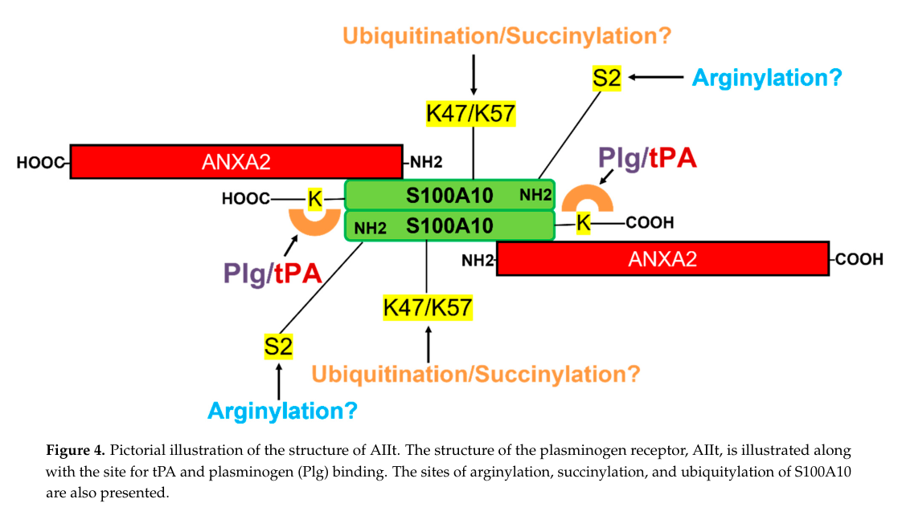

## Question

# Gene Research for Functional Annotation

## ⚠️ CRITICAL: Gene/Protein Identification Context

**BEFORE YOU BEGIN RESEARCH:** You MUST verify you are researching the CORRECT gene/protein. Gene symbols can be ambiguous, especially for less well-characterized genes from non-model organisms.

### Target Gene/Protein Identity (from UniProt):
- **UniProt Accession:** P60903
- **Protein Description:** RecName: Full=Protein S100-A10; AltName: Full=Calpactin I light chain; AltName: Full=Calpactin-1 light chain; AltName: Full=Cellular ligand of annexin II; AltName: Full=S100 calcium-binding protein A10; AltName: Full=p10 protein; AltName: Full=p11;
- **Gene Information:** Name=S100A10; Synonyms=ANX2LG, CAL1L, CLP11;
- **Organism (full):** Homo sapiens (Human).
- **Protein Family:** Belongs to the S-100 family. .
- **Key Domains:** EF-hand-dom_pair. (IPR011992); S100-A10. (IPR028476); S100/CaBP7/8-like_CS. (IPR001751); S100_Ca-bd_sub. (IPR013787); S_100 (PF01023)

### MANDATORY VERIFICATION STEPS:

1. **Check if the gene symbol "S100A10" matches the protein description above**
2. **Verify the organism is correct:** Homo sapiens (Human).
3. **Check if protein family/domains align with what you find in literature**
4. **If you find literature for a DIFFERENT gene with the same or similar symbol, STOP**

### If Gene Symbol is Ambiguous or You Cannot Find Relevant Literature:

**DO NOT PROCEED WITH RESEARCH ON A DIFFERENT GENE.** Instead:
- State clearly: "The gene symbol 'S100A10' is ambiguous or literature is limited for this specific protein"
- Explain what you found (e.g., "Found extensive literature on a different gene with the same symbol in a different organism")
- Describe the protein based ONLY on the UniProt information provided above
- Suggest that the protein function can be inferred from domain/family information

### Research Target:

Please provide a comprehensive research report on the gene **S100A10** (gene ID: S100A10, UniProt: P60903) in human.

The research report should be a detailed narrative explaining the function, biological processes, and localization of the gene product. Citations should be given for all claims.

You should prioritize authoritative reviews and primary scientific literature when conducting research. You can supplement
this with annotations you find in gene/protein databases, but these can be outdated or inaccurate.

We are specifically interested in the primary function of the gene - for enzymes, what reaction is catalyzed, and what is the substrate specificity? For transporters, what is the substrate? For structural proteins or adapters, what is the broader structural role? For signaling molecules, what is the role in the pathway.

We are interested in where in or outside the cell the gene product carries out its function.

We are also interested in the signaling or biochemical pathways in which the gene functions. We are less interested in broad pleiotropic effects, except where these elucidate the precise role.

Include evidence where possible. We are interested in both experimental evidence as well as inference from structure, evolution, or bioinformatic analysis. Precise studies should be prioritized over high-throughput, where available.

## Output

Question: You are an expert researcher providing comprehensive, well-cited information.

Provide detailed information focusing on:
1. Key concepts and definitions with current understanding
2. Recent developments and latest research (prioritize 2023-2024 sources)
3. Current applications and real-world implementations
4. Expert opinions and analysis from authoritative sources
5. Relevant statistics and data from recent studies

Format as a comprehensive research report with proper citations. Include URLs and publication dates where available.
Always prioritize recent, authoritative sources and provide specific citations for all major claims.

# Gene Research for Functional Annotation

## ⚠️ CRITICAL: Gene/Protein Identification Context

**BEFORE YOU BEGIN RESEARCH:** You MUST verify you are researching the CORRECT gene/protein. Gene symbols can be ambiguous, especially for less well-characterized genes from non-model organisms.

### Target Gene/Protein Identity (from UniProt):
- **UniProt Accession:** P60903
- **Protein Description:** RecName: Full=Protein S100-A10; AltName: Full=Calpactin I light chain; AltName: Full=Calpactin-1 light chain; AltName: Full=Cellular ligand of annexin II; AltName: Full=S100 calcium-binding protein A10; AltName: Full=p10 protein; AltName: Full=p11;
- **Gene Information:** Name=S100A10; Synonyms=ANX2LG, CAL1L, CLP11;
- **Organism (full):** Homo sapiens (Human).
- **Protein Family:** Belongs to the S-100 family. .
- **Key Domains:** EF-hand-dom_pair. (IPR011992); S100-A10. (IPR028476); S100/CaBP7/8-like_CS. (IPR001751); S100_Ca-bd_sub. (IPR013787); S_100 (PF01023)

### MANDATORY VERIFICATION STEPS:

1. **Check if the gene symbol "S100A10" matches the protein description above**
2. **Verify the organism is correct:** Homo sapiens (Human).
3. **Check if protein family/domains align with what you find in literature**
4. **If you find literature for a DIFFERENT gene with the same or similar symbol, STOP**

### If Gene Symbol is Ambiguous or You Cannot Find Relevant Literature:

**DO NOT PROCEED WITH RESEARCH ON A DIFFERENT GENE.** Instead:
- State clearly: "The gene symbol 'S100A10' is ambiguous or literature is limited for this specific protein"
- Explain what you found (e.g., "Found extensive literature on a different gene with the same symbol in a different organism")
- Describe the protein based ONLY on the UniProt information provided above
- Suggest that the protein function can be inferred from domain/family information

### Research Target:

Please provide a comprehensive research report on the gene **S100A10** (gene ID: S100A10, UniProt: P60903) in human.

The research report should be a detailed narrative explaining the function, biological processes, and localization of the gene product. Citations should be given for all claims.

You should prioritize authoritative reviews and primary scientific literature when conducting research. You can supplement
this with annotations you find in gene/protein databases, but these can be outdated or inaccurate.

We are specifically interested in the primary function of the gene - for enzymes, what reaction is catalyzed, and what is the substrate specificity? For transporters, what is the substrate? For structural proteins or adapters, what is the broader structural role? For signaling molecules, what is the role in the pathway.

We are interested in where in or outside the cell the gene product carries out its function.

We are also interested in the signaling or biochemical pathways in which the gene functions. We are less interested in broad pleiotropic effects, except where these elucidate the precise role.

Include evidence where possible. We are interested in both experimental evidence as well as inference from structure, evolution, or bioinformatic analysis. Precise studies should be prioritized over high-throughput, where available.

# Human S100A10 (p11; UniProt P60903): functional annotation

## Identity and central function

**Identity verified.** The requested protein is human **S100A10**, also called **p11**, annexin II light chain, or calpactin light chain—not annexin A2 (ANXA2), its principal binding partner. A study of purified S100A10 explicitly identifies accession **P60903**, and the protein’s S100-family, paired EF-hand architecture agrees with the supplied domain annotation. Unlike typical S100 proteins, deletions and substitutions in its EF-hand calcium-coordinating loops prevent **Ca²⁺ binding**. Its structure nevertheless resembles the calcium-activated conformation of other S100 proteins. The best-supported primary function is therefore **not calcium sensing or catalysis**, but acting as a protein-binding adaptor: particularly a cell-surface plasminogen receptor and, in other compartments, an organizer of membrane-associated proteins. (okura2023recentadvancesin pages 1-2, okura2023recentadvancesin pages 2-5, yan2021interactionsbetweenthe pages 1-7)

The predominant, well-characterized assembly is **AIIt**, a heterotetramer consisting of a central S100A10 homodimer bound to two ANXA2 molecules. ANXA2’s N-terminal regions bind S100A10; ANXA2 protects it from degradation and helps position it at membranes and the cell surface. Assembly does not require Ca²⁺ binding by S100A10, although ANXA2 confers calcium-responsive membrane interactions on the complex. These distinctions matter: an effect observed after ANXA2 depletion cannot automatically be attributed to ANXA2 rather than the accompanying loss of S100A10. (okura2023recentadvancesin pages 2-5, bharadwaj2021theannexina2s100a10 pages 6-8, okura2023recentadvancesin pages 5-6, bharadwaj2021theanxa2s100a10complex—regulation pages 24-26)

## Principal biochemical pathway: localized plasmin generation

**Where it acts.** In endothelial cells, macrophages and some cancer cells, S100A10 is displayed on the **extracellular face of the plasma membrane**, commonly with ANXA2. There it binds **plasminogen**, the inactive precursor of plasmin, and **tissue-type plasminogen activator (tPA)**; the resulting assembly favors localized conversion of plasminogen into plasmin. Urokinase-type plasminogen activator (uPA) can also activate receptor-associated plasminogen. **tPA/uPA catalyze the cleavage; S100A10 does not.** Surface-associated plasmin promotes fibrin removal and extracellular-matrix proteolysis, providing a mechanistic link to fibrinolysis, cell invasion and tissue remodeling. S100A10/AIIt can also protect bound plasmin or tPA against their inhibitors under studied conditions. (bharadwaj2021theannexina2s100a10 pages 6-8, oconnell2010s100a10regulatesplasminogendependent pages 1-3, bharadwaj2021theanxa2s100a10complex—regulation pages 11-13, okura2023recentadvancesin pages 10-11)

Purified-protein comparisons distinguish the subunits. Relative to a control plasminogen-activation reaction, recombinant **S100A10 increased tPA-dependent activation approximately 46-fold**, ANXA2 approximately **twofold**, and reconstituted AIIt approximately **77-fold**. With the complex attached to phospholipid, measured dissociation constants were **0.68 µM for tPA, 0.11 µM for plasminogen and 75 nM for plasmin**; intact membrane-associated ANXA2 alone did not detectably bind tPA or plasminogen in those experiments. These are biochemical assay results, not estimates of activation rates inside a person. ANXA2 has additional plasmin-binding and plasmin-processing roles, but assigning it the principal *plasminogen-binding* function would conflate the two proteins. (bharadwaj2021theanxa2s100a10complex—regulation pages 11-13, kwon2005s100a10annexina2 pages 10-12, bharadwaj2021theanxa2s100a10complex—regulation pages 13-15)

**Binding-site qualification.** Removing S100A10’s final two lysines reduced activity to approximately **15%** of wild-type S100A10, and a complex containing that deletion retained approximately **12%** of wild-type AIIt activity; ligand binding was also diminished. Nevertheless, the **2023** focused review reports that substituting the proposed terminal binding residue **K97** with isoleucine did *not* abolish plasminogen activation. Its authors suggest that the terminus may instead control exposure of another lysine. Thus, a lysine-dependent binding mechanism is supported, but describing **K97 as an indispensable, proven sole contact** would overstate the evidence. Figure 4 of the earlier review depicts the proposed AIIt ligand-binding arrangement; it is a mechanistic illustration, not a resolution of the later mutation result. [Okura *et al.*, published 26 September 2023](https://doi.org/10.3390/biom13101450); [Bharadwaj *et al.*, November 2021](https://doi.org/10.3390/biom11121772). (bharadwaj2021theanxa2s100a10complex—regulation pages 11-13, okura2023recentadvancesin pages 5-6, bharadwaj2021theanxa2s100a10complex—regulation media 3a97d80a)

**Physiological tests.** S100A10-deficient mice exhibit increased fibrin deposition and slower clot clearance, with normal routine coagulation times in the reported experiments, supporting a defect in *fibrinolysis* rather than simply excess coagulation. Deficient endothelial cells showed approximately **40% less plasminogen binding and plasmin generation**, **74% less** invasion in a primary-cell assay, and knockout Matrigel plugs showed **79% less endothelial staining**. In macrophages, genetic loss reduced measured plasminogen binding from **60.4% ± 2.4%** to **41.6% ± 3.65%** of cells (*n* = 3 per group), reduced plasmin generation, and lowered thioglycollate-elicited migration into the peritoneal cavity by **up to 53%**. These animal and cell experiments provide causal support for the pathway; they are not direct measures of effect size in patients. [O’Connell *et al.*, August 2010](https://doi.org/10.1182/blood-2010-01-264754); [Surette *et al.*, September 2011](https://doi.org/10.1182/blood-2011-05-353482). (surette2011regulationoffibrinolysis pages 6-8, oconnell2010s100a10regulatesplasminogendependent pages 1-3, surette2011regulationoffibrinolysis pages 1-2, oconnell2010s100a10regulatesplasminogendependent pages 8-9)

## Intracellular localization and additional defined functions

S100A10 also operates on the **cytoplasmic side of the plasma membrane** and at intracellular membranes. Its location and task depend on its partners; extracellular plasminogen binding must not be confused with cytoplasmic vesicle tethering. The following evidence matrix summarizes those roles and separates direct human-cell findings from animal or model-membrane results. (bharadwaj2021theannexina2s100a10 pages 12-14, zobiack2003theannexin2s100a10 pages 1-2, chehab2017anovelmunc134s100a10annexin pages 6-7)

| Molecular role / location | Precise mechanism | Strongest experimental evidence | Limitations / species |
|---|---|---|---|
| **Extracellular plasminogen receptor at the plasma membrane** | S100A10 is a **nonenzymatic adaptor/receptor**, usually the central dimer in the ANXA2–S100A10 heterotetramer (AIIt). It binds plasminogen and tPA, bringing substrate and activator together; **tPA or uPA—not S100A10—catalyzes** plasminogen cleavage to plasmin. ANXA2 stabilizes S100A10 and promotes membrane localization. | Purified-protein assays found approximately **46-fold**, **2-fold**, and **77-fold** stimulation of tPA-dependent plasminogen activation by S100A10, ANXA2, and AIIt, respectively. Phospholipid-associated AIIt bound tPA, plasminogen, and plasmin with Kd values of **0.68 μM, 0.11 μM, and 75 nM**. S100A10-null endothelial cells showed about **40% less** plasminogen binding/plasmin generation; knockout mice had **79% less** endothelial staining in Matrigel plugs. Macrophage recruitment during peritonitis decreased by up to **53%**. [2005](https://doi.org/10.2741/1529); [2010](https://doi.org/10.1182/blood-2010-01-264754); [2011](https://doi.org/10.1182/blood-2011-05-353482) (surette2011regulationoffibrinolysis pages 1-2, oconnell2010s100a10regulatesplasminogendependent pages 8-9, bharadwaj2021theanxa2s100a10complex—regulation pages 11-13) | Purified assays do not establish in-vivo flux. ANXA2 depletion also destabilizes S100A10, confounding assignment of effects to ANXA2. Deleting terminal lysines strongly reduced binding/activity, but later K97 substitution did not, suggesting K97 may expose an internal lysine rather than constitute the sole binding site. Mouse phenotypes support physiology; human evidence is strongest in cultured cells. (okura2023recentadvancesin pages 5-6, kwon2005s100a10annexina2 pages 10-12) |
| **Endothelial Weibel–Palade-body exocytosis at the cytoplasmic plasma-membrane face** | S100A10’s extreme C-terminal region binds Munc13-4 C2 domains while S100A10 remains associated with ANXA2. This tripartite complex recruits or stabilizes Munc13-4 at WPB–membrane docking sites, promoting histamine/Ca²⁺-evoked exocytosis and von Willebrand factor release. | In primary human HUVECs, yeast two-hybrid, recombinant pull-down, co-immunoprecipitation, and live TIRF microscopy supported direct interaction. Surface plasmon resonance measured **Kd = 0.45 μM**; S100A10 residues **91–96** were required. S100A10 or Munc13-4 depletion reduced stimulated VWF secretion, and double depletion was non-additive. [2017](https://doi.org/10.1091/mbc.e17-02-0128) (chehab2017anovelmunc134s100a10annexin pages 10-10, chehab2017anovelmunc134s100a10annexin pages 6-7, chehab2017anovelmunc134s100a10annexin pages 5-6) | Strong human-cell evidence, but mainly an ex-vivo endothelial system. This is a vesicle-tethering function distinct from extracellular plasmin generation. Physiological or therapeutic effects of selectively disrupting the S100A10–Munc13-4 interface remain untested clinically. |
| **Recycling-endosome architecture and positioning** | The ANXA2–S100A10 complex acts as a membrane scaffold controlling the intracellular positioning and tubular architecture of Rab11- and transferrin-receptor-positive recycling endosomes. | RNAi depletion of either component altered recycling-endosome distribution, increased bent tubules and clathrin-positive buds, and was specifically rescued by re-expression of S100A10 or the ANXA2 N-terminal domain. Sorting-endosome uptake and overall transferrin-recycling kinetics were not significantly changed. [2003](https://doi.org/10.1091/mbc.e03-06-0387) (zobiack2003theannexin2s100a10 pages 1-2) | Demonstrates architectural positioning rather than a rate-limiting transport defect. Conducted in cultured human cells; broader tissue-level importance and cargo specificity remain incompletely defined. |
| **Neuronal receptor trafficking and signaling** | S100A10 directly associates with intracellular regions of 5-HT1B, 5-HT1D, and 5-HT4 receptors and can increase 5-HT1B/5-HT4 surface expression. In dorsal-raphe serotonergic neurons, p11 associates with GluN2A/GluN2B and supports **GluN2A membrane expression**, linking receptor trafficking to neuronal excitability and stress-related behavior. | In a **2023 mouse** chronic-social-defeat model, stress reduced dorsal-raphe p11 and shifted GluN2A from membrane toward cytoplasm; membrane and cytoplasmic GluN2A differences had p = 0.0359 and p = 0.0021, respectively. Local p11 knockdown produced depression-related behaviors, whereas serotonergic-neuron overexpression improved social interaction and sucrose preference. [2023](https://doi.org/10.1038/s41398-023-02664-3) (bharadwaj2021theannexina2s100a10 pages 12-14, li2023reductionofp11 pages 6-8, li2023reductionofp11 pages 3-6, li2023reductionofp11 pages 9-11) | Behavioral and receptor-trafficking evidence is predominantly from mice or transfected cells; it does not establish a human antidepressant biomarker or drug target. Rescue was incomplete for some behavioral endpoints, and receptor colocalization/co-IP does not prove that GluN2A trafficking alone causes the phenotype. |
| **Plasma-membrane repair and direct lipid interaction** | Within an ANXA2–S100A10–AHNAK/dysferlin repair scaffold, S100A10 helps recruit AHNAK and organize repair machinery. Purified S100A10 can also interact directly—but comparatively weakly—with lipids, favoring unsaturated PE/PS species and negatively charged headgroups. | Recombinant human S100A10 (P60903) showed positive interaction with 11 of 12 lipid monolayers. Maximum insertion pressures included **42.0 ± 3.8 mN/m** for DDPE and **35.2 ± 3.9 mN/m** for DDPS. Earlier vesicle measurements found S100A10 binding roughly **10-fold weaker** than the ANXA2–S100A10 complex. [2021](https://doi.org/10.1021/acs.langmuir.1c00342) (yan2021interactionsbetweenthe pages 1-7, yan2021interactionsbetweenthe pages 18-24, yan2021interactionsbetweenthe pages 24-30) | These are model-membrane biophysical experiments, not direct measurements of cellular wound closure. Some purified-vesicle studies found no appreciable interaction by S100A10 alone, so ANXA2 remains the principal membrane-binding component in cells. (bharadwaj2021theannexina2s100a10 pages 6-8) |
| **Clinical biomarker and therapeutic hypothesis** | High or surface-localized S100A10 may report tumors that exploit plasmin-mediated matrix remodeling, invasion, and metastasis. Proposed interventions include inhibiting S100A10 ligand binding, disrupting AIIt, or blocking ANXA2-dependent surface delivery. | Retrospective human studies include S100A10 positivity in **36% of 882 colorectal tumors**, approximately **90%** positivity in one gallbladder-cancer series, and associations with shorter survival in several cancers; preclinical S100A10 loss reduced metastasis and tumor progression. A **2024 retinal** study showed that anti-ANXA2 antibodies reduced proliferative vitreoretinopathy, but the intervention targeted **ANXA2, not S100A10**. [2021](https://doi.org/10.3390/biom11121772); [2024](https://doi.org/10.1038/s41467-024-52675-x) (bharadwaj2021theanxa2s100a10complex—regulation pages 16-17, bharadwaj2021theanxa2s100a10complex—regulation pages 20-21, bharadwaj2021theanxa2s100a10complex—regulation pages 23-24, luo2024annexina2promotes pages 1-2, luo2024annexina2promotes pages 4-6) | No S100A10-directed diagnostic, prognostic assay, or therapy is established clinically. Cancer associations vary by tumor type and occasionally conflict; most datasets are retrospective and require prospective, independently validated, multivariable studies. Anti-ANXA2 efficacy cannot be attributed specifically to S100A10 because ANXA2 has additional functions and stabilizes the protein. |

*Table: A compact evidence matrix distinguishing established molecular functions of human S100A10/p11 (P60903) from findings in model systems and investigational clinical hypotheses. It emphasizes quantitative results, cellular location, species, and ANXA2-related attribution limits.*

A particularly specific **human-cell** mechanism is endothelial secretion. In primary human umbilical-vein endothelial cells, S100A10 directly binds the C2 domains of **Munc13-4** through a region encompassing its extreme C-terminal residues **91–96**; the measured affinity was **Kᴅ ≈ 0.45 µM**. Live imaging, protein-binding assays and knockdowns support recruitment of Munc13-4 by the ANXA2–S100A10 complex to **Weibel–Palade-body docking/fusion sites**. S100A10 or Munc13-4 depletion reduces histamine-stimulated release of the granule cargo **von Willebrand factor (VWF)**, and combined depletion was non-additive. This is a distinct secretion pathway, not evidence that S100A10 itself secretes or enzymatically makes VWF. [Chehab *et al.*, June 2017](https://doi.org/10.1091/mbc.e17-02-0128). (chehab2017anovelmunc134s100a10annexin pages 10-10, chehab2017anovelmunc134s100a10annexin pages 6-7, chehab2017anovelmunc134s100a10annexin pages 5-6, chehab2017anovelmunc134s100a10annexin pages 8-10)

For **endosomal organization**, depletion and separate rescue of S100A10 and ANXA2 altered the positioning and morphology of **Rab11/transferrin-receptor-positive recycling endosomes**. Transferrin uptake and overall recycling kinetics were *not* significantly impaired: the precise demonstrated role is membrane/endosome architecture, not a general requirement for all endocytosis. At damaged membranes, S100A10 also associates with **ANXA2 and AHNAK** in proposed repair scaffolds. Purified S100A10 can interact directly with selected negatively charged, unsaturated lipid models, but this is weaker or more condition-dependent than complex-mediated membrane association; model-lipid binding alone does not establish a rate-limiting cellular repair function. [Zobiack *et al.*, December 2003](https://doi.org/10.1091/mbc.e03-06-0387); [Yan *et al.*, August 2021](https://doi.org/10.1021/acs.langmuir.1c00342). (yan2021interactionsbetweenthe pages 1-7, zobiack2003theannexin2s100a10 pages 1-2, bharadwaj2021theannexina2s100a10 pages 6-8, yan2021interactionsbetweenthe pages 18-24)

In **neuronal receptor signaling**, studies reviewed in 2021 report S100A10 interaction with intracellular regions of serotonin **5-HT1B, 5-HT1D and 5-HT4 receptors**, with increased surface expression of 5-HT1B/5-HT4 in transfected systems. Other investigated partners include **mGluR5**, TASK-1, ASIC1a and TRPV5/6; strength of direct-binding and physiological evidence varies by partner. Notably, a **2023 mouse** study found that chronic social defeat reduced p11 in dorsal-raphe serotonergic neurons, associated p11 with the NMDA-receptor subunit **GluN2A**, and observed redistribution of GluN2A away from the membrane under stress. Local p11 knockdown induced depression-related behaviors, while targeted overexpression improved some measures; this supports a trafficking/signaling role but does not establish GluN2A trafficking as the sole cause or demonstrate a human antidepressant response. [Li *et al.*, November 2023](https://doi.org/10.1038/s41398-023-02664-3). (okura2023recentadvancesin pages 10-11, bharadwaj2021theannexina2s100a10 pages 12-14, bharadwaj2021theannexina2s100a10 pages 11-12, li2023reductionofp11 pages 6-8, li2023reductionofp11 pages 3-6, li2023reductionofp11 pages 9-11)

## Recent research and translational assessment

The **2023 structural/function synthesis** reinforces the calcium-binding exception, partnership-dependent localization and uncertainty about the exact plasminogen-contact lysine. In **2024**, a mouse study of proliferative vitreoretinopathy found that macrophage-derived **MIP-1α/β** promoted Src-dependent ANXA2 surface translocation and retinal pigment epithelial migration; intraocular **anti-ANXA2** antibodies reduced retinal pathology. The directly manipulated protein was **ANXA2, not S100A10**. The study illustrates possible therapeutic intervention in an AIIt-associated pathway, but it does **not** validate S100A10-selective inhibition. [Okura *et al.*, 26 September 2023](https://doi.org/10.3390/biom13101450); [Luo *et al.*, October 2024](https://doi.org/10.1038/s41467-024-52675-x). (okura2023recentadvancesin pages 5-6, luo2024annexina2promotes pages 1-2, luo2024annexina2promotes pages 4-6)

Cancer is a substantial **research application** of this annotation: cell-surface plasmin generation supplies a plausible route from S100A10 upregulation to matrix degradation and invasion, and S100A10 loss reduces tumor-associated phenotypes in several experimental models. Retrospective human series also report potentially useful—but context-dependent—expression patterns: **36% of 882 colorectal tumors** stained positive in one study, while associations differ across tumor types and even conflict in some analyses. S100A10 is therefore a **candidate biomarker and preclinical target**, not an established stand-alone clinical test or S100A10-directed therapy on the evidence reviewed here. Expression alone does not demonstrate a surface-localized, functionally active plasminogen receptor; clinical use would require standardized assays and independent, prospective validation. [Bharadwaj *et al.*, November 2021](https://doi.org/10.3390/biom11121772). (bharadwaj2021theanxa2s100a10complex—regulation pages 16-17, bharadwaj2021theanxa2s100a10complex—regulation pages 15-16, bharadwaj2021theanxa2s100a10complex—regulation pages 24-26, bharadwaj2021theanxa2s100a10complex—regulation pages 20-21)

**Functional-annotation conclusion:** Assign human **S100A10/P60903** the experimentally supported role of a **noncatalytic, calcium-insensitive S100 adaptor and plasminogen/tPA-binding receptor**, usually functioning with ANXA2 at the external cell surface to localize **tPA/uPA-driven plasmin production**. Add distinct, partner-dependent roles at intracellular membranes—especially **Munc13-4-mediated endothelial granule docking** and **recycling-endosome organization**—while qualifying neuronal receptor trafficking, membrane repair and disease-target claims by their experimental systems and remaining mechanistic uncertainty. (okura2023recentadvancesin pages 1-2, surette2011regulationoffibrinolysis pages 1-2, bharadwaj2021theanxa2s100a10complex—regulation pages 11-13, zobiack2003theannexin2s100a10 pages 1-2, chehab2017anovelmunc134s100a10annexin pages 6-7)

References

1. (okura2023recentadvancesin pages 1-2): Gillian C. Okura, Alamelu G. Bharadwaj, and David M. Waisman. Recent advances in molecular and cellular functions of s100a10. Biomolecules, 13:1450, Sep 2023. URL: https://doi.org/10.3390/biom13101450, doi:10.3390/biom13101450. This article has 34 citations.

2. (okura2023recentadvancesin pages 2-5): Gillian C. Okura, Alamelu G. Bharadwaj, and David M. Waisman. Recent advances in molecular and cellular functions of s100a10. Biomolecules, 13:1450, Sep 2023. URL: https://doi.org/10.3390/biom13101450, doi:10.3390/biom13101450. This article has 34 citations.

3. (yan2021interactionsbetweenthe pages 1-7): Xiaolin Yan, Kiran Kumar, Renaud Miclette Lamarche, Hala Youssef, Gary S. Shaw, Isabelle Marcotte, Christine E. DeWolf, Dror E. Warschawski, and Elodie Boisselier. Interactions between the cell membrane repair protein s100a10 and phospholipid monolayers and bilayers. Langmuir : the ACS journal of surfaces and colloids, 37:9652-9663, Aug 2021. URL: https://doi.org/10.1021/acs.langmuir.1c00342, doi:10.1021/acs.langmuir.1c00342. This article has 19 citations.

4. (bharadwaj2021theannexina2s100a10 pages 6-8): Alamelu Bharadwaj, Emma Kempster, and David Morton Waisman. The annexin a2/s100a10 complex: the mutualistic symbiosis of two distinct proteins. Biomolecules, 11:1849, Dec 2021. URL: https://doi.org/10.3390/biom11121849, doi:10.3390/biom11121849. This article has 64 citations.

5. (okura2023recentadvancesin pages 5-6): Gillian C. Okura, Alamelu G. Bharadwaj, and David M. Waisman. Recent advances in molecular and cellular functions of s100a10. Biomolecules, 13:1450, Sep 2023. URL: https://doi.org/10.3390/biom13101450, doi:10.3390/biom13101450. This article has 34 citations.

6. (bharadwaj2021theanxa2s100a10complex—regulation pages 24-26): Alamelu G. Bharadwaj, Emma Kempster, and David M. Waisman. The anxa2/s100a10 complex—regulation of the oncogenic plasminogen receptor. Biomolecules, 11:1772, Nov 2021. URL: https://doi.org/10.3390/biom11121772, doi:10.3390/biom11121772. This article has 36 citations.

7. (oconnell2010s100a10regulatesplasminogendependent pages 1-3): Paul A. O'Connell, Alexi P. Surette, Robert S. Liwski, Per Svenningsson, and David M. Waisman. S100a10 regulates plasminogen-dependent macrophage invasion. Blood, 116 7:1136-46, Aug 2010. URL: https://doi.org/10.1182/blood-2010-01-264754, doi:10.1182/blood-2010-01-264754. This article has 184 citations and is from a highest quality peer-reviewed journal.

8. (bharadwaj2021theanxa2s100a10complex—regulation pages 11-13): Alamelu G. Bharadwaj, Emma Kempster, and David M. Waisman. The anxa2/s100a10 complex—regulation of the oncogenic plasminogen receptor. Biomolecules, 11:1772, Nov 2021. URL: https://doi.org/10.3390/biom11121772, doi:10.3390/biom11121772. This article has 36 citations.

9. (okura2023recentadvancesin pages 10-11): Gillian C. Okura, Alamelu G. Bharadwaj, and David M. Waisman. Recent advances in molecular and cellular functions of s100a10. Biomolecules, 13:1450, Sep 2023. URL: https://doi.org/10.3390/biom13101450, doi:10.3390/biom13101450. This article has 34 citations.

10. (kwon2005s100a10annexina2 pages 10-12): M. Kwon, Travis J Macleod, Yi Zhang, and D. Waisman. S100a10, annexin a2, and annexin a2 heterotetramer as candidate plasminogen receptors. Frontiers in bioscience : a journal and virtual library, 10:300-25, Jan 2005. URL: https://doi.org/10.2741/1529, doi:10.2741/1529. This article has 232 citations.

11. (bharadwaj2021theanxa2s100a10complex—regulation pages 13-15): Alamelu G. Bharadwaj, Emma Kempster, and David M. Waisman. The anxa2/s100a10 complex—regulation of the oncogenic plasminogen receptor. Biomolecules, 11:1772, Nov 2021. URL: https://doi.org/10.3390/biom11121772, doi:10.3390/biom11121772. This article has 36 citations.

12. (bharadwaj2021theanxa2s100a10complex—regulation media 3a97d80a): Alamelu G. Bharadwaj, Emma Kempster, and David M. Waisman. The anxa2/s100a10 complex—regulation of the oncogenic plasminogen receptor. Biomolecules, 11:1772, Nov 2021. URL: https://doi.org/10.3390/biom11121772, doi:10.3390/biom11121772. This article has 36 citations.

13. (surette2011regulationoffibrinolysis pages 6-8): Alexi P. Surette, Patricia A. Madureira, Kyle D. Phipps, Victoria A. Miller, Per Svenningsson, and David M. Waisman. Regulation of fibrinolysis by s100a10 in vivo. Blood, 118 11:3172-81, Sep 2011. URL: https://doi.org/10.1182/blood-2011-05-353482, doi:10.1182/blood-2011-05-353482. This article has 123 citations and is from a highest quality peer-reviewed journal.

14. (surette2011regulationoffibrinolysis pages 1-2): Alexi P. Surette, Patricia A. Madureira, Kyle D. Phipps, Victoria A. Miller, Per Svenningsson, and David M. Waisman. Regulation of fibrinolysis by s100a10 in vivo. Blood, 118 11:3172-81, Sep 2011. URL: https://doi.org/10.1182/blood-2011-05-353482, doi:10.1182/blood-2011-05-353482. This article has 123 citations and is from a highest quality peer-reviewed journal.

15. (oconnell2010s100a10regulatesplasminogendependent pages 8-9): Paul A. O'Connell, Alexi P. Surette, Robert S. Liwski, Per Svenningsson, and David M. Waisman. S100a10 regulates plasminogen-dependent macrophage invasion. Blood, 116 7:1136-46, Aug 2010. URL: https://doi.org/10.1182/blood-2010-01-264754, doi:10.1182/blood-2010-01-264754. This article has 184 citations and is from a highest quality peer-reviewed journal.

16. (bharadwaj2021theannexina2s100a10 pages 12-14): Alamelu Bharadwaj, Emma Kempster, and David Morton Waisman. The annexin a2/s100a10 complex: the mutualistic symbiosis of two distinct proteins. Biomolecules, 11:1849, Dec 2021. URL: https://doi.org/10.3390/biom11121849, doi:10.3390/biom11121849. This article has 64 citations.

17. (zobiack2003theannexin2s100a10 pages 1-2): Nicole Zobiack, Ursula Rescher, Carsten Ludwig, Dagmar Zeuschner, and Volker Gerke. The annexin 2/s100a10 complex controls the distribution of transferrin receptor-containing recycling endosomes. Molecular biology of the cell, 14 12:4896-908, Dec 2003. URL: https://doi.org/10.1091/mbc.e03-06-0387, doi:10.1091/mbc.e03-06-0387. This article has 155 citations and is from a domain leading peer-reviewed journal.

18. (chehab2017anovelmunc134s100a10annexin pages 6-7): Tarek Chehab, Nina Criado Santos, Anna Holthenrich, Sophia N. Koerdt, Jennifer Disse, Christian Schuberth, Ali Reza Nazmi, Maaike Neeft, Henriette Koch, Kwun Nok M. Man, Sonja M. Wojcik, Thomas F. J. Martin, Peter van der Sluijs, Nils Brose, and Volker Gerke. A novel munc13-4/s100a10/annexin a2 complex promotes weibel–palade body exocytosis in endothelial cells. Molecular Biology of the Cell, 28:1688-1700, Jun 2017. URL: https://doi.org/10.1091/mbc.e17-02-0128, doi:10.1091/mbc.e17-02-0128. This article has 53 citations and is from a domain leading peer-reviewed journal.

19. (chehab2017anovelmunc134s100a10annexin pages 10-10): Tarek Chehab, Nina Criado Santos, Anna Holthenrich, Sophia N. Koerdt, Jennifer Disse, Christian Schuberth, Ali Reza Nazmi, Maaike Neeft, Henriette Koch, Kwun Nok M. Man, Sonja M. Wojcik, Thomas F. J. Martin, Peter van der Sluijs, Nils Brose, and Volker Gerke. A novel munc13-4/s100a10/annexin a2 complex promotes weibel–palade body exocytosis in endothelial cells. Molecular Biology of the Cell, 28:1688-1700, Jun 2017. URL: https://doi.org/10.1091/mbc.e17-02-0128, doi:10.1091/mbc.e17-02-0128. This article has 53 citations and is from a domain leading peer-reviewed journal.

20. (chehab2017anovelmunc134s100a10annexin pages 5-6): Tarek Chehab, Nina Criado Santos, Anna Holthenrich, Sophia N. Koerdt, Jennifer Disse, Christian Schuberth, Ali Reza Nazmi, Maaike Neeft, Henriette Koch, Kwun Nok M. Man, Sonja M. Wojcik, Thomas F. J. Martin, Peter van der Sluijs, Nils Brose, and Volker Gerke. A novel munc13-4/s100a10/annexin a2 complex promotes weibel–palade body exocytosis in endothelial cells. Molecular Biology of the Cell, 28:1688-1700, Jun 2017. URL: https://doi.org/10.1091/mbc.e17-02-0128, doi:10.1091/mbc.e17-02-0128. This article has 53 citations and is from a domain leading peer-reviewed journal.

21. (li2023reductionofp11 pages 6-8): Wei Li, Zuqi Shen, Xuan Yin, Weiqi Chang, Xiaorong Chen, Jin Yu, and Shifen Xu. Reduction of p11 in dorsal raphe nucleus serotonergic neurons mediates depression-like behaviors. Translational Psychiatry, Nov 2023. URL: https://doi.org/10.1038/s41398-023-02664-3, doi:10.1038/s41398-023-02664-3. This article has 12 citations and is from a peer-reviewed journal.

22. (li2023reductionofp11 pages 3-6): Wei Li, Zuqi Shen, Xuan Yin, Weiqi Chang, Xiaorong Chen, Jin Yu, and Shifen Xu. Reduction of p11 in dorsal raphe nucleus serotonergic neurons mediates depression-like behaviors. Translational Psychiatry, Nov 2023. URL: https://doi.org/10.1038/s41398-023-02664-3, doi:10.1038/s41398-023-02664-3. This article has 12 citations and is from a peer-reviewed journal.

23. (li2023reductionofp11 pages 9-11): Wei Li, Zuqi Shen, Xuan Yin, Weiqi Chang, Xiaorong Chen, Jin Yu, and Shifen Xu. Reduction of p11 in dorsal raphe nucleus serotonergic neurons mediates depression-like behaviors. Translational Psychiatry, Nov 2023. URL: https://doi.org/10.1038/s41398-023-02664-3, doi:10.1038/s41398-023-02664-3. This article has 12 citations and is from a peer-reviewed journal.

24. (yan2021interactionsbetweenthe pages 18-24): Xiaolin Yan, Kiran Kumar, Renaud Miclette Lamarche, Hala Youssef, Gary S. Shaw, Isabelle Marcotte, Christine E. DeWolf, Dror E. Warschawski, and Elodie Boisselier. Interactions between the cell membrane repair protein s100a10 and phospholipid monolayers and bilayers. Langmuir : the ACS journal of surfaces and colloids, 37:9652-9663, Aug 2021. URL: https://doi.org/10.1021/acs.langmuir.1c00342, doi:10.1021/acs.langmuir.1c00342. This article has 19 citations.

25. (yan2021interactionsbetweenthe pages 24-30): Xiaolin Yan, Kiran Kumar, Renaud Miclette Lamarche, Hala Youssef, Gary S. Shaw, Isabelle Marcotte, Christine E. DeWolf, Dror E. Warschawski, and Elodie Boisselier. Interactions between the cell membrane repair protein s100a10 and phospholipid monolayers and bilayers. Langmuir : the ACS journal of surfaces and colloids, 37:9652-9663, Aug 2021. URL: https://doi.org/10.1021/acs.langmuir.1c00342, doi:10.1021/acs.langmuir.1c00342. This article has 19 citations.

26. (bharadwaj2021theanxa2s100a10complex—regulation pages 16-17): Alamelu G. Bharadwaj, Emma Kempster, and David M. Waisman. The anxa2/s100a10 complex—regulation of the oncogenic plasminogen receptor. Biomolecules, 11:1772, Nov 2021. URL: https://doi.org/10.3390/biom11121772, doi:10.3390/biom11121772. This article has 36 citations.

27. (bharadwaj2021theanxa2s100a10complex—regulation pages 20-21): Alamelu G. Bharadwaj, Emma Kempster, and David M. Waisman. The anxa2/s100a10 complex—regulation of the oncogenic plasminogen receptor. Biomolecules, 11:1772, Nov 2021. URL: https://doi.org/10.3390/biom11121772, doi:10.3390/biom11121772. This article has 36 citations.

28. (bharadwaj2021theanxa2s100a10complex—regulation pages 23-24): Alamelu G. Bharadwaj, Emma Kempster, and David M. Waisman. The anxa2/s100a10 complex—regulation of the oncogenic plasminogen receptor. Biomolecules, 11:1772, Nov 2021. URL: https://doi.org/10.3390/biom11121772, doi:10.3390/biom11121772. This article has 36 citations.

29. (luo2024annexina2promotes pages 1-2): Min Luo, Dena Almeida, Valentina Dallacasagrande, Nadia Hedhli, Mrinali Gupta, Donald J. D’Amico, Szilárd Kiss, and Katherine A. Hajjar. Annexin a2 promotes proliferative vitreoretinopathy in response to a macrophage inflammatory signal in mice. Nature Communications, Oct 2024. URL: https://doi.org/10.1038/s41467-024-52675-x, doi:10.1038/s41467-024-52675-x. This article has 21 citations and is from a highest quality peer-reviewed journal.

30. (luo2024annexina2promotes pages 4-6): Min Luo, Dena Almeida, Valentina Dallacasagrande, Nadia Hedhli, Mrinali Gupta, Donald J. D’Amico, Szilárd Kiss, and Katherine A. Hajjar. Annexin a2 promotes proliferative vitreoretinopathy in response to a macrophage inflammatory signal in mice. Nature Communications, Oct 2024. URL: https://doi.org/10.1038/s41467-024-52675-x, doi:10.1038/s41467-024-52675-x. This article has 21 citations and is from a highest quality peer-reviewed journal.

31. (chehab2017anovelmunc134s100a10annexin pages 8-10): Tarek Chehab, Nina Criado Santos, Anna Holthenrich, Sophia N. Koerdt, Jennifer Disse, Christian Schuberth, Ali Reza Nazmi, Maaike Neeft, Henriette Koch, Kwun Nok M. Man, Sonja M. Wojcik, Thomas F. J. Martin, Peter van der Sluijs, Nils Brose, and Volker Gerke. A novel munc13-4/s100a10/annexin a2 complex promotes weibel–palade body exocytosis in endothelial cells. Molecular Biology of the Cell, 28:1688-1700, Jun 2017. URL: https://doi.org/10.1091/mbc.e17-02-0128, doi:10.1091/mbc.e17-02-0128. This article has 53 citations and is from a domain leading peer-reviewed journal.

32. (bharadwaj2021theannexina2s100a10 pages 11-12): Alamelu Bharadwaj, Emma Kempster, and David Morton Waisman. The annexin a2/s100a10 complex: the mutualistic symbiosis of two distinct proteins. Biomolecules, 11:1849, Dec 2021. URL: https://doi.org/10.3390/biom11121849, doi:10.3390/biom11121849. This article has 64 citations.

33. (bharadwaj2021theanxa2s100a10complex—regulation pages 15-16): Alamelu G. Bharadwaj, Emma Kempster, and David M. Waisman. The anxa2/s100a10 complex—regulation of the oncogenic plasminogen receptor. Biomolecules, 11:1772, Nov 2021. URL: https://doi.org/10.3390/biom11121772, doi:10.3390/biom11121772. This article has 36 citations.

## Artifacts

- [Edison artifact artifact-00](S100A10-deep-research-falcon_artifacts/artifact-00.md)

## Citations

1. okura2023recentadvancesin pages 1-2
2. okura2023recentadvancesin pages 2-5
3. yan2021interactionsbetweenthe pages 1-7
4. okura2023recentadvancesin pages 5-6
5. okura2023recentadvancesin pages 10-11
6. surette2011regulationoffibrinolysis pages 6-8
7. surette2011regulationoffibrinolysis pages 1-2
8. yan2021interactionsbetweenthe pages 18-24
9. yan2021interactionsbetweenthe pages 24-30
10. Okura *et al.*, published 26 September 2023
11. Bharadwaj *et al.*, November 2021
12. O’Connell *et al.*, August 2010
13. Surette *et al.*, September 2011
14. 2005
15. 2010
16. 2011
17. 2017
18. 2003
19. 2023
20. 2021
21. 2024
22. Chehab *et al.*, June 2017
23. Zobiack *et al.*, December 2003
24. Yan *et al.*, August 2021
25. Li *et al.*, November 2023
26. Okura *et al.*, 26 September 2023
27. Luo *et al.*, October 2024
28. https://doi.org/10.3390/biom13101450
29. https://doi.org/10.3390/biom11121772
30. https://doi.org/10.1182/blood-2010-01-264754
31. https://doi.org/10.1182/blood-2011-05-353482
32. https://doi.org/10.2741/1529
33. https://doi.org/10.1091/mbc.e17-02-0128
34. https://doi.org/10.1091/mbc.e03-06-0387
35. https://doi.org/10.1038/s41398-023-02664-3
36. https://doi.org/10.1021/acs.langmuir.1c00342
37. https://doi.org/10.1038/s41467-024-52675-x
38. https://doi.org/10.3390/biom13101450,
39. https://doi.org/10.1021/acs.langmuir.1c00342,
40. https://doi.org/10.3390/biom11121849,
41. https://doi.org/10.3390/biom11121772,
42. https://doi.org/10.1182/blood-2010-01-264754,
43. https://doi.org/10.2741/1529,
44. https://doi.org/10.1182/blood-2011-05-353482,
45. https://doi.org/10.1091/mbc.e03-06-0387,
46. https://doi.org/10.1091/mbc.e17-02-0128,
47. https://doi.org/10.1038/s41398-023-02664-3,
48. https://doi.org/10.1038/s41467-024-52675-x,