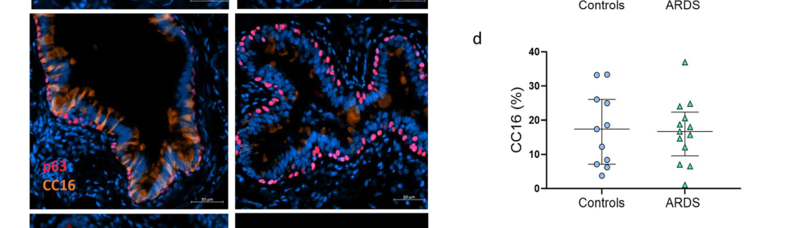

## Question

# Gene Research for Functional Annotation

## ⚠️ CRITICAL: Gene/Protein Identification Context

**BEFORE YOU BEGIN RESEARCH:** You MUST verify you are researching the CORRECT gene/protein. Gene symbols can be ambiguous, especially for less well-characterized genes from non-model organisms.

### Target Gene/Protein Identity (from UniProt):
- **UniProt Accession:** P11684
- **Protein Description:** RecName: Full=Uteroglobin; AltName: Full=Club cell phospholipid-binding protein; Short=CCPBP; AltName: Full=Club cells 10 kDa secretory protein; Short=CC10; AltName: Full=Secretoglobin family 1A member 1; AltName: Full=Urinary protein 1; Short=UP-1; Short=UP1; Short=Urine protein 1; Flags: Precursor;
- **Gene Information:** Name=SCGB1A1; Synonyms=CC10, CCSP, UGB;
- **Organism (full):** Homo sapiens (Human).
- **Protein Family:** Belongs to the secretoglobin family. .
- **Key Domains:** Secretoglobin. (IPR016126); Secretoglobin_1C-like. (IPR043215); Secretoglobin_sf. (IPR035960); Uteroglobin. (IPR000329); Uteroglobin (PF01099)

### MANDATORY VERIFICATION STEPS:

1. **Check if the gene symbol "SCGB1A1" matches the protein description above**
2. **Verify the organism is correct:** Homo sapiens (Human).
3. **Check if protein family/domains align with what you find in literature**
4. **If you find literature for a DIFFERENT gene with the same or similar symbol, STOP**

### If Gene Symbol is Ambiguous or You Cannot Find Relevant Literature:

**DO NOT PROCEED WITH RESEARCH ON A DIFFERENT GENE.** Instead:
- State clearly: "The gene symbol 'SCGB1A1' is ambiguous or literature is limited for this specific protein"
- Explain what you found (e.g., "Found extensive literature on a different gene with the same symbol in a different organism")
- Describe the protein based ONLY on the UniProt information provided above
- Suggest that the protein function can be inferred from domain/family information

### Research Target:

Please provide a comprehensive research report on the gene **SCGB1A1** (gene ID: SCGB1A1, UniProt: P11684) in human.

The research report should be a detailed narrative explaining the function, biological processes, and localization of the gene product. Citations should be given for all claims.

You should prioritize authoritative reviews and primary scientific literature when conducting research. You can supplement
this with annotations you find in gene/protein databases, but these can be outdated or inaccurate.

We are specifically interested in the primary function of the gene - for enzymes, what reaction is catalyzed, and what is the substrate specificity? For transporters, what is the substrate? For structural proteins or adapters, what is the broader structural role? For signaling molecules, what is the role in the pathway.

We are interested in where in or outside the cell the gene product carries out its function.

We are also interested in the signaling or biochemical pathways in which the gene functions. We are less interested in broad pleiotropic effects, except where these elucidate the precise role.

Include evidence where possible. We are interested in both experimental evidence as well as inference from structure, evolution, or bioinformatic analysis. Precise studies should be prioritized over high-throughput, where available.

## Output

Question: You are an expert researcher providing comprehensive, well-cited information.

Provide detailed information focusing on:
1. Key concepts and definitions with current understanding
2. Recent developments and latest research (prioritize 2023-2024 sources)
3. Current applications and real-world implementations
4. Expert opinions and analysis from authoritative sources
5. Relevant statistics and data from recent studies

Format as a comprehensive research report with proper citations. Include URLs and publication dates where available.
Always prioritize recent, authoritative sources and provide specific citations for all major claims.

# Gene Research for Functional Annotation

## ⚠️ CRITICAL: Gene/Protein Identification Context

**BEFORE YOU BEGIN RESEARCH:** You MUST verify you are researching the CORRECT gene/protein. Gene symbols can be ambiguous, especially for less well-characterized genes from non-model organisms.

### Target Gene/Protein Identity (from UniProt):
- **UniProt Accession:** P11684
- **Protein Description:** RecName: Full=Uteroglobin; AltName: Full=Club cell phospholipid-binding protein; Short=CCPBP; AltName: Full=Club cells 10 kDa secretory protein; Short=CC10; AltName: Full=Secretoglobin family 1A member 1; AltName: Full=Urinary protein 1; Short=UP-1; Short=UP1; Short=Urine protein 1; Flags: Precursor;
- **Gene Information:** Name=SCGB1A1; Synonyms=CC10, CCSP, UGB;
- **Organism (full):** Homo sapiens (Human).
- **Protein Family:** Belongs to the secretoglobin family. .
- **Key Domains:** Secretoglobin. (IPR016126); Secretoglobin_1C-like. (IPR043215); Secretoglobin_sf. (IPR035960); Uteroglobin. (IPR000329); Uteroglobin (PF01099)

### MANDATORY VERIFICATION STEPS:

1. **Check if the gene symbol "SCGB1A1" matches the protein description above**
2. **Verify the organism is correct:** Homo sapiens (Human).
3. **Check if protein family/domains align with what you find in literature**
4. **If you find literature for a DIFFERENT gene with the same or similar symbol, STOP**

### If Gene Symbol is Ambiguous or You Cannot Find Relevant Literature:

**DO NOT PROCEED WITH RESEARCH ON A DIFFERENT GENE.** Instead:
- State clearly: "The gene symbol 'SCGB1A1' is ambiguous or literature is limited for this specific protein"
- Explain what you found (e.g., "Found extensive literature on a different gene with the same symbol in a different organism")
- Describe the protein based ONLY on the UniProt information provided above
- Suggest that the protein function can be inferred from domain/family information

### Research Target:

Please provide a comprehensive research report on the gene **SCGB1A1** (gene ID: SCGB1A1, UniProt: P11684) in human.

The research report should be a detailed narrative explaining the function, biological processes, and localization of the gene product. Citations should be given for all claims.

You should prioritize authoritative reviews and primary scientific literature when conducting research. You can supplement
this with annotations you find in gene/protein databases, but these can be outdated or inaccurate.

We are specifically interested in the primary function of the gene - for enzymes, what reaction is catalyzed, and what is the substrate specificity? For transporters, what is the substrate? For structural proteins or adapters, what is the broader structural role? For signaling molecules, what is the role in the pathway.

We are interested in where in or outside the cell the gene product carries out its function.

We are also interested in the signaling or biochemical pathways in which the gene functions. We are less interested in broad pleiotropic effects, except where these elucidate the precise role.

Include evidence where possible. We are interested in both experimental evidence as well as inference from structure, evolution, or bioinformatic analysis. Precise studies should be prioritized over high-throughput, where available.

## Research report: SCGB1A1 (UniProt P11684; uteroglobin/CC10/CC16/CCSP) functional annotation (Homo sapiens)

### 1) Verification of gene/protein identity (mandatory)
SCGB1A1 is the human gene encoding the secreted club cell secretory protein historically called uteroglobin, CC10, CC16, and CCSP; authoritative reviews explicitly link these names to UniProt accession P11684 and describe it as a secretoglobin family member (mootz2022secretoglobinsinthe pages 26-30, martinu2023clubcellsecretory pages 1-3, xu2024claracell10 pages 1-2). The protein is a small secreted homodimer in the secretoglobin family; structure is described as antiparallel dimerization with a central hydrophobic cavity that can bind hydrophobic ligands (e.g., phospholipids, steroids, inflammatory mediators), consistent with “phospholipid-binding” nomenclature (mootz2022secretoglobinsinthe pages 26-30, mootz2022secretoglobinsinthe pages 1-6). 

### 2) Key concepts, definitions, and current understanding

#### 2.1 What SCGB1A1 is
SCGB1A1 encodes a highly abundant, secreted airway protein (often referred to as CCSP/CC16/CC10) produced constitutively primarily by airway club cells (non-ciliated secretory epithelial cells), with protein readily detectable in airway lining fluid and also measurable in blood and urine due to epithelial-to-blood leak and renal clearance (martinu2023clubcellsecretory pages 1-3, martinu2023clubcellsecretory pages 3-4). 

#### 2.2 Where it is made and where it acts (localization)
**Primary cellular source:** club cells in distal/proximal airways (martinu2023clubcellsecretory pages 1-3). 
**Extracellular distribution:** detectable in serum/plasma, sputum, bronchoalveolar lavage fluid (BALF), nasal secretions, and urine, consistent with secretion into airway lumen and translocation into the circulation (martinu2023clubcellsecretory pages 3-4, mootz2022secretoglobinsinthe pages 9-11). 
**Interpretation note (biomarker physiology):** because CC16 transits from lung to blood and is cleared by the kidney, circulating concentrations reflect both airway epithelial permeability/injury and renal handling; rapid clearance is a key reason timing matters (otelea2023clubcells—aguardian pages 2-3, neumann2024clubcellprotein pages 1-2).

#### 2.3 Primary molecular/biological functions (functional annotation)
SCGB1A1 is best supported as an **epithelial-derived immunomodulatory “pneumoprotein”** that dampens acute and chronic pulmonary inflammation rather than acting as an enzyme with a single defined catalytic reaction.

Key mechanistic concepts supported in the retrieved literature include:

1. **Anti-neutrophilic / anti-inflammatory activity via chemokine interaction.** Recombinant human CCSP/SCGB1A1 can bind CXCL8/IL-8 and inhibit neutrophil chemotaxis, and CCSP deficiency in animal models is associated with greater airway neutrophilia after injurious stimuli (martinu2023clubcellsecretory pages 3-4, mootz2022secretoglobinsinthe pages 11-14). 
2. **Modulation of leukocyte recruitment/adhesion.** CCSP is described as potentially antagonizing neutrophil adhesion through interaction with VLA-4 (α4β1 integrin), and reviews summarize VLA-4 as a mechanistic interface for CCSP signaling relevant to inflammation (martinu2023clubcellsecretory pages 3-4). 
3. **Antagonism of phospholipase A2 (PLA2) activity and downstream inflammatory lipid signaling.** Multiple sources describe SCGB1A1/CC10 as a phospholipase A2-inhibitory protein and note increased PLA2 activity in CCSP-deficient contexts (mootz2022secretoglobinsinthe pages 11-14, martinu2023clubcellsecretory pages 3-4, xu2024claracell10 pages 1-2). 
4. **Immune regulation through dendritic cell (DC) phenotype and NF-κB signaling.** A 2024 mechanistic study in allergic airway inflammation reports that CC10/SCGB1A1 suppresses Th2-type inflammation largely by modulating lung DC subsets and activation through an NF-κB–linked pathway (xu2024claracell10 pages 1-2). 

Collectively, these mechanisms position SCGB1A1 as a **secreted regulator of epithelial–immune crosstalk** at the airway barrier, with effects on neutrophil trafficking, antigen-presenting cell programming, and lipid mediator pathways (martinu2023clubcellsecretory pages 3-4, xu2024claracell10 pages 1-2).

### 3) Recent developments and latest research (prioritizing 2023–2024)

#### 3.1 2023: “Club-cell heterogeneity” and lineage plasticity reframing SCGB1A1
A major 2023 development has been the consolidation of single-cell RNA-seq (scRNA-seq) evidence that “club cells” (SCGB1A1+ secretory populations) are heterogeneous and sit on differentiation continuums with basal and goblet cells, and in some contexts with distal alveolar-associated secretory states. Blackburn et al. (2023) synthesize that human basal cells (KRT5+/TP63+) can generate SCGB1A1+ cells in air–liquid interface (ALI) cultures and that club↔goblet transitions occur (e.g., up to ~25% of goblet cells expressing SCGB1A1), reframing SCGB1A1 as both a marker of a canonical club state and of intermediate secretory states in disease and repair (blackburn2023anupdatein pages 10-13, blackburn2023anupdatein pages 13-17). Importantly, Blackburn et al. compile evidence that smokers/COPD show reductions in SCGB1A1 markers (protein/mRNA and fewer SCGB1A1+ cells) across multiple study types, consistent with club-cell depletion or altered differentiation (blackburn2023anupdatein pages 41-44).

#### 3.2 2024: Notch signaling and SCGB1A1 as an epithelial injury marker in vaping/smoking-related remodeling
Cao et al. (2024) used scRNA-seq of ALI-cultured human bronchial epithelial (HBE) cells (41,215 single cells across six groups) to compare e-cigarette vapor extract (ECE) vs cigarette smoke extract (CSE) responses and reported major shifts in epithelial composition. SCGB1A1 defined club/secretory club populations, and club fractions increased with ECE or CSE exposure (e.g., healthy: 10%→17% (ECE) or 21% (CSE); COPD: 9%→22% (ECE) or 27% (CSE)), while CSE markedly decreased an early-ciliating subcluster (ciliated4) (cao2024singlecelltranscriptomicsreveals pages 5-6, cao2024singlecelltranscriptomicsreveals pages 4-5). The study reports increased Notch signaling strength in a ciliated subpopulation with ECE and that Notch inhibition ameliorated some remodeling phenotypes; it also links decreased SCGB1A1 protein to e-cigarette users as a potential injury marker (cao2024singlecelltranscriptomicsreveals pages 4-5, martinu2023clubcellsecretory pages 1-3).

#### 3.3 2024: Mechanistic immunology in asthma—CC10/SCGB1A1 → DC/NF-κB axis
Xu et al. (2024) measured plasma CC10 in a human cohort (20 asthma; 20 controls) and reported lower CC10 levels in asthma correlating with higher IgE and lymphocytes, then used loss- and gain-of-function mouse studies to support a causal anti-inflammatory role. Mechanistically, the work emphasizes DC subset modulation (CD11b+CD103− DCs) and NF-κB signaling rather than a direct effect on Th cells (xu2024claracell10 pages 1-2).

#### 3.4 2024: Acute respiratory distress syndrome (ARDS)—serum CC16/SCGB1A1 reflects epithelial leak
Gerard et al. (2024) quantified distal airway epithelial injury in ARDS and found pronounced denudation and neutrophilic infiltration along with impaired junctional proteins and pIgR expression. They report that serum concentrations of lung-derived proteins including CC16/SCGB1A1 were increased in ARDS, consistent with “pneumoproteinemia” and epithelial barrier disruption (gerard2024airwayepitheliumdamage pages 6-9, gerard2024airwayepitheliumdamage pages 4-6). In airway tissue, CC16/SCGB1A1 staining (club-cell area) was quantified and did not show a significant difference between controls and ARDS in the displayed figure panels, supporting the idea that serum increases can occur without increased club-cell abundance in tissue (gerard2024airwayepitheliumdamage pages 6-9, gerard2024airwayepitheliumdamage media 08abc01d).

### 4) Current applications and real-world implementations

#### 4.1 Clinical and translational use: CC16/SCGB1A1 as a “pneumoprotein” biomarker
Across 2023–2024 literature, SCGB1A1/CC16 is used as a circulating marker of small-airway epithelial integrity and injury. A key real-world implementation domain is exposure-related lung injury monitoring and acute epithelial barrier disruption (neumann2024clubcellprotein pages 1-2, gerard2024airwayepitheliumdamage pages 6-9).

**Biomarker interpretation constraints:**
- CC16/SCGB1A1 levels are influenced by renal function and show circadian patterns, complicating use unless sampling time and creatinine are accounted for (neumann2024clubcellprotein pages 4-5, neumann2024clubcellprotein pages 5-7). 
- Rapid clearance can make levels highly time-sensitive in acute injury contexts (reviewed half-life example in ARDS <18 minutes) (otelea2023clubcells—aguardian pages 2-3). 

#### 4.2 Occupational biomonitoring implementation example (2024)
Neumann et al. (2024) implemented serum CC16 monitoring pre- and post-shift in a large cross-sectional workforce study in potash mining (672 workers with paired values) with personal exposure measurements to nitrogen oxides, carbon monoxide, and diesel particulate matter. The study reports strong circadian patterns (e.g., early shift pre vs post: 10.15→15.30 ng/mL, p=0.0005; midday shift pre vs post: 13.80→10.70 ng/mL, p<0.0001) and significant associations with renal function and age (e.g., pre-shift age correlation rS=0.14, p=0.0003). Notably, exposure-associated effects were not statistically significant in never-smokers but were evident in current smokers, supporting use as an “effect marker” contingent on stratification and confounder control (neumann2024clubcellprotein pages 4-5, neumann2024clubcellprotein pages 5-7, neumann2024clubcellprotein pages 7-8).

### 5) Expert opinions and analysis (authoritative synthesis)

#### 5.1 Authoritative 2023 synthesis: SCGB1A1 as an anti-inflammatory “lung protector” and therapeutic concept
Martinu et al. (Annual Review of Medicine, 2023) frame CCSP/SCGB1A1 as a negative regulator of acute and chronic lung inflammation with multiple proposed mechanisms (IL-8 binding; VLA-4 interaction; PLA2 antagonism; modulation of DC/Th responses; fibronectin–IgA complex prevention). Their synthesis emphasizes a mechanistic plurality rather than a single receptor–ligand pathway, and argues that altered CCSP levels can reflect either club-cell depletion (chronic obstructive disease) or increased permeability (acute injury) (martinu2023clubcellsecretory pages 3-4).

#### 5.2 2023 conceptual advance: treating “club cells” as a heterogeneous progenitor ecosystem
Blackburn et al. (2023) emphasize that scRNA-seq–derived “secretory/club” clusters can include multiple states (SCGB1A1+, SCGB3A2+, MUC5B/MUC5AC mixtures), and that disease-associated remodeling in smokers/COPD plausibly reflects both cell loss and altered differentiation programs (including IFN-γ and other inflammatory drivers), motivating use of scRNA-seq, organoids, and refined markers in functional studies (blackburn2023anupdatein pages 10-13, blackburn2023anupdatein pages 17-21, blackburn2023anupdatein pages 41-44).

### 6) Relevant statistics and data highlights (recent studies)

Key quantitative findings from 2023–2024 evidence are summarized in the following table.

| Area | Study (first author year) | Population/Model & N | Key finding | Quantitative stats | Assay/Method | URL/DOI | Publication date |
|---|---|---|---|---|---|---|---|
| Asthma | Xu 2024 | Human plasma cohort: 20 asthma patients and 20 healthy controls; complementary HDM mouse models (xu2024claracell10 pages 1-2) | CC10/SCGB1A1 is lower in asthma and functionally suppresses allergic airway inflammation by modulating lung dendritic cells rather than directly inhibiting Th cells; linked to NF-κB signaling in DCs (xu2024claracell10 pages 1-2) | Human cohort sizes: n=20 asthma, n=20 controls; lower CC10 correlated with increased IgE and lymphocytes; excerpt did not provide p-values. In mice, Cc10−/− increased inflammatory infiltrates, Th2 cytokines, antigen-specific IgE and AHR; recombinant CC10 significantly attenuated responses (xu2024claracell10 pages 1-2) | ELISA in human plasma; HDM-induced allergic airway inflammation models; mixed lymphocyte response; DC phenotyping/mechanistic assays (xu2024claracell10 pages 1-2) | https://doi.org/10.1007/s00018-024-05368-z | Jul 2024 |
| ARDS | Gerard 2024 | Distal airway tissue: controls n=15, ARDS n=25; subset immunostaining ARDS n=13 vs controls n=11; serum/BALF ARDS n=24 vs controls n=7 (gerard2024airwayepitheliumdamage pages 4-6, gerard2024airwayepitheliumdamage pages 6-9) | ARDS causes major airway epithelial injury; tissue club-cell area by CC16/SCGB1A1 staining was not significantly changed, but serum CC16/SCGB1A1 increased, consistent with epithelial leak/spillover rather than club-cell expansion (gerard2024airwayepitheliumdamage pages 6-9, gerard2024airwayepitheliumdamage media 08abc01d) | Epithelial denudation 20% [IQR 5–40] vs 0% [0–0], p=0.0003; neutrophilic infiltration p=0.0005; ciliated-cell loss: β-tubulin area 0.61% [0.25–1.0] vs 3.67% [1.09–5.76], p=0.0317; Fox-J1 area 20.4% [5.1–30.8] vs 32.2% [27.1–43.5], p=0.034; goblet-cell trend p=0.055; pIgR area 14.42% [7.82–22.87] vs 41.57% [38.49–49.21], p<0.0001; serum SC 599 pg/mL [413–952] vs 133 [103–137], p<0.0001; serum S-IgA1 71.4 μg/mL [49.9–117.4] vs 10.8 [4.08–13.6], p<0.0001; serum CC16/SCGB1A1 increased (numeric value not in excerpt) (gerard2024airwayepitheliumdamage pages 4-6, gerard2024airwayepitheliumdamage pages 6-9) | Histology, multiplex immunofluorescence, serum and BALF ELISA; figure review confirms CC16 panel and no significant tissue difference in Fig. 2d (gerard2024airwayepitheliumdamage pages 6-9, gerard2024airwayepitheliumdamage media 08abc01d) | https://doi.org/10.1186/s13054-024-05127-3 | Oct 2024 |
| Occupational exposure | Neumann 2024 | Potash miners/workers: initial cohort 689 employees, 672 with paired CC16 values; facility n=97, maintenance n=97, mining n=478 (neumann2024clubcellprotein pages 1-2, neumann2024clubcellprotein pages 4-5, neumann2024clubcellprotein pages 5-7) | Serum CC16/SCGB1A1 is a small-airway epithelial effect marker, but interpretation is strongly affected by circadian rhythm, smoking, and renal function; work-exposure effects were evident mainly in current smokers (neumann2024clubcellprotein pages 1-2, neumann2024clubcellprotein pages 7-8, neumann2024clubcellprotein pages 5-7) | Median serum CC16: pre-early shift 10.15 ng/mL [3.65–26.00] vs post-early shift 15.30 [4.60–29.70], p=0.0005; pre-midday shift 13.80 [5.20–34.80] vs post-midday shift 10.70 [3.40–28.10], p<0.0001. Age correlated with CC16 pre-shift rS=0.14, p=0.0003; post-shift rS=0.13, p=0.0006. In never smokers, post-shift creatinine vs CC16 shift-difference rS=-0.15, p=0.0183. In underground current smokers, post-shift creatinine correlations with CC16 shift-difference: maintenance rS=-0.26, p=0.0096; mining rS=-0.10, p=0.0262. No significant exposure effects in never smokers; significant negative exposure correlations in current smokers (neumann2024clubcellprotein pages 7-8, neumann2024clubcellprotein pages 4-5, neumann2024clubcellprotein pages 5-7) | Personal exposure monitoring (NO, NO2, CO, EC-DPM), paired pre/post-shift serum CC16, creatinine, Spearman correlations, multiple linear regression (neumann2024clubcellprotein pages 1-2, neumann2024clubcellprotein pages 7-8, neumann2024clubcellprotein pages 5-7) | https://doi.org/10.1007/s00420-023-02035-x | Dec 2024 |
| Airway remodeling scRNA-seq | Cao 2024 | Air-liquid interface human bronchial epithelial cultures from healthy nonsmokers and COPD smokers; total 41,215 single cells across 6 groups (healthy 7,563; healthy+ECE 5,121; healthy+CSE 6,588; COPD 7,185; COPD+ECE 7,560; COPD+CSE 7,198) (cao2024singlecelltranscriptomicsreveals pages 4-5) | SCGB1A1 marks club and secretory-club populations; e-cigarette vapor and cigarette smoke alter club/ciliated differentiation, with Notch signaling implicated in e-cigarette-induced remodeling and reduced SCGB1A1 protein as an injury marker (cao2024singlecelltranscriptomicsreveals pages 5-6, cao2024singlecelltranscriptomicsreveals pages 4-5) | Club-cell fraction increased from 10% to 17% (ECE) or 21% (CSE) in healthy cultures; from 9% to 22% (ECE) or 27% (CSE) in COPD cultures. Ciliated4 fraction decreased with CSE from 7.2% to 2.4% in healthy cultures and from 4.3% to 1.9% in COPD cultures. ECE caused a differentiation state intermediate between untreated and CSE-treated cells; article reports decreased SCGB1A1 protein in e-cigarette users but snippet gives no p-value (cao2024singlecelltranscriptomicsreveals pages 5-6, cao2024singlecelltranscriptomicsreveals pages 4-5) | scRNA-seq, UMAP, pseudotime/velocity analysis, immunostaining, qPCR, ELISA; exposure at equal nicotine concentration 0.02 mg/mL (cao2024singlecelltranscriptomicsreveals pages 5-6, cao2024singlecelltranscriptomicsreveals pages 4-5) | https://doi.org/10.1186/s12931-024-02962-4 | Sep 2024 |
| COPD / club-cell heterogeneity | Blackburn 2023 | Review integrating human scRNA-seq, ALI culture, microscopy, and lineage/progenitor studies (blackburn2023anupdatein pages 10-13, blackburn2023anupdatein pages 41-44, blackburn2023anupdatein pages 1-6, blackburn2023anupdatein pages 13-17) | 2023 view: SCGB1A1 is the canonical human club-cell marker, but club cells are heterogeneous and lie on basal–club–goblet/alveolar continuums; smokers/COPD show loss of SCGB1A1+ club/secretory populations and impaired differentiation of basal cells into SCGB1A1+ cells (blackburn2023anupdatein pages 10-13, blackburn2023anupdatein pages 41-44, blackburn2023anupdatein pages 13-17) | SCGB1A1+ cells comprise ~11% of terminal bronchiolar cells and ~22% of respiratory bronchiolar cells. Highly purified human KRT5+SCGB1A1− basal cells were 99.0 ± 1.1% pure and could generate SCGB1A1+ cells in ALI culture. In humans, 11–44% of proliferating airway cells can be Scgb1a1+ and up to 25% of goblet cells express SCGB1A1. Quantitative COPD effect sizes not provided in excerpts, but multiple studies cited lower SCGB1A1 protein/mRNA and fewer SCGB1A1+ cells in smokers/COPD (blackburn2023anupdatein pages 10-13, blackburn2023anupdatein pages 41-44, blackburn2023anupdatein pages 1-6, blackburn2023anupdatein pages 13-17) | Review of scRNA-seq/trajectory analyses, ALI differentiation studies, immunostaining, lineage/progenitor studies (blackburn2023anupdatein pages 10-13, blackburn2023anupdatein pages 41-44, blackburn2023anupdatein pages 1-6, blackburn2023anupdatein pages 13-17) | https://doi.org/10.1152/ajplung.00192.2022 | May 2023 |
| Biomarker biology / translational overview | Otelea 2023 | Review of occupational/interstitial lung disease relevance and club-cell biomarker biology (otelea2023clubcells—aguardian pages 2-3, otelea2023clubcells—aguardian pages 1-2) | CC16/SCGB1A1 is a rapidly cleared circulating biomarker of club-cell/epithelial injury with practical relevance for exposure-related lung damage, but timing and renal handling matter (otelea2023clubcells—aguardian pages 2-3, otelea2023clubcells—aguardian pages 1-2) | Club cells comprise ~11–22% of respiratory bronchiolar cells; CCSP/CC16 is a 70-aa homodimer of 15,840 Da; healthy nonsmokers: ~1–5 μg/mL in BALF and ~10–15 ng/mL in plasma; plasma half-life in ARDS <18 min. Review also cites workers with VGDF exposure having 2.64% more high-attenuation CT areas (95% CI 1.23–4.19%) vs non-exposed (otelea2023clubcells—aguardian pages 2-3, otelea2023clubcells—aguardian pages 1-2) | Review synthesis of biomarker, exposure, and pathology studies (otelea2023clubcells—aguardian pages 2-3, otelea2023clubcells—aguardian pages 1-2) | https://doi.org/10.3390/biomedicines12010078 | Dec 2023 |
| Mechanistic overview | Martinu 2023 | Authoritative review of human and model-system CCSP/SCGB1A1 biology (martinu2023clubcellsecretory pages 3-4, martinu2023clubcellsecretory pages 1-3) | SCGB1A1 is a major secreted club-cell product and negative regulator of lung inflammation; proposed mechanisms include IL-8 binding, VLA-4 interaction, PLA2 antagonism, and modulation of dendritic-cell/Th17 and fibronectin-IgA pathways (martinu2023clubcellsecretory pages 3-4) | CCSP described as ~16-kDa secreted protein and among the most abundant lung proteins; circulating levels rise from birth to adulthood, are reduced by smoking/chronic exposures, and acutely increase after epithelial injury; excerpt provides no OR/AUC/p-values (martinu2023clubcellsecretory pages 3-4, martinu2023clubcellsecretory pages 1-3) | Review of human, animal, and mechanistic studies (martinu2023clubcellsecretory pages 3-4, martinu2023clubcellsecretory pages 1-3) | https://doi.org/10.1146/annurev-med-042921-123443 | Jan 2023 |

*Table: This table summarizes the main quantitative and mechanistic findings on human SCGB1A1/CC10/CC16/CCSP from the evidence collected, emphasizing recent 2023-2024 studies. It is useful for comparing how SCGB1A1 behaves across asthma, ARDS, occupational exposure, airway remodeling, and COPD-related club-cell biology.*

Additional quantitative/structural data points frequently used in interpretation include:
- Healthy nonsmoker reference ranges reported in a 2023 review: ~1–5 µg/mL in BALF and ~10–15 ng/mL in plasma (assay-dependent), highlighting that lung-lining fluid levels can be orders of magnitude higher than blood levels (otelea2023clubcells—aguardian pages 2-3). 
- In ARDS, distal airway pathology in 2024 includes epithelial denudation (20% [IQR 5–40] vs 0% [0–0], p=0.0003), ciliated cell loss and impaired pIgR expression (p<0.0001), supporting a barrier-disruption framework for why serum lung proteins like CC16 rise (gerard2024airwayepitheliumdamage pages 4-6, gerard2024airwayepitheliumdamage pages 6-9).

### 7) Pathways and regulatory context (supported by retrieved evidence)

- **NF-κB (immune signaling):** CC10/SCGB1A1 modulates DC activation and Th2 inflammation through an NF-κB-linked mechanism in allergic airway inflammation models (xu2024claracell10 pages 1-2). 
- **Notch (epithelial differentiation):** Notch signaling strength changes under e-cigarette vapor exposure; Notch inhibition ameliorates certain differentiation defects in ALI cultures, and SCGB1A1 is a core marker defining the club/secretory compartment in these analyses (cao2024singlecelltranscriptomicsreveals pages 4-5). 
- **Cytokine regulation and Th1/Th2 context:** SCGB1A1 is embedded in Th1/Th2 responses and is regulated by cytokines; Th2 cytokines can downregulate SCGB1A1 and Th1-related pathways can regulate expression via JAK–STAT/FOXA factors (review synthesis) (mootz2022secretoglobinsinthe pages 11-14, mootz2022secretoglobinsinthe pages 9-11).

### 8) Cellular/tissue localization figure evidence
The following figure region from Gerard et al. (2024) visually supports that CC16/SCGB1A1 is a club-cell-associated airway epithelial marker and that tissue CC16-stained area can be quantified in control vs ARDS small airways (gerard2024airwayepitheliumdamage media 08abc01d).

### 9) Practical conclusions for functional annotation
1. **Primary function:** SCGB1A1 encodes a secreted, dimeric secretoglobin that functions as an extracellular immunomodulator at the airway barrier, reducing inflammatory recruitment and shaping innate/adaptive responses (not a defined metabolic enzyme). Mechanistic evidence supports IL-8/CXCL8 binding, modulation of neutrophil recruitment/adhesion, PLA2 antagonism, and DC/NF-κB regulation (martinu2023clubcellsecretory pages 3-4, mootz2022secretoglobinsinthe pages 11-14, xu2024claracell10 pages 1-2). 
2. **Primary location of action:** secreted into airway lumen/lining fluid with measurable spillover into blood and urine; interpretation of circulating levels requires accounting for epithelial permeability and renal clearance (martinu2023clubcellsecretory pages 1-3, neumann2024clubcellprotein pages 1-2, otelea2023clubcells—aguardian pages 2-3). 
3. **Pathway embedding:** integrates epithelial differentiation (Notch-linked remodeling in airway exposures) and inflammatory control (NF-κB in DCs; cytokine-regulated expression) (cao2024singlecelltranscriptomicsreveals pages 4-5, xu2024claracell10 pages 1-2, mootz2022secretoglobinsinthe pages 11-14). 
4. **Applications:** widely used as a translational biomarker of small-airway epithelial integrity/injury in occupational exposure studies and acute lung injury contexts; large 2024 workforce data show strong circadian and renal confounding that must be controlled for real-world biomonitoring (neumann2024clubcellprotein pages 4-5, neumann2024clubcellprotein pages 5-7, gerard2024airwayepitheliumdamage pages 6-9).

### URLs for key 2023–2024 sources used
- Martinu et al., *Annual Review of Medicine* (Jan 2023): https://doi.org/10.1146/annurev-med-042921-123443 (martinu2023clubcellsecretory pages 3-4)
- Blackburn et al., *AJP-Lung* (May 2023): https://doi.org/10.1152/ajplung.00192.2022 (blackburn2023anupdatein pages 10-13)
- Otelea et al., *Biomedicines* (Dec 2023): https://doi.org/10.3390/biomedicines12010078 (otelea2023clubcells—aguardian pages 2-3)
- Gerard et al., *Critical Care* (Oct 2024): https://doi.org/10.1186/s13054-024-05127-3 (gerard2024airwayepitheliumdamage pages 4-6)
- Cao et al., *Respiratory Research* (Sep 2024): https://doi.org/10.1186/s12931-024-02962-4 (cao2024singlecelltranscriptomicsreveals pages 4-5)
- Xu et al., *Cellular and Molecular Life Sciences* (Jul 2024): https://doi.org/10.1007/s00018-024-05368-z (xu2024claracell10 pages 1-2)
- Neumann et al., *Int Arch Occup Environ Health* (Dec 2024): https://doi.org/10.1007/s00420-023-02035-x (neumann2024clubcellprotein pages 1-2)

References

1. (mootz2022secretoglobinsinthe pages 26-30): Martine Mootz, Constanze A. Jakwerth, Carsten B. Schmidt‐Weber, and Ulrich M. Zissler. Secretoglobins in the big picture of immunoregulation in airway diseases. Allergy, 77:767-777, Aug 2022. URL: https://doi.org/10.1111/all.15033, doi:10.1111/all.15033. This article has 54 citations and is from a highest quality peer-reviewed journal.

2. (martinu2023clubcellsecretory pages 1-3): Tereza Martinu, Jamie L. Todd, Andrew E. Gelman, Stefano Guerra, and Scott M. Palmer. Club cell secretory protein in lung disease: emerging concepts and potential therapeutics. Annual Review of Medicine, 74:427-441, Jan 2023. URL: https://doi.org/10.1146/annurev-med-042921-123443, doi:10.1146/annurev-med-042921-123443. This article has 69 citations and is from a domain leading peer-reviewed journal.

3. (xu2024claracell10 pages 1-2): Yu-Dong Xu, Mi Cheng, Jun-Xia Mao, Xue Zhang, Pan-Pan Shang, Jie Long, Yan-Jiao Chen, Yu Wang, Lei-Miao Yin, and Yong-Qing Yang. Clara cell 10 (cc10) protein attenuates allergic airway inflammation by modulating lung dendritic cell functions. Cellular and Molecular Life Sciences: CMLS, Jul 2024. URL: https://doi.org/10.1007/s00018-024-05368-z, doi:10.1007/s00018-024-05368-z. This article has 10 citations.

4. (mootz2022secretoglobinsinthe pages 1-6): Martine Mootz, Constanze A. Jakwerth, Carsten B. Schmidt‐Weber, and Ulrich M. Zissler. Secretoglobins in the big picture of immunoregulation in airway diseases. Allergy, 77:767-777, Aug 2022. URL: https://doi.org/10.1111/all.15033, doi:10.1111/all.15033. This article has 54 citations and is from a highest quality peer-reviewed journal.

5. (martinu2023clubcellsecretory pages 3-4): Tereza Martinu, Jamie L. Todd, Andrew E. Gelman, Stefano Guerra, and Scott M. Palmer. Club cell secretory protein in lung disease: emerging concepts and potential therapeutics. Annual Review of Medicine, 74:427-441, Jan 2023. URL: https://doi.org/10.1146/annurev-med-042921-123443, doi:10.1146/annurev-med-042921-123443. This article has 69 citations and is from a domain leading peer-reviewed journal.

6. (mootz2022secretoglobinsinthe pages 9-11): Martine Mootz, Constanze A. Jakwerth, Carsten B. Schmidt‐Weber, and Ulrich M. Zissler. Secretoglobins in the big picture of immunoregulation in airway diseases. Allergy, 77:767-777, Aug 2022. URL: https://doi.org/10.1111/all.15033, doi:10.1111/all.15033. This article has 54 citations and is from a highest quality peer-reviewed journal.

7. (otelea2023clubcells—aguardian pages 2-3): Marina Ruxandra Otelea, Corina Oancea, Daniela Reisz, Monica Adriana Vaida, Andreea Maftei, and Florina Georgeta Popescu. Club cells—a guardian against occupational hazards. Biomedicines, 12:78, Dec 2023. URL: https://doi.org/10.3390/biomedicines12010078, doi:10.3390/biomedicines12010078. This article has 5 citations.

8. (neumann2024clubcellprotein pages 1-2): Savo Neumann, Swaantje Casjens, Frank Hoffmeyer, Katrin Rühle, Lisa Gamrad-Streubel, Lisa-Marie Haase, Katharina K. Rudolph, Jörg Giesen, Volker Neumann, Dirk Taeger, Dirk Pallapies, Thomas Birk, Thomas Brüning, and Jürgen Bünger. Club cell protein (cc16) in serum as an effect marker for small airway epithelial damage caused by diesel exhaust and blasting fumes in potash mining. International Archives of Occupational and Environmental Health, 97:121-132, Dec 2024. URL: https://doi.org/10.1007/s00420-023-02035-x, doi:10.1007/s00420-023-02035-x. This article has 3 citations and is from a peer-reviewed journal.

9. (mootz2022secretoglobinsinthe pages 11-14): Martine Mootz, Constanze A. Jakwerth, Carsten B. Schmidt‐Weber, and Ulrich M. Zissler. Secretoglobins in the big picture of immunoregulation in airway diseases. Allergy, 77:767-777, Aug 2022. URL: https://doi.org/10.1111/all.15033, doi:10.1111/all.15033. This article has 54 citations and is from a highest quality peer-reviewed journal.

10. (blackburn2023anupdatein pages 10-13): Jessica B. Blackburn, Ngan Fung Li, Nathan W. Bartlett, and Bradley W. Richmond. An update in club cell biology and its potential relevance to chronic obstructive pulmonary disease. May 2023. URL: https://doi.org/10.1152/ajplung.00192.2022, doi:10.1152/ajplung.00192.2022. This article has 64 citations.

11. (blackburn2023anupdatein pages 13-17): Jessica B. Blackburn, Ngan Fung Li, Nathan W. Bartlett, and Bradley W. Richmond. An update in club cell biology and its potential relevance to chronic obstructive pulmonary disease. May 2023. URL: https://doi.org/10.1152/ajplung.00192.2022, doi:10.1152/ajplung.00192.2022. This article has 64 citations.

12. (blackburn2023anupdatein pages 41-44): Jessica B. Blackburn, Ngan Fung Li, Nathan W. Bartlett, and Bradley W. Richmond. An update in club cell biology and its potential relevance to chronic obstructive pulmonary disease. May 2023. URL: https://doi.org/10.1152/ajplung.00192.2022, doi:10.1152/ajplung.00192.2022. This article has 64 citations.

13. (cao2024singlecelltranscriptomicsreveals pages 5-6): Weitao Cao, Jia Li, Li Che, Ruixue Yang, Zehong Wu, Guoping Hu, Weifeng Zou, Zehang Zhao, Yumin Zhou, Xingtao Jiang, Tiejun Zhang, Wenguang Yin, and Pixin Ran. Single-cell transcriptomics reveals e-cigarette vapor-induced airway epithelial remodeling and injury. Respiratory Research, Sep 2024. URL: https://doi.org/10.1186/s12931-024-02962-4, doi:10.1186/s12931-024-02962-4. This article has 3 citations and is from a domain leading peer-reviewed journal.

14. (cao2024singlecelltranscriptomicsreveals pages 4-5): Weitao Cao, Jia Li, Li Che, Ruixue Yang, Zehong Wu, Guoping Hu, Weifeng Zou, Zehang Zhao, Yumin Zhou, Xingtao Jiang, Tiejun Zhang, Wenguang Yin, and Pixin Ran. Single-cell transcriptomics reveals e-cigarette vapor-induced airway epithelial remodeling and injury. Respiratory Research, Sep 2024. URL: https://doi.org/10.1186/s12931-024-02962-4, doi:10.1186/s12931-024-02962-4. This article has 3 citations and is from a domain leading peer-reviewed journal.

15. (gerard2024airwayepitheliumdamage pages 6-9): Ludovic Gerard, Marylene Lecocq, Bruno Detry, Caroline Bouzin, Delphine Hoton, Joao Pinto Pereira, François Carlier, Thomas Plante-Bordeneuve, Sophie Gohy, Valérie Lacroix, Pierre-François Laterre, and Charles Pilette. Airway epithelium damage in acute respiratory distress syndrome. Critical Care, Oct 2024. URL: https://doi.org/10.1186/s13054-024-05127-3, doi:10.1186/s13054-024-05127-3. This article has 18 citations and is from a highest quality peer-reviewed journal.

16. (gerard2024airwayepitheliumdamage pages 4-6): Ludovic Gerard, Marylene Lecocq, Bruno Detry, Caroline Bouzin, Delphine Hoton, Joao Pinto Pereira, François Carlier, Thomas Plante-Bordeneuve, Sophie Gohy, Valérie Lacroix, Pierre-François Laterre, and Charles Pilette. Airway epithelium damage in acute respiratory distress syndrome. Critical Care, Oct 2024. URL: https://doi.org/10.1186/s13054-024-05127-3, doi:10.1186/s13054-024-05127-3. This article has 18 citations and is from a highest quality peer-reviewed journal.

17. (gerard2024airwayepitheliumdamage media 08abc01d): Ludovic Gerard, Marylene Lecocq, Bruno Detry, Caroline Bouzin, Delphine Hoton, Joao Pinto Pereira, François Carlier, Thomas Plante-Bordeneuve, Sophie Gohy, Valérie Lacroix, Pierre-François Laterre, and Charles Pilette. Airway epithelium damage in acute respiratory distress syndrome. Critical Care, Oct 2024. URL: https://doi.org/10.1186/s13054-024-05127-3, doi:10.1186/s13054-024-05127-3. This article has 18 citations and is from a highest quality peer-reviewed journal.

18. (neumann2024clubcellprotein pages 4-5): Savo Neumann, Swaantje Casjens, Frank Hoffmeyer, Katrin Rühle, Lisa Gamrad-Streubel, Lisa-Marie Haase, Katharina K. Rudolph, Jörg Giesen, Volker Neumann, Dirk Taeger, Dirk Pallapies, Thomas Birk, Thomas Brüning, and Jürgen Bünger. Club cell protein (cc16) in serum as an effect marker for small airway epithelial damage caused by diesel exhaust and blasting fumes in potash mining. International Archives of Occupational and Environmental Health, 97:121-132, Dec 2024. URL: https://doi.org/10.1007/s00420-023-02035-x, doi:10.1007/s00420-023-02035-x. This article has 3 citations and is from a peer-reviewed journal.

19. (neumann2024clubcellprotein pages 5-7): Savo Neumann, Swaantje Casjens, Frank Hoffmeyer, Katrin Rühle, Lisa Gamrad-Streubel, Lisa-Marie Haase, Katharina K. Rudolph, Jörg Giesen, Volker Neumann, Dirk Taeger, Dirk Pallapies, Thomas Birk, Thomas Brüning, and Jürgen Bünger. Club cell protein (cc16) in serum as an effect marker for small airway epithelial damage caused by diesel exhaust and blasting fumes in potash mining. International Archives of Occupational and Environmental Health, 97:121-132, Dec 2024. URL: https://doi.org/10.1007/s00420-023-02035-x, doi:10.1007/s00420-023-02035-x. This article has 3 citations and is from a peer-reviewed journal.

20. (neumann2024clubcellprotein pages 7-8): Savo Neumann, Swaantje Casjens, Frank Hoffmeyer, Katrin Rühle, Lisa Gamrad-Streubel, Lisa-Marie Haase, Katharina K. Rudolph, Jörg Giesen, Volker Neumann, Dirk Taeger, Dirk Pallapies, Thomas Birk, Thomas Brüning, and Jürgen Bünger. Club cell protein (cc16) in serum as an effect marker for small airway epithelial damage caused by diesel exhaust and blasting fumes in potash mining. International Archives of Occupational and Environmental Health, 97:121-132, Dec 2024. URL: https://doi.org/10.1007/s00420-023-02035-x, doi:10.1007/s00420-023-02035-x. This article has 3 citations and is from a peer-reviewed journal.

21. (blackburn2023anupdatein pages 17-21): Jessica B. Blackburn, Ngan Fung Li, Nathan W. Bartlett, and Bradley W. Richmond. An update in club cell biology and its potential relevance to chronic obstructive pulmonary disease. May 2023. URL: https://doi.org/10.1152/ajplung.00192.2022, doi:10.1152/ajplung.00192.2022. This article has 64 citations.

22. (blackburn2023anupdatein pages 1-6): Jessica B. Blackburn, Ngan Fung Li, Nathan W. Bartlett, and Bradley W. Richmond. An update in club cell biology and its potential relevance to chronic obstructive pulmonary disease. May 2023. URL: https://doi.org/10.1152/ajplung.00192.2022, doi:10.1152/ajplung.00192.2022. This article has 64 citations.

23. (otelea2023clubcells—aguardian pages 1-2): Marina Ruxandra Otelea, Corina Oancea, Daniela Reisz, Monica Adriana Vaida, Andreea Maftei, and Florina Georgeta Popescu. Club cells—a guardian against occupational hazards. Biomedicines, 12:78, Dec 2023. URL: https://doi.org/10.3390/biomedicines12010078, doi:10.3390/biomedicines12010078. This article has 5 citations.

## Artifacts

- [Edison artifact artifact-00](SCGB1A1-deep-research-falcon_artifacts/artifact-00.md)

## Citations

1. martinu2023clubcellsecretory pages 1-3
2. martinu2023clubcellsecretory pages 3-4
3. blackburn2023anupdatein pages 41-44
4. cao2024singlecelltranscriptomicsreveals pages 4-5
5. blackburn2023anupdatein pages 10-13
6. gerard2024airwayepitheliumdamage pages 4-6
7. neumann2024clubcellprotein pages 1-2
8. mootz2022secretoglobinsinthe pages 26-30
9. mootz2022secretoglobinsinthe pages 1-6
10. mootz2022secretoglobinsinthe pages 9-11
11. mootz2022secretoglobinsinthe pages 11-14
12. blackburn2023anupdatein pages 13-17
13. cao2024singlecelltranscriptomicsreveals pages 5-6
14. gerard2024airwayepitheliumdamage pages 6-9
15. neumann2024clubcellprotein pages 4-5
16. neumann2024clubcellprotein pages 5-7
17. neumann2024clubcellprotein pages 7-8
18. blackburn2023anupdatein pages 17-21
19. blackburn2023anupdatein pages 1-6
20. IQR 5–40
21. 0–0
22. 0.25–1.0
23. 1.09–5.76
24. 5.1–30.8
25. 27.1–43.5
26. 7.82–22.87
27. 38.49–49.21
28. 413–952
29. 103–137
30. 49.9–117.4
31. 4.08–13.6
32. 3.65–26.00
33. 4.60–29.70
34. 5.20–34.80
35. 3.40–28.10
36. https://doi.org/10.1007/s00018-024-05368-z
37. https://doi.org/10.1186/s13054-024-05127-3
38. https://doi.org/10.1007/s00420-023-02035-x
39. https://doi.org/10.1186/s12931-024-02962-4
40. https://doi.org/10.1152/ajplung.00192.2022
41. https://doi.org/10.3390/biomedicines12010078
42. https://doi.org/10.1146/annurev-med-042921-123443
43. https://doi.org/10.1111/all.15033,
44. https://doi.org/10.1146/annurev-med-042921-123443,
45. https://doi.org/10.1007/s00018-024-05368-z,
46. https://doi.org/10.3390/biomedicines12010078,
47. https://doi.org/10.1007/s00420-023-02035-x,
48. https://doi.org/10.1152/ajplung.00192.2022,
49. https://doi.org/10.1186/s12931-024-02962-4,
50. https://doi.org/10.1186/s13054-024-05127-3,