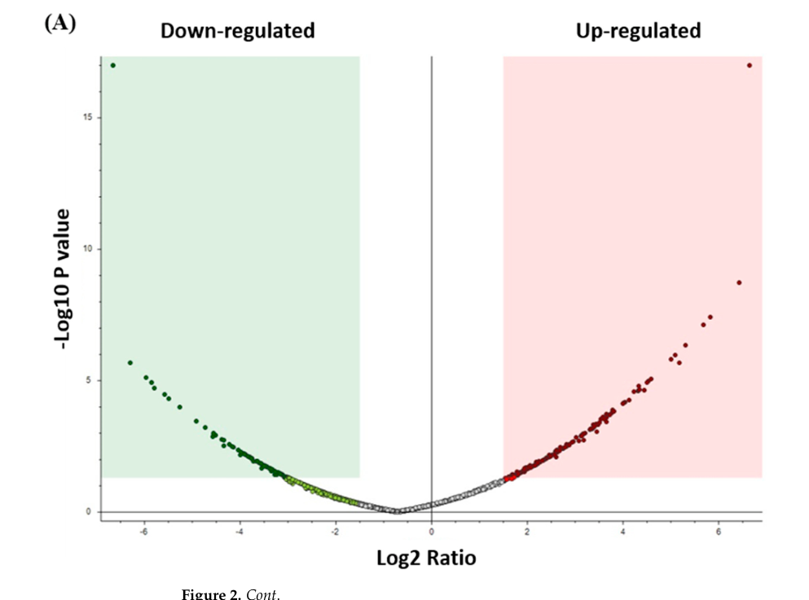

## Question

# Gene Research for Functional Annotation

## ⚠️ CRITICAL: Gene/Protein Identification Context

**BEFORE YOU BEGIN RESEARCH:** You MUST verify you are researching the CORRECT gene/protein. Gene symbols can be ambiguous, especially for less well-characterized genes from non-model organisms.

### Target Gene/Protein Identity (from UniProt):
- **UniProt Accession:** P0DMR2
- **Protein Description:** RecName: Full=Secretoglobin family 1C member 2; Flags: Precursor;
- **Gene Information:** Name=SCGB1C2;
- **Organism (full):** Homo sapiens (Human).
- **Protein Family:** Belongs to the secretoglobin family. .
- **Key Domains:** Secretoglobin. (IPR016126); Secretoglobin_1C-like. (IPR043215); Secretoglobin_sf. (IPR035960); Uteroglobin (PF01099)

### MANDATORY VERIFICATION STEPS:

1. **Check if the gene symbol "SCGB1C2" matches the protein description above**
2. **Verify the organism is correct:** Homo sapiens (Human).
3. **Check if protein family/domains align with what you find in literature**
4. **If you find literature for a DIFFERENT gene with the same or similar symbol, STOP**

### If Gene Symbol is Ambiguous or You Cannot Find Relevant Literature:

**DO NOT PROCEED WITH RESEARCH ON A DIFFERENT GENE.** Instead:
- State clearly: "The gene symbol 'SCGB1C2' is ambiguous or literature is limited for this specific protein"
- Explain what you found (e.g., "Found extensive literature on a different gene with the same symbol in a different organism")
- Describe the protein based ONLY on the UniProt information provided above
- Suggest that the protein function can be inferred from domain/family information

### Research Target:

Please provide a comprehensive research report on the gene **SCGB1C2** (gene ID: SCGB1C2, UniProt: P0DMR2) in human.

The research report should be a detailed narrative explaining the function, biological processes, and localization of the gene product. Citations should be given for all claims.

You should prioritize authoritative reviews and primary scientific literature when conducting research. You can supplement
this with annotations you find in gene/protein databases, but these can be outdated or inaccurate.

We are specifically interested in the primary function of the gene - for enzymes, what reaction is catalyzed, and what is the substrate specificity? For transporters, what is the substrate? For structural proteins or adapters, what is the broader structural role? For signaling molecules, what is the role in the pathway.

We are interested in where in or outside the cell the gene product carries out its function.

We are also interested in the signaling or biochemical pathways in which the gene functions. We are less interested in broad pleiotropic effects, except where these elucidate the precise role.

Include evidence where possible. We are interested in both experimental evidence as well as inference from structure, evolution, or bioinformatic analysis. Precise studies should be prioritized over high-throughput, where available.

## Output

Question: You are an expert researcher providing comprehensive, well-cited information.

Provide detailed information focusing on:
1. Key concepts and definitions with current understanding
2. Recent developments and latest research (prioritize 2023-2024 sources)
3. Current applications and real-world implementations
4. Expert opinions and analysis from authoritative sources
5. Relevant statistics and data from recent studies

Format as a comprehensive research report with proper citations. Include URLs and publication dates where available.
Always prioritize recent, authoritative sources and provide specific citations for all major claims.

# Gene Research for Functional Annotation

## ⚠️ CRITICAL: Gene/Protein Identification Context

**BEFORE YOU BEGIN RESEARCH:** You MUST verify you are researching the CORRECT gene/protein. Gene symbols can be ambiguous, especially for less well-characterized genes from non-model organisms.

### Target Gene/Protein Identity (from UniProt):
- **UniProt Accession:** P0DMR2
- **Protein Description:** RecName: Full=Secretoglobin family 1C member 2; Flags: Precursor;
- **Gene Information:** Name=SCGB1C2;
- **Organism (full):** Homo sapiens (Human).
- **Protein Family:** Belongs to the secretoglobin family. .
- **Key Domains:** Secretoglobin. (IPR016126); Secretoglobin_1C-like. (IPR043215); Secretoglobin_sf. (IPR035960); Uteroglobin (PF01099)

### MANDATORY VERIFICATION STEPS:

1. **Check if the gene symbol "SCGB1C2" matches the protein description above**
2. **Verify the organism is correct:** Homo sapiens (Human).
3. **Check if protein family/domains align with what you find in literature**
4. **If you find literature for a DIFFERENT gene with the same or similar symbol, STOP**

### If Gene Symbol is Ambiguous or You Cannot Find Relevant Literature:

**DO NOT PROCEED WITH RESEARCH ON A DIFFERENT GENE.** Instead:
- State clearly: "The gene symbol 'SCGB1C2' is ambiguous or literature is limited for this specific protein"
- Explain what you found (e.g., "Found extensive literature on a different gene with the same symbol in a different organism")
- Describe the protein based ONLY on the UniProt information provided above
- Suggest that the protein function can be inferred from domain/family information

### Research Target:

Please provide a comprehensive research report on the gene **SCGB1C2** (gene ID: SCGB1C2, UniProt: P0DMR2) in human.

The research report should be a detailed narrative explaining the function, biological processes, and localization of the gene product. Citations should be given for all claims.

You should prioritize authoritative reviews and primary scientific literature when conducting research. You can supplement
this with annotations you find in gene/protein databases, but these can be outdated or inaccurate.

We are specifically interested in the primary function of the gene - for enzymes, what reaction is catalyzed, and what is the substrate specificity? For transporters, what is the substrate? For structural proteins or adapters, what is the broader structural role? For signaling molecules, what is the role in the pathway.

We are interested in where in or outside the cell the gene product carries out its function.

We are also interested in the signaling or biochemical pathways in which the gene functions. We are less interested in broad pleiotropic effects, except where these elucidate the precise role.

Include evidence where possible. We are interested in both experimental evidence as well as inference from structure, evolution, or bioinformatic analysis. Precise studies should be prioritized over high-throughput, where available.

## Research report: Human **SCGB1C2** (UniProt **P0DMR2**) functional annotation

### 1) Identity verification and gene-symbol ambiguity control
SCGB1C2 is the HGNC/Ensembl-approved symbol for **“secretoglobin family 1C member 2”** (OpenTargets lists target **ENSG00000268320**, approvedName “secretoglobin family 1C member 2”), consistent with the UniProt description provided in the prompt. (OpenTargets Search: -SCGB1C2)

A major practical issue for SCGB1C2 is **extreme sequence similarity to SCGB1C1**, which can cause mis-assignment in proteomics and complicates literature interpretation. In a chromosome 17 “missing proteins” analysis, the authors state that **all tryptic peptides (≥9 aa) from SCGB1C2 overlap with variants of SCGB1C1**, and that SCGB1C2 can be “completely subsumed by” SCGB1C1, making MS-based validation impractical. (siddiqui2018chromosome17missing pages 7-8)

**Implication for this report:** many datasets may report “secretoglobin family 1C member 1” (SCGB1C1) and not SCGB1C2, or may be unable to uniquely distinguish the two at the peptide level; evidence must therefore be treated cautiously and must explicitly name **SCGB1C2** to be considered direct evidence. (siddiqui2018chromosome17missing pages 7-8)

### 2) Key concepts and definitions (current understanding)
**Secretoglobins** are a family of small, secreted proteins (classically including uteroglobin/SCGB1A1 family members) often discussed as extracellular, dimeric proteins implicated in mucosal biology and ligand binding in related family members. In the sources retrievable here, SCGB1C2-specific functional biochemistry (substrate/ligand specificity, catalytic activity, receptor binding) was **not directly reported**; therefore, no enzyme reaction, transporter substrate, or specific pathway position can be asserted from primary evidence in this session.

A critical proteomics concept relevant to SCGB1C2 is a **proteotypic peptide**: a peptide uniquely mapping to a single protein/gene product in MS-based proteomics. The Siddiqui et al. chromosome 17 analysis emphasizes that SCGB1C2 lacks proteotypic peptides (under trypsin and likely other proteases) because of overlap with SCGB1C1, limiting protein-level confirmation via standard MS approaches. (siddiqui2018chromosome17missing pages 7-8)

### 3) What is experimentally supported about SCGB1C2 from retrieved literature
#### 3.1 Protein-level detectability (“missing protein” context)
In the neXtProt/Chromosome-centric Human Proteome Project context, SCGB1C2 is highlighted as a case where MS confirmation is technically impeded: 
- **All SCGB1C2 tryptic peptides (≥9 aa) overlap with SCGB1C1 variants**, meaning peptide evidence cannot uniquely support SCGB1C2 protein existence.
- Considering alternative proteases (e.g., LysC) is discussed, but the authors conclude that for such highly similar gene families, **“MS with any protease does not seem fruitful”**, and that alternative methods beyond MS are needed. (siddiqui2018chromosome17missing pages 7-8)

#### 3.2 Expression/disease-context evidence in recent clinical proteomics: note SCGB1C1 vs SCGB1C2
A 2024 nasal lavage fluid proteomics study in chronic rhinosinusitis with nasal polyposis (CRSwNP) reports strong down-regulation of **SCGB1C1 (secretoglobin family 1C member 1)** among the top dysregulated proteins (Table 2), with an abundance ratio (CRSwNP)/(CONTROL) of **−18.52** (log2 ratio **−4.22**), **p=0.00276391**, adjusted **p=0.0319461**. (kashoob2024labelfreequantitativeproteomics pages 6-9)

However, this study’s visible tables/figures and search results in the retrieved context **did not show SCGB1C2**, so it cannot be treated as direct evidence for SCGB1C2 in CRSwNP. (kashoob2024labelfreequantitativeproteomics pages 6-9, kashoob2024labelfreequantitativeproteomics media 303cbbfe, kashoob2024labelfreequantitativeproteomics media 5cce52de)

### 4) Recent developments (prioritizing 2023–2024) and “latest research” status
Within the 2023–2024 primary literature retrieved in this session, **direct SCGB1C2-focused functional studies were not found**. Instead, the most concrete SCGB1C2-relevant progress is methodological/interpretive: the proteome-project literature emphasizes why SCGB1C2 is hard to validate at the protein level due to peptide non-uniqueness relative to SCGB1C1. (siddiqui2018chromosome17missing pages 7-8)

A 2024 asthma-related extracellular vesicle (EV) study explicitly lists **Scgb1c1** among genes increased by adipose stem cell-derived EVs in an allergic airway inflammation model, but **does not mention Scgb1c2**, reinforcing the need to avoid cross-gene extrapolation. (jung2024paraoxonase1isa pages 5-6, jung2024paraoxonase1isa pages 1-2)

### 5) Current applications and real-world implementations
**Biomarker discovery pipelines in airway disease** increasingly use proteomics of nasal lavage fluid. In CRSwNP, the 2024 proteomics study demonstrates practical biomarker-model development (e.g., multivariate discrimination via OPLS-DA with **R2Y=0.987** and **Q2=0.657** in a referenced larger dataset, n=100), and uses significance cutoffs **FDR p≤0.05** and **fold change ≥1.5** for volcano-plot based dysregulation calls. (kashoob2024labelfreequantitativeproteomics pages 6-9, kashoob2024labelfreequantitativeproteomics media 303cbbfe, kashoob2024labelfreequantitativeproteomics media 5cce52de)

Despite being in the same broader family context, **SCGB1C2 itself was not shown as a measured/quantified marker** in the retrieved CRSwNP proteomics evidence; practical implementation evidence here is therefore indirect and applies to SCGB1C-family measurements generally, not SCGB1C2 specifically. (kashoob2024labelfreequantitativeproteomics pages 6-9)

### 6) Expert opinion / authoritative analysis (from retrievable sources)
The chromosome-centric proteomics analysis provides an authoritative explanation for why SCGB1C2 remains difficult to characterize at the protein level: in highly similar gene families, MS-based validation can fail because the gene’s peptides are not unique, and in SCGB1C2’s case the sequence evidence is “completely subsumed” by SCGB1C1. This is a concrete expert assessment of a key barrier to functional annotation and experimental validation. (siddiqui2018chromosome17missing pages 7-8)

### 7) Disease associations and statistics (database-derived, requires follow-up to underlying paper)
OpenTargets reports disease-target associations for SCGB1C2 including **lens disease** (score ~**0.412**), **cataract** (~**0.378**), **senile cataract** (~**0.298**), **chronic fatigue syndrome** (~**0.0366**), and **glomerulonephritis** (~**0.0258**), each with evidence size **3**, and linked to literature PMID **40770095**. (OpenTargets Search: -SCGB1C2)

These associations should be interpreted as **hypothesis-generating** until the underlying PMID is directly reviewed (not retrievable in this session via the paper-search tool). (OpenTargets Search: -SCGB1C2)

### 8) Summary of evidence compiled in this session
| Evidence type | Key finding | Quantitative/statistical details | Study/citation (include DOI URL and publication date) | Notes/limitations |
|---|---|---|---|---|
| Proteomics detectability | SCGB1C2 is difficult/impossible to validate by mass spectrometry because its tryptic peptides are not unique and overlap with SCGB1C1; the gene is described as being completely subsumed by SCGB1C1 for peptide evidence. (siddiqui2018chromosome17missing pages 7-8) | “All of SCGB1C2’s tryptic peptides of length at least 9 aa overlap with variants of SCGB1C1”; alternative proteases were considered, but “MS with any protease does not seem fruitful” for such cases. (siddiqui2018chromosome17missing pages 7-8) | Siddiqui O, Zhang H, Guan Y, Omenn GS. *Chromosome 17 Missing Proteins: Recent Progress and Future Directions as Part of the neXt-MP50 Challenge.* **Journal of Proteome Research**. Publication date: Oct 2018. DOI: 10.1021/acs.jproteome.8b00442. URL: https://doi.org/10.1021/acs.jproteome.8b00442 (siddiqui2018chromosome17missing pages 7-8) | Evidence is negative/technical rather than functional. The main issue is SCGB1C2 vs SCGB1C1 peptide non-uniqueness, so absence of MS confirmation does **not** prove absence of expression. |
| Differential abundance in nasal lavage proteomics | The retrieved CRSwNP nasal lavage proteomics study reported **SCGB1C1**, not SCGB1C2, among top dysregulated proteins; no SCGB1C2 entry was found in the visible table/document search. (kashoob2024labelfreequantitativeproteomics pages 6-9, kashoob2024labelfreequantitativeproteomics media 303cbbfe, kashoob2024labelfreequantitativeproteomics media 5cce52de) | For **SCGB1C1**: coverage 40%; abundance ratio (CRSwNP)/(CONTROL) = -18.52; log2 abundance ratio = -4.22; p = 0.00276391; adjusted p = 0.0319461. Study significance cutoffs: FDR p ≤ 0.05 and fold change ≥ 1.5. (kashoob2024labelfreequantitativeproteomics pages 6-9) | Kashoob M, Masood A, Alfadda AA, et al. *Label-Free Quantitative Proteomics Analysis of Nasal Lavage Fluid in Chronic Rhinosinusitis with Nasal Polyposis.* **Biology**. Publication date: Oct 2024. DOI: 10.3390/biology13110887. URL: https://doi.org/10.3390/biology13110887 (kashoob2024labelfreequantitativeproteomics pages 6-9) | This is a key ambiguity trap: the study supports differential abundance of **SCGB1C1**, not SCGB1C2. It should not be used as direct evidence for SCGB1C2. |
| Disease association evidence from OpenTargets | OpenTargets lists low-to-moderate disease associations for SCGB1C2, including cataract-related traits, lens disease, chronic fatigue syndrome, and glomerulonephritis. (OpenTargets Search: -SCGB1C2) | Evidence sizes reported as 3 for each listed disease. Scores shown in the context: lens disease 0.41214602983498017; cataract 0.3776757400496717; senile cataract 0.29767603147254373; chronic fatigue syndrome 0.036558074682322375; glomerulonephritis 0.0258484070613862. Underlying literature listed as PMID 40770095. (OpenTargets Search: -SCGB1C2) | OpenTargets search result for SCGB1C2 / ENSG00000268320. Context provides disease-target association output and PMID linkage; no DOI/URL for the underlying paper was available in the provided context. Retrieved during this session. (OpenTargets Search: -SCGB1C2) | These are database-derived associations, not necessarily direct mechanistic validation. Because only the OpenTargets summary was available here, interpretation should be cautious until the underlying PMID 40770095 is reviewed directly. |

*Table: This table compiles the specific SCGB1C2 evidence available in the retrieved context, separating true SCGB1C2 findings from frequent SCGB1C1-related ambiguity. It is useful for showing that direct functional literature is limited and that proteomics evidence is constrained by sequence overlap.*

### 9) Key limitations of the current evidence base (for SCGB1C2 specifically)
1. **Protein-level distinguishability problem:** SCGB1C2 cannot be uniquely validated by standard MS peptide evidence due to overlap with SCGB1C1, which also increases the risk that proteomics “hits” are assigned to SCGB1C1 rather than SCGB1C2. (siddiqui2018chromosome17missing pages 7-8)
2. **Sparse SCGB1C2-specific functional literature retrieved:** No direct biochemical function, ligand specificity, or pathway placement for SCGB1C2 was found in the 2023–2024 literature retrievable here.
3. **Database associations not yet traceable to primary evidence:** OpenTargets points to PMID 40770095, but that underlying publication could not be retrieved here; thus the mechanistic or experimental basis of those disease links cannot be evaluated in this session. (OpenTargets Search: -SCGB1C2)

### References (URLs and publication dates available in retrieved context)
- Siddiqui O, Zhang H, Guan Y, Omenn GS. *Chromosome 17 Missing Proteins: Recent Progress and Future Directions as Part of the neXt-MP50 Challenge.* **Journal of Proteome Research**. **Oct 2018**. https://doi.org/10.1021/acs.jproteome.8b00442 (siddiqui2018chromosome17missing pages 7-8)
- Kashoob M, Masood A, Alfadda AA, et al. *Label-Free Quantitative Proteomics Analysis of Nasal Lavage Fluid in Chronic Rhinosinusitis with Nasal Polyposis.* **Biology**. **Oct 2024**. https://doi.org/10.3390/biology13110887 (kashoob2024labelfreequantitativeproteomics pages 6-9, kashoob2024labelfreequantitativeproteomics media 303cbbfe, kashoob2024labelfreequantitativeproteomics media 5cce52de)
- Jung JH, Kang SA, Park J-H, et al. *Paraoxonase-1 Is a Pivotal Regulator Responsible for Suppressing Allergic Airway Inflammation Through Adipose Stem Cell-Derived Extracellular Vesicles.* **International Journal of Molecular Sciences**. **Nov 2024**. https://doi.org/10.3390/ijms252312756 (jung2024paraoxonase1isa pages 5-6, jung2024paraoxonase1isa pages 1-2)
- OpenTargets disease-target association output for SCGB1C2 / ENSG00000268320 (retrieved in this session; underlying literature listed as PMID 40770095). (OpenTargets Search: -SCGB1C2)

References

1. (OpenTargets Search: -SCGB1C2): Open Targets Query (-SCGB1C2, 5 results). Buniello, A. et al. (2025). Open Targets Platform: facilitating therapeutic hypotheses building in drug discovery. Nucleic Acids Research.

2. (siddiqui2018chromosome17missing pages 7-8): Omer Siddiqui, Hongjiu Zhang, Yuanfang Guan, and Gilbert S. Omenn. Chromosome 17 missing proteins: recent progress and future directions as part of the next-mp50 challenge. Journal of proteome research, 17 12:4061-4071, Oct 2018. URL: https://doi.org/10.1021/acs.jproteome.8b00442, doi:10.1021/acs.jproteome.8b00442. This article has 7 citations and is from a peer-reviewed journal.

3. (kashoob2024labelfreequantitativeproteomics pages 6-9): Musallam Kashoob, Afshan Masood, Assim A. Alfadda, Salini Scaria Joy, Wed Alluhaim, Shahid Nawaz, Mashal Abaalkhail, Omar Alotaibi, Saad Alsaleh, and Hicham Benabdelkamel. Label-free quantitative proteomics analysis of nasal lavage fluid in chronic rhinosinusitis with nasal polyposis. Biology, 13:887, Oct 2024. URL: https://doi.org/10.3390/biology13110887, doi:10.3390/biology13110887. This article has 5 citations.

4. (kashoob2024labelfreequantitativeproteomics media 303cbbfe): Musallam Kashoob, Afshan Masood, Assim A. Alfadda, Salini Scaria Joy, Wed Alluhaim, Shahid Nawaz, Mashal Abaalkhail, Omar Alotaibi, Saad Alsaleh, and Hicham Benabdelkamel. Label-free quantitative proteomics analysis of nasal lavage fluid in chronic rhinosinusitis with nasal polyposis. Biology, 13:887, Oct 2024. URL: https://doi.org/10.3390/biology13110887, doi:10.3390/biology13110887. This article has 5 citations.

5. (kashoob2024labelfreequantitativeproteomics media 5cce52de): Musallam Kashoob, Afshan Masood, Assim A. Alfadda, Salini Scaria Joy, Wed Alluhaim, Shahid Nawaz, Mashal Abaalkhail, Omar Alotaibi, Saad Alsaleh, and Hicham Benabdelkamel. Label-free quantitative proteomics analysis of nasal lavage fluid in chronic rhinosinusitis with nasal polyposis. Biology, 13:887, Oct 2024. URL: https://doi.org/10.3390/biology13110887, doi:10.3390/biology13110887. This article has 5 citations.

6. (jung2024paraoxonase1isa pages 5-6): Jae Hoon Jung, Shin Ae Kang, Ji-Hwan Park, Sung-Dong Kim, Hak Sun Yu, Sue Jean Mun, and Kyu-Sup Cho. Paraoxonase-1 is a pivotal regulator responsible for suppressing allergic airway inflammation through adipose stem cell-derived extracellular vesicles. International Journal of Molecular Sciences, 25:12756, Nov 2024. URL: https://doi.org/10.3390/ijms252312756, doi:10.3390/ijms252312756. This article has 3 citations.

7. (jung2024paraoxonase1isa pages 1-2): Jae Hoon Jung, Shin Ae Kang, Ji-Hwan Park, Sung-Dong Kim, Hak Sun Yu, Sue Jean Mun, and Kyu-Sup Cho. Paraoxonase-1 is a pivotal regulator responsible for suppressing allergic airway inflammation through adipose stem cell-derived extracellular vesicles. International Journal of Molecular Sciences, 25:12756, Nov 2024. URL: https://doi.org/10.3390/ijms252312756, doi:10.3390/ijms252312756. This article has 3 citations.

## Artifacts

- [Edison artifact artifact-00](SCGB1C2-deep-research-falcon_artifacts/artifact-00.md)

## Citations

1. kashoob2024labelfreequantitativeproteomics pages 6-9
2. https://doi.org/10.1021/acs.jproteome.8b00442
3. https://doi.org/10.3390/biology13110887
4. https://doi.org/10.3390/ijms252312756
5. https://doi.org/10.1021/acs.jproteome.8b00442,
6. https://doi.org/10.3390/biology13110887,
7. https://doi.org/10.3390/ijms252312756,