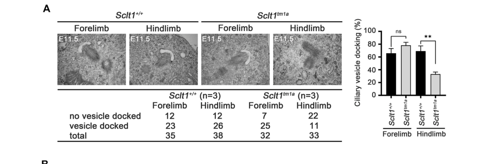

## Question

# Gene Research for Functional Annotation

## ⚠️ CRITICAL: Gene/Protein Identification Context

**BEFORE YOU BEGIN RESEARCH:** You MUST verify you are researching the CORRECT gene/protein. Gene symbols can be ambiguous, especially for less well-characterized genes from non-model organisms.

### Target Gene/Protein Identity (from UniProt):
- **UniProt Accession:** Q96NL6
- **Protein Description:** RecName: Full=Sodium channel and clathrin linker 1; AltName: Full=Sodium channel-associated protein 1;
- **Gene Information:** Name=SCLT1; Synonyms=SAP1;
- **Organism (full):** Homo sapiens (Human).
- **Protein Family:** Not specified in UniProt
- **Key Domains:** SCLT1. (IPR038911); CEP89 (PF28159)

### MANDATORY VERIFICATION STEPS:

1. **Check if the gene symbol "SCLT1" matches the protein description above**
2. **Verify the organism is correct:** Homo sapiens (Human).
3. **Check if protein family/domains align with what you find in literature**
4. **If you find literature for a DIFFERENT gene with the same or similar symbol, STOP**

### If Gene Symbol is Ambiguous or You Cannot Find Relevant Literature:

**DO NOT PROCEED WITH RESEARCH ON A DIFFERENT GENE.** Instead:
- State clearly: "The gene symbol 'SCLT1' is ambiguous or literature is limited for this specific protein"
- Explain what you found (e.g., "Found extensive literature on a different gene with the same symbol in a different organism")
- Describe the protein based ONLY on the UniProt information provided above
- Suggest that the protein function can be inferred from domain/family information

### Research Target:

Please provide a comprehensive research report on the gene **SCLT1** (gene ID: SCLT1, UniProt: Q96NL6) in human.

The research report should be a detailed narrative explaining the function, biological processes, and localization of the gene product. Citations should be given for all claims.

You should prioritize authoritative reviews and primary scientific literature when conducting research. You can supplement
this with annotations you find in gene/protein databases, but these can be outdated or inaccurate.

We are specifically interested in the primary function of the gene - for enzymes, what reaction is catalyzed, and what is the substrate specificity? For transporters, what is the substrate? For structural proteins or adapters, what is the broader structural role? For signaling molecules, what is the role in the pathway.

We are interested in where in or outside the cell the gene product carries out its function.

We are also interested in the signaling or biochemical pathways in which the gene functions. We are less interested in broad pleiotropic effects, except where these elucidate the precise role.

Include evidence where possible. We are interested in both experimental evidence as well as inference from structure, evolution, or bioinformatic analysis. Precise studies should be prioritized over high-throughput, where available.

## Output

Question: You are an expert researcher providing comprehensive, well-cited information.

Provide detailed information focusing on:
1. Key concepts and definitions with current understanding
2. Recent developments and latest research (prioritize 2023-2024 sources)
3. Current applications and real-world implementations
4. Expert opinions and analysis from authoritative sources
5. Relevant statistics and data from recent studies

Format as a comprehensive research report with proper citations. Include URLs and publication dates where available.
Always prioritize recent, authoritative sources and provide specific citations for all major claims.

# Gene Research for Functional Annotation

## ⚠️ CRITICAL: Gene/Protein Identification Context

**BEFORE YOU BEGIN RESEARCH:** You MUST verify you are researching the CORRECT gene/protein. Gene symbols can be ambiguous, especially for less well-characterized genes from non-model organisms.

### Target Gene/Protein Identity (from UniProt):
- **UniProt Accession:** Q96NL6
- **Protein Description:** RecName: Full=Sodium channel and clathrin linker 1; AltName: Full=Sodium channel-associated protein 1;
- **Gene Information:** Name=SCLT1; Synonyms=SAP1;
- **Organism (full):** Homo sapiens (Human).
- **Protein Family:** Not specified in UniProt
- **Key Domains:** SCLT1. (IPR038911); CEP89 (PF28159)

### MANDATORY VERIFICATION STEPS:

1. **Check if the gene symbol "SCLT1" matches the protein description above**
2. **Verify the organism is correct:** Homo sapiens (Human).
3. **Check if protein family/domains align with what you find in literature**
4. **If you find literature for a DIFFERENT gene with the same or similar symbol, STOP**

### If Gene Symbol is Ambiguous or You Cannot Find Relevant Literature:

**DO NOT PROCEED WITH RESEARCH ON A DIFFERENT GENE.** Instead:
- State clearly: "The gene symbol 'SCLT1' is ambiguous or literature is limited for this specific protein"
- Explain what you found (e.g., "Found extensive literature on a different gene with the same symbol in a different organism")
- Describe the protein based ONLY on the UniProt information provided above
- Suggest that the protein function can be inferred from domain/family information

### Research Target:

Please provide a comprehensive research report on the gene **SCLT1** (gene ID: SCLT1, UniProt: Q96NL6) in human.

The research report should be a detailed narrative explaining the function, biological processes, and localization of the gene product. Citations should be given for all claims.

You should prioritize authoritative reviews and primary scientific literature when conducting research. You can supplement
this with annotations you find in gene/protein databases, but these can be outdated or inaccurate.

We are specifically interested in the primary function of the gene - for enzymes, what reaction is catalyzed, and what is the substrate specificity? For transporters, what is the substrate? For structural proteins or adapters, what is the broader structural role? For signaling molecules, what is the role in the pathway.

We are interested in where in or outside the cell the gene product carries out its function.

We are also interested in the signaling or biochemical pathways in which the gene functions. We are less interested in broad pleiotropic effects, except where these elucidate the precise role.

Include evidence where possible. We are interested in both experimental evidence as well as inference from structure, evolution, or bioinformatic analysis. Precise studies should be prioritized over high-throughput, where available.

# Functional annotation report: human SCLT1 (UniProt Q96NL6)

**Identity and conclusion.** The specified human gene is **SCLT1**, encoding sodium channel and clathrin linker 1; SAP1 is an alias supplied with the UniProt identification, and the historical name **CAP-1A** appears in channel-trafficking research. SCLT1 is **not CEP89**: both are separately identified proteins of the mother-centriole distal appendage. In particular, the supplied Pfam label “CEP89” should not be read as a gene-name reassignment. The best-supported principal cellular function of SCLT1 is to help organize the **distal-appendage scaffold that initiates primary-cilium formation**, not to conduct sodium ions. Its separately reported NaV1.8-binding activity may serve a channel-adaptor role, but does not explain the extensive ciliogenesis phenotype on its own. The accession, organism and SAP1 alias are taken from the supplied UniProt record; the protein names and distinction from CEP89 are independently consistent with the experimental literature. (tanos2013centrioledistalappendages pages 1-2, kanie2025ahierarchicalpathway pages 1-5, tyagi2025targetedubiquitinationof pages 1-5)

## Location, molecular role and assembly pathway

SCLT1 acts principally at the **distal appendages of the mature mother centriole**. When that centriole becomes a basal body, these appendages form the interface with the nascent ciliary membrane—often described as transition fibers. They are distinct from subdistal appendages and from the extended ciliary axoneme. Distal appendages are approximately ninefold-symmetric, blade-like structures; super-resolution mapping places SCLT1 in the upper-middle region of an appendage. The last positional assignment comes from a detailed human-cell study available in the retrieved record as a **bioRxiv preprint posted 10 January 2023**, despite its 2025 bibliographic indexing. (ma2023structureandfunction pages 2-3, kanie2025ahierarchicalpathway pages 17-20, kanie2025ahierarchicalpathway pages 1-5, lee2022tissuespecificrequirementof pages 7-10)

The foundational human RPE1-cell depletion study placed **CEP83 upstream of SCLT1 and CEP89**, with recruitment of **CEP164 and FBF1 dependent on SCLT1** but not on CEP89. Loss of these appendage components impaired ciliogenesis; CEP83 depletion also prevented centriole-to-membrane docking. These are *localization and loss-of-function dependencies*, not proof that every recruitment step is a direct binary protein interaction. A later SCLT1-knockout analysis found a stronger, reciprocal dependence of CEP83 localization on SCLT1, suggesting a **CEP83–SCLT1 structural module** rather than a strictly one-way chain; complete knockout and earlier partial RNA depletion need not give identical hierarchies. (tanos2013centrioledistalappendages pages 1-2, tanos2013centrioledistalappendages pages 2-3, kanie2025ahierarchicalpathway pages 8-11, kanie2025ahierarchicalpathway pages 17-20)

An experimentally mapped physical contact strengthens this scaffold interpretation: yeast two-hybrid testing found that the **SCLT1 C-terminal coiled-coil region, residues 554–688**, interacts with the leucine-rich-repeat region of **LRRC45, residues 1–222**. Depleting SCLT1 reduced centriolar LRRC45, and depleting LRRC45 reduced FBF1 localization. These results support assembly of an interacting appendage network, although the isolated binding assay does not itself resolve the atomic architecture inside a human cell. The supplied SCLT1 InterPro assignment and coiled-coil interaction are consistent with an adaptor/scaffold; neither establishes an enzymatic reaction or a transport substrate. (kurtulmus2018lrrc45contributesto pages 7-10)

**Ciliogenesis sequence.** By maintaining appendage integrity, SCLT1 permits recruitment or docking of a preciliary vesicle, membrane engagement of the basal body, recruitment of the **CEP164–TTBK2** module, removal of the inhibitory centriole cap **CP110**, and recruitment of ciliary-assembly machinery including **IFT88**. In human RPE1 knockouts, loss of SCLT1 markedly compromised vesicle recruitment, CP110 removal and IFT88 recruitment. The mechanistic interpretation is primarily **structural and upstream**: it would be an overstatement to say that SCLT1 itself phosphorylates CP110, directly transports IFT cargo, or directly binds a ciliary vesicle. (tanos2013centrioledistalappendages pages 2-3, kanie2025ahierarchicalpathway pages 17-20)

An independently published **2024** comparison sharpened the distinction between appendage components. In mouse NIH3T3 cells, depletion of **Sclt1, Cep83 or Cep164** markedly reduced ciliation and basal-body membrane anchoring, whereas depletion of **Cep89 or Fbf1** did not produce those early-assembly defects under the same conditions. The authors associated CEP89/FBF1 instead with delayed serum-induced cilium disassembly and reduced Aurora A abundance; those **Aurora A observations should not be attributed to SCLT1**. The assays were in mouse fibroblasts, with three independent experiments for the reported ciliation comparisons. (je2024distinctrolesof pages 3-5, je2024distinctrolesof pages 5-9)

A **2025 peer-reviewed eLife** study supplies a more specific account of vesicle capture: CEP89 directly associates with **NCS1**, whose myristoylation is needed to engage the preciliary-vesicle pathway. Both CEP89 and NCS1 showed greatly diminished centriolar localization following SCLT1 knockout. This supports a model in which SCLT1 organizes the platform on which a **CEP89–NCS1 membrane-capture module** operates; it does *not* demonstrate direct SCLT1–NCS1 binding or identify SCLT1 as the vesicle-binding molecule. The difference between the 2024 mouse result that CEP89 was dispensable for early assembly and human RPE1 evidence for a CEP89-dependent vesicle step highlights cell-type and kinetic context, rather than an identity conflict between SCLT1 and CEP89. (kanie2025myristoylatedneuronalcalcium pages 6-8, kanie2025myristoylatedneuronalcalcium pages 10-12, kanie2025myristoylatedneuronalcalcium pages 4-5, je2024distinctrolesof pages 3-5)

## Signaling and physiological consequences

**Hedgehog signaling is a downstream consequence of SCLT1-dependent ciliogenesis**, not an established direct biochemical activity of SCLT1. In developing mouse limbs, Sclt1 loss disrupted recruitment of CEP164 and FBF1 while CEP83 and CEP89 remained detectable at centrioles; mutant **hindlimb preciliary-vesicle docking fell by about 50%** relative to the comparisons reported by the authors. TTBK2 recruitment diminished, CP110 persisted abnormally, and fewer cells formed cilia. Mutant embryos accumulated full-length **GLI3** with reduced repressor-form GLI3, while mutant hindlimb mesenchymal cells had reduced *Gli1* and *Ptch1* induction after Smoothened-agonist stimulation. Hindlimbs developed preaxial polydactyly whereas forelimbs were comparatively spared; reducing Cep83 dosage in Sclt1 mutants exposed a forelimb phenotype too. These are strong in-vivo observations but do not imply uniform SCLT1 dependence in every tissue. Figure 3 of the study presents the docking, TTBK2 and CP110 comparisons. (lee2022tissuespecificrequirementof pages 5-7, lee2022tissuespecificrequirementof media 91502cd4, lee2022tissuespecificrequirementof media 6966e056, lee2022tissuespecificrequirementof pages 7-10)

Mouse kidney experiments likewise linked Sclt1 deficiency to loss of tubular epithelial cilia, cystogenesis and increased **ERK1/2, PKA and STAT3** pathway readouts; later fibrosis-associated signaling was also observed. The precise route from appendage failure to each kinase response remains incompletely established. Maternal treatment of mutant mice with **pyrimethamine, 30 mg/kg/day starting embryonic day 12.5 for seven days**, reduced cyst burden and proliferation in the reported experiment. The investigators cautioned that pyrimethamine is **not a selective STAT3 inhibitor**: its other activities prevent this result from proving that direct STAT3 inhibition alone reverses disease. It is a preclinical finding, not a demonstrated treatment for people with SCLT1 variants. (li2017sclt1deficiencycauses pages 1-6, li2017sclt1deficiencycauses pages 11-15, li2017sclt1deficiencycauses pages 15-20, li2017sclt1deficiencycauses pages 20-27)

## The historical sodium-channel/clathrin role

SCLT1’s expanded name reflects a **second line of research**, not sodium-channel conductance by SCLT1. The original report, Liu and colleagues’ **2005** paper *“CAP-1A is a novel linker that binds clathrin and the voltage-gated sodium channel NaV1.8”* ([DOI](https://doi.org/10.1016/j.mcn.2004.11.007)), is identified in subsequent literature; the original article’s full experimental methods were not available in this retrieval. Later authors explicitly equate CAP-1A with SCLT1 and report selective binding to the cytoplasmic C terminus of **NaV1.8/SCN10A** via an SCLT1 **myosin-tail-like region**. This is evidence for an additional protein-adaptor interaction, but the available recent experiments do not establish the prevalence of an endogenous human SCLT1–NaV1.8–clathrin complex across tissues or show that this is the dominant explanation of SCLT1-related ciliopathy. Terms such as “myosin-tail-like” and “V-pump homology” describe reported sequence/domain assignments, **not demonstrated myosin motor or ATPase activity**. (tyagi2025targetedubiquitinationof pages 53-57, tyagi2025targetedubiquitinationof pages 1-5, li2017sclt1deficiencycauses pages 1-6)

A **2025 bioRxiv preprint** exploited that channel-binding region for an engineered **SCLT1-domain–NEDD4L ubiquitin-ligase fusion**, termed UbiquiNaV. In rat dorsal-root-ganglion neurons, overexpressed full-length Sclt1 reduced NaV1.8 current density from **288.8 ± 37.5 to 123.3 ± 22.5 pA/pF**; the engineered fusion reduced current and channel surface abundance, whereas a catalytically inactive fusion did not reproduce the current effect. This is a *research-stage engineered use of an SCLT1 binding module*, not evidence that endogenous SCLT1 is an E3 ligase or that the construct is a clinical therapy. (tyagi2025targetedubiquitinationof pages 5-9, tyagi2025targetedubiquitinationof pages 1-5)

## Human genetic evidence and current use

Biallelic SCLT1 variants are implicated in a **spectrum of rare ciliopathies** with variable eye, kidney and developmental involvement. The initial oral–facial–digital syndrome type IX report, published online **6 November 2013** and in the **January 2014** issue, examined two individuals with **different causal-gene candidates**. Critically, **index 2**, not index 1, had the SCLT1 donor-site variant **c.290+2T>C**, which caused complete exon-5 skipping and the frameshift **p.Lys79Valfs*4** in patient RNA; **index 1 had TBC1D32/C6orf170 c.1372+1G>T**. The original authors appropriately noted that the single SCLT1 case required independent confirmation. (adly2014ciliarygenestbc1d32c6orf170 pages 1-2, adly2014ciliarygenestbc1d32c6orf170 pages 2-4)

Subsequent clinical reports broadened that evidence. In **2020**, two unrelated patients with Bardet–Biedl-like disease carried the same compound-heterozygous SCLT1 alleles, **c.1218G>A and c.1631A>G**; exon-14 skipping was experimentally verified for c.1218G>A. Both had major renal and retinal involvement, obesity and mild intellectual disability **without polydactyly**, showing why absence of a stereotypical ciliopathy feature does not exclude SCLT1. A **2026** inherited-retinal-disease study found rare biallelic SCLT1 variants in **six probands from six families among approximately 8,500 cases**—about **0.07% of that ascertainment cohort**, *not* population prevalence—and functionally demonstrated aberrant splicing for several alleles. Present real-world use is therefore **molecular diagnosis and variant interpretation** in suitable inherited retinal, renal and developmental presentations, supported where possible by segregation and RNA assays; neither a gene-specific approved treatment nor a validated SCLT1-targeted drug follows from these reports. A pertinent **2024** two-sibling retinal case report was identified bibliographically but was unavailable for full-text verification, so no detailed claim here depends on it. (morisada2020bardet–biedlsyndromein pages 5-6, sangermano2026variantsinthe pages 5-10, morisada2020bardet–biedlsyndromein pages 1-3, adly2014ciliarygenestbc1d32c6orf170 pages 2-4)

The evidence matrix separates experimentally established SCLT1 functions from model-based consequences and preliminary applications.

| Finding | System, year, source | What it establishes / limitations |
|---|---|---|
| CEP83 recruits SCLT1 and CEP89; SCLT1 is then required for CEP164 and FBF1 recruitment. Depleting any of the five tested distal-appendage proteins impaired ciliogenesis. | Human hTERT-RPE1 cells; 2013; Tanos et al., *Genes & Development*. [DOI](https://doi.org/10.1101/gad.207043.112) (tanos2013centrioledistalappendages pages 1-2, tanos2013centrioledistalappendages pages 2-3) | Foundational human-cell evidence that SCLT1 is a mother-centriole distal-appendage scaffold supporting membrane docking and early ciliogenesis. RNAi study; it did not establish an enzymatic activity or directly test every later-defined pathway component. |
| LRRC45 localization depends on CEP83/SCLT1; yeast two-hybrid mapped strong binding between LRRC45 residues 1–222 and the SCLT1 C-terminal coiled-coil region, residues 554–688. | Human cultured cells plus yeast two-hybrid; 2018; Kurtulmus et al., *Journal of Cell Science*. [DOI](https://doi.org/10.1242/jcs.223594) (kurtulmus2018lrrc45contributesto pages 7-10) | Supports a direct structural interaction and places LRRC45 downstream of SCLT1. Yeast two-hybrid is not an in-situ structural determination. |
| Sclt1 loss preserved CEP83/CEP89 localization but disrupted CEP164/FBF1 recruitment; preciliary-vesicle docking in mutant hindlimbs fell by about 50%, with reduced TTBK2 recruitment, failed CP110 removal and impaired Hedgehog signaling. | Mouse embryonic limb mesenchyme; 2022; Lee et al., *Frontiers in Cell and Developmental Biology*. [DOI](https://doi.org/10.3389/fcell.2022.1058895) (lee2022tissuespecificrequirementof pages 5-7, lee2022tissuespecificrequirementof pages 7-10) | In-vivo evidence connecting the SCLT1 scaffold to docking and Hedgehog-dependent development. Strong tissue dependence—forelimbs were relatively spared—limits simple extrapolation across organs or to humans. |
| siRNA against Cep83, Sclt1 or Cep164 markedly reduced ciliation and basal-body membrane anchoring; Cep89 or Fbf1 depletion did not. | Mouse NIH3T3 cells; 2024; Je & Ko, *Cell Communication and Signaling*. [DOI](https://doi.org/10.1186/s12964-024-01962-7) (je2024distinctrolesof pages 3-5, je2024distinctrolesof pages 5-9) | Independently identifies SCLT1 with CEP83/CEP164 as an assembly/docking module, distinct from the CEP89/FBF1 disassembly module. Results are siRNA-based, in mouse fibroblasts, with three experimental replicates. |
| CRISPR knockout made CEP83 and SCLT1 appear co-dependent; loss of SCLT1 severely compromised vesicle recruitment, CP110 removal and IFT88 recruitment. SCLT1 mapped to the upper-middle distal appendage. | Human hTERT-RPE1 cells; bioRxiv version posted 10 Jan 2023, indexed as 2025; Kanie et al. [DOI](https://doi.org/10.1101/2023.01.06.522944) (kanie2025ahierarchicalpathway pages 8-11, kanie2025ahierarchicalpathway pages 17-20, kanie2025ahierarchicalpathway pages 1-5) | Refines the linear hierarchy into a CEP83–SCLT1 structural-backbone model using complete knockouts. **Preprint:** conclusions had not undergone journal peer review in the retrieved version. |
| CEP89 recruits NCS1; myristoylated NCS1 captures preciliary vesicles. CEP89 and NCS1 centriolar localization were greatly reduced in SCLT1-knockout cells. | Human RPE cells; 2025; Kanie et al., *eLife*. [DOI](https://doi.org/10.7554/eLife.85998) (kanie2025myristoylatedneuronalcalcium pages 6-8) | Peer-reviewed evidence that SCLT1 supports the CEP89–NCS1 vesicle-capture machinery indirectly as a distal-appendage scaffold. It does not show direct SCLT1–NCS1 or SCLT1–vesicle binding. |
| In OFD-IX **index 2**, homozygous SCLT1 c.290+2T>C caused complete exon-5 skipping and p.Lys79Valfs*4 without detectable nonsense-mediated decay. **Index 1 instead carried TBC1D32 c.1372+1G>T.** | Human simplex cases; 2014; Adly et al., *Human Mutation*. [DOI](https://doi.org/10.1002/humu.22477) (adly2014ciliarygenestbc1d32c6orf170 pages 1-2, adly2014ciliarygenestbc1d32c6orf170 pages 2-4) | Establishes the crucial gene/case distinction and provides transcript-level evidence for the SCLT1 allele. Initial evidence was one SCLT1 case, and the authors requested independent confirmation. |
| Two unrelated patients carried identical compound-heterozygous SCLT1 variants c.1218G>A and c.1631A>G; c.1218G>A was experimentally shown to skip exon 14. Both had renal failure/retinal disease, obesity and mild intellectual disability but no polydactyly. | Human case series; 2020; Morisada et al., *CEN Case Reports*. [DOI](https://doi.org/10.1007/s13730-020-00472-y) (morisada2020bardet–biedlsyndromein pages 5-6, morisada2020bardet–biedlsyndromein pages 1-3) | Expands SCLT1 disease to a Bardet–Biedl-like phenotype and demonstrates variable expressivity. Only two new patients; classification rests on clinical overlap rather than SCLT1 being a BBSome subunit. |
| Six probands from six families among approximately 8,500 inherited-retinal-disease cases carried rare biallelic SCLT1 variants; several alleles caused abnormal splicing. | Human cohort; 2026; Sangermano et al., *npj Genomic Medicine*. [DOI](https://doi.org/10.1038/s41525-026-00566-z) (sangermano2026variantsinthe pages 5-10) | Extends the spectrum to nonsyndromic and syndromic retinal degeneration with variable onset. Yield was about 0.07% of the screened cohort; this is newer than the requested 2023–2024 priority window. |
| Sclt1-null mice developed renal cilia loss and ERK/STAT3-associated cystic disease. Maternal pyrimethamine, 30 mg/kg/day from E12.5 for seven days, reduced cyst burden and proliferation. | Mouse model; 2017; Li et al., *Human Molecular Genetics*. [DOI](https://doi.org/10.1093/hmg/ddx183) (li2017sclt1deficiencycauses pages 1-6, li2017sclt1deficiencycauses pages 11-15, li2017sclt1deficiencycauses pages 15-20, li2017sclt1deficiencycauses pages 20-27) | Provides preclinical pathway and intervention hypotheses. Pyrimethamine is not STAT3-selective and also affects DHFR/CYP pathways; no human efficacy is established. |
| An engineered fusion of the NaV1.8-binding SCLT1 myosin-tail-like domain to NEDD4L’s HECT domain reduced NaV1.8 current, surface abundance and axonal delivery; full SCLT1 overexpression reduced current from 288.8 ± 37.5 to 123.3 ± 22.5 pA/pF. | Rodent sensory neurons; 2025 bioRxiv preprint; Tyagi et al. [DOI](https://doi.org/10.1101/2025.02.04.636451) (tyagi2025targetedubiquitinationof pages 5-9, tyagi2025targetedubiquitinationof pages 1-5) | Demonstrates a synthetic-therapeutic use of SCLT1’s selective NaV1.8-binding module and supports the historical CAP-1A function. It is an engineered preclinical construct—not evidence that endogenous SCLT1 is a transporter, an approved target, or that the native channel-trafficking role is its dominant function in humans. |

*Table: Compact evidence matrix for verified human SCLT1/Q96NL6, separating direct human-cell and clinical findings from mouse studies, preprints and engineered applications. It also flags the critical distinction between the SCLT1 and TBC1D32 OFD-IX cases.*

**Overall assessment.** For functional annotation, classify human SCLT1 primarily as a **mother-centriole distal-appendage structural/adaptor protein required for efficient membrane docking and initiation of primary ciliogenesis**. Its best-resolved contacts include LRRC45 and an originally characterized NaV1.8-binding region; a kinase, ion-transport or intrinsic enzymatic function has not been established. Cite mouse Hedgehog/renal signaling phenotypes as **consequences of disrupted ciliogenesis**, and keep complete-knockout refinements from the 2023 bioRxiv manuscript and the 2025 engineered channel-degrader report explicitly distinguished from peer-reviewed human clinical evidence. (kurtulmus2018lrrc45contributesto pages 7-10, tanos2013centrioledistalappendages pages 2-3, lee2022tissuespecificrequirementof pages 5-7, kanie2025ahierarchicalpathway pages 17-20, li2017sclt1deficiencycauses pages 15-20, tyagi2025targetedubiquitinationof pages 5-9)

References

1. (tanos2013centrioledistalappendages pages 1-2): Barbara E. Tanos, Hui-Ju Yang, Rajesh Soni, Won-Jing Wang, Frank P. Macaluso, John M. Asara, and Meng-Fu Bryan Tsou. Centriole distal appendages promote membrane docking, leading to cilia initiation. Genes & development, 27 2:163-8, Jan 2013. URL: https://doi.org/10.1101/gad.207043.112, doi:10.1101/gad.207043.112. This article has 529 citations and is from a highest quality peer-reviewed journal.

2. (kanie2025ahierarchicalpathway pages 1-5): Tomoharu Kanie, Julia F. Love, Saxton D. Fisher, Anna-Karin Gustavsson, and Peter K. Jackson. A hierarchical pathway for assembly of the distal appendages that organize primary cilia. bioRxiv, Jan 2025. URL: https://doi.org/10.1101/2023.01.06.522944, doi:10.1101/2023.01.06.522944. This article has 37 citations.

3. (tyagi2025targetedubiquitinationof pages 1-5): Sidharth Tyagi, Mohammad-Reza Ghovanloo, Matthew Alsaloum, Philip Effraim, Grant P. Higerd-Rusli, Fadia Dib-Hajj, Peng Zhao, Shujun Liu, Stephen G. Waxman, and Sulayman D. Dib-Hajj. Targeted ubiquitination of nav1.8 reduces sensory neuronal excitability. bioRxiv, Feb 2025. URL: https://doi.org/10.1101/2025.02.04.636451, doi:10.1101/2025.02.04.636451. This article has 7 citations.

4. (ma2023structureandfunction pages 2-3): Dandan Ma, Fulin Wang, Junlin Teng, Ning Huang, and Jianguo Chen. Structure and function of distal and subdistal appendages of the mother centriole. Journal of cell science, Feb 2023. URL: https://doi.org/10.1242/jcs.260560, doi:10.1242/jcs.260560. This article has 57 citations and is from a domain leading peer-reviewed journal.

5. (kanie2025ahierarchicalpathway pages 17-20): Tomoharu Kanie, Julia F. Love, Saxton D. Fisher, Anna-Karin Gustavsson, and Peter K. Jackson. A hierarchical pathway for assembly of the distal appendages that organize primary cilia. bioRxiv, Jan 2025. URL: https://doi.org/10.1101/2023.01.06.522944, doi:10.1101/2023.01.06.522944. This article has 37 citations.

6. (lee2022tissuespecificrequirementof pages 7-10): Hankyu Lee, Kyeong-Hye Moon, Jieun Song, Suyeon Je, Jinwoong Bok, and Hyuk Wan Ko. Tissue-specific requirement of sodium channel and clathrin linker 1 (sclt1) for ciliogenesis during limb development. Frontiers in Cell and Developmental Biology, Nov 2022. URL: https://doi.org/10.3389/fcell.2022.1058895, doi:10.3389/fcell.2022.1058895. This article has 10 citations.

7. (tanos2013centrioledistalappendages pages 2-3): Barbara E. Tanos, Hui-Ju Yang, Rajesh Soni, Won-Jing Wang, Frank P. Macaluso, John M. Asara, and Meng-Fu Bryan Tsou. Centriole distal appendages promote membrane docking, leading to cilia initiation. Genes & development, 27 2:163-8, Jan 2013. URL: https://doi.org/10.1101/gad.207043.112, doi:10.1101/gad.207043.112. This article has 529 citations and is from a highest quality peer-reviewed journal.

8. (kanie2025ahierarchicalpathway pages 8-11): Tomoharu Kanie, Julia F. Love, Saxton D. Fisher, Anna-Karin Gustavsson, and Peter K. Jackson. A hierarchical pathway for assembly of the distal appendages that organize primary cilia. bioRxiv, Jan 2025. URL: https://doi.org/10.1101/2023.01.06.522944, doi:10.1101/2023.01.06.522944. This article has 37 citations.

9. (kurtulmus2018lrrc45contributesto pages 7-10): Bahtiyar Kurtulmus, Cheng Yuan, Jakob Schuy, Annett Neuner, Shoji Hata, Georgios Kalamakis, Ana Martin-Villalba, and Gislene Pereira. Lrrc45 contributes to early steps of axoneme extension. Journal of Cell Science, Sep 2018. URL: https://doi.org/10.1242/jcs.223594, doi:10.1242/jcs.223594. This article has 56 citations and is from a domain leading peer-reviewed journal.

10. (je2024distinctrolesof pages 3-5): Su-yeon Je and Hyuk Wan Ko. Distinct roles of centriole distal appendage proteins in ciliary assembly and disassembly. Cell Communication and Signaling : CCS, Dec 2024. URL: https://doi.org/10.1186/s12964-024-01962-7, doi:10.1186/s12964-024-01962-7. This article has 1 citations.

11. (je2024distinctrolesof pages 5-9): Su-yeon Je and Hyuk Wan Ko. Distinct roles of centriole distal appendage proteins in ciliary assembly and disassembly. Cell Communication and Signaling : CCS, Dec 2024. URL: https://doi.org/10.1186/s12964-024-01962-7, doi:10.1186/s12964-024-01962-7. This article has 1 citations.

12. (kanie2025myristoylatedneuronalcalcium pages 6-8): Tomoharu Kanie, Roy Ng, Keene L Abbott, Niaj Mohammad Tanvir, Esben Lorentzen, Olaf Pongs, and Peter K Jackson. Myristoylated neuronal calcium sensor-1 captures the preciliary vesicle at distal appendages. eLife, Jan 2025. URL: https://doi.org/10.7554/elife.85998, doi:10.7554/elife.85998. This article has 6 citations and is from a domain leading peer-reviewed journal.

13. (kanie2025myristoylatedneuronalcalcium pages 10-12): Tomoharu Kanie, Roy Ng, Keene L Abbott, Niaj Mohammad Tanvir, Esben Lorentzen, Olaf Pongs, and Peter K Jackson. Myristoylated neuronal calcium sensor-1 captures the preciliary vesicle at distal appendages. eLife, Jan 2025. URL: https://doi.org/10.7554/elife.85998, doi:10.7554/elife.85998. This article has 6 citations and is from a domain leading peer-reviewed journal.

14. (kanie2025myristoylatedneuronalcalcium pages 4-5): Tomoharu Kanie, Roy Ng, Keene L Abbott, Niaj Mohammad Tanvir, Esben Lorentzen, Olaf Pongs, and Peter K Jackson. Myristoylated neuronal calcium sensor-1 captures the preciliary vesicle at distal appendages. eLife, Jan 2025. URL: https://doi.org/10.7554/elife.85998, doi:10.7554/elife.85998. This article has 6 citations and is from a domain leading peer-reviewed journal.

15. (lee2022tissuespecificrequirementof pages 5-7): Hankyu Lee, Kyeong-Hye Moon, Jieun Song, Suyeon Je, Jinwoong Bok, and Hyuk Wan Ko. Tissue-specific requirement of sodium channel and clathrin linker 1 (sclt1) for ciliogenesis during limb development. Frontiers in Cell and Developmental Biology, Nov 2022. URL: https://doi.org/10.3389/fcell.2022.1058895, doi:10.3389/fcell.2022.1058895. This article has 10 citations.

16. (lee2022tissuespecificrequirementof media 91502cd4): Hankyu Lee, Kyeong-Hye Moon, Jieun Song, Suyeon Je, Jinwoong Bok, and Hyuk Wan Ko. Tissue-specific requirement of sodium channel and clathrin linker 1 (sclt1) for ciliogenesis during limb development. Frontiers in Cell and Developmental Biology, Nov 2022. URL: https://doi.org/10.3389/fcell.2022.1058895, doi:10.3389/fcell.2022.1058895. This article has 10 citations.

17. (lee2022tissuespecificrequirementof media 6966e056): Hankyu Lee, Kyeong-Hye Moon, Jieun Song, Suyeon Je, Jinwoong Bok, and Hyuk Wan Ko. Tissue-specific requirement of sodium channel and clathrin linker 1 (sclt1) for ciliogenesis during limb development. Frontiers in Cell and Developmental Biology, Nov 2022. URL: https://doi.org/10.3389/fcell.2022.1058895, doi:10.3389/fcell.2022.1058895. This article has 10 citations.

18. (li2017sclt1deficiencycauses pages 1-6): Jianshuang Li, Di Lu, Huadie Liu, Bart O. Williams, Paul A. Overbeek, Brendan Lee, Ling Zheng, and Tao Yang. Sclt1 deficiency causes cystic kidney by activating erk and stat3 signaling. Human Molecular Genetics, 26:2949–2960, Aug 2017. URL: https://doi.org/10.1093/hmg/ddx183, doi:10.1093/hmg/ddx183. This article has 41 citations and is from a domain leading peer-reviewed journal.

19. (li2017sclt1deficiencycauses pages 11-15): Jianshuang Li, Di Lu, Huadie Liu, Bart O. Williams, Paul A. Overbeek, Brendan Lee, Ling Zheng, and Tao Yang. Sclt1 deficiency causes cystic kidney by activating erk and stat3 signaling. Human Molecular Genetics, 26:2949–2960, Aug 2017. URL: https://doi.org/10.1093/hmg/ddx183, doi:10.1093/hmg/ddx183. This article has 41 citations and is from a domain leading peer-reviewed journal.

20. (li2017sclt1deficiencycauses pages 15-20): Jianshuang Li, Di Lu, Huadie Liu, Bart O. Williams, Paul A. Overbeek, Brendan Lee, Ling Zheng, and Tao Yang. Sclt1 deficiency causes cystic kidney by activating erk and stat3 signaling. Human Molecular Genetics, 26:2949–2960, Aug 2017. URL: https://doi.org/10.1093/hmg/ddx183, doi:10.1093/hmg/ddx183. This article has 41 citations and is from a domain leading peer-reviewed journal.

21. (li2017sclt1deficiencycauses pages 20-27): Jianshuang Li, Di Lu, Huadie Liu, Bart O. Williams, Paul A. Overbeek, Brendan Lee, Ling Zheng, and Tao Yang. Sclt1 deficiency causes cystic kidney by activating erk and stat3 signaling. Human Molecular Genetics, 26:2949–2960, Aug 2017. URL: https://doi.org/10.1093/hmg/ddx183, doi:10.1093/hmg/ddx183. This article has 41 citations and is from a domain leading peer-reviewed journal.

22. (tyagi2025targetedubiquitinationof pages 53-57): Sidharth Tyagi, Mohammad-Reza Ghovanloo, Matthew Alsaloum, Philip Effraim, Grant P. Higerd-Rusli, Fadia Dib-Hajj, Peng Zhao, Shujun Liu, Stephen G. Waxman, and Sulayman D. Dib-Hajj. Targeted ubiquitination of nav1.8 reduces sensory neuronal excitability. bioRxiv, Feb 2025. URL: https://doi.org/10.1101/2025.02.04.636451, doi:10.1101/2025.02.04.636451. This article has 7 citations.

23. (tyagi2025targetedubiquitinationof pages 5-9): Sidharth Tyagi, Mohammad-Reza Ghovanloo, Matthew Alsaloum, Philip Effraim, Grant P. Higerd-Rusli, Fadia Dib-Hajj, Peng Zhao, Shujun Liu, Stephen G. Waxman, and Sulayman D. Dib-Hajj. Targeted ubiquitination of nav1.8 reduces sensory neuronal excitability. bioRxiv, Feb 2025. URL: https://doi.org/10.1101/2025.02.04.636451, doi:10.1101/2025.02.04.636451. This article has 7 citations.

24. (adly2014ciliarygenestbc1d32c6orf170 pages 1-2): Nouran Adly, Amal Alhashem, Amer Ammari, and Fowzan S. Alkuraya. Ciliary genes tbc1d32/c6orf170 and sclt1 are mutated in patients with ofd type ix. Human Mutation, 35:36-40, Jan 2014. URL: https://doi.org/10.1002/humu.22477, doi:10.1002/humu.22477. This article has 123 citations and is from a domain leading peer-reviewed journal.

25. (adly2014ciliarygenestbc1d32c6orf170 pages 2-4): Nouran Adly, Amal Alhashem, Amer Ammari, and Fowzan S. Alkuraya. Ciliary genes tbc1d32/c6orf170 and sclt1 are mutated in patients with ofd type ix. Human Mutation, 35:36-40, Jan 2014. URL: https://doi.org/10.1002/humu.22477, doi:10.1002/humu.22477. This article has 123 citations and is from a domain leading peer-reviewed journal.

26. (morisada2020bardet–biedlsyndromein pages 5-6): Naoya Morisada, Riku Hamada, Kenichiro Miura, Ming Juan Ye, Kandai Nozu, Motoshi Hattori, and Kazumoto Iijima. Bardet–biedl syndrome in two unrelated patients with identical compound heterozygous sclt1 mutations. CEN Case Reports, 9:260-265, Apr 2020. URL: https://doi.org/10.1007/s13730-020-00472-y, doi:10.1007/s13730-020-00472-y. This article has 20 citations.

27. (sangermano2026variantsinthe pages 5-10): Riccardo Sangermano, Kaoru Fujinami, Suk Ho Byeon, Emily M. Place, Julien Navarro, Johanna Valensi, Samer Khateb, Eyal Banin, Christel Condroyer, Stephanie DiTroia, Dror Sharon, Christina Zeitz, Isabelle Audo, Kinga M. Bujakowska, and Jinu Han. Variants in the ciliopathy gene sclt1 are associated with non-syndromic and syndromic retinal degeneration of variable severity. npj Genomic Medicine, Apr 2026. URL: https://doi.org/10.1038/s41525-026-00566-z, doi:10.1038/s41525-026-00566-z. This article has 0 citations and is from a peer-reviewed journal.

28. (morisada2020bardet–biedlsyndromein pages 1-3): Naoya Morisada, Riku Hamada, Kenichiro Miura, Ming Juan Ye, Kandai Nozu, Motoshi Hattori, and Kazumoto Iijima. Bardet–biedl syndrome in two unrelated patients with identical compound heterozygous sclt1 mutations. CEN Case Reports, 9:260-265, Apr 2020. URL: https://doi.org/10.1007/s13730-020-00472-y, doi:10.1007/s13730-020-00472-y. This article has 20 citations.

## Artifacts

- [Edison artifact artifact-00](SCLT1-deep-research-falcon_artifacts/artifact-00.md)

## Citations

1. kanie2025myristoylatedneuronalcalcium pages 6-8
2. sangermano2026variantsinthe pages 5-10
3. tanos2013centrioledistalappendages pages 1-2
4. kanie2025ahierarchicalpathway pages 1-5
5. tyagi2025targetedubiquitinationof pages 1-5
6. ma2023structureandfunction pages 2-3
7. kanie2025ahierarchicalpathway pages 17-20
8. lee2022tissuespecificrequirementof pages 7-10
9. tanos2013centrioledistalappendages pages 2-3
10. kanie2025ahierarchicalpathway pages 8-11
11. je2024distinctrolesof pages 3-5
12. je2024distinctrolesof pages 5-9
13. kanie2025myristoylatedneuronalcalcium pages 10-12
14. kanie2025myristoylatedneuronalcalcium pages 4-5
15. lee2022tissuespecificrequirementof pages 5-7
16. tyagi2025targetedubiquitinationof pages 53-57
17. tyagi2025targetedubiquitinationof pages 5-9
18. DOI
19. https://doi.org/10.1016/j.mcn.2004.11.007
20. https://doi.org/10.1101/gad.207043.112
21. https://doi.org/10.1242/jcs.223594
22. https://doi.org/10.3389/fcell.2022.1058895
23. https://doi.org/10.1186/s12964-024-01962-7
24. https://doi.org/10.1101/2023.01.06.522944
25. https://doi.org/10.7554/eLife.85998
26. https://doi.org/10.1002/humu.22477
27. https://doi.org/10.1007/s13730-020-00472-y
28. https://doi.org/10.1038/s41525-026-00566-z
29. https://doi.org/10.1093/hmg/ddx183
30. https://doi.org/10.1101/2025.02.04.636451
31. https://doi.org/10.1101/gad.207043.112,
32. https://doi.org/10.1101/2023.01.06.522944,
33. https://doi.org/10.1101/2025.02.04.636451,
34. https://doi.org/10.1242/jcs.260560,
35. https://doi.org/10.3389/fcell.2022.1058895,
36. https://doi.org/10.1242/jcs.223594,
37. https://doi.org/10.1186/s12964-024-01962-7,
38. https://doi.org/10.7554/elife.85998,
39. https://doi.org/10.1093/hmg/ddx183,
40. https://doi.org/10.1002/humu.22477,
41. https://doi.org/10.1007/s13730-020-00472-y,
42. https://doi.org/10.1038/s41525-026-00566-z,