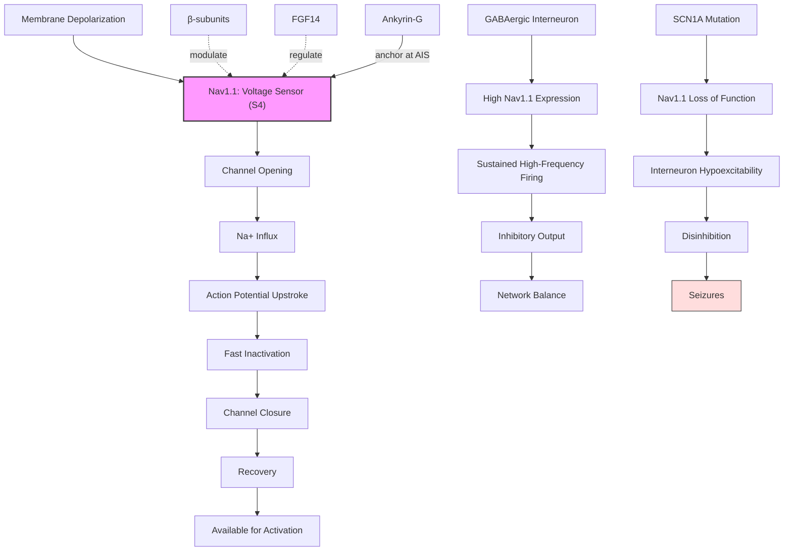

# Pathway Summary for SCN1A

## Overview
SCN1A encodes the pore-forming α-subunit of Nav1.1, the most clinically important voltage-gated sodium channel in epilepsy genetics. Nav1.1 directly mediates the depolarizing phase of action potentials through voltage-dependent conformational switching that allows selective Na+ influx. The channel is particularly critical in GABAergic interneurons where it regulates inhibitory neuron excitability - loss-of-function mutations impair interneuron function leading to network hyperexcitability and seizures. SCN1A mutations cause >80% of Dravet syndrome cases.

## Core Signaling Pathways

### Action Potential Generation
Nav1.1 mediates the rapid depolarization phase of action potentials:
- Voltage sensing via S4 segments triggers channel opening
- Selective Na+ permeation through the pore domain
- Fast inactivation terminates Na+ influx
- Recovery from inactivation enables repetitive firing

### GABAergic Interneuron Function
Nav1.1 is enriched in parvalbumin-positive interneurons where it:
- Enables high-frequency firing patterns
- Maintains inhibitory tone in neural circuits
- Supports feedforward and feedback inhibition
- Loss of function causes disinhibition and seizures

### Axon Initial Segment Signaling
Nav1.1 concentrates at the axon initial segment (AIS) where it:
- Initiates action potentials
- Sets neuronal excitability threshold
- Integrates synaptic inputs
- Maintains AIS molecular organization

## Pathway Diagram

## Molecular Properties
- **Voltage dependence**: Activation ~-40 to -30 mV
- **Ion selectivity**: Na+ >> K+ (~10:1)
- **Inactivation kinetics**: Fast (<2 ms) and slow components
- **Recovery time**: 5-10 ms at -80 mV

## Subcellular Localization
- **Axon initial segment**: Action potential initiation
- **Nodes of Ranvier**: Saltatory conduction
- **Soma**: Contributing to excitability
- **Presynaptic terminals**: Neurotransmitter release

## Clinical Significance

### Dravet Syndrome
- **>80% caused by SCN1A mutations**
- Severe myoclonic epilepsy of infancy
- Developmental delays and cognitive impairment
- Status epilepticus risk

### GEFS+ (Genetic Epilepsy with Febrile Seizures Plus)
- Milder phenotype with febrile seizures
- Variable penetrance and expressivity
- Often missense mutations

### Treatment Implications
- **Contraindicated**: Sodium channel blockers worsen seizures
- **Beneficial**: Drugs enhancing GABAergic function
- **Precision medicine**: Genotype-guided therapy

## Regulatory Mechanisms
- **β-subunits (SCN1B-4B)**: Modulate gating and trafficking
- **FGF14**: Regulates channel availability
- **Ankyrin-G**: AIS anchoring and clustering
- **Phosphorylation**: PKA/PKC modulation
- **Temperature sensitivity**: Enhanced dysfunction with fever

## Functional Integration
- **E/I balance**: Critical for maintaining inhibitory tone
- **Network oscillations**: Supports gamma rhythms via interneurons
- **Developmental regulation**: Expression increases postnatally
- **Compensation mechanisms**: Other Nav channels partially compensate
