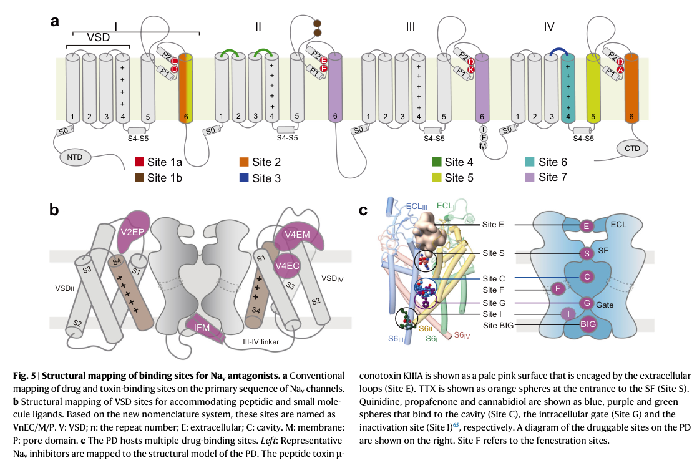

## Question

# Gene Research for Functional Annotation

## ⚠️ CRITICAL: Gene/Protein Identification Context

**BEFORE YOU BEGIN RESEARCH:** You MUST verify you are researching the CORRECT gene/protein. Gene symbols can be ambiguous, especially for less well-characterized genes from non-model organisms.

### Target Gene/Protein Identity (from UniProt):
- **UniProt Accession:** Q15858
- **Protein Description:** RecName: Full=Sodium channel protein type 9 subunit alpha {ECO:0000305}; AltName: Full=Neuroendocrine sodium channel {ECO:0000303|PubMed:7720699}; Short=hNE-Na {ECO:0000303|PubMed:7720699}; AltName: Full=Peripheral sodium channel 1; Short=PN1 {ECO:0000250|UniProtKB:O08562}; AltName: Full=Sodium channel protein type IX subunit alpha; AltName: Full=Voltage-gated sodium channel subunit alpha Nav1.7;
- **Gene Information:** Name=SCN9A {ECO:0000312|HGNC:HGNC:10597}; Synonyms=NENA;
- **Organism (full):** Homo sapiens (Human).
- **Protein Family:** Belongs to the sodium channel (TC 1.A.1.10) family.
- **Key Domains:** Ion_trans_dom. (IPR005821); IQ_motif_EF-hand-BS. (IPR000048); IQ_SCN5A_C. (IPR058542); Na_channel_asu. (IPR001696); Na_chnl_inactivation_gate. (IPR044564)

### MANDATORY VERIFICATION STEPS:

1. **Check if the gene symbol "SCN9A" matches the protein description above**
2. **Verify the organism is correct:** Homo sapiens (Human).
3. **Check if protein family/domains align with what you find in literature**
4. **If you find literature for a DIFFERENT gene with the same or similar symbol, STOP**

### If Gene Symbol is Ambiguous or You Cannot Find Relevant Literature:

**DO NOT PROCEED WITH RESEARCH ON A DIFFERENT GENE.** Instead:
- State clearly: "The gene symbol 'SCN9A' is ambiguous or literature is limited for this specific protein"
- Explain what you found (e.g., "Found extensive literature on a different gene with the same symbol in a different organism")
- Describe the protein based ONLY on the UniProt information provided above
- Suggest that the protein function can be inferred from domain/family information

### Research Target:

Please provide a comprehensive research report on the gene **SCN9A** (gene ID: SCN9A, UniProt: Q15858) in human.

The research report should be a detailed narrative explaining the function, biological processes, and localization of the gene product. Citations should be given for all claims.

You should prioritize authoritative reviews and primary scientific literature when conducting research. You can supplement
this with annotations you find in gene/protein databases, but these can be outdated or inaccurate.

We are specifically interested in the primary function of the gene - for enzymes, what reaction is catalyzed, and what is the substrate specificity? For transporters, what is the substrate? For structural proteins or adapters, what is the broader structural role? For signaling molecules, what is the role in the pathway.

We are interested in where in or outside the cell the gene product carries out its function.

We are also interested in the signaling or biochemical pathways in which the gene functions. We are less interested in broad pleiotropic effects, except where these elucidate the precise role.

Include evidence where possible. We are interested in both experimental evidence as well as inference from structure, evolution, or bioinformatic analysis. Precise studies should be prioritized over high-throughput, where available.

## Output

Question: You are an expert researcher providing comprehensive, well-cited information.

Provide detailed information focusing on:
1. Key concepts and definitions with current understanding
2. Recent developments and latest research (prioritize 2023-2024 sources)
3. Current applications and real-world implementations
4. Expert opinions and analysis from authoritative sources
5. Relevant statistics and data from recent studies

Format as a comprehensive research report with proper citations. Include URLs and publication dates where available.
Always prioritize recent, authoritative sources and provide specific citations for all major claims.

# Gene Research for Functional Annotation

## ⚠️ CRITICAL: Gene/Protein Identification Context

**BEFORE YOU BEGIN RESEARCH:** You MUST verify you are researching the CORRECT gene/protein. Gene symbols can be ambiguous, especially for less well-characterized genes from non-model organisms.

### Target Gene/Protein Identity (from UniProt):
- **UniProt Accession:** Q15858
- **Protein Description:** RecName: Full=Sodium channel protein type 9 subunit alpha {ECO:0000305}; AltName: Full=Neuroendocrine sodium channel {ECO:0000303|PubMed:7720699}; Short=hNE-Na {ECO:0000303|PubMed:7720699}; AltName: Full=Peripheral sodium channel 1; Short=PN1 {ECO:0000250|UniProtKB:O08562}; AltName: Full=Sodium channel protein type IX subunit alpha; AltName: Full=Voltage-gated sodium channel subunit alpha Nav1.7;
- **Gene Information:** Name=SCN9A {ECO:0000312|HGNC:HGNC:10597}; Synonyms=NENA;
- **Organism (full):** Homo sapiens (Human).
- **Protein Family:** Belongs to the sodium channel (TC 1.A.1.10) family.
- **Key Domains:** Ion_trans_dom. (IPR005821); IQ_motif_EF-hand-BS. (IPR000048); IQ_SCN5A_C. (IPR058542); Na_channel_asu. (IPR001696); Na_chnl_inactivation_gate. (IPR044564)

### MANDATORY VERIFICATION STEPS:

1. **Check if the gene symbol "SCN9A" matches the protein description above**
2. **Verify the organism is correct:** Homo sapiens (Human).
3. **Check if protein family/domains align with what you find in literature**
4. **If you find literature for a DIFFERENT gene with the same or similar symbol, STOP**

### If Gene Symbol is Ambiguous or You Cannot Find Relevant Literature:

**DO NOT PROCEED WITH RESEARCH ON A DIFFERENT GENE.** Instead:
- State clearly: "The gene symbol 'SCN9A' is ambiguous or literature is limited for this specific protein"
- Explain what you found (e.g., "Found extensive literature on a different gene with the same symbol in a different organism")
- Describe the protein based ONLY on the UniProt information provided above
- Suggest that the protein function can be inferred from domain/family information

### Research Target:

Please provide a comprehensive research report on the gene **SCN9A** (gene ID: SCN9A, UniProt: Q15858) in human.

The research report should be a detailed narrative explaining the function, biological processes, and localization of the gene product. Citations should be given for all claims.

You should prioritize authoritative reviews and primary scientific literature when conducting research. You can supplement
this with annotations you find in gene/protein databases, but these can be outdated or inaccurate.

We are specifically interested in the primary function of the gene - for enzymes, what reaction is catalyzed, and what is the substrate specificity? For transporters, what is the substrate? For structural proteins or adapters, what is the broader structural role? For signaling molecules, what is the role in the pathway.

We are interested in where in or outside the cell the gene product carries out its function.

We are also interested in the signaling or biochemical pathways in which the gene functions. We are less interested in broad pleiotropic effects, except where these elucidate the precise role.

Include evidence where possible. We are interested in both experimental evidence as well as inference from structure, evolution, or bioinformatic analysis. Precise studies should be prioritized over high-throughput, where available.

## Comprehensive Research Report: Human **SCN9A / NaV1.7** (UniProt **Q15858**) — Functional Annotation, Mechanisms, and Translational Status

### 0) Identity verification (critical)
The target protein is the **human voltage‑gated sodium channel NaV1.7 α‑subunit**, encoded by **SCN9A**, and is explicitly linked to **UniProt accession Q15858** in a biochemical study analyzing the full-length channel (“full‑length NaV1.7 (SCN9A, Uniprot Q15858)”). (wright2023thecterminalof pages 2-3)

### 1) Key concepts and current understanding

#### 1.1 Core molecular function (what the gene product does)
**NaV1.7 is a voltage-gated sodium (Na+) channel** that supports **membrane excitability** by permitting selective Na+ flux during action potentials; in nociceptors it is strongly implicated in determining excitability near threshold and thereby controlling pain signaling. (toffano2020computationalpipelineto pages 1-2, meents2019theroleof pages 1-2)

**Selectivity/substrate specificity:** NaV1.7 is selective for Na+ and shares the canonical NaV architecture and **DEKA selectivity filter** (Asp-Glu-Lys-Ala across DI–DIV) described for eukaryotic NaV α subunits. (toffano2020computationalpipelineto pages 1-2)

#### 1.2 Structural definitions (domain architecture)
The NaV α-subunit is a **single ~2,000 amino‑acid polypeptide** organized into **four homologous domains (DI–DIV)**; each domain contains **six transmembrane helices (S1–S6)**. **S1–S4 form the voltage-sensing domain (VSD)** and **S5–S6 plus the extracellular P-loop form the pore domain** and selectivity filter. (toffano2020computationalpipelineto pages 1-2, wood2025sensoryneuronsodium pages 1-2)

#### 1.3 Cellular and tissue localization (where it acts)
NaV1.7 is a **plasma-membrane** channel enriched in **nociceptive neurons**, with high expression reported in **dorsal root ganglia (DRG)**, **trigeminal ganglia**, and **sympathetic ganglia**—an expression pattern central to its role in pain pathways. (dormer2023areviewof pages 8-9)

#### 1.4 Human genetic validation (why SCN9A is a flagship pain target)
SCN9A is among the strongest “human-validated” targets in pain biology:
- **Gain-of-function (GOF)** variants cause painful channelopathies (e.g., inherited erythromelalgia, paroxysmal extreme pain disorder, and subsets of small fiber neuropathy). (baker2020painfulandpainless pages 1-2, meents2019theroleof pages 1-2)
- **Loss-of-function (LOF)** variants cause **congenital insensitivity to pain**. (baker2020painfulandpainless pages 1-2, meents2019theroleof pages 1-2)

These genotype–phenotype links provide unusually direct causal evidence connecting a single ion channel to a clinically meaningful sensory modality. (baker2020painfulandpainless pages 1-2, meents2019theroleof pages 1-2)

### 2) Recent developments (prioritizing 2023–2024)

#### 2.1 2023: Cryo‑EM “structural pharmacology” map of human NaV1.7 drug binding sites
A major 2023 advance was the publication of high-resolution **cryo‑EM structures of human NaV1.7** bound to multiple clinically used drugs and investigational compounds (**2.6–3.2 Å**). This work mapped multiple **druggable binding sites** including:
- a site **beneath the intracellular gate (“site BIG”)** accommodating carbamazepine, bupivacaine, and lacosamide,
- binding in **pore fenestrations** (e.g., vixotrigine in the IV–I fenestration; vinpocetine and hardwickiic acid at the III–IV fenestration),
- an unexpected **second lacosamide molecule** plugging into the selectivity filter from the central cavity. (wu2023structuralmappingof pages 1-2)

A figure from this study provides a consolidated schematic of the mapped druggable sites and is useful for functional annotation because it links channel anatomy directly to chemical mechanisms of inhibition/modulation. (wu2023structuralmappingof media a264241d)

#### 2.2 2023: Accessory protein requirement for toxin-mediated NaV1.7 modulation (TMEM233/dispanins)
A 2023 Nature Communications study demonstrated that voltage-gated sodium channels can behave as **multiprotein signaling complexes**, and identified **TMEM233 (a dispanin-family protein)** as an essential **NaV1.7-interacting accessory protein** for the action of the plant-derived knottin toxin **Excelsatoxin A (ExTxA)**. ExTxA inhibits fast inactivation and induces persistent currents in sensory neurons; in human iPSC-derived sensory neurons this persistent current was largely blocked by a selective NaV1.7 blocker (**Pn3a 100 nM**), implicating NaV1.7 as a major mediator. (jami2023paincausingstingingnettle pages 1-2)

This establishes a contemporary concept: **native accessory proteins can be required to reproduce pharmacology observed in sensory neurons**, which may help explain discrepancies between heterologous assays and clinical outcomes. (jami2023paincausingstingingnettle pages 1-2)

#### 2.3 2023: Biochemical regulation by ubiquitination (NEDD4L → NaV1.7)
A 2023 ACS Bio & Med Chem Au study provided direct biochemical evidence that the E3 ligase **NEDD4L ubiquitinates the cytoplasmic C‑terminus of NaV1.7**. The work also documents motifs in the C‑terminus relevant to regulation (including an **IQ motif** and a NEDD4L-recognized **PY motif**) and identifies ubiquitinated lysines by mass spectrometry. (wright2023thecterminalof pages 1-2, wright2023thecterminalof pages 2-3)

This supports a functional annotation element often missing from older descriptions: **post-translational modification and trafficking/turnover regulation** are likely important determinants of NaV1.7 surface density and nociceptor excitability. (wright2023thecterminalof pages 1-2, wright2023thecterminalof pages 2-3)

#### 2.4 2023: Mechanistic structural basis for pain-causing voltage-sensor mutations
A 2023 Journal of General Physiology study used a tractable bacterial NaV homolog (NaVAb) carrying human-analogous inherited erythromelalgia mutations to provide structural explanations for **negative shifts in activation** (gain-of-function): widening of the gating-charge translocation pathway or altered hydrophobic/phospholipid interactions favoring outward S4 movement. (wisedchaisri2023structuralbasisfor pages 1-2)

#### 2.5 2024: Structure–function dissection of NaV gating states using engineered NaV1.7 mutants
A 2024 PNAS study solved **cryo‑EM structures (2.9–3.4 Å)** of engineered human NaV1.7 mutants and linked **pore-domain contraction** to right-shifted activation/static inactivation, refining how structural states map onto electrophysiological behavior. (li2024dissectionofthe pages 1-2)

#### 2.6 2024: New therapeutic modalities—biologics and gene regulation
Two notable 2024 directions go beyond classic small-molecule pore blockers:
- **Single-domain antibody (VHH) against human NaV1.7**: an Aug 2024 study reported a VHH that binds NaV1.7, **slows deactivation**, reduces nociceptor action potential firing, and **reverses hyperalgesia** in rodent models. (martina2024anovelantigen pages 1-2)
- **AAV-delivered engineered transcriptional repressors**: a Sep 2024 preprint reported **zinc-finger repressors** achieving ~**90% SCN9A repression** in human iPSC-derived neurons, **up to 70%** repression in mouse DRG, and **up to 60%** repression in nonhuman primate DRG after intrathecal delivery, with short-term tolerability in NHP. (samie2024potentandselective pages 1-3)

Together these illustrate a shift from “block the pore” to **modulate gating with biologics** or **reduce SCN9A expression** as potentially more durable analgesic strategies. (martina2024anovelantigen pages 1-2, samie2024potentandselective pages 1-3)

### 3) Current applications and real-world implementations

#### 3.1 Clinical trials: NaV1.7-targeting small molecules and genotype-guided studies
Real-world implementation is best captured by registered clinical trial protocols:

**PF‑05089771 (Pfizer) in painful diabetic peripheral neuropathy (DPN):**
- **NCT02215252** (Phase 2; randomized, double-blind, parallel; **COMPLETED**) tested **PF‑05089771 150 mg BID** as monotherapy and as **add-on to pregabalin 150 mg BID** (300 mg/day). 
- **Enrollment:** 141 participants.
- **Primary endpoint:** daily pain numeric rating scale (mean of last 7 days).
- **Key secondary endpoints:** responder rates (30%/50%), Neuropathic Pain Symptom Inventory, PGIC, sleep interference, rescue medication use. (NCT02215252 chunk 1, NCT02215252 chunk 2)

**Genotype-guided NaV1.7 strategy in small fiber neuropathy (SFN):**
- **NCT01911975** (Phase 3; randomized; quadruple-masked; crossover; **COMPLETED**) evaluated **lacosamide 200 mg BID** vs placebo in patients with **gain-of-function SCN9A mutations** and SFN.
- **Enrollment:** 25.
- **Primary endpoint:** mean daily pain intensity recorded twice daily over **33 weeks**. (NCT01911975 chunk 1)

**Inherited erythromelalgia (IEM) precision trial:**
- **NCT07262268** (Phase 1b; randomized crossover; quadruple-masked; start 2026) enrolls IEM participants with characterized **NaV1.7 gain-of-function SCN9A mutations**; **enrollment 5**; primary outcome uses frequent pain scoring. (NCT07262268 chunk 1)

These protocols show how SCN9A biology is operationalized clinically: either by targeting NaV1.7 pharmacologically (often with mixed efficacy historically) or by selecting subjects with SCN9A GOF variants to increase mechanistic alignment and effect size potential. (dormer2023areviewof pages 4-5, NCT02215252 chunk 1)

#### 3.2 Observational genetics in perioperative care
SCN9A variation is also implemented in prospective genotype–phenotype studies:
- **NCT02496455**: postoperative pain after cesarean section (**n=200**) with SCN9A SNP genotyping and outcomes including 24-hour VAS pain and tramadol consumption. (NCT02496455 chunk 1)

### 4) Expert opinions and authoritative analysis (why translation has been difficult)

A 2024 Pain review analyzing the mismatch between preclinical and clinical testing concludes that despite strong genetic support for NaV1.7, **NaV1.7-selective inhibitors have not yet proven effective in clinical trials**, and highlights key design mismatches: species/population differences, inflammatory pain models vs neuropathic pain trials, evoked pain endpoints vs average pain intensity, and single-dose preclinical studies vs repeat dosing clinically. ()

A 2023 review focusing on SCN9A/Nav1.7 clinical trials similarly concludes that small-molecule programs have often been inconclusive, motivating exploration of alternative approaches (including gene therapy-like strategies). (dormer2023areviewof pages 8-9, dormer2023areviewof pages 4-5)

### 5) Relevant statistics and quantitative data (selected)

- **Structural resolution:** human NaV1.7 drug-bound cryo‑EM structures at **2.6–3.2 Å** (2023). (wu2023structuralmappingof pages 1-2)
- **Engineered NaV1.7 mutant structures:** **2.9–3.4 Å** (2024). (li2024dissectionofthe pages 1-2)
- **Accessory-protein-dependent pharmacology:** ExTxA persistent current in human sensory neurons largely blocked by **Pn3a 100 nM** (2023). (jami2023paincausingstingingnettle pages 1-2)
- **Small fiber neuropathy epidemiology (from clinical review):** incidence **12/100,000** and prevalence **53/100,000**; approximately **30%** of idiopathic SFN attributed to **SCN9A** variants (review synthesis). (dormer2023areviewof pages 4-5)
- **Clinical trial sizes/dosing:**
  - NCT02215252 (PF‑05089771 DPN): **n=141**, PF‑05089771 **150 mg BID**, pregabalin **150 mg BID** add-on. (NCT02215252 chunk 1)
  - NCT01911975 (lacosamide in SCN9A-GOF SFN): **n=25**, lacosamide **200 mg BID**, **33-week** monitoring. (NCT01911975 chunk 1)
- **Gene repression magnitudes (preclinical):** SCN9A repression of **~90%** (human iPSC neurons), **up to 70%** (mouse DRG), **up to 60%** (NHP DRG). (samie2024potentandselective pages 1-3)

### 6) Visual evidence (structural map)
The following figure (cropped from the primary 2023 cryo‑EM study) summarizes multiple **druggable binding sites** mapped onto NaV1.7 and supports the structural pharmacology narrative in Sections 2.1 and 5. (wu2023structuralmappingof media a264241d)

### 7) Consolidated evidence table (artifact)
The table below consolidates key functional annotation points, evidence types, and translational status with DOIs/URLs.

| Category | Key points | Representative recent sources (DOI/URL) | Evidence type |
|---|---|---|---|
| Identity | Human **SCN9A** encodes **NaV1.7**; explicit match to **UniProt Q15858** in biochemical study of the full-length channel. C-terminal region includes **IQ** motif and **PY (PPSY)** motif relevant to regulation. (wright2023thecterminalof pages 2-3, wright2023thecterminalof pages 1-2) | **Wright et al., 2023**. DOI: 10.1021/acsbiomedchemau.3c00031; https://doi.org/10.1021/acsbiomedchemau.3c00031 | Biochemistry |
| Structure | Canonical voltage-gated sodium channel α-subunit architecture: ~2,000 aa, **4 homologous domains (DI–DIV)**, each with **6 TM helices (S1–S6)**; **S1–S4** form VSDs, **S5–S6 + P-loop** form pore/selectivity filter; **DEKA** selectivity filter. (toffano2020computationalpipelineto pages 1-2, wood2025sensoryneuronsodium pages 1-2) | **Toffano et al., 2020**. DOI: 10.1038/s41598-020-74591-y; https://doi.org/10.1038/s41598-020-74591-y. **Wood et al., 2025**. DOI: 10.1085/jgp.202513778; https://doi.org/10.1085/jgp.202513778 | Structural/functional review, computational synthesis |
| Localization | NaV1.7 is highly expressed in **nociceptive neurons** of **dorsal root ganglia (DRG)**, **trigeminal ganglia**, and **sympathetic ganglia**; positioned at the plasma membrane to regulate excitability. (dormer2023areviewof pages 8-9) | **Dormer et al., 2023**. DOI: 10.2147/JPR.S388896; https://doi.org/10.2147/JPR.S388896 | Review |
| Physiology | In human iPSC-derived nociceptors from inherited erythromelalgia, SCN9A/NaV1.7 gain-of-function shifts activation to more negative voltages, lowers firing threshold, and enhances AP upstroke; supports NaV1.7 as a **threshold channel** for action-potential initiation in pain pathways. (meents2019theroleof pages 1-2, meents2019theroleof pages 10-12) | **Meents et al., 2019**. DOI: 10.1097/j.pain.0000000000001511; https://doi.org/10.1097/j.pain.0000000000001511 | Human electrophysiology, iPSC nociceptors |
| Regulation | NaV1.7 C-terminus is **ubiquitinated by NEDD4L**; study identified ubiquitinated lysines and defined a CT region containing an **EF-hand-like bundle**, **IQ motif**, and **PY motif** that can regulate channel trafficking/turnover. (wright2023thecterminalof pages 1-2, wright2023thecterminalof pages 2-3) | **Wright et al., 2023**. DOI: 10.1021/acsbiomedchemau.3c00031; https://doi.org/10.1021/acsbiomedchemau.3c00031 | Biochemistry, mass spectrometry |
| Regulation / accessory proteins | Plant toxin **ExTxA** requires **TMEM233** (a sensory-neuron dispanin) for pharmacological activity at NaV1.7; toxin-induced persistent current in human sensory neurons was largely blocked by **Pn3a 100 nM**, showing accessory-protein dependence of Nav1.7 modulation. (jami2023paincausingstingingnettle pages 1-2) | **Jami et al., 2023**. DOI: 10.1038/s41467-023-37963-2; https://doi.org/10.1038/s41467-023-37963-2 | Electrophysiology, molecular pharmacology |
| Structural pharmacology | Cryo-EM structures of human NaV1.7 bound to drugs/lead compounds at **2.6–3.2 Å** mapped multiple binding sites, including **site BIG** beneath the intracellular gate; **vixotrigine** occupies a fenestration site; lacosamide also showed unexpected occupancy near the selectivity filter. Figure-level structural atlas of druggable sites was retrieved. (wu2023structuralmappingof pages 1-2, wu2023structuralmappingof media a264241d) | **Wu et al., 2023**. DOI: 10.1038/s41467-023-38942-3; https://doi.org/10.1038/s41467-023-38942-3 | Cryo-EM structural pharmacology |
| Structural mechanism | Engineered Nav1.7 mutants solved at **2.9–3.4 Å** showed correlation between **pore-domain contraction** and right-shifted activation/static inactivation, refining structure–function understanding of gating states relevant to drug design. (li2024dissectionofthe pages 1-2) | **Li et al., 2024**. DOI: 10.1073/pnas.2322899121; https://doi.org/10.1073/pnas.2322899121 | Cryo-EM, electrophysiology |
| Genetics | Human genetics strongly validate SCN9A: **gain-of-function** variants cause painful syndromes including **inherited erythromelalgia (IEM)**, **paroxysmal extreme pain disorder (PEPD)**, and some **small-fiber neuropathy (SFN)**; **loss-of-function** variants cause **congenital insensitivity to pain (CIP)**. (baker2020painfulandpainless pages 1-2, meents2019theroleof pages 1-2, yogi2025preclinicalanimalmodels pages 1-3) | **Baker & Nassar, 2020**. DOI: 10.1007/s00424-020-02419-9; https://doi.org/10.1007/s00424-020-02419-9. **Meents et al., 2019**. DOI above | Review, human genetics, electrophysiology |
| Clinical translation | Small-molecule clinical development has been active but disappointing overall; review notes **~30% of idiopathic SFN** linked to SCN9A and summarizes funapide/TV-45070, PF-05089771, vixotrigine, and lacosamide programs; expression in DRG/TG/sympathetic neurons supports target rationale but efficacy has often been modest. (dormer2023areviewof pages 4-5) | **Dormer et al., 2023**. DOI: 10.2147/JPR.S388896; https://doi.org/10.2147/JPR.S388896 | Review, clinical landscape |
| Clinical translation / registry | **PF-05089771** Phase 2 painful diabetic peripheral neuropathy study **NCT02215252**: completed; **n=141**; monotherapy **150 mg BID** and **add-on pregabalin 150 mg BID** arms; endpoints included daily pain NRS, responder rates, NPSI, PGIC, sleep interference, rescue medication. (NCT02215252 chunk 1, NCT02215252 chunk 2) | **ClinicalTrials.gov NCT02215252**; https://clinicaltrials.gov/study/NCT02215252 | Clinical trial registry |
| Clinical translation / precision medicine | **Lacosamide** genotype-guided SCN9A gain-of-function SFN study **NCT01911975**: randomized quadruple-masked crossover; **n=25**; **200 mg BID** vs placebo; pain assessed over **33 weeks**. (NCT01911975 chunk 1) | **ClinicalTrials.gov NCT01911975**; https://clinicaltrials.gov/study/NCT01911975 | Clinical trial registry |
| Clinical translation / observational genomics | **SCN9A polymorphism** study **NCT02496455**: prospective postoperative-pain cohort after cesarean section; **n=200**; genotyped rs6746030, rs7604448, rs10930214, rs7595255; outcomes were VAS pain and **24 h tramadol** consumption. (NCT02496455 chunk 1) | **ClinicalTrials.gov NCT02496455**; https://clinicaltrials.gov/study/NCT02496455 | Clinical trial registry, observational genetics |
| Emerging therapeutics | **Single-domain antibody (VHH)** against human NaV1.7 slowed deactivation, reduced nociceptor firing, and reversed hyperalgesia in rodent models, demonstrating feasibility of a biologic modality. (martina2024anovelantigen pages 1-2) | **Martina et al., 2024**. DOI: 10.1002/advs.202405432; https://doi.org/10.1002/advs.202405432 | Biologic engineering, electrophysiology, animal models |
| Emerging therapeutics | **Engineered zinc-finger repressors (ZFRs)** targeting SCN9A achieved **90% repression** in human iPSC-derived neurons, **up to 70%** repression in mouse DRG, and **up to 60%** repression in nonhuman-primate DRG after AAV delivery, supporting gene-regulatory analgesic strategies. (samie2024potentandselective pages 1-3) | **Samie et al., 2024**. DOI: 10.1101/2024.09.06.609976; https://doi.org/10.1101/2024.09.06.609976 | Preclinical gene regulation, AAV, transcript repression |
| Emerging clinical precision medicine | **BHV-7000/opakalim** inherited erythromelalgia study **NCT07262268**: Phase 1b, double-blind crossover, **n=5**, enrolling participants with characterized **NaV1.7 gain-of-function SCN9A mutations**; endpoints include maximum pain intensity and attack metrics. (NCT07262268 chunk 1) | **ClinicalTrials.gov NCT07262268**; https://clinicaltrials.gov/study/NCT07262268 | Clinical trial registry |

*Table: This table summarizes functional annotation, mechanism, genetics, and clinical translation for human SCN9A/Nav1.7 using the most relevant gathered evidence, prioritizing 2023–2024 sources where possible. It is useful as a compact reference linking molecular function to experimental support and translational status.*

### 8) Notes on nomenclature and aliases
UniProt lists historical names such as “neuroendocrine sodium channel,” “PN1,” and “hNE‑Na.” These aliases were not directly encountered in the retrieved primary texts; this report therefore treats them as **database-derived synonyms** and relies on primary literature for functional claims. The SCN9A ↔ NaV1.7 ↔ UniProt Q15858 mapping is explicitly supported in Wright et al. 2023. (wright2023thecterminalof pages 2-3)

---

### Key references (with publication dates and URLs)
- Wright KM et al. **Oct 2023**. *The C-Terminal of NaV1.7 Is Ubiquitinated by NEDD4L.* ACS Bio & Med Chem Au. https://doi.org/10.1021/acsbiomedchemau.3c00031 (wright2023thecterminalof pages 2-3)
- Wu Q et al. **Jun 2023**. *Structural mapping of Nav1.7 antagonists.* Nature Communications. https://doi.org/10.1038/s41467-023-38942-3 (wu2023structuralmappingof pages 1-2)
- Jami S et al. **Apr 2023**. *Pain-causing stinging nettle toxins target TMEM233 to modulate NaV1.7 function.* Nature Communications. https://doi.org/10.1038/s41467-023-37963-2 (jami2023paincausingstingingnettle pages 1-2)
- Li Z et al. **Feb 2024**. *Dissection of the structure–function relationship of Nav channels.* PNAS. https://doi.org/10.1073/pnas.2322899121 (li2024dissectionofthe pages 1-2)
- Martina M et al. **Aug 2024**. *Single-domain antibodies targeting Nav1.7 reduce pain in animal models.* Advanced Science. https://doi.org/10.1002/advs.202405432 (martina2024anovelantigen pages 1-2)
- Samie M et al. **Sep 2024 (preprint)**. *Zinc finger repressors targeting SCN9A.* bioRxiv. https://doi.org/10.1101/2024.09.06.609976 (samie2024potentandselective pages 1-3)
- ClinicalTrials.gov: **NCT02215252** (PF‑05089771 in DPN). https://clinicaltrials.gov/study/NCT02215252 (NCT02215252 chunk 1)
- ClinicalTrials.gov: **NCT01911975** (lacosamide in SCN9A-GOF SFN). https://clinicaltrials.gov/study/NCT01911975 (NCT01911975 chunk 1)
- ClinicalTrials.gov: **NCT02496455** (SCN9A polymorphisms and postoperative pain). https://clinicaltrials.gov/study/NCT02496455 (NCT02496455 chunk 1)
- Yang J et al. **Oct 2024**. *Discordance between preclinical and clinical testing of NaV1.7-selective inhibitors for pain.* Pain. https://doi.org/10.1097/j.pain.0000000000003425 ()

References

1. (wright2023thecterminalof pages 2-3): Katharine M. Wright, Hanjie Jiang, Wendy Xia, Michael B. Murphy, Tatiana N. Boronina, Justin N. Nwafor, HyoJeon Kim, Akunna M. Iheanacho, P. Aitana Azurmendi, Robert N. Cole, Philip A. Cole, and Sandra B. Gabelli. The c-terminal of nav1.7 is ubiquitinated by nedd4l. ACS Bio & Med Chem Au, 3:516-527, Oct 2023. URL: https://doi.org/10.1021/acsbiomedchemau.3c00031, doi:10.1021/acsbiomedchemau.3c00031. This article has 4 citations.

2. (toffano2020computationalpipelineto pages 1-2): Alberto A. Toffano, Giacomo Chiarot, Stefano Zamuner, Margherita Marchi, Erika Salvi, Stephen G. Waxman, Catharina G. Faber, Giuseppe Lauria, Achille Giacometti, and Marta Simeoni. Computational pipeline to probe nav1.7 gain-of-function variants in neuropathic painful syndromes. Scientific Reports, Oct 2020. URL: https://doi.org/10.1038/s41598-020-74591-y, doi:10.1038/s41598-020-74591-y. This article has 8 citations and is from a peer-reviewed journal.

3. (meents2019theroleof pages 1-2): Jannis E. Meents, Elisangela Bressan, Stephanie Sontag, Alec Foerster, Petra Hautvast, Corinna Rösseler, Martin Hampl, Herdit Schüler, Roman Goetzke, Thi Kim Chi Le, Inge Petter Kleggetveit, Kim Le Cann, Clara Kerth, Anthony M. Rush, Marc Rogers, Zacharias Kohl, Martin Schmelz, Wolfgang Wagner, Ellen Jørum, Barbara Namer, Beate Winner, Martin Zenke, and Angelika Lampert. The role of nav1.7 in human nociceptors: insights from human induced pluripotent stem cell–derived sensory neurons of erythromelalgia patients. Pain, 160:1327-1341, Mar 2019. URL: https://doi.org/10.1097/j.pain.0000000000001511, doi:10.1097/j.pain.0000000000001511. This article has 118 citations and is from a highest quality peer-reviewed journal.

4. (wood2025sensoryneuronsodium pages 1-2): John N. Wood, Nieng Yan, Jian Huang, Jing Zhao, Armen Akopian, James J. Cox, C. Geoffrey Woods, and Mohammed A. Nassar. Sensory neuron sodium channels as pain targets; from cocaine to journavx (vx-548, suzetrigine). The Journal of general physiology, Apr 2025. URL: https://doi.org/10.1085/jgp.202513778, doi:10.1085/jgp.202513778. This article has 22 citations.

5. (dormer2023areviewof pages 8-9): Anton Dormer, Mahesh Narayanan, Jerome Schentag, Daniel Achinko, Elton Norman, James Kerrigan, Gary Jay, and William Heydorn. A review of the therapeutic targeting of scn9a and nav1.7 for pain relief in current human clinical trials. Journal of Pain Research, 16:1487-1498, May 2023. URL: https://doi.org/10.2147/jpr.s388896, doi:10.2147/jpr.s388896. This article has 55 citations and is from a peer-reviewed journal.

6. (baker2020painfulandpainless pages 1-2): Mark D. Baker and Mohammed A. Nassar. Painful and painless mutations of scn9a and scn11a voltage-gated sodium channels. Pflugers Archiv, 472:865-880, Jun 2020. URL: https://doi.org/10.1007/s00424-020-02419-9, doi:10.1007/s00424-020-02419-9. This article has 77 citations.

7. (wu2023structuralmappingof pages 1-2): Qiurong Wu, Jian Huang, Xiao Fan, Kan Wang, Xueqin Jin, Gaoxingyu Huang, Jiaao Li, Xiaojing Pan, and Nieng Yan. Structural mapping of nav1.7 antagonists. Nature Communications, Jun 2023. URL: https://doi.org/10.1038/s41467-023-38942-3, doi:10.1038/s41467-023-38942-3. This article has 87 citations and is from a highest quality peer-reviewed journal.

8. (wu2023structuralmappingof media a264241d): Qiurong Wu, Jian Huang, Xiao Fan, Kan Wang, Xueqin Jin, Gaoxingyu Huang, Jiaao Li, Xiaojing Pan, and Nieng Yan. Structural mapping of nav1.7 antagonists. Nature Communications, Jun 2023. URL: https://doi.org/10.1038/s41467-023-38942-3, doi:10.1038/s41467-023-38942-3. This article has 87 citations and is from a highest quality peer-reviewed journal.

9. (jami2023paincausingstingingnettle pages 1-2): Sina Jami, Jennifer R. Deuis, Tabea Klasfauseweh, Xiaoyang Cheng, Sergey Kurdyukov, Felicity Chung, Andrei L. Okorokov, Shengnan Li, Jiangtao Zhang, Ben Cristofori-Armstrong, Mathilde R. Israel, Robert J. Ju, Samuel D. Robinson, Peng Zhao, Lotten Ragnarsson, Åsa Andersson, Poanna Tran, Vanessa Schendel, Kirsten L. McMahon, Hue N. T. Tran, Yanni K.-Y. Chin, Yifei Zhu, Junyu Liu, Theo Crawford, Saipriyaa Purushothamvasan, Abdella M. Habib, David A. Andersson, Lachlan D. Rash, John N. Wood, Jing Zhao, Samantha J. Stehbens, Mehdi Mobli, Andreas Leffler, Daohua Jiang, James J. Cox, Stephen G. Waxman, Sulayman D. Dib-Hajj, G. Gregory Neely, Thomas Durek, and Irina Vetter. Pain-causing stinging nettle toxins target tmem233 to modulate nav1.7 function. Nature Communications, Apr 2023. URL: https://doi.org/10.1038/s41467-023-37963-2, doi:10.1038/s41467-023-37963-2. This article has 27 citations and is from a highest quality peer-reviewed journal.

10. (wright2023thecterminalof pages 1-2): Katharine M. Wright, Hanjie Jiang, Wendy Xia, Michael B. Murphy, Tatiana N. Boronina, Justin N. Nwafor, HyoJeon Kim, Akunna M. Iheanacho, P. Aitana Azurmendi, Robert N. Cole, Philip A. Cole, and Sandra B. Gabelli. The c-terminal of nav1.7 is ubiquitinated by nedd4l. ACS Bio & Med Chem Au, 3:516-527, Oct 2023. URL: https://doi.org/10.1021/acsbiomedchemau.3c00031, doi:10.1021/acsbiomedchemau.3c00031. This article has 4 citations.

11. (wisedchaisri2023structuralbasisfor pages 1-2): Goragot Wisedchaisri, Tamer M. Gamal El-Din, Natasha M. Powell, Ning Zheng, and William A. Catterall. Structural basis for severe pain caused by mutations in the voltage sensors of sodium channel nav1.7. The Journal of General Physiology, Oct 2023. URL: https://doi.org/10.1085/jgp.202313450, doi:10.1085/jgp.202313450. This article has 6 citations.

12. (li2024dissectionofthe pages 1-2): Zhangqiang Li, Qiurong Wu, Gaoxingyu Huang, Xueqin Jin, Jiaao Li, Xiaojing Pan, and Nieng Yan. Dissection of the structure–function relationship of nav channels. Proceedings of the National Academy of Sciences of the United States of America, Feb 2024. URL: https://doi.org/10.1073/pnas.2322899121, doi:10.1073/pnas.2322899121. This article has 11 citations and is from a highest quality peer-reviewed journal.

13. (martina2024anovelantigen pages 1-2): Marzia Martina, Umberto Banderali, Alvaro Yogi, Mehdi Arbabi Ghahroudi, Hong Liu, Traian Sulea, Yves Durocher, Greg Hussack, Henk van Faassen, Balu Chakravarty, Qing Yan Liu, Umar Iqbal, Binbing Ling, Etienne Lessard, Joey Sheff, Anna Robotham, Debbie Callaghan, Maria Moreno, Tanya Comas, Dao Ly, and Danica Stanimirovic. A novel antigen design strategy to isolate single‐domain antibodies that target human nav1.7 and reduce pain in animal models. Advanced Science, Aug 2024. URL: https://doi.org/10.1002/advs.202405432, doi:10.1002/advs.202405432. This article has 12 citations and is from a peer-reviewed journal.

14. (samie2024potentandselective pages 1-3): Mohammad Samie, Toufan Parman, Mihika Jalan, Jisoo Lee, Patrick Dunn, Jason Eshleman, Dianna Baldwin Vidales, Josh Holter, Brian Jones, Yonghua Pan, Marina Falaleeva, Sarah Hinkley, Alicia Goodwin, Tammy Chen, Sumita Bhardwaj, Alex Ward, Michael Trias, Anthony Chikere, Madhura Som, Yanmei Lu, Sandeep Yadav, Kathleen Meyer, Bryan Zeitler, Jason Fontenot, and Amy Pooler. Potent and selective repression of scn9a by engineered zinc finger repressors for the treatment of neuropathic pain. bioRxiv, Sep 2024. URL: https://doi.org/10.1101/2024.09.06.609976, doi:10.1101/2024.09.06.609976. This article has 5 citations.

15. (NCT02215252 chunk 1):  A Clinical Trial To Evaluate PF-05089771 On Its Own And As An Add-On Therapy To Pregabalin (Lyrica) For The Treatment Of Pain Due To Diabetic Peripheral Neuropathy (DPN). Pfizer. 2014. ClinicalTrials.gov Identifier: NCT02215252

16. (NCT02215252 chunk 2):  A Clinical Trial To Evaluate PF-05089771 On Its Own And As An Add-On Therapy To Pregabalin (Lyrica) For The Treatment Of Pain Due To Diabetic Peripheral Neuropathy (DPN). Pfizer. 2014. ClinicalTrials.gov Identifier: NCT02215252

17. (NCT01911975 chunk 1): Catharina G. Faber. Safety and Tolerability of Lacosamide in Patients With Gain-of-function Nav1.7 Mutations Related Small Fiber Neuropathy. Academisch Ziekenhuis Maastricht. 2014. ClinicalTrials.gov Identifier: NCT01911975

18. (NCT07262268 chunk 1):  A Phase 1b Study of BHV-7000 in Participants With Inherited Erythromelalgia. Biohaven Therapeutics Ltd.. 2026. ClinicalTrials.gov Identifier: NCT07262268

19. (dormer2023areviewof pages 4-5): Anton Dormer, Mahesh Narayanan, Jerome Schentag, Daniel Achinko, Elton Norman, James Kerrigan, Gary Jay, and William Heydorn. A review of the therapeutic targeting of scn9a and nav1.7 for pain relief in current human clinical trials. Journal of Pain Research, 16:1487-1498, May 2023. URL: https://doi.org/10.2147/jpr.s388896, doi:10.2147/jpr.s388896. This article has 55 citations and is from a peer-reviewed journal.

20. (NCT02496455 chunk 1): Tuğba Karaman. The Impact of the SCN9A Gene Polymorphism on Postoperative Pain. Tokat Gaziosmanpasa University. 2015. ClinicalTrials.gov Identifier: NCT02496455

21. (meents2019theroleof pages 10-12): Jannis E. Meents, Elisangela Bressan, Stephanie Sontag, Alec Foerster, Petra Hautvast, Corinna Rösseler, Martin Hampl, Herdit Schüler, Roman Goetzke, Thi Kim Chi Le, Inge Petter Kleggetveit, Kim Le Cann, Clara Kerth, Anthony M. Rush, Marc Rogers, Zacharias Kohl, Martin Schmelz, Wolfgang Wagner, Ellen Jørum, Barbara Namer, Beate Winner, Martin Zenke, and Angelika Lampert. The role of nav1.7 in human nociceptors: insights from human induced pluripotent stem cell–derived sensory neurons of erythromelalgia patients. Pain, 160:1327-1341, Mar 2019. URL: https://doi.org/10.1097/j.pain.0000000000001511, doi:10.1097/j.pain.0000000000001511. This article has 118 citations and is from a highest quality peer-reviewed journal.

22. (yogi2025preclinicalanimalmodels pages 1-3): Alvaro Yogi, Umberto Banderali, Maria J. Moreno, and Marzia Martina. Preclinical animal models to investigate the role of nav1.7 ion channels in pain. Apr 2025. URL: https://doi.org/10.3390/life15040640, doi:10.3390/life15040640. This article has 13 citations.

## Artifacts

- [Edison artifact artifact-00](SCN9A-deep-research-falcon_artifacts/artifact-00.md)

## Citations

1. wright2023thecterminalof pages 2-3
2. toffano2020computationalpipelineto pages 1-2
3. dormer2023areviewof pages 8-9
4. wu2023structuralmappingof pages 1-2
5. jami2023paincausingstingingnettle pages 1-2
6. wisedchaisri2023structuralbasisfor pages 1-2
7. li2024dissectionofthe pages 1-2
8. martina2024anovelantigen pages 1-2
9. samie2024potentandselective pages 1-3
10. dormer2023areviewof pages 4-5
11. meents2019theroleof pages 1-2
12. wood2025sensoryneuronsodium pages 1-2
13. baker2020painfulandpainless pages 1-2
14. wright2023thecterminalof pages 1-2
15. meents2019theroleof pages 10-12
16. yogi2025preclinicalanimalmodels pages 1-3
17. https://doi.org/10.1021/acsbiomedchemau.3c00031
18. https://doi.org/10.1038/s41598-020-74591-y.
19. https://doi.org/10.1085/jgp.202513778
20. https://doi.org/10.2147/JPR.S388896
21. https://doi.org/10.1097/j.pain.0000000000001511
22. https://doi.org/10.1038/s41467-023-37963-2
23. https://doi.org/10.1038/s41467-023-38942-3
24. https://doi.org/10.1073/pnas.2322899121
25. https://doi.org/10.1007/s00424-020-02419-9.
26. https://clinicaltrials.gov/study/NCT02215252
27. https://clinicaltrials.gov/study/NCT01911975
28. https://clinicaltrials.gov/study/NCT02496455
29. https://doi.org/10.1002/advs.202405432
30. https://doi.org/10.1101/2024.09.06.609976
31. https://clinicaltrials.gov/study/NCT07262268
32. https://doi.org/10.1097/j.pain.0000000000003425
33. https://doi.org/10.1021/acsbiomedchemau.3c00031,
34. https://doi.org/10.1038/s41598-020-74591-y,
35. https://doi.org/10.1097/j.pain.0000000000001511,
36. https://doi.org/10.1085/jgp.202513778,
37. https://doi.org/10.2147/jpr.s388896,
38. https://doi.org/10.1007/s00424-020-02419-9,
39. https://doi.org/10.1038/s41467-023-38942-3,
40. https://doi.org/10.1038/s41467-023-37963-2,
41. https://doi.org/10.1085/jgp.202313450,
42. https://doi.org/10.1073/pnas.2322899121,
43. https://doi.org/10.1002/advs.202405432,
44. https://doi.org/10.1101/2024.09.06.609976,
45. https://doi.org/10.3390/life15040640,