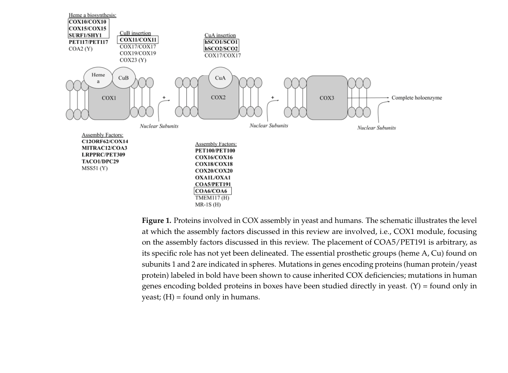

## Question

# Gene Research for Functional Annotation

## ⚠️ CRITICAL: Gene/Protein Identification Context

**BEFORE YOU BEGIN RESEARCH:** You MUST verify you are researching the CORRECT gene/protein. Gene symbols can be ambiguous, especially for less well-characterized genes from non-model organisms.

### Target Gene/Protein Identity (from UniProt):
- **UniProt Accession:** O75880
- **Protein Description:** RecName: Full=Cytochrome c oxidase assembly factor SCO1 {ECO:0000305}; Flags: Precursor;
- **Gene Information:** Name=SCO1; Synonyms=SCOD1;
- **Organism (full):** Homo sapiens (Human).
- **Protein Family:** Belongs to the SCO1/2 family. .
- **Key Domains:** SCO1/SenC. (IPR003782); Synth_of_cyt-c-oxidase_Sco1/2. (IPR017276); Thioredoxin-like_sf. (IPR036249); SCO1-SenC (PF02630)

### MANDATORY VERIFICATION STEPS:

1. **Check if the gene symbol "SCO1" matches the protein description above**
2. **Verify the organism is correct:** Homo sapiens (Human).
3. **Check if protein family/domains align with what you find in literature**
4. **If you find literature for a DIFFERENT gene with the same or similar symbol, STOP**

### If Gene Symbol is Ambiguous or You Cannot Find Relevant Literature:

**DO NOT PROCEED WITH RESEARCH ON A DIFFERENT GENE.** Instead:
- State clearly: "The gene symbol 'SCO1' is ambiguous or literature is limited for this specific protein"
- Explain what you found (e.g., "Found extensive literature on a different gene with the same symbol in a different organism")
- Describe the protein based ONLY on the UniProt information provided above
- Suggest that the protein function can be inferred from domain/family information

### Research Target:

Please provide a comprehensive research report on the gene **SCO1** (gene ID: SCO1, UniProt: O75880) in human.

The research report should be a detailed narrative explaining the function, biological processes, and localization of the gene product. Citations should be given for all claims.

You should prioritize authoritative reviews and primary scientific literature when conducting research. You can supplement
this with annotations you find in gene/protein databases, but these can be outdated or inaccurate.

We are specifically interested in the primary function of the gene - for enzymes, what reaction is catalyzed, and what is the substrate specificity? For transporters, what is the substrate? For structural proteins or adapters, what is the broader structural role? For signaling molecules, what is the role in the pathway.

We are interested in where in or outside the cell the gene product carries out its function.

We are also interested in the signaling or biochemical pathways in which the gene functions. We are less interested in broad pleiotropic effects, except where these elucidate the precise role.

Include evidence where possible. We are interested in both experimental evidence as well as inference from structure, evolution, or bioinformatic analysis. Precise studies should be prioritized over high-throughput, where available.

## Output

Question: You are an expert researcher providing comprehensive, well-cited information.

Provide detailed information focusing on:
1. Key concepts and definitions with current understanding
2. Recent developments and latest research (prioritize 2023-2024 sources)
3. Current applications and real-world implementations
4. Expert opinions and analysis from authoritative sources
5. Relevant statistics and data from recent studies

Format as a comprehensive research report with proper citations. Include URLs and publication dates where available.
Always prioritize recent, authoritative sources and provide specific citations for all major claims.

# Gene Research for Functional Annotation

## ⚠️ CRITICAL: Gene/Protein Identification Context

**BEFORE YOU BEGIN RESEARCH:** You MUST verify you are researching the CORRECT gene/protein. Gene symbols can be ambiguous, especially for less well-characterized genes from non-model organisms.

### Target Gene/Protein Identity (from UniProt):
- **UniProt Accession:** O75880
- **Protein Description:** RecName: Full=Cytochrome c oxidase assembly factor SCO1 {ECO:0000305}; Flags: Precursor;
- **Gene Information:** Name=SCO1; Synonyms=SCOD1;
- **Organism (full):** Homo sapiens (Human).
- **Protein Family:** Belongs to the SCO1/2 family. .
- **Key Domains:** SCO1/SenC. (IPR003782); Synth_of_cyt-c-oxidase_Sco1/2. (IPR017276); Thioredoxin-like_sf. (IPR036249); SCO1-SenC (PF02630)

### MANDATORY VERIFICATION STEPS:

1. **Check if the gene symbol "SCO1" matches the protein description above**
2. **Verify the organism is correct:** Homo sapiens (Human).
3. **Check if protein family/domains align with what you find in literature**
4. **If you find literature for a DIFFERENT gene with the same or similar symbol, STOP**

### If Gene Symbol is Ambiguous or You Cannot Find Relevant Literature:

**DO NOT PROCEED WITH RESEARCH ON A DIFFERENT GENE.** Instead:
- State clearly: "The gene symbol 'SCO1' is ambiguous or literature is limited for this specific protein"
- Explain what you found (e.g., "Found extensive literature on a different gene with the same symbol in a different organism")
- Describe the protein based ONLY on the UniProt information provided above
- Suggest that the protein function can be inferred from domain/family information

### Research Target:

Please provide a comprehensive research report on the gene **SCO1** (gene ID: SCO1, UniProt: O75880) in human.

The research report should be a detailed narrative explaining the function, biological processes, and localization of the gene product. Citations should be given for all claims.

You should prioritize authoritative reviews and primary scientific literature when conducting research. You can supplement
this with annotations you find in gene/protein databases, but these can be outdated or inaccurate.

We are specifically interested in the primary function of the gene - for enzymes, what reaction is catalyzed, and what is the substrate specificity? For transporters, what is the substrate? For structural proteins or adapters, what is the broader structural role? For signaling molecules, what is the role in the pathway.

We are interested in where in or outside the cell the gene product carries out its function.

We are also interested in the signaling or biochemical pathways in which the gene functions. We are less interested in broad pleiotropic effects, except where these elucidate the precise role.

Include evidence where possible. We are interested in both experimental evidence as well as inference from structure, evolution, or bioinformatic analysis. Precise studies should be prioritized over high-throughput, where available.

# Research Report: Human **SCO1** (UniProt **O75880**) — Functional Annotation, Mechanism, and Disease Relevance

## 1) Target verification (mandatory)
The target is **human SCO1** (UniProt **O75880**), annotated as **Cytochrome c oxidase assembly factor SCO1**, a member of the **SCO1/2 family** involved in mitochondrial complex IV (cytochrome c oxidase, COX) biogenesis. Recent authoritative reviews explicitly describe **human SCO1 (hSCO1)** as a mitochondrial **inner membrane** protein with its major functional region facing the **intermembrane space (IMS)** and functioning in **CuA-site copper insertion into COX2**, which matches the UniProt description and the SCO1/SenC domain-family expectations. (guaragnella2024morethanjust pages 13-14, garza2023mitochondrialcopperin pages 4-6)

## 2) Key concepts and definitions (current understanding)

### Cytochrome c oxidase (Complex IV) and copper centers
**Cytochrome c oxidase (COX; complex IV)** is the terminal oxidase of the mitochondrial respiratory chain. Proper function requires metal cofactors, including **copper centers**. One key copper site is the **CuA center** located in the **COX2** subunit; assembly of this site requires dedicated accessory proteins (“assembly factors”/“metallochaperones”). (garza2023mitochondrialcopperin pages 4-6)

### Metallochaperones and the IMS copper delivery pathway
A current framework for **mitochondrial copper delivery** places copper transfer into COX within the **intermembrane space** and mediated by **cysteine-based metallochaperones** that must maintain critical cysteines in a **reduced** state to bind and exchange copper. In this pathway, **COX17** transfers copper to downstream assembly factors including **SCO1** and **SCO2** (for CuA-site assembly on COX2) and **COX11** (for CuB-site assembly on COX1). (garza2023mitochondrialcopperin pages 4-6, garza2023mitochondrialcopperin pages 3-4)

## 3) Molecular function of SCO1 (what it does)

### Primary function: COX2-specific copper metallochaperone for CuA insertion
Across recent reviews, **SCO1 is described as a COX2-specific copper metallochaperone** required for **insertion of copper into the CuA site** of COX2 during complex IV assembly. SCO1 is not described as catalyzing a small-molecule reaction; instead, its functional output is **metal delivery/metallation** and enabling maturation of complex IV. (garza2023mitochondrialcopperin pages 4-6, guaragnella2024morethanjust pages 4-5)

### Cooperative action with SCO2 and model of CuA assembly
A recent synthesis emphasizes that in humans **SCO1 and SCO2 can form a ternary complex with apo-COX2**, with each SCO protein proposed to **donate a single copper ion** to build the binuclear CuA center. (guaragnella2024morethanjust pages 13-14)

## 4) Subcellular localization and topology (where it acts)
Human **SCO1** is described as a **mitochondrial inner membrane transmembrane protein** with a **short N-terminal matrix-facing tail** and **most of the polypeptide exposed to the IMS**, consistent with its role in receiving copper from IMS-localized COX17 and delivering copper to the IMS-facing domain of COX2. (guaragnella2024morethanjust pages 13-14, guaragnella2024morethanjust pages 14-16)

## 5) Mechanism, domains/residues, and interaction partners

### Structural/functional features (domain logic)
SCO1 is described as having a **thioredoxin-like fold** and a conserved **CxxxC copper-binding motif**, consistent with membership in the SCO-family of copper-handling proteins; copper binding by these metallochaperones depends on having key cysteines in a **reduced** state. (guaragnella2024morethanjust pages 13-14, garza2023mitochondrialcopperin pages 4-6)

### Redox support by SCO2 and COA6 (keeping cysteines competent)
The IMS copper-handling network requires redox regulation: **SCO2 and COA6** are described as acting as **disulfide reductases/thiol-redox factors** that maintain SCO1 (and/or COX2) in a copper-binding competent state. This connects SCO1 function to a broader **redox-copper coupling** in complex IV biogenesis. (garza2023mitochondrialcopperin pages 4-6, guaragnella2024morethanjust pages 24-25)

### Interaction partners and pathway context
Recent reviews place SCO1 in a COX2/CuA module that includes:
- **COX17** (upstream IMS copper donor),
- **SCO2** (cofactor insertion/redox partner),
- **COA6** (thiol reductase supporting CuA maturation),
- **PET191/COA5** (associates with SCO1 before copper delivery),
- **COX2** (direct copper acceptor for CuA),
with the broader pathway including other IMS assembly factors and copper-handling proteins. (guaragnella2024morethanjust pages 4-5, garza2023mitochondrialcopperin pages 4-6)

## 6) Recent developments and latest research (prioritizing 2023–2024)

### 6.1 2023: SCO1 in “mitochondrial copper disorders” framework
A 2023 *Trends in Endocrinology & Metabolism* review synthesizes SCO1 within the broader category of **mitochondrial copper delivery disorders**, emphasizing that defects in SCO1 disrupt **COX2 CuA-site metallation** and can produce **fatal infantile disease** with severe complex IV deficiency. (Publication date: Jan 2023; URL: https://doi.org/10.1016/j.tem.2022.11.001) (garza2023mitochondrialcopperin pages 4-6, garza2023mitochondrialcopperin pages 13-15)

### 6.2 2024: Updated COX assembly schematics and copper trafficking models
A 2024 review focused on COX deficiency/assembly provides updated schematics that explicitly group **COX17, SCO1, and SCO2** as the **CuA insertion** machinery, and depicts mitochondrial copper trafficking to the IMS and then into the COX2 CuA site via SCO1. (Publication date: Mar 2024; URL: https://doi.org/10.3390/ijms25073814) (guaragnella2024morethanjust media 4fc2c616, guaragnella2024morethanjust media 0715036a)

### 6.3 2023–2024: Expanding SCO1 biology to systemic phenotypes in mammalian models
Two lines of 2023–2024 research broaden the functional implications of SCO1 loss beyond local complex IV assembly:

**(i) Copper-dependent immunosuppression signaling axis (JCI 2023).** In a hepatocyte-specific Sco1 loss model, mitochondrial dysfunction triggers secretion of **α-fetoprotein (AFP)** that requires **copper** and **CCR5** to promote white blood cell death, connecting OXPHOS dysfunction and copper biology to systemic immune suppression. (Publication date: Jan 2023; URL: https://doi.org/10.1172/jci154684) (jett2023mitochondrialdysfunctionreactivates pages 1-2, jett2023mitochondrialdysfunctionreactivates pages 7-8)

**(ii) Bone marrow progenitor defects and pan-lymphopenia (bioRxiv 2024).** A 2024 preprint uses hepatocyte-specific Sco1 deletion to show **pan-lymphopenia** with substantial defects in **B and T cell development**, associated with reduced shared lymphoid progenitors (MPPLys and CLPs) and a broad shift in plasma cytokines and growth factors predicted to impair lymphopoiesis. (Publication date: Sep 2024; URL: https://doi.org/10.1101/2024.08.30.609186) (pioli2024ahepatocytespecificcytochrome pages 6-7, pioli2024ahepatocytespecificcytochrome pages 1-3)

## 7) Human disease relevance: phenotypes, variants, and functional readouts

### 7.1 Clinical phenotypes reported for SCO1 deficiency
Authoritative 2023–2024 syntheses describe **severe neonatal/infantile presentations** associated with SCO1 loss-of-function, including:
- **hypertrophic cardiomyopathy / ventricular hypertrophy**,
- **hepatic failure / hepatomegaly**,
- **encephalopathy / brain atrophy**,
- **metabolic/lactic acidosis**,
with fatal outcomes in early infancy in described cases. (garza2023mitochondrialcopperin pages 13-15, guaragnella2024morethanjust pages 13-14)

### 7.2 Reported pathogenic variants (examples in 2023–2024 syntheses)
Variants explicitly discussed in recent syntheses include **V93X**, **G132S**, **P174L**, and **M294V**, including compound heterozygous and homozygous cases associated with severe infantile phenotypes. (garza2023mitochondrialcopperin pages 13-15, guaragnella2024morethanjust pages 13-14)

### 7.3 Functional/biochemical evidence in patient materials (statistics/data)
The 2023 synthesis reports **four infants** with SCO1 loss-of-function summarized in that review, with **all dying before 6 months**, and with biochemical findings including **decreased COX activity** in liver and skeletal muscle and **reduced COX-containing supercomplexes** in skeletal muscle. (garza2023mitochondrialcopperin pages 13-15)

### 7.4 Variant interpretation using yeast functional modeling
Yeast-based modeling is highlighted as a practical approach to interpret pathogenicity and mechanism. For example, the **P174L** variant is described as **adjacent to the copper-binding region** and, in yeast modeling, it **impairs copper transfer from COX17 despite normal copper binding**, supporting a specific **defect in copper handoff** rather than complete loss of copper binding. (guaragnella2024morethanjust pages 13-14)

## 8) Current applications and real-world implementations

### 8.1 Clinical genetics and diagnostics (implementation)
SCO1 is a recognized nuclear gene in the diagnostic landscape for **complex IV deficiency** and **mitochondrial disease with cardio-hepatic-neurologic involvement**. The practical implementation is primarily through **genomic sequencing panels/exome/genome** followed by functional validation (e.g., enzymology of COX activity, assembly/supercomplex analysis, and model-organism functional tests). The 2023 and 2024 reviews explicitly position SCO1 among established COX assembly factors and mitochondrial copper delivery genes used to interpret severe infantile mitochondrial disorders. (garza2023mitochondrialcopperin pages 13-15, guaragnella2024morethanjust pages 24-25)

### 8.2 Translational model: gene restoration rescue in vivo
In a hepatocyte-specific Sco1 loss model, **adenoviral restoration of SCO1** in liver is reported to rescue hepatic copper/CTR1-related parameters and to normalize systemic immune phenotypes (WBC counts and splenic/thymic atrophy), supporting proof-of-concept that tissue-targeted restoration of a COX assembly factor can reverse systemic consequences of mitochondrial dysfunction. (jett2023mitochondrialdysfunctionreactivates pages 2-3, jett2023mitochondrialdysfunctionreactivates pages 1-2)

## 9) Quantitative highlights (recent studies)

### 9.1 JCI 2023 (Sco1hep model; immune/metabolic outcomes)
- Sco1hep mice: **median life expectancy ~70 days**. (jett2023mitochondrialdysfunctionreactivates pages 1-2)
- **Leukopenia evident by postnatal day 27**; thymus and spleen show disproportionate atrophy by later timepoints. (jett2023mitochondrialdysfunctionreactivates pages 2-3)
- PBMC phenotypes include increased activation/death markers (**CD44, P = 0.017; annexin V, P = 0.003**). (jett2023mitochondrialdysfunctionreactivates pages 7-8)

### 9.2 bioRxiv 2024 (plasma proteomics and immune development)
- Plasma proteomics (array-based) identified **23 proteins increased and 133 decreased** in Sco1 plasma under that analysis framework, including increases in inflammatory mediators and decreases in growth/hematopoietic factors (e.g., IGF-1, IL-7, CXCL12). (pioli2024ahepatocytespecificcytochrome pages 6-7)

## 10) Expert synthesis / interpretive analysis (authoritative sources)

### Mechanistic consensus
Recent reviews converge on a mechanistic consensus that **SCO1 is a core CuA-site metallochaperone** operating at the **IMS face of the inner membrane**, receiving copper from COX17 and cooperating with SCO2/COA6-driven redox processes to enable copper insertion into **COX2** and thus complex IV maturation. (garza2023mitochondrialcopperin pages 4-6, guaragnella2024morethanjust pages 13-14)

### Systems-level interpretation
Recent primary research extends SCO1 significance from a “local” assembly factor to a driver of **systemic copper-linked signaling** when complex IV fails in specific tissues (notably liver), including copper-dependent AFP signaling leading to leukocyte toxicity and immune suppression, and circulating factor changes that impair lymphopoiesis. This systems-level view suggests that SCO1-related disease may include clinically relevant immune phenotypes in addition to classic bioenergetic failure. (jett2023mitochondrialdysfunctionreactivates pages 1-2, pioli2024ahepatocytespecificcytochrome pages 6-7)

## Evidence map table
| Category | Key points | Best supporting citations (pqac IDs) and source (paper, year, URL) |
|---|---|---|
| Localization/Topology | Human SCO1 matches UniProt O75880 as a mitochondrial cytochrome c oxidase assembly factor in the SCO1/2 family. It is an inner mitochondrial membrane protein with a short N-terminal matrix tail and most of the polypeptide exposed to the intermembrane space, positioning its functional domain near COX2 CuA-site assembly. | (guaragnella2024morethanjust pages 13-14, guaragnella2024morethanjust pages 14-16) Guaragnella et al., 2024, *Int J Mol Sci*, https://doi.org/10.3390/ijms25073814 |
| Molecular function | SCO1 is the COX2-specific copper metallochaperone for cytochrome c oxidase/complex IV biogenesis. Current understanding is that it inserts copper into the CuA site of COX2 rather than catalyzing a classic enzyme reaction; its role is metallation/assembly, with redox competence of cysteines required for function. | (garza2023mitochondrialcopperin pages 4-6, garza2023mitochondrialcopperin pages 3-4, guaragnella2024morethanjust pages 4-5) Garza et al., 2023, *Trends Endocrinol Metab*, https://doi.org/10.1016/j.tem.2022.11.001; Guaragnella et al., 2024, *Int J Mol Sci*, https://doi.org/10.3390/ijms25073814 |
| Copper delivery pathway | In the mitochondrial copper delivery pathway, COX17 transfers copper in the intermembrane space to SCO1, SCO2, and COX11. SCO1 and SCO2 then cooperate in CuA-site assembly on apo-COX2; one recent model describes a ternary SCO1–SCO2–apoCOX2 complex in which each SCO protein donates one copper ion. PET191/COA5 associates with SCO1 prior to copper delivery. | (guaragnella2024morethanjust pages 13-14, garza2023mitochondrialcopperin pages 4-6, guaragnella2024morethanjust pages 4-5, guaragnella2024morethanjust media 4fc2c616, guaragnella2024morethanjust media 0715036a) Guaragnella et al., 2024, *Int J Mol Sci*, https://doi.org/10.3390/ijms25073814; Garza et al., 2023, *Trends Endocrinol Metab*, https://doi.org/10.1016/j.tem.2022.11.001 |
| Key residues/domains | SCO1 has a thioredoxin-like fold and a copper-binding CxxxC motif characteristic of SCO-family proteins; available context states that cysteine-based copper binding requires the cysteines to remain reduced. The P174L pathogenic variant lies adjacent to the copper-binding region and impairs copper transfer from COX17 despite preserved copper binding in yeast-based modeling. | (guaragnella2024morethanjust pages 13-14, garza2023mitochondrialcopperin pages 4-6, garza2023mitochondrialcopperin pages 3-4) Guaragnella et al., 2024, *Int J Mol Sci*, https://doi.org/10.3390/ijms25073814; Garza et al., 2023, *Trends Endocrinol Metab*, https://doi.org/10.1016/j.tem.2022.11.001 |
| Interaction partners/complexes | Key pathway partners include COX17, SCO2, COX2, COA6, COX11, and PET191/COA5. COA6 and SCO2 are described as disulfide reductases/thiol-redox factors that maintain SCO1 and/or COX2 in a copper-binding competent state; SCO1 functions within larger complex IV assembly modules and copper-trafficking assemblies. | (guaragnella2024morethanjust pages 13-14, garza2023mitochondrialcopperin pages 4-6, guaragnella2024morethanjust pages 4-5) Guaragnella et al., 2024, *Int J Mol Sci*, https://doi.org/10.3390/ijms25073814; Garza et al., 2023, *Trends Endocrinol Metab*, https://doi.org/10.1016/j.tem.2022.11.001 |
| Disease/phenotypes | Human SCO1 deficiency causes severe neonatal/infantile mitochondrial disease with isolated or predominant complex IV deficiency. Reported phenotypes include neonatal hepatic failure, lactic acidosis, hypertrophic cardiomyopathy/ventricular hypertrophy, hepatomegaly, encephalopathy/brain atrophy, and fatal infantile cardio-hepatic-neurologic disease. Variants reported in context include V93X, G132S, P174L, and M294V. | (guaragnella2024morethanjust pages 13-14, guaragnella2024morethanjust pages 24-25, garza2023mitochondrialcopperin pages 13-15) Guaragnella et al., 2024, *Int J Mol Sci*, https://doi.org/10.3390/ijms25073814; Garza et al., 2023, *Trends Endocrinol Metab*, https://doi.org/10.1016/j.tem.2022.11.001 |
| Model organism evidence | Yeast studies provide much of the mechanistic evidence: Sco1 is a Cu(I)-binding mitochondrial copper protein required for COX biogenesis and CuA-site assembly on Cox2. Yeast modeling of human variants supports pathogenic interpretation, including evidence that P174L disrupts copper transfer and that SCO2 can partially complement some SCO1 defects, indicating partial functional overlap but nonredundancy. | (guaragnella2024morethanjust pages 13-14, guaragnella2024morethanjust pages 24-25, guaragnella2024morethanjust pages 14-16, guaragnella2024morethanjust pages 21-22) Guaragnella et al., 2024, *Int J Mol Sci*, https://doi.org/10.3390/ijms25073814 |
| Quantitative data/stats | Human case synthesis in the 2023 review notes 4 reported infants with SCO1 loss-of-function, all dying before 6 months, with decreased COX activity in liver and skeletal muscle and reduced COX-containing supercomplexes in skeletal muscle. In hepatocyte-specific Sco1 mouse models, median life expectancy is ~70 days; leukopenia is evident by postnatal day 27; thymus/spleen wet weights are reduced by P37 and P47; PBMC activation/death markers increase (CD44 P=0.017, annexin V P=0.003); plasma proteomics found 23 proteins increased and 133 decreased. | (garza2023mitochondrialcopperin pages 13-15, jett2023mitochondrialdysfunctionreactivates pages 2-3, pioli2024ahepatocytespecificcytochrome pages 6-7, jett2023mitochondrialdysfunctionreactivates pages 1-2, jett2023mitochondrialdysfunctionreactivates pages 7-8) Garza et al., 2023, *Trends Endocrinol Metab*, https://doi.org/10.1016/j.tem.2022.11.001; Jett et al., 2023, *J Clin Invest*, https://doi.org/10.1172/jci154684; Pioli et al., 2024, *bioRxiv*, https://doi.org/10.1101/2024.08.30.609186 |
| Recent developments 2023-2024 | Recent literature emphasizes SCO1 as part of a broader mitochondrial copper-signaling network, not just a local assembly factor. 2023-2024 work links hepatocyte-specific Sco1 loss to hepatic copper deficiency, elevated circulating copper/ceruloplasmin, AFP-dependent copper-requiring immunosuppression, and bone-marrow lymphoid progenitor defects, expanding SCO1 biology from complex IV metallation to systemic pathophysiology in mitochondrial disease models. Review/schematic updates in 2024 also refine the assembly sequence involving COX17, SCO1, SCO2, COA6, PET191, and COX2 CuA insertion. | (jett2023mitochondrialdysfunctionreactivates pages 2-3, pioli2024ahepatocytespecificcytochrome pages 6-7, pioli2024ahepatocytespecificcytochrome pages 1-3, jett2023mitochondrialdysfunctionreactivates pages 7-8, guaragnella2024morethanjust media 4fc2c616, guaragnella2024morethanjust media 0715036a) Jett et al., 2023, *J Clin Invest*, https://doi.org/10.1172/jci154684; Pioli et al., 2024, *bioRxiv*, https://doi.org/10.1101/2024.08.30.609186; Guaragnella et al., 2024, *Int J Mol Sci*, https://doi.org/10.3390/ijms25073814 |

*Table: This table summarizes the current functional annotation of human SCO1 (UniProt O75880), including molecular role, localization, pathway context, disease relevance, and recent 2023-2024 developments. It is useful as a compact evidence map linking mechanistic and clinical findings to specific sources.*

## Key schematic evidence (visual)
A 2024 COX assembly review provides schematics of (i) the COX assembly modules showing **CuA insertion** factors (COX17/SCO1/SCO2) and (ii) **mitochondrial copper trafficking** culminating in SCO1-mediated delivery to the **COX2 CuA** site. (guaragnella2024morethanjust media 4fc2c616, guaragnella2024morethanjust media 0715036a)

## References (URLs and publication dates as available in retrieved sources)
- Garza NM, Swaminathan AB, Maremanda KP, et al. **Mitochondrial copper in human genetic disorders.** *Trends in Endocrinology & Metabolism.* **Jan 2023.** https://doi.org/10.1016/j.tem.2022.11.001 (garza2023mitochondrialcopperin pages 13-15, garza2023mitochondrialcopperin pages 4-6)
- Guaragnella N, Cervelli T, Sampaio-Marques B, et al. **More than Just Bread and Wine: Using Yeast to Understand Inherited Cytochrome Oxidase Deficiencies in Humans.** *International Journal of Molecular Sciences.* **Mar 2024.** https://doi.org/10.3390/ijms25073814 (guaragnella2024morethanjust pages 13-14, guaragnella2024morethanjust media 4fc2c616, guaragnella2024morethanjust media 0715036a)
- Jett KA, Baker ZN, Hossain A, et al. **Mitochondrial dysfunction reactivates α-fetoprotein expression that drives copper-dependent immunosuppression in mitochondrial disease models.** *Journal of Clinical Investigation.* **Jan 2023.** https://doi.org/10.1172/jci154684 (jett2023mitochondrialdysfunctionreactivates pages 1-2, jett2023mitochondrialdysfunctionreactivates pages 7-8)
- Pioli KAT, Ghosh S, Boulet A, Leary SC, Pioli PD. **A hepatocyte-specific cytochrome c oxidase deficiency in mice leads to a lymphopenia owing to deficiencies in bone marrow progenitors.** *bioRxiv.* **Sep 2024.** https://doi.org/10.1101/2024.08.30.609186 (pioli2024ahepatocytespecificcytochrome pages 6-7, pioli2024ahepatocytespecificcytochrome pages 1-3)

References

1. (guaragnella2024morethanjust pages 13-14): Nicoletta Guaragnella, T. Cervelli, Bel é m Sampaio-Marques, Chenelle A. Caron-Godon, Emma Collington, Jessica L. Wolf, Genna Coletta, and D. M. Glerum. More than just bread and wine: using yeast to understand inherited cytochrome oxidase deficiencies in humans. International Journal of Molecular Sciences, 25:3814, Mar 2024. URL: https://doi.org/10.3390/ijms25073814, doi:10.3390/ijms25073814. This article has 5 citations.

2. (garza2023mitochondrialcopperin pages 4-6): Natalie M. Garza, Abhinav B. Swaminathan, Krishna P. Maremanda, Mohammad Zulkifli, and Vishal M. Gohil. Mitochondrial copper in human genetic disorders. Trends in Endocrinology &amp; Metabolism, 34:21-33, Jan 2023. URL: https://doi.org/10.1016/j.tem.2022.11.001, doi:10.1016/j.tem.2022.11.001. This article has 126 citations and is from a domain leading peer-reviewed journal.

3. (garza2023mitochondrialcopperin pages 3-4): Natalie M. Garza, Abhinav B. Swaminathan, Krishna P. Maremanda, Mohammad Zulkifli, and Vishal M. Gohil. Mitochondrial copper in human genetic disorders. Trends in Endocrinology &amp; Metabolism, 34:21-33, Jan 2023. URL: https://doi.org/10.1016/j.tem.2022.11.001, doi:10.1016/j.tem.2022.11.001. This article has 126 citations and is from a domain leading peer-reviewed journal.

4. (guaragnella2024morethanjust pages 4-5): Nicoletta Guaragnella, T. Cervelli, Bel é m Sampaio-Marques, Chenelle A. Caron-Godon, Emma Collington, Jessica L. Wolf, Genna Coletta, and D. M. Glerum. More than just bread and wine: using yeast to understand inherited cytochrome oxidase deficiencies in humans. International Journal of Molecular Sciences, 25:3814, Mar 2024. URL: https://doi.org/10.3390/ijms25073814, doi:10.3390/ijms25073814. This article has 5 citations.

5. (guaragnella2024morethanjust pages 14-16): Nicoletta Guaragnella, T. Cervelli, Bel é m Sampaio-Marques, Chenelle A. Caron-Godon, Emma Collington, Jessica L. Wolf, Genna Coletta, and D. M. Glerum. More than just bread and wine: using yeast to understand inherited cytochrome oxidase deficiencies in humans. International Journal of Molecular Sciences, 25:3814, Mar 2024. URL: https://doi.org/10.3390/ijms25073814, doi:10.3390/ijms25073814. This article has 5 citations.

6. (guaragnella2024morethanjust pages 24-25): Nicoletta Guaragnella, T. Cervelli, Bel é m Sampaio-Marques, Chenelle A. Caron-Godon, Emma Collington, Jessica L. Wolf, Genna Coletta, and D. M. Glerum. More than just bread and wine: using yeast to understand inherited cytochrome oxidase deficiencies in humans. International Journal of Molecular Sciences, 25:3814, Mar 2024. URL: https://doi.org/10.3390/ijms25073814, doi:10.3390/ijms25073814. This article has 5 citations.

7. (garza2023mitochondrialcopperin pages 13-15): Natalie M. Garza, Abhinav B. Swaminathan, Krishna P. Maremanda, Mohammad Zulkifli, and Vishal M. Gohil. Mitochondrial copper in human genetic disorders. Trends in Endocrinology &amp; Metabolism, 34:21-33, Jan 2023. URL: https://doi.org/10.1016/j.tem.2022.11.001, doi:10.1016/j.tem.2022.11.001. This article has 126 citations and is from a domain leading peer-reviewed journal.

8. (guaragnella2024morethanjust media 4fc2c616): Nicoletta Guaragnella, T. Cervelli, Bel é m Sampaio-Marques, Chenelle A. Caron-Godon, Emma Collington, Jessica L. Wolf, Genna Coletta, and D. M. Glerum. More than just bread and wine: using yeast to understand inherited cytochrome oxidase deficiencies in humans. International Journal of Molecular Sciences, 25:3814, Mar 2024. URL: https://doi.org/10.3390/ijms25073814, doi:10.3390/ijms25073814. This article has 5 citations.

9. (guaragnella2024morethanjust media 0715036a): Nicoletta Guaragnella, T. Cervelli, Bel é m Sampaio-Marques, Chenelle A. Caron-Godon, Emma Collington, Jessica L. Wolf, Genna Coletta, and D. M. Glerum. More than just bread and wine: using yeast to understand inherited cytochrome oxidase deficiencies in humans. International Journal of Molecular Sciences, 25:3814, Mar 2024. URL: https://doi.org/10.3390/ijms25073814, doi:10.3390/ijms25073814. This article has 5 citations.

10. (jett2023mitochondrialdysfunctionreactivates pages 1-2): Kimberly A. Jett, Zakery N. Baker, Amzad Hossain, Aren Boulet, Paul A. Cobine, Sagnika Ghosh, Philip Ng, Orhan Yilmaz, Kris Barreto, John DeCoteau, Karen Mochoruk, George N. Ioannou, Christopher Savard, Sai Yuan, Osama H.M.H. Abdalla, Christopher Lowden, Byung-Eun Kim, Hai-Ying Mary Cheng, Brendan J. Battersby, Vishal M. Gohil, and Scot C. Leary. Mitochondrial dysfunction reactivates α-fetoprotein expression that drives copper-dependent immunosuppression in mitochondrial disease models. Journal of Clinical Investigation, Jan 2023. URL: https://doi.org/10.1172/jci154684, doi:10.1172/jci154684. This article has 16 citations and is from a highest quality peer-reviewed journal.

11. (jett2023mitochondrialdysfunctionreactivates pages 7-8): Kimberly A. Jett, Zakery N. Baker, Amzad Hossain, Aren Boulet, Paul A. Cobine, Sagnika Ghosh, Philip Ng, Orhan Yilmaz, Kris Barreto, John DeCoteau, Karen Mochoruk, George N. Ioannou, Christopher Savard, Sai Yuan, Osama H.M.H. Abdalla, Christopher Lowden, Byung-Eun Kim, Hai-Ying Mary Cheng, Brendan J. Battersby, Vishal M. Gohil, and Scot C. Leary. Mitochondrial dysfunction reactivates α-fetoprotein expression that drives copper-dependent immunosuppression in mitochondrial disease models. Journal of Clinical Investigation, Jan 2023. URL: https://doi.org/10.1172/jci154684, doi:10.1172/jci154684. This article has 16 citations and is from a highest quality peer-reviewed journal.

12. (pioli2024ahepatocytespecificcytochrome pages 6-7): KimAnh T. Pioli, Sampurna Ghosh, Aren Boulet, Scot C. Leary, and Peter D. Pioli. A hepatocyte-specific cytochrome c oxidase deficiency in mice leads to a lymphopenia owing to deficiencies in bone marrow progenitors. bioRxiv, Sep 2024. URL: https://doi.org/10.1101/2024.08.30.609186, doi:10.1101/2024.08.30.609186. This article has 0 citations.

13. (pioli2024ahepatocytespecificcytochrome pages 1-3): KimAnh T. Pioli, Sampurna Ghosh, Aren Boulet, Scot C. Leary, and Peter D. Pioli. A hepatocyte-specific cytochrome c oxidase deficiency in mice leads to a lymphopenia owing to deficiencies in bone marrow progenitors. bioRxiv, Sep 2024. URL: https://doi.org/10.1101/2024.08.30.609186, doi:10.1101/2024.08.30.609186. This article has 0 citations.

14. (jett2023mitochondrialdysfunctionreactivates pages 2-3): Kimberly A. Jett, Zakery N. Baker, Amzad Hossain, Aren Boulet, Paul A. Cobine, Sagnika Ghosh, Philip Ng, Orhan Yilmaz, Kris Barreto, John DeCoteau, Karen Mochoruk, George N. Ioannou, Christopher Savard, Sai Yuan, Osama H.M.H. Abdalla, Christopher Lowden, Byung-Eun Kim, Hai-Ying Mary Cheng, Brendan J. Battersby, Vishal M. Gohil, and Scot C. Leary. Mitochondrial dysfunction reactivates α-fetoprotein expression that drives copper-dependent immunosuppression in mitochondrial disease models. Journal of Clinical Investigation, Jan 2023. URL: https://doi.org/10.1172/jci154684, doi:10.1172/jci154684. This article has 16 citations and is from a highest quality peer-reviewed journal.

15. (guaragnella2024morethanjust pages 21-22): Nicoletta Guaragnella, T. Cervelli, Bel é m Sampaio-Marques, Chenelle A. Caron-Godon, Emma Collington, Jessica L. Wolf, Genna Coletta, and D. M. Glerum. More than just bread and wine: using yeast to understand inherited cytochrome oxidase deficiencies in humans. International Journal of Molecular Sciences, 25:3814, Mar 2024. URL: https://doi.org/10.3390/ijms25073814, doi:10.3390/ijms25073814. This article has 5 citations.

## Artifacts

- [Edison artifact artifact-00](SCO1-deep-research-falcon_artifacts/artifact-00.md)

## Citations

1. garza2023mitochondrialcopperin pages 4-6
2. guaragnella2024morethanjust pages 13-14
3. garza2023mitochondrialcopperin pages 13-15
4. jett2023mitochondrialdysfunctionreactivates pages 1-2
5. jett2023mitochondrialdysfunctionreactivates pages 2-3
6. jett2023mitochondrialdysfunctionreactivates pages 7-8
7. pioli2024ahepatocytespecificcytochrome pages 6-7
8. garza2023mitochondrialcopperin pages 3-4
9. guaragnella2024morethanjust pages 4-5
10. guaragnella2024morethanjust pages 14-16
11. guaragnella2024morethanjust pages 24-25
12. pioli2024ahepatocytespecificcytochrome pages 1-3
13. guaragnella2024morethanjust pages 21-22
14. https://doi.org/10.1016/j.tem.2022.11.001
15. https://doi.org/10.3390/ijms25073814
16. https://doi.org/10.1172/jci154684
17. https://doi.org/10.1101/2024.08.30.609186
18. https://doi.org/10.1016/j.tem.2022.11.001;
19. https://doi.org/10.3390/ijms25073814;
20. https://doi.org/10.1172/jci154684;
21. https://doi.org/10.1101/2024.08.30.609186;
22. https://doi.org/10.3390/ijms25073814,
23. https://doi.org/10.1016/j.tem.2022.11.001,
24. https://doi.org/10.1172/jci154684,
25. https://doi.org/10.1101/2024.08.30.609186,