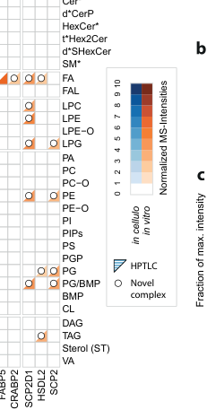

## Question

# Gene Research for Functional Annotation

## ⚠️ CRITICAL: Gene/Protein Identification Context

**BEFORE YOU BEGIN RESEARCH:** You MUST verify you are researching the CORRECT gene/protein. Gene symbols can be ambiguous, especially for less well-characterized genes from non-model organisms.

### Target Gene/Protein Identity (from UniProt):
- **UniProt Accession:** Q9UJQ7
- **Protein Description:** RecName: Full=SCP2 sterol-binding domain-containing protein 1;
- **Gene Information:** Name=SCP2D1; Synonyms=C20orf79;
- **Organism (full):** Homo sapiens (Human).
- **Protein Family:** Not specified in UniProt
- **Key Domains:** SCP2_sterol-bd_dom. (IPR003033); SCP2_sterol-bd_dom_sf. (IPR036527); SCP2 (PF02036)

### MANDATORY VERIFICATION STEPS:

1. **Check if the gene symbol "SCP2D1" matches the protein description above**
2. **Verify the organism is correct:** Homo sapiens (Human).
3. **Check if protein family/domains align with what you find in literature**
4. **If you find literature for a DIFFERENT gene with the same or similar symbol, STOP**

### If Gene Symbol is Ambiguous or You Cannot Find Relevant Literature:

**DO NOT PROCEED WITH RESEARCH ON A DIFFERENT GENE.** Instead:
- State clearly: "The gene symbol 'SCP2D1' is ambiguous or literature is limited for this specific protein"
- Explain what you found (e.g., "Found extensive literature on a different gene with the same symbol in a different organism")
- Describe the protein based ONLY on the UniProt information provided above
- Suggest that the protein function can be inferred from domain/family information

### Research Target:

Please provide a comprehensive research report on the gene **SCP2D1** (gene ID: SCP2D1, UniProt: Q9UJQ7) in human.

The research report should be a detailed narrative explaining the function, biological processes, and localization of the gene product. Citations should be given for all claims.

You should prioritize authoritative reviews and primary scientific literature when conducting research. You can supplement
this with annotations you find in gene/protein databases, but these can be outdated or inaccurate.

We are specifically interested in the primary function of the gene - for enzymes, what reaction is catalyzed, and what is the substrate specificity? For transporters, what is the substrate? For structural proteins or adapters, what is the broader structural role? For signaling molecules, what is the role in the pathway.

We are interested in where in or outside the cell the gene product carries out its function.

We are also interested in the signaling or biochemical pathways in which the gene functions. We are less interested in broad pleiotropic effects, except where these elucidate the precise role.

Include evidence where possible. We are interested in both experimental evidence as well as inference from structure, evolution, or bioinformatic analysis. Precise studies should be prioritized over high-throughput, where available.

## Output

Question: You are an expert researcher providing comprehensive, well-cited information.

Provide detailed information focusing on:
1. Key concepts and definitions with current understanding
2. Recent developments and latest research (prioritize 2023-2024 sources)
3. Current applications and real-world implementations
4. Expert opinions and analysis from authoritative sources
5. Relevant statistics and data from recent studies

Format as a comprehensive research report with proper citations. Include URLs and publication dates where available.
Always prioritize recent, authoritative sources and provide specific citations for all major claims.

# Gene Research for Functional Annotation

## ⚠️ CRITICAL: Gene/Protein Identification Context

**BEFORE YOU BEGIN RESEARCH:** You MUST verify you are researching the CORRECT gene/protein. Gene symbols can be ambiguous, especially for less well-characterized genes from non-model organisms.

### Target Gene/Protein Identity (from UniProt):
- **UniProt Accession:** Q9UJQ7
- **Protein Description:** RecName: Full=SCP2 sterol-binding domain-containing protein 1;
- **Gene Information:** Name=SCP2D1; Synonyms=C20orf79;
- **Organism (full):** Homo sapiens (Human).
- **Protein Family:** Not specified in UniProt
- **Key Domains:** SCP2_sterol-bd_dom. (IPR003033); SCP2_sterol-bd_dom_sf. (IPR036527); SCP2 (PF02036)

### MANDATORY VERIFICATION STEPS:

1. **Check if the gene symbol "SCP2D1" matches the protein description above**
2. **Verify the organism is correct:** Homo sapiens (Human).
3. **Check if protein family/domains align with what you find in literature**
4. **If you find literature for a DIFFERENT gene with the same or similar symbol, STOP**

### If Gene Symbol is Ambiguous or You Cannot Find Relevant Literature:

**DO NOT PROCEED WITH RESEARCH ON A DIFFERENT GENE.** Instead:
- State clearly: "The gene symbol 'SCP2D1' is ambiguous or literature is limited for this specific protein"
- Explain what you found (e.g., "Found extensive literature on a different gene with the same symbol in a different organism")
- Describe the protein based ONLY on the UniProt information provided above
- Suggest that the protein function can be inferred from domain/family information

### Research Target:

Please provide a comprehensive research report on the gene **SCP2D1** (gene ID: SCP2D1, UniProt: Q9UJQ7) in human.

The research report should be a detailed narrative explaining the function, biological processes, and localization of the gene product. Citations should be given for all claims.

You should prioritize authoritative reviews and primary scientific literature when conducting research. You can supplement
this with annotations you find in gene/protein databases, but these can be outdated or inaccurate.

We are specifically interested in the primary function of the gene - for enzymes, what reaction is catalyzed, and what is the substrate specificity? For transporters, what is the substrate? For structural proteins or adapters, what is the broader structural role? For signaling molecules, what is the role in the pathway.

We are interested in where in or outside the cell the gene product carries out its function.

We are also interested in the signaling or biochemical pathways in which the gene functions. We are less interested in broad pleiotropic effects, except where these elucidate the precise role.

Include evidence where possible. We are interested in both experimental evidence as well as inference from structure, evolution, or bioinformatic analysis. Precise studies should be prioritized over high-throughput, where available.

# Research Report: Human **SCP2D1** (UniProt **Q9UJQ7**; gene **SCP2D1**; synonym **C20orf79**)

## 0. Scope, target verification, and limitations

### Target identity verification
The target protein is **human SCP2D1** (gene symbol **SCP2D1**, synonym **C20orf79**), matching the user-provided UniProt accession **Q9UJQ7** and description “SCP2 sterol-binding domain-containing protein 1.” Multiple independent publications explicitly use **SCP2D1** and/or **C20orf79** for the same human gene in functional and expression studies, supporting that these identifiers are consistently mapped in the literature (bartz2009identificationofcholesterolregulating pages 2-3, almutairi2022cancertestisgenebiomarkers pages 1-2, almutairi2022theexpressionpatterns pages 2-5).

### Critical limitation: direct UniProt/InterPro text not retrievable in this run
The available toolset in this run did not retrieve UniProt/InterPro records directly; therefore, **sequence-derived features** (exact length, motifs, isoforms, subcellular targeting signals) are **not quoted from UniProt** here. Functional annotation is instead grounded in (i) direct experimental perturbation data, (ii) a 2024 lipid-transfer-protein ligand mapping study that includes SCP2D1, and (iii) disease/phenotype association aggregations (Open Targets) (bartz2009identificationofcholesterolregulating pages 2-3, titeca2024asystemwideanalysis media 8e296237, OpenTargets Search: -SCP2D1).

### Avoiding gene confusion
A substantial body of mechanistic literature exists for **SCP2/SCPX** (the distinct gene **SCP2**), which also contains an SCP2 domain and participates in intracellular lipid trafficking. These studies provide domain-level background but **do not constitute direct evidence for SCP2D1** and are not used here to claim SCP2D1 localization or mechanism (li2016sterolcarrierprotein2 pages 20-21, li2016sterolcarrierprotein2 pages 12-15).

## 1. Key concepts and definitions (current understanding)

### 1.1 SCP2 (sterol carrier protein 2) domain and lipid transfer proteins (LTPs)
Lipid transfer proteins (LTPs) are a broad class of proteins that bind lipids and can contribute to **lipid mobilization/trafficking** between cellular membranes or compartments. A system-wide study of human LTPs emphasizes that many LTPs bind multiple lipid classes and that ligand identities remain unknown for many LTPs (titeca2024asystemwideanalysis pages 6-9).

**SCP2D1** is defined by its name as containing an **SCP2 sterol-binding domain**, and it is treated as an LTP candidate in recent systematic LTP analyses (titeca2024asystemwideanalysis pages 6-9).

### 1.2 Cancer-testis (CT) genes
**Cancer-testis genes** are genes with expression normally restricted to germline tissues (classically testis) but aberrantly expressed in cancers, often due to epigenetic derepression (e.g., DNA hypomethylation or histone acetylation changes). SCP2D1 has been characterized in colon cancer studies as a CT gene candidate and is inducible by epigenetic drugs in colon cancer cell lines (almutairi2022cancertestisgenebiomarkers pages 1-2, almutairi2022theexpressionpatterns pages 2-5).

## 2. Molecular function and biochemical activity of SCP2D1

### 2.1 Best current direct functional clue (2024): lipid ligand classes bound by SCP2D1
A 2024 preprint performing a **system-wide analysis of human lipid transfer proteins** includes SCP2D1 among LTPs with **no previously known ligands** and assigns lipid classes associated with SCP2D1 in **Figure 3a** (titeca2024asystemwideanalysis pages 6-9). In the cropped figure region, SCP2D1 is shown with ligand-class associations including:

- **Fatty acids (FA)**
- **Lysophosphatidylcholine (LPC)**
- **Lysophosphatidylethanolamine (LPE)**
- **Lysophosphatidylglycerol (LPG)**
- **Phosphatidylethanolamine (PE)**
- **Phosphatidylglycerol / bis(monoacylglycero)phosphate (PG/BMP)**

These are indicated as in vitro/novel complex identifications in the figure legend conventions (titeca2024asystemwideanalysis media 8e296237). This supports annotating SCP2D1 as a **multi-class lipid-binding** protein, consistent with LTP-like behavior, though **binding constants, transfer rates, and subcellular site of action** were not extractable from the available text snippets (titeca2024asystemwideanalysis pages 6-9, titeca2024asystemwideanalysis media 8e296237).

**Current understanding (functional inference):** SCP2D1 likely participates in **cellular lipid mobilization** involving lysophospholipids and glycerophospholipids and may also bind free fatty acids, suggesting a role broader than “sterol-only” binding (titeca2024asystemwideanalysis media 8e296237).

### 2.2 Direct perturbation evidence (2009): effect on cellular cholesterol and LDL handling
A targeted siRNA screen for cholesterol-regulating genes in HeLa cells tested **C20orf79** (SCP2D1) using high-content assays measuring (i) **filipin staining** (cellular cholesterol signal) and (ii) **DiI-LDL uptake** (LDL internalization). Knockdown of C20orf79 increased signals in **both** assays (bartz2009identificationofcholesterolregulating pages 2-3). 

**Interpretation:** Reduced SCP2D1 expression produced a phenotype consistent with altered cholesterol homeostasis and/or LDL trafficking, implying SCP2D1 participates in pathways that constrain cholesterol accumulation and/or regulate LDL uptake under these conditions (bartz2009identificationofcholesterolregulating pages 2-3).

**Limitations:** The excerpt does not provide SCP2D1-specific effect size, p-values, or mechanistic dissection (e.g., whether increased filipin reflects increased total cholesterol vs redistributed cholesterol), so this should be treated as **strong hypothesis-generating functional evidence** rather than a resolved mechanism (bartz2009identificationofcholesterolregulating pages 2-3).

### 2.3 Enzymatic or transporter activity
No retrieved source demonstrated SCP2D1 catalyzing a biochemical reaction (enzyme activity) or acting as a membrane transporter with defined substrate translocation kinetics. The strongest current evidence supports **lipid binding** and **lipid/cholesterol handling phenotypes** rather than enzymatic catalysis (titeca2024asystemwideanalysis media 8e296237, bartz2009identificationofcholesterolregulating pages 2-3).

## 3. Subcellular localization and site of action
No retrieved SCP2D1-specific experiments provided definitive localization (e.g., immunofluorescence of endogenous SCP2D1, organelle fractionation, proximity labeling, or tagged SCP2D1 localization). Therefore, SCP2D1 localization remains **underdetermined** from this evidence set.

Related SCP2-domain proteins (SCP2/SCPX) show peroxisomal targeting features and multi-compartment distribution in model systems, but these data apply to **SCP2**, not SCP2D1, and cannot be transferred as direct annotation for SCP2D1 (li2016sterolcarrierprotein2 pages 12-15, li2016sterolcarrierprotein2 pages 18-20).

## 4. Pathways and biological processes implicated

### 4.1 Lipid mobilization / lipidome regulation (system-wide LTP framework)
The 2024 system-wide LTP analysis provides the most direct pathway context: SCP2D1 is included among LTPs whose ligands were mapped, and the overall framework links LTP ligand binding to downstream lipidomic shifts and organellar lipid distributions (titeca2024asystemwideanalysis pages 6-9). The SCP2D1 ligand classes (FA and several lysophospholipids/phospholipids) implicate SCP2D1 in **phospholipid/lysophospholipid biology** and potentially in lipid remodeling or organelle lipid exchange processes, though SCP2D1-specific downstream lipidomic effects were not extractable from the provided text excerpt (titeca2024asystemwideanalysis media 8e296237, titeca2024asystemwideanalysis pages 6-9).

### 4.2 Cellular cholesterol and LDL uptake pathways
The 2009 RNAi screen phenotype connects SCP2D1 to pathways that influence **cholesterol levels** and **LDL internalization** (bartz2009identificationofcholesterolregulating pages 2-3). This places SCP2D1 functionally near endocytic trafficking and cholesterol homeostasis networks.

## 5. Human genetics, functional genomics screens, and disease associations

### 5.1 Open Targets aggregation (including CRISPRi neuron screens)
Open Targets links SCP2D1 to multiple disease terms with **modest association scores**, supported partly by CRISPRi screens in glutamatergic neurons (PubMed ID 34031600 as referenced by Open Targets). Reported target–disease association scores include neurodegenerative disease (~0.287), liver disease (~0.147), pneumonitis (~0.126), abnormal central motor function (~0.099), and rectosigmoid junction neoplasm (~0.095) (OpenTargets Search: -SCP2D1).

Open Targets provides quantitative CRISPR evidence scores for SCP2D1 in two neuron-screen contrasts (annotated as “affected_pathway”):
- **Reactive Oxygen Species (CellROX) CRISPRi** evidence score ~0.643
- **PSAP KO survival CRISPRi** evidence score ~0.529

These are accompanied by small resourceScore values (~0.026 and ~0.044), consistent with limited aggregated support (OpenTargets Search: -SCP2D1).

**Interpretation:** SCP2D1 has emerged as a putative modifier in neuronal oxidative stress/survival contexts in high-throughput perturbation screens, motivating mechanistic follow-up in lipid-peroxidation/oxidative-stress pathways (OpenTargets Search: -SCP2D1).

### 5.2 Cardiovascular pQTL links to SCAD locus (2022)
A 2022 integrative GWAS/pQTL study reported that SCAD-associated variants at **1q21.2** were strongly associated with circulating levels of multiple proteins, including **SCP2D1**, and listed SCP2D1 among proteins “affected by genetic variants at 1q21.2” (chai2022genomewideidentificationof pages 1-2, chai2022genomewideidentificationof pages 5-8). 

**Limitations:** The excerpt provides detailed pQTL statistics for ECM1 but not SCP2D1, and Mendelian randomization (MR) support in the excerpt emphasizes ECM1/SPOCK3/IL1B rather than SCP2D1. Thus, SCP2D1 is currently a **locus-linked circulating protein** candidate rather than a causal factor supported by MR in the provided text (chai2022genomewideidentificationof pages 5-8).

## 6. Expression patterns, regulation, and cancer relevance

### 6.1 Colon cancer expression and biomarker potential
In a cohort of **20** matched colon cancer (CC) and normal colon (NC) tissue samples, SCP2D1 mRNA was detected in CC but not in NC, and it was one of the most frequently expressed CT genes in that cohort: **35%** of CC patients (≈7/20) (almutairi2022cancertestisgenebiomarkers pages 1-2). In small validation panels, SCP2D1 was detected in **all 8/8 leukemia** samples but in **0/8 breast cancer** samples (almutairi2022cancertestisgenebiomarkers pages 1-2).

**Interpretation / application:** These data support SCP2D1 as a **candidate cancer-testis biomarker** for colon cancer and potentially hematologic malignancies, with potential downstream use in biomarker panels or as a target antigen class (almutairi2022cancertestisgenebiomarkers pages 1-2).

**Limitations:** This evidence is mRNA-based (RT-PCR) and from small cohorts; authors explicitly note the need for protein-level studies and larger cohorts (almutairi2022cancertestisgenebiomarkers pages 1-2).

### 6.2 Epigenetic regulation (inducibility by DNMTi/HDACi)
In colon cancer cell lines, SCP2D1 expression is inducible by epigenetic drugs:
- **5-aza-2′-deoxycytidine (DNMT inhibitor)** tested at 1, 5, 10 µM for 48 or 72 h: SCP2D1 activation was reported at **5 µM** in **Caco-2** cells (not generally across both lines in the excerpt) (almutairi2022theexpressionpatterns pages 2-5).
- **Trichostatin A (HDAC inhibitor)** at **100 nM for 48 h** induced SCP2D1 expression in **both Caco-2 and HCT116** (almutairi2022theexpressionpatterns pages 2-5, almutairi2022theexpressionpatterns pages 5-9).

**Interpretation:** SCP2D1 behaves like an epigenetically repressed CT gene that can be derepressed by chromatin-modifying drugs, supporting the concept that SCP2D1 expression in tumors may be driven by altered methylation/acetylation states (almutairi2022theexpressionpatterns pages 2-5).

**Limitations:** The excerpts do not provide numeric fold-changes for SCP2D1 induction, nor promoter methylation maps specific to SCP2D1 (almutairi2022theexpressionpatterns pages 5-9).

## 7. Recent developments (prioritizing 2023–2024)

### 7.1 2024: systemic LTP ligand assignment including SCP2D1
The most consequential 2024 development for SCP2D1 functional annotation is the inclusion of SCP2D1 in a system-wide LTP analysis and the assignment of multiple lipid classes as ligands/associates for SCP2D1 (FA, LPC, LPE, LPG, PE, PG/BMP), providing the first broad biochemical handle on its potential role (titeca2024asystemwideanalysis pages 6-9, titeca2024asystemwideanalysis media 8e296237). This substantially advances SCP2D1 annotation beyond “domain-containing unknown.”

### 7.2 2023–2024: continued positioning as cancer-testis/colon-cancer associated gene
While mechanistic function remains limited, 2022–2024 studies continue to treat SCP2D1 as a CT gene candidate and emphasize epigenetic regulation and potential diagnostic value; a 2024 narrative reiterates SCP2D1’s prior detection in CC tissues and inducibility by epigenetic drugs (almutairi2024differentialexpressionand pages 2-3).

## 8. Current applications and real-world implementations

1. **Cancer biomarker panels (research/clinical-translational):** SCP2D1 has been proposed as a colon cancer CT-gene marker based on RT-PCR detection in tumors but not matched normal colon and its measured frequency (35%) in a small cohort (almutairi2022cancertestisgenebiomarkers pages 1-2). 
2. **Epigenetic therapy response context (research):** The inducibility of SCP2D1 by HDAC inhibition (TSA) and, in one line, DNMT inhibition (5-aza-CdR) positions SCP2D1 as a marker for epigenetic reprogramming in tumor cells and as a potential component of strategies that aim to increase CT antigen expression (almutairi2022theexpressionpatterns pages 2-5).
3. **Functional genomics target in lipid biology:** Inclusion in LTP ligand maps and in cholesterol-regulation screens makes SCP2D1 a candidate for follow-up in lipidomics/trafficking studies (titeca2024asystemwideanalysis media 8e296237, bartz2009identificationofcholesterolregulating pages 2-3).

No SCP2D1-directed therapeutics or clinical trials were identified in this run.

## 9. Expert opinion-style analysis (evidence-weighted interpretation)

### 9.1 Most plausible primary function
Across the strongest direct evidence, SCP2D1 most plausibly functions as a **lipid-binding protein** with multi-class ligand specificity (fatty acids and several lysophospholipid/phospholipid classes) (titeca2024asystemwideanalysis media 8e296237). Its knockdown phenotype in cholesterol/LDL assays suggests it influences **cellular cholesterol handling**, potentially via lipid trafficking/remodeling or endocytic pathway modulation (bartz2009identificationofcholesterolregulating pages 2-3).

### 9.2 What remains unknown / key experiments needed
- **Subcellular localization of endogenous SCP2D1** (organelle markers; fractionation; proximity labeling).
- **Biochemical specificity** (binding constants, lipid transfer rates; whether SCP2D1 transfers lipids between membranes vs binds as a sensor).
- **Mechanistic link to cholesterol/LDL phenotype** (e.g., LDLR pathway, endosome/lysosome cholesterol egress, ER lipid composition).
- **Protein-level validation in tumors** (IHC/targeted proteomics) and **larger cohorts** for biomarker claims (almutairi2022cancertestisgenebiomarkers pages 1-2).

## 10. Key statistics and data points (from recent studies)

- Colon cancer cohort: SCP2D1 expressed in **35%** of CC patients (≈7/20) and absent in matched normal colon tissues (almutairi2022cancertestisgenebiomarkers pages 1-2).
- Validation panels: SCP2D1 detected in **8/8 leukemia** samples and **0/8 breast cancer** samples (almutairi2022cancertestisgenebiomarkers pages 1-2).
- Epigenetic induction conditions: **TSA 100 nM for 48 h** induced SCP2D1 in **Caco-2 and HCT116**; **5-aza-CdR 5 µM** induced SCP2D1 in **Caco-2** (almutairi2022theexpressionpatterns pages 2-5, almutairi2022theexpressionpatterns pages 5-9).
- Open Targets association scores: neurodegenerative disease ~**0.287**, liver disease ~**0.147**, pneumonitis ~**0.126**, abnormal central motor function ~**0.099**, rectosigmoid junction neoplasm ~**0.095** (OpenTargets Search: -SCP2D1).

## 11. Evidence summary table

| Evidence category | What was found | System/assay | Key quantitative/statistical details | Interpretation/limitations | Citation ID | Publication year | URL |
|---|---|---|---|---|---|---|---|
| Domain/lipid binding | SCP2D1 was included in a system-wide human lipid transfer protein study and classified among nine LTPs with no previously known ligands; a cropped Fig. 3a entry assigns SCP2D1 lipid associations with FA, LPC, LPE, LPG, PE, and PG/BMP, marked as novel/in vitro identifications. | Human-cell/in vitro lipid–protein complex mapping in a preprint; figure-based ligand assignment | Study-level stats reported in excerpt: 22/39 LTPs bound more than one lipid class; co-regulation metric ranged from +1.0 to −1.0, but no SCP2D1-specific effect size was provided in text. | Strongest current clue for biochemical function, but evidence is preprint-stage and the available excerpt lacks SCP2D1-specific binding constants, transfer rates, or localization details. | (titeca2024asystemwideanalysis pages 6-9, titeca2024asystemwideanalysis media 8e296237) | 2024 | https://doi.org/10.1101/2023.12.21.572821 |
| Cholesterol regulation | C20orf79/SCP2D1 knockdown increased both cellular cholesterol staining and LDL uptake, implicating the gene in cholesterol/LDL handling. | Targeted siRNA knockdown in HeLa cells with filipin cholesterol staining and DiI-LDL uptake high-content screens | Direction of effect: increased filipin signal and increased DiI-LDL internalization after knockdown; no SCP2D1-specific p-value or fold-change provided in excerpt. | Direct perturbation evidence supports a role in lipid/cholesterol homeostasis, but mechanism, substrate specificity, and subcellular site of action were not resolved. | (bartz2009identificationofcholesterolregulating pages 2-3) | 2009 | https://doi.org/10.1016/j.cmet.2009.05.009 |
| Cancer-testis expression | SCP2D1 was reported as a cancer-testis candidate gene expressed in colon cancer but not matched normal colon; also detected in leukemia samples and not breast cancer samples in the validation set. | RT-PCR/qRT-PCR on 20 matched colon cancer/normal colon pairs, plus 8 breast cancer and 8 leukemia samples | SCP2D1 was among the most frequently expressed CT genes in colon cancer: 35% of CC patients; expression reported in all leukemia samples tested and 0/8 breast cancer samples. | Supports testis-restricted/cancer-reactivated expression pattern, but cohort was small and evidence was mRNA-only; authors explicitly call for protein-level validation and larger studies. | (almutairi2022cancertestisgenebiomarkers pages 1-2, almutairi2022cancertestisgenebiomarkers pages 10-13) | 2022 | https://doi.org/10.3390/genes13050807 |
| Epigenetic regulation | SCP2D1 expression was inducible by epigenetic drugs in colon cancer cells, consistent with epigenetic silencing/reactivation of cancer-testis genes. | Colon cancer cell lines (Caco-2, HCT116) treated with 5-aza-2′-deoxycytidine and trichostatin A; RT-PCR/qRT-PCR | 5-aza-CdR tested at 1, 5, 10 µM for 48 or 72 h; SCP2D1 was activated by 5 µM 5-aza-CdR in Caco-2 only; TSA at 100 nM for 48 h induced SCP2D1 in both Caco-2 and HCT116. | Indicates regulation by DNA methylation and/or histone deacetylation, but no promoter methylation map, fold-change, or protein data were provided specifically for SCP2D1. | (almutairi2022theexpressionpatterns pages 2-5, almutairi2022theexpressionpatterns pages 5-9, almutairi2022theexpressionpatterns pages 1-2) | 2022 | https://doi.org/10.3390/ph15111319 |
| Genetics/CRISPR screens | Open Targets links SCP2D1 to neurodegenerative disease, liver disease, pneumonitis, abnormal central motor function, and rectosigmoid junction neoplasm, largely via CRISPRi neuron screens and genetic evidence. | Open Targets aggregation of CRISPRi and genetic-association evidence | Example association scores: neurodegenerative disease ~0.287; liver disease ~0.147; evidence rows cite PMID 34031600 from glutamatergic-neuron CellROX and PSAP-KO survival CRISPRi studies. | Useful as hypothesis-generating evidence, but association scores are modest and no mechanistic SCP2D1-specific phenotype details were extractable from the available screen text. | (OpenTargets Search: -SCP2D1) | 2025 platform citation / 2021 underlying screen | https://platform.opentargets.org |
| Cardiovascular pQTL | SCP2D1 was one of 26 circulating proteins whose levels were associated with SCAD-linked variants at the 1q21.2 locus. | Integrative GWAS/pQTL analysis for spontaneous coronary artery dissection and aortic aneurysm/dissection | SCP2D1 is listed among proteins affected by 1q21.2 variants; detailed pQTL statistics were shown for ECM1, but not for SCP2D1; MR support in excerpt was for ECM1/SPOCK3/IL1B, not SCP2D1. | Suggests SCP2D1 is genetically linked to a cardiovascular risk locus at the protein level, but current evidence does not establish causality or SCP2D1-specific effect magnitude. | (chai2022genomewideidentificationof pages 1-2, chai2022genomewideidentificationof pages 5-8) | 2022 | https://doi.org/10.3389/fcvm.2022.874912 |

*Table: This table compiles the main lines of evidence currently available for human SCP2D1/C20orf79, spanning lipid binding, cholesterol regulation, cancer-testis expression, epigenetic control, screen-based genetics, and cardiovascular pQTL associations. It is useful for distinguishing direct functional evidence from weaker associative or preprint-stage findings.*

## 12. Key references (with URLs and publication dates)

- Titeca K. et al. **A system-wide analysis of lipid transfer proteins delineates lipid mobility in human cells.** bioRxiv. **Jan 2024.** https://doi.org/10.1101/2023.12.21.572821 (titeca2024asystemwideanalysis pages 6-9, titeca2024asystemwideanalysis media 8e296237)
- Bartz F. et al. **Identification of cholesterol-regulating genes by targeted RNAi screening.** *Cell Metabolism*. **Jul 2009.** https://doi.org/10.1016/j.cmet.2009.05.009 (bartz2009identificationofcholesterolregulating pages 2-3)
- Almutairi M.H. et al. **Cancer-Testis Gene Biomarkers Discovered in Colon Cancer Patients.** *Genes (Basel)*. **May 2022.** https://doi.org/10.3390/genes13050807 (almutairi2022cancertestisgenebiomarkers pages 1-2)
- Almutairi M.H. et al. **The Expression Patterns of Human Cancer-Testis Genes Are Induced through Epigenetic Drugs in Colon Cancer Cells.** *Pharmaceuticals*. **Oct 2022.** https://doi.org/10.3390/ph15111319 (almutairi2022theexpressionpatterns pages 2-5, almutairi2022theexpressionpatterns pages 5-9)
- Chai T. et al. **Genome-Wide Identification of Associations of Circulating Molecules With Spontaneous Coronary Artery Dissection and Aortic Aneurysm and Dissection.** *Front Cardiovasc Med*. **Apr 2022.** https://doi.org/10.3389/fcvm.2022.874912 (chai2022genomewideidentificationof pages 1-2, chai2022genomewideidentificationof pages 5-8)
- Open Targets Platform (SCP2D1 associations). Platform citation: Buniello A. et al. *Nucleic Acids Research* (platform). Evidence includes CRISPRi neuron screens (PubMed 34031600 as referenced by Open Targets). https://platform.opentargets.org (OpenTargets Search: -SCP2D1)

References

1. (bartz2009identificationofcholesterolregulating pages 2-3): Fabian Bartz, Luise Kern, Dorothee Erz, Mingang Zhu, Daniel Gilbert, Till Meinhof, Ute Wirkner, Holger Erfle, Martina Muckenthaler, Rainer Pepperkok, and Heiko Runz. Identification of cholesterol-regulating genes by targeted rnai screening. Cell metabolism, 10 1:63-75, Jul 2009. URL: https://doi.org/10.1016/j.cmet.2009.05.009, doi:10.1016/j.cmet.2009.05.009. This article has 239 citations and is from a highest quality peer-reviewed journal.

2. (almutairi2022cancertestisgenebiomarkers pages 1-2): Mikhlid H. Almutairi, Turki M. Alrubie, Abdullah M. Alamri, Bader O. Almutairi, Abdulwahed F. Alrefaei, Maha M. Arafah, Mohammad Alanazi, and Abdelhabib Semlali. Cancer-testis gene biomarkers discovered in colon cancer patients. Genes, 13:807, May 2022. URL: https://doi.org/10.3390/genes13050807, doi:10.3390/genes13050807. This article has 16 citations.

3. (almutairi2022theexpressionpatterns pages 2-5): Mikhlid H. Almutairi, Turki M. Alrubie, Bader O. Almutairi, Abdullah M. Alamri, Abdulwahed F. Alrefaei, Maha M. Arafah, Mohammad Alanazi, and Abdelhabib Semlali. The expression patterns of human cancer-testis genes are induced through epigenetic drugs in colon cancer cells. Pharmaceuticals, 15:1319, Oct 2022. URL: https://doi.org/10.3390/ph15111319, doi:10.3390/ph15111319. This article has 11 citations.

4. (titeca2024asystemwideanalysis media 8e296237): Kevin Titeca, Antonella Chiapparino, Dénes Türei, Joanna Zukowska, Larissa van Ek, Mahmoud Moqadam, Sergio Triana, Inger Ødum Nielsen, Mads Møller Foged, Charlotte Gehin, Kenji Maeda, Theodore Alexandrov, Julio Saez-Rodriguez, Nathalie Reuter, Marco L. Hennrich, and Anne-Claude Gavin. A system-wide analysis of lipid transfer proteins delineates lipid mobility in human cells. bioRxiv, Jan 2024. URL: https://doi.org/10.1101/2023.12.21.572821, doi:10.1101/2023.12.21.572821. This article has 6 citations.

5. (OpenTargets Search: -SCP2D1): Open Targets Query (-SCP2D1, 6 results). Buniello, A. et al. (2025). Open Targets Platform: facilitating therapeutic hypotheses building in drug discovery. Nucleic Acids Research.

6. (li2016sterolcarrierprotein2 pages 20-21): Nancy C. Li, Jinjiang Fan, and Vassilios Papadopoulos. Sterol carrier protein-2, a nonspecific lipid-transfer protein, in intracellular cholesterol trafficking in testicular leydig cells. PLoS ONE, 11:e0149728, Feb 2016. URL: https://doi.org/10.1371/journal.pone.0149728, doi:10.1371/journal.pone.0149728. This article has 42 citations and is from a peer-reviewed journal.

7. (li2016sterolcarrierprotein2 pages 12-15): Nancy C. Li, Jinjiang Fan, and Vassilios Papadopoulos. Sterol carrier protein-2, a nonspecific lipid-transfer protein, in intracellular cholesterol trafficking in testicular leydig cells. PLoS ONE, 11:e0149728, Feb 2016. URL: https://doi.org/10.1371/journal.pone.0149728, doi:10.1371/journal.pone.0149728. This article has 42 citations and is from a peer-reviewed journal.

8. (titeca2024asystemwideanalysis pages 6-9): Kevin Titeca, Antonella Chiapparino, Dénes Türei, Joanna Zukowska, Larissa van Ek, Mahmoud Moqadam, Sergio Triana, Inger Ødum Nielsen, Mads Møller Foged, Charlotte Gehin, Kenji Maeda, Theodore Alexandrov, Julio Saez-Rodriguez, Nathalie Reuter, Marco L. Hennrich, and Anne-Claude Gavin. A system-wide analysis of lipid transfer proteins delineates lipid mobility in human cells. bioRxiv, Jan 2024. URL: https://doi.org/10.1101/2023.12.21.572821, doi:10.1101/2023.12.21.572821. This article has 6 citations.

9. (li2016sterolcarrierprotein2 pages 18-20): Nancy C. Li, Jinjiang Fan, and Vassilios Papadopoulos. Sterol carrier protein-2, a nonspecific lipid-transfer protein, in intracellular cholesterol trafficking in testicular leydig cells. PLoS ONE, 11:e0149728, Feb 2016. URL: https://doi.org/10.1371/journal.pone.0149728, doi:10.1371/journal.pone.0149728. This article has 42 citations and is from a peer-reviewed journal.

10. (chai2022genomewideidentificationof pages 1-2): Tianci Chai, Mengyue Tian, Xiaojie Yang, Zhihuang Qiu, Xinjian Lin, and Liangwan Chen. Genome-wide identification of associations of circulating molecules with spontaneous coronary artery dissection and aortic aneurysm and dissection. Frontiers in Cardiovascular Medicine, Apr 2022. URL: https://doi.org/10.3389/fcvm.2022.874912, doi:10.3389/fcvm.2022.874912. This article has 15 citations and is from a peer-reviewed journal.

11. (chai2022genomewideidentificationof pages 5-8): Tianci Chai, Mengyue Tian, Xiaojie Yang, Zhihuang Qiu, Xinjian Lin, and Liangwan Chen. Genome-wide identification of associations of circulating molecules with spontaneous coronary artery dissection and aortic aneurysm and dissection. Frontiers in Cardiovascular Medicine, Apr 2022. URL: https://doi.org/10.3389/fcvm.2022.874912, doi:10.3389/fcvm.2022.874912. This article has 15 citations and is from a peer-reviewed journal.

12. (almutairi2022theexpressionpatterns pages 5-9): Mikhlid H. Almutairi, Turki M. Alrubie, Bader O. Almutairi, Abdullah M. Alamri, Abdulwahed F. Alrefaei, Maha M. Arafah, Mohammad Alanazi, and Abdelhabib Semlali. The expression patterns of human cancer-testis genes are induced through epigenetic drugs in colon cancer cells. Pharmaceuticals, 15:1319, Oct 2022. URL: https://doi.org/10.3390/ph15111319, doi:10.3390/ph15111319. This article has 11 citations.

13. (almutairi2024differentialexpressionand pages 2-3): MH Almutairi, TM Alrubie, AT Alshareeda, and N Albarakati. Differential expression and regulation of adad1, dmrtc2, prss54, syce1, sycp1, tex101, tex48, and tmprss12 gene profiles in colon cancer tissues and …. Unknown journal, 2024.

14. (almutairi2022cancertestisgenebiomarkers pages 10-13): Mikhlid H. Almutairi, Turki M. Alrubie, Abdullah M. Alamri, Bader O. Almutairi, Abdulwahed F. Alrefaei, Maha M. Arafah, Mohammad Alanazi, and Abdelhabib Semlali. Cancer-testis gene biomarkers discovered in colon cancer patients. Genes, 13:807, May 2022. URL: https://doi.org/10.3390/genes13050807, doi:10.3390/genes13050807. This article has 16 citations.

15. (almutairi2022theexpressionpatterns pages 1-2): Mikhlid H. Almutairi, Turki M. Alrubie, Bader O. Almutairi, Abdullah M. Alamri, Abdulwahed F. Alrefaei, Maha M. Arafah, Mohammad Alanazi, and Abdelhabib Semlali. The expression patterns of human cancer-testis genes are induced through epigenetic drugs in colon cancer cells. Pharmaceuticals, 15:1319, Oct 2022. URL: https://doi.org/10.3390/ph15111319, doi:10.3390/ph15111319. This article has 11 citations.

## Artifacts

- [Edison artifact artifact-00](SCP2D1-deep-research-falcon_artifacts/artifact-00.md)

## Citations

1. titeca2024asystemwideanalysis pages 6-9
2. bartz2009identificationofcholesterolregulating pages 2-3
3. chai2022genomewideidentificationof pages 5-8
4. almutairi2022cancertestisgenebiomarkers pages 1-2
5. almutairi2022theexpressionpatterns pages 2-5
6. almutairi2022theexpressionpatterns pages 5-9
7. almutairi2024differentialexpressionand pages 2-3
8. chai2022genomewideidentificationof pages 1-2
9. almutairi2022cancertestisgenebiomarkers pages 10-13
10. almutairi2022theexpressionpatterns pages 1-2
11. https://doi.org/10.1101/2023.12.21.572821
12. https://doi.org/10.1016/j.cmet.2009.05.009
13. https://doi.org/10.3390/genes13050807
14. https://doi.org/10.3390/ph15111319
15. https://platform.opentargets.org
16. https://doi.org/10.3389/fcvm.2022.874912
17. https://doi.org/10.1016/j.cmet.2009.05.009,
18. https://doi.org/10.3390/genes13050807,
19. https://doi.org/10.3390/ph15111319,
20. https://doi.org/10.1101/2023.12.21.572821,
21. https://doi.org/10.1371/journal.pone.0149728,
22. https://doi.org/10.3389/fcvm.2022.874912,