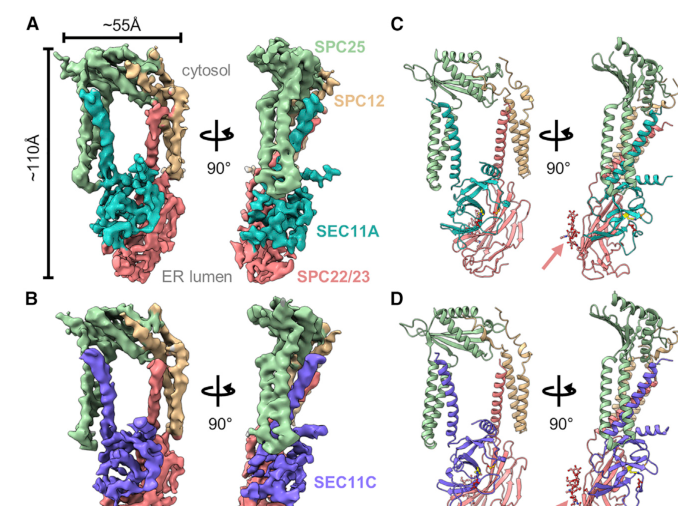

## Question

# Gene Research for Functional Annotation

## ⚠️ CRITICAL: Gene/Protein Identification Context

**BEFORE YOU BEGIN RESEARCH:** You MUST verify you are researching the CORRECT gene/protein. Gene symbols can be ambiguous, especially for less well-characterized genes from non-model organisms.

### Target Gene/Protein Identity (from UniProt):
- **UniProt Accession:** P67812
- **Protein Description:** RecName: Full=Signal peptidase complex catalytic subunit SEC11A; EC=3.4.21.89 {ECO:0000269|PubMed:34388369}; AltName: Full=Endopeptidase SP18; AltName: Full=Microsomal signal peptidase 18 kDa subunit; Short=SPase 18 kDa subunit; AltName: Full=SEC11 homolog A; AltName: Full=SEC11-like protein 1; AltName: Full=SPC18;
- **Gene Information:** Name=SEC11A; Synonyms=SEC11L1, SPC18, SPCS4A;
- **Organism (full):** Homo sapiens (Human).
- **Protein Family:** Belongs to the peptidase S26B family. .
- **Key Domains:** LexA/Signal_pep-like_sf. (IPR036286); Pept_S26A_signal_pept_1_CS. (IPR019758); Pept_S26A_signal_pept_1_Ser-AS. (IPR019756); Peptidase_S24_S26A/B/C. (IPR015927); Peptidase_S26. (IPR019533)

### MANDATORY VERIFICATION STEPS:

1. **Check if the gene symbol "SEC11A" matches the protein description above**
2. **Verify the organism is correct:** Homo sapiens (Human).
3. **Check if protein family/domains align with what you find in literature**
4. **If you find literature for a DIFFERENT gene with the same or similar symbol, STOP**

### If Gene Symbol is Ambiguous or You Cannot Find Relevant Literature:

**DO NOT PROCEED WITH RESEARCH ON A DIFFERENT GENE.** Instead:
- State clearly: "The gene symbol 'SEC11A' is ambiguous or literature is limited for this specific protein"
- Explain what you found (e.g., "Found extensive literature on a different gene with the same symbol in a different organism")
- Describe the protein based ONLY on the UniProt information provided above
- Suggest that the protein function can be inferred from domain/family information

### Research Target:

Please provide a comprehensive research report on the gene **SEC11A** (gene ID: SEC11A, UniProt: P67812) in human.

The research report should be a detailed narrative explaining the function, biological processes, and localization of the gene product. Citations should be given for all claims.

You should prioritize authoritative reviews and primary scientific literature when conducting research. You can supplement
this with annotations you find in gene/protein databases, but these can be outdated or inaccurate.

We are specifically interested in the primary function of the gene - for enzymes, what reaction is catalyzed, and what is the substrate specificity? For transporters, what is the substrate? For structural proteins or adapters, what is the broader structural role? For signaling molecules, what is the role in the pathway.

We are interested in where in or outside the cell the gene product carries out its function.

We are also interested in the signaling or biochemical pathways in which the gene functions. We are less interested in broad pleiotropic effects, except where these elucidate the precise role.

Include evidence where possible. We are interested in both experimental evidence as well as inference from structure, evolution, or bioinformatic analysis. Precise studies should be prioritized over high-throughput, where available.

## Output

Question: You are an expert researcher providing comprehensive, well-cited information.

Provide detailed information focusing on:
1. Key concepts and definitions with current understanding
2. Recent developments and latest research (prioritize 2023-2024 sources)
3. Current applications and real-world implementations
4. Expert opinions and analysis from authoritative sources
5. Relevant statistics and data from recent studies

Format as a comprehensive research report with proper citations. Include URLs and publication dates where available.
Always prioritize recent, authoritative sources and provide specific citations for all major claims.

# Gene Research for Functional Annotation

## ⚠️ CRITICAL: Gene/Protein Identification Context

**BEFORE YOU BEGIN RESEARCH:** You MUST verify you are researching the CORRECT gene/protein. Gene symbols can be ambiguous, especially for less well-characterized genes from non-model organisms.

### Target Gene/Protein Identity (from UniProt):
- **UniProt Accession:** P67812
- **Protein Description:** RecName: Full=Signal peptidase complex catalytic subunit SEC11A; EC=3.4.21.89 {ECO:0000269|PubMed:34388369}; AltName: Full=Endopeptidase SP18; AltName: Full=Microsomal signal peptidase 18 kDa subunit; Short=SPase 18 kDa subunit; AltName: Full=SEC11 homolog A; AltName: Full=SEC11-like protein 1; AltName: Full=SPC18;
- **Gene Information:** Name=SEC11A; Synonyms=SEC11L1, SPC18, SPCS4A;
- **Organism (full):** Homo sapiens (Human).
- **Protein Family:** Belongs to the peptidase S26B family. .
- **Key Domains:** LexA/Signal_pep-like_sf. (IPR036286); Pept_S26A_signal_pept_1_CS. (IPR019758); Pept_S26A_signal_pept_1_Ser-AS. (IPR019756); Peptidase_S24_S26A/B/C. (IPR015927); Peptidase_S26. (IPR019533)

### MANDATORY VERIFICATION STEPS:

1. **Check if the gene symbol "SEC11A" matches the protein description above**
2. **Verify the organism is correct:** Homo sapiens (Human).
3. **Check if protein family/domains align with what you find in literature**
4. **If you find literature for a DIFFERENT gene with the same or similar symbol, STOP**

### If Gene Symbol is Ambiguous or You Cannot Find Relevant Literature:

**DO NOT PROCEED WITH RESEARCH ON A DIFFERENT GENE.** Instead:
- State clearly: "The gene symbol 'SEC11A' is ambiguous or literature is limited for this specific protein"
- Explain what you found (e.g., "Found extensive literature on a different gene with the same symbol in a different organism")
- Describe the protein based ONLY on the UniProt information provided above
- Suggest that the protein function can be inferred from domain/family information

### Research Target:

Please provide a comprehensive research report on the gene **SEC11A** (gene ID: SEC11A, UniProt: P67812) in human.

The research report should be a detailed narrative explaining the function, biological processes, and localization of the gene product. Citations should be given for all claims.

You should prioritize authoritative reviews and primary scientific literature when conducting research. You can supplement
this with annotations you find in gene/protein databases, but these can be outdated or inaccurate.

We are specifically interested in the primary function of the gene - for enzymes, what reaction is catalyzed, and what is the substrate specificity? For transporters, what is the substrate? For structural proteins or adapters, what is the broader structural role? For signaling molecules, what is the role in the pathway.

We are interested in where in or outside the cell the gene product carries out its function.

We are also interested in the signaling or biochemical pathways in which the gene functions. We are less interested in broad pleiotropic effects, except where these elucidate the precise role.

Include evidence where possible. We are interested in both experimental evidence as well as inference from structure, evolution, or bioinformatic analysis. Precise studies should be prioritized over high-throughput, where available.

# Comprehensive Research Report: Human **SEC11A** (SPC18) Functional Annotation (UniProt **P67812**)

## 1) Target verification (identity, organism, family)
The target gene/protein in this report is **human SEC11A** (synonyms: **SEC11L1, SPC18**), corresponding to the proteolytic subunit **SEC11A/SPC18** of the **endoplasmic reticulum (ER) signal peptidase complex (SPC)**, consistent with the UniProt-provided description for accession **P67812**. SEC11A is discussed in the literature as one of two **proteolytic SEC11 paralogs** (SEC11A and SEC11C) that form distinct human SPC paralogs (SPC-A vs SPC-C). (liaci2021structureofthe pages 1-3, liaci2021structureofthe pages 3-4)

## 2) Key concepts and current understanding

### 2.1 Signal peptides and their canonical cleavage rules
Secretory and many membrane proteins enter the ER with **N-terminal signal peptides (SPs)** that are removed by the SPC. Canonical signal peptides have a **tripartite architecture**: an N-region (often positively charged), a hydrophobic **h-region**, and a more polar **c-region** that contains the scissile bond. Cleavage efficiency is strongly influenced by the **-1/-3 rule** (small, non-charged residues at positions -1 and -3 relative to the cleavage site). (liaci2021structureofthe pages 1-3, liaci2021structureofthe pages 3-4, zanotti2023characterisationofthe pages 53-57)

### 2.2 SEC11A as the catalytic component of the eukaryotic SPC
SEC11A is a **membrane-embedded serine protease** subunit of the SPC that performs **signal peptide cleavage** in the ER. Human SPC exists as two functional paralogs with distinct proteolytic subunits: **SPC-A** (containing **SEC11A**) and **SPC-C** (containing **SEC11C**). Both paralogs share the same accessory subunits. (liaci2021structureofthe pages 1-3, liaci2021structureofthe pages 3-4, liaci2021structureofthe pages 7-8)

### 2.3 Complex composition, architecture, and subunit roles
Cryo-EM/structural proteomics work indicates the human SPC is a **heterotetramer** comprising **SPC12 (SPCS1)**, **SPC25 (SPCS2)**, **SPC22/23 (SPCS3)**, and one proteolytic SEC11 paralog (**SEC11A** or **SEC11C**). (liaci2021structureofthe pages 1-3, liaci2021structureofthe pages 3-4)

SEC11A/C and SPC22/23 contribute major luminal structural elements, while the transmembrane (TM) helices of all subunits define a **lipid-filled “TM window”** near the active site. (liaci2021structureofthe pages 10-12, liaci2021structureofthe pages 3-4)

### 2.4 Enzymatic mechanism: catalytic triad and reaction
The SPC active site is described as a **Ser–His–Asp catalytic triad** typical of a serine protease, positioned near the luminal membrane surface to cleave SPs as they emerge into/along the ER membrane interface. (liaci2021structureofthe pages 1-3, liaci2021structureofthe pages 10-12)

### 2.5 Substrate specificity: “measuring” the signal peptide h-region
A central specificity principle emerging from structural and simulation analyses is that the SPC discriminates SPs from TM helices using **membrane shaping**: the TM window locally thins the bilayer. This architecture provides specificity for signal peptides with relatively **short h-regions** (often ~7–15 amino acids) and excludes longer TM helices; experimentally, substrates with h-regions **>18–20 aa** are generally not cleaved by the eukaryotic SPC. (liaci2021structureofthe pages 1-3, liaci2021structureofthe pages 10-12, liaci2021structureofthe pages 7-8)

## 3) Subcellular localization and pathway context
SEC11A functions as part of the SPC at the **endoplasmic reticulum membrane**, where it cleaves N-terminal signal peptides during secretory-pathway biogenesis. (liaci2021structureofthe pages 1-3, chung2024spc2modulatessubstrate pages 1-2)

## 4) Recent developments and latest research (emphasis 2023–2024)

### 4.1 2024: Noncatalytic subunits modulate substrate and cleavage-site selection
A 2024 Journal of Cell Biology study in yeast (highly conserved SPC biology) provides mechanistic insight that **noncatalytic subunits can modulate discrimination between substrates and cleavage site selection**; it highlights stabilization of the catalytic region of Sec11 (human SEC11A/C orthologs) by the luminal domain of the SPCS3 ortholog as part of the catalytic core. While not a human SEC11A-only study, it informs the conserved mechanism by which the SEC11 protease is supported by other SPC subunits. (chung2024spc2modulatessubstrate pages 1-2)

### 4.2 2023: SPC as a membrane-protein quality-control enzyme and noncanonical cleavage
A 2023 characterization of the human SPC proposes that, beyond canonical SP removal, the SPC can act in **quality control for membrane proteins**, including cleavage at **cryptic/noncanonical sites** in misfolded membrane proteins. This work reports an in silico identification of ~**1500 membrane proteins** containing putative cryptic SPC cleavage sites and proposes **SPCS1** as a recruitment factor (exosite-like function) for noncanonical substrates. (zanotti2023characterisationofthe pages 53-57)

### 4.3 Structural visualization (supporting evidence)
Cropped figure regions from the SPC cryo-EM study visually show the overall architecture, proximity of the catalytic triad to the membrane, and the TM window/membrane thinning concept that underpins specificity. (liaci2021structureofthe media 1e096f5b, liaci2021structureofthe media e7dabb13, liaci2021structureofthe media 5164c33e)

## 5) Current applications and real-world implementations

### 5.1 Biomarker applications in oncology (prognostic associations)
SEC11A expression has been evaluated as a **prognostic biomarker** in multiple cancers.

* **Locally advanced gastric cancer (cohort study; qRT-PCR on tumor specimens):** In **n=253** patients, high SEC11A expression (n=127) vs low (n=126) was associated with **worse 5-year overall survival (52.3% vs 75.9%)** and remained an independent predictor in multivariate Cox analysis (**HR 2.010**, 95% CI 1.303–3.100; **p=0.002**). (Suematsu et al., 2022-12-01; https://doi.org/10.21873/anticanres.16097) (suematsu2022clinicalsignificanceof pages 2-4, suematsu2022clinicalsignificanceof pages 4-5)

* **Head and neck squamous cell carcinoma (TCGA analysis):** In TCGA-HNSC, SEC11A was upregulated in tumors (primary **n=518**) vs adjacent normal (**n=44**), and higher SEC11A expression independently predicted poorer outcomes: multivariable **PFS HR 2.075** (95% CI 1.447–2.977; p<0.001) and **DSS HR 2.023** (95% CI 1.284–3.187; p=0.002). SEC11A expression correlated with SEC11A copy number (**r=0.53**, p<0.001), consistent with amplification-associated upregulation. (Hu et al., 2022-06-01; https://doi.org/10.1371/journal.pone.0269166) (hu2022signalpeptidasecomplex pages 1-2, hu2022signalpeptidasecomplex pages 2-4)

These studies are examples of real-world implementation as **molecular stratification markers** (research/retrospective clinical genomics), rather than established clinical diagnostics; they nevertheless provide quantitative effect sizes and suggest SEC11A’s potential utility in risk models. (suematsu2022clinicalsignificanceof pages 2-4, hu2022signalpeptidasecomplex pages 2-4)

### 5.2 Mechanistic translational relevance: secretion and growth-factor signaling
Clinical biomarker literature contextualizes SEC11A/SPC18 as potentially influencing tumor progression via effects on the **secretion of growth factors** and downstream signaling (e.g., EGFR pathway activation). While mechanistic steps are not fully proven in the excerpts here, this hypothesis is explicitly discussed as a plausible mediator linking an ER signal-peptide processing enzyme to cancer phenotypes. (suematsu2022clinicalsignificanceof pages 4-5, hu2022signalpeptidasecomplex pages 9-11)

## 6) Expert opinions and analysis (authoritative interpretation from sources)

### 6.1 Mechanistic consensus from structural work
Structural evidence supports an “enzyme + membrane-shaping” model: the SPC is not only a protease but also an ER membrane machine that creates a locally thinned bilayer to enforce signal-peptide specificity at scale (thousands of substrates). This provides a coherent physical explanation for how the SPC achieves broad specificity for SPs yet avoids cleaving typical transmembrane helices. (liaci2021structureofthe pages 1-3, liaci2021structureofthe pages 10-12)

### 6.2 Emerging view of broader SPC roles
Recent functional work proposes that the SPC participates in **quality control** by cleaving misfolded membrane proteins at cryptic sites and that accessory subunits may contribute exosite-like recruitment functions. This expands SEC11A’s functional context beyond the classical textbook role of “signal peptide removal,” while remaining consistent with a protease whose active site is positioned to access luminal-proximal segments near the membrane. (zanotti2023characterisationofthe pages 53-57)

## 7) Relevant statistics and data highlights

| Topic | Key finding (with numbers) | Evidence source (first author year) | DOI/URL | Publication date |
|---|---|---|---|---|
| Functional role in SPC | SEC11A/SPC18 is a catalytic subunit of the human ER-resident signal peptidase complex (SPC) that removes N-terminal signal peptides from secretory pre-proteins; the human SPC is estimated to process ~3,000 human signal peptides (liaci2021structureofthe pages 1-3, liaci2021structureofthe pages 10-12) | Liaci 2021 | https://doi.org/10.2139/ssrn.3778304 | 2021-01 |
| Complex composition / paralogs | Human SPC exists as 2 heterotetrameric paralogs: SPC-A contains SEC11A and SPC-C contains SEC11C; both also contain SPC12/SPCS1, SPC25/SPCS2, and SPC22/23/SPCS3; reconstituted complex is ~84 kDa (liaci2021structureofthe pages 1-3, liaci2021structureofthe pages 3-4, liaci2021structureofthe pages 7-8) | Liaci 2021 | https://doi.org/10.2139/ssrn.3778304 | 2021-01 |
| Catalytic mechanism / triad | SEC11A/C functions as a serine protease with a catalytic Ser-His-Asp triad; the active site lies adjacent to the ER membrane and is stabilized by SPC22/23/SPCS3; the SPC is resistant to standard serine protease inhibitors (liaci2021structureofthe pages 1-3, liaci2021structureofthe pages 10-12, chung2024spc2modulatessubstrate pages 1-2) | Liaci 2021; Chung 2024 | https://doi.org/10.2139/ssrn.3778304 ; https://doi.org/10.1083/jcb.202211035 | 2021-01; 2024-11 |
| Signal peptide determinants / substrate specificity | SPC recognizes canonical signal peptides with a tripartite n/h/c architecture; h-regions are typically 7–15 aa, c-regions 3–7 aa, and efficient cleavage follows the -1/-3 rule requiring small, non-charged residues; eukaryotic SPC generally does not cleave substrates with h-regions >18–20 aa (liaci2021structureofthe pages 1-3, liaci2021structureofthe pages 3-4, liaci2021structureofthe pages 7-8, chung2024spc2modulatessubstrate pages 1-2) | Liaci 2021; Chung 2024 | https://doi.org/10.2139/ssrn.3778304 ; https://doi.org/10.1083/jcb.202211035 | 2021-01; 2024-11 |
| Membrane thinning / TM window / lipid dependence | All SPC subunits form a ~15 Å transmembrane window that locally thins the bilayer from ~4 nm to ~2.3–2.6 nm, helping discriminate short signal-peptide h-regions from longer TM helices; phosphatidylcholine enrichment in the window and relipidation can restore activity in detergent systems (liaci2021structureofthe pages 10-12, liaci2021structureofthe media 1e096f5b) | Liaci 2021 | https://doi.org/10.2139/ssrn.3778304 | 2021-01 |
| Quality control / noncanonical cleavage | Beyond canonical signal peptide removal, 2023 work characterized the human SPC as a quality-control enzyme for membrane proteins; ~1,500 membrane proteins were predicted to contain putative cryptic SPC cleavage sites, and SPCS1 was proposed to recruit noncanonical substrates; SEC11A knockdown did not abolish cleavage of at least one noncanonical substrate (Cx32), consistent with compensation by SEC11C (zanotti2023characterisationofthe pages 53-57) | Zanotti 2023 | https://doi.org/10.11588/heidok.00033417 | 2023-01 |
| Clinical association: gastric cancer | In locally advanced gastric cancer, SEC11A mRNA was measured in n=253 patients (high n=127, low n=126). High expression associated with worse 5-year overall survival: 52.3% vs 75.9% (p<0.005). Multivariable HR for death: 2.010 (95% CI 1.303–3.100; p=0.002). Associations also seen with serosal invasion (p=0.002), lymph-node metastasis (p=0.002), venous invasion (p=0.019), and stage (p=0.015) (suematsu2022clinicalsignificanceof pages 2-4, suematsu2022clinicalsignificanceof pages 1-2, suematsu2022clinicalsignificanceof pages 4-5) | Suematsu 2022 | https://doi.org/10.21873/anticanres.16097 | 2022-12 |
| Clinical association: HNSC (TCGA) | In TCGA HNSC, SEC11A was upregulated in primary tumors (n=518) vs adjacent normals (n=44). High-expression group had more PFS events 117/259 (22.6%) vs 80/259 (15.4%), p=0.001, and more DSS events 80/246 (16.3%) vs 50/246 (10.2%), p=0.003. Continuous-expression multivariable HRs: PFS 2.075 (95% CI 1.447–2.977; p<0.001) and DSS 2.023 (95% CI 1.284–3.187; p=0.002). Expression correlated with copy number, r=0.53 (p<0.001) (hu2022signalpeptidasecomplex pages 1-2, hu2022signalpeptidasecomplex pages 6-9, hu2022signalpeptidasecomplex pages 2-4) | Hu 2022 | https://doi.org/10.1371/journal.pone.0269166 | 2022-06 |

*Table: This table condenses the main mechanistic, structural, and clinical findings for human SEC11A/SPC18. It is useful as a quick reference linking SEC11A’s role in the signal peptidase complex to recent functional studies and quantitative cancer associations.*

Key quantitative points include (i) SPC substrate-set scale (~**3,000 human SPs**) (liaci2021structureofthe pages 10-12), (ii) membrane thinning from ~**4 nm** to ~**2.3–2.6 nm** in the TM window region (as described in associated figure context) (liaci2021structureofthe media 1e096f5b), and (iii) cancer prognosis effect sizes (gastric cancer multivariable **HR ~2.0**; TCGA-HNSC multivariable **HR ~2.0**, and copy-number correlation **r=0.53**). (suematsu2022clinicalsignificanceof pages 2-4, hu2022signalpeptidasecomplex pages 2-4)

## 8) Limitations of the current evidence base (for SEC11A specifically)
* The most detailed mechanistic/structural evidence in this corpus focuses on the **SPC as a complex**, with SEC11A interpreted as the proteolytic subunit in one paralog; residue-level discussion is largely for SEC11 paralogs collectively (SEC11A/C). (liaci2021structureofthe pages 1-3, liaci2021structureofthe pages 10-12)
* The most directly SEC11A-specific and quantitative clinical analyses retrieved here are from **2022** rather than 2023–2024, although they remain recent and provide effect sizes not typically available in narrative reviews. (suematsu2022clinicalsignificanceof pages 2-4, hu2022signalpeptidasecomplex pages 2-4)

## References (URLs and publication dates)
* Liaci AM et al. *Structure of the Human Signal Peptidase Complex Reveals the Determinants for Signal Peptide Cleavage.* 2021-01. https://doi.org/10.2139/ssrn.3778304 (liaci2021structureofthe pages 1-3, liaci2021structureofthe pages 10-12)
* Zanotti A. *Characterisation of the human signal peptidase complex as a quality control enzyme for membrane proteins.* 2023-01. https://doi.org/10.11588/heidok.00033417 (zanotti2023characterisationofthe pages 53-57)
* Chung Y et al. *Spc2 modulates substrate- and cleavage site-selection in the yeast signal peptidase complex.* *J Cell Biol.* 2024-11. https://doi.org/10.1083/jcb.202211035 (chung2024spc2modulatessubstrate pages 1-2)
* Suematsu H et al. *Clinical Significance of SEC11A Expression in Patients With Locally Advanced Gastric Cancer.* *Anticancer Research.* 2022-12. https://doi.org/10.21873/anticanres.16097 (suematsu2022clinicalsignificanceof pages 2-4)
* Hu C et al. *Signal peptidase complex catalytic subunit SEC11A upregulation is a biomarker of poor prognosis in patients with head and neck squamous cell carcinoma.* *PLoS ONE.* 2022-06. https://doi.org/10.1371/journal.pone.0269166 (hu2022signalpeptidasecomplex pages 2-4)

References

1. (liaci2021structureofthe pages 1-3): A. Manuel Liaci, Barbara Steigenberger, Sem Tamara, Paulo Cesar Telles de Souza, Mariska Gröllers-Mulderij, Patrick Ogrissek, Siewert Jan Marrink, Richard Scheltema, and Friedrich Förster. Structure of the human signal peptidase complex reveals the determinants for signal peptide cleavage. Jan 2021. URL: https://doi.org/10.2139/ssrn.3778304, doi:10.2139/ssrn.3778304. This article has 148 citations.

2. (liaci2021structureofthe pages 3-4): A. Manuel Liaci, Barbara Steigenberger, Sem Tamara, Paulo Cesar Telles de Souza, Mariska Gröllers-Mulderij, Patrick Ogrissek, Siewert Jan Marrink, Richard Scheltema, and Friedrich Förster. Structure of the human signal peptidase complex reveals the determinants for signal peptide cleavage. Jan 2021. URL: https://doi.org/10.2139/ssrn.3778304, doi:10.2139/ssrn.3778304. This article has 148 citations.

3. (zanotti2023characterisationofthe pages 53-57): Andrea Zanotti. Characterisation of the human signal peptidase complex as a quality control enzyme for membrane proteins. Text, Jan 2023. URL: https://doi.org/10.11588/heidok.00033417, doi:10.11588/heidok.00033417. This article has 0 citations and is from a peer-reviewed journal.

4. (liaci2021structureofthe pages 7-8): A. Manuel Liaci, Barbara Steigenberger, Sem Tamara, Paulo Cesar Telles de Souza, Mariska Gröllers-Mulderij, Patrick Ogrissek, Siewert Jan Marrink, Richard Scheltema, and Friedrich Förster. Structure of the human signal peptidase complex reveals the determinants for signal peptide cleavage. Jan 2021. URL: https://doi.org/10.2139/ssrn.3778304, doi:10.2139/ssrn.3778304. This article has 148 citations.

5. (liaci2021structureofthe pages 10-12): A. Manuel Liaci, Barbara Steigenberger, Sem Tamara, Paulo Cesar Telles de Souza, Mariska Gröllers-Mulderij, Patrick Ogrissek, Siewert Jan Marrink, Richard Scheltema, and Friedrich Förster. Structure of the human signal peptidase complex reveals the determinants for signal peptide cleavage. Jan 2021. URL: https://doi.org/10.2139/ssrn.3778304, doi:10.2139/ssrn.3778304. This article has 148 citations.

6. (chung2024spc2modulatessubstrate pages 1-2): Yeonji Chung, Chewon Yim, Gilberto P. Pereira, Sungjoon Son, Lisbeth R. Kjølbye, Lauren E. Mazurkiewicz, Amy M. Weeks, Friedrich Förster, Gunnar von Heijne, Paulo C.T. Souza, and Hyun Kim. Spc2 modulates substrate- and cleavage site-selection in the yeast signal peptidase complex. Journal of Cell Biology, Nov 2024. URL: https://doi.org/10.1083/jcb.202211035, doi:10.1083/jcb.202211035. This article has 4 citations and is from a highest quality peer-reviewed journal.

7. (liaci2021structureofthe media 1e096f5b): A. Manuel Liaci, Barbara Steigenberger, Sem Tamara, Paulo Cesar Telles de Souza, Mariska Gröllers-Mulderij, Patrick Ogrissek, Siewert Jan Marrink, Richard Scheltema, and Friedrich Förster. Structure of the human signal peptidase complex reveals the determinants for signal peptide cleavage. Jan 2021. URL: https://doi.org/10.2139/ssrn.3778304, doi:10.2139/ssrn.3778304. This article has 148 citations.

8. (liaci2021structureofthe media e7dabb13): A. Manuel Liaci, Barbara Steigenberger, Sem Tamara, Paulo Cesar Telles de Souza, Mariska Gröllers-Mulderij, Patrick Ogrissek, Siewert Jan Marrink, Richard Scheltema, and Friedrich Förster. Structure of the human signal peptidase complex reveals the determinants for signal peptide cleavage. Jan 2021. URL: https://doi.org/10.2139/ssrn.3778304, doi:10.2139/ssrn.3778304. This article has 148 citations.

9. (liaci2021structureofthe media 5164c33e): A. Manuel Liaci, Barbara Steigenberger, Sem Tamara, Paulo Cesar Telles de Souza, Mariska Gröllers-Mulderij, Patrick Ogrissek, Siewert Jan Marrink, Richard Scheltema, and Friedrich Förster. Structure of the human signal peptidase complex reveals the determinants for signal peptide cleavage. Jan 2021. URL: https://doi.org/10.2139/ssrn.3778304, doi:10.2139/ssrn.3778304. This article has 148 citations.

10. (suematsu2022clinicalsignificanceof pages 2-4): HIDEAKI SUEMATSU, KENTARO SAKAMAKI, NAOHIDE OUE, YUKIHIKO HIROSHIMA, YAYOI KIMURA, SHIZUNE ONUMA, ITARU HASHIMOTO, SHINSUKE NAGASAWA, TORU AOYAMA, TAKANOBU YAMADA, HIROSHI TAMAGAWA, TAKASHI OGATA, YASUSHI RINO, MUNETAKA MASUDA, WATARU YASUI, YOHEI MIYAGI, and TAKASHI OSHIMA. Clinical significance of sec11a expression in patients with locally advanced gastric cancer. AntiCancer Research, 42:5885-5890, Dec 2022. URL: https://doi.org/10.21873/anticanres.16097, doi:10.21873/anticanres.16097. This article has 10 citations and is from a peer-reviewed journal.

11. (suematsu2022clinicalsignificanceof pages 4-5): HIDEAKI SUEMATSU, KENTARO SAKAMAKI, NAOHIDE OUE, YUKIHIKO HIROSHIMA, YAYOI KIMURA, SHIZUNE ONUMA, ITARU HASHIMOTO, SHINSUKE NAGASAWA, TORU AOYAMA, TAKANOBU YAMADA, HIROSHI TAMAGAWA, TAKASHI OGATA, YASUSHI RINO, MUNETAKA MASUDA, WATARU YASUI, YOHEI MIYAGI, and TAKASHI OSHIMA. Clinical significance of sec11a expression in patients with locally advanced gastric cancer. AntiCancer Research, 42:5885-5890, Dec 2022. URL: https://doi.org/10.21873/anticanres.16097, doi:10.21873/anticanres.16097. This article has 10 citations and is from a peer-reviewed journal.

12. (hu2022signalpeptidasecomplex pages 1-2): Chunmei Hu, Jiangang Fan, Gang He, Chuan Dong, Shijie Zhou, and Yun Zheng. Signal peptidase complex catalytic subunit sec11a upregulation is a biomarker of poor prognosis in patients with head and neck squamous cell carcinoma. PLoS ONE, 17:e0269166, Jun 2022. URL: https://doi.org/10.1371/journal.pone.0269166, doi:10.1371/journal.pone.0269166. This article has 5 citations and is from a peer-reviewed journal.

13. (hu2022signalpeptidasecomplex pages 2-4): Chunmei Hu, Jiangang Fan, Gang He, Chuan Dong, Shijie Zhou, and Yun Zheng. Signal peptidase complex catalytic subunit sec11a upregulation is a biomarker of poor prognosis in patients with head and neck squamous cell carcinoma. PLoS ONE, 17:e0269166, Jun 2022. URL: https://doi.org/10.1371/journal.pone.0269166, doi:10.1371/journal.pone.0269166. This article has 5 citations and is from a peer-reviewed journal.

14. (hu2022signalpeptidasecomplex pages 9-11): Chunmei Hu, Jiangang Fan, Gang He, Chuan Dong, Shijie Zhou, and Yun Zheng. Signal peptidase complex catalytic subunit sec11a upregulation is a biomarker of poor prognosis in patients with head and neck squamous cell carcinoma. PLoS ONE, 17:e0269166, Jun 2022. URL: https://doi.org/10.1371/journal.pone.0269166, doi:10.1371/journal.pone.0269166. This article has 5 citations and is from a peer-reviewed journal.

15. (suematsu2022clinicalsignificanceof pages 1-2): HIDEAKI SUEMATSU, KENTARO SAKAMAKI, NAOHIDE OUE, YUKIHIKO HIROSHIMA, YAYOI KIMURA, SHIZUNE ONUMA, ITARU HASHIMOTO, SHINSUKE NAGASAWA, TORU AOYAMA, TAKANOBU YAMADA, HIROSHI TAMAGAWA, TAKASHI OGATA, YASUSHI RINO, MUNETAKA MASUDA, WATARU YASUI, YOHEI MIYAGI, and TAKASHI OSHIMA. Clinical significance of sec11a expression in patients with locally advanced gastric cancer. AntiCancer Research, 42:5885-5890, Dec 2022. URL: https://doi.org/10.21873/anticanres.16097, doi:10.21873/anticanres.16097. This article has 10 citations and is from a peer-reviewed journal.

16. (hu2022signalpeptidasecomplex pages 6-9): Chunmei Hu, Jiangang Fan, Gang He, Chuan Dong, Shijie Zhou, and Yun Zheng. Signal peptidase complex catalytic subunit sec11a upregulation is a biomarker of poor prognosis in patients with head and neck squamous cell carcinoma. PLoS ONE, 17:e0269166, Jun 2022. URL: https://doi.org/10.1371/journal.pone.0269166, doi:10.1371/journal.pone.0269166. This article has 5 citations and is from a peer-reviewed journal.

## Artifacts

- [Edison artifact artifact-00](SEC11A-deep-research-falcon_artifacts/artifact-00.md)

## Citations

1. zanotti2023characterisationofthe pages 53-57
2. liaci2021structureofthe pages 10-12
3. suematsu2022clinicalsignificanceof pages 2-4
4. hu2022signalpeptidasecomplex pages 2-4
5. liaci2021structureofthe pages 1-3
6. liaci2021structureofthe pages 3-4
7. liaci2021structureofthe pages 7-8
8. suematsu2022clinicalsignificanceof pages 4-5
9. hu2022signalpeptidasecomplex pages 1-2
10. hu2022signalpeptidasecomplex pages 9-11
11. suematsu2022clinicalsignificanceof pages 1-2
12. hu2022signalpeptidasecomplex pages 6-9
13. https://doi.org/10.21873/anticanres.16097
14. https://doi.org/10.1371/journal.pone.0269166
15. https://doi.org/10.2139/ssrn.3778304
16. https://doi.org/10.1083/jcb.202211035
17. https://doi.org/10.11588/heidok.00033417
18. https://doi.org/10.2139/ssrn.3778304,
19. https://doi.org/10.11588/heidok.00033417,
20. https://doi.org/10.1083/jcb.202211035,
21. https://doi.org/10.21873/anticanres.16097,
22. https://doi.org/10.1371/journal.pone.0269166,