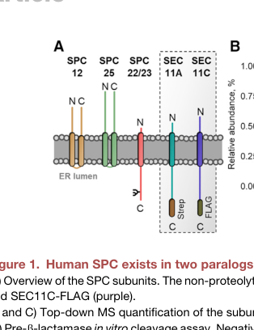

## Question

# Gene Research for Functional Annotation

## ⚠️ CRITICAL: Gene/Protein Identification Context

**BEFORE YOU BEGIN RESEARCH:** You MUST verify you are researching the CORRECT gene/protein. Gene symbols can be ambiguous, especially for less well-characterized genes from non-model organisms.

### Target Gene/Protein Identity (from UniProt):
- **UniProt Accession:** Q9BY50
- **Protein Description:** RecName: Full=Signal peptidase complex catalytic subunit SEC11C; EC=3.4.21.89 {ECO:0000269|PubMed:34388369}; AltName: Full=Microsomal signal peptidase 21 kDa subunit; Short=SPase 21 kDa subunit; AltName: Full=SEC11 homolog C; AltName: Full=SEC11-like protein 3; AltName: Full=SPC21;
- **Gene Information:** Name=SEC11C; Synonyms=SEC11L3, SPC21, SPCS4C;
- **Organism (full):** Homo sapiens (Human).
- **Protein Family:** Belongs to the peptidase S26B family. .
- **Key Domains:** LexA/Signal_pep-like_sf. (IPR036286); Pept_S26A_signal_pept_1_CS. (IPR019758); Pept_S26A_signal_pept_1_Ser-AS. (IPR019756); Peptidase_S24_S26A/B/C. (IPR015927); Peptidase_S26. (IPR019533)

### MANDATORY VERIFICATION STEPS:

1. **Check if the gene symbol "SEC11C" matches the protein description above**
2. **Verify the organism is correct:** Homo sapiens (Human).
3. **Check if protein family/domains align with what you find in literature**
4. **If you find literature for a DIFFERENT gene with the same or similar symbol, STOP**

### If Gene Symbol is Ambiguous or You Cannot Find Relevant Literature:

**DO NOT PROCEED WITH RESEARCH ON A DIFFERENT GENE.** Instead:
- State clearly: "The gene symbol 'SEC11C' is ambiguous or literature is limited for this specific protein"
- Explain what you found (e.g., "Found extensive literature on a different gene with the same symbol in a different organism")
- Describe the protein based ONLY on the UniProt information provided above
- Suggest that the protein function can be inferred from domain/family information

### Research Target:

Please provide a comprehensive research report on the gene **SEC11C** (gene ID: SEC11C, UniProt: Q9BY50) in human.

The research report should be a detailed narrative explaining the function, biological processes, and localization of the gene product. Citations should be given for all claims.

You should prioritize authoritative reviews and primary scientific literature when conducting research. You can supplement
this with annotations you find in gene/protein databases, but these can be outdated or inaccurate.

We are specifically interested in the primary function of the gene - for enzymes, what reaction is catalyzed, and what is the substrate specificity? For transporters, what is the substrate? For structural proteins or adapters, what is the broader structural role? For signaling molecules, what is the role in the pathway.

We are interested in where in or outside the cell the gene product carries out its function.

We are also interested in the signaling or biochemical pathways in which the gene functions. We are less interested in broad pleiotropic effects, except where these elucidate the precise role.

Include evidence where possible. We are interested in both experimental evidence as well as inference from structure, evolution, or bioinformatic analysis. Precise studies should be prioritized over high-throughput, where available.

## Output

Question: You are an expert researcher providing comprehensive, well-cited information.

Provide detailed information focusing on:
1. Key concepts and definitions with current understanding
2. Recent developments and latest research (prioritize 2023-2024 sources)
3. Current applications and real-world implementations
4. Expert opinions and analysis from authoritative sources
5. Relevant statistics and data from recent studies

Format as a comprehensive research report with proper citations. Include URLs and publication dates where available.
Always prioritize recent, authoritative sources and provide specific citations for all major claims.

# Gene Research for Functional Annotation

## ⚠️ CRITICAL: Gene/Protein Identification Context

**BEFORE YOU BEGIN RESEARCH:** You MUST verify you are researching the CORRECT gene/protein. Gene symbols can be ambiguous, especially for less well-characterized genes from non-model organisms.

### Target Gene/Protein Identity (from UniProt):
- **UniProt Accession:** Q9BY50
- **Protein Description:** RecName: Full=Signal peptidase complex catalytic subunit SEC11C; EC=3.4.21.89 {ECO:0000269|PubMed:34388369}; AltName: Full=Microsomal signal peptidase 21 kDa subunit; Short=SPase 21 kDa subunit; AltName: Full=SEC11 homolog C; AltName: Full=SEC11-like protein 3; AltName: Full=SPC21;
- **Gene Information:** Name=SEC11C; Synonyms=SEC11L3, SPC21, SPCS4C;
- **Organism (full):** Homo sapiens (Human).
- **Protein Family:** Belongs to the peptidase S26B family. .
- **Key Domains:** LexA/Signal_pep-like_sf. (IPR036286); Pept_S26A_signal_pept_1_CS. (IPR019758); Pept_S26A_signal_pept_1_Ser-AS. (IPR019756); Peptidase_S24_S26A/B/C. (IPR015927); Peptidase_S26. (IPR019533)

### MANDATORY VERIFICATION STEPS:

1. **Check if the gene symbol "SEC11C" matches the protein description above**
2. **Verify the organism is correct:** Homo sapiens (Human).
3. **Check if protein family/domains align with what you find in literature**
4. **If you find literature for a DIFFERENT gene with the same or similar symbol, STOP**

### If Gene Symbol is Ambiguous or You Cannot Find Relevant Literature:

**DO NOT PROCEED WITH RESEARCH ON A DIFFERENT GENE.** Instead:
- State clearly: "The gene symbol 'SEC11C' is ambiguous or literature is limited for this specific protein"
- Explain what you found (e.g., "Found extensive literature on a different gene with the same symbol in a different organism")
- Describe the protein based ONLY on the UniProt information provided above
- Suggest that the protein function can be inferred from domain/family information

### Research Target:

Please provide a comprehensive research report on the gene **SEC11C** (gene ID: SEC11C, UniProt: Q9BY50) in human.

The research report should be a detailed narrative explaining the function, biological processes, and localization of the gene product. Citations should be given for all claims.

You should prioritize authoritative reviews and primary scientific literature when conducting research. You can supplement
this with annotations you find in gene/protein databases, but these can be outdated or inaccurate.

We are specifically interested in the primary function of the gene - for enzymes, what reaction is catalyzed, and what is the substrate specificity? For transporters, what is the substrate? For structural proteins or adapters, what is the broader structural role? For signaling molecules, what is the role in the pathway.

We are interested in where in or outside the cell the gene product carries out its function.

We are also interested in the signaling or biochemical pathways in which the gene functions. We are less interested in broad pleiotropic effects, except where these elucidate the precise role.

Include evidence where possible. We are interested in both experimental evidence as well as inference from structure, evolution, or bioinformatic analysis. Precise studies should be prioritized over high-throughput, where available.

## Research Report: Human **SEC11C** (UniProt: **Q9BY50**) — Functional Annotation and Current Understanding

### 1) Gene/protein identity verification (critical)
SEC11C (UniProt Q9BY50; also referred to as **SPC21/SEC11 homolog C**) is a **catalytic subunit of the endoplasmic-reticulum (ER) signal peptidase complex (SPC)** in *Homo sapiens*. Multiple primary sources describing the human SPC explicitly place **SEC11C** as one of the **two alternative proteolytic (catalytic) subunits** (the other being **SEC11A**) that define two functional SPC paralogs (SPC-C vs SPC-A). (liaci2021structureofthe pages 3-4, liaci2021structureofthe pages 1-3)

### 2) Key concepts and definitions (current understanding)
#### 2.1 Signal peptidase complex (SPC)
The **SPC** is an **essential ER membrane protease** responsible for removing **signal peptides** from secretory-pathway preproteins. In humans, structural and biochemical work supports that the SPC exists as **two paralogous heterotetramers** that differ in the catalytic SEC11 subunit. (liaci2021structureofthe pages 3-4, liaci2021structureofthe pages 1-3)

#### 2.2 Catalytic activity (EC 3.4.21.89) and reaction
The SPC is a **serine protease** that hydrolyzes the peptide bond at the signal peptide cleavage site of secretory preproteins after they enter the ER lumen, i.e., **signal peptide removal** (EC **3.4.21.89**). Structural modeling and functional assays support that SEC11C-containing SPC is catalytically active and carries the protease active site. (liaci2021structureofthe pages 1-3, liaci2021structureofthe pages 3-4)

#### 2.3 Canonical vs noncanonical (quality-control) cleavage
Beyond canonical signal peptide cleavage, recent work shows a **post-translocational “quality-control” (QC) function** in which SPC can cleave **cryptic/noncanonical sites** in membrane proteins—particularly when proteins fail to fold/assemble properly—thereby facilitating ER-associated degradation (ERAD). (zanotti2022thehumansignal pages 1-8, zanotti2022thehumansignal pages 53-57)

### 3) Molecular function of SEC11C within SPC
#### 3.1 Complex composition and paralogs
High-confidence structural proteomics indicates that the human SPC exists as **two functional paralogs**:
- **SPC-A**: SPC12 + SPC22/23 + SPC25 + **SEC11A**
- **SPC-C**: SPC12 + SPC22/23 + SPC25 + **SEC11C**

Both paralogs can be purified as near-stoichiometric complexes from HEK293 cells and both are enzymatically active in vitro, demonstrating that **SEC11C supports an active SPC protease complex**. (liaci2021structureofthe pages 3-4, liaci2021structureofthe pages 1-3)

#### 3.2 Catalytic mechanism: serine protease triad and active-site architecture
Cryo-EM and modeling support that the SPC catalytic center (including in SEC11C) uses a **Ser–His–Asp catalytic triad** positioned in a **c-region binding pocket** that accommodates the signal peptide cleavage region and places the scissile bond near catalytic residues. (liaci2021structureofthe pages 1-3, liaci2021structureofthe pages 7-8)

Figure evidence (cropped panels) from the structural study depicts (i) SPC-A vs SPC-C paralogs and (ii) the active-site architecture and membrane-thinning context. (liaci2021structureofthe media edf6a0de, liaci2021structureofthe media e833f187, liaci2021structureofthe media 63103722, liaci2021structureofthe media d6c9aae3)

#### 3.3 Substrate recognition and specificity (current mechanistic model)
A central mechanistic insight is that the SPC forms a **transmembrane “window”** that locally **thins the ER bilayer** near the active site. This architecture acts as a **“molecular ruler”** that favors the **shorter hydrophobic h-regions** typical of signal peptides over longer transmembrane helices, supporting specificity across many substrates. (liaci2021structureofthe pages 1-3, liaci2021structureofthe media edf6a0de)

Consistent with this model, both SEC11A- and SEC11C-containing paralogs process a model preprotein substrate (pre-β-lactamase) in vitro with similar efficiency, indicating that SEC11C supports canonical signal peptide cleavage. (liaci2021structureofthe pages 3-4)

### 4) Subcellular localization and topology
SEC11C functions in the **ER membrane**. Structural/topology inferences from digitonin-solubilized particles place the **catalytic domain on the luminal side**, positioned close to the membrane surface, with the **C-terminus on the cytosolic side**. SPCS3’s luminal domain helps stabilize and position the catalytic region of SEC11A/C near the luminal membrane interface. (liaci2021structureofthe pages 7-8, chung2024spc2modulatessubstrate pages 1-2)

### 5) Recent developments and latest research (emphasis 2023–2024)
#### 5.1 2022–2023: SPC as a membrane-protein quality-control protease (human)
A major conceptual advance is that the human SPC is not only a signal-peptide-removing enzyme but also a **quality-control protease for membrane proteins**, cleaving cryptic sites in misfolded/unassembled membrane proteins and synergizing with ERAD to maintain membrane proteostasis. (zanotti2022thehumansignal pages 1-8, zanotti2022thehumansignal pages 53-57)

SEC11C is implicated as part of the catalytic core in this QC activity because the catalytic core is described as **SEC11A/C with SPCS3**, and pharmacologic inhibition of SEC11 activity blocks noncanonical cleavage. (zanotti2022thehumansignal pages 53-57, zanotti2022thehumansignal pages 26-30)

#### 5.2 SEC11A–SEC11C redundancy and conditional abundance
Human SEC11A knockdown did not abolish cleavage of a noncanonical substrate (Cx32), and the authors propose **compensation by SEC11C upregulation**. However, SEC11C was reported as often **difficult to detect in several cell lines** when SEC11A levels are normal, suggesting SEC11C may act as a **backup/conditionally expressed** catalytic subunit depending on context. (zanotti2022thehumansignal pages 57-60, zanotti2023characterisationofthe pages 57-60)

#### 5.3 2024: accessory subunit control of cleavage-site selection (mechanistic context)
A 2024 mechanistic study in yeast shows accessory subunits can modulate substrate and cleavage-site selection, and explicitly situates this in the context that higher eukaryotes have **two SEC11 paralogs (SEC11A, SEC11C)** within a four-subunit eukaryotic SPC. Quantitatively, the paper reports Sec11 abundance is reduced by **~10%** in spc2Δ yeast, illustrating how non-catalytic subunits can affect catalytic subunit stability/assembly. (chung2024spc2modulatessubstrate pages 1-2)

### 6) Pathways and biological processes linked to SEC11C/SPC
#### 6.1 Secretory-pathway protein biogenesis
SEC11C-containing SPC participates in **co-/post-translational processing** of proteins entering the secretory pathway by cleaving signal peptides after ER targeting/translocation. (liaci2021structureofthe pages 1-3)

#### 6.2 ER protein quality control and ERAD coupling
The QC role links SPC cleavage to ERAD: SPC can cleave membrane proteins that fail to fold/assemble, and SPC is reported to interact functionally with the ERAD E3 ligase **Hrd1**, facilitating degradation of problematic membrane proteins. (zanotti2022thehumansignal pages 57-60)

### 7) Current applications and real-world implementations
#### 7.1 Chemical biology and host-targeted antiviral strategies: cavinafungin
The natural product **cavinafungin** inhibits the host signal peptidase and selectively interferes with **Zika and dengue virus replication** by targeting SEC11-containing SPC activity.

Key quantitative/implementation-relevant results include:
- Dose-response metrics in HCT116 cells: **IC10 = 450 nM**, **IC30 = 600 nM**, **IC50 = 710 nM** (cell viability assay used for chemogenomic profiling). (estoppey2017thenaturalproduct pages 4-5)
- Genome-wide CRISPR/Cas9 chemogenomic profiling identifies signal peptidase components among top hits, including **SEC11A and SEC11C** and accessory subunits (e.g., SPCS3), linking drug sensitivity to the catalytic core and complex integrity. (estoppey2017thenaturalproduct pages 4-5)

In the SPC-QC context, cavinafungin (reported at **1 µM** in HEK293T experiments) produces **complete loss** of a noncanonical SPC cleavage fragment (Cx32 C201R), establishing practical use of SPC inhibition to interrogate membrane-protein QC cleavage. (zanotti2022thehumansignal pages 26-30)

#### 7.2 Broad translational rationale: SPC as a drug target node
Earlier biochemical work supports that inhibiting ER signal peptidase impairs maturation of secretory and viral proteins, motivating a host-targeted antiviral concept for SEC11-family catalytic subunits. (cui2015competitiveinhibitionof pages 1-2)

### 8) Relevant statistics and quantitative data (from recent/primary studies)
- **~1,500** membrane proteins were identified with *putative* cryptic SPC cleavage sites in proteome-wide analyses (human SPC QC framework). (zanotti2022thehumansignal pages 1-8, zanotti2022thehumansignal pages 53-57)
- A stricter filtered subset identified **262 proteins** containing a cryptic cleavage site after additional filtering steps in the same study’s pipeline. (zanotti2022thehumansignal pages 26-30)
- Cavinafungin blocks a noncanonical SPC cleavage fragment at **1 µM** in a human-cell assay (Cx32 mutant). (zanotti2022thehumansignal pages 26-30)
- Cavinafungin chemogenomic profiling in human cells used potency benchmarks of **IC10 450 nM**, **IC30 600 nM**, and **IC50 710 nM**. (estoppey2017thenaturalproduct pages 4-5)
- In yeast, deletion of Spc2 reduced Sec11 abundance by **~10%**, consistent with accessory-subunit effects on SPC assembly/stability. (chung2024spc2modulatessubstrate pages 1-2)
- SPC membrane thinning near the active site was reported to reduce the bilayer thickness from ~**4 nm** to ~**2.3 nm** in structural/MD analyses. (liaci2021structureofthe media edf6a0de)

### 9) Expert interpretation and analysis (synthesis from authoritative sources)
#### 9.1 SEC11C is best understood as a catalytic paralog whose specific biology may be context-dependent
The strongest direct mechanistic evidence for SEC11C comes from structural and biochemical demonstration that SEC11C defines a functional paralog (**SPC-C**) with an intact catalytic machinery and the same overall architecture and activity class as SEC11A-containing SPC. (liaci2021structureofthe pages 3-4, liaci2021structureofthe pages 1-3)

However, functional studies expanding SPC’s biology into membrane-protein QC emphasize potential **paralog redundancy** and report **difficulty detecting SEC11C** in some cell lines under baseline conditions—suggesting SEC11C’s contribution could vary with tissue/cell state, stress, or SEC11A availability. (zanotti2022thehumansignal pages 57-60, zanotti2023characterisationofthe pages 57-60)

#### 9.2 Substrate scope is broader than classical signal peptides
Human SPC biology now includes both canonical signal peptides and a substantial predicted landscape of **cryptic cleavage sites** in membrane proteins, with validated substrates including connexins and other membrane proteins (e.g., PMP22, iRhom2, Hrd1). This reframes SEC11C-containing SPC not only as a housekeeping signal-peptide peptidase but also as a potential node in membrane-protein homeostasis. (zanotti2022thehumansignal pages 1-8, zanotti2022thehumansignal pages 53-57)

### 10) Limitations and evidence gaps specific to SEC11C
- **SEC11C-specific** phenotypes, disease associations, and substrate preferences distinct from SEC11A were not directly quantified in the retrieved 2022–2024 human literature excerpts; instead, many findings apply to the SPC catalytic core (SEC11A/C) or to accessory subunits (notably SPCS1). (zanotti2022thehumansignal pages 57-60, zanotti2022thehumansignal pages 53-57)
- A substantial fraction of SEC11C mechanistic detail still relies on the 2021 structural anchor (cryo-EM/proteomics/in vitro cleavage). (liaci2021structureofthe pages 7-8, liaci2021structureofthe pages 3-4, liaci2021structureofthe pages 1-3)

### Embedded evidence tables
The following tables summarize the evidence base and key studies with DOI URLs and dates.

| Year (month) | Citation (first author et al.) | Title (short) | Study type | Key SEC11C-relevant takeaways | URL (DOI) |
|---|---|---|---|---|---|
| 2015 (Nov) | Cui et al. | Competitive inhibition of ER signal peptidase | inhibitor/antiviral | Defines mammalian ER signal peptidase as a five-subunit complex including SEC11C and SEC11A; supports the catalytic importance of SEC11-family subunits and shows that blocking signal peptidase impairs maturation of secretory and viral proteins, motivating host-targeted antiviral interest (cui2015competitiveinhibitionof pages 1-2). | https://doi.org/10.1074/jbc.m115.692350 |
| 2021 (Jan) | Liaci et al. | Human SPC structure and signal peptide cleavage determinants | structure/mechanism | Structural anchor for human SEC11C: shows two human SPC paralogs, SPC-A and SPC-C, each with either SEC11A or SEC11C plus SPC12/SPC22-23/SPC25; supports a Ser-His-Asp catalytic triad, luminal catalytic domain, ER-membrane-proximal active site, and local membrane thinning that helps discriminate signal peptides by hydrophobic segment length; SEC11C-containing SPC is active in vitro (liaci2021structureofthe pages 7-8, liaci2021structureofthe pages 3-4, liaci2021structureofthe pages 1-3, liaci2021structureofthe media edf6a0de). | https://doi.org/10.2139/ssrn.3778304 |
| 2022 (Dec) | Zanotti et al. | Human SPC as membrane-protein quality control enzyme | QC | Expands SPC biology beyond canonical signal peptide removal: identifies a post-translocational QC role in cleaving cryptic sites in misfolded or surplus membrane proteins and coupling this to ERAD; reports ~1,500 membrane proteins with putative cryptic SPC cleavage sites and notes SEC11A knockdown can be buffered by SEC11C, implying paralog redundancy in mammalian cells (zanotti2022thehumansignal pages 57-60, zanotti2022thehumansignal pages 53-57, zanotti2022thehumansignal pages 1-8, zanotti2022thehumansignal pages 26-30). | https://doi.org/10.1126/science.abo5672 |
| 2023 (Jan) | Zanotti | Characterisation of the human SPC as a QC enzyme | QC / subunit function | Thesis-level expansion of the 2022 Science study: states the catalytic core is formed by SEC11A/C with SPCS3, proposes SEC11C may serve as a backup catalytic subunit when SEC11A is limiting, and notes SEC11C is often hard to detect in some cell lines with normal SEC11A levels; cavinafungin is discussed as likely inhibiting SEC11C as well as SEC11A (zanotti2023characterisationofthe pages 57-60, zanotti2023characterisationofthe pages 53-57). | https://doi.org/10.11588/heidok.00033417 |
| 2024 (Nov) | Chung et al. | Spc2 modulates substrate and cleavage-site selection | subunit function / mechanism | Although performed in yeast, this recent mechanistic study is relevant to human SEC11C because it explicitly frames higher-eukaryote SPC as a heterotetramer containing SEC11A or SEC11C and shows how accessory subunits shape substrate and cleavage-site selection, reinforcing that catalytic SEC11 paralogs act within a coordinated multi-subunit membrane-thinning machine rather than alone (chung2024spc2modulatessubstrate pages 1-2). | https://doi.org/10.1083/jcb.202211035 |

*Table: This table summarizes the main publications needed to annotate human SEC11C in context of the signal peptidase complex. It highlights the structural basis, quality-control function, subunit redundancy, and translational relevance of SEC11C/SPC across foundational and recent studies.*

| Claim/Topic | Key findings (1-2 sentences) | Evidence type | Primary source (first author, journal) | Pub year/month | DOI URL |
|---|---|---|---|---|---|
| Identity | SEC11C matches UniProt Q9BY50 as the human signal peptidase complex catalytic subunit also called SPC21; it is one of two alternative proteolytic SPC subunits, the other being SEC11A, and belongs to the conserved Sec11/S26 signal peptidase family (liaci2021structureofthe pages 7-8, liaci2021structureofthe pages 3-4, liaci2021structureofthe pages 1-3). | Cryo-EM, proteomics, review/background | Liaci, SSRN Electronic Journal | 2021/01 | https://doi.org/10.2139/ssrn.3778304 |
| Complex composition | Human SPC forms two heterotetrameric paralogs, SPC-A and SPC-C, each composed of SPC12, SPC22/23, SPC25, and either SEC11A or SEC11C; co-expression and affinity purification from HEK293 cells recovered near-stoichiometric complexes for each paralog (liaci2021structureofthe pages 3-4, liaci2021structureofthe pages 1-3, liaci2021structureofthe media edf6a0de). | Cryo-EM, affinity purification, MS | Liaci, SSRN Electronic Journal | 2021/01 | https://doi.org/10.2139/ssrn.3778304 |
| Catalytic mechanism | SEC11C is the catalytic protease of the ER SPC (EC 3.4.21.89). Structural analysis supports a Ser-His-Asp catalytic triad positioned in a c-region binding pocket adjacent to the membrane, with signal-peptide scissile bonds modeled near the catalytic residues (liaci2021structureofthe pages 7-8, liaci2021structureofthe pages 1-3, liaci2021structureofthe media edf6a0de). | Cryo-EM, modeling, structural proteomics | Liaci, SSRN Electronic Journal | 2021/01 | https://doi.org/10.2139/ssrn.3778304 |
| Localization/topology | SEC11C acts in the endoplasmic reticulum membrane with its catalytic domain exposed on the luminal side near the membrane surface, whereas its C terminus lies on the cytosolic side; the luminal domain of SPCS3 helps stabilize and position the catalytic core (liaci2021structureofthe pages 7-8, liaci2021structureofthe pages 3-4, chung2024spc2modulatessubstrate pages 1-2). | Cryo-EM, topology inference, comparative analysis | Liaci, SSRN Electronic Journal | 2021/01 | https://doi.org/10.2139/ssrn.3778304 |
| Substrate recognition | The SPC creates a locally thinned membrane window that acts as a molecular ruler favoring shorter hydrophobic h-regions typical of signal peptides over longer transmembrane helices. Both SEC11A- and SEC11C-containing complexes cleaved a pre-β-lactamase substrate with similar efficiency in vitro (liaci2021structureofthe pages 3-4, liaci2021structureofthe pages 1-3, liaci2021structureofthe media edf6a0de). | Cryo-EM, molecular dynamics, in vitro cleavage assay | Liaci, SSRN Electronic Journal | 2021/01 | https://doi.org/10.2139/ssrn.3778304 |
| Quality-control role | Beyond canonical signal peptide removal, the human SPC can cleave cryptic sites in misfolded or surplus membrane proteins, promoting their degradation and membrane proteostasis. SEC11C is part of this catalytic machinery, and the 2023 characterization proposed SEC11C may provide backup catalytic capacity when SEC11A is limiting (zanotti2023characterisationofthe pages 57-60, zanotti2023characterisationofthe pages 53-57). | Cell biology, genetic/knockdown interpretation, thesis synthesis | Zanotti, Science; Zanotti, thesis | 2022/12; 2023/01 | https://doi.org/10.1126/science.abo5672 ; https://doi.org/10.11588/heidok.00033417 |
| Inhibitor/antiviral relevance | Eukaryotic SPase is a plausible antiviral target because inhibition impairs maturation of secretory and viral proteins. Cavinafungin inhibits host signal peptidase by targeting SEC11-containing SPC, and reviews note the complex contains SEC11A and SEC11C; the 2023 thesis states cavinafungin should in principle also bind SEC11C (zanotti2023characterisationofthe pages 57-60, cui2015competitiveinhibitionof pages 1-2). | Small-molecule inhibition, virology, review/background | Cui, JBC; Zanotti, thesis | 2015/11; 2023/01 | https://doi.org/10.1074/jbc.m115.692350 ; https://doi.org/10.11588/heidok.00033417 |
| Quantitative data | Cryo-EM structures were determined at about 4.9 Å resolution for the human paralogs, and membrane thickness near the active site was reported to decrease from ~4 nm to ~2.3 nm. In yeast, loss of Spc2 reduced Sec11 abundance by ~10%, supporting accessory-subunit effects on catalytic-subunit stability (liaci2021structureofthe pages 3-4, chung2024spc2modulatessubstrate pages 1-2, liaci2021structureofthe media edf6a0de). | Cryo-EM, molecular dynamics, quantitative MS | Liaci, SSRN Electronic Journal; Chung, Journal of Cell Biology | 2021/01; 2024/11 | https://doi.org/10.2139/ssrn.3778304 ; https://doi.org/10.1083/jcb.202211035 |

*Table: This table summarizes functional annotation evidence for human SEC11C (UniProt Q9BY50), covering identity, complex membership, catalytic mechanism, localization, substrate recognition, quality-control function, and translational relevance. It is designed to support a concise, citation-backed report using only validated context IDs from the gathered literature.*

References

1. (liaci2021structureofthe pages 3-4): A. Manuel Liaci, Barbara Steigenberger, Sem Tamara, Paulo Cesar Telles de Souza, Mariska Gröllers-Mulderij, Patrick Ogrissek, Siewert Jan Marrink, Richard Scheltema, and Friedrich Förster. Structure of the human signal peptidase complex reveals the determinants for signal peptide cleavage. SSRN Electronic Journal, Jan 2021. URL: https://doi.org/10.2139/ssrn.3778304, doi:10.2139/ssrn.3778304. This article has 148 citations.

2. (liaci2021structureofthe pages 1-3): A. Manuel Liaci, Barbara Steigenberger, Sem Tamara, Paulo Cesar Telles de Souza, Mariska Gröllers-Mulderij, Patrick Ogrissek, Siewert Jan Marrink, Richard Scheltema, and Friedrich Förster. Structure of the human signal peptidase complex reveals the determinants for signal peptide cleavage. SSRN Electronic Journal, Jan 2021. URL: https://doi.org/10.2139/ssrn.3778304, doi:10.2139/ssrn.3778304. This article has 148 citations.

3. (zanotti2022thehumansignal pages 1-8): Andrea Zanotti, João P. L. Coelho, Dinah Kaylani, Gurdeep Singh, Marina Tauber, Manuel Hitzenberger, Dönem Avci, Martin Zacharias, Robert B. Russell, Marius K. Lemberg, and Matthias J. Feige. The human signal peptidase complex acts as a quality control enzyme for membrane proteins. Science, 378:996-1000, Dec 2022. URL: https://doi.org/10.1126/science.abo5672, doi:10.1126/science.abo5672. This article has 41 citations and is from a highest quality peer-reviewed journal.

4. (zanotti2022thehumansignal pages 53-57): Andrea Zanotti, João P. L. Coelho, Dinah Kaylani, Gurdeep Singh, Marina Tauber, Manuel Hitzenberger, Dönem Avci, Martin Zacharias, Robert B. Russell, Marius K. Lemberg, and Matthias J. Feige. The human signal peptidase complex acts as a quality control enzyme for membrane proteins. Science, 378:996-1000, Dec 2022. URL: https://doi.org/10.1126/science.abo5672, doi:10.1126/science.abo5672. This article has 41 citations and is from a highest quality peer-reviewed journal.

5. (liaci2021structureofthe pages 7-8): A. Manuel Liaci, Barbara Steigenberger, Sem Tamara, Paulo Cesar Telles de Souza, Mariska Gröllers-Mulderij, Patrick Ogrissek, Siewert Jan Marrink, Richard Scheltema, and Friedrich Förster. Structure of the human signal peptidase complex reveals the determinants for signal peptide cleavage. SSRN Electronic Journal, Jan 2021. URL: https://doi.org/10.2139/ssrn.3778304, doi:10.2139/ssrn.3778304. This article has 148 citations.

6. (liaci2021structureofthe media edf6a0de): A. Manuel Liaci, Barbara Steigenberger, Sem Tamara, Paulo Cesar Telles de Souza, Mariska Gröllers-Mulderij, Patrick Ogrissek, Siewert Jan Marrink, Richard Scheltema, and Friedrich Förster. Structure of the human signal peptidase complex reveals the determinants for signal peptide cleavage. SSRN Electronic Journal, Jan 2021. URL: https://doi.org/10.2139/ssrn.3778304, doi:10.2139/ssrn.3778304. This article has 148 citations.

7. (liaci2021structureofthe media e833f187): A. Manuel Liaci, Barbara Steigenberger, Sem Tamara, Paulo Cesar Telles de Souza, Mariska Gröllers-Mulderij, Patrick Ogrissek, Siewert Jan Marrink, Richard Scheltema, and Friedrich Förster. Structure of the human signal peptidase complex reveals the determinants for signal peptide cleavage. SSRN Electronic Journal, Jan 2021. URL: https://doi.org/10.2139/ssrn.3778304, doi:10.2139/ssrn.3778304. This article has 148 citations.

8. (liaci2021structureofthe media 63103722): A. Manuel Liaci, Barbara Steigenberger, Sem Tamara, Paulo Cesar Telles de Souza, Mariska Gröllers-Mulderij, Patrick Ogrissek, Siewert Jan Marrink, Richard Scheltema, and Friedrich Förster. Structure of the human signal peptidase complex reveals the determinants for signal peptide cleavage. SSRN Electronic Journal, Jan 2021. URL: https://doi.org/10.2139/ssrn.3778304, doi:10.2139/ssrn.3778304. This article has 148 citations.

9. (liaci2021structureofthe media d6c9aae3): A. Manuel Liaci, Barbara Steigenberger, Sem Tamara, Paulo Cesar Telles de Souza, Mariska Gröllers-Mulderij, Patrick Ogrissek, Siewert Jan Marrink, Richard Scheltema, and Friedrich Förster. Structure of the human signal peptidase complex reveals the determinants for signal peptide cleavage. SSRN Electronic Journal, Jan 2021. URL: https://doi.org/10.2139/ssrn.3778304, doi:10.2139/ssrn.3778304. This article has 148 citations.

10. (chung2024spc2modulatessubstrate pages 1-2): Yeonji Chung, Chewon Yim, Gilberto P. Pereira, Sungjoon Son, Lisbeth R. Kjølbye, Lauren E. Mazurkiewicz, Amy M. Weeks, Friedrich Förster, Gunnar von Heijne, Paulo C.T. Souza, and Hyun Kim. Spc2 modulates substrate- and cleavage site-selection in the yeast signal peptidase complex. Journal of Cell Biology, Nov 2024. URL: https://doi.org/10.1083/jcb.202211035, doi:10.1083/jcb.202211035. This article has 4 citations and is from a highest quality peer-reviewed journal.

11. (zanotti2022thehumansignal pages 26-30): Andrea Zanotti, João P. L. Coelho, Dinah Kaylani, Gurdeep Singh, Marina Tauber, Manuel Hitzenberger, Dönem Avci, Martin Zacharias, Robert B. Russell, Marius K. Lemberg, and Matthias J. Feige. The human signal peptidase complex acts as a quality control enzyme for membrane proteins. Science, 378:996-1000, Dec 2022. URL: https://doi.org/10.1126/science.abo5672, doi:10.1126/science.abo5672. This article has 41 citations and is from a highest quality peer-reviewed journal.

12. (zanotti2022thehumansignal pages 57-60): Andrea Zanotti, João P. L. Coelho, Dinah Kaylani, Gurdeep Singh, Marina Tauber, Manuel Hitzenberger, Dönem Avci, Martin Zacharias, Robert B. Russell, Marius K. Lemberg, and Matthias J. Feige. The human signal peptidase complex acts as a quality control enzyme for membrane proteins. Science, 378:996-1000, Dec 2022. URL: https://doi.org/10.1126/science.abo5672, doi:10.1126/science.abo5672. This article has 41 citations and is from a highest quality peer-reviewed journal.

13. (zanotti2023characterisationofthe pages 57-60): Andrea Zanotti. Characterisation of the human signal peptidase complex as a quality control enzyme for membrane proteins. Text, Jan 2023. URL: https://doi.org/10.11588/heidok.00033417, doi:10.11588/heidok.00033417. This article has 0 citations and is from a peer-reviewed journal.

14. (estoppey2017thenaturalproduct pages 4-5): David Estoppey, Chia Min Lee, Marco Janoschke, Boon Heng Lee, Kah Fei Wan, Hongping Dong, Philippe Mathys, Ireos Filipuzzi, Tim Schuhmann, Ralph Riedl, Thomas Aust, Olaf Galuba, Gregory McAllister, Carsten Russ, Martin Spiess, Tewis Bouwmeester, Ghislain M.C. Bonamy, and Dominic Hoepfner. The natural product cavinafungin selectively interferes with zika and dengue virus replication by inhibition of the host signal peptidase. Cell reports, 19 3:451-460, Apr 2017. URL: https://doi.org/10.1016/j.celrep.2017.03.071, doi:10.1016/j.celrep.2017.03.071. This article has 101 citations and is from a highest quality peer-reviewed journal.

15. (cui2015competitiveinhibitionof pages 1-2): Jingqiu Cui, Wei Chen, Jinhong Sun, Huan Guo, Rachel Madley, Yi Xiong, Xingyi Pan, Hongliang Wang, Andrew W. Tai, Michael A. Weiss, Peter Arvan, and Ming Liu. Competitive inhibition of the endoplasmic reticulum signal peptidase by non-cleavable mutant preprotein cargos. Journal of Biological Chemistry, 290:28131-28140, Nov 2015. URL: https://doi.org/10.1074/jbc.m115.692350, doi:10.1074/jbc.m115.692350. This article has 33 citations and is from a domain leading peer-reviewed journal.

16. (zanotti2023characterisationofthe pages 53-57): Andrea Zanotti. Characterisation of the human signal peptidase complex as a quality control enzyme for membrane proteins. Text, Jan 2023. URL: https://doi.org/10.11588/heidok.00033417, doi:10.11588/heidok.00033417. This article has 0 citations and is from a peer-reviewed journal.

## Artifacts

- [Edison artifact artifact-00](SEC11C-deep-research-falcon_artifacts/artifact-00.md)
- [Edison artifact artifact-01](SEC11C-deep-research-falcon_artifacts/artifact-01.md)

## Citations

1. liaci2021structureofthe pages 3-4
2. liaci2021structureofthe pages 1-3
3. zanotti2022thehumansignal pages 57-60
4. estoppey2017thenaturalproduct pages 4-5
5. zanotti2022thehumansignal pages 26-30
6. cui2015competitiveinhibitionof pages 1-2
7. zanotti2022thehumansignal pages 1-8
8. zanotti2022thehumansignal pages 53-57
9. liaci2021structureofthe pages 7-8
10. zanotti2023characterisationofthe pages 57-60
11. zanotti2023characterisationofthe pages 53-57
12. https://doi.org/10.1074/jbc.m115.692350
13. https://doi.org/10.2139/ssrn.3778304
14. https://doi.org/10.1126/science.abo5672
15. https://doi.org/10.11588/heidok.00033417
16. https://doi.org/10.1083/jcb.202211035
17. https://doi.org/10.2139/ssrn.3778304,
18. https://doi.org/10.1126/science.abo5672,
19. https://doi.org/10.1083/jcb.202211035,
20. https://doi.org/10.11588/heidok.00033417,
21. https://doi.org/10.1016/j.celrep.2017.03.071,
22. https://doi.org/10.1074/jbc.m115.692350,