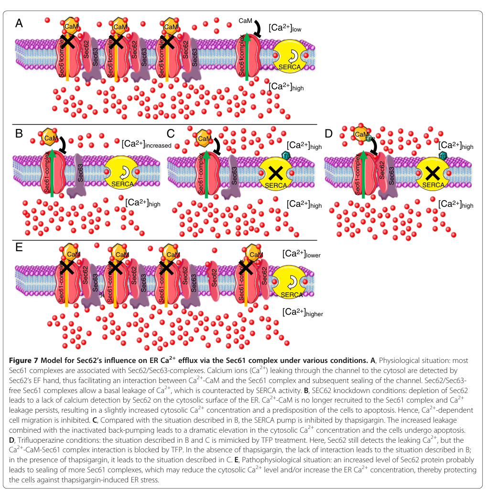

## Question

# Gene Research for Functional Annotation

## ⚠️ CRITICAL: Gene/Protein Identification Context

**BEFORE YOU BEGIN RESEARCH:** You MUST verify you are researching the CORRECT gene/protein. Gene symbols can be ambiguous, especially for less well-characterized genes from non-model organisms.

### Target Gene/Protein Identity (from UniProt):
- **UniProt Accession:** Q99442
- **Protein Description:** RecName: Full=Translocation protein SEC62; AltName: Full=Translocation protein 1; Short=TP-1; Short=hTP-1;
- **Gene Information:** Name=SEC62; Synonyms=TLOC1;
- **Organism (full):** Homo sapiens (Human).
- **Protein Family:** Belongs to the SEC62 family. .
- **Key Domains:** Sec62. (IPR004728); Sec62 (PF03839)

### MANDATORY VERIFICATION STEPS:

1. **Check if the gene symbol "SEC62" matches the protein description above**
2. **Verify the organism is correct:** Homo sapiens (Human).
3. **Check if protein family/domains align with what you find in literature**
4. **If you find literature for a DIFFERENT gene with the same or similar symbol, STOP**

### If Gene Symbol is Ambiguous or You Cannot Find Relevant Literature:

**DO NOT PROCEED WITH RESEARCH ON A DIFFERENT GENE.** Instead:
- State clearly: "The gene symbol 'SEC62' is ambiguous or literature is limited for this specific protein"
- Explain what you found (e.g., "Found extensive literature on a different gene with the same symbol in a different organism")
- Describe the protein based ONLY on the UniProt information provided above
- Suggest that the protein function can be inferred from domain/family information

### Research Target:

Please provide a comprehensive research report on the gene **SEC62** (gene ID: SEC62, UniProt: Q99442) in human.

The research report should be a detailed narrative explaining the function, biological processes, and localization of the gene product. Citations should be given for all claims.

You should prioritize authoritative reviews and primary scientific literature when conducting research. You can supplement
this with annotations you find in gene/protein databases, but these can be outdated or inaccurate.

We are specifically interested in the primary function of the gene - for enzymes, what reaction is catalyzed, and what is the substrate specificity? For transporters, what is the substrate? For structural proteins or adapters, what is the broader structural role? For signaling molecules, what is the role in the pathway.

We are interested in where in or outside the cell the gene product carries out its function.

We are also interested in the signaling or biochemical pathways in which the gene functions. We are less interested in broad pleiotropic effects, except where these elucidate the precise role.

Include evidence where possible. We are interested in both experimental evidence as well as inference from structure, evolution, or bioinformatic analysis. Precise studies should be prioritized over high-throughput, where available.

## Output

Question: You are an expert researcher providing comprehensive, well-cited information.

Provide detailed information focusing on:
1. Key concepts and definitions with current understanding
2. Recent developments and latest research (prioritize 2023-2024 sources)
3. Current applications and real-world implementations
4. Expert opinions and analysis from authoritative sources
5. Relevant statistics and data from recent studies

Format as a comprehensive research report with proper citations. Include URLs and publication dates where available.
Always prioritize recent, authoritative sources and provide specific citations for all major claims.

# Gene Research for Functional Annotation

## ⚠️ CRITICAL: Gene/Protein Identification Context

**BEFORE YOU BEGIN RESEARCH:** You MUST verify you are researching the CORRECT gene/protein. Gene symbols can be ambiguous, especially for less well-characterized genes from non-model organisms.

### Target Gene/Protein Identity (from UniProt):
- **UniProt Accession:** Q99442
- **Protein Description:** RecName: Full=Translocation protein SEC62; AltName: Full=Translocation protein 1; Short=TP-1; Short=hTP-1;
- **Gene Information:** Name=SEC62; Synonyms=TLOC1;
- **Organism (full):** Homo sapiens (Human).
- **Protein Family:** Belongs to the SEC62 family. .
- **Key Domains:** Sec62. (IPR004728); Sec62 (PF03839)

### MANDATORY VERIFICATION STEPS:

1. **Check if the gene symbol "SEC62" matches the protein description above**
2. **Verify the organism is correct:** Homo sapiens (Human).
3. **Check if protein family/domains align with what you find in literature**
4. **If you find literature for a DIFFERENT gene with the same or similar symbol, STOP**

### If Gene Symbol is Ambiguous or You Cannot Find Relevant Literature:

**DO NOT PROCEED WITH RESEARCH ON A DIFFERENT GENE.** Instead:
- State clearly: "The gene symbol 'SEC62' is ambiguous or literature is limited for this specific protein"
- Explain what you found (e.g., "Found extensive literature on a different gene with the same symbol in a different organism")
- Describe the protein based ONLY on the UniProt information provided above
- Suggest that the protein function can be inferred from domain/family information

### Research Target:

Please provide a comprehensive research report on the gene **SEC62** (gene ID: SEC62, UniProt: Q99442) in human.

The research report should be a detailed narrative explaining the function, biological processes, and localization of the gene product. Citations should be given for all claims.

You should prioritize authoritative reviews and primary scientific literature when conducting research. You can supplement
this with annotations you find in gene/protein databases, but these can be outdated or inaccurate.

We are specifically interested in the primary function of the gene - for enzymes, what reaction is catalyzed, and what is the substrate specificity? For transporters, what is the substrate? For structural proteins or adapters, what is the broader structural role? For signaling molecules, what is the role in the pathway.

We are interested in where in or outside the cell the gene product carries out its function.

We are also interested in the signaling or biochemical pathways in which the gene functions. We are less interested in broad pleiotropic effects, except where these elucidate the precise role.

Include evidence where possible. We are interested in both experimental evidence as well as inference from structure, evolution, or bioinformatic analysis. Precise studies should be prioritized over high-throughput, where available.

## Research report: Human **SEC62** (UniProt **Q99442**) — functional annotation and biomedical relevance

### 0) Target verification (critical disambiguation)
The target is **human SEC62** (synonym **TLOC1**), UniProt **Q99442**, an **ER membrane** protein in the **SEC62 family** that functions with the **Sec61 protein-conducting channel** and **Sec63** as part of the mammalian ER translocation machinery. This identity is explicitly aligned with UniProt Q99442 in mechanistic Sec61-translocon literature and is consistent with SEC62 being an ER translocon-associated factor in human cells. (zimmermann2025rulesofengagement pages 32-33)

---

### 1) Key concepts and current understanding (definitions and core biology)

#### 1.1 SEC62 as a Sec61-associated translocon component
**Definition/role.** In mammalian cells, most secretory and membrane proteins enter the ER through the **Sec61 channel**. A subset of substrates require **auxiliary effectors** that help the channel gate/open. SEC62 is an ER-membrane translocon component that, together with **SEC63**, forms a **Sec61-associated Sec62/Sec63 complex** that supports **substrate-specific** ER import, particularly in contexts described as **post-translational translocation** or “difficult-to-gate” signal peptides. (zimmermann2025rulesofengagement pages 32-33, schorr2020identificationofsignal pages 1-2)

**Mechanistic model (import/gating).** Based on in-cell substrate studies and mechanistic experiments, the Sec62/Sec63 complex is proposed to support Sec61 opening for certain precursor polypeptides either (i) via interaction with the **cytosolic N-terminus of Sec61α** or (ii) through **recruitment of BiP** (HSPA5/GRP78) to engage a binding site on Sec61α (luminal loop 7) to promote productive translocation. (schorr2020identificationofsignal pages 1-2)

#### 1.2 Substrate specificity: “rules” for SEC62/SEC63-dependent import
A major advance in understanding SEC62 biology is the identification of **signal-peptide features** that predict dependence on SEC62/SEC63:

- SEC62/SEC63 clients tend to have signal peptides with **comparatively longer but less hydrophobic H-regions** and **lower C-region polarity**. (schorr2020identificationofsignal pages 1-2)
- A key determinant for SEC62/SEC63 requirement is the combination of a **slowly gating signal peptide** plus a downstream **positively charged cluster** that disrupts translocation. (schorr2019proteomicsidentifiessignal pages 1-4, schorr2020identificationofsignal pages 1-2)

These features were experimentally linked to additional requirements for **BiP** and to sensitivity to **Sec61-channel inhibitors** in at least some substrates (e.g., ERj3/DNAJB11). (schorr2019proteomicsidentifiessignal pages 1-4, schorr2020identificationofsignal pages 10-13)

#### 1.3 SEC62 in ER Ca2+ homeostasis: regulating Sec61 Ca2+ leak with calmodulin
**Concept.** The Sec61 channel is also recognized as a major **passive ER Ca2+ leak** pathway whose permeability depends on its **gating state**. SEC62 has an additional, non-canonical role: regulation of **Sec61-mediated Ca2+ efflux** from the ER, functionally coupled to **calmodulin (CaM)** signaling. (linxweiler2013targetingcellmigration pages 10-12, linxweiler2017let’stalkabout pages 6-7)

**Direct evidence and model.** In human tumor cell systems, SEC62 was shown to regulate Ca2+ leakage via a **direct, Ca2+-sensitive interaction** with the Sec61 complex (assayed biochemically), and a **Ca2+-binding motif/EF-hand-like element** in SEC62 was required for function. SEC62 depletion increased basal cytosolic Ca2+ (reported as at least ~two-fold) and enhanced thapsigargin-evoked Ca2+ responses, consistent with increased leak. (linxweiler2013targetingcellmigration pages 1-2, linxweiler2013targetingcellmigration pages 2-4)

A mechanistic model proposes that SEC62 acts as a **local Ca2+ sensor** near Sec61: Ca2+ leaking through Sec61 is sensed by SEC62, which then facilitates occupation of a cytosolic regulatory site by **Ca2+-CaM** that helps **seal/close** the Sec61 pore to limit continued Ca2+ leak. (linxweiler2013targetingcellmigration pages 10-12, linxweiler2013targetingcellmigration pages 12-13)

A schematic of this model and the predicted effects of SEC62 knockdown, thapsigargin, and calmodulin antagonism is provided in Linxweiler et al. (Figure 7). (linxweiler2013targetingcellmigration media 9094901c)

#### 1.4 SEC62 and recovER-phagy (ER stress recovery-associated ER-phagy)
**Definition.** “**recovER-phagy**” is described in the recent ER-autophagy literature as an ER turnover pathway engaged during **recovery from ER stress**, distinct from starvation-induced ER-phagy.

**SEC62’s role.** SEC62 is repeatedly described as an ER-phagy receptor/adaptor that mediates ER turnover during recovery from ER stress (recovER-phagy), thereby linking ER protein import capacity and ER quality control. (nurlaila2026visitingtransloconsseca pages 4-6, urban2025functionallydiversifiedbip pages 33-36)

**Recent framing (2023–2024).** Contemporary reviews on ER autophagy and disease (e.g., FEBS Journal review on ER autophagy routes; beta-cell autophagy review) include SEC62 among identified ER-phagy receptors and explicitly associate it with recovery-from-stress ER turnover. (urban2025functionallydiversifiedbip pages 33-36)

---

### 2) Recent developments and latest research (prioritizing 2023–2024)

Because much of SEC62’s core mechanistic work (Sec61 gating; Ca2+-leak control) is anchored in earlier primary literature, the **2023–2024** landscape is dominated by:

1) **Refined conceptual integration** of SEC62 into ER-phagy frameworks (ER-phagy/ERLAD/secretory pathway quality control), where SEC62-mediated recovER-phagy is treated as a distinct recovery program. (urban2025functionallydiversifiedbip pages 33-36)

2) **Expansion of disease contexts** in which ER-phagy and ER-stress adaptation are discussed, including neurodegeneration and metabolic disease reviews that list SEC62 as an ER-phagy receptor involved in stress recovery. (urban2025functionallydiversifiedbip pages 33-36)

3) **New pathway linkages** reported in 2024 experimental systems (e.g., Sec62-PERK axis described in a toxicology/cell-biology model), illustrating continuing exploration of SEC62 in ER stress signaling networks—though these are not necessarily human cancer contexts and may be cell-type/species specific in experimental design. (urban2025functionallydiversifiedbip pages 33-36)

---

### 3) Cellular localization, complexes, and pathways

#### 3.1 Localization
SEC62 is consistently treated as an **ER membrane** protein (translocon-associated). (zimmermann2025rulesofengagement pages 32-33, zimmermann2022theendoplasmicreticulum pages 1-2)

#### 3.2 Core physical/functional interactions
Key partners and axes supported by experimental and review-level evidence in the retrieved corpus include:

- **Sec61 complex**: SEC62 interacts with Sec61 and influences both substrate import and channel gating/Ca2+ leak. (linxweiler2013targetingcellmigration pages 10-12, linxweiler2013targetingcellmigration pages 1-2)
- **SEC63 and BiP (HSPA5/GRP78)**: SEC62/SEC63 cooperate to enable productive translocation for substrates with “slowly gating” signal peptides; BiP engagement is mechanistically implicated, and Sec63’s BiP-related functionality is critical for certain clients (e.g., pre-ERj3). (schorr2020identificationofsignal pages 10-13, schorr2020identificationofsignal pages 1-2)
- **Calmodulin (CaM)**: SEC62-related phenotypes in Ca2+ homeostasis and migration can be phenocopied by **CaM antagonists** (notably trifluoperazine), supporting a functional SEC62–CaM–Sec61 regulatory loop. (linxweiler2013targetingcellmigration pages 10-12, linxweiler2013targetingcellmigration pages 12-13)

#### 3.3 Pathways (functional placement)
- **Protein biogenesis / secretory pathway entry**: Sec61-mediated translocation with substrate-specific assistance by Sec62/Sec63; BiP-dependent gating for certain precursors. (schorr2020identificationofsignal pages 1-2)
- **ER Ca2+ homeostasis / signaling**: Sec61 Ca2+ leak regulation, with SEC62 as a modulatory component in cancer-associated phenotypes (migration, stress tolerance). (linxweiler2013targetingcellmigration pages 10-12, linxweiler2017let’stalkabout pages 6-7)
- **ER quality control via selective autophagy**: recovER-phagy as an ER-stress recovery program. (nurlaila2026visitingtransloconsseca pages 4-6, urban2025functionallydiversifiedbip pages 33-36)

---

### 4) Current applications and real-world implementations

#### 4.1 SEC62 as a biomarker/oncogene candidate in 3q26-amplified cancers
SEC62 is located at **chromosome 3q26** and is described as frequently amplified/overexpressed in cancers (including breast cancer in a review context), with overexpression correlating with invasive behavior and poor prognosis. (nurlaila2026visitingtransloconssec pages 4-6, nurlaila2026visitingtransloconsseca pages 4-6)

A clinical implementation pattern described in the literature is **IHC/Western-based assessment** of SEC62 abundance in tumors, motivating risk stratification and guiding exploration of SEC62-targeted strategies. (linxweiler2013targetingcellmigration pages 1-2, zimmermann2022theendoplasmicreticulum pages 1-2)

#### 4.2 Pharmacological phenocopy of SEC62 inhibition via calmodulin antagonists
In human tumor cell models, **trifluoperazine (TFP)** (a clinically used calmodulin antagonist) phenocopied SEC62 depletion, inhibiting cell migration and increasing sensitivity to thapsigargin-induced ER stress. (linxweiler2013targetingcellmigration pages 10-12, linxweiler2013targetingcellmigration pages 12-13)

In a more translational framing, a 2022 review summarizes that TFP reduced tumor growth and metastatic potential in murine models and discusses combination concepts with SERCA-targeting agents (thapsigargin analogs). (zimmermann2022theendoplasmicreticulum pages 1-2)

#### 4.3 Targeting ER Ca2+ homeostasis with SERCA-directed agents
The Sec62-centered therapeutic logic often intersects with ER Ca2+ manipulation; a 2022 review notes that phase II clinical trials had been initiated for **mipsagargin/G202** (a thapsigargin prodrug targeting Ca2+ homeostasis), while also highlighting that SEC62-overexpressing tumors may show reduced responsiveness/resistance in cell-line experiments, motivating combination strategies. (zimmermann2022theendoplasmicreticulum pages 1-2)

---

### 5) Expert opinions and authoritative synthesis (how experts frame SEC62)

Authoritative reviews and synthesis pieces in the retrieved corpus consistently frame SEC62 as:

1) A **substrate-selective translocation co-factor** for Sec61, whose involvement can be predicted from **signal peptide features** and downstream sequence context. (zimmermann2025rulesofengagement pages 32-33, schorr2020identificationofsignal pages 1-2)
2) A modulator of **Sec61 Ca2+ leak** and therefore a bridge between **protein import** and **Ca2+-dependent phenotypes** such as migration and stress tolerance. (linxweiler2013targetingcellmigration pages 10-12, linxweiler2017let’stalkabout pages 6-7)
3) A contributor to **ER stress recovery programs** via **recovER-phagy**, which is increasingly discussed as a distinct ER-proteostasis route. (nurlaila2026visitingtransloconsseca pages 4-6, urban2025functionallydiversifiedbip pages 33-36)

---

### 6) Relevant statistics and data (recent studies and key quantitative findings)

#### 6.1 Proteomics-defined substrate scope (SEC62 depletion in human cells)
A proteomics analysis after SEC62 knockdown reported that SEC62 depletion significantly altered steady-state levels of **329 proteins** (208 down; 121 up; q < 0.05), with enrichment for proteins bearing cleavable signal peptides and N-glycosylated proteins among negatively affected proteins, supporting SEC62’s role in ER import for a subset of secretory pathway clients. (schorr2020identificationofsignal pages 7-8)

Additionally, a substrate specificity study identified **22 novel Sec62/Sec63 substrates** and proposed definable signal peptide determinants (longer/less hydrophobic H-region; lower C-region polarity; slowly gating SP plus downstream positive charges) for engagement of the Sec62/Sec63 machinery. (schorr2020identificationofsignal pages 1-2)

#### 6.2 Quantitative Ca2+ / functional phenotypes
SEC62 depletion was reported to cause **at least a two-fold increase in basal cytosolic Ca2+** and increased ER Ca2+ leakage following thapsigargin, consistent with SEC62 regulating Sec61 Ca2+ leak. (linxweiler2013targetingcellmigration pages 1-2)

#### 6.3 Pan-cancer alteration prevalence and survival (large cohort summary)
A review summarizing cancer datasets reported SEC62 alterations (mostly amplifications) in **2,595** of **>72,000** cancer patients screened, and a survival analysis of **40,006** patients reported median survival **54.2 months** (SEC62-altered) versus **95.6 months** (unaltered). (sicking2021complexityandspecificity pages 29-32)

#### 6.4 NSCLC cohort size in SEC62 survival analysis
In a primary NSCLC-focused study, Sec62 protein levels were quantified by western blot in **70** NSCLC patients (35 adenocarcinoma; 35 squamous cell carcinoma) and used to stratify Kaplan–Meier survival analyses using a relative Sec62 metric (rSec62). (linxweiler2013targetingcellmigration pages 1-2)

---

### Summary table (evidence-backed functional annotation)
The table below consolidates SEC62 functions, mechanisms, and translational relevance supported by the retrieved evidence.

| Functional axis | Key claims/definitions | Representative evidence (brief) | Key quantitative data (if any) | Primary sources (include DOI URLs and years) |
|---|---|---|---|---|
| ER translocation | Human SEC62 (UniProt Q99442) is an ER membrane component of the Sec61/Sec62/Sec63 machinery that supports substrate-specific protein import into the ER, especially when Sec61 channel opening is difficult; it acts with Sec63 and can promote Sec61 gating directly and/or via BiP recruitment. (zimmermann2025rulesofengagement pages 32-33, schorr2020identificationofsignal pages 10-13, schorr2020identificationofsignal pages 1-2) | In intact human cells, loss of SEC62 impaired import of selected precursors such as pre-ERj3; disruption of Sec62/Sec63 function prevented productive signal-peptide insertion into Sec61, and BiP-dependent rescue experiments supported a channel-gating role. (schorr2020identificationofsignal pages 10-13, schorr2020identificationofsignal pages 1-2) | SEC62 knockdown significantly altered 329 proteins (208 down, 121 up; q < 0.05), with enrichment for cleavable signal peptide and N-glycosylated proteins among negatively affected proteins. (schorr2020identificationofsignal pages 7-8) | Schorr et al., 2020, FEBS J., DOI: https://doi.org/10.1111/febs.15274 (2020); Zimmermann, 2025, Int J Mol Sci, DOI: https://doi.org/10.3390/ijms26188823 (2025) |
| Substrate specificity | SEC62/Sec63-dependent clients share signal peptides with comparatively longer but less hydrophobic hydrophobic regions and lower C-region polarity; dependence is strongly associated with slowly gating signal peptides plus downstream positively charged, translocation-disruptive clusters. (schorr2019proteomicsidentifiessignal pages 1-4, schorr2020identificationofsignal pages 1-2) | Proteomics in human cells identified a shared signal-peptide signature among SEC62/Sec63 clients; for ERj3, these features also conferred BiP dependence and sensitivity to a Sec61 inhibitor. (schorr2019proteomicsidentifiessignal pages 1-4, schorr2020identificationofsignal pages 1-2) | 22 novel SEC62/Sec63 substrates were identified; among affected SEC62-depletion substrates, 21 had cleavable signal peptides and 29 had TMHs; 22 precursors overlapped between SEC62 and SEC63 depletion datasets. (schorr2020identificationofsignal pages 7-8, schorr2020identificationofsignal pages 1-2) | Schorr et al., 2020, FEBS J., DOI: https://doi.org/10.1111/febs.15274 (2020); Schorr et al., 2019, bioRxiv, DOI: https://doi.org/10.1101/867762 (2019) |
| ER Ca2+ homeostasis | SEC62 helps regulate Sec61-mediated ER Ca2+ leak in cooperation with cytosolic calmodulin (CaM); a Ca2+-binding motif/EF-hand in SEC62 is required for this function, and SEC62 is proposed to sense local Ca2+ and facilitate Ca2+-CaM-dependent channel closure. (linxweiler2013targetingcellmigration pages 10-12, linxweiler2013targetingcellmigration pages 12-13, zimmermann2022theendoplasmicreticulum pages 1-2) | Biacore/SPR and functional Ca2+ imaging supported a direct, Ca2+-sensitive interaction of Sec62 with the Sec61 complex; SEC62 silencing elevated basal cytosolic Ca2+ and increased thapsigargin-evoked Ca2+ release, while CaM antagonists phenocopied SEC62 depletion. A schematic model is available in Fig. 7. (linxweiler2013targetingcellmigration pages 1-2, linxweiler2013targetingcellmigration pages 2-4, linxweiler2013targetingcellmigration media 9094901c) | SEC62 depletion caused at least a two-fold increase in basal cytosolic Ca2+; assays used 1 μM thapsigargin for short-term Ca2+ imaging, 6–10 nM thapsigargin for proliferation assays, 4–8 μM TFP in functional assays. (linxweiler2013targetingcellmigration pages 1-2, linxweiler2013targetingcellmigration pages 2-4) | Linxweiler et al., 2013, BMC Cancer, DOI: https://doi.org/10.1186/1471-2407-13-574 (2013); Zimmermann et al., 2022, Front Physiol, DOI: https://doi.org/10.3389/fphys.2022.1014271 (2022); Parys & Van Coppenolle, 2022, Front Physiol, DOI: https://doi.org/10.3389/fphys.2022.991149 (2022) |
| recovER-phagy | SEC62 also functions as an ER-phagy receptor/adaptor during recovery from ER stress (“recovER-phagy”), linking ER protein import capacity to selective ER turnover and quality control. (nurlaila2026visitingtransloconsseca pages 4-6, urban2025functionallydiversifiedbip pages 36-39, urban2025functionallydiversifiedbip pages 33-36) | Recent reviews summarize SEC62 among ER-phagy receptors and specifically note its role in recovery-phase ER turnover rather than generic starvation-induced ER-phagy. (urban2025functionallydiversifiedbip pages 33-36) | No SEC62-specific 2023–2024 quantitative flux values were retrieved in context; available recent context is primarily review-level or cites the foundational 2016/2019 work. (urban2025functionallydiversifiedbip pages 36-39, urban2025functionallydiversifiedbip pages 33-36) | Knupp et al., 2023, FEBS J., DOI: https://doi.org/10.1111/febs.16986 (2023); Yasasilka & Lee, 2024, J Diabetes Investig., DOI: https://doi.org/10.1111/jdi.14184 (2024) |
| Cancer/clinical relevance | SEC62 is located on chromosome 3q/3q26, is frequently amplified/overexpressed in multiple tumors, and overexpression is associated with increased migration, invasion, stress tolerance, metastatic behavior, and poorer prognosis. (nurlaila2026visitingtransloconssec pages 4-6, nurlaila2026visitingtransloconsseca pages 4-6, korner2022antagonizingsec62function pages 1-2, zimmermann2022theendoplasmicreticulum pages 1-2) | SEC62 silencing inhibited cancer-cell migration across several tumor types, whereas overexpression stimulated migration and tumor growth-related phenotypes; reviews and mechanistic summaries describe SEC62 as a driver oncogene candidate in 3q26-amplified cancers. (sicking2021complexityandspecificity pages 29-32, linxweiler2017let’stalkabout pages 6-7, korner2022antagonizingsec62function pages 1-2) | In a pan-cancer summary, SEC62 alterations were reported in 2,595 of >72,000 cancer patients, mostly amplifications; median survival was 54.2 months with SEC62 alterations vs 95.6 months without. In one NSCLC study, 70 patients (35 AC, 35 SCC) were analyzed by western blot/Kaplan-Meier using rSec62. (sicking2021complexityandspecificity pages 29-32, linxweiler2013targetingcellmigration pages 1-2) | Linxweiler et al., 2013, BMC Cancer, DOI: https://doi.org/10.1186/1471-2407-13-574 (2013); Linxweiler et al., 2017, Signal Transduct Target Ther, DOI: https://doi.org/10.1038/sigtrans.2017.2 (2017); Körner et al., 2022, Front Physiol, DOI: https://doi.org/10.3389/fphys.2022.880004 (2022); Zimmermann et al., 2022, Front Physiol, DOI: https://doi.org/10.3389/fphys.2022.1014271 (2022) |
| Pharmacological targeting | SEC62-overexpressing tumors may be functionally targeted by calmodulin antagonists, especially trifluoperazine (TFP), which phenocopy SEC62 silencing; SERCA-targeting agents such as thapsigargin analogs/mipsagargin have also been discussed in combination strategies focused on ER Ca2+ homeostasis. (linxweiler2013targetingcellmigration pages 10-12, linxweiler2013targetingcellmigration pages 12-13, zimmermann2022theendoplasmicreticulum pages 1-2) | TFP and ophiobolin A inhibited migration and increased sensitivity to thapsigargin-induced ER stress similarly to SEC62 depletion; murine tumor models reviewed in 2022 showed TFP reduced tumor growth and metastatic potential. (linxweiler2013targetingcellmigration pages 10-12, zimmermann2022theendoplasmicreticulum pages 1-2) | Experimental conditions included 8 μM TFP with 10 nM or 0.1 nM thapsigargin in PC3 cells and 4 μM TFP in migration assays; mipsagargin/G202 had entered phase II trials, though SEC62-overexpressing cells may be less responsive. (linxweiler2013targetingcellmigration pages 10-12, zimmermann2022theendoplasmicreticulum pages 1-2) | Linxweiler et al., 2013, BMC Cancer, DOI: https://doi.org/10.1186/1471-2407-13-574 (2013); Zimmermann et al., 2022, Front Physiol, DOI: https://doi.org/10.3389/fphys.2022.1014271 (2022) |

*Table: This table summarizes the main experimentally supported functional axes of human SEC62/Q99442, including its roles in ER protein translocation, calcium homeostasis, recovER-phagy, and cancer relevance. It also highlights quantitative findings and source papers useful for downstream annotation or evidence review.*

---

### Concluding functional annotation (concise)
Human **SEC62/Q99442** is a **multi-functional ER membrane translocon component** that (i) supports **Sec61-mediated ER import** for a substrate-defined subset of proteins via **Sec62/Sec63/BiP-assisted gating**, (ii) modulates **Sec61-dependent ER Ca2+ leak** via a **Ca2+-sensitive SEC62–Sec61 interaction** coupled to **calmodulin** regulation, and (iii) contributes to ER homeostasis through **recovery-from-stress ER turnover (recovER-phagy)**. These mechanistic functions are linked to cancer cell phenotypes (migration, invasion, stress tolerance) and motivate biomarker and therapeutic concepts for **SEC62-overexpressing (3q26-amplified) tumors**. (schorr2020identificationofsignal pages 1-2, linxweiler2013targetingcellmigration pages 10-12, zimmermann2022theendoplasmicreticulum pages 1-2)

References

1. (zimmermann2025rulesofengagement pages 32-33): Richard Zimmermann. Rules of engagement for components of membrane protein biogenesis at the human endoplasmic reticulum. Sep 2025. URL: https://doi.org/10.3390/ijms26188823, doi:10.3390/ijms26188823. This article has 2 citations.

2. (schorr2020identificationofsignal pages 1-2): Stefan Schorr, Duy Nguyen, Sarah Haßdenteufel, Nagarjuna Nagaraj, Adolfo Cavalié, Markus Greiner, Petra Weissgerber, Marisa Loi, Adrienne W. Paton, James C. Paton, Maurizio Molinari, Friedrich Förster, Johanna Dudek, Sven Lang, Volkhard Helms, and Richard Zimmermann. Identification of signal peptide features for substrate specificity in human sec62/sec63‐dependent er protein import. The FEBS Journal, 287:4612-4640, Mar 2020. URL: https://doi.org/10.1111/febs.15274, doi:10.1111/febs.15274. This article has 51 citations.

3. (schorr2019proteomicsidentifiessignal pages 1-4): Stefan Schorr, Duy Nguyen, Sarah Haßdenteufel, Nagarjuna Nagaraj, Adolfo Cavalié, Markus Greiner, Petra Weissgerber, Marisa Loi, Adrienne W. Paton, James C. Paton, Maurizio Molinari, Friedrich Förster, Johanna Dudek, Sven Lang, Volkhard Helms, and Richard Zimmermann. Proteomics identifies signal peptide features determining the substrate specificity in human sec62/sec63-dependent er protein import. bioRxiv, Dec 2019. URL: https://doi.org/10.1101/867762, doi:10.1101/867762. This article has 11 citations.

4. (schorr2020identificationofsignal pages 10-13): Stefan Schorr, Duy Nguyen, Sarah Haßdenteufel, Nagarjuna Nagaraj, Adolfo Cavalié, Markus Greiner, Petra Weissgerber, Marisa Loi, Adrienne W. Paton, James C. Paton, Maurizio Molinari, Friedrich Förster, Johanna Dudek, Sven Lang, Volkhard Helms, and Richard Zimmermann. Identification of signal peptide features for substrate specificity in human sec62/sec63‐dependent er protein import. The FEBS Journal, 287:4612-4640, Mar 2020. URL: https://doi.org/10.1111/febs.15274, doi:10.1111/febs.15274. This article has 51 citations.

5. (linxweiler2013targetingcellmigration pages 10-12): Maximilian Linxweiler, Stefan Schorr, Nico Schäuble, Martin Jung, Johannes Linxweiler, Frank Langer, Hans-Joachim Schäfers, Adolfo Cavalié, Richard Zimmermann, and Markus Greiner. Targeting cell migration and the endoplasmic reticulum stress response with calmodulin antagonists: a clinically tested small molecule phenocopy of sec62 gene silencing in human tumor cells. BMC Cancer, 13:574-574, Dec 2013. URL: https://doi.org/10.1186/1471-2407-13-574, doi:10.1186/1471-2407-13-574. This article has 100 citations and is from a peer-reviewed journal.

6. (linxweiler2017let’stalkabout pages 6-7): Maximilian Linxweiler, Bernhard Schick, and Richard Zimmermann. Let’s talk about secs: sec61, sec62 and sec63 in signal transduction, oncology and personalized medicine. Signal Transduction and Targeted Therapy, Apr 2017. URL: https://doi.org/10.1038/sigtrans.2017.2, doi:10.1038/sigtrans.2017.2. This article has 225 citations and is from a peer-reviewed journal.

7. (linxweiler2013targetingcellmigration pages 1-2): Maximilian Linxweiler, Stefan Schorr, Nico Schäuble, Martin Jung, Johannes Linxweiler, Frank Langer, Hans-Joachim Schäfers, Adolfo Cavalié, Richard Zimmermann, and Markus Greiner. Targeting cell migration and the endoplasmic reticulum stress response with calmodulin antagonists: a clinically tested small molecule phenocopy of sec62 gene silencing in human tumor cells. BMC Cancer, 13:574-574, Dec 2013. URL: https://doi.org/10.1186/1471-2407-13-574, doi:10.1186/1471-2407-13-574. This article has 100 citations and is from a peer-reviewed journal.

8. (linxweiler2013targetingcellmigration pages 2-4): Maximilian Linxweiler, Stefan Schorr, Nico Schäuble, Martin Jung, Johannes Linxweiler, Frank Langer, Hans-Joachim Schäfers, Adolfo Cavalié, Richard Zimmermann, and Markus Greiner. Targeting cell migration and the endoplasmic reticulum stress response with calmodulin antagonists: a clinically tested small molecule phenocopy of sec62 gene silencing in human tumor cells. BMC Cancer, 13:574-574, Dec 2013. URL: https://doi.org/10.1186/1471-2407-13-574, doi:10.1186/1471-2407-13-574. This article has 100 citations and is from a peer-reviewed journal.

9. (linxweiler2013targetingcellmigration pages 12-13): Maximilian Linxweiler, Stefan Schorr, Nico Schäuble, Martin Jung, Johannes Linxweiler, Frank Langer, Hans-Joachim Schäfers, Adolfo Cavalié, Richard Zimmermann, and Markus Greiner. Targeting cell migration and the endoplasmic reticulum stress response with calmodulin antagonists: a clinically tested small molecule phenocopy of sec62 gene silencing in human tumor cells. BMC Cancer, 13:574-574, Dec 2013. URL: https://doi.org/10.1186/1471-2407-13-574, doi:10.1186/1471-2407-13-574. This article has 100 citations and is from a peer-reviewed journal.

10. (linxweiler2013targetingcellmigration media 9094901c): Maximilian Linxweiler, Stefan Schorr, Nico Schäuble, Martin Jung, Johannes Linxweiler, Frank Langer, Hans-Joachim Schäfers, Adolfo Cavalié, Richard Zimmermann, and Markus Greiner. Targeting cell migration and the endoplasmic reticulum stress response with calmodulin antagonists: a clinically tested small molecule phenocopy of sec62 gene silencing in human tumor cells. BMC Cancer, 13:574-574, Dec 2013. URL: https://doi.org/10.1186/1471-2407-13-574, doi:10.1186/1471-2407-13-574. This article has 100 citations and is from a peer-reviewed journal.

11. (nurlaila2026visitingtransloconsseca pages 4-6): I Nurlaila, D Hardianto, and N Karimah. Visiting translocons sec roles in antigen presentation in breast cancer: major translocons. Unknown journal, 2026.

12. (urban2025functionallydiversifiedbip pages 33-36): Nicholas D. Urban, Shannon M. Lacy, Kate M. Van Pelt, Benedict Abdon, Zachary Mattiola, Adam Klaiss, Sarah Tabler, and Matthias C. Truttmann. Functionally diversified bip orthologs control body growth, reproduction, stress resistance, aging, and er-phagy in caenorhabditis elegans. bioRxiv, Jan 2025. URL: https://doi.org/10.1101/2025.01.14.633073, doi:10.1101/2025.01.14.633073. This article has 4 citations.

13. (zimmermann2022theendoplasmicreticulum pages 1-2): Julia S. M. Zimmermann, Johannes Linxweiler, Julia C. Radosa, Maximilian Linxweiler, and Richard Zimmermann. The endoplasmic reticulum membrane protein sec62 as potential therapeutic target in sec62 overexpressing tumors. Frontiers in Physiology, Oct 2022. URL: https://doi.org/10.3389/fphys.2022.1014271, doi:10.3389/fphys.2022.1014271. This article has 20 citations.

14. (nurlaila2026visitingtransloconssec pages 4-6): I Nurlaila, D Hardianto, and N Karimah. Visiting translocons sec roles in antigen presentation in breast cancer: major translocons. Unknown journal, 2026.

15. (schorr2020identificationofsignal pages 7-8): Stefan Schorr, Duy Nguyen, Sarah Haßdenteufel, Nagarjuna Nagaraj, Adolfo Cavalié, Markus Greiner, Petra Weissgerber, Marisa Loi, Adrienne W. Paton, James C. Paton, Maurizio Molinari, Friedrich Förster, Johanna Dudek, Sven Lang, Volkhard Helms, and Richard Zimmermann. Identification of signal peptide features for substrate specificity in human sec62/sec63‐dependent er protein import. The FEBS Journal, 287:4612-4640, Mar 2020. URL: https://doi.org/10.1111/febs.15274, doi:10.1111/febs.15274. This article has 51 citations.

16. (sicking2021complexityandspecificity pages 29-32): Mark Sicking, Sven Lang, Florian Bochen, Andreas Roos, Joost P. H. Drenth, Muhammad Zakaria, Richard Zimmermann, and Maximilian Linxweiler. Complexity and specificity of sec61-channelopathies: human diseases affecting gating of the sec61 complex. Cells, 10:1036, Apr 2021. URL: https://doi.org/10.3390/cells10051036, doi:10.3390/cells10051036. This article has 46 citations.

17. (urban2025functionallydiversifiedbip pages 36-39): Nicholas D. Urban, Shannon M. Lacy, Kate M. Van Pelt, Benedict Abdon, Zachary Mattiola, Adam Klaiss, Sarah Tabler, and Matthias C. Truttmann. Functionally diversified bip orthologs control body growth, reproduction, stress resistance, aging, and er-phagy in caenorhabditis elegans. bioRxiv, Jan 2025. URL: https://doi.org/10.1101/2025.01.14.633073, doi:10.1101/2025.01.14.633073. This article has 4 citations.

18. (korner2022antagonizingsec62function pages 1-2): Sandrina Körner, Tillman Pick, Florian Bochen, Silke Wemmert, Christina Körbel, Michael D. Menger, Adolfo Cavalié, Jan-Philipp Kühn, Bernhard Schick, and Maximilian Linxweiler. Antagonizing sec62 function in intracellular ca2+ homeostasis represents a novel therapeutic strategy for head and neck cancer. Frontiers in Physiology, Aug 2022. URL: https://doi.org/10.3389/fphys.2022.880004, doi:10.3389/fphys.2022.880004. This article has 12 citations.

## Artifacts

- [Edison artifact artifact-00](SEC62-deep-research-falcon_artifacts/artifact-00.md)

## Citations

1. zimmermann2025rulesofengagement pages 32-33
2. schorr2020identificationofsignal pages 1-2
3. urban2025functionallydiversifiedbip pages 33-36
4. zimmermann2022theendoplasmicreticulum pages 1-2
5. schorr2020identificationofsignal pages 7-8
6. linxweiler2013targetingcellmigration pages 1-2
7. sicking2021complexityandspecificity pages 29-32
8. schorr2019proteomicsidentifiessignal pages 1-4
9. schorr2020identificationofsignal pages 10-13
10. linxweiler2013targetingcellmigration pages 10-12
11. linxweiler2013targetingcellmigration pages 2-4
12. linxweiler2013targetingcellmigration pages 12-13
13. nurlaila2026visitingtransloconsseca pages 4-6
14. nurlaila2026visitingtransloconssec pages 4-6
15. urban2025functionallydiversifiedbip pages 36-39
16. https://doi.org/10.1111/febs.15274
17. https://doi.org/10.3390/ijms26188823
18. https://doi.org/10.1101/867762
19. https://doi.org/10.1186/1471-2407-13-574
20. https://doi.org/10.3389/fphys.2022.1014271
21. https://doi.org/10.3389/fphys.2022.991149
22. https://doi.org/10.1111/febs.16986
23. https://doi.org/10.1111/jdi.14184
24. https://doi.org/10.1038/sigtrans.2017.2
25. https://doi.org/10.3389/fphys.2022.880004
26. https://doi.org/10.3390/ijms26188823,
27. https://doi.org/10.1111/febs.15274,
28. https://doi.org/10.1101/867762,
29. https://doi.org/10.1186/1471-2407-13-574,
30. https://doi.org/10.1038/sigtrans.2017.2,
31. https://doi.org/10.1101/2025.01.14.633073,
32. https://doi.org/10.3389/fphys.2022.1014271,
33. https://doi.org/10.3390/cells10051036,
34. https://doi.org/10.3389/fphys.2022.880004,