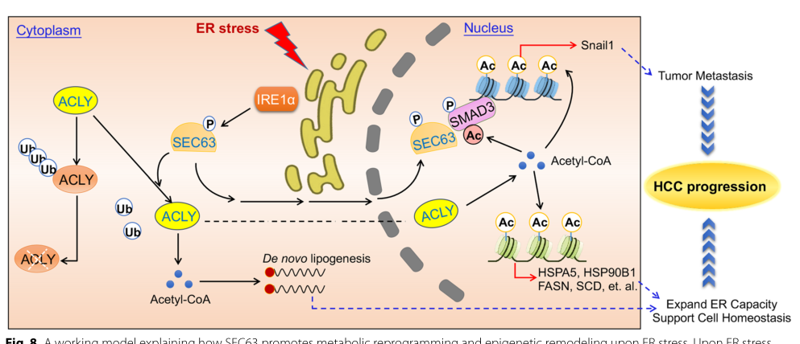

## Question

# Gene Research for Functional Annotation

## ⚠️ CRITICAL: Gene/Protein Identification Context

**BEFORE YOU BEGIN RESEARCH:** You MUST verify you are researching the CORRECT gene/protein. Gene symbols can be ambiguous, especially for less well-characterized genes from non-model organisms.

### Target Gene/Protein Identity (from UniProt):
- **UniProt Accession:** Q9UGP8
- **Protein Description:** RecName: Full=Translocation protein SEC63 homolog; AltName: Full=DnaJ homolog subfamily C member 23 {ECO:0000303|PubMed:18663603};
- **Gene Information:** Name=SEC63 {ECO:0000303|PubMed:28375157, ECO:0000312|HGNC:HGNC:21082}; Synonyms=DNAJC23 {ECO:0000303|PubMed:18663603}, SEC63L;
- **Organism (full):** Homo sapiens (Human).
- **Protein Family:** Not specified in UniProt
- **Key Domains:** C2_domain_sf. (IPR035892); DnaJ_domain. (IPR001623); Ig_E-set. (IPR014756); J_dom_sf. (IPR036869); Sec63-dom. (IPR004179)

### MANDATORY VERIFICATION STEPS:

1. **Check if the gene symbol "SEC63" matches the protein description above**
2. **Verify the organism is correct:** Homo sapiens (Human).
3. **Check if protein family/domains align with what you find in literature**
4. **If you find literature for a DIFFERENT gene with the same or similar symbol, STOP**

### If Gene Symbol is Ambiguous or You Cannot Find Relevant Literature:

**DO NOT PROCEED WITH RESEARCH ON A DIFFERENT GENE.** Instead:
- State clearly: "The gene symbol 'SEC63' is ambiguous or literature is limited for this specific protein"
- Explain what you found (e.g., "Found extensive literature on a different gene with the same symbol in a different organism")
- Describe the protein based ONLY on the UniProt information provided above
- Suggest that the protein function can be inferred from domain/family information

### Research Target:

Please provide a comprehensive research report on the gene **SEC63** (gene ID: SEC63, UniProt: Q9UGP8) in human.

The research report should be a detailed narrative explaining the function, biological processes, and localization of the gene product. Citations should be given for all claims.

You should prioritize authoritative reviews and primary scientific literature when conducting research. You can supplement
this with annotations you find in gene/protein databases, but these can be outdated or inaccurate.

We are specifically interested in the primary function of the gene - for enzymes, what reaction is catalyzed, and what is the substrate specificity? For transporters, what is the substrate? For structural proteins or adapters, what is the broader structural role? For signaling molecules, what is the role in the pathway.

We are interested in where in or outside the cell the gene product carries out its function.

We are also interested in the signaling or biochemical pathways in which the gene functions. We are less interested in broad pleiotropic effects, except where these elucidate the precise role.

Include evidence where possible. We are interested in both experimental evidence as well as inference from structure, evolution, or bioinformatic analysis. Precise studies should be prioritized over high-throughput, where available.

## Output

Question: You are an expert researcher providing comprehensive, well-cited information.

Provide detailed information focusing on:
1. Key concepts and definitions with current understanding
2. Recent developments and latest research (prioritize 2023-2024 sources)
3. Current applications and real-world implementations
4. Expert opinions and analysis from authoritative sources
5. Relevant statistics and data from recent studies

Format as a comprehensive research report with proper citations. Include URLs and publication dates where available.
Always prioritize recent, authoritative sources and provide specific citations for all major claims.

# Gene Research for Functional Annotation

## ⚠️ CRITICAL: Gene/Protein Identification Context

**BEFORE YOU BEGIN RESEARCH:** You MUST verify you are researching the CORRECT gene/protein. Gene symbols can be ambiguous, especially for less well-characterized genes from non-model organisms.

### Target Gene/Protein Identity (from UniProt):
- **UniProt Accession:** Q9UGP8
- **Protein Description:** RecName: Full=Translocation protein SEC63 homolog; AltName: Full=DnaJ homolog subfamily C member 23 {ECO:0000303|PubMed:18663603};
- **Gene Information:** Name=SEC63 {ECO:0000303|PubMed:28375157, ECO:0000312|HGNC:HGNC:21082}; Synonyms=DNAJC23 {ECO:0000303|PubMed:18663603}, SEC63L;
- **Organism (full):** Homo sapiens (Human).
- **Protein Family:** Not specified in UniProt
- **Key Domains:** C2_domain_sf. (IPR035892); DnaJ_domain. (IPR001623); Ig_E-set. (IPR014756); J_dom_sf. (IPR036869); Sec63-dom. (IPR004179)

### MANDATORY VERIFICATION STEPS:

1. **Check if the gene symbol "SEC63" matches the protein description above**
2. **Verify the organism is correct:** Homo sapiens (Human).
3. **Check if protein family/domains align with what you find in literature**
4. **If you find literature for a DIFFERENT gene with the same or similar symbol, STOP**

### If Gene Symbol is Ambiguous or You Cannot Find Relevant Literature:

**DO NOT PROCEED WITH RESEARCH ON A DIFFERENT GENE.** Instead:
- State clearly: "The gene symbol 'SEC63' is ambiguous or literature is limited for this specific protein"
- Explain what you found (e.g., "Found extensive literature on a different gene with the same symbol in a different organism")
- Describe the protein based ONLY on the UniProt information provided above
- Suggest that the protein function can be inferred from domain/family information

### Research Target:

Please provide a comprehensive research report on the gene **SEC63** (gene ID: SEC63, UniProt: Q9UGP8) in human.

The research report should be a detailed narrative explaining the function, biological processes, and localization of the gene product. Citations should be given for all claims.

You should prioritize authoritative reviews and primary scientific literature when conducting research. You can supplement
this with annotations you find in gene/protein databases, but these can be outdated or inaccurate.

We are specifically interested in the primary function of the gene - for enzymes, what reaction is catalyzed, and what is the substrate specificity? For transporters, what is the substrate? For structural proteins or adapters, what is the broader structural role? For signaling molecules, what is the role in the pathway.

We are interested in where in or outside the cell the gene product carries out its function.

We are also interested in the signaling or biochemical pathways in which the gene functions. We are less interested in broad pleiotropic effects, except where these elucidate the precise role.

Include evidence where possible. We are interested in both experimental evidence as well as inference from structure, evolution, or bioinformatic analysis. Precise studies should be prioritized over high-throughput, where available.

## Comprehensive Research Report: Human **SEC63** (UniProt **Q9UGP8**; gene **SEC63**; synonyms **DNAJC23/SEC63L**) 

### 0) Target verification and scope control (critical disambiguation)
The literature synthesized here refers to **SEC63 as an endoplasmic reticulum (ER) translocon accessory factor** that functions with **Sec62** at the **Sec61 protein-conducting channel**, and recruits/activates the ER Hsp70 chaperone **BiP** via a **J-domain**. This functional identity matches the UniProt-provided description “Translocation protein SEC63 homolog / DnaJ homolog subfamily C member 23” in **Homo sapiens** (UniProt Q9UGP8). The name “Sec63” is also used for the **yeast** ortholog; yeast structural/biochemical insights are treated as conserved mechanistic context and are not used to redefine the human target (shao2023proteinbiosynthesisat pages 1-2, itskanov2022gatingofsec61 pages 10-13).

### 1) Key concepts and definitions (current understanding)

#### 1.1 The Sec61 translocon and its accessory factors
A major fraction of the eukaryotic proteome is synthesized into/through the ER, requiring the conserved **Sec61 translocon** for polypeptide translocation into the ER lumen and membrane integration of transmembrane segments. In addition to Sec61, **partner/accessory complexes** tune substrate engagement, channel gating, and coupling to folding/processing (itskanov2023mechanismofprotein pages 1-3).

Within this framework, **SEC63** is best understood as a **regulatory/co-chaperone component of the ER translocation machinery** rather than an enzyme: it helps certain classes of nascent or posttranslational substrates productively enter the ER by controlling Sec61 gating and by coupling translocation to luminal chaperone function (shao2023proteinbiosynthesisat pages 1-2, sun2022signalsequencesencode pages 1-2).

#### 1.2 The Sec62/Sec63 complex
SEC63 acts as a core functional unit of a **Sec62/Sec63 accessory complex** associated with Sec61. A central concept is that Sec62/Sec63 can act as a “dynamic brace” that **fully opens the Sec61 lateral gate**, which may lower the energetic barrier for “nonoptimal” signal sequences to initiate translocation (shao2023proteinbiosynthesisat pages 1-2). This differentiates Sec62/Sec63 from some other Sec61 partners that more modestly “prime” the channel (shao2023proteinbiosynthesisat pages 1-2).

#### 1.3 J-domain proteins and BiP recruitment (co-chaperone mechanism)
SEC63 contains a **J-domain** (a defining feature of DnaJ/Hsp40 co-chaperones) used to recruit and stimulate the ATPase activity of the ER-resident Hsp70 chaperone **BiP**. In mechanistic models, BiP binding to the translocating chain supports forward movement and prevents backsliding (Brownian ratchet concept), thereby helping completion of translocation, particularly for difficult substrates (shao2023proteinbiosynthesisat pages 1-2, itskanov2022gatingofsec61 pages 10-13).

### 2) Molecular function, processes, and localization of SEC63

#### 2.1 Subcellular localization: ER translocation sites
SEC63 functions at the **ER membrane** as a **translocon-associated factor** working at Sec61 translocation sites (shao2023proteinbiosynthesisat pages 1-2, sun2022signalsequencesencode pages 1-2, gemmer2020aclearerpicture pages 1-2). In mammalian cells, Sec63 can be recruited to stalled/paused translocation sites driven by substrate features (sun2022signalsequencesencode pages 1-2).

#### 2.2 Primary function: enabling ER import of “difficult” substrates by gating + chaperone coupling
Multiple lines of evidence support a unified functional model:

1) **Sec61 gating/lateral gate regulation:** Sec62/Sec63 can promote strongly opened conformations of Sec61 that facilitate initiation/continuation of translocation for clients that otherwise engage poorly (shao2023proteinbiosynthesisat pages 1-2).

2) **BiP recruitment/activation via J-domain:** Sec63 recruits/activates BiP, linking channel gating with luminal chaperone binding to client chains (shao2023proteinbiosynthesisat pages 1-2, sun2022signalsequencesencode pages 1-2).

3) **Substrate selectivity rules:** substrates that depend on Sec62/Sec63/BiP often carry **weak or slowly gating signal peptides**. In a proteomics-driven study in human cells, Sec62/Sec63 clients shared signal peptides with **longer but less hydrophobic H-regions** and **lower C-region polarity**, and dependence could be enhanced by **downstream positively charged clusters** that disrupt translocation (schorr2019proteomicsidentifiessignal pages 14-17). In an independent mechanistic study, marginally hydrophobic signal sequences or transmembrane domains caused **translocation pausing at Sec61** until Sec63-mediated BiP engagement released the pause and also promoted correct folding (sun2022signalsequencesencode pages 1-2).

#### 2.3 High-confidence mechanistic evidence from mutational tests
In a human-cell–based functional rescue framework, mutating the conserved **HPD motif** in Sec63’s J-domain (H132Q) abolished productive BiP interaction and failed to rescue Sec63 depletion phenotypes for a Sec63-dependent client, providing direct functional evidence that the **J-domain–BiP axis is essential** for Sec63-dependent import (schorr2019proteomicsidentifiessignal pages 10-14).

### 3) Recent developments and latest research (prioritizing 2023–2024)

#### 3.1 2023: Conceptual synthesis on accessory factor specificity at the ER
A 2023 Perspective emphasized that assigning specific roles to many Sec61 accessory factors has been challenging, and highlighted Sec63 as a key accessory that (i) **holds the Sec61 lateral gate open** and (ii) **recruits BiP through its J-domain**, preventing backsliding and enabling posttranslational import and certain hard-to-translocate substrates (shao2023proteinbiosynthesisat pages 1-2). This provides an authoritative, up-to-date conceptual framing.

#### 3.2 2023: SEC63 as a stress-responsive signaling node in cancer (non-canonical roles)
A notable 2023 study in hepatocellular carcinoma (HCC) reported that SEC63 is not only a translocon component but also participates in ER-stress–driven **metabolic and epigenetic reprogramming**:
- Under ER stress, the **IRE1α pathway phosphorylates SEC63 at T537**, contributing to SEC63 activation (hu2023activationofacly pages 1-2).
- SEC63 interacts with and stabilizes **ACLY (ATP-citrate lyase)**; ER stress failed to induce ACLY in SEC63-depleted cells (hu2023activationofacly pages 5-7).
- The authors propose that SEC63 can enter the nucleus to increase nuclear acetyl-CoA and modulate UPR targets and pro-metastatic gene expression (e.g., Snail1) (hu2023activationofacly pages 1-2).

The proposed mechanistic model is summarized visually in their schematic (hu2023activationofacly media c14c9d30).

#### 3.3 2024: Quantitative cohort genetics of severe polycystic liver disease (PLD)
A 2024 cohort study from Japan provides recent, directly actionable clinical genetics statistics for severe PLD. The investigators recruited **49** patients with severe PLD (defined as **height-adjusted total liver volume (hTLV) > 1800 mL/m**) and performed whole-exome sequencing; **44/49 (90%)** had pathogenic or suspected pathogenic variants in polycystic disease genes. Within the genetically defined cases (n=44), **SEC63 accounted for 1/44 (2%)** (mizuno2024geneticanalysisof pages 1-2). This study also provides quantitative phenotype comparisons between ADPKD and ADPLD genetic groups (e.g., hTLV ranges and kidney volume differences) (mizuno2024geneticanalysisof pages 1-2).

### 4) Current applications and real-world implementations

#### 4.1 Clinical genetics: SEC63 in diagnostic evaluation of cystic liver disease
SEC63 is established as a causative gene for **autosomal dominant polycystic liver disease (ADPLD)** and is used in the **gene list** considered in diagnostic genetic evaluation of PLD/ADPLD. In the 2024 severe-PLD cohort study, whole-exome sequencing was performed with rare-variant filtering (gnomAD MAF threshold), ACMG-based adjudication, and qPCR validation for suspected large deletions, representing a realistic clinical-research diagnostic pipeline in tertiary care settings (mizuno2024geneticanalysisof pages 1-2). 

A 2016 study of hepatic cyst tissue genetics states that known ADPLD genes including **SEC63** together with PRKCSH and LRP5 account for roughly **~25%** of ADPLD cases (wills2016chromosomalabnormalitiesin pages 1-2), supporting SEC63’s continued inclusion in testing panels.

#### 4.2 Tumor biology: SEC63 as a candidate biomarker/axis for therapy development in HCC
In HCC, SEC63 upregulation and its correlation with ACLY are proposed as prognostic features, and the IRE1α–SEC63–ACLY axis is presented as therapeutically relevant (hu2023activationofacly pages 1-2). Although this remains preclinical/observational in the presented evidence, it is a concrete example of SEC63’s potential use beyond rare genetic liver disease.

### 5) Expert opinions and analysis (authoritative sources)

Authoritative synthesis emphasizes that:
- The ER translocon is a **dynamic hub** whose accessory factors are essential to produce a high-fidelity secretory/membrane proteome; however, many accessory factors have historically been hard to assign precise functions to (shao2023proteinbiosynthesisat pages 1-2).
- Sec62/Sec63 and BiP provide a mechanistic solution for substrates with **nonoptimal signal sequences**, via a combination of **channel gating** and **luminal chaperone-driven directionality** (shao2023proteinbiosynthesisat pages 1-2).
- A key emerging principle is that substrate features (e.g., signal sequence hydrophobicity and downstream charges) determine which accessory mechanisms are engaged, rather than a one-size-fits-all translocon (schorr2019proteomicsidentifiessignal pages 14-17, sun2022signalsequencesencode pages 1-2).

### 6) Relevant statistics and quantitative findings

#### 6.1 Severe PLD cohort (2024): SEC63 frequency and phenotype metrics
In Mizuno et al. (Kidney360, accepted Apr 25 2024; published online May 1 2024), among 49 severe-PLD patients (hTLV > 1800 mL/m), the distribution among genetically solved cases (n=44) included SEC63 in **1/44 (2%)**. ADPLD-related genes collectively represented **20%** of this severe-PLD cohort’s genetically defined cases (mizuno2024geneticanalysisof pages 1-2).

#### 6.2 Cyst tissue LOH analysis (2016): SEC63 two-hit evidence appears less frequent
In Wills et al. (EJHG, Aug 2016), somatic loss of heterozygosity (LOH) in hepatic cyst epithelium appeared much less frequent for SEC63-associated cysts compared with PRKCSH or PKD genes; LOH for SEC63 was reported as **1/14 cysts (7%)** in the excerpted analysis (wills2016chromosomalabnormalitiesin pages 1-2). This suggests that the “second-hit” mechanism may be less commonly observed/detectable for SEC63 than for some other cystic disease genes, with implications for how informative cyst tissue genotyping is.

#### 6.3 HCC translational data (2023): clinical cohort size and preclinical intervention
Hu et al. (J Exp Clin Cancer Res, May 2023) report IHC analysis of **139 HCC samples** and show that ACLY high expression predicts worse survival; mechanistically, SEC63 stabilizes ACLY under ER stress. They also report a mouse metastasis model (tail-vein injection; **n=6 per group**) where treatment with an ACLY inhibitor (ETC1002) reduced metastasis, illustrating a potential intervention point downstream of SEC63 (hu2023activationofacly pages 5-7).

### 7) Evidence map (table)
The following evidence table summarizes SEC63’s core functions, mechanisms, disease associations, and recent 2023–2024 developments with DOIs/URLs and dates.

| Aspect | Key points | Evidence type (review/primary) | Key source (authors, year) | DOI/URL | Publication date (month/year) |
|---|---|---|---|---|---|
| Target identity / disambiguation | Human **SEC63** corresponds to the ER translocon accessory factor described in the literature as part of the **Sec62/Sec63** complex acting on **Sec61**; this matches the UniProt entry **Q9UGP8** (synonyms **DNAJC23/SEC63L** supplied by user context). Literature should be distinguished from yeast Sec63 mechanistic studies, which are informative but not direct human identity evidence (shao2023proteinbiosynthesisat pages 1-2, itskanov2023mechanismofprotein pages 1-3). | Review + mechanistic context | Shao, 2023; Itskanov & Park, 2023 | https://doi.org/10.1091/mbc.e21-09-0451 ; https://doi.org/10.1101/cshperspect.a041250 | 01/2023; 08/2023 |
| Subcellular localization | SEC63 functions at the **endoplasmic reticulum (ER) membrane**, associated with the **Sec61 translocon**; mammalian Sec63 is described as a translocon-associated factor recruited at ER translocation sites (sun2022signalsequencesencode pages 1-2, shao2023proteinbiosynthesisat pages 1-2, gemmer2020aclearerpicture pages 1-2). | Review + primary | Sun et al., 2022; Shao, 2023; Gemmer & Förster, 2020 | https://doi.org/10.1083/jcb.202203070 ; https://doi.org/10.1091/mbc.e21-09-0451 ; https://doi.org/10.1242/jcs.231340 | 06/2022; 01/2023; 02/2020 |
| Core molecular function | SEC63 is a **Sec61 accessory factor** that promotes protein import into the ER as part of the **Sec62/Sec63 complex**. Its role is not enzymatic catalysis but **channel regulation/chaperone coupling** during translocation and early folding (shao2023proteinbiosynthesisat pages 1-2, gemmer2020aclearerpicture pages 1-2). | Review | Shao, 2023; Gemmer & Förster, 2020 | https://doi.org/10.1091/mbc.e21-09-0451 ; https://doi.org/10.1242/jcs.231340 | 01/2023; 02/2020 |
| Key interacting partners | Main partners are **Sec61**, **Sec62**, and luminal **BiP/HSPA5**. Sec63 forms a Sec62/Sec63 assembly with Sec61 and recruits BiP through its **J-domain**, coupling channel gating to lumenal chaperone action (schorr2019proteomicsidentifiessignal pages 10-14, shao2023proteinbiosynthesisat pages 1-2, zimmermann2025rulesofengagement pages 32-33). | Review + primary | Schorr et al., 2019; Shao, 2023 | https://doi.org/10.1101/867762 ; https://doi.org/10.1091/mbc.e21-09-0451 | 12/2019; 01/2023 |
| J-domain / BiP mechanism | SEC63 contains a **J-domain** that recruits and activates **BiP ATPase**; mutation of the conserved **HPD motif** abolishes productive BiP interaction and fails to rescue Sec63-dependent import defects. BiP then helps drive forward translocation and prevent backsliding (schorr2019proteomicsidentifiessignal pages 10-14, shao2023proteinbiosynthesisat pages 1-2, sun2022signalsequencesencode pages 1-2, itskanov2022gatingofsec61 pages 10-13). | Primary + review | Schorr et al., 2019; Sun et al., 2022; Shao, 2023 | https://doi.org/10.1101/867762 ; https://doi.org/10.1083/jcb.202203070 ; https://doi.org/10.1091/mbc.e21-09-0451 | 12/2019; 06/2022; 01/2023 |
| Sec61 gating / lateral gate opening | Structural and mechanistic work supports a model in which **Sec62/Sec63 fully opens or strongly braces open the Sec61 lateral gate**, lowering the energetic barrier for nonoptimal clients to initiate translocation (shao2023proteinbiosynthesisat pages 1-2, schorr2019proteomicsidentifiessignal pages 17-20, zimmermann2025rulesofengagement pages 32-33). | Review + mechanistic synthesis | Shao, 2023; Schorr et al., 2019 | https://doi.org/10.1091/mbc.e21-09-0451 ; https://doi.org/10.1101/867762 | 01/2023; 12/2019 |
| Substrate selectivity | SEC63-dependent substrates are enriched for **weak/slowly gating signal peptides**, often with **longer but less hydrophobic H-regions**, **lower C-region polarity**, and sometimes **downstream positive charge clusters** that disrupt efficient translocation without Sec62/Sec63/BiP assistance (schorr2019proteomicsidentifiessignal pages 14-17, sun2022signalsequencesencode pages 1-2). | Primary | Schorr et al., 2019; Sun et al., 2022 | https://doi.org/10.1101/867762 ; https://doi.org/10.1083/jcb.202203070 | 12/2019; 06/2022 |
| Example functional clients / pathway context | In human cells, **ERj3** is a validated Sec63/Sec62/BiP-dependent client; depletion of Sec63 causes **pre-ERj3 accumulation** and impaired mature ERj3 formation, supporting a direct role in selective ER import and folding coordination (schorr2019proteomicsidentifiessignal pages 10-14, schorr2019proteomicsidentifiessignal pages 14-17). | Primary | Schorr et al., 2019 | https://doi.org/10.1101/867762 | 12/2019 |
| Biological process linkage | SEC63 links **protein translocation** with **protein folding/quality control** by matching weak signal-sequence clients to local BiP availability; stronger signal sequences can bypass Sec63/BiP dependence but may misfold when BiP is limiting (sun2022signalsequencesencode pages 1-2). | Primary | Sun et al., 2022 | https://doi.org/10.1083/jcb.202203070 | 06/2022 |
| Disease association: ADPLD | Germline **SEC63** variants are a recognized cause of **autosomal dominant polycystic liver disease (ADPLD)**; ADPLD genes encode ER proteins and are thought to reduce functional polycystin-1 dosage in liver/kidney cystogenesis (mizuno2024geneticanalysisof pages 1-2, hu2023activationofacly pages 1-2). | Cohort study + disease background | Mizuno et al., 2024; Hu et al., 2023 | https://doi.org/10.34067/KID.0000000000000461 ; https://doi.org/10.1186/s13046-023-02656-7 | 05/2024; 05/2023 |
| Quantitative disease statistics | In a **2024 severe PLD cohort from Japan**, **49** patients were enrolled; **44/49 (90%)** had pathogenic/suspected pathogenic variants. Among genetically solved cases, **SEC63 accounted for 1/44 (2%)**; non-PKD1/PKD2 ADPLD genes collectively accounted for **9/44 (20%)**. Severe PLD was defined as **hTLV >1800 mL/m** (mizuno2024geneticanalysisof pages 1-2, mizuno2024geneticanalysisof pages 2-3). | Primary cohort study | Mizuno et al., 2024 | https://doi.org/10.34067/KID.0000000000000461 | 05/2024 |
| Cohort phenotype details | In the same cohort, median **hTLV** did not differ significantly between genetically defined ADPKD and ADPLD groups: **4431 mL** (range 1817–9148) vs **3437 mL** (range 1860–8211), **P = 0.77**; height-adjusted kidney volume was larger in ADPKD (**607 vs 179 mL/m, P < 0.01**) (mizuno2024geneticanalysisof pages 1-2, mizuno2024geneticanalysisof pages 2-3). | Primary cohort study | Mizuno et al., 2024 | https://doi.org/10.34067/KID.0000000000000461 | 05/2024 |
| Non-canonical role in cancer stress adaptation | In hepatocellular carcinoma, SEC63 was reported as a regulator of **metabolic reprogramming under ER stress**, extending beyond canonical translocon function. Upon ER stress, SEC63 supports **ACLY** stabilization, increasing **acetyl-CoA** and lipogenesis to improve ER capacity (hu2023activationofacly pages 1-2, hu2023activationofacly pages 5-7). | Primary | Hu et al., 2023 | https://doi.org/10.1186/s13046-023-02656-7 | 05/2023 |
| IRE1α phosphorylation / T537 | Hu et al. report that the **IRE1α pathway phosphorylates SEC63 at T537** during ER stress, contributing to SEC63 activation; SEC63 protein abundance changed little, implying regulation mainly by post-translational modification (hu2023activationofacly pages 1-2, hu2023activationofacly pages 5-7). | Primary | Hu et al., 2023 | https://doi.org/10.1186/s13046-023-02656-7 | 05/2023 |
| ACLY interaction details | SEC63 physically interacts with **ACLY**; the interaction increases with ER stress, depends on the **SEC63 C-terminus**, and maps on ACLY to the **CoA-ligase domain**. ER stress failed to induce ACLY in SEC63-depleted cells (hu2023activationofacly pages 5-7). | Primary | Hu et al., 2023 | https://doi.org/10.1186/s13046-023-02656-7 | 05/2023 |
| Nuclear / epigenetic role | Under ER stress, SEC63 was reported to **enter the nucleus**, where SEC63 and ACLY raise **nuclear acetyl-CoA**, increase UPR target expression, and promote **Snail1** expression through epigenetic regulation, supporting metastasis (hu2023activationofacly pages 1-2, hu2023activationofacly media c14c9d30). | Primary + model figure | Hu et al., 2023 | https://doi.org/10.1186/s13046-023-02656-7 | 05/2023 |
| Clinical relevance in HCC | SEC63 expression was reported as **upregulated in HCC tissues**, positively correlated with ACLY, and associated with **unfavorable prognosis**; the authors propose the **IRE1α–SEC63–ACLY axis** as a therapeutic concept in HCC (hu2023activationofacly pages 1-2). | Primary | Hu et al., 2023 | https://doi.org/10.1186/s13046-023-02656-7 | 05/2023 |

*Table: This table summarizes the validated identity, ER-translocon function, interacting partners, disease associations, and emerging cancer-related roles of human SEC63. It is useful as a compact evidence map linking canonical translocation biology with recent 2023-2024 disease and stress-response findings.*

### 8) Key mechanistic schematic (visual evidence)
Hu et al. provide a schematic model of the ER-stress–responsive **IRE1α–SEC63–ACLY** pathway, including SEC63 phosphorylation and nuclear effects driving metastasis-related transcriptional regulation (hu2023activationofacly media c14c9d30).

### 9) Limitations and evidence gaps (important for functional annotation)
- **Direct mention of UniProt accession Q9UGP8 / synonym DNAJC23** is not present in the retrieved full-text excerpts; mapping is therefore based on the strong match between UniProt description and the canonical Sec63 translocon co-chaperone function documented in multiple independent sources (shao2023proteinbiosynthesisat pages 1-2, sun2022signalsequencesencode pages 1-2).
- Much detailed structural topology and some mechanistic details are derived from conserved/yeast-centric structural work summarized in reviews, though mammalian functional studies strongly support the same core mechanism (shao2023proteinbiosynthesisat pages 1-2, sun2022signalsequencesencode pages 1-2, gemmer2020aclearerpicture pages 1-2).
- The HCC findings represent a **non-canonical role** and remain largely preclinical/biomarker-level evidence in the provided excerpts; clinical validation and therapeutic translation are not yet established in trials in the retrieved materials (hu2023activationofacly pages 1-2).

References

1. (shao2023proteinbiosynthesisat pages 1-2): Sichen Shao. Protein biosynthesis at the er: finding the right accessories. Jan 2023. URL: https://doi.org/10.1091/mbc.e21-09-0451, doi:10.1091/mbc.e21-09-0451. This article has 6 citations and is from a domain leading peer-reviewed journal.

2. (itskanov2022gatingofsec61 pages 10-13): S Itskanov. Gating of sec61 in posttranslational translocation across the endoplasmic reticulum. Unknown journal, 2022.

3. (itskanov2023mechanismofprotein pages 1-3): Samuel Itskanov and Eunyong Park. Mechanism of protein translocation by the sec61 translocon complex. Cold Spring Harbor perspectives in biology, 15:a041250, Aug 2023. URL: https://doi.org/10.1101/cshperspect.a041250, doi:10.1101/cshperspect.a041250. This article has 66 citations and is from a peer-reviewed journal.

4. (sun2022signalsequencesencode pages 1-2): Sha Sun, Xia Li, and Malaiyalam Mariappan. Signal sequences encode information for protein folding in the endoplasmic reticulum. The Journal of Cell Biology, Jun 2022. URL: https://doi.org/10.1083/jcb.202203070, doi:10.1083/jcb.202203070. This article has 25 citations.

5. (gemmer2020aclearerpicture pages 1-2): Max Gemmer and Friedrich Förster. A clearer picture of the er translocon complex. Journal of Cell Science, Feb 2020. URL: https://doi.org/10.1242/jcs.231340, doi:10.1242/jcs.231340. This article has 144 citations and is from a domain leading peer-reviewed journal.

6. (schorr2019proteomicsidentifiessignal pages 14-17): Stefan Schorr, Duy Nguyen, Sarah Haßdenteufel, Nagarjuna Nagaraj, Adolfo Cavalié, Markus Greiner, Petra Weissgerber, Marisa Loi, Adrienne W. Paton, James C. Paton, Maurizio Molinari, Friedrich Förster, Johanna Dudek, Sven Lang, Volkhard Helms, and Richard Zimmermann. Proteomics identifies signal peptide features determining the substrate specificity in human sec62/sec63-dependent er protein import. bioRxiv, Dec 2019. URL: https://doi.org/10.1101/867762, doi:10.1101/867762. This article has 11 citations.

7. (schorr2019proteomicsidentifiessignal pages 10-14): Stefan Schorr, Duy Nguyen, Sarah Haßdenteufel, Nagarjuna Nagaraj, Adolfo Cavalié, Markus Greiner, Petra Weissgerber, Marisa Loi, Adrienne W. Paton, James C. Paton, Maurizio Molinari, Friedrich Förster, Johanna Dudek, Sven Lang, Volkhard Helms, and Richard Zimmermann. Proteomics identifies signal peptide features determining the substrate specificity in human sec62/sec63-dependent er protein import. bioRxiv, Dec 2019. URL: https://doi.org/10.1101/867762, doi:10.1101/867762. This article has 11 citations.

8. (hu2023activationofacly pages 1-2): Chenyu Hu, Zechang Xin, Xiaoyan Sun, Yang Hu, Chunfeng Zhang, Rui Yan, Yuying Wang, Min Lu, Jing Huang, Xiaojuan Du, Baocai Xing, and Xiaofeng Liu. Activation of acly by sec63 deploys metabolic reprogramming to facilitate hepatocellular carcinoma metastasis upon endoplasmic reticulum stress. Journal of Experimental & Clinical Cancer Research : CR, May 2023. URL: https://doi.org/10.1186/s13046-023-02656-7, doi:10.1186/s13046-023-02656-7. This article has 58 citations.

9. (hu2023activationofacly pages 5-7): Chenyu Hu, Zechang Xin, Xiaoyan Sun, Yang Hu, Chunfeng Zhang, Rui Yan, Yuying Wang, Min Lu, Jing Huang, Xiaojuan Du, Baocai Xing, and Xiaofeng Liu. Activation of acly by sec63 deploys metabolic reprogramming to facilitate hepatocellular carcinoma metastasis upon endoplasmic reticulum stress. Journal of Experimental & Clinical Cancer Research : CR, May 2023. URL: https://doi.org/10.1186/s13046-023-02656-7, doi:10.1186/s13046-023-02656-7. This article has 58 citations.

10. (hu2023activationofacly media c14c9d30): Chenyu Hu, Zechang Xin, Xiaoyan Sun, Yang Hu, Chunfeng Zhang, Rui Yan, Yuying Wang, Min Lu, Jing Huang, Xiaojuan Du, Baocai Xing, and Xiaofeng Liu. Activation of acly by sec63 deploys metabolic reprogramming to facilitate hepatocellular carcinoma metastasis upon endoplasmic reticulum stress. Journal of Experimental & Clinical Cancer Research : CR, May 2023. URL: https://doi.org/10.1186/s13046-023-02656-7, doi:10.1186/s13046-023-02656-7. This article has 58 citations.

11. (mizuno2024geneticanalysisof pages 1-2): Hiroki Mizuno, Whitney Besse, Akinari Sekine, Kelly T. Long, Shigekazu Kurihara, Yuki Oba, Masayuki Yamanouchi, Eiko Hasegawa, Tatsuya Suwabe, Naoki Sawa, Yoshifumi Ubara, Stefan Somlo, and Junichi Hoshino. Genetic analysis of severe polycystic liver disease in japan. Kidney360, 5:1106-1115, May 2024. URL: https://doi.org/10.34067/kid.0000000000000461, doi:10.34067/kid.0000000000000461. This article has 1 citations and is from a peer-reviewed journal.

12. (wills2016chromosomalabnormalitiesin pages 1-2): Edgar S Wills, Wybrich R Cnossen, Joris A Veltman, Rob Woestenenk, Marloes Steehouwer, Jody Salomon, René H M te Morsche, Meritxell Huch, Jayne Y Hehir-Kwa, Martijn J Banning, Rolph Pfundt, Ronald Roepman, Alexander Hoischen, and Joost P H Drenth. Chromosomal abnormalities in hepatic cysts point to novel polycystic liver disease genes. European Journal of Human Genetics, 24:1707-1714, Aug 2016. URL: https://doi.org/10.1038/ejhg.2016.97, doi:10.1038/ejhg.2016.97. This article has 22 citations and is from a domain leading peer-reviewed journal.

13. (zimmermann2025rulesofengagement pages 32-33): Richard Zimmermann. Rules of engagement for components of membrane protein biogenesis at the human endoplasmic reticulum. Sep 2025. URL: https://doi.org/10.3390/ijms26188823, doi:10.3390/ijms26188823. This article has 2 citations.

14. (schorr2019proteomicsidentifiessignal pages 17-20): Stefan Schorr, Duy Nguyen, Sarah Haßdenteufel, Nagarjuna Nagaraj, Adolfo Cavalié, Markus Greiner, Petra Weissgerber, Marisa Loi, Adrienne W. Paton, James C. Paton, Maurizio Molinari, Friedrich Förster, Johanna Dudek, Sven Lang, Volkhard Helms, and Richard Zimmermann. Proteomics identifies signal peptide features determining the substrate specificity in human sec62/sec63-dependent er protein import. bioRxiv, Dec 2019. URL: https://doi.org/10.1101/867762, doi:10.1101/867762. This article has 11 citations.

15. (mizuno2024geneticanalysisof pages 2-3): Hiroki Mizuno, Whitney Besse, Akinari Sekine, Kelly T. Long, Shigekazu Kurihara, Yuki Oba, Masayuki Yamanouchi, Eiko Hasegawa, Tatsuya Suwabe, Naoki Sawa, Yoshifumi Ubara, Stefan Somlo, and Junichi Hoshino. Genetic analysis of severe polycystic liver disease in japan. Kidney360, 5:1106-1115, May 2024. URL: https://doi.org/10.34067/kid.0000000000000461, doi:10.34067/kid.0000000000000461. This article has 1 citations and is from a peer-reviewed journal.

## Artifacts

- [Edison artifact artifact-00](SEC63-deep-research-falcon_artifacts/artifact-00.md)

## Citations

1. itskanov2023mechanismofprotein pages 1-3
2. shao2023proteinbiosynthesisat pages 1-2
3. sun2022signalsequencesencode pages 1-2
4. schorr2019proteomicsidentifiessignal pages 14-17
5. schorr2019proteomicsidentifiessignal pages 10-14
6. hu2023activationofacly pages 1-2
7. hu2023activationofacly pages 5-7
8. mizuno2024geneticanalysisof pages 1-2
9. wills2016chromosomalabnormalitiesin pages 1-2
10. gemmer2020aclearerpicture pages 1-2
11. zimmermann2025rulesofengagement pages 32-33
12. schorr2019proteomicsidentifiessignal pages 17-20
13. mizuno2024geneticanalysisof pages 2-3
14. https://doi.org/10.1091/mbc.e21-09-0451
15. https://doi.org/10.1101/cshperspect.a041250
16. https://doi.org/10.1083/jcb.202203070
17. https://doi.org/10.1242/jcs.231340
18. https://doi.org/10.1101/867762
19. https://doi.org/10.34067/KID.0000000000000461
20. https://doi.org/10.1186/s13046-023-02656-7
21. https://doi.org/10.1091/mbc.e21-09-0451,
22. https://doi.org/10.1101/cshperspect.a041250,
23. https://doi.org/10.1083/jcb.202203070,
24. https://doi.org/10.1242/jcs.231340,
25. https://doi.org/10.1101/867762,
26. https://doi.org/10.1186/s13046-023-02656-7,
27. https://doi.org/10.34067/kid.0000000000000461,
28. https://doi.org/10.1038/ejhg.2016.97,
29. https://doi.org/10.3390/ijms26188823,